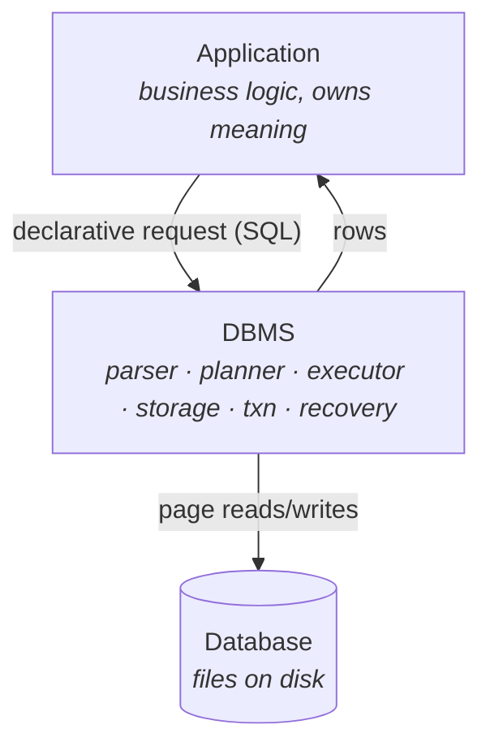
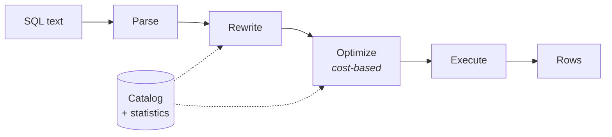

# Lecture 1 — Databases and Database Management Systems

*Map reference: I.A. Sources: CMU 01; DI 1; PG 1.*

---

## 1. Three things people call "the database"

Precision here prevents confusion for the rest of the course.

- **Database** — an organized collection of data modeling some part of the real world. It is *inert*. It is bytes.
- **DBMS** — the software that defines, stores, retrieves, protects, and manages that data. It is the *active* component.
- **Database application** — the program that issues requests. It owns business meaning; it does not own storage.

**The defining properties of a database** — the reason this is not just "a file":

- **Persistence** — survives process exit, and survives crashes.
- **Sharing** — many concurrent users, one authoritative copy.
- **Self-description** — the data carries its own schema, stored in the database itself.
- **Managed access** — nobody touches the bytes except through the DBMS.

The last one is the load-bearing property. Every guarantee below follows from the DBMS holding a monopoly on writes.

---

## 2. The DBMS's five responsibilities

### 2.1 Data definition and schema management

- Accepts DDL; records the resulting definitions in the **system catalog**.
- The catalog is itself stored as ordinary tables — the database describes itself.
- Provides **data independence**, in three layers:
  - *Physical* — change the file layout, indexes, or compression; queries still work.
  - *Logical* — add a column; existing queries still work.
  - *View-level* — different users see different logical shapes of the same data.
- Data independence is the whole reason a 1985 query still runs on a 2026 storage engine.

### 2.2 Storage, retrieval, and modification

- Chooses **physical layout**: pages, tuple format, alignment, out-of-line storage.
- Chooses **access paths**: sequential scan, index scan, bitmap scan.
- The application says *what*, never *where*. It never names a file, offset, or index.

### 2.3 Integrity

- Constraints are declared **once, centrally** — not re-implemented in each of the nine services that write to the table.
- Enforced on every path, including the DBA's `psql` session at 2 a.m.
- Kinds: domain/type, `NOT NULL`, `CHECK`, `UNIQUE`, `PRIMARY KEY`, `FOREIGN KEY`.
- **Key distinction:** the DBMS enforces *declared* constraints. Application-level invariants ("a refund must not exceed the original charge") are only enforced if you declare them. "Consistency" in ACID means "the DBMS preserves what you declared," not "your data is meaningful."

### 2.4 Concurrency and durability

- **Isolation** — each transaction gets the illusion of running alone, without the application coordinating anything.
- **Atomicity** — all-or-nothing, across both aborts and crashes.
- **Durability** — once commit returns, the effect survives power loss.
- These are covered in depth later; note now that they are *services*, not application responsibilities.

### 2.5 Query processing and optimization

- Accepts a **declarative** query: a specification of the result, not a procedure.
- Compiles it into a physical plan using catalog statistics and a cost model.
- The payoff of declarativity: the DBMS can pick a *different* plan tomorrow — when the table has grown, an index appeared, or the data skewed — with no application change.

---

## 3. The motivating counterexample: flat files

Assume no DBMS. Application data lives in CSV files, managed by application code. This is the design every one of the above features was invented to fix.

**Scenario.** A ticketing system. `events.csv` and `bookings.csv`. Multiple app servers. Let us walk the failures.

### 3.1 Integrity and consistency failures

- **No type or domain enforcement.** A field intended as an integer accepts `"N/A"`, `""`, `"12 "`. The parser in service A tolerates it; service B crashes.
- **No referential guarantees.** `bookings.csv` references event `4471`; nothing prevents deleting that row from `events.csv`. The reference dangles silently.
- **No uniqueness.** Two rows claim booking ID `9`. Nothing noticed at write time; you discover it during a reconciliation three weeks later.
- **Redundancy and update anomalies.** Venue name is duplicated into every booking row for convenience. The venue is renamed. Now you must find and rewrite every copy — atomically, which you cannot do. You end up with both names in the data, and no way to tell which is current.

### 3.2 Access and engineering failures

- **Every point lookup is a full scan.** "Find booking 9" reads the entire file. Cost is `O(n)` in file size, with no way to improve it short of building an index — which means writing, and maintaining, an index.
- **Every application reimplements the same machinery.** Parsing, type coercion, indexing, locking, and crash cleanup get written once per service, each subtly different. Bugs are per-service and do not transfer.
- **Query logic is procedural and frozen.** "Bookings for events at venue X, sorted by date" is a hand-written nested loop. Change the access pattern and you rewrite the loop. There is no optimizer to reconsider it as data grows.

### 3.3 Concurrency and crash failures

- **Lost updates.** Two servers read the same row, each modifies its own copy, each writes back. The second write silently erases the first. Nothing detects this.
- **Readers see torn state.** A reader scanning the file mid-write observes half-old, half-new content — a state that never logically existed.
- **Partial writes on crash.** The process dies mid-write. The file now ends mid-record. There is no log, so there is no way to know what the intended final state was — you cannot even distinguish "crashed during write" from "file was always like that."
- **No unit of work.** Debiting a balance and crediting another are two separate file writes. A crash between them leaves money destroyed. The concept of "both or neither" does not exist at the filesystem layer.

### 3.4 The general lesson

- Each individual problem has a hack. Combining the hacks — indexes *and* concurrency *and* crash safety *and* constraints, all at once, all correct — is precisely the problem a DBMS solves.
- The hard part is never any one feature. It is that the features interact. An index must be crash-safe, and updated under concurrency, and consistent with constraints, and visible to the optimizer.
- **A DBMS is what a sufficiently long-lived flat-file layer becomes** — just built once, by people who did it full time.

---

## 4. What you trade away

An honest accounting; a DBMS is not free.

- **Loss of direct control.** You cannot dictate the physical plan. You influence it (indexes, statistics, settings) and the optimizer decides.
- **Generality tax.** A purpose-built structure for one access pattern will beat a general engine on that pattern.
- **Operational surface.** Backups, upgrades, vacuum, replication, connection management, tuning — real ongoing cost.
- **Impedance mismatch.** The relational model is not your object model; something must translate.

**When a full DBMS is genuinely wrong:** append-only logs consumed sequentially; ephemeral caches; single-writer embedded workloads (use SQLite — an embedded DBMS, still a DBMS); bulk immutable analytics files (Parquet).

---

## 5. PostgreSQL grounding

Concrete anchors to carry forward:

- One **cluster** = one data directory, many **databases**, each with **schemas**, each with relations.
- Every relation is one or more files under `base/<database_oid>/`, segmented at 1 GB.
- The catalog is `pg_class`, `pg_attribute`, `pg_type`, … — queryable with ordinary SQL, which is the self-description property made literal.
- One **process per connection**, plus a shared-memory buffer pool and background processes (checkpointer, WAL writer, autovacuum).

**Lab exercise.** Create a table, then find its physical file — `SELECT pg_relation_filepath('t');`. Read its definition out of the catalog rather than from `\d`. Confirm you can do everything `\d` does with plain `SELECT`s against `pg_class` and `pg_attribute`.

---

## 6. Takeaways

- A DBMS exists because **correctness under concurrency and failure is not composable** — you cannot bolt it on per-feature.
- **Declarativity is the central bargain**: give up control over *how*, gain the ability for the system to change *how* without you.
- **Data independence** is what makes schemas and storage evolve separately.
- Every subsequent lecture is one of these responsibilities examined at depth: storage (II–III), buffering (IV), indexing (V–VI), query processing (VII–VIII), concurrency (IX), recovery (X).

**Next:** DBMS architecture — the internal components and how a request flows through them.
