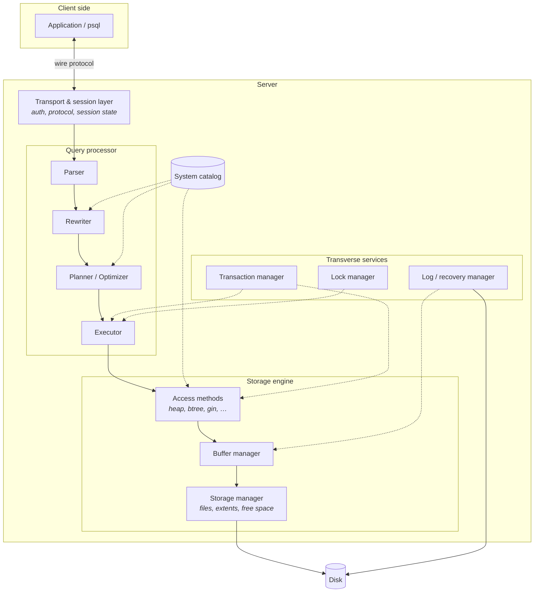
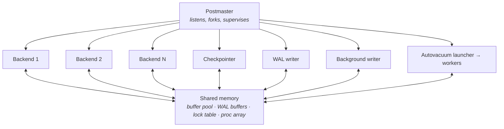

# Lecture 2 — DBMS Architecture

*Map reference: I.B. Sources: DI 1; PG 1.*

Lecture 1 established *what* a DBMS is responsible for. This lecture opens the box: which components exist, what each owns, and how a single request traverses them. Everything in the rest of the course is a zoom-in on one of these boxes.

---

## 1. The layered picture

**Two orthogonal groupings, and the distinction matters:**

- **The vertical stack** — transport → query processor → storage engine → disk. A request flows *through* it, top to bottom, then results flow back up.
- **The transverse services** — transaction, lock, and log managers. These are not stages in the pipeline. They are consulted *from every level*, at every step. This is why concurrency and recovery are hard: they cut across everything rather than sitting at one layer.

---

## 2. Transport and session layer

- **Connection establishment** — the client opens a socket; the server authenticates and creates a session.
- **Session state** is per-connection and survives across statements:
  - current database, user, and role
  - transaction state (in a transaction? aborted?)
  - prepared statements, cursors, temporary tables
  - session-level settings (`search_path`, `work_mem`, isolation level)
- **Wire protocol** — a message-framing format, not just "send SQL, get rows." Messages carry types: `Query`, `Parse`, `Bind`, `Execute`, `RowDescription`, `DataRow`, `ReadyForQuery`.
- **Results stream**, they are not returned as one blob. The server sends rows as produced; the client can consume incrementally.

**Why connections are expensive:**

- Each carries authentication cost, memory for session state, and — in a process-per-connection design — an entire OS process.
- Hence **connection pooling** is not an optimization, it is a requirement at scale. The pooler multiplexes many application-level connections onto few server connections.
- Pooling modes differ in what they can safely share:
  - *Session pooling* — a client owns a server connection for its whole session. Safe, low reuse.
  - *Transaction pooling* — a server connection is returned to the pool at each commit. High reuse, but breaks anything relying on session state (prepared statements, temp tables, advisory locks).

---

## 3. Query processor

### 3.1 Parser

- **Lexer** produces tokens; **grammar** produces a raw parse tree.
- Purely syntactic. It does not know whether the tables exist.
- **Consequence:** a syntax error is reported before any catalog lookup, permission check, or table access. `SELCT * FROM nonexistent_table;` complains about `SELCT`, not the table.

### 3.2 Analyzer / binder

- Resolves **names** against the catalog: which table is `orders`, given `search_path`? Which column is `id`?
- Resolves **types**, applies implicit casts, and selects among overloaded operators.
- Checks **permissions**.
- Records **dependencies** — this query uses table X, function Y — so that later DDL can invalidate cached plans.
- Output: a *query tree*, semantically validated and fully typed.

### 3.3 Rewriter

- Applies transformations that are **definitional**, not cost-based:
  - **View expansion** — a view reference is textually replaced by its defining query tree.
  - **Row-level security** — security policies are injected as additional predicates.
  - **Rules** — user-defined query rewriting.
- Everything here happens *before* the optimizer, so the optimizer sees one flat query with views already inlined. This is why a view generally costs nothing by itself.

### 3.4 Planner / optimizer

- Enumerates **paths** — alternative ways to compute the same result.
- Costs each using catalog **statistics** and a **cost model**.
- Picks the cheapest; converts it to an executable **plan tree**.
- **Key property:** the optimizer's input is a logical specification; its output is a procedure. This is where declarativity is cashed in.
- Lectures VIII cover this in full. For now, note the three inputs: the query tree, the catalog (what indexes exist), and the statistics (what the data looks like).

### 3.5 Executor

- Instantiates the plan tree as a tree of **operator state nodes**.
- Pulls tuples through the tree — each node asks its children for the next tuple.
- Manages **work areas**: sort buffers, hash tables, and spill files when memory is exceeded.
- Calls into **access methods** at the leaves, and consults the **transaction manager** for visibility on every tuple.

---

## 4. Storage engine

### 4.1 Access methods

- **Table access methods** — how to read and write tuples of a relation. PostgreSQL's default is the heap; the interface is pluggable.
- **Index access methods** — B-tree, hash, GiST, SP-GiST, GIN, BRIN, and extensions.
- Every index AM implements a **common interface**: build, insert, begin-scan, get-next, end-scan, vacuum, cost-estimate.
- **This uniform interface is why PostgreSQL is extensible.** A new index type is a set of functions registered in the catalog; the planner and executor need no changes.

### 4.2 Buffer manager

- Owns the boundary between disk and memory. Everything above it addresses **pages**, never bytes or file offsets.
- Maintains fixed-size **frames** in shared memory, a mapping from page identity to frame, pin counts, and dirty bits.
- **Nothing above reads from disk directly.** An access method asks for a page; the buffer manager either finds it resident or reads it in, evicting something if necessary.
- Lecture IV covers this in depth.

### 4.3 Storage manager

- Maps relations to **files**, handles file creation, extension, and deletion.
- Tracks **free space** so inserts know where a row will fit.
- Manages segmentation — a large relation is many files, not one huge one.

---

## 5. The transverse services

These are the reason a DBMS is more than a fast file format.

### 5.1 Transaction manager

- Assigns transaction identifiers; tracks which transactions are in progress, committed, or aborted.
- Produces **snapshots** — the consistent view a statement or transaction sees.
- Answers the question asked on *every single tuple read*: **is this version visible to me?**
- Under MVCC, this is the mechanism by which readers do not block writers.

### 5.2 Lock manager

- Grants and queues **locks** on logical objects: relations, rows, and abstract identifiers.
- Maintains wait queues; detects **deadlocks** by finding cycles in the wait-for graph.
- Distinct from **latches**, which protect in-memory structures for microseconds and are not tracked here. Lecture VI draws this line precisely.

### 5.3 Log and recovery manager

- Generates a **write-ahead log** record for every modification, *before* the modified page may be written.
- Flushes the log on commit — this flush is the durability point.
- Drives **checkpoints**, and on startup, drives **recovery**.
- **Critical ordering constraint:** the buffer manager may not write a dirty page until the log records describing it are durable. This single rule couples two otherwise independent components, and it is the foundation of Lecture X.

### 5.4 System catalog

- Stores all metadata: relations, columns, types, indexes, constraints, functions, privileges, statistics.
- Stored **as ordinary tables**, which creates a bootstrapping problem: to read `pg_class`, you must already know the layout of `pg_class`. Solved with hard-coded layouts for a small set of bootstrap relations.
- Accessed constantly — every name resolution, every plan, every tuple deform. Therefore **cached aggressively** per backend:
  - *relcache* — relation descriptors
  - *syscache* — individual catalog rows
- Caches must be **invalidated** when DDL changes something. Backends broadcast invalidation messages to each other; each backend processes them at safe points. Stale cache entries here would be a correctness bug, not a performance bug.

---

## 6. Process and memory model

### 6.1 The two architectures

- **Process per connection** — one OS process per client. Strong isolation: a crashing backend cannot corrupt another's memory. Higher per-connection cost. *PostgreSQL uses this.*
- **Thread per connection** — one thread per client, shared address space. Cheaper connections, but a memory-safety bug in one thread can corrupt the whole server. *MySQL, SQL Server use this.*

### 6.2 PostgreSQL concretely

- **Postmaster** — accepts connections, forks a backend per connection, supervises children. It does *not* execute queries. If a backend crashes, the postmaster restarts the whole cluster, because shared memory may be corrupt.
- **Backends** — one per client connection; each runs the full pipeline of §3 for its own session.
- **Background processes** — checkpointer, WAL writer, background writer, autovacuum, stats collector, archiver, replication senders.

**Memory split — this distinction drives all tuning:**

- **Shared memory** (`shared_buffers`, WAL buffers, lock table, proc array) — allocated once at startup, sized statically, visible to all processes.
- **Backend-local memory** (`work_mem`, `maintenance_work_mem`, catalog caches) — private per process, allocated on demand.
- **The trap:** `work_mem` is *per operation, per backend*, not per server. A query with three sorts across ten concurrent connections can allocate thirty times `work_mem`. Sizing it as though it were a global budget is a common and expensive mistake.

---

## 7. Following one request end to end

`UPDATE accounts SET balance = balance - 100 WHERE id = 42;`

1. **Transport** — message arrives on the session's socket; backend reads it.
2. **Parse** — tokens → raw parse tree. Syntax valid.
3. **Analyze** — resolve `accounts` via `search_path`; resolve `id` and `balance`; check `UPDATE` privilege; note dependency on the table.
4. **Rewrite** — no views or policies here; tree passes through.
5. **Plan** — statistics say `id` is unique and indexed → index scan beats sequential scan. Emit `Update → Index Scan`.
6. **Transaction manager** — assign a transaction identifier; take a snapshot.
7. **Lock manager** — acquire a relation-level lock (`ROW EXCLUSIVE`) on `accounts`.
8. **Executor → index access method** — descend the B-tree for `id = 42`; get a tuple pointer.
9. **Buffer manager** — the index pages and then the heap page are requested; each is found resident or read from disk, and pinned.
10. **Visibility check** — transaction manager confirms this row version is visible to our snapshot.
11. **Row lock** — the tuple is locked for update; if another transaction holds it, we wait here.
12. **Log manager** — a WAL record describing the change is generated first.
13. **Heap access method** — the old row version is marked dead, a new version is written into the page; the page is marked dirty. Index entries are maintained.
14. **Commit** — the commit record is written and the WAL is **flushed to durable storage**. Only now does the server acknowledge.
15. **Return** — command tag `UPDATE 1` sent to the client. The modified data page is still dirty in memory; it will be written later by the checkpointer. Durability came from the log, not from the page.

**Step 15 is the single most important idea in the lecture.** Commit does not write your data to disk. It writes a *description* of your change to disk. The data page follows at the system's convenience. Everything about write performance follows from this indirection.

---

## 8. Takeaways

- The vertical stack is a **pipeline**; the transverse services are **consulted everywhere**. Confusing these two makes concurrency and recovery seem arbitrary.
- **The catalog is data.** Self-description is implemented literally, at the cost of a bootstrap problem and an aggressive, invalidation-sensitive cache.
- **The buffer manager is the only path to disk.** No layer above it knows what a file is.
- **The WAL ordering rule** — log before page — is the one constraint that couples the storage engine to the recovery manager, and it is what makes commit cheap.
- **Process versus thread** is an isolation-versus-cost trade, and it determines whether connections are cheap enough to create per request. They are not, in PostgreSQL. Pool them.

**Next:** workloads and system classes — why one architecture cannot be optimal for all access patterns.
