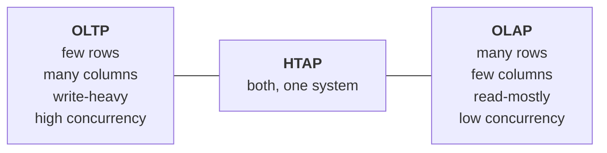
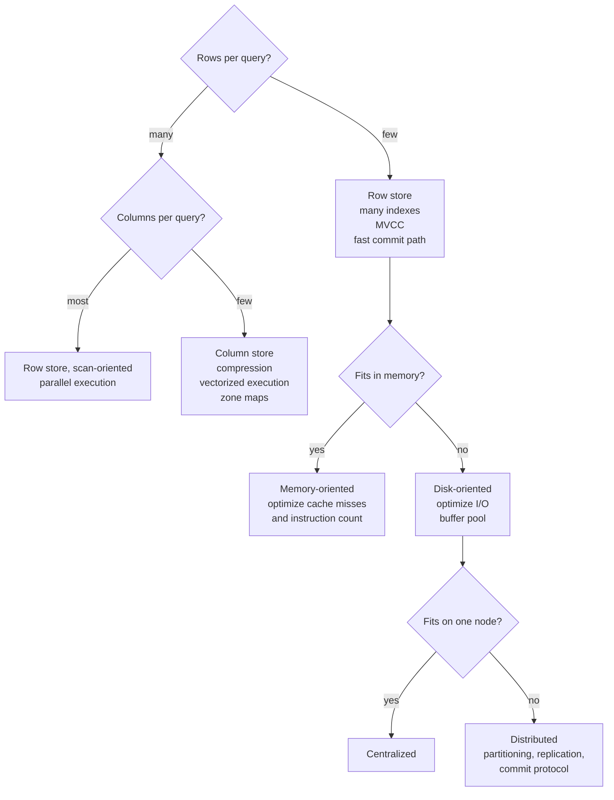

# Lecture 3 — Workloads and System Classes

*Map reference: I.C. Sources: CMU 06; DI 1.*

There is no best database architecture. There are only architectures matched or mismatched to a workload. This lecture defines the workload axes that every later design decision is evaluated against — so that when we ask "should this be a row store?" the answer is already framed as "for which workload?"

---

## 1. Why classify workloads at all

- Every storage and execution decision is a **trade-off**, not an improvement. Faster reads cost write throughput; better compression costs CPU; more indexes cost insert speed.
- A trade-off can only be evaluated against a **known access pattern**. Without one, "optimize the database" is meaningless.
- Two questions characterize almost any workload:
  - **How much data does one operation touch?** One row, or a hundred million?
  - **How many columns of that data does it need?** All of them, or three out of ninety?

These two questions generate the entire OLTP/OLAP split.

---

## 2. The workload spectrum

### 2.1 Online transaction processing (OLTP)

- **Shape:** short, repetitive operations touching **few rows** but usually **most columns** of those rows.
- **Examples:** place an order, authenticate a user, debit an account, add an item to a cart.
- **Characteristics:**
  - Read *and* write, with writes a large fraction of the mix.
  - Queries are known ahead of time — a fixed set, parameterized, executed millions of times.
  - **High concurrency**: thousands of simultaneous transactions.
  - Latency measured in **milliseconds**; the metric is transactions per second and the tail latency.
  - Almost every access is by **primary key or a selective index**.
- **What the system must be good at:**
  - Fast point lookups → indexes, low tree height.
  - Cheap single-row modification → in-place-ish updates, row-major layout.
  - Efficient concurrency control → fine-grained locking, MVCC.
  - Fast commit → efficient WAL and group commit.
- **What it can afford to be bad at:** scanning, compression ratio, aggregate throughput.

### 2.2 Online analytical processing (OLAP)

- **Shape:** long-running queries reading **enormous numbers of rows** but only a **small subset of columns**.
- **Examples:** revenue by region by quarter; cohort retention; funnel analysis.
- **Characteristics:**
  - Read-mostly. Writes arrive as **bulk loads**, not individual row inserts.
  - Queries are **ad hoc** — often generated by a BI tool, never seen before.
  - **Low concurrency**: tens of queries, not thousands.
  - Latency measured in **seconds to minutes**; the metric is bytes scanned per second.
  - Access is by **scan and filter**, rarely by key.
- **What the system must be good at:**
  - Sequential scan bandwidth → column layout, compression, large pages.
  - Aggregation and join throughput → vectorized or compiled execution, parallelism.
  - Skipping irrelevant data → zone maps, partition pruning, min/max summaries.
- **What it can afford to be bad at:** single-row update, point lookup, transaction rate.

### 2.3 The comparison that explains everything

| | OLTP | OLAP |
|---|---|---|
| Rows per operation | 1 – 100 | 10⁶ – 10¹² |
| Columns needed | most | few |
| Write pattern | many small | bulk / append |
| Query set | fixed, parameterized | ad hoc |
| Concurrency | thousands | tens |
| Latency target | milliseconds | seconds–minutes |
| Natural layout | **row** (NSM) | **column** (DSM/PAX) |
| Indexes | many, selective | few; scan + prune instead |
| Compression | modest | aggressive |
| Execution model | iterator, one tuple at a time | vectorized or compiled |

**Read the layout row carefully — it is the crux.** A row store keeps all of a tuple's columns adjacent, so fetching one whole row is one page read. A column store keeps each column contiguous, so a scan of three columns out of ninety reads only 3/90ths of the bytes. Neither is better; they optimize opposite quantities. Lecture II.H makes this precise.

---

## 3. Hybrid transactional/analytical processing (HTAP)

The desire to run analytics on live transactional data without a pipeline delay.

- **The classic alternative** is a two-system architecture: OLTP database → ETL → data warehouse. It works, but:
  - Analytics lag by minutes to hours.
  - Two systems to operate, two schemas to keep aligned, one pipeline to break.
- **HTAP** aims to serve both from one system.

**How systems attempt it:**

- **Single format, compromise design** — one layout serving both adequately, neither optimally. PAX-style layouts sit here.
- **Dual format** — the same logical data kept in both a row store (for transactions) and a column store (for analytics), with the system maintaining both. Costs memory and write amplification; gives near-native performance to each side.
- **Delta store** — a row-formatted write buffer absorbs recent changes; a columnar base holds history; queries read the union and a background process merges. This is the most common design.

**The unavoidable tensions:**

- **Freshness versus analytical speed.** Making writes instantly visible to analytics means either updating a columnar structure per row (slow writes) or reading an unmerged delta (slow reads).
- **Resource isolation.** A large analytical scan competes with transactions for buffer pool, CPU, and I/O. Without isolation, one analyst can degrade production latency. This is often the real reason organizations keep two systems even when one could work.

---

## 4. Memory-oriented versus disk-oriented systems

Not "does it have a cache" — every system caches. The question is **where the authoritative copy lives and which costs the design assumes are dominant.**

### 4.1 Disk-oriented

- **Assumption:** the database exceeds memory. Disk is the source of truth; memory is a cache.
- **Consequence:** every design decision aims to minimize I/O.
  - Buffer pool with eviction, pinning, and page tables.
  - Indirection everywhere: a record is found via page ID → frame → offset.
  - Page-oriented everything, because I/O is block-granular.
- **Dominant cost:** page reads.

### 4.2 Memory-oriented

- **Assumption:** the working set fits in RAM. Memory is the source of truth; disk holds the log and checkpoints for durability only.
- **Consequences — the buffer pool disappears, and with it a great deal of machinery:**
  - No page table lookup; records are reached by direct pointers.
  - No pinning, no eviction policy, no page-level indirection.
  - Data structures optimized for **cache lines**, not disk pages.
- **Dominant costs shift** to what was previously invisible:
  - **CPU cache misses** — now the main stall.
  - **Instruction count** — hence query compilation to remove interpretation overhead.
  - **Latching and synchronization** — with I/O gone, contention is the bottleneck.
- **Durability still required.** A memory-oriented system still writes a WAL and takes checkpoints; it just never reads data pages back in normal operation.
- **Cold data** is handled by *anti-caching* — evicting cold tuples to disk and faulting them back, which is a buffer pool reinvented at tuple granularity for the minority case.

**The lesson:** removing the disk does not remove the design problem. It relocates the bottleneck one level up the memory hierarchy, and the same ideas — caching, locality, prefetch — reappear at the new scale.

---

## 5. Deployment classes

Independent of workload shape: how many machines, and how are they related?

### 5.1 Centralized (single node)

- One machine holds all the data and does all the work.
- **Simplest possible correctness story** — no network, no partial failure, no coordination.
- Scales *up* (bigger machine), not *out*.
- Still the right answer for a large fraction of real workloads. Modern single nodes are very large.

### 5.2 Embedded

- The DBMS is a **library linked into the application process**, not a server.
- No network, no separate process, no connection management. Function calls, not protocol messages.
- **Examples:** SQLite, RocksDB, LMDB, DuckDB.
- **Constraints:** typically one writer; concurrency limited by the host process; no independent operational lifecycle.
- Note that SQLite and DuckDB are the embedded OLTP/OLAP pair — the same workload split reappears within this class.

### 5.3 Parallel

- **Multiple processors or nodes, tightly coupled**: fast, reliable interconnect; nodes assumed not to fail independently.
- Communication is cheap enough to largely ignore in the cost model.
- Includes both single-node multi-core parallelism and tightly-coupled clusters.

### 5.4 Distributed

- **Multiple nodes, loosely coupled**: unreliable network, independent failure, meaningful communication cost.
- **The qualitative differences from parallel — this is the real line:**
  - Node failure is a **routine event** to be handled, not an outage.
  - Network partitions are possible, and a slow node is **indistinguishable** from a dead one.
  - Every cross-node operation carries latency that dominates local work.
  - Atomicity across nodes requires a **commit protocol**; agreement requires **consensus**.
- Section XI covers this at length. The point here is that "parallel" and "distributed" are not degrees of the same thing — they differ in what failures the model admits.

---

## 6. The design decision tree

The workload determines the architecture, in this order:

**Apply this in order, and stop as early as you can.** Every step down adds correctness burden. Distributed is the last resort, not the default.

---

## 7. PostgreSQL's position

Stating this plainly, since PostgreSQL is our reference system for the rest of the course:

- **OLTP-oriented**, disk-oriented, centralized, process-per-connection, row-store (heap), MVCC-based.
- Every default is tuned for the OLTP quadrant: 8 KB pages, B-tree as the default index, iterator-model execution, row-major tuples.
- **It is not a bad analytical engine**, and it has grown genuine OLAP capability: parallel query, partitioning with pruning, BRIN indexes for large ordered tables, JIT compilation, and columnar storage via extensions.
- But its **architecture is OLTP-shaped**, and that shows:
  - The heap is row-major; a scan of three columns still reads full tuples.
  - MVCC bloat and vacuum are a per-row cost, awkward at analytical scale.
  - Execution is tuple-at-a-time by default, with vectorization only via extensions.
- **Studying an OLTP-shaped system is the right pedagogical choice**, because the OLTP problems — concurrency, recovery, index maintenance, visibility — are the hard ones. Analytical systems get to skip most of them.

---

## 8. A caution on benchmarks

- **TPC-C** — the OLTP standard. Order-entry workload, measures transactions per minute.
- **TPC-H / TPC-DS** — the OLAP standards. Decision-support queries over a star schema.
- **YCSB** — key/value serving, tunable read/write mix.
- **The failure mode:** benchmarks are workloads, and a system tuned for a benchmark is tuned for that workload. Published numbers tell you how a system handles *that* access pattern — which is informative only insofar as it resembles yours.
- **What to do instead:** characterize your own workload along the axes in §1 — rows per operation, columns per operation, read/write ratio, concurrency, latency target, growth rate — and, where possible, replay captured production traffic. A benchmark you did not design for your data is a proxy, and usually a poor one.

---

## 9. Takeaways

- **Workload is the independent variable.** Architecture is the dependent one. Any design claim without a stated workload is unfalsifiable.
- **Two questions frame the split:** rows per operation, and columns per operation. OLTP and OLAP are opposite answers to both.
- **HTAP is a real tension, not a solved problem** — freshness, resource isolation, and layout all pull in opposite directions.
- **Memory-oriented design relocates the bottleneck**, from page I/O to cache misses, instruction count, and contention. The techniques recur one level up.
- **Parallel and distributed differ in failure model, not scale.** Admitting independent node failure changes the problem qualitatively.
- **PostgreSQL is an OLTP-shaped, disk-oriented, centralized row store** — and that shape is why it is a good system to learn from.

**Next:** data models — the logical vocabularies available for describing data, and why the relational model displaced its predecessors.
