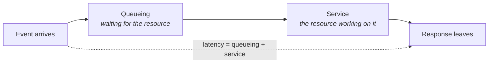
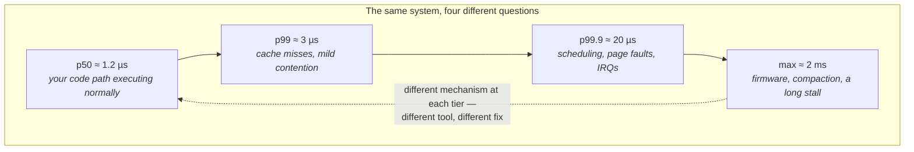
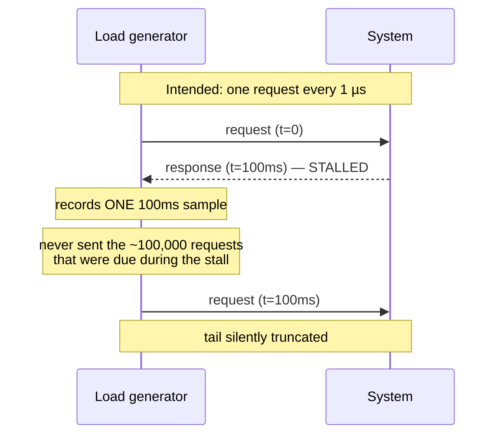
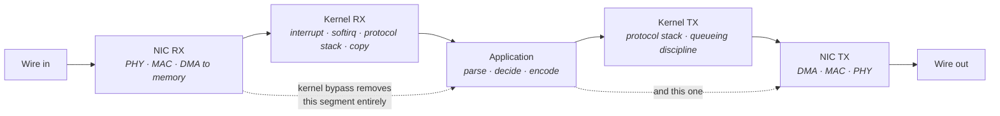
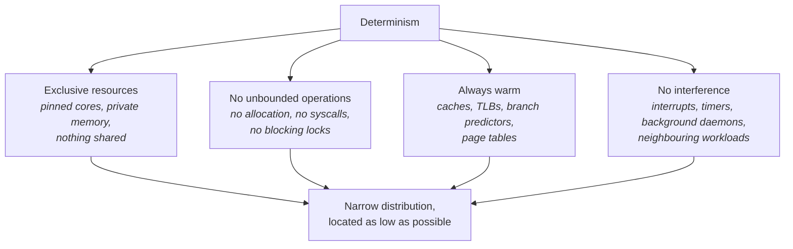

# What "Low Latency" Actually Means

Most performance work you have done up to now has probably been about making a program finish
sooner. You profiled, found the hot function, made it cheaper, and the total runtime dropped. That
is a real and useful skill, and it is not what this book is about.

Low-latency engineering asks a different question. It does not care how long a program takes to
process a million messages. It cares how long it takes to process *one* — measured from the instant
the input arrives at the machine to the instant the response leaves it — and it cares far more about
the worst such time than the typical one. A system that responds in 2 microseconds on average, but
occasionally takes 900 microseconds, is not a low-latency system. It is a fast system with a latency
problem, and in a trading context the 900-microsecond events are frequently the ones that mattered
most.

That inversion of priorities — worst case over average case, single event over aggregate — has
consequences that reach all the way down to how you configure the BIOS. Almost every default in a
modern computer, from the CPU's power management to the kernel's scheduler to the network card's
interrupt behavior, was chosen to maximize throughput or minimize power. Each of those defaults buys
its objective by making individual operations occasionally slower. Undoing them, deliberately and
with an understanding of what each one costs, is most of what this book covers.

This chapter builds the vocabulary and the mental model the rest depends on: what latency and jitter
actually are, why averages lie, how to decompose an end-to-end time into a budget you can attack,
what the fundamental costs of a modern machine are, and why *predictability* turns out to be a more
useful goal than *speed*.

## Latency, Throughput, and Jitter

Three words get used loosely in performance conversations, and conflating them is the first thing
to fix. They describe different properties, they are optimized by different techniques, and — this
is the part that surprises people — improving one routinely damages another.

**Latency** is the time from a stimulus to its response, for one event. **Throughput** is how many
events the system completes per unit time. It is tempting to assume these are two views of the same
thing, but they are not, and the cleanest way to see that is with a pipeline.

Imagine a processor pipeline forty stages deep. Once it is full, it retires one instruction every
cycle — excellent throughput. But any individual instruction entering that pipeline takes forty
cycles to emerge. High throughput, high latency, simultaneously, and by design. The pipeline
achieves its throughput *by* accepting per-instruction latency, because it can overlap the work of
forty instructions at once.

The same trade appears everywhere in a computer system, and it almost always runs in the same
direction: **techniques that improve throughput do so by making individual operations wait.**

- **Batching.** Processing a hundred messages together amortizes fixed per-batch costs across all
  hundred. But the first message in the batch waits for the ninety-ninth to arrive before anything
  happens to it.
- **Interrupt coalescing.** A network card that waits to accumulate several packets before
  interrupting the CPU generates far fewer interrupts. Every packet but the last one waits.
- **Buffering and queueing.** A queue smooths bursts and keeps a downstream stage busy. Time spent
  in a queue is pure latency with no work being done.
- **Deep pipelines and speculation.** More overlap, more total work per second, more cycles between
  an instruction entering and leaving.

The third term, **jitter**, is the variation in latency across events. If your responses take
1.0 µs, 1.1 µs, 1.0 µs, 47 µs, 1.0 µs, your latency is roughly a microsecond and your jitter is
forty-six.

Jitter deserves its own name because it has a different character from the other two. Latency and
throughput are properties of your design — you can reason about them from first principles by
counting the work. Jitter is almost always evidence of *something else* touching a resource your
code depends on: an interrupt arriving, a page fault, another thread being scheduled, a firmware
routine running invisibly, a neighbouring process saturating memory bandwidth. This makes jitter
fundamentally a *diagnostic* problem rather than a design problem. A latency number is a
measurement; a jitter number is the opening of an investigation (pursued properly in "Jitter
Hunting").

| Property | What it measures | Improved by | Damaged by |
|---|---|---|---|
| **Latency** | Time for one event, stimulus to response | Shortening the critical path; removing work; removing waits | Batching, queueing, buffering, contention |
| **Throughput** | Events completed per unit time | Batching, parallelism, pipelining, amortization | Per-event overhead, synchronization |
| **Jitter** | Variation in latency across events | Removing interference, contention, and shared resources | Anything unpredictable touching a shared resource |

### Where the time actually goes

For any event passing through any stage of a system, its time splits into exactly two parts, and
distinguishing them is one of the most useful habits you can build.

**Service time** is the resource actually doing your work: instructions executing, bytes being
clocked onto a wire, a disk reading a block. Reducing it is the kind of optimization you already
know — better algorithms, better data layout, fewer instructions.

**Queueing time** is your event waiting because the resource was busy with something else. This is
where low-latency engineering diverges sharply from ordinary optimization, because queueing time is
not controlled by your code at all. It is controlled by how heavily loaded the resource is and by
who else is using it.

The crucial property of queueing is that it does not grow linearly with load. As a shared resource —
a CPU core, a memory controller, a network link, a NIC queue — approaches saturation, waiting time
rises sharply rather than gradually. A resource at 50% utilization has short queues; the same
resource at 90% has disproportionately longer ones, and its *variance* grows faster than its mean.

This produces a rule that sounds wasteful until you understand where it comes from: **low-latency
systems deliberately run their critical resources far below capacity.** A core dedicated to one
thread and otherwise idle, a network link at 10% utilization, a machine with far more memory than it
needs. You are not buying capacity. You are buying the absence of queues.

**Failure mode: latency is fine in testing and bad in production at higher load.** The symptom is a
system that meets its target under benchmark conditions and misses it under real traffic, with no
change to the code path. The cause is queueing at a resource that was uncontended in the test — most
often a CPU core shared with other work, or memory bandwidth consumed by a neighbouring process.
Confirm by measuring at several load levels rather than one, and by watching run-queue length
(`vmstat 1`, first column) and context-switch rate (`perf stat -e context-switches`) as load rises.

**Try it:** demonstrate the batching trade-off to yourself, since it underpins the whole chapter.
Write a loop that processes items one at a time and records the time from each item becoming
available to it being finished. Then process them in batches of 64. The batched version will have
markedly better total throughput and markedly worse per-item latency, and the first item of each
batch will be the worst. Nothing else in this book will feel surprising once that result is in your
hands.

### The trade-off is not symmetric

It is worth being explicit about which direction the trade normally runs, because it explains the
posture of the entire discipline.

**Spending throughput to buy latency is the standard move.** A trading system will burn an entire
CPU core spinning in a loop, checking a network card queue millions of times per second, almost
always finding nothing. That looks profligate — 100% CPU to do nothing — but it eliminates the
several microseconds an interrupt would have cost. The core is cheap. The microseconds are not.

**Spending latency to buy throughput is what everything else already does.** Every default you
inherit — from the operating system, the network stack, the compiler, the hardware — was tuned by
people optimizing aggregate performance across many workloads. This is why so much of low-latency
work is subtractive: you are removing helpful machinery rather than adding clever machinery.

**Reliability costs latency too**, and this trade is the one that requires real judgment.
Synchronous logging, acknowledgement, replication, and validation each add work to the critical
path. The engineering question is never "can we remove this?" but "can this be moved off the
critical path without weakening the guarantee it provides?" — which usually means doing it
asynchronously, or doing it before the event arrives rather than after.

## Tail Latency

Here is the most important habit this chapter can give you: **stop reporting averages.**

The mean is the statistic every engineer reaches for by default, and for latency work it is close to
useless. The reason is arithmetic. Suppose you handle a million events. Nine hundred and
ninety-nine thousand of them take 1 µs. One thousand of them take 10 ms — ten thousand times worse.
The mean is about 11 µs. It has told you almost nothing: not that the typical case is 1 µs, not that
a thousand events were catastrophically slow, not even that two distinct behaviors exist. It has
blended a bimodal distribution into a single number that describes neither mode.

What you need instead is the *distribution*, usually summarized as percentiles. A percentile answers
"what value are N% of events faster than?"

| Statistic | What it tells you | Why it is not enough on its own |
|---|---|---|
| **Mean** | Total time ÷ event count | Blends distinct behaviors; hides everything interesting |
| **Median (p50)** | The typical event | Says nothing about whether a tail exists |
| **p99** | 1 event in 100 is worse | At 100,000 events/s, this is 1,000 events per second |
| **p99.9** | 1 in 1,000 is worse | Where scheduling and fault-related jitter shows up |
| **p99.99** | 1 in 10,000 is worse | Where firmware and rare-event stalls show up |
| **Max** | The worst thing observed | Real, but a single sample — unstable between runs |

The habit to build is reporting a histogram, plus a table of percentiles including the maximum,
plus the number of samples and the duration of the run. That last part matters more than it sounds:
a p99.99 computed from 10,000 samples is based on exactly one observation, and quoting it as though
it were a stable property of the system is self-deception.

### The tail is not the boring case

New practitioners often treat outliers as noise to be excluded. In this discipline the opposite is
true, for two independent reasons.

The first is arithmetic. "One in ten thousand" sounds negligible until you multiply by the event
rate. A system handling a million messages per second experiences its p99.99 case a hundred times
every second. That is not an anomaly; it is a routine occurrence that happens to be a hundred times
slower than normal.

The second is correlation. Latency spikes are not randomly distributed in time — they cluster during
bursts of activity, because bursts are exactly when queues form, caches get evicted, and every
shared resource comes under pressure simultaneously. In a trading context, bursts of market activity
are also precisely when the system's responses matter most. So the slow events and the important
events are the same events.

There is a third property that catches people out, and it is worth stating carefully because the
intuition is wrong. **Percentiles do not add.** If a request passes through three stages, each with
a p99 of 1 ms, the end-to-end p99 is not 3 ms. If the stages' delays are independent, the composite
tail is *worse* than any single stage's — because a request only has to be unlucky once, in any one
of the three stages, to be slow overall. The more stages in a pipeline, the more likely any given
request encounters at least one of them behaving badly.

That diagram encodes a practical lesson worth internalizing early: **each percentile tier is
typically produced by a different mechanism.** The median reflects your code path executing
normally. The p99 usually reflects microarchitectural effects — a cache miss, a branch mispredict, a
little contention. The p99.9 reflects operating system events. The extreme maximum usually reflects
something below the operating system entirely.

The corollary is that optimizing your code — the natural instinct — improves p50 and does essentially
nothing to p99.9. Engineers new to this discipline frequently spend weeks shaving nanoseconds off a
hot function while a 2-millisecond firmware stall sits untouched in the tail. **Work the tail from
the top down**: the worst outlier first, because it is usually caused by something identifiable and
removable, and because it is worth a thousand times more than the median improvement.

### Coordinated omission

There is one measurement bug so common, and so severe, that it belongs in the first chapter rather
than the measurement chapter. It can make a reported p99.9 wrong by orders of magnitude, and it is
invisible unless you know to look for it.

The setup: you write a benchmark that sends a request, waits for the response, records the latency,
and sends the next request. This is the obvious way to build a load generator, and almost everyone
writes it this way the first time.

Now suppose the system stalls for 100 ms. During that stall, your generator is blocked waiting for
its one outstanding response. It does not send anything. When the response finally arrives, it
records *one* sample of 100 ms and carries on.

But consider what should have happened. If the generator was meant to send one request every
microsecond, then during that 100 ms stall, a hundred thousand requests should have been issued —
and every one of them would have experienced part of the stall. The first would have waited 100 ms,
the next 99.999 ms, and so on. Your benchmark recorded one bad sample where reality would have
produced a hundred thousand. The tail has been silently deleted.

This is **coordinated omission** — the measurement is coordinated with the very stalls it is
supposed to be measuring, and omits them.

The fix follows directly from the diagnosis: measure latency against the schedule on which requests
were *intended* to be sent, not the time they actually went out. Record
`completion_time − intended_send_time`. A request that should have been sent at t=50 ms and
completes at t=100 ms took 50 ms, even if your generator did not manage to send it until t=100 ms.

**Failure mode: your benchmark's tail looks implausibly clean.** The symptom is a p99.9 suspiciously
close to the median, or a benchmark that disagrees with production complaints. The cause is very
likely coordinated omission. Confirm by inspecting whether your load generator paces itself off its
own completions — if the next send happens only after the previous response, it does. Tools built
with this problem in mind, such as `wrk2` or HdrHistogram-based harnesses, correct for it
explicitly.

**Try it:** build a histogram instead of an average and see the difference for yourself. Instrument
any repeating operation to record per-iteration timings into a *pre-allocated* array (allocating
during measurement would perturb what you are measuring — a point Chapter 5 makes concrete).
Afterwards, print p50, p99, p99.9, and max. Then compute the mean, discard the worst 0.1% of
samples, and compute it again. The mean will barely move, while max drops enormously. That gap is
precisely the information the mean was hiding.

**Try it:** provoke coordinated omission deliberately. Take a closed-loop benchmark and inject an
artificial 100 ms stall every few seconds (a `sleep` in the server path will do). Record the
percentiles the naive harness reports. Then re-record latencies against an intended send schedule
and compare. The difference between the two p99.9 figures is the size of the lie.

## The Latency Budget

Once you accept that you are optimizing a single event's path through a system, a specific technique
becomes available, and it is the most valuable one in the discipline: decompose the end-to-end time
into named segments, each with a cost. That decomposition is a **latency budget**.

Without one, optimization is guesswork dressed up as engineering. You optimize what is familiar —
usually your own application code, because that is what you can see in a profiler — and you have no
way of knowing whether it accounts for 5% or 60% of the total. With a budget, the question "what
should I work on?" has an answer you can defend.

For a trading system, the canonical budget follows a packet from the wire, into the machine, through
your code, and back out.

Each of those boxes is a chapter of this book. Here is roughly what each one costs, which also
serves as a map of where the book will spend its time.

| Segment | Typical cost | What dominates it | Covered in |
|---|---|---|---|
| Switch, port to port | 300 ns – 1 µs | Cut-through vs. store-and-forward architecture | "Network Design and Operations" |
| NIC RX into host memory | ~1 µs | PCIe traversal, DMA, descriptor handling | "Buses, Devices, and I/O Hardware" |
| Kernel network stack, RX | 2 – 10 µs | Interrupt and softirq scheduling, buffer management, copy to user space | "The Linux Networking Stack" |
| Kernel-bypass RX | 0.5 – 1.5 µs | A poll loop reading a descriptor | "Kernel Bypass" |
| Application processing | 100 ns – several µs | Cache behavior, branch prediction, allocation | Part I |
| Kernel TX + NIC | 2 – 10 µs, or ~1 µs bypassed | Mirror of the RX path | Parts II–III |
| Fiber propagation | ~5 µs per km | Speed of light in glass, ~200,000 km/s | "Network Design and Operations" |
| Serialization, 10 GbE | ~0.8 ns per byte | Line rate | "The Network Stack from the Bottom Up" |

*Order-of-magnitude figures for a modern x86 server (Skylake-and-later class) with a 10/25 GbE NIC.
These vary substantially with hardware, kernel version, and tuning — the point is the relative
scale, not the digits.*

Read that table with an eye on proportions and something jumps out. The kernel network stack, on
both receive and transmit, can account for more time than everything else in the machine combined.
That single observation is why kernel bypass exists as a technology and why an entire chapter is
devoted to it.

### Three lessons from having a budget

**Measure wire to wire, or you are not measuring the system.** If you timestamp at the top of your
application and again at the bottom, you have measured the "Application" box and nothing else. The
NIC, the driver, both PCIe traversals, and the entire kernel path are outside your measurement.
People routinely report sub-microsecond latencies that omit 90% of the actual time.

**Fixed costs establish a floor.** Propagation and serialization delay are physics. If your
counterparty is 300 km away, 1.5 milliseconds of the round trip is not negotiable by any amount of
software engineering; you change it by changing the path — a shorter route, a different medium —
or not at all. Knowing which parts of the budget are physics tells you where effort is pointless.

**Every segment has a distribution, not just a mean.** A segment averaging 1 µs but occasionally
taking 50 µs is worse for you than a rock-steady 5 µs segment. When you build a budget, note the
variance alongside the mean, because the tail of the whole is assembled from the tails of the parts.

### Serialization, propagation, and queueing

Network delay has exactly three components, and being able to name and compute them is expected
knowledge.

**Serialization delay** is the time to clock the bits of a frame onto the wire, and it is pure
arithmetic: frame size in bits ÷ line rate. A 100-byte frame is 800 bits; at 10 Gb/s that is 80
nanoseconds. On a 1 Gb/s link, the same frame takes 800 ns. This is why link speed affects latency
and not just capacity — a point people often miss, since they think of bandwidth as purely a
throughput property.

**Propagation delay** is the time for the signal to physically travel, bounded by the speed of light
in the medium. In single-mode fiber, light travels at roughly two-thirds of its vacuum speed, giving
about 5 µs per kilometer. Through air or near-vacuum it is about 3.3 µs per kilometer. That
difference — roughly 1.7 µs per kilometer — is the entire economic basis for microwave and
millimeter-wave links between trading venues, despite their far lower bandwidth and weather
sensitivity.

**Queueing delay** is time spent waiting in a buffer somewhere — in a switch, in a NIC, in the
kernel. Unlike the other two it is not computable from first principles, it is highly variable, and
it is the component that explodes during bursts. It is also, unsurprisingly, where most of the tail
lives.

**Failure mode: your measured latency is far better than users experience.** The symptom is
in-process instrumentation reporting a number that operational reality contradicts. The cause is
almost always measurement scope — the instrumentation covers only the application segment. Confirm
by comparing against NIC hardware timestamps: check support with `ethtool -T <iface>`, then capture
with `tcpdump` and compare the wire-to-wire delta against what your application reported.

**Try it:** build a budget for a real path you have access to, even an approximate one. Fill in the
segment table above with your own numbers — measured where you can, estimated where you cannot — and
identify which single segment dominates. Then observe that everything you might have optimized
before that segment would have been wasted effort. This exercise takes an hour and changes how you
approach every subsequent performance problem.

## Orders of Magnitude

You cannot reason about a system whose costs you do not know. This section is the cost ladder of a
modern machine, and it is worth genuinely committing to memory — not because interviewers quiz you
on it (though they do), but because without it you cannot form hypotheses. "That loop should take
about 200 nanoseconds and it is taking 2 microseconds" is the beginning of an investigation. Without
the first half of that sentence, there is nothing to investigate.

| Operation | Approximate cost |
|---|---|
| One clock cycle at 3 GHz | 0.33 ns |
| L1 data cache hit | ~1 ns (~4 cycles) |
| L2 cache hit | ~4 ns (~12–15 cycles) |
| L3 cache hit, same socket | ~15 ns (~40–50 cycles) |
| Main memory, local NUMA node | ~80–100 ns |
| Main memory, remote NUMA node | ~130–200 ns |
| Branch mispredict | ~5 ns (~15–20 cycles) |
| Atomic read-modify-write, uncontended | ~7 ns |
| Atomic read-modify-write, contended across cores | 50 – 500+ ns |
| Cache line bouncing between cores (false sharing) | 100 – 500 ns per transfer |
| TLB miss requiring a page walk | ~20 – 100 ns |
| `clock_gettime` via the vDSO | ~20 – 30 ns |
| A trivial system call | ~100 ns – 1 µs |
| Voluntary context switch | ~1 – 5 µs |
| Minor page fault | ~1 – 3 µs |
| Uncontended mutex lock and unlock | ~20 ns |
| Contended mutex (sleep and wake through the kernel) | ~2 – 10 µs |
| UDP round trip through the kernel, same rack | ~20 – 50 µs |
| UDP round trip with kernel bypass, same rack | ~3 – 10 µs |
| NVMe SSD read | ~20 – 100 µs |
| Rotational disk seek | ~5 – 10 ms |

*Typical for modern x86 server hardware; every figure varies by generation, frequency, and
configuration. Syscall and context-switch costs in particular depend heavily on which
speculative-execution mitigations are enabled — see "Kernel Architecture and the Syscall Boundary."*

### What to actually take from that table

Memorizing twenty numbers is less useful than internalizing the *ratios* between them, because the
ratios are stable across hardware generations while the absolute values drift.

- **L1 to DRAM is roughly 1:100.** A cache miss costs about as much as executing a few hundred
  instructions. This single ratio justifies nearly everything in Part I about data layout.
- **A system call costs several cache misses.** So "we only added one syscall to the hot path" is
  not a small statement — it is comparable to adding several hundred instructions of work.
- **A context switch costs several system calls**, and that is before accounting for the cache and
  TLB pollution it leaves behind, which the next thread pays for.
- **One microsecond is about 3,000 cycles.** This conversion is the one I use most. It makes
  microsecond-scale costs feel appropriately enormous, which is the correct instinct.
- **Anything measured in milliseconds does not belong on a hot path.** Disk access, DNS resolution,
  logging to a file, memory allocation that reaches the kernel — all of it belongs on the cold path,
  the startup path, or another thread entirely.

There is one meta-lesson hiding in the table, and it constrains all your future measurement work:
**reading the clock costs 20–30 nanoseconds.** If you want to time an operation that itself takes 10
nanoseconds, two clock reads cost five times more than the thing you are measuring. Nanosecond-scale
measurement requires either amortizing across many iterations, or using cycle counters directly and
correcting for their overhead — covered properly in "Clocks, Timers, and Time."

### Deriving instead of memorizing

Several of these numbers are not facts to memorize but arithmetic to perform, and being able to do
that on demand is more robust than recall.

- **Frequency gives cycle time.** 3 GHz → 0.33 ns per cycle. Every cycle-denominated cost converts
  from there, and CPU vendors publish cycle counts for cache hits and mispredicts.
- **Line rate gives serialization delay.** 10 Gb/s → 1.25 GB/s → 0.8 ns per byte.
- **Distance gives propagation delay.** ~5 µs per kilometer of fiber, one way.
- **TLB entries × page size gives TLB reach.** Roughly 1,500 entries × 4 KiB ≈ 6 MiB — a number
  small enough to be a real constraint, as Chapter 5 explores.

**Try it:** measure the two most fundamental costs on your own machine, because you will reference
them constantly. First, time a loop of several million `clock_gettime(CLOCK_MONOTONIC)` calls and
divide — that is your measurement floor. Second, time a loop of `syscall(SYS_getpid)` calls, which
forces a real kernel entry rather than a cached value. Compare the two. Then read
`/sys/devices/system/cpu/vulnerabilities/` to see which speculative-execution mitigations are active
on your machine, since they largely explain the gap.

**Try it:** find your machine's cache tier boundaries empirically. Walk arrays of increasing size
with a stride large enough to defeat the hardware prefetcher, and plot nanoseconds per access
against working-set size. You will see distinct plateaus with steps between them. Compare the sizes
where the steps occur against `lscpu -C`. Having personally observed the 1 ns / 4 ns / 15 ns / 90 ns
ladder makes it stick in a way that reading a table does not.

## Determinism as a First-Class Goal

We can now state the actual design objective, which differs from what most people assume when they
hear "low latency."

A requirement usually arrives phrased as an average: "responses must take under 5 microseconds."
But engineering to an average produces a system that meets it most of the time and fails
unpredictably, which in practice is not a system that meets the requirement at all. The productive
reformulation is: *what is the largest delay this system can exhibit, and what causes it?*

This is what **determinism** means here, and it is worth being precise, because the word invites a
misreading. Determinism does not mean slow and steady. The goal is a *narrow* distribution located
as *low* as possible. A system that always takes exactly 500 µs is perfectly deterministic and
useless. What you want is one that takes 1.2 µs almost always and 1.4 µs at worst.

Once determinism rather than average speed is the objective, several design decisions invert
relative to ordinary engineering intuition.

**Prefer a bounded slow operation over an unbounded fast one.** A pre-allocated ring buffer with a
fixed cost beats a general-purpose memory allocator whose median is competitive but which
occasionally enters the kernel to request more memory. You are not choosing the faster option; you
are choosing the one with no tail.

**Every rarely-taken branch is a latency path.** A code path taken 0.1% of the time still determines
your p99.9 if it is a hundred times slower than the common case. The instinct to ignore rare paths
because they contribute little to average runtime is exactly backwards here.

**Cold is slow, so stay warm.** Caches, TLBs, branch predictors, and page tables all penalize the
first execution of a path — sometimes by orders of magnitude. This is a particular problem for
systems that go quiet between bursts of activity: they are cold at precisely the moment the burst
arrives. Some systems deliberately execute their hot path against discarded dummy input during idle
periods purely to keep the hardware's predictive state warm. That practice looks bizarre until you
have measured the difference.

**Shared means contended; contended means variable.** Any resource shared with another thread has a
cost that depends on that thread's behavior, which you do not control. This single observation
motivates a large fraction of the techniques in this book: pinning threads to dedicated cores,
per-core data structures, single-writer designs, and avoiding locks not because locking is slow but
because contention is *unpredictable*.

**Design for the burst, not the mean.** Capacity planned against average message rates guarantees
queueing during bursts — and bursts are when it matters. Size every buffer, queue, and headroom
allowance against the peak you must survive.

### The unbounded-operation checklist

The single most actionable idea in this chapter is the notion of a *bounded* operation. Anything
whose worst-case cost cannot be stated is a defect on a hot path, no matter how fast it usually is.

| Operation | Why its cost is unbounded | Where it belongs instead |
|---|---|---|
| Dynamic memory allocation | May page-fault, may call into the kernel for more memory, may contend on allocator locks | Pre-allocate at startup |
| Blocking system calls | Involves the scheduler; wakeup latency depends on the whole system | Cold path, or bypass the kernel |
| Acquiring a contended lock | Sleeping and waking through the kernel; priority inversion; convoying | Single-writer or lock-free designs |
| Synchronous logging or file I/O | Page cache behavior, writeback, `fsync` durability | Asynchronous ring buffer, formatted off the hot path |
| First touch of a memory page | Minor page fault, kernel installs the mapping | Pre-fault at startup, then `mlockall` |
| DNS or service discovery lookups | Network round trip with no bound | Startup |
| Anything whose cost scales with data size | Unbounded by construction | Bound the size, or move it off the path |

Two clarifications that matter in practice. **"It has never happened in production" is not a bound**
— it is a statement about workloads observed so far, and the tail is precisely where unobserved
workloads reveal themselves. And **cold-path code still needs discipline**: it shares caches, memory
bandwidth, and cores with your hot path, so a cold path that allocates aggressively or streams
through memory will damage the hot path even though it never runs on it.

**Failure mode: the first events after startup or after an idle period are dramatically slower.**
The symptom is a latency distribution that improves over the first few thousand events, or that
degrades whenever traffic pauses. The cause is cold caches, cold TLBs, cold branch predictors,
un-faulted pages, and possibly a CPU that has entered a deep idle state. Confirm by comparing
first-execution against steady-state timings, checking minor fault counts with
`ps -o min_flt -p <pid>` before and after, and inspecting idle-state residency in
`/sys/devices/system/cpu/cpu*/cpuidle/state*/usage`.

**Failure mode: latency is excellent on a quiet machine and poor on a busy one, with the hot path's
own CPU usage unchanged.** The cause is interference — shared resources being consumed by other
work. Confirm by pinning the hot path with `taskset` and re-testing with and without the
neighbouring load, and by checking `perf stat -e context-switches,cpu-migrations` for whether your
thread is being descheduled or moved.

**Try it:** watch interference happen in a controlled way, since this is the effect the entire
Part II tuning effort is aimed at. Run your histogram benchmark pinned to one core and record the
percentiles. Then run a busy loop on the *same* core, then on that core's SMT sibling, then on a
different physical core of the same socket, recording percentiles each time. Four distinct
degradation profiles will emerge, and each corresponds to a different shared resource — the core
itself, the core's execution units, and the shared cache and memory bandwidth.

**Try it:** measure the warm-up penalty. Time a hot path executed in a tight loop, then time the same
path executed once every 100 ms. Compare the distributions. Then check whether the CPU is entering
idle states between iterations by reading the `usage` files under
`/sys/devices/system/cpu/cpu0/cpuidle/state*/` before and after.

## How Low-Latency Interviews Are Structured

Since preparation for interviews is why this book exists, it is worth being explicit about what
those interviews actually probe — not to give away answers, which is Part VI's job, but so that you
can read the rest of the book knowing what it is preparing you for.

The formats vary between firms, but the surface being tested is remarkably consistent, and it is
narrower than candidates expect. Interviewers are not checking whether you have memorized a glossary.
They are trying to establish whether you have a *mechanical model* of a computer — whether, when
something is slow, you can reason from the hardware and the operating system upward to a hypothesis,
and then say how you would test it.

| Round | Typical form | What is actually being assessed |
|---|---|---|
| Systems fundamentals | Rapid questions on OS, memory, networking | Whether your model is mechanical or memorized |
| Performance reasoning | "This is slow — why?" with a scenario or a profile | Diagnostic method under uncertainty |
| Numbers and estimation | "How long does X take? How much bandwidth is that?" | Whether you reason from first principles |
| Networking deep-dive | TCP/IP mechanics, packet traces, multicast behavior | Depth beyond a textbook layering diagram |
| Design | "Design the market data receive path" | Budget thinking and explicit trade-offs |
| Practical debugging | Read a `perf` report, a trace, a counter dump | Tool fluency and evidence discipline |

Several patterns are worth knowing in advance, because they change how you should study.

**Depth is tested by pushing until you stop knowing.** A good interviewer picks one topic and keeps
going deeper until you reach the edge of your understanding, then judges where that edge sits. This
means shallow familiarity with every topic fails faster than deep understanding of most of them. It
also means the honest answer at the edge — "I don't know, but here is how I would find out" — is a
*passing* answer, while a confidently invented flag name is not.

**Mechanism questions dominate.** The canonical form is "what happens when…": when a packet arrives,
when a thread blocks, when two cores write the same cache line, when a page is unmapped. The
expected answer is a sequence of events with the components named. This is precisely why this book
is organized around mechanisms rather than techniques.

**Numbers are a proxy for reasoning, not recall.** When asked how long something takes, the
interviewer usually wants to see you derive and sanity-check it. "A 1500-byte frame at 10 Gb/s is
12,000 bits over 10 Gb/s, so about 1.2 microseconds" is a much better answer than a memorized figure,
because it demonstrates a method that generalizes.

**An optimization named without its cost reads as cargo-culting.** Every technique in this book gives
something up — CPU, power, portability, debuggability, security, or throughput. Stating what you
trade away is what distinguishes someone who has done this from someone who has read about it.

**Structure the answer before the detail.** Lead with the budget or the mechanism, name the layer
you are operating at, attach an order of magnitude, and close with the trade-off. That four-part
shape works for almost every question in this domain.

## Numbers to Know

| Quantity | Value | Notes |
|---|---|---|
| Clock cycle at 3 GHz | 0.33 ns | Convert all cycle counts from here |
| L1 / L2 / L3 / DRAM | ~1 / ~4 / ~15 / ~90 ns | Local NUMA node |
| Remote NUMA memory | ~1.5–2× local | Two-socket server |
| Branch mispredict | ~5 ns | ~15–20 cycles |
| `clock_gettime` via vDSO | ~20–30 ns | Your measurement floor |
| Trivial system call | ~100 ns – 1 µs | Heavily mitigation-dependent |
| Context switch | ~1–5 µs | Excludes the cache/TLB pollution that follows |
| Minor page fault | ~1–3 µs | First touch, copy-on-write |
| Kernel UDP round trip, same rack | ~20–50 µs | Untuned commodity stack |
| Bypass UDP round trip, same rack | ~3–10 µs | DPDK / ef_vi class |
| Cut-through switch hop | ~300 ns – 1 µs | Store-and-forward adds a frame's serialization |
| Fiber propagation | ~5 µs/km | ~3.3 µs/km through air |
| Serialization at 10 GbE | ~0.8 ns/byte | 25 GbE ≈ 0.32 ns/byte |
| One microsecond | ~3,000 cycles at 3 GHz | The most useful conversion in the book |

*Order-of-magnitude teaching figures for modern x86 servers. Measure your own hardware before
quoting any of these as fact about your system.*

## Key Takeaways

- Low-latency engineering optimizes the response time of a single event, and specifically its worst
  case — not aggregate throughput and not the average.
- Latency, throughput, and jitter are distinct properties, and nearly every throughput technique
  buys its gains by making individual events wait.
- Latency splits into service time, which your code controls, and queueing time, which load and
  neighbouring workloads control — which is why hot-path resources are deliberately kept
  underutilized.
- The mean blends distinct behaviors into a meaningless number; report a histogram with p99.9, max,
  and the sample count.
- Percentiles do not add across pipeline stages — an event only has to be unlucky once.
- Each percentile tier has a different root cause, so optimizing your code improves p50 and leaves
  p99.9 untouched; work the tail from the worst outlier down.
- Coordinated omission silently deletes the tail from closed-loop benchmarks; measure against an
  intended send schedule.
- Optimization begins with a wire-to-wire budget of named, costed segments, and in-process
  measurement typically omits most of the real time.
- Network delay is serialization plus propagation plus queueing; the first two are arithmetic and
  the third is where the tail lives.
- Learn the cost ladder by ratio, not by digit: a cache miss is hundreds of instructions, a syscall
  is several cache misses, a context switch is several syscalls, and a millisecond is a bug.
- Determinism means a narrow distribution located as low as possible — prefer a bounded slow
  operation to an unbounded fast one.
- Any operation with no statable worst case — allocation, blocking syscall, contended lock, file
  I/O, first page touch — is a defect on the hot path.
- Cold hardware is slow hardware: caches, TLBs, and predictors penalize the first execution, which
  is exactly what an idle system faces when a burst arrives.
- Interviews probe mechanism, derived numbers, explicit trade-offs, and diagnostic method — not
  vocabulary.
