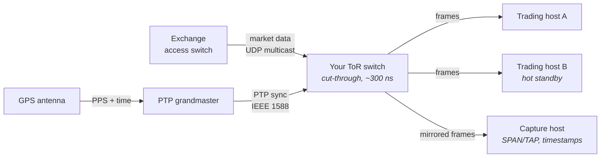
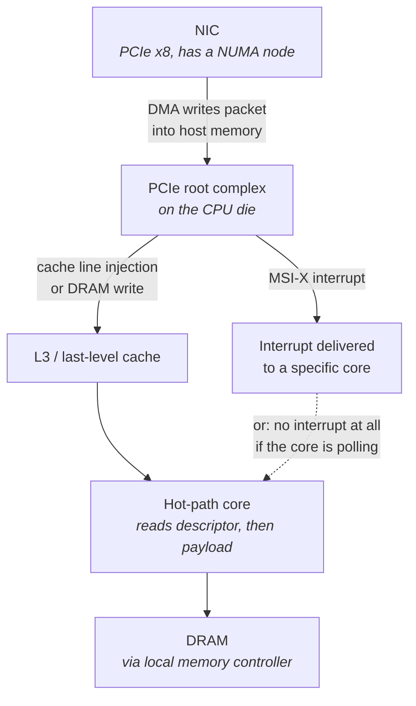
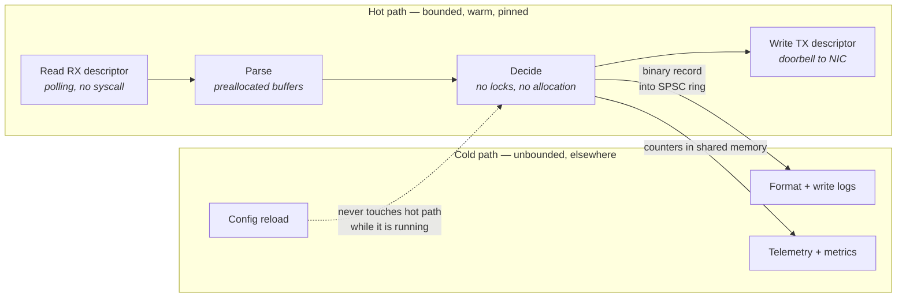
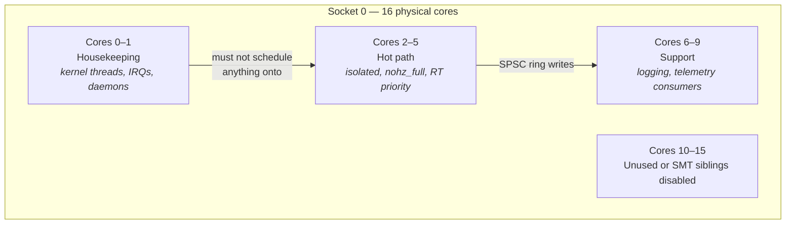
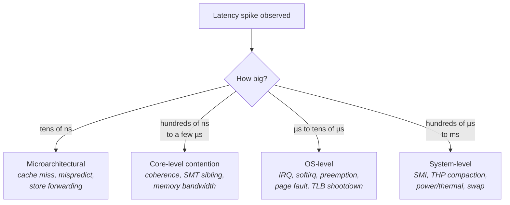
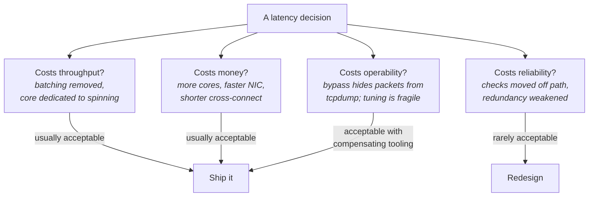

# The Mental Model of a Trading Host

The previous chapter established what latency is and how to measure it. This one establishes *where
it lives*. Before you can reason about a cache miss or an interrupt, you need a mental picture of the
machine those things happen on — not a generic "server," but the specific, deliberately constrained
object that a latency-critical workload runs on.

That picture matters because almost every optimization in this book is really an act of **resource
partitioning**. You are not making the machine faster; a trading host runs the same silicon as a web
server, often at a lower clock than a desktop. What you are doing is deciding which parts of the
machine are allowed to touch the work that must be fast, and evicting everything else. Cores get
divided into ones that serve packets and ones that do everything else. Memory gets divided into
pages that are pinned and pages that are not. Interrupt vectors get steered away from certain CPUs.
The physical NIC gets chosen partly for which PCIe slot it sits in. None of that makes sense unless
you carry a map of the machine in your head.

The failure this chapter prevents is the most common one among engineers new to the field: treating
the host as a uniform pool of compute. Under that model, "the code is fast, so the system is fast"
is a valid inference. It is not. A hot path that executes in 800 nanoseconds can produce a 4
millisecond outlier because a monitoring agent on another core called `munmap`, or because firmware
decided to poll a temperature sensor, or because a page the thread needed had never been written to
before. Those are not code problems. They are problems of the machine's *other* occupants, and you
cannot see them without knowing who the occupants are.

## Anatomy of a Colocated Server

Start from the outside and work in, because the outer layers set the constraints the inner ones
operate under.

A **colocated** server is one physically housed in the same building as the exchange's matching
infrastructure, in rack space rented from the exchange or a datacenter operator. The reason is the
one fixed cost in the whole system: light travels through single-mode fiber at roughly 200,000 km/s,
about two-thirds of its speed in vacuum, giving roughly 5 µs of delay per kilometre each way (see
"What 'Low Latency' Actually Means"). Every metre of distance between your machine and the
exchange's is a delay you cannot optimize away in software. Colocation reduces that distance to tens
of metres. Once there, the remaining physical variable is the **cross-connect** — the actual patch
cable running from your rack, usually through a shared patch panel area called a meet-me room, to
the exchange's access switch. Cable length is billed and specified, and the difference between a 10
m and a 50 m run is about 200 ns round trip. That is a real number in this domain, and it is
purchased rather than engineered.

Inside the rack, the topology is deliberately shallow. Every switch hop costs a few hundred
nanoseconds even with the best hardware, so trading networks minimize hop count in a way that
enterprise networks do not — often a single switch between the host and the exchange handoff, with
no aggregation layer, no firewall, and no NAT in the path. Redundancy is provided by *diverse
parallel paths* rather than by devices in series, which matters because a device in series adds
latency to every packet whereas a parallel path adds none (see "Network Design and Operations").

- **The capture host is not optional.** Independent packet capture with hardware timestamps is the
  only ground truth for wire-to-wire latency; in-process timers cannot see the NIC or the driver.
- **The grandmaster clock exists so timestamps across machines are comparable.** Without a common
  time base disciplined to GPS, a one-way delay measurement between two hosts is meaningless (see
  "Network Design and Operations").
- **The standby host is a parallel path, not a serial one.** It sees the same multicast traffic and
  adds nothing to the primary's latency.

### The chassis: what is actually in the box

Now open the machine. A modern x86 trading host is usually a 1U or 2U server, and the components
that matter for latency are not the ones a spec sheet leads with.

The CPU choice is the first place intuition from general server work misleads. Datacenter workloads
buy cores; latency workloads buy *frequency and cache per core*. A 64-core part running at 2.2 GHz
has more aggregate throughput than a 16-core part at 4.0 GHz, but the hot path is a single thread,
and that thread runs almost twice as fast on the second machine. High core counts also bring larger
on-die interconnects, more NUMA (Non-Uniform Memory Access) domains, and lower sustained turbo
frequencies. Many trading hosts are deliberately single-socket for exactly this reason: a
single-socket machine has no cross-socket interconnect for traffic to traverse and no possibility of
a thread and its memory landing on different sockets (see "Memory Systems").

Memory is populated for channel count, not capacity. Each memory channel is an independent path from
the CPU's integrated memory controller to DRAM; populating half of them halves the machine's memory
bandwidth regardless of how many gigabytes are installed. Hot-path working sets are small — often
small enough to sit in L3 — so total capacity is rarely the binding constraint, but bandwidth
consumed by *other* processes on the machine is (see "Memory Systems").

The NIC (Network Interface Card) is where the machine's identity as a trading host becomes visible.
It sits in a PCIe slot, and which slot matters for two reasons. First, PCIe lanes are owned by a
specific socket's root complex, so on a multi-socket machine the NIC has a NUMA node, and a thread
processing its packets from the wrong node pays interconnect latency on every single packet. Second,
slots differ in lane count and generation; a x8 Gen4 slot and a x4 Gen3 slot are not
interchangeable, and a NIC negotiated down to fewer lanes than it expects will show elevated
latency under load without any obvious error (see "Buses, Devices, and I/O Hardware").

- **The NIC writes into memory before software knows anything happened.** Direct Memory Access (DMA)
  means the packet lands in a pre-arranged buffer and the CPU is notified afterwards — or discovers
  it by polling.
- **Interrupt delivery targets a core, and which core is configurable.** Leaving that at the default
  is how an interrupt ends up preempting the hot path (see "The Linux Networking Stack").
- **The dotted edge is kernel bypass in one line.** If the hot-path core spins on the receive
  descriptor ring itself, the interrupt path — and the kernel — disappears from the picture (see
  "Kernel Bypass").

Two more components are easy to overlook and both are jitter sources. The **BMC** (Baseboard
Management Controller) is a small independent computer on the motherboard that provides remote
management, and the **system firmware** (BIOS/UEFI) retains the ability to seize the CPU at any
moment via a **System Management Interrupt (SMI)** — a hardware interrupt that transfers control
into firmware code the operating system cannot see, preempt, or inspect. SMIs handle things like
thermal management, memory error correction, and legacy USB emulation. Their duration is entirely
vendor-determined and can reach hundreds of microseconds. This is covered in detail in "Tuning a
Linux Box for Determinism"; the point here is that the machine has an occupant more privileged than
your kernel.

**Failure mode: latency outliers that no software profiler can account for.** Symptom is
multi-hundred-microsecond spikes with no corresponding activity in `perf` output, no scheduler
event, and no page faults. Cause is likely an SMI or another firmware-level stall. Confirm with
`turbostat`, which reports a per-CPU SMI count column on Intel platforms, sampled before and after
the incident; corroborate with `hwlatdetect` from the `rt-tests` package, which spins with
interrupts disabled and reports gaps in the timestamp counter that only firmware could have caused.

**Try it:** map your own machine before reading further. Run `lscpu` for the core-to-socket-to-node
mapping, `numactl --hardware` for the NUMA nodes and their memory, and
`sudo dmidecode --type memory | grep -E 'Locator|Size|Speed'` to count populated channels. Then find
your NIC's node with `cat /sys/class/net/<iface>/device/numa_node` — a value of `-1` means the
kernel could not determine it, which on a multi-socket machine is itself worth investigating. If
`hwloc` is installed, `lstopo --of console` renders all of this as one tree.

### The software occupants

Physically the machine is one box. Logically it hosts several distinct kinds of work, and the whole
discipline of tuning is about keeping them apart.

| Occupant | What it does | Where it must not be |
|---|---|---|
| **Hot-path thread(s)** | Reads packets, decides, writes packets | Anywhere shared — this is the thing being protected |
| **Feed handling / decode** | Parses inbound market data | Often the same thread as the hot path; sometimes one hop upstream |
| **Housekeeping threads** | Logging, telemetry, config, health reporting | The hot-path cores; ideally a different NUMA node |
| **Kernel background work** | Timer ticks, RCU callbacks, workqueues, kswapd | Isolated cores (see "Processes, Threads, and Scheduling") |
| **Interrupt handling** | NIC IRQs, timer IRQs, IPIs | Hot-path cores, except the NIC IRQ you deliberately want there |
| **Operations agents** | Monitoring, config management, security tooling | Frequently the single largest source of surprise jitter |

The last row deserves emphasis because it is where real deployments fail. A standard corporate
monitoring agent that wakes every second to read `/proc`, an antivirus scanner, or a configuration
management daemon that periodically walks the filesystem will each generate syscalls, page cache
activity, memory-map churn, and cross-core interrupts. None of it touches your process. All of it
touches your tail latency (see "Jitter Hunting").

**Failure mode: an identically configured host in the same rack is measurably slower.** Symptom is
two machines with the same hardware, same binary, and same tuning showing different p99.9. Cause is
usually a difference in what *else* is installed and running. Confirm by diffing the process lists
and, more usefully, by comparing `/proc/interrupts` and `/proc/softirqs` between the two machines
over a fixed interval — the machine with more interrupt activity on its hot-path cores is the slow
one, and the counters name the source.

## The Hot Path and the Cold Path

Every latency-critical system has exactly one job that must be fast and a large amount of work that
must merely get done. The **hot path** is the sequence of operations that runs between a stimulus
arriving and a response leaving — packet in, decision, packet out. The **cold path** is everything
else: startup, configuration, logging, telemetry, reconciliation, error recovery, shutdown.

This distinction sounds trivial and is not, because the naive interpretation is "optimize the hot
path, ignore the cold path," and that is wrong in a specific and expensive way. The cold path does
not need to be fast, but it does need to be *contained*. It shares the machine with the hot path,
and every resource they share is a channel through which the cold path can inject delay: cache
capacity, memory bandwidth, the memory controller's queues, the on-die interconnect, TLB entries,
kernel locks, interrupt delivery, and the scheduler itself. A logging thread that formats a string
and writes to a file has, in doing so, evicted hot-path data from L3, consumed memory bandwidth,
possibly triggered a page fault, and potentially issued a TLB shootdown that interrupts the hot-path
core (see "Memory Systems"). The hot path never called any of that code and pays for it anyway.

So the real discipline has two halves. First, **remove work from the hot path** — anything unbounded
gets pushed to startup or to a different thread. Second, **isolate the hot path from the cold path**
— separate cores, separate memory, separate interrupt routing, so that the cold path's work does not
leak through a shared resource.

- **The only thing the hot path may hand to the cold path is a write into a lock-free queue.** A
  single-producer single-consumer (SPSC) ring buffer write is a store to memory the producer already
  owns — tens of nanoseconds, with no kernel involvement (see "Synchronization and IPC").
- **Formatting happens on the consumer side.** Converting a number to text costs hundreds of
  nanoseconds; the hot path writes raw bytes and lets the cold path render them (see "Observability
  Without Slowing Down").
- **The dotted edge is a design constraint, not a data flow.** Configuration changes are applied
  between events or via a pointer swap, never by taking a lock the hot path might contend on.

### What "on the hot path" actually excludes

The list of banned operations follows directly from the determinism argument in the previous
chapter: an operation belongs on the hot path only if its worst case is bounded and small. Most
conveniences of ordinary programming fail that test not because they are slow on average but because
their cost distribution has a long tail.

| Operation | Typical cost | Worst case | Why the tail exists |
|---|---|---|---|
| Read from a pre-faulted, cache-resident buffer | ~1 ns | ~100 ns | L3 or DRAM miss |
| Write into an SPSC ring | ~10–30 ns | ~200 ns | Cache line transfer to the consumer |
| Uncontended mutex lock/unlock | ~20 ns | 2–10 µs | Contention → futex → scheduler |
| Heap allocation | ~50–100 ns | 1 ms+ | Arena lock, `mmap`, page fault, compaction |
| Trivial syscall | ~100 ns – 1 µs | 10 µs+ | Mitigations, preemption on return |
| Blocking read on a socket | — | Unbounded | Scheduler decides when you run again |
| Write to a log file | ~1 µs | 10 ms+ | Page cache, writeback, `fsync` |

*Order-of-magnitude figures for a modern x86 server (Skylake-and-later class); see "What 'Low
Latency' Actually Means" for the full cost ladder.*

The pattern is that the median column is unremarkable and the worst-case column spans five orders of
magnitude. This is why "we measured it and it's only 60 nanoseconds" is not an argument for putting
an allocator on the hot path. You measured the common case of a bimodal distribution.

**Failure mode: p50 and p99 are fine, p99.99 is 300× worse.** Symptom is a latency histogram with a
clean body and a handful of enormous outliers at a rate that roughly matches some periodic activity.
Cause is a bounded-on-average operation occasionally taking its slow branch — an allocator hitting
its arena lock, a log write blocking on writeback, a lazily-initialized structure being built on
first use. Confirm by capturing timestamps around each hot-path stage into a preallocated array and
segmenting the histogram: profile *only* the slow samples, not the aggregate (see "Measuring
Correctly").

### Warmth as a resource

There is a second, subtler property of the hot path, and it does not appear in any code review:
**the hot path must be recently executed to be fast.** Modern CPUs are aggressively history-driven.
The branch predictor learns which way each branch went. The caches hold the last data touched. The
TLB holds recently used address translations. The instruction cache holds recently executed code.
None of these are populated on the first execution of a code path, and all of them decay when
something else runs.

The consequence is that a system which is idle between bursts pays a cold-start penalty precisely
when it matters, because bursts are exactly when the hot path is most valuable. A path that runs in
900 ns when executed continuously may take 4 µs on its first execution after a quiet second — not
because anything is wrong, but because every predictor and cache is cold and the code must be
re-fetched from L3 or DRAM.

The standard remedy is **cache warming**: periodically executing the hot path against synthetic
input that is discarded before it can produce output. This keeps the instruction cache, data cache,
branch predictors, and TLB entries populated. It costs CPU cycles on a core that is dedicated
anyway, and it is one of the few techniques whose entire purpose is to reduce variance rather than
mean latency (see "The Cache Hierarchy").

- **Warming must exercise the real code path**, including the branches the real path takes, or the
  predictors learn the wrong thing.
- **Warming must not produce side effects** — no outbound packets, no state mutation. Getting this
  boundary right is a design problem, not a tuning one.
- **Warming interacts with idle states.** A core that goes idle drops into a deep C-state and takes
  microseconds to wake; a core that is warming never idles, which also keeps its frequency up (see
  "Clocks, Timers, and Time").

**Failure mode: the first event after a quiet period is several times slower than steady state.**
Symptom is a latency distribution whose outliers correlate with inter-arrival gaps rather than with
load. Cause is cold caches, cold predictors, and deep C-state exit latency. Confirm by recording
inter-arrival time alongside latency and checking for correlation, and by reading
`/sys/devices/system/cpu/cpu<N>/cpuidle/state*/usage` and `.../time` before and after the quiet
period to see which idle state the core entered.

**Try it:** measure the warm/cold gap directly. Write a loop that executes some non-trivial function
and records its cycle count, first back-to-back, then with a 10 ms sleep between iterations. Compare
the two distributions. Then repeat with the core pinned via `taskset -c <N>` and idle states
restricted — you can limit the deepest state by writing `1` to
`/sys/devices/system/cpu/cpu<N>/cpuidle/state<K>/disable` for the deep states — and observe how much
of the gap was C-state exit versus cache coldness.

### The core allocation map

Once you accept that hot and cold work must be physically separated, the machine's cores stop being
interchangeable and become a resource you assign by name. Most trading hosts carry an explicit map,
usually as a comment in a config file, that says which core does what.

- **Housekeeping cores exist so the kernel has somewhere to run.** Isolating cores does not eliminate
  kernel work; it relocates it, and it must land somewhere explicit (see "Processes, Threads, and
  Scheduling").
- **Isolated cores are configured at boot**, via `isolcpus=`, `nohz_full=`, and `rcu_nocbs=` kernel
  parameters, because some of the relevant kernel structures are set up before userspace exists.
- **SMT siblings are part of the map.** Two hardware threads on one physical core share execution
  units, L1, and L2; a busy sibling can halve the hot path's effective throughput. Many trading
  hosts disable simultaneous multithreading entirely (see "Multicore, Coherence, and Memory
  Ordering").

**Try it:** inspect the current partitioning on any Linux box. `cat /proc/cmdline` shows the boot
parameters actually in effect — check for `isolcpus`, `nohz_full`, `rcu_nocbs`. Then
`cat /proc/interrupts` and look at which columns (CPUs) are receiving interrupts; on a properly
tuned host the isolated cores' columns are nearly static except for their own NIC queue. Sample the
file twice a few seconds apart and diff it — the deltas are what matter, not the absolute counts.

## Where Jitter Comes From

Jitter is variation in latency, and it is the quantity this book spends most of its effort on. The
reason is stated in the previous chapter but bears restating mechanically: the median latency of a
hot path is set by the work it does, and you can read that off the code. The tail is set by *other
actors on the machine interrupting it*, and you cannot read that off anything. It has to be
enumerated, and then hunted.

The useful structure is a layered taxonomy, because each layer has its own characteristic timescale,
its own detection tool, and its own remedy. An engineer who can say "that's a 200 µs spike at
roughly 1 Hz, so it's not a cache effect and it's too regular to be contention — I'd look at timer
work or firmware" is doing the thing interviews are testing for. Magnitude and periodicity together
usually identify the layer before any tool is run.

- **Magnitude is the first discriminator.** A 50 ns spike and a 5 ms spike have no mechanisms in
  common, and starting the investigation at the wrong layer wastes days.
- **Periodicity is the second.** Anything at exactly 1 Hz, 250 Hz, or 1000 Hz is almost certainly a
  timer; anything correlated with message rate is contention or queueing.
- **This diagram is the skeleton of the diagnostic method** developed fully in "Jitter Hunting."

### Layer 1: Microarchitectural

The smallest and most frequent variations come from the CPU itself doing exactly what it was
designed to do. These are not defects and cannot be eliminated, only reduced.

A cache miss that reaches DRAM costs roughly 80–100 ns on a modern x86 server versus ~1 ns for an L1
hit — so whether a particular load hits or misses swings the instruction's cost by two orders of
magnitude (see "The Cache Hierarchy"). A branch mispredict flushes the pipeline and costs roughly
15–20 cycles. A TLB miss triggers a page walk of up to four dependent memory accesses. On a machine
with no other activity at all, these alone produce a latency distribution several hundred
nanoseconds wide.

They are managed by data layout, working-set size, access patterns, and warming — the entire subject
of Part I. What matters at this level of the mental model is knowing their *scale*, so that a 2 µs
spike is immediately recognized as too large to be a cache miss and the investigation moves up a
layer.

### Layer 2: Core and socket contention

The next tier comes from other cores on the same chip competing for genuinely shared hardware. This
is the layer that surprises people most, because the interference arrives from code that is not
running on your core and that you may not have known existed.

Four shared resources dominate. The **last-level cache (L3)** is shared across cores on a socket, so
a neighbour streaming through memory evicts your hot data. **Memory bandwidth and the memory
controller's queues** are shared, and as the previous chapter's queueing argument implies, latency
degrades sharply as bandwidth utilization rises (see "Memory Systems"). The **on-die interconnect**
carries both memory traffic and cache coherence traffic. And on an SMT-enabled core, the **execution
units, L1, and L2 are shared with the sibling hardware thread**, which is the most direct form of
interference available — the sibling is literally competing for issue slots in the same pipeline.

There is also coherence traffic generated by your own code. When two cores write to the same cache
line, the line must ping-pong between their private caches, costing hundreds of nanoseconds per
transfer. When they write to *different variables that happen to share a line*, the same cost
applies for no logical reason at all — the **false sharing** problem (see "The Cache Hierarchy").

**Failure mode: latency degrades whenever a batch job runs, at modest CPU utilization.** Symptom is
p50 stable and p99 rising, correlated with another process's activity, with no scheduling events on
the hot-path core. Cause is L3 eviction and memory bandwidth contention rather than CPU contention.
Confirm by re-running with the neighbour pinned to a different socket via `numactl --cpunodebind`,
and by measuring socket memory bandwidth with the uncore integrated-memory-controller counters under
`perf stat` (event names are platform-specific; `perf list | grep uncore_imc` shows what your
machine exposes).

**Failure mode: enabling a second thread halves single-thread performance.** Symptom is throughput
per thread dropping sharply when a second thread is added, on what appear to be two separate CPUs.
Cause is that the two CPUs are SMT siblings of one physical core. Confirm with
`cat /sys/devices/system/cpu/cpu<N>/topology/thread_siblings_list`, which names the sibling
explicitly, and by re-running with the threads placed on different physical cores.

**Try it:** demonstrate SMT interference in ten minutes. Pin a compute loop to a core with
`taskset -c <N>` and record its cycle count distribution. Then start a second busy loop on that
core's sibling — found via `thread_siblings_list` above — and re-measure. Then move the second loop
to a different physical core and measure again. The three distributions differ substantially, and
the middle one is why trading hosts often set `/sys/devices/system/cpu/smt/control` to `off`.

### Layer 3: Operating system

This is the largest category by count and the one most amenable to tuning, because nearly every
source has an off switch or a redirection.

The fundamental issue is that Linux is a general-purpose, preemptive, time-sharing operating system.
Its default behaviour is to periodically interrupt every CPU to make scheduling decisions, to run
deferred work wherever it is convenient, to migrate threads toward idle cores, and to defer memory
allocation until first use. Every one of those defaults is correct for a general server and hostile
to a hot path.

| Source | Mechanism | Typical magnitude | Where to look |
|---|---|---|---|
| **Timer tick** | Periodic interrupt for scheduling and accounting | ~1–10 µs, at the tick rate | `/proc/interrupts` row `LOC`; `CONFIG_HZ` |
| **Device interrupt** | NIC or other device raises MSI-X; handler runs | 1–20 µs | `/proc/interrupts` per-vector rows |
| **Softirq** | Deferred interrupt work — network RX/TX, timers, RCU | 5–100 µs | `/proc/softirqs`; `/proc/net/softnet_stat` |
| **Preemption / migration** | Scheduler runs something else on your core | 1–5 µs per switch, plus cold caches after | `perf sched latency`, `perf sched timehist` |
| **Minor page fault** | First write to an allocated page | ~1–3 µs | `ps -o min_flt -p <pid>`; `/proc/<pid>/stat` |
| **Major page fault** | Page must be read from storage or swap | 20 µs – many ms | `ps -o maj_flt -p <pid>` |
| **TLB shootdown** | Cross-core IPI to invalidate a stale translation | ~1–10 µs, scaling with core count | `/proc/interrupts` row `TLB` |
| **RCU callbacks** | Deferred reclamation work on each CPU | µs-scale, bursty | `rcu_nocbs=` boot parameter to offload |
| **THP compaction** | Kernel synchronously defragments memory | up to several ms | `compact_stall` in `/proc/vmstat` |
| **kswapd / reclaim** | Memory pressure triggers page reclamation | ms-scale | `/proc/pressure/memory` (PSI) |

*Order-of-magnitude figures; actual costs vary substantially with kernel version, hardware, and
which speculative-execution mitigations are enabled.*

Three entries in that table deserve elaboration because they are the ones that reach a supposedly
isolated core.

A **softirq** is Linux's mechanism for deferring work that an interrupt handler should not do while
interrupts are disabled — most importantly, processing received network packets. The handler that
runs when a NIC interrupt fires does almost nothing; it schedules a softirq, which runs shortly
afterwards and walks the receive ring, building packet structures and pushing them up the stack.
That softirq can run for a long time under load, and it runs on whichever core handled the
interrupt. If that is your hot-path core, the hot path is stalled for the duration (see "The Linux
Networking Stack").

A **TLB shootdown** is an inter-processor interrupt (IPI) sent when a memory mapping changes, forcing
every core that might hold a stale translation to discard it. Critically, the sending process may be
entirely unrelated to yours. Any process on the machine calling `munmap`, or `madvise(MADV_DONTNEED)`,
or freeing enough memory that the allocator returns it to the kernel, can interrupt your pinned,
isolated hot-path thread (see "Memory Systems"). Core isolation does not protect against this,
which is why "no other processes doing memory-map churn" is part of a trading host's configuration
rather than an accident.

The **timer tick** is the scheduler's periodic heartbeat. Modern kernels support `nohz_full`, which
suppresses the tick on nominated CPUs *when exactly one runnable task is on them*. That condition is
strict: schedule a second thread onto a `nohz_full` core and the tick comes back without warning.
The tick is not eliminated so much as made conditional, and the condition is your responsibility to
maintain (see "Processes, Threads, and Scheduling").

**Failure mode: an isolated core shows interrupt activity it should not have.** Symptom is jitter on
a pinned thread with a clean application profile. Cause is that isolation is incomplete —
`isolcpus` prevents the scheduler from placing tasks, but does not move IRQ affinity, and does not
stop IPIs. Confirm by diffing `/proc/interrupts` across an interval and identifying which vector
rows are incrementing on the isolated CPU's column; `TLB`, `RES` (rescheduling IPIs), and `CAL`
(function-call IPIs) are the usual culprits.

**Failure mode: latency spikes tightly correlated with message rate rather than with time.** Symptom
is p99 rising with load in a way that is too large to be CPU saturation. Cause is often softirq
processing consuming increasing time on the receiving core, potentially hitting the kernel's budget
limit and rescheduling itself. Confirm by reading `/proc/net/softnet_stat` — the third column counts
`time_squeeze` events, where the softirq exhausted its budget and had to be re-scheduled, which is a
direct indicator of RX processing saturation.

**Try it:** watch the tick and the IPIs. On any Linux box, run
`watch -n1 "grep -E 'LOC|RES|CAL|TLB' /proc/interrupts"` and observe the counts rising on every CPU
even when the machine is idle. Then run a small program that repeatedly `mmap`s and `munmap`s a
region and watch the `TLB` row climb — including on CPUs that never ran your program. That is the
shootdown mechanism made visible.

**Try it:** quantify scheduler interference on your own workload. Run
`perf sched record -- sleep 10` while your process runs, then `perf sched latency` for a per-task
summary of how long tasks waited to be scheduled, and `perf sched timehist` for the event-by-event
detail. On a properly isolated hot-path thread the wait times should be essentially zero; anything
else names the thread that preempted you.

### Layer 4: Platform, firmware, and power

The last layer is the one furthest outside software's control and consequently the one that produces
the largest and most confusing outliers.

**Frequency scaling** is the most common. Modern CPUs run at a variable clock: they boost above base
frequency when thermal and power budgets allow, and drop below it when they do not. Transitions
between frequency states (P-states) take time, and while a transition is in progress the core may be
stalled. Worse, the same code executes at different speeds at different moments, so a benchmark that
was accurate yesterday is not today. **Idle states** (C-states) are the counterpart: an idle core
powers down progressively deeper, and waking from a deep C-state costs microseconds. Both are
default-on and both are usually disabled or clamped on trading hosts (see "Clocks, Timers, and
Time").

**Thermal throttling** is frequency scaling's involuntary form. When a package exceeds its thermal
limit, hardware reduces frequency regardless of any operating system setting. This produces a
distinctive signature: gradual latency degradation over minutes, correlated with sustained load and
ambient temperature, that recovers when load drops.

**SMIs**, introduced earlier, are the extreme case: firmware code running with the operating system
entirely suspended. Duration is vendor-specific and unbounded from the kernel's perspective. There
is no software fix; the remedies are BIOS configuration (disabling legacy USB emulation and
aggressive power management features) and hardware selection.

**DRAM refresh** produces small, periodic, entirely unavoidable delays as rows are refreshed and
cannot be accessed (see "Memory Systems"). And **PCIe and NIC-level effects** — interrupt
coalescing, descriptor ring exhaustion, link training — add their own variance at the microsecond
scale (see "Buses, Devices, and I/O Hardware").

**Failure mode: benchmark results drift over the course of a long run.** Symptom is latency creeping
upward over tens of minutes with no change in workload, recovering after an idle period. Cause is
thermal throttling. Confirm with `turbostat`, which reports per-core actual frequency (`Bzy_MHz`)
and package temperature alongside SMI counts; a falling `Bzy_MHz` under constant load is conclusive.

**Failure mode: latency changes when the machine is otherwise idle.** Symptom is that a benchmark
run alone gives different results from one run alongside light background load — sometimes *better*
with the background load. Cause is that the background load keeps cores out of deep C-states and
keeps frequency boosted. Confirm by reading
`/sys/devices/system/cpu/cpu<N>/cpuidle/state*/usage` before and after, and by checking the current
governor with `cpupower frequency-info`.

**Try it:** find your machine's power configuration and its cost.
`cpupower frequency-info` reports the active governor and frequency range;
`cpupower idle-info` lists the available C-states with their exit latencies in microseconds — read
those numbers, since they directly bound how long a wakeup can take. Then run a latency benchmark
with the governor at its default, and again after setting it to `performance` with
`sudo cpupower frequency-set -g performance`, and compare the distributions rather than the means.

### Putting the taxonomy to work

The value of the taxonomy is that it converts an unbounded search into a short decision procedure.
Given an outlier, three properties narrow it down before any deep tooling is involved.

| Property | What it suggests |
|---|---|
| **Magnitude ~10–100 ns** | Microarchitectural — cache, predictor, alignment |
| **Magnitude ~100 ns–2 µs** | Coherence, SMT sibling, memory bandwidth |
| **Magnitude ~2–100 µs** | Interrupt, softirq, preemption, page fault, IPI |
| **Magnitude >100 µs** | Firmware, power/thermal, compaction, reclaim, swap |
| **Periodic at a round frequency** | Timer, monitoring agent, kernel background thread |
| **Correlated with message rate** | Queueing, softirq budget, contention |
| **Correlated with uptime** | Memory fragmentation, page migration, resource leak |
| **Correlated with idle gaps** | Cold caches, C-state exit, frequency ramp |
| **Present on one host only** | Configuration drift — compare against a known-good host |

## Trade-offs: Latency, Throughput, Reliability, and Cost

Every technique in this book gives something up. Naming a technique without naming its cost is the
single most reliable way to sound like you have read about low latency rather than practised it, and
it is what interviewers listen for. This section builds the four-way trade-off explicitly, because
the choices only make sense against each other.

The first thing to internalize is that the four axes are not symmetric in importance and not
symmetric in how they are spent. In this domain, **throughput and cost are routinely spent to buy
latency and determinism**, because a core costs a few thousand dollars a year and a microsecond of
tail latency can cost far more. That inverts the intuition from general server engineering, where
the resource being conserved is CPU. Reliability is the axis that cannot be spent freely, because
the failure modes of a latency-critical system are not "slow" but "wrong" — and a system that emits
incorrect output quickly is worse than one that emits nothing.

- **The two left branches are the normal currency of this work** — burning a core to busy-poll or
  paying for a lower-latency switch is an ordinary decision.
- **The reliability branch is where judgement is actually tested.** Moving a risk check off the hot
  path is a different kind of decision from removing a batch.
- **Operability is the axis most often forgotten.** Kernel bypass moves packets past the kernel, so
  `tcpdump` stops seeing them; that must be replaced with something before, not after (see "Kernel
  Bypass").

### Latency versus throughput

The mechanism behind this trade-off is always the same: **amortization requires waiting.** Batching
divides a fixed cost across several units of work, which improves the average cost per unit and
delays the first unit until the batch is assembled. Every throughput optimization in a computer
system is a variation on this.

| Technique | Throughput benefit | Latency cost |
|---|---|---|
| **Interrupt coalescing** | One interrupt per *N* packets instead of per packet | The first packet waits for the timer or the count (see "The Linux Networking Stack") |
| **Generic receive offload (GRO)** | Merges packets so the stack runs once per batch | The first packet in a merge waits |
| **Nagle's algorithm** | Fewer, larger TCP segments | Small writes delayed up to a round trip (see "TCP In Depth") |
| **Deep NIC/qdisc queues** | Absorbs bursts without loss | Queueing delay proportional to occupancy |
| **Thread pools and work queues** | High core utilization | Handoff latency plus scheduler involvement |
| **Blocking rather than polling** | Core available for other work | Wakeup latency of microseconds |

The last row is the canonical example and worth stating precisely. A blocking receive puts the
thread to sleep; when a packet arrives, the kernel must wake it, which means a scheduler decision, a
context switch, and a cache-cold restart — several microseconds in total, with a tail that is
scheduler-dependent. A **busy-poll** loop instead spins reading the receive descriptor, so the
packet is noticed within tens of nanoseconds. The cost is one core running at 100% utilization
producing nothing measurable, forever. In throughput terms that is indefensible; in latency terms it
is the standard design (see "Processes, Threads, and Scheduling").

There is a second-order cost to busy polling that is easy to miss: a spinning core generates heat
and consumes power budget, which can reduce the turbo headroom available to *other* cores on the
same package. Spending a core is not entirely free even in throughput terms.

**Failure mode: latency improves when load increases.** Symptom is a system whose p50 is *worse* at
low message rates than at high ones. Cause is usually interrupt coalescing configured with a timer:
at low rates every packet waits out the full coalescing interval, while at high rates the packet
count threshold fires first. Confirm by reading the current settings with `ethtool -c <iface>` and
observing the `rx-usecs` and `rx-frames` values, then re-measuring with `ethtool -C <iface>
rx-usecs 0 rx-frames 1` to disable coalescing.

**Try it:** measure the polling-versus-blocking gap yourself. Write a UDP echo responder twice —
once using a blocking `recvfrom`, once using a non-blocking socket in a spin loop — and measure
round-trip latency from another host with the same load generator. Then check CPU utilization with
`mpstat -P ALL 1` for both. You are buying microseconds with a whole core, and seeing the exchange
rate concretely makes the decision intuitive rather than dogmatic.

### Latency versus reliability

This axis is where careless optimization becomes dangerous rather than merely wasteful, so the
framing matters. The question is never "should we drop this check?" It is: **can this guarantee be
provided without the check being on the critical path?**

Several standard answers exist, and they generalize:

- **Precompute rather than check.** A validation whose inputs are known in advance can be resolved
  before the event arrives, leaving the hot path with a table lookup rather than a computation.
- **Make the safe state the default.** If the system is disabled unless explicitly enabled, a
  failure to complete a check fails closed without needing a check on the hot path.
- **Move durability off the critical path.** Writing a record into a lock-free ring, with a separate
  thread persisting it, provides the same record with a bounded hot-path cost — at the price of a
  window in which a crash loses the most recent entries. Whether that window is acceptable is a
  requirements question, and it should be answered explicitly rather than inherited by accident.
- **Use parallel redundancy, not serial redundancy.** Two independent hosts receiving the same
  multicast feed add no latency to each other. A checker process in series with the hot path adds
  its full cost to every event.

The reliability requirements themselves also drive system structure in ways that cost latency
unavoidably. A **kill switch** — a mechanism for stopping all outbound activity immediately — must
be checked somewhere, and checking it in the hot path is the only place it can be effective. The
engineering work is making that check as close to free as possible: a single load from a
cache-resident, hot-path-local flag, rather than a lock, a syscall, or a shared-memory read that may
miss (see "Reliability and Failure Handling").

**Failure mode: recovery is far slower than steady-state operation, and untested.** Symptom is that
a system meeting its latency target in normal operation takes seconds to resume after a
disconnection or restart, because the cold path was never engineered. Cause is optimizing only the
hot path. Confirm by measuring the actual time from process start to first correct response,
including page-fault warm-up, connection establishment, and state reconstruction — and by treating
that number as a requirement rather than a curiosity.

**Failure mode: the redundant host is not actually redundant.** Symptom is that a failover produces
a gap or a duplicate. Cause is state that lived only in the primary's memory. Confirm by exercising
failover deliberately under load rather than reasoning about it, and by comparing both hosts'
received-packet counters via `ethtool -S <iface>` to verify the standby is genuinely seeing the same
feed.

### Latency versus cost

Cost enters at every layer, and the ratios are unusual enough to be worth stating plainly, because
the reader's calibration from general software work will be wrong.

| Decision | What it buys | What it costs |
|---|---|---|
| Colocation vs. remote hosting | Tens to hundreds of µs of propagation | Rack space, cross-connect, power — the largest single line item |
| Shorter cross-connect | ~5 ns per metre of fiber, each way | Usually a small recurring fee |
| Cut-through vs. store-and-forward switch | Hundreds of ns per hop | Meaningfully more expensive hardware |
| Kernel-bypass NIC and stack | ~10–40 µs of kernel stack per round trip | Licence cost, vendor lock-in, lost tooling |
| FPGA offload of the fastest path | Sub-µs response, very tight distribution | Development time, inflexibility, specialist skills |
| Higher-frequency, lower-core-count CPU | Faster single-thread hot path | Less aggregate compute per machine |
| Busy polling | µs of wakeup latency | One core, permanently |
| Disabling SMT | Removes sibling interference | Half the logical CPUs |
| Redundant hosts and paths | Availability | A second machine's full cost, and no latency benefit |

Two structural observations follow from that table. First, **the cheapest microseconds are bought
outside the software**: physical placement, switch selection, and NIC choice remove more latency per
unit of engineering effort than almost any code change, which is why the budget discipline from the
previous chapter matters — optimizing a 300 ns parse while an 8 µs kernel stack sits in the path is
misallocated effort. Second, **the expensive microseconds are bought at the extreme**: going from 10
µs to 5 µs is a tuning exercise, and going from 5 µs to 1 µs typically requires bypass or hardware,
which is a different scale of investment. The cost curve is steeply non-linear in latency, and
knowing roughly where you sit on it is what makes a design conversation productive.

### Latency versus operability

The fourth axis is the one that does not appear in the outline of most textbooks and does appear in
every real deployment. Aggressively tuned systems are harder to observe, harder to debug, and easier
to break.

Kernel bypass is the clearest case. Moving packet handling into userspace removes the kernel from
the path — and with it, `tcpdump`, the socket statistics in `ss`, the counters in `/proc/net/snmp`,
the kernel's own TCP state machine, and every tool built on top of them. The remedy is not to avoid
bypass but to replace the lost visibility deliberately: a hardware-timestamped capture on a
mirrored port supplies what `tcpdump` used to (see "Kernel Bypass" and "Network Debugging Toolkit").

Isolation and tuning have a similar property. A host configured with `isolcpus`, `nohz_full`, pinned
IRQ affinities, pre-reserved huge pages, a fixed frequency governor, and specific BIOS settings is
carrying dozens of pieces of state that a kernel upgrade, a firmware update, or a well-meaning
configuration management run can silently revert. The system does not fail when this happens; it
gets slower, in a way that only shows up in the tail. This is why drift detection — periodically
verifying that the machine is still configured the way it was intended — is treated as a first-class
production concern (see "Build, Deploy, and Environment Discipline").

**Failure mode: latency regresses after a maintenance window with no code change.** Symptom is a
step change in p99.9 dated to a reboot or an update. Cause is lost tuning: a kernel upgrade
rewriting boot parameters, a firmware update resetting BIOS power settings, or a package update
restarting `irqbalance` and redistributing interrupt affinities across all cores. Confirm by
comparing `/proc/cmdline`, `/proc/interrupts` affinity distribution, the frequency governor, and
huge page reservations against a recorded known-good snapshot.

**Try it:** build a drift check for one machine. Capture a baseline of `/proc/cmdline`, `lscpu`,
`cat /sys/devices/system/cpu/cpu*/cpufreq/scaling_governor`,
`grep HugePages /proc/meminfo`, `ethtool -c <iface>`, `ethtool -k <iface>`, and the interrupt
affinity masks under `/proc/irq/*/smp_affinity_list`. Store it. Re-run it after any reboot and diff.
Every line that changes is a latency question you now get to ask *before* it shows up in a
histogram.

## Numbers to Know

| Quantity | Value | Notes |
|---|---|---|
| Fiber propagation | ~5 µs per km | ~5 ns per metre; the cross-connect length term |
| Cut-through switch hop | ~300 ns – 1 µs | Store-and-forward adds a frame's serialization |
| L1 hit vs. DRAM access | ~1 ns vs. ~80–100 ns | The microarchitectural jitter band |
| Branch mispredict | ~5 ns | ~15–20 cycles |
| Cache line transfer between cores | ~100–500 ns | Coherence / false sharing cost |
| SPSC ring write | ~10–30 ns | The only sanctioned hot-path-to-cold-path handoff |
| Uncontended mutex | ~20 ns | Contended: 2–10 µs via futex |
| Trivial syscall | ~100 ns – 1 µs | Mitigation-dependent |
| Context switch | ~1–5 µs | Plus cache and TLB pollution afterwards |
| Minor page fault | ~1–3 µs | Eliminated by pre-touch plus `mlockall` |
| TLB shootdown IPI | ~1–10 µs | Scales with the number of target cores |
| Softirq run under load | ~5–100 µs | Visible as `time_squeeze` in `/proc/net/softnet_stat` |
| Deep C-state exit | ~1–100 µs | Read the exact values from `cpupower idle-info` |
| Kernel UDP round trip, same rack | ~20–50 µs | Untuned commodity stack |
| Kernel-bypass UDP round trip, same rack | ~3–10 µs | The ~10–40 µs the kernel was costing |
| SMI | ~10 µs – several hundred µs | Vendor-determined; invisible to the OS |
| THP compaction stall | Up to several ms | `compact_stall` in `/proc/vmstat` |
| Major page fault | 20 µs – many ms | Any nonzero count on a hot path is a defect |

*Order-of-magnitude teaching figures for a modern x86 server (Skylake-and-later class) with a
10/25 GbE NIC. Measure your own hardware before quoting any of these as fact about your system.*

## Key Takeaways

- A trading host is not a fast machine; it is a partitioned one — cores, memory, and interrupts are
  assigned by name rather than pooled.
- The outer layers set fixed costs: colocation and cross-connect length are latency you purchase,
  not latency you optimize.
- The NIC has a NUMA node and a PCIe slot, and both belong in the mental model alongside cores and
  memory.
- The hot path is the wire-to-wire critical path; the cold path is everything else and must be
  contained, not merely deprioritized.
- Hot and cold work interfere through shared resources — L3, memory bandwidth, the interconnect,
  interrupts, and kernel locks — even when they share no code.
- The only sanctioned hot-path-to-cold-path handoff is a write into a lock-free ring, with
  formatting and I/O deferred to the consumer.
- Warmth is a resource: caches, branch predictors, and TLB entries decay, so an idle system is a
  slow system on its next event.
- Jitter has four layers — microarchitectural, core/socket contention, operating system, and
  platform/firmware — each with its own timescale and its own tool.
- Magnitude and periodicity identify the layer before any tool is run; a 50 ns spike and a 5 ms
  spike share no mechanisms.
- Core isolation relocates kernel work rather than eliminating it, and does not protect against IPIs
  such as TLB shootdowns from unrelated processes.
- Throughput and cost are routinely spent to buy latency; reliability is the axis that cannot be
  spent freely, and the goal is to move guarantees off the critical path rather than remove them.
- Aggressive tuning costs observability and is fragile across reboots and updates, so drift
  detection is part of the design, not an operational afterthought.
