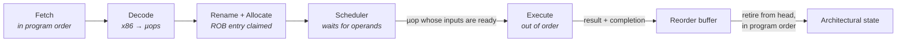
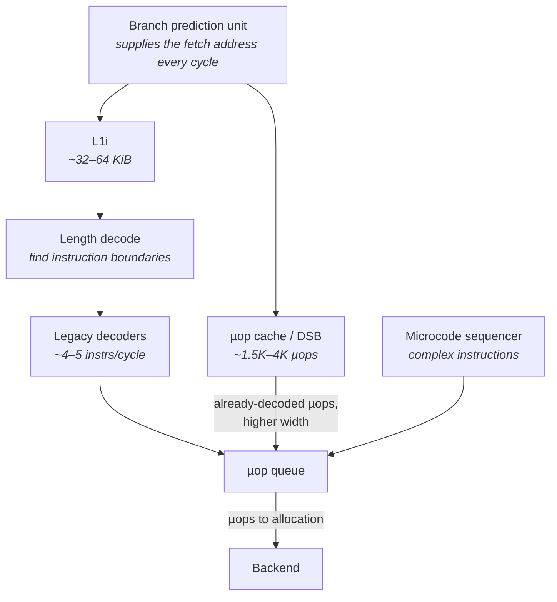
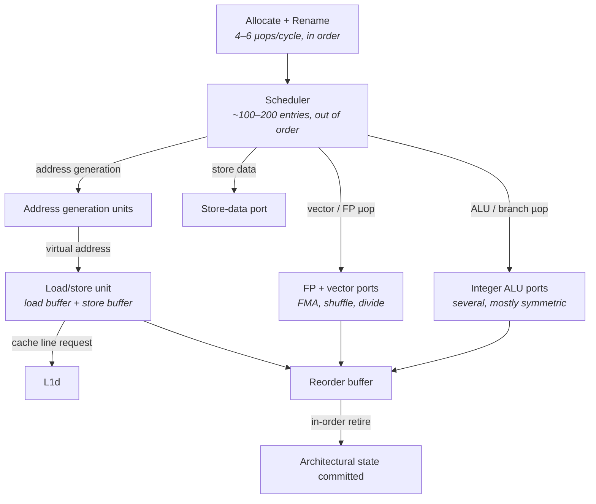
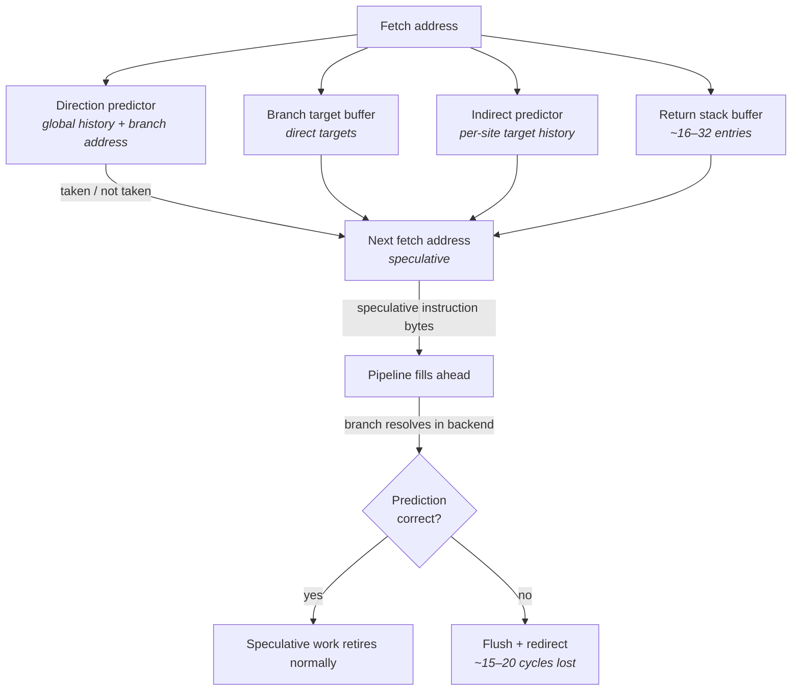
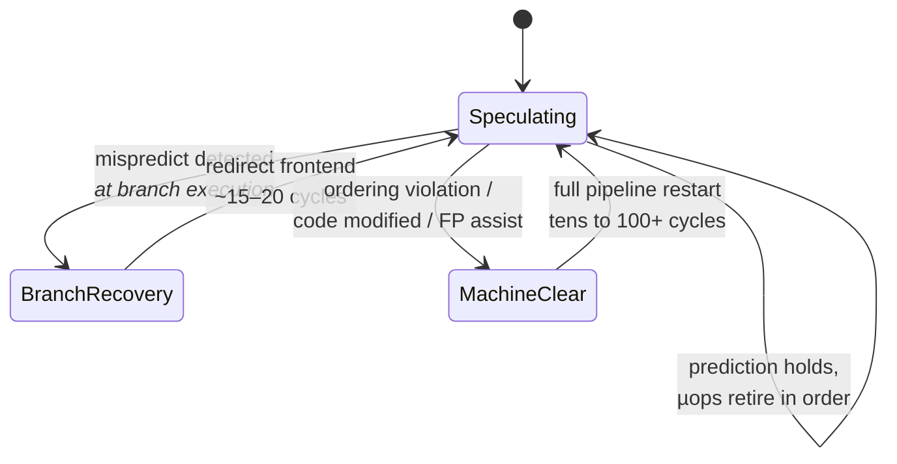
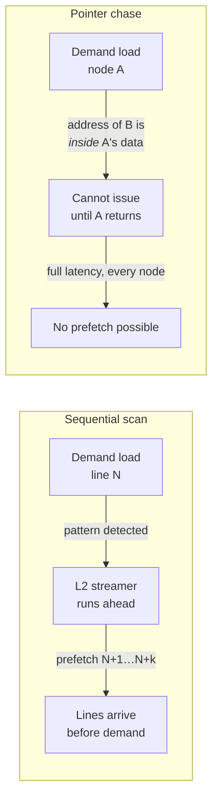

# CPU Microarchitecture Essentials

You know what a CPU does: it fetches instructions, executes them, and moves on. You may also know
that it does this in a pipeline, several instructions deep. That model is enough to reason about
algorithmic complexity, and it is almost useless for reasoning about latency.

The gap is this. A modern x86 server core running at 3 GHz has a clock period of about 0.33
nanoseconds. In that period it can, in the best case, complete four to six instructions — so roughly
one instruction every 60 to 80 picoseconds of sustained throughput. In the worst case it can sit
completely idle for four hundred cycles waiting for a single load to return from DRAM. That is a
range of four orders of magnitude, produced by the same instruction stream on the same hardware, and
none of it is visible in the source code. Chapter 1 established that the number you care about is
the tail, not the mean (see "What 'Low Latency' Actually Means"). This chapter is about the machinery
inside the core that decides where that tail comes from.

The central idea you need to internalize, and the one that reorganizes everything else, is that **a
modern core is not an instruction executor — it is a latency-hiding engine.** Almost every structure
in it exists to keep useful work happening while something slow is in progress. It fetches
instructions long before it knows whether it will need them. It guesses the outcome of branches and
proceeds on the guess. It executes instructions in whatever order their inputs become available, then
carefully pretends afterwards that it did them in program order. It fetches memory it has not been
asked for yet. All of this is invisible when it works, and all of it fails in specific, diagnosable
ways when it does not.

That framing gives you the diagnostic question that this chapter equips you to answer. When your hot
path is slower than it should be, the core was doing one of three things: retiring useful work
(you are compute-bound and need less work), waiting on the frontend (it could not supply instructions
fast enough), or waiting on the backend (it could not complete them fast enough, usually because of
memory). Those three cases have almost nothing in common, and the whole industry-standard method for
telling them apart — top-down analysis — rests on the structures described below.

## Pipelines, Superscalar Execution, and Out-of-Order Execution

Start with the design problem. Executing one instruction involves several genuinely different
physical activities: reading it from memory, working out what it means, fetching its operands,
performing an arithmetic operation, writing the result somewhere. If you build a machine that does
all of these for one instruction before starting the next, the clock period must be long enough for
the whole chain, and every piece of hardware sits idle most of the time. That is a non-pipelined
design, and no performance CPU has been built that way in forty years.

The fix you already know is **pipelining**: split the work into stages, latch the intermediate
results, and let each stage work on a different instruction simultaneously. Now the clock period only
has to cover the slowest single stage, so the clock gets much faster, and in steady state one
instruction completes per cycle. The cost is **depth**: an instruction now takes many cycles to
traverse the pipeline from end to end, and anything that forces the pipeline to be emptied and
refilled costs the full depth. Modern x86 cores are roughly 14 to 20 stages deep from fetch to
execute, which is the origin of the mispredict penalty we will get to shortly.

Pipelining caps you at one instruction per cycle. To go faster you must widen: build several of each
functional unit and issue multiple instructions per cycle. That is **superscalar** execution. But
widening exposes a problem that a one-wide pipeline mostly hides — dependencies. If instruction B
needs the result of instruction A, no amount of width helps; B must wait. And crucially, if B is
stalled, a strictly in-order machine also stalls C, D, and E behind it, even if those are completely
independent and their operands are sitting ready.

This is the observation that motivates the entire modern core. Consider a load that misses all cache
levels and goes to DRAM — around 80 to 100 nanoseconds on a modern x86 server, which at 3 GHz is
roughly 300 cycles (see "Memory Systems"). An in-order machine encountering a dependent use of that
load stops dead for 300 cycles. Over that window a 4-wide machine could have retired 1,200
instructions. The entire justification for out-of-order execution is recovering some fraction of
those 1,200 slots.

**Out-of-order (OOO) execution** decouples three things that a naive design conflates:

- **Program order** — the sequence the ISA says the instructions are in. This is what the programmer
  and the debugger see.
- **Execution order** — the order in which operations actually run, which is *data-driven*: an
  operation executes as soon as its inputs are ready and a suitable execution unit is free.
- **Retirement order** — the order in which results are made architecturally visible. This is forced
  back into program order, so that interrupts, faults, and debuggers see a consistent machine state.

The structure that makes this possible is the **reorder buffer (ROB)**, a queue holding every
instruction that has been issued but not yet retired, in program order. Instructions execute out of
order and deposit their results in temporary storage; the ROB retires them from the head, in order,
committing their effects. If something goes wrong — a fault, or a bad speculation — everything after
the offending entry is discarded and never becomes visible.

The diagram splits the core into two halves that behave very differently and fail very differently.
Everything up to and including allocation is the **frontend**, and it runs strictly in program
order — its job is supplying operations. Everything from the scheduler onward is the **backend**, and
it runs out of order — its job is completing them. When a core is stalled, it is stalled in exactly
one of those halves, and the fix for one is never the fix for the other.

Two more structures make OOO work, and both are worth naming because their names appear in counters
you will read.

**Register renaming** solves a bookkeeping problem. x86-64 exposes only 16 general-purpose
architectural registers, so compilers reuse them constantly. If instruction A writes `rax` and
instruction C, twenty instructions later, also writes `rax` for an unrelated purpose, an in-order
machine sees a conflict where none really exists — this is a *false* dependency, an artifact of
naming, not of data flow. The rename stage maps each architectural register write to a fresh entry in
a much larger **physical register file** (a few hundred entries on modern cores), so A and C get
different physical registers and can proceed independently. Only true data dependencies — where C
genuinely consumes A's value — survive renaming, and only those constrain execution.

**Micro-operations (µops)** solve the x86 problem. x86 instructions are variable-length, and many of
them do several things at once. The core does not execute them directly; it decodes them into fixed-
format internal operations called µops, and it is µops that are renamed, scheduled, executed, and
retired. A simple register-to-register add becomes one µop. A read-modify-write to memory becomes
several. Every width figure quoted for a modern core — "4-wide", "6-wide" — is µops per cycle, not
x86 instructions per cycle.

Here is the scale of the machinery involved, for a modern x86 server core of the Skylake-and-later
class. Exact values differ by generation and vendor, and later Intel and AMD cores are substantially
larger than the low end of these ranges.

| Structure | Typical capacity | What it limits |
|---|---|---|
| Pipeline depth, fetch to execute | ~14–20 stages | The cost of a full flush |
| Allocation/retire width | 4–6 µops per cycle | Peak throughput ("pipeline slots" per cycle) |
| Reorder buffer | ~200–500 entries | How far ahead the core can look for work |
| Physical registers (integer) | ~180–280 | How many renames can be live at once |
| Scheduler / reservation stations | ~97–200 entries | How many µops can be waiting on operands |
| Load buffer | ~70–190 entries | Concurrent in-flight loads |
| Store buffer | ~50–110 entries | Concurrent in-flight stores |

The ROB size is the one to remember, because it defines the core's **instruction window** — the span
of the instruction stream the core can see at once. A 500-entry ROB means the core can look roughly
500 µops ahead of a stalled instruction to find independent work. That is a lot, but a 300-cycle DRAM
miss at 4–6 µops per cycle would need well over a thousand slots to hide completely. The window is
finite, which is why memory latency is not fully hidden and why Chapter 5's material dominates real
hot-path profiles.

**Failure mode: a hot loop shows a low instructions-per-cycle figure with no obvious hotspot.**
Symptom is that `perf stat` reports an IPC (instructions per cycle) well under 1.0 on a loop whose
work looks trivial. Cause is almost always a stall — the core has run out of independent work while
something completes. IPC on its own does not tell you *which* half stalled. Confirm the split with
`perf stat -M TopdownL1`, which reports the four top-level categories (retiring, bad speculation,
frontend-bound, backend-bound) as fractions of available pipeline slots. Only then choose which of
the next sections applies.

**Failure mode: a microbenchmark is dramatically faster than the same code in production.** Symptom
is a hot function that measures at 20 ns standalone and 200 ns in situ. Cause is that the benchmark
loop is small enough that the ROB, the branch predictors, and the caches are all perfectly warm and
the loop's iterations overlap in the instruction window, while the production call site sits behind
a cold, branchy, cache-hostile caller. Confirm by measuring the same function in place with a cycle
counter (see "Clocks, Timers, and Time") rather than trusting the isolated benchmark.

**Try it:** get the baseline numbers off your own machine before reading further. Run
`perf stat -e cycles,instructions,branches,branch-misses ./your_workload` and compute IPC yourself
from the first two counters. Then run `perf stat -M TopdownL1 ./your_workload` and record the four
percentages. Every subsequent section of this chapter tells you what to do about one of those
four numbers, so having them in front of you makes the rest concrete. If `TopdownL1` is unavailable,
check what your PMU (performance monitoring unit — the CPU's built-in counter hardware) supports with
`perf list` and read `/sys/bus/event_source/devices/cpu/caps/pmu_name` to identify the
microarchitecture perf thinks it is running on.

## The Frontend: Fetch, Decode, and the µop Cache

The backend gets all the attention because memory is slow and memory is a backend problem. But a
6-wide backend is useless if nothing supplies it with six µops per cycle, and supplying them is
harder on x86 than on any other mainstream architecture.

The reason is instruction encoding. x86-64 instructions vary from 1 to 15 bytes, and there is no way
to find the start of the second instruction in a fetched block without first decoding the length of
the first. Decoding is therefore inherently serial at the length-determination step, and the hardware
that does it is large, power-hungry, and slow. A fixed-width ISA can decode eight instructions in
parallel trivially; x86 cannot. Everything distinctive about the x86 frontend is a workaround for
this.

The frontend's job is a pipeline in its own right: predict where execution is going, fetch those
bytes from the L1 instruction cache (L1i), find instruction boundaries, decode into µops, and deliver
them into a queue that feeds allocation. Note the ordering — **prediction comes first, not last.**
The frontend cannot wait to find out where a branch goes; by the time a branch is resolved in the
backend, dozens of cycles have passed and the frontend must have fetched far past it. The branch
predictor is not an optimization bolted onto the side of the pipeline; it is the thing that *drives*
the fetch address, every cycle, unconditionally.

The workaround for slow decode is caching the results. Modern Intel cores contain a **µop cache**
(Intel calls the structure the Decoded Stream Buffer, DSB) that stores µops already decoded from
recently executed instruction bytes. On a hit, the legacy decoders are bypassed entirely: µops are
delivered straight from the DSB at higher width and lower latency, and the decode hardware can be
power-gated. AMD cores from Zen onward have an equivalent op cache. The consequence for us is
concrete: **the same machine code runs measurably faster when it fits in the µop cache than when it
does not**, and the µop cache is small — on the order of 1.5K to 4K µops depending on generation,
which corresponds to a few tens of kilobytes of instruction footprint at best.

The diagram shows three possible sources of µops, and which one you are being fed from is directly
measurable on Intel hardware. The two fast paths are the DSB and the legacy decode path (Intel's
counters call the latter MITE); the slow path is the **microcode sequencer (MS)**, which handles the
handful of x86 instructions too complex to express in a few µops. An instruction that goes to
microcode delivers µops at low rate for many cycles and blocks the other paths while it does so.

There is one more subtlety that catches people: switching between the DSB and the legacy decoders is
not free. Intel exposes a counter for the penalty cycles incurred by those switches. Code that
straddles the boundary — a loop partially resident in the µop cache — can pay repeatedly.

The practical rules that follow are all about **instruction footprint**, which most engineers never
think about at all. Data footprint is a familiar concept; code footprint is the same idea applied to
the other side of the L1 cache.

- **Keep the hot path's code small.** L1i is typically 32–64 KiB on a modern x86 server core, and the
  µop cache covers far less than that. Code that does not fit is fetched from L2 or worse, on the
  critical path of the *frontend*, where the core has no ability to hide the latency by executing
  something else.
- **Aggressive inlining can make things slower.** Inlining removes call overhead and exposes
  optimization opportunities, but it duplicates code, and past a point the hot loop stops fitting in
  the µop cache. This is a genuine trade-off, not a rule, and it must be measured rather than assumed.
- **Cold code interleaved with hot code wastes fetch bandwidth.** Error handling, logging, and
  slow-path branches sitting in the middle of a hot function occupy cache lines and µop cache entries
  that are fetched and never executed. Separating hot and cold paths so that the hot path is
  contiguous is one of the highest-leverage frontend optimizations (see "Systematic Optimization").
- **Alignment matters at the loop level.** Fetch happens in aligned blocks, so a loop body that
  straddles more fetch blocks than necessary costs extra cycles per iteration. Compilers align loop
  entry points for this reason.

**Failure mode: a function gets slower after an unrelated function above it in the file grows.**
Symptom is a performance regression with no change to the affected code. Cause is code layout — the
hot loop shifted relative to fetch-block and µop-cache boundaries, or a previously co-resident pair
of functions now conflict in L1i. Confirm on Intel with `perf stat -e idq.dsb_uops,idq.mite_uops` and
compare the ratio before and after; a drop in the DSB fraction means the loop fell out of the µop
cache.

**Failure mode: high frontend-bound percentage with a low instruction cache miss rate.** Symptom is
`TopdownL1` reporting a large frontend-bound share while L1i misses look fine. Cause is usually
frontend *bandwidth* rather than *latency* — the decoders cannot produce µops fast enough, often
because of a µop-cache miss or DSB/MITE switching, not because the bytes are missing. Confirm with
`perf stat -e idq_uops_not_delivered.core,dsb2mite_switches.penalty_cycles` on Intel, which separate
undelivered slots from switch penalties.

**Failure mode: the first execution of a code path after an idle period is far slower.** Symptom is
that the first message after a quiet period costs several times the steady-state figure. Cause is
partly cold L1i and a cold µop cache, alongside cold data caches and cold branch predictors. Confirm
by comparing the latency distribution of events arriving after a gap against those arriving in a
burst. The standard mitigation — periodically executing the hot path against synthetic input so its
code, data, and predictor state stay resident — is covered in "The Cache Hierarchy."

**Try it:** measure your own µop cache hit rate. On an Intel machine, run
`perf stat -e idq.dsb_uops,idq.mite_uops,idq.ms_uops ./your_workload` and compute the DSB share of
total delivered µops. On a tight, well-behaved loop this should be overwhelmingly DSB. Then rebuild
with much more aggressive inlining, re-measure, and watch the DSB share fall as the footprint grows —
this is the frontend trade-off made visible rather than argued about.

**Try it:** look at what your compiler decided about layout. Disassemble the hot function with
`objdump -d --no-show-raw-insn ./binary` and find the loop body. Note the address of the loop entry
and whether it is aligned to a 16- or 32-byte boundary, and measure the total byte span of the loop.
Compare that span against your L1i size from `lscpu --caches` (or
`/sys/devices/system/cpu/cpu0/cache/index1/size`). A hot loop whose static footprint is a
non-trivial fraction of L1i is a frontend problem waiting to happen.

## The Backend: Ports, Schedulers, and Retirement

Once µops reach allocation, they enter a fundamentally different machine — one with no notion of
program order at all, in which µops move when their data is ready and stop when it is not.

Allocation is the handoff point. Each cycle, up to the machine's width, µops are given a ROB entry,
have their destination registers renamed to physical registers, and are dispatched into the
**scheduler** — the structure historically called the **reservation stations**. A µop sits in the
scheduler until two conditions hold simultaneously: every one of its source operands is available,
and an execution unit capable of performing it is free. Then it *issues*, executes, and broadcasts
its result so that any waiting µops depending on it can wake up.

Execution units are not interchangeable. They are grouped behind **execution ports**, and each port
can accept at most one µop per cycle. A port hosts a specific set of units: one might handle integer
ALU, branch, and vector integer operations; another might be the only port that can execute a
division; two others might be the only ones that can compute a load address. Modern Intel server
cores of the Skylake-and-later class have on the order of eight to twelve ports; AMD Zen cores have a
comparable arrangement with separate integer and floating-point scheduling domains. The number that
matters is not the port count but the *distribution*: if your hot loop happens to consist mostly of
operations that only one port can perform, that port is your throughput ceiling regardless of how
wide the machine is.

Two things in that diagram deserve emphasis. First, **loads and stores are split**: computing the
address is a separate operation from performing the access, and stores are split further into a
store-address µop and a store-data µop. This is why a single x86 instruction such as a
read-modify-write becomes several µops and consumes several ports. Second, **retirement is a
bottleneck of its own** — the ROB retires in order at the machine's width, so a long-latency
instruction at the head of the ROB blocks retirement of everything behind it even when those have
long since executed. This is the mechanism by which one DRAM miss stalls a core that has plenty of
completed work sitting ready.

That last point is the key to a common confusion. When people say "the core stalls on a cache miss,"
they usually picture execution stopping. It does not, immediately. Execution continues on independent
work while the miss is outstanding. What stops is *retirement*, because the missing load sits at the
ROB head. And when retirement stops, ROB entries are not freed; when the ROB fills, allocation stops;
and when allocation stops, the frontend backs up and the core genuinely does grind to a halt. The
stall propagates backwards through the pipeline, and the size of the ROB determines how long the core
can tolerate the miss before that happens.

The structures most often responsible for backend stalls, and what each one running out looks like:

| Resource | Exhausted when | Observable consequence |
|---|---|---|
| **ROB entries** | A long-latency op blocks the head while allocation keeps consuming entries | Allocation stalls; frontend backs up; classic memory-bound profile |
| **Scheduler entries** | Many µops waiting on the same slow producer | Allocation stalls even though the ROB has room |
| **Load buffer** | Too many loads in flight, typically all missing | Further loads cannot allocate |
| **Store buffer** | A burst of stores with slow-draining cache lines | Further stores cannot allocate; visible on store-heavy paths |
| **Physical registers** | Very long dependence-free stretches with many live values | Rare in practice; a sign of unusual code shape |
| **A single port** | The loop is dominated by one class of operation | Port-bound: adding work on other ports is free, adding more of the same is not |

There is a further class of backend hazard worth naming because it produces surprising results:
**store-to-load forwarding**. When a load reads an address that a still-in-flight store has written,
the core tries to satisfy the load directly from the store buffer rather than waiting for the store
to reach cache. This works, and it is fast, when the load's address and size line up neatly with the
store's. When they do not — a wide load overlapping several narrow stores, or a partially overlapping
address — forwarding fails, and the load must wait for the store to retire and drain to L1d. That is
a stall of a dozen or more cycles, produced by two instructions that look independent in the source.

**Failure mode: a loop's throughput is capped well below the machine's width for no visible reason.**
Symptom is IPC plateauing at, say, 1.0 on a 5-wide machine with no cache misses. Cause is often port
pressure — the loop is dominated by operations that only one or two ports can execute. Confirm by
counting µops dispatched per port; Intel exposes per-port dispatch events (visible under `perf list`
as the `uops_dispatched` family, with names that vary by generation). If one port's count equals the
cycle count, that port is saturated.

**Failure mode: an inexplicable stall on code with adjacent stores and loads.** Symptom is extra
cycles in a routine that writes a buffer and immediately reads part of it back with a different
width. Cause is a failed store-to-load forward. Confirm on Intel with
`perf stat -e ld_blocks.store_forward`; a count comparable to your loop iteration count is
conclusive.

**Failure mode: backend-bound percentage is high but cache miss counts are low.** Symptom is a
`TopdownL1` profile dominated by backend-bound with unremarkable `cache-misses`. Cause is a core-bound
rather than memory-bound backend — port pressure, long dependency chains, or high-latency operations
such as division. Confirm by descending a level in top-down analysis, which splits backend-bound into
memory-bound and core-bound; the `toplev` tool from Intel's `pmu-tools` automates this, and
`perf stat -M TopdownL2` exposes the second level directly on cores that support it.

**Try it:** demonstrate the retirement bottleneck. Write a loop that performs a long chain of
dependent integer additions (each using the previous result), and a second loop that performs the
same number of *independent* additions into different accumulators. Run both under
`perf stat -e cycles,instructions,uops_retired.slots` — the dependent version will show IPC near the
reciprocal of the ALU latency, the independent version near the machine width, with identical
instruction counts. This is the whole out-of-order story in two loops.

**Try it:** find your machine's division latency. Time a loop of dependent integer divisions and
compare against a loop of dependent multiplications. Divide is one of the few operations that is both
high-latency and poorly pipelined, and the ratio is typically large enough to be obvious without
careful methodology. That is why replacing division by a multiply is a real optimization and not
folklore.

## Instruction-Level Parallelism and How It Hides Latency

Everything above builds toward one quantity: **instruction-level parallelism (ILP)** — how many
independent operations exist in the instruction stream at any moment. ILP is not a property of the
hardware; it is a property of your code, which the hardware can exploit but cannot create.

The distinction that unlocks this is between **latency** and **throughput** for a single operation.
An integer multiply on a modern x86 core has a latency of roughly 3 to 5 cycles — that is how long
you wait before its result is usable. But it has a throughput of one per cycle, because the multiplier
is pipelined: you can start a new one every cycle even though each takes several to finish. These are
different numbers describing the same unit, and which one you observe depends entirely on whether
your multiplies depend on each other.

Consider the concrete case. Summing an array with a single accumulator produces a chain: each
addition needs the previous sum, so a new addition can start only every *latency* cycles. If addition
latency is 4 cycles, you get one element every 4 cycles regardless of how many adders the machine
has. Now split the sum across four independent accumulators and combine at the end. The four chains
are independent, so the core interleaves them, and you get four elements every 4 cycles — a 4×
speedup with identical instruction count and identical memory traffic. The technique is called
**accumulator splitting**, and it is the canonical demonstration that ILP is something you supply.

The same logic governs memory. A dependent chain of loads — following a linked list, walking a tree,
chasing hash-table buckets — cannot overlap, because the core cannot know the next address until the
current load returns. Every miss costs full latency. Independent loads, by contrast, can be issued
together and their latencies overlap. This is memory-level parallelism, and Chapter 5 treats it in
depth (see "Memory Systems"); the point here is that MLP is just ILP applied to the load unit, and
the ROB is the structure that bounds both.

That bound is worth making concrete, because it explains why out-of-order execution helps less than
its size suggests. To fully hide a 300-cycle DRAM miss on a 5-wide machine, the core would need 1,500
µops of independent work in its window. The ROB holds a few hundred entries. So an L1 hit (4–5
cycles) is hidden completely and invisibly; an L2 hit (~14 cycles) is usually hidden; an L3 hit
(~40–50 cycles) is often mostly hidden; a DRAM miss is only partially hidden. **The deeper the
memory access, the less out-of-order execution can do for you** — which is why the cache hierarchy
matters so much more than the core's width.

| Situation | What limits it | Typical outcome on a modern x86 server core |
|---|---|---|
| Independent ALU ops | Machine width and port count | Approaches 4–6 µops/cycle |
| Dependent ALU chain | Operation latency | One op per latency (e.g. one per cycle for add, one per 3–5 for multiply) |
| Independent loads, all L1 hits | Load ports (typically two) | Two loads per cycle |
| Dependent load chain, L1-resident | L1 load-to-use latency, ~4–5 cycles | One load per ~4–5 cycles |
| Dependent load chain, DRAM-resident | Full memory latency, no overlap | One load per ~300 cycles |
| Independent loads, DRAM-resident | Line-fill buffers (~10–16 per core) | Roughly 10–16 misses overlapped |

The practical technique list is short, because there are only so many ways to create independent
work:

- **Split accumulators** so reductions are not one long chain. Two to four independent chains is
  usually enough to saturate the relevant unit; more adds register pressure without benefit.
- **Unroll to expose independence, not to remove branches.** Unrolling's value is that it puts
  independent iterations adjacent in the window; the saved loop-counter increments are noise by
  comparison.
- **Convert pointer chasing into index arithmetic** where the data structure allows it. An index into
  a dense array can be computed without waiting for a load; a pointer must be loaded first.
- **Interleave independent work units** rather than completing one fully before starting the next,
  when both are short and both stall on memory. Two half-stalled streams overlap; two sequential ones
  do not.
- **Shorten dependency chains before reducing instruction count.** A version with more instructions
  and a shorter critical path frequently wins, which is counterintuitive if you are used to counting
  operations.

**Failure mode: removing instructions from a loop does not speed it up.** Symptom is that a
hand-optimized version with measurably fewer instructions runs at the same speed. Cause is that the
loop is latency-bound on its dependency chain, not throughput-bound on instruction count, so removing
work off the critical path changes nothing. Confirm by checking whether IPC *rose* while cycles
stayed flat — that combination means you removed non-critical work. The fix is to shorten the chain,
not the instruction count.

**Failure mode: a loop scales worse than expected when vectorized.** Symptom is that a version
processing four elements per operation is far less than four times faster. Cause is frequently that
the loop was never throughput-bound to begin with — it was bound by a dependency chain or by memory —
so widening each operation does not help. Confirm with the top-down split before and after; if
backend-bound/memory dominated in both, the bottleneck was never the arithmetic.

**Try it:** measure the ILP of your own machine directly. Write four versions of a sum over a large
array using one, two, four, and eight independent accumulators, and time each per element. The
speedup will rise and then plateau; the plateau point tells you the latency-to-throughput ratio of
the add unit, and the plateau value tells you where another resource took over. Run the same versions
under `perf stat -e cycles,instructions` and confirm the instruction counts are essentially
identical — the entire difference is scheduling, not work.

**Try it:** quantify how much the ROB is buying you. Take a loop with a known L3-resident working set
and interleave increasing amounts of independent arithmetic between the loads. Time per iteration
will stay roughly flat while the arithmetic hides inside the miss shadow, then start rising once the
arithmetic exceeds it. The knee is the miss latency expressed as work, and it is a much more useful
intuition than a nanosecond figure.

## Branch Prediction and the Cost of a Mispredict

Return to the fact established earlier: the frontend must produce a fetch address every single cycle,
and branches are resolved in the backend many cycles later. A 20-stage pipeline running 5 wide has
roughly a hundred µops in flight. If the machine waited for each conditional branch to resolve before
fetching past it — and branches occur roughly every five to six instructions in typical code — it
would stall for the full pipeline depth several times per hundred instructions and achieve perhaps a
tenth of its potential throughput. Prediction is not optional; it is load-bearing.

So the core *guesses*, every cycle, and it does so with structures far more sophisticated than the
"predict backward branches taken" heuristic that undergraduate courses describe. Three separate
predictions are involved, and it helps to keep them distinct:

**Direction prediction** answers "is this conditional branch taken?" Modern predictors are history-
based: they hash the branch's address together with a record of recent branch outcomes (the *global
history*) to index a table of counters. Because the history is included, the same branch can be
predicted differently depending on the path taken to reach it — which is how a predictor learns
correlations like "if the previous check failed, this one usually fails too." State-of-the-art
designs (TAGE-style predictors and their descendants, plus neural variants that AMD has described)
maintain several tables indexed with different history lengths and pick the most confident. On
well-behaved code, accuracy above 99% is routine.

**Target prediction** answers "if taken, where does it go?" For direct branches the target is encoded
in the instruction, and a **branch target buffer (BTB)** caches it so the frontend does not have to
wait for decode. For indirect branches — jump tables, function pointers, virtual dispatch — the
target varies at run time, and a separate indirect predictor tracks the history of targets seen at
that site. An indirect branch with one consistent target predicts nearly perfectly; one that
alternates among many targets unpredictably is close to a guaranteed mispredict.

**Return prediction** is a special case handled by a **return stack buffer (RSB)**, a small hardware
stack (typically 16 to 32 entries) that pushes the return address at each call and pops it at each
return. Calls and returns are perfectly matched in normal code, so this is extremely accurate — until
the stack overflows through deep recursion, or the software does something the hardware stack cannot
model.

The cost of the wrong branch in that diagram is the whole point. When the backend discovers a
mispredict, every µop fetched after the branch is wrong and must be discarded, the frontend must be
redirected to the correct address, and the pipeline must refill. The penalty is roughly the pipeline
depth: **on the order of 15 to 20 cycles on a modern x86 server core, which is about 5 to 7
nanoseconds at 3 GHz.** If the correct target is not in L1i or the µop cache — likely, since the core
was not fetching down that path — the real cost is higher, because the refill includes an instruction
fetch miss.

Five nanoseconds sounds trivial. Put it in the context Chapter 1 established: a hot path budgeted at
a few hundred nanoseconds wire-to-wire cannot absorb many of them. More importantly, a mispredict is
a *variance* source, not a fixed cost. The same code path costs 5 ns more on the iterations where the
data happens to be unusual — and unusual data is exactly what arrives during the market events you
most care about handling promptly. A predictor trained on the common case mispredicts precisely when
the uncommon case shows up.

That gives the practical rules, which are about making branches *predictable* rather than removing
them:

- **A branch that is consistently taken or consistently not taken is nearly free.** Predictor
  accuracy, not branch count, is what matters. Removing a perfectly-predicted branch buys almost
  nothing.
- **A 50/50 data-dependent branch is the worst case.** No history can help, and the predictor will be
  wrong roughly half the time.
- **Branchless code trades a mispredict for a dependency.** A conditional move or arithmetic
  select always costs its (short) latency and never flushes; a branch costs almost nothing when
  predicted and 15–20 cycles when not. Which wins depends on the mispredict rate, so this is
  a measurement, not a rule. The usual crossover is somewhere in the low percent.
- **Hoist unpredictable branches out of hot loops.** A check whose answer is constant for the whole
  loop belongs outside it, even at the cost of duplicating the loop body.
- **Sort or partition data so that branches become predictable.** Processing similar items together
  turns a scattered 50/50 branch into long runs of one outcome. This is often a larger win than
  anything done to the branch itself.
- **Indirect dispatch through many targets is expensive.** Function-pointer tables and virtual calls
  with a genuinely varying target mispredict often; keeping a dispatch site monomorphic — one target
  in practice — makes it nearly free.
- **Branch predictor state is a finite, shared resource.** The BTB and history tables have limited
  capacity and are not per-thread on SMT-enabled cores. A large, branchy code footprint evicts the
  hot path's predictor entries, and so does a sibling hyperthread (see "Multicore, Coherence, and
  Memory Ordering").

**Failure mode: latency spikes correlate with unusual input, not with load.** Symptom is that p99
worsens during exactly the events you care about, while p50 and throughput look fine. Cause is
frequently branch mispredicts on data-dependent paths that are rarely taken and therefore
mispredicted when they are. Confirm with `perf stat -e branches,branch-misses` on a replay of the
unusual input versus normal input, and compare the miss rate.

**Failure mode: a rarely-taken error path is disproportionately slow.** Symptom is that the exception
or rejection case costs far more than its instruction count suggests. Cause is a compound of a
mispredicted branch and a cold instruction fetch on the untaken path, plus a cold µop cache. Confirm
by sampling on mispredicts specifically: `perf record -e branch-misses -c 1000 ./workload` followed by
`perf report` attributes them to source lines.

**Failure mode: a dispatch site that was fast in testing is slow in production.** Symptom is a
virtual or function-pointer call that measured well against a single implementation and degrades once
several implementations are live. Cause is the indirect predictor going from monomorphic to
polymorphic. Confirm by measuring `branch-misses` at that call site with
`perf record -e branch-misses` and checking whether the count scales with the number of distinct
targets exercised.

**Try it:** reproduce the classic sorted-versus-unsorted result yourself, because seeing it is worth
more than reading it. Fill a large array with random values, then loop over it summing only the
elements above a threshold. Time it. Now sort the array first (excluding the sort from the timing)
and re-run the same loop. The sorted version can be several times faster on the same instruction
count, because the branch becomes a long run of "false" followed by a long run of "true." Confirm the
mechanism with `perf stat -e branches,branch-misses` on both — the branch count is identical and the
miss count collapses.

**Try it:** measure your machine's actual mispredict penalty. Build a loop containing one branch whose
direction is driven by a precomputed pseudorandom bit array, and a control loop with the same
instruction count and an always-taken branch. The per-iteration cycle difference, divided by the
measured mispredict rate, gives you the penalty in cycles. Compare it against the 15–20 cycle figure
above; a substantially larger number usually means the redirected fetch is also missing in L1i.

## Speculative Execution and Pipeline Flushes

Branch prediction is the most visible form of speculation, but it is not the only one, and treating
the two as synonyms leaves you unable to explain a whole category of stall. Speculation is the general
principle: **the core performs work it may have to undo, on the assumption that a guess will hold.**
Prediction supplies the guesses; the recovery machinery handles the cases where they do not.

Recovery works because of the separation established at the start of this chapter. Speculative µops
execute and write to *physical* registers, but nothing becomes architecturally visible until
retirement, and retirement happens in order. So the core can discard everything after a given ROB
entry by restoring the register-rename mapping to the checkpoint taken at that point and resetting
the pipeline's front. The architectural state never observed the speculative work at all — which is
precisely why speculative execution is invisible to a correct program, and why the Spectre class of
vulnerabilities was surprising: the *architectural* state is restored, but the *microarchitectural*
state, notably the cache, is not.

The important operational distinction is between the two kinds of recovery, which cost very different
amounts.

A **branch mispredict recovery** is comparatively cheap because the hardware anticipated it. The
branch's ROB entry is known, a rename checkpoint exists, and recovery redirects the frontend and
squashes the younger µops — the 15–20 cycles discussed above.

A **machine clear**, sometimes called a pipeline nuke, is the heavy hammer. It flushes the *entire*
pipeline, including µops older than the offending one, and restarts from the last retired
instruction. There is no checkpoint to roll back to, so the cost is substantially higher — on the
order of tens of cycles, and often over a hundred, on a modern x86 server core. Machine clears arise
from a handful of specific situations:

| Trigger | What happened | How it appears in a profile |
|---|---|---|
| **Memory ordering violation** | A load was speculatively executed before an older store and the store turned out to alias it — the load read stale data | Common on shared-memory producer/consumer paths; visible on Intel via `machine_clears.memory_ordering` |
| **Memory disambiguation failure** | The predictor that guesses whether a load aliases pending stores guessed wrong | Same family of counter; usually store-buffer-heavy code |
| **Self-modifying or cross-modifying code** | Executed bytes were written, invalidating already-decoded µops | Rare in normal code; common with JITs and runtime patching |
| **Floating-point assist** | An operation hit a case (such as a denormal input) that hardware cannot complete alone and microcode must handle | A specific numeric input suddenly costs far more than usual |

The memory-ordering clear deserves particular attention because it appears in exactly the code a
low-latency system writes. Consider a producer thread writing into a shared ring buffer and a
consumer reading from it. The consumer's core speculatively executes a load before an older store on
*its own* core has resolved its address, or a remote store invalidates a line whose value the core
already speculatively consumed. When the conflict is detected, the core must clear. The observable
result is that a cross-thread queue handoff has a fat tail with no corresponding cache miss to blame.
The full memory-ordering model that governs this is Chapter 6's material (see "Multicore, Coherence,
and Memory Ordering"); what matters here is that violations are *detected and repaired* by a
pipeline flush, and the repair is expensive.

The state machine makes the asymmetry explicit: both paths return to speculating, but one loses a
pipeline depth and the other loses everything in flight. A profile showing a modest branch-miss rate
alongside a stubborn "bad speculation" figure in top-down analysis usually means machine clears are
the missing contributor.

Two further consequences of speculation are worth carrying forward.

**Speculation leaves microarchitectural traces.** A speculatively executed load brings a line into
cache, and that line stays there after the speculation is squashed. This is the basis of the Spectre
family of side channels, and the mitigations for them — indirect branch restricted speculation,
retpolines, return stack stuffing, and the various flush-on-transition schemes — impose a real,
measurable cost on indirect branches and on kernel entry. That cost is a systems-configuration
question rather than a microarchitecture one, and Chapter 9 covers the trade-off (see "Kernel
Architecture and the Syscall Boundary"). You can read what your machine is doing from the files under
`/sys/devices/system/cpu/vulnerabilities/`.

**Speculation burns resources whether or not it pays off.** Wrong-path execution consumes issue
slots, execution units, cache bandwidth, and — on an SMT-enabled core — resources shared with the
sibling thread. A branchy, poorly-predicted workload does not merely lose time to flushes; it
degrades everything sharing the core with it.

**Failure mode: high bad-speculation share in top-down analysis with a low branch-miss rate.**
Symptom is that `perf stat -M TopdownL1` attributes a significant slot fraction to bad speculation
while `branch-misses` looks acceptable. Cause is machine clears rather than mispredicts. Confirm on
Intel with `perf stat -e machine_clears.count,machine_clears.memory_ordering` and compare the two.

**Failure mode: a shared-memory queue handoff has a long tail unexplained by cache misses.** Symptom
is that the producer-to-consumer latency distribution has outliers that do not correlate with
coherence miss counts. Cause may be memory-ordering machine clears from speculative loads racing
remote stores. Confirm with `machine_clears.memory_ordering` counted on the consumer core
specifically, using `perf stat -C <cpu>` to restrict counting to that core.

**Failure mode: a specific input value makes an otherwise fast routine much slower.** Symptom is a
sharp, reproducible slowdown tied to particular data rather than to volume. Cause may be a
floating-point assist triggered by denormal values, where microcode is invoked to complete an
operation. Confirm by checking whether Intel exposes an assist counter on your generation
(`perf list | grep -i assist`) and by testing the same routine with the offending values replaced.

**Try it:** measure the mitigation tax on your own box. Read every file under
`/sys/devices/system/cpu/vulnerabilities/` to see which mitigations are active and how they are
implemented. Then time a workload heavy in indirect calls and syscalls, and compare the top-down
profile against the same workload's counters. You are not being asked to disable mitigations — that
is a security decision made elsewhere — but knowing what fraction of your budget they consume is part
of knowing your budget.

**Try it:** watch machine clears appear. Run a two-thread producer/consumer over a shared buffer,
counting `machine_clears.memory_ordering` on each core with `perf stat -C`. Then rerun with the two
threads on cores that do not share the buffer's line concurrently — for example by having the
producer batch its writes — and compare. The counter moving with the sharing pattern, while
`branch-misses` stays flat, isolates the mechanism.

## Hardware Prefetchers: What They Detect and How to Cooperate

Out-of-order execution hides memory latency only up to the size of the instruction window, and we
established that a DRAM miss exceeds it. There is only one way around that limit: **start the memory
access before the instruction that needs it is anywhere near the window.** That is what hardware
prefetchers do, and it is why a sequential scan over an array many times larger than L3 can run at
near-bandwidth speed while a random walk over the same array crawls.

A prefetcher is a small pattern-recognition engine watching the stream of memory accesses at some
level of the hierarchy. When it identifies a pattern it believes will continue, it issues fetches for
the addresses it expects to be needed, so that the data is already in cache — or at least in
flight — by the time the demand access arrives. It is entirely a hardware mechanism; nothing in your
code requests it, and nothing in your code can see it directly except through timing and counters.

Intel processors of the Skylake-and-later class document four such engines, and AMD's Zen family has
functionally comparable ones under different names. Understanding what each detects tells you exactly
which access patterns are and are not covered.

| Prefetcher | Level | What it detects | What it fetches |
|---|---|---|---|
| **DCU (data cache unit) prefetcher** | L1d | Ascending accesses to recently loaded data | The next line |
| **DCU IP prefetcher** | L1d | A constant stride associated with a particular load instruction's address | The next address in that stride |
| **L2 streamer** | L2 | Forward or backward streams of accesses within a region | Runs ahead in the stream, multiple lines |
| **Adjacent cache line ("spatial") prefetcher** | L2 | Any access | The paired line, completing a 128-byte aligned pair |

Three properties of these engines determine everything about how you write code for them.

**They track a limited number of streams.** The stream-detecting prefetchers maintain a table of
active streams; walking many arrays simultaneously in one loop can exceed it, and detection collapses.
Prefetcher effectiveness therefore degrades as the number of concurrently-traversed data structures
rises, which is a strong argument for processing fewer arrays per pass.

**They do not cross page boundaries.** This is the one that surprises people. Prefetchers work in
physical addresses; consecutive virtual pages are generally not physically consecutive, so a
prefetcher that ran past the end of a page would fetch unrelated memory. It therefore stops at the
boundary and must re-detect the stream on the next page. With 4 KiB pages, a sequential scan restarts
detection every 64 cache lines. **This is a direct, concrete performance argument for huge pages**
that is separate from the TLB-reach argument in Chapter 5: a 2 MiB page lets a stream run 512 times
further before the prefetcher has to start over (see "Memory Systems").

**They only detect regular patterns.** Sequential and constant-stride access is detected reliably.
Pointer chasing — where the next address is the *value* loaded by the previous access — is
fundamentally undetectable, because the address does not exist as a pattern anywhere until the load
completes. No prefetcher will ever help a linked-list traversal, and this is a hardware
impossibility, not an implementation gap.

The two halves of that diagram are the same number of cache misses and can differ by an order of
magnitude in wall time. That gap is the practical payoff of everything in this section.

Prefetching is not unconditionally good. An aggressive prefetcher that guesses wrong consumes memory
bandwidth for lines nobody uses and evicts lines somebody did. On a machine near bandwidth saturation
this is a real cost, which is why server BIOS menus expose per-prefetcher enable switches (typically
labelled "Hardware Prefetcher", "Adjacent Cache Line Prefetch", "DCU Streamer Prefetcher", and "DCU
IP Prefetcher") and why some latency-sensitive deployments disable the adjacent-line prefetcher in
particular. Intel also documents a model-specific register at address `0x1A4` on many processors
whose low bits gate these engines, writable via `wrmsr` from the `msr-tools` package; availability
and bit layout are processor-specific, so consult Intel's documentation for your model rather than
copying values. Treat all of this as something to measure on your workload, not a default to apply.

There are also **software prefetch instructions**, which let code request a line explicitly. They are
worth knowing about and worth being skeptical of. Software prefetch helps only when three conditions
all hold: the address is computable well in advance, the hardware prefetcher cannot detect the pattern
(so it adds rather than duplicates), and the prefetch distance is tuned so the line arrives neither
too late to help nor so early that it is evicted before use. Getting the distance wrong makes things
worse, and the right distance depends on the machine. It is a real technique for irregular but
predictable patterns — a gather through an index array where the indices are known ahead of the
data — and a common source of self-inflicted regressions elsewhere.

The cooperative design rules follow directly:

- **Prefer contiguous, forward, unit-stride traversal.** This is the pattern every engine detects.
- **Traverse fewer structures per pass.** Staying under the stream-tracking limit keeps detection
  alive; this reinforces the layout guidance in "Memory Systems."
- **Use huge pages for large sequential regions** so streams are not interrupted every 4 KiB.
- **Replace pointers with indices into dense arrays** wherever the structure permits, converting an
  undetectable chain into a detectable stride.
- **Do not add software prefetches speculatively.** Measure first; the hardware usually already has
  the regular cases.

**Failure mode: a sequential scan runs far below the bandwidth the machine can deliver.** Symptom is
a streaming loop achieving a fraction of the bandwidth a benchmark reports for the same socket. Cause
may be that the loop touches too many arrays at once, defeating stream detection, or that it walks
backward or with an irregular stride. Confirm on Intel with `perf stat -e l2_rqsts.pf_hit,l2_rqsts.pf_miss`
to see whether prefetches are being issued and whether they are useful, alongside `cache-misses`.

**Failure mode: performance improves substantially with huge pages on a purely sequential workload.**
Symptom is a speedup from huge pages on a scan whose TLB behavior should be fine, since sequential
access uses few translations. Cause is the prefetcher restarting at every page boundary rather than a
TLB effect. Confirm by comparing prefetch-issued counts per byte scanned with and without huge pages.

**Failure mode: added software prefetches make the code slower.** Symptom is a regression after
inserting explicit prefetch instructions. Cause is either that they duplicate work the hardware was
already doing, that the distance is wrong, or that the extra bandwidth pushed a loaded socket further
up the saturation curve. Confirm on Intel by counting `sw_prefetch_access.t0` alongside
`cache-misses` and checking whether the miss count actually fell.

**Try it:** map your prefetcher's reach. Traverse a large array with strides of 64, 128, 256, 512,
1024, and 4096 bytes, timing nanoseconds per element touched. Detection typically holds for small
strides and falls off once the stride approaches a page, at which point per-element cost jumps to
full miss latency. The stride at which the curve breaks is your machine's effective prefetch reach.

**Try it:** demonstrate the page-boundary effect. Run a purely sequential scan over a region of
several gigabytes, first with default 4 KiB pages and then with 2 MiB pages via
`madvise(MADV_HUGEPAGE)` or a hugetlbfs mapping. Both versions have near-perfect TLB locality because
the access is sequential, so any speedup you measure is attributable to uninterrupted stream
detection rather than translation.

**Try it:** if you have a machine you are permitted to reconfigure, take the top-down profile of your
streaming benchmark, then reboot with the adjacent-cache-line prefetcher disabled in BIOS and repeat.
On some workloads the reduced bandwidth waste improves tail latency; on others throughput falls.
Which one you get is workload-specific, and having measured it once on your own hardware is worth
more than any general recommendation.

## Numbers to Know

| Quantity | Value | Notes |
|---|---|---|
| Clock period | ~0.25–0.4 ns | 2.5–4 GHz, modern x86 server |
| Pipeline depth, fetch to execute | ~14–20 stages | Sets the mispredict penalty |
| Allocation / retire width | 4–6 µops per cycle | Peak "pipeline slots" per cycle |
| Reorder buffer | ~200–500 entries | The instruction window |
| Scheduler entries | ~97–200 | Μops waiting on operands |
| Store buffer | ~50–110 entries | Skylake-and-later class |
| L1i size | 32–64 KiB | Hot-path code footprint budget |
| µop cache (DSB) | ~1.5K–4K µops | A few tens of KiB of instruction footprint |
| Legacy decode width | 4–5 instructions/cycle | Bypassed on a µop cache hit |
| Branch mispredict penalty | ~15–20 cycles (~5–7 ns at 3 GHz) | Higher if the redirect misses in L1i |
| Machine clear (pipeline nuke) | Tens to 100+ cycles | Full flush, no rename checkpoint |
| Branch predictor accuracy, well-behaved code | >99% | Data-dependent 50/50 branches approach 50% |
| Return stack buffer | ~16–32 entries | Deep recursion overflows it |
| Integer add latency | 1 cycle | Throughput 3–4 per cycle |
| Integer multiply latency | ~3–5 cycles | Fully pipelined: one per cycle throughput |
| Integer divide latency | ~15–40 cycles | Poorly pipelined; the outlier |
| L1d load-to-use | ~4–5 cycles | Hidden completely by OOO |
| L2 hit | ~12–20 cycles | Usually hidden |
| L3 hit | ~40–50 cycles | Partially hidden |
| DRAM miss | ~200–350 cycles (~80–100 ns) | Exceeds the instruction window |
| Line-fill buffers per core | ~10–16 | Caps concurrent misses per core |
| Prefetcher page limit | Stops at every page boundary | 64 lines with 4 KiB pages; 32,768 with 2 MiB |

*Order-of-magnitude figures for modern x86 server cores, Skylake-and-later class. Structure sizes,
latencies, and port counts vary substantially by generation and vendor — measure them on your own
hardware rather than quoting these.*

## Key Takeaways

- A modern core is a latency-hiding engine; nearly every structure inside it exists to keep useful
  work flowing while something slow completes.
- Stalls live in exactly one of two halves — the in-order frontend that supplies µops or the
  out-of-order backend that completes them — and the fixes have nothing in common.
- Top-down analysis (`perf stat -M TopdownL1`) splits every cycle into retiring, bad speculation,
  frontend-bound, and backend-bound, and is the correct first measurement, before any hypothesis.
- x86's variable-length encoding makes decode expensive, so hot code that fits in the µop cache runs
  materially faster; instruction footprint is a real budget and aggressive inlining can overspend it.
- Execution is data-driven and out of order, but retirement is in order, so one long-latency
  instruction at the ROB head stalls the whole core once the window fills behind it.
- The reorder buffer bounds how much latency out-of-order execution can hide: an L1 hit disappears
  entirely, an L3 hit mostly, a DRAM miss only partially.
- ILP is a property of your code, not the hardware — splitting accumulators and shortening dependency
  chains routinely beats reducing instruction count.
- A branch is nearly free when predictable and costs 15–20 cycles when not, so the goal is
  predictability rather than branch elimination; data-dependent 50/50 branches are the worst case.
- Speculation is repaired by two mechanisms of very different cost: a branch recovery loses a pipeline
  depth, a machine clear loses everything in flight.
- Memory-ordering machine clears fatten the tail of shared-memory handoffs without producing any
  cache-miss signal, and `machine_clears.memory_ordering` is what identifies them.
- Hardware prefetchers detect sequential and constant-stride patterns, track a limited number of
  streams, and stop at every page boundary — which is a prefetch argument for huge pages independent
  of TLB reach.
- Pointer chasing is undetectable by any prefetcher and unoverlappable by out-of-order execution, so
  converting pointers to indices into dense arrays attacks both limits at once.
