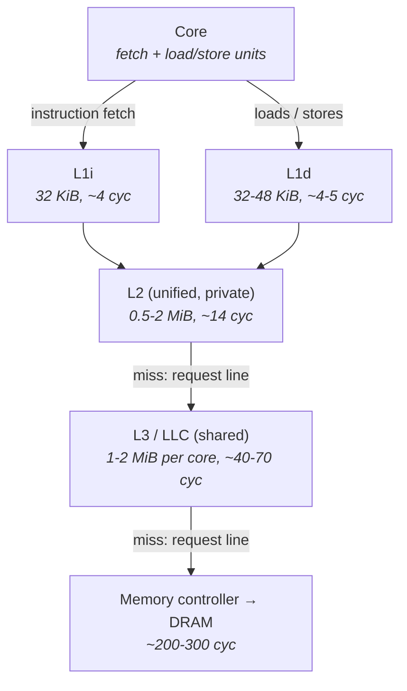
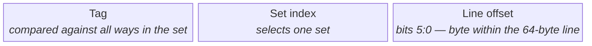
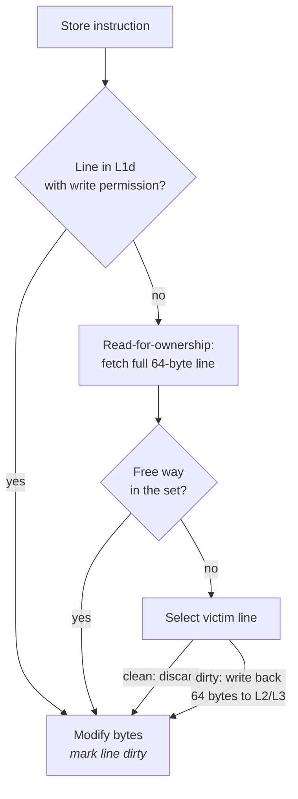
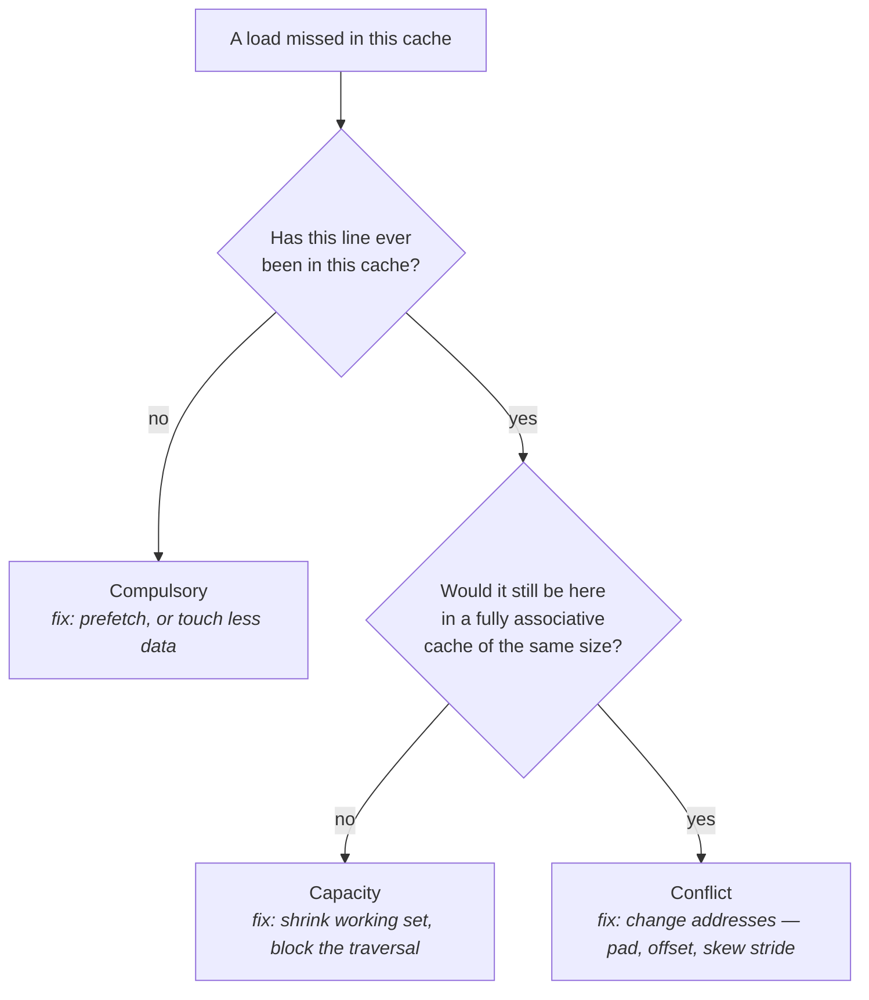
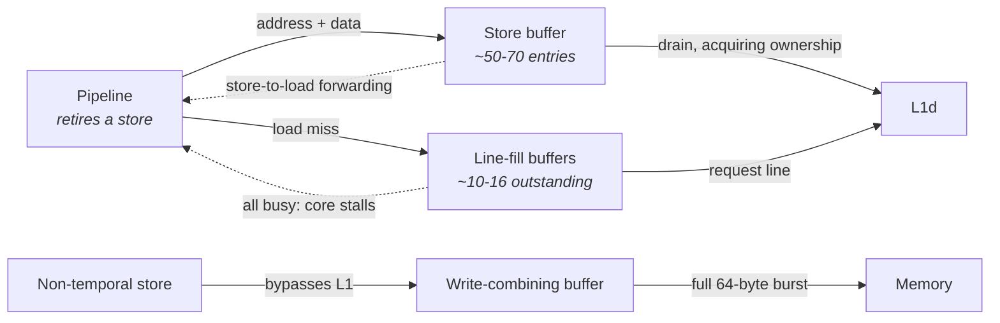

# The Cache Hierarchy

You know what a cache is: a small fast store that holds recently used data so the next access to it
is cheap. An undergraduate course teaches that much, usually alongside a hit-rate calculation, and
then moves on. That framing is not wrong, but it is useless for latency work, because it presents
the cache as an optimization — something that makes an already-correct program faster. On a modern
CPU the cache is not an optimization. It is the memory system. Main memory is roughly two orders of
magnitude slower than the core, and the machine is designed on the assumption that almost every
access is served without touching it. A program whose data does not live in cache is not a slightly
slower program; it is a program running on a machine that is stalled most of the time.

The concrete number is the one to anchor on. On a modern x86 server — Skylake-and-later class, which
is what this book means whenever it gives figures — a load that hits in the first-level data cache
completes in about 4 or 5 cycles, and the out-of-order engine hides most of even that (see "CPU
Microarchitecture Essentials"). A load that misses every level and goes to DRAM costs somewhere
around 200 to 300 cycles. At 3 GHz that is roughly 1.3 ns against roughly 80 ns. So a single cache
miss costs about as much as sixty L1 hits, and a hot path with a hundred-nanosecond budget can
afford approximately one of them. That ratio, not the hit rate, is the thing to internalize: cache
behavior does not scale your latency by a few percent, it decides which order of magnitude you are
operating in.

There is a second reason this chapter comes before the memory chapter rather than after it. Cache
effects are the dominant source of *variance*, not just of average cost. The same instruction, on
the same data, executed twice, can cost 1 ns or 80 ns depending on what else has run on that core
since — another thread, an interrupt handler, a logging routine, a kernel timer tick. Your code did
not change. The cache state did. Almost every "why was this one event slow?" investigation in a
low-latency system ends at either a cache miss, a branch mispredict, or the operating system, and
the first of those is the most common. This chapter covers how lines get into caches, how they get
evicted, how two threads can destroy each other's performance without sharing a single variable, and
how to see all of it with hardware counters instead of guessing.

Two boundaries. Cache *coherence* — the protocol by which multiple cores agree on the value of a
shared line — is Chapter 6's subject; this chapter owns the mechanics of lines and the pathology of
false sharing, and hands the protocol detail over (see "Multicore, Coherence, and Memory Ordering").
DRAM organization, address translation, the TLB, and NUMA are Chapter 5's; here, "a miss goes to
memory" is treated as a single cost (see "Memory Systems").

## Levels, Sizes, Latencies, and Inclusivity

The reason there is a hierarchy at all, rather than one large fast cache, is a physical constraint:
a memory array's access time grows with its capacity. Bigger means more rows to decode, longer wires
to drive, more capacitance, more time. A designer choosing a single cache size therefore has to pick
one point on that curve for everything, and there is no good point — small enough to be fast holds
too little, large enough to hold the working set is too slow.

The resolution is to build several caches of different sizes and stack them, so that the fast small
one handles the common case and the slow large one catches what the fast one could not hold. Each
level trades capacity against latency, and each level's misses become the next level's traffic.
Because programs exhibit locality — they reuse recently touched data, and they touch data near data
they just touched — a small cache captures a disproportionate fraction of accesses, and the
arrangement works out far better than the sizes alone suggest.

Three levels is the near-universal arrangement on server x86, with one asymmetry worth noting
immediately: the first level is *split* into separate instruction and data caches, while L2 and L3
are unified. That split exists because the fetch unit and the load/store units want to read the
first-level cache simultaneously every cycle, and building one array with enough ports to serve both
is more expensive than building two. The consequence for you is that your code and your data compete
for cache capacity only from L2 outward — but that they compete very much *is* a real effect, and a
bloated hot path can evict its own data from L2.



The figures in that diagram, and the table below, are order-of-magnitude values for modern x86
servers. They differ between vendors, between generations, and sometimes between SKUs of the same
generation; read them from the machine in front of you rather than quoting them.

| Level | Typical size | Typical latency | Scope | Notes |
|---|---|---|---|---|
| **L1i** | 32 KiB | ~4 cycles | Per core | Instructions only; backed by a µop cache on the frontend (see "CPU Microarchitecture Essentials") |
| **L1d** | 32 KiB, 48 KiB on Ice Lake-and-later | ~4–5 cycles | Per core | Data only; the load-use latency the scheduler assumes |
| **L2** | 512 KiB client, 1–2 MiB server | ~12–20 cycles | Per core (shared by an SMT pair) | Unified; the "mid-level cache" in Intel documentation |
| **L3 / LLC** | ~1–2 MiB per core on Intel server; 32 MiB per core-complex on AMD Zen | ~40–70 cycles | Shared across cores | Physically sliced and distributed; latency depends on distance |
| **DRAM** | — | ~200–300 cycles (~70–100 ns) | Per socket | Covered in "Memory Systems" |

Two of those entries deserve unpacking, because they are where naive mental models break.

**L3 latency is not a single number.** On a large server, the last-level cache is not one block. It
is cut into slices, one per core, distributed around an on-die mesh or ring, and a physical address
is mapped to a slice by a hash function. When your core requests a line, the request travels across
the interconnect to whichever slice owns that address, and the answer travels back. A hit in a
nearby slice is meaningfully faster than a hit in a distant one, so L3 latency on a 40-core part has
a real distribution — often spanning 50 to 80 cycles — where a 4-core client part has something much
tighter. Larger core counts buy capacity at the cost of both latency and its variance.

**Inclusivity determines what a miss actually costs, and it changed.** An *inclusive* L3 guarantees
that every line present in any L1 or L2 is also present in L3. That makes coherence lookups cheap —
if a line is not in L3, no core has it, so there is no need to ask anyone — but it wastes capacity,
because the L3 is duplicating everything the private caches hold, and it means an L3 eviction must
force the line out of the private caches too (a *back-invalidation*). An *exclusive* or
*non-inclusive* L3 does not duplicate, so the effective cache is the sum of the levels rather than
just the largest, but locating a line requires a directory or snooping.

| Design | Which hardware | Effective capacity | Consequence for you |
|---|---|---|---|
| **Inclusive L3** | Intel client parts; Intel server through Broadwell | L3 size | An L3 eviction can rip a line out of your L1/L2 even though you were using it |
| **Non-inclusive L3** | Intel server, Skylake-SP and later | Roughly L2 + L3 | Large private L2 (1–2 MiB) makes per-core working-set residency the thing to design for |
| **Exclusive / victim L3** | AMD Zen family | L2 + L3 | L3 holds what L2 evicted; a line you are actively using may not be in L3 at all |

The Skylake-SP transition is the one with practical consequences. Intel shrank L3 per core and grew
private L2 from 256 KiB to 1 MiB, changing the design target: on older parts you aimed to fit the
working set in a large shared L3, and on newer server parts you aim to fit it in a large *private*
L2, which is both faster and immune to what other cores are doing. A working set that fits in 1 MiB
is qualitatively better placed than one that fits in 20 MiB, because the second is shared with every
other core on the socket.

**Failure mode: a benchmark that was fast on a developer workstation regresses on the production
server.** Symptom is identical code, identical input, worse latency on the bigger machine. Cause is
usually L3 geometry — more cores means a longer mesh traversal to reach the owning slice, and a
smaller L3 share per core — combined with a different inclusivity policy. Confirm by comparing
`lscpu -C` (or the `/sys` cache files below) on both machines, and by running the same
working-set-sweep measurement on each rather than assuming the numbers transfer.

**Failure mode: hit rates look excellent and latency is still bad.** Symptom is a 98% L1 hit rate
alongside a hot path that misses its budget. Cause is that hit rate is the wrong metric: 2% of a
million accesses at 80 ns each is 1.6 ms of stall, and the tail of your distribution is made
entirely of the misses. Confirm by counting absolute misses per event
(`perf stat -e mem_load_retired.l3_miss` on Intel Skylake-and-later, event names vary by
generation) rather than a ratio, and dividing by the number of events processed.

**Try it:** read your actual cache geometry instead of trusting a table. Every level appears as a
directory under `/sys/devices/system/cpu/cpu0/cache/`:

```sh
for d in /sys/devices/system/cpu/cpu0/cache/index*; do
  echo "== $d"
  cat "$d/level" "$d/type" "$d/size" "$d/ways_of_associativity" \
      "$d/number_of_sets" "$d/coherency_line_size" "$d/shared_cpu_list"
done
```

`level` and `type` identify the cache, `shared_cpu_list` tells you which logical CPUs share it —
this is how you discover that L2 is shared by an SMT sibling pair and L3 by everything on the socket
— and `number_of_sets`, `ways_of_associativity`, and `coherency_line_size` are the three numbers the
next section is built from. `lscpu -C` prints the same thing compactly on recent util-linux, and
`getconf -a | grep CACHE` exposes the sizes and line size to shell scripts.

**Try it:** measure the hierarchy rather than reading it. Write a program that walks a buffer in a
random permutation — a pointer chain, so accesses cannot overlap — and time nanoseconds per access
for buffer sizes doubling from 4 KiB to 256 MiB, with the thread pinned via `taskset -c 3`. Plot it.
You will see three or four plateaus separated by steep rises, and the size at which each rise begins
is that level's usable capacity. This single plot is the most useful thing you can produce about a
new machine, and the plateau heights are the real latency numbers for *your* hardware.

## Lines, Sets, Ways, and Associativity

The cache stores a subset of memory, so it needs a way to answer "do I have address *A*?" quickly.
The naive design is a fully associative cache: keep the address alongside each stored value, and on
every lookup compare the requested address against all of them. This is correct and it is what a
software hash map would do. It is also unbuildable at this scale — comparing against a thousand
entries in a single cycle requires a thousand comparators, and the power and area cost is
prohibitive.

The opposite extreme is a direct-mapped cache: use some bits of the address to index a single
location, and compare only against what is stored there. One comparator, one cycle, trivially fast.
The problem is that two addresses sharing those index bits can never be cached simultaneously, no
matter how empty the rest of the cache is. A loop alternating between two such addresses misses on
every single access while 99% of the cache sits idle.

Real caches take the middle position. A **set-associative** cache indexes into a *set* containing
several storage slots, called **ways**, and compares the address against all ways of that one set. An
8-way cache does eight comparisons instead of a thousand or one. Any given address can live in any
of eight places, which tolerates collisions well, and the hardware cost stays reasonable. This is
the design in every level of every CPU cache you will meet.

The unit of storage in a way is the **cache line**: 64 bytes on essentially all x86 and current
ARM server parts. This is the atom of the entire memory system. Nothing smaller is ever fetched,
evicted, tracked, or made coherent. Reading one byte fetches 64. Writing one byte requires owning
all 64. Two variables in the same line are, to the hardware, one object — and that fact is the root
of half this chapter.

Given a 64-byte line and a set-associative organization, a physical address decomposes into exactly
three fields:



- **Line offset** is the low 6 bits, because a 64-byte line needs 6 bits to address a byte within it.
  These bits play no part in deciding where the line lives.
- **Set index** is the next *n* bits, where 2ⁿ is the number of sets. It picks the set — and it is
  the field that creates conflicts, because it is a plain slice of the address.
- **Tag** is everything above, stored with the line and compared against all ways of the selected
  set in parallel.

Work the arithmetic for a typical 32 KiB, 8-way L1d. Total lines = 32768 ÷ 64 = 512. Sets = 512 ÷ 8
= 64. So the set index is 6 bits, occupying bits 11:6 of the address, and the tag begins at bit 12.
The immediate consequence is the number to remember: **addresses that differ by a multiple of 4 KiB
land in the same L1d set.** There are only eight ways, so nine such addresses cannot coexist, and the
ninth evicts one of the first eight.

That 4 KiB figure is not a coincidence. 64 sets × 64 bytes = 4096 bytes = the page size, which means
the set index bits lie entirely within the page offset — the part of a virtual address that
translation does not change. That lets the hardware start the set lookup using the *virtual* address
in parallel with translating it, and compare the *physical* tag when translation completes. This
design is called virtually-indexed, physically-tagged (VIPT), and it is why L1 latency can be four
cycles despite needing a TLB lookup first (see "Memory Systems"). It also explains why L1 caches
stopped growing: enlarging a VIPT L1 without adding ways would push index bits above the page
offset and reintroduce aliasing. Intel's move to a 48 KiB L1d used 12-way associativity to keep
12 ways × 4 KiB — the same per-way 4 KiB — intact.

Repeat the arithmetic per level and you get each level's conflict stride:

| Cache | Example geometry | Sets | Conflict stride | Notes |
|---|---|---|---|---|
| L1d | 32 KiB, 8-way, 64 B | 64 | 4 KiB | Addresses 4 KiB apart collide; 9 of them thrash |
| L1d (Ice Lake+) | 48 KiB, 12-way, 64 B | 64 | 4 KiB | Ways grew, not sets |
| L2 | 1 MiB, 16-way, 64 B | 1024 | 64 KiB | Server-class private L2 |
| L3 | ~2 MiB/slice, 16-way | varies | **not a clean power of two** | Slice selection is a hash of the physical address |

The L3 row is the important caveat. Because Intel maps addresses to L3 slices with an undocumented
hash function of the physical address bits, you cannot compute L3 conflict strides the way you can
for L1 and L2, and simple power-of-two stride reasoning does not predict L3 behavior. The hashing is
deliberate — it spreads traffic evenly across slices and makes pathological conflict patterns much
harder to hit by accident. Treat L3 as "effectively well-distributed" and reason about conflicts at
L1 and L2, where the indexing is transparent.

One more mechanism lives in the set: **replacement policy**. When all ways of a set are occupied and
a new line arrives, something must be evicted. Textbooks say least-recently-used; real hardware uses
approximations — pseudo-LRU trees, and on recent Intel parts adaptive policies that detect streaming
access and preferentially evict lines unlikely to be reused. The practical upshot is that you cannot
predict exactly which line will be evicted, so any technique that depends on knowing is fragile.

**Failure mode: a power-of-two array dimension is dramatically slower than an odd one.** Symptom is
that an access pattern striding by exactly 4096, 8192, or 65536 bytes runs several times slower per
element than the same pattern striding by 4104 bytes. Cause is that the round stride keeps landing
in the same cache set, so only 8 or 16 of the thousands of available lines are usable and everything
thrashes. Confirm by re-running with the stride padded off the power of two — if the problem
vanishes, it was a set conflict. Confirm mechanically with `perf stat -e L1-dcache-load-misses` and
observe the miss count collapse.

**Failure mode: a stall spike appears only when two buffers happen to be allocated a fixed distance
apart.** Symptom is run-to-run variability that changes when unrelated allocations are added or
removed. Cause is that large allocations tend to be page-aligned or 2 MiB-aligned, so multiple hot
buffers begin at addresses congruent modulo 4 KiB and their first lines all contend for one L1 set.
Confirm by printing the buffer base addresses and checking their low 12 bits — if several are
identical, offset the allocations by a few hundred bytes each and re-measure.

**Try it:** demonstrate associativity directly. Allocate a large region and repeatedly read *N*
addresses spaced exactly 4096 bytes apart, for *N* from 1 to 16, timing nanoseconds per access. Up to
the associativity of L1d — 8 on most parts, 12 on Ice Lake-and-later — the accesses are L1 hits and
fast. One past it, every access becomes a miss and the time jumps sharply. The *N* at which it jumps
is your L1d's way count, measured rather than looked up. Repeat with a 64 KiB spacing to find L2's.

## Fills, Evictions, and Write Policy

So far the cache has been described as a place lines are. The interesting behavior is in how they
arrive and leave, and specifically in what happens on a *write*, because that is where the design
choices are non-obvious and where the latency consequences hide.

Start with the read path, because it is simple. A load checks L1d. On a miss, the core allocates a
**line-fill buffer** (Intel's term; the generic architecture term is a miss status holding register,
MSHR) to track the outstanding request, and sends the request to L2. That buffer is what lets the
core continue executing past the miss — the out-of-order engine keeps issuing independent
instructions while the fill is in flight (see "CPU Microarchitecture Essentials"). If L2 misses, the
request goes to the L3 slice that owns the address; if L3 misses, to the memory controller. When the
data returns, it is written into the cache and forwarded to the waiting instruction. Critically, the
hardware usually implements **critical-word-first**: the specific 8 bytes the load wanted are
returned before the rest of the line arrives, so the dependent instruction can resume slightly
earlier.

Now the write. A store needs to modify 8 bytes of a 64-byte line. The cache cannot hold a partial
line — coherence is defined per line, and a line with some bytes valid and others stale is not a
representable state. So a store that misses triggers a **read-for-ownership** (RFO): the core fetches
the entire 64-byte line from wherever it lives, obtains exclusive permission to modify it, and only
then applies the 8-byte store. This is the first genuinely surprising fact about writes: *writing
memory requires reading it first.* A loop that initializes a large array to zero moves that array
across the memory bus twice — once in, once out — despite reading nothing.

Having modified the line, the cache must eventually make the change visible to the rest of the
system. There are two policies.

**Write-through** sends every store onward to the next level immediately. It keeps the levels
consistent at all times and makes recovery from a cache loss trivial, but it generates one
next-level transaction per store, which saturates the interconnect for no benefit — most stores are
to lines that will be written again shortly.

**Write-back** keeps the modification locally and marks the line **dirty**. The next level is not
told anything. Only when the line is evicted, or another core demands it, is the data written out.
Repeated stores to the same line cost one eventual write-back rather than *n* transactions. Every
level of every modern CPU cache uses write-back for normal memory, and the cost of that choice is
that eviction of a dirty line is more expensive than eviction of a clean one: the clean line is
simply dropped, while the dirty line must be sent onward before its slot can be reused.



The diagram makes the write amplification visible: a single 8-byte store to a cold, full set can
generate a 64-byte fetch *and* a 64-byte write-back — 128 bytes of traffic and two round trips for
8 bytes of useful work. Three consequences follow, and they matter for hot-path design:

- **Writes are more expensive than reads on a miss**, because of the RFO round trip and the
  ownership acquisition. Counting "memory accesses" without separating loads from stores
  underestimates store cost.
- **Dirty evictions cost bandwidth you did not ask for**, and they occur asynchronously, so a
  write-heavy phase can inflate the latency of a later read-heavy phase whose lines now contend with
  queued write-backs.
- **Zeroing or overwriting a large buffer reads it first**, unless you use non-temporal stores or
  write full lines in a pattern the hardware recognizes — covered later in this chapter.

Two write-policy variants exist for special cases. **Write-allocate versus no-write-allocate**
decides whether a store miss brings the line in at all; x86 caches are write-allocate for normal
memory, which is why the RFO happens. And **write-combining** memory, used for MMIO regions such as
a device's mapped registers, buffers stores and flushes them in bursts without caching (see "Buses,
Devices, and I/O Hardware").

**Failure mode: a memset-like initialization loop is twice as slow as expected from bandwidth.**
Symptom is that filling a buffer much larger than L3 achieves roughly half the machine's streaming
bandwidth. Cause is read-for-ownership: the buffer is read in before being overwritten, doubling
bus traffic. Confirm by comparing read and write traffic at the memory controller with the uncore
IMC counters (`perf stat -e uncore_imc/cas_count_read/,uncore_imc/cas_count_write/`, names vary by
platform) — you will see read traffic approximately equal to write traffic on a workload that
logically only writes.

**Failure mode: latency spikes shortly *after* a burst of writes, not during it.** Symptom is that a
quiet period following heavy write activity shows elevated read latency. Cause is dirty write-backs
draining from L2/L3 to DRAM and queueing ahead of your reads at the memory controller. Confirm by
correlating the latency spike with write traffic at the IMC counters, offset in time.

**Try it:** measure the RFO cost yourself. Time three loops over a buffer several times larger than
L3: one that only reads it, one that only writes it, and one that reads and writes. If writes were
free of the read, the write-only loop would match the read-only loop; instead it will be closer to
the read-modify-write loop. Then run each under
`perf stat -e L1-dcache-loads,L1-dcache-load-misses,L1-dcache-stores` and observe that the write-only
loop generates line fills.

## Three Kinds of Miss

Every miss looks identical from the outside — the core stalls, a counter increments — but misses have
three distinct causes, and the fix for each is completely different. Applying the wrong fix is the
most common way to spend a week making no progress. The classification is old (it is sometimes
called the "three Cs") and it remains the right diagnostic frame.

A **compulsory miss**, also called a cold miss, is unavoidable in principle: the line has never been
in this cache, so the first access to it must miss. Streaming through a gigabyte of data you have
never touched produces compulsory misses for every line, and no cache configuration prevents them.
The only defenses are prefetching — bringing the line in before it is needed, so the miss latency
overlaps with useful work — and touching less data.

A **capacity miss** happens because the working set is larger than the cache. The line was here, it
was evicted to make room for other lines you also needed, and now you want it back. There is no
arrangement of an over-large working set that fits. The fix is to reduce the working set: shrink the
data, or restructure the computation to work on a resident chunk at a time before moving on
(blocking, covered as an access-pattern technique in "Memory Systems").

A **conflict miss** is the frustrating one, because the cache had room. The line was evicted not
because the cache was full, but because too many of the addresses you are using map to the same set,
and that set's ways ran out while the rest of the cache sat idle. This is a pure consequence of the
set-index arithmetic from the previous section, and the fix is entirely different from the other
two: change the *addresses*, not the amount of data. Adding padding, offsetting allocations, or
using an odd stride can eliminate conflict misses completely without removing a single byte from the
working set.



The decision tree is not directly observable in hardware — no counter reports "conflict miss" — but
each branch has a distinguishing experimental signature you can produce in a few minutes:

| Miss type | Distinguishing experiment | What confirms it |
|---|---|---|
| Compulsory | Run the same pass twice, timing the second | Second pass is no faster — nothing was retained |
| Capacity | Sweep working-set size and plot ns/access | A smooth rise as the set crosses a cache's capacity |
| Conflict | Change the stride or add padding, keeping size constant | Miss count drops sharply with no change in data volume |

A fourth category exists on multicore machines and is worth naming here even though its mechanism
belongs to the next chapter but one: a **coherence miss**, where the line was invalidated because
another core wrote to it. The line was in your cache, the cache was not full, the addresses did not
conflict — another core took it away. False sharing, the subject of the next section, is the
accidental form of this (see "Multicore, Coherence, and Memory Ordering" for the protocol).

**Failure mode: a working set that should fit in L2 is producing L2 misses anyway.** Symptom is a
miss rate inconsistent with the amount of data actually touched. Cause is conflict misses from
structured addressing — commonly an array of records whose size is a power of two, so records at a
fixed index distance all land in the same set. Confirm by re-running with the record size padded to
a non-power-of-two multiple of 64 bytes and comparing
`perf stat -e l2_rqsts.miss` (Intel; the generic fallback is `cache-misses`).

**Failure mode: the profiler attributes the cost to the wrong instruction.** Symptom is that
sampling shows time on an instruction that plainly cannot be expensive. Cause is skid — the sample
lands some instructions after the one that actually stalled. Confirm and correct by using precise
event-based sampling: `perf record -e mem_load_retired.l3_miss:pp` on Intel attributes the miss to
the retiring load rather than to whatever was executing when the counter overflowed.

**Try it:** produce all three miss types on purpose and watch the counters separate them. Write one
loop that streams once through a 1 GiB buffer (compulsory), one that repeatedly traverses a 64 MiB
buffer (capacity, on any machine with a smaller L3), and one that repeatedly reads sixteen addresses
exactly 4096 bytes apart (conflict, in a few hundred bytes of working set). Run each under
`perf stat -e L1-dcache-load-misses,LLC-load-misses`. The third loop's miss count relative to its
tiny footprint is the demonstration that matters.

## False Sharing

Here is a scenario. Two threads, pinned to two different cores, each incrementing its own counter.
There is no lock, no shared variable, no atomic operation between them — thread A touches only
`counter_a`, thread B touches only `counter_b`. The code is obviously, provably independent. It runs
an order of magnitude slower than either thread running alone.

The cause is that the two counters were declared next to each other, so they occupy the same 64-byte
cache line. And the cache line, not the variable, is the unit of coherence. For core A to write its
counter, it must hold that line in a state permitting modification, which requires that no other core
holds it. So core A takes the line. Then core B wants to write, and must take the line from core A —
invalidating A's copy. Then A writes again and must take it back. The line ping-pongs between the two
cores' private caches, and every increment that would have been an L1 hit of a few cycles becomes a
cross-core transfer costing tens to a couple of hundred cycles.

This is **false sharing**: contention on a cache line between threads that share no data. It is
called false because there is no logical sharing at all — the sharing is an artifact of memory
layout. It is the single most common cause of "my parallel code got slower when I added threads,"
and it is invisible in the source, because the source contains nothing that looks like communication.

```mermaid
sequenceDiagram
    participant A as Core A
    participant L as Cache line<br/>(counter_a + counter_b)
    participant B as Core B
    A->>L: write counter_a — take exclusive ownership
    B->>L: write counter_b — must invalidate A's copy
    Note over A: A's next write misses<br/>its own L1
    A->>L: write counter_a — take ownership back
    B->>L: write counter_b — invalidate again
    Note over A,B: line transfers on every write;<br/>neither core keeps it
```

The mechanics of the transfer — which coherence states exist, how the request is routed, whether the
data comes from the other core's cache or from L3 — are Chapter 6's material. What matters here is
the cost model and the fix.

The cost is dominated by the fact that a cache-to-cache transfer of a modified line is one of the
more expensive events on a socket: it involves a request to the owning L3 slice, a snoop to the core
holding the line, that core writing back or forwarding the data, and the response returning. On a
modern x86 server, budget roughly 60–150 ns for a contended line ping-ponging between cores on the
same socket, and substantially more across sockets. Compare that to the ~1 ns L1 hit it replaced.

The fix is padding: ensure that variables written by different threads occupy different cache lines,
by aligning each to a 64-byte boundary and padding the structure containing it out to a full line.
This trades memory for latency, and it is almost always the right trade for anything on the hot
path. Two refinements matter in practice:

- **Pad to 128 bytes, not 64, for the highest-contention cases.** Intel's L2 adjacent-line prefetcher
  fetches the paired line alongside the one requested, so two variables in adjacent 64-byte lines can
  still interact. Producer and consumer indices of a shared ring buffer are the canonical example and
  are conventionally separated by 128 bytes.
- **Align the allocation, not just the field.** Padding a structure is useless if the allocator hands
  you a base address that is not 64-byte aligned, because the padded fields will still straddle
  lines. Use an aligned allocation for anything shared between threads.

It is equally important to recognize what is *not* false sharing. If two threads genuinely read and
write the same variable, the line transfers for a real reason; that is **true sharing**, and padding
does not help. The fix there is algorithmic — reduce the frequency of the shared write, batch
updates locally and publish periodically, or partition the data so each thread owns a disjoint piece.
And read-only sharing is harmless: many cores may hold the same line simultaneously for reading, so
a shared configuration table read by every thread costs nothing extra. Contention requires a writer.

| Situation | Line transfers? | Fix |
|---|---|---|
| Different variables, same line, ≥1 writer | Yes — every write | Pad and align to separate lines |
| Same variable, multiple writers | Yes — inherent | Algorithmic: partition, batch, or reduce write rate |
| Same variable, all readers | No | Nothing needed |
| Different variables, different lines | No | Nothing needed |

One structural point that pays off repeatedly: a shared data structure should be designed so that
fields written by different threads are separated, and fields *read* by many threads but written
rarely are grouped together. A single line holding one hot mutable counter and several read-mostly
configuration fields will drag those configuration fields through an invalidation on every counter
update, even though nobody is writing them.

**Failure mode: throughput degrades as thread count increases, with no lock in the profile.**
Symptom is negative scaling — four threads slower than one — on code with no synchronization.
Cause is false sharing on a counter, flag, or per-thread statistics array indexed by thread id
(an array of 4-byte counters puts sixteen threads' counters in one line). Confirm with `perf c2c`,
which is built precisely for this: `perf c2c record -a -- sleep 5` followed by `perf c2c report`
identifies the specific cache lines with cross-core hit-modified traffic, and the offsets within
each line, and the source locations touching them.

**Failure mode: a latency-critical thread slows down whenever an unrelated statistics thread runs.**
Symptom is p99 degradation correlated with a background thread that only increments counters. Cause
is that the counters share lines with hot-path state, or with each other. Confirm via `perf c2c` as
above, or by counting cross-core snoop hits with `perf stat -e mem_load_l3_hit_retired.xsnp_hitm`
on Intel Skylake-class parts — the event name for cross-core hit-modified snoops changes between
generations, so verify it exists on your part with `perf list | grep xsnp` before relying on it.

**Try it:** build the two-counter experiment. Two threads pinned to two physical cores with
`taskset`, each incrementing a counter in a shared array, ten million times. Run it once with the
counters adjacent and once with them 64 bytes apart, and once with 128. Compare wall-clock time; the
ratio between adjacent and separated is typically 3–10× on a modern server. Then run both variants
under `perf c2c record` and read the report — the adjacent version will show a single hot line with
two offsets, which is exactly the fingerprint to recognize in real code.

**Try it:** verify the read-only case is free. Repeat the experiment with both threads *reading*
the adjacent counters rather than writing. The performance difference between adjacent and separated
should vanish, which is the concrete demonstration that contention requires a writer.

## Alignment and Structure Layout

The previous section fixed layout to avoid a concurrency pathology. Layout also matters in
single-threaded code, for a simpler reason: the cache line is the unit of transfer, so where your
data sits relative to line boundaries determines how many transfers you pay for.

The base case is a load that fits entirely inside one line. It costs one cache access. A load that
*straddles* a line boundary — say, an 8-byte value starting at offset 60 — touches two lines, and the
hardware must access both and splice the result. On modern x86 this is handled transparently and
costs a few extra cycles when both lines are in L1. When one of them is not, the cost is a second
miss, which is the case that matters: a straddling access has *two* chances to miss instead of one.
And if the boundary crossed is also a page boundary, the access needs two translations, with the
possibility of two page walks (see "Memory Systems").

That gives a simple rule with a large effect. Consider a 60-byte record in an array. Records at
even positions may fit in one line, but the array's records do not align to lines, so most records
straddle a boundary and cost two accesses. Pad the record to 64 bytes and align the array, and every
record fits exactly one line. You made the data 7% larger and halved the number of lines touched per
record. Conversely, growing a 64-byte record to 68 bytes is worse than the 6% size increase suggests
— every record now spans two lines.

The second layout lever is which fields are *near* each other. Because a fetch brings 64 bytes, the
fields adjacent to the one you asked for arrive free. If the code that touches field X almost always
also touches field Y, putting them in the same line makes the second access free. If it never
touches Y, then Y is consuming bytes of a line you paid for — this is **cache line utilization**, and
it is the fraction of a fetched line the program actually reads. A structure whose hot fields are
interleaved with cold ones can easily run at 10% line utilization, meaning nine tenths of your
memory bandwidth and cache capacity is spent on data you do not use.

The practical technique is **hot/cold splitting**: identify the fields the hot path touches, group
them into a compact block at the front of the structure, and move everything else — debug fields,
strings, rarely-read metadata — behind a pointer or into a parallel array. The hot block then packs
more records per line, and the cold fields stop displacing useful data.

| Layout property | Effect | Rule of thumb |
|---|---|---|
| Record straddles a 64-byte line | Two accesses, two miss opportunities | Size records to a divisor or multiple of 64 and align the array |
| Record crosses a page boundary | Two translations, possibly two page walks | Rare, but severe; large records benefit from alignment |
| Hot and cold fields interleaved | Low line utilization; wasted bandwidth and capacity | Split hot fields into a compact leading block |
| Field ordering ignores alignment | Compiler inserts padding, inflating the record | Order fields largest-to-smallest to close alignment holes |
| Structure written by multiple threads | False sharing | Align per-thread state to 64 (or 128) bytes |

Field ordering deserves one concrete illustration, because it is the cheapest win available and it is
purely mechanical. Each field must sit at an offset that is a multiple of its own alignment, so
declaration order determines how many padding bytes are inserted:

```c
/* 8-byte alignment for 'ts' forces 7 bytes of padding after 'flag'. */
struct rec_bad  { char flag; long ts; int id; };
/* Same fields, largest first — no interior padding. */
struct rec_good { long ts; int id; char flag; };
```

The choice between an array of structs and a struct of arrays — the larger-scale version of the same
line-utilization question — is developed in the next chapter (see "Memory Systems"); what this
chapter establishes is the mechanism underneath it, which is that 64 bytes move at a time whether you
use them or not.

The final tool is the software prefetch. x86 provides `prefetcht0` through `prefetcht2` (bring the
line into progressively further levels) and `prefetchnta` (bring it in with minimal cache pollution).
These hint the hardware to start a fill early so its latency overlaps with work you are already
doing. They are genuinely useful for patterns the hardware prefetcher cannot predict — following an
index array, or walking a structure whose next address is computable several iterations ahead — and
they are genuinely harmful when issued too early (the line is evicted before use), too late (no
overlap), or too often (bandwidth and fill-buffer pressure). The hardware prefetchers handle
sequential and simple strided patterns better than hand-written hints (see "CPU Microarchitecture
Essentials"); reach for explicit prefetch only where you have measured that they do not.

**Failure mode: adding one field to a structure causes a disproportionate slowdown in an unrelated
loop.** Symptom is a performance cliff from a change that grew the record by a few bytes. Cause is
that records per cache line dropped — from four to three, or from one to spanning two lines.
Confirm by printing the structure's size and computing 64 ÷ size before and after, and by comparing
`perf stat -e L1-dcache-load-misses` on the loop.

**Failure mode: two hot arrays behave badly only when both are in use.** Symptom is that each array
scans fast alone and slowly together. Cause is either capacity pressure or, if the arrays'
allocations are similarly aligned, set conflicts between them. Confirm by offsetting one allocation
by 512 or 1024 bytes and re-measuring; a large improvement from an offset with no size change means
conflicts, not capacity.

**Try it:** quantify line utilization on a real traversal. Instrument a scan that reads one field
from each record in a large array, and compute bytes actually consumed (records × field size) against
bytes fetched (`perf stat -e L1-dcache-load-misses` × 64). The ratio is your utilization. Then split
that field into its own array and repeat; the utilization should approach 100% and the miss count
should drop by roughly the record-size-to-field-size ratio.

**Try it:** find the straddle penalty. Time a loop reading an 8-byte value at offset 0 of each
64-byte block, then at offset 60. On a modern x86 server the second is measurably slower even with
everything in L1, and the gap widens sharply once the buffer exceeds L2.

## Store Buffers, Line-Fill Buffers, and Non-Temporal Stores

The caches described so far are the storage. Between the core and L1 sit two small buffer structures
that are invisible in any block diagram of the memory hierarchy but that determine a great deal of
observed behavior — including several stalls that look inexplicable without knowing they exist.

The problem the first one solves is this: stores are slow to complete, because they may need an RFO,
but the core cannot afford to wait. If every store blocked retirement until the line was owned, a
single store miss would stall the entire pipeline for a hundred nanoseconds. The **store buffer** is
the answer. A store instruction, once it retires, writes its address and data into this queue and is
considered done from the pipeline's point of view. The buffer drains into L1d asynchronously,
performing whatever ownership acquisition is needed. The core runs ahead.

Two behaviors follow, both important. First, a subsequent load to the same address must see the
buffered value, which the hardware handles with **store-to-load forwarding** — the load is satisfied
from the store buffer rather than from L1. Forwarding succeeds cheaply when the load's address and
size match the store's exactly; when the load partially overlaps a store, or straddles two stores,
forwarding fails and the core must stall until the store drains to L1 and can be re-read, costing on
the order of ten-plus cycles. Second, because the store buffer defers stores, other cores do not see
them at the moment they execute. That deferral is the hardware origin of the memory-ordering
questions covered in Chapter 6 (see "Multicore, Coherence, and Memory Ordering"), and it is why
memory fences exist: a store fence is, mechanically, a wait for the store buffer to drain.

The second structure is the **line-fill buffer** (LFB), introduced earlier as the thing that tracks
an outstanding miss. There are roughly ten to sixteen of them per core on modern Intel parts. Each
one holds a pending line request from allocation until the data returns. They set a hard ceiling on
how many cache misses a single core can have in flight — which means a single thread's achievable
memory throughput is capped by (number of LFBs × 64 bytes) ÷ miss latency, regardless of how much
bandwidth the socket has. When all fill buffers are occupied, the next miss stalls the core outright,
even though the pipeline has plenty of independent work. This is the structural reason a single
thread cannot saturate server memory bandwidth, a point developed further in the next chapter (see
"Memory Systems").



The last path in that diagram is the third mechanism. **Non-temporal stores** — the `movnti` and
`movntdq` instruction families on x86 — write data to memory without allocating a cache line and
without performing an RFO. They accumulate in write-combining buffers, and when a full 64-byte line's
worth has accumulated, it is written out in a single burst. This solves two problems at once for
streaming writes: it eliminates the read-for-ownership traffic (halving bus usage for a pure write
stream), and it avoids evicting the cache contents you actually care about.

That second property is the reason they belong in a latency chapter. Consider a thread that writes a
large log or capture buffer. Those writes have no reuse — nothing will read them back soon — but with
normal stores every line passes through L1, L2, and L3, evicting hot-path data at every level. The
logging is not slow itself; it makes everything else slow by destroying cache residency. Non-temporal
stores keep it out of the caches entirely.

The constraints are real and easy to get wrong:

- **Write full lines or lose the benefit.** Partial write-combining buffers must be flushed as
  partial writes, which are inefficient. Non-temporal stores pay off for sequential writes covering
  entire 64-byte lines, not scattered ones.
- **They are weakly ordered.** Non-temporal stores are not ordered with respect to other stores the
  way normal x86 stores are, so an `sfence` is required before another thread may observe the data.
- **Reading the data back is expensive.** The data is in memory, not cache, so any subsequent read
  is a full miss. Use them only when you genuinely will not read the data soon.
- **They do not help small writes.** For anything that fits in cache and will be reused, they are a
  pessimization.

The related instructions are worth naming since they come up in the same conversations: `clflush`
and `clflushopt` evict a specific line from all cache levels, and `clwb` writes a dirty line back
while leaving it cached. These are used for persistent memory and for deliberately controlling cache
state; `clflush` in particular is the tool used by cache-timing side-channel research, which is why
it appears in security discussions.

**Failure mode: an unexplained stall with high store activity and no obvious miss.** Symptom is
cycles lost with a low cache-miss count. Cause may be a full store buffer — a burst of stores to
lines the core does not own fills the buffer, and retirement blocks. Confirm on Intel with
`perf stat -e resource_stalls.sb` (the store-buffer resource stall event; verify availability with
`perf list | grep resource_stalls` on your part).

**Failure mode: a load is slow despite the data having just been written by the same thread.**
Symptom is a stall on a read of freshly written data — exactly the case you would expect to be
fastest. Cause is a store-to-load forwarding failure, typically because the load's size or alignment
does not match the store's, or because it spans two stores. Confirm on Intel with
`perf stat -e ld_blocks.store_forward`, and fix by making the read and write use matching, aligned
accesses.

**Failure mode: a single thread cannot exceed a fixed memory throughput no matter how it is
optimized.** Symptom is a hard ceiling well below the socket's rated bandwidth. Cause is fill-buffer
occupancy — the core has as many misses outstanding as it can track. Confirm on Intel with
`perf stat -e l1d_pend_miss.fb_full` (fill-buffer-full cycles; generation-dependent name). The fix
is more threads, not better code.

**Try it:** measure the non-temporal store benefit. Write a loop that fills a buffer much larger than
L3 with ordinary stores, and a second that uses non-temporal stores, and compare both throughput and
the memory controller read counter. The non-temporal version should show near-zero read traffic where
the ordinary version reads about as much as it writes. Then, in a third experiment, run a small
latency-sensitive loop concurrently and observe that only the ordinary-store version degrades it —
that is cache pollution made visible.

**Try it:** observe the store buffer indirectly. Time a loop that stores to *N* distinct cache lines
in round-robin, sweeping *N* from 1 upward. Performance stays flat while the working set is L1-
resident and the store buffer can absorb bursts, then degrades once stores start missing faster than
the buffer drains. Pair it with `perf stat -e resource_stalls.sb` to attribute the change.

## Keeping the Hot Path Resident

Everything so far has treated cache contents as a consequence of the program's own accesses. On a
latency-critical system there is a second, harder problem: the hot path runs *rarely*, and the time
between runs is when it loses its cache residency.

The shape of the problem is specific. A market data packet arrives, a handler runs for a few
microseconds, and then the machine waits — for microseconds or milliseconds — before the next one.
During that wait, something else runs on the core: a timer interrupt, a kernel thread, a monitoring
agent, the process's own housekeeping. Each of those touches memory, and every line it touches may
evict one of yours. When the next packet arrives, the handler's code is not in L1i, its lookup tables
are not in L1d, its branch predictor state has been overwritten, and its data may have fallen out of
L2 entirely. The first execution after an idle period is measurably, sometimes dramatically, slower
than the steady-state execution you measured in a benchmark loop.

This is the single largest discrepancy between benchmark numbers and production numbers, and it has a
name in trading systems: the **cold path problem**, addressed by **cache warming**. A benchmark runs
the hot path a million times back to back, so every line is resident and every branch is predicted.
Production runs it once, then waits. The benchmark measures a state your system is almost never in.

The techniques divide into three families, and they attack different parts of the problem.

**Keep the core busy with the hot path itself.** The most effective approach is to periodically
execute the real hot-path code on synthetic input, taking every branch and touching every table the
real path would, and discarding the result before it produces any external effect. This keeps L1i,
L1d, L2, the branch predictors, and the TLB entries all warm with exactly the right contents,
because the warming code *is* the production code. The correctness requirement is that the synthetic
run must be prevented from producing output, which is a design constraint on the code's structure —
the decision to emit must be separable from all the work before it.

**Reduce what needs to stay warm.** A hot path with a 20 KiB code footprint and 100 KiB of tables
will lose residency far more readily than one with 4 KiB and 8 KiB. Every technique that shrinks the
hot path helps: moving error handling and rare cases out of line so they do not occupy L1i, shrinking
lookup tables, hot/cold splitting of structures as described earlier, and eliminating code that only
runs during startup or shutdown from the same region as hot code.

**Reduce what competes.** If nothing else runs on the core, nothing evicts your lines. This is the
main cache-related justification for core isolation and thread pinning — pinning matters not only
because migration is expensive, but because a migrated thread arrives on a core with none of its
state (see "Processes, Threads, and Scheduling" for `isolcpus`, `nohz_full`, and IRQ steering). For
L3, which is shared by every core on the socket, isolation on your own core is not enough: a
bandwidth-heavy neighbour streams through L3 and evicts your lines from a cache you do not control.

That last problem has a hardware answer worth knowing. Intel's Cache Allocation Technology, and the
equivalent on some AMD parts, allows partitioning L3 ways between groups of cores so that a
noisy neighbour physically cannot evict a protected group's lines. On Linux it is exposed through the
`resctrl` filesystem, mounted at `/sys/fs/resctrl`, where you create a control group, write a
capacity bitmask into its `schemata` file, and move task IDs into it. Availability depends on the
CPU model and on BIOS settings, so check for the directory's existence and for the relevant CPU flags
in `/proc/cpuinfo` before designing around it.

| Technique | What it keeps warm | Cost |
|---|---|---|
| Replay synthetic input through the real path | L1i, L1d, L2, branch predictors, TLB | Design constraint: output must be suppressible; burns CPU and power |
| Touch key data structures periodically | L1d/L2 data only — not code, not predictors | Cheap but partial; easy to warm the wrong lines |
| Shrink the hot-path footprint | Everything, by needing less | Engineering effort; usually the most durable fix |
| Pin and isolate cores | Prevents eviction by other threads on that core | Wastes a core; does not protect shared L3 |
| L3 partitioning via `resctrl` | Protects the L3 portion from other cores | Hardware- and BIOS-dependent; reduces L3 for everyone else |
| Busy-poll rather than block | Avoids a context switch that would evict state | Burns a full core continuously (see "Processes, Threads, and Scheduling") |

Two cautions. First, warming has a cost: the warming execution consumes cycles, generates memory
traffic, and can itself perturb the very state it is protecting if it takes a different path through
the code. Second, warming is *per-core state*. Warming on core 3 does nothing for a thread that ends
up running on core 7, which is why warming without pinning is close to useless.

**Failure mode: the first event after an idle period is several times slower than the steady-state
event.** Symptom is a latency distribution whose tail correlates with inter-arrival gaps — long gaps
produce slow events. Cause is lost cache and predictor residency. Confirm by recording per-event
latency alongside the gap since the previous event and checking for correlation; then confirm the
mechanism by counting misses per event with a precise sampling event such as
`perf record -e mem_load_retired.l3_miss:pp` and comparing warm against cold events.

**Failure mode: production p99 is far worse than the benchmark p99 for the same code.** Symptom is a
benchmark that cannot reproduce the production tail. Cause is that a tight benchmark loop keeps
everything resident and production does not — the benchmark is measuring the wrong state. Confirm by
adding an artificial idle gap and a cache-polluting memory sweep between benchmark iterations; if the
benchmark's tail now resembles production's, the model was the problem.

**Failure mode: a monitoring or logging thread on a neighbouring core degrades hot-path latency.**
Symptom is p99 correlated with another process's activity, with no shared data between them. Cause
is L3 eviction — the neighbour streams data through the shared last-level cache. Confirm by pinning
the neighbour to a different socket and re-measuring, and by checking whether `/sys/fs/resctrl`
exists so that L3 partitioning is available as a remedy.

**Try it:** measure your own cold-start penalty. Run the hot path once, then sweep a buffer larger
than L3 to evict everything, then run the hot path again and time it. Compare against back-to-back
executions. The difference is what an idle gap costs you, and it is usually larger than engineers
expect — frequently a factor of two or more.

**Try it:** check whether L3 partitioning is available on your host with `ls /sys/fs/resctrl` and, if
present, inspect `/sys/fs/resctrl/info/L3/` for the number of ways and the minimum bitmask length.
Even if you do not deploy it, knowing whether the option exists changes how you plan for noisy
neighbours.

## Measuring Cache Behavior with Hardware Counters

Every claim in this chapter is testable on real hardware, and the discipline of testing rather than
reasoning is the difference between performance work and performance folklore. The mechanism that
makes it testable is the **performance monitoring unit** (PMU): a set of hardware counters in each
core that can be programmed to count architectural and microarchitectural events — cycles,
instructions retired, cache accesses at each level, misses at each level, snoop responses, stall
cycles attributed to specific causes.

The reason this matters more than a profiler is attribution. A conventional sampling profiler tells
you which function consumed time. It does not tell you *why*, and at this level "why" is the entire
question: the same function can be slow because it misses in L1, because it mispredicts a branch,
because it stalls on a fill buffer, or because another core keeps stealing its cache lines. Those
have four different fixes, and only counters distinguish them.

There is a second reason, specific to caches. Timing alone is a poor instrument here because cache
effects are context-dependent — the measurement itself perturbs the cache, and adding timing
instrumentation to a hot path changes the thing being measured. Counters attributed to specific
instructions via precise sampling let you attribute cost without inserting code.

The starting point is `perf stat`, which counts events over a whole run:

```sh
perf stat -e cycles,instructions,\
L1-dcache-loads,L1-dcache-load-misses,\
LLC-loads,LLC-load-misses \
  ./your_program
```

Those are perf's *generic* event names, mapped to hardware events by the kernel. They are portable
but coarse, and their mapping to the underlying event varies. For real work, use the vendor event
names, which are more precise about what is being counted:

| What you want to know | Intel event (Skylake-and-later class) | Interpretation |
|---|---|---|
| Loads served by L1d | `mem_load_retired.l1_hit` | Baseline; should dominate |
| Loads missing L1d | `mem_load_retired.l1_miss` | Went at least to L2 |
| Loads served by L2 | `mem_load_retired.l2_hit` | ~14 cycles each |
| Loads served by L3 | `mem_load_retired.l3_hit` | ~40–70 cycles each |
| Loads missing L3 | `mem_load_retired.l3_miss` | Went to DRAM — the expensive ones |
| Cross-core modified-line hits | `mem_load_l3_hit_retired.xsnp_hitm` | The false-sharing fingerprint |
| Cycles stalled on an L1d miss | `cycle_activity.stalls_l1d_miss` | Converts misses into time |
| Cycles stalled on an L3 miss | `cycle_activity.stalls_l3_miss` | The memory-bound signal |
| Fill buffers exhausted | `l1d_pend_miss.fb_full` | Single-thread bandwidth ceiling |
| Store buffer full | `resource_stalls.sb` | Store-side pressure |
| Failed store-to-load forwarding | `ld_blocks.store_forward` | Misaligned or overlapping accesses |

Event names change between microarchitecture generations, and not every event exists on every part.
Always confirm before relying on one: `perf list` prints everything the running kernel and CPU
support, and `perf list | grep -i l3` or `grep -i xsnp` narrows it. On AMD parts the event set is
entirely different (the `ls_` and `bp_` families); check `perf list` there too rather than
translating Intel names.

The most important interpretive habit is to convert counts into time. A miss count means nothing on
its own; misses × approximate latency, compared against total cycles, tells you whether cache
behavior is your problem at all. Better still, use the stall events directly: dividing
`cycle_activity.stalls_l3_miss` by `cycles` gives the fraction of execution spent waiting on memory,
which is an answer rather than an input to one. This is the foundation of top-down microarchitecture
analysis, covered properly in "Profiling Tools and Hardware Counters."

Three tools go beyond aggregate counting, and each answers a question `perf stat` cannot:

- **`perf record` with precise events** attributes misses to individual instructions. The `:pp`
  suffix requests precise event-based sampling, which corrects the skid that otherwise blames the
  wrong instruction: `perf record -e mem_load_retired.l3_miss:pp -- ./your_program`, then
  `perf report`.
- **`perf c2c`** finds cache lines contended between cores — the dedicated false-sharing tool.
  `perf c2c record -a -- sleep 10` then `perf c2c report --stdio` lists hot lines, the offsets within
  each line, the cores involved, and the code touching them. When you suspect false sharing, this is
  the first thing to run, not the last.
- **`perf mem`** samples loads and stores with their data addresses and where each was serviced from,
  which lets you attribute cost to data structures rather than to code:
  `perf mem record -- ./your_program` then `perf mem report`.

Two measurement hazards specific to cache work are worth stating plainly. **Counter multiplexing**:
each core has a limited number of programmable counters, typically four to eight, and requesting more
events than that causes the kernel to time-share them and scale the results, introducing error. Ask
for few events per run and repeat. **Attribution across SMT siblings**: hyperthread pairs share L1
and L2, so counts on one sibling reflect the other's activity too; measure with SMT disabled or with
the sibling idle when you need clean numbers (see "Multicore, Coherence, and Memory Ordering").

**Failure mode: counters look fine but latency is bad.** Symptom is a low miss count alongside a
missed budget. Cause is that the bottleneck is elsewhere — branch mispredicts, front-end starvation,
TLB misses with cache hits, or a coherence transfer that counts as an L3 hit. Confirm by measuring
stall cycles by category rather than counting misses, starting with
`cycle_activity.stalls_l1d_miss` and `cycle_activity.stalls_l3_miss` against `cycles`.

**Failure mode: counter results are unstable between identical runs.** Symptom is a 30% swing in
reported misses across repetitions. Cause is either multiplexing (too many events requested at once)
or environmental variance — frequency scaling, migration, or another workload. Confirm by checking
the "enabled"/"running" percentages that `perf stat` prints next to each event; anything below 100%
means the event was multiplexed. Fix by requesting fewer events, pinning with `taskset`, and fixing
the CPU frequency (see "Clocks, Timers, and Time").

**Failure mode: `perf` reports zero for events you know should fire.** Symptom is all-zero counts for
uncore or precise events. Cause is usually permission (`kernel.perf_event_paranoid`) or running
inside a virtualized environment where the PMU is not exposed. Confirm by reading
`/proc/sys/kernel/perf_event_paranoid` and lowering it, and by checking whether the events appear in
`perf list` at all.

**Try it:** build a counter baseline for your hot path before optimizing anything. Run it under
`perf stat -e cycles,instructions,mem_load_retired.l1_miss,mem_load_retired.l3_miss` (adjusting names
per `perf list`) and record cycles per event processed, instructions per cycle, and misses per event.
Every subsequent change gets measured against those four numbers. Without a baseline you cannot tell
improvement from noise.

**Try it:** run `perf c2c record -a -- sleep 10` against a multithreaded service under load, then
`perf c2c report --stdio`, and read the top contended lines. Even on code you believe has no sharing,
this frequently surfaces a statistics counter or a shared flag sitting in a hot line. Do it once on
something real; the report format is unfamiliar at first and worth learning before you need it
urgently.

## Numbers to Know

| Quantity | Value | Notes |
|---|---|---|
| Cache line size | 64 bytes | x86 and current ARM server parts; the unit of everything |
| L1d size / latency | 32–48 KiB / ~4–5 cycles (~1–1.5 ns) | Per core; split from L1i |
| L1i size | 32 KiB | Per core; instructions only |
| L2 size / latency | 0.5–2 MiB / ~12–20 cycles (~4–7 ns) | Private; 1 MiB+ on Skylake-SP-and-later servers |
| L3 size / latency | ~1–2 MiB per core / ~40–70 cycles (~15–25 ns) | Shared, sliced; latency varies with slice distance |
| DRAM latency | ~200–300 cycles (~70–100 ns) | Detailed in "Memory Systems" |
| Cost ratio, L1 hit to DRAM miss | ~1 : 60 | The ratio that decides your order of magnitude |
| L1d associativity | 8-way (12-way on Ice Lake-and-later) | Determines how many colliding addresses fit |
| L1d conflict stride | 4 KiB | 64 sets × 64 B; the number to remember |
| L2 conflict stride | ~64 KiB | For a 1 MiB, 16-way L2 |
| Line-fill buffers per core | ~10–16 | Caps single-thread outstanding misses |
| Store buffer entries | ~50–70 | Generation-dependent |
| Store-to-load forwarding failure | ~10+ cycles | Misaligned or overlapping access |
| False-sharing line transfer | ~60–150 ns intra-socket | Versus ~1 ns for the L1 hit it replaced |
| False-sharing padding | 64 bytes; 128 for hottest cases | Adjacent-line prefetch motivates 128 |
| Store miss traffic | 128 bytes for an 8-byte store | 64-byte RFO plus 64-byte dirty write-back |
| Cold-start penalty after idle | Often 2× or more on the first event | Why cache warming exists |

*Order-of-magnitude figures for modern x86 servers, Skylake-and-later class. Sizes, associativity,
and latencies vary by vendor, generation, and SKU — read them from `/sys/devices/system/cpu/cpu0/cache/`
and measure the latencies on the machine you actually run on.*

## Key Takeaways

- The cache is not an optimization on top of memory; it is the memory system, and a DRAM miss costs
  roughly sixty L1 hits, which decides which order of magnitude your latency lives in.
- Cache state is the dominant source of run-to-run *variance*, so the same code on the same data can
  cost 1 ns or 80 ns depending only on what ran before it.
- Sixty-four bytes is the atom of everything: fetches, evictions, coherence, and contention are all
  per line, so two variables in one line are one object to the hardware.
- Set index bits are a plain slice of the address, which makes 4 KiB-strided access patterns collide
  in L1d and power-of-two record sizes a recurring source of conflict misses.
- Inclusivity changed with Skylake-SP: server designs now favour a large private L2, so fitting the
  working set in ~1 MiB per core is a better target than fitting it in a shared L3.
- Writing memory requires reading it first — a store miss triggers a read-for-ownership, so an 8-byte
  store to a cold full set can generate 128 bytes of traffic.
- Classify a miss before fixing it: compulsory needs prefetch, capacity needs a smaller working set,
  and conflict needs different *addresses* — padding, offsets, or a skewed stride.
- False sharing is contention between threads that share no data, costs 60–150 ns per transfer, is
  invisible in source code, and is found reliably with `perf c2c`.
- Pad and align per-thread mutable state to 64 bytes — 128 for the hottest producer/consumer indices,
  because of the adjacent-line prefetcher — but recognize that true sharing needs an algorithmic fix.
- Store buffers let stores retire before completing, line-fill buffers cap a single core's
  outstanding misses at ten to sixteen, and non-temporal stores bypass the cache to avoid polluting
  it with write-only data.
- A hot path that runs rarely loses residency between runs, so production latency is worse than any
  back-to-back benchmark; warming, footprint reduction, and core isolation are the three remedies.
- Measure with the PMU rather than reasoning: convert miss counts into stall cycles, use precise
  sampling for attribution, and verify every event name against `perf list` on the actual part.
