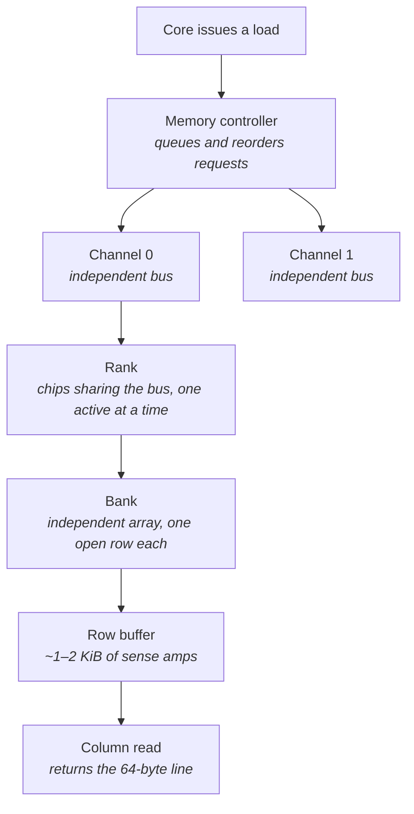
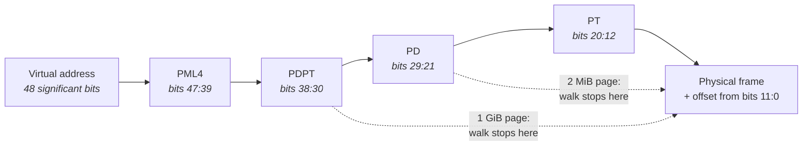
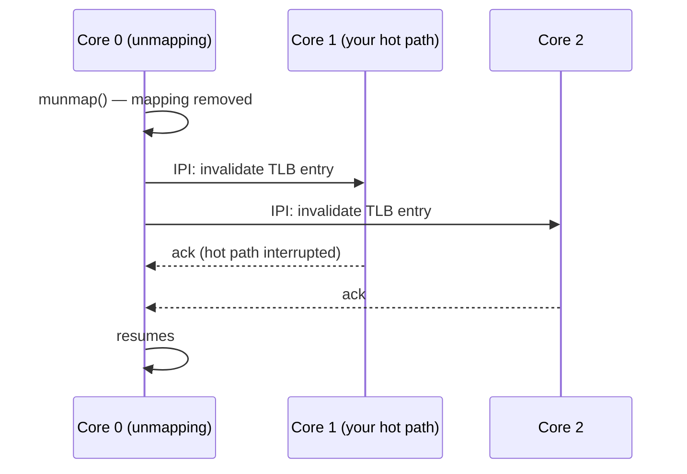
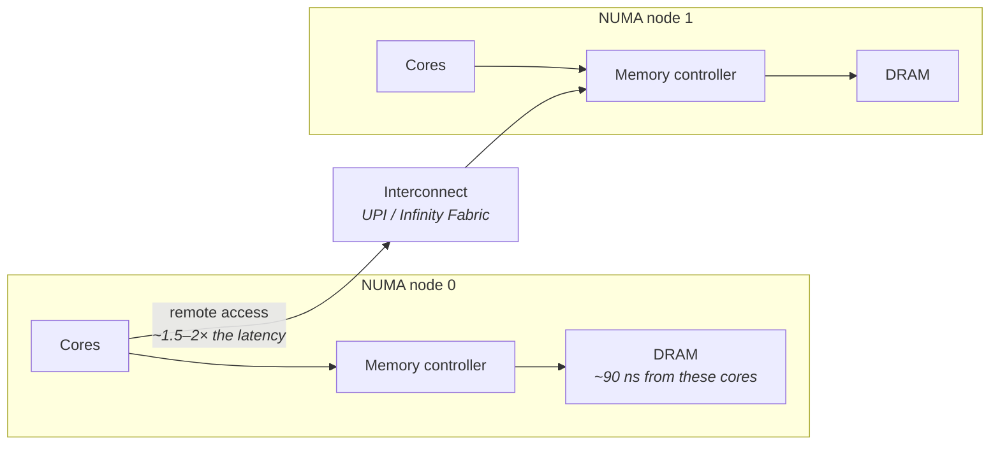
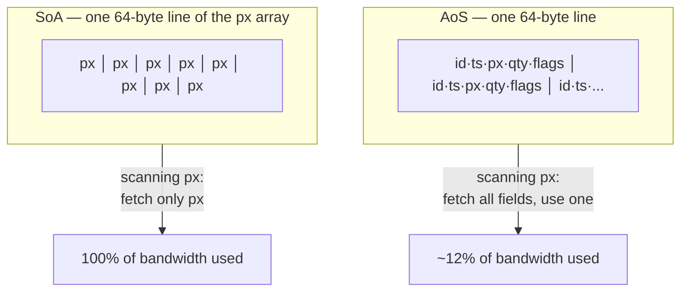

# Memory Systems

You already know that memory is slower than cache. What an undergraduate architecture course
usually leaves out is *how much* structure sits between a load instruction and the data arriving —
and how much of the resulting cost is variable rather than fixed.

The mental model most engineers carry is that memory is a large flat array with a single access
time. Under that model, a cache miss costs "about 100 nanoseconds," and that is the end of the
story. The reality is that a single load can cost 80 ns or 300 ns depending on which bank of DRAM
holds it, whether a neighbouring row was recently accessed, whether the memory controller is busy
serving someone else, which socket's memory controller owns the address, and whether the CPU can
even work out the physical address without going to memory several more times first. That spread —
not the average — is what a latency-sensitive system lives or dies by.

There are two independent mechanisms at work on every single memory access, and keeping them
separate is the most useful thing this chapter can give you. The first is **translation**: the
address in your program is virtual, and the hardware must convert it to a physical address before
anything else can happen. The second is **fetch**: actually retrieving the data from a DRAM chip.
Each has its own hardware, its own caching, its own failure modes, and its own tuning knobs. An
access can be fast in one and catastrophically slow in the other. Engineers new to this material
routinely optimize their data layout — a fetch-side fix — while the real cost is translation, and
then cannot explain why nothing improved.

We will build up fetch first, since it is more familiar, then translation, then the two big
structural concerns that cut across both: NUMA and access patterns.

## How DRAM Is Actually Organized

Start with the naive picture: memory is an array of bytes, the CPU asks for an address, and DRAM
returns it. If that were true, every access would cost the same, and there would be nothing to tune.

The reason it is not true comes down to how DRAM stores bits. A DRAM cell is a tiny capacitor,
holding a charge that represents one bit. Capacitors are cheap and dense — that is why main memory
is DRAM and cache is not — but reading one is destructive and slow. You cannot simply pluck out a
single bit. Instead, the chip reads an entire **row** of cells at once, thousands of bits wide,
amplifying their charges into a bank of sense amplifiers called the **row buffer**. Only then can
the specific bytes you asked for be read out of that buffer. Afterwards, because reading drained the
capacitors, the row must be written back before a different row can be read.

This gives DRAM a state that persists between accesses. A row is either currently *open* — sitting
in the row buffer, ready to serve reads cheaply — or it is not. And that single fact means the cost
of your load depends on what happened just before it, possibly on a different core, for a completely
unrelated program.

### The hierarchy

Real memory subsystems stack several levels of organization on top of that basic row mechanism,
mostly to buy parallelism.



Each level in that diagram exists for a reason:

| Level | What it is | Why it exists |
|---|---|---|
| **Channel** | An independent physical path from the memory controller to DRAM, with its own data bus | Multiple channels can transfer simultaneously — this is the main source of memory *bandwidth* |
| **Rank** | A set of DRAM chips that respond together to one command; several ranks share a channel's bus | More capacity per channel; but only one rank drives the bus at a time, and switching costs turnaround delay |
| **Bank** | An independently operable array within a rank, with its own row buffer | Banks work in parallel, so several rows can be open at once — this is the main source of memory-level *concurrency* |
| **Row** | ~1–2 KiB of cells activated together into the row buffer | The unit DRAM can actually read; the source of the open/closed cost asymmetry |
| **Column** | The addressed slice of the open row | The 64-byte cache line you actually wanted |

### Three possible costs for the same load

Because a bank holds exactly one open row at a time, an incoming request lands in one of three
situations, and they differ by roughly a factor of two:

- **Row hit.** The row you need is already open in that bank's row buffer. Pay only the column
  access time (tCAS) — the cheapest case.
- **Row miss, bank idle.** No row is open. The bank must *activate* your row (tRCD) and then read
  the column. Roughly double a row hit.
- **Row conflict.** A *different* row is open in that bank. The bank must first *precharge* — write
  the open row back and close it (tRP) — then activate yours, then read. The most expensive case.

Each of tCAS, tRCD, and tRP is on the order of 12–20 ns on modern DDR4 and DDR5. So the DRAM device
itself contributes somewhere between roughly 15 ns and 50 ns depending on which case you hit. The
~80–100 ns you actually observe from the core includes the trip through the cache hierarchy, the
on-chip interconnect, the memory controller's queue, and the return path.

This is also where a first counter-intuitive result appears: **the memory controller deliberately
reorders your requests.** It maintains queues and picks the next request to issue based on which
choice maximizes row hits and keeps the bus busy. That is a throughput optimization, and it is the
right default for a general-purpose machine. But it means your latency-critical load can be deferred
behind several requests from a batch job on another core, purely because servicing those first
produces better aggregate bandwidth. You cannot see this from the core, you cannot turn it off, and
it is one reason a neighbouring workload inflates your tail latency even when you are nowhere near
bandwidth saturation.

Two more mechanisms add variance. **Address interleaving** spreads consecutive physical addresses
across channels and banks, so that sequential access naturally uses all of the available
parallelism — but a strided access pattern whose stride happens to align with the interleaving
scheme can land repeatedly on a single bank and serialize everything. And **refresh**: because DRAM
capacitors leak, every row must be periodically refreshed, and a rank undergoing refresh cannot
serve requests. This produces small, periodic, entirely unavoidable latency bumps.

**Failure mode: an unrelated workload on another core inflates your p99.** Symptom is that your hot
path's median is unchanged but its tail worsens whenever a batch job runs, even at modest memory
utilization. Cause is memory controller queueing and row conflicts induced by the neighbour. Confirm
by measuring memory bandwidth with the uncore integrated-memory-controller counters
(`perf stat -e uncore_imc/cas_count_read/,uncore_imc/cas_count_write/`, event names vary by
platform) while running the neighbour, and by re-running your benchmark with the neighbour pinned to
a different socket.

**Failure mode: a stride pattern is dramatically slower than a similar one.** Symptom is that
walking an array with a stride of, say, 4096 bytes is several times slower per element than a stride
of 4100 bytes. Cause is that the round-numbered stride aligns with the channel or bank interleaving
and serializes onto one bank; it can also cause cache set conflicts (see "The Cache Hierarchy").
Confirm by re-running with a deliberately non-power-of-two stride and comparing.

**Try it:** read your DIMM configuration with `sudo dmidecode --type memory | grep -E 'Size|Speed|Locator'`
and count how many channels are actually populated. A server with half its channels empty has half
the memory bandwidth its spec sheet advertises, and this is a startlingly common misconfiguration.
Then run `sudo lshw -short -C memory` to cross-check.

## Latency Versus Bandwidth

These two words get used interchangeably in casual conversation about memory, and conflating them
leads directly to wasted optimization work. They are different resources, they saturate
independently, and the hot path usually cares about only one of them.

**Latency** is how long one access takes, from issuing the load to having the data. **Bandwidth** is
how many bytes per second the system can move in aggregate. The relationship between them is
concurrency: if the machine can have *N* memory requests outstanding at once, and each takes *L*
seconds, then it delivers roughly *N* × 64 bytes every *L* seconds. Bandwidth is what you get when
you keep many requests in flight simultaneously; latency is what you feel when you cannot.

That relationship has a consequence people find surprising the first time: **a single thread cannot
saturate a modern server's memory bandwidth, no matter how you write it.** A core has a limited
number of line-fill buffers — the structures that track outstanding cache misses, typically
somewhere around ten to sixteen. Once they are all occupied, the core stalls regardless of how much
bandwidth the socket has spare. Getting near peak bandwidth requires many cores working at once.

The flip side matters more for us. Consider two loops that touch exactly the same amount of memory:

- **Pointer chasing.** Each access's address comes from the value loaded by the previous access.
  Nothing can overlap — the core cannot even *know* the next address until the current load returns.
  Every single access costs the full ~90 ns. This is the worst possible pattern and it is what a
  linked list, a tree, or a hash table with chained buckets does.
- **Independent gather.** Addresses are computed from an index array, so the core can issue many
  loads at once and overlap their latencies. The same number of cache misses now costs a small
  fraction of the time.

Identical miss counts; wildly different runtimes. The difference is **memory-level parallelism
(MLP)** — how many misses are in flight simultaneously. Restructuring a dependent chain into
independent lookups is often a larger win than eliminating misses altogether, and it is invisible if
you only count cache misses.

### The saturation cliff

The single most important operational fact about bandwidth is that latency does not degrade
gracefully as you approach it. The curve is a hockey stick.


At low utilization, the memory controller's queues are empty and every request is served promptly.
As utilization climbs, queues develop, and queueing delay adds to every access. Near saturation, the
queues are deep and the latency distribution develops a long tail. A system running at 85% of peak
memory bandwidth has both worse median latency and dramatically worse p99 latency than the same
system at 30%.

This is the technical justification for a rule that otherwise sounds like superstition: **keep
bandwidth-hungry work off the cores and sockets that serve the hot path.** A logging thread, a
compression job, or a monitoring agent that streams through memory is not just stealing CPU — it is
pushing the whole socket up the hockey stick.

The other practical conclusion: **the hot path is almost always latency-bound, not bandwidth-bound.**
Its working set is small and its problem is stalls, not throughput. Bandwidth becomes your problem
mainly when someone *else* consumes it.

**Failure mode: latency degrades only when a neighbouring service is active.** Symptom is p50 and
p99 both rising, correlated with another process's activity, with no change in your own code path.
Cause is bandwidth contention pushing the socket toward saturation. Confirm with the uncore IMC
bandwidth counters, and by re-testing with the neighbour moved to another socket via
`numactl --cpunodebind`.

**Try it:** write two loops over a region several times larger than L3 — one that chases a randomly
permuted pointer chain, one that reads the same addresses from a precomputed index array. Time both
and compute nanoseconds per access. The ratio is your machine's effective MLP, and it will typically
be somewhere between 4× and 10×. Then run `perf stat -e cache-misses` on both and confirm the miss
counts are nearly identical — that is the point.

**Try it:** run a bandwidth-saturating streaming benchmark on an increasing number of cores while a
pinned single-threaded latency benchmark runs on another core of the same socket. Plot the latency
benchmark's p50 and p99 against the number of streaming threads. You will see the knee, and where it
sits on your hardware is a number worth remembering.

## Virtual Memory and the Page Walk

Everything above concerned physical addresses. Your program never uses one. Every address in your
code is virtual, and something has to translate it before any of the DRAM machinery can engage.

You know the purpose of virtual memory from a systems course: isolation between processes, the
illusion of a large contiguous address space, and the ability to move or share physical pages
underneath a running program. What that course probably underplayed is the cost. The mapping from
virtual to physical is stored in a data structure *in memory* — which means that translating an
address can itself require memory accesses. Under the worst conditions, one load instruction from
your program becomes five actual trips to DRAM: four to walk the translation structure, one to get
your data.

### The structure of the walk

On x86-64, the mapping is a radix tree — a four-level tree of tables, each 4 KiB in size and holding
512 eight-byte entries. The virtual address is chopped into 9-bit fields, and each field indexes one
level of the tree.



Nine bits selects one of 512 entries; four levels of 9 bits covers 36 bits; plus the 12-bit offset
within a 4 KiB page gives the 48-bit virtual address space. (Newer processors support a fifth level
for larger address spaces, at the cost of another potential access.)

The critical property is that **the walk is a dependent chain**. You cannot read the second-level
table until the first-level entry tells you where it is. This is precisely the pointer-chasing
pattern we just identified as the worst case for memory latency — and it is happening as overhead on
top of the access you actually wanted.

Three things keep this from being catastrophic. First, the TLB, which caches completed translations
and which the next section covers in detail. Second, **paging-structure caches**: dedicated hardware
that caches the *upper* levels of the tree separately, so that a walk usually resolves after one or
two accesses rather than four, since nearby addresses share upper-level entries. Third, the page
table entries themselves are ordinary cacheable memory, so they often sit in L2 or L3.

Two details worth internalizing. The walk is performed **by hardware, not by the kernel** — a
dedicated page-miss handler in the CPU does it, and the operating system is only involved if the
walk fails and a fault is raised. And the root of the tree lives in the **`CR3` register**, which is
why switching to a different process's address space means reloading `CR3`, and why cross-process
context switches cost more than cross-thread ones (see "Processes, Threads, and Scheduling").

### When translation fails: page faults

If the walk finds no valid mapping, the hardware raises a fault and the kernel takes over. This is
where the cost jumps by three orders of magnitude.

| Fault type | What happened | Approximate cost |
|---|---|---|
| **Minor fault** | The mapping is known to the kernel but not yet installed in the page tables — first touch of allocated memory, a copy-on-write page, or a page already in the page cache | ~1–3 µs |
| **Major fault** | The page's contents must be read from storage or swap | 20 µs to many ms |
| **COW write fault** | A write to a copy-on-write page forces a physical copy | ~1–5 µs plus the copy |

The one that catches people out is the minor fault on first touch. When you allocate memory, the
kernel typically does not give you physical pages — it gives you a promise. `malloc` returns a
pointer almost instantly, and nothing is actually mapped until you *write* to a page. That first
write faults, the kernel finds a physical frame, zeroes it, installs the mapping, and returns. About
one to three microseconds, or roughly a thousand cache hits.

For a hot path, this is unacceptable and entirely avoidable. The standard remedy has three parts:
allocate every buffer at startup, *touch* every page so the mapping is installed, and then call
`mlockall(MCL_CURRENT | MCL_FUTURE)` so the kernel cannot reclaim the pages back out from under you.
Allocation alone is not enough — the touch is the part that does the work. (Details in "Memory
Management.")

**Failure mode: the first few seconds after startup are far slower than steady state.** Symptom is a
latency distribution that improves and then stabilizes over the first thousand or so events. Cause
is minor faults on first touch of buffers that were allocated but never written. Confirm by reading
the minor fault count — field 10 of `/proc/<pid>/stat`, or more readably
`ps -o min_flt,maj_flt -p <pid>` — before and after the warm-up period, and checking whether it
climbs during the slow phase.

**Failure mode: rare multi-millisecond stalls with no CPU activity to explain them.** Symptom is an
outlier far outside anything the code path could produce. Cause may be a major fault — the process
touched a page that had been swapped or was file-backed and not resident. Confirm via the major
fault counter above; any nonzero value on a latency-critical process is a defect. The fix is
`mlockall` plus disabling swap.

**Try it:** allocate a large buffer, then time how long the first write to each page takes versus
subsequent writes. Record per-page timings into a pre-allocated array. You will see a bimodal
distribution — microseconds for first touches, nanoseconds afterwards. Then repeat the experiment
with the buffer pre-touched before timing begins and confirm the slow mode disappears entirely.

## The TLB and Huge Pages

The **Translation Lookaside Buffer** is a cache of completed virtual-to-physical translations. When
it hits, translation is effectively free and the access proceeds straight to the cache hierarchy.
When it misses, you pay the page walk described above.

So far this sounds like any other cache, and the obvious question is how big it needs to be. Here is
where the TLB differs from a data cache in a way that matters enormously: **the TLB's capacity is
measured in translations, not in bytes.** A data cache holding 32 KiB covers 32 KiB of your working
set. A TLB holding 1,500 entries covers 1,500 *pages* — which, with standard 4 KiB pages, is about
6 MiB. That quantity is called **TLB reach**, and on modern hardware it is startlingly small.

| Structure | Typical size (modern x86 server) | Notes |
|---|---|---|
| L1 data TLB, 4 KiB pages | ~64 entries | Separate from the instruction side |
| L1 instruction TLB | ~128 entries | Covers code, not data |
| L2 shared TLB (STLB) | ~1,500–2,000 entries | Backs both; generation-dependent |
| L1 data TLB, 2 MiB pages | ~32 entries | May be a separate structure or shared |

Six megabytes of reach. Consider what that means: you can have a working set that fits comfortably
in a 32 MiB L3 cache — so every data access hits in cache and a profiler shows almost no cache
misses — and *still* be paying a page walk on nearly every access because the translations do not
fit in the TLB. The data is close; the *directions to the data* are not.

This is one of the most common blind spots for engineers new to performance work, precisely because
the standard tools do not surface it. A profiler shows time spent in your loop. Cache miss counters
look fine. The stall is real but the cause is invisible unless you specifically ask for TLB counters.

### Huge pages

The fix follows directly from the arithmetic. If reach is entries × page size, and you cannot easily
add entries, then increase the page size. x86-64 supports 2 MiB and 1 GiB pages in addition to the
standard 4 KiB.

The effect is dramatic. The same ~1,500 STLB entries covering 2 MiB pages reach about 3 GiB instead
of 6 MiB — a factor of 512. And there is a second, smaller benefit: as the earlier diagram showed, a
2 MiB mapping terminates the page walk one level early, so even a TLB miss is cheaper.

Linux offers two distinct ways to get huge pages, and the difference between them is the difference
between a working low-latency system and a mysterious one.

| | Transparent Huge Pages (THP) | Explicit huge pages (hugetlbfs) |
|---|---|---|
| How you get them | Automatically, kernel-managed | Reserved in advance, then mapped explicitly |
| Control | `/sys/kernel/mm/transparent_hugepage/enabled` | `/sys/kernel/mm/hugepages/hugepages-2048kB/nr_hugepages`, or `hugepages=` at boot |
| Sizes | 2 MiB (larger in some configurations) | 2 MiB and 1 GiB |
| If memory is fragmented | **May synchronously compact memory — a multi-millisecond stall** | Allocation simply fails, immediately and visibly |
| Reclaimable / swappable | Yes | No — pinned |
| Suitable for the hot path | Risky by default | Yes — deterministic |

THP is convenient and it is on by default on most distributions, which is exactly why it causes
trouble. The hazard is in the `defrag` setting. To hand out a 2 MiB page, the kernel needs 2 MiB of
*physically contiguous* free memory. On a machine that has been up for a while, physical memory is
fragmented, and that contiguity may not exist. With `defrag` set to `always`, the kernel will
respond by synchronously compacting memory — physically relocating pages to create a contiguous
region — *while your thread waits*. That is a stall measured in milliseconds, appearing at an
unpredictable moment, on a thread that merely touched a new page.

There is also `khugepaged`, a background kernel thread that walks process memory collapsing groups
of 4 KiB pages into huge pages. It consumes CPU and, as we are about to see, triggers cross-core
interrupts while it works.

The general recommendation for latency-critical hosts is to use explicit huge pages, reserved at
boot via the `hugepages=` kernel parameter, and to set THP to `madvise` or `never` so that nothing
gets huge pages by accident. Reserving at boot matters because reservation can fail once memory is
fragmented, and at boot it never is.

### TLB shootdowns

One more TLB behavior deserves its own treatment, because it produces latency spikes on cores that
are not running your code at all.

The TLB is per-core, and it caches translations. So when a mapping changes — a page is unmapped,
migrated, or has its permissions altered — every core that might hold a stale copy of that
translation must be told to discard it. x86 has no hardware mechanism to do this across cores.
Instead the kernel does it in software: it sends an **inter-processor interrupt (IPI)** to each
affected core, and each one must interrupt whatever it was doing, invalidate the entry, and
acknowledge. The initiating core waits for all the acknowledgements.



The consequence is that a completely unrelated process calling `munmap`, or `madvise(MADV_DONTNEED)`,
or `free` returning memory to the kernel, or `khugepaged` doing its collapsing work, can interrupt
your pinned, isolated, carefully tuned hot-path thread. Memory-map churn anywhere on the machine is
a jitter source everywhere on the machine. This is a recurring theme (see "Jitter Hunting").

**Failure mode: the working set fits in cache, but access is much slower than cache latency implies.**
Symptom is high stall time with a low cache miss rate. Cause is TLB thrashing — reach exceeded, so
nearly every access pays a page walk. Confirm with
`perf stat -e dTLB-load-misses,dtlb_load_misses.walk_active,cycles`, then divide walk-active cycles
by total cycles. If that fraction is more than a few percent, translation is your bottleneck, not
data movement.

**Failure mode: unpredictable millisecond stalls at moments of memory allocation.** Symptom is
occasional enormous outliers correlated with the process growing its heap. Cause is THP synchronous
compaction. Confirm by reading `/sys/kernel/mm/transparent_hugepage/defrag` — if it reports
`[always]`, that is very likely it — and by watching the `compact_stall` counter in `/proc/vmstat`
rise across the incident.

**Failure mode: latency spikes on an isolated core with no work scheduled on it.** Symptom is jitter
on a pinned thread with no corresponding activity in its own profile. Cause is TLB shootdown IPIs
from another process. Confirm by reading the `TLB` row of `/proc/interrupts` before and after, and
seeing the count rise on your supposedly quiet core.

**Try it:** measure your TLB cliff directly. Run a random-access benchmark over working sets from
1 MiB up to 4 GiB, recording nanoseconds per access, first with normal pages and then with huge
pages (via `madvise(MADV_HUGEPAGE)` or a hugetlbfs mapping). Plot both curves. The 4 KiB curve
degrades sharply once the working set exceeds TLB reach, while the huge-page curve stays flat much
longer. The gap between them is your TLB problem quantified.

**Try it:** confirm the mechanism with counters rather than inferring it from timing. Run
`perf stat -e dTLB-load-misses,dtlb_load_misses.walk_active` on both variants above and compare.
Numbers you can attribute beat numbers you can only observe.

**Try it:** watch a shootdown happen. Record the `TLB` row of `/proc/interrupts`, run a small program
that repeatedly `mmap`s and `munmap`s a region in a loop, and read the file again. Note that the
counts rise on cores that never executed your program.

## NUMA: Memory Belongs to Sockets

Up to this point we have said "memory" as if the machine has one pool of it. On any multi-socket
server, and on many modern single-socket ones, that is false in a way that changes latency by 50 to
100 percent.

The physical reality is that memory controllers are on the CPU die. A two-socket server therefore
has two memory controllers, each with its own DIMMs directly attached. When a core on socket 0
accesses an address whose DIMMs hang off socket 1, the request cannot go directly — it must traverse
the inter-socket interconnect (Intel calls it UPI; AMD, Infinity Fabric), be serviced by the remote
controller, and come back. This is **Non-Uniform Memory Access**: the same instruction costs
different amounts depending on which physical address it touches.



A remote access typically costs 1.5 to 2 times a local one. That alone would be manageable — but
three secondary effects make NUMA more consequential than the raw ratio suggests.

**The interconnect is a shared, finite resource.** Remote memory traffic from every workload on the
machine flows across the same links, and so does cache coherence traffic (see "Multicore, Coherence,
and Memory Ordering"). Your remote latency therefore depends on what everyone else is doing, in a
way your local latency does not.

**Devices are attached to sockets too.** A PCIe device — including your NIC — hangs off one socket's
root complex. If the NIC is on socket 0 and it is DMA-ing packets into memory on socket 1, every
single packet crosses the interconnect before your code even sees it. Then if the thread processing
those packets runs on socket 0, it crosses back. This is a surprisingly common misconfiguration and
it silently adds microseconds to every packet (see "Buses, Devices, and I/O Hardware").

**Single-socket machines can be NUMA too.** Intel's Sub-NUMA Clustering and AMD's chiplet/CCX
topology both expose multiple NUMA nodes within a single physical socket, with real latency
differences between them. Assuming "one socket means uniform memory" is no longer safe.

The practical implication is that topology must be *discovered on each specific machine*, never
assumed. Node numbering, which cores belong to which node, and which node each device sits on all
vary by vendor, model, and BIOS configuration.

**Failure mode: half your worker threads are consistently slower than the other half.** Symptom is a
bimodal latency distribution that correlates with which core a thread landed on. Cause is that some
threads are accessing memory on a remote node. Confirm with `numastat -p <pid>` to see the
distribution of the process's pages across nodes, and `/proc/<pid>/numa_maps` for per-mapping
detail.

**Failure mode: packet processing latency is a few microseconds worse than the NIC's specification
suggests.** Cause may be that the NIC and the handling thread are on different NUMA nodes. Confirm
with `cat /sys/class/net/<iface>/device/numa_node` and compare against the node of the core you have
pinned the handler to.

**Try it:** map your machine. Run `numactl --hardware` to see the nodes, their memory, and the
distance matrix; `lscpu` for the core-to-node mapping; and
`cat /sys/devices/system/node/node*/cpulist` to confirm. Then find your NIC's node with
`cat /sys/class/net/<iface>/device/numa_node`. Write the topology down — you will need it repeatedly.

**Try it:** measure local versus remote latency yourself rather than trusting the distance matrix
(which reports a relative estimate, not a measurement). Run a pointer-chasing benchmark over a
region much larger than L3 under `numactl --cpunodebind=0 --membind=0`, then again with
`--membind=1`. The ratio is your machine's real remote-access penalty.

## Placing Memory Deliberately

Knowing the topology is useless unless allocation respects it. Linux's default policy is reasonable
for general workloads and quietly wrong for latency-critical ones, in a way that is easy to get
backwards.

The default is **first-touch**: a page is physically allocated on the NUMA node of whichever thread
first *writes* to it — not the thread that called `malloc`, and not at the time of allocation. This
is a good heuristic, because usually the thread that first writes to memory is the thread that will
keep using it.

But it produces a classic bug. A program allocates all its buffers in `main`, then initializes them
in an initialization loop, then spawns worker threads across both sockets. Because the initializing
thread touched every page, *every buffer lives on that thread's node*. Half the workers are now
permanently remote, and nothing in the code looks wrong.

The correct sequence has three steps in a specific order:

1. **Pin the thread** to its target core, so its NUMA node is determined.
2. **Allocate** the memory it will use.
3. **Touch** every page from that thread, so first-touch places the pages locally.

Reversing steps one and three defeats the whole scheme silently. This is worth stating plainly
because it is the single most common NUMA mistake.

Linux also offers explicit policies that override first-touch:

| Policy | Behavior | When to use it |
|---|---|---|
| **First-touch** (default) | Page lands on the node of the first thread to write it | Correct *if* threads are pinned before touching |
| **Bind** (`numactl --membind=N`) | Allocation restricted to the named nodes; fails outright if they are full | Hot path — explicit and deterministic, and failures are visible |
| **Preferred** (`--preferred=N`) | Try the named node, silently fall back to another | Softer, but hides exactly the failure you want to see |
| **Interleave** (`--interleave=all`) | Round-robin pages across nodes | Bandwidth-bound work with no locality; bad for latency |

One further knob matters. Linux includes **automatic NUMA balancing**, which periodically unmaps
pages to sample which node is accessing them, then migrates pages toward their users. On a general
server this is helpful. On a latency-critical host it is a jitter generator: it causes faults, page
copies, and TLB shootdowns at unpredictable times, in pursuit of an optimization you should have
done explicitly. Check it with `sysctl kernel.numa_balancing` and turn it off.

Finally, apply the same discipline to the whole packet path. The NIC, its interrupt handling, its
receive buffers, and the thread that processes packets should all sit on one node. Any one of them
landing elsewhere puts the interconnect on the critical path of every packet.

**Failure mode: latency slowly degrades over hours of uptime.** Symptom is a gradual drift with no
code or load change. Cause may be automatic NUMA balancing migrating pages, or physical memory
fragmentation reducing huge page availability. Confirm by checking `numa_pages_migrated` in
`/proc/vmstat` over time, and `/proc/buddyinfo` for fragmentation.

**Failure mode: huge page reservation succeeds at boot but fails later.** Cause is fragmentation —
there is no longer 2 MiB of contiguous physical memory to hand out. Confirm with `/proc/buddyinfo`,
where the higher-order columns will be near zero. The fix is to reserve at boot with `hugepages=`
rather than at runtime.

**Try it:** demonstrate the first-touch bug on your own machine. Allocate a large buffer from a
thread pinned to node 0, but touch it from a thread pinned to node 1, then inspect
`/proc/<pid>/numa_maps` to see which node the pages actually landed on. Repeat with the touch moved
before the pinning and watch the placement change.

**Try it:** audit a running service. `numastat -p <pid>` shows how its pages are distributed. If a
process pinned to node 0 has substantial memory on node 1, you have found real latency to reclaim.

## Access Patterns

We have now covered the machinery. The last two sections are about the two things you actually
control: the order in which you touch memory, and how you arrange data in it.

The order matters because of two mechanisms already introduced — **line utilization** and
**memory-level parallelism** — plus one from the previous chapters, the hardware prefetcher (see
"CPU Microarchitecture Essentials"). Memory moves in 64-byte cache lines. If you touch four bytes of
a line and never use the rest, you paid for 64 bytes and used 6% of them. And if your accesses form
a dependent chain, they cannot overlap, so each one costs full latency.

| Pattern | What happens | Effective cost per element |
|---|---|---|
| **Sequential** | Prefetcher predicts it perfectly; every byte of every line is used; naturally spreads across channels and banks | A few ns — effectively bandwidth-limited |
| **Small constant stride** (within a line) | Behaves like sequential | Near-sequential |
| **Large constant stride** | Prefetcher may still track it, but most of each fetched line is wasted | Poor utilization; risk of bank and cache-set conflicts |
| **Random, small working set** | Everything stays cache- and TLB-resident | Cache-tier cost, ~1–15 ns |
| **Random, large working set** | Misses every cache tier *and* the TLB | Full DRAM latency plus a page walk: 100–200 ns |
| **Pointer chasing** | Dependent chain — zero overlap between misses | Full latency, every time, with no MLP |

Two conclusions follow, and they are the practical heart of this chapter.

**Random access over a large region pays twice.** Once for the data miss, and once for the TLB miss
— and the page walk to resolve that TLB miss is itself a dependent chain of memory accesses. This is
why huge pages help random access over large regions so disproportionately: that is exactly the
situation where TLB reach is exhausted.

**Blocking converts a bad pattern into a good one.** If you must traverse a large structure in a
cache-hostile order, restructure the traversal to work through it in chunks small enough to stay
resident — in cache and in the TLB — completing all the work on one chunk before moving to the next.
This transforms one large random pattern into many small sequential ones. It is the standard fix and
it applies far beyond the matrix-multiplication example where it is usually taught.

**Failure mode: a data structure scan is far slower than its size suggests.** Symptom is a traversal
moving, say, 10 MiB of useful data but taking as long as moving 100 MiB. Cause is poor cache line
utilization — the scan touches one field per record and fetches whole records. Confirm by computing
bytes actually used versus bytes fetched (miss count × 64), using `perf stat -e cache-misses`.

**Try it:** build the classic locality demonstration. Traverse a large 2D array row-major, then
column-major, and compare times. The ratio on a modern machine is typically 5–20×. Then add a
blocked version that processes tiles, and confirm it recovers most of the row-major performance
despite doing the same logical column-wise work.

## Data Layout

The final lever is how records are arranged in memory, and it follows directly from line
utilization. This is a data-structure decision, not a language feature, which is why it belongs in a
systems chapter.

There are two canonical arrangements for a collection of records:

**Array of Structs (AoS).** Records are stored one after another, with all fields of record *i*
adjacent in memory. This is what almost everyone writes by default.

**Struct of Arrays (SoA).** Each field gets its own contiguous array. Record *i*'s data is spread
across several arrays at index *i*.



Which is better depends entirely on how you access the data, and the question to ask is always:
*which fields are touched together, and how often?*

| Access pattern | AoS | SoA |
|---|---|---|
| Read one entire record | One cache line — ideal | One line *per field* — several misses |
| Scan one field across many records | Fetches every field; most of each line wasted | Ideal; perfectly prefetchable |
| Line utilization on a field scan | The fraction that field occupies | ~100% |
| Locality of related fields | High | Low |
| Best fit | Record-at-a-time processing | Bulk scans, filters, aggregation |

In practice, the best answer is often a **hybrid**: group the frequently-accessed ("hot") fields into
one compact structure and push the rarely-accessed ("cold") fields into a parallel array. The hot
structure then packs more records per cache line, and the cold fields stop displacing useful data
from the cache entirely.

Three lower-level details compound this:

**Field ordering affects size.** Compilers insert padding to satisfy each field's alignment
requirement. Ordering fields from largest to smallest minimizes those holes:

```c
/* 8 bytes of padding hide in the alignment holes here. */
struct rec_bad  { char flag; long ts; int id; };
/* Same fields, no interior padding. */
struct rec_good { long ts; int id; char flag; };
```

**Size relative to 64 bytes matters more than raw size.** A 60-byte record fits in one cache line.
Grow it to 68 bytes and it straddles two, so every access fetches two lines instead of one — a
larger regression than the 13% size increase suggests. Similarly, an unaligned field that crosses a
line boundary costs two fetches, and one that crosses a *page* boundary can cost two TLB entries and
two page walks.

**Pointers destroy locality.** A structure holding pointers to individually allocated objects turns
any traversal into pointer chasing — the worst pattern identified in this chapter. Prefer indices
into dense arrays: they are smaller, they keep data contiguous, and they let the prefetcher work.

One caveat that connects forward: none of this addresses what happens when multiple threads write to
the same cache line. A layout that is optimal for a single thread can be pathological under
concurrency because of false sharing, covered in "The Cache Hierarchy."

**Failure mode: adding a field to a record disproportionately slows an unrelated scan.** Symptom is
a performance cliff from a small, apparently harmless structure change. Cause is that the record
crossed a cache line boundary, or that records per line dropped from three to two. Confirm by
checking the structure's actual size and comparing cache miss counts before and after.

**Try it:** build the same record set twice — once AoS, once SoA — and scan a single field from each.
Compare wall time *and* `perf stat -e cache-misses`. Then compute bytes fetched (misses × 64) against
bytes actually used. The AoS version will show the utilization gap directly, which is more
convincing than the timing difference alone.

**Try it:** check for accidental padding in structures you care about. Print the structure size and
compare it against the sum of its field sizes; the difference is padding. Then reorder fields
largest-to-smallest and measure both the new size and how many records now fit per cache line.

## Numbers to Know

| Quantity | Value | Notes |
|---|---|---|
| Local DRAM latency | ~80–100 ns | Idle system; rises steeply under load |
| Remote NUMA DRAM | ~1.5–2× local | Two-socket server |
| DRAM timings (tCAS, tRCD, tRP) | ~12–20 ns each | Row hit pays one; row conflict pays all three |
| Row hit vs. row conflict | Roughly 1 : 2 | Controller scheduling decides which you get |
| Per-channel bandwidth | ~10–20 GB/s | DDR4/DDR5 dependent |
| Per-socket bandwidth | ~100–300 GB/s | Scales with populated channel count |
| Line-fill buffers per core | ~10–16 | Caps single-thread memory parallelism |
| Page sizes | 4 KiB / 2 MiB / 1 GiB | x86-64 |
| Page-table levels | 4 (5 on newer CPUs) | 9 address bits per level |
| Full page walk | Up to 4 dependent accesses | Usually shortened by paging-structure caches |
| L2 STLB entries | ~1,500–2,000 | Generation-dependent |
| TLB reach, 4 KiB pages | ~6 MiB | The number that surprises people |
| TLB reach, 2 MiB pages | ~3 GiB | Same entries, 512× the page size |
| Minor page fault | ~1–3 µs | First touch, copy-on-write |
| Major page fault | 20 µs – many ms | Storage-backed; never acceptable on a hot path |
| TLB shootdown | ~1–10 µs, scaling with target core count | Cross-core IPI |
| THP compaction stall | Up to several ms | Why `defrag=always` is dangerous |

*Order-of-magnitude figures for modern x86 servers (Skylake-and-later class). TLB sizes, DRAM
timings, and bandwidth vary by generation — read them from your own hardware rather than quoting
these.*

## Key Takeaways

- Every access has two independent costs — translation and fetch — with separate hardware, separate
  failure modes, and separate fixes.
- DRAM latency is not a constant: row hits, row conflicts, refresh, and memory-controller
  reordering all vary it, and a neighbouring workload can inflate yours.
- Latency and bandwidth are distinct resources; latency degrades sharply as bandwidth approaches
  saturation, so keep bandwidth-hungry work off hot-path sockets.
- A dependent chain of misses cannot overlap, so pointer chasing pays full latency every time —
  independent accesses can be several times faster for identical miss counts.
- A page walk is up to four dependent memory accesses, partially mitigated by paging-structure
  caches and page-table entries living in cache.
- TLB reach — entries × page size — is the number that matters, and with 4 KiB pages it is only a
  few MiB, so a cache-resident working set can still thrash translation.
- Huge pages extend reach by ~512× and shorten the walk; explicit hugetlbfs pages reserved at boot
  are deterministic, while THP with `defrag=always` can stall for milliseconds.
- TLB shootdowns are cross-core IPIs, so memory-map churn anywhere on the machine is a jitter
  source on cores that never ran the offending code.
- Memory belongs to sockets: remote access costs 1.5–2×, the interconnect is shared, and PCIe
  devices including the NIC have a node too.
- First-touch places a page on the node of the thread that first *writes* it, so pin threads before
  allocating and touching, and disable automatic NUMA balancing.
- Line utilization and memory-level parallelism explain most access-pattern performance; blocking
  converts one large random traversal into many small resident ones.
- Layout is a latency decision: choose AoS or SoA by which fields are touched together, keep records
  from straddling 64-byte lines, and prefer indices over pointers.
