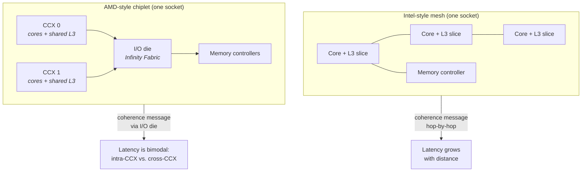
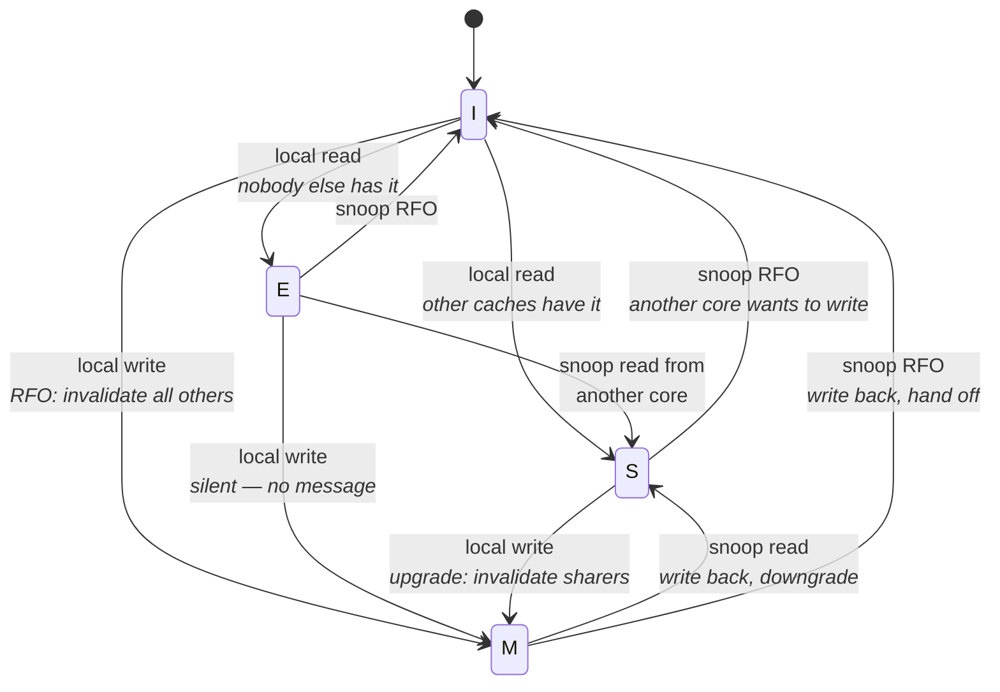
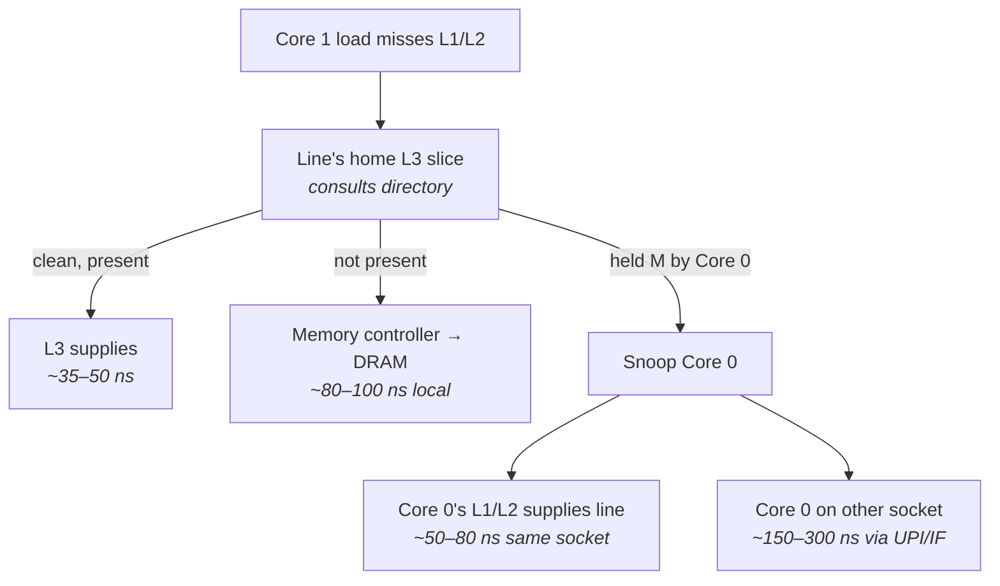
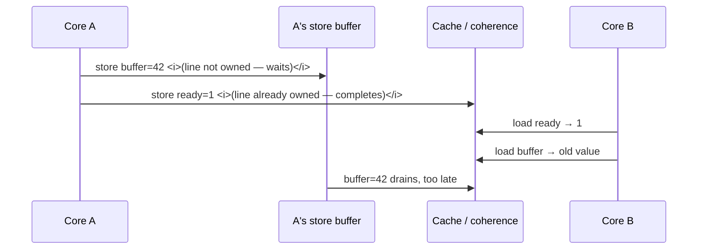
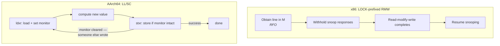
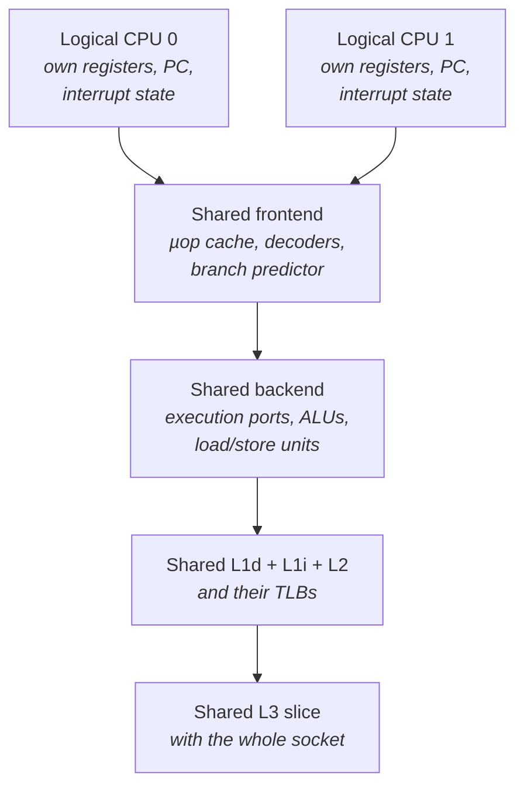

# Multicore, Coherence, and Memory Ordering

Every chapter so far has treated the processor as a single core talking to a memory hierarchy. That
model is enough to explain why a cache miss costs 90 nanoseconds and why a TLB miss costs more. It
is not enough to explain why two threads that each run fine alone become forty times slower when run
together, or why a flag written by one thread is not visible to another for several hundred
nanoseconds, or why a program that has worked for two years suddenly deadlocks the first time it is
run on an ARM server.

Those are the three subjects of this chapter, and they are the same subject viewed from three
angles. A modern server has dozens of cores, each with private L1 and L2 caches. Each of those
caches can hold a copy of the same memory location. Hardware must therefore maintain the illusion
that there is one memory, shared by everyone — that is **cache coherence**, and it is implemented by
a protocol that sends messages between caches. Those messages take time, they consume interconnect
bandwidth, and they are the dominant cost of any shared mutable state. Separately, each core
aggressively reorders its own memory operations for performance, so the *order* in which one core's
writes become visible to another is not the order in the program. That is **memory consistency**,
and it is governed by rules that differ by instruction set architecture. The instructions that let
you constrain that order — fences and atomic read-modify-write operations — are expensive precisely
because they interact with the coherence protocol.

Engineers arriving from application development usually have the causality backwards. They think of
a lock as "the thing that costs time" and shared data as free. The truth is the reverse: the atomic
instruction inside an uncontended lock costs perhaps 20 cycles, while the coherence traffic caused
by the *data* the lock protects — bouncing a cache line between two cores' L1 caches — costs
hundreds of cycles per access and gets worse with every core you add. Understanding the coherence
protocol is what lets you predict that cost instead of discovering it. We build up from the physical
topology, through the protocol, through the cost model, and then into ordering and atomics, finishing
with the one topology question every trading host must answer: whether to run with simultaneous
multithreading enabled.

## SMP, Chiplets, and the On-Die Interconnect

The phrase **symmetric multiprocessing (SMP)** describes the programming model you already assume:
every core sees the same memory, with the same addresses, and any core can run any thread. What the
phrase conceals is that "symmetric" is a software abstraction, and on real hardware the symmetry is
approximate. Two cores on the same die, sharing an L3 slice, communicate in tens of nanoseconds. Two
cores on different sockets communicate in a hundred and fifty. The abstraction says they are
interchangeable; the timing says they are not, and by a factor of five.

The reason is physical. Early multicore processors connected a handful of cores with a shared bus:
every core watched every transaction, which is where the term **snooping** comes from. A shared bus
does not scale past a few cores — it is a single serialization point, and its length grows with die
size. Modern server processors replaced it with a switched, packet-based network on the die itself.
On Intel server parts from Skylake-SP onward this is a **mesh**: cores, L3 cache slices, memory
controllers, and I/O blocks sit at the intersections of a two-dimensional grid, and coherence
messages are routed hop by hop like network packets. On AMD's EPYC and Ryzen parts the organization
is hierarchical instead: cores are grouped into a **CCX** (core complex) sharing an L3 slice, CCXs
are grouped onto **chiplets** (AMD calls the physical die a CCD, core complex die), and the chiplets
communicate through a separate central I/O die over **Infinity Fabric**.

That structural difference has a direct latency consequence that matters more than any single
vendor's clock speed. On a mesh, core-to-core latency grows gently with the number of hops. On a
chiplet design, it is bimodal: two cores in the same CCX share an L3 and talk quickly; two cores in
different CCXs must route through the I/O die, and the penalty is large and abrupt. A thread pair
that communicates through shared memory — which describes essentially every inter-thread transport
in a low-latency system — will run at two completely different speeds depending on which pair of
cores the scheduler happened to pick.



The diagram makes the practical point: on the mesh, placement affects latency continuously; on
chiplets, placement affects latency in steps, and stepping over a CCX boundary is a discrete cliff.
Neither topology is visible from your source code, and neither is described by `nproc`.

Three further structural facts follow from this organization, and each has an operational
consequence.

- **The last-level cache is physically distributed.** What software calls "the L3" is a set of
  slices, each attached to a different point on the interconnect. A physical address is hashed to
  determine which slice owns it. A core accessing an address whose home slice is far away pays more
  than a core accessing a near one — this is why measured L3 latency has a spread of tens of cycles
  rather than a single value.
- **Coherence traffic and data traffic share the interconnect.** Every invalidation message, every
  snoop response, and every cache-line transfer competes with ordinary memory traffic for the same
  wires. A workload that saturates memory bandwidth also slows down coherence, and vice versa.
- **Sub-NUMA Clustering and NPS modes expose the internal topology.** Intel's Sub-NUMA Clustering
  (SNC) splits one socket's mesh into two or four NUMA nodes; AMD's NPS (nodes per socket) BIOS
  setting does the equivalent for chiplets. Enabling them gives the operating system accurate
  distance information at the cost of smaller nodes (see "Memory Systems").

The vocabulary the industry uses for a shared cache line is **home** and **owner**. A line's *home*
is fixed by its physical address — the L3 slice or memory controller responsible for tracking it. Its
*owner* is whichever core currently holds it in a modifiable state, and that changes as threads
write to it. Coherence is the business of routing requests to the home, and having the home locate
and arbitrate between owners.

**Failure mode: a producer/consumer handoff has bimodal latency that changes on every restart.**
Symptom is a shared-memory queue whose measured handoff latency is, say, 45 ns on some runs and 110
ns on others, with nothing else changed. Cause is that the two threads landed on cores in the same
CCX on the fast runs and different CCXs on the slow ones. Confirm by pinning both threads explicitly
and re-measuring for each core pair; read the topology from
`/sys/devices/system/cpu/cpu*/cache/index3/shared_cpu_list`, which tells you exactly which cores
share an L3 slice.

**Failure mode: `lscpu` reports one NUMA node on a machine that behaves like several.** Symptom is
memory latency that varies by 20–30% across cores of the same "node." Cause is that SNC or NPS is
disabled in BIOS, so the operating system cannot see the internal distance structure and places
memory blindly. Confirm by measuring local access latency from each core against memory allocated
with `numactl --membind`, and compare with the BIOS setting.

**Try it:** map the machine's communication topology before you tune anything else. Run
`lscpu --extended` to get the core, socket, node, and L3 assignment of every logical CPU, then
`cat /sys/devices/system/cpu/cpu0/cache/index3/shared_cpu_list` to see which CPUs share core 0's
last-level cache slice. On an AMD server you will typically see groups of 8 or 16; on an Intel mesh
you will usually see the whole socket. Write the grouping down — every inter-thread placement
decision in this book depends on it.

**Try it:** build a core-to-core latency matrix. Pin two threads to a specific pair of CPUs, have
them ping-pong a single shared 64-byte-aligned value (each spins reading it, then writes an
incremented value back), and record round-trip time; repeat for every core pair. The resulting matrix
is the single most useful piece of per-machine data you can have, and it will show the CCX or socket
boundaries as sharp discontinuities.

## Cache Coherence Protocols

Here is the problem, stated concretely. Core 0 reads the value at address `X` into its L1 cache. Core
1 reads the same address into *its* L1. Now core 0 writes a new value. Core 0's L1 holds the new
value; core 1's L1 still holds the old one. If nothing intervenes, core 1 will read stale data
forever — its cache has no reason to look again.

The naive fix is write-through to a shared level: make every store go all the way to L3 or memory,
and make every load read from there. This trivially preserves correctness and destroys performance.
A store would cost 40+ nanoseconds instead of one cycle, private caches would become useless for
writes, and the interconnect would carry every store from every core. No processor does this.

The real solution is a **coherence protocol**: hardware keeps a state bit per cache line in each
cache, and caches exchange messages so that the states are always mutually consistent. The invariant
the protocol enforces is simple to state and is worth memorizing, because everything else follows
from it:

> At any moment, a cache line is either held by exactly one cache in a writable state, or held by
> any number of caches in a read-only state — never both.

This is the multiple-reader/single-writer discipline, implemented in silicon at 64-byte granularity.
Note the granularity: the protocol knows nothing about your variables, only about lines (see "The
Cache Hierarchy" for how that granularity produces false sharing). A protocol that enforces this by
removing the line from other caches before a write is called **write-invalidate**, and it is what
essentially all modern processors use.

### MESI: the four states

The classic protocol is **MESI**, named for its four states. Each cache line in each private cache
carries one of them.

| State | Meaning | Can this core read it? | Can this core write it without a bus transaction? | Is memory up to date? |
|---|---|---|---|---|
| **M** — Modified | This cache has the only copy, and it has been written | Yes | Yes | No — this cache must write back |
| **E** — Exclusive | This cache has the only copy, unmodified | Yes | Yes, silently transitioning to M | Yes |
| **S** — Shared | Other caches may also hold this line, read-only | Yes | No — must first invalidate the others | Yes |
| **I** — Invalid | This cache does not have a valid copy | No | No | n/a |

The **E** state is the one whose purpose is least obvious, and it is a pure optimization. If a core
reads a line that nobody else has, marking it Exclusive rather than Shared means that a subsequent
write by that core needs *no interconnect message at all* — it just flips E to M locally. Without E,
every first write to freshly-read private data would broadcast an invalidation. Since most data is
not actually shared, E saves an enormous number of messages.

The transitions are driven by two kinds of events: requests from the local core (a load or a store),
and snoop messages arriving from elsewhere on behalf of another core.



The single most important edge in that diagram is `S → M`, and its label names the mechanism you
will meet constantly: **RFO**, a Read For Ownership. When a core wants to write a line it does not
own exclusively, it issues an RFO to the line's home. The home locates every cache holding the line,
sends each an invalidation, collects the acknowledgements, and only then grants ownership. The
writing core stalls for the whole of that round trip. This is why a write to shared data is
categorically more expensive than a read, and why the cost grows with the number of sharers.

Notice also `M → S`: when core 1 reads a line that core 0 holds Modified, core 0 must supply the
data (its copy is the only correct one) and downgrade itself to Shared. The data moves *cache to
cache*, not through DRAM — which is the subject of the next section.

### MESIF and MOESI: what the extra states buy

MESI has an inefficiency. When five caches hold a line in **S** and a sixth requests it, which of the
five should respond? If all of them do, the interconnect carries five redundant copies. If none do,
the request must go to memory even though six caches have the data.

Intel's answer is **MESIF**, which adds **F** — Forward. Exactly one of the sharers holds the line in
F rather than S, and that one is designated responder. Everyone else stays silent. F migrates to the
most recent requester, which is a reasonable heuristic for who will be asked next.

AMD's answer is **MOESI**, which adds **O** — Owned. O means "this line is modified relative to
memory, *and* other caches may hold read-only copies." Under plain MESI, when a Modified line is
read by another core, the owner must write it back to memory before downgrading to S. Under MOESI it
does not: it moves to O, supplies the data directly, and keeps the responsibility for eventually
writing back. This eliminates a memory write on a common sharing pattern, which matters a great deal
on a chiplet design where memory sits behind the I/O die.

| Protocol | Extra state | Problem it solves | Typically found on |
|---|---|---|---|
| **MESI** | — | Baseline correctness | Textbooks; simple designs |
| **MESIF** | F (Forward) | Picks a single responder among sharers, avoiding duplicate responses | Intel server parts |
| **MOESI** | O (Owned) | Allows dirty data to be shared without a write-back to memory | AMD parts; several non-x86 designs |

For latency work, the practical takeaway is not the state names — it is that **all three protocols
have identical cost structure for the case you care about**. A write to a line another core holds
requires an invalidation round trip regardless of which protocol you are on. MESIF and MOESI optimize
sharing of *read-mostly* data. They do nothing for a contended write.

### Snooping versus directories

How does the home find the sharers? Two mechanisms exist, and modern servers use both.

**Snoop-based** coherence broadcasts requests to all caches, which check their own tags and respond.
It is simple and has low latency at small core counts, but the message count grows with the square of
the core count, so it does not scale.

**Directory-based** coherence keeps a directory — a record, at each home location, of which caches
hold the line. A request consults the directory and sends messages only to the caches that actually
have a copy. Message count grows with the number of actual sharers rather than with the core count.
This is what server processors use; on Intel parts the directory information is kept alongside the L3
slices (and, on multi-socket systems, augmented by a snoop filter that avoids interrogating the
remote socket unnecessarily). The BIOS on many server boards exposes snoop-mode options with names
like "Home Snoop with Directory" — these are real settings that change cross-socket coherence latency
and are worth knowing exist, though the correct choice is platform-specific.

The consequence for you: **coherence cost is a function of how many caches hold the line and how far
away they are.** One remote sharer on the same die is cheap; twelve sharers spread across two sockets
is not.

**Failure mode: a read-mostly shared counter destroys scalability at high core counts.** Symptom is
that a statistics counter or a configuration flag read by every worker thread causes throughput to
fall as cores are added, even though writes are rare. Cause is that each infrequent write must
invalidate every reader's copy, and each reader then re-fetches — so one write costs *N* invalidations
plus *N* refills. Confirm with `perf c2c record` followed by `perf c2c report`, which attributes
cache-line contention to specific addresses and source lines and shows the sharing core set.

**Failure mode: a line ping-pongs between two cores at full coherence cost even though the two
threads touch different variables.** Cause is false sharing — two independent variables in one 64-byte
line (see "The Cache Hierarchy"). The protocol cannot tell them apart because it tracks lines, not
variables. Confirm with `perf c2c report`, which reports the offsets *within* the line that each core
touched; two different offsets with high HITM counts is the signature.

**Try it:** observe the E state saving a message. Write a loop that reads a private array once and
then writes it, and compare its cycle count against a second run in which another thread has read the
same array first (forcing S instead of E). The second version pays an upgrade RFO per line. Measure
with `perf stat -e cycles,mem_inst_retired.all_stores` on both, and note that instruction counts are
identical while cycles are not — the cost is entirely in the protocol.

**Try it:** get familiar with `perf c2c` on a case you construct deliberately, before you need it on a
case you do not understand. Run two pinned threads incrementing two variables that you have placed in
the same cache line, then:

```
perf c2c record -F 60000 -a -- sleep 5
perf c2c report --stdio
```

Read the "Shared Data Cache Line Table." The `HITM` column — a load that hit a line in Modified state
in *another* core's cache — is the direct measure of the pathology. Then pad the two variables to
separate lines and confirm the HITM count collapses.

## The Cost of a Coherence Miss Versus a DRAM Miss

An engineer who has internalized the previous chapters has a cost model with three tiers: L1 hit is a
few cycles, L3 hit is tens of nanoseconds, DRAM is around ninety. That model is missing a tier, and
the missing tier is the one that dominates multithreaded code.

Consider a load that misses L1 and L2. In the single-threaded world, the two possibilities are that
L3 has the line or that DRAM must supply it. In the multithreaded world there is a third: **another
core's private cache holds the line in Modified state.** L3 cannot supply it — its copy, if any, is
stale. The request must be routed to the owning core, that core must respond with the data, and
possibly write back. This event has a name in Intel's performance-monitoring vocabulary: **HITM**, a
hit in another cache's Modified line.

The counter-intuitive result, and it is worth sitting with, is that **a HITM can cost more than going
to DRAM.** DRAM is far away but the path is direct and pipelined: request goes to the memory
controller, controller returns data. A HITM involves a request to the home, a lookup, a snoop to the
owner, the owner's cache responding, and — on a write — invalidation acknowledgements from every
other sharer. It is a multi-hop protocol transaction with serialization points, not a bulk transfer.
On a two-socket server, a cross-socket HITM in the 200–300 ns range is entirely normal, against ~90 ns
for a local DRAM hit.



The diagram's three lower branches are the tiers. Reading them in order gives the cost model this
section exists to install:

| Event | What happens | Order-of-magnitude cost (2-socket x86 server, Skylake-and-later) |
|---|---|---|
| **L1 hit** | Local, no interconnect | ~1 ns (4–5 cycles) |
| **L2 hit** | Local, no interconnect | ~4 ns (~14 cycles) |
| **L3 hit, clean** | One interconnect round trip to the home slice | ~12–20 ns, varying with mesh distance |
| **Local DRAM** | Home has no copy; memory controller serves it | ~80–100 ns |
| **HITM, same socket** | Snoop plus cache-to-cache transfer | ~50–90 ns |
| **HITM, cross-socket** | Snoop across UPI / Infinity Fabric, plus transfer back | ~150–300 ns |
| **RFO on a line with N sharers** | Invalidate all N, wait for all acknowledgements | Grows with N and with the topological spread of the sharers |

Two things about this table deserve emphasis because they are where intuition fails.

**First: the cost is paid by the writer, not just measured as bandwidth.** An RFO is a stall. The
core issues the store, the store sits in the store buffer, and if the buffer fills — or if a fence or
a dependent atomic operation forces a drain — the core stops retiring instructions. A single
contended line can take a core from 3 instructions per cycle to under 0.1.

**Second: contention cost is superlinear in the number of contending cores.** With two cores
alternating writes to a line, each write costs one invalidation round trip. With eight cores, each
write invalidates seven copies, each of those seven then re-fetches, and the home's directory entry
for that line becomes a serialization point — every request for that line queues behind every other.
The line's home slice becomes, in effect, a single-lane bridge. This is why a naive shared counter
incremented by every worker thread can be slower with 16 threads than with 1, in absolute terms, not
just per-thread.

The design conclusions are strong and simple. Shared *mutable* state is not merely a correctness
hazard; it is the most expensive thing a multicore program can do per byte. Shared *immutable* state
is nearly free — many caches can hold the same line in S indefinitely with no traffic. And the
distinction between "shared" and "written" is what the protocol reacts to, not the distinction
between "private" and "shared" that appears in your program's structure.

**Failure mode: throughput falls as worker threads are added, past a small number.** Symptom is
negative scaling — 8 threads slower in wall time than 4. Cause is usually one contended cache line:
a counter, a queue head index, a free-list pointer, or a lock word. Confirm with `perf c2c report`,
which ranks cache lines by contention and gives you the symbol and offset directly; the top line in
that table is almost always the whole problem.

**Failure mode: a cross-socket producer/consumer pair is several times slower than the same code
within one socket.** Symptom is a shared-memory transport whose latency is fine in test and terrible
in production, correlating with thread placement. Cause is that every handoff is a cross-socket HITM
plus an RFO. Confirm by pinning both ends to the same socket with `taskset -c` and re-measuring; the
improvement is typically 2–4×.

**Try it:** measure your machine's HITM cost directly. Use two pinned threads: one repeatedly writes a
shared 8-byte value, the other repeatedly reads it. Measure the reader's per-access latency. Then
re-run with the writer's thread stopped (so the line stays in S). The difference between the two is
your machine's cache-to-cache transfer cost, and comparing that to your local DRAM latency from
"Memory Systems" is the moment the cost model becomes real.

**Try it:** quantify the sharer-count effect. Run the same contended-counter loop with 2, 4, 8, and 16
pinned threads, recording total increments per second. Plot it. The curve peaks early and then falls;
where it peaks on your hardware is a number to remember when sizing anything that shares state.

## Memory Consistency: TSO and Weak Ordering

Coherence guarantees that all cores eventually agree on the value of *each individual location*. It
says nothing about the *order* in which one core's updates to *different* locations become visible to
another. That second question is **memory consistency**, and it is a separate problem with separate
hardware.

Start with the scenario that makes it concrete. Thread A writes a data buffer and then sets a `ready`
flag. Thread B spins on the flag and, when it sees it set, reads the buffer.

```
Thread A:  buffer = 42        Thread B:  while (ready == 0) { }
           ready  = 1                    read buffer
```

Every programmer's mental model says thread B cannot see `ready == 1` while `buffer` still holds its
old value, because A wrote `buffer` first. That model is called **sequential consistency (SC)**: the
execution behaves as if all cores' memory operations were interleaved into one global order that
respects each core's program order. It is what you would design if you were designing for humans.

No high-performance processor implements it, because it forbids optimizations the hardware depends
on. In particular it forbids the **store buffer**, which is the single most valuable structure in the
memory pipeline. Recall the mechanism (see "The Cache Hierarchy"): when a core executes a store, it
does not wait for the cache line to be obtained. It writes the value into a small queue — the store
buffer — and retires the instruction immediately. The store drains into the cache later, once
ownership arrives. Without this, every store that missed cache would stall the core for the full RFO
latency, and a core would spend most of its time waiting on writes. With it, stores are effectively
free from the core's point of view.

The store buffer is exactly what breaks sequential consistency, and the mechanism is worth tracing
precisely. Suppose A's write to `buffer` misses cache and its write to `ready` hits. The `buffer`
store sits in the store buffer waiting for an RFO; the `ready` store lands in cache immediately. B
now sees `ready == 1` while `buffer` still holds the old value — from B's perspective, A's writes
happened in the opposite order to the program text. Nothing is broken in the coherence protocol.
Coherence was never asked about ordering across two different addresses.



The sequence diagram shows the reordering happening entirely inside one core's store buffer, with no
misbehaviour anywhere else. That is the essential insight: **most visible memory reordering comes
from buffering inside the writing core, not from the interconnect.**

### The models, and what each one permits

Architectures publish a **memory model** — a contract stating which reorderings the hardware is
permitted to perform, and therefore which ones your code must defend against. Two matter for this
book.

**x86-64 uses Total Store Order (TSO).** It is strong: loads are not reordered with other loads,
stores are not reordered with other stores, and loads are not reordered with earlier stores to
*different* addresses in a way that is visible... with exactly one exception, which is the store
buffer case above. Formally, x86 permits only **StoreLoad** reordering: a later load may become
visible before an earlier store. Everything else is guaranteed by hardware.

**ARM (AArch64) and POWER use weak ordering.** Essentially any pair of memory operations to different
addresses may be reordered by the hardware, in either direction, unless you explicitly prevent it.
This buys real performance — it allows more aggressive buffering and less tracking hardware — and it
transfers the burden to software.

| Reordering | x86-64 (TSO) | AArch64 (weak) |
|---|---|---|
| Store then Store | Not permitted | Permitted |
| Load then Load | Not permitted | Permitted |
| Load then Store | Not permitted | Permitted |
| **Store then Load** | **Permitted** | Permitted |
| Dependent load (address comes from a prior load) | Ordered | Ordered by data dependency |
| Atomic RMW acts as a full barrier | Yes (`LOCK`-prefixed) | No — depends on the acquire/release variant used |

The one row in bold is the entire practical difference between x86 and sequential consistency, and it
is the reason a specific pattern breaks: two threads each store to their own flag and then load the
other's. Under TSO, both loads can return the old value, because both stores are still sitting in
store buffers. This pattern is the core of several mutual-exclusion algorithms and of many lock-free
handshakes; it is the one place on x86 where you must insert a fence.

The practical consequences are asymmetric and dangerous in a specific direction. **Code developed and
tested exclusively on x86 will contain missing-barrier bugs that x86 hides.** The hardware silently
provides the ordering the programmer forgot to request. Move the same binary logic to an ARM server —
increasingly common in data centers — and the bugs surface as rare, load-dependent corruption or
hangs. There is no test you can run on x86 that finds them, because on x86 they are not bugs.

Two more points that are routinely confused:

- **Compiler reordering is a separate problem from hardware reordering.** A compiler may reorder or
  eliminate memory operations at compile time regardless of what the hardware guarantees. This
  chapter is about hardware; the compiler-side discipline is a language question and is out of scope
  here, but be aware that hardware fences do not by themselves constrain the compiler.
- **Coherence is not ordering.** People frequently say "the caches are coherent, so the other thread
  will see it." Coherence guarantees eventual agreement per address; ordering across addresses is a
  separate guarantee that requires separate instructions.

**Failure mode: a lock-free handshake works for years on x86 and hangs immediately on ARM.** Symptom
is a producer/consumer or mutual-exclusion protocol that deadlocks or loses updates on an AArch64
host. Cause is a missing barrier that TSO supplied implicitly. Confirm by identifying every place a
flag is written after data (or read before data) and checking that a barrier instruction is present;
there is no runtime tool that reports "you needed a fence here," which is exactly what makes this
class of bug expensive.

**Failure mode: a spin-wait sees a flag set but reads stale payload data.** Symptom is intermittent
corrupted messages through a shared-memory queue, typically at high rates and never reproducible
under a debugger. Cause is the store-buffer reordering above on the writer side, or speculative load
reordering on the reader side. On x86 the writer side is safe but the *reader* may need ordering
between its flag load and its payload load on weak architectures; on all architectures the writer
needs a release-style barrier before publishing the flag.

**Try it:** demonstrate StoreLoad reordering on your own x86 machine — it is the one hardware
reordering you can reproduce. Two pinned threads: thread 0 stores 1 to `x` then loads `y`; thread 1
stores 1 to `y` then loads `x`. Both threads record what they loaded, and a coordinator resets and
repeats the trial millions of times. Count the trials in which *both* threads loaded 0. Sequential
consistency makes that outcome impossible; on real x86 hardware it happens, typically in a small
fraction of a percent of trials. Then insert an `mfence` between each store and load and confirm the
count goes to exactly zero. This is the single most instructive experiment in the chapter.

## Store Buffers, Barriers, and Fences

The previous section established that the store buffer is what makes stores cheap and ordering weak.
This section is about the instructions that let you claw ordering back, and about what they actually
cost.

Reconsider what a **memory barrier** (equivalently, a **fence**) has to do. It is not a
synchronization primitive and it does not communicate with other cores. It is a constraint on *this*
core's memory pipeline: it prevents the core from allowing certain memory operations after the fence
to become visible before certain operations before it. The most common implementation of a
store-ordering fence is simply *drain the store buffer before proceeding*. That is why fences are
expensive: the core must wait for pending stores to obtain ownership of their lines and commit —
which, if any of those lines are contended, means waiting on the full coherence round trip described
two sections ago.

This gives the cost model for fences in one sentence: **a fence costs whatever the stores it is
waiting on cost.** An `mfence` with an empty store buffer is roughly 20–30 cycles of pipeline
overhead. An `mfence` behind a store to a line owned by another socket costs that store's full RFO
latency, because the core cannot proceed until it commits. Quoting a single number for "the cost of
a fence" is meaningless without saying what was in the buffer.

### The x86 fence instructions

x86 provides three fence instructions, and their names badly mislead. Because TSO already orders
loads with loads and stores with stores, two of the three are nearly useless for ordinary memory.

| Instruction | Nominal effect | Actual usefulness on write-back memory under TSO |
|---|---|---|
| `mfence` | Full barrier: no memory operation may cross it in either direction | **The one that matters.** Prevents StoreLoad reordering by draining the store buffer |
| `sfence` | Orders stores with stores | Redundant for ordinary stores — TSO already does this. Needed for **non-temporal** stores (`movnt*`) and for write-combining memory, which are *not* ordered |
| `lfence` | Orders loads with loads | Redundant for ordinary loads under TSO. Its real modern use is as a **speculation barrier** — it serializes the instruction stream, which is why it appears in Spectre mitigations and in cycle-counter reading sequences |

The `lfence` case deserves a note because it recurs elsewhere in this book. Reading the timestamp
counter with `rdtsc` gives a value that the out-of-order engine may have obtained earlier or later
than the code around it. Serializing with `lfence` before the read pins it down. That is a
measurement-methodology concern, not a coherence one (see "Clocks, Timers, and Time" and "Measuring
Correctly").

There is a fourth way to get a full barrier on x86, and in practice it is the most common one: **any
`LOCK`-prefixed instruction is a full barrier.** A `lock add` of zero to the stack pointer's target
was for years the idiomatic cheap full fence, sometimes faster than `mfence` on particular
microarchitectures. Which of `mfence` and a dummy `lock`ed operation is faster is
microarchitecture-specific and has flipped between generations; do not assume.

### The ARM fence instructions

AArch64, being weakly ordered, needs barriers far more often and provides a more expressive set. The
data memory barrier is `dmb`, with a *shareability domain* and an *access type* as suffixes: `dmb ish`
is the common one (inner shareable domain, both loads and stores), `dmb ishst` orders stores only,
`dmb ishld` orders loads only. `dsb` is stronger — it waits for completion, not just ordering — and is
mostly a systems-programming instruction. `isb` is an instruction synchronization barrier, used after
changing system control state.

AArch64 also folds ordering into the memory instructions themselves: **load-acquire** (`ldar`) and
**store-release** (`stlr`) carry ordering semantics without a separate barrier instruction, which is
generally cheaper than a standalone `dmb` because the constraint is narrower.

| Need | x86-64 | AArch64 |
|---|---|---|
| Full barrier | `mfence`, or any `LOCK`-prefixed instruction | `dmb ish` |
| Publish data then a flag ("release") | Plain store suffices under TSO | `stlr`, or `dmb ishst` then a plain store |
| Read a flag then dependent data ("acquire") | Plain load suffices under TSO | `ldar`, or a plain load then `dmb ishld` |
| Order non-temporal / write-combining stores | `sfence` — genuinely required | `dmb` variants |
| Stop speculation across a point | `lfence` | `isb` (plus `csdb` for certain mitigations) |

The row that catches x86-only engineers is the second and third: on x86 those cells say "nothing
needed," which is precisely why the required barrier is missing from the source when the code moves.

### Where the store buffer bites in practice

The store buffer has two additional behaviours worth knowing, both of which show up in real latency
work.

**Store-to-load forwarding.** If a core loads from an address it very recently stored to, the value
is still in the store buffer, and the hardware forwards it directly rather than waiting for the cache.
This is fast — a few cycles — but only when the load's address and size match a single buffered store
cleanly. A load that partially overlaps a store, or that spans two buffered stores, cannot be
forwarded and instead stalls until the stores commit, which can cost 10–20 extra cycles. This is a
real and commonly-hit stall in code that writes bytes and reads words, or writes a small field and
reads the enclosing structure.

**Store buffer capacity.** The buffer holds on the order of 50–70 entries on recent x86 server cores.
A burst of stores that all miss cache fills it, and once full the core stalls on the next store. A
memset-like initialization loop over cold memory hits this immediately, which is one motivation for
non-temporal stores (see "The Cache Hierarchy") — they bypass the normal ownership requirement and
write-combine instead.

**Failure mode: a hot loop stalls with high `ld_blocks.store_forward` counts.** Symptom is a loop with
good cache behaviour and unexpectedly low instructions-per-cycle. Cause is failed store-to-load
forwarding from mismatched store and load widths on the same address. Confirm with
`perf stat -e ld_blocks.store_forward` (Intel; the event name is model-specific — verify with
`perf list | grep -i store_forward`), and fix by making the store and the subsequent load the same
size and alignment.

**Failure mode: adding a fence to fix a race costs vastly more than expected.** Symptom is a barrier
whose measured cost is hundreds of nanoseconds rather than tens. Cause is that the fence drains stores
to contended lines, so it is really paying coherence latency. Confirm by measuring the same fence in a
loop that stores only to private, already-owned lines and comparing — the difference is entirely
coherence, not the fence itself.

**Try it:** measure `mfence` cost as a function of what precedes it. Time a loop of `mfence` with an
empty store buffer, then a loop that stores to a private line before each fence, then a loop that
stores to a line another pinned thread is also writing. The three numbers will span an order of
magnitude. Use `perf stat -e cycles,instructions` and compute cycles per iteration rather than trusting
wall-clock alone.

**Try it:** confirm that `sfence` is not free even though TSO makes it redundant. Time a tight loop of
`sfence` against an empty loop of the same instruction count. The difference is pure pipeline
overhead, and it tells you the floor cost of any barrier instruction on your machine.

## Atomics at the Hardware Level

Every synchronization primitive you have ever used — mutex, spinlock, reference count, lock-free queue
— rests on a hardware instruction that reads a memory location, computes something, and writes back,
with a guarantee that no other core can interleave. Understanding what the hardware actually does to
provide that guarantee explains both the cost and the failure modes.

The problem is that a read-modify-write is three operations. If core 0 reads a counter as 5, and core
1 reads it as 5 before core 0 writes 6, both write 6 and one increment is lost. Preventing this
requires the hardware to make the sequence indivisible with respect to other cores. There are two
architectural approaches, and knowing which one you are on changes how you reason about contention.

### x86: the LOCK prefix

x86 provides atomicity by prefixing an instruction with `LOCK`. `lock xadd`, `lock cmpxchg`,
`lock add`, and `xchg` (which is implicitly locked) are the ones you will meet. Historically `LOCK`
asserted a physical bus lock — a signal that stopped every other core from using the bus, for the
duration. That is catastrophic for scalability and modern processors avoid it whenever they can.

What they do instead is **cache locking**. The core obtains the line in Modified state via an RFO,
and then simply *refuses to respond to snoops for that line* until the read-modify-write completes.
Since coherence guarantees no other cache can have a copy, and the core will not give it up, the
sequence is atomic without touching the bus. The cost of an atomic operation is therefore, almost
entirely, the cost of obtaining ownership of the line.

That yields the cost model that matters:

| Situation | What the hardware does | Order-of-magnitude cost (modern x86 server) |
|---|---|---|
| Atomic on a line already held in M by this core | Local cache lock, no interconnect traffic | ~15–25 cycles (~5–8 ns) |
| Atomic on a line held S by others | RFO: invalidate sharers, then lock | ~50–100+ ns, growing with sharer count |
| Atomic on a line held M by another core | HITM transfer plus ownership change | ~50–300 ns depending on topology |
| Atomic spanning two cache lines (**split lock**) | Cannot cache-lock; falls back to a **bus lock**, stalling all cores | **Microseconds** — catastrophic |

The last row is the one that surprises people, and it is severe enough to have its own kernel
tooling. If an atomic operation's operand straddles a 64-byte cache line boundary, cache locking is
impossible — two lines cannot both be held and withheld atomically — so the processor falls back to
the legacy bus lock. Every core on the socket stalls. A single split lock can cost tens of
microseconds of aggregate stall, and a loop containing one will devastate the whole machine, not just
the offending thread.

Linux exposes detection for this. The kernel supports a `split_lock_detect=` boot parameter (values
include `warn`, `fatal`, and `off` on kernels that implement it, on hardware with the corresponding
Intel feature), which traps split locks and reports the offending process. On a trading host this is
worth enabling in `warn` mode during qualification precisely because the failure is silent otherwise:
nothing in your own thread's latency profile points at it, since the damage lands on everyone else.

### ARM and POWER: load-linked / store-conditional

Weakly-ordered architectures generally take a different approach, called **LL/SC**
(load-linked/store-conditional). On AArch64 the instructions are `ldxr` (load exclusive) and `stxr`
(store exclusive). The core loads a value and the hardware sets a *monitor* on that address. Later,
the core attempts a store-exclusive; the store succeeds only if nothing has written the address since
the load. If it fails, it returns a failure code and the software retries the whole sequence in a
loop.



The diagram shows the structural difference that matters operationally: the x86 path always
completes, while the LL/SC path can *retry indefinitely*. Under heavy contention, LL/SC can livelock
— a core repeatedly loses the race and makes no progress — and the monitor is often tracked at cache
line granularity, so an unrelated write to the same line clears it. This is a second, independent
reason false sharing is harmful on ARM. (AArch64 also added dedicated atomic instructions such as
`ldadd` and `casal` in ARMv8.1's Large System Extensions, which behave more like x86's approach and
scale better under contention; whether a given binary uses them depends on the target the code was
built for.)

### The cost of contention

Whatever the mechanism, the shape of the contention curve is the same, and it is worth stating in
terms that transfer to design decisions.

- **Uncontended atomic: cheap and predictable.** Tens of cycles. An uncontended lock acquire and
  release together is on the order of 20–40 ns on a modern x86 server — comparable to an L3 hit, not
  to a syscall.
- **Contended atomic: the coherence cost, not the instruction cost.** Every acquisition drags the
  line to a new core. The instruction did not get slower; the line got further away.
- **Contention scales worse than linearly.** *N* cores hammering one line produce *N* invalidations
  per successful operation and serialize at the line's home. Doubling the core count more than
  doubles the per-operation cost.
- **Fairness collapses under contention.** The core that most recently held the line is most likely
  to win it again, because it is closest. This produces convoys and starvation — some threads are
  served orders of magnitude more often than others, which shows up as an extreme tail rather than a
  worse median.

The design conclusions follow directly and are the reason low-latency systems look the way they do.
Prefer per-core state aggregated occasionally over one shared counter. Prefer a single-producer,
single-consumer queue — where exactly one core writes each variable, so lines move in one direction —
over a multi-producer queue whose head index is written by everyone (see "Synchronization and IPC").
Where a shared index is unavoidable, ensure the producer's and consumer's indices sit on *different*
cache lines, so that ordinary progress on one side does not invalidate the other's line.

**Failure mode: a lock's uncontended cost is fine but its p99.9 is a thousand times the median.**
Symptom is a latency histogram with a tight body and an enormous tail. Cause is contention-induced
unfairness: most acquisitions are fast, but a thread that loses the line repeatedly waits a very long
time. Confirm by recording per-acquisition latency into a pre-allocated histogram rather than
averaging, and by checking whether the tail disappears when the contending threads are pinned to the
same physical core group.

**Failure mode: the entire machine stutters periodically, including processes with no relationship to
the offender.** Symptom is machine-wide jitter with no per-process explanation. Cause may be split
locks issuing bus locks. Confirm by booting with `split_lock_detect=warn` and watching `dmesg` for
the kernel's split-lock warnings naming the offending process.

**Failure mode: an atomic counter's cost quadruples when a benchmark moves from 4 to 8 threads while
the instruction count is unchanged.** Cause is the superlinear coherence cost, not the atomic
instruction. Confirm with `perf stat -e cycles,instructions` on both configurations — identical
instruction counts with very different cycle counts is the signature — and with `perf c2c` to identify
the line.

**Try it:** build the atomic contention curve for your machine. Time `lock`-prefixed increments on one
shared counter with 1, 2, 4, 8, and 16 pinned threads, and separately time the same total number of
increments against per-thread private counters. The private version scales linearly; the shared
version flattens and then degrades. The ratio at your machine's core count is the price of shared
mutable state, expressed as a single number.

**Try it:** check whether split-lock detection is available and enabled on your host. Look for the
kernel parameter in `/proc/cmdline` and check `dmesg | grep -i split` after boot. If the platform
supports it, enabling `warn` during qualification is close to free and catches a defect class you
cannot otherwise see.

## Simultaneous Multithreading and Resource Sharing

**Simultaneous multithreading (SMT)** — Intel brands it Hyper-Threading — presents one physical core
to the operating system as two (occasionally more) logical CPUs. Both logical CPUs have their own
architectural state: registers, program counter, interrupt state. Everything that actually does work
is shared.

The motivation is straightforward and, for the workloads it targets, sound. A single thread rarely
keeps all of a core's execution ports busy. It stalls on cache misses, on branch mispredicts, on
dependent chains. During those stalls the core's execution resources idle. Feeding a second
instruction stream into the same core lets it fill those gaps, and throughput on a mixed workload
typically improves by 15–30% for a very small area cost.

The cost, from a latency perspective, is that the *shared* resources are now contended by a thread
you do not control, and the sharing is fine-grained enough that you cannot reason about it. Knowing
exactly which structures are shared and which are duplicated is what makes the trade-off concrete.



The diagram's point is that only the topmost boxes are private. Everything below — the entire
execution pipeline and the entire private cache hierarchy — is shared between the two logical CPUs.

| Resource | Duplicated per logical CPU | Shared between them |
|---|---|---|
| Architectural registers, program counter | Yes | — |
| Interrupt controller state (APIC) | Yes | — |
| Register rename / reorder buffer | Partitioned or shared depending on generation | — |
| Decoders and µop cache | — | Yes |
| Branch predictor tables | — | Yes |
| Execution ports and ALUs | — | Yes |
| Load/store units and store buffer | — | Yes (often statically partitioned when both threads are active) |
| **L1d, L1i, L2 and their TLBs** | — | **Yes — the big one** |

The last row is what makes SMT a latency problem rather than a throughput trade-off. Your hot path
depends on its working set being resident in L1 and L2 (see "The Cache Hierarchy"). A sibling thread
running arbitrary code — even something as innocuous as a monitoring agent scanning `/proc` — walks
through those caches and evicts your lines. Your data was in L1 at 1 ns; now it is in L3 at 40 ns, or
in DRAM at 90 ns. You did not change anything. The scheduler put a thread on your sibling logical
CPU.

Three further consequences deserve naming:

- **Some structures are statically partitioned when the second thread is active.** On several Intel
  generations, the store buffer and certain queues are split in half the moment a second logical
  thread becomes active — so your thread's effective store buffer capacity halves even if the sibling
  is nearly idle.
- **The branch predictor is shared, so prediction accuracy degrades.** Two unrelated instruction
  streams alias into the same history tables, evicting each other's patterns (see "CPU
  Microarchitecture Essentials"). A mispredict costs 15–20 cycles, and you now get more of them.
- **Sibling identification is not intuitive.** Logical CPU numbering is assigned by firmware.
  Depending on the platform, siblings may be *N* and *N+1*, or *N* and *N+cores*. Never assume; read
  it from sysfs.

**Failure mode: a pinned, isolated hot-path thread shows unexplained latency spikes with no work
scheduled on its core.** Symptom is jitter on a core that `isolcpus` supposedly protects. Cause is
that the *sibling* logical CPU was not isolated, so the scheduler placed housekeeping work there,
sharing the physical core. Confirm by reading
`/sys/devices/system/cpu/cpu<N>/topology/thread_siblings_list` for your hot core and checking whether
that sibling appears in your isolation configuration.

**Failure mode: L1 miss rate on the hot path is much higher in production than in a single-threaded
benchmark.** Cause is sibling cache pollution. Confirm with
`perf stat -e L1-dcache-load-misses,l2_rqsts.all_demand_miss` pinned to your hot CPU, run once with
the sibling idle and once with a memory-touching load on the sibling; the delta is the pollution.

**Try it:** find your siblings before you believe any pinning claim. Run
`cat /sys/devices/system/cpu/cpu*/topology/thread_siblings_list | sort -u` to get every sibling pair
on the machine, and cross-check with `lscpu --extended`, whose `CORE` column groups logical CPUs by
physical core. Compare the result to the numbering scheme you assumed — on many servers it is
*N* and *N+cores*, not *N* and *N+1*, and getting it backwards means you isolated the wrong CPU.

**Try it:** measure the pollution directly. Pin a latency benchmark with a small working set (say
64 KiB, comfortably L2-resident) to one logical CPU and record its p50 and p99. Then start a thread on
the sibling logical CPU that streams through a buffer much larger than L2, and re-measure. The
degradation is the exact cost SMT imposes on your hot path, on your hardware, and it is usually far
larger than people expect.

## Whether to Disable SMT on Trading Hosts

This is one of the few configuration questions in this book with a near-consensus answer, and it is
worth understanding *why* rather than just adopting the conclusion, because the reasoning generalizes
to other tuning decisions.

The case for SMT is throughput: more work per socket, better utilization of idle execution
resources. The case against it, for a latency-critical host, is that it converts a resource you
control into one you do not. Your hot path's performance becomes a function of what an unrelated
thread is doing inside your physical core, at a granularity no scheduler policy can manage and no
profiler will attribute correctly. The variance is what kills you: not that the hot path is slower on
average, but that its p99.9 depends on a scheduling decision made elsewhere on the machine.

The standard practice on trading hosts is therefore to **disable SMT in BIOS** — not in software.
That distinction matters. Software-offlining a sibling via
`/sys/devices/system/cpu/cpu<N>/online` prevents the scheduler from using it, and on modern hardware
the resource partitioning is largely undone when a thread is offline, but the firmware may still
report and configure the core as SMT-enabled, and offlining can be reverted at runtime by anything
with root. Disabling in BIOS removes the ambiguity entirely: the operating system sees one logical
CPU per physical core, cache and pipeline resources are unpartitioned, and no misconfiguration can
reintroduce a sibling.

The nuance — and there is a genuine one — is that the conclusion depends on how many cores you have
relative to how many hot threads you need. Disabling SMT halves your logical CPU count. If your host
is comfortably provisioned, that is free. If you are tight on cores and would be forced to co-locate
two hot threads on one physical core, you have traded a known problem for a worse one.

| Configuration | Effect | When it is the right choice |
|---|---|---|
| **SMT disabled in BIOS** | One logical CPU per physical core; no partitioning, no sibling | Default for latency-critical hosts; simplest to reason about |
| **SMT enabled, siblings offlined** | Sibling unavailable to the scheduler | When BIOS access is unavailable, or during evaluation |
| **SMT enabled, sibling left idle by isolation** | Sibling exists but nothing is scheduled on it | Acceptable only if isolation is airtight and audited |
| **SMT enabled and both siblings used** | Full throughput, uncontrolled latency | Batch, analytics, and cold-path hosts |

Two related points complete the picture.

**Isolation must cover both siblings or neither.** If SMT stays on, every isolation mechanism —
`isolcpus`, `nohz_full`, IRQ affinity masks, cgroup CPU sets — must list both members of each sibling
pair. Isolating one and leaving the other available is worse than not isolating at all, because it
creates a core that looks protected and is not (see "Processes, Threads, and Scheduling").

**Measure on the host, do not inherit the conclusion.** The right way to make this decision is to run
the same latency benchmark, with the same pinning, on the same machine, with SMT enabled and
disabled, and compare full distributions rather than means. On a host where the hot path is genuinely
isolated and the sibling genuinely idle, the difference may be small; on a busy machine it will not
be. The measurement takes one reboot and settles an argument that otherwise recurs indefinitely.

**Failure mode: disabling SMT makes an application slower overall.** Symptom is reduced aggregate
throughput after the change. Cause is that the workload was genuinely throughput-bound and using the
extra logical CPUs productively — meaning it was never the latency-critical hot path. Confirm by
separating the measurement: hot-path latency percentiles and background-work throughput are different
numbers and must be reported separately, or the trade-off is invisible.

**Failure mode: SMT is "disabled" but `/proc/cpuinfo` still shows twice as many CPUs as physical
cores.** Cause is that it was disabled in software on a previous boot, or not at all. Confirm with
`lscpu | grep -i 'thread(s) per core'` — the authoritative answer is 1 when SMT is truly off — and
check `/sys/devices/system/cpu/smt/control`, which reports and controls the kernel's SMT state on
kernels that support it.

**Try it:** run the decision as an experiment rather than a belief. With SMT enabled, run your latency
benchmark pinned to a core whose sibling is idle, and record the full histogram. Then set
`/sys/devices/system/cpu/smt/control` to `off` (root; reversible without reboot on supporting kernels)
and re-run identically. Compare p50, p99, and p99.9 separately. Then repeat once more with a
deliberate memory-hungry load on the sibling in the SMT-enabled case — that third number is the
realistic worst case you are buying protection against.

**Try it:** audit an existing "tuned" host for sibling leakage. Take the CPU list from `isolcpus` in
`/proc/cmdline`, expand every entry's `thread_siblings_list`, and check that the sibling set is a
subset of the isolated set. Any sibling outside the isolated list is a documented jitter path into a
supposedly protected core.

## Numbers to Know

| Quantity | Value | Notes |
|---|---|---|
| L1 hit | ~1 ns (4–5 cycles) | Unaffected by coherence when the line is already owned |
| L2 hit | ~4 ns (~14 cycles) | Shared with the SMT sibling |
| L3 hit, clean | ~12–20 ns | Varies with mesh distance to the home slice |
| Local DRAM | ~80–100 ns | Baseline for comparison (see "Memory Systems") |
| Cache-to-cache transfer (HITM), same socket | ~50–90 ns | Can be comparable to DRAM |
| Cache-to-cache transfer (HITM), cross-socket | ~150–300 ns | Often *worse* than local DRAM |
| Uncontended atomic RMW | ~15–25 cycles (~5–8 ns) | Cost is a local cache lock, no interconnect traffic |
| Uncontended lock acquire + release | ~20–40 ns | Two atomics plus a fence-equivalent |
| Contended atomic RMW | ~50–300+ ns | Equals the coherence cost of moving the line |
| `mfence` with empty store buffer | ~20–30 cycles | Pure pipeline overhead |
| `mfence` behind a contended store | Full RFO latency | The fence pays for what it drains |
| Split lock (atomic crossing a line boundary) | Microseconds, machine-wide | Falls back to a bus lock; detect with `split_lock_detect=warn` |
| Store buffer capacity | ~50–70 entries | May be statically partitioned when SMT is active |
| Failed store-to-load forwarding | ~10–20 extra cycles | Mismatched store/load width or overlap |
| Branch mispredict | ~15–20 cycles | More frequent when an SMT sibling shares the predictor |
| SMT throughput gain, mixed workload | ~15–30% | Throughput only; latency variance increases |
| Cache line size | 64 bytes | The granularity at which all coherence operates |

*Order-of-magnitude figures for modern x86 servers (Skylake-and-later class), two-socket unless
stated. Cache-to-cache and cross-socket figures vary substantially with topology, snoop mode, and
interconnect generation — measure them on your own hardware rather than quoting these.*

## Key Takeaways

- Cores are not interchangeable: mesh topologies vary latency continuously with distance, chiplet
  topologies vary it in steps at CCX boundaries, and thread placement is therefore a latency decision.
- Coherence enforces one invariant — one writable copy or many read-only copies — at 64-byte
  granularity, and every cost in this chapter follows from it.
- MESIF and MOESI optimize the sharing of read-mostly lines; neither reduces the cost of a contended
  write, which always requires an invalidation round trip.
- A cache-to-cache transfer from another core's Modified line (HITM) can cost more than a local DRAM
  access, and cross-socket it usually does.
- Contention cost is superlinear in sharer count because invalidations multiply and the line's home
  serializes requests; prefer per-core state aggregated occasionally.
- Coherence guarantees agreement per address; it says nothing about ordering across addresses, which
  is a separate guarantee requiring separate instructions.
- x86 TSO permits exactly one reordering — StoreLoad — while AArch64 permits nearly all of them, so
  code validated only on x86 hides missing-barrier bugs that surface on ARM.
- Most visible reordering originates in the writing core's store buffer, not in the interconnect.
- A fence costs whatever the stores it drains cost; `mfence` on an empty buffer is tens of cycles,
  behind a contended store it is hundreds of nanoseconds.
- Atomics are cheap when uncontended because they are a local cache lock; their contended cost is
  entirely coherence, and a split lock that crosses a line boundary stalls the whole socket.
- SMT siblings share L1, L2, the TLBs, the branch predictor, and the execution ports, so an
  unrelated sibling thread degrades your hot path invisibly.
- Disabling SMT in BIOS is the default for latency-critical hosts; if it stays enabled, every
  isolation mechanism must cover both members of each sibling pair or the isolation is fiction.
