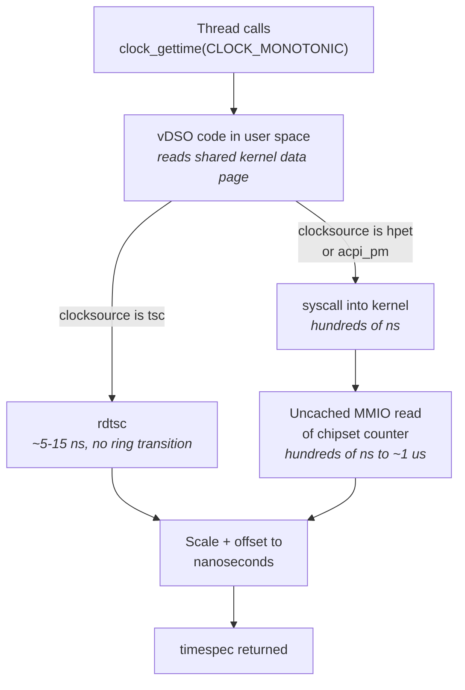
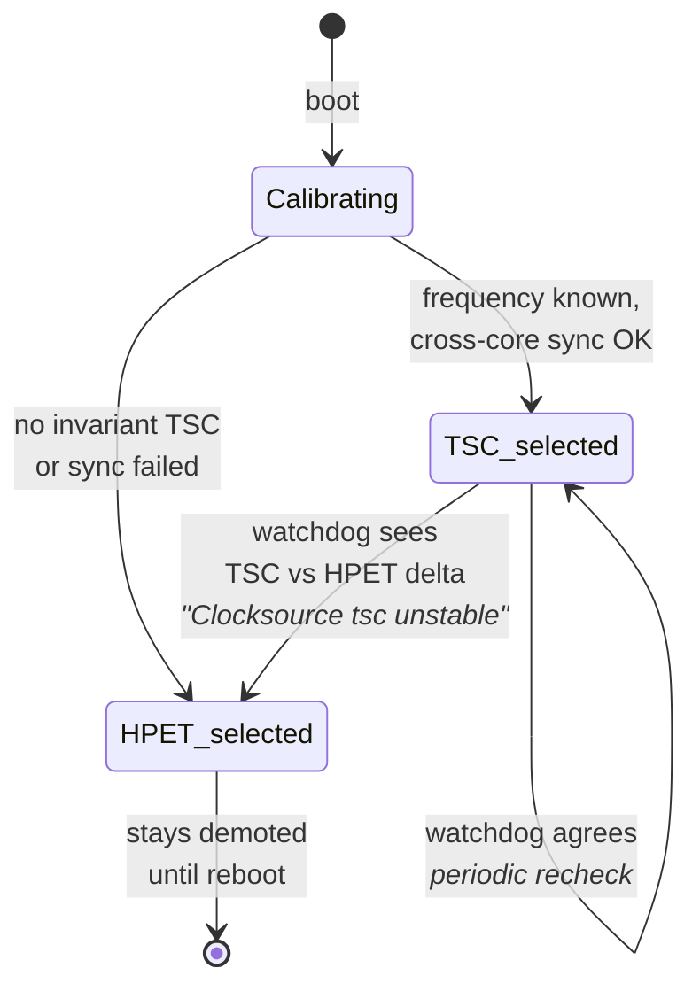
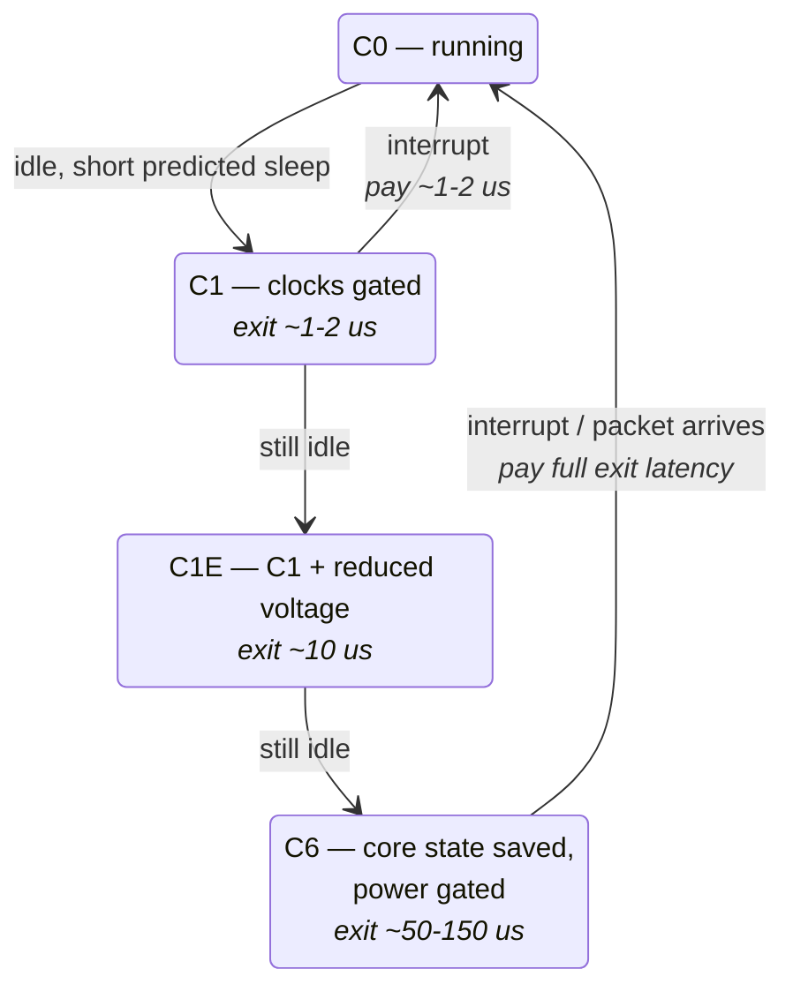
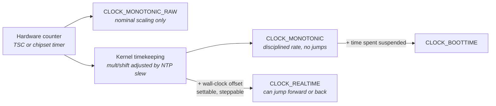
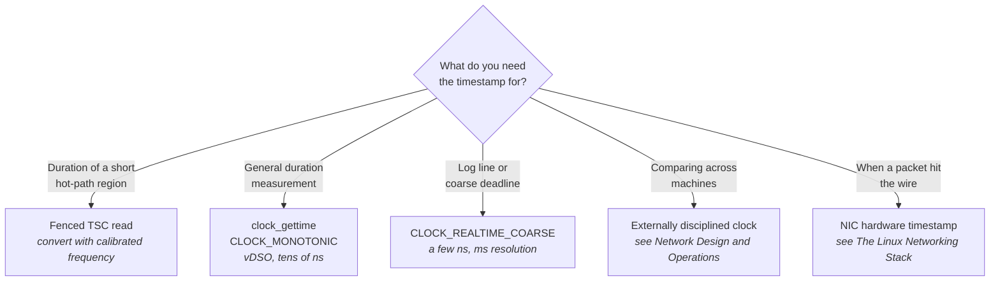

# Clocks, Timers, and Time

Every claim you will make about a low-latency system is a claim about time. "This path takes 900
nanoseconds." "The p99.9 regressed by 200 nanoseconds after that change." "The packet arrived 3
microseconds before we reacted." Each of those sentences is only as trustworthy as the mechanism
that produced the numbers — and the mechanisms available on a modern x86 server are considerably
stranger than the phrase "read the clock" suggests.

The trouble is that reading time is not a passive observation. It is an operation with a cost, and
on the scale we care about that cost is not negligible. If a hot path takes 900 ns end to end and
each timestamp costs 20 ns, then bracketing five internal stages with timestamps adds 200 ns —
better than a fifth of the thing you are trying to measure, and it is *inside* the measurement. Get
the mechanism wrong and the cost is not 20 ns but 700 ns, or occasionally 3 µs, and your histogram
is now mostly a picture of your instrumentation. Engineers new to this material almost always
underestimate this: they reach for whatever their language's standard library calls "now," discover
their measured latencies are dominated by noise, and conclude the system is jittery when in fact the
*clock* is.

There is a second problem stacked on the first. The counter that gives you cheap, high-resolution
timestamps — the CPU's cycle counter — was designed to count cycles, and cycles are not a unit of
time on a processor whose frequency changes continuously. The hardware fixes for that, the kernel's
machinery for deciding which timekeeping source to trust, and the power-management features that
make frequency vary in the first place are all tangled together. You cannot reason about timestamp
accuracy without understanding C-states, and you cannot understand why your p99.9 has a 40-µs shelf
in it without understanding C-state exit latency. This chapter untangles that knot: first the
counter, then the kernel's clock sources, then power management as the thing that corrupts both,
then accuracy and drift, and finally the practical question of which call to put in your code and
what it costs.

Network time synchronization — NTP, PTP, GPS-disciplined clocks, hardware timestamping in the NIC —
is a different problem: making *separate machines* agree. That belongs to "Network Design and
Operations." Here we are concerned with one host measuring itself.

## Reading the Cycle Counter

Suppose you want to know how long a function takes, and it takes about 500 ns. The obvious approach
is to ask the operating system for the time before and after. But a system call is a transition into
kernel mode with register saves, stack switches, and — on any machine with speculative-execution
mitigations enabled — page-table or predictor flushes on the way in and out. It costs on the order
of hundreds of nanoseconds to a microsecond (see "Kernel Architecture and the Syscall Boundary").
Two of those around a 500 ns function is not a measurement; it is a comedy. You need something you
can read from user space, without leaving your core, in a handful of nanoseconds.

x86 has provided exactly that since the original Pentium: the **Time Stamp Counter (TSC)**, a 64-bit
counter readable with a single instruction, `rdtsc`, which deposits the low 32 bits in `EAX` and the
high 32 bits in `EDX`. No system call, no memory access, no lock. On a modern x86 server it costs
somewhere in the range of 10–30 cycles — call it 5–15 ns on a 3 GHz part. That is cheap enough to
put in a hot path, which is why essentially every low-latency measurement harness is built on it.

The original TSC counted core clock cycles. That was a perfectly good definition in 1993, when a
processor ran at one frequency until you turned it off. It became useless the moment CPUs acquired
dynamic frequency scaling and deep idle states, because it meant the counter's rate changed
underneath you and stopped entirely when the core went to sleep. Two cores running at different
frequencies would accumulate ticks at different rates; a core that idled would fall behind; a
timestamp difference in "cycles" could no longer be converted to nanoseconds by any fixed constant.
For a while in the mid-2000s the TSC was genuinely unusable as a clock, and a great deal of folklore
dating from that period still circulates.

### Invariant TSC

The hardware fix is the **invariant TSC**: a TSC that ticks at a constant rate, independent of the
core's current operating frequency, and that continues ticking through idle states. On Intel and AMD
parts from roughly 2008 onward this is the norm rather than the exception. The counter is no longer
driven by the core clock at all; it is driven by a fixed reference — on many recent Intel server
parts a crystal in the tens of megahertz whose output is multiplied up to a fixed nominal rate,
often equal to the part's *base* frequency. That last point trips people up constantly: **the TSC
rate is a fixed nominal frequency, and it is usually not the frequency your core is actually running
at.** A 2.5 GHz base part running at 3.4 GHz turbo still ticks its TSC at 2.5 GHz. Cycle counts
derived from TSC deltas are therefore not cycle counts at all. They are time, in units of
1/2.5 GHz.

Linux exposes the two halves of the invariance guarantee as separate flags in `/proc/cpuinfo`:

| Flag in `/proc/cpuinfo` | What it guarantees |
|---|---|
| `constant_tsc` | The TSC ticks at a fixed rate regardless of the core's P-state (frequency/voltage operating point) |
| `nonstop_tsc` | The TSC keeps ticking while the core is in a C-state (idle state), including deep ones |
| `tsc_reliable` | Platform is asserting the TSC is synchronized and trustworthy; not present on all systems |
| `rdtscp` | The `rdtscp` instruction is available |
| `tsc_adjust` | The `IA32_TSC_ADJUST` MSR is present, letting firmware and the kernel correct per-core TSC offsets without a raw write |
| `tsc_known_freq` | The kernel obtained the TSC frequency from the hardware rather than calibrating it against another timer |

Both `constant_tsc` and `nonstop_tsc` together are what "invariant TSC" means. If either is missing,
the TSC is not a clock and no amount of tuning will make it one.

**Try it:** run `grep -o -E 'constant_tsc|nonstop_tsc|tsc_reliable|tsc_adjust|rdtscp|tsc_known_freq' /proc/cpuinfo | sort -u`
on the machine you intend to benchmark on. Then look at what the kernel decided at boot:
`dmesg | grep -i tsc`. You will see lines reporting the detected processor frequency, whether the
kernel calibrated the TSC against another timer or read the frequency from CPUID, and — critically —
the results of its cross-core synchronization check. On a healthy server you want to see the
frequency reported as known or refined, and no warnings.

### Out-of-order execution and the fencing problem

There is a subtlety in `rdtsc` that produces wrong measurements far more often than it produces
obvious errors, which is what makes it dangerous. Modern x86 cores execute out of order (see "CPU
Microarchitecture Essentials"): the processor reorders instructions freely as long as the
architectural result is preserved. `rdtsc` reads a counter — it has no data dependency on the code
around it. Nothing stops the core from executing your closing `rdtsc` *before* the last few
instructions of the region you are timing have finished, or hoisting the opening `rdtsc` to after
some of the work has already begun.

The consequence is not random noise. It is a systematic bias, usually toward *under*-reporting, and
it is worst exactly where you care most: on short regions, where the reordering window is a
significant fraction of the region itself. A 30-cycle region measured with unfenced `rdtsc` can come
back as 4 cycles.

There are two mechanisms to prevent this, and they differ in what they order:

- **`rdtscp`** is a variant that waits for all *previously issued* instructions to have executed
  before reading the counter. It does not prevent *later* instructions from starting early. It also
  returns the contents of the `IA32_TSC_AUX` MSR in `ECX`, which Linux populates with an encoding of
  the CPU and NUMA node — so `rdtscp` tells you both what time it is and which core you were on when
  you asked, atomically. That second property is more useful than it sounds, because it lets you
  detect that you migrated between two timestamps.
- **`lfence`** is a load fence that, on current Intel and AMD processors, also acts as an
  instruction-stream serializer: instructions after it do not begin executing until it retires. On
  AMD this behavior is enabled through an MSR bit that Linux sets during boot; on Intel it is
  architectural on the parts you will encounter. Placing `lfence` before `rdtsc` closes the
  hoisting window; placing it after `rdtscp` closes the other side.

The commonly recommended sequence for timing a short region is therefore `lfence; rdtsc` to open and
`rdtscp; lfence` to close. Older material recommends `cpuid` as the serializing instruction instead;
`cpuid` works but is dramatically more expensive (it is fully serializing and can take a hundred
cycles or more) and, under virtualization, traps to the hypervisor. Use `lfence`.

Fencing is not free — expect the fenced pair to cost meaningfully more than a bare `rdtsc`, on the
order of a few tens of cycles rather than a few — and that cost is now part of every measurement you
take. The right response is to *measure the measurement*: time an empty region a few million times
and record the distribution. That number is your instrument's noise floor, and any region whose
duration is comparable to it cannot be measured directly; it must be measured in a loop and
amortized.

**Failure mode: a short code region measures as implausibly fast, sometimes near zero.** Symptom is
a timed block reporting a handful of cycles when it plainly does more work than that, or a histogram
with an impossible spike at the very low end. Cause is unfenced `rdtsc` being reordered around the
region. Confirm by adding `lfence` on both sides and re-measuring; if the number moves substantially
and the low-end spike vanishes, reordering was the cause. Cross-check by timing a region of known
cost — for instance a dependent chain of a fixed number of integer adds, whose latency you can
predict from the instruction's known latency.

**Failure mode: a timestamp difference comes out negative or absurdly large.** Symptom is an
occasional nonsensical delta in an otherwise clean histogram. Cause is usually thread migration
between the two reads on a machine whose per-core TSCs are not perfectly aligned, not a broken
counter. Confirm by using `rdtscp` and comparing the `IA32_TSC_AUX` values from the two reads — if
they differ, you migrated. The structural fix is to pin the thread (see "Processes, Threads, and
Scheduling").

### Cross-core and cross-socket synchronization

A single TSC would be simple. In reality every logical CPU has its own TSC register, and the
question of whether they all read the same value at the same instant is a platform property, not an
architectural guarantee.

Within a socket, modern parts reset all TSCs together and drive them from the same reference, so
they stay aligned. Across sockets the situation is more delicate: the counters are driven by
separate reference clocks on separate packages, brought into agreement by firmware at power-on and
kept there by hardware distribution of a common reference. It usually works. It does not always, and
firmware bugs in this area are a recurring cause of mysterious behavior. Linux therefore runs an
explicit synchronization test as each CPU comes online, comparing TSC readings across cores, and
reports the result in the kernel log.

When cores disagree, the kernel can correct the offset by writing `IA32_TSC_ADJUST` — an
architectural offset register that shifts a core's TSC without a disruptive raw write to the counter
itself. That is what the `tsc_adjust` flag advertises. On a system without it, or where the
disagreement is too large or drifts over time, the kernel gives up and declares the TSC unstable —
which has consequences we will come to shortly.

The practical rule: on a multi-socket host, never assume timestamps taken on different sockets are
directly comparable to nanosecond precision without verifying it. If you are measuring a path that
crosses sockets, the residual skew — typically tens of nanoseconds when things are working, and
unbounded when they are not — sits directly in your result.

**Failure mode: a one-way latency measurement between two threads on different sockets shows a
constant offset, sometimes negative.** Symptom is that A→B consistently measures, say, 200 ns while
B→A measures 40 ns, for a symmetric path. Cause is residual TSC offset between the sockets. Confirm
by measuring in both directions and checking whether the *sum* of the two one-way times is stable
while the split is not; a constant skew cancels in the sum. Also check
`dmesg | grep -i 'tsc synchronization'` for warnings recorded at boot.

**Try it:** pin a thread to each of two cores on different sockets (use `taskset -c` and the
topology from `lscpu`), have them alternately write a TSC value into a shared cache line, and record
the apparent one-way times in both directions. The asymmetry is your skew. Repeat with two cores on
the *same* socket and confirm it largely disappears — that difference is the thing you must design
around.

### Virtualization

`rdtsc` in a virtual machine may execute natively or may be configured by the hypervisor to trap,
turning a 10-cycle instruction into a VM exit costing on the order of a microsecond. Hypervisors
also offer TSC scaling and offsetting so that a migrated guest sees a continuous, correctly-rated
counter. The relevant guest-visible signal is the clock source Linux selects: a guest under KVM
typically sees `kvm-clock` available, and under Hyper-V a hypervisor-provided reference counter.
None of this is a reason to benchmark inside a VM — you should not — but you will encounter guests
in development environments and it is worth knowing that a `rdtsc` costing 1 µs is a symptom of
trapping, not of broken hardware.

## Clock Sources the Kernel Can Choose

The TSC is one option among several, and the kernel does not use it unconditionally. Understanding
why requires stepping back to what the kernel actually needs: a monotonically increasing hardware
counter of known frequency that it can read, scale, and offset into nanoseconds, and that it can
trust not to jump. Linux abstracts this as a **clock source** — a registered driver with a read
function, a frequency, a mask (the counter width), and a quality rating. At any moment one clock
source is selected, and every timekeeping operation in the system, from `clock_gettime` to
scheduler accounting, is ultimately derived from it.

Historically the TSC failed that "trust" requirement often enough that the kernel needed
alternatives. Those alternatives still exist, they are still selectable, and — this is the part that
matters operationally — **the kernel will silently switch to one of them at runtime if it decides
the TSC has misbehaved.** A machine that was benchmarking beautifully in the morning can be five
times slower at reading the clock in the afternoon because a watchdog fired. This is not a
hypothetical; it is one of the more common ways a tuned host quietly detunes itself.

The three x86 clock sources you will encounter are radically different pieces of hardware:

| Clock source | Where it lives | Typical rate | Read cost (modern x86 server) | Notes |
|---|---|---|---|---|
| `tsc` | Per-core register, read by `rdtsc` | Nominal base frequency, e.g. 2–3 GHz | ~10–30 cycles (~5–15 ns) | Only source usable from the vDSO on x86; sub-nanosecond resolution |
| `hpet` | **High Precision Event Timer** — memory-mapped counter in the chipset | ~14.3 MHz typical (spec floor 10 MHz) | Hundreds of ns to ~1 µs | Off-die: every read is an uncached MMIO transaction across the platform fabric |
| `acpi_pm` | **ACPI Power Management timer** — a counter in the chipset's power-management block | 3.579545 MHz, fixed | Hundreds of ns to ~1 µs | 24-bit variants wrap in ~4.7 s; slowest and lowest resolution, kept as a last-resort reference |
| `kvm-clock` | Paravirtualized, hypervisor-maintained page plus TSC | — | Comparable to TSC when the guest can use the TSC directly | Guests only |

The cost difference is the whole story. `rdtsc` reads a register inside the core. Reading the HPET
or the ACPI PM timer means issuing an uncached load to a device register somewhere out on the
platform, waiting for it to traverse the interconnect, be serviced, and come back. That is not a
cache miss to DRAM — it is a device access, and it is one to two orders of magnitude more expensive
than reading the TSC. Worse, because it is a device access to a shared resource, its cost is
variable and it can serialize between cores hammering the same register.



The diagram makes the operational point that a table of read costs cannot: on x86, **only the TSC is
usable from the vDSO.** The **vDSO (virtual dynamic shared object)** is a small chunk of kernel code
mapped into every process's address space, which lets certain "system calls" be executed entirely in
user mode by reading a shared page of kernel-maintained data (see "Kernel Architecture and the
Syscall Boundary"). It can do that for the TSC because `rdtsc` is a user-mode instruction. It cannot
do it for the HPET, because reading an MMIO device register requires kernel privilege. So switching
the clock source from `tsc` to `hpet` does not merely make each read slower by the device access
cost — it *additionally* converts every `clock_gettime` in every process on the machine from a
user-space function call into a full system call. The two effects compound, and the result is
routinely a 20–50× increase in the cost of asking what time it is.

### The clocksource watchdog

Since the TSC is fast but historically untrustworthy, Linux hedges: it runs a **clocksource
watchdog** that periodically reads both the TSC and a reference source (typically HPET or
`acpi_pm`), and checks that the two advanced by consistent amounts. If they disagree by more than a
threshold, the kernel marks the TSC unstable, logs it, and demotes the system to the reference
source.

The watchdog exists because a TSC that is quietly wrong is far more dangerous than one that is
obviously slow — bad timekeeping corrupts scheduling, timer expiry, and every measurement on the
box. But the watchdog also produces false positives. Its own reads are expensive and can be delayed;
a long System Management Interrupt (firmware code running invisibly beneath the OS), a
virtualization hiccup, or heavy contention on the HPET can make a healthy TSC look like it skipped.
On a machine you have tuned, a false-positive demotion is a serious regression that arrives without
warning.



The state machine has one property worth staring at: **the demotion is one-way.** Once the kernel
declares the TSC unstable, it does not promote it back. You are on the slow clock until the machine
reboots.

The relevant controls are boot parameters, not runtime knobs:

- **`tsc=reliable`** tells the kernel to skip the watchdog check for the TSC — you are asserting the
  hardware is sound.
- **`tsc=nowatchdog`** disables the clocksource watchdog for the TSC specifically.
- **`clocksource=tsc`** requests the TSC as the selected source at boot.
- **`hpet=disable` / `nohpet`** removes the HPET from consideration entirely.
- Writing a name into `/sys/devices/system/clocksource/clocksource0/current_clocksource` changes the
  selection at runtime, but only to a source in `available_clocksource`, and it will not resurrect a
  source the kernel has marked unstable.

These are exactly the kind of assertion you should make deliberately and then verify, not sprinkle
hopefully. Suppressing the watchdog on hardware with a genuinely broken TSC gives you a machine
whose notion of time is wrong, which is worse than one whose clock is slow. Full boot-parameter
discipline is covered in "Tuning a Linux Box for Determinism"; the point here is that the choice
exists and that it is a latency decision.

**Failure mode: `clock_gettime` costs 700 ns instead of 20 ns, and every latency histogram on the
machine shifts right.** Symptom is a uniform, large regression in measured latency across unrelated
code paths, appearing after some period of uptime with no deployment. Cause is a clock source
demotion. Confirm immediately with
`cat /sys/devices/system/clocksource/clocksource0/current_clocksource` — if it reads `hpet` or
`acpi_pm`, that is it — and find the trigger with `dmesg | grep -i clocksource`, which will show a
line reporting the TSC marked unstable and the measured delta.

**Failure mode: the TSC is never selected at all, from boot.** Symptom is `current_clocksource`
reading `hpet` on a freshly booted machine. Cause is usually a missing `nonstop_tsc`/`constant_tsc`
on older or unusual hardware, a failed cross-core synchronization check, or a BIOS setting. Confirm
by checking the `/proc/cpuinfo` flags above and reading `dmesg | grep -i tsc` for the sync test
result.

**Try it:** measure the cost difference directly, on a test machine you are willing to slow down.
Write a loop that calls `clock_gettime(CLOCK_MONOTONIC, ...)` a few million times and reports the
average nanoseconds per call. Run it, then switch the source:

```sh
cat /sys/devices/system/clocksource/clocksource0/available_clocksource
cat /sys/devices/system/clocksource/clocksource0/current_clocksource
echo hpet | sudo tee /sys/devices/system/clocksource/clocksource0/current_clocksource
```

Re-run the loop, then switch back to `tsc`. The ratio you observe — commonly 20× or more — is the
single most persuasive number in this chapter, because it is the cost of a setting you did not
choose and might not notice.

**Try it:** confirm the vDSO is actually being used. Run your timing loop under
`strace -c -f ./yourprog` with the TSC selected and observe that no `clock_gettime` system calls are
counted. Switch to `hpet` and re-run: the system calls appear. That transition — from zero syscalls
to millions — is the mechanism behind the cost difference, made visible.

## Frequency Scaling, Turbo, and Idle States

Everything so far assumed the core is running and running at some frequency. Neither is true by
default. Modern server processors spend enormous effort *not* running at full speed, because power
and heat are the binding constraints on chip design, and the mechanisms they use to do that are the
largest single source of latency variance on an otherwise-quiet trading host.

Two families of mechanism, easily confused, and it is worth fixing the distinction firmly:

- **P-states** are *performance states*: the core is executing instructions, at one of several
  frequency/voltage operating points. Higher P-state numbers mean lower frequency. Turbo is the top
  of this range — an opportunistic boost above base frequency, granted when power, current, and
  thermal budgets allow and when few enough cores are active.
- **C-states** are *idle states*: the core is executing nothing, and progressively more of it is
  turned off. C0 means running. C1 is a shallow halt. C6 typically means the core's state has been
  saved and its power gated off entirely, and deeper package-level states can flush and power down
  shared caches.

P-states change how fast your work proceeds. C-states change how long it takes to *start*.

### Why frequency variation hurts

The naive expectation is that turbo is unambiguously good: your code runs faster. Two things spoil
that.

First, frequency transitions are not instantaneous and not free. Moving between operating points
involves a voltage change and, on many parts, a brief period where the core cannot issue
instructions while a PLL relocks. The individual costs are small — microseconds at most — but they
occur at times determined by a power-management controller responding to conditions across the whole
package, which means they are unpredictable from your thread's point of view.

Second, and more importantly, the frequency you get depends on what *other cores* are doing. Turbo
budgets are shared across the package: the maximum frequency available to your core depends on how
many other cores are active, the package's power consumption, and its temperature. A neighbouring
core waking up to run a monitoring agent can pull your core's frequency down. So can the *kind* of
instructions a neighbour executes — wide vector instructions draw substantially more power, and on
several Intel server generations executing them forces a frequency reduction that applies broadly,
not just to the core issuing them. The upshot is that your hot path's execution rate is coupled to
unrelated activity elsewhere in the machine, through a mechanism you cannot see from inside your
own thread.

For a system optimized for the *tail*, this is a bad bargain. Turbo gives you a better median in
exchange for a worse and less predictable spread. The standard configuration for a latency-critical
host is therefore to eliminate the variation rather than chase the peak: pin the frequency, usually
by selecting the `performance` governor and, depending on the shop's philosophy and the part's
behavior, disabling turbo so that every core runs at a known, sustainable frequency indefinitely.
Some firms keep turbo enabled and accept the variance because the absolute gain is worth it; this is
a genuine trade-off, not a settled question, and it depends on how many cores are active and how
close the box runs to its thermal limits.

The knobs live under `/sys/devices/system/cpu/`:

| Path | Meaning |
|---|---|
| `cpu0/cpufreq/scaling_governor` | Current governor; `performance` requests the highest available P-state |
| `cpu0/cpufreq/scaling_cur_freq` | Frequency the driver believes the core is at — an estimate, not a measurement |
| `cpu0/cpufreq/scaling_driver` | Which driver is in charge (`intel_pstate`, `acpi-cpufreq`, `amd-pstate`) |
| `intel_pstate/no_turbo` | Write `1` to forbid turbo, on Intel hosts using the `intel_pstate` driver |
| `intel_pstate/status` | Whether `intel_pstate` is active, passive, or off |

Note the wording on `scaling_cur_freq`: it reports the driver's intent. The frequency the core
actually ran at over an interval is a different thing, derived from the ratio of two MSRs — `APERF`,
which counts actual cycles, and `MPERF`, which counts cycles at a fixed reference rate — over the
same window. `turbostat` reports this properly as `Bzy_MHz` (busy megahertz: the average frequency
while not idle) and `Avg_MHz` (averaged including idle time). When the two disagree with
`scaling_cur_freq`, believe `turbostat`.

**Try it:** run `sudo turbostat --interval 1` on an idle machine and then while a single pinned
busy-loop runs, and then while all cores are loaded. Watch `Bzy_MHz` on your loop's core fall as the
number of active cores rises — that is the shared turbo budget, visible. Also watch the `TSC_MHz`
column stay pinned at the nominal rate while `Bzy_MHz` moves; that is invariant TSC, demonstrated in
one screen.

**Failure mode: a benchmark is 15% faster when run alone than when run alongside anything else, with
no shared data and no contention.** Symptom is throughput or latency degradation that correlates
with total machine activity rather than with any resource your code touches. Cause is turbo budget
sharing — your core dropped to a lower frequency because more cores went active. Confirm with
`turbostat` running concurrently, comparing `Bzy_MHz` on the benchmark's core between the two
conditions. Re-test with turbo disabled; if the two conditions converge, frequency was the variable.

### C-states: the expensive part

C-states are where the microseconds live, and they matter most on precisely the machines that are
best tuned — because a core dedicated to one latency-critical thread spends most of its time waiting
for work, which is to say, idle.

The mechanism is straightforward and its cost is not. When the kernel's idle loop determines a core
has nothing to run, a **cpuidle governor** predicts how long the idle period will last and selects a
C-state accordingly. Deeper states save more power: clocks stop, then the core's architectural state
is saved to a power-managed area and its voltage is dropped, then in the deepest package states the
shared last-level cache may be flushed and powered down. Each of those steps must be undone before
the core can execute an instruction again, and undoing them takes time. That time is the **exit
latency**, and it is published per state by the hardware.



Read the transition out of C6 carefully, because it is the whole reason this section exists. A
packet arrives at the NIC. The NIC raises an interrupt. If the target core is in C6, the core must
restore its state, re-establish its voltage, relock its clocks, and refill caches that may have been
invalidated — before it executes the first instruction of the interrupt handler. On a modern x86
server the exit latency for the deepest core C-states is on the order of tens to a couple of hundred
microseconds. Your carefully optimized 900-nanosecond hot path just paid 100 microseconds to get
started.

And notice how this interacts with load. Under heavy load the core never idles, never enters a deep
C-state, and never pays the exit penalty. Under light load — overnight, between market events, in a
quiet period — it idles constantly and pays it on nearly every event. **The system is slowest
exactly when it is least busy.** This is deeply counter-intuitive to engineers whose instincts were
formed on throughput systems, and it produces latency histograms with a distinctive shape: a tight
main body plus a shelf tens of microseconds out, whose weight varies inversely with message rate.

The actual per-state numbers are readable on any Linux box, and you should read them rather than
trust the approximations above, because they vary substantially by processor generation:

```sh
# Human-readable summary of every idle state the driver exposes
cpupower idle-info

# The raw per-state data in sysfs, one directory per state
grep . /sys/devices/system/cpu/cpu0/cpuidle/state*/name
grep . /sys/devices/system/cpu/cpu0/cpuidle/state*/latency     # exit latency, microseconds
grep . /sys/devices/system/cpu/cpu0/cpuidle/state*/residency    # target residency, microseconds
grep . /sys/devices/system/cpu/cpu0/cpuidle/state*/usage        # times entered since boot
grep . /sys/devices/system/cpu/cpu0/cpuidle/state*/time         # total us spent in this state
```

The `residency` file deserves a note: it is the **target residency**, the minimum time the governor
must expect to stay idle for entering this state to be worthwhile on energy grounds. The governor
compares its prediction against this number. A governor that mispredicts — and predicting the
arrival of the next network packet is not something a heuristic does well — enters a state far
deeper than the situation warranted, and you pay its exit latency for nothing.

There are several ways to keep cores out of deep states, in rough order of bluntness:

| Approach | Mechanism | Cost |
|---|---|---|
| `/dev/cpu_dma_latency` | A process opens this device and writes a latency tolerance in microseconds; the constraint holds for as long as the file descriptor stays open, and the kernel will not use states whose exit latency exceeds it | Requires a process to hold the fd open; affects the whole system |
| Per-state `disable` file | Write `1` to `/sys/devices/system/cpu/cpuN/cpuidle/stateM/disable` to forbid one state on one CPU | Precise; must be re-applied after reboot |
| `intel_idle.max_cstate=1`, `processor.max_cstate=1` | Boot parameters capping the depth the driver will offer | Machine-wide, survives nothing but a reboot to change |
| `idle=poll` | The idle loop spins instead of halting; the core never leaves C0 | Maximum power draw and heat, which can *reduce* available turbo headroom for other cores |
| Application busy-polling | The hot thread never blocks, so the core never becomes idle | Burns a core permanently; often the right answer anyway (see "Processes, Threads, and Scheduling") |

`idle=poll` is worth a specific warning because it is the setting engineers reach for first. Keeping
every core at 100% power draw raises package temperature and power consumption, which can lower the
turbo ceiling for the cores doing real work and, on a thermally constrained chassis, invite thermal
throttling. The considered approach is usually to cap C-states at a shallow level machine-wide and
let the hot-path threads busy-poll, rather than to force every core to spin. The full tuning
procedure — which states to disable, in what order, and how to verify it stuck — belongs to "Tuning
a Linux Box for Determinism." What matters here is the mechanism and its price.

**Failure mode: latency has a bimodal distribution with a shelf 50–150 µs out, and the shelf gets
heavier when traffic is light.** Symptom is a clean p50 with a badly disconnected p99.9, worsening
overnight or between bursts. Cause is deep C-state entry between events and the exit latency paid on
the next one. Confirm by reading the `usage` and `time` files under
`/sys/devices/system/cpu/cpuN/cpuidle/state*/` before and after a quiet period and identifying which
state is accumulating entries; cross-check with `turbostat`, whose `CPU%c1`, `CPU%c6`, and similar
columns show residency per state. Then disable the offending state and re-measure.

**Failure mode: the first request after an idle period is slow, and only the first.** Symptom is a
consistent outlier on the first event after a gap, with subsequent events normal. Cause is C-state
exit plus cold caches — the two arrive together, since deep package states may have flushed the
last-level cache (see "The Cache Hierarchy"). Confirm by correlating the outliers with gap length,
and by re-testing with deep C-states disabled; if the outlier shrinks but does not vanish, the
residue is cache warming, which is a separate problem with a separate fix.

**Try it:** measure your own exit latency. On an isolated core, run a thread that sleeps for a
controlled interval and then immediately timestamps and does a small fixed amount of work, recording
the elapsed time. Sweep the sleep interval from 10 µs to 10 ms. Plot the work's completion time
against the sleep interval: you will see step increases as longer sleeps let the governor pick
deeper states. Cross-reference the steps against the `latency` values in
`/sys/devices/system/cpu/cpu0/cpuidle/state*/latency`. Then repeat with the deep states disabled via
their `disable` files and confirm the steps flatten.

**Try it:** watch the governor's decisions accumulate. Snapshot
`grep . /sys/devices/system/cpu/cpu3/cpuidle/state*/usage`, run a workload that sends one small
message per second to a handler pinned on CPU 3 for a minute, and snapshot again. The deltas tell
you exactly which idle state the machine chose between your messages — usually a deeper one than you
would have chosen.

## Timestamping Accuracy and Drift

Three words get used interchangeably and mean different things, and getting them straight resolves
most confusion about "how accurate is my clock."

**Resolution** is the smallest difference the clock can represent. The TSC's resolution is one tick,
sub-nanosecond on a multi-gigahertz nominal rate. The ACPI PM timer's is about 279 ns, because
1/3.579545 MHz is 279 ns; no amount of arithmetic will recover detail finer than that.

**Precision** is how repeatable a measurement is — the spread you get timing the same thing many
times. This is dominated by the read cost's own variance and by everything happening around the read.

**Accuracy** is how close your reading is to true elapsed time. It is limited by how well the
counter's assumed frequency matches its real frequency, and that is where drift comes in.

The distinction matters because the TSC gives you spectacular resolution and, in the right
conditions, excellent precision, while saying nothing whatsoever about accuracy. You can measure an
interval to sub-nanosecond resolution and be wrong about its true duration by 50 parts per million,
because the crystal driving the counter is not running at exactly its nominal rate.

### Drift

Every clock in a computer is ultimately a quartz crystal oscillating at a nominal frequency. Real
crystals deviate from nominal. A commodity server oscillator is typically specified in the range of
tens of parts per million (ppm) — a figure that includes manufacturing tolerance, temperature
dependence, and long-term aging. Better parts, and oven-controlled oscillators, do considerably
better.

Parts per million is an awkward unit until you convert it into something you can feel:

| Drift | Error per second | Error per minute | Error per day |
|---|---|---|---|
| 1 ppm | 1 µs | 60 µs | 86 ms |
| 10 ppm | 10 µs | 600 µs | 864 ms |
| 50 ppm | 50 µs | 3 ms | 4.3 s |

Two consequences follow, and they pull in opposite directions.

For **interval measurement** — how long did this function take — drift is almost irrelevant. A 50
ppm error on a 1 µs interval is 50 femtoseconds. Nothing you measure inside a single machine over a
short window is meaningfully affected by frequency error.

For **absolute time and cross-machine comparison**, drift is the entire problem. If you timestamp a
packet's arrival on host A and its departure from host B, and the two hosts' clocks differ by 4
seconds because each has been free-running at its own rate for a day, the resulting "latency" is
nonsense. This is the problem that network time synchronization exists to solve, and it is why a
colocated trading host disciplines its clock from an external reference rather than trusting its own
crystal (see "Network Design and Operations"). The relevant mechanism for us here is simply that
*something* is continuously adjusting the system's notion of time, and that adjustment has to show
up somewhere.

Drift is also not constant. Crystal frequency depends on temperature, so a machine's drift rate
changes as it heats up after boot, as the datacenter's cooling cycles, and as the workload's power
draw changes. This is why a synchronization daemon must continuously re-estimate the rate rather
than measuring it once.

### How the kernel absorbs the correction

Here is where the pieces connect. The kernel maintains its notion of time by scaling the selected
clock source's counter with a multiplier and shift, and adding an offset. When a time
synchronization daemon determines that the system clock is running slightly fast, it does not
usually jump the clock — jumping breaks any code that assumes time moves forward smoothly. Instead
it asks the kernel to **slew**: to slightly alter the scaling multiplier so the clock runs a little
slower until the error is absorbed.

That slewing is applied to `CLOCK_REALTIME` and, importantly, to `CLOCK_MONOTONIC` as well. It is
*not* applied to `CLOCK_MONOTONIC_RAW`, which is defined as the raw hardware counter scaled by its
nominal frequency with no discipline applied at all. That is the entire distinction between the two,
and it has a practical consequence that surprises people: **`CLOCK_MONOTONIC` and
`CLOCK_MONOTONIC_RAW` tick at slightly different rates**, typically differing by the local drift
correction — tens of ppm. Measure a long interval with both and they will disagree by microseconds
per second. Neither is broken.



The diagram is the mental model to keep: one hardware counter, three different post-processing
paths, and the differences between them are entirely about what corrections have been applied.

There is one further accuracy question specific to hot paths: **where in the path was the timestamp
taken?** A timestamp taken in your application when you finish reading a packet from a socket
includes NIC processing, DMA, interrupt latency, softirq scheduling, protocol stack traversal, and
your own wakeup — potentially several microseconds of things that happened before your code ran. If
you want to know when the packet actually arrived on the wire, you need a timestamp applied by the
NIC itself. Linux exposes this through the socket timestamping interface, and a NIC with a
hardware-timestamping unit can stamp a packet at the MAC layer with its own clock (see "The Linux
Networking Stack" for the socket interface and "Network Design and Operations" for disciplining the
NIC's clock against an external reference). The general principle: **a timestamp measures the moment
it was taken, not the moment you care about**, and the distance between those two moments is often
larger than everything else you are measuring.

**Failure mode: a duration computed from wall-clock timestamps is negative, or jumps by whole
seconds.** Symptom is occasional impossible values in production, often clustered. Cause is a step
adjustment to `CLOCK_REALTIME` by a synchronization daemon, or a leap second. Confirm by checking
whether the affected timestamps came from `CLOCK_REALTIME` and by correlating against the time
daemon's own logs. The fix is structural: never compute a duration from `CLOCK_REALTIME`.

**Failure mode: two clocks that should agree drift apart by microseconds per second.** Symptom is a
slowly growing divergence between durations measured with `CLOCK_MONOTONIC` and durations measured
by converting raw TSC deltas with a fixed nominal frequency. Cause is that the kernel's clock is
being disciplined and your fixed conversion factor is not. Confirm by measuring a long interval —
minutes — both ways and computing the ratio; it should come out very close to 1, and the deviation
in ppm is your machine's uncorrected drift.

**Try it:** quantify your machine's drift. Read `CLOCK_MONOTONIC` and `CLOCK_MONOTONIC_RAW` at the
start and end of a several-minute interval, and compute the ratio of the two elapsed values. The
difference from 1.0, expressed in parts per million, is the frequency correction the kernel is
currently applying — that is, your oscillator's measured error relative to the external reference.
Repeat during a period of heavy CPU load and see whether the number moves as the package heats up.

**Try it:** determine your own conversion factor rather than trusting a nominal value. Take a TSC
reading and a `CLOCK_MONOTONIC` reading, sleep for ten seconds, take both again, and divide the TSC
delta by the nanosecond delta. That ratio is your TSC's effective frequency. Compare it against the
frequency the kernel reported at boot in `dmesg | grep -i 'tsc:'`. Any harness converting cycles to
nanoseconds should be calibrating like this at startup, not hard-coding a number from a spec sheet.

## Monotonic Versus Wall Clock, and the Cost of Asking

Everything above narrows to a single practical question: what call do you actually put in the code,
and what does it cost? The answer depends on two orthogonal choices — which clock's semantics you
need, and how much accuracy you are willing to trade for speed.

The semantic choice is the one that causes correctness bugs rather than performance bugs, and it has
one rule: **a wall clock is for telling people what time it is; a monotonic clock is for measuring
durations.** `CLOCK_REALTIME` tracks civil time. It is settable by an administrator, adjusted
continuously by a synchronization daemon, subject to step corrections, and — because civil time is a
human construct — it can move backwards. Any code computing `end - start` from `CLOCK_REALTIME` is
carrying a latent bug that will produce a negative duration at the worst possible moment.
`CLOCK_MONOTONIC` counts from an unspecified origin (typically boot), never goes backwards, and is
never stepped. It is the correct choice for essentially all measurement.

The POSIX clock IDs Linux offers, and what distinguishes them:

| Clock ID | Semantics | Adjusted by time sync? | Includes suspend? | Typical resolution |
|---|---|---|---|---|
| `CLOCK_REALTIME` | Civil ("wall") time since the epoch | Yes — slewed *and* stepped | Yes | ~1 ns |
| `CLOCK_MONOTONIC` | Monotonic since boot; never steps backwards | Rate slewed; never stepped | No — pauses across suspend | ~1 ns |
| `CLOCK_MONOTONIC_RAW` | Raw hardware counter, nominal scaling | No | No | ~1 ns |
| `CLOCK_BOOTTIME` | Like `CLOCK_MONOTONIC` but keeps counting across suspend | Rate slewed | Yes | ~1 ns |
| `CLOCK_REALTIME_COARSE` | `CLOCK_REALTIME` sampled at the last timer tick | Yes | Yes | One tick (~1–4 ms) |
| `CLOCK_MONOTONIC_COARSE` | `CLOCK_MONOTONIC` sampled at the last timer tick | Rate slewed | No | One tick (~1–4 ms) |
| `CLOCK_TAI` | International Atomic Time — like `CLOCK_REALTIME` without leap-second adjustments | Yes | Yes | ~1 ns |

You can read the kernel's own answer for any of these with `clock_getres`, which reports 1 ns for
the fine-grained clocks and the tick period for the `_COARSE` ones. Note that `clock_getres`
reports the *representable* resolution, not the read cost or the true accuracy — it is not the
number to use for capacity planning your instrumentation.

### The `_COARSE` variants and where they belong

The `_COARSE` clocks are the most underused mechanism in this chapter. They do not read a hardware
counter at all. The kernel updates a timestamp in the shared vDSO data page on each timer tick, and
the `_COARSE` clocks simply read that value. There is no `rdtsc`, no fence, no scaling arithmetic on
a counter — just a load from a page that is almost certainly in L1 or L2. On a modern x86 server the
cost is on the order of a few nanoseconds, several times cheaper than a full `clock_gettime`.

The price is resolution: the value is only as fresh as the last tick, which on a `CONFIG_HZ=1000`
kernel means it can be up to 1 ms stale, and on a `CONFIG_HZ=250` kernel up to 4 ms. That is
useless for measuring a hot path and entirely adequate for the thing most code actually uses
timestamps for: putting a wall-clock time on a log line, checking whether a one-second interval has
elapsed, or deciding whether a cached value is stale. Replacing `CLOCK_REALTIME` with
`CLOCK_REALTIME_COARSE` in a logging path is one of the cheapest wins available in a system that
timestamps every log record.

Note one interaction: on a core running with `nohz_full` — dynamic tick, where the kernel stops the
periodic timer interrupt on cores running a single task (see "Processes, Threads, and Scheduling")
— that tick may not be firing on your core. The coarse timestamp is updated by whichever CPU is
handling timekeeping duty, so the value remains available, but reasoning about its staleness on a
tickless system takes more care than the simple "one tick" figure suggests.

### The cost table

Bringing the mechanisms together, here is what the read path actually costs. These figures are
order-of-magnitude for a modern x86 server (Skylake-and-later class) with the TSC selected as clock
source and speculative-execution mitigations at distribution defaults; measure your own.

| Operation | Path taken | Typical cost |
|---|---|---|
| `rdtsc`, unfenced | One instruction, no memory access | ~5–15 ns |
| `lfence; rdtsc` / `rdtscp; lfence` | Serialized, correct for short regions | ~15–30 ns |
| `clock_gettime(CLOCK_MONOTONIC_COARSE)` | vDSO, load from shared page | ~3–7 ns |
| `clock_gettime(CLOCK_MONOTONIC)` | vDSO, `rdtsc` + scale/offset arithmetic | ~15–30 ns |
| `clock_gettime(CLOCK_MONOTONIC_RAW)` | vDSO on modern kernels; syscall on older ones | ~20–40 ns, or syscall cost |
| `clock_gettime(...)` with `hpet` selected | Full syscall + uncached MMIO device read | ~500 ns – 1.5 µs |
| Any syscall-path timestamp with mitigations enabled | Ring transition plus flushes | ~300 ns – 1 µs |

The order-of-magnitude structure is what to remember: coarse is single-digit nanoseconds, TSC-backed
vDSO reads are tens of nanoseconds, and anything that reaches a device or crosses into the kernel is
hundreds of nanoseconds to microseconds. A three-order-of-magnitude range hides behind one API.



The decision tree encodes the practical rules: fenced TSC only where the region is short enough that
tens of nanoseconds matter; `CLOCK_MONOTONIC` as the sane default; `_COARSE` wherever milliseconds
are fine; and a recognition that cross-machine and on-the-wire questions are not answerable by any
CPU-local clock at all.

### Instrumentation overhead is part of the measurement

One last consequence deserves stating explicitly, because it is where the chapter's material meets
daily practice. Every timestamp you take perturbs the thing you are measuring. Beyond its direct
cost, a fenced read blocks the out-of-order engine, which is precisely the machinery that was hiding
latency in your code (see "CPU Microarchitecture Essentials"). Sprinkling five fenced timestamps
through a pipelined hot path can slow it by more than the sum of the individual read costs, because
you have also serialized work that used to overlap.

The mitigations are all forms of taking fewer, cheaper timestamps:

- **Timestamp at boundaries, not at every step.** Two timestamps around the whole path plus
  occasional deep-dive builds beat permanent fine-grained instrumentation.
- **Store raw counter values; convert later.** The scale-and-offset arithmetic and any formatting
  belong off the hot path. Write the 64-bit TSC value into a preallocated ring buffer and do
  everything else in a consumer thread (see "Observability Without Slowing Down").
- **Measure your instrument.** Establish the cost distribution of your timestamp mechanism itself
  and subtract or at least report it. A p99.9 of 900 ns means something different if the instrument
  has a p99.9 of 400 ns.
- **Prefer external observation for the final number.** The most trustworthy latency figure comes
  from timestamps applied outside the process being measured — at the NIC or on a capture device —
  precisely because it does not perturb the path (see "Measuring Correctly").

**Failure mode: adding instrumentation makes the measured path slower than the sum of the added
timestamp costs.** Symptom is that inserting four 20 ns timestamps into a path adds 200 ns, not
80 ns. Cause is fence-induced serialization defeating instruction-level parallelism. Confirm by
replacing the fenced reads with unfenced ones and observing the recovery — then note that you have
traded accuracy for speed and decide which you need.

**Failure mode: measured latency is fine in the harness and worse in production, with identical
code.** Symptom is a reproducible discrepancy between benchmark and live numbers. Among the many
possible causes, check the clock first: verify `current_clocksource` matches between the two hosts,
verify the C-state configuration matches, and verify the CPU governor matches. Environment drift
between a tuned benchmark box and a production host is common, and the clock configuration is one of
the least-audited parts of it (see "Build, Deploy, and Environment Discipline").

**Try it:** build a comparison harness. Time one million iterations of each of: unfenced `rdtsc`,
`lfence`-fenced `rdtsc`, `clock_gettime(CLOCK_MONOTONIC)`, and
`clock_gettime(CLOCK_MONOTONIC_COARSE)`. Report the mean and the p99.9 for each. Two things should
stand out: the coarse clock is the cheapest by a wide margin, and the p99.9 of every variant is
noticeably worse than its mean — that tail is interrupts, cache misses on the vDSO data page, and
occasional deeper disturbances. That p99.9 is the noise floor of every latency number you will ever
report from this machine.

**Try it:** verify the vDSO is doing what you think. Run `ldd` on a binary that calls
`clock_gettime` and observe `linux-vdso.so.1` in the output — it has no path because it is mapped by
the kernel, not loaded from disk. Then run your timing loop under `perf stat -e 'syscalls:sys_enter_clock_gettime'`
(requires tracepoint access) and confirm the count is zero. When it is not zero, you have found a
clock configuration problem worth several hundred nanoseconds per call.

## Numbers to Know

| Quantity | Value | Notes |
|---|---|---|
| `rdtsc`, unfenced | ~5–15 ns | Single instruction, no memory access |
| `rdtsc` with `lfence` fencing | ~15–30 ns | Required for short-region accuracy |
| `clock_gettime(CLOCK_MONOTONIC)` via vDSO | ~15–30 ns | TSC clock source; no ring transition |
| `clock_gettime(*_COARSE)` | ~3–7 ns | Load from vDSO data page |
| `clock_gettime` with `hpet` clock source | ~500 ns – 1.5 µs | Syscall plus uncached MMIO |
| HPET nominal frequency | ~14.3 MHz typical | Spec floor 10 MHz; ~70 ns resolution |
| ACPI PM timer | 3.579545 MHz | ~279 ns resolution; 24-bit variants wrap in ~4.7 s |
| TSC nominal rate | Base frequency, e.g. 2–3 GHz | Fixed; not the core's current frequency |
| C1 exit latency | ~1–2 µs | Shallow halt |
| C1E exit latency | ~10 µs | Halt plus reduced voltage |
| C6 exit latency | ~50–150 µs | Core state saved and power-gated; read your own from sysfs |
| P-state transition | Low single-digit µs | Voltage change plus PLL relock |
| Coarse clock staleness | Up to 1 ms at `CONFIG_HZ=1000` | Up to 4 ms at `CONFIG_HZ=250` |
| Commodity oscillator drift | Tens of ppm | 10 ppm ≈ 10 µs/s ≈ 864 ms/day |
| Cross-socket TSC skew (healthy) | Tens of ns | Unbounded when synchronization has failed |
| Syscall cost with mitigations enabled | ~300 ns – 1 µs | Why the vDSO exists |

*Order-of-magnitude figures for modern x86 servers (Skylake-and-later class) at distribution
defaults. C-state exit latencies in particular vary substantially by generation — read them from
`/sys/devices/system/cpu/cpu0/cpuidle/state*/latency` on your own hardware.*

## Key Takeaways

- The TSC is a per-core 64-bit counter readable in a few nanoseconds from user space, which is why
  every serious measurement harness is built on it.
- "Invariant TSC" means both `constant_tsc` (fixed rate across P-states) and `nonstop_tsc` (keeps
  running through C-states); check both in `/proc/cpuinfo` before trusting the counter.
- The TSC ticks at a fixed nominal rate, usually the base frequency — so TSC deltas are time, not
  cycles, and the conversion factor must be calibrated rather than assumed.
- `rdtsc` is reordered by the out-of-order engine and systematically under-reports short regions;
  use `lfence; rdtsc` and `rdtscp; lfence`, and never `cpuid`.
- Only the TSC is usable from the vDSO on x86, so a clock source demotion to `hpet` turns every
  `clock_gettime` into a system call *and* an MMIO device read — commonly a 20–50× cost increase.
- The clocksource watchdog can demote the TSC at runtime and never promotes it back; check
  `/sys/devices/system/clocksource/clocksource0/current_clocksource` when latency regresses
  machine-wide for no reason.
- P-states vary how fast your work runs and turbo budgets are shared across the package, so a
  neighbouring core's activity changes your core's frequency.
- C-states vary how long your work takes to *start*: deep-state exit latency is tens to hundreds of
  microseconds, and it is paid on the first event after an idle gap.
- The system is therefore slowest when it is least busy — a lightly loaded host idles into deep
  C-states and pays the exit penalty on nearly every event.
- Drift is irrelevant for short intervals on one machine and dominant for absolute time across
  machines; `CLOCK_MONOTONIC` is disciplined and `CLOCK_MONOTONIC_RAW` is not, so they tick at
  slightly different rates.
- Never compute a duration from `CLOCK_REALTIME` — it steps, it slews, and it can move backwards.
- The `_COARSE` clocks cost a few nanoseconds and are stale by at most a tick; use them for log
  lines and coarse deadlines, and reserve fenced TSC reads for regions where tens of nanoseconds
  matter.
- Instrumentation is part of the measurement: fences serialize the out-of-order engine, so
  timestamps cost more than their nominal read time, and the p99.9 of your clock read is the noise
  floor of every number you report.
