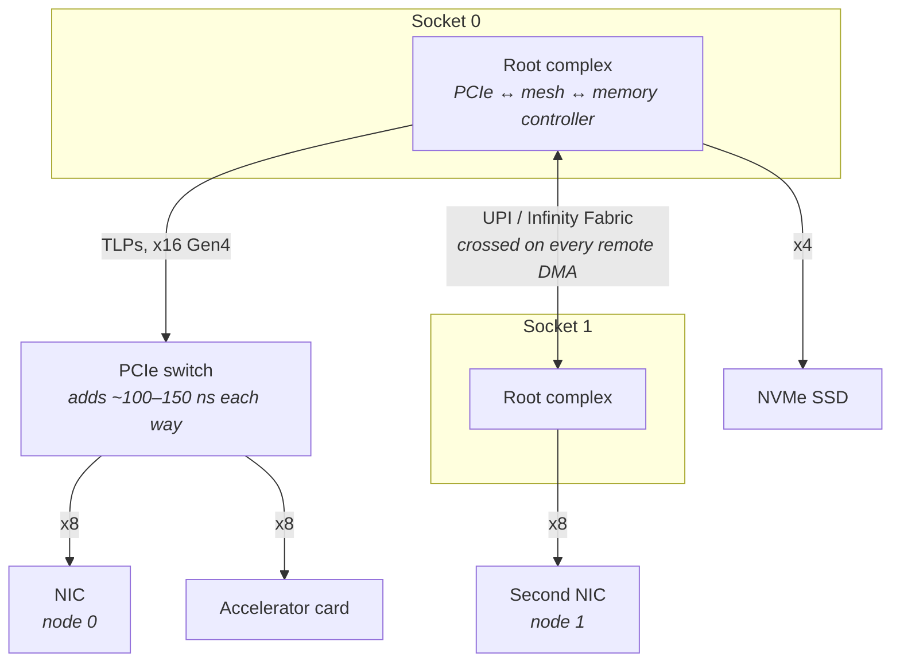
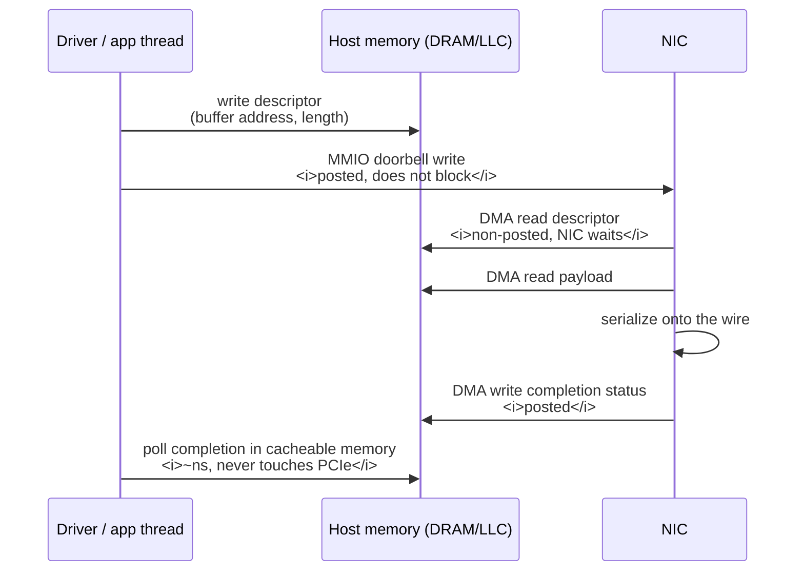
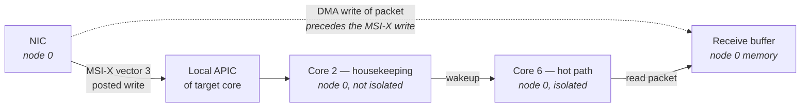
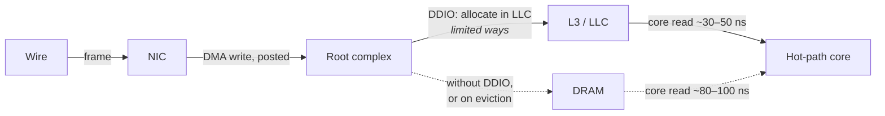
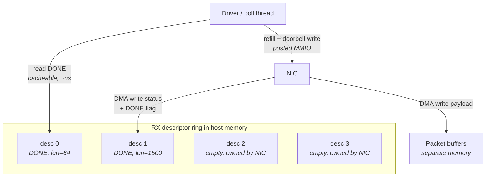
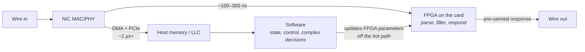
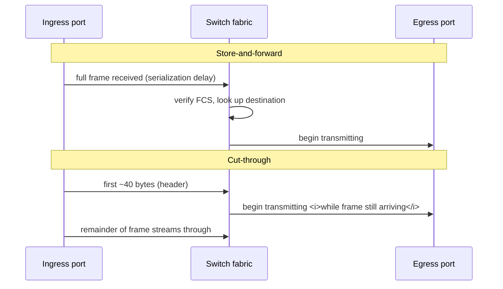

# Buses, Devices, and I/O Hardware

Everything in the preceding chapters happened inside the CPU package or on the memory bus attached to
it. A packet arriving from the network does not start there. It starts at a chip on a card in a slot,
several inches of trace away, connected by a serial link that the CPU cannot address directly, that
has its own protocol, its own queues, its own error recovery, and its own power-management states
that can put themselves to sleep between your packets.

The reason this matters is arithmetic. On a well-tuned host, the software you write might spend a few
hundred nanoseconds between reading a packet and deciding what to send. The path from the wire to
that software — through the network interface card (NIC), across the bus, into memory or cache, and
into your thread — can easily cost five to fifty times that, and the spread between its best and
worst case is wider than anything in your code. If you optimize only the part you wrote, you are
tuning a small and mostly well-behaved fraction of the budget while the large, variable fraction sits
untouched. Worse, most of the variability is *configuration*, not physics: an interrupt-moderation
setting left at its default, a card in the wrong slot, a link that negotiated half its width, a power
state that was never disabled.

This chapter is about the hardware between the wire and the last-level cache. Four mechanisms carry
almost all of the weight, and they compose: **PCI Express (PCIe)**, the serial bus that connects
devices to the CPU; **direct memory access (DMA)**, by which a device reads and writes host memory
without the CPU's involvement; **interrupts**, by which the device tells the CPU something happened;
and **descriptor rings**, the shared-memory protocol the driver and the NIC use to hand buffers back
and forth. Once those four are clear, the rest of the chapter — direct cache injection, offloads, the
FPGA boundary, and switch forwarding modes — follows from them. The software side of the same path,
the kernel's receive processing, belongs to "The Linux Networking Stack," and the techniques for
skipping that software entirely belong to "Kernel Bypass"; here we stay below both.

## PCIe: Lanes, Generations, Topology, and the Root Complex

Start from the model most engineers carry: the CPU talks to devices over "the bus," and a bus is a
shared set of wires that everyone listens on. That was true of the original PCI, and it is the reason
PCI was replaced. A shared parallel bus forces every device to run at the speed of the slowest, makes
signal integrity worse as you add devices, and requires arbitration — one device transmits at a time,
everyone else waits.

PCIe is not a bus in that sense at all, despite the name. It is a **point-to-point packet-switched
network**. Each device gets a dedicated link to a switch or to the CPU, and that link consists of some
number of **lanes**, where a lane is one differential pair in each direction — one for transmit, one
for receive, running simultaneously. A x8 link has eight lanes; data is striped across them. Because
each link is private, adding devices does not slow existing ones, and because it is packet-switched,
transactions from different devices can be in flight at the same time.

Everything that crosses a PCIe link is a packet: a **Transaction Layer Packet (TLP)**. A memory write
from the CPU to a device register is a TLP. A DMA write from the NIC into your host memory is a TLP.
A read is *two* TLPs — a request in one direction and a completion carrying the data in the other.
That framing is the single most useful thing to internalize about PCIe, because it explains both the
overhead and the latency. A TLP carries a 12- or 16-byte header plus link-layer framing and CRC, so a
small transfer is mostly overhead; and a read cannot be faster than a round trip through the fabric,
because the data physically has to come back.

At the CPU end of the fabric sits the **root complex**: the block on the CPU die that originates and
terminates PCIe traffic on the host's behalf, and that connects the fabric to the memory controller
and the cache hierarchy. On a modern x86 server the root complex is integrated into each CPU socket,
which has a consequence you have already met — a PCIe device belongs to exactly one socket, and its
DMA traffic lands on that socket's memory controller (see "Memory Systems"). Below the root complex
the topology can fan out through PCIe **switches**, and each hop through a switch adds latency.

The diagram makes three practical points. A device behind a PCIe switch pays that switch's store-and-forward
delay on every transaction in both directions. A device attached to socket 1 whose driver and
application run on socket 0 puts the inter-socket interconnect on the critical path of every packet.
And two NICs on the same host can have completely different latency characteristics purely because of
where they are plugged in.

### Generations and width

Each PCIe generation roughly doubles the per-lane signaling rate. The numbers that matter in practice
are the usable bandwidth after encoding overhead, since Gen1 and Gen2 spend 20% of the wire on 8b/10b
encoding while Gen3 and later use a far more efficient 128b/130b scheme.

| Generation | Raw rate per lane | Usable per lane, one direction | x8 link | x16 link |
|---|---|---|---|---|
| Gen 3 | 8 GT/s | ~985 MB/s | ~7.9 GB/s | ~15.8 GB/s |
| Gen 4 | 16 GT/s | ~1.97 GB/s | ~15.8 GB/s | ~31.5 GB/s |
| Gen 5 | 32 GT/s | ~3.94 GB/s | ~31.5 GB/s | ~63 GB/s |

*Figures are per direction; PCIe links are full duplex. These are link-layer rates before TLP header
overhead, which for small transfers is substantial.*

Bandwidth is rarely the binding constraint for a latency-focused system — a 25 Gb/s network link
needs about 3 GB/s, which a Gen3 x8 slot supplies several times over. What matters is checking that
the link actually trained to the width and speed you expect. A card seated imperfectly, a slot wired
x4 despite being physically x16, or a BIOS setting that pinned the link to Gen1 will all work
correctly and quietly cost you bandwidth and, under load, latency.

### Where the latency comes from

The number worth carrying around is that a **PCIe round trip is on the order of several hundred
nanoseconds to a microsecond** on a modern x86 server — Skylake-and-later class, device directly
attached to the root complex. That is enormous compared to the ~80 ns of a DRAM access and the ~1 ns
of an L1 hit. It decomposes roughly as follows:

- **Serialization onto the link** — turning the TLP into bits on the wire, a few nanoseconds for a
  small packet on a wide, fast link.
- **Propagation and SerDes** — the physical layer's serializer/deserializer blocks at each end
  contribute tens of nanoseconds each, and this cost is largely fixed regardless of transfer size.
- **Switch hops** — each PCIe switch in the path adds roughly 100–150 ns per direction, because a
  switch receives the whole TLP before forwarding it.
- **Root complex and coherency** — the root complex must interact with the cache hierarchy to keep
  DMA coherent with the CPU caches, which takes additional time on the host side.
- **Device-side processing** — the endpoint's own logic, which for a NIC register read can dominate
  everything above it.

The asymmetry between reads and writes is the most actionable consequence. PCIe distinguishes
**posted** transactions, which require no response, from **non-posted** ones, which do:

| Transaction | Type | Cost from the CPU's perspective |
|---|---|---|
| Memory write to a device register | Posted | Fire-and-forget; retires into a buffer, roughly tens of ns of CPU occupancy |
| Memory read from a device register | Non-posted | Full round trip, blocking; hundreds of ns to over a microsecond |
| Device DMA write into host memory | Posted | No completion needed; the device does not wait |
| Device DMA read from host memory | Non-posted | Full round trip; the device waits for the data |

**A read from a device is one of the most expensive single operations available to a CPU.** It is
non-posted, so the core has an outstanding load that will not retire for hundreds of nanoseconds to
microseconds; and because device memory is mapped uncacheable, the core cannot speculate around it or
overlap it the way it overlaps DRAM misses. This is why the descriptor ring protocol in section five
is designed the way it is: it is an elaborate structure whose entire purpose is to let the CPU learn
what the device did *without reading anything from the device*.

**Failure mode: a link negotiated below its capability.** Symptom is throughput that plateaus well
below expectation, and under bursts, added latency from queueing on the link. Cause is a reseated card,
a slot wired narrower than its physical connector, bifurcation settings in BIOS, or signal-integrity
problems forcing a downtrain. Confirm with `sudo lspci -vvv -s <bdf>` and compare the `LnkCap` line
(what the device and slot are capable of) against `LnkSta` (what was actually negotiated). A
`LnkSta` reading `Speed 2.5GT/s, Width x4` under a `LnkCap` of `Speed 16GT/s, Width x16` is the
signature.

**Failure mode: microsecond-scale latency spikes on an otherwise idle link.** Symptom is that the
first packet after a quiet period is far slower than subsequent ones. Cause is **Active State Power
Management (ASPM)**, which puts an idle PCIe link into a low-power state (L0s or L1) and must
re-train it before traffic can flow — L1 exit in particular is a microseconds-scale event. Confirm by
looking for `LnkCtl: ASPM L1 Enabled` in `lspci -vvv`. The remedy is to disable ASPM in BIOS, or boot
with `pcie_aspm=off`. This is one of several power-management features that trade latency for watts;
the full BIOS checklist is in "Tuning a Linux Box for Determinism."

**Failure mode: sporadic latency outliers with no software explanation.** Symptom is rare, large
spikes uncorrelated with load. Cause may be PCIe link errors: a corrupted TLP triggers a link-layer
replay, retransmitting from the replay buffer, which stalls that link briefly. Confirm by checking
the Advanced Error Reporting (AER) capability in `sudo lspci -vvv` for nonzero correctable error
counts, and by watching `dmesg` for AER messages. Correctable errors are invisible to applications
but not to latency.

**Try it:** map your machine's I/O topology. Run `lspci -t` for the tree view — it shows which
endpoints sit behind which bridges and switches. Then, for your NIC, run `lspci -vvv -s <bdf>` and
record four things: `LnkCap`, `LnkSta`, `MaxPayload`, and `MaxReadReq`. Cross-check the physical slot
with `sudo dmidecode -t slot`, which reports each slot's designation, its electrical width, and its
current usage. Finally, confirm the NUMA node with
`cat /sys/bus/pci/devices/<bdf>/numa_node` and the cores local to it with
`cat /sys/bus/pci/devices/<bdf>/local_cpulist`. That last pair of files is where NIC placement stops
being theoretical.

**Try it:** inspect and, on a test box, modify PCIe device control settings directly. `lspci -vvv`
decodes the PCIe capability's Device Control register into the human-readable `MaxPayload` and
`MaxReadReq` values; `setpci -s <bdf> CAP_EXP+8.w` reads the same register as a raw 16-bit word.
Reading it both ways teaches you the mapping between the decoded output and the config-space bits,
which you will need any time a vendor tuning guide tells you to change a register by offset. Do not
write to config space on a production host.

## DMA, MMIO, and Doorbell Registers

Two directions of access exist between a CPU and a device, and confusing them is the source of most
naive I/O designs. The CPU can reach into the device: that is **memory-mapped I/O (MMIO)**. The
device can reach into host memory: that is **DMA**. They have wildly different costs, and the whole
art of a fast I/O path is arranging for the expensive direction to be used as rarely as possible.

Consider the naive design first, because seeing why it fails motivates everything else. Suppose the
NIC simply held received packets in an on-card buffer, and the CPU polled a status register to see
whether a packet had arrived, then read the packet out word by word. Every status poll is a
non-posted PCIe read costing hundreds of nanoseconds during which the core is stalled on an
uncacheable load. Reading a 1500-byte packet at 8 bytes per read would be nearly two hundred such
round trips. A single packet would take hundreds of microseconds and burn a core doing nothing.

DMA inverts the relationship. The device is given the *physical* address of a buffer in host memory
and writes the packet there itself, as posted PCIe writes, without the CPU participating at all. The
CPU then reads the packet out of ordinary cacheable DRAM at DRAM speed. Bulk data therefore always
moves by DMA, in the direction the device chooses, and the CPU never touches the device for payload.

### MMIO: how the CPU reaches the device

A PCIe device advertises one or more **Base Address Registers (BARs)** — regions of address space it
wants mapped. During enumeration, firmware and the kernel assign each BAR a range of physical
addresses, and accesses to those addresses are routed by the root complex to the device instead of to
DRAM. The kernel maps those physical ranges into kernel virtual address space with `ioremap`, or into
a user process's address space when a bypass framework or a `/sys/bus/pci/devices/<bdf>/resourceN`
mapping is used.

The crucial property is the **memory type**. Device BARs are mapped **uncacheable (UC)** by default,
which means every access goes to the device — no caching, no speculation, no combining, and strict
ordering. That is what you want for a control register whose value changes underneath you, and it is
also why MMIO is slow. Some regions are instead mapped **write-combining (WC)**, which lets the CPU
accumulate several stores in a write-combining buffer and flush them as a single larger TLP. WC
mappings are much faster for streaming data to a device and are used by NICs that let the driver
write small packets or descriptors directly into device memory, but they weaken ordering: writes can
be reordered and merged, so the driver must issue an explicit fence when order matters.

| Access | Direction | Typical cost (modern x86 server) | Notes |
|---|---|---|---|
| MMIO write (UC) | CPU → device | Tens of ns of core occupancy | Posted; retires into the write buffer, completes asynchronously |
| MMIO read (UC) | CPU → device → CPU | ~500 ns – 2 µs | Non-posted; core stalls, cannot be overlapped |
| MMIO write (WC) | CPU → device | Tens of ns, amortized across combined stores | Weakly ordered; needs a fence to force the flush |
| DMA write | Device → host memory/LLC | Not on the CPU's critical path | Posted |
| DMA read | Host memory → device | Full round trip, paid by the device | Non-posted; why descriptor prefetch exists |

*Order-of-magnitude figures for a directly attached endpoint; a switch hop or a remote-socket device
increases them.*

### The doorbell

Given that the CPU should almost never read from the device, how does the CPU tell the device that
new work is available? The answer is a **doorbell register**: a single MMIO location that the driver
*writes* to signal the device. The value written is usually an index — "I have produced descriptors
up to position N" — and the write is posted, so the core does not wait for it.

The doorbell is a beautifully economical design. All the actual data lives in host memory where the
CPU can touch it cheaply. The only thing that crosses the bus from CPU to device is a single small
write carrying a producer index, and even that write does not block. In the other direction the
device signals completion by *writing into host memory* — updating a descriptor's status field, or
writing a completion record — again as a posted write, so the CPU learns about it by reading its own
DRAM or cache rather than by reading the device.

The diagram shows the asymmetry that makes the design work: every arrow that would stall the CPU has
been eliminated. The CPU issues one posted write and afterwards polls a cache line in its own memory.
Everything expensive is either posted or is paid by the device, off the CPU's critical path.

**Failure mode: a hot loop reads a device register.** Symptom is a per-iteration cost of a microsecond
or more with a profile that shows the time inside a single instruction and near-zero instructions per
cycle. Cause is an uncacheable MMIO read — often a status or statistics register — placed in the
polling loop. Confirm by identifying the load's target address and checking whether it falls inside a
BAR range listed in `/proc/iomem` or in `lspci -vvv`'s `Region` lines. The fix is architectural: get
the information from a DMA-written location in host memory instead.

**Failure mode: batching descriptors improves throughput but the tail gets worse.** Symptom is that
raising the number of descriptors posted per doorbell write reduces CPU cost and raises packets per
second, while p99.9 latency climbs. Cause is that a descriptor sitting in the ring, unannounced,
cannot be acted on by the device until the doorbell rings; the wait is pure added latency for the
first item in the batch. This is the general batching-versus-latency trade-off (see "Systematic
Optimization"), and it appears here in its purest hardware form.

**Failure mode: DMA into memory on the wrong NUMA node.** Symptom is packet-handling latency a few
microseconds worse than the NIC's specification, with no software cause. Cause is that the NIC's root
complex is on one socket while its receive buffers and handling thread are on another, so every DMA
write and every subsequent read crosses the inter-socket interconnect. Confirm by comparing
`cat /sys/class/net/<iface>/device/numa_node` with the node of the pinned handler thread (see "Memory
Systems").

**Try it:** find your NIC's BARs and see the address space it owns. Run
`lspci -vvv -s <bdf> | grep -i region` to list them with their sizes and whether each is prefetchable,
then `grep -i <device-name> /proc/iomem` to see the same ranges as the kernel has assigned them. The
sizes are informative: a small BAR of a few kilobytes is a register file; a large one of megabytes is
usually a doorbell or descriptor area intended to be mapped per-queue, often write-combining.

**Try it:** watch DMA mapping activity. On a system with the IOMMU active, DMA addresses are not raw
physical addresses but I/O virtual addresses translated by the IOMMU, which adds a lookup and its own
translation cache. Check whether yours is on with `dmesg | grep -i -E 'DMAR|IOMMU|AMD-Vi'` and by the
presence of `/sys/class/iommu/`. Note whether the kernel was booted with `iommu=pt` (passthrough),
which keeps the IOMMU available for device assignment while avoiding per-transaction translation for
host drivers — a common setting on latency-tuned hosts.

## Interrupts: MSI/MSI-X, Coalescing, and Affinity

A device that has DMA'd a packet into memory still has to tell somebody. The classical mechanism is
the interrupt, and the classical implementation was a physical wire from the device to an interrupt
controller. That approach has three defects that matter here. Wires are scarce, so devices had to
share them, and the CPU then had to *read a device register* from every candidate device to find out
which one asserted the line — the expensive non-posted read we have been avoiding all chapter. Second,
a level-triggered wire carries no information beyond "something happened." Third, and most subtly, the
interrupt signal travels a different path from the DMA data, so the interrupt could arrive before the
data it referred to had landed in memory, forcing the driver to read from the device to flush the
write.

**Message Signaled Interrupts (MSI)** fix all three by removing the wire. An MSI is not a signal at
all — it is an ordinary posted memory write, issued by the device to a special address that the CPU's
interrupt controller decodes. Because it is a memory write travelling the same ordered path as the
DMA writes that preceded it, it cannot overtake them: **by the time the interrupt is delivered, the
data is guaranteed to be visible.** And because the write carries a data payload, the device can
signal *which* condition occurred without the CPU reading anything back.

**MSI-X** is the extended form and the one every serious NIC uses. Where MSI supports at most 32
vectors that must be allocated as a contiguous block sharing one target address, MSI-X supports up to
2048 independent vectors, each with its own target address and data value, stored in a table in the
device's BAR space. The consequence is the one that matters for us: **each receive queue can have its
own interrupt vector, targeted at its own core.** That is the foundation of every multi-queue NIC
configuration.

| | Legacy INTx | MSI | MSI-X |
|---|---|---|---|
| Mechanism | Physical wire, level-triggered | Posted memory write | Posted memory write |
| Vectors per device | Shared line | Up to 32, contiguous | Up to 2048, independent |
| Per-vector CPU targeting | No | One address for all vectors | Yes — per-vector address and data |
| Ordered with respect to DMA | No — needs a flushing read | Yes | Yes |
| Suitable for per-queue steering | No | Poorly | Yes |

### What an interrupt actually costs

An interrupt is not free, and understanding where its cost lives explains why low-latency systems
often turn interrupts off entirely. When the interrupt arrives, the target core stops what it is
doing, saves architectural state, switches to the kernel's interrupt entry path, runs the handler,
and eventually gets back to whatever it was executing. On a modern x86 server the hardware entry and
handler dispatch alone are on the order of one to a few microseconds; getting from there to a
*user-space thread actually running* — through the kernel's deferred processing and the scheduler's
wakeup path — commonly costs several microseconds more, and is the part with the fattest tail.

There is also a cost the interrupted core pays afterwards that does not appear in any timer: the
interrupt handler ran on that core, evicting some of your working set from L1 and L2 and polluting
the branch predictors (see "The Cache Hierarchy" and "CPU Microarchitecture Essentials"). A thread
resumed after an interrupt runs slower than it did before, for a while.

This is the whole argument for **busy polling**: rather than being told when a packet arrives, a
dedicated thread spins reading the descriptor ring in host memory, detects the completion the moment
the device's DMA write lands, and never pays interrupt entry, scheduler wakeup, or cache pollution.
It costs a core, permanently, at 100% utilization. That trade — a core for several microseconds of
tail — is the defining trade of low-latency I/O, and it is revisited from the software side in
"Processes, Threads, and Scheduling" and "Kernel Bypass."

### Interrupt coalescing

Even with MSI-X, a NIC receiving millions of packets per second cannot raise an interrupt per packet
without spending the entire machine on interrupt entry. The standard mitigation is **interrupt
coalescing** (also called interrupt moderation): the NIC delays the interrupt until either a timer
expires or a threshold number of packets has accumulated, and then raises one interrupt covering all
of them.

The trade-off is direct and unhidden. A coalescing timer of 50 microseconds means that, in the worst
case, a packet sits in host memory fully received and completely invisible to software for 50
microseconds. Defaults on general-purpose NIC drivers are frequently in the tens of microseconds and
frequently have **adaptive** moderation enabled, which varies the delay based on observed traffic
rate — excellent for throughput and CPU efficiency, and disastrous for determinism, because the delay
your packet experiences now depends on the recent history of unrelated traffic.

`ethtool -c <iface>` reports the current settings and `ethtool -C` changes them:

| Parameter | Meaning | Latency-oriented setting |
|---|---|---|
| `rx-usecs` | Delay after a packet before interrupting | 0 (interrupt immediately) |
| `rx-frames` | Packets accumulated before interrupting | 1, or 0 if the driver treats 0 as disabled |
| `adaptive-rx` | Driver/firmware varies the above dynamically | `off` — it is a source of variance |
| `tx-usecs` / `tx-frames` | Same, for transmit completions | Less critical; completions are off the hot path |

Not every driver implements every parameter, and `ethtool -c` will report `n/a` for those it does not.
Setting `rx-usecs 0` raises interrupt load substantially, which is acceptable precisely because a
latency-tuned host is not trying to maximize packets per second on a shared core.

### Interrupt affinity

An MSI-X vector is delivered to a specific core, chosen by the address written in the MSI-X table
entry — and Linux exposes control over that choice through `/proc/irq/<n>/smp_affinity` (a hex CPU
bitmask) and `/proc/irq/<n>/smp_affinity_list` (a friendlier comma-and-range list). Every interrupt
in the system, with its per-core delivery counts, is visible in `/proc/interrupts`.

The default arrangement is wrong for a latency-critical host in two ways at once. First, the
`irqbalance` daemon migrates interrupt affinities periodically to spread load, which means the core
handling your NIC's receive queue changes over time and without warning — and each migration is a
tail event. Second, even with a fixed assignment, the default placement pays no attention to which
cores you have isolated for hot-path threads, so device interrupts land on exactly the cores you were
protecting.

The correct arrangement follows from a single principle: **the NIC, its interrupt, its receive
buffers, and the thread that consumes them should all be on the same NUMA node, and the interrupt
should never land on an isolated hot-path core.** Two configurations satisfy this. Either the
interrupt is steered to a housekeeping core on the correct node, and the hot-path thread is woken
from there; or interrupts for the hot queue are effectively eliminated by busy polling, and remaining
interrupts are steered away from the isolated cores entirely.

The diagram encodes two rules worth stating explicitly. The DMA write of the packet and the MSI-X
write travel the same ordered path, so the packet is in memory before the interrupt fires — no
flushing read is needed. And every element in the picture is on node 0; moving any one of them to
node 1 puts the inter-socket interconnect on the packet's critical path.

**Failure mode: periodic latency spikes that migrate between cores.** Symptom is jitter that appears
on one isolated core, then later on another, with no change in workload. Cause is `irqbalance`
reassigning interrupt affinities on a timer. Confirm by sampling `/proc/interrupts` repeatedly and
watching which CPU column increments for your NIC's vectors; if the busy column changes over time,
irqbalance is running. Disable the service, then set affinities explicitly by writing to
`/proc/irq/<n>/smp_affinity_list`.

**Failure mode: the median is fine but p99.9 is tens of microseconds worse than p50.** Symptom is a
latency histogram with a long, flat shelf rather than a clean tail. Cause is frequently interrupt
coalescing: most packets arrive when the timer is nearly expired, some arrive just after it resets.
Confirm with `ethtool -c <iface>` — a nonzero `rx-usecs` in the same order of magnitude as the shelf
width is strong evidence, and setting `rx-usecs 0` should collapse the shelf.

**Failure mode: interrupts land on a core that `isolcpus` was supposed to protect.** Symptom is
context-switch or interrupt counts on a core that is meant to run one pinned thread and nothing else.
Confirm by reading the row for your NIC's vectors in `/proc/interrupts` and checking the counts in the
isolated cores' columns. Note that `isolcpus` alone does *not* steer interrupts away; affinity must be
set separately.

**Try it:** find your NIC's interrupts and watch them move. Run
`grep <iface> /proc/interrupts` to list its vectors — a multi-queue NIC will show one line per queue,
typically named with the interface and a queue index. Note the IRQ numbers in the first column, then
read `/proc/irq/<n>/smp_affinity_list` for each. Generate traffic and re-read `/proc/interrupts` a few
seconds apart to see which core's count is rising. Then write a different CPU to
`smp_affinity_list` and confirm the counts move.

**Try it:** measure the cost of coalescing directly. Record a latency histogram of a request/response
ping over the interface with the driver's default `rx-usecs`, then set `ethtool -C <iface> rx-usecs 0
rx-frames 1 adaptive-rx off` and record it again. Compare not just the medians but the shape: the
default configuration usually shows a broad plateau whose width matches the coalescing timer, and it
should largely disappear. Watch CPU utilization on the interrupt-handling core rise in exchange.

## DDIO and Direct Cache Injection

Here is a subtlety that changes the shape of the receive path. When the NIC DMA-writes a packet into
host memory, where does it go? The obvious answer — DRAM — has an unpleasant consequence: the very
next thing that happens is that a CPU core reads that packet, misses in every cache level, and pays
a full ~80–100 ns DRAM access (see "Memory Systems"). Data that was written a microsecond ago by a
device on the same chip has to make a round trip to a DRAM chip before software can look at it.

Worse, before the DMA write can happen at all, the platform must maintain coherence: if any core
holds a cached copy of that buffer's cache lines — and it very likely does, since the driver recently
recycled that buffer — those lines must be invalidated, or the DMA write must be merged with them.
Historically this involved snooping the caches from the root complex, and it cost time on every
transfer.

**Intel Data Direct I/O (DDIO)** resolves both problems by changing the destination. On Intel server
parts from the Xeon E5 generation onward, inbound DMA writes from PCIe devices are placed **directly
into the last-level cache (L3)** rather than into DRAM. The core that subsequently reads the packet
finds it in L3 — roughly 30–50 ns on a modern server rather than 80–100 ns — and DRAM is never
touched at all if the buffer is overwritten again before eviction. Outbound DMA reads can likewise be
served from L3 if the data is there, which means a transmit buffer the CPU just wrote does not have to
be flushed to DRAM before the NIC can fetch it.

DDIO is on by default and is not something you enable per-application; it is a platform property. The
important operational facts are about its limits.

The diagram's dashed paths are the failure case, and reaching them is the thing to avoid. Two
mechanisms push you there.

**DDIO writes are restricted to a subset of the LLC.** To prevent I/O traffic from evicting the
entire cache contents of every running program, the platform limits DMA allocation to a small number
of LLC ways — historically two ways out of the LLC's associativity on Intel server parts, though the
exact number and its configurability are model-specific and documented in Intel's platform tuning
guides rather than in the architecture manual. Within that restricted region, incoming DMA writes
compete with each other.

**If software does not consume the data fast enough, DDIO stops helping and starts hurting.** This is
sometimes called the *leaky DMA* problem. Incoming packets are written into the DDIO ways; if the
application is slow, later packets evict earlier ones out to DRAM before anyone reads them. The
application then reads from DRAM anyway — having also paid for the eviction write-back, and having
disturbed the LLC on the way. The receive-ring sizing decision therefore has a cache dimension that
is easy to miss: a very large receive ring, sized generously to absorb bursts, guarantees that under
burst conditions the oldest packets have been pushed out of cache by the time you get to them.

Two further points prevent overgeneralizing. DDIO is an **Intel** feature; AMD's EPYC platforms have
historically directed inbound DMA to memory with their own coherence arrangements, and the details
vary by generation, so check the vendor's documentation for the specific part rather than assuming
either behavior. And DDIO interacts with **NUMA**: it allocates into the LLC of the socket whose root
complex received the transaction. A packet arriving on socket 0's NIC lands in socket 0's L3, so a
consumer thread on socket 1 gets neither the cache benefit nor a local DRAM access — it gets a remote
cache-to-cache transfer, which is the most expensive option in the table.

| Path taken by a received packet | Approximate cost of the consumer's first read |
|---|---|
| DDIO into local LLC, consumed promptly | ~30–50 ns |
| DDIO into local LLC, evicted before consumption | ~80–100 ns, plus the wasted write-back |
| DMA to local DRAM (no DDIO) | ~80–100 ns |
| DMA into the *remote* socket's LLC or DRAM | 1.5–2× the local figure, plus interconnect variance |

*Order-of-magnitude figures for a modern Intel x86 server; see "Memory Systems" for the underlying
cache and DRAM latencies.*

**Failure mode: receive latency degrades under burst load out of proportion to queueing.** Symptom is
that during a microburst, per-packet processing cost rises even for packets that waited only briefly.
Cause is DDIO eviction — the burst filled the restricted LLC ways and pushed packets out to DRAM.
Confirm indirectly by measuring LLC miss rate on the consuming core during bursts with
`perf stat -e LLC-load-misses,LLC-loads`, and by testing whether shrinking the receive ring with
`ethtool -G <iface> rx <smaller>` improves the tail — a counter-intuitive change that works because
it bounds how far behind you can fall.

**Failure mode: a second application on another socket makes your packet processing slower.** Symptom
is added latency correlated with an unrelated process. Cause is LLC pressure: DDIO's allocation
region is part of the shared LLC, and heavy cache usage elsewhere on the socket interacts with it.
Confirm by isolating the neighbour to another socket with `numactl --cpunodebind` and re-measuring.

**Try it:** demonstrate the DDIO effect indirectly. Run a receive workload with a very small receive
ring (`ethtool -G <iface> rx 128`, if the driver permits it) and again with the maximum the driver
allows, under identical offered load that is just below capacity. Record `perf stat -e
LLC-load-misses` on the consuming core in both cases, along with the latency histogram. The large
ring will typically show more LLC misses per packet under burst conditions, because packets sat
longer before being read. Check the ring's minimum, maximum, and current values first with
`ethtool -g <iface>`.

## Inside the NIC: Rings, Descriptors, and Offloads

Everything so far has been generic bus and interrupt machinery. Now we can assemble it into the
actual structure a NIC and its driver use to communicate: the **descriptor ring**. This is the most
important data structure in the I/O path, and it is worth understanding in enough detail to reason
about its failure modes, because almost every receive-side counter you will ever look at describes
something going wrong with it.

The problem it solves is producer/consumer handoff across a boundary where one side is a CPU and the
other is a device, and where — per everything above — neither should have to read from the other. The
solution is a circular array in host memory, shared between the driver and the NIC, whose entries are
called **descriptors**. A descriptor is a small fixed-size record, typically 16 or 32 bytes, holding
the physical (or IOMMU-translated) address of a data buffer, its length, and a set of status and
control flags.

For receive, the roles are counter-intuitive at first: **the driver produces empty buffers and the NIC
consumes them.** The driver fills descriptors with addresses of free buffers and advances a producer
index, which it communicates to the NIC by writing the receive doorbell. The NIC, when a frame
arrives, takes the next unused descriptor, DMA-writes the frame into the buffer that descriptor points
at, then DMA-writes the descriptor back with the received length and status bits including a
"done" flag. The driver detects arrival by reading that flag *out of its own cacheable memory* —
never from the device. For transmit, the roles are the familiar way round: the driver writes
descriptors pointing at packets to send, rings the transmit doorbell, and the NIC DMA-reads the
descriptors and the payloads.

The diagram highlights the property that makes the whole thing fast: the only CPU→device traffic is
the doorbell write, and the only device→CPU traffic is posted DMA. The driver's detection of a new
packet is a load from a cache line that DDIO may have placed directly in L3.

Two performance details of the ring are worth internalizing:

- **The NIC prefetches descriptors.** Fetching a descriptor is a non-posted PCIe read, so waiting for
  one at packet-arrival time would add a PCIe round trip to every packet. NICs therefore read
  descriptors ahead in batches and hold them on-card. This is why the driver must post buffers well
  in advance, and why a ring that has been allowed to run empty is expensive to restart.
- **Descriptor writeback is batched too.** Rather than one small posted write per descriptor, NICs
  commonly write back several at once, or use a separate compact completion queue, to avoid burning
  PCIe transactions on 16-byte updates. This is a firmware/driver detail that varies by vendor and
  affects how quickly a completion becomes visible.

### Ring sizing

Ring size — the number of descriptors — is the buffer between the NIC's arrival rate and the
software's consumption rate. `ethtool -g <iface>` shows the current and maximum values, and
`ethtool -G` sets them. The sizing decision is a genuine trade-off with no universally correct answer:

| Ring too small | Ring too large |
|---|---|
| A microburst exhausts free descriptors; the NIC drops frames | Packets queue in the ring instead of being dropped, adding latency to everything behind them |
| Shows up as a receive-missed / no-buffer counter in `ethtool -S` | Shows up as a widening latency tail with no drops |
| Recovery requires the driver to refill and re-ring the doorbell | Increases DDIO eviction pressure, per the previous section |

The instinct from throughput-oriented tuning is to make rings as large as possible. For a
latency-critical receive path the right size is *large enough to absorb the bursts you actually see,
and no larger* — because beyond that point, additional ring capacity converts drops into latency, and
a latency-critical system frequently prefers the drop. Deciding this requires measuring your burst
sizes, which is a networking-operations topic (see "Network Design and Operations").

### Multiple queues and steering

A modern NIC does not have one receive ring; it has many, and it decides which one an incoming frame
goes into. The default mechanism is **Receive Side Scaling (RSS)**: the NIC computes a hash over
selected header fields — typically source and destination IP addresses and ports — and uses the low
bits of the hash to index an indirection table that names the target queue. Each queue has its own
MSI-X vector and therefore its own target core, so RSS spreads receive processing across cores while
keeping every packet of a given flow on the same core, preserving ordering and cache locality.

For a latency-critical receiver, hash-based spreading is often not what you want; you want a specific
flow on a specific queue whose interrupt is on a specific core, deterministically. NICs support that
too, through **flow steering** rules that match header fields exactly and direct matching packets to a
named queue, configured with `ethtool -N` (or the older `-U` spelling) and inspected with
`ethtool -n`. The full software-side treatment of RSS, RPS, RFS, and XPS belongs to "The Linux
Networking Stack"; the hardware fact to carry forward is that queue selection happens *on the card*,
before any software runs, and it determines which core's cache the packet will land near.

The number of queues themselves is set with `ethtool -L` and reported by `ethtool -l`. Reducing the
queue count on a latency-tuned host is common: fewer queues means fewer interrupt vectors to place and
fewer cores whose caches hold packet data.

### Offloads

An **offload** is a computation the NIC performs so the CPU does not have to. The category is
routinely misunderstood because the throughput-oriented advice ("enable everything") and the
latency-oriented advice ("disable several of them") are direct opposites, and neither is wrong for its
context.

The distinction that resolves it: offloads that compute something *per packet without delaying it* are
free wins; offloads that **aggregate or defer** packets buy CPU efficiency by spending latency.

| Offload | What the NIC does | Latency effect |
|---|---|---|
| RX/TX checksum | Computes or verifies IP/TCP/UDP checksums in hardware | Beneficial — saves CPU cycles, adds no delay |
| **LRO** (Large Receive Offload) | Merges multiple received segments into one large buffer, in hardware | **Harmful** — the first segment waits for later ones |
| **GRO** (Generic Receive Offload) | The same merging, done in software in the kernel | **Harmful** for latency, same reason |
| TSO/GSO (segmentation offload) | Hands the NIC one large buffer to split into MTU-sized frames | Neutral-to-good on transmit; helps bulk sends |
| VLAN insert/strip | Adds or removes the VLAN tag in hardware | Beneficial — no delay |
| RSS / flow steering | Selects the receive queue | Beneficial — determines core placement |
| Hardware timestamping | Records arrival/departure time in hardware, at the MAC | Essential for measurement, adds no delay |

`ethtool -k <iface>` lists every offload and its state; `ethtool -K` changes them. `ethtool -i
<iface>` reports the driver and firmware versions, which matters because offload behavior is a
firmware property as much as a hardware one.

**Hardware timestamping deserves emphasis** because it is the only way to measure the parts of the
path this chapter describes. A timestamp taken in software, after the kernel has processed the packet,
includes everything from the wire to that point as one opaque blob. A hardware timestamp taken by the
NIC's MAC at the moment of arrival lets you separate wire-to-NIC from NIC-to-application, which is
precisely the decomposition you need to know whether your problem is the network or the host. The
socket-level interface for retrieving these is covered in "The Linux Networking Stack" and the
measurement methodology in "Measuring Correctly."

**Failure mode: packet drops with plenty of CPU headroom.** Symptom is dropped frames during traffic
bursts while average CPU utilization is low. Cause is that the receive ring ran out of free
descriptors during the burst — a microburst the average rate does not reveal. Confirm with
`ethtool -S <iface>` and look for the driver's no-buffer or missed-packet counters; exact names are
driver-specific, so grep the output for `miss`, `no_buf`, `drop`, and `err` rather than assuming a
name. Cross-check the interface-level counters in `/sys/class/net/<iface>/statistics/`.

**Failure mode: latency improves markedly when you disable an offload.** Symptom is that turning off
GRO or LRO reduces median and tail latency at the cost of higher CPU per packet. Cause is aggregation:
the NIC or kernel was holding your packet waiting to merge it with a successor. Confirm with
`ethtool -k <iface> | grep -E 'large-receive-offload|generic-receive-offload'` and by A/B testing with
`ethtool -K <iface> gro off lro off`.

**Failure mode: some flows are consistently slower than others on the same host.** Symptom is a
bimodal latency distribution segmented by connection. Cause is RSS hashing those flows onto different
queues, whose interrupts land on different cores — possibly on a different NUMA node, or on a core
sharing an SMT sibling with something busy (see "Multicore, Coherence, and Memory Ordering").
Confirm by reading the RSS indirection table with `ethtool -x <iface>`, mapping queues to IRQs via
`/proc/interrupts`, and mapping IRQs to cores via `/proc/irq/<n>/smp_affinity_list`.

**Try it:** take a full inventory of one interface. Run, in order: `ethtool -i <iface>` (driver and
firmware), `ethtool -g` (ring sizes), `ethtool -l` (queue counts), `ethtool -c` (coalescing),
`ethtool -k` (offloads), `ethtool -x` (RSS table), and `ethtool -S` (statistics). Save the output.
This snapshot is the baseline you compare against after every change, and drift in it is a common
cause of "the machine got slower and nobody touched it" (see "Build, Deploy, and Environment
Discipline").

**Try it:** watch a ring fill. Run `ethtool -S <iface>` before and after a burst of traffic and diff
the counters, paying attention to any that changed and were previously zero. Then reduce the ring
with `ethtool -G <iface> rx 128`, repeat, and observe which counters start incrementing. Seeing a
counter move under a condition you created is the only reliable way to learn what a driver-specific
counter name actually means.

## FPGAs and Hardware Acceleration: Where the Boundary Sits

Everything to this point has assumed that a CPU eventually looks at the packet. Removing that
assumption is the last available latency reduction, and it is worth understanding what it buys and
what it costs, because the boundary between "do this in hardware" and "do this in software" is a
recurring systems-design question rather than an exotic specialty.

Consider the budget on a well-tuned x86 host with kernel bypass. The frame arrives at the NIC's MAC.
It crosses PCIe by DMA. A busy-polling thread notices the descriptor. Software parses headers, makes a
decision, writes a transmit descriptor, and rings a doorbell. The NIC DMA-reads and transmits.
Wire-to-wire, that is on the order of a few microseconds even when everything is right, and PCIe
crossings account for a large share of it. An **FPGA** — a field-programmable gate array, a chip whose
logic is configured after manufacture — placed on the NIC itself can receive the frame, examine it,
and emit a response without ever crossing PCIe, in hundreds of nanoseconds or less. The gain is not
that gates are faster than a modern CPU core at arithmetic; often they are not. The gain is that the
bus, the interrupt, the OS, and the cache hierarchy are all removed from the path.

The second property matters as much as the first: **an FPGA's latency is deterministic**. Logic
executes in a fixed number of clock cycles. There is no cache to miss, no branch to mispredict, no
scheduler to intervene, no page fault, no interrupt. A design that responds in 250 ns responds in
250 ns every time, and its p99.9 equals its p50 — which, after the tail-latency material in "What
'Low Latency' Actually Means," should read as the more important of the two claims.

The costs are equally concrete. Development is in a hardware description language with a synthesis and
place-and-route toolchain whose build times are measured in hours; iteration is slow. Resources are
finite and physical — a design either fits in the available logic and memory blocks or it does not,
and it either meets timing at the target clock or it does not. Complex, branch-heavy, state-rich logic
that a CPU handles trivially becomes expensive in gates. And debugging is harder: you cannot attach a
debugger to a running gate.

The diagram shows the arrangement that most systems actually converge on, and it is the answer to
"where does the boundary sit": the hardware handles the narrow, latency-critical, structurally simple
path, while software handles everything complex and updates the hardware's parameters out of band.
The design question is always which work is (a) on the critical path, (b) simple enough to express in
fixed logic, and (c) stable enough not to need frequent change.

| Approach | Typical wire-to-wire latency | Determinism | Iteration cost | Fits |
|---|---|---|---|---|
| Standard NIC + kernel stack | Tens of µs | Poor — scheduler and interrupt dependent | Trivial | Control plane, non-critical paths |
| Standard NIC + kernel bypass | A few µs | Good with a busy-polled isolated core | Low | The common case for a latency-critical host |
| Smart NIC / on-NIC FPGA, software still decides | ~1–3 µs | Good | Moderate | Offloading parsing, filtering, timestamping |
| FPGA responds without host involvement | ~100 ns – 1 µs | Excellent — fixed cycle count | High | Narrow, stable, critical-path logic |
| ASIC | Lowest | Excellent | Extremely high, non-changeable | Fixed functions at volume — e.g. switch silicon |

*Order-of-magnitude figures. FPGA numbers depend heavily on design complexity and on whether the MAC
and PHY latency is included; vendors quote these inconsistently, so insist on knowing the measurement
points.*

Three intermediate uses of on-card hardware are worth knowing even if you never write a line of HDL,
because they show up as NIC features:

- **Hardware timestamping** is the most widely used form of acceleration, and it is on essentially
  every serious NIC: the MAC records arrival and departure times with nanosecond resolution,
  independent of host load.
- **Hardware filtering and steering** drops or classifies frames on the card, so software never sees
  traffic it does not need — removing both the PCIe transfer and the CPU work.
- **Hardware replication and fan-out** delivers one arriving frame to several consumers without the
  host copying it, which matters when multiple processes need the same multicast feed.

**Failure mode: an "FPGA latency" figure that cannot be reproduced.** Symptom is a vendor number far
below what you measure end to end. Cause is almost always different measurement points: a figure that
excludes MAC and PHY serialization, or that measures from the FPGA's internal fabric rather than from
the wire. Confirm by measuring wire-to-wire yourself with an external capture device with hardware
timestamps and a tap, not with host software (see "Network Design and Operations").

**Failure mode: hardware acceleration makes the system *less* predictable.** Symptom is that a
hybrid design's tail is worse than the pure-software version's. Cause is usually a path that falls
back to software for cases the hardware cannot handle, so the latency distribution becomes bimodal —
fast when the hardware handles it, slow plus the handoff cost when it does not. Confirm by measuring
the two populations separately rather than as one histogram; a bimodal distribution reported as a
single p99 hides the mechanism entirely.

**Try it:** establish what the hardware boundary costs on your own host before considering hardware.
Measure a wire-to-wire round trip against the same measurement taken in software, using the NIC's
hardware timestamps for the former. The difference is the host's contribution — the part an FPGA
would eliminate. If that difference is small relative to your budget, the accelerator is not your
bottleneck. Check whether your NIC supports hardware timestamping at all with
`ethtool -T <iface>`, which reports the supported timestamping capabilities and PTP clock index.

## Switch Architecture: Store-and-Forward, Cut-Through, and Buffering

The last hardware element in the path is not in your host at all. Between a colocated server and the
exchange sits at least one Ethernet switch, and its behavior is as much a part of your latency budget
as anything on the motherboard — with the added property that you cannot instrument it from inside
your process.

The essential question a switch answers is when it may begin transmitting a frame on the outgoing
port. The classical answer is **store-and-forward**: receive the entire frame, verify its frame check
sequence (FCS) — the Ethernet CRC — look up the destination MAC address, and only then begin
transmitting. This is safe and simple, and it has one unavoidable consequence: the switch adds the
frame's full **serialization delay** to the path, because it cannot start sending until the last bit
has arrived.

Serialization delay is pure physics — bits per frame divided by bits per second — and it is the number
that makes store-and-forward unattractive at low speeds and nearly irrelevant at high ones:

| Link speed | Time per byte | 64-byte frame | 1500-byte frame |
|---|---|---|---|
| 1 Gb/s | 8 ns | ~512 ns | ~12 µs |
| 10 Gb/s | 0.8 ns | ~51 ns | ~1.2 µs |
| 25 Gb/s | 0.32 ns | ~20 ns | ~480 ns |
| 100 Gb/s | 0.08 ns | ~5 ns | ~120 ns |

*Frame body only; add preamble, start-of-frame delimiter, and inter-packet gap for the full on-wire
time.*

**Cut-through** switching removes that cost. The switch reads only far enough into the frame to make a
forwarding decision — the destination MAC address is in the first six bytes after the preamble, so a
few tens of bytes suffice — and begins transmitting on the egress port while the rest of the frame is
still arriving. Port-to-port latency becomes a fixed, small number largely independent of frame size.

The diagram makes the trade explicit: cut-through starts transmitting before it has seen the FCS, so
**it cannot verify the frame is intact.** A corrupted frame is forwarded and only discarded by the
eventual receiver. Switches typically count these and some will fall back to store-and-forward on a
port with a high error rate. Cut-through also cannot be used when the ingress and egress speeds
differ in the direction that requires buffering — forwarding from a 10 Gb/s port to a 25 Gb/s port
means the egress would drain faster than the ingress fills, so the switch must store first. The same
applies when the egress port is already busy: cut-through requires an idle egress port at the moment
the decision is made, and if the port is occupied the frame is buffered like any other.

### Port-to-port latency, and the class of switch

Vendors publish port-to-port latency figures and they span two orders of magnitude, so the class of
device matters more than fine-grained comparison within a class:

| Class | Typical port-to-port latency | Notes |
|---|---|---|
| Data-centre store-and-forward switch | ~1–20 µs | Adds full serialization delay; deep buffers |
| Standard cut-through data-centre switch | ~500 ns – 2 µs | Common top-of-rack silicon |
| Low-latency cut-through switch | ~100–400 ns | Purpose-built for latency-sensitive networks |
| Layer 1 / physical-layer switch | ~5 ns and up | Effectively a signal repeater; no MAC-layer decision at all |

*Vendor-published figures for 10/25 Gb/s ports; measurement points and frame sizes vary between
vendors, so compare only figures measured the same way.*

A **layer 1 switch** deserves a word because it is the extreme of this progression. It does not
inspect the frame at all — it electrically or optically connects an input to one or more outputs,
acting as a repeater and a fan-out device. Latency is a handful of nanoseconds, essentially the
propagation and retiming cost. It cannot make forwarding decisions, so it is used for fixed
distribution — replicating one feed to many consumers, or tapping a link for capture — rather than for
general switching (see "Network Design and Operations").

### Buffering, microbursts, and the queueing you cannot see

Forwarding mode determines the *floor* on switch latency. Buffering determines the *tail*, and the
tail is larger.

A switch port can only transmit one frame at a time. If two ingress ports send to the same egress port
simultaneously, one frame waits in a buffer. This is not an error condition; it is the normal
operation of a shared network, and it means that the delay a frame experiences depends on what other
traffic is doing at that instant. A **microburst** — a very short period, perhaps microseconds to
milliseconds, during which the offered rate exceeds the egress port's capacity — produces queueing
delay that is completely invisible in any average-rate measurement. A link reported as "30% utilized"
over a one-second interval can have been at 100% for many microseconds within it, and every frame
behind that burst waited.

The relevant hardware property is buffer depth, and it presents the same trade as ring sizing:

- **Shallow buffers** drop frames sooner under burst, but bound the worst-case queueing delay to
  something small. For a latency-critical path carrying data whose value decays in microseconds, a
  drop is often preferable to a late delivery.
- **Deep buffers** absorb larger bursts without loss, at the cost of allowing very large queueing
  delays to accumulate — the phenomenon called bufferbloat when it occurs end to end (see "TCP In
  Depth").

Switch silicon differs in how buffer memory is organized — fully shared across ports, partitioned per
port, or a hybrid — and this determines whether one congested port can consume buffer capacity that
another port needs. It is a purchasing decision rather than a tuning knob, but it is the kind of
detail an interviewer probes to see whether "the switch adds latency" has any structure behind it.
Multicast adds a further wrinkle: one ingress frame must be replicated to many egress ports, and how
the silicon handles replication determines whether all receivers get it simultaneously or in a
sequence, which matters when the receivers are competing (see "UDP and Multicast").

**Failure mode: latency spikes on the network with no host-side cause.** Symptom is that
hardware-timestamped wire-to-wire measurements show variance that host-side instrumentation cannot
explain. Cause is switch queueing during microbursts. Confirm by reading the switch's per-port buffer
occupancy and discard counters — most low-latency switches expose high-water-mark statistics — and by
capturing on a tap with hardware timestamps to correlate the spikes with other traffic.

**Failure mode: a link shows CRC errors and downstream hosts see corrupt frames.** Symptom is
`rx_crc_errors` or equivalent incrementing on a host NIC whose own link is clean. Cause is a
cut-through switch upstream forwarding a frame that was already corrupted on a different link — the
switch began transmitting before it could check the FCS. Confirm by checking error counters on every
switch hop along the path to locate the link where the corruption originates, then examine
`ethtool -S <iface>` on the receiving host for the CRC counter.

**Failure mode: the store-and-forward penalty appears only for large frames.** Symptom is that
latency correlates with frame size far more strongly than serialization on the host's own link would
explain. Cause is a store-and-forward switch in the path, which adds the frame's full serialization
delay at every hop. Confirm by measuring round-trip latency against frame size: a cut-through path
produces a nearly flat line, while each store-and-forward hop adds a slope proportional to frame size.
That slope test identifies the forwarding mode without access to the switch.

**Try it:** measure the frame-size slope yourself. Send request/response probes of increasing payload
size over the path and plot median latency against size. Compare the measured slope against the
serialization table above, multiplied by the number of hops. If the slope is roughly one link's worth
of serialization, the path is cut-through; if it is several times that, you are paying store-and-forward
at each hop. Use hardware timestamps if available so that host-side processing does not contaminate
the measurement.

**Try it:** confirm your own link's speed and error state before blaming anything upstream. Run
`ethtool <iface>` for negotiated speed and duplex, then `ethtool -S <iface>` and record every counter
containing `err`, `crc`, `drop`, or `discard`. A nonzero and *rising* CRC counter points at a physical
problem — a cable, a transceiver, or a port — and no amount of host tuning will fix it.

## Numbers to Know

| Quantity | Value | Notes |
|---|---|---|
| PCIe Gen3 usable bandwidth | ~985 MB/s per lane, per direction | 128b/130b encoding |
| PCIe Gen4 / Gen5 usable bandwidth | ~1.97 / ~3.94 GB/s per lane | Double per generation |
| PCIe round trip (directly attached endpoint) | ~500 ns – 2 µs | Non-posted read; the reason to never read a device register on the hot path |
| PCIe switch hop | ~100–150 ns per direction | Store-and-forward at the TLP level |
| MMIO write (posted) | Tens of ns of core occupancy | Fire-and-forget; the doorbell mechanism |
| ASPM L1 exit | Microseconds | Why `pcie_aspm=off` appears in tuning guides |
| MSI-X vectors per device | Up to 2048 | vs. 32 for MSI, 1 shared line for INTx |
| Interrupt entry + handler dispatch | ~1–3 µs | Modern x86 server; excludes scheduler wakeup |
| Interrupt to user thread running | Several µs, with a long tail | The cost busy-polling eliminates |
| Default RX interrupt coalescing | Often tens of µs | `ethtool -c`; the single biggest default latency tax |
| DDIO read from LLC | ~30–50 ns | vs. ~80–100 ns from DRAM |
| DDIO LLC allocation region | A small number of LLC ways | Intel server parts; model-specific |
| Descriptor size | 16–32 bytes | Vendor-specific |
| Typical RX ring size | 256–4096 descriptors | `ethtool -g`; larger converts drops into latency |
| Serialization, 10 Gb/s | 0.8 ns per byte, ~1.2 µs per 1500-byte frame | Halves per speed doubling |
| Serialization, 25 / 100 Gb/s | 0.32 / 0.08 ns per byte | |
| Cut-through switch, low-latency class | ~100–400 ns port to port | vs. ~1–20 µs store-and-forward |
| Layer 1 switch | ~5 ns and up | No MAC-layer decision |
| FPGA wire-to-wire response | ~100 ns – 1 µs | Deterministic; p99.9 ≈ p50 |
| Host wire-to-wire with kernel bypass | A few µs | The gap an accelerator removes |

*Order-of-magnitude figures for modern x86 servers (Skylake-and-later class) and current-generation
NIC and switch silicon. Vendor and generation variation is large; measure your own hardware rather
than quoting these.*

## Key Takeaways

- PCIe is a packet-switched point-to-point fabric, not a shared bus: everything is a TLP, a read is
  two TLPs and a full round trip, and a write is posted and does not block.
- A CPU read from a device register costs hundreds of nanoseconds to microseconds on an uncacheable
  load that cannot be overlapped — the descriptor-ring design exists entirely to avoid it.
- Doorbells make the CPU→device direction a single posted write, while completions come back as
  device→memory DMA writes the CPU reads from its own cache.
- A PCIe device belongs to one socket's root complex; NIC, interrupt, buffers, and consuming thread
  must share a NUMA node or the interconnect joins the packet's critical path.
- MSI-X delivers interrupts as posted memory writes ordered behind the DMA they describe, gives each
  queue its own vector, and lets each vector target a chosen core.
- Interrupt coalescing trades tail latency for CPU efficiency; default `rx-usecs` values in the tens
  of microseconds are frequently the largest single latency item on an untuned host.
- `irqbalance` migrates affinities on a timer and `isolcpus` does not steer interrupts, so affinity
  must be pinned explicitly through `/proc/irq/<n>/smp_affinity_list`.
- DDIO places inbound DMA into the LLC rather than DRAM, but only into a limited set of ways, so slow
  consumption or an oversized receive ring pushes packets back out to DRAM.
- Ring size and switch buffer depth pose the same trade in two places: more buffering converts drops
  into latency, and a latency-critical path often prefers the drop.
- Offloads split cleanly — per-packet computation like checksums and timestamping is free, while
  aggregating offloads like GRO and LRO buy CPU efficiency with latency.
- An FPGA's advantage is as much determinism as speed: fixed cycle counts mean no cache, branch,
  scheduler, or interrupt variance, and p99.9 equals p50.
- Cut-through switching removes the frame's serialization delay from every hop but forwards corrupt
  frames; the latency-versus-frame-size slope reveals which mode a path uses without switch access.
