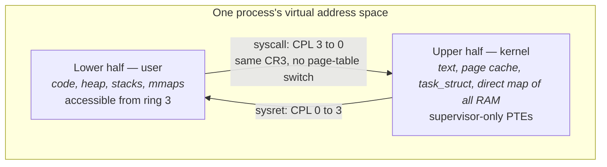
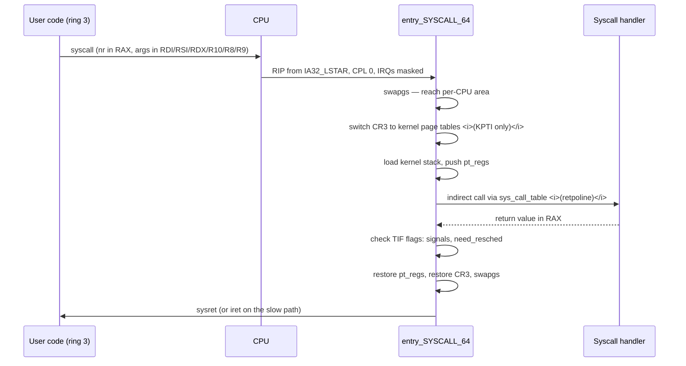
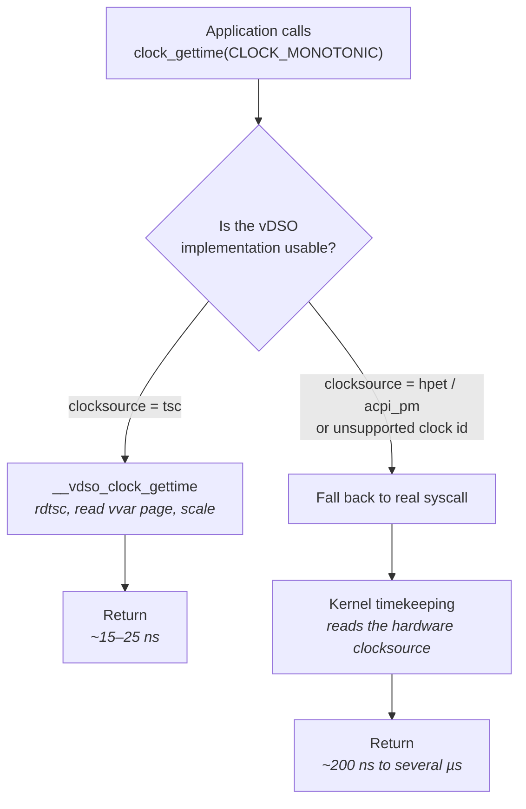
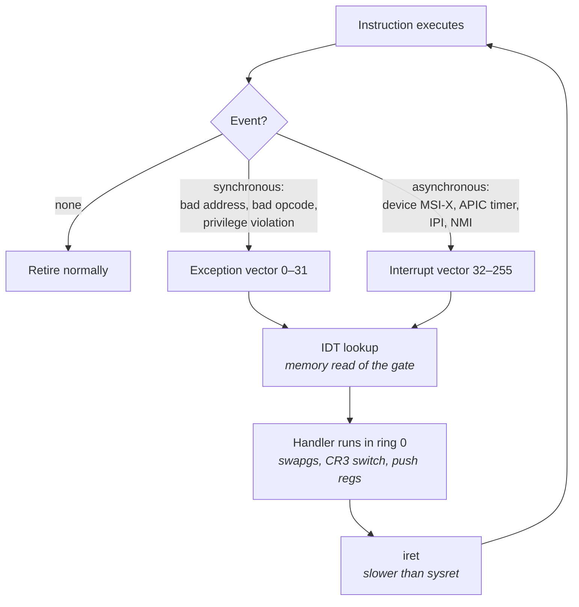
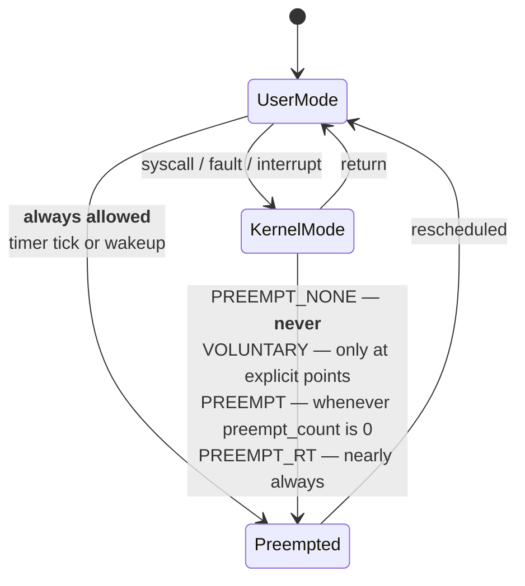
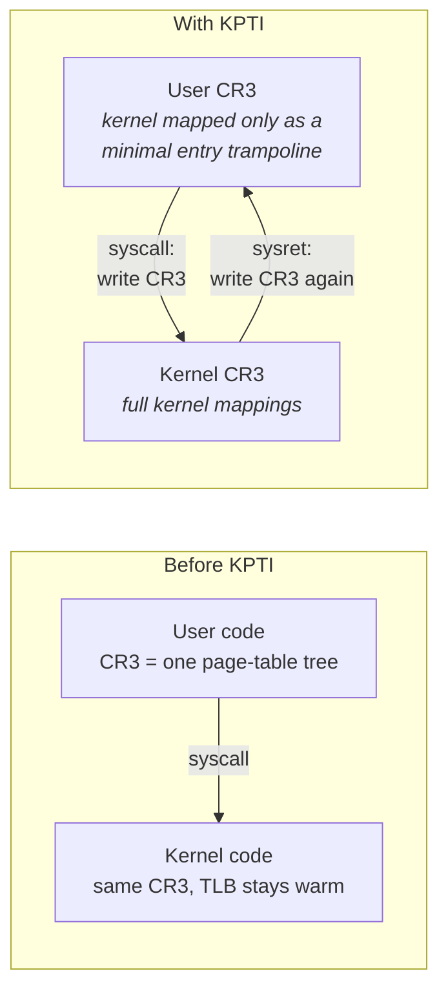

# Kernel Architecture and the Syscall Boundary

Everything in Part I concerned hardware you share with the kernel but do not negotiate with. A cache
line arrives or it does not; a DRAM row is open or it is not. From here on, a second actor enters the
picture — one that runs on the same cores, competes for the same caches, and can take your core away
from you at a moment of its own choosing. Understanding where that actor's territory begins, what it
costs to cross into it, and what it does while you are not looking is the foundation of every
operating-system topic that follows.

You already know what a system call is. You know that `read` is not a function in your program but a
request to the kernel, and that some kind of privilege transition happens in the middle. What a
systems course almost never tells you is the *price*. A function call in your own binary costs a few
nanoseconds. A trip across the user/kernel boundary on a current x86 server costs somewhere between
about 60 nanoseconds and well over a microsecond, depending on which speculative-execution
mitigations are enabled, and that is before the kernel does any of the work you asked for. Worse, the
number you pay is not the number you measure: a syscall evicts your cache lines, pollutes your branch
predictors, and leaves your core running slower for hundreds of nanoseconds *after* it returns. The
visible cost and the total cost differ by a factor that can exceed two.

That gap is why "eliminate syscalls from the hot path" is the single most repeated instruction in
low-latency engineering, and why so much of the rest of this book — the vDSO, `io_uring`, busy
polling, kernel bypass — exists specifically to avoid or amortize a boundary crossing. But
"eliminate syscalls" is a slogan until you can say what a syscall physically is, enumerate the steps,
attribute nanoseconds to each, and explain why a Skylake server that would have paid 65 ns in 2016
pays 250 ns for the identical instruction today. That is what this chapter builds. Along the way it
covers the other three ways control reaches the kernel without your asking — traps, faults, and
interrupts — and the kernel-configuration choice that determines how long the kernel can hold your
core hostage once it has it.

## User Space and Kernel Space

The reason the boundary exists at all is protection. A modern machine runs code from many sources —
your process, another tenant's process, a device driver, a network stack parsing bytes that arrived
from a hostile internet — and some of that code must be allowed to reprogram the memory management
unit, talk directly to a PCIe device, or mask interrupts, while most of it must not. The hardware
enforces the split, because software enforcing it on itself is not enforcement.

x86 implements this with **privilege levels**, numbered 0 through 3 and universally called *rings*.
Ring 0 is fully privileged; ring 3 is unprivileged. The architecture defines rings 1 and 2 as well,
but no mainstream operating system uses them, so in practice the machine is binary: kernel code runs
in ring 0, application code runs in ring 3. The current level, the **CPL** (current privilege level),
lives in the low two bits of the `CS` segment register, and the processor checks it on every
privileged operation. Attempting to execute `wrmsr`, load `CR3`, or issue `cli` from ring 3 does not
fail quietly — it raises a general-protection exception, which the kernel translates into `SIGSEGV`.

So far this is undergraduate material. The part that matters for latency is the second half of the
mechanism, and it is the part most courses skip: **the kernel is mapped into every process's address
space.** There is not a "kernel address space" that the CPU swaps to. On x86-64, the 64-bit virtual
address space is split into a lower half for the process and an upper half for the kernel, and the
page-table entries covering the kernel half are present in every process's page tables, marked
supervisor-only so ring 3 cannot touch them.

- **The upper-half mapping is why a syscall is cheap in the first place.** Entering the kernel does
  not require reloading `CR3`, so the translation caches — the TLB and the paging-structure caches
  discussed in "Memory Systems" — stay warm across the transition. The kernel's code and data are
  simply already addressable.
- **It is also why the kernel can copy to and from your buffers directly.** `copy_to_user` is an
  ordinary memory copy, because your pages and the kernel's pages are in the same page tables.
- **And it is the design decision Meltdown broke.** The supervisor-only bit is checked, but on
  affected processors it was checked *late enough* that speculative execution had already loaded
  kernel data into the cache hierarchy, leaving a measurable trace. The fix — Kernel Page Table
  Isolation — undoes the "no page-table switch" property above and charges you for it on every
  crossing. That is the subject of the last section of this chapter.

There is a matching split in what each side is allowed to touch. The kernel maintains a per-CPU data
area holding the current task pointer, the kernel stack top, and per-CPU statistics; on x86-64 it is
reached through the `GS` segment base, and the `swapgs` instruction exchanges the user and kernel
`GS` bases on entry and exit. This is why the very first instruction of the kernel's syscall entry
path is `swapgs`: until it executes, the kernel does not know where its own per-CPU state is.

**Failure mode: a "memory corruption" bug that is actually a privileged-instruction attempt.**
Symptom is `SIGSEGV` or `SIGILL` on an instruction that reads perfectly valid. Cause is code —
frequently a profiling or timing helper copied from a driver — trying `rdmsr`, `rdpmc` with the
counter disabled for user mode, or `cli` from ring 3. Confirm by disassembling around the faulting
`RIP` reported in the core dump, and by checking whether `perf` user-space access is enabled at all
via `cat /proc/sys/kernel/perf_event_paranoid`; a value of 2 or higher blocks most user-space PMU
access.

**Try it:** confirm that the kernel really is present in your process's address space, and that its
size is not trivial. Run `sudo cat /proc/self/maps` and note that every mapping listed is below
`0x0000800000000000` — the kernel half is deliberately not shown, because a process cannot address
it. Then run `sudo cat /proc/kallsyms | head` and observe that kernel symbols live at addresses
starting with `ffff`, in the upper half. The two halves are the same page-table tree.

**Try it:** measure how much of your process's time is spent on the other side of the boundary
before you optimize anything. Run `/usr/bin/time -v ./your-program` and compare the user and system
CPU times, then get per-call detail with `strace -c -f ./your-program`, which prints a table of
syscall counts, total time, and time per call. A hot loop that shows tens of thousands of `clock_gettime`
or `epoll_wait` calls has just told you where to start.

## Syscall Mechanics and Their Real Cost

The naive mental model of a syscall is that it is "a function call that also flips a bit." If that
were accurate, the cost would be a handful of cycles and this chapter would not exist. The reason it
is not accurate is that the transition must be *safe*: the hardware cannot let ring 3 choose where in
the kernel to land, cannot let ring 3 keep using its own stack for kernel work, and cannot let ring 0
leak register state back to ring 3. Each of those requirements adds work.

Historically x86 did this through a software interrupt — `int 0x80` — which meant a full trip through
the interrupt descriptor table, complete with a memory read of the gate descriptor and a stack switch
driven by the task state segment. That cost hundreds of cycles. Both vendors eventually added
dedicated fast instruction pairs (`sysenter`/`sysexit` on Intel, `syscall`/`sysret` on AMD), and
x86-64 standardized on `syscall`/`sysret`. The trick is to replace every memory lookup with a
model-specific register read: the target address, the code segment, and the flags mask are all
preloaded into MSRs at boot, so the instruction needs no memory access at all.

Here is exactly what the `syscall` instruction does in hardware, and — just as importantly — what it
does *not* do:

| Step | What `syscall` does |
|---|---|
| Save return address | Copies `RIP` of the next instruction into `RCX` |
| Save flags | Copies `RFLAGS` into `R11` |
| Set new `RIP` | Loads it from the `IA32_LSTAR` MSR — the kernel's entry point, fixed at boot |
| Set segments | Loads `CS` and `SS` selectors from constants in the `IA32_STAR` MSR; CPL becomes 0 |
| Mask flags | Clears the bits selected by the `IA32_FMASK` MSR, which is how interrupts get disabled on entry |
| **Does not** switch stacks | `RSP` still points at the *user* stack |
| **Does not** save any other register | Everything else is exactly as user space left it |

Those last two rows are where the software cost comes from. Because `syscall` leaves `RSP` pointing
at user memory, the kernel's first job is to get onto a trusted stack, and because `syscall` saves
nothing but `RIP` and `RFLAGS`, the kernel must push the entire register file itself into a structure
called `pt_regs` — around twenty 64-bit words — so that it can be restored on the way out and
inspected by `ptrace`, signal delivery, and core dumps.

The full sequence on a current Linux kernel, with mitigations enabled, looks like this:

- **Arguments go in registers, not on the stack**, and the fourth argument uses `R10` rather than
  `RCX` precisely because the `syscall` instruction has already clobbered `RCX` with the return
  address. The syscall number is in `RAX`, and the result comes back in `RAX`.
- **The dispatch through `sys_call_table` is an indirect call**, which on a mitigated kernel is a
  retpoline — a deliberately mispredicted branch construct described in the last section. It is one
  of the reasons the mitigated cost is so much higher than the unmitigated one.
- **The exit path is conditional.** `sysret` is fast but only legal when nothing about the return
  state has changed: the return address must be canonical, `RCX` and `R11` must still hold what the
  kernel put there, and no segment register may have been altered. If a signal is pending, if
  `ptrace` modified the registers, or if the return address is non-canonical, the kernel falls back
  to `iretq`, which is a full architectural return and costs several times more.

### Where the nanoseconds go

The direct cost of a "null" syscall — one that does essentially nothing, so what you measure is pure
boundary crossing — decomposes roughly as follows on a modern x86 server (Skylake-and-later class).
Treat every number as order-of-magnitude and heavily configuration-dependent; the mitigation rows in
particular vary by microarchitecture and by which vulnerabilities your specific part is affected by.

| Component | Approximate cost | Why |
|---|---|---|
| `syscall` + `sysret` instruction pair | ~25–40 ns | MSR-driven mode switch; partially serializing, so the pipeline drains |
| `swapgs`, stack switch, `pt_regs` push/pop | ~10–20 ns | ~40 register moves plus stores that miss nothing but still cost |
| Entry/exit bookkeeping, TIF checks, audit hooks | ~5–15 ns | Grows sharply if `auditd` rules are loaded or seccomp filters are attached |
| KPTI `CR3` writes (two per syscall) | ~30–80 ns | Much worse without PCID support |
| Retpoline on the dispatch indirect call | ~5–15 ns | A deliberate branch mispredict |
| MDS/`VERW` buffer clear on kernel exit | ~10–30 ns | Only on affected parts with the mitigation on |
| **Total, mitigations off** | **~60–80 ns** | Roughly what a 2016 kernel cost |
| **Total, mitigations on** | **~150–400 ns** | Varies enormously by part and by which mitigations apply |

Even the low end deserves a moment of comparison. Sixty nanoseconds is roughly the cost of a main
memory access on the same machine (see "Memory Systems"), or about 200 cycles at 3.5 GHz — enough to
execute several hundred arithmetic instructions. A syscall is not "a bit slower than a function
call"; it is two orders of magnitude slower, in the best case.

### The cost you cannot see

The table above accounts only for time attributable to the boundary itself. There is a second, larger
cost that no timer around the syscall will show you, because it is paid *after* the syscall returns.

While the kernel ran, it used the same physical caches, the same TLB, and the same branch predictors
as your code. A `recvmsg` walks socket structures, protocol control blocks, and `sk_buff` metadata; a
`write` walks file descriptor tables and the page cache. All of that displaces your working set. When
control comes back to your loop, the loads that were L1 hits before the syscall are now L2 or L3 hits
— or DRAM misses — and the branches that were perfectly predicted now mispredict. Published
measurements of this effect have shown the indirect cost exceeding the direct cost for
cache-sensitive workloads, with the CPU taking hundreds to thousands of cycles to return to its
pre-syscall instructions-per-cycle rate.

The engineering consequence is specific and non-obvious. **The damage a syscall does is proportional
to how much cache-resident state your hot path depends on.** A thread whose working set is a few
kilobytes recovers almost instantly. A thread carrying tens of kilobytes of hot state — exactly the
shape of a market data handler holding decoded state and lookup tables — pays a long tail of extra
misses. This is also why "amortize syscalls by batching" is better advice than it first appears: one
`sendmmsg` for sixteen messages perturbs the cache once rather than sixteen times, and the batching
win on the indirect cost can exceed the win on the direct cost.

**Failure mode: p99 latency is far worse than p50, and the difference tracks syscall count.**
Symptom is a hot loop whose median is fine but whose tail is several microseconds, with no obvious
blocking. Cause is per-event syscalls whose direct plus indirect cost lands on the critical path,
occasionally compounded by the `iretq` slow return path. Confirm by counting boundary crossings
directly with `perf stat -e raw_syscalls:sys_enter -p <pid> -- sleep 10` and dividing by events
processed. If the ratio is greater than about one per event, syscalls are your budget.

**Failure mode: syscalls become dramatically slower after a security agent is installed.** Symptom is
a uniform slowdown of every syscall-heavy path with no application change. Cause is seccomp filters
or audit rules evaluated on the entry path for every call. Confirm by reading `Seccomp:` and
`Seccomp_filters:` in `/proc/<pid>/status`, and by checking whether audit rules are loaded with
`sudo auditctl -l`. An empty ruleset and `Seccomp: 0` are what a latency-critical process should
show.

**Try it:** measure your own machine's null-syscall cost. Use a syscall the kernel cannot cache or
elide — `getppid` is the conventional choice, since glibc no longer caches `getpid` — in a tight
loop of ten million iterations, timing with the TSC-based approach from "Clocks, Timers, and Time".
Divide to get nanoseconds per call. Then reboot with `mitigations=off` on the kernel command line
and repeat. The ratio between the two numbers is the mitigation tax on your specific hardware, and it
is usually a shock the first time you see it.

**Try it:** see the indirect cost rather than inferring it. Run the same loop under
`perf stat -e cycles,instructions,L1-dcache-load-misses,branch-misses` with a syscall in the loop
body and again with the syscall replaced by an equivalent amount of user-space work. The
instructions-per-cycle figure and the miss counts, not the wall time, are what show you that the
kernel evicted your state.

**Try it:** find which syscalls a real service is making without modifying it. `perf trace -p <pid>`
gives a live per-call view with durations, and `perf trace -s -p <pid>` prints a summary on exit.
Unlike `strace`, which uses `ptrace` and adds enormous overhead, `perf trace` uses tracepoints and is
usable on a running production process — though it is still not free, so do not leave it attached.

## The vDSO and Syscall Avoidance

Some syscalls exist only to read a value the kernel already knows and has no reason to hide. The
canonical example is time. `clock_gettime(CLOCK_MONOTONIC, ...)` asks the kernel "what time is it?",
and the kernel answers by reading the TSC, scaling it by a factor it maintains, and adding an offset
— arithmetic on three numbers that change rarely. There is no privileged resource involved and
nothing to protect. Paying 200 nanoseconds of boundary crossing to perform three multiplications is
absurd, and it matters because timestamping is one of the highest-frequency operations in any
latency-instrumented system: you cannot measure latency without reading a clock at every stage, and
if reading the clock costs more than the stage you are measuring, the instrumentation *is* the
latency.

The **vDSO** — virtual dynamic shared object — solves this by inverting the arrangement. Instead of
user space calling into the kernel to get the answer, the kernel publishes the *inputs* to user space
and lets user space do the arithmetic. At process startup the kernel maps two things into the address
space: a small shared library of code, and a read-only data page (conventionally called the `vvar`
page) into which the kernel writes the current timekeeping parameters — the TSC value at the last
update, the multiplier and shift used to convert TSC ticks to nanoseconds, and the wall-clock offset.
A `clock_gettime` call then becomes an ordinary function call into that library, which reads the TSC
with `rdtsc`, reads the parameters from the `vvar` page, and does the multiply-shift-add itself.

Because the kernel updates those parameters asynchronously, the vDSO code reads them under a
sequence-lock protocol: read a version counter, read the parameters, read the counter again, retry if
it changed. That costs a couple of loads and a compare, and is why the result is coherent without any
kernel involvement.

- **The vDSO path costs roughly 15–25 ns** on a modern x86 server — an order of magnitude better than
  the syscall it replaces, and close to the cost of `rdtsc` alone.
- **The fallback path is not merely a syscall; it may also read a slow device.** If the system
  clocksource is HPET or the ACPI power-management timer rather than the TSC, every clock read
  becomes an uncached MMIO read taking on the order of a microsecond (see "Clocks, Timers, and
  Time"). This combination — a fallback syscall *plus* a device read — is one of the most damaging
  single misconfigurations on a trading host.
- **The vDSO is a real ELF object at a real address.** The kernel passes its base address to the
  process in the auxiliary vector as `AT_SYSINFO_EHDR`, which is how the dynamic linker finds it.

Only a handful of calls have vDSO implementations, and the exact set is architecture-dependent. On
x86-64 Linux the ones that matter are:

| Symbol | Replaces | Notes |
|---|---|---|
| `__vdso_clock_gettime` | `clock_gettime` | The important one; works for `CLOCK_MONOTONIC`, `CLOCK_REALTIME`, and their coarse variants |
| `__vdso_gettimeofday` | `gettimeofday` | Same mechanism, microsecond resolution |
| `__vdso_time` | `time` | Second resolution |
| `__vdso_getcpu` | `getcpu` | Returns current CPU and NUMA node without a crossing |
| `__vdso_clock_getres` | `clock_getres` | Resolution query |

Do not confuse the vDSO with the older **vsyscall** page, a fixed-address region at
`0xffffffffff600000` that predated it. vsyscall was a security liability — a known-address executable
page is a gadget source — and on current kernels it is either emulated (each access takes a page
fault and is *slower* than a syscall), execute-only, or disabled entirely, controlled by the
`vsyscall=emulate|xonly|none` boot parameter. Modern glibc uses the vDSO; vsyscall only appears in
very old static binaries.

### Avoiding the rest

The vDSO handles the special case where the kernel has nothing to protect. For everything else, the
boundary is genuinely necessary, and the strategies are to cross it less often, to cross it off the
critical path, or to arrange for data to move without a crossing at all. Each of these gets a full
treatment later; the point here is that they are all instances of one idea.

| Strategy | Mechanism | Covered in |
|---|---|---|
| **Batch** | One crossing carries many operations: `sendmmsg`, `recvmmsg`, `writev`, `readv` | "The Linux Networking Stack", "I/O Subsystems" |
| **Shared memory rings** | Producer and consumer exchange data through mapped memory; the kernel is involved only in setup | "Synchronization and IPC" |
| **Submission/completion queues** | `io_uring` puts requests and results in shared rings; in polled mode a request can complete with no syscall at all | "I/O Subsystems" |
| **Busy polling** | Spin on a non-blocking check instead of making a blocking call that must sleep and be woken | "Processes, Threads, and Scheduling" |
| **Uncontended fast paths** | A futex needs a syscall only when a lock is actually contended; the uncontended case is a user-space atomic | "Synchronization and IPC" |
| **Kernel bypass** | Map NIC queues directly into the process and never enter the kernel on the data path | "Kernel Bypass" |
| **Read the counter yourself** | `rdtsc` or `rdtscp` where a raw cycle count suffices instead of a calibrated clock | "Clocks, Timers, and Time" |

**Failure mode: `clock_gettime` shows up as a top consumer in a profile.** Symptom is measurable time
attributed to timekeeping, or timestamps that cost microseconds each. Cause is almost always that the
vDSO fast path is unavailable because the clocksource is not the TSC. Confirm with
`cat /sys/devices/system/clocksource/clocksource0/current_clocksource` — if it reports anything other
than `tsc`, that is the bug — and cross-check the available options in the sibling file
`available_clocksource`. Also confirm the calls are not reaching the kernel at all using
`perf stat -e 'syscalls:sys_enter_clock_gettime' -p <pid>`; a healthy process should show a count of
essentially zero.

**Failure mode: a statically linked binary is slower at timekeeping than a dynamically linked one.**
Symptom is that the same code times differently depending on how it was built. Cause is that some
static builds do not wire up the vDSO and issue real syscalls instead. Confirm with the
`syscalls:sys_enter_clock_gettime` counter above; a non-zero rate proportional to your timestamp rate
is conclusive.

**Try it:** verify the vDSO is mapped and being used. Run `ldd /bin/ls` and observe
`linux-vdso.so.1` listed with no filesystem path — it has none, because the kernel synthesized it.
Then run `grep -E 'vdso|vvar' /proc/self/maps` to see both the code mapping and the read-only data
page it depends on. Finally, confirm the mechanism end to end: run
`perf stat -e 'syscalls:sys_enter_clock_gettime' -- ./your-timestamping-program` and see that a
program making millions of clock reads makes essentially no syscalls.

**Try it:** quantify the difference. Time a loop of ten million `clock_gettime(CLOCK_MONOTONIC)`
calls. Then, as root, force a slow clocksource with
`echo hpet > /sys/devices/system/clocksource/clocksource0/current_clocksource` on a machine you do
not care about, and repeat. You will typically see a 20× to 100× regression. Set it back to `tsc`
afterwards — and note that being *able* to set it to `hpet` means a misconfigured BIOS or an
unstable-TSC warning in `dmesg` could put you there without your knowledge.

## Traps, Faults, and Exceptions

A syscall is a boundary crossing you asked for. The rest of this chapter is about the ones you did
not. From the CPU's perspective these are all the same machinery — an event redirects execution to a
handler in ring 0 — but they differ in what triggered them, whether the faulting instruction can be
restarted, and, critically for us, whether they are synchronous with your code or arrive from
outside.

The vocabulary is worth getting exactly right, because interviewers use it precisely and because the
distinctions predict behavior. An **exception** is generated by the executing instruction itself and
is therefore synchronous: run the same instruction with the same state and you get the same
exception. An **interrupt** is generated by something external — a device, a timer, another core —
and is asynchronous: it can arrive between any two instructions. Exceptions subdivide by whether the
saved return address points at the faulting instruction or past it:

| Class | Return address points at | Restartable? | Examples |
|---|---|---|---|
| **Fault** | The faulting instruction itself | Yes — the handler fixes the condition and re-executes | `#PF` page fault, `#GP` general protection, `#UD` invalid opcode, `#DE` divide error |
| **Trap** | The instruction *after* | Yes — execution simply continues | `#BP` breakpoint (`int3`), `#DB` single-step, `#OF` overflow |
| **Abort** | Imprecise | No — state may be unrecoverable | `#MC` machine check, `#DF` double fault |
| **Interrupt** | Between instructions | N/A — unrelated to the current instruction | Device MSI-X, local APIC timer, IPI, NMI |

Dispatch works through the **IDT** (interrupt descriptor table), a 256-entry table whose base address
sits in the `IDTR` register. Each entry names a handler address and a segment selector, and each
event carries a vector number that indexes it. Vectors 0–31 are architecturally defined exceptions;
the rest are available for devices and for the kernel's own use, which is how MSI-X interrupts and
inter-processor interrupts get delivered (see "Buses, Devices, and I/O Hardware").

- **Every path through this diagram is more expensive than a syscall entry.** The IDT gate must be
  read from memory, the return uses `iret` rather than `sysret`, and some vectors switch to a
  dedicated stack via the **IST** (interrupt stack table) mechanism, which the kernel uses for NMI,
  double fault, and machine check so that a corrupted kernel stack cannot cascade.
- **Interrupts arriving while your hot-path thread runs are pure jitter**, because they are unrelated
  to your work and their timing is not under your control. Steering them away from hot cores is a
  central part of host tuning (see "Tuning a Linux Box for Determinism").

### Which of these you will actually meet

Most exception vectors are bugs and you will meet them once. Three are performance phenomena that
appear on correctly functioning systems, and those are the ones worth internalizing.

**The page fault (`#PF`, vector 14)** is by far the most important, because it is the only exception a
correct program takes routinely. A load or store whose translation is absent or whose permissions do
not allow the access raises it; the CPU records the offending address in `CR2` and an error code
describing whether it was a read or write, user or kernel, and present or not-present. The kernel
then decides whether this is a legitimate demand-paging event or a real fault. A *minor* fault —
mapping exists conceptually but is not installed, as on first touch of freshly allocated memory —
costs on the order of 1–3 µs. A *major* fault, requiring I/O, costs tens of microseconds at best.
Both are catastrophic on a hot path and both are avoidable by pre-faulting and `mlockall`; the
mechanism and the remedies belong to "Memory Management" and were introduced in "Memory Systems".

**The stack-growth fault** is the same mechanism wearing a different hat, and it catches people out
because there is no allocation call to blame. Thread stacks are mapped lazily: the kernel reserves
the address range but installs pages only as the stack is touched. A hot path that runs deeper than
usual — an error branch, a logging call, a deeply inlined path taken only when a rare condition holds
— touches a stack page for the first time and takes a minor fault at exactly the moment you can
least afford it. The fix is the same as for heap buffers: touch the depth you will need at startup,
then `mlockall(MCL_CURRENT | MCL_FUTURE)`.

**Microcode assists** are not architectural exceptions but behave similarly for our purposes: the
hardware encounters a case its fast path cannot handle and traps into a microcode routine, costing
tens to a couple of hundred cycles with no software involvement and no trace in a syscall counter.
Historical examples include denormal floating-point operands on some microarchitectures, and stores
that split a cache line or a page boundary. These are microarchitecture-specific, and the honest
statement is that they exist, they are measurable with PMU counters whose names vary by part, and
they are why an operation that "should" be a few cycles occasionally is not (see "CPU
Microarchitecture Essentials").

**Failure mode: rare multi-microsecond spikes on a thread with no syscalls and no allocations.**
Symptom is a clean profile with unexplained outliers. Cause is very often a minor page fault on
first touch of a stack page or a lazily mapped buffer. Confirm by reading the fault counters with
`ps -o min_flt,maj_flt -p <pid>` before and after a run — any growth during steady state is a defect
— and locate it precisely with `perf record -e page-faults -g -p <pid>`, which will give you the
call stack of each fault.

**Failure mode: an isolated, pinned core still shows periodic interruptions.** Symptom is jitter on a
core running a single spinning thread. Cause is interrupts and IPIs arriving anyway — the local APIC
timer, TLB shootdowns from other processes, function-call IPIs, or a device whose affinity mask still
includes your core. Confirm by reading `/proc/interrupts` before and after and diffing the per-CPU
columns; the row labels (`LOC` for local timer, `TLB` for shootdowns, `CAL` for function-call
interrupts, `RES` for rescheduling IPIs) tell you which mechanism fired.

**Try it:** watch faults happen at the instruction level. Run
`perf stat -e page-faults,minor-faults,major-faults ./your-program`, then re-run it with all buffers
pre-touched and `mlockall` called at startup, and confirm minor faults collapse to the startup phase
only. Then run `perf record -e page-faults -g` on the un-fixed version to see exactly which call
sites are faulting; the stack-growth ones are the surprising entries.

**Try it:** establish your machine's idle interrupt baseline before you tune anything. Capture
`/proc/interrupts`, sleep 10 seconds, capture it again, and diff. On an untuned server every core
will show hundreds of local timer interrupts per second. That number is the floor on how often the
kernel can steal your core, and the next section explains what determines how long it keeps it.

## Kernel Preemption Models

You know that a preemptive operating system can take the CPU away from a running thread. What is far
less commonly understood is that this statement, in its simplest form, describes only *user-mode*
preemption. A different and separately configurable question is whether a thread executing **inside
the kernel** — halfway through a `read`, or in a driver, or holding a kernel data structure in a
half-updated state — can be preempted. That question is answered at kernel build time, and its
answer sets a floor under your worst-case scheduling delay.

The problem is straightforward once stated. Suppose a low-priority process on your core calls a
syscall that does real work — copying a large buffer, walking a filesystem structure, iterating a
long list. Meanwhile a packet arrives and your high-priority thread becomes runnable. If the kernel
cannot preempt itself, your thread waits until the syscall reaches a point where the kernel
voluntarily checks whether someone else should run. The length of that wait is bounded only by the
longest non-preemptible stretch anywhere in the kernel, which historically has been measured in
hundreds of microseconds to milliseconds.

The naive fix — "just make everything preemptible" — fails because kernel code manipulates shared
state, and preempting a thread that holds a spinlock while another thread on the same core spins
waiting for it deadlocks the core instantly. So the kernel maintains a per-task counter,
`preempt_count`, which is incremented whenever preemption must be disabled: while holding a spinlock,
inside an interrupt handler, inside an RCU read-side critical section on some configurations. A
reschedule is only permitted when that counter is zero. Making the kernel more preemptible therefore
means shrinking the regions where the counter is non-zero, and that is fundamentally a restructuring
problem, not a flag.

Linux offers a graded set of answers, historically selected by a build-time `CONFIG_PREEMPT_*` choice.

| Model | Kernel preemptible? | Typical worst-case latency | Intended for |
|---|---|---|---|
| `PREEMPT_NONE` | No — only on return to user mode or on a voluntary sleep | Hundreds of µs to ms | Throughput servers, batch, HPC |
| `PREEMPT_VOLUNTARY` | Only at explicit `might_sleep()` / `cond_resched()` points sprinkled through long loops | Tens to hundreds of µs | Desktops, general-purpose distributions |
| `PREEMPT` (full) | Yes, wherever `preempt_count` is zero | Tens of µs | Low-latency servers, interactive/audio |
| `PREEMPT_RT` | Nearly everywhere; spinlocks become sleeping locks and most IRQ handlers become threads | Single-digit to tens of µs, bounded | Hard real-time control systems |

The rows differ in more than a number. `PREEMPT_VOLUNTARY` adds nothing to the fast path — the
`cond_resched()` points are just a compare and a rarely-taken branch — so it is close to free.
`PREEMPT` makes every spinlock release a potential reschedule point, which adds a small cost to a
very large number of kernel operations. `PREEMPT_RT` is a structural change: converting spinlocks
into priority-inheriting sleeping mutexes means kernel code that used to run to completion now
sleeps, which improves worst case and degrades both average case and throughput.

More recent kernels support `CONFIG_PREEMPT_DYNAMIC`, which compiles in the machinery for several
models and selects between them at boot with the `preempt=none|voluntary|full` kernel parameter,
using static branches so the unselected paths cost nothing. On kernels built with it, the current
setting is readable and sometimes writable at `/sys/kernel/debug/sched/preempt`. The set of available
models continues to evolve — work on a "lazy" preemption mode aimed at getting `PREEMPT_RT`-like
latency without the throughput loss has been landing in recent releases — so check what your kernel
actually offers rather than assuming.

### Why trading systems usually do not run PREEMPT_RT

This surprises people, because "real-time kernel" sounds like exactly what a latency-sensitive system
wants. The reasoning is worth following, because it generalizes to a lot of low-latency decisions.

`PREEMPT_RT` optimizes **worst-case bounded latency for a thread that sleeps and is woken.** That is
the right objective for a robot arm or a motor controller, where missing a deadline is a physical
failure and where the controlling thread is idle between events. A market data handler has a
different shape: it is typically pinned to an isolated core, spinning in a busy-poll loop, never
sleeping, and never contending with other threads for that core. For such a thread, kernel preemption
latency is close to irrelevant — nothing else is trying to run there — while the per-operation
overhead `PREEMPT_RT` adds to every kernel path is paid in full.

The dominant approach is therefore to attack the problem structurally rather than with a
preemption model: isolate cores so that no other work is scheduled on them, move interrupts and
kernel threads elsewhere, and busy-poll so that no wakeup is ever needed. Those techniques belong to
"Processes, Threads, and Scheduling" and "Tuning a Linux Box for Determinism"; the point here is that
they make the preemption question mostly moot for the hot path. `PREEMPT_RT` remains the right answer
when you cannot isolate — when the latency-critical thread must share a core, or when you genuinely
need a bounded wakeup latency guarantee rather than a low typical one. The trade-off is real and
workload-dependent; measure it rather than adopting a position.

**Failure mode: a pinned thread occasionally stalls for hundreds of microseconds with no syscall of
its own.** Symptom is a huge outlier that no application-level tracing explains. Cause may be a
non-preemptible kernel section on the same core — a driver, a long-running softirq, or a
housekeeping thread — that the preemption model did not allow to be interrupted. Confirm by tracing
scheduling latency with `perf sched record` followed by `perf sched latency`, which reports maximum
delay per task, or with the `wakeup` / `preemptirqsoff` tracers under `/sys/kernel/debug/tracing/`
if your kernel is built with them.

**Failure mode: latency regresses after a kernel upgrade with no configuration change.** Cause is
frequently a different preemption model in the new distribution kernel, or a `PREEMPT_DYNAMIC`
default that differs from the previous build-time setting. Confirm by comparing
`grep -E 'CONFIG_PREEMPT' /boot/config-$(uname -r)` between the two kernels, and by checking whether
`preempt=` appears in `/proc/cmdline`.

**Try it:** determine what your machine is actually running. Run
`grep -E 'CONFIG_PREEMPT(_NONE|_VOLUNTARY|_DYNAMIC|_RT)?=' /boot/config-$(uname -r)` — or, if your
distribution exposes it instead, `zcat /proc/config.gz | grep PREEMPT`. Cross-check against
`uname -v`, which embeds `PREEMPT`, `PREEMPT_DYNAMIC`, or `PREEMPT_RT` in the version string, and
against `/proc/cmdline` for a `preempt=` override. Most stock server distributions turn out to be
`PREEMPT_VOLUNTARY` or dynamic-defaulting-to-voluntary, which is not what people assume.

**Try it:** measure the consequence directly rather than trusting the label. Run a thread pinned to a
core that does nothing but read the TSC in a loop and record the gap between consecutive reads into a
pre-allocated array, then dump a histogram of the gaps afterwards. Every gap larger than a few
hundred nanoseconds is something else — an interrupt, a preemption, a system management interrupt —
running on your core. Now generate load (a parallel kernel build, heavy disk I/O) on *other* cores
and re-run. How much the tail widens tells you how well isolated that core really is, and this
harness will be useful for the rest of the book.

## Meltdown, Spectre, and the Latency Tax

In early 2018 two families of vulnerabilities were disclosed that changed the cost of the syscall
boundary permanently. Understanding them is not optional for this material, because the mitigations
are the single largest term in the cost table earlier in this chapter, and because interview
conversations about syscall cost reliably arrive here.

The underlying issue is that speculative execution — the mechanism from "CPU Microarchitecture
Essentials" that lets a core run ahead past unresolved branches and discard the work if it guessed
wrong — discards *architectural* state on a misprediction but not *microarchitectural* state. If
speculated instructions loaded a cache line, that line stays in the cache after the speculation is
rolled back. An attacker who can influence what gets speculatively loaded, and who can then measure
cache timing, can therefore read data the architecture never let them read.

**Meltdown** (formally, rogue data cache load) exploited the fact that on affected Intel processors,
the supervisor-bit permission check on a page happened late enough that speculative execution
proceeded with kernel data before the fault was delivered. Because the kernel is mapped into every
process's address space — the design decision from the first section — user code could dereference a
kernel address, have the load speculatively succeed, use the loaded byte to index an array it owned,
and then infer the byte from which array line was now cached. Effectively the entire kernel address
space, including the direct map of all physical memory, was readable from ring 3.

**Spectre** is a broader family that abuses branch prediction rather than permission checking.
Variant 1 trains a bounds-check branch to predict "in range," so the victim speculatively reads out
of bounds. Variant 2 — branch target injection — poisons the indirect branch predictor so that a
victim's indirect call speculatively lands at an attacker-chosen address, executing a gadget in the
victim's privilege domain. Because branch predictors are shared structures, this crosses privilege
boundaries and, on SMT parts, crosses hyperthread siblings on the same physical core (see "Multicore,
Coherence, and Memory Ordering"). Subsequent years added related classes — speculative store bypass,
L1 terminal fault, and the microarchitectural data sampling family that leaks from internal buffers
such as store buffers, fill buffers, and load ports.

### What the fixes cost, and why

Each mitigation converts a security problem into a performance problem in a specific, traceable way.

- **KPTI (Kernel Page Table Isolation)** is the Meltdown fix, and it directly attacks the property
  that made syscalls cheap. Each process now has two page-table trees: one for user mode containing
  only a tiny trampoline of kernel entry code, and one for kernel mode containing everything. Every
  entry and every exit writes `CR3`. Two `CR3` writes per syscall is the whole cost — but a `CR3`
  write is architecturally a TLB flush, so without help it also destroys the translation caching
  described in "Memory Systems".
- **PCID (process-context identifiers) is what makes KPTI survivable.** With PCID, TLB entries are
  tagged with an address-space identifier, so switching `CR3` can preserve entries for both trees
  instead of flushing. The `INVPCID` instruction allows selective invalidation. On a machine without
  PCID — older hardware, or a virtual machine whose hypervisor does not expose it — KPTI's cost is
  several times worse, because every crossing throws away the TLB.
- **Retpoline** is a software fix for Spectre variant 2: every indirect call or jump in the kernel is
  replaced by a construct that deliberately traps speculation in a harmless loop and reaches the real
  target only through a return. It costs roughly a branch mispredict per indirect call. That is
  cheap individually, and expensive in aggregate for kernel subsystems built on indirect dispatch —
  the network stack, the VFS layer, and the syscall table itself.
- **IBRS / eIBRS, STIBP, IBPB** are hardware controls exposed by microcode. IBRS (indirect branch
  restricted speculation) restricts the predictor's use of lower-privilege training; "enhanced" IBRS
  makes this an always-on hardware property with much lower cost. STIBP (single-thread indirect
  branch predictors) stops one hyperthread from training its sibling, and is only relevant with SMT
  enabled. IBPB (indirect branch prediction barrier) flushes the predictors wholesale and is issued
  on context switches between mutually distrusting processes — it is by far the most expensive of
  the three, because it discards branch prediction state the next process then has to rebuild.
- **Buffer clearing for MDS/TAA** uses the `VERW` instruction, repurposed by microcode to flush
  internal buffers, executed on every return to user mode and on VM entry. It is a fixed per-crossing
  cost.
- **L1D flush** for L1 terminal fault flushes the entire L1 data cache on entry to a guest. This is
  primarily a virtualization cost and is brutal — you lose your L1 — which is one of several reasons
  latency-critical workloads run on bare metal.

The other structural cost is SMT. Several of these vulnerabilities are only exploitable between
hyperthread siblings, so the fully paranoid configuration disables SMT entirely. Latency-critical
hosts frequently disable SMT anyway for resource-sharing reasons (see "Multicore, Coherence, and
Memory Ordering"), which means the security argument and the performance argument point the same way
for once.

### The knobs, and the decision

Linux exposes the state of every known vulnerability and its mitigation as one file per issue under
`/sys/devices/system/cpu/vulnerabilities/`. Each file reports either `Not affected`, `Vulnerable`, or
a description of the active mitigation. The exact set of files depends on your kernel version and
your hardware; on a current x86 kernel you will typically see entries including `meltdown`,
`spectre_v1`, `spectre_v2`, `spec_store_bypass`, `l1tf`, `mds`, `tsx_async_abort`, `itlb_multihit`,
`srbds`, `mmio_stale_data`, and `retbleed`.

The corresponding boot-time controls are individual parameters — `nopti`, `spectre_v2=off`,
`spec_store_bypass_disable=off`, `l1tf=off`, `mds=off`, `tsx_async_abort=off` — plus the umbrella
`mitigations=off`, which disables all of them at once for every vulnerability the kernel knows about.

Whether to use it is a judgment call with a genuine security dimension, not a pure performance
question. The argument for `mitigations=off` on a trading host: the machine is physically isolated in
a colocation cage, runs a single trusted workload, executes no untrusted code, has no browser, no
JIT, and no multi-tenant guests — which removes essentially every practical attack vector these
mitigations defend against, since all of them require the attacker to run code on the machine. The
argument against: it is a permanent, machine-wide reduction in defense-in-depth, it fails silently if
the machine's role later changes, and any host that runs third-party code, hosts containers from
different trust domains, or is reachable in ways you have not fully enumerated should keep the
mitigations on. Firms differ on this, and the honest framing is that it is a risk decision the
security owner makes with the latency number in hand — which is why measuring that number is your
job.

**Failure mode: identical hardware, identical binary, twice the syscall cost.** Symptom is a large
performance difference between two supposedly identical hosts. Cause is different mitigation state,
usually because one has `mitigations=off` in its boot parameters and the other does not, or because
one is a VM without PCID exposed. Confirm by diffing `/proc/cmdline` between the hosts and then
diffing `grep . /sys/devices/system/cpu/vulnerabilities/*`, which prints every file with its name.

**Failure mode: KPTI costs far more than expected on a virtualized host.** Symptom is syscall cost in
the high hundreds of nanoseconds even on recent hardware. Cause is a missing PCID feature, so every
`CR3` write flushes the TLB completely. Confirm with `grep -o ' pcid\| invpcid' /proc/cpuinfo | sort -u`
— if `pcid` is absent from the flag list, the hypervisor is not exposing it, and KPTI is running in
its worst mode.

**Failure mode: context switches between processes are far more expensive than between threads.**
Symptom is a much larger cost when work moves between processes than within one. Cause is partly the
address-space switch, and partly IBPB being issued at the process boundary, which discards branch
prediction state (see "Processes, Threads, and Scheduling"). Confirm by reading the `spectre_v2` file
under `/sys/devices/system/cpu/vulnerabilities/` and looking for `IBPB: conditional` or
`IBPB: always-on` in its description.

**Try it:** take a full inventory of what your machine is paying for. Run
`grep . /sys/devices/system/cpu/vulnerabilities/*` and read every line. Then run `cat /proc/cmdline`
to see which mitigation-related parameters are set. Write both down alongside your null-syscall
measurement; those three artifacts together explain most of the difference between any two machines
you will benchmark.

**Try it:** quantify the tax end to end on a machine you can reboot. Measure null-syscall cost,
`clock_gettime` cost via the vDSO, and a small `read` from a pipe. Reboot with `mitigations=off`
appended to the kernel command line, confirm the vulnerability files now report `Vulnerable`, and
repeat all three measurements. On Skylake-class hardware you should expect the null syscall to
improve by roughly a factor of two to four, the pipe `read` by rather less proportionally (because
its own work dominates), and the vDSO call not at all — which is the clearest possible demonstration
of why syscall avoidance is worth more than syscall optimization.

## Numbers to Know

| Quantity | Value | Notes |
|---|---|---|
| Null syscall, mitigations off | ~60–80 ns | Modern x86 server, Skylake-and-later |
| Null syscall, mitigations on | ~150–400 ns | Varies widely by part and by which mitigations apply |
| `syscall`/`sysret` instruction pair alone | ~25–40 ns | Mode switch plus partial pipeline serialization |
| Register save/restore (`pt_regs`) | ~10–20 ns | Around twenty 64-bit words each way |
| KPTI `CR3` writes, per syscall | ~30–80 ns | Two writes; much worse without PCID |
| Retpoline per indirect call | ~5–15 ns | Cost of a deliberate mispredict |
| `VERW` buffer clear on kernel exit | ~10–30 ns | MDS-class mitigation, affected parts only |
| Indirect syscall cost (cache/BP pollution) | Can exceed the direct cost | Scales with your resident working set |
| `iretq` return vs. `sysret` | Several times more expensive | Taken when signals are pending or registers were modified |
| `clock_gettime` via vDSO | ~15–25 ns | Requires `tsc` clocksource |
| `clock_gettime` falling back to syscall | ~200 ns to several µs | Worst when clocksource is HPET or ACPI PM |
| Minor page fault | ~1–3 µs | First touch, including stack growth |
| Major page fault | 20 µs to many ms | Storage-backed; never acceptable on a hot path |
| Kernel preemption latency, `PREEMPT_NONE` | Hundreds of µs to ms | Bounded only by the longest non-preemptible section |
| Kernel preemption latency, `PREEMPT` | Tens of µs | Full in-kernel preemption |
| Kernel preemption latency, `PREEMPT_RT` | Single-digit to tens of µs | Bounded, at a per-operation throughput cost |
| Local APIC timer interrupts per core | Hundreds per second untuned | The floor on how often the kernel takes your core |

*Order-of-magnitude figures for modern x86 servers (Skylake-and-later class). Syscall cost in
particular is dominated by mitigation configuration and by PCID availability — measure it on your own
hardware and record the contents of `/proc/cmdline` alongside the result.*

## Key Takeaways

- The kernel is mapped into the upper half of every process's address space, which is what made
  syscalls cheap, what Meltdown exploited, and what KPTI undid.
- `syscall` saves only `RIP` into `RCX` and `RFLAGS` into `R11`, loads its target from an MSR, and
  does not switch stacks — the kernel entry stub does the rest in software.
- A null syscall costs roughly 60–80 ns unmitigated and 150–400 ns mitigated on Skylake-class
  hardware, which is one to two orders of magnitude more than a function call.
- The indirect cost — evicted cache lines and polluted branch predictors — can exceed the direct
  cost, and scales with how much hot state your thread carries.
- `sysret` is the fast return; pending signals, `ptrace`, or modified registers force the much
  slower `iretq` path.
- The vDSO removes the boundary entirely for calls where the kernel has nothing to protect, making
  `clock_gettime` a ~20 ns user-space computation — but only when the clocksource is `tsc`.
- Every other avoidance strategy is a variation on batching, shared-memory rings, or bypass; the
  kernel is crossed less often, off the critical path, or not at all.
- Faults are restartable and synchronous, traps resume after the instruction, interrupts are
  asynchronous — and all of them enter through the IDT and return via the expensive `iret`.
- Minor page faults, including lazy stack growth, are the one exception a correct program takes
  routinely, and they cost microseconds on a nanosecond path.
- Kernel preemption is a separate question from user-mode preemption; the `CONFIG_PREEMPT_*` model
  sets a floor on how long a kernel section can hold your core.
- `PREEMPT_RT` optimizes bounded wakeup latency, which a busy-polling pinned thread on an isolated
  core does not need — core isolation usually beats a real-time kernel for this workload.
- Mitigation state, PCID availability, and boot parameters explain most syscall-cost differences
  between two otherwise identical machines; read
  `/sys/devices/system/cpu/vulnerabilities/*` and `/proc/cmdline` before benchmarking anything.
