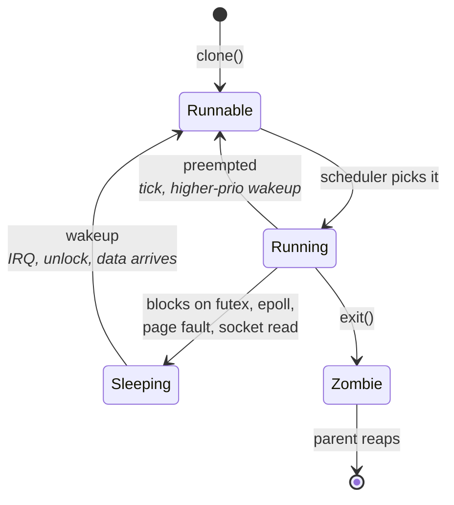
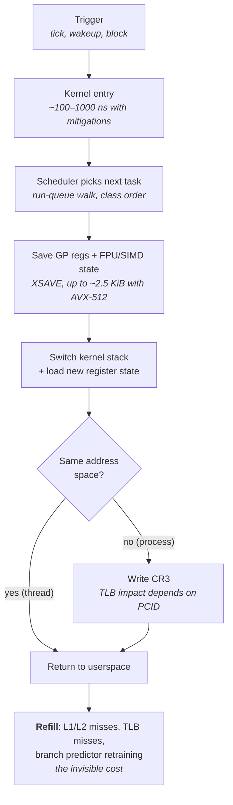
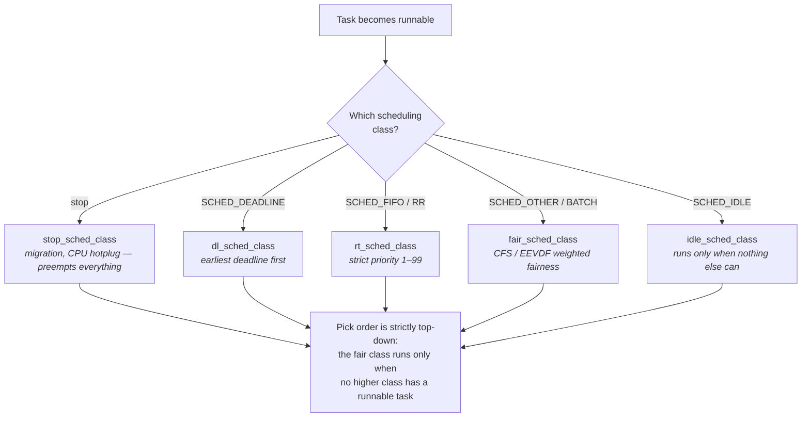
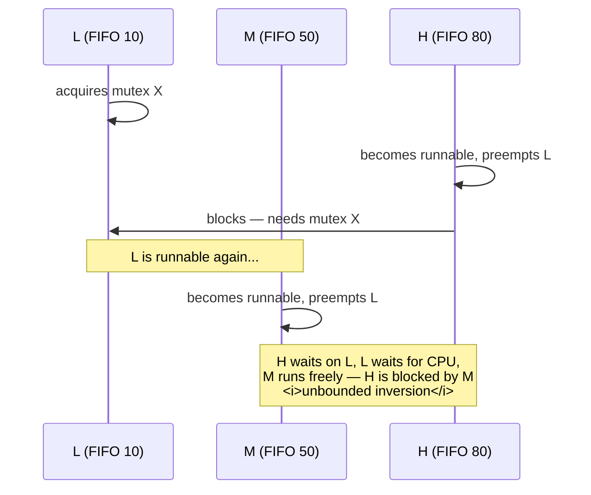
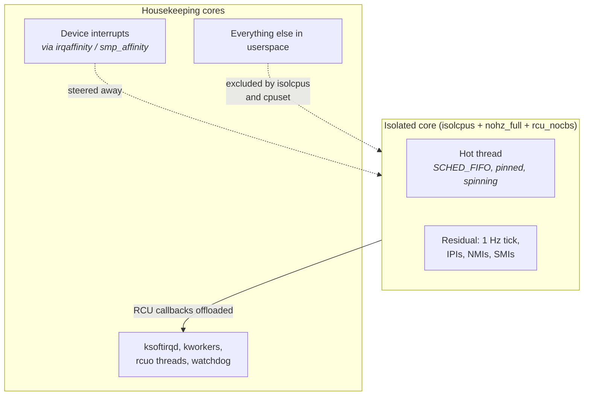
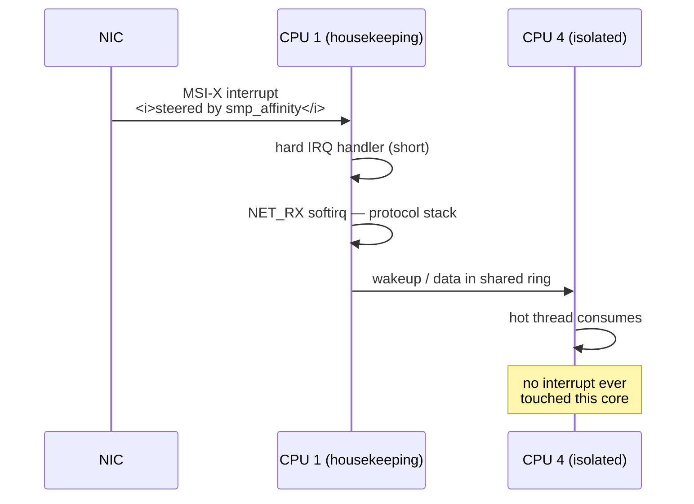
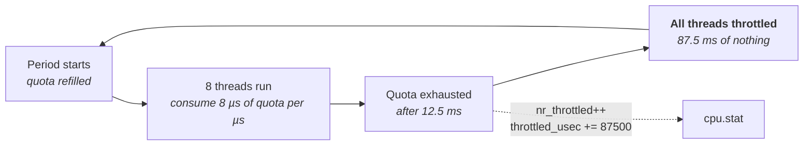

# Processes, Threads, and Scheduling

You know what a scheduler does: it decides which runnable thread gets a CPU, and it takes the CPU
away again when someone else deserves it more. That description is accurate and, for a
latency-critical system, almost entirely beside the point.

The scheduler you learned about in an operating systems course was optimized for goals you do not
share. It exists to keep every core busy, to divide throughput fairly among competing users, to let
an interactive shell feel responsive while a compile runs, and to save power when nothing is
happening. Every one of those goals is achieved by *moving work around* — preempting a thread to run
another, migrating a thread to a less loaded core, sleeping a core to save energy, deferring
low-priority work until a quiet moment. All of that movement is invisible in a throughput benchmark
and catastrophic in a latency histogram. A thread that is descheduled for 200 microseconds while a
`cron` job runs did not get slower; it stopped existing. There is no amount of code optimization
that recovers from that.

So the framing for this chapter is inverted relative to the one you already have. The question is
not "how does the kernel decide who runs?" but "how do I arrange for one specific thread to run
continuously, on one specific core, without ever being interrupted, migrated, preempted, or put to
sleep?" Everything below — task state, context switch cost, the fair scheduler's heuristics, the
real-time classes, affinity, isolation, interrupt steering, and cgroups — is machinery in service of
that question. Two ideas recur. First, **the cost of being descheduled is mostly not the switch
itself** — it is the cold caches and TLB you return to, which is why a "2 microsecond" context switch
routinely costs 20. Second, **the kernel does a great deal of periodic work on every core** — timer
ticks, RCU processing, softirqs, workqueues, load balancing — and unless you explicitly relocate that
work, it lands on the core you were trying to protect.

## The Life of a Task

Linux does not really have processes and threads as separate kinds of object. It has **tasks**, and
each task is one `struct task_struct` in the kernel — the structure your textbook called a process
control block. What distinguishes a "thread" from a "process" is nothing more than which parts of
that structure are shared with another task and which are private copies. This is a genuinely
different model from the one most courses teach, and internalizing it removes a lot of confusion
later.

Both `fork()` and `pthread_create()` funnel into the same kernel entry point, `clone()`, differing
only in a flag word. Call `clone()` with no sharing flags and you get a new task with its own copy of
the memory map, file descriptor table, and signal handlers — you call that a process. Call it with
`CLONE_VM | CLONE_FILES | CLONE_SIGHAND | CLONE_THREAD` and the new task shares the address space,
the descriptor table, the signal dispositions, and the thread group with its creator — you call that
a thread. The kernel calls both a task, gives both a scheduling entity, and schedules both by exactly
the same rules. There is no such thing in Linux as scheduling "a process"; the scheduler only ever
picks a task.

This has a consequence that matters immediately for identification. Every task has a **PID** (its own
unique task identifier) and a **TGID** (thread group identifier, shared by all threads of a
process). What userspace calls "the process ID" is the TGID; what `gettid()` returns is the PID. When
you pin a thread, set its priority, or read its scheduler statistics, you are operating on a PID, not
a TGID. Getting this wrong — applying `taskset` to a process ID when you meant one specific thread —
is the single most common beginner error in this material, and it fails silently by doing something
almost but not quite right.

### What lives in `task_struct`

The structure is large (on the order of a few kilobytes) and you will never touch it directly, but
knowing what it holds tells you exactly what a context switch has to preserve and what it does not.

| Field group | Contents | Shared between threads? |
|---|---|---|
| Identity | `pid`, `tgid`, credentials, parent/child links | TGID shared; PID per-task |
| Scheduling | `__state`, `policy`, `prio` / `static_prio` / `rt_priority`, `se` (the fair-class scheduling entity), `dl` (deadline parameters) | Per-task |
| Placement | `cpus_mask` — the set of CPUs this task may run on | Per-task |
| Address space | `mm` — pointer to the memory descriptor, which owns the page tables | **Shared** for threads |
| Files | `files` — the descriptor table | **Shared** for threads |
| Signals | `signal` / `sighand` | **Shared** for threads |
| Machine state | `thread_struct` — saved registers, FPU/SIMD state pointer | Per-task |
| Kernel stack | A separate per-task stack, 16 KiB on x86-64 | Per-task |

The line that matters is `mm`. Two threads of the same process share one `mm`, so switching between
them does not change the page tables. Two tasks in different processes have different `mm` pointers,
so switching between them requires reloading the page table root register `CR3` (see "Memory
Systems"). That one difference is the main reason a cross-process switch costs more than a
cross-thread switch, and we will quantify it shortly.

### States and transitions

A task is in exactly one state at a time, and the state letters you see in `ps` map directly onto
kernel states. The distinction that matters for latency work is not running-versus-not-running but
**runnable-versus-sleeping**: a runnable task that is not on a CPU is *waiting in a run queue*, and
that wait time is pure, unattributable latency that will not appear in any profile of your code.



- **Running (`R`, on a CPU)** and **runnable (`R`, queued)** are the same letter in `ps`, which is
  why run-queue wait time is invisible unless you go looking for it in `/proc/<pid>/schedstat`.
- **Interruptible sleep (`S`)** is the normal blocking state — waiting on a futex, an `epoll_wait`,
  a socket. This is the state a blocking wait strategy puts your hot thread in, and leaving it costs
  a wakeup.
- **Uninterruptible sleep (`D`)** is waiting on something the kernel will not let you abort, almost
  always storage I/O or a page fault against a file-backed mapping. A hot-path thread that ever
  enters `D` has a defect (see "Memory Management").
- **Zombie (`Z`)** is a task that has exited but whose exit status has not been collected. It holds
  no CPU and no memory beyond its `task_struct`.

**Failure mode: a thread you believe is running is actually waiting for a CPU.** The symptom is
end-to-end latency far exceeding the sum of the code's measured phases, with no gap visible in the
application's own instrumentation. The cause is run-queue delay — the task was runnable but another
task held the core. Confirm by reading `/proc/<pid>/schedstat`, whose three numbers are nanoseconds
spent on a CPU, nanoseconds spent waiting on a run queue, and the number of timeslices run. The
second number should be near zero for a properly isolated hot thread; if it grows, something else is
competing for that core.

**Failure mode: per-thread settings applied to the wrong task.** The symptom is that `chrt` or
`taskset` appears to succeed but the hot thread's behavior does not change. The cause is applying the
change to the thread group leader (the TGID) rather than the specific worker thread. Confirm by
listing threads with `ls /proc/<pid>/task/` and checking each one's actual settings with
`ps -eLo pid,tid,cls,rtprio,psr,comm -p <pid>` — `cls` is the scheduling class, `rtprio` the
real-time priority, and `psr` the CPU it last ran on.

**Try it:** start any multithreaded program and enumerate its tasks. Run
`ps -eLo pid,tid,psr,pcpu,comm -p $(pgrep -f yourprog)` and note that each TID reports its own `psr`.
Then read `/proc/<pid>/status` and compare `Threads:` against the number of entries in
`/proc/<pid>/task/`. Finally, read `voluntary_ctxt_switches` and `nonvoluntary_ctxt_switches` from
the same file twice, a few seconds apart. Voluntary switches mean the thread blocked on something;
non-voluntary means the scheduler took the CPU away. A hot-path thread should show approximately zero
of both once the system is tuned, and the two counters tell you which problem you have.

### Task creation is not free

Threads are cheap relative to processes, but neither is cheap relative to a hot path. Creating a
thread requires allocating a kernel stack, allocating and mapping a user stack with a guard page,
copying the `task_struct`, and inserting the new task into the scheduler — on the order of tens of
microseconds on a modern x86 server. `fork()` is more expensive still: it must copy the entire page
table structure and mark every writable page copy-on-write, so its cost scales with the size of the
parent's address space, and the child then pays a copy-on-write fault on first write to each page
(see "Memory Management").

The operational rule follows directly: **create every thread you will ever need during startup, pin
it, warm it, and never create another.** A thread pool that grows on demand is a thread pool that
performs a multi-tens-of-microsecond operation at exactly the moment it is busiest.

## What a Context Switch Actually Costs

Ask an engineer what a context switch costs and you will usually get a number between one and five
microseconds, presented as though it were a property of the CPU. That number describes only the
mechanical part — saving registers, switching stacks, updating bookkeeping — and it is the smaller
half of the story on any realistic workload. The larger half is that the thread you switch *to*
arrives on a core whose caches, TLB, and branch predictors are full of someone else's state, and it
must refill all of them from memory before it runs at its normal speed. That refill is not accounted
to the context switch by any tool. It shows up as your code being mysteriously slow for the next tens
of microseconds.

Work through what actually has to happen. Something causes the scheduler to run: a timer interrupt
fires, an interrupt handler wakes a higher-priority task, or the running task blocks. The CPU enters
the kernel (see "Kernel Architecture and the Syscall Boundary" for the entry cost, which the
Meltdown/Spectre mitigations inflate substantially). The scheduler picks the next task. The kernel
saves the outgoing task's general-purpose registers and stack pointer into its `task_struct`, saves
its floating-point and vector register state, loads the incoming task's equivalents, and — if the
incoming task belongs to a different process — writes the new page table root into `CR3`. Then it
returns to userspace, this time in the new task.



- The **direct cost** is steps B through H: roughly 0.5–2 µs on a modern x86 server, dominated by
  kernel entry and exit rather than by the register swap itself.
- The **indirect cost** is step I, and it is bounded by how much state the incoming thread needs to
  reload. For a thread with a working set that fits in L1 this is negligible; for one with a
  megabyte-scale working set it can be tens of microseconds of degraded execution.
- **The diagram's `CR3` branch is the process-versus-thread distinction.** Without **PCID** (Process
  Context Identifier, a tag on TLB entries that lets translations from multiple address spaces
  coexist), writing `CR3` flushes the entire TLB, and the incoming task pays a page walk on
  effectively every access until the TLB refills. With PCID, entries survive and the cost drops
  sharply. Kernel page-table isolation (the Meltdown mitigation) complicates this further by
  maintaining separate kernel and user page tables.

### Why the refill dominates

The exemplar arithmetic is worth doing once. Suppose your hot thread's working set is 256 KiB and it
lives comfortably in L2. Another thread runs on that core for 100 microseconds and streams through
several megabytes. When your thread resumes, its 256 KiB is gone — evicted — so it takes roughly
4,000 cache line fills to get back, each costing on the order of 80–100 ns from DRAM if nothing
overlaps them (see "Memory Systems"). Even with substantial memory-level parallelism recovering most
of that, you are looking at tens of microseconds of degraded operation. The "2 µs context switch" was
never the problem.

The same argument applies with different constants to the TLB (translations evicted, page walks
resumed) and to the branch predictors and the µop cache (see "CPU Microarchitecture Essentials"). All
of these are per-core, all of them are finite, and all of them are shared with whatever else runs on
that core.

Migration makes it worse. If the scheduler moves your thread to a *different* core, none of its state
is warm there, and if the new core is on a different socket, every line it reloads may now come from
remote memory or from the other socket's cache via the interconnect. This is why migrations are
tracked as a separate counter from context switches: they are a distinct and more expensive event.

| Event | Mechanical cost | Recovery cost | Notes |
|---|---|---|---|
| Thread ↔ thread, same process, same core | ~0.5–1 µs | Cache/TLB pollution only | No `CR3` write |
| Process ↔ process, same core | ~1–2 µs | Above, plus TLB effects | PCID greatly reduces the TLB hit |
| Migration to another core, same socket | ~1–3 µs | Full L1/L2 refill: 10s of µs | Also an IPI to the target core |
| Migration to another socket | ~2–5 µs | Refill from remote memory: 10s–100s of µs | Worst case; see "Memory Systems" |
| Interrupt (no switch) | ~1–2 µs | Whatever the handler evicts | Handler runs on your core, in your cache |

*Order-of-magnitude figures for modern x86 servers, Skylake-and-later class. Measure yours.*

**Failure mode: p99 latency is many times p50 with no corresponding change in instruction count.**
The symptom is a bimodal distribution — most iterations fast, a minority several times slower — where
the slow ones show a normal instruction count but far more cycles. The cause is preemption or
migration, with the slow iterations being those that resumed on a cold core. Confirm with
`perf stat -e context-switches,cpu-migrations,task-clock -p <pid> -- sleep 10`. Any nonzero migration
count on a thread you believe is pinned is a bug in your pinning; a nonzero context-switch count on
an isolated core means something else is being scheduled there.

**Failure mode: the tail correlates with an unrelated process's activity on the same core.** The
symptom is jitter that appears and disappears with another workload, even one using only a few
percent of CPU. The cause is that "a few percent of CPU" still means periodic preemption plus cache
eviction. Confirm with `perf sched record -- sleep 5` followed by `perf sched latency --sort max`,
which reports per-task maximum run-queue delay, and `perf sched timehist`, which prints the actual
switch timeline so you can see who displaced you.

**Try it:** measure your machine's context switch cost directly. Run a ping-pong between two threads
over a pipe or an eventfd, pinned to the *same* core, and time the round trip; that is roughly two
switches plus two syscalls. Then repeat with the threads on two different cores of the same socket,
and again across sockets. Divide by two for a per-switch figure. Then run the same test under
`perf stat -e context-switches,cpu-migrations,cache-misses` and confirm the switch counts match your
expectation — if they do not, the kernel is optimizing something away and your measurement is not
measuring what you think.

**Try it:** demonstrate the refill cost. Run a loop that repeatedly touches a 256 KiB buffer and
record per-iteration timings into a pre-allocated array. Then, from another shell, pin a
memory-streaming process to the same core with `taskset -c <cpu>`. Plot the timing array. You will
see a step change in level, not just occasional spikes — the thread is slower for a sustained period
after each switch, which is the refill, not the switch.

## The Default Scheduler: CFS and EEVDF

The default scheduling class in Linux — `SCHED_OTHER`, also called `SCHED_NORMAL` — is a fair-share
scheduler, and understanding what "fair" means to it explains most of the surprising behavior you
will hit. Its goal is that over any interval, each runnable task receives CPU time in proportion to
its weight. It is not trying to minimize anyone's latency; it is trying to prevent anyone's
starvation. Those are different objectives and they conflict.

**CFS** (the Completely Fair Scheduler, the default from 2007 through Linux 6.5) implements this with
a single idea: virtual runtime. Each task accumulates `vruntime` as it runs, but at a rate scaled by
its weight — a high-weight task's `vruntime` advances more slowly than a low-weight task's for the
same wall-clock time. Runnable tasks sit in a red-black tree ordered by `vruntime`, and the scheduler
always picks the leftmost node, i.e. the task that has had the least weighted CPU time. Because
`vruntime` advances slowly for heavy tasks, they get picked more often. That is the whole mechanism.
Weight comes from the nice value, through a fixed table where nice 0 maps to weight 1024 and each
nice level changes weight by roughly 25%, producing the familiar rule of thumb that one nice level is
worth about 10% of CPU.

**EEVDF** (Earliest Eligible Virtual Deadline First) replaced CFS as the default in Linux 6.6. It
keeps the weighted-fairness accounting but adds an explicit notion of *lag* — how much CPU time a
task is owed relative to its fair share — and a *request size*, a time slice the task would like to
receive when it runs. A task is **eligible** only when its lag is non-negative, meaning it has not
already received more than its share; among eligible tasks, the scheduler picks the one whose virtual
deadline (roughly, the time by which it should have received its requested slice) is earliest. The
practical effect is better latency for tasks that ask for short slices and run briefly, at the same
long-run fairness. For our purposes the important consequence is administrative: EEVDF removed the
old CFS tunables and replaced them with a single base slice.



- **The class hierarchy in the diagram is strict, not weighted.** A single runnable `SCHED_FIFO` task
  will starve every `SCHED_OTHER` task on its core indefinitely, which is both the reason real-time
  classes work and the reason they are dangerous.
- **`stop_sched_class` sits above even `SCHED_DEADLINE`.** It runs the per-CPU `migration/N` kernel
  threads that implement task migration and CPU hotplug via the `stop_machine` mechanism. Nothing you
  can set will preempt it, which is one reason "highest real-time priority" does not mean "never
  interrupted."

### The heuristics that create jitter

Fair scheduling by itself would be tolerable. What makes CFS/EEVDF unsuitable for a hot path is the
surrounding machinery that exists to keep all cores busy and to make interactive workloads feel
responsive.

- **Periodic load balancing.** The scheduler organizes CPUs into a hierarchy of *scheduling domains*
  — SMT siblings, then cores sharing an L3, then sockets — and periodically checks whether load is
  unevenly distributed across each level, migrating tasks to even it out. Your thread can be moved
  because a *different* core became busy.
- **Idle balancing.** When a core runs out of work it immediately looks for a task to steal from a
  busier core rather than going idle. This is good for throughput and it means a briefly-idle
  neighbour can pull your thread away.
- **Wakeup placement.** When a task is woken, the scheduler chooses which CPU to place it on, often
  preferring a core near the waker to exploit cache sharing. This is a heuristic and it can be wrong.
- **Cache-hot heuristics.** `sched_migration_cost_ns` (default 500,000 ns) is the kernel's estimate
  of how long a task stays "cache hot"; a task that ran more recently than that is treated as
  expensive to migrate. It is one threshold approximating a cost that actually varies by three orders
  of magnitude across workloads.
- **Autogroup.** With `kernel.sched_autogroup_enabled` set to 1 (the default on most desktop-oriented
  distributions), tasks are grouped by session and fairness is applied *between groups first*. This
  makes `nice` values ineffective across sessions and confuses anyone trying to reason about CPU
  shares. Check it with `sysctl kernel.sched_autogroup_enabled`.

The tunables moved between kernel versions, and quoting the wrong ones is a common way to look
uninformed:

| Kernel era | Where tunables live | Key knobs |
|---|---|---|
| Pre-6.6 (CFS) | `/proc/sys/kernel/` then `/sys/kernel/debug/sched/` | `sched_latency_ns`, `sched_min_granularity_ns`, `sched_wakeup_granularity_ns` |
| 6.6+ (EEVDF) | `/sys/kernel/debug/sched/` | `base_slice_ns` (replaces the first two), `migration_cost_ns` |
| Both | `/proc/sys/kernel/` | `sched_rr_timeslice_ms`, `sched_rt_period_us`, `sched_rt_runtime_us`, `sched_schedstats`, `sched_autogroup_enabled` |

These knobs are debug interfaces, gated on `CONFIG_SCHED_DEBUG`, and their names and locations are
implementation details that change. The honest position in an interview is that you know what they
control and that you would read them off the machine rather than recite defaults.

**Failure mode: a thread appears to lose the CPU despite the core looking mostly idle.** The symptom
is non-voluntary context switches on a lightly-loaded core. The cause is usually a kernel thread or a
short-lived task waking on that core, and under fair scheduling any runnable task at the same weight
will eventually be given a turn. Confirm by enabling scheduler statistics with
`sysctl -w kernel.sched_schedstats=1` and then reading `/proc/<pid>/sched`, which reports
`nr_switches`, `nr_voluntary_switches`, `nr_involuntary_switches`, and (with statistics enabled)
maximum run-queue wait. On EEVDF kernels the same file exposes the task's `se.slice` and lag-related
fields.

**Failure mode: latency degrades when an unrelated core goes idle.** The symptom is counter-intuitive
— less system load, worse tail. The cause is idle balancing pulling your task onto the newly-free
core, destroying its cache warmth. Confirm with `perf stat -e cpu-migrations` and by recording the
`sched:sched_migrate_task` tracepoint. The fix is affinity, covered below; tuning
`migration_cost_ns` is treating a symptom.

**Try it:** watch the fair scheduler work. Run `cat /proc/schedstat` and note the per-CPU lines; the
run-queue fields include the total time tasks spent waiting to run on that CPU. Enable statistics
first with `sysctl -w kernel.sched_schedstats=1`, since collection is off by default on many
distributions. Then start two CPU-bound loops pinned to the same core, one at nice 0 and one at
nice 5, and confirm from `top` that they split the core roughly 75/25 rather than 50/50 — that is the
weight table in action. Repeat with `kernel.sched_autogroup_enabled=1` and the two loops started from
different shell sessions, and watch the nice difference stop mattering.

**Try it:** capture a scheduling trace of your own application. `perf sched record -- sleep 5` while
it runs, then `perf sched latency --sort max`. The report gives, per task, the average and maximum
time spent waiting on a run queue. For a hot-path thread on a properly isolated core, the maximum
should be single-digit microseconds or less. Anything in the hundreds of microseconds tells you the
core is not actually yours.

## Real-Time Scheduling Classes

Fair scheduling gives everyone a turn. A hot path does not want a turn; it wants the core, and it
wants it the instant its work arrives. That is what the real-time classes provide: strict priority
scheduling in which a runnable higher-priority task always preempts a lower-priority one, with no
fairness accounting and no notion of having "had enough."

Linux offers three real-time policies. **`SCHED_FIFO`** is the simplest: tasks have a static priority
from 1 to 99, the highest-priority runnable task runs, and it runs until it blocks, exits, or is
preempted by something of strictly higher priority. It never yields to an equal-priority peer.
**`SCHED_RR`** is identical except that equal-priority tasks round-robin through a timeslice
(`kernel.sched_rr_timeslice_ms`, default 100 ms). **`SCHED_DEADLINE`** is different in kind: instead
of a priority you specify a *budget* — a runtime, a deadline, and a period — and the kernel
guarantees you that much runtime within each period, scheduling by earliest deadline first and
refusing (via admission control) to accept a set of tasks it cannot satisfy.

For a busy-polling hot-path thread, `SCHED_FIFO` is the usual choice, and the reason is precisely
that it has no fairness accounting to fight. Once the thread is at FIFO priority on a core where
nothing else has real-time priority, the only things that can take the CPU away are interrupts,
higher-priority kernel threads, and the stop class. That is a short and enumerable list, which is
exactly the property determinism requires.

| Policy | Selection rule | Preempted by | Typical use |
|---|---|---|---|
| `SCHED_FIFO` | Highest priority runnable; runs until it blocks | Strictly higher RT priority, deadline tasks, stop class, interrupts | Pinned busy-poll thread |
| `SCHED_RR` | Same, but equal priorities share via timeslice | Same, plus equal-priority peers at slice expiry | Several equal-importance RT tasks on one core |
| `SCHED_DEADLINE` | Earliest absolute deadline first, with enforced budget | Stop class, interrupts | Periodic work with a known duty cycle |
| `SCHED_OTHER` | EEVDF weighted fairness | Everything above | Everything else |
| `SCHED_BATCH` | Fair, but never treated as interactive | Everything above | Background compute |
| `SCHED_IDLE` | Runs only when nothing else is runnable | Everything | Truly optional work |

### Real-time throttling: the safety net that will bite you

A `SCHED_FIFO` task that spins forever and never blocks will monopolize its core completely. If it
happens to share that core with a kernel thread that the system needs — `ksoftirqd`, a workqueue
worker, the RCU machinery — the machine can wedge. Linux therefore ships a global throttle: over each
period of `kernel.sched_rt_period_us` (default 1,000,000 µs), real-time tasks may consume at most
`kernel.sched_rt_runtime_us` (default 950,000 µs) on a CPU. That is 95%, and the remaining 5% is
handed to the fair class.

For a busy-polling thread this is disastrous in a very specific way: for 50 milliseconds out of every
second, your thread is *not running*. It does not degrade smoothly; it stops. Practitioners disable
throttling by setting `kernel.sched_rt_runtime_us` to `-1`, but doing so removes the safety net, and
it is only safe once you have genuinely relocated all necessary kernel work off that core — which is
what the isolation sections below are about. Disabling throttling before isolating the core is how
people hang trading hosts.

The other reason not to reach straight for priority 99 is that several kernel threads run at high
real-time priorities themselves. Interrupt-handling threads under `PREEMPT_RT`, watchdog threads, and
per-CPU infrastructure threads all live in the real-time priority space. Setting your thread above
them means it can starve the machinery the kernel needs to stay healthy. A priority in the middle of
the range — commonly somewhere in the 50s to 80s — sits above every ordinary task while leaving
critical kernel threads room above you.

Setting and inspecting policy is straightforward:

```sh
# Inspect: current policy and priority of a specific thread (TID, not PID)
chrt -p <tid>

# Set a running thread to SCHED_FIFO priority 80
sudo chrt -f -p 80 <tid>

# Launch a program directly under FIFO 80
sudo chrt -f 80 ./yourprog

# Show the valid priority range for each policy
chrt -m

# Global real-time throttle
sysctl kernel.sched_rt_period_us kernel.sched_rt_runtime_us
```

Programmatically the interfaces are `sched_setscheduler(2)` for FIFO and RR, and `sched_setattr(2)`
for `SCHED_DEADLINE` and for the newer per-task slice hint on `SCHED_OTHER`. Unprivileged processes
need `RLIMIT_RTPRIO` raised or the `CAP_SYS_NICE` capability. The `SCHED_RESET_ON_FORK` flag is worth
knowing: it causes children to revert to `SCHED_OTHER` at nice 0, so that a real-time process cannot
accidentally hand real-time privileges to everything it spawns.

**Failure mode: a FIFO thread stalls for tens of milliseconds at regular one-second intervals.** The
symptom is a latency histogram with a distinct cluster of ~50 ms outliers at a suspiciously regular
cadence. The cause is real-time throttling. Confirm by reading
`sysctl kernel.sched_rt_runtime_us` — if it is 950000, that is it — and by correlating the outliers
with the one-second period. The kernel also logs `sched: RT throttling activated` on the first
occurrence, visible in `dmesg`.

**Failure mode: the machine becomes unresponsive after promoting a thread to FIFO.** The symptom is
that SSH stops responding and console input lags, on a host that was fine a moment ago. The cause is
a spinning real-time task on a core that also hosts kernel threads or interrupt processing, with
throttling disabled. Confirm — if you can get in at all — by checking which CPU the task is on
(`ps -eLo tid,cls,rtprio,psr`) and what else is bound there (`ps -eLo psr,comm --sort psr`). The
lesson is ordering: isolate the core first, then raise priority, then disable throttling.

**Try it:** observe throttling directly. Pin a busy-spin loop to a core with
`taskset -c <cpu> ./spinner`, promote it with `sudo chrt -f -p 80 <tid>`, and have the loop record a
timestamp every iteration into a pre-allocated buffer. You will find gaps of roughly 50 ms once per
second. Then set `sudo sysctl -w kernel.sched_rt_runtime_us=-1` and confirm the gaps disappear. Set
it back afterwards on any machine you have not fully isolated.

**Try it:** measure wakeup latency the standard way. Install `rt-tests` and run
`sudo cyclictest -m -p 95 -t1 -a <cpu> -i 200 -D 60 -h 400`. It measures the difference between when
a timer should have fired and when the thread actually resumed, and prints a histogram. On an
untuned machine the maximum will be in the hundreds of microseconds or worse; on a properly isolated
core it should be in the single-digit microseconds. That maximum is the most honest single number
describing your host's determinism.

## Priorities, Nice Values, and Priority Inversion

Linux maintains one internal priority space and maps three user-visible schemes onto it, which is why
the numbers in different tools disagree. Internally, lower is more urgent. Real-time priorities 1–99
map to internal 98–0. The fair class occupies internal 100–139, which is nice −20 through nice +19.
`SCHED_DEADLINE` sits below all of them at internal −1. Once you have that picture, `ps -eo
pid,cls,pri,ni,rtprio` stops being confusing.

**Nice** is the weakest of the three mechanisms and the most commonly misunderstood. A nice value does
not reserve CPU, does not guarantee ordering, and does not prevent preemption. It adjusts a weight in
the fair scheduler's proportional-share calculation — a nudge, not a guarantee. Lowering a background
job's priority with `renice 19` reduces how much CPU it takes but does nothing about the fact that
when it *does* run, it evicts your caches. For a hot path, nice is not a tool; affinity is.

**Real-time priority** is a genuine guarantee within its class: a runnable FIFO-80 task will preempt a
FIFO-50 task, immediately, wherever it is in its work. That strictness is what makes it useful and
what makes the next problem possible.

### Priority inversion

Strict priority scheduling assumes that a high-priority task's ability to run depends only on the
scheduler. It does not: it also depends on the locks it needs. Consider three tasks on one core — H
at FIFO 80, M at FIFO 50, and L at FIFO 10 — where H and L share a mutex.



- **The diagram shows unbounded priority inversion**, the classic failure: H is nominally the most
  important task, but its progress is gated by M, which has no relationship to it and no priority
  claim over it. The duration is unbounded because M can run as long as it likes.
- **A short, bounded inversion is unavoidable** whenever priorities and shared locks coexist — H must
  wait for L to finish its critical section. The pathology is specifically M's ability to extend that
  wait indefinitely.

The standard remedy is **priority inheritance**: while a low-priority task holds a lock that a
high-priority task is waiting on, it temporarily inherits the waiter's priority, so it cannot be
preempted by anything between the two. Linux implements this in the kernel's PI-futex support, which
userspace reaches through mutexes created with the `PTHREAD_PRIO_INHERIT` protocol attribute. The
alternative, **priority ceiling**, raises anyone holding the lock to a fixed ceiling priority defined
as the maximum of all possible users; it avoids the dynamic bookkeeping but requires knowing every
user in advance.

Both remedies have a cost: an inheriting mutex cannot use the cheap uncontended fast path unmodified,
and every lock/unlock carries extra bookkeeping. The mechanics of futexes and the fast/slow path
split belong to "Synchronization and IPC," which also covers inversion from the lock-design side.

The deeper point for a low-latency system is that priority inheritance solves a problem you should
prefer not to have. If the hot path shares no locks with anything, inversion cannot occur. Designs
that pass data through single-producer/single-consumer ring buffers rather than shared mutable state
sidestep the whole category (see "Synchronization and IPC").

**Failure mode: a high-priority thread blocks for far longer than any critical section could
explain.** The symptom is an outlier whose duration matches an unrelated task's work, not the lock
holder's. The cause is priority inversion. Confirm by tracing with `perf sched timehist` or by
recording the `sched:sched_switch` and `sched:sched_wakeup` tracepoints across the incident and
reading off who ran while the high-priority task was blocked.

**Failure mode: `renice` on a noisy neighbour does not improve the hot path's tail.** The symptom is
that lowering a background job's priority reduces its throughput without helping your p99. The cause
is that nice affects share, not interference — the job still runs periodically on your core and still
evicts your cache lines. Confirm by checking that the neighbour still appears on your core in
`ps -eLo psr,tid,comm --sort psr`. The fix is to move it, not to demote it.

**Try it:** map the priority spaces on your own machine. Run `ps -eo pid,cls,pri,ni,rtprio,comm |
sort -k3 -n | head -40` and observe that kernel threads such as `migration/N` and the watchdog
threads occupy the high-urgency end. Then run `chrt -m` to print the valid range for each policy.
Understanding where your intended priority sits relative to the kernel's own threads is the whole
reason to look.

## CPU Affinity and Thread Pinning

Everything so far has been about *when* a task runs. Affinity is about *where*. Each task carries a
CPU mask — the set of logical CPUs it is permitted to run on — and the scheduler will never place it
outside that set. Restricting a thread to exactly one CPU is called pinning, and it is the single
highest-value change in this chapter.

The value comes from removing a source of variance rather than from making anything faster. An
unpinned thread may be migrated for any of the reasons the fair scheduler migrates things: load
balancing, idle balancing, wakeup placement heuristics. Each migration abandons a warm L1 and L2, a
warm TLB, and trained branch predictors, and if the destination is on another socket it also converts
every subsequent memory access into a potentially remote one (see "Memory Systems"). Pinning makes
that class of event impossible. It also makes the rest of your tuning meaningful — there is no point
isolating a core, steering interrupts away from it, or placing memory on its NUMA node if the thread
that was supposed to use it can wander off.

Pinning also interacts with topology in ways that require you to know the machine. Logical CPU
numbers are assigned by firmware and are *not* guaranteed to be laid out sensibly: on many two-socket
systems, CPUs 0..N−1 are socket 0 and N..2N−1 are socket 1, but on others they alternate. Worse,
**hyperthread siblings appear as separate logical CPUs sharing one physical core** (see "Multicore,
Coherence, and Memory Ordering"). Pinning your hot thread to CPU 3 and a background thread to CPU 35
looks like isolation and may in fact be two threads fighting over one core's execution resources.
Always read the sibling map before choosing a CPU.

- **`/sys/devices/system/cpu/cpu<N>/topology/thread_siblings_list` is the file that matters.** Two
  logical CPUs listed there share one physical core's L1d, L1i, L2, TLB, and execution ports.
- **Sibling interference needs no context switch.** A thread on the sibling evicts your cache lines
  and consumes frontend bandwidth continuously, without ever preempting you — so migration counters
  and context-switch counters both read zero while your latency degrades.

The tools:

| Task | Command or interface |
|---|---|
| Run a command pinned | `taskset -c 5 ./prog` |
| Pin a running thread | `taskset -pc 5 <tid>` |
| Read a task's current mask | `taskset -p <tid>`, or `Cpus_allowed_list` in `/proc/<pid>/status` |
| See where a thread last ran | `ps -eLo tid,psr,comm -p <pid>` |
| Set affinity from code | `sched_setaffinity(2)`, or `pthread_setaffinity_np` per thread |
| Read the topology | `lscpu -e`, `/sys/devices/system/cpu/cpu*/topology/` |
| Read NUMA layout | `numactl --hardware`, `lscpu` |

Two refinements are worth stating explicitly. First, **pin per thread, not per process**: a process's
threads have independent masks, and setting affinity on the TGID sets it only for the main thread
plus any thread created afterwards. Second, **pin before you allocate and touch memory**, because
first-touch NUMA placement depends on which node the touching thread is running on (see "Memory
Systems"). The correct startup order is: create thread → pin thread → allocate → touch every page →
lock memory → begin work.

**Failure mode: two threads that should not interact show correlated latency spikes.** The symptom is
that when one thread does more work, an unrelated thread on a "different" CPU slows down. The cause is
that the two logical CPUs are SMT siblings of one physical core. Confirm with
`cat /sys/devices/system/cpu/cpu<N>/topology/thread_siblings_list` for each, or read the `lscpu -e`
table, which lists core and socket for every logical CPU.

**Failure mode: affinity appears not to take effect.** The symptom is that `psr` still changes over
time despite a `taskset` call. The cause is usually that the mask was applied to the wrong TID, or
that the application itself sets affinity at startup and overwrote yours, or that a cgroup's
`cpuset.cpus` restricts the effective set. Confirm by reading `Cpus_allowed_list` from
`/proc/<tid>/status` — that is the authoritative value — and comparing against
`/sys/fs/cgroup/<path>/cpuset.cpus.effective` for the task's cgroup.

**Try it:** map your topology and prove SMT interference. Run `lscpu -e` and identify a pair of
logical CPUs sharing one physical core. Run a fixed-work benchmark pinned to one of them and record
the time. Then start a memory-heavy loop pinned to its sibling and re-run. The slowdown you see with
no context switches and no migrations is pure resource sharing inside the core. Repeat with the noisy
loop on a genuinely different physical core to confirm the difference.

**Try it:** watch migrations disappear. Run a CPU-bound thread unpinned under
`perf stat -e cpu-migrations,context-switches -p <tid> -- sleep 30`, then repeat with
`taskset -c <cpu>`. The migration count should go to exactly zero. If it does not, you pinned the
wrong TID.

## Core Isolation

Pinning your thread to a core stops *your* thread from moving. It does nothing to stop the kernel
from scheduling other things onto that core. A pinned `SCHED_FIFO` thread on an otherwise ordinary
core will still be interrupted by the periodic timer tick, by RCU callback processing, by softirq
work, by workqueue items, by the load balancer's bookkeeping, and by any userspace task the scheduler
decides to place there. Isolation is the set of mechanisms that removes those.

There are three largely independent problems, and conflating them is why people apply one boot
parameter and are disappointed. The first is **task placement**: keeping other schedulable tasks off
the core. The second is **the timer tick**: the periodic interrupt the kernel uses to drive
accounting, preemption, and timers. The third is **deferred kernel work**: RCU callbacks, softirqs,
and workqueue items that the kernel would ordinarily process on whichever core generated them.

### Keeping tasks off the core

`isolcpus=` is the oldest mechanism. Passed as a boot parameter, it removes the listed CPUs from the
scheduler's load-balancing domains entirely, so nothing will ever be balanced onto them; a task lands
there only if it explicitly sets affinity to that CPU. Modern kernels accept flag prefixes:
`isolcpus=domain,managed_irq,2-15` both removes those CPUs from scheduling domains and asks the
kernel to avoid steering managed device interrupts to them.

The kernel documentation describes the bare `isolcpus=` form as deprecated in favour of cpusets, and
in principle a cgroup `cpuset` with an isolated partition achieves the same thing more flexibly and
without a reboot. In practice `isolcpus=` remains extremely common on tuned hosts because it is
simple, applies from boot, and cannot be accidentally undone by a container runtime.

Note what `isolcpus` does *not* do. It does not stop per-CPU kernel threads from running there —
every CPU has its own `ksoftirqd/N`, `cpuhp/N`, `migration/N`, and often `rcuc/N` — and it does not
stop the timer tick.

### Stopping the tick: `nohz_full`

Linux traditionally interrupts every CPU at a fixed rate — `CONFIG_HZ`, commonly 250 or 1000 Hz — to
drive time accounting, timer expiry, and preemption checks. Each tick is a hardware interrupt that
enters the kernel, does a few microseconds of work, and returns, evicting some of your cache on the
way through. At 1000 Hz that is a guaranteed interruption every millisecond.

`CONFIG_NO_HZ_FULL`, enabled per-CPU with the `nohz_full=` boot parameter, allows the kernel to stop
the tick on a CPU that has exactly one runnable task, since with one task there is no preemption
decision to make. The tick does not stop entirely — a residual 1 Hz tick remains for scheduler
bookkeeping in current kernels — but going from 1000 interruptions per second to one is a large win.

Two constraints follow from how it works. **You cannot make every CPU `nohz_full`**; at least one
must remain a timekeeping CPU, and the kernel will refuse or silently retain CPU 0 for that role.
And **the "one runnable task" condition is strict**: if any second task becomes runnable on that CPU,
even briefly, the tick restarts. This is why isolation and `nohz_full` must be applied together —
`nohz_full` on a core that still receives balanced work gives you nothing.

### Offloading RCU

**RCU** (Read-Copy-Update) is the kernel's mechanism for lock-free reads of shared data structures.
Writers make a new version and defer freeing the old one until every CPU has passed through a
quiescent state, guaranteeing no reader still holds a reference. The deferred frees are *callbacks*,
and by default each CPU processes its own callbacks — as softirq work, or in the per-CPU `rcuc/N`
kernel thread. That processing is unbounded work appearing on your core at times determined by other
CPUs' write activity.

`rcu_nocbs=` moves callback processing for the listed CPUs into `rcuo` kernel threads that can run
elsewhere. In current kernels, CPUs listed in `nohz_full=` are automatically included in the
no-callback set, so the two are usually specified together for clarity rather than necessity. The
related `rcu_nocb_poll` parameter makes the offload threads poll rather than being woken by an IPI
from the isolated CPU, trading a little CPU on the housekeeping side for removing a wakeup from the
isolated side.



- **The diagram's residual box is the honest part.** Isolation removes scheduled work and steerable
  interrupts; it cannot remove inter-processor interrupts (used for TLB shootdowns and remote
  function calls), non-maskable interrupts, or system management interrupts from firmware (see
  "Jitter Hunting").
- **Every arrow into the housekeeping box is work that used to run on your core.** That work does not
  vanish — it is relocated, which is why housekeeping cores must be provisioned rather than
  grudgingly allocated.

A representative boot line for a two-socket host isolating CPUs 2–15, with the caveat that the exact
set depends on your topology and the full checklist belongs to "Tuning a Linux Box for Determinism":

```
isolcpus=domain,managed_irq,2-15 nohz_full=2-15 rcu_nocbs=2-15 irqaffinity=0-1
```

And the corresponding verification, which matters more than the boot line because parameters silently
do nothing when the kernel lacks the config option:

```sh
cat /sys/devices/system/cpu/isolated      # confirms isolcpus took effect
cat /sys/devices/system/cpu/nohz_full     # confirms nohz_full took effect
cat /proc/cmdline                          # what you actually booted with
grep -E 'LOC|TLB|RES|CAL' /proc/interrupts # per-CPU timer, shootdown, reschedule, call IPIs
```

**Failure mode: `nohz_full` is in `/proc/cmdline` but the tick still fires.** The symptom is a local
timer interrupt count in `/proc/interrupts` climbing at roughly `CONFIG_HZ` on a supposedly tickless
core. The most common cause is that more than one task is runnable on that CPU — often a kernel
thread you did not account for. The second most common is that the kernel was built without
`CONFIG_NO_HZ_FULL`. Confirm by reading `/sys/devices/system/cpu/nohz_full`, which is empty if the
feature is unavailable, and by watching the `LOC` row of `/proc/interrupts` for that CPU over a fixed
interval.

**Failure mode: periodic multi-microsecond stalls on a fully isolated core.** The symptom is a
regular jitter signature with no local scheduling activity. Common causes are RCU callback processing
that was never offloaded, and IPIs from other cores — TLB shootdowns triggered by memory-map churn
elsewhere on the machine (see "Memory Systems"). Confirm by comparing the `RES` (rescheduling), `CAL`
(function call), and `TLB` rows of `/proc/interrupts` before and after the incident window; a rising
count on a core running nothing is proof.

**Try it:** verify tickless operation quantitatively. On an isolated core, run
`perf stat -e irq_vectors:local_timer_entry -C <cpu> -- sleep 10` with nothing running there, then
again with a single spinning pinned thread, then again with two runnable threads. The first two
should show a handful of events; the third should show roughly `CONFIG_HZ × 10`. That transition is
the "one runnable task" rule made visible.

**Try it:** inventory what is actually bound to your isolated cores. Run
`ps -eLo psr,tid,cls,rtprio,comm --sort psr | awk '$1>=2 && $1<=15'` and read the list. Every entry
is either a per-CPU kernel thread you cannot remove or something you should relocate. Then read
`/proc/interrupts` and confirm no device interrupt row has nonzero counts in those CPU columns.

## Housekeeping Cores and IRQ Steering

Isolation moves work; it does not delete it. The kernel still has softirqs to process, workqueue
items to run, timers to service, RCU callbacks to invoke, and device interrupts to handle. All of it
has to execute somewhere. **Housekeeping cores** are the cores you deliberately designate to absorb
it, and treating their provisioning as an afterthought is how a carefully isolated host ends up with
one saturated core dropping packets.

The layout of a tuned host is therefore a partition, not a hierarchy. A typical two-socket machine
might reserve CPUs 0–1 on each socket for housekeeping — kernel threads, the interrupt load, systemd
and monitoring agents, logging, and anything else — and dedicate the remainder to pinned application
threads. The housekeeping cores are ordinary: they tick at full rate, they run the fair scheduler,
and they are allowed to be busy. The isolated cores are exclusive.

Interrupts are the part that requires explicit action, because an interrupt is delivered to whichever
CPU the interrupt controller was programmed to target, entirely outside the scheduler's control. A
NIC receiving a packet raises an MSI-X interrupt (see "Buses, Devices, and I/O Hardware"), the target
CPU takes it immediately regardless of what it was doing and regardless of any real-time priority,
runs the handler, and typically schedules softirq work to follow. If that CPU is your hot core, you
have taken a hardware interrupt, a cache-polluting handler, and possibly a softirq pass, in the middle
of your critical path.



- **The diagram shows the split-role pattern** that also underpins kernel-bypass designs: interrupts
  and stack processing on housekeeping cores, application processing on isolated cores, connected by a
  shared-memory ring rather than by an interrupt (see "Kernel Bypass" and "Synchronization and IPC").
- **The wakeup edge in the diagram is the one you eliminate with busy-polling**, which the next
  section covers.

The mechanics of steering:

| Interface | What it does |
|---|---|
| `/proc/interrupts` | Per-IRQ, per-CPU counts. The authoritative view of where interrupts are landing. |
| `/proc/irq/<n>/smp_affinity` | Hex bitmask of CPUs allowed to service IRQ *n*. |
| `/proc/irq/<n>/smp_affinity_list` | Same, in human-readable list form (`0-1`, `3`). |
| `/proc/irq/default_smp_affinity` | Default mask applied to newly-registered IRQs. |
| `irqaffinity=` boot parameter | Sets the default at boot, before any driver registers. |
| `irqbalance` daemon | Periodically *rewrites* affinities. Must be disabled or configured with `IRQBALANCE_BANNED_CPUS`. |

Two complications. First, `irqbalance` is enabled by default on most distributions and will
methodically undo hand-set affinities, typically within a minute — a genuinely maddening failure if
you do not know it exists. Second, **managed interrupts cannot be steered by hand**. Multi-queue
devices — modern NICs, NVMe controllers — let the kernel manage the queue-to-CPU mapping itself, and
writing to `smp_affinity` for such an IRQ fails with `EIO`. That is what the `managed_irq` flag to
`isolcpus=` exists for: it tells the kernel to keep managed interrupts away from isolated CPUs when
it computes the mapping.

Beyond hardware interrupts, several kinds of kernel background work have their own affinity controls:

- **Unbound workqueues** honour `/sys/devices/virtual/workqueue/cpumask`, which restricts where
  unbound work items may run.
- **Writeback** has its own mask at `/sys/bus/workqueue/devices/writeback/cpumask`.
- **The soft-lockup watchdog** is restricted by `sysctl kernel.watchdog_cpumask`, or disabled
  wholesale with `kernel.watchdog=0`.
- **Per-CPU kernel threads** — `ksoftirqd/N`, `migration/N`, `cpuhp/N` — cannot be moved by design.
  They exist on every CPU and run only when that CPU has work of the relevant kind, which is why the
  goal is to give the isolated core no such work rather than to relocate the thread.

**Failure mode: hand-set IRQ affinities revert after a minute.** The symptom is that
`/proc/irq/<n>/smp_affinity_list` shows your value immediately after writing and something else
later. The cause is `irqbalance`. Confirm with `systemctl status irqbalance`. Either stop it or list
your isolated CPUs in `IRQBALANCE_BANNED_CPUS` in its configuration.

**Failure mode: writing to `smp_affinity` returns `EIO`.** The cause is that the IRQ is
kernel-managed, typical for NIC and NVMe queues. Confirm by checking whether the IRQ name in
`/proc/interrupts` corresponds to a multi-queue device. The fix is `isolcpus=managed_irq,...` at boot
plus, for NICs, reducing the queue count with `ethtool -L` so that queues map only onto housekeeping
CPUs (see "The Linux Networking Stack").

**Failure mode: one housekeeping core saturates and packets are dropped.** The symptom is rising drop
counters under load with plenty of idle CPU elsewhere on the machine. The cause is that all
interrupts and all softirq processing were steered onto a single core. Confirm with `mpstat -P ALL 1`
(the `%soft` column shows softirq time) and by reading the per-CPU distribution in
`/proc/softirqs`. Housekeeping needs enough cores for the load it absorbs.

**Try it:** find and move a device's interrupts. Locate your NIC's IRQ numbers with
`grep <ifname> /proc/interrupts`, note which CPU columns are nonzero, then write a housekeeping-only
mask: `echo 0-1 | sudo tee /proc/irq/<n>/smp_affinity_list`. Stop `irqbalance` first, generate
traffic, and re-read `/proc/interrupts` to confirm the counts now accumulate only in the housekeeping
columns. If the write fails with `EIO`, you have found a managed interrupt.

**Try it:** measure the cost of an interrupt on the hot core deliberately. Run a tight timing loop
pinned to an isolated core and record per-iteration times. Then temporarily steer a busy device's IRQ
to that core and re-run. The difference in the tail — and the corresponding rise in that CPU's column
in `/proc/interrupts` — is the per-interrupt cost including cache pollution, on your hardware.

## Waiting: Spin, Block, and the Middle Ground

A hot-path thread spends most of its time waiting for something to arrive — a packet in a NIC ring, a
message in a shared-memory queue, a signal from another thread. How it waits is one of the largest
single decisions in a low-latency design, and it is a genuine trade-off rather than a settled
question.

The conventional approach is to block. The thread calls `epoll_wait`, or waits on a condition
variable, or reads from a socket, and the kernel puts it to sleep. It consumes no CPU. When data
arrives, an interrupt fires, a handler runs, the protocol stack processes the packet, the kernel marks
the thread runnable, the scheduler picks it, and it resumes. That whole path — from the hardware event
to your code executing its first instruction — is **wakeup latency**, and on a general-purpose system
it is on the order of 5–50 microseconds, with a tail far worse when the core has to be brought out of
a deep idle state.

Break down where that time goes and the alternative becomes obvious. There is the interrupt delivery
and handler, the softirq processing, the wakeup path through the scheduler, possibly an IPI if the
target thread is on a different core than the waker, the context switch itself, and then the cold
cache your thread returns to. **Busy-polling** deletes all of it. The thread never sleeps: it sits in
a loop reading the location that will change, and the moment the value changes it proceeds. There is
no interrupt, no scheduler involvement, no context switch, and no cold cache — the polling loop keeps
the relevant lines resident. Detection latency drops to the cost of one load, tens of nanoseconds.

The price is a fully consumed core, which is exactly why this technique only makes sense in
combination with everything earlier in this chapter. Burning a core is acceptable only if that core
is yours; on a shared machine, a spinning thread is pure waste and, under fair scheduling, actively
harmful to its neighbours.

| Strategy | Detection latency | CPU cost | When it fits |
|---|---|---|---|
| **Block** (`epoll_wait`, futex, condvar) | ~5–50 µs, worse tail | ~0 when idle | Cold path, control plane, anything not latency-critical |
| **Pure spin** | ~20–100 ns | One core, 100% | Hot path on a dedicated isolated core |
| **Spin then block** | Spin latency if the event is fast; block latency otherwise | Bounded by the spin window | Bursty arrival with idle gaps |
| **Spin with `PAUSE`** | Same as spin | Same, but friendlier to an SMT sibling and to power | Default form of any spin loop on x86 |

Several details separate a naive spin loop from a correct one.

- **Use the `PAUSE` instruction in the loop body.** It hints to the CPU that this is a spin-wait,
  which reduces the memory-order violation penalty on exit, lowers power draw, and — critically —
  yields execution resources to the SMT sibling instead of hammering the shared frontend (see
  "Multicore, Coherence, and Memory Ordering").
- **Poll a location that is not being written by others.** Spinning on a cache line that another core
  writes frequently generates coherence traffic on every iteration. Spinning on a line that changes
  once, when your event happens, costs nothing until then.
- **`sched_yield()` is not a waiting strategy.** Under `SCHED_OTHER` its behavior is heuristic and
  version-dependent; under `SCHED_FIFO` it moves the task to the tail of its priority run queue,
  which does nothing at all if it is the only task at that priority. A yield-based spin loop is a
  spin loop with extra syscalls.
- **Hybrid waiting needs a well-chosen spin window.** Spin for a bounded number of iterations, then
  fall back to blocking. The window should be comparable to the wakeup cost you are avoiding — spin
  longer than that and you burn more CPU than you save; shorter and you block on events that would
  have arrived imminently.
- **On CPUs with the WAITPKG extension** (check for `waitpkg` in `/proc/cpuinfo` flags), the
  `UMONITOR`/`UMWAIT` instruction pair lets a userspace thread wait on a cache line with a timeout
  while entering a lighter power state, giving something between spinning and sleeping without kernel
  involvement. Availability is generation-specific.

There is a second, less obvious argument for spinning that has nothing to do with wakeup latency: **a
core that never idles never changes power state.** Entering a deep C-state and coming back costs tens
of microseconds, and frequency transitions cost more and introduce their own variance (see "Clocks,
Timers, and Time"). A busy-polling thread pins its core in C0 at a stable frequency, which is worth
real determinism independent of the wakeup path.

Kernel-side busy-polling exists too, for cases where you want the socket API but not the interrupt
path: `SO_BUSY_POLL` on a socket, and the `net.core.busy_poll` and `net.core.busy_read` sysctls, make
the receive path poll the NIC queue directly for a bounded time instead of sleeping (see "The Linux
Networking Stack").

**Failure mode: a spinning thread destroys the performance of a thread it never interacts with.** The
symptom is an unrelated thread slowing by tens of percent when the poller starts. The cause is that
the poller is on the SMT sibling of the victim's core, consuming frontend and execution resources.
Confirm with `lscpu -e` to check sibling relationships, and by moving the poller to a different
physical core and re-measuring.

**Failure mode: a busy-polling thread shows periodic latency spikes despite never blocking.** The
symptom is regular outliers on a core with nothing else on it. Causes to check in order: real-time
throttling (`kernel.sched_rt_runtime_us`), the timer tick still running (`LOC` in
`/proc/interrupts`), and IPIs from other cores (`RES`, `CAL`, and `TLB` rows). Each has a distinct
signature in the interrupt counters.

**Failure mode: measured wakeup latency is far worse than expected on an idle machine.** The symptom
is that latency is worse when the system is *less* loaded. The cause is C-state entry — an idle core
takes tens of microseconds to return from a deep sleep state. Confirm by reading residency counters
under `/sys/devices/system/cpu/cpu<N>/cpuidle/state*/usage` and `.../time` before and after, and
compare against a run where a spinner keeps the core awake.

**Try it:** measure the difference yourself. Build a two-thread ping-pong on shared memory, pinned to
two isolated cores, in two variants: one where the consumer blocks on an eventfd, one where it spins
on a flag with `PAUSE`. Record the one-way latency distribution for each. The spinning version should
be one to two orders of magnitude faster at the median and dramatically better at the tail. Then run
both under `perf stat -e context-switches` and confirm the spinning version reports essentially zero.

**Try it:** quantify the C-state penalty. Run the blocking variant above with the producer sending
once per second, so the consumer's core goes idle between events, and compare the latency
distribution against a run where the producer sends continuously. The gap is the cost of waking a
sleeping core. Then read `/sys/devices/system/cpu/cpu<N>/cpuidle/state*/name` to see which states your
hardware offers.

## cgroups, Containers, and Scheduling

Everything above assumed you control the machine directly. Increasingly you do not: the application
runs in a container, and a container is not a virtual machine but a set of **cgroups** (control
groups) and namespaces applied to ordinary processes. The scheduling implications are substantial and
almost entirely invisible from inside the container.

The relevant controllers are `cpu` and `cpuset`, exposed through the unified cgroup v2 hierarchy at
`/sys/fs/cgroup`. The `cpu` controller does two distinct things that people routinely conflate.
**`cpu.weight`** sets a proportional share — a relative claim on CPU when there is contention,
analogous to nice, with no effect when the machine is idle. **`cpu.max`** sets a hard quota: a number
of microseconds of CPU time per period, where the period defaults to 100,000 µs. Once a cgroup
exhausts its quota within a period, every task in it is descheduled until the next period begins.

That second mechanism is the one that produces spectacular latency failures, and the reason is
arithmetic. Quota is consumed by *all threads in the group, in parallel*. A container with
`cpu.max` set to `100000 100000` — nominally "one CPU" — running eight threads that each want to work
will exhaust 100 ms of quota in 12.5 ms of wall-clock time, and then every one of those threads is
frozen for the remaining 87.5 ms of the period. The container's average CPU utilization is exactly one
core, as configured. Its latency distribution has a cliff of nearly 90 milliseconds in it.



- **The diagram's `cpu.stat` edge is how you detect this**, and it is the first thing to check on any
  containerized latency problem: `nr_periods`, `nr_throttled`, and `throttled_usec` in
  `/sys/fs/cgroup/<path>/cpu.stat`. A nonzero `nr_throttled` on a latency-sensitive workload is
  conclusive.
- **The refill edge is why the effect is periodic**, producing outliers at a regular cadence rather
  than random jitter — a signature worth recognizing.

The `cpuset` controller is the useful one for our purposes. `cpuset.cpus` restricts which CPUs a
cgroup's tasks may use, which is affinity applied at the group level, and `cpuset.mems` does the same
for NUMA nodes. Crucially, **a cgroup's cpuset intersects with, and can override, a task's own
affinity**: a `sched_setaffinity` call requesting a CPU outside the cgroup's allowed set will not
give you that CPU. This is a common source of "my pinning does not work" in containerized
environments. The authoritative values are `cpuset.cpus.effective` and `cpuset.mems.effective`, which
account for the intersection with ancestors.

Newer kernels add `cpuset.cpus.partition`, which can be set to `root` or `isolated` to carve out CPUs
exclusively for a cgroup — the `isolated` value approximating what `isolcpus=` does at boot, but
configurable at runtime and per-cgroup.

| Interface (cgroup v2) | Meaning |
|---|---|
| `cpu.weight` | Proportional share, 1–10000, default 100. Only matters under contention. |
| `cpu.max` | `"<quota> <period>"` in µs, or `"max <period>"` for unlimited. Hard cap. |
| `cpu.max.burst` | Allows accumulating unused quota to absorb short bursts. |
| `cpu.stat` | `nr_periods`, `nr_throttled`, `throttled_usec` — the throttling evidence. |
| `cpuset.cpus` / `cpuset.cpus.effective` | Allowed CPUs, requested and actual. |
| `cpuset.mems` / `cpuset.mems.effective` | Allowed NUMA nodes. |
| `cpuset.cpus.partition` | `member`, `root`, or `isolated`. |
| `cgroup.procs` / `cgroup.threads` | Membership, per process or per thread. |

Two further container-specific hazards are worth naming. **Real-time policies are difficult inside
containers**: cgroup v1 gated real-time tasks on `cpu.rt_runtime_us` being allocated to the group, and
cgroup v2 has no equivalent real-time bandwidth interface, so `sched_setscheduler` to `SCHED_FIFO` may
simply fail inside a container regardless of capabilities. Container runtimes expose partial
workarounds (Docker's `--cpu-rt-runtime`, for instance), but the constraint is real and should be
verified rather than assumed.

And **the CPU count visible inside a container is the host's**. Neither `sysconf(_SC_NPROCESSORS_ONLN)`
nor `/proc/cpuinfo` is namespaced, so a runtime that sizes its thread pool from the apparent CPU count
will create dozens of threads inside a container allowed to use two — maximizing both context
switching and the quota-exhaustion effect above. The correct source of truth is
`cpuset.cpus.effective`, or `nproc`, which does respect affinity.

The practical position for a latency-critical containerized workload: use `cpuset.cpus` to assign
whole, isolated cores; set `cpu.max` to `max` so no quota exists to exhaust; size thread pools from
the effective cpuset; and treat any nonzero `nr_throttled` as a defect. Orchestration layers can help
— Kubernetes' static CPU manager policy grants exclusive cores to pods with integer CPU requests in
the Guaranteed QoS class — but the underlying mechanism is still cgroups, and the verification is
still reading these files.

**Failure mode: periodic multi-tens-of-milliseconds stalls in a containerized service.** The symptom
is latency outliers at a regular cadence matching the CFS period, most visible under load. The cause
is quota throttling. Confirm by reading `/sys/fs/cgroup/<path>/cpu.stat` and watching `nr_throttled`
and `throttled_usec` increment across the incident.

**Failure mode: `sched_setaffinity` succeeds but the thread never runs on the requested CPU.** The
cause is that the CPU is outside the cgroup's `cpuset.cpus.effective`. Confirm by comparing
`Cpus_allowed_list` in `/proc/<tid>/status` — which reflects the intersection — against the mask you
requested. Find the task's cgroup with `cat /proc/<pid>/cgroup`.

**Failure mode: a container creates far more threads than its CPU allocation.** The symptom is high
context-switch counts and severe throttling in a container with a small CPU limit. The cause is a
runtime sizing its thread pool from the host's CPU count. Confirm by comparing the thread count in
`/proc/<pid>/status` against `cpuset.cpus.effective`.

**Try it:** reproduce throttling deliberately. Create a cgroup with
`sudo mkdir /sys/fs/cgroup/test`, set `echo "50000 100000" | sudo tee /sys/fs/cgroup/test/cpu.max`
(half a CPU), move a shell into it with `echo $$ | sudo tee /sys/fs/cgroup/test/cgroup.procs`, and
run four CPU-bound loops. Record timestamps in one of them and watch for the periodic gaps. Then read
`/sys/fs/cgroup/test/cpu.stat` and confirm `nr_throttled` matches the number of gaps you observed.

**Try it:** trace the cgroup of a running container's main process. `cat /proc/<pid>/cgroup` gives the
path; read `cpuset.cpus.effective`, `cpu.max`, and `cpu.stat` under
`/sys/fs/cgroup/<that path>/`. Compare `cpuset.cpus.effective` against what the application believes
it has, and against `taskset -p <pid>`. Disagreement between those three is the root cause of a
surprising number of container performance mysteries.

## Numbers to Know

| Quantity | Value | Notes |
|---|---|---|
| Direct context switch, same address space | ~0.5–1 µs | Dominated by kernel entry/exit, not the register swap |
| Direct context switch, cross-process | ~1–2 µs | Adds a `CR3` write; PCID limits the TLB damage |
| Cache/TLB refill after a switch | 10s of µs | Scales with working set; the dominant cost |
| Migration to another socket | 10s–100s of µs recovery | Cold cache plus remote memory |
| Thread creation | ~10–50 µs | Do it at startup, never on the hot path |
| Timer tick period | 1 ms at 1000 Hz, 4 ms at 250 Hz | `CONFIG_HZ`; reduced to ~1 Hz under `nohz_full` |
| Timer tick handling cost | ~1–5 µs | Includes accounting and any due softirq work |
| Wakeup latency, untuned blocking wait | ~5–50 µs, worse tail | Interrupt + softirq + scheduler + switch |
| Wakeup latency, tuned isolated core | single-digit µs | What `cyclictest` maximum should report |
| Busy-poll detection latency | ~20–100 ns | One load from a resident cache line |
| Deep C-state exit | 10s of µs | Why an idle core is slower than a spinning one |
| RT throttle default | 950 ms per 1 s | `kernel.sched_rt_runtime_us` / `sched_rt_period_us` |
| RT throttle stall when hit | ~50 ms per second | Enough to destroy any latency target |
| `SCHED_RR` default timeslice | 100 ms | `kernel.sched_rr_timeslice_ms` |
| EEVDF base slice | ~0.75 ms default | `/sys/kernel/debug/sched/base_slice_ns` |
| cgroup CFS quota period | 100 ms | Throttled stall can be nearly the whole period |
| Nice range / RT priority range | −20…+19 / 1…99 | Internal priority 100–139 and 98–0 respectively |
| `task_struct` size | A few KiB | Kernel stack is a separate 16 KiB on x86-64 |

*Order-of-magnitude figures for modern x86 servers, Skylake-and-later class, running mainline Linux.
Scheduler defaults and tunable locations change between kernel versions — read them from the machine.*

## Key Takeaways

- Linux schedules tasks, not processes; threads differ from processes only in which parts of
  `task_struct` are shared, and the shared `mm` is why cross-thread switches are cheaper.
- Per-thread operations take a TID, not a PID — applying `chrt` or `taskset` to the thread group
  leader is the most common silent mistake in this material.
- The mechanical cost of a context switch is under two microseconds; the cache, TLB, and branch
  predictor refill that follows is the real cost and is attributed to nothing.
- Migration is strictly worse than preemption, and cross-socket migration is worse again, because
  none of the thread's state is warm at the destination.
- CFS and EEVDF optimize for fairness and core utilization, and every mechanism that serves those
  goals — load balancing, idle balancing, wakeup placement — is a source of jitter.
- `SCHED_FIFO` gives strict priority with no fairness accounting, but real-time throttling will stall
  a spinning thread for about 50 ms per second until you disable it — and disabling it before
  isolating the core can hang the machine.
- Nice values adjust proportional share, not scheduling guarantees; they do not stop a neighbour from
  evicting your cache.
- Priority inversion makes a high-priority task's progress depend on an unrelated medium-priority
  task; priority inheritance bounds it, and sharing no locks with the hot path avoids it.
- Pinning removes migration as a variance source and makes every other tuning step meaningful, but
  logical CPU numbers are firmware-assigned and SMT siblings must be checked before choosing one.
- Isolation has three independent parts — keeping tasks off (`isolcpus`, cpusets), stopping the tick
  (`nohz_full`), and offloading deferred work (`rcu_nocbs`) — and applying one without the others
  achieves little.
- Isolated work does not vanish; housekeeping cores must be provisioned to absorb interrupts,
  softirqs, and kernel threads, and `irqbalance` will undo hand-set IRQ affinities unless stopped.
- Busy-polling trades an entire core for a wakeup path measured in tens of microseconds, and only
  makes sense once that core is genuinely exclusive.
- Containers schedule through cgroups: `cpu.max` quota is consumed by all threads in parallel and
  produces stalls of nearly a full 100 ms period, while `cpuset.cpus.effective` silently overrides
  your affinity calls.
