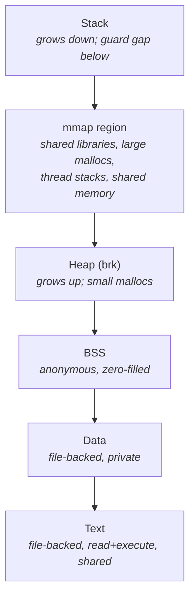
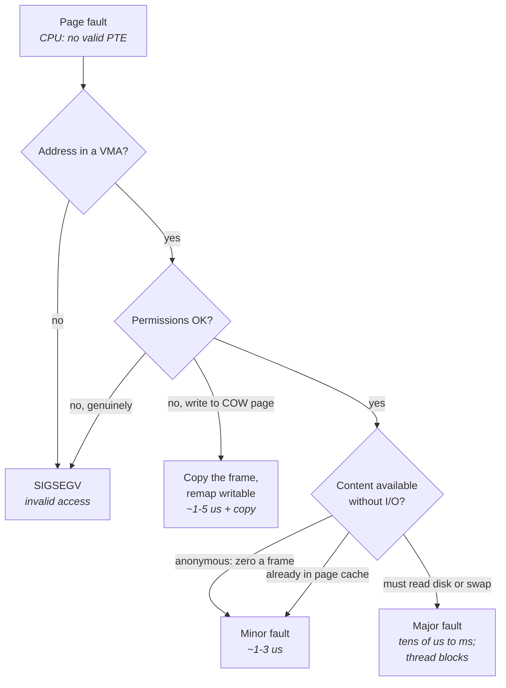
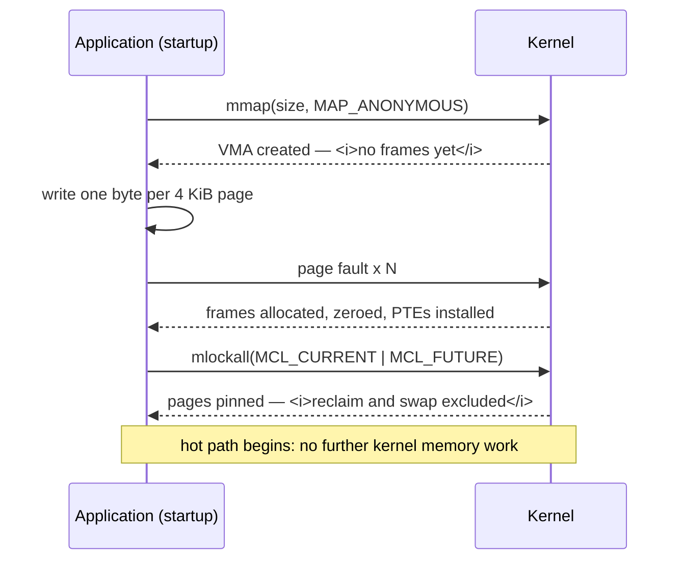
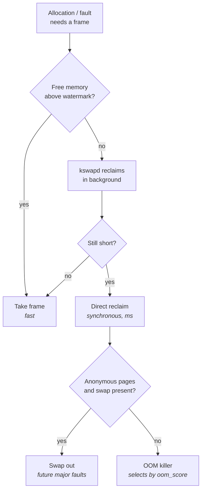
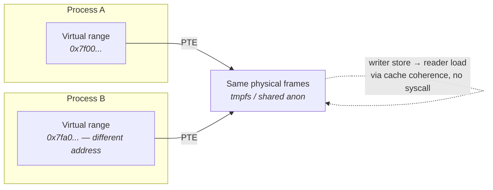

# Memory Management

The previous chapter left the kernel deciding *when* your thread runs. This one is about the kernel
deciding *whether the memory your thread just touched actually exists yet* — and what it does to you
while it works that out.

"Memory Systems" established the hardware: DRAM banks and row buffers, the page-table radix tree,
the TLB, huge pages, NUMA distance. All of that is machinery the CPU drives on its own. But every
one of those structures is *populated by the kernel*, on demand, according to policy, at moments the
kernel chooses. A page table entry exists because a fault handler installed it. A physical frame is
yours because an allocator handed it over, possibly after evicting something else, possibly after
compacting memory for several milliseconds first. The hardware costs from the earlier chapter are
the floor. The kernel's policies are where the tail comes from.

The gap between the two views is where most memory-related latency bugs live. An engineer reads that
DRAM latency is about 90 ns, measures 90 ns in a microbenchmark, and concludes memory is understood.
Then in production the same access occasionally takes 3 µs (a minor fault), or 40 µs (a page read
from a file), or 8 ms (a huge-page compaction stall), or 200 ms (a swap-in from a saturated disk).
None of those numbers appear anywhere in a DRAM datasheet. They are all kernel work — bookkeeping,
allocation, reclaim, and I/O — triggered by an ordinary load or store instruction that looks
identical to every other one in the disassembly. That is the defining property of this topic: **the
expensive path and the cheap path are the same instruction.** You cannot find it by reading code.
You find it by understanding which kernel policies your memory is subject to, and then arranging for
none of them to fire while the hot path runs.

The discipline that follows from this is simple to state and requires the rest of the chapter to
justify: a latency-critical process should reach steady state having done all of its memory work
already — every mapping established, every page faulted in, every page pinned in RAM — and should
then perform *no memory management operations of any kind* on the hot path. No `mmap`, no `munmap`,
no `brk`, no first touch of a new page, no allocator call that could reach the kernel, no fork. The
goal is not fast memory management. It is *zero* memory management.

## The Virtual Address Space Layout

You know the textbook picture: code at the bottom, then initialized and uninitialized data, then a
heap growing upward, a stack growing downward, and a gap between them. That picture is thirty years
out of date, and its inaccuracy matters — the real layout determines which of your allocations
become new kernel mappings, which reuse existing ones, and therefore which ones can stall.

The actual unit of the address space is the **virtual memory area**, or VMA: a contiguous range of
virtual addresses sharing a single set of properties — permissions (read/write/execute), backing
(anonymous memory, or a specific offset in a specific file), and sharing semantics (private or
shared). The kernel maintains a per-process set of VMAs, kept in a tree so it can find the one
containing a faulting address quickly. A VMA is *not* memory. It is a promise that addresses in this
range are legal and describes what should happen if you touch them. A process can have gigabytes of
VMAs and a few megabytes of actual physical memory, and this is the normal case.

Everything a process does to its address space is ultimately one of four operations on that set:
create a VMA (`mmap`), destroy one (`munmap`), change one's permissions (`mprotect`), or move one
(`mremap`). `brk`, the classic heap-growth call, is a special case that extends one particular
anonymous VMA. Each of these takes a per-process lock over the address space, modifies the tree, and —
critically — may require invalidating translations on other cores, which as "Memory Systems"
described means inter-processor interrupts and a synchronous wait for acknowledgements. Address
space modification is not a cheap local operation. It is a cross-core event.

A modern process layout looks like this, reading downward from the top of the canonical
lower half of the 48-bit address space:



The details that matter for latency work, none of which the textbook diagram shows:

- **The mmap region is where the interesting allocations live.** Shared libraries, thread stacks,
  anything the allocator requests in large chunks, and every shared-memory segment land here — not
  in the heap.
- **ASLR randomizes the base of each region** at exec time, which is why two runs of the same binary
  have different addresses; it also means physical-address-dependent effects like cache set
  conflicts can differ run to run (see "The Cache Hierarchy"). Disable it with
  `setarch -R` for reproducible benchmarking, never in production.
- **Guard regions are unmapped by design.** The gap below the stack exists so that stack overflow
  faults instead of silently corrupting the mmap region.
- **The kernel's own half of the address space is mapped in every process** — historically always
  present, which is what Meltdown exploited and what page-table isolation partially undid (see
  "Kernel Architecture and the Syscall Boundary").

The two files that expose all of this are `/proc/<pid>/maps` and `/proc/<pid>/smaps`. The first
lists every VMA with its range, permissions, backing file, and offset. The second repeats that and
adds, per VMA, the physical accounting you actually need: how much is resident, how much is shared
versus private, how much is dirty, whether it is locked, and which per-VMA flags are set.

| `smaps` field | Meaning | Why you care |
|---|---|---|
| `Size` | Virtual extent of the VMA | Reserved address space, not memory |
| `Rss` | Resident set — pages currently in RAM | The real memory cost right now |
| `Pss` | Proportional set size — shared pages divided by sharer count | The honest per-process attribution |
| `Private_Dirty` | Modified, unshared pages | Cannot be dropped; must be swapped or kept |
| `Shared_Clean` | Shared, unmodified — typically library text | Free to reclaim and re-read |
| `AnonHugePages` | Bytes backed by transparent huge pages | Confirms THP actually applied here |
| `Locked` | Bytes pinned by `mlock`/`mlockall` | Proof your pinning worked |
| `VmFlags` | Per-VMA flag letters (`rd`, `wr`, `lo` for locked, `hg`/`nh` for THP advice, `dd` for `MADV_DONTFORK`) | The requested policy for this range |

The distinction between `Size` and `Rss` is the one to internalize first. A process showing 40 GiB
of virtual size and 800 MiB resident is not leaking; it has reserved address space that has never
been touched. Address space is nearly free — it costs a VMA entry and some page-table structure.
Physical memory is the scarce resource. Confusing the two leads people to "fix" a nonexistent
problem while ignoring the resident growth that will actually get them killed by the OOM killer
later.

**Failure mode: a process with thousands of VMAs shows slow `mmap`, `munmap`, and fault handling.**
Symptom is that address-space operations get progressively more expensive over uptime, and fault
latency drifts upward. Cause is VMA-count growth — commonly from an allocator that maps and unmaps
many small regions, or from repeated `mprotect` on subranges splitting existing VMAs in two. Confirm
with `wc -l /proc/<pid>/maps` and by comparing against `sysctl vm.max_map_count` (default 65530); a
count in the tens of thousands is a defect, not a scale.

**Failure mode: resident memory is far larger than the sum of what the application thinks it
allocated.** Cause is usually the difference between what the allocator returned to the process and
what it returned to the kernel — freed memory that remains mapped and resident. Confirm by comparing
`VmRSS` in `/proc/<pid>/status` against the application's own accounting, then look at the anonymous
VMAs in `smaps` to see where the residency actually sits.

**Try it:** run `cat /proc/self/maps` and identify each region by its backing: the binary's text,
data, and BSS; the heap; every shared library; the stack; `[vvar]` and `[vdso]` (the kernel-provided
pages that make some syscalls into plain function calls — see "Kernel Architecture and the Syscall
Boundary"). Then run it twice more and note that the addresses move. Now run
`setarch -R cat /proc/self/maps` and note that they stop moving.

**Try it:** pick a long-running service and run
`grep -E '^(Rss|Pss|Private_Dirty|Locked|AnonHugePages):' /proc/<pid>/smaps | awk '{s[$1]+=$2} END {for (k in s) print k, s[k], "kB"}'`.
Compare the total `Rss` against `VmRSS` in `/proc/<pid>/status` — they should agree — and then
against `VmSize`. The ratio between virtual and resident is your first diagnostic reflex for any
memory question.

## Demand Paging and the Anatomy of a Fault

Here is the fact that surprises people who have only ever thought about memory as a resource you
request and receive: **allocating memory does not give you memory.** It gives you a VMA. The kernel
records that the range is legal, decides nothing about physical frames, and returns. The syscall
takes a microsecond or two at most regardless of size — mapping one page and mapping ten gigabytes
cost about the same, because neither one touches a physical frame.

The physical allocation happens later, on your first access, as a **page fault**. The CPU walks the
page table (see "Memory Systems"), finds no valid entry, and raises a fault. The kernel's handler
looks up the faulting address in the VMA tree, discovers the range is legal, decides what should
back it, obtains a physical frame, installs a page table entry, and returns to re-execute your
instruction. From the program's point of view nothing happened except that one particular load or
store took a couple of microseconds instead of a couple of nanoseconds.

Why does the kernel work this way rather than allocating up front? Because most programs reserve far
more than they touch. A process that maps a 1 GiB buffer and uses 20 MiB of it would otherwise force
the kernel to find and zero a gigabyte of frames it will never need. Deferring the work makes
allocation O(1) and keeps physical memory available for whoever actually uses it. This is
unambiguously the right default — for throughput. For a latency-critical hot path it is a trap,
because it converts a predictable startup cost into an unpredictable runtime cost paid on some
arbitrary instruction later.

The single most important classification is what the fault handler has to *do*, because the costs
differ by three orders of magnitude:



- **Minor fault** — no I/O required. The kernel takes a free frame, zeroes it if the mapping is
  anonymous (it must, or you would read another process's data), installs the PTE, and returns.
  Roughly 1–3 µs on a modern x86 server, dominated by the zeroing for a 4 KiB page and by the entry
  and exit overhead.
- **Major fault** — I/O required. The page's contents live in a file or in swap. The kernel issues
  the read and **blocks the thread**, which means a context switch out and back (see "Processes,
  Threads, and Scheduling"). Tens of microseconds against a fast NVMe device with no queueing;
  milliseconds against anything loaded; hundreds of milliseconds against a saturated disk.
- **Copy-on-write fault** — a write to a page that is mapped writable in the VMA but read-only in the
  page table because it is shared. The kernel allocates a frame, copies 4 KiB, and remaps. Covered
  in its own section below.

There are three counters you should be able to read without looking them up.
`/proc/<pid>/stat` fields 10 and 12 are the process's cumulative minor and major fault counts;
`ps -o min_flt,maj_flt -p <pid>` prints them readably. System-wide, `/proc/vmstat` has `pgfault` and
`pgmajfault`. And `perf` exposes them as software events, which is the only way to attribute a fault
to the instruction that caused it.

An important detail that changes the arithmetic: Linux does not always fault in exactly one page. For
file-backed mappings it performs **fault-around**, mapping a small cluster of already-cached
neighbouring pages in the same fault (16 pages by default on most configurations), which amortizes
the entry cost across several pages. For anonymous memory it does not — each 4 KiB page of a fresh
anonymous mapping faults individually unless the mapping is backed by a huge page, in which case one
fault covers 2 MiB. That asymmetry is why pre-faulting a large anonymous region page by page is
slower than you would guess from the per-fault cost, and why huge pages reduce not just TLB pressure
but *fault count* by a factor of 512.

**Failure mode: the first N iterations after startup are dramatically slower than steady state.**
Symptom is a latency distribution with a fat warm-up tail that disappears after a few thousand
events. Cause is minor faults on first touch of buffers allocated but never written. Confirm by
sampling `ps -o min_flt -p <pid>` during the slow phase and again after; if the count climbs by
roughly the number of pages in your buffers, that is it. The fix is pre-faulting, covered below.

**Failure mode: a single multi-millisecond outlier with no CPU time to account for it.** Symptom is
an event whose latency exceeds anything the code path can produce, with the thread showing no
on-CPU time during the gap. Cause is a major fault — the thread blocked on I/O inside what looked
like an ordinary memory access. Confirm with `ps -o maj_flt -p <pid>`: **any nonzero major fault
count on a latency-critical process after startup is a defect**, not a tuning opportunity.

**Failure mode: faults appear on a hot path that provably never allocates.** Cause is usually the
stack — a deeper-than-usual call path touching a stack page that has never been written — or a
lazily-resolved symbol touching a library page for the first time. Confirm by recording the faulting
addresses with `perf record -e page-faults --call-graph dwarf -p <pid>` and mapping them against
`/proc/<pid>/maps`.

**Try it:** watch demand paging happen. Run `perf stat -e page-faults,minor-faults,major-faults` on
any program that allocates a large buffer and writes one byte per 4 KiB. The minor fault count
should match the page count almost exactly. Then change the program to allocate with
`mmap(..., MAP_POPULATE)` — or simply write the whole buffer once before timing — and rerun; the
faults move out of the measured region entirely.

**Try it:** attribute faults to source. `perf record -e page-faults -p <pid> -- sleep 10` then
`perf report` gives you the call stacks that are faulting. On a warmed-up latency-critical process
this profile should be empty; on a typical service it will show the allocator, the logger, and
whatever just grew a buffer.

## The Page Cache

Every byte your process reads from a file passes through the **page cache** — the kernel's cache of
file contents, keyed by (file, offset), holding 4 KiB pages of file data in otherwise-free physical
memory. This is not an optimization layered on top of file I/O; on Linux it *is* file I/O. `read()`
copies out of it. `write()` copies into it and marks the page dirty for later writeback. `mmap` of a
file maps its pages directly into your address space, so a load instruction on a mapped file either
hits a cached page (minor fault, or no fault at all if already mapped) or triggers a read (major
fault).

The historical term **buffer cache** referred to a separate cache of raw block-device blocks, which
Linux maintained alongside the page cache until the two were unified in the 2.4 era. Today there is
one cache; the `Buffers` line in `/proc/meminfo` counts only block-device metadata (filesystem
structures, superblocks, and the like), while `Cached` counts file data. If you see documentation
treating them as two distinct subsystems, it predates the unification.

The reason a low-latency engineer must understand this is not that trading hot paths read files —
they mostly should not. It is that the page cache is **the kernel's primary consumer and reclaimer of
physical memory**, and its behavior determines whether a page you care about stays resident. The
kernel deliberately uses all otherwise-idle memory for the page cache, on the sound reasoning that
unused RAM is wasted RAM. That memory is reclaimable: when someone needs frames, the kernel drops
clean page-cache pages (free — the content is still on disk) or writes back dirty ones (not free —
it must issue I/O first). This means a batch job that reads a large file can, in the course of
filling the page cache, put the whole machine into reclaim, and reclaim is where latency goes to die.

The knobs that govern this are all about *when* dirty data is written back, and the failure mode
they cause is a synchronous stall in a process that never asked for I/O.

| Setting | What it controls | Latency relevance |
|---|---|---|
| `vm.dirty_background_ratio` / `_bytes` | Threshold at which background flusher threads start writing back | Keep low so writeback is continuous rather than bursty |
| `vm.dirty_ratio` / `_bytes` | Threshold at which a **writing process is blocked** until it writes back dirty pages itself | This is the one that stalls you; the ratio form scales with RAM, so on a large box the default is an enormous amount of dirty data |
| `vm.dirty_expire_centisecs` | Age at which dirty data becomes eligible for writeback | Bounds how stale data can be |
| `vm.vfs_cache_pressure` | Relative eagerness to reclaim directory and inode caches vs. page cache | Rarely the problem, occasionally is |
| `vm.min_free_kbytes` | Free memory the kernel tries to keep in reserve | Raising it makes allocation less likely to enter *direct* reclaim |

The distinction between **background reclaim** and **direct reclaim** is the one that matters. The
`kswapd` kernel thread reclaims asynchronously when free memory falls below a watermark — you do not
feel it directly, though it consumes CPU and causes TLB shootdowns. Direct reclaim happens when an
allocation cannot be satisfied *right now*: the allocating thread performs the reclaim itself,
synchronously, inside the page fault or the syscall. That means scanning page lists, possibly issuing
writeback, possibly waiting on it. Direct reclaim is measured in milliseconds and it lands on
whichever thread was unlucky enough to allocate at the wrong moment.

The relevant counters live in `/proc/vmstat`: `pgscan_direct` and `pgsteal_direct` count pages
scanned and reclaimed by direct reclaim, versus `pgscan_kswapd` and `pgsteal_kswapd` for the
background path. `allocstall_*` counts the number of times an allocation stalled in direct reclaim,
broken down by memory zone. A rising `allocstall_normal` on a latency-critical host is a direct
explanation for millisecond outliers.

**Failure mode: a logging or archival process makes an unrelated hot path jittery.** Symptom is that
p99.9 correlates with disk write volume from a completely different process. Cause is dirty page
accumulation crossing `vm.dirty_ratio`, or page-cache growth pushing the machine into reclaim.
Confirm by watching `Dirty` and `Writeback` in `/proc/meminfo` during the incident and
`allocstall_normal` in `/proc/vmstat` across it. Mitigation is lowering `vm.dirty_background_bytes`
so writeback is continuous, raising `vm.min_free_kbytes` so allocations have headroom, and using
direct I/O for bulk writes so they bypass the cache entirely (see "I/O Subsystems").

**Failure mode: latency degrades over hours as the page cache fills, with no application change.**
Cause is that free memory has been consumed by cached file data, so every allocation now requires
reclaim rather than taking a free frame. Confirm by comparing `MemFree` and `MemAvailable` in
`/proc/meminfo` — `MemAvailable` counts reclaimable cache as available, so a large gap between them
means most of your headroom is cache that must be reclaimed before it can be used.

**Try it:** watch the page cache work. Run `grep -E '^(MemFree|MemAvailable|Cached|Dirty|Writeback|Buffers):' /proc/meminfo`,
then `dd if=/dev/zero of=/tmp/testfile bs=1M count=4096` and run the grep again during and after.
`Dirty` spikes then drains as writeback proceeds; `Cached` grows by roughly the file size. Then run
`sync; echo 3 | sudo tee /proc/sys/vm/drop_caches` and watch `Cached` collapse. Never do this on a
production host — it discards useful cache and causes a reclaim storm — but doing it once on a test
box makes the accounting concrete.

**Try it:** distinguish reclaim paths. Record `pgscan_direct`, `pgscan_kswapd`, and `allocstall_normal`
from `/proc/vmstat`, run a memory-hungry workload that pushes the machine near full, and re-read
them. If `allocstall_normal` moved, some thread ate a synchronous reclaim stall — find out which one
before you find out in production.

## Allocators and Their Latency Profiles

An allocator sits between your program's request for *n* bytes and the kernel's page-granular,
syscall-mediated supply of memory. Its job is to make the common case never reach the kernel at all.
Understanding it as a systems component — a cache with a refill path, a free-list structure, and a
concurrency strategy — is what lets you predict its tail behavior, which is the only thing about it
that matters here.

Every user-space allocator has the same two-tier shape. The **fast path** satisfies a request from
memory it already owns: pop a block off a free list, adjust a pointer, return. Tens of nanoseconds,
no syscall, no lock if the free list is thread-local. The **slow path** runs when it has nothing
suitable: it must obtain more memory from the kernel via `brk` or `mmap`, or reorganize what it has
(coalescing free blocks, taking a global lock, migrating a chunk between threads). The slow path
costs microseconds — plus, since the memory it just obtained is fresh, a minor fault per page on
first touch. So the true cost distribution of an allocation is not a number; it is a bimodal
distribution whose second mode is a hundred times the first, with the mode you get determined by
allocator internal state you cannot see.

This is why the standing advice for hot paths is "don't allocate," and why that advice is so often
misunderstood. The problem is not that allocation is slow on average — a good allocator's fast path
is genuinely fast. The problem is that **you cannot predict which allocation takes the slow path**,
and a hot path's tail is defined by its worst case. A p50 of 30 ns and a p99.99 of 40 µs is a worse
outcome than a uniform 200 ns.

### The kernel side: buddy allocator and slab

Underneath everything is the kernel's own physical-page allocator, which hands out *physically
contiguous* blocks of pages in power-of-two sizes — orders 0 through 10, so 4 KiB through 4 MiB. This
is the **buddy allocator**: it splits larger blocks to satisfy smaller requests and merges free
buddies back together. `/proc/buddyinfo` shows, per NUMA node and zone, how many free blocks exist at
each order. Reading it left to right, the columns are order 0, 1, 2, and so on; a row with large
numbers on the left and zeros on the right means memory is **fragmented** — plenty of free pages, but
no contiguous runs. That is the state in which a 2 MiB huge page allocation (order 9) fails or
triggers compaction.

For objects smaller than a page — and the kernel allocates enormous numbers of them: `task_struct`,
`sk_buff` for every packet (see "The Linux Networking Stack"), dentries, inodes — the buddy allocator
is far too coarse. The **slab allocator** sits on top of it: it takes whole pages from the buddy
system and carves each into a cache of same-sized objects, keeping per-CPU free lists so that the
common allocation is a lock-free pop from a local list. `/proc/slabinfo` lists every such cache with
its object size, objects per slab, and current counts; `slabtop` presents the same data sorted by
size. Modern kernels use the SLUB implementation, which is what you will see in practice.

You do not tune the slab allocator. You read it, because slab growth is a common explanation for
"where did my memory go" when no process accounts for it, and because per-packet `sk_buff` churn
shows up there.

### The user-space allocators

Three matter in practice, and they differ mainly in how they avoid lock contention between threads
and in how eagerly they return memory to the kernel.

- **glibc malloc (ptmalloc2)** — the default. Uses multiple **arenas**, each with its own lock, to
  reduce contention; a thread is assigned an arena on first allocation. Small sizes are served from
  per-thread `tcache` bins (a genuine lock-free fast path added in glibc 2.26). Requests above
  `M_MMAP_THRESHOLD` (128 KiB by default, and *dynamically adjusted upward* as the program frees
  large blocks) go straight to `mmap` and are `munmap`ed on free — a syscall plus TLB shootdowns on
  every allocate/free cycle.
- **tcmalloc** — Google's. Per-thread (or per-CPU, in newer builds) caches over a central page heap,
  with size-class-based free lists. Designed for high allocation rates and low fast-path cost;
  historically less aggressive about returning memory to the OS, which is a latency *advantage*
  because returning memory means `madvise`/`munmap` and therefore shootdowns.
- **jemalloc** — originally FreeBSD's, widely used elsewhere. Arena-per-CPU-ish assignment plus
  thread caches, explicit size classes, strong emphasis on fragmentation control, and an extensive
  statistics interface. Its background purge threads return memory to the OS on a decay schedule,
  which is tunable — and on a latency-critical host you generally want that decay *disabled*, because
  purging is exactly the memory-map churn you are trying to avoid.

| Property | glibc malloc | tcmalloc | jemalloc |
|---|---|---|---|
| Fast path | `tcache` bin pop | Thread/per-CPU cache pop | Thread cache pop |
| Typical fast-path cost | ~20–50 ns | ~10–30 ns | ~15–40 ns |
| Contention strategy | Multiple locked arenas | Central heap behind thread caches | Multiple arenas + thread caches |
| Large allocations | Direct `mmap` above threshold | Page heap | Extent-based, size-class driven |
| Returns memory to OS | On `free` of mmap'd blocks; `malloc_trim` | Lazily / configurable | Background decay-based purge |
| Fragmentation behavior | Weakest of the three | Good | Best of the three, by design |
| Observability | `malloc_stats`, `mallinfo2` | Internal stats page | Rich `mallctl` statistics |

*Fast-path figures are order-of-magnitude for a modern x86 server with the object already in cache;
all three are dominated by cache misses on the free list, not by instruction count.*

The environment variables worth knowing for glibc, all readable via `man mallopt`: `MALLOC_ARENA_MAX`
caps arena count (relevant because the default scales with core count and each arena holds memory),
`MALLOC_MMAP_THRESHOLD_` pins the mmap threshold so it stops adjusting dynamically, and
`MALLOC_TRIM_THRESHOLD_` controls when the heap is shrunk back via `brk`. Pinning the mmap threshold
is a real fix for a real problem: the dynamic adjustment means a program's allocation behavior
changes over its lifetime in a way that is very hard to reason about.

**Failure mode: allocation latency is bimodal with a tail thousands of times the median.** Symptom is
a hot path whose p50 is fine and whose p99.99 shows microsecond spikes at allocation sites. Cause is
the allocator slow path — arena lock contention, a refill from the central heap, or an `mmap` for a
large block. Confirm with `ltrace`-style tracing or, better,
`perf trace -e 'syscalls:sys_enter_mmap,syscalls:sys_enter_brk,syscalls:sys_enter_munmap' -p <pid>`:
a steady-state hot path should produce **zero** of these.

**Failure mode: repeated allocate/free of a large buffer causes cross-core jitter.** Symptom is
latency spikes on isolated cores that run none of the offending code. Cause is that the buffer
exceeds `M_MMAP_THRESHOLD`, so each cycle is an `mmap`/`munmap` pair, and each `munmap` broadcasts
TLB shootdown IPIs machine-wide (see "Memory Systems"). Confirm by watching the `TLB` row of
`/proc/interrupts` and correlating with the allocation rate; fix by raising
`MALLOC_MMAP_THRESHOLD_` or, correctly, by reusing the buffer.

**Failure mode: resident memory grows without a leak.** Symptom is `VmRSS` climbing while the
application's own accounting stays flat. Cause is allocator fragmentation — free blocks exist but
none is the right size, so the allocator keeps requesting more. Confirm by dumping allocator
statistics (`malloc_stats` for glibc, the equivalent stats interface for jemalloc/tcmalloc) and
comparing bytes in use against bytes mapped.

**Try it:** measure your allocator's tail. Write a loop that allocates and frees a fixed-size block
several million times, timestamping each iteration with the TSC (see "Clocks, Timers, and Time") into
a pre-allocated array, then print the p50, p99, p99.9, and max. Repeat for sizes below and above
128 KiB. The distribution above the threshold will be visibly worse, and the max will be in
microseconds.

**Try it:** swap the allocator without recompiling. Run the same benchmark under
`LD_PRELOAD=/usr/lib/x86_64-linux-gnu/libtcmalloc.so.4` and again with jemalloc's shared object
(paths vary by distribution; find them with `ldconfig -p | grep -E 'tcmalloc|jemalloc'`). Compare the
tails, not the means. Then run `perf trace -e 'syscalls:sys_enter_mmap' -p <pid>` under each and see
how differently they talk to the kernel.

**Try it:** read the kernel's side. `sudo slabtop -o -s c` sorts slab caches by total size — note how
much memory network and filesystem object caches occupy. Then `cat /proc/buddyinfo` and read the
higher-order columns; on a freshly booted machine they are populated, and on a machine with weeks of
uptime they are often all zeros.

## Preallocation, Pre-Faulting, and Locking Memory

Everything to this point identifies the same enemy: kernel memory work happening at an unpredictable
moment. The remedy is to move all of it to startup, and it takes three distinct steps, each of which
addresses a different mechanism. Doing one or two and assuming you are done is the most common error
in this area, because each step is invisible when it is missing — the code runs correctly, just
occasionally slowly.

**Step one: preallocate.** Obtain all the address space you will ever need before entering the hot
path — buffers, queues, pools, object arenas. This eliminates allocator slow paths and `mmap` calls
from steady state. It also means you must know your maximum sizes in advance, which is a design
constraint, not an implementation detail: a system that can grow a buffer at runtime is a system that
can stall at runtime.

**Step two: pre-fault.** Preallocating alone does nothing about demand paging — you own address
space, not frames. Write to every page (a single byte per 4 KiB is sufficient for anonymous memory)
so the fault handler installs every PTE up front. Alternatively pass `MAP_POPULATE` to `mmap`, which
tells the kernel to populate the page tables at map time. Note the asymmetry: reading a fresh
anonymous page maps the shared **zero page** read-only rather than allocating a frame, so a read-only
pre-fault pass leaves you with a copy-on-write fault on the first real write. **The pre-fault must be
a write.**

**Step three: lock.** Even a fully faulted-in, fully resident process can have its pages taken back.
Under memory pressure the kernel may swap out anonymous pages or drop clean file-backed ones, and
the next touch becomes a major fault. `mlockall(MCL_CURRENT | MCL_FUTURE)` pins every current mapping
into RAM and every future one as it is created. `MCL_FUTURE` is what covers memory the process maps
after the call — without it, anything allocated later is unprotected. A third flag, `MCL_ONFAULT`,
locks pages as they are faulted in rather than populating everything immediately; it is useful for
large sparse mappings where full population would be wasteful, and it is the wrong choice for a hot
path, where you want the population *now*.



The diagram's ordering is the whole point: map, then touch, then lock. Locking before touching is
legal — `mlockall(MCL_CURRENT)` will itself populate the current mappings — but it does not cover
what you allocate afterwards unless `MCL_FUTURE` is set, and it does not solve the thread-stack case,
which is worth calling out separately. **Thread stacks fault in on demand like everything else.** A
thread whose call depth is usually shallow will fault the first time an unusual path pushes it
deeper, in the middle of steady state. The standard countermeasure is to recurse or touch down a
known depth at thread startup, after `mlockall`, so the stack pages are resident and locked.

Locking is subject to `RLIMIT_MEMLOCK`, the per-process limit on locked bytes (`ulimit -l`, or
`LimitMEMLOCK=` under systemd). On many distributions this defaults to a few megabytes, which is
enough for `mlockall` to fail on any real process; unprivileged processes need the limit raised, or
`CAP_IPC_LOCK`. Verify the result rather than assuming it: `VmLck` in `/proc/<pid>/status` reports
locked bytes, and the `Locked` field per VMA in `/proc/<pid>/smaps` shows which ranges are covered.

Two adjacent tools complete the picture. `madvise` communicates access-pattern intent to the kernel
for a range — `MADV_WILLNEED` starts readahead, `MADV_DONTNEED` discards pages (and on anonymous
memory means the next touch faults and returns zeroes, which is a way to *cause* the problem you are
avoiding), `MADV_HUGEPAGE` and `MADV_NOHUGEPAGE` set THP policy per range, and `MADV_DONTFORK`
excludes a range from a child's address space. And `memusage`, shipped with glibc, wraps a program
and reports its allocation histogram — useful for finding out how much a process actually allocates
before you try to preallocate it.

**Failure mode: `mlockall` silently does nothing.** Symptom is a process that still takes major
faults despite calling it. Cause is almost always a failed call whose return value was ignored,
because `RLIMIT_MEMLOCK` was too low. Confirm by reading `VmLck` in `/proc/<pid>/status`: if it is
`0 kB` after a successful `mlockall`, the call did not do what you think. Check `ulimit -l`.

**Failure mode: pre-faulting appeared to work but faults still occur on the first write.** Cause is a
read-only pre-fault pass, which mapped the shared zero page and left every page copy-on-write.
Confirm by counting minor faults across the first write pass — they will match the page count. Write
during pre-fault, always.

**Failure mode: a rare deep call path stalls.** Symptom is that an uncommon branch is
disproportionately slow the first time it runs, and never again. Cause is thread-stack pages faulting
in. Confirm with `perf record -e page-faults` and check whether the faulting addresses fall in the
stack VMA in `/proc/<pid>/maps`.

**Try it:** demonstrate all three steps. Allocate a 1 GiB anonymous mapping, then time (a) the
`mmap` call itself, (b) a full write pass over it, (c) a second write pass. The `mmap` is
microseconds regardless of size; the first pass costs roughly 262,144 minor faults; the second is
pure memory bandwidth. Now repeat with `MAP_POPULATE` and confirm the cost moves into the `mmap`
call.

**Try it:** verify pinning end to end. In a process that calls `mlockall(MCL_CURRENT | MCL_FUTURE)`,
read `VmLck` and `VmRSS` from `/proc/<pid>/status` — they should be close. Then allocate and touch
another large buffer and re-read: `VmLck` should grow too, proving `MCL_FUTURE` is in effect. Drop
`MCL_FUTURE` and repeat to see it not grow.

## Huge Pages as a Kernel Policy Problem

"Memory Systems" established *why* huge pages matter: TLB reach is entries multiplied by page size,
and with 4 KiB pages a modern server's reach is only a few megabytes, so a cache-resident working set
can still thrash translation. That is the hardware argument and it is settled. What that chapter did
not cover is the part that actually bites in production: **where a 2 MiB physically contiguous block
comes from, and what the kernel is willing to do to find one.**

A 2 MiB huge page requires 512 physically contiguous, properly aligned 4 KiB frames — an order-9
block from the buddy allocator. On a freshly booted machine these are plentiful. On a machine that
has been up for weeks, running mixed workloads, physical memory is fragmented: there are gigabytes
free, scattered across order-0 and order-1 blocks with nothing large left. `/proc/buddyinfo` shows
this directly. So the question "can I have a huge page" has a time-dependent answer, and the two ways
of asking it differ entirely in what happens when the answer is no.

With **transparent huge pages (THP)**, the kernel tries to give you huge pages automatically. When a
fault hits an eligible anonymous VMA, it attempts an order-9 allocation. If that fails, the
`defrag` setting decides the consequence. With `defrag=always`, the kernel synchronously **compacts**
memory — physically relocating pages to manufacture a contiguous region — while your thread waits
inside the page fault. That is a stall of milliseconds, at an unpredictable moment, triggered by
touching a new page. With `defrag=madvise` (the common default) only ranges that explicitly asked
via `madvise(MADV_HUGEPAGE)` can trigger synchronous compaction. With `defrag=defer` the kernel wakes
`kcompactd` to work in the background and gives you 4 KiB pages now. With `defrag=never` it falls
back immediately.

With **explicit huge pages (hugetlbfs)**, you reserve a fixed pool in advance and it is removed from
the normal allocator entirely. Nothing else can consume it, it is never reclaimed or swapped, and if
the pool is exhausted your mapping fails immediately and visibly rather than stalling. That
predictability is why it is the choice for latency-critical systems, and it is also why DPDK and
similar kernel-bypass frameworks require it (see "Kernel Bypass").

| Aspect | THP | hugetlbfs |
|---|---|---|
| Obtained by | Automatically, or via `madvise(MADV_HUGEPAGE)` | Mapping `/dev/hugepages` or `mmap(MAP_HUGETLB)` |
| Pool | None — allocated on demand | Reserved in advance, fixed size |
| On failure | Falls back to 4 KiB, possibly after synchronous compaction | Allocation fails immediately |
| Reclaimable / swappable | Yes | No — permanently pinned |
| Background activity | `khugepaged` collapses 4 KiB runs; `kcompactd` defragments | None |
| Sizes | 2 MiB (and PUD-size in some configurations) | 2 MiB and 1 GiB |
| Latency character | Good average, unbounded tail | Deterministic |

The reservation mechanics are the operational part. Huge pages are reserved either at boot via the
`hugepages=N` and `default_hugepagesz=` kernel command line parameters, or at runtime by writing to
`/sys/kernel/mm/hugepages/hugepages-2048kB/nr_hugepages` (and the `1048576kB` directory for 1 GiB
pages). **Reserve at boot.** Runtime reservation on a fragmented machine either fails partially — you
ask for 4096 and get 3200 — or succeeds only after the kernel compacts memory, which stalls whatever
else is running. At boot, memory is not yet fragmented, and 1 GiB pages in particular are effectively
boot-only in practice.

The counters to read are in `/proc/meminfo`: `HugePages_Total`, `HugePages_Free`, `HugePages_Rsvd`
(promised to a mapping but not yet faulted), `HugePages_Surp` (surplus, allocated beyond the
configured pool via `nr_overcommit_hugepages`), and `Hugepagesize`. Per-node accounting lives under
`/sys/devices/system/node/node*/hugepages/`. For THP, `AnonHugePages` in `/proc/meminfo` reports the
total, and the per-VMA `AnonHugePages` in `/proc/<pid>/smaps` tells you which of your mappings
actually got them — which is the only way to confirm THP applied rather than silently falling back.

The `khugepaged` daemon deserves specific mention because it is a jitter source that is easy to
overlook. It scans process address spaces looking for runs of 512 aligned 4 KiB pages it can collapse
into a huge page. Collapsing means allocating a huge page, copying 2 MiB, updating page tables, and
issuing TLB shootdowns — CPU consumption plus cross-core interrupts, on a schedule you do not
control. Its tunables are under `/sys/kernel/mm/transparent_hugepage/khugepaged/`, notably
`scan_sleep_millisecs` and `pages_to_scan`. On a host running THP in `madvise` mode with a
pre-faulted, locked process, there is very little for it to do; on a default host it runs
continuously.

**Failure mode: multi-millisecond stalls correlated with the process touching new memory.** Symptom
is enormous outliers that only appear when the heap grows. Cause is synchronous THP compaction.
Confirm by reading `/sys/kernel/mm/transparent_hugepage/defrag` — if it shows `[always]`, that is
very likely it — and by watching `compact_stall` and `compact_fail` in `/proc/vmstat` rise across the
incident.

**Failure mode: huge page reservation that worked at boot fails after uptime.** Symptom is that
writing to `nr_hugepages` returns fewer pages than requested. Cause is physical fragmentation.
Confirm with `/proc/buddyinfo`: the order-9 and above columns will be zero. The fix is boot-time
reservation via the kernel command line, not a runtime workaround.

**Failure mode: THP was enabled but the process gained nothing.** Cause is that the mapping was
ineligible — misaligned, too small, file-backed on a filesystem without large-folio support, or in a
range marked `MADV_NOHUGEPAGE`. Confirm with `grep -B12 AnonHugePages /proc/<pid>/smaps` and check
whether the VMAs you care about report nonzero, and whether `VmFlags` shows `nh`.

**Try it:** inspect current policy and reserve a pool. Read
`cat /sys/kernel/mm/transparent_hugepage/enabled` and `.../defrag` — the bracketed entry is active.
Then reserve explicit pages with
`echo 512 | sudo tee /sys/kernel/mm/hugepages/hugepages-2048kB/nr_hugepages` and check
`grep Huge /proc/meminfo`. On a machine with uptime, try requesting a large number and observe that
you get fewer than you asked for — that is fragmentation, made visible.

**Try it:** confirm whether a running process is actually using huge pages.
`grep AnonHugePages /proc/<pid>/smaps | grep -v '0 kB'` lists only the VMAs that got them. Compare
against `grep AnonHugePages /proc/meminfo` for the system total. A process you *believed* was using
THP and that reports nothing here has been silently falling back the whole time.

## Swap, Overcommit, and the OOM Killer

Three separate mechanisms with one shared consequence: the kernel promises more memory than it has,
and eventually has to make good on that. Each of them can turn a memory access into a multi-
millisecond event or a process into a corpse, and all three should be configured — not left at
defaults — on a latency-critical host.

**Overcommit** is the policy that allows a process to map more memory than the system could
physically provide. It exists because demand paging makes it usually harmless: programs reserve far
more than they touch, and refusing reservations that will never be used would waste most of the
machine. `vm.overcommit_memory` selects the policy: `0` is a heuristic mode that refuses only
obviously absurd requests, `1` never refuses anything, and `2` enforces a strict limit — total
commitments may not exceed swap plus `vm.overcommit_ratio` percent of RAM (or the absolute value in
`vm.overcommit_kbytes`). Mode 2 makes the failure happen at `mmap` time, where it is a checkable
error return, rather than at fault time, where it is fatal. The counters `CommitLimit` and
`Committed_AS` in `/proc/meminfo` show the enforced ceiling and the current total commitment.

**Swap** is the mechanism by which anonymous pages — those with no file backing, so nowhere else to
go — are written to a swap device to free their frames. When touched again, they must be read back:
a major fault, blocking the thread, costing tens of microseconds against fast NVMe and orders of
magnitude more against anything else or anything queued. `vm.swappiness` (0–200 on modern kernels)
biases reclaim between evicting anonymous pages and evicting page cache; setting it to 0 does not
disable swap, it merely makes the kernel avoid anonymous eviction until it is nearly out of options.
For a latency-critical host the answer is not tuning but **elimination**: no swap device at all
(`swapoff -a`, and no swap entry in `/etc/fstab`), plus `mlockall` so that even a misconfigured host
cannot swap your pages. A trading process that swaps has already failed; the only question is whether
it fails visibly or as a mysterious 300 ms outlier.

**The OOM killer** is what happens when overcommit's promise comes due and there is no memory left
and nothing left to reclaim. The kernel selects a process and kills it. Selection is driven by a
score, visible per process in `/proc/<pid>/oom_score`, which is roughly proportional to resident
memory and adjustable via `/proc/<pid>/oom_score_adj` (range −1000 to 1000, where −1000 makes a
process effectively exempt). The kill is logged to the kernel ring buffer — `dmesg` will show
`Out of memory: Killed process ...` along with a table of every process's memory usage at the moment
of the decision, which is the single most useful artifact for post-mortem analysis.



The diagram makes the design decision explicit: **removing swap does not remove the pressure, it
changes the failure mode from slow to fatal.** That is the correct trade for a trading host. A
process that dies is detected immediately by health checks and failed over (see "Reliability and
Failure Handling"); a process that swaps produces intermittent outliers that take weeks to diagnose.
Make the failure loud.

| Knob | Recommended for a latency host | Reasoning |
|---|---|---|
| `vm.swappiness` | `0` (or irrelevant with no swap device) | Avoid anonymous eviction entirely |
| swap device | None — `swapoff -a` | Major faults are unacceptable |
| `vm.overcommit_memory` | `2` with a tuned ratio, if capacity is well understood | Fail at `mmap`, not at fault time |
| `vm.min_free_kbytes` | Raised well above default | Keeps a reserve so allocations avoid direct reclaim |
| `oom_score_adj` for the hot-path process | Strongly negative | Kill the logger or the monitoring agent first |
| `vm.panic_on_oom` | Consider `1` in some designs | Whole-host failover can be cleaner than partial degradation |

Two further considerations. First, **cgroup memory limits produce the same effects at a smaller
scope**: a container hitting its `memory.max` enters reclaim and then OOM within its own cgroup,
regardless of how much free memory the host has. On a containerized trading host, `memory.max`
combined with a memory-hungry sidecar produces reclaim stalls that look identical to host-level
pressure but are invisible in `/proc/meminfo`. Check `memory.events` in the cgroup for `max` and
`oom` counts. Second, if you use overcommit mode 2, you must account for the fact that `mlockall`
with `MCL_FUTURE` interacts with it: every future mapping is charged and pinned, so a process that
maps large sparse regions may fail allocations that would previously have succeeded harmlessly.

**Failure mode: intermittent hundreds-of-milliseconds outliers with no CPU time.** Symptom is a
process apparently frozen for a long interval with no on-CPU samples. Cause is swap-in. Confirm with
`ps -o maj_flt -p <pid>` and with `pswpin`/`pswpout` in `/proc/vmstat`; `SwapCached` and `SwapFree`
in `/proc/meminfo` corroborate. Any nonzero `pswpin` on a trading host is a configuration defect.

**Failure mode: a process disappears with no core dump and no application log entry.** Cause is the
OOM killer. Confirm with `dmesg -T | grep -i -E 'out of memory|oom-kill'` or
`journalctl -k --since '1 hour ago' | grep -i oom`. The accompanying process table shows which
process was actually consuming the memory, which is frequently not the one that got killed.

**Failure mode: a container stalls while the host shows abundant free memory.** Cause is a cgroup
memory limit driving in-cgroup reclaim. Confirm by reading `memory.current`, `memory.max`, and
`memory.events` in the process's cgroup directory under `/sys/fs/cgroup/`, and by checking
`memory.stat` for the reclaim counters (see "Processes, Threads, and Scheduling" for cgroup basics).

**Try it:** read your machine's commitment. `grep -E '^(CommitLimit|Committed_AS|MemTotal|SwapTotal|SwapFree):' /proc/meminfo`
and compare `Committed_AS` against `MemTotal`. On a typical server `Committed_AS` exceeds physical
memory considerably — that is overcommit, quantified.

**Try it:** provoke the OOM killer deliberately, on a disposable VM only. Run a process that
allocates and *touches* memory in a loop until it dies, then read `dmesg` for the kill record and its
process table. Repeat with `oom_score_adj` set to `-1000` on a second, larger process and confirm the
killer chooses differently.

## Shared Memory, `mmap`, and Anonymous Mappings

`mmap` is the single interface behind almost everything in this chapter: allocating large blocks,
loading shared libraries, mapping files, and establishing shared memory between processes. It has
exactly two orthogonal dimensions, and the four combinations they produce have genuinely different
semantics. Getting these four straight is worth more than memorizing any flag list.

The first dimension is **backing**: file-backed or anonymous. A file-backed mapping's pages come from
the page cache for a specific file at a specific offset; an anonymous mapping's pages are supplied
zeroed by the kernel and have no persistent home. The second dimension is **sharing**: `MAP_SHARED`
or `MAP_PRIVATE`. Shared means writes are visible to every other mapper of the same underlying
object; private means writes are copy-on-write, invisible to others and discarded when the mapping
goes away.

| | `MAP_PRIVATE` | `MAP_SHARED` |
|---|---|---|
| **File-backed** | Program text and data; writes are private and never reach the file | Memory-mapped file I/O; writes go to the page cache and are eventually written back |
| **Anonymous** | Ordinary process memory — heap, thread stacks, big allocations | Shared memory between related processes; the basis of `/dev/shm` and POSIX shared memory |

For inter-process communication on a low-latency host, the combination that matters is
**shared anonymous**, obtained in one of two equivalent ways: `mmap` with
`MAP_SHARED | MAP_ANONYMOUS` (inherited across `fork`, so only useful between related processes), or
`shm_open` on a name followed by `ftruncate` and `mmap` with `MAP_SHARED` — which is file-backed in
form, but the file lives in `/dev/shm`, a `tmpfs` filesystem that is itself just page cache with no
backing store. That is why POSIX shared memory has the performance of anonymous memory with the
naming of a file: `/dev/shm/whatever` is a real path you can `ls`, `stat`, and `rm`, but its pages
never touch a disk.

The latency-relevant property of shared memory is that **there is no copy on the data path at all.**
Once both processes have the region mapped, one writes and the other reads the same physical frames.
There is no syscall, no kernel involvement, no `sk_buff`, no context switch — writer and reader
communicate at the speed of the cache coherence protocol (see "Multicore, Coherence, and Memory
Ordering"). A shared-memory handoff between two cores on the same socket costs roughly the price of a
cache line transfer, tens of nanoseconds, versus several microseconds for a pipe or a loopback
socket. This is why every serious low-latency inter-process transport is a ring buffer in shared
memory (the queue structure itself is covered in "Synchronization and IPC").



The diagram highlights the detail that trips people up: **the two processes almost certainly map the
region at different virtual addresses.** Any pointer stored inside the shared region is meaningless
to the other process. Shared-memory data structures must use offsets from the base of the region, not
pointers — or the region must be mapped at a fixed address in both processes with `MAP_FIXED`, which
is fragile and interacts badly with ASLR.

Practical concerns for shared mappings on a latency host:

- **Size the `tmpfs`.** `/dev/shm` defaults to half of physical RAM. It is page cache, so its pages
  count against memory and are reclaimable unless locked — `mlockall` covers them like anything else.
- **`MAP_HUGETLB` combines with `MAP_SHARED`** to place a shared region in explicit huge pages,
  which is standard for large ring buffers; alternatively mount hugetlbfs and create a file there.
- **`MAP_LOCKED` locks at map time**, but it is subtly weaker than `mlock` after mapping because it
  does not guarantee the population succeeded; prefer explicit `mlockall` and verify with `VmLck`.
- **`MAP_NORESERVE`** skips overcommit accounting for the mapping — relevant only under
  `vm.overcommit_memory=2`, and generally the wrong choice there since it reintroduces the
  fault-time failure you chose mode 2 to avoid.
- **Unmapping is a cross-core event.** `munmap` of a shared region triggers TLB shootdowns on every
  core with a stale translation. Map once at startup, never unmap.

**Failure mode: two processes agree on a shared region but the reader sees garbage pointers.** Cause
is absolute pointers stored in shared memory, interpreted at a different base address in the reader.
Confirm by comparing the mapping's start address in each process's `/proc/<pid>/maps`. Fix by storing
offsets.

**Failure mode: shared-memory throughput is fine but latency has a periodic spike.** Cause may be
that the `tmpfs` pages were reclaimed and re-faulted, or that the region spans NUMA nodes because it
was first-touched by a thread on the wrong node (see "Memory Systems" on first-touch policy). Confirm
with `Locked` in `/proc/<pid>/smaps` for the region and `numastat -p <pid>` for its node placement.

**Failure mode: `/dev/shm` files survive a crashed process and leak memory.** Symptom is memory
consumed with no owning process. Cause is that POSIX shared memory objects are kernel-persistent
until explicitly unlinked. Confirm with `ls -la /dev/shm` and `df -h /dev/shm`; clean up with
`rm`.

**Try it:** watch shared memory appear in the accounting. Create a region with
`dd if=/dev/zero of=/dev/shm/test bs=1M count=512`, then check `Shmem` in `/proc/meminfo` and
`df -h /dev/shm`. Note that `MemFree` dropped even though no process has it mapped. Remove the file
and watch the memory return.

**Try it:** map the same file from two processes and confirm the addresses differ. Run
`grep test /proc/<pid>/maps` for each and compare the ranges. Then check that both show the same
`Rss` in `smaps` and that `Pss` is half of it — that is the proportional accounting working.

## Copy-on-Write and `fork`

`fork` creates a child process that is a duplicate of its parent, including its entire address space.
The naive implementation copies every page, which for a process with a 20 GiB heap would take
seconds. Since the overwhelmingly common use of `fork` is an immediate `exec` that discards the whole
address space, this would be almost pure waste.

**Copy-on-write (COW)** is the mechanism that avoids it. At `fork`, the kernel copies only the page
tables, not the pages, and marks every private writable PTE **read-only in both parent and child**
while leaving the VMA marked writable. Both processes now point at the same physical frames. Reads
proceed at full speed. A write, however, hits a permission mismatch and faults; the fault handler
notices that the VMA permits writing and the page is COW, allocates a fresh frame, copies 4 KiB into
it, remaps the writing process's PTE to the new frame, and returns. The cost is a minor fault plus a
4 KiB copy, roughly 1–5 µs on a modern x86 server — paid *per page*, and paid by whichever process
writes, which is frequently the parent.

That last point is the whole story for latency work. A latency-critical parent process that forks —
to run a shell command, to spawn a helper, to collect diagnostics — does not merely pay for the
`fork` itself. It converts **every writable page it owns** into a page that will fault on next write.
The next pass over its own working set is a storm of COW faults on the hot path, occurring after the
`fork` returned and looking, from the application's perspective, like an unexplained slowdown of
ordinary code.

```mermaid
sequenceDiagram
    participant P as Parent
    participant K as Kernel
    participant C as Child
    P->>K: fork()
    K->>K: copy page tables; mark all private<br/>writable PTEs read-only in both
    K-->>C: child created, sharing frames
    K-->>P: returns
    P->>K: store to a shared page → protection fault
    K->>K: allocate frame, copy 4 KiB, remap writable
    K-->>P: resumes <i>~1-5 us later</i>
    Note over P,C: repeat for every page the parent writes
```

The `fork` call itself is not free either, and its cost scales with the size of the address space,
because page tables must be copied. A process with a large, densely-mapped heap can spend
milliseconds inside `fork` purely duplicating page-table structure — and it holds the address-space
lock while doing so, blocking other threads in the same process that touch memory.

The mitigations, in order of preference:

- **Do not fork from the latency-critical process at all.** Fork a small helper process at startup,
  before the main process grows, and have it perform any later process creation on request over a
  pipe or shared-memory channel. This is the standard architecture and it eliminates the problem
  rather than reducing it.
- **Use `posix_spawn` or `vfork`+`exec` when you must create a process.** `posix_spawn` uses
  `clone(CLONE_VM|CLONE_VFORK)` under the hood on glibc, which avoids duplicating the address space
  entirely — no page-table copy, no COW marking.
- **Mark large regions `MADV_DONTFORK`.** This excludes a range from the child's address space
  entirely, so it is neither page-table-copied nor COW-marked. It appears as `dd` in the `VmFlags`
  line of `/proc/<pid>/smaps`. Appropriate for large data buffers the child has no business seeing.
- **Note that huge pages amplify the copy.** A COW fault on a 2 MiB THP page copies 2 MiB, not 4 KiB
  — hundreds of microseconds. The kernel may instead split the huge page into 4 KiB pages, which is
  cheaper for the fault but loses the TLB benefit. Either outcome is bad on a hot path.
- **`mlockall` does not prevent COW.** Locking guarantees residency, not exclusivity. A locked page
  that is shared after `fork` still faults on the next write.

One related mechanism worth naming since it uses the same machinery: **kernel same-page merging
(KSM)** scans memory for identical pages and merges them into one COW-shared copy to save memory. It
is opt-in per process via `madvise(MADV_MERGEABLE)` and controlled under `/sys/kernel/mm/ksm/`. It
trades CPU and unpredictable COW faults for memory savings, which is exactly the wrong trade on a
trading host — confirm it is off by reading `/sys/kernel/mm/ksm/run`.

**Failure mode: latency degrades for a period after every fork, then recovers.** Symptom is a burst
of slow iterations following any process creation, decaying over the next sweep of the working set.
Cause is COW faults in the parent. Confirm by sampling `ps -o min_flt -p <pid>` immediately before
and after a fork; the delta will approximate the number of pages the parent has since written.

**Failure mode: `fork` itself takes milliseconds.** Symptom is a syscall that "should be fast"
dominating a diagnostic path. Cause is page-table duplication proportional to mapped memory, made
worse by a large `VmSize`. Confirm by timing `fork` against processes with different `VmSize` values
in `/proc/<pid>/status`, and by tracing with
`perf trace -e 'syscalls:sys_enter_clone,syscalls:sys_exit_clone' -p <pid>`.

**Failure mode: a child process holds a huge resident set it never uses.** Cause is that the child
inherited every mapping and is being charged proportionally as it touches them. Confirm with
`Pss` per VMA in the child's `smaps`; fix with `MADV_DONTFORK` on the large regions before forking.

**Try it:** measure COW directly. In a parent that has allocated and touched a large buffer, record
`min_flt` from `/proc/self/stat`, `fork` a child that immediately sleeps, then have the parent write
one byte to every page of the buffer and re-read `min_flt`. The delta equals the page count — every
one of those was a COW fault. Repeat without the fork and the delta is zero.

**Try it:** compare process-creation paths. Time `fork`+`exec` against `posix_spawn` from a process
that has touched several gigabytes, using `perf trace -e 'syscalls:sys_enter_clone'` to see which
clone flags each uses. The difference grows with the size of the parent's address space, which is the
point.

## Numbers to Know

| Quantity | Value | Notes |
|---|---|---|
| Allocator fast path | ~15–50 ns | Thread-cache hit; dominated by free-list cache misses |
| Allocator slow path (refill) | ~1 µs | Central heap or arena lock |
| Allocator slow path (`mmap`) | Several µs + faults | Above `M_MMAP_THRESHOLD` (128 KiB glibc default) |
| `mmap` / `munmap` syscall | ~1–5 µs | Plus TLB shootdown IPIs on `munmap` |
| Minor page fault | ~1–3 µs | Frame allocation, zeroing, PTE install |
| Copy-on-write fault (4 KiB) | ~1–5 µs | Fault plus the copy |
| Copy-on-write fault (2 MiB THP) | ~100s of µs | Copying 2 MiB, or a huge-page split |
| Major page fault, fast NVMe | ~50–100 µs | Idle device; far worse under queueing |
| Major page fault, swap under pressure | Milliseconds to 100s of ms | Never acceptable on a hot path |
| Direct reclaim stall | ~1–10 ms | Synchronous, on the allocating thread |
| THP synchronous compaction | Up to several ms | Why `defrag=always` is dangerous |
| Buddy allocator orders | 0–10 (4 KiB – 4 MiB) | `/proc/buddyinfo` columns |
| Huge page order | 9 (512 contiguous 4 KiB frames) | The block that fragmentation destroys |
| Fault-around window, file-backed | 16 pages typical | Anonymous memory gets no equivalent |
| `vm.max_map_count` default | 65530 | Ceiling on VMAs per process |
| `/dev/shm` default size | Half of physical RAM | `tmpfs`, counted in `Shmem` |
| Shared-memory handoff, same socket | Tens of ns | Cache line transfer, no syscall |
| Pipe or loopback socket handoff | Several µs | Two syscalls plus a copy |

*Order-of-magnitude figures for a modern x86 server (Skylake-and-later class) running a mainline
Linux kernel. Fault and syscall costs vary with kernel version, mitigation settings, and CPU
generation — measure them on your own hardware.*

## Key Takeaways

- Allocation gives you address space, not memory; physical frames arrive later, during a page fault,
  on an ordinary instruction that looks like every other one.
- The `/proc/<pid>` triad is the diagnostic core: `maps` for what is mapped, `smaps` for what is
  resident, shared, dirty, and locked, `status` for the totals including `VmLck`.
- Minor faults cost microseconds and major faults cost milliseconds; any nonzero `maj_flt` on a warm
  latency-critical process is a defect, not a tuning target.
- The page cache is the kernel's main memory consumer, and direct reclaim — reclaim performed
  synchronously inside your allocation — is a millisecond stall on whichever thread allocated first.
- Every allocator is bimodal: a tens-of-nanoseconds thread-cache fast path and a microsecond slow
  path that reaches the kernel, and you cannot predict which one a given call takes.
- Freeing large blocks can be worse than allocating them, because `munmap` broadcasts TLB shootdown
  IPIs to cores that never ran your code.
- Preallocate, pre-fault with *writes*, then `mlockall(MCL_CURRENT | MCL_FUTURE)` — all three, in
  that order, with the result verified by reading `VmLck`.
- Thread stacks demand-page like anything else, so a rarely-taken deep call path faults the first
  time it runs unless you touch the stack down at startup.
- Explicit huge pages reserved at boot are deterministic; THP with `defrag=always` can compact
  memory synchronously inside a page fault for several milliseconds.
- Remove swap rather than tuning `vm.swappiness`, and set `oom_score_adj` so the OOM killer takes a
  helper process instead of the hot path — a loud failure beats a slow one.
- Shared memory is the only zero-copy, zero-syscall inter-process path; store offsets rather than
  pointers, because the two processes map it at different addresses.
- `fork` marks the parent's entire writable address space copy-on-write, so the parent pays a fault
  and a page copy on its next write to every page — fork a helper at startup instead.
