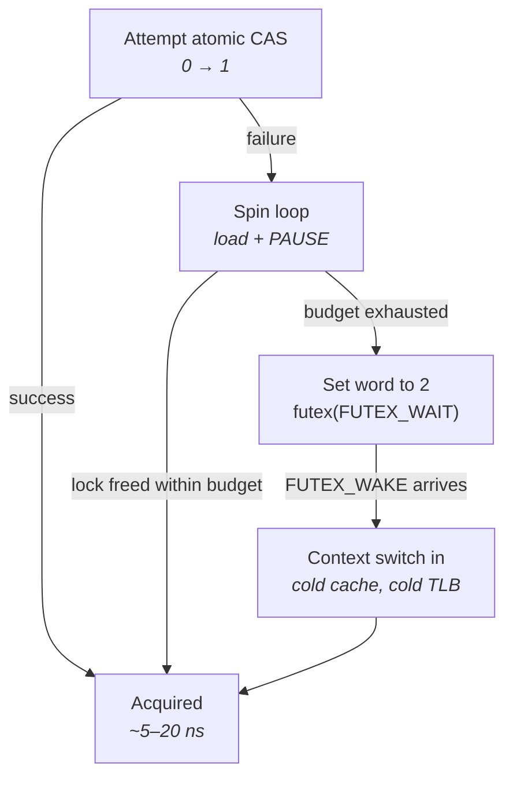
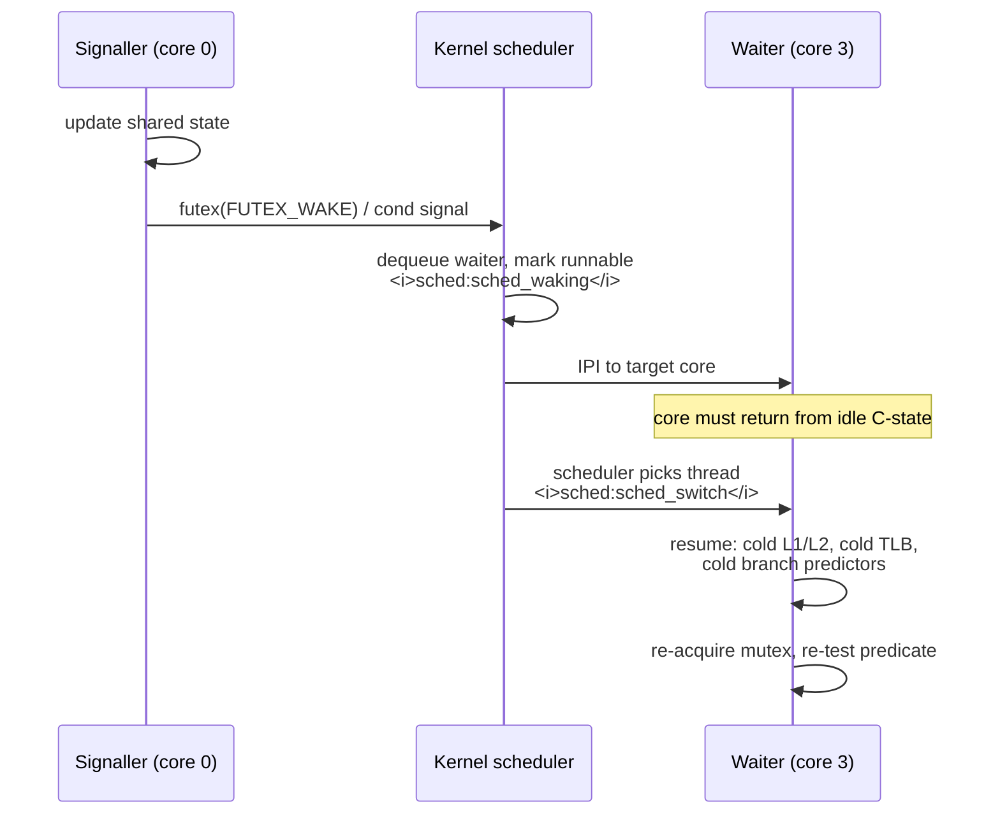
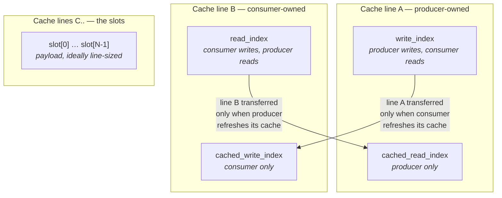
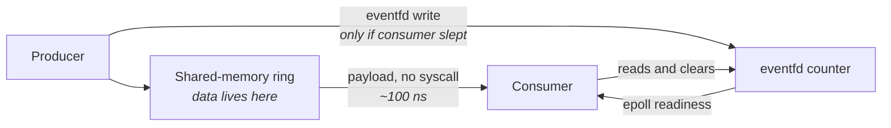
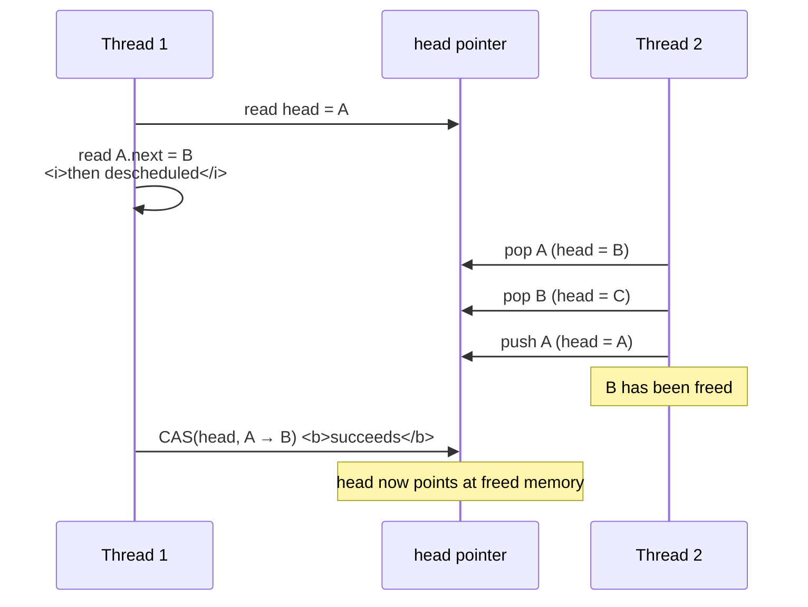
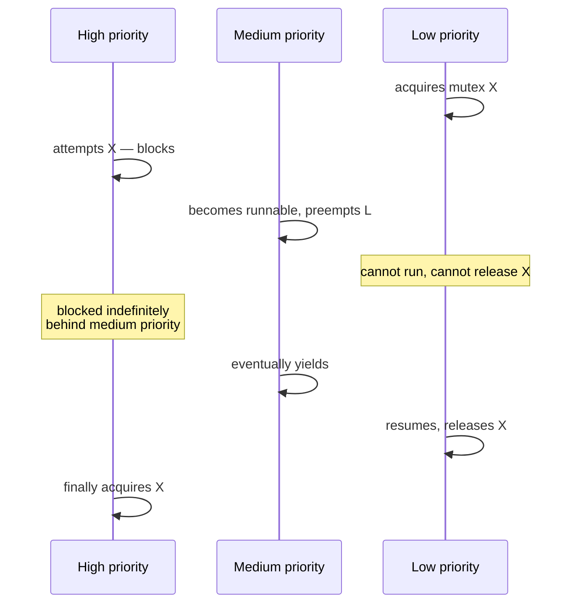

# Synchronization and IPC

You have used a mutex. You know it makes a critical section safe, and you probably know that
"blocking is expensive." What that sentence hides is a factor of a thousand. An uncontended mutex
acquisition on a modern x86 server is a single atomic instruction on a cache line you already own —
somewhere around twenty nanoseconds, entirely in user space, no kernel involvement at all. The same
call, when another core holds the lock and you go to sleep, costs two system calls, a scheduler
decision, a context switch out, an inter-processor interrupt, a context switch back, and a cold
cache on the other side. Several microseconds if the machine is quiet; tens of microseconds if it is
not. Same line of code. Three or four orders of magnitude apart, decided by whether someone else
happened to be inside at that moment.

That bimodality is the entire subject of this chapter. Synchronization on a latency-critical path is
not primarily about correctness — you already know how to write correct concurrent code — it is
about *which path you took*, how often you take the slow one, and what the distribution of outcomes
looks like when you do. A mutex whose median cost is 20 ns and whose p99.9 is 40 µs is not a "fast"
primitive; it is a primitive with a two-thousand-fold tail, and on a hot path the tail is the number
that matters (see "What 'Low Latency' Actually Means"). Everything that follows — futexes, adaptive
spinning, condition variables, lock-free queues, shared-memory rings — is a different answer to the
same question: how do you coordinate two threads of execution without ever handing control to the
scheduler?

There is a second thread running through this chapter, and it comes from hardware rather than from
the kernel. Two threads that coordinate must share memory, and shared memory on a multicore machine
means a cache line moving between cores. Every lock acquisition, every atomic increment, every
producer-index update is a coherence transaction: a line is invalidated in one core's cache and
acquired in exclusive state by another (see "Multicore, Coherence, and Memory Ordering"). That
transfer costs tens of nanoseconds and cannot be avoided by any software cleverness — it is the
irreducible physical price of communication between cores. A "lock-free" algorithm does not escape
it. What good synchronization design does is minimize *how many* lines move, *how far* they move,
and *how often* the same line ping-pongs. We will keep coming back to that accounting.

## Mutexes, Futexes, and the Fast/Slow Path

Start with the naive implementation of a mutex, the one an operating systems course presents. The
lock is a kernel object. Locking it is a system call; the kernel checks whether it is held, and if so
puts the calling thread on a wait queue and schedules something else. Unlocking is another system
call, which pulls a thread off the wait queue and makes it runnable.

This is correct and it is disastrously slow, because it pays the kernel on *every* operation. A
system call on a modern x86 server, with speculative-execution mitigations enabled, costs somewhere
between 200 ns and 1 µs round trip (see "Kernel Architecture and the Syscall Boundary"). Most
critical sections in real programs are shorter than that, and most acquisitions are uncontended —
nobody else is inside, there is nothing to arbitrate, and the kernel is being consulted to be told
"yes, it's free." The overwhelmingly common case pays the price of the rare case.

The insight that fixes this is that **the kernel is only needed when a thread actually has to wait.**
Everything else can be done with an atomic instruction on a word of ordinary user-space memory. That
word is called a **futex** — "fast userspace mutex" — and it is the foundation of essentially every
synchronization primitive on Linux: mutexes, condition variables, semaphores, read-write locks,
barriers, and thread joins are all built on it.

A futex is nothing more than a 32-bit aligned integer in memory that both parties can see, plus a
system call, `futex(2)`, that lets a thread say "put me to sleep on this address" or "wake somebody
sleeping on this address." The kernel attaches no meaning to the value. The protocol — what counts as
locked, what counts as contended — lives entirely in user space, in the C library.

### The three-state protocol

The classic glibc mutex encodes three states in that word, and the third state is the whole trick:

| Value | Meaning | Unlock behavior |
|---|---|---|
| `0` | Unlocked | — |
| `1` | Locked, **no** waiters known | Store 0. **No syscall.** |
| `2` | Locked, at least one waiter | Store 0, then `FUTEX_WAKE`. One syscall. |

Locking attempts an atomic compare-and-swap from 0 to 1. If it succeeds, the lock is yours and no
system call happened. If it fails, the lock is held, so the thread sets the word to 2 — recording
"there is a waiter" — and calls `futex(uaddr, FUTEX_WAIT, 2, ...)`.

Unlocking is the mirror image, and it is where the design earns its keep. The unlocker atomically
exchanges the word for 0 and inspects the old value. If it was 1, nobody was waiting, so it returns
immediately — an uncontended unlock costs one atomic instruction and *zero* system calls. Only if the
old value was 2 does it call `FUTEX_WAKE` to release someone.

```mermaid
sequenceDiagram
    participant A as Thread A (holder)
    participant M as Futex word<br/><i>user memory</i>
    participant K as Kernel<br/><i>futex hash bucket</i>
    participant B as Thread B
    A->>M: CAS 0→1 succeeds
    Note over A: fast path, ~20 ns, no syscall
    B->>M: CAS 0→1 fails; XCHG →2
    B->>K: futex(FUTEX_WAIT, expect 2)
    K->>M: re-read: still 2?
    K->>B: enqueue on bucket, deschedule
    A->>M: XCHG →0, old value was 2
    A->>K: futex(FUTEX_WAKE, 1)
    K->>B: make runnable (IPI to B's core)
    B->>M: retries CAS, acquires
```

The diagram makes the asymmetry visible: the top two lines are the entire cost of the common case,
and everything below the `FUTEX_WAIT` is the slow path.

Two details in that sequence are load-bearing and are the usual interview target.

**The kernel re-reads the futex word before sleeping, and that is what closes the lost-wakeup race.**
Between the moment thread B decides to sleep and the moment it actually sleeps, thread A might
release the lock and issue a wake that finds an empty queue. B would then sleep forever. `FUTEX_WAIT`
prevents this by taking the value B *expected* as an argument: the kernel acquires the internal
bucket lock, re-reads the user-space word, and only enqueues the thread if the word still equals the
expected value. If it changed, the call returns `EAGAIN` immediately and B retries in user space. The
compare and the enqueue happen atomically with respect to a concurrent wake.

**The kernel-side wait queue is a hash table, not a per-lock object.** There is no kernel object
allocated for your mutex — that is why a futex costs no memory beyond its 32-bit word and why you can
put one in shared memory between unrelated processes. When a thread sleeps, the kernel derives a
*key* from the address, hashes it into a global table of buckets, and links the thread onto that
bucket's list. Two unrelated futexes can therefore hash to the same bucket and contend on that
bucket's internal spinlock. On a machine with very many contended futexes this is a real, if second
order, effect.

### Private versus shared futexes

How the key is derived depends on whether the futex is used within one process or across processes,
and the difference is not free.

- **Private** (`FUTEX_WAIT_PRIVATE`, `FUTEX_WAKE_PRIVATE`) — the key is the memory-map pointer plus
  the virtual address. Cheap to compute, no page lookup required. This is the default for an ordinary
  process-local mutex.
- **Shared** — the futex may live in a mapping shared between processes at *different* virtual
  addresses, so the key must identify the underlying physical page: the kernel resolves the address
  to its backing inode and offset (or the anonymous-memory identity). That requires walking the
  memory map and pinning the page, which is meaningfully more work per call.

A mutex only gets the shared key if it was created with the process-shared attribute
(`pthread_mutexattr_setpshared` with `PTHREAD_PROCESS_SHARED`). Marking a mutex process-shared when
it does not need to be makes every slow-path call more expensive for no benefit.

### What the fast path actually costs in hardware

"One atomic instruction" is not one number. On x86-64 the compare-and-swap is `LOCK CMPXCHG`, and its
cost is dominated not by the instruction itself but by the state of the cache line holding the futex
word (see "Multicore, Coherence, and Memory Ordering").

| Situation | Approximate cost | Why |
|---|---|---|
| Line already exclusive in this core's L1 | ~15–25 cycles (~5–8 ns) | No coherence traffic; the LOCK prefix still serializes the store buffer |
| Line last written by another core, same socket | ~40–80 ns | Line must be invalidated there and transferred here |
| Line last written on the other socket | ~100–200 ns | Transfer crosses the inter-socket interconnect |
| Line shared with a hot unrelated variable (false sharing) | Same as above, on *every* operation | The line bounces even when the lock is uncontended |

*Order-of-magnitude figures for a modern x86 server, Skylake-and-later class.*

The last row is worth dwelling on because it catches people who believe their lock is uncontended.
If the mutex word sits in the same 64-byte cache line as a counter that another thread increments,
every acquisition pays a full coherence miss even though no thread ever blocks. The lock statistics
look perfect and the latency is terrible. Aligning contended synchronization words to their own cache
line is not micro-optimization; it is the difference between 8 ns and 80 ns (see "The Cache
Hierarchy").

**Failure mode: a mutex that "is never contended" costs 100 ns per acquisition.** Symptom is a hot
path whose profile shows time in the lock function with no measurable blocking and no context
switches. Cause is false sharing — the futex word shares a cache line with data another core writes.
Confirm with `perf c2c record` / `perf c2c report`, which attributes cache-line contention to
specific offsets within a line; the mutex word will appear as an HITM (hit-modified) hotspot
alongside the neighbouring variable.

**Failure mode: latency spikes correlate exactly with lock acquisitions from a second process.**
Symptom is a bimodal distribution with a mode in the microseconds. Cause is the slow path being taken
— the thread genuinely slept. Confirm by reading `voluntary_ctxt_switches` in
`/proc/<pid>/status` before and after a measurement window: voluntary switches are the ones where a
thread gave up the CPU because it blocked, which for a busy hot-path thread should be essentially
zero. A rising count is proof that your threads are sleeping.

**Try it:** watch the fast path stay out of the kernel. Write a program with two threads that lock
and unlock a shared mutex in a tight loop, and count futex calls with
`perf stat -e syscalls:sys_enter_futex ./prog`. Then run the same program with the two threads pinned
so they cannot overlap, or with the critical section made trivially short, and compare. You will see
the futex call count collapse toward zero as contention drops, while the number of lock operations is
unchanged. The lock is not "fast" or "slow" — the contention rate is what selects the path.

**Try it:** see the operation breakdown directly. Run
`bpftrace -e 'tracepoint:syscalls:sys_enter_futex { @[args->op] = count(); }' -c ./prog`
and read off which futex operations your workload actually issues. Waits and wakes appearing in
roughly equal numbers means genuine blocking; a large excess of waits returning quickly usually means
`EAGAIN` retries from a hot race.

**Try it:** measure the slow path end to end. `perf trace -e futex ./prog` prints each futex call with
its duration. Look at the distribution of `FUTEX_WAIT` durations — that is your blocking time, and it
includes everything from the enqueue through the wakeup and the return to user space.

## Spinlocks, Adaptive Locks, and Reader-Writer Locks

If sleeping costs microseconds and the critical section is a hundred nanoseconds long, sleeping is
absurd. You will spend a thousand times longer arranging to wait than the wait would have taken. The
obvious alternative is to not wait at all in the operating-system sense: keep the thread on the CPU
and re-test the lock word in a loop until it becomes free. That is a **spinlock**.

The trade is stark and there is no universally right answer. Spinning burns a core doing nothing, but
it eliminates the syscall, the scheduler, and the context switch, and — often more importantly — it
leaves your caches, TLB entries, and branch predictor state intact, so the code *after* the lock runs
at full speed instead of faulting its way back to warmth. Blocking releases the CPU for other work
but pays that entire reconstruction cost on the way back. The crossover point is roughly the cost of
a context switch pair: if the expected wait is shorter than a couple of microseconds, spinning wins;
if it is longer, spinning is pure waste.

The naive spin loop, though, is worse than it looks. If every waiter hammers the lock word with an
atomic read-modify-write, each attempt demands the line in exclusive state, so the line is torn back
and forth between cores at maximum rate. That coherence storm slows down the *holder* too — the
thread trying to finish its critical section and release the lock is competing for the same line.
Contention actively lengthens the critical section it is waiting on.

The standard mitigations are, in order of importance:

- **Test, then test-and-set.** Spin on a plain load until the lock looks free, and only then attempt
  the atomic. A plain load can be satisfied from a shared copy of the line, so all waiters can spin in
  their own caches without generating any traffic. Traffic only appears at the moment of release.
- **Issue `PAUSE` in the spin body.** This x86 instruction is a hint to the core that it is in a
  spin-wait loop: it de-pipelines the loop to avoid a memory-order-violation flush on exit, and yields
  execution resources to the SMT sibling. Its latency is generation-dependent — historically around 10
  cycles, raised to roughly 140 cycles on some server generations (Skylake-SP class), and reduced again
  on later parts. That variation is large enough to change spin-loop tuning across hardware, so treat
  it as something to measure, not assume.
- **Back off.** Increase the delay between attempts as the wait lengthens, reducing the rate of
  coherence transactions.
- **Cap the spin.** An unbounded spin is a correctness hazard, not just a waste, for reasons covered
  under priority inversion below.

### Adaptive locks

The pragmatic answer is to do both: spin for a bounded number of iterations on the assumption that
the holder will release shortly, and fall back to the futex path if it does not. This is an
**adaptive mutex**, exposed by glibc as the `PTHREAD_MUTEX_ADAPTIVE_NP` mutex type, and it is what
most well-tuned systems use when they must use a lock at all.



The two exits from the spin box are the entire design question: the spin budget decides how much CPU
you are willing to burn to avoid the bottom-right path. The right budget is roughly "the time it takes
to enter and leave the kernel," because below that threshold spinning is free relative to the
alternative.

A crucial qualification: **spinning is only sane if the lock holder is running on a different core.**
If the holder has been descheduled — or worse, if the spinner is on the same core as the holder and
has a higher priority — spinning cannot make progress and simply burns the holder's opportunity to
run. Kernel spinlocks avoid this by disabling preemption while held; user-space code has no such
guarantee. This is why an unbounded user-space spinlock on a machine with more runnable threads than
cores is a latency bug waiting to happen, and why hot-path spinning is paired with thread pinning and
core isolation (see "Processes, Threads, and Scheduling").

### Reader-writer locks

The motivation for a reader-writer lock is intuitive: many threads reading a structure do not
conflict, so let them in concurrently and only exclude when someone writes. For a read-mostly
structure this looks like an obvious win over a plain mutex.

At nanosecond resolution it usually is not, and the reason is coherence rather than logic. A
reader-writer lock has to *count* concurrent readers, which means every reader performs an atomic
increment on acquire and an atomic decrement on release — on a single shared word. Ten readers on ten
cores are not proceeding independently; they are serializing on the ownership of one cache line,
twice each. The lock word bounces exactly as hard as a mutex would, and the reader path now costs two
atomics instead of one. Unless the critical section is long enough that genuine reader parallelism
dominates, the read-write lock is slower than the mutex it replaced.

There is also a fairness question with no free answer, and it shows up as a tail-latency problem:

| Policy | Behavior | Consequence |
|---|---|---|
| **Reader-preferring** | New readers may enter while a writer waits | Writers can be starved indefinitely under sustained read load |
| **Writer-preferring** | New readers block once a writer is queued | Read latency spikes whenever any write arrives |
| **Task-fair / queued** | Arrivals served in order | Bounded waits both ways, at the cost of more bookkeeping per operation |

glibc exposes the choice through `pthread_rwlockattr_setkind_np`, with variants that prefer readers
or prefer writers. The default on Linux is reader-preferring, which is precisely the policy with an
unbounded writer tail.

For the read-mostly case that motivated the reader-writer lock in the first place, a **seqlock** is
usually the better structure and is worth understanding because it appears throughout the Linux
kernel (it is how `gettimeofday` reads clock state without a lock; see "Clocks, Timers, and Time").
The scheme is:

- **A sequence counter guards the data.** The writer increments it to an odd value before writing and
  to an even value after — odd means "a write is in progress."
- **Readers never write anything.** A reader records the counter, reads the data, re-reads the
  counter, and retries if the two readings differ or the first was odd.
- **Readers therefore generate no coherence traffic at all** in the common case: the counter line and
  the data lines stay in shared state across every reading core simultaneously.
- **The cost is paid by writers and by retries.** Writers are exclusive with each other and must
  serialize, and a reader can be forced to retry an unbounded number of times under a heavy write
  rate.
- **The data must be safe to read while torn.** A reader may observe a half-written structure before
  it detects the mismatch and discards it, so the payload cannot contain pointers the reader will
  dereference or anything else where a torn value is dangerous.

**Failure mode: adding a reader-writer lock made a read-heavy path slower.** Symptom is throughput and
latency both regressing after "optimizing" a mutex into a shared lock. Cause is two atomics per read
on a single bouncing cache line replacing one. Confirm with `perf c2c`, which will show the rwlock's
counter as the top contended line, and by comparing `perf stat -e cache-misses` or the machine's HITM
event between the two versions.

**Failure mode: writer latency has an enormous tail under read load.** Symptom is p50 writer latency
in microseconds and p99.9 in milliseconds, with read latency unchanged. Cause is reader preference
starving the writer. Confirm by instrumenting the writer's own acquire duration and correlating with
reader arrival rate; switching the lock kind to writer-preferring should move the tail from the writer
to the readers, which confirms the diagnosis even if it is not the fix you want.

**Failure mode: a spinning thread and the lock holder are on the same physical core.** Symptom is a
hang or an enormous stall that disappears when the spinner is pinned elsewhere. Cause is that the
spinner occupies the core the holder needs, or its SMT sibling, starving it. Confirm by checking
thread-to-core placement with `ps -o pid,tid,psr,comm -L -p <pid>` and comparing against the sibling
map in `/sys/devices/system/cpu/cpu*/topology/thread_siblings_list`.

**Try it:** quantify the coherence cost of shared counting. Build a benchmark with N threads
acquiring and releasing a reader-writer lock in read mode with an empty critical section, and plot
throughput per thread against N from 1 to the core count. It will fall, not stay flat, because the
"parallel" readers are serializing on one line. Repeat with each thread incrementing a private,
cache-line-padded counter instead and confirm the curve stays flat.

**Try it:** find your machine's spin-versus-block crossover. Time a lock handoff between two pinned
threads with a critical section you vary from 10 ns up to 100 µs, once with a plain mutex and once
with `PTHREAD_MUTEX_ADAPTIVE_NP`, recording `voluntary_ctxt_switches` from `/proc/<pid>/status` in
each run. The point where the adaptive version stops avoiding context switches is your crossover, and
it is a number worth writing down for that hardware.

## Condition Variables and Wakeup Latency

A lock answers "may I touch this?" A condition variable answers a different question: "has something
happened yet?" The distinction matters because the second question implies *waiting for an event that
another thread will produce*, and that is inherently a scheduler interaction. A thread that has
nothing to do until data arrives either burns a core checking, or gives up the CPU and accepts the
cost of being woken.

The mechanism is familiar: a waiter holds a mutex, tests a predicate, and if it is false calls a wait
operation that atomically releases the mutex and blocks. A signaller changes the state, then signals.
The atomicity of "release and block" is essential — if there were a window between the two, the
signaller could squeeze in, change the state, signal an empty queue, and leave the waiter asleep
forever. Underneath, this is implemented with a futex: the condition variable holds its own internal
sequence counter, and the wait operation reads that counter, unlocks the mutex, and calls
`FUTEX_WAIT` on the counter with the value it read. The kernel's compare-then-enqueue is once again
what makes the handoff race-free.

What an undergraduate course omits is what the *wakeup* actually costs, and it is much more than a
system call. Making a thread runnable is not making it run.



Each stage in that sequence contributes:

- **The wake syscall itself** — a few hundred nanoseconds, plus the futex hash bucket lock.
- **The cross-core IPI** — the target core must be interrupted to notice it has work; roughly a
  microsecond, and it is why a wakeup on the *same* core is faster than a wakeup across cores, and a
  wakeup across sockets slower still.
- **C-state exit.** If the target core went idle, it may be in a deep power state, and coming back
  can take tens to hundreds of microseconds depending on the state reached. This is frequently the
  single largest term and it is entirely invisible in application-level profiling (see "Clocks,
  Timers, and Time" and "Tuning a Linux Box for Determinism").
- **Scheduler latency.** Being runnable is not being on-CPU. If the target core is busy with another
  runnable thread, the woken thread waits for the scheduler to choose it, which under the default
  scheduling class can be a millisecond or more.
- **Cache and TLB reconstruction.** The thread's working set may have been evicted while it slept. The
  first few thousand instructions after resuming run against cold caches, cold TLB entries, and cold
  branch predictors, which is a real cost that no counter labels as "wakeup."

Add these up and a "signal to running" latency of 5–20 µs on a quiet, tuned machine and 50–500 µs on
an untuned one is entirely normal. Compare that to the tens of nanoseconds a spinning consumer would
have taken to notice the same state change, and the reason hot paths do not use condition variables
becomes arithmetic rather than dogma.

### Signal, broadcast, and the thundering herd

Two further behaviors matter operationally.

**Spurious wakeups are permitted, so the predicate must always be re-tested in a loop.** This is not
a defensive-programming nicety: a waiter can be woken by a signal intended for another waiter, by an
interrupted system call, or by the requeue machinery described below. Testing the predicate once and
proceeding is a genuine bug.

**Broadcast wakes every waiter, and they immediately collide on the mutex.** If ten threads are
waiting and the state change only allows one to proceed, a broadcast makes ten threads runnable, ten
context switches happen, nine threads re-acquire the mutex, re-test the predicate, find it false, and
go back to sleep. That is the **thundering herd**: N wakeups of work to accomplish one thread's worth
of progress, and every one of those threads perturbs a core.

Linux provides `FUTEX_CMP_REQUEUE` specifically to blunt this. Rather than waking all waiters onto
the condition variable's futex, the kernel wakes one and *moves* the rest directly onto the mutex's
wait queue, so they sleep until the mutex is genuinely free instead of waking to immediately block
again. glibc's condition variable implementation uses this. It reduces the damage but does not
eliminate the fundamental point: broadcasting is a decision to pay N wakeups.

| Operation | Threads made runnable | When it is right |
|---|---|---|
| Signal | 1 | Any waiter can consume the event; the common case |
| Broadcast | All | State change invalidates every waiter's predicate, e.g. shutdown or reconfiguration |
| Broadcast with requeue | 1 running, rest moved to the mutex queue | What the library does for you; reduces mutex collisions, not wakeup count |

**Failure mode: p99 latency is measured in hundreds of microseconds and the profile shows no CPU
time.** Symptom is a gap in the timeline where nothing executed. Cause is off-CPU wait — the thread
was blocked and the wakeup path was slow. Confirm with off-CPU analysis: the BCC tool `offcputime`
(or a `bpftrace` script on `sched:sched_switch` and `sched:sched_wakeup`) gives you the blocked
duration with the stack that blocked, which on-CPU profilers structurally cannot show.

**Failure mode: wakeup latency is far worse when the machine is lightly loaded.** This inverts the
usual intuition and is a strong diagnostic signal. Cause is C-state exit: an idle core sinks into a
deep sleep state, and a lightly loaded machine has idle cores. Confirm by reading
`/sys/devices/system/cpu/cpu<N>/cpuidle/state*/name` and the corresponding `usage` and `time`
counters before and after a run, and by re-testing with idle states limited (for example by holding
`/dev/cpu_dpm_qos` style latency QoS open, or with the `idle=poll` boot parameter on a machine you
are willing to run hot).

**Try it:** measure signal-to-running latency directly. Have a signaller take a timestamp with the
cycle counter, then signal; have the waiter timestamp immediately on waking, and record the
difference into a preallocated array. Run it once with both threads pinned to sibling cores of the
same physical core, once to different cores on the same socket, and once across sockets. The three
distributions differ by the IPI and interconnect costs described above, and the shape of the tail is
your scheduler's contribution.

**Try it:** watch the scheduler side of a wakeup.
`perf record -e sched:sched_waking,sched:sched_switch -a -- sleep 5` followed by `perf script` shows,
for each wakeup, the waking core, the target core, and the gap until the target actually switched to
the woken thread. That gap is scheduler latency and it is the term most people forget exists.

## Lock-Free and Wait-Free: Concepts and Hazards

"Lock-free" is one of the most misused terms in systems engineering. It does not mean fast, and it
does not mean "without atomics" — lock-free algorithms are typically *built* from atomics and pay the
same cache-line transfer costs as a lock does. It is a **progress guarantee**, and the guarantees form
a hierarchy:

| Property | Guarantee | What it rules out |
|---|---|---|
| **Blocking** (a lock) | None. If the holder stops, everyone stops. | Nothing |
| **Obstruction-free** | A thread running in isolation finishes in bounded steps | Deadlock (but not livelock) |
| **Lock-free** | *Some* thread makes progress in bounded steps, system-wide | Deadlock and livelock; individual starvation still possible |
| **Wait-free** | *Every* thread completes in a bounded number of its own steps | All of the above, plus starvation — the only bounded-tail guarantee |

The distinction that matters for latency is the last row. Lock-free guarantees the *system* advances;
it says nothing about *you*. A lock-free algorithm built on a retry loop — read a value, compute a new
one, compare-and-swap, retry on failure — can starve one particular thread arbitrarily long under
contention, because every retry is another thread's success. If your p99.9 is the target, "some thread
progresses" is not the property you wanted. Wait-free algorithms bound each thread's own step count
and are the ones with genuinely bounded tails, but they are markedly harder to construct and often
carry higher constant costs.

The engineering reason to reach for lock-free structures on a latency-critical path is narrower and
more practical than the theory suggests: **a thread that never blocks cannot be descheduled while
holding exclusive access to shared state.** That eliminates a specific and nasty failure mode — the
holder being preempted, or page-faulting, or being interrupted, while every other participant waits.
It also eliminates the futex slow path entirely, so the worst case is bounded by hardware contention
rather than by the scheduler.

What lock-free does *not* eliminate:

- **Cache-line transfer.** Every successful compare-and-swap on a shared word is an exclusive
  ownership acquisition — 40–80 ns within a socket, more across sockets. A lock-free queue with a
  single shared tail pointer has exactly the same coherence bottleneck as a mutex protecting that
  pointer.
- **Retry storms.** Under high contention, most compare-and-swap attempts fail. Each failure consumed
  a line transfer and produced nothing. Throughput can fall as thread count rises — the same
  characteristic curve as a contended spinlock.
- **Memory ordering obligations.** Publication order still has to be enforced against the hardware
  and the compiler. On x86's total-store-order model most of this is free at the hardware level but
  never free at the compiler level; on weakly ordered architectures explicit fences are required and
  they cost. The model itself is Chapter 6's material (see "Multicore, Coherence, and Memory
  Ordering"); what belongs here is the consequence, that a "fence-free" claim about an algorithm is
  architecture-specific, not universal.
- **Memory reclamation.** This is the big one, and it gets its own section below. Removing a node from
  a lock-free structure does not tell you when it is safe to free it.

**Failure mode: a lock-free queue's throughput falls as producers are added.** Symptom is a curve that
peaks at two or three threads and then declines. Cause is compare-and-swap retry failure — the shared
index line is transferred once per attempt, and most attempts fail. Confirm by instrumenting the retry
count per operation, and with `perf c2c` showing the index line as the dominant HITM source. The
structural fix is to remove the shared point of contention (per-producer queues, or the single-
producer design in the next section), not to tune the retry loop.

**Failure mode: correct on x86, broken on ARM.** Symptom is a lock-free structure that passes every
test on the development machine and corrupts data on a different architecture. Cause is relying on
x86's store ordering rather than requesting the ordering explicitly. There is no runtime tool that
confirms this; it is found by review and by running under a memory-model-aware checker on a weakly
ordered machine.

**Try it:** demonstrate the retry storm. Build a shared counter incremented by a compare-and-swap
retry loop, and separately by an atomic fetch-and-add. Scale both from 1 to the core count and plot
operations per second. Fetch-and-add degrades gracefully because the hardware performs it
unconditionally in one transaction; the compare-and-swap loop collapses because failed attempts still
move the line. The gap is the cost of speculation-and-retry as a coordination strategy.

## SPSC Ring Buffers and Shared-Memory Transports

Every technique so far has been about arbitrating between threads that might both want the same
thing. The fastest synchronization is the kind you can prove is unnecessary. If exactly one thread
writes a queue and exactly one thread reads it, there is no arbitration to perform — no thread ever
has to wait for permission, only for data. This is the **single-producer, single-consumer (SPSC) ring
buffer**, and it is the default inter-thread and inter-process transport on latency-critical paths.

The structure is a fixed-size array of slots plus two indices. The producer owns the write index; the
consumer owns the read index. Each reads the other's index but never writes it. The queue is empty
when the two are equal and full when advancing the write index would make them equal — so a
power-of-two capacity lets you replace a modulo with a bitwise mask, and you deliberately sacrifice
one slot rather than carry a separate count that both sides would have to update.

Correctness rests on one ordering requirement, and it is the only subtle thing in the whole design:
**the slot must be fully written before the index that publishes it becomes visible.** If the index
update were reordered ahead of the payload write, the consumer could read the index, conclude the slot
is valid, and read garbage. This is a store-release on the producer side and a load-acquire on the
consumer side. On x86 the hardware already provides that ordering for ordinary stores and loads, so
the requirement costs nothing at the machine level — but it must still be expressed so the compiler
does not reorder the writes, and on a weakly ordered architecture the hardware fence is real (see
"Multicore, Coherence, and Memory Ordering").

### Cache-line layout is the design

The performance of an SPSC ring is decided almost entirely by which variables share cache lines, and
getting this wrong costs a factor of five. Consider the naive layout: a structure containing the write
index, then the read index, then the buffer pointer. The two indices land in the same 64-byte line.
Now every producer index update invalidates that line in the consumer's cache, and every consumer
index update invalidates it in the producer's — even though neither ever touches the other's variable.
The line ping-pongs on every single operation. This is false sharing (see "The Cache Hierarchy"), and
in an SPSC ring it is the difference between a working design and a broken one.



The two extra variables in that diagram are the second half of the optimization, and they are what
separate a competent ring from a naive one. A producer needs to know whether the queue is full, which
means comparing against the consumer's index — a remote line read, tens of nanoseconds, on every push.
Instead the producer keeps a *private cached copy* of the read index and only re-reads the real one
when its cached value says the queue is full. If the queue is typically not full, the producer touches
the consumer's line approximately never. The consumer does the mirror-image thing for emptiness. The
result is that a stream of pushes and pops generates almost no cross-core traffic on the index lines
at all; the only lines moving are the slots themselves, which is irreducible because that is the data.

The rules that follow:

- **Pad each index to its own cache line**, together with the private cached copy of the other side's
  index. Two variables that are always written by the same core belong together; two written by
  different cores must not share a line.
- **Cache the opposite index and refresh it lazily.** Re-read the remote index only when the cached
  value indicates the queue is empty or full.
- **Size slots to whole cache lines** where the payload allows. A slot that straddles a line boundary
  costs two transfers instead of one and can create incidental sharing between adjacent slots.
- **Use a power-of-two capacity** so index wrapping is a mask. Let indices grow monotonically and mask
  only at access time, which makes full-versus-empty unambiguous without a spare-slot convention.
- **Batch the index update.** A producer writing several slots can publish them with one index store,
  amortizing the single unavoidable coherence transaction over multiple messages — at the cost of
  delaying the first message until the batch completes, which is a latency-versus-throughput decision
  to make deliberately (see "Systematic Optimization").
- **Decide the full-queue policy explicitly.** Spin, drop, or overwrite. There is no blocking option
  worth having on a hot path, and "block" is how a slow consumer turns into a producer-side stall.

### How the consumer waits

An empty queue still poses the fundamental question of this chapter: does the consumer spin or sleep?
On a hot path the answer is to spin, on a core dedicated to that thread and isolated from the
scheduler, so that the handoff latency is one cache-line transfer — 40–80 ns within a socket — rather
than a wakeup. That is why busy-polling and core isolation are prerequisites for this design rather
than optional extras (see "Processes, Threads, and Scheduling").

Where you cannot afford a dedicated core, the usual compromise is a staged wait: spin for a bounded
interval, then spin with `PAUSE`, then yield, then block on a futex or an eventfd with a flag in
shared memory recording whether the producer needs to issue a wake. The flag is what keeps the
producer's cost near zero when the consumer is spinning — the producer only pays for a wake when the
consumer has actually gone to sleep.

**Failure mode: an SPSC ring performs no better than a mutex-protected queue.** Symptom is per-message
cost in the hundreds of nanoseconds with no blocking. Cause is almost always false sharing of the two
indices, or a slot size that straddles cache lines. Confirm with `perf c2c report`, which shows the
contended cache line and the byte offsets within it — you will see the two index offsets in the same
line. The fix is padding, and the improvement is usually dramatic.

**Failure mode: latency rises sharply when the queue is near-full or near-empty.** Symptom is a
bimodal per-message cost that correlates with queue occupancy. Cause is the cached-index refresh: at
the boundary, every operation re-reads the remote index, so you pay a coherence miss per message
instead of one per batch. Confirm by logging occupancy alongside per-message latency. The fix is
capacity headroom, not a code change.

**Failure mode: a slow consumer silently drops data, or a fast producer stalls.** Symptom depends on
the full-queue policy, and the cause is that the policy was never chosen deliberately. Confirm by
instrumenting the full-queue branch with a counter — an overflow counter that nobody reads is the most
common blind spot in this design.

**Try it:** measure your machine's minimum inter-core handoff. Build an SPSC ring with two pinned,
spinning threads and time a one-way message: producer timestamps with the cycle counter, writes, and
the consumer timestamps on receipt (this requires a clock consistent across cores — see "Clocks,
Timers, and Time" for invariant TSC). Then repeat with the threads on SMT siblings of one physical
core, on different cores of one socket, and across sockets. The three numbers are the floor for any
inter-thread communication on that hardware, and everything else you build is measured against them.

**Try it:** prove the false-sharing effect on yourself. Take a working ring, remove the padding between
the two indices so they share a line, and re-measure. Then run `perf c2c record` on both versions and
compare the HITM counts. Seeing the number move by an order of magnitude on a one-line change is the
most durable way to internalize why layout is a latency decision.

## Pipes, Unix Domain Sockets, eventfd, and Signals

Shared memory handles the data. There is still a need to *notify* — to tell a thread or process that
is not spinning that something happened — and to move data between processes that do not share a
mapping. The kernel offers several mechanisms for this, they differ by more than an order of
magnitude in cost, and choosing badly is a common and easily avoided mistake.

The common structure is that all of them are file descriptors, which is their real advantage: a file
descriptor can be waited on with `epoll` alongside sockets and timers, so a single event loop can
handle network I/O and internal notification uniformly (see "I/O Subsystems"). The common cost is that
every operation is a system call, so the floor is a few hundred nanoseconds even before any data
moves, and a notification that actually wakes a sleeping thread pays the full wakeup path described
earlier.

### The mechanisms

**Pipes** are a byte stream through a kernel-managed ring of pages. A write copies from user space
into that ring; a read copies out. The default capacity is 64 KiB on Linux, adjustable per pipe with
the `F_SETPIPE_SZ` file-control operation up to the limit in `/proc/sys/fs/pipe-max-size`. Because a
pipe is a byte stream, it imposes no message boundaries — the receiver must frame messages itself, and
a large write can be partially delivered. Writes up to `PIPE_BUF` (4096 bytes on Linux) are guaranteed
atomic with respect to other writers, which is the only framing help you get.

**Unix domain sockets** use the socket API on a local-only address family, with no protocol stack
underneath: no checksums, no headers, no routing, no congestion control. They come in stream,
datagram, and sequenced-packet flavours, and the latter two preserve message boundaries, which usually
makes them a better choice than a pipe for structured messages. They also do two things no other
mechanism does: they can pass a file descriptor from one process to another as ancillary data
(`SCM_RIGHTS`), and they can deliver the peer's authenticated credentials. `socketpair(2)` creates a
connected pair directly, which is the usual way to wire up a parent and child.

**eventfd** is the minimal notification primitive: a file descriptor wrapping a single 64-bit counter
in the kernel. Writing adds to the counter; reading returns and clears it (or, with the semaphore
flag, decrements by one). It is readable exactly when the counter is nonzero, so it plugs into `epoll`
as a level-triggered wakeup source. There is no buffer to size, no framing, and no data — which is
exactly right when the data is already in shared memory and all you need to transmit is "look." It is
the standard companion to a shared-memory ring whose consumer may sleep.

**Signals** are the oldest mechanism and the one to avoid. A signal is an asynchronous interruption:
the kernel diverts the target thread's execution, builds a signal frame on its stack, runs the
handler, and restores. That machinery is expensive, it interrupts in-flight system calls (which then
return `EINTR` and must be retried), and the handler may only call async-signal-safe functions, which
excludes most of what you would want to do. Signals are also coalesced — multiple deliveries of the
same standard signal while it is blocked collapse into one — so they cannot count events. Their one
legitimate hot-path-adjacent use is process lifecycle. If you must integrate signals into an event
loop, `signalfd(2)` converts them into readable file-descriptor events, which at least removes the
asynchronous-interruption hazard.



The diagram shows the pattern worth memorizing: **data through shared memory, notification through a
file descriptor, and the notification skipped entirely whenever the consumer is awake.** A shared flag
tells the producer whether the consumer is currently spinning; if it is, the producer does no syscall
at all.

| Mechanism | One-way cost, quiet tuned host | Message boundaries | Notes |
|---|---|---|---|
| Shared memory + spinning consumer | ~100–300 ns | Yours to define | No syscall; requires a burning core |
| eventfd write → epoll wakeup | ~2–5 µs | N/A (counter only) | Cheapest kernel notification |
| Unix domain socket | ~3–10 µs round trip | Yes, in datagram/seqpacket mode | Can pass file descriptors |
| Pipe | ~3–10 µs round trip | No | Byte stream; 64 KiB default capacity |
| Signal delivery | ~2–10 µs, plus `EINTR` fallout | No; coalesced | Avoid on any latency-sensitive path |
| Loopback TCP | ~10–30 µs round trip | No | Full protocol stack; measurably worse than a Unix socket |

*Order-of-magnitude figures for a modern x86 server; the kernel-mediated rows are dominated by the
wakeup path and degrade sharply on an untuned host.*

The last row deserves a note because it is a frequent real-world finding: services that talk to each
other over loopback TCP because that was the easiest thing to configure are paying a full protocol
stack traversal, and switching to a Unix domain socket is usually a several-microsecond win for a
configuration change.

**Failure mode: a notification path costs milliseconds under light load.** Symptom is that eventfd or
socket wakeups are fine under load and terrible when idle. Cause is C-state exit on the idle target
core, exactly as with condition variables. Confirm from the `cpuidle` state counters under
`/sys/devices/system/cpu/cpu<N>/cpuidle/`.

**Failure mode: a producer blocks writing to a pipe.** Symptom is a producer stall of unbounded
duration with the consumer apparently healthy. Cause is a full pipe — the consumer is not draining
fast enough and the 64 KiB buffer filled. Confirm by checking the producer's stack while stalled
(`cat /proc/<pid>/stack` for kernel-side, or `perf trace` showing a long `write`), and by inspecting
pipe capacity. Making the descriptor non-blocking converts a silent stall into a visible `EAGAIN`,
which is almost always the better failure.

**Failure mode: system calls in the hot path return `EINTR` intermittently.** Cause is signal delivery
— often from a profiler, a timer, or a runtime's own use of signals. Confirm by counting signals with
`bpftrace -e 'tracepoint:signal:signal_deliver { @[args->sig] = count(); }'`, which identifies which
signal and how often.

**Try it:** build the same ping-pong four ways — pipe, Unix domain socket datagram, eventfd pair, and
loopback TCP — with both endpoints pinned, and record the round-trip distribution for each. Then
repeat with `chrt -f 80` to run both under a real-time scheduling policy and compare the tails. The
median gaps show the mechanism cost; the tail gaps show the scheduler's contribution, and they are
usually larger.

**Try it:** confirm that shared memory beats all of them. Add a fifth variant using an SPSC ring with a
spinning consumer and compare against the eventfd number from the previous exercise. The ratio,
typically 10–50×, is the value of staying out of the kernel, and it is the single most useful number
in this chapter.

## POSIX Shared Memory and `/dev/shm`

Two processes that need to exchange data at nanosecond resolution cannot go through the kernel on
each message, which means they must share pages of physical memory mapped into both address spaces.
Once that is done, a write by one process is visible to the other through the ordinary cache coherence
protocol, at exactly the cost of a cache-line transfer — the same cost as two threads in one process.
Process boundaries stop mattering for data transfer; they only still matter for lifetime and
permissions.

The POSIX interface is deliberately mundane. `shm_open` creates or opens a named shared-memory object
and returns a file descriptor; `ftruncate` sets its size; `mmap` with `MAP_SHARED` maps it into the
address space; `shm_unlink` removes the name. On Linux, `shm_open` is implemented as an open of a file
under **`/dev/shm`**, which is a `tmpfs` filesystem — memory-backed, never written to disk unless the
system swaps. That implementation detail is genuinely useful, because it means you can list, inspect,
size, and delete shared-memory segments with ordinary file tools.

There is an older System V interface (`shmget`/`shmat`) with its own namespace of integer keys, its
own limits, and its own administration tool, `ipcs`. It persists mainly in legacy code and in
databases. `ipcs -m` lists System V shared-memory segments and `ipcs -s` the semaphores; note that
neither shows POSIX shared memory, which is why a segment you cannot find with `ipcs` may still be
sitting in `/dev/shm`. A third option, `memfd_create(2)`, produces an anonymous memory-backed file
descriptor with no filesystem name at all, which you pass to the peer over a Unix domain socket — this
avoids namespace collisions and stale files entirely and is the modern choice when the processes have
a channel to pass a descriptor over.

### Making a shared mapping deterministic

Mapping the memory is the easy part. Making it behave predictably requires the same discipline as any
other hot-path memory (see "Memory Management"), plus a few concerns specific to sharing.

- **Pre-fault every page.** A fresh mapping has no physical pages behind it; the first touch of each
  page takes a minor fault costing roughly 1–3 µs. Map with `MAP_POPULATE`, or walk the region writing
  one byte per page at startup.
- **Lock the pages.** `mlock` on the region, or `mlockall(MCL_CURRENT | MCL_FUTURE)`, prevents the
  kernel from reclaiming pages of a `tmpfs` file under memory pressure. Without this, `/dev/shm` pages
  are eligible for swap, and a swapped-out shared-memory page turns a 100 ns access into a millisecond
  major fault.
- **Use huge pages if the segment is large.** A large shared region accessed randomly will exhaust TLB
  reach exactly as any other large region does. `tmpfs` huge-page behavior is controlled through
  `/sys/kernel/mm/transparent_hugepage/shmem_enabled`, and `memfd_create` accepts an explicit
  huge-page flag. Verify what you actually got by reading the `ShmemPmdMapped` line in
  `/proc/meminfo` and the per-mapping breakdown in `/proc/<pid>/smaps`.
- **Do not put pointers in shared memory.** The segment is mapped at a different virtual address in
  each process unless you force a fixed address, so a stored pointer is meaningless to the peer. Use
  offsets from the base of the segment. Forcing identical addresses with a fixed mapping request works
  but is fragile against address-space layout randomization and against any other mapping landing
  there.
- **Place it on the right NUMA node.** Shared memory obeys first-touch placement like any other
  memory, so whichever process pre-faults it decides which node the pages live on. If the two
  processes are on different sockets, one of them is paying remote-access cost on every message (see
  "Memory Systems").
- **Version the layout.** Both processes must agree on the structure of the segment, and they are
  built and deployed independently. A magic number and a version field at a fixed offset, checked at
  attach time, converts a silent corruption into a clean startup failure.

### Lifetime and the crash problem

The hazard unique to cross-process shared memory is that the peer can die at an arbitrary point,
including inside a critical section. A thread crash takes the whole process with it; a *process* crash
leaves the shared state behind, half-updated, with a mutex still marked as held by a thread that no
longer exists. Every other process then blocks forever.

Linux offers two mechanisms for this and both must be requested explicitly:

- **Robust mutexes.** A mutex created with the robust attribute (`pthread_mutexattr_setrobust`) is
  tracked by the kernel per-thread. If the owner dies, the kernel marks the futex word with an
  owner-died flag, and the next acquirer receives a distinct status telling it the lock was
  inconsistent. It must then repair the protected state and mark it consistent, or declare it
  permanently unusable. This gives you a chance to recover; it does not recover for you.
- **Structural avoidance.** An SPSC ring with a single producer needs no mutex at all, so there is no
  held lock to leak. A dead producer leaves the queue in a consistent state — the consumer simply sees
  no new messages. This is the more robust answer and another reason the SPSC design dominates
  cross-process hot paths.

Segment lifetime is the other half. A `/dev/shm` file persists until it is unlinked, independently of
the processes using it, so a crashed process leaves the segment behind with its stale contents. On the
next start, the surviving process may happily attach to a segment full of garbage from the previous
run. Either unlink and recreate at startup with a deliberate ownership protocol, or embed a run
identifier that both sides validate.

**Failure mode: a shared-memory access occasionally takes milliseconds.** Symptom is a rare enormous
outlier on a path that only touches memory. Cause is that `/dev/shm` pages were reclaimed to swap and
the access took a major fault. Confirm with `ps -o min_flt,maj_flt -p <pid>` — any nonzero major fault
count on a hot-path process is a defect — and by checking `/proc/<pid>/smaps` for the mapping's swap
usage. The fix is `mlock`.

**Failure mode: `/dev/shm` fills and allocation fails.** Symptom is a startup failure or a write error
on a memory-backed file. Cause is that `tmpfs` has a size limit, defaulting to half of physical RAM,
and stale segments from crashed processes are consuming it. Confirm with `df -h /dev/shm` and
`ls -la /dev/shm`.

**Failure mode: every process blocks forever after one of them is killed.** Symptom is a system-wide
stall traceable to a single dead process. Cause is a non-robust process-shared mutex held at death.
Confirm by checking the blocked threads' stacks and observing them in a futex wait
(`cat /proc/<pid>/wchan`, or `perf trace -e futex` showing an indefinite `FUTEX_WAIT`), and by noting
that the recorded owner thread ID no longer exists.

**Try it:** create and inspect a segment by hand. Run
`dd if=/dev/zero of=/dev/shm/testseg bs=1M count=64` and then `ls -la /dev/shm` and `df -h /dev/shm`;
you have just allocated 64 MiB of RAM through a file interface. Map it from two shell processes with
any tool you like, and confirm with `/proc/<pid>/maps` that the mapping appears in both and at
different addresses — which is the concrete demonstration of why pointers cannot be stored in it.

**Try it:** observe first-touch cost in a shared mapping. Map a large `/dev/shm` file and time a write
to each page, recording timings into a preallocated array. You will see the bimodal distribution of
minor faults versus warm accesses described in "Memory Systems". Then repeat with `MAP_POPULATE` and
confirm the slow mode disappears, and check `ps -o min_flt` to see the faults were paid at map time
instead.

## The ABA Problem, Reclamation, and Lifetime Hazards

Compare-and-swap is usually taught as if it verified that nothing changed. It does not. It verifies
that the *value* is what you expected, which is a much weaker statement. If the value changed to
something else and then changed back before your compare-and-swap ran, the instruction succeeds and
you proceed on a completely false premise. This is the **ABA problem**, and it is the reason that
lock-free data structures are hard in a way that lock-based ones are not.

The canonical instance is a lock-free stack with a free list. A thread reads the head pointer, sees
node A, and reads A's next pointer to find node B. It is then descheduled. While it is off the CPU,
another thread pops A, pops B, and pushes A back — the head pointer is once again A, but A's next
pointer now points somewhere entirely different, and B may have been freed. The first thread resumes,
compares the head against A, finds a match, and installs B as the new head. The stack now points at a
freed node.



The sequence shows why the window matters: everything between thread 1's read and its compare-and-swap
is exposed, and that window is unbounded because the thread can be preempted inside it.

Two distinct problems are tangled together here and separating them clarifies the fixes.

**The identity problem** is that a pointer value does not uniquely identify a moment in time. The
standard fix is to widen the compared quantity to include a counter that only ever increments: the
compare-and-swap operates on (pointer, tag) together, so a value that returns to A returns with a
different tag and the comparison fails. x86-64 supports this directly with a 16-byte compare-and-swap
(`LOCK CMPXCHG16B`), which is why this technique is common on that architecture; it requires 16-byte
alignment and is a single, more expensive atomic operation. An alternative is to store indices into a
fixed array rather than pointers, which lets you pack a tag into the spare bits of a 64-bit word and
use an ordinary compare-and-swap.

**The reclamation problem** is deeper, and tagging does not solve it: even with correct tags, you
cannot free a node while another thread might still be about to dereference it. A lock tells you when
everyone is out of the structure; a lock-free structure, by construction, does not. You need a separate
mechanism to determine when no thread holds a reference to a removed node.

| Scheme | How it decides a node is free-able | Cost profile |
|---|---|---|
| **Never free** | Nodes come from a fixed preallocated pool and are recycled, never returned to the allocator | Zero reclamation cost; requires bounded, known capacity — the usual hot-path answer |
| **Reference counting** | Count reaches zero | An atomic increment and decrement on shared state per access; reintroduces the exact contention the structure was avoiding |
| **Hazard pointers** | Each reader publishes the node it is currently accessing in a per-thread slot; a would-be reclaimer scans all slots and defers anything listed | Per-access store plus a fence on the read side; reclamation cost scales with thread count |
| **Epoch-based reclamation** | Threads announce entry into a global epoch; nodes retired in epoch N are freed once all threads have advanced past N | Very cheap read side; a single stalled thread prevents all reclamation and memory grows without bound |
| **RCU (read-copy-update)** | Readers are delimited by lock-free read-side critical sections; reclamation waits for a grace period in which every reader has passed a quiescent point | Nearly free read side; writers pay a grace period of milliseconds. Pervasive in the kernel, available in user space via liburcu |

The row that matters most in practice is the first. **On a latency-critical path, the standard answer
to memory reclamation is to make it unnecessary:** preallocate a fixed pool of nodes or slots at
startup, size it for the worst case, and recycle. This eliminates reclamation, eliminates allocator
calls from the hot path, eliminates the page faults a growing allocator would take, and makes the
capacity limit explicit rather than latent (see "Memory Management"). It also happens to be why the
bounded SPSC ring of the earlier section sidesteps this entire section: slots are reused, nothing is
ever freed, and a slot's lifetime is determined by the index arithmetic rather than by reachability.

Note also that the epoch row contains a failure mode worth internalizing: epoch-based reclamation ties
memory release to the *slowest* participant. A thread that is preempted inside a read-side critical
section — or, worse, one that blocks there — stalls reclamation for everyone, and memory usage grows
until it resumes. On a machine where a thread can be descheduled at any moment, that is a real
availability risk, not a theoretical one.

**Failure mode: rare, unreproducible corruption in a lock-free structure under load.** Symptom is a
crash or bad data that appears once a day and never under test. Cause is ABA or a use-after-free
window that requires a preemption at exactly the wrong instruction. Confirm with a sanitizer build
under heavy contention and with deliberate preemption pressure — running more threads than cores, or
inserting scheduler yields at candidate windows, makes a rare interleaving common enough to catch.

**Failure mode: memory usage grows steadily in a lock-free structure that should be bounded.** Symptom
is retired nodes accumulating without being freed. Cause is a reclamation scheme blocked by a stalled
participant — an epoch never advancing, or a hazard pointer never cleared. Confirm by instrumenting the
retired-node count and, for epoch schemes, logging the per-thread epoch values to find the laggard.

**Try it:** make ABA happen on purpose. Build a lock-free stack with a free list, then run it with far
more threads than cores so preemption inside the window is frequent, and add a deliberate delay between
reading the head and performing the compare-and-swap. Corruption will appear within seconds. Then add a
tag counter using a 16-byte compare-and-swap and confirm it stops. Doing this once makes the failure
mode permanently memorable in a way that reading about it does not.

## Priority Inversion and Inheritance in Practice

Priority inversion is the failure that turns a scheduling policy against itself, and it is the reason
"just run the hot thread at real-time priority" is an incomplete answer.

The scenario needs exactly three threads and one lock. A low-priority thread L acquires a mutex. A
high-priority thread H then tries to acquire the same mutex and blocks — which is correct and expected;
H waits for L to finish. But now a *medium*-priority thread M becomes runnable. Under a strict-priority
scheduling policy such as `SCHED_FIFO`, M preempts L, because M has the higher priority and L is
merely runnable. M is not waiting on anything and can run indefinitely. L cannot run, so it cannot
release the mutex, so H cannot proceed. The highest-priority thread in the system is now blocked behind
a thread of lower priority than itself, for an unbounded duration, and the mechanism is a thread that
has nothing to do with the lock at all.



The diagram makes the shape clear: the duration of H's block is determined by M's runtime, over which
neither H nor L has any influence. This is the failure that famously caused repeated watchdog resets
on the Mars Pathfinder lander, and it remains the standard illustration because it is entirely
non-obvious from reading either thread's code.

### Priority inheritance

The fix is to make the priority follow the *lock* rather than the thread. Under **priority
inheritance**, when H blocks on a mutex held by L, the kernel temporarily raises L's effective
priority to H's for as long as L holds that mutex. L now outranks M, runs, releases the mutex, and
drops back to its original priority. H proceeds. The inversion window shrinks to the length of L's
critical section, which is bounded by code you control instead of by an unrelated thread's behavior.

On Linux this is requested per-mutex via `pthread_mutexattr_setprotocol` with `PTHREAD_PRIO_INHERIT`,
and the kernel implements it with the priority-inheritance futex operations (`FUTEX_LOCK_PI` and
`FUTEX_UNLOCK_PI`) backed by the kernel's real-time mutex machinery, which also propagates priority
through chains of blocked owners. A related but distinct option, `PTHREAD_PRIO_PROTECT`, implements
**priority ceiling**: the mutex carries a fixed priority, and any thread that acquires it is
immediately raised to that ceiling regardless of whether anyone is waiting. Ceiling avoids the
bookkeeping of tracking waiters and prevents deadlock between ceiling-protected locks, at the cost of
boosting even when there is no contention to justify it.

| Protocol | Attribute | Boost happens | Trade-off |
|---|---|---|---|
| None | `PTHREAD_PRIO_NONE` (default) | Never | Unbounded inversion possible |
| Inheritance | `PTHREAD_PRIO_INHERIT` | When a higher-priority thread blocks on the mutex | Pays only under contention; more kernel bookkeeping on the slow path |
| Ceiling | `PTHREAD_PRIO_PROTECT` | On every acquisition | Simple and deadlock-avoiding; boosts unnecessarily when uncontended |

Two important qualifications. First, **priority inheritance requires a real-time scheduling policy to
mean anything.** Under the default fair scheduler there are no strict priorities to invert in this
sense — nice values weight CPU share rather than granting absolute precedence — so the classic
inversion does not occur in its pure form, though a similar effect appears as a heavily-nice'd thread
being starved. Second, **the priority-inheritance fast path is still a user-space atomic operation.**
A PI mutex stores the owner's thread ID in the futex word and acquires it with a compare-and-swap, so
an uncontended acquisition still avoids the kernel; only the contended path enters `FUTEX_LOCK_PI` and
engages the inheritance machinery, which is more expensive than a plain futex wait.

### Related inversions worth recognizing

The same shape appears in several other guises, and recognizing the pattern is more useful than
memorizing the canonical case.

- **Spin-based inversion, which is worse than the blocking kind.** If H *spins* on a lock held by L
  and H is pinned to the same core as L under `SCHED_FIFO`, L can never run, so the lock is never
  released, and the spin is permanent. The blocking version stalls; the spinning version livelocks the
  core outright. This is the strongest argument against unbounded user-space spinlocks combined with
  real-time priorities.
- **Runaway real-time threads.** A `SCHED_FIFO` thread that spins without yielding will starve
  everything of lower priority on its core, including kernel work that other things depend on. Linux
  defends against total lockup with real-time throttling: `kernel.sched_rt_runtime_us` and
  `kernel.sched_rt_period_us` cap the fraction of each period that real-time tasks may consume,
  defaulting to 950 ms out of 1000 ms. On a tuned host with isolated cores this throttle is often
  disabled deliberately, which removes the safety net — a spinning thread then really can wedge its
  core.
- **Lock convoys.** Under heavy contention with a fair or FIFO handoff, threads can settle into a
  pattern where each acquires the lock, is descheduled, and forces the next in line to block, so every
  single acquisition pays a full context switch. Throughput collapses and stays collapsed even after
  the offered load drops. The symptom is a sudden discontinuity in throughput with high voluntary
  context-switch counts; the fix is to shorten the critical section or remove the lock, not to tune the
  handoff (see "Jitter Hunting").
- **Kernel-side inversion.** Your real-time thread can also be blocked behind kernel locks held by
  ordinary tasks — a page fault, a filesystem operation, or a memory-management lock. This is the class
  of inversion `PREEMPT_RT` addresses by converting most kernel spinlocks into priority-inheriting
  mutexes (see "Tuning a Linux Box for Determinism").

**Failure mode: a real-time thread misses its deadline while the CPU is not saturated.** Symptom is a
high-priority thread stalled with idle capacity available. Cause is priority inversion on a
non-inheriting mutex. Confirm by capturing `sched:sched_switch` events around the stall with
`perf record -e sched:sched_switch -a` and reading the sequence in `perf script`: you will see the
medium-priority thread running while the high-priority one is blocked and the lock holder is not
scheduled.

**Failure mode: a `SCHED_FIFO` thread appears to stop for 50 ms every second.** Cause is real-time
throttling — the thread consumed its runtime budget for the period. Confirm by reading
`kernel.sched_rt_runtime_us` and `kernel.sched_rt_period_us` via `sysctl`, and by checking whether the
stall period matches the configured period exactly. An exactly periodic stall is the signature.

**Failure mode: throughput collapses abruptly at a load threshold and does not recover.** Cause is a
lock convoy. Confirm by watching `voluntary_ctxt_switches` in `/proc/<pid>/status`: in a convoy it
rises to roughly one per lock acquisition, which is the definitive signature.

**Try it:** construct the inversion. Run three threads under `SCHED_FIFO` at priorities 10, 20, and 30,
all pinned to the same core with `taskset`, sharing one mutex between the lowest and highest. Have the
medium thread spin. Time how long the high-priority thread waits. Then recreate the mutex with
`PTHREAD_PRIO_INHERIT` and re-measure. The wait should drop from "as long as the medium thread runs" to
"the length of the critical section," and that difference is the entire value of the protocol.

**Try it:** observe kernel lock contention. `perf lock contention -a -- sleep 5` reports contended
*kernel* locks with their wait times. It will not show your user-space mutexes — those live in futexes
and need the futex tracepoints from earlier in this chapter — and knowing which tool covers which layer
is itself the point of the exercise.

## Numbers to Know

| Quantity | Value | Notes |
|---|---|---|
| Uncontended atomic CAS, line exclusive in L1 | ~15–25 cycles (~5–8 ns) | The floor for any synchronization |
| Uncontended mutex lock + unlock pair | ~20–30 ns | Two atomics, zero syscalls |
| Cache-line transfer, core to core, same socket | ~40–80 ns | The irreducible cost of inter-core communication |
| Cache-line transfer, cross-socket | ~100–200 ns | Traverses the inter-socket interconnect |
| `PAUSE` instruction latency | ~10 cycles, up to ~140 on some server parts | Generation-dependent; measure it |
| Null system call | ~200 ns – 1 µs | With speculative-execution mitigations enabled |
| Futex wait + wake round trip | ~2–10 µs | Quiet, tuned host; far worse untuned |
| Context switch, direct cost | ~1–3 µs | Excludes cache and TLB reconstruction |
| Condition variable signal → thread running | ~5–20 µs tuned, 50–500 µs untuned | Dominated by IPI, C-state exit, and scheduler latency |
| Deep C-state exit | Tens to hundreds of µs | Often the largest single wakeup term |
| SPSC ring handoff, spinning consumer | ~100–300 ns | One cache-line transfer plus the payload |
| eventfd write → epoll wakeup | ~2–5 µs | Cheapest kernel notification |
| Pipe / Unix domain socket round trip | ~3–10 µs | Unix sockets preserve message boundaries |
| Loopback TCP round trip | ~10–30 µs | Full protocol stack; avoidable |
| Signal delivery | ~2–10 µs | Plus `EINTR` handling cost |
| Minor page fault (first touch of shared memory) | ~1–3 µs | Pre-fault with `MAP_POPULATE` |
| Major page fault (swapped shared-memory page) | Hundreds of µs to ms | Prevent with `mlock` |
| Default pipe capacity | 64 KiB | Adjustable via `F_SETPIPE_SZ` |
| Default `/dev/shm` size | Half of physical RAM | `tmpfs`; check with `df -h /dev/shm` |
| Real-time throttle default | 950 ms per 1000 ms | `kernel.sched_rt_runtime_us` / `kernel.sched_rt_period_us` |

*Order-of-magnitude figures for a modern x86 server, Skylake-and-later class. Kernel-mediated numbers
depend heavily on tuning, C-state configuration, and scheduler policy — measure your own host.*

## Key Takeaways

- A mutex is not one cost but two: an atomic instruction in user space when uncontended, and a
  syscall plus scheduler round trip when it is not — three or four orders of magnitude apart.
- The futex design puts the protocol in user space and the kernel only on the waiting path; the
  three-state encoding is what makes an uncontended unlock syscall-free.
- `FUTEX_WAIT` takes the expected value and re-checks it under the kernel's bucket lock, which is the
  mechanism that closes the lost-wakeup race.
- Spinning beats blocking when the expected wait is shorter than a context-switch pair; spin on a
  plain load with `PAUSE`, cap the spin, and never spin on a core the lock holder needs.
- Reader-writer locks serialize readers on one bouncing cache line, so they frequently lose to the
  mutex they replaced; seqlocks give truly read-only readers where torn reads are tolerable.
- Wakeup latency is dominated by things outside the syscall: the cross-core IPI, C-state exit,
  scheduler latency, and rebuilding cold caches and TLB entries.
- Lock-free is a progress guarantee, not a speed guarantee — only wait-free bounds any individual
  thread's latency, and neither escapes the cache-line transfer cost.
- The SPSC ring is the hot-path transport: pad each index into its own cache line, cache the opposite
  index and refresh it lazily, and use a power-of-two capacity.
- Put data in shared memory and notification in a file descriptor, and skip the notification entirely
  whenever the consumer is spinning.
- POSIX shared memory is `tmpfs` under `/dev/shm`, so pre-fault it, `mlock` it, store offsets rather
  than pointers, and plan for a peer that dies holding a lock.
- Compare-and-swap verifies a value, not an absence of change; ABA and reclamation are separate
  problems, and preallocating a fixed pool eliminates both.
- Priority inheritance bounds the inversion window to the critical section, but it requires a
  real-time policy to matter — and an unbounded spin under `SCHED_FIFO` on a shared core livelocks
  rather than merely stalling.
