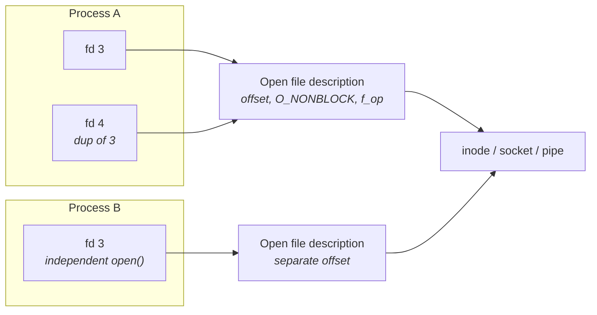
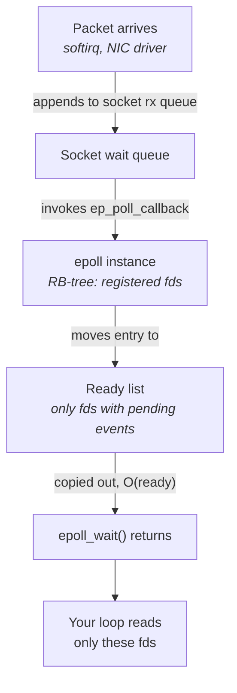
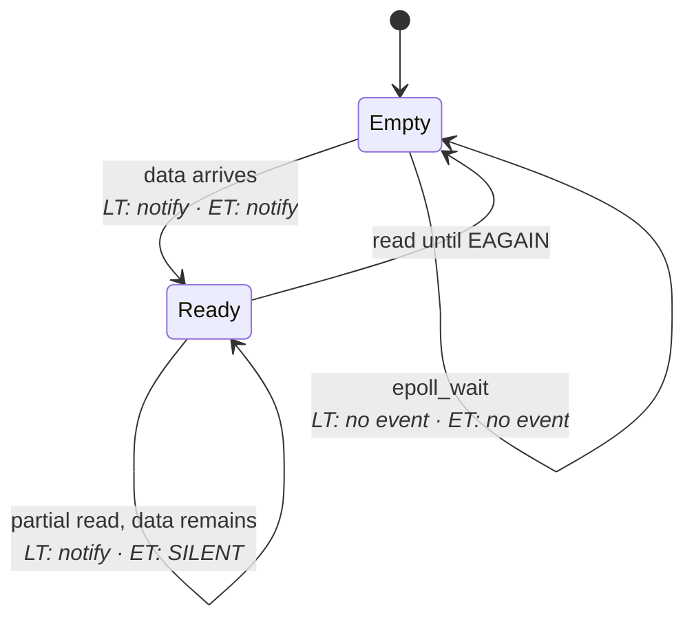
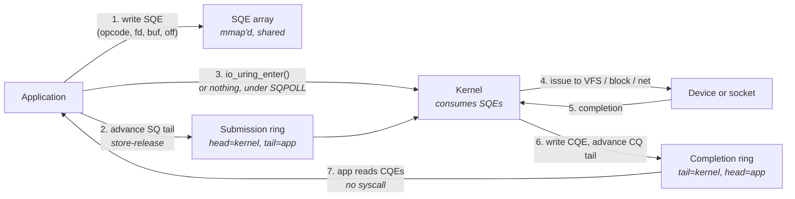
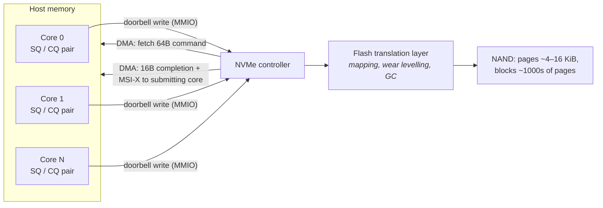
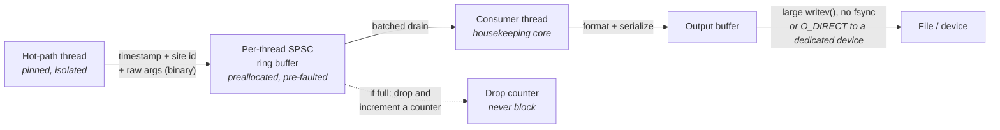

# I/O Subsystems

Every interaction your process has with the outside world — a packet arriving, a log line being
written, a configuration file being read — passes through a small number of kernel abstractions that
were designed in the 1970s and extended, awkwardly, ever since. You already know the API surface:
`open`, `read`, `write`, `close`, and a descriptor number that ties them together. What that
familiarity hides is that the same three-line sequence can cost 200 nanoseconds or 20 milliseconds
depending on which of several completely different code paths the kernel takes underneath it, and
that nothing in the API tells you which one you got.

The gap is enormous and it is structural. A `read` from a socket whose data has already arrived is a
copy out of a kernel buffer — a syscall plus a memcpy, a few hundred nanoseconds. A `read` from the
same socket when data has *not* arrived puts your thread to sleep, and the cost is no longer a copy
but a scheduling event: the thread leaves the CPU, the data eventually arrives in a softirq, the
kernel marks the thread runnable, the scheduler picks it up, and the caches it left behind are cold.
That path is measured in microseconds and it varies enormously. A `write` to a file may land in the
page cache and return immediately, or it may block behind a device queue that already has 128
outstanding requests, or it may trigger a filesystem journal commit that waits for a flash device to
persist its write cache. Same syscall name, five orders of magnitude between the best and worst
outcomes.

Two ideas organize the entire chapter, and it is worth naming them before the machinery starts. The
first is **readiness versus completion**: some interfaces tell you *when you may safely do the I/O*
and leave you to do it (`select`, `poll`, `epoll`), while others tell you *when the I/O you asked for
has finished* (`io_uring`, and to a limited extent POSIX AIO). These are different contracts, they
suit different devices, and confusing them is the most common source of design error in this area.
The second is **who pays for the waiting**: a blocking call pays with a context switch, a polling
loop pays with a burned core, and every real system on a latency-critical host picks the second for
the hot path and the first for everything else. Socket-specific behavior belongs to "Sockets
Programming Model" and the packet path itself to "The Linux Networking Stack"; here we stay at the
level of the descriptor, the syscall, and the block device.

## File Descriptors and the VFS

A file descriptor is a small non-negative integer, and the fact that it is *small* and
*non-negative* is not cosmetic — it is an index. Every process has a table of open files, and the
descriptor is the offset into it. This is the cheapest possible handle design: turning an `fd` into
the kernel object it names is an array index and a bounds check, not a hash lookup or a pointer
validation. That matters, because it happens on every single I/O syscall you make.

What an undergraduate course usually collapses into one box is actually three levels, and the
distinction between them produces real bugs. The **descriptor table** is per-process: an array of
pointers, one slot per open descriptor. Each slot points to an **open file description** — the
kernel's `struct file`, which holds the current file offset, the status flags such as `O_NONBLOCK`
and `O_APPEND`, and a pointer to the operations table for whatever kind of object this is. The
description in turn points to an **inode**, the filesystem's representation of the actual file, or to
a socket, pipe, or device object. Two descriptors can share one description; two descriptions can
share one inode. Those two sharing relationships behave very differently.



The diagram encodes three consequences you will eventually trip over:

- **`dup`, `dup2`, and `fork` share the description, not just the inode.** The offset is shared, and
  so are the status flags. Setting `O_NONBLOCK` via `fcntl` on one descriptor changes the behavior of
  every descriptor that shares the description — including one inherited by a child process.
- **A separate `open` of the same file gets a separate offset.** Two independent `open` calls
  interleave writes at whatever offsets each has advanced to; two `dup`ed descriptors append
  consistently.
- **`close` decrements a reference count.** The description is torn down when the last descriptor
  referring to it goes away, which is why a leaked descriptor in a forked child keeps a socket alive
  long past the point where you closed it in the parent.

### What the VFS actually does on each call

The **Virtual File System (VFS)** is the indirection layer that lets `read` mean something different
for a regular file, a socket, a pipe, and `/proc/cpuinfo`. Its mechanism is unremarkable and worth
knowing precisely: each `struct file` carries a pointer to a `file_operations` table — a struct of
function pointers — and a `read` syscall resolves to an indirect call through that table. Everything
downstream of the syscall entry is filesystem- or driver-specific.

So the fixed cost of any I/O syscall decomposes into roughly this:

| Step | What happens | Rough cost, modern x86 server |
|---|---|---|
| Syscall entry | `syscall` instruction, privilege transition, mitigations | ~50–200 ns, mitigation-dependent (see "Kernel Architecture and the Syscall Boundary") |
| `fd` → `struct file` | Array index, bounds check, reference acquire | A few ns, or a contended atomic — see below |
| VFS dispatch | Indirect call through `f_op`, often a branch mispredict | ~10–30 ns |
| The actual work | Copy from a kernel buffer, or queue a request, or block | 100 ns to milliseconds |
| Syscall return | Privilege transition back, possible signal/`resched` check | ~50–200 ns |

The second row deserves elaboration because it is the one that surprises people. Looking up a
descriptor requires taking a reference on the `struct file`, so it cannot be freed while you are
using it. Linux has a fast path — `__fget_light` — that skips the atomic reference count entirely
when the descriptor table is not shared, which the kernel determines by checking whether the
`files_struct` reference count is one. In a single-threaded process it always is. **In a
multithreaded process it is not**, so every I/O syscall from every thread performs an atomic
increment and decrement on the same `struct file`. If several threads hammer the same descriptor,
that cache line ping-pongs between cores at coherence-miss cost (see "Multicore, Coherence, and
Memory Ordering"). This is a real and frequently overlooked reason that "just share one socket across
the thread pool" scales worse than expected.

### Everything is a descriptor, on purpose

The other thing the VFS buys you is that non-file things can be made to look like files, so that a
single readiness-notification mechanism can wait on all of them at once. This is the design decision
that makes an event loop possible.

- **`eventfd`** — a counter you can write to and read from; the canonical way for a thread or the
  kernel to wake an event loop.
- **`timerfd`** — a timer that becomes readable when it expires, so timeouts join the same wait set
  as sockets (see "Clocks, Timers, and Time" for what the underlying clock costs).
- **`signalfd`** — signals delivered as readable data instead of as asynchronous interruptions.
- **`pidfd`** — a handle on a process that becomes readable when it exits, avoiding `SIGCHLD` races.
- **`memfd_create`** — anonymous memory with a descriptor, so it can be shared and sealed.
- **The `epoll` descriptor and the `io_uring` descriptor are themselves descriptors** — an `epoll`
  set can be nested inside another `epoll` set, and an `io_uring` can be polled by `epoll`.

### Limits, and where to look

Descriptor limits bite in production far more often than they should, and there are three separate
ceilings that get confused with each other.

| Limit | Where | What it governs |
|---|---|---|
| `RLIMIT_NOFILE` soft | `ulimit -n`, or `LimitNOFILE=` in a systemd unit | Per-process; the one that actually fires |
| `RLIMIT_NOFILE` hard | `ulimit -Hn` | Ceiling the process may raise its own soft limit to |
| `/proc/sys/fs/nr_open` | sysctl `fs.nr_open` | Kernel cap on how high the hard limit may go |
| `/proc/sys/fs/file-max` | sysctl `fs.file-max` | System-wide maximum number of open file descriptions |

`/proc/sys/fs/file-nr` reports three values: allocated file handles, free handles, and the maximum —
a quick way to see how close the whole machine is to the system-wide ceiling.

**Failure mode: a service starts refusing connections under load with `EMFILE`, while `lsof` shows
far fewer files than expected.** Symptom is `accept` failing while the machine has plenty of memory.
Cause is the per-process soft limit, which systemd sets independently of the shell's `ulimit`.
Confirm with `cat /proc/<pid>/limits` (the "Max open files" row shows the limits *that process
actually has*, not what your login shell has) and count real usage with `ls /proc/<pid>/fd | wc -l`.

**Failure mode: descriptors leak slowly and the process dies after days of uptime.** Symptom is a
monotonically climbing descriptor count. Cause is a path that opens without closing, often an error
path. Confirm by sampling `ls /proc/<pid>/fd | wc -l` over time, then resolving the leaked entries —
`ls -l /proc/<pid>/fd` shows each descriptor's target as a symlink, so a pile of identical targets
names the culprit directly.

**Try it:** inspect a running process's descriptor table. Pick any long-lived service, then run
`ls -l /proc/<pid>/fd` to see what each descriptor points to, and `cat /proc/<pid>/fdinfo/3` for
descriptor 3. The `fdinfo` file reports `pos` (the offset in the open file description) and `flags`
(the octal status flags — check whether `O_NONBLOCK`, octal `04000`, is set). For an `epoll`
descriptor, `fdinfo` additionally lists one `tfd:` line per registered descriptor with its event
mask — the fastest way to audit an event loop's interest set without instrumenting the program.

**Try it:** demonstrate that flags live on the description rather than the descriptor. In a shell,
`exec 3>/tmp/x` then `exec 4>&3`, and observe via `/proc/self/fdinfo/3` and `/proc/self/fdinfo/4`
that both report the same `pos` and that writing through one advances the offset seen by the other.

## Blocking, Non-Blocking, and Asynchronous I/O

Consider a thread that calls `read` on a socket with no data available. The kernel cannot return
data it does not have, so it has two choices, and the whole taxonomy of I/O models falls out of
which one you asked for.

The default is to **block**. The kernel puts your thread on a wait queue attached to the socket,
marks it `TASK_INTERRUPTIBLE`, and calls into the scheduler to run something else. Later, a packet
arrives; the NIC raises an interrupt; the kernel processes it in softirq context, appends data to the
socket's receive queue, and walks that socket's wait queue waking anyone on it. Your thread becomes
runnable. Then — and this is the part that matters — it waits for the scheduler to actually run it,
which depends on what else is on that core, whether the waking core can preempt the running task, and
whether an inter-processor interrupt is needed to poke a different core into rescheduling.

That final leg is the expensive one and it is highly variable. The context switch itself is a
register save/restore plus, for a cross-process switch, a `CR3` reload; the direct cost is on the
order of one to a few microseconds on a modern x86 server. The *indirect* cost is larger and harder
to see: the thread comes back with a cold L1 and L2, a partially invalidated branch predictor, and
possibly on a different core than it left (see "Processes, Threads, and Scheduling"). A hot path that
blocks is a hot path that has just discarded its microarchitectural state.

The alternative is **non-blocking**: set `O_NONBLOCK` on the open file description, and a `read` with
no data returns `-1` with `errno == EAGAIN` immediately instead of sleeping. Nothing has been made
faster — you have simply converted a sleep into an error return, and now *you* own the decision about
what to do next. That is the point. Your options are to spin (call `read` again in a tight loop,
burning a core but paying nothing but syscall cost per attempt), to do useful work and come back
later, or to hand the descriptor to a readiness-notification mechanism and block on *many*
descriptors at once. The third is what an event loop does and is the subject of the next section.

**Asynchronous** I/O is a third contract, distinct from both. Under blocking and non-blocking I/O,
the data transfer happens *inside* the syscall — when `read` returns a positive number, the bytes are
already in your buffer. Under true async I/O, you *submit* an operation, the call returns
immediately, the kernel performs the transfer at some later point directly into the buffer you named,
and you find out afterwards that it finished. The buffer must remain valid and untouched for the
whole interval, which is a genuine ownership discipline and the main reason async interfaces are
harder to use.

| Model | The syscall returns when | Who waits | Where the copy happens |
|---|---|---|---|
| **Blocking** | The operation is complete | Kernel, by descheduling you | Inside the syscall |
| **Non-blocking** | Immediately, with data or `EAGAIN` | You, however you choose | Inside the syscall, when data is there |
| **Readiness notification** | A descriptor is ready | Kernel, on a set of descriptors | In a subsequent non-blocking call |
| **Completion notification (async)** | Immediately, after queueing | Kernel, in the background | Between submission and completion |

Linux's history here is instructive. POSIX AIO (`aio_read` and friends in glibc) is emulated with a
user-space thread pool and offers no kernel advantage. The kernel's native `io_submit` interface
works asynchronously only for `O_DIRECT` file I/O; for buffered files it silently blocks, and it
never supported sockets. That gap — no unified, genuinely asynchronous submission interface — is
precisely what `io_uring` was built to close.

**Failure mode: a "non-blocking" server still stalls for milliseconds.** Symptom is an event loop
with an occasional multi-millisecond gap that no socket operation explains. Cause is almost always a
regular-file operation on the loop thread: `O_NONBLOCK` has no effect on regular files, so a `read`
that misses the page cache blocks in a major page fault against storage regardless of the flag. Also
suspect `open`, `stat`, and `close` on a network filesystem, plus logging. Confirm with
`strace -T -p <pid>` and look for a syscall whose measured duration is milliseconds, or use
`perf trace -p <pid> --duration 1` to print only syscalls exceeding 1 ms.

**Failure mode: latency has a bimodal distribution with a mode around 2–20 µs.** Symptom is a
histogram with a fast mode and a distinctly separate slow mode, not a smooth tail. Cause is that some
fraction of operations find no data and block, paying a wakeup and a context switch. Confirm by
reading voluntary versus involuntary context switch counts from `/proc/<pid>/status`
(`voluntary_ctxt_switches` rises when the thread blocks; `nonvoluntary_ctxt_switches` rises when it
is preempted) and watching which one climbs with your slow mode.

**Try it:** measure your own machine's wakeup cost. Create two threads pinned to different cores, one
blocking in `read` on an `eventfd` and the other writing an 8-byte value to it, timestamping with a
monotonic clock on both sides. The delta from write to wakeup on an otherwise idle, `isolcpus`-free
machine is typically a few microseconds. Then repeat with both threads on the *same* core and observe
the value change — you are now measuring a full deschedule and dispatch rather than a cross-core IPI
wakeup.

**Try it:** count syscalls to make the fixed cost concrete. Run `strace -c -f -p <pid>` against a
busy event loop for ten seconds and read the per-syscall totals. Multiply the `epoll_wait` and `read`
counts by ~100 ns of unavoidable transition cost each — that product is your syscall floor, and it
is often a larger fraction of the budget than people expect.

## Waiting on Many Descriptors: `select`, `poll`, and `epoll`

Once a process handles more than one connection, it needs to wait for whichever becomes ready first.
The naive solutions both fail. A thread per descriptor makes the wait trivial but multiplies context
switches and memory, and puts the scheduler on the critical path of every event. Spinning across all
descriptors with non-blocking reads works but costs one syscall per descriptor per iteration, which
scales linearly in the wrong direction — with 10,000 mostly-idle connections you would issue 10,000
syscalls to discover that one of them had data.

The kernel's answer is a call that takes a *set* of descriptors, blocks until at least one is ready,
and returns the ready ones. Three generations of this interface exist on Linux, and the differences
between them are not stylistic — they are algorithmic, and they show up as a scaling behavior you can
measure.

`select` is the oldest. You pass three bitmaps — readable, writable, exceptional — plus the highest
descriptor number in use. The kernel scans every descriptor from 0 to that maximum, checks each one's
readiness, and rewrites your bitmaps in place. Two structural problems follow immediately. The
bitmaps are destroyed on every call, so you must rebuild them each iteration. And the fixed-size
`fd_set` type is capped by `FD_SETSIZE`, which is 1024 in glibc — a descriptor numbered 1500 cannot be
represented at all, and passing one produces undefined behavior rather than an error.

`poll` fixes the interface without fixing the algorithm. You pass an array of `struct pollfd`, each
holding a descriptor, a requested event mask, and a returned event mask. There is no fixed ceiling,
and the request mask is separate from the result so the array survives the call. But the kernel still
copies the whole array in, walks every entry, and copies the whole array back out. The work per call
is still proportional to the number of descriptors you are watching, not to the number that are
actually ready.

`epoll` changes the algorithm by splitting the operation in two. You build the watch set *once*, with
`epoll_ctl`, and the kernel keeps it in an internal red-black tree keyed by descriptor. When you
register a descriptor, the kernel attaches a callback to that object's wait queue. Now, when a packet
arrives and the socket becomes readable, the wakeup path does not wake your thread directly — it
invokes the callback, which appends this descriptor's entry to a **ready list** attached to the epoll
instance. `epoll_wait` blocks until the ready list is non-empty and then copies out only the entries
on it. The cost of a call is proportional to the number of *ready* descriptors, and adding 100,000
idle connections adds nothing to it.



The diagram makes the three costs explicit and they are the reason `epoll` wins:

- **Registration is amortized.** `epoll_ctl(EPOLL_CTL_ADD)` costs a tree insert once per descriptor
  lifetime, not once per wait.
- **Delivery is push, not pull.** Readiness is recorded by the code path that made the descriptor
  ready, so `epoll_wait` never scans anything.
- **The return is proportional to activity.** A set of 50,000 descriptors with three ready costs the
  same as a set of 5 with three ready.

| | `select` | `poll` | `epoll` |
|---|---|---|---|
| Watch set lifetime | Rebuilt every call | Passed every call | Registered once |
| Kernel work per call | O(max fd) | O(watched) | O(ready) |
| Descriptor ceiling | `FD_SETSIZE` = 1024 | None | None |
| Copy per call | 3 bitmaps in and out | Whole array in and out | Ready events out only |
| Edge-triggered mode | No | No | Yes (`EPOLLET`) |
| Timeout resolution | µs (`select`) / ns (`pselect`) | ms (`ppoll` gives ns) | ms (`epoll_pwait2` gives ns) |
| Portability | Everywhere | Everywhere | Linux only |

Two `epoll` details matter beyond raw scaling. `epoll_create1(EPOLL_CLOEXEC)` is the modern
constructor — the older `epoll_create` takes a size hint that has been ignored since Linux 2.6.8, and
the `CLOEXEC` flag prevents the descriptor leaking across an `exec`. And `EPOLLEXCLUSIVE`, added in
Linux 4.5, changes wakeup semantics when several `epoll` instances watch the same descriptor — such
as multiple threads waiting on one listening socket. Without it, every waiter is woken and all but
one immediately fail; with it, the kernel wakes a subset. That is the **thundering herd** problem: N
threads woken, N-1 doing nothing but a context switch each. (For listening sockets specifically,
`SO_REUSEPORT` with a separate socket per thread is usually the better structure — see "Sockets
Programming Model".)

Now the part that matters most for this book. **`epoll` solves a scaling problem, not a latency
problem.** Its advantage is asymptotic: it makes 100,000 connections cheap. On the hot path of a
latency-critical system, you typically have a handful of descriptors and a hard requirement on the
tail, and there `epoll` buys you nothing over `poll` — and both are slower than not calling the
kernel at all. The dominant cost at low descriptor counts is the wakeup path: softirq to wait-queue
callback to scheduler to your thread, several microseconds and highly variable. That is why hot paths
busy-poll instead (see "Processes, Threads, and Scheduling" for spin-versus-block strategy, and
"Kernel Bypass" for removing the kernel entirely). A useful middle ground is `epoll_wait` with a
timeout of `0`, called in a spin loop: you keep the multiplexing convenience and never sleep, at the
cost of one syscall per iteration.

**Failure mode: an event loop scales fine to 10,000 connections but its p99 is microseconds worse
than a single blocking socket.** Symptom is good throughput, poor tail. Cause is the wakeup and
syscall overhead per event, which `epoll` does not remove. Confirm by comparing `epoll_wait` with a
`0` timeout in a spin loop against a blocking timeout, measuring the tail of each; if the spin
version's tail collapses, you were paying for sleeps.

**Failure mode: CPU usage climbs sharply with connection count even though most are idle.** Symptom
is `poll`-shaped scaling — cost tracking the watch set rather than the event rate. Cause is a library
still on `select` or `poll` underneath your abstraction. Confirm with `strace -c -p <pid>` and see
whether the loop calls `poll`/`select` or `epoll_wait`; check the argument count on `poll` to see how
large the array being copied per call is.

**Failure mode: descriptors silently stop being reported.** Symptom is a connection that goes dead
while others work. Cause is that a descriptor was closed while still registered — closing a
descriptor removes it from all `epoll` sets automatically, *but only when the last descriptor
referring to the open file description closes*. A `dup`ed descriptor keeps the description alive and
the registration with it, and events keep firing for a descriptor number you have reused. Confirm by
dumping the interest list from `/proc/<pid>/fdinfo/<epfd>` and comparing the `tfd:` entries against
the descriptors you believe are registered.

**Try it:** measure the scaling difference directly. Create N connected socket pairs, register all of
them, and make exactly one readable; time 100,000 iterations of the wait call for N = 10, 100, 1000,
10000, using `poll` in one build and `epoll_wait` in another. Plot time per call against N. The
`poll` line rises linearly; the `epoll` line is flat. That flatness is the entire argument for
`epoll` and it is worth seeing on your own hardware.

**Try it:** watch the interest set from outside the process. Find the `epoll` descriptor with
`ls -l /proc/<pid>/fd | grep eventpoll`, then `cat /proc/<pid>/fdinfo/<epfd>`. Each `tfd:` line gives
a watched descriptor and its `events:` mask in hex — check bit `0x80000000`, which is `EPOLLET`, to
see whether the loop is edge-triggered.

## Edge-Triggered Versus Level-Triggered

This is the single most misunderstood knob in the `epoll` interface, and the misunderstanding is
usually framed as a correctness question when it is really a question about how many syscalls you are
willing to make.

**Level-triggered** is the default and matches `select` and `poll` semantics. `epoll_wait` reports a
descriptor as readable whenever its receive queue is non-empty — the *condition* is what triggers,
and it keeps triggering as long as the condition holds. If a socket has 4 KiB buffered and you read
1 KiB, the next `epoll_wait` reports it readable again, because 3 KiB is still there. You cannot
starve yourself by under-reading. You can, however, spin: if you register for `EPOLLOUT` on an idle
socket, its send buffer is empty, so it is writable, so every `epoll_wait` returns instantly forever.

**Edge-triggered** — `EPOLLET` in the event mask — reports a descriptor only when its readiness
*changes*. Data arriving on an empty receive queue is an edge and produces one notification. More
data arriving is another edge. But if you read only 1 KiB of the 4 KiB available and then call
`epoll_wait` again, you get nothing: the condition is still true, but it did not transition, and
edge-triggered mode reports transitions. Your remaining 3 KiB sits there indefinitely, and the
connection appears to hang while every other connection works fine.



The `Ready → Ready` self-transition on partial read is the whole story. Level-triggered notifies;
edge-triggered does not. Everything else follows:

- **Edge-triggered obliges you to drain.** After a notification, loop on `read` until it returns
  `EAGAIN` (or `EWOULDBLOCK`). Only then have you consumed the level, so the next arrival produces a
  fresh edge.
- **Edge-triggered requires `O_NONBLOCK`.** The drain loop must terminate. Against a blocking
  descriptor the final `read` sleeps, and you have just parked your event loop thread inside a socket
  read.
- **A short read is not proof of emptiness.** Asking for 64 KiB and getting 1 KiB *usually* means the
  queue is empty, but the guarantee comes only from `EAGAIN`. On a listening socket, `accept` must
  likewise be called in a loop until it returns `EAGAIN`, or a connection that arrived during the
  same edge is never accepted.

The reason to accept that obligation is syscall count. Level-triggered mode, in a loop that reads a
fixed-size buffer per event, produces one `epoll_wait` per read: notify, read, notify, read. Edge-
triggered produces one `epoll_wait` per *burst*: notify, read, read, read, `EAGAIN`. Under load the
difference is roughly one syscall per message versus one per batch, which at ~100 ns of transition
cost each is a straightforward multiplication.

| | Level-triggered (default) | Edge-triggered (`EPOLLET`) |
|---|---|---|
| Notification rule | While the condition holds | When the condition transitions |
| Partial consumption | Safe — reported again | Data stranded until the next edge |
| Drain obligation | None | Read until `EAGAIN` |
| Requires `O_NONBLOCK` | No | Effectively yes |
| `epoll_wait` calls per burst | One per read | One per burst |
| `EPOLLOUT` behavior | Fires continuously while writable | Fires when the buffer transitions to writable |
| Failure signature | Wasted syscalls, busy loop on `EPOLLOUT` | A silently stalled connection |

`EPOLLOUT` is where the practical difference is sharpest, and there is a standard idiom. Under level-
triggered mode, do not register for `EPOLLOUT` at all in the steady state — just `write`, and only if
it returns `EAGAIN` or a short count do you add `EPOLLOUT`, buffer the remainder, and remove
`EPOLLOUT` once drained. Under edge-triggered mode you may leave `EPOLLOUT` registered permanently,
because it only fires on the transition from full to writable. That single asymmetry is why
high-connection-count servers tend to choose edge-triggered.

`EPOLLONESHOT` is a third mode worth knowing because it solves a different problem. It disables the
descriptor after one notification, and you must re-arm it with `epoll_ctl(EPOLL_CTL_MOD)`. This
guarantees that no two threads in a pool are ever handling the same descriptor concurrently, which
removes a whole class of races in multithreaded event loops — at the cost of an extra syscall per
event.

**Failure mode: one connection hangs permanently while all others are fine, and a restart fixes it.**
Symptom is a single stalled descriptor with data buffered in the kernel. Cause is an edge-triggered
loop that did not drain to `EAGAIN`. Confirm with `ss -tmi 'dport = :<port>'` and look at the receive
queue — `ss -tn` shows `Recv-Q` non-zero and static for that connection while the process is idle.
Non-zero, unchanging `Recv-Q` on a live process is the signature.

**Failure mode: the event loop burns 100% CPU with no traffic.** Symptom is `epoll_wait` returning
immediately in a tight loop. Cause is level-triggered `EPOLLOUT` registered on an idle socket whose
send buffer is empty. Confirm with `strace -c -p <pid>`: an enormous `epoll_wait` count with a
near-zero `write` count is diagnostic.

**Failure mode: a connection arrives but is never served, under bursty connection load.** Cause is an
edge-triggered listening socket where `accept` was called once per notification; two connections
arriving in the same edge leave the second queued forever. Confirm with `ss -ltn`, where the
listening socket shows a persistently non-zero `Recv-Q` (for a listener, that column is the pending
accept-queue depth) against a `Send-Q` showing the backlog limit.

**Try it:** build the stall yourself, because reading about it is not the same as watching it. Set up
a socket pair registered with `EPOLLIN | EPOLLET`, write 8 KiB from one end, and in the loop read only
1 KiB per notification. The second `epoll_wait` blocks forever with 7 KiB pending. Confirm the data
is really there with `ss -tn` showing non-zero `Recv-Q`. Then remove `EPOLLET` and watch the same
code drain correctly.

## `io_uring`: Submission and Completion Rings

Everything so far has one syscall per operation, and often two — one to learn a descriptor is ready,
one to do the I/O. At a few hundred nanoseconds of unavoidable transition cost per call, plus the
cost of whatever mitigations your kernel has enabled for Meltdown and Spectre (see "Kernel
Architecture and the Syscall Boundary"), a system doing a million operations per second is spending a
substantial fraction of a core purely on crossing the boundary. And readiness notification is
fundamentally a poor fit for storage: a block device is never "ready to be read from" the way a
socket is; the read either has to be issued or it does not exist.

`io_uring` addresses both by replacing the syscall-per-operation model with **shared memory rings**.
At setup, `io_uring_setup(entries, params)` returns a descriptor, and you `mmap` three regions from
it: a submission queue ring, a completion queue ring, and an array of submission queue entries. Both
sides — your process and the kernel — can read and write these regions directly. To issue an
operation you fill in a 64-byte **submission queue entry (SQE)** describing it (opcode, descriptor,
buffer, offset, flags), publish its index into the submission ring, and advance a tail index. The
kernel consumes entries from the head. When an operation completes, the kernel writes a 16-byte
**completion queue entry (CQE)** — result code and the opaque `user_data` you supplied — into the
completion ring and advances its tail. You read completions by reading memory, with no syscall at
all.

`io_uring_enter` is what tells the kernel that work is waiting, and it is the reason this is a
*batching* interface rather than merely a shared-memory one. One `io_uring_enter` can submit any
number of queued SQEs and can optionally wait for a minimum number of completions in the same call.
So a full request/response cycle that would classically be `epoll_wait` + `read` + `write` — three
syscalls — becomes one, and under sustained load it amortizes toward zero syscalls per operation.



The two ring buffers are single-producer/single-consumer structures with the usual memory-ordering
requirements — the tail must be published with release semantics after the entry is written, and read
with acquire semantics on the other side, or the consumer can observe a tail pointing at an entry it
cannot yet see (see "Synchronization and IPC" for the general pattern, and "Multicore, Coherence, and
Memory Ordering" for why the barriers are necessary on x86 despite its strong ordering).

### Polled mode

Two independent polling options remove the remaining syscalls and the remaining interrupts. They are
frequently confused because both are called "polled mode."

**`IORING_SETUP_SQPOLL`** creates a kernel thread that busy-polls the submission ring. You write an
SQE, advance the tail, and the kernel thread picks it up without you calling `io_uring_enter` at all
— a genuine zero-syscall submission path. The kernel thread sleeps after `sq_thread_idle`
milliseconds of inactivity, and when it has slept, the ring's flags word has `IORING_SQ_NEED_WAKEUP`
set, so the application must check that flag and issue an `io_uring_enter` with
`IORING_ENTER_SQ_WAKEUP` to restart it. Forgetting that check produces submissions that sit in the
ring indefinitely. The cost is honest and unavoidable: a kernel thread spinning on a core. Pin it
deliberately with `IORING_SETUP_SQ_AFF` and `sq_thread_cpu`, or it lands wherever the scheduler puts
it — potentially on your isolated hot-path core.

**`IORING_SETUP_IOPOLL`** is about the *device* side, not the submission side. Instead of the NVMe
driver waiting for a completion interrupt, the kernel polls the device's completion queue for
finished commands. This removes interrupt delivery and the softirq that follows it from the
completion path, which on a fast SSD is a meaningful fraction of the total. It applies only to block
devices that support polling, and it requires `O_DIRECT` — the page cache path cannot be polled.

| Flag | What it removes | Cost | Applies to |
|---|---|---|---|
| (none) | — | One `io_uring_enter` per batch | Everything |
| `IORING_SETUP_SQPOLL` | The submission syscall | A kernel thread burning a core | Everything |
| `IORING_SETUP_IOPOLL` | The completion interrupt | Your thread reaping the device queue | `O_DIRECT` block I/O only |
| `IORING_SETUP_SINGLE_ISSUER` | Internal locking | Only one thread may submit | Everything (Linux 6.0+) |
| `IORING_SETUP_DEFER_TASKRUN` | Random completion-work interruptions | Completion work runs only when you wait | With `SINGLE_ISSUER` (Linux 6.1+) |

That last row deserves a note, because it is the flag most relevant to jitter rather than throughput.
By default, `io_uring` runs some completion processing as *task work* — kernel work executed in the
context of your thread at the next opportunity, which means at an arbitrary point relative to your
application code. `IORING_SETUP_DEFER_TASKRUN` defers it until you explicitly wait for completions,
which converts unpredictable interruptions into work that happens at a point you chose. For a
latency-critical loop, that trade is usually correct.

Two registration operations remove further per-operation cost. `io_uring_register` with
`IORING_REGISTER_BUFFERS` pins a set of user buffers once, so the kernel skips per-operation page
pinning and translation. `IORING_REGISTER_FILES` pre-resolves descriptors, so submissions can name a
registered index instead of paying the `fd` lookup and reference count discussed earlier.

`io_uring` is also a security-relevant surface with a fast-moving implementation. Its opcode set,
flags, and internal work-distribution behavior have changed substantially across kernel releases, and
some environments disable it outright via the `io_uring_disabled` sysctl. Feature-detect through the
`features` field returned by `io_uring_setup` rather than assuming; version-check anything you depend
on.

**Failure mode: submissions sit in the ring and nothing completes, under `SQPOLL`.** Symptom is a
stall after a quiet period, recovering when traffic resumes. Cause is the submission-polling kernel
thread having gone idle and the application not checking `IORING_SQ_NEED_WAKEUP`. Confirm by finding
the `io_uring-sq` kernel thread in `ps -eLo pid,comm,psr,pcpu | grep io_uring` and watching its CPU
usage drop to zero across the stall.

**Failure mode: the hot-path core suddenly shows a second busy thread.** Symptom is unexplained
contention on an isolated core. Cause is the `SQPOLL` kernel thread, or an `io_uring` worker thread
(`iou-wrk-*`), scheduled onto it — `io_uring` falls back to a bounded worker pool for operations it
cannot complete inline, and those threads are not pinned by default. Confirm with
`ps -eLo pid,tid,comm,psr | grep -E 'iou-|io_uring'` and read the `psr` column for the core each
thread is on.

**Failure mode: `IORING_SETUP_IOPOLL` returns `EOPNOTSUPP` or completions never arrive.** Cause is a
file opened without `O_DIRECT`, or a device or filesystem path that does not support polling. Confirm
the device's capability by checking `/sys/block/<dev>/queue/io_poll`, and verify the open flags via
`/proc/<pid>/fdinfo/<fd>` (`O_DIRECT` is octal `040000`).

**Try it:** count the syscalls yourself, which is the clearest demonstration of what the interface
buys. Run two `fio` jobs against the same file and compare their syscall totals under `strace -c -f`:

```
fio --name=psync --ioengine=psync  --rw=randread --bs=4k --size=1G \
    --direct=1 --runtime=10 --time_based
fio --name=uring --ioengine=io_uring --rw=randread --bs=4k --size=1G \
    --direct=1 --iodepth=32 --runtime=10 --time_based
```

The `psync` job issues one `pread` per 4 KiB. The `io_uring` job issues roughly one
`io_uring_enter` per batch. Then add `--sqthread_poll=1` to the second and watch the syscall count
collapse toward zero — while a kernel thread appears in `top` consuming a full core. Both halves of
that observation are the point.

**Try it:** compare completion paths on a device. Run the same `--ioengine=io_uring --direct=1`
workload with and without `--hipri` (which sets `IORING_SETUP_IOPOLL`) at `--iodepth=1`, and compare
the reported completion latency percentiles. Then read `/proc/interrupts` before and after each run
and note that the polled version leaves the NVMe interrupt counters nearly unchanged.

## Buffered Versus Direct I/O, and What Durability Costs

By default, file I/O goes through the **page cache**: a `write` copies your data into kernel page
frames, marks them dirty, and returns. Nothing has reached the device. A background writeback
mechanism flushes dirty pages later, driven by the tunables in `/proc/sys/vm/` — `dirty_ratio` and
`dirty_background_ratio` (as percentages of available memory), or their absolute equivalents
`dirty_bytes` and `dirty_background_bytes`, along with `dirty_expire_centisecs` for age-based
flushing and `dirty_writeback_centisecs` for how often the flusher wakes.

For general workloads this is close to ideal. Writes are fast because they are memory copies; reads
of recently written or repeatedly accessed data never touch the device; the kernel batches and merges
adjacent writes, which storage devices strongly prefer; and readahead turns sequential access into
large sequential device requests. The properties that make it good for throughput are exactly the
ones that make it hazardous for tail latency.

The hazard is the cliff. While dirty pages are below `dirty_background_ratio`, writes are pure memory
copies. When dirty pages exceed `dirty_ratio`, the writing process is **throttled** — the kernel
forces it to participate in writeback, and a `write` call that took 200 nanoseconds a moment ago now
blocks for however long the device takes. Nothing in your code changed. This is a first-order source
of multi-millisecond outliers in processes that write files casually — including, very often, the
logging path. Linux also has writeback throttling that tries to keep queue depth low enough to
protect read latency, tunable per device via `/sys/block/<dev>/queue/wbt_lat_usec`.

**Direct I/O** — `O_DIRECT` on `open` — bypasses the page cache entirely. Data moves by DMA between
the device and your buffer, with no kernel copy and no caching. In exchange you inherit alignment
requirements: the buffer address, the file offset, and the transfer length must all be aligned to the
device's logical block size, typically 512 or 4096 bytes. Get any of them wrong and the call returns
`EINVAL`, which is a confusing error to debug the first time.

The two paths differ in exactly one hop, and that hop is the whole trade:

- **Buffered.** `write` copies into a page frame, marks it dirty, returns. The block layer sees the
  data later, when the flusher thread or the `dirty_ratio` throttle pushes it out.
- **Direct.** `write` goes straight to the block layer, which merges and queues it and hands it to the
  device; the call returns when the device has acknowledged.
- **Either way, `fsync` is a third thing.** It flushes dirty pages *and* issues a device cache-flush
  command, and it is the only one of the three that says anything about survival across power loss.

So `O_DIRECT` is not simply "faster." It removes a copy and removes the cache, so
every read is a device round trip — 10 to 100 µs on a datacenter NVMe SSD rather than the ~100 ns of
a page cache hit. It is the right choice when you are managing your own cache, when you are writing
data you will never re-read, or when you need predictable timing more than you need average speed.
It is the wrong choice when the working set fits in memory. Note also that `O_DIRECT` is a
best-effort hint about the *cache*, not about durability — a completed `O_DIRECT` write may still be
sitting in the device's volatile write cache.

### `fsync`, `fdatasync`, and the device cache

Durability is a separate axis from caching, and the number of places data can hide is larger than
most engineers expect. A write can be in your process's user-space buffer, in the kernel page cache,
in the block layer's queue, in the device's own volatile DRAM write cache, or actually committed to
flash. Only the last survives a power loss.

`fsync(fd)` walks the whole chain: it writes back all dirty pages for that file, waits for them, and
then issues a cache-flush command to the device, waiting for that too. `fdatasync(fd)` does the same
but skips metadata updates that are not required to retrieve the data — notably, it can avoid a
separate inode write when only the modification time changed, though it must still flush metadata if
the file size grew. For a workload that appends and syncs frequently, `fdatasync` is meaningfully
cheaper. `sync_file_range` gives finer control — it can start writeback on a byte range without
issuing a device cache flush — but it does *not* provide durability guarantees, and using it as if it
did is a classic data-loss bug.

| Call / flag | Kernel page cache | Device write cache | Metadata | Typical cost, NVMe |
|---|---|---|---|---|
| `write` (buffered) | Data copied in, dirty | Untouched | Deferred | ~100 ns–1 µs, until throttled |
| `write` with `O_DIRECT` | Bypassed | Data may sit here | Deferred | 10–100 µs |
| `fdatasync` | Flushed | Flush command issued | Only what is needed | ~50 µs–1 ms |
| `fsync` | Flushed | Flush command issued | Fully flushed | ~100 µs–several ms |
| `O_DSYNC` / `RWF_DSYNC` | Per-write flush | Per-write flush | Data-only | Adds sync cost to every write |
| `O_SYNC` | Per-write flush | Per-write flush | Full | Most expensive per write |

Whether the device flush is expensive at all depends on the hardware. An enterprise SSD with **power
loss protection** — onboard capacitors that guarantee the write cache can be drained after a power
failure — can acknowledge a flush essentially immediately, because its cache is already effectively
non-volatile. A consumer drive without that guarantee must actually push data to flash. Same syscall,
two orders of magnitude apart. Linux exposes whether the kernel believes a device has a volatile
write cache at `/sys/block/<dev>/queue/write_cache`, which reports `write back` or `write through`.

The rule that follows for a latency-critical host: **`fsync` never belongs on a hot path.** Not
rarely, not tuned — never. If you require durability, get it off the critical path entirely, whether
by writing to a separate thread that syncs on its own schedule, by accepting a bounded window of
loss, or by placing the durability requirement on a system that is not in the request path.

**Failure mode: a process that normally writes in nanoseconds occasionally blocks for hundreds of
milliseconds inside `write`.** Cause is dirty-page throttling — the system crossed `dirty_ratio` and
the writer is now doing writeback synchronously. Confirm by watching `nr_dirty` and `nr_writeback` in
`/proc/vmstat` (or the `Dirty:` and `Writeback:` lines of `/proc/meminfo`) across the incident, and
compare against `sysctl vm.dirty_ratio`. The usual mitigation is to lower `vm.dirty_bytes` so
writeback starts earlier and in smaller units, rather than accumulating a large batch that must be
flushed all at once.

**Failure mode: `O_DIRECT` reads return `EINVAL` for some requests and not others.** Cause is an
unaligned buffer, offset, or length. Confirm the requirement by reading
`/sys/block/<dev>/queue/logical_block_size`, and allocate buffers with `posix_memalign` to at least
that granularity — in practice, aligning to 4096 is the safe choice regardless.

**Failure mode: a benchmark shows a device is far faster than its datasheet.** Cause is that the
benchmark did not use `--direct=1` and is measuring the page cache. Confirm by comparing
`iostat -x 1` device-level throughput against the throughput the benchmark reports; if the device
columns are near zero, no I/O reached it.

**Try it:** quantify the cost of durability on your own hardware, which is the single most useful
number in this section.

```
fio --name=nosync --rw=write --bs=4k --size=512M --direct=1 --ioengine=psync
fio --name=fsync1 --rw=write --bs=4k --size=512M --direct=1 --ioengine=psync --fsync=1
```

The second job issues an `fsync` after every 4 KiB write. Compare the reported IOPS and the p99
completion latency. Then read `cat /sys/block/<dev>/queue/write_cache` — a device reporting
`write through` (typically one with power loss protection) will show a far smaller gap than one
reporting `write back`.

**Try it:** observe the writeback cliff. Set `sysctl -w vm.dirty_bytes=$((64*1024*1024))` on a test
machine, then write a multi-gigabyte file with `dd if=/dev/zero of=/tmp/f bs=1M count=4096` while
running `watch -n0.2 grep -E 'Dirty|Writeback' /proc/meminfo` in another terminal. Watch `Dirty:`
climb to the threshold and plateau as throttling engages. Raise `vm.dirty_bytes` substantially and
repeat: the plateau moves, and the write completes in fewer, larger, more disruptive bursts.

## Storage: NVMe Queues, SSD Behavior, and Write Amplification

The device at the bottom of that path used to be a spinning disk, and every abstraction above it was
shaped by that assumption: seeks were expensive, so the kernel sorted requests into elevator order; a
disk could serve one request at a time, so a single queue was sufficient; and a single interrupt line
was adequate because request rates were in the hundreds per second.

NVMe discards all of it. **NVM Express** is a command protocol designed for flash over PCIe, and its
central structural idea is **paired submission and completion queues in host memory**. The host
writes a 64-byte command into a submission queue and rings a **doorbell** — a write to a memory-mapped
register on the device — telling it the new tail index. The device fetches the command by DMA,
executes it, DMA-writes a 16-byte completion entry into the paired completion queue, and raises an
MSI-X interrupt. The structure is the same producer/consumer ring pattern as `io_uring`, one layer
down, and the resemblance is not a coincidence.

The property that changes system design is **one queue pair per CPU core**. The specification allows
up to 65,535 queue pairs, each up to 65,536 entries deep. Linux's multi-queue block layer (`blk-mq`)
uses this to give each core its own hardware queue, with its own doorbell and its own interrupt
vector routed back to that core. Two consequences follow: there is no lock contention between cores
on the submission path, and a completion interrupt lands on the core that submitted the request, so
the completion handler runs where the relevant cache lines already are.



Because each core owns a queue, the block layer's traditional job largely evaporates. There is
nothing to seek, so elevator sorting is pointless, and the default I/O scheduler for NVMe on modern
Linux is `none` — requests pass through with minimal reordering. You can confirm and change it via
`/sys/block/<dev>/queue/scheduler`, where the bracketed entry is the active one. Leaving a scheduler
like `bfq` or `mq-deadline` enabled on a fast NVMe device adds latency for a fairness benefit you
probably do not want on a dedicated host.

### Why SSDs are strange

The flash underneath does not behave like the block device it pretends to be, and the mismatch is the
source of every surprising storage latency figure.

NAND flash can be read at page granularity (roughly 4–16 KiB) and written at page granularity, but it
can only be **erased** at block granularity — a block being thousands of pages, several megabytes.
And a page must be erased before it can be rewritten. So a 4 KiB overwrite cannot be done in place.
The **flash translation layer (FTL)**, a processor and DRAM inside the drive, instead writes the new
data to a fresh page somewhere else and updates a mapping table. The old page is marked invalid but
still occupies space until its whole containing block is erased.

Over time, blocks fill with a mixture of valid and invalid pages, and free blocks run out. The drive
then runs **garbage collection**: pick a block, copy its still-valid pages elsewhere, erase it,
return it to the free pool. That copying is real device work, competing with your I/O, and it is why
a drive that sustains 500,000 IOPS when fresh may sustain far less after being filled and overwritten
for hours. The ratio of physical flash writes to logical host writes is **write amplification**, and
it is a number between 1 and, in bad cases, well over 10.

Three factors dominate it:

- **Free space.** Garbage collection on a nearly-full drive must relocate more valid data per block
  erased. Over-provisioning — leaving a portion of the drive unpartitioned and untouched — is the
  single most effective mitigation and costs nothing but capacity.
- **Write pattern.** Sequential writes fill blocks with data that becomes invalid together, so whole
  blocks go free at once. Small random writes scatter valid and invalid pages through every block,
  maximizing relocation work.
- **Whether the drive knows what is dead.** Deleting a file is a filesystem operation; the drive has
  no idea those blocks are free and keeps preserving them through garbage collection. The `discard`
  (TRIM) command tells it. Run it periodically with `fstrim` — the batched form, which is preferable
  — rather than with the `discard` mount option, whose inline discards add latency to the delete
  path.

The behavior that matters most for this book is the variance. A read on an idle datacenter NVMe SSD
is 10 to 100 µs. The *same* read while the drive is garbage-collecting can be several times that,
because it queues behind internal work you cannot see and did not request. Write latency is worse
behaved still. Storage tail latency on flash is dominated by device-internal state, not by anything
visible from the host, which is the fundamental reason storage does not belong on a latency-critical
path at all.

**Failure mode: a drive benchmarks beautifully for the first minute and then degrades sharply.**
Symptom is throughput falling by a large factor a few minutes into a sustained write test. Cause is
the SLC write cache filling — many drives absorb initial writes into a fast pseudo-SLC region and
must fold them into denser cells afterwards — combined with garbage collection starting. Confirm by
running a long `--time_based` `fio` job with `--write_bw_log` and plotting bandwidth over time; the
cliff is unmistakable.

**Failure mode: read latency spikes correlate with heavy write activity on the same device.** Cause
is garbage collection and queue-depth interference inside the drive. Confirm with `iostat -x 1` and
compare `r_await` (average read service time in ms) against `aqu-sz` (average queue depth); read
latency rising with queue depth points at host-side queueing, while read latency rising with *write*
activity at low queue depth points at the device's internals.

**Failure mode: a drive is far slower than expected and never recovers.** Cause may be that TRIM has
never run, so the FTL believes the entire device is live data. Confirm by checking whether discard is
even supported — `cat /sys/block/<dev>/queue/discard_max_bytes` returns 0 if not — then run
`fstrim -v /mountpoint` and re-benchmark. Also check `nvme smart-log /dev/nvme0` for
`percentage_used`, which reports consumed endurance, and `available_spare` against
`available_spare_threshold`.

**Try it:** measure write amplification on a test drive. Read `data_units_written` from
`nvme smart-log /dev/nvme0n1` (the field is in units of 1,000 512-byte blocks), run a fixed random
write workload of known size with `fio --rw=randwrite --bs=4k --size=8G --direct=1`, then read the
field again. Divide the physical delta by the logical bytes you wrote. Repeat with `--rw=write` for
sequential. The gap between the two ratios is write amplification made concrete on your own hardware.

**Try it:** map the queueing behavior of your block layer. Read
`cat /sys/block/nvme0n1/queue/nr_requests` for the per-queue depth limit and
`cat /sys/block/nvme0n1/queue/scheduler` to see the active scheduler. Count the device's interrupt
vectors with `grep nvme /proc/interrupts | wc -l` and note that there is roughly one per core. Then
run a load and watch `iostat -x 1`, correlating `aqu-sz` against `r_await` to find the depth at which
service time starts climbing.

**Try it:** trace individual requests. Run `blktrace -d /dev/nvme0n1 -o - | blkparse -i -` during a
workload; each line shows a request's action code (`Q` queued, `G` get-request, `I` inserted, `D`
issued to driver, `C` completed) with a timestamp. The `D`-to-`C` interval is device service time;
`Q`-to-`D` is time spent in the host's queues. Separating those two is how you tell a slow device
from a saturated queue. A lighter-weight equivalent uses the block tracepoints directly:

```
bpftrace -e '
tracepoint:block:block_rq_issue    { @s[args->dev, args->sector] = nsecs; }
tracepoint:block:block_rq_complete /@s[args->dev, args->sector]/ {
    @us = hist((nsecs - @s[args->dev, args->sector]) / 1000);
    delete(@s[args->dev, args->sector]);
}'
```

That prints a log-scale histogram of device service time in microseconds — the shape of the tail,
which an average would hide entirely (see "Measuring Correctly").

## Journaling and Low-Latency Logging

Two things get called "logging" and they have almost nothing in common. A **filesystem journal** is a
crash-consistency mechanism inside the kernel. An **application log** is a stream of diagnostic
records your process emits. The first is a source of latency you must avoid; the second is a
latency-critical component you must design. They meet at the point where your log writes land on a
journaled filesystem.

Start with the journal. A filesystem operation like extending a file touches several on-disk
structures — the inode, the block allocation bitmap, the extent tree — and a crash between those
updates leaves the filesystem inconsistent. Journaling fixes this by writing the intended changes to
a sequential journal first, then applying them to their real locations. After a crash, replaying the
journal restores consistency without a full filesystem scan.

The mechanism is sound and its latency profile is spiky. Journal commits are periodic and batched:
ext4 commits every 5 seconds by default, tunable via the `commit=` mount option, and a commit
involves ordered writes plus device cache flushes. Any operation that must wait for a commit — an
`fsync`, or a metadata operation that collides with one in progress — inherits the whole delay. And
because commits are batched across the entire filesystem, an unrelated process's activity can put
your operation behind a large commit. That is the same shape of problem as memory-controller
queueing in "Memory Systems": shared infrastructure, aggregate optimization, individual tail cost.

The three ext4 journaling modes trade safety for that cost:

| Mode | What is journaled | Ordering guarantee | Cost |
|---|---|---|---|
| `data=journal` | Metadata **and** file data | Strongest; data is in the journal before the inode | Every byte written twice; highest latency |
| `data=ordered` (default) | Metadata only | Data blocks are forced out before the metadata that references them | Moderate; commits wait on data writeback |
| `data=writeback` | Metadata only | None between data and metadata — a crash may expose stale block contents | Lowest; weakest guarantee |

XFS takes a different approach with its own log, and its behavior is tuned mostly through log buffer
sizing (`logbsize`) and log placement. Which filesystem is better for a given latency workload is
genuinely contested and depends on the access pattern; the durable point is that both have a shared
sequential log whose commit behavior you inherit.

Two mount options are nearly free wins on a trading host regardless of filesystem. `noatime` stops
the filesystem turning every *read* into a metadata *write* by updating access times — a
surprisingly large effect on read-heavy directories. And keeping logs on their own device removes the
coupling between your log writes and every other filesystem operation on the box.

### Designing the application log

The requirement is unusual and worth stating precisely: a hot path must record enough to reconstruct
what happened, while spending a bounded and very small amount of time doing it — tens of nanoseconds,
not microseconds — and while never, under any circumstance, blocking. Every conventional logging
design violates this. Formatting a string costs hundreds of nanoseconds to microseconds. Taking a
mutex around a shared stream serializes threads and risks a convoy (see "Synchronization and IPC").
Calling `write` per record is a syscall per record. Calling `fsync` is a device round trip. Timestamp
formatting alone, done naively, can cost more than everything else combined.

The architecture that satisfies the requirement inverts the usual order of operations. On the hot
path you do the minimum: capture a raw timestamp, a static identifier for the log site, and the
argument values *as binary*, into a preallocated per-thread ring buffer. No formatting, no
allocation, no lock, no syscall. A separate low-priority thread on a non-isolated core drains the
ring, performs the formatting, and writes to a file. Because the format string is static and known at
build time, it need not be copied into the ring at all — a pointer or an index identifies it, and the
consumer resolves it.



The design rules the diagram encodes:

- **Per-thread rings, not a shared one.** A single-producer/single-consumer ring needs no atomics
  beyond a release store and an acquire load on the indices, and no cache line is written by two
  cores (see "Synchronization and IPC" for the SPSC pattern and "The Cache Hierarchy" for why the
  producer and consumer indices must sit on separate lines).
- **Preallocate and pre-fault the ring at startup.** A first-touch minor page fault inside your
  logging call is a microsecond-scale stall (see "Memory Management"); `mlockall` keeps the pages
  resident.
- **Defer formatting entirely.** Copy binary arguments, not rendered text. This is the difference
  between a handful of nanoseconds and hundreds.
- **Read the clock cheaply.** A raw TSC read is a few nanoseconds and can be converted to wall time
  offline; a `clock_gettime` call is more, even through the vDSO (see "Clocks, Timers, and Time").
- **Overflow drops, never blocks.** A full ring means the consumer is behind. Increment a dropped-
  record counter and return. A hot path that blocks on a full log buffer has converted a diagnostic
  facility into an outage.
- **Batch on the write side.** The consumer should accumulate and issue large `writev` calls, not one
  `write` per record.

The remaining question is where the consumer's writes go, and there are three defensible answers. A
buffered write to a regular file is simplest, but exposes you to the dirty-page throttling cliff
described earlier — mitigate by lowering `vm.dirty_bytes` so writeback happens continuously in small
units. `O_DIRECT` writes to a dedicated device avoid the page cache and the throttle entirely, at the
cost of alignment handling and losing the read cache. Or write to shared memory under `/dev/shm` and
have a separate *process* persist it, which removes storage from your process's address space
entirely and survives your process crashing (see "Observability Without Slowing Down" for how this
composes into a full telemetry architecture).

Finally, note what you can now do that a text logger could not: because records are binary and
timestamps are raw cycle counts, you can log far more aggressively than usual. A record that costs
20 nanoseconds can go in places where a 2-microsecond record could not, which is often the difference
between diagnosing a rare tail event and never seeing it.

**Failure mode: p99.9 latency spikes exactly when a log file rolls over.** Cause is the `close`,
`rename`, `open`, and possibly `fsync` sequence hitting the filesystem journal synchronously, plus
the page cache flushing the old file's dirty pages. Confirm by correlating spike timestamps against
file rotation times and by watching `Dirty:` in `/proc/meminfo` across the rotation. The fix is to
perform rotation on the consumer thread and to preallocate the next file in advance with
`fallocate`, so no metadata operation happens at the moment of the switch.

**Failure mode: the hot path is fast in isolation but slow under production log volume.** Cause is
the consumer thread not keeping up, so the ring fills and the producer takes the slow path. Confirm
by exporting the dropped-record counter as a metric — a logging system without an observable drop
count is not diagnosable. Rising drops with a stable event rate means the consumer is starved of CPU
or blocked in `write`.

**Failure mode: enabling logging changes the timing of the bug you are chasing.** Cause is that the
logging call itself is on the critical path and large enough to perturb it. Confirm by measuring the
hot path with logging compiled in but the ring drained to `/dev/null` versus fully disabled; if the
difference is more than a few tens of nanoseconds per record, the logger is too heavy to instrument
with.

**Try it:** measure your logging call's cost properly. Time a large number of log calls into a warm,
pre-faulted ring, recording per-call cycle deltas into a preallocated array, and build a histogram
rather than reporting a mean. You are looking for the *shape*: a tight distribution a few tens of
nanoseconds wide is what a deferred-formatting logger should produce. Any secondary mode at the
microsecond scale means something is allocating, faulting, formatting, or syscalling.

**Try it:** find out what your filesystem actually costs you. Check the current mount options with
`findmnt -no OPTIONS /var/log` (or `cat /proc/mounts`) and note the `data=` mode and whether
`noatime` is set. Then run a small append-plus-`fdatasync` loop with `fio --rw=write --fsync=1
--bs=4k --size=64M` on the same filesystem, and again on a `tmpfs` mount for comparison. The gap
between the two is your filesystem and device durability tax, isolated from everything else.

**Try it:** watch journal activity happen. Run `bpftrace -e 'tracepoint:jbd2:jbd2_commit_flushing
{ printf("%s commit\n", comm); }'` on an ext4 filesystem while writing to it. The commit events
appear at intervals set by the `commit=` mount option, and correlating those timestamps against your
own latency samples is how you attribute an outlier to the journal rather than to the device.

## Numbers to Know

| Quantity | Value | Notes |
|---|---|---|
| Syscall entry + exit | ~50–200 ns | Modern x86 server; varies heavily with Spectre/Meltdown mitigations |
| VFS indirect dispatch | ~10–30 ns | Indirect call, frequently a branch mispredict |
| Context switch (direct) | ~1–5 µs | Plus cold caches on resume, often the larger cost |
| Blocking wakeup (cross-core) | ~2–10 µs | Softirq → wait queue → scheduler → dispatch |
| `epoll_wait` return, ready event | ~1–3 µs | Dominated by the wakeup path, not the syscall |
| Page cache read hit | ~100 ns – 1 µs | A memory copy; no device involvement |
| `write` to page cache | ~100 ns – 1 µs | Until `dirty_ratio` throttling engages |
| Dirty-page throttle stall | 1 ms – hundreds of ms | Writer forced into synchronous writeback |
| NVMe 4 KiB random read, idle | ~10–100 µs | Datacenter TLC NVMe; low-latency media is nearer 10 µs |
| NVMe read during garbage collection | Several × the idle figure | Device-internal work, invisible from the host |
| `fdatasync` on NVMe | ~50 µs – 1 ms | Far cheaper on drives with power loss protection |
| `fsync` on NVMe | ~100 µs – several ms | Adds metadata flush and possible journal commit |
| NVMe queue pairs | Up to 65,535, one per core in Linux | Each up to 65,536 entries deep |
| NVMe SQE / CQE size | 64 B / 16 B | Same ring structure as `io_uring`, one layer down |
| NAND page / erase block | ~4–16 KiB / several MiB | Erase granularity is why overwrite-in-place is impossible |
| Write amplification | ~1.1 sequential, >10 random on a full drive | Improved by over-provisioning and TRIM |
| ext4 journal commit interval | 5 s default | `commit=` mount option |
| `FD_SETSIZE` | 1024 (glibc) | Hard ceiling on `select` |
| Deferred-formatting log record | ~10–50 ns | Timestamp + site id + binary args into an SPSC ring |
| Formatting text log record | ~0.5–5 µs | Why formatting is moved off the hot path |

*Order-of-magnitude figures for modern x86 servers with datacenter NVMe SSDs. Device figures in
particular vary by an order of magnitude across models and with device fill state — measure your own
hardware rather than quoting these.*

## Key Takeaways

- A file descriptor indexes a per-process table pointing to a shared open file description; `dup` and
  `fork` share flags and offset, so `O_NONBLOCK` set on one descriptor affects its siblings.
- Descriptor lookup skips its atomic reference count only in single-threaded processes, so sharing
  one hot descriptor across threads adds a coherence miss to every I/O syscall.
- Blocking pays for waiting with a context switch and cold caches; non-blocking converts the sleep
  into `EAGAIN` and hands you the decision; async decouples submission from completion entirely.
- `O_NONBLOCK` does nothing for regular files, so a page-cache miss blocks an event loop regardless
  of the flag — file I/O and logging belong off the loop thread.
- `select` and `poll` cost work proportional to the descriptors watched; `epoll` costs work
  proportional to those actually ready, because readiness is pushed onto a ready list by the wakeup
  path.
- `epoll` solves a scaling problem, not a latency one — at low descriptor counts the wakeup path
  dominates, and a hot path busy-polls or bypasses the kernel instead.
- Level-triggered reports a condition, edge-triggered reports a transition; edge-triggered obliges
  you to read until `EAGAIN`, and failing to do so strands data and hangs one connection silently.
- `io_uring` replaces syscall-per-operation with shared submission and completion rings;
  `IORING_SETUP_SQPOLL` removes the submission syscall at the cost of a spinning kernel thread, and
  `IORING_SETUP_IOPOLL` removes the device completion interrupt for `O_DIRECT` block I/O.
- Buffered writes are memory copies until dirty pages cross `dirty_ratio`, at which point the writer
  is throttled into synchronous writeback — a millisecond-scale cliff with no change in your code.
- `O_DIRECT` removes the copy and the cache but not the device round trip, and it does not imply
  durability; only `fsync` or `fdatasync` flushes the device's volatile write cache.
- NVMe gives each core its own submission/completion queue pair with its own doorbell and interrupt
  vector, which is why the correct I/O scheduler for a fast SSD is usually `none`.
- Flash cannot overwrite in place, so the FTL relocates and garbage-collects; write amplification and
  the resulting latency variance are device-internal and invisible from the host.
- A low-latency logger captures a raw timestamp and binary arguments into a preallocated per-thread
  SPSC ring, defers all formatting to a consumer thread on another core, and drops rather than blocks
  when full.
