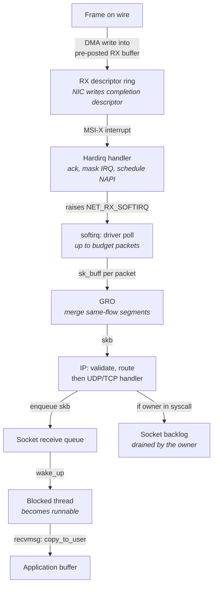
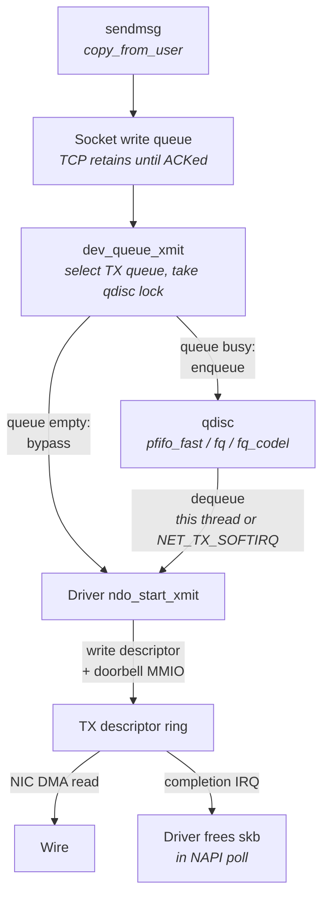
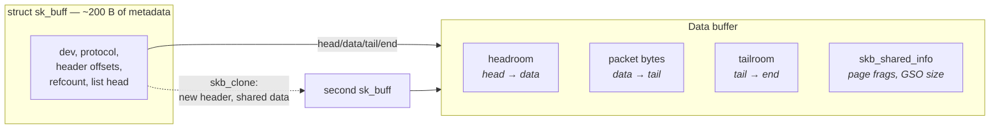
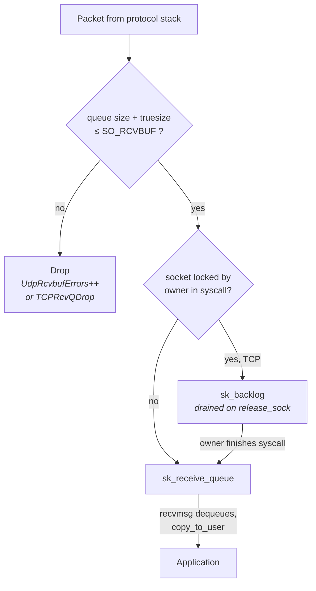
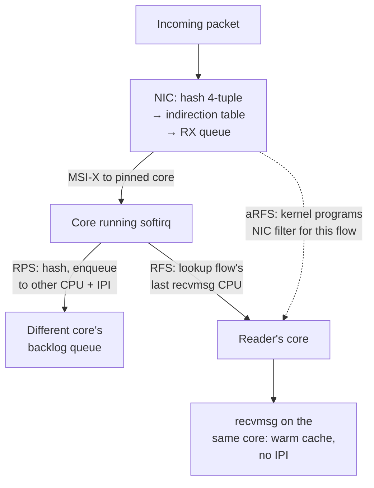
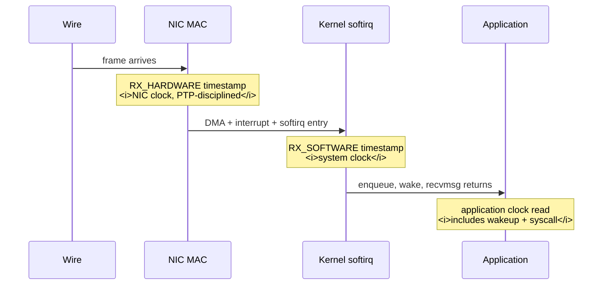

# The Linux Networking Stack

You know what a socket is. You have called `recv` and gotten bytes back. What a networking course
does not tell you is that between the last bit of a frame arriving on the fibre and your `recv`
returning, the packet has been written into host memory by a device engine, announced by an
interrupt, deferred to a software interrupt context, walked through three or four protocol layers,
possibly merged with other packets, copied at least once, appended to a linked list hanging off a
socket, and — if your thread happened to be blocked — used to wake a task that then had to be
scheduled onto a core. On a stock server that whole sequence costs somewhere between five and fifty
microseconds, and the spread between those two numbers is almost entirely a function of settings you
have never touched.

That spread is the subject of this chapter. The kernel network stack is a general-purpose design: it
is built to survive a hostile internet, to move ten million packets per second without livelocking
the machine, to share one NIC fairly among a thousand processes, and to keep the CPU available for
useful work while it does. Every one of those goals is achieved by *deferring* work — pushing it out
of the interrupt handler, batching it, amortizing it. Deferral is exactly what trades latency for
throughput, and the defaults are tuned for throughput. A packet that arrives when the system is idle
takes a different path, with different costs, than one that arrives mid-batch, and the difference
shows up as jitter rather than as a slower average.

The chapter walks the data path in the order a packet meets it: reception first, then transmission,
then the mechanisms that govern *when* the stack runs at all, then the buffer object everything
operates on, then the queues where packets are lost, then how work is spread across cores, then the
hardware offloads, and finally how to measure any of it honestly. Hardware — PCIe, DMA, MSI-X, the
descriptor ring — belongs to "Buses, Devices, and I/O Hardware" and is only summarized here.
Protocol behavior — congestion control, retransmission, multicast group management — belongs to
Chapters 16 through 19. The socket API surface belongs to "Sockets Programming Model." And the
option of removing the kernel from the path entirely belongs to "Kernel Bypass." This chapter is
about the software in between: what it does, what it costs, and how to see it.

## The Reception Path: From Wire to Socket

Consider one 200-byte UDP datagram arriving on a 25 GbE port. Serializing it onto the wire takes
about 70 nanoseconds. Everything that follows is host cost, and it dwarfs the wire time by two to
three orders of magnitude. Understanding *why* requires walking the path, because each stage exists
for a reason and each one can be tuned or bypassed once you know what it does.

The naive design a reader might imagine is: the NIC raises an interrupt, the CPU jumps to a handler,
the handler parses the packet and hands it to the application. This fails on a modern machine for two
reasons. First, at line rate a 25 GbE port can deliver over 35 million minimum-size frames per
second; an interrupt per frame would consume the entire machine in interrupt entry and exit overhead
alone, and the system would livelock — spending 100% of its cycles taking interrupts and 0% doing
anything with the packets. Second, an interrupt handler runs with interrupts disabled on that core
and preempts everything, so doing protocol work there would make every other latency on the machine
worse. The kernel therefore splits the work in two: a tiny hardware interrupt handler that does
almost nothing, and a deferred *software interrupt* context that does the real work.

Here is the actual sequence. Before any packet arrives, the driver has already allocated receive
buffers and published their physical addresses into a **descriptor ring** — a circular array in host
memory that the NIC reads to learn where it is allowed to write. When a frame arrives, the NIC's
receive engine performs a **DMA write**, placing the frame directly into one of those buffers without
CPU involvement, and then writes back a completion descriptor marking that slot as filled. On Intel
server parts with Data Direct I/O the payload lands in a portion of the last-level cache rather than
in DRAM, which removes a DRAM round trip from the path (see "Buses, Devices, and I/O Hardware"). The
NIC then raises an MSI-X interrupt targeted at a specific core.

The hardware interrupt handler — the **hardirq** — does three things and nothing else: it
acknowledges the interrupt, it *disables further receive interrupts for that queue*, and it schedules
the queue's NAPI poll instance. Then it returns. The whole handler is on the order of a microsecond
including interrupt entry and exit. Disabling the interrupt is the key move: the NIC will keep
DMA-ing arriving packets into the ring, but it will not interrupt again until the kernel has drained
what is there and re-enabled it. This converts a per-packet interrupt cost into a per-batch one, and
it is the essence of NAPI, covered in its own section below.

Scheduling the poll raises `NET_RX_SOFTIRQ`, a **softirq** — a deferred-work mechanism that runs with
interrupts enabled but still outside any process's context, and still at higher priority than any
user thread on that core. The softirq typically runs immediately on interrupt exit, on the same core
that took the hardirq. It calls the driver's poll function, which walks the completion descriptors,
wraps each filled buffer in an `sk_buff` (the kernel's packet metadata structure, described in its
own section), and passes it up. On the way up, the Generic Receive Offload layer may merge several
consecutive segments of the same flow into one larger `sk_buff` before the protocol stack sees it.

From there the packet traverses the protocol stack in the same softirq: Ethernet demultiplexing by
EtherType, IP header validation and routing lookup, then the transport handler. For UDP, that means a
hash lookup to find the receiving socket, a check that the socket's receive buffer has room, and
appending the `sk_buff` to the socket's receive queue. For TCP, it means sequence-number processing,
possible reordering through the out-of-order queue, ACK generation, and either appending to the
receive queue or — if the owning process is currently inside a syscall on that socket — appending to
the socket's *backlog* queue for that process to drain itself. Finally, the stack wakes any thread
blocked on the socket.

That wakeup is a scheduling event, and it is frequently the largest single term in the whole path. A
`wake_up` marks the task runnable; the task then has to actually get onto a core, which may require
an inter-processor interrupt to a different core, a scheduler run, and a context switch (see
"Processes, Threads, and Scheduling"). On an otherwise idle core this is a couple of microseconds; on
a loaded core, or one that has entered a deep C-state, it can be tens.



- **The diagram's left spine is the throughput-optimized path** — everything from the hardirq to the
  socket queue happens in softirq context on one core, batched, with no process involvement.
- **The last two edges are where latency variance concentrates**: the wakeup is a scheduler event,
  and `copy_to_user` is a real memory copy whose cost depends on whether the data is still in cache.
- **The branch to the backlog queue exists only for TCP** and only when the socket is locked by its
  owner; it is a correctness mechanism that occasionally shows up as a latency surprise.

Rough order-of-magnitude budget for a modern x86 server (Skylake-and-later class) with a 10/25 GbE
NIC, no coalescing, and a warm cache — treat these as teaching figures, not constants:

| Stage | Typical cost | What dominates it |
|---|---|---|
| DMA write of a small frame | ~200–500 ns | PCIe transaction, posted write |
| Interrupt delivery to first handler instruction | ~1–2 µs | MSI-X routing, interrupt entry, cache-cold handler |
| Hardirq handler body | ~100–300 ns | Register write to mask, NAPI schedule |
| softirq entry + driver poll for one packet | ~1–2 µs | Descriptor read, `sk_buff` allocation |
| IP + UDP processing | ~0.5–1.5 µs | Route lookup, socket hash lookup |
| Wake + context switch to the reader | ~2–10 µs | Scheduler, possible IPI, possible C-state exit |
| `recvmsg` syscall + copy of a small payload | ~0.5–1.5 µs | Syscall boundary (see "Kernel Architecture and the Syscall Boundary"), copy |

Sum it and a well-behaved kernel path is roughly 5–15 µs wire-to-application for a small datagram.
With default interrupt coalescing enabled the first term alone can add 20–100 µs. With kernel bypass
the same path is roughly 1–2 µs (see "Kernel Bypass"). Those three numbers — 50 µs stock, 10 µs
tuned, 1 µs bypassed — are the whole economic argument of this part of the book.

**Failure mode: latency is fine at low rates and collapses under a burst, with no packet loss
reported by the switch.** The symptom is a p99 that jumps by tens of microseconds during bursts while
p50 is unchanged. The cause is that under load the softirq exhausts its budget and defers the
remainder to `ksoftirqd`, a normal-priority kernel thread that must be scheduled like anything else.
Confirm by reading `/proc/net/softnet_stat`: the third column is `time_squeeze`, incremented each
time a softirq run ends because it hit the budget or time limit rather than because the ring was
empty. A rising `time_squeeze` on the core handling your queue is direct evidence.

**Failure mode: the receiving thread is pinned and isolated, yet its latency still varies with
unrelated system activity.** The cause is that softirq processing for your NIC queue runs on the core
the MSI-X interrupt is routed to, which may be your application core. Softirqs preempt user threads.
Confirm by matching the queue's IRQ number in `/proc/interrupts` against
`/proc/irq/<N>/smp_affinity_list`, and by watching `NET_RX` counts per core in `/proc/softirqs`.

**Try it:** watch the whole path once. On an idle test box, run
`watch -n1 'grep -E "eth|ens|enp" /proc/interrupts'` in one terminal and send a slow stream of UDP
datagrams to the host. You will see the interrupt count for exactly one queue rise, and you can read
off which core is servicing it. Then run `cat /proc/softirqs` before and after and confirm the
`NET_RX` row rises on the same core. Now raise the packet rate and watch the ratio of packets to
interrupts climb well above one — that is NAPI batching, and you have just observed interrupt
mitigation without changing a setting.

**Try it:** count the stages with tracepoints instead of guessing. Run
`sudo perf record -e net:netif_receive_skb -e skb:consume_skb -e skb:kfree_skb -a -g -- sleep 5`
while traffic flows, then `sudo perf script`. The `netif_receive_skb` tracepoint fires as each packet
enters the protocol stack, and its stack trace shows you the exact driver poll function and softirq
frame involved. This is the fastest way to learn which driver you are actually running.

## The Transmission Path and Queueing Disciplines

Transmission looks symmetric to reception, and in the broad shape it is: the application writes,
the stack builds packets, the driver posts descriptors, the NIC DMA-reads and transmits. But there is
one structure on the TX side with no RX counterpart, and it is the source of most TX-side latency
surprises: the **queueing discipline**, or qdisc — a software packet scheduler that sits between the
protocol stack and the driver.

Start with why it exists. A NIC's transmit ring is finite, typically 256 to 4096 descriptors, and a
25 GbE port drains it at a fixed rate. If the machine generates packets faster than the wire can
carry them, something must queue them or drop them. More importantly, Linux wants to be able to
*schedule* that queue: prioritize interactive traffic over bulk, enforce rate limits, prevent one
flow from starving another. That policy cannot live in the NIC, so it lives in a software layer the
kernel controls. Every packet leaving a physical interface passes through a qdisc.

The path, concretely. A `send`/`sendmsg` syscall enters the kernel and copies the user's data into
kernel memory. For TCP, `tcp_sendmsg` copies into `sk_buff`s that are appended to the socket's write
queue and *retained* there until acknowledged, because TCP may need to retransmit them; the
transmission itself happens when the congestion and receive windows allow. For UDP, an `sk_buff` is
built and pushed down immediately. Either way the packet reaches `dev_queue_xmit`, which selects a
transmit queue on the device, takes that queue's qdisc lock, and enqueues. If the qdisc is empty and
work-conserving, the kernel takes a shortcut and hands the packet straight to the driver without ever
touching the queue — the common case on an unloaded interface. Otherwise the packet sits until a
dequeue runs.

The driver's transmit routine writes the packet's address and length into the next TX descriptor and
rings a **doorbell** — an MMIO write telling the NIC there is new work. The NIC then DMA-*reads* the
payload out of host memory and serializes it onto the wire. The `sk_buff` cannot be freed until that
read has completed, so the NIC signals a **transmit completion** — usually a separate interrupt or a
completion queue entry — and the driver frees the buffer in a later NAPI poll. Completion handling is
pure overhead from a latency standpoint: it does not affect when the packet leaves, only when memory
is recycled. But it consumes CPU on the same core, and a driver that batches completions too
aggressively can stall a subsequent transmit by running the ring out of free descriptors.



- **The bypass edge is the fast path** and is why an idle interface has much lower and more
  predictable transmit latency than a busy one — the qdisc is skipped entirely.
- **The `NET_TX_SOFTIRQ` edge is the hazard**: when the qdisc lock is already held by another core,
  the sending thread does not spin waiting to transmit; it schedules a softirq and returns. Your
  packet now leaves on someone else's schedule.
- **The completion path does not delay the packet**, but it competes for the same core's cycles and
  can throttle subsequent sends if descriptors are not recycled promptly.

Multi-queue NICs make this tractable. A device with N transmit queues gets a root `mq` qdisc, which
is not a scheduler at all — it simply hangs one independent child qdisc off each hardware queue, so
cores using different queues never contend on the same lock. What matters for latency is which child
qdisc is installed.

| qdisc | Behavior | Latency character |
|---|---|---|
| `pfifo_fast` | Three-band priority FIFO keyed on the packet's `TOS`/priority | Minimal per-packet work; the traditional low-overhead default |
| `fq_codel` | Per-flow queueing with a delay-controlled drop policy | Excellent for bufferbloat, adds classification and timestamp work per packet |
| `fq` | Per-flow queueing with pacing; used by TCP pacing and BBR | Adds pacing delay by design — deliberately not the lowest latency |
| `mq` | Root-only; one child per hardware TX queue | Removes cross-core qdisc lock contention; you almost always want this as root |
| `noqueue` | No queueing at all; enqueue fails instead of buffering | The default on virtual devices; usable on hardware only if the driver supports it |

Distributions increasingly ship `fq_codel` as `net.core.default_qdisc`. That is a good default for a
general server and a questionable one for a host whose only job is to emit a small number of tiny
packets with minimal delay, because per-packet classification and timestamping cost cycles that buy
nothing when the queue is never more than one packet deep. Inspect what you actually have with
`tc qdisc show dev eth0`; the root should read `mq` on any multi-queue NIC.

One further mechanism deserves mention because it is on by default and does affect delay. **Byte
Queue Limits (BQL)** caps how many *bytes* the driver will leave outstanding in the hardware ring,
adapting the limit to observed drain rate. The intent is to keep the standing queue in the NIC small
so that the qdisc, which can actually schedule, holds the packets instead of the FIFO ring, which
cannot. It is exposed per transmit queue under
`/sys/class/net/eth0/queues/tx-0/byte_queue_limits/`, with `limit`, `limit_min`, `limit_max`, and
`inflight`. For a host sending a trickle of small packets, BQL never engages; for one that also
carries bulk traffic on the same interface, it is what stops the bulk traffic from parking a
millisecond of data in front of your next packet.

**Failure mode: transmit latency has a bimodal distribution, with a second mode several microseconds
out.** The cause is qdisc lock contention: when a core finds the lock held, the packet is deferred to
`NET_TX_SOFTIRQ` rather than transmitted inline. Confirm by checking whether the root qdisc is `mq`
(`tc qdisc show dev eth0`) — if a single qdisc instance is shared across all cores, contention is
structural — and by watching the `NET_TX` row of `/proc/softirqs` grow on cores other than the sender.

**Failure mode: a bulk transfer on the same interface adds hundreds of microseconds to unrelated
small packets.** This is head-of-line delay in the transmit queue (see "TCP In Depth" for the
protocol-level treatment). Confirm with `tc -s qdisc show dev eth0`, which reports per-qdisc
`backlog` in bytes and packets and a cumulative `drops` count. A persistently nonzero backlog means
your packets are waiting behind someone else's.

**Try it:** measure the qdisc's contribution directly. Run `tc -s qdisc show dev eth0` and record the
backlog while idle — it should be zero. Start a bulk sender saturating the link, re-read, and observe
backlog grow. Then compare `pfifo_fast` and `fq_codel` under the same load:
`sudo tc qdisc replace dev eth0 root mq` gives you per-queue children, and
`sudo tc qdisc replace dev eth0 parent 1:1 pfifo_fast` swaps one child. Measure your small-packet
latency in both configurations rather than trusting either default.

**Try it:** watch BQL adapt. `cat /sys/class/net/eth0/queues/tx-0/byte_queue_limits/inflight` in a
loop under load; the value tracks bytes handed to the NIC but not yet completed, and `limit` will
adjust itself. Setting `limit_max` to a small value and re-measuring shows you how much of your tail
was hardware-ring queueing.

## NAPI, Softirqs, and Interrupt Mitigation

This section covers the machinery that decides *when* the stack runs, and it is the single highest-
leverage part of the chapter. Two independent mechanisms mitigate interrupts, they interact, and
engineers routinely tune one while the other dominates.

The first is in the NIC: **interrupt coalescing**. The hardware deliberately delays raising an
interrupt, waiting either until a timer expires or until some number of packets have accumulated.
From the NIC's perspective this is obviously good — one interrupt amortized over twenty packets
instead of twenty interrupts. From a latency perspective it is a straight, unhedged addition of delay
to the first packet of any idle period. If `rx-usecs` is 50, a packet arriving into an empty ring
waits up to 50 microseconds before the CPU is even told about it. That is five to ten times the
entire rest of the kernel path. Vendors ship *adaptive* coalescing by default, which varies the delay
with observed load; adaptive is worse than a fixed small value for our purposes because the delay
becomes load-dependent and therefore unpredictable, which is precisely the property we are trying to
eliminate.

The second is in the kernel: **NAPI** ("New API", a name that has long outlived its usefulness).
NAPI's insight is that under load, interrupts are worthless — if packets are arriving continuously,
you already know there is work, so being told again is pure overhead. So the driver's hardirq handler
masks the queue's interrupt and schedules a poll. The poll runs in softirq context and drains up to
`weight` packets from the ring, conventionally 64. If it drains fewer than the weight, the ring is
empty, so NAPI completes: it re-enables the interrupt and goes back to sleep. If it hits the weight,
packets are still arriving, so NAPI reschedules itself and stays in polling mode with interrupts
still masked.

```mermaid
stateDiagram-v2
    [*] --> Idle: interrupts enabled
    Idle --> Scheduled: packet arrives<br/>hardirq masks IRQ,<br/>schedules NAPI
    Scheduled --> Polling: NET_RX_SOFTIRQ runs
    Polling --> Polling: drained == weight<br/><i>more work; stay masked</i>
    Polling --> Idle: drained < weight<br/><i>napi_complete: unmask IRQ</i>
    Polling --> Deferred: budget or 2 ms exhausted<br/><i>time_squeeze++</i>
    Deferred --> Polling: ksoftirqd scheduled
```



- **The self-loop is the load-adaptive part**: at high rates the system polls continuously and takes
  essentially zero interrupts, giving throughput without livelock.
- **The `Deferred` state is where latency dies.** A softirq run is bounded by `net.core.netdev_budget`
  packets across all NAPI instances on that core and by `net.core.netdev_budget_usecs` of wall time.
  Exceeding either hands the remaining work to `ksoftirqd`, a normal `SCHED_OTHER` kernel thread that
  must now compete for the core with everything else.
- **The transition back to `Idle` is what makes the first packet of a burst expensive**: after an idle
  period the interrupt has to be taken again, paying full interrupt-delivery cost plus whatever the
  coalescing timer added.

The relevant knobs, and what each actually controls:

| Knob | Where | Default (typical) | Effect |
|---|---|---|---|
| `rx-usecs`, `tx-usecs` | `ethtool -c` / `-C` | vendor-dependent, often 8–50 | Hardware delay before raising an interrupt |
| `rx-frames` | `ethtool -c` / `-C` | vendor-dependent | Packet count that triggers an interrupt early |
| `adaptive-rx` | `ethtool -c` / `-C` | often `on` | Lets the driver vary the above with load |
| `net.core.netdev_budget` | `sysctl` | 300 | Packets one softirq run may process across all queues on a core |
| `net.core.netdev_budget_usecs` | `sysctl` | 2000 | Microseconds one softirq run may take |
| `net.core.dev_weight` | `sysctl` | 64 | Per-NAPI-instance packets per poll |
| `net.core.netdev_max_backlog` | `sysctl` | 1000 | Depth of the per-CPU backlog queue used by RPS and non-NAPI drivers |
| `gro_flush_timeout` | `/sys/class/net/eth0/` | 0 | Nanoseconds GRO holds packets before flushing |
| `napi_defer_hard_irqs` | `/sys/class/net/eth0/` | 0 | Number of times to defer re-arming the IRQ, polling instead |

The last two are worth dwelling on, because together they implement a form of kernel-side polling
that most people do not know exists. Setting `napi_defer_hard_irqs` to a nonzero value tells NAPI not
to immediately re-enable the interrupt when the ring drains; instead it schedules another poll after
`gro_flush_timeout` nanoseconds. With both set, a lightly loaded interface is polled on a short timer
rather than interrupt-driven, which removes interrupt-delivery latency from the path at the cost of
burning cycles polling an empty ring. It is a middle ground between stock interrupt-driven operation
and full busy polling, and unlike `SO_BUSY_POLL` it requires no application change.

For a latency-critical receive path the usual configuration is: coalescing off or as low as the
hardware allows, adaptive off, and the deferral mechanism above enabled if you can afford the cycles.

```bash
# Read what you actually have first.
sudo ethtool -c eth0

# Minimize hardware-side delay. Not all NICs accept 0; some have a floor.
sudo ethtool -C eth0 adaptive-rx off adaptive-tx off rx-usecs 0 rx-frames 1

# Optional: kernel-side timer polling instead of interrupt re-arm.
echo 2     | sudo tee /sys/class/net/eth0/napi_defer_hard_irqs
echo 20000 | sudo tee /sys/class/net/eth0/gro_flush_timeout
```

Setting `rx-usecs 0` costs CPU: you are now taking an interrupt per packet at low rates. On a host
whose entire purpose is to react to a small number of packets quickly, that is the correct trade. On
a host also doing bulk work it may not be.

**Failure mode: median latency is dominated by a fixed offset of tens of microseconds that no code
change affects.** The cause is interrupt coalescing. Confirm with `ethtool -c eth0` and compare
`rx-usecs` against your observed offset; if they match, you have found it. This is the single most
common unforced error on an untuned host.

**Failure mode: latency degrades sharply above a specific packet rate, and `ksoftirqd` appears in
`top`.** The cause is softirq budget exhaustion — packet processing has been demoted to a schedulable
thread. Confirm by reading column 3 (`time_squeeze`) of `/proc/net/softnet_stat`, one row per CPU in
order, and by checking whether `ksoftirqd/<n>` for the receiving core is accumulating CPU time. The
fixes are to raise `netdev_budget`, to spread the load across more queues and cores (see the flow
steering section), or to reduce per-packet work.

**Failure mode: packets are dropped between the NIC and the protocol stack with no socket-level
errors.** Column 2 of `/proc/net/softnet_stat` counts packets dropped because the per-CPU backlog
queue was full — which happens when RPS is in use and the target CPU cannot keep up, or with legacy
non-NAPI drivers. Raise `net.core.netdev_max_backlog` or reduce the fan-in to that core.

**Try it:** quantify coalescing on your own hardware. Measure round-trip latency to a peer with a
small UDP echo at a low rate, recording a histogram. Then run
`sudo ethtool -C eth0 adaptive-rx off rx-usecs 50` and re-measure; then `rx-usecs 0` and re-measure.
The three distributions will separate cleanly, and the shift between them will be very close to the
`rx-usecs` value. Watching the median move by exactly the number you typed is the moment this
mechanism becomes real.

**Try it:** observe NAPI batching directly.
`sudo perf stat -e 'napi:napi_poll' -a -- sleep 5` while offering traffic at a known rate, then
compare the poll count against the packet count from `ethtool -S eth0 | grep rx_packets`. At low
rates the ratio approaches one packet per poll; at high rates it approaches the NAPI weight. Then
correlate with the interrupt count in `/proc/interrupts` to see interrupts per packet collapse toward
zero as rate rises.

## The sk_buff Lifecycle and the Copies You Pay For

Every packet in the kernel is represented by an `sk_buff` — universally written `skb`. It is not the
packet; it is a metadata structure that *points at* the packet data, plus about 200 bytes of
bookkeeping: which device, which protocol, header offsets, checksum state, timestamps, reference
counts, and a linked-list head so it can be queued. Understanding its structure explains where the
kernel's per-packet CPU cost comes from and, more importantly, which copies are avoidable and which
are not.

The data itself lives in a separately allocated buffer. The `skb` holds four pointers into it:
`head` (start of the allocation), `data` (start of the current protocol layer's view), `tail` (end of
valid data), and `end` (end of the allocation). The gap between `head` and `data` is **headroom**, and
it exists so that layers can *prepend* headers without copying — on transmit, TCP writes its header
by moving `data` backwards and filling in the space, then IP does the same, then Ethernet. On
receive, the reverse: each layer validates its header and advances `data` past it. Header
manipulation is therefore pointer arithmetic, not memcpy. That is the central design win and the
reason the stack can process millions of packets per second at all.

For payloads larger than the linear buffer, the `skb` carries an array of page fragments in the
`skb_shared_info` structure sitting at `end`. A large TCP send does not copy the user's data into one
contiguous buffer; it attaches pages. This matters for offloads (a segmentation-offloaded 64 KiB
`skb` is almost entirely fragments) and for zero-copy transmit (see "Sockets Programming Model").

Two operations look similar and cost radically differently. A **clone** (`skb_clone`) allocates a new
`skb` header pointing at the *same* data buffer and bumps the data's reference count — cheap, on the
order of an allocation, and used whenever two subsystems need independent metadata over identical
bytes. This is what `tcpdump` does: attaching a packet socket clones every packet to the capture path.
A **copy** (`skb_copy`, or `pskb_expand_head` when headroom runs out) duplicates the data as well.
Anything that must *modify* a packet that has more than one reference forces a copy.



- **Prepending a header moves `data` left into headroom** — no copy, which is why the layered design
  is not the performance disaster it looks like on paper.
- **`skb_clone` shares the data buffer**, so running `tcpdump` costs an allocation per packet rather
  than a full copy — but it is not free, and it is not zero-impact on a hot path.
- **`skb_shared_info` at the end of the buffer** holds the fragment list and the GSO segment size,
  which is how one `skb` can describe 64 KiB of data the NIC will split into MTU-sized frames.

Now the copies. Counting them honestly is the fastest way to understand why kernel-path latency has
the floor it does.

| Copy | When it happens | Avoidable? |
|---|---|---|
| NIC DMA into the RX buffer | Every received packet | No — this is the DMA itself, and with DDIO it lands in LLC |
| `copy_to_user` in `recvmsg` | Every received packet delivered to userspace | Only by bypass or `AF_XDP`-style shared memory (see "Kernel Bypass") |
| `copy_from_user` in `sendmsg` | Every transmitted packet | By `MSG_ZEROCOPY` or `sendfile` for large payloads (see "Sockets Programming Model") |
| NIC DMA read of the TX buffer | Every transmitted packet | No |
| `skb_clone` per capture socket | While `tcpdump` or any `AF_PACKET` socket is attached | Yes — stop capturing on the hot path |
| Full `skb_copy` | When a shared `skb` must be modified, or headroom is insufficient | Usually; driver-dependent |

The unavoidable per-packet copies are two DMA transfers plus one CPU copy in each direction. For a
200-byte payload the CPU copy is on the order of tens of nanoseconds if the data is in L3 — DDIO makes
this likely — and a few hundred nanoseconds if it must come from DRAM. For a 1500-byte frame, roughly
100–200 ns from cache. These are small compared to the wakeup and syscall terms, which is why "the
kernel copies your data" is a less important criticism of the kernel path than the number of context
switches and the depth of the call chain.

Allocation is the other per-packet cost. Every received packet needs an `skb` and a data buffer.
Modern drivers use the **page pool** allocator, which recycles DMA-mapped pages rather than
allocating and mapping fresh ones per packet — DMA mapping is expensive, especially with an IOMMU in
the path. Some drivers additionally use `build_skb`, constructing the `skb` header around a buffer the
NIC already wrote into, avoiding one allocation. Whether your driver does either is a driver
implementation detail that changes across kernel versions; you can usually see it in the driver's
`ethtool -S` counters, many of which report page-pool recycling statistics on recent kernels.

**Failure mode: enabling packet capture on a production host measurably raises hot-path latency.**
The cause is per-packet `skb_clone` plus the capture path's own processing, in softirq context, on the
same core. Confirm by measuring with and without `tcpdump` attached, and by checking the `drop`
counts `tcpdump` reports on exit. The mitigation is to capture on a mirror port or tap rather than on
the host (see "Network Design and Operations").

**Failure mode: throughput collapses and `perf` shows time in DMA mapping functions.** The cause is
an IOMMU translating every DMA-mapped buffer without page-pool recycling in the driver. Confirm with
`perf top` during load and look for `iommu` or `dma_map` symbols. On a dedicated host the usual
resolution is to pass `iommu.passthrough=1` at boot, accepting the security trade-off.

**Try it:** measure the cost of a capture socket. Establish a baseline latency histogram, then run
`sudo tcpdump -i eth0 -n 'udp port 5000' -w /dev/null` and re-measure. The delta is the per-packet
clone-plus-capture cost on your hardware, and it is usually larger than people expect.

**Try it:** count allocations. `sudo perf stat -e 'skb:kfree_skb,skb:consume_skb' -a -- sleep 5` under
load. `consume_skb` fires on normal completion; `kfree_skb` fires on *drops*. A high `kfree_skb` rate
is a red flag, and `sudo perf record -e skb:kfree_skb -a -g` gives you the stack trace of exactly
where in the stack packets are being discarded — the cheapest drop-diagnosis tool that exists.

## Socket Buffers, Backlogs, and Drop Counters

A socket is not just an endpoint; it is a pair of queues with limits, and every limit is a place a
packet can be silently destroyed. Market data arrives as UDP multicast in bursts, so the depth of the
receive queue directly determines how long the application may stall before losing data — which makes
this section's counters the ones you check first when something is missing.

Start with the receive side. When the protocol stack finishes processing a packet, it appends the
`skb` to the socket's receive queue, but only after checking that the queue's accounted size is below
`SO_RCVBUF`. If it is not, the packet is dropped — not queued, not signaled, just dropped, with a
counter incremented somewhere the application never looks. There is no backpressure to the sender for
UDP and no error returned to the reader. This is the most common way a receiver "loses" multicast:
not on the wire, not in the switch, but in the last 100 nanoseconds of a path that otherwise worked
perfectly.

The accounting is subtler than it looks. `SO_RCVBUF` limits `skb->truesize` — the total memory
charged, including the `skb` header and the whole data buffer — not payload bytes. A 100-byte datagram
sitting in a 2 KiB driver-allocated buffer may be charged well over 2 KiB. A receive buffer nominally
sized for a thousand packets may therefore hold only a couple of hundred. Additionally, `setsockopt`
with `SO_RCVBUF` doubles the value you pass, as accounting overhead, and clamps it to
`net.core.rmem_max`. Setting a large buffer without first raising `rmem_max` silently gives you the
clamp — the call succeeds and the size is wrong. Always read the value back with `getsockopt`.



- **The drop edge is unconditional and silent** — nothing in the application's control flow observes
  it; only the counters do.
- **The backlog branch is TCP-specific**: if the owning process holds the socket lock inside a
  syscall, softirq-context packets go onto `sk_backlog` and are processed by the *owner* when it
  releases the lock, which is why a slow reader can add processing latency to its own next packet.
- **`truesize` accounting**, not payload size, decides which way the top branch goes.

For TCP there is a second, entirely different "backlog": the **accept queue**. A listening socket has
a queue of completed connections waiting for `accept`, bounded by the `backlog` argument to `listen`
and clamped by `net.core.somaxconn`. Separately, `net.ipv4.tcp_max_syn_backlog` bounds the queue of
half-open connections in `SYN_RECV`. Overflow of the accept queue drops the connection attempt
(retransmitted SYN-ACKs follow); overflow of the SYN queue triggers SYN cookies if enabled. The
protocol consequences are covered in "TCP In Depth"; what matters here is that these are three
distinct queues with three distinct counters and confusing them wastes hours.

The counters, and this is the reference table worth memorizing:

| Counter | Source | Means |
|---|---|---|
| `UdpRcvbufErrors` | `nstat`, `/proc/net/snmp` | Datagram dropped because `SO_RCVBUF` was full — the receiver was too slow |
| `UdpInErrors` | `nstat`, `/proc/net/snmp` | Datagram dropped for other reasons: checksum failure, truncation |
| `UdpNoPorts` | `nstat`, `/proc/net/snmp` | No socket bound to the destination port |
| `drops` column | `/proc/net/udp` | Per-socket drop count — tells you *which* socket, unlike the global counters |
| `TcpExtListenOverflows` | `nstat`, `/proc/net/netstat` | Accept queue full when a handshake completed |
| `TcpExtListenDrops` | `nstat`, `/proc/net/netstat` | Connection request dropped for any reason, superset of the above |
| `TcpExtTCPBacklogDrop` | `nstat` | Packet dropped from the per-socket backlog queue |
| `TcpExtTCPRcvQDrop` | `nstat` | Packet dropped because the receive queue was full |
| `TcpExtTCPOFOQueue` | `nstat` | Packets queued out-of-order — indicates loss or reordering upstream |
| `TcpExtPruneCalled`, `TcpExtRcvPruned` | `nstat` | Memory pressure forced the stack to prune receive queues |
| `rx_missed_errors`, `rx_no_buffer_count` | `ethtool -S eth0` | NIC had no free descriptor — the host could not keep up with the wire. Names are vendor-specific |
| `RX dropped` / `overrun` | `ip -s -s link show eth0` | Device-level drop and FIFO overrun aggregates |

The order in which you read them matters, because they localize the loss. `ethtool -S` counters
rising means the NIC dropped the packet before the host ever saw it — the ring was full, so the
softirq is not keeping up, which points at coalescing, budget, or CPU contention. `softnet_stat`
column 2 means the per-CPU backlog overflowed. `UdpRcvbufErrors` means the packet made it all the way
through the stack and died at the socket — the *application* is not keeping up. Three different
problems, three different fixes, and they are distinguished purely by which counter moved.

Sizing the receive buffer is a burst-absorption calculation. If your reader can be descheduled for
up to *T* microseconds and packets arrive at *R* per second, you need roughly *T* × *R* packets of
space, times the per-packet `truesize`, not the payload size. A reader that can be preempted for a
1 ms scheduler tick at 200,000 packets per second needs 200 packets of headroom; at a 2 KiB truesize
that is 400 KiB, which exceeds the typical `rmem_max` default. Raising it is one of the standard
tuning steps:

```bash
# Raise the ceiling before any application asks for a large buffer.
sudo sysctl -w net.core.rmem_max=134217728
sudo sysctl -w net.core.wmem_max=134217728
# TCP autotunes within these three values: min, default, max.
sudo sysctl -w net.ipv4.tcp_rmem="4096 131072 134217728"
```

TCP additionally *autotunes* its receive buffer between the bounds of `net.ipv4.tcp_rmem` based on
observed bandwidth-delay product, unless the application sets `SO_RCVBUF` explicitly — which disables
autotuning for that socket. That is usually the wrong choice for bulk TCP and sometimes the right one
for a latency-critical connection where you want a fixed, known depth.

**Failure mode: multicast gaps appear under load, but switch counters and `ethtool -S` are clean.**
The packets reached the host and died at the socket. Confirm with `nstat -az | grep -i udp` before and
after, watching `UdpRcvbufErrors`; then find the specific socket via the `drops` column in
`/proc/net/udp`. The fix is a larger `SO_RCVBUF` (after raising `rmem_max`), a faster reader, or both.

**Failure mode: connections intermittently fail to establish under bursty load, with clients seeing
long delays before success.** The cause is accept-queue overflow: the handshake completed but the
application had not called `accept` in time, so the connection was dropped and the client's
retransmitted ACK eventually re-established it after a retransmission timeout. Confirm with
`nstat -az TcpExtListenOverflows` and by reading `ss -lnt`, where for a *listening* socket `Recv-Q` is
the current accept-queue depth and `Send-Q` is its maximum.

**Failure mode: a TCP receiver reports a healthy socket but the sender stalls.** Confirm with
`ss -tim`, which prints the per-connection congestion window, RTT estimate, retransmit counts, and
`bytes_acked`; a receive window pinned near zero identifies a slow reader rather than a network
problem.

**Try it:** make the drop happen deliberately. Write a UDP receiver that sleeps for 50 ms between
`recv` calls, blast it with a few thousand packets per second, and watch `UdpRcvbufErrors` climb via
`nstat -az UdpRcvbufErrors`. Then find your socket's row in `/proc/net/udp` and confirm the per-socket
`drops` column matches. Now raise `SO_RCVBUF` — remembering to raise `net.core.rmem_max` first — and
watch the loss threshold move. Read the buffer size back with `getsockopt` to confirm it is double
what you requested and was not clamped.

**Try it:** learn to localize loss in three commands. Under a load that drops packets, run
`ethtool -S eth0 | grep -Ei 'drop|miss|err|no_buf'`, then
`awk '{print $2, $3}' /proc/net/softnet_stat`, then `nstat -az | grep -Ei 'Udp|Drop'`. Whichever of
the three moves tells you which layer to fix.

## Steering Flows to Cores: RSS, RPS, RFS, XPS

A single core cannot process 25 GbE of small packets. Beyond throughput, there is a locality problem:
the softirq that processes a packet, and the application thread that reads it, ideally run on the same
core so that the packet data and the socket structure are in that core's L1 and L2, and so that no
inter-processor interrupt is needed to wake the reader (see "The Cache Hierarchy"). Getting both
properties requires deciding, per packet, which core handles it — and Linux provides four mechanisms
that do this at different points in the path with different costs.

The first is in hardware. **Receive Side Scaling (RSS)** has the NIC compute a hash — conventionally
Toeplitz — over a selection of header fields, typically the IPv4/IPv6 source and destination addresses
and the TCP/UDP source and destination ports. The low bits of the hash index an **indirection table**
whose entries name a receive queue. Each queue has its own MSI-X interrupt, which is routed to a
specific core. The result is that all packets of one flow land on one queue, hence one core, in
order, with zero CPU cost for the steering decision. Flow-to-core assignment is stable, which is what
lets per-core state stay in per-core cache.

RSS's limitation is that it is oblivious. It knows nothing about where your application thread runs.
If the hash sends your flow to queue 3, whose interrupt is pinned to core 7, but your reader is pinned
to core 12, every packet crosses cores: the softirq touches the data on core 7, the wakeup is an IPI
to core 12, and the copy to userspace pulls the data across the cache coherence fabric (see
"Multicore, Coherence, and Memory Ordering"). That is a few microseconds of avoidable cost per packet
and a large source of variance.

Three software mechanisms address different parts of the gap:

**Receive Packet Steering (RPS)** is RSS in software. The core that took the interrupt computes a
hash and, instead of processing the packet itself, enqueues it onto a *different* core's per-CPU
backlog queue and sends that core an IPI to run its softirq. It exists for NICs with too few hardware
queues and for spreading load beyond the number of queues available. It costs an IPI and a cross-core
enqueue per packet, so it adds latency — RPS is a throughput and fairness tool, not a latency tool.

**Receive Flow Steering (RFS)** adds the missing information. The kernel records, in a global table,
which CPU last ran `recvmsg` for each flow, and steers subsequent packets of that flow to that CPU.
Now the softirq and the reader are on the same core, the data is in the right cache, and no IPI is
needed to wake anything. RFS is built on RPS and inherits its per-packet software steering cost.
**Accelerated RFS** pushes the same decision into the NIC: the kernel programs a hardware flow-steering
rule so the NIC itself delivers the flow to the queue whose interrupt lands on the reader's core.
That gives RFS's locality with RSS's zero cost, and it requires driver support plus `ntuple` filtering
enabled.

**Transmit Packet Steering (XPS)** is the transmit-side analogue: it maps CPUs to transmit queues, so
a thread on core 5 always uses the same TX queue, which means no cross-core contention on that queue's
qdisc lock and no cache-line ping-ponging of queue state.



- **The dotted aRFS edge is the configuration you want** for a latency-critical receiver: the
  hardware delivers directly to the reader's core, so neither RPS's IPI nor RSS's obliviousness
  applies.
- **The RPS edge always costs an IPI**, which is why enabling RPS on a low-rate latency-sensitive
  path usually makes it worse, not better.
- **The RFS edge removes the cross-core wakeup** but still pays software hashing on the interrupt
  core.

For a dedicated trading host there is a simpler configuration that beats all of this: reduce the NIC
to a small number of queues, pin each queue's interrupt to a known core, pin the reader to that same
core, and either use hardware flow-steering rules to place specific flows on specific queues or accept
the RSS hash. Explicit placement is more predictable than any adaptive mechanism.

```bash
# How many queues do we have, and how are they distributed?
ethtool -l eth0
ethtool -x eth0                 # RSS indirection table and hash key

# Which header fields feed the hash for UDP over IPv4?
ethtool -n eth0 rx-flow-hash udp4
# Include ports in the UDP hash (s=src IP, d=dst IP, f=src port, n=dst port).
sudo ethtool -N eth0 rx-flow-hash udp4 sdfn

# Reduce to 4 combined queues for a predictable, small mapping.
sudo ethtool -L eth0 combined 4

# Find each queue's IRQ and pin it. Never leave irqbalance running on a tuned host.
grep eth0 /proc/interrupts
echo 4 | sudo tee /proc/irq/<N>/smp_affinity_list

# Explicit hardware steering: send UDP dst port 5000 to RX queue 3.
sudo ethtool -K eth0 ntuple on
sudo ethtool -N eth0 flow-type udp4 dst-port 5000 action 3

# RPS/RFS if you need them (hex CPU mask per RX queue).
echo f | sudo tee /sys/class/net/eth0/queues/rx-0/rps_cpus
sudo sysctl -w net.core.rps_sock_flow_entries=32768
echo 4096 | sudo tee /sys/class/net/eth0/queues/rx-0/rps_flow_cnt

# XPS: bind TX queue 0 to CPUs in the mask.
echo 1 | sudo tee /sys/class/net/eth0/queues/tx-0/xps_cpus
```

Note the default UDP hash on many NICs covers only IP addresses, not ports. For a receiver taking
many multicast groups from a single source address, that means every group hashes to the same queue
and therefore the same core, regardless of how many queues you configured. `ethtool -n` tells you;
`ethtool -N ... sdfn` fixes it, on hardware that supports it.

**Failure mode: one core is saturated with softirq work while the others are idle, despite a
multi-queue NIC.** The cause is a hash that does not discriminate your traffic — commonly a UDP hash
covering only addresses when all your flows share a source, or encapsulated traffic the NIC cannot
parse. Confirm by reading per-queue packet counters from `ethtool -S eth0 | grep -E 'rx.*queue|rx[0-9]'`
(naming is vendor-specific) and observing that one queue has all the traffic; cross-check with
`/proc/interrupts`, where one queue's IRQ count dominates.

**Failure mode: latency improves when you pin the reader to a different core, for no apparent
reason.** You have moved the reader onto the core that services the queue its flow hashes to. Confirm
by mapping queue → IRQ → core via `/proc/interrupts` and `/proc/irq/<N>/smp_affinity_list`, then
verifying against the reader's affinity. `SO_INCOMING_CPU` lets an application query which CPU
processed a socket's last packet, which turns this from guesswork into a lookup.

**Failure mode: interrupt affinity resets itself after some minutes.** `irqbalance` is running and
periodically redistributing IRQs. Confirm by reading `/proc/irq/<N>/smp_affinity_list` twice, minutes
apart. Disable the service on any tuned host.

**Try it:** verify the hash empirically rather than trusting documentation. Record all per-queue RX
counters from `ethtool -S eth0`, send traffic from several distinct source ports to one destination,
and re-read. If the traffic spread across queues, ports are in the hash; if it all landed on one,
they are not. Then run `sudo ethtool -N eth0 rx-flow-hash udp4 sdfn` and repeat.

**Try it:** measure the cross-core penalty. Pin a UDP receiver to the core that services its flow's
queue and record a latency histogram; then pin it to a core on the *other* NUMA node and record again
(check the NIC's node with `cat /sys/class/net/eth0/device/numa_node`, and see "Memory Systems"). The
gap between the two distributions is the cost of getting placement wrong, and it is typically several
microseconds at the tail.

## Offloads and When to Turn Them Off

Offloads move work from the CPU into the NIC. Most of them are unambiguously good; two of them trade
latency for throughput and should usually be off on a latency-critical receive path. Distinguishing
the two categories requires knowing what each actually does, because the acronyms are similar and the
`ethtool` names are worse.

**Checksum offload** is the easy case. Both IP and TCP/UDP carry checksums over the payload. Computing
one in software means touching every byte — for a 1500-byte frame, hundreds of nanoseconds, and it
pollutes cache. The NIC computes it instead: on transmit, the stack leaves a placeholder and the NIC
fills it in; on receive, the NIC verifies and sets a flag in the descriptor so the stack skips
verification. There is no latency cost and a real CPU saving. Leave it on. The one caveat is
diagnostic: a locally captured outgoing packet shows an unfilled checksum, which `tcpdump` reports as
"incorrect checksum" — an artifact of capturing before the NIC touched the packet, not a bug.

**Segmentation offload** is the transmit-side batching case. TCP must split a byte stream into
MTU-sized segments, each with its own header. Doing so in software means the stack builds, queues,
and hands down forty separate packets to send 60 KiB. **TCP Segmentation Offload (TSO)** lets the
stack build one large `sk_buff` — marked with the target segment size in `skb_shared_info` — and the
NIC does the splitting and header replication. **Generic Segmentation Offload (GSO)** is the software
fallback: the same deferral, but the split happens in the kernel just before the driver, which still
saves most of the per-packet stack traversal cost. For bulk transmission these are enormous wins. For
a host sending single small packets they are inert: a 200-byte send is never segmented, so TSO neither
helps nor hurts. The reason to think about them at all is that they distort measurement — a captured
trace on a TSO-enabled host shows 64 KiB "packets" that never existed on the wire.

**Receive-side merging is the one that costs latency.** **Generic Receive Offload (GRO)** runs in the
NAPI poll and merges consecutive segments of the same flow into one large `sk_buff` before the
protocol stack sees them. Ten 1500-byte segments become one 15 KiB `skb` traversing IP and TCP once
instead of ten times. That is a large throughput win. But merging requires *waiting* for more packets
to merge with, and the merged packet is not delivered until the NAPI poll completes or a flush is
forced. On a bulk transfer this is invisible. On a request/response path where the response is one
small packet, GRO adds nothing to merge and mostly gets out of the way — but when it does hold a
packet, it holds it for up to `gro_flush_timeout` nanoseconds, and the delay is load-dependent.

**Large Receive Offload (LRO)** is the hardware version of GRO, and it is worse in a specific way:
the merge is lossy. The NIC discards per-segment header information that cannot be reconstructed,
which makes LRO incorrect for forwarding and problematic for anything that needs per-packet fidelity.
It is disabled by default in most modern configurations and should stay that way.

| Offload | `ethtool -k` name | What it does | Latency-critical setting |
|---|---|---|---|
| RX checksum | `rx-checksumming` | NIC verifies L3/L4 checksums | **On** — pure win |
| TX checksum | `tx-checksumming` | NIC computes L3/L4 checksums | **On** — pure win |
| TSO | `tcp-segmentation-offload` | NIC splits a large `skb` into MTU segments | On; irrelevant for small packets |
| GSO | `generic-segmentation-offload` | Kernel splits late, just before the driver | On; irrelevant for small packets |
| GRO | `generic-receive-offload` | Kernel merges RX segments in NAPI | **Off** on a latency-critical receive path |
| LRO | `large-receive-offload` | NIC merges RX segments, lossily | **Off** — also breaks forwarding |
| Hardware GRO | `rx-gro-hw` | NIC-assisted GRO on some devices | **Off** for latency |
| RX hashing | `receive-hashing` | NIC computes the RSS hash | On — required for RSS |
| Scatter-gather | `scatter-gather` | Transmit from fragmented buffers without linearizing | On — required for zero-copy paths |

```bash
sudo ethtool -k eth0                        # read all current settings
sudo ethtool -K eth0 gro off lro off        # the two that matter for RX latency
sudo ethtool -K eth0 rx-gro-hw off          # if the device supports it
```

The honest caveat: turning GRO off raises per-packet CPU cost on the receive path, because every
segment now traverses the full protocol stack individually. On a host receiving a high rate of bulk
TCP this can push you into `time_squeeze` territory and make latency *worse*. The right answer is
workload-dependent and must be measured, not assumed. The general shape is that GRO off is correct
when your latency-critical traffic is small discrete messages, and GRO on is correct when the same
interface also carries volume you cannot afford to process packet-by-packet.

**Failure mode: a packet capture shows frames far larger than the MTU.** On the transmit side this is
TSO/GSO — the capture happens before segmentation. On the receive side it is GRO/LRO — the capture
happens after merging. Confirm with `ethtool -k eth0`. When you need a faithful trace, either disable
the offloads for the duration or capture off-host at a tap.

**Failure mode: an unexplained delay of tens of microseconds on the last packet of a message
sequence.** GRO is holding it, waiting for a merge partner that never arrives, until the poll ends or
the flush timer fires. Confirm by setting `ethtool -K eth0 gro off` and re-measuring; also check
`cat /sys/class/net/eth0/gro_flush_timeout` for a nonzero value.

**Failure mode: turning GRO off made throughput worse and latency worse.** Per-packet stack cost now
exceeds the softirq budget. Confirm via a rise in `time_squeeze` (column 3 of
`/proc/net/softnet_stat`) and in `ksoftirqd` CPU time after the change. This is the trade-off, not a
misconfiguration.

**Try it:** see GRO merging in a trace. Run `sudo tcpdump -i eth0 -n -c 20 'tcp port 5001'` while
pulling a bulk transfer, and note the frame sizes exceed the MTU. Then `sudo ethtool -K eth0 gro off`
and repeat; frames now cap at the MTU and the packet count rises proportionally. Correlate with
`ethtool -S eth0 | grep rx_packets` to confirm the NIC saw the same number of frames both times — the
merging was always in software.

**Try it:** measure the CPU cost of the change. `sudo perf stat -a -- sleep 10` during a fixed-rate
bulk receive, with GRO on and then off, and compare cycles and instructions. You will see the
per-packet stack traversal cost directly, which tells you how much headroom you have before turning
GRO off becomes counterproductive.

## Busy Polling and SO_REUSEPORT

Two mechanisms remain, both aimed at the last few microseconds of the path, and both attacking the
part we identified earlier as the most expensive: the transition between the kernel's packet
processing and the application's thread.

### Busy polling

Recall the standard sequence: packet arrives, interrupt fires, softirq processes it, socket queue
gets it, blocked thread is woken, scheduler runs, context switch, `recvmsg` returns. Everything after
"socket queue gets it" is scheduling overhead — several microseconds on a good day, considerably more
if the core was idle enough to enter a C-state (see "Clocks, Timers, and Time"). And everything before
it includes interrupt delivery, which is another microsecond or two.

Busy polling removes both by inverting control. Instead of blocking, the application thread spins,
and while spinning it *drives the device poll itself*. When you call `recvmsg` on a socket with
`SO_BUSY_POLL` set and the receive queue is empty, the kernel does not put the thread to sleep;
it looks up the NAPI instance associated with the socket's last received packet and calls its poll
function directly, in the context of your thread, on your core. Packets are pulled out of the
descriptor ring, run through the protocol stack, and delivered to the socket queue — all without an
interrupt and without a context switch, on the core that is about to consume them, with the data
landing in the right cache.

This is not the same thing as an application spinning on a non-blocking `recvmsg` in a loop. That
approach still waits for the interrupt-and-softirq path to deposit the packet. Busy polling replaces
that path.

The costs are real and should be stated plainly. The core burns 100% CPU whether or not packets are
arriving. The polling thread competes with softirq processing on the same core. And the benefit
evaporates if the thread is descheduled, so the thread must be pinned and the core isolated (see
"Processes, Threads, and Scheduling"). This is a technique for a dedicated core on a dedicated host.

| Control | Type | Effect |
|---|---|---|
| `SO_BUSY_POLL` | socket option, microseconds | How long a blocking receive on this socket polls before sleeping |
| `net.core.busy_poll` | sysctl, microseconds | Default busy-poll budget for `poll`/`epoll`/`select` waits |
| `net.core.busy_read` | sysctl, microseconds | Default busy-poll budget for blocking socket reads, applied to sockets that do not set `SO_BUSY_POLL` |
| `SO_PREFER_BUSY_POLL` | socket option, boolean | Lets the busy-polling application, rather than the softirq, own the NAPI instance; needs `gro_flush_timeout` set as a safety valve |
| `SO_BUSY_POLL_BUDGET` | socket option, packets | Packets to pull per busy-poll iteration |
| `SO_INCOMING_NAPI_ID` | socket option, read-only | Which NAPI instance last delivered to this socket — used to group sockets by queue |

`SO_PREFER_BUSY_POLL` and `SO_BUSY_POLL_BUDGET` arrived in Linux 5.11 and are the version that
actually behaves well: without them, the softirq and the busy-polling thread contend for the same
NAPI instance, which reintroduces exactly the unpredictability you were trying to remove. The
recommended pairing is `SO_PREFER_BUSY_POLL` on the socket plus nonzero `napi_defer_hard_irqs` and
`gro_flush_timeout` on the device, so that if the application stops polling, the kernel resumes
servicing the queue on a timer instead of stalling it.

Busy polling gets you to roughly 2–4 µs wire-to-application on a modern x86 server with a 25 GbE NIC,
against 5–15 µs for a well-tuned interrupt-driven path — a meaningful improvement, and still well
above what kernel bypass achieves (see "Kernel Bypass"). The value of busy polling is that it requires
no special NIC, no special driver, and no change to the socket API beyond one `setsockopt`.

### SO_REUSEPORT

The other mechanism solves a structural problem. A conventional multi-threaded server has one
listening socket and many threads calling `accept`, or one socket and many threads calling `recvmsg`.
Either way there is a single kernel object that every thread contends on: a shared queue, a shared
lock, and — because the wakeup has to pick a thread — a thundering-herd or wakeup-migration problem.
Worse for our purposes, the packet's arrival core and the handling thread's core are unrelated,
undoing everything the flow-steering section was about.

`SO_REUSEPORT` lets multiple sockets bind the same address and port. The kernel then hashes each
incoming packet's 4-tuple and selects one socket from the group to deliver to. There is no shared
queue and no contention: each socket has its own receive queue, drained by its own thread. Since the
selection is a hash of the same fields RSS uses, a flow consistently lands on the same socket — so
per-flow state stays on one thread and one core.

Combined properly, the picture is: RSS steers a flow to a hardware queue whose interrupt lands on
core *N*; `SO_REUSEPORT` steers the same flow to the socket owned by the thread pinned to core *N*;
that thread busy-polls its own NAPI instance. The packet is DMA'd, processed, and consumed entirely on
one core, with one cache hierarchy, with no IPI and no context switch.

Two refinements matter. `SO_ATTACH_REUSEPORT_CBPF` and `SO_ATTACH_REUSEPORT_EBPF` let you replace the
default hash with your own selection program — most usefully, one that returns the current CPU index,
so the socket chosen is always the one belonging to the core the softirq already ran on. And
`SO_REUSEPORT` groups have a well-known hazard: removing a socket from the group rehashes the
remainder, so in-flight connections mapped to the departing socket can be reset. For long-lived
connections across process restarts this needs care.

**Failure mode: busy polling is enabled but latency is unchanged.** The most common causes are that
the socket has not yet received a packet — so the kernel does not know which NAPI instance to poll and
falls back to the normal path — or that the thread is not pinned and migrates off the core servicing
the queue. Confirm by reading `SO_INCOMING_NAPI_ID` with `getsockopt` after the first packet and by
checking the thread's affinity with `taskset -p <tid>`.

**Failure mode: busy polling makes latency *worse* at moderate rates.** The polling thread and the
NAPI softirq are fighting over the same queue, each preempting the other's progress. Confirm by
checking whether `SO_PREFER_BUSY_POLL` is set and whether `napi_defer_hard_irqs` and
`gro_flush_timeout` are nonzero on the interface; without that combination the two paths contend by
design.

**Failure mode: with `SO_REUSEPORT`, load is badly imbalanced across worker threads.** The 4-tuple
hash distributes flows, not bytes, so a few heavy flows land unevenly. Confirm by reading per-socket
`Recv-Q` from `ss -uanp` or `ss -tanp` and comparing across the group. The remedy is an eBPF reuseport
selector rather than the default hash.

**Try it:** measure busy polling's contribution. Build a UDP echo responder pinned to the core
servicing its RX queue. Record a latency histogram with default settings, then with
`net.core.busy_read` set to 50 (`sudo sysctl -w net.core.busy_read=50`), then with `SO_BUSY_POLL` set
explicitly on the socket. Compare the three distributions — and specifically compare the *tails*, not
the medians, because the largest effect is the removal of a scheduling event that only sometimes went
badly.

**Try it:** verify the flow-to-core mapping end to end. With `SO_REUSEPORT` and several pinned
workers, send traffic from many source ports and record which worker receives each. Then read each
worker's `SO_INCOMING_CPU` and `SO_INCOMING_NAPI_ID`. If a worker's incoming CPU is not its own core,
the RSS mapping and your thread pinning disagree, and you have found several microseconds to reclaim.

## Timestamping in Hardware and Software

Everything in this chapter is unmeasurable without a trustworthy notion of when a packet arrived. The
instinctive approach — read the clock in the application right after `recvmsg` returns — measures the
wrong thing: it includes the entire kernel path, the wakeup, and the syscall, and it cannot separate
them. Worse, it tells you nothing about whether a delay happened before or after the packet reached
the host, so you cannot distinguish a network problem from a host problem.

The stack therefore offers timestamps taken at several defined points, and knowing which point each
one corresponds to is the entire skill.

**Software timestamps** are taken by the kernel using the system clock. On receive, the timestamp is
taken in the driver or early in `netif_receive_skb` — after the DMA, after the interrupt, after
softirq entry. It therefore *excludes* the wire and PCIe time but *includes* interrupt latency and
coalescing delay. Its resolution is that of the system clock source, and its accuracy is limited by
clock-read cost and by the delay between packet arrival and the read (see "Clocks, Timers, and Time").

**Hardware timestamps** are taken by the NIC's own clock at the point the packet crosses the MAC —
essentially at the wire. This is the real arrival time. Its accuracy is limited by the NIC clock's
own quality and by how well that clock is disciplined, typically by PTP against a grandmaster (see
"Network Design and Operations"). A NIC clock is a separate oscillator from the host TSC, so hardware
timestamps live in a different time base and must be correlated with the host clock before they can
be compared to anything measured in software.

The difference between the two is exactly the cost of interrupt delivery plus coalescing plus softirq
entry — which makes subtracting them the single most useful measurement in this chapter. If a packet's
hardware timestamp says 10:00:00.000000000 and its software timestamp says 10:00:00.000042000, you
have measured 42 µs of host-side delay before the stack even started, and you can go look at
`ethtool -c`.



- **HW minus SW isolates interrupt and coalescing delay** — the term you cannot see any other way.
- **SW minus application isolates queueing, wakeup, and syscall cost**, which is the scheduling term
  the busy-polling section attacks.
- **Application-only timing conflates all three**, which is why it is a poor diagnostic even though
  it is what almost everyone starts with.

The mechanism is `SO_TIMESTAMPING`, a socket option taking a bitmask that independently selects
*which events* to timestamp and *how* to report them. Timestamps arrive as a `SCM_TIMESTAMPING`
control message alongside the data on receive, and — for transmit — on the socket's error queue, read
with `recvmsg(..., MSG_ERRQUEUE)`. The control message carries an array of three `timespec` values:
index 0 is the software timestamp, index 1 is a deprecated legacy field, and index 2 is the raw
hardware timestamp in the NIC's time base.

| Flag | Timestamps |
|---|---|
| `SOF_TIMESTAMPING_RX_HARDWARE` | Reception, at the NIC |
| `SOF_TIMESTAMPING_RX_SOFTWARE` | Reception, in the kernel |
| `SOF_TIMESTAMPING_TX_HARDWARE` | Transmission, at the NIC |
| `SOF_TIMESTAMPING_TX_SOFTWARE` | Transmission, as the packet leaves the kernel to the driver |
| `SOF_TIMESTAMPING_TX_SCHED` | When the packet entered the qdisc — isolates queueing delay |
| `SOF_TIMESTAMPING_TX_ACK` | When the peer's ACK for the data arrived (TCP) |
| `SOF_TIMESTAMPING_SOFTWARE` | Report software timestamps |
| `SOF_TIMESTAMPING_RAW_HARDWARE` | Report raw hardware timestamps |
| `SOF_TIMESTAMPING_OPT_ID` | Attach a sequence number so TX timestamps can be matched to sends |
| `SOF_TIMESTAMPING_OPT_TSONLY` | Return only the timestamp on the error queue, not a copy of the payload |

The transmit-side flags deserve emphasis because they decompose a delay that is otherwise opaque.
`TX_SCHED` fires when the packet reaches the qdisc; `TX_SOFTWARE` fires as it is handed to the driver;
`TX_HARDWARE` fires as it hits the wire. The gap between `TX_SCHED` and `TX_SOFTWARE` is qdisc
queueing delay. The gap between `TX_SOFTWARE` and `TX_HARDWARE` is driver and hardware-ring delay.
That is the transmit path from the previous section, instrumented.

Capability is per-device and per-driver:

```bash
# What can this NIC actually do?
ethtool -T eth0
```

The output lists supported timestamping capabilities, the PTP hardware clock index, and the set of
supported *filters* — which packets the NIC will timestamp. This last point catches people: many NICs
can timestamp only PTP event packets, not all traffic. A filter of `HWTSTAMP_FILTER_ALL` means
everything; `HWTSTAMP_FILTER_PTP_V2_EVENT` means only PTP. If your NIC only supports the PTP filters,
hardware timestamping of your data traffic is simply unavailable, and no amount of socket option
setting will change it.

Two further sources of receive timestamps are worth knowing. `SO_TIMESTAMPNS` is a simpler, older
option returning only a nanosecond-resolution software receive timestamp — adequate when you only
want to know how long a packet sat in the socket queue. And `tcpdump`/`libpcap` will use hardware
timestamps when available, which is how you get a nanosecond-accurate off-host trace to compare
against.

**Failure mode: hardware timestamps are all zero.** Either the device does not support timestamping
for this traffic class, or the requested filter was not applied. Confirm with `ethtool -T eth0` and
check both the capability list and the supported filters. If only PTP filters are listed, that is the
answer.

**Failure mode: hardware and software timestamps differ by a large, slowly drifting offset.** The NIC
clock and the system clock are independent oscillators, and the NIC clock is not disciplined. Confirm
by sampling both over minutes and observing linear drift. The resolution is PTP synchronization of the
NIC clock; the cross-timestamping facility that correlates the two clocks is exposed through the PTP
clock device rather than through the socket API.

**Failure mode: the measured latency distribution has a suspiciously quantized appearance.** The
timestamp source's resolution, or the clock-read cost, is comparable to the quantity being measured.
Confirm by checking the active clock source in
`/sys/devices/system/clocksource/clocksource0/current_clocksource` — anything other than `tsc` on a
modern x86 server means clock reads are far more expensive and coarser than they need to be.

**Try it:** measure the host-side arrival delay directly. Enable both
`SOF_TIMESTAMPING_RX_HARDWARE | SOF_TIMESTAMPING_RX_SOFTWARE | SOF_TIMESTAMPING_RAW_HARDWARE |
SOF_TIMESTAMPING_SOFTWARE` on a UDP socket and, for each packet, record the difference between the
hardware and software timestamps. Then change `ethtool -C eth0 rx-usecs` from 0 to 50 and repeat. The
distribution should shift by roughly the coalescing value, and its width should grow — you have
measured interrupt mitigation at its source rather than inferring it from end-to-end timing.

**Try it:** decompose the transmit path. Enable `SOF_TIMESTAMPING_TX_SCHED |
SOF_TIMESTAMPING_TX_SOFTWARE | SOF_TIMESTAMPING_TX_HARDWARE` with `SOF_TIMESTAMPING_OPT_ID` and
`SOF_TIMESTAMPING_OPT_TSONLY`, read the error queue with `MSG_ERRQUEUE`, and record all three
timestamps per send. Run once on an idle interface and once with a bulk transfer saturating the same
link. The `TX_SCHED`-to-`TX_SOFTWARE` gap is your qdisc queueing delay, and watching it grow under
load makes the previous section's abstract argument concrete.

## Numbers to Know

| Quantity | Value | Notes |
|---|---|---|
| Serialization of a 200-byte frame at 25 GbE | ~70 ns | Wire time; dwarfed by host cost |
| DMA write of a small frame into host memory | ~200–500 ns | PCIe posted write; lands in LLC with DDIO |
| MSI-X interrupt to first handler instruction | ~1–2 µs | Interrupt entry, cache-cold handler |
| Hardirq handler body | ~100–300 ns | Ack, mask IRQ, schedule NAPI |
| softirq entry plus driver poll for one packet | ~1–2 µs | Descriptor read, `sk_buff` setup |
| IP + UDP protocol processing | ~0.5–1.5 µs | Route lookup and socket hash lookup |
| Wake plus context switch to a blocked reader | ~2–10 µs | Scheduler, possible IPI, possible C-state exit |
| `recvmsg` syscall plus small-payload copy | ~0.5–1.5 µs | Syscall boundary plus `copy_to_user` |
| CPU copy of a 1500-byte frame | ~100–200 ns from cache | Several hundred ns from DRAM |
| Wire-to-application, stock untuned host | ~30–100 µs | Dominated by interrupt coalescing |
| Wire-to-application, tuned interrupt-driven | ~5–15 µs | Coalescing off, IRQ pinned, reader co-located |
| Wire-to-application, busy polling | ~2–4 µs | Pinned isolated core, `SO_PREFER_BUSY_POLL` |
| Wire-to-application, kernel bypass | ~1–2 µs | See "Kernel Bypass" |
| Typical `rx-usecs` default | 8–50 µs | Vendor-dependent; often adaptive |
| NAPI weight per poll | 64 packets | `net.core.dev_weight` |
| Softirq budget per run | 300 packets / 2000 µs | `netdev_budget`, `netdev_budget_usecs` |
| Per-CPU backlog depth | 1000 packets | `net.core.netdev_max_backlog` |
| `sk_buff` metadata size | ~200 bytes | Plus the data buffer it points at |
| RX descriptor ring depth | 256–4096 descriptors | `ethtool -g`; a burst-absorption budget |

*Order-of-magnitude figures for a modern x86 server (Skylake-and-later class) with a 10/25 GbE NIC,
mainline Linux. Driver behavior, coalescing defaults, and counter names vary by vendor and kernel
version — read them from your own hardware.*

## Key Takeaways

- The kernel path splits packet handling into a near-empty hardirq and a deferred softirq, which
  buys throughput and livelock immunity at the cost of latency and variance.
- Interrupt coalescing is a fixed addition to the latency of the first packet of any idle period, and
  it is the largest and most common unforced error on an untuned host.
- NAPI polls with interrupts masked while packets keep arriving; exceeding `netdev_budget` or
  `netdev_budget_usecs` demotes packet processing to `ksoftirqd`, visible as `time_squeeze` in
  `/proc/net/softnet_stat`.
- On transmit, the qdisc is the structure with no receive-side counterpart: an empty work-conserving
  qdisc is bypassed, a contended one defers your packet to `NET_TX_SOFTIRQ`.
- `sk_buff` header manipulation is pointer arithmetic into headroom, not copying; the unavoidable
  per-packet copies are two DMA transfers plus one `copy_to_user` or `copy_from_user`.
- `SO_RCVBUF` accounts `truesize`, not payload, is doubled by `setsockopt`, and is clamped by
  `net.core.rmem_max` — so always read the value back.
- Drops localize by counter: `ethtool -S` means the NIC ran out of descriptors, `softnet_stat`
  column 2 means the per-CPU backlog overflowed, `UdpRcvbufErrors` means the application was too slow.
- RSS steers in hardware for free but ignores where your thread runs; RFS fixes the locality at a
  software cost, and accelerated RFS gets both by programming a NIC filter.
- Checksum and segmentation offloads are pure wins for latency purposes; GRO and LRO trade delay for
  per-packet CPU and belong off on a latency-critical receive path — measured, not assumed.
- Busy polling replaces interrupt delivery and the wakeup with in-thread device polling, reaching a
  few microseconds wire-to-application at the cost of a fully consumed core.
- `SO_REUSEPORT` gives each thread its own queue and hashes flows consistently to it, removing shared
  listener contention and completing the one-flow-one-core picture.
- Hardware minus software timestamps isolates interrupt and coalescing delay; `TX_SCHED` minus
  `TX_SOFTWARE` isolates qdisc queueing — measurements available no other way.
