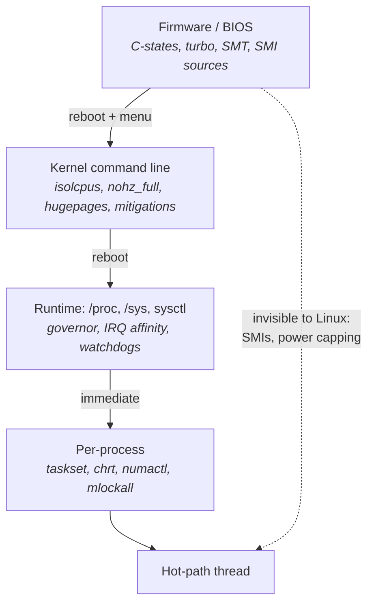
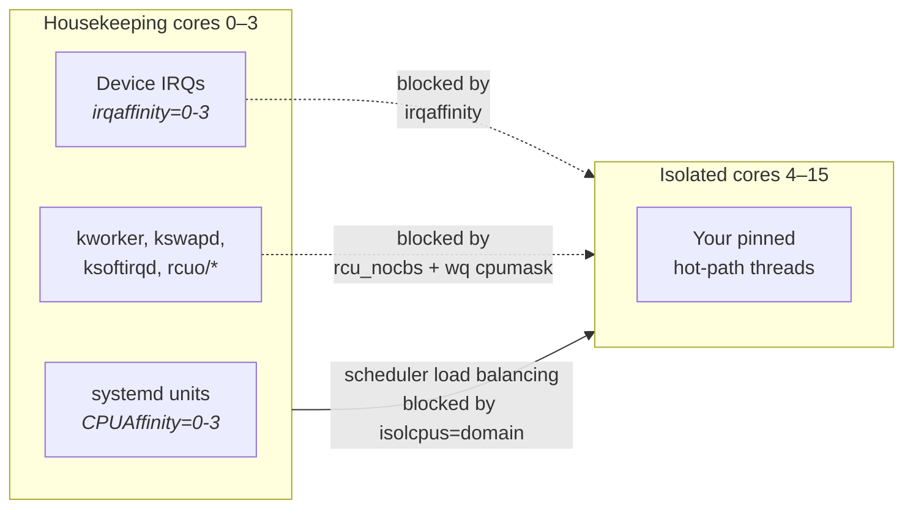
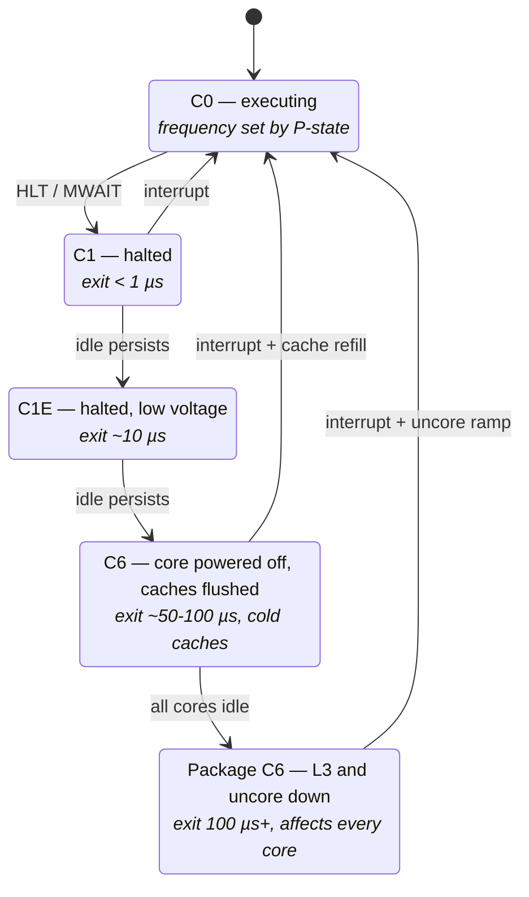
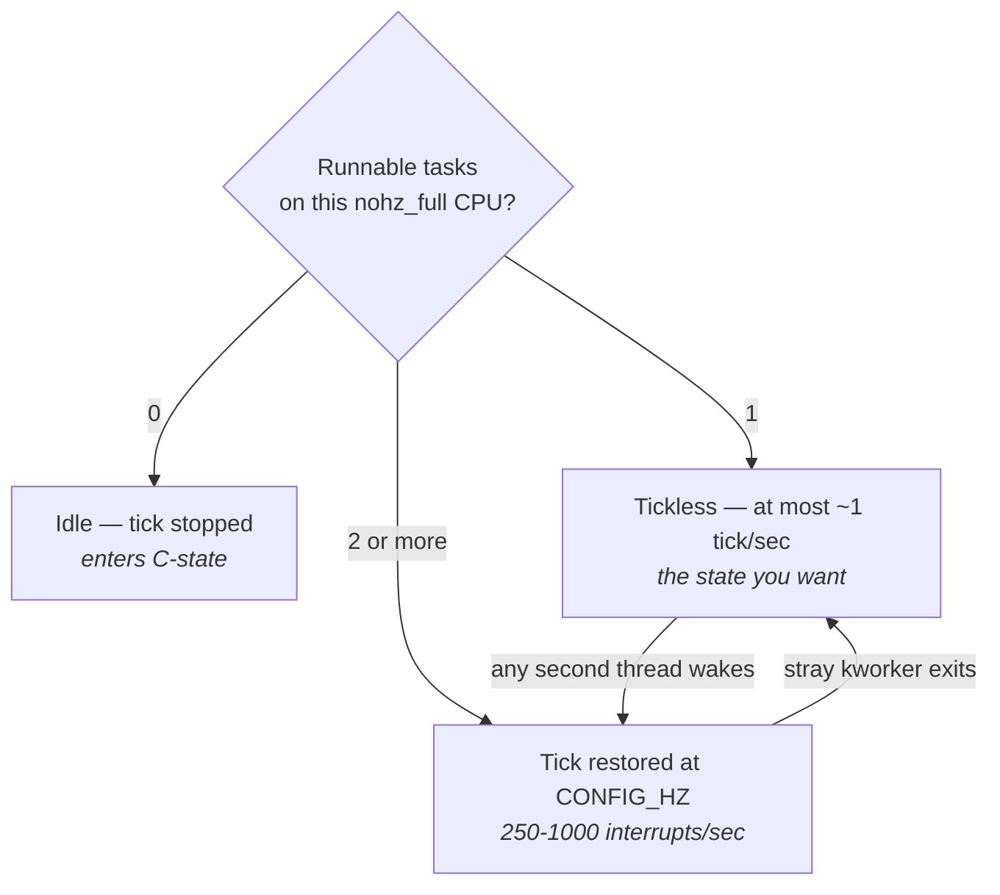
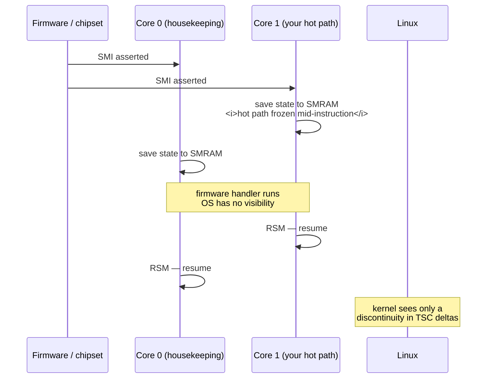
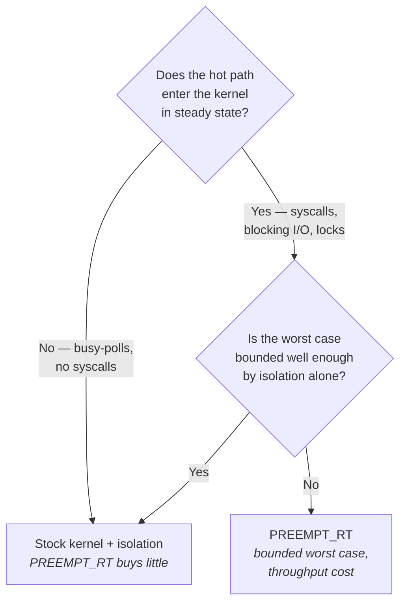

# Tuning a Linux Box for Determinism

Everything in Part II described a mechanism: how a syscall crosses the privilege boundary, how the
scheduler picks a task, how a page fault is serviced, how a packet climbs the network stack. This
chapter is where those mechanisms stop being explanations and become settings on a machine you
actually own. It is the most procedural chapter in the book, and also the one where blind copying
does the most damage — because every setting here buys determinism by spending something else.

The thing to understand before touching any knob is that a general-purpose Linux system is tuned, by
its vendors and by decades of default-setting, for *aggregate throughput and energy efficiency across
unknown workloads*. Nearly every default you are about to change is a good default. Frequency scaling
saves real money on a fleet of ten thousand web servers. Deep C-states let a datacenter fit more
machines in a power envelope. `irqbalance` spreads interrupt load so no single core becomes a
bottleneck. Automatic NUMA balancing fixes the placement mistakes of programs that never thought
about placement. Speculative-execution mitigations stop one tenant reading another's memory. These
are not misconfigurations. They are correct answers to a different question.

Your question is different in one specific way: you care about the *worst* few events in a million,
not the average of all of them. A setting that improves mean throughput by 5% while adding a 200 µs
stall once a minute is a catastrophic trade for a hot path and a fine trade for almost everything
else. The tuning work is therefore not "make the machine fast" — it is "remove every source of
variance the machine is willing to give up, and know the price of each removal." Some prices are
watts. Some are throughput on the cold path. Some are security exposure. Some are the ability to
diagnose the machine when it misbehaves, which is the sneakiest cost of all, because you pay it
exactly when you can least afford it.

The knobs live at four layers, and the layer determines when a change takes effect and how much you
can experiment. Firmware settings require a reboot and usually a trip to a BIOS menu or a vendor
tool. Kernel command-line parameters require a reboot but are text in a file. Runtime settings under
`/proc` and `/sys` take effect immediately and can be flipped in a loop while you measure. Per-process
settings — affinity, scheduling class, memory policy — are applied by the process itself or by a
launcher. Work from the bottom of that stack upward when you tune, and from the top downward when you
debug.

- The dotted edge is the important one: firmware retains the ability to interrupt your thread no
  matter what Linux is configured to do, which is why the firmware layer comes first and why the SMI
  section later in this chapter exists at all.
- Anything you can set at the runtime layer, set there first and measure; only promote it to the boot
  layer once you know it helps, because boot parameters cost a reboot per experiment.

## What the Firmware Decides Before Linux Boots

By the time the kernel prints its first line, the firmware has already made decisions that Linux
cannot fully undo. It has configured the memory controller's interleaving, decided whether the
processor exposes one NUMA node per socket or four, decided whether hardware-managed P-states are
under OS control or autonomous, installed System Management Mode handlers that will interrupt every
core for the rest of the machine's uptime, and told the power-management unit how aggressively to
trade frequency for watts. Some of these you can renegotiate from the OS; several you cannot.

The reason this layer produces such large latency effects is that firmware operates on the whole
package, not on a core. A C-state decision is often a *package* decision — the last core to go idle
can put the entire uncore, the L3, and the memory controller into a low-power state, and the wakeup
cost is then paid by whichever core needs to run next, including yours. A power cap enforced by the
firmware's running-average-power-limit machinery will drop frequency across all cores regardless of
which one is latency-critical. A BMC (baseboard management controller, the out-of-band management
processor on every server) polling the CPU for utilization telemetry does so by raising an interrupt
that Linux cannot observe or mask.

There is also a class of firmware settings whose entire purpose is to reduce *part-to-part
variation*, which is exactly what you want and which vendors expose under names that give no hint of
that. AMD EPYC's "Determinism Control" is the clearest example: in power-determinism mode, each
individual chip runs as fast as its own silicon quality and cooling allow, so two identical servers
in the same rack will not perform identically; in performance-determinism mode, every part is held to
the same conservative ceiling, giving up a little peak speed for identical behavior across the fleet.
For a trading fleet where hosts must be interchangeable and A/B comparisons must be meaningful across
machines, that trade is usually worth making.

Settings names differ by vendor — Dell, HPE, Supermicro, and Lenovo all use different menu
vocabulary for the same underlying MSR — so the table below names the mechanism, not the menu item.

| Firmware setting | What it controls | Set it to | What you give up |
|---|---|---|---|
| **Power/system profile** | A meta-setting that forces dozens of others | "Performance" / "Max Performance" / "Static High Performance" | Substantial idle power; often 30–50% more watts at idle |
| **C-states (core and package)** | Whether idle cores power down execution resources, caches, and the uncore | Limit to C1, or disable entirely | Idle power; on a mostly-idle box this is the single largest power cost |
| **C1E** | An enhanced C1 that also drops voltage and frequency | Disabled | A small idle power saving; C1E exit adds tens of µs on some parts |
| **P-states / EIST / SpeedStep** | Whether frequency varies with load | Leave enabled but pin via the OS, or disable for a fixed clock | Either OS control (if disabled in firmware) or predictability (if left autonomous) |
| **Hardware P-states (HWP)** | Whether the CPU picks its own frequency autonomously, ignoring OS hints | Disabled, or "OS control" / "Native" mode | Firmware's better energy efficiency; you must then manage frequency yourself |
| **Turbo Boost / Core Performance Boost** | Opportunistic frequency above base, limited by power, current, and thermals | Contested — see the frequency section below | Peak single-core speed if disabled; frequency stability if enabled |
| **Energy Efficient Turbo** | Firmware reduces turbo when it judges the core is stalled on memory | Disabled | Power efficiency; this one actively fights a busy-polling thread |
| **Uncore frequency scaling** | Whether the L3/mesh/memory-controller clock varies | Fixed at maximum | Package power; variable uncore clock adds variance to *every* L3 and DRAM access |
| **SMT / Hyper-Threading** | Two logical CPUs per physical core sharing execution resources | Usually disabled — see "Multicore, Coherence, and Memory Ordering" | Roughly 20–30% aggregate throughput on parallel work |
| **NUMA / node interleaving** | Whether physical addresses are striped across sockets | Interleaving **disabled**, so NUMA nodes are visible | Nothing — interleaving hides topology you need (see "Memory Systems") |
| **SNC / NPS** | Sub-NUMA Clustering (Intel) or Nodes Per Socket (AMD): expose intra-socket memory locality | Enabled if you can place threads accordingly | Simplicity; more nodes means more ways to get placement wrong |
| **USB legacy support / emulation** | Firmware emulating a PS/2 keyboard over USB, polled via SMI | Disabled | USB keyboard in early boot; irrelevant on a headless colo box |
| **Processor power/utilization monitoring** | Firmware sampling CPU state to report to the BMC | Disabled | Out-of-band power telemetry; this is a recurring SMI source |
| **Memory patrol scrub** | Background scan of DRAM for correctable ECC errors | Disabled or set to the longest interval | Early detection of failing DIMMs; the scrub consumes memory bandwidth |
| **PCIe ASPM** | Active State Power Management — link power-down between transfers | Disabled | Link power; ASPM exit adds microseconds to the first packet after idle |
| **Firmware-first error handling** | Whether hardware errors are handled in SMM or handed to the OS | OS-first (APEI/GHES) if supported | Vendor-specific error recovery; firmware-first means SMIs on every corrected error |
| **Fan / thermal profile** | Fan curve aggressiveness | Maximum cooling | Noise and fan power; conservative curves let the part get hot enough to throttle |
| **Determinism control (AMD)** | Per-part frequency ceiling: power vs. performance determinism | Performance determinism | A few percent of peak frequency; you gain fleet-wide comparability |

Two of these deserve expansion because engineers new to this consistently get them backwards.

**Uncore frequency scaling** is underappreciated. The uncore is everything on the die that is not a
core: the L3 slices, the ring or mesh interconnect, the memory controllers, the PCIe root complex.
It has its own clock domain, and on Intel server parts that clock scales with demand. If your hot
core is busy-polling with a tiny working set, the uncore sees very little traffic and drops its
frequency — and then a packet arrives, your thread touches L3 and DRAM, and those accesses run at the
reduced uncore clock until the power-management unit notices and ramps back up. The effect is a
handful of extra nanoseconds on every access for a few microseconds after each idle period, which is
precisely the shape of jitter that is hardest to attribute. Recent kernels expose the control through
`/sys/devices/system/cpu/intel_uncore_frequency/`, where per-package directories hold
`min_freq_khz` and `max_freq_khz`; setting them equal fixes the uncore clock.

**Turbo is genuinely contested**, and anyone who tells you the answer is obvious has not measured it.
Turbo raises frequency above base when power, current, and thermal budgets allow — which means your
achieved frequency depends on how many other cores are active, how hot the package is, and whether
the workload is using wide vector instructions. That is variance. But base frequency on a modern
server part is often substantially below the all-core turbo frequency, so disabling turbo can cost
you 20% or more of your single-thread speed, permanently, to eliminate variance you might have been
able to eliminate more cheaply. The middle path that most latency-sensitive shops take is to leave
turbo enabled in firmware but pin the operating frequency from the OS to a fixed value at or just
below the sustainable all-core turbo bin, so the part never has a reason to change frequency. That
gets you most of the speed and nearly all of the predictability. It requires knowing your part's
all-core turbo bin and verifying that your cooling actually sustains it.

**Failure mode: two identical servers benchmark 5% apart and nothing in the OS differs.** Symptom is
a reproducible per-host performance offset that survives reinstallation. Cause is often a firmware
difference — a power profile, a determinism setting, or simply a different BIOS version with
different defaults. Confirm with `sudo dmidecode -t bios` for the version and release date on both
hosts, and compare the frequency each actually sustains under load with `turbostat --interval 1`
(look at the `Bzy_MHz` column, which reports the frequency while the core was busy, not the nominal
TSC frequency).

**Failure mode: latency degrades in the afternoon and recovers overnight.** Symptom is a diurnal
pattern in the tail with no corresponding change in load. Cause is thermal throttling as datacenter
inlet temperature rises. Confirm by reading
`/sys/devices/system/cpu/cpu*/thermal_throttle/core_throttle_count` and
`package_throttle_count` — these are monotonic counters, so any increase during a window of bad
latency is direct evidence — and by watching `PkgTmp` and `Bzy_MHz` in `turbostat`.

**Try it:** dump every firmware setting to a file so you can diff it. On most servers the vendor
provides a CLI for this — Dell's `racadm get BIOS`, HPE's `ilorest`, Supermicro's `sum` — and
`dmidecode` gives a vendor-neutral partial view. Store the output in version control alongside the
host's configuration. The first time two supposedly identical machines behave differently, this file
is what tells you why in thirty seconds instead of a day.

**Try it:** check whether NUMA is actually visible. Run `numactl --hardware` and confirm you see one
node per socket (or per sub-NUMA cluster). If a two-socket machine reports a single node, node
interleaving is enabled in firmware and you have lost the ability to place memory at all — every
allocation is silently striped across both sockets, so roughly half of every access is remote.

## The Kernel Command Line

The kernel command line is a single string of `key=value` tokens passed by the bootloader, parsed
before almost anything else initializes. It is where you configure decisions that must be made before
the subsystems they affect are up: which CPUs the scheduler is allowed to use, how many huge pages to
reserve while physical memory is still unfragmented, which frequency driver to load, whether to
install speculative-execution mitigations at all.

On a distribution using GRUB, the string is assembled from `GRUB_CMDLINE_LINUX` in
`/etc/default/grub`, and you must regenerate the bootloader configuration after editing it —
`grub2-mkconfig -o /boot/grub2/grub.cfg` on RHEL-family systems, `update-grub` on Debian-family ones.
The kernel exposes what it actually received in `/proc/cmdline`. Reading that file after a reboot is
not optional ceremony: a typo in a parameter name is silently ignored, and a machine that you believe
is isolating cores but is not will produce measurements that are simply wrong.

The parameters below fall into four groups: core isolation, memory, power and clocks, and
diagnostics. Understanding which group a parameter belongs to tells you what it protects against.

### Isolating cores

The core-isolation parameters are the heart of the boot configuration, and they are best understood
as a set of separate exclusions that happen to name the same CPUs. Each one removes a different kind
of work from those cores. Omitting any one of them leaves a hole. The mechanisms themselves belong to
"Processes, Threads, and Scheduling"; what matters here is that they compose.

- Each dotted edge is a distinct exclusion mechanism, and each is configured by a different parameter
  — that is why isolation requires four or five settings rather than one.
- The solid edge is the one `isolcpus` blocks: the scheduler's periodic attempt to rebalance runnable
  tasks across cores, which would otherwise migrate work onto your quiet cores.

| Parameter | What it removes | Cost |
|---|---|---|
| `isolcpus=domain,managed_irq,4-15` | Removes the listed CPUs from the scheduler's load-balancing domains (`domain`) and from the spread of kernel-managed device interrupts such as NVMe queues (`managed_irq`) | Nothing runs there unless explicitly pinned; general work loses those cores entirely. The kernel documentation marks `isolcpus` as deprecated in favor of cgroup cpusets, but it remains the most widely deployed mechanism |
| `nohz_full=4-15` | Stops the periodic scheduler tick on those CPUs when exactly one task is runnable there | Timekeeping and accounting for those CPUs becomes the housekeeping cores' job; entering and leaving the tickless state costs a little on each syscall, so syscall-heavy code gets *slower* |
| `rcu_nocbs=4-15` | Moves RCU callback invocation off those CPUs into `rcuo/N` kernel threads | Those threads must themselves be pinned to housekeeping cores, or you have moved the problem rather than solved it |
| `rcu_nocb_poll` | Makes the `rcuo` threads poll for callbacks rather than being woken by an IPI from the offloaded CPU | Burns housekeeping CPU continuously; removes an inter-processor interrupt from the isolated core |
| `irqaffinity=0-3` | Sets the default IRQ affinity mask, so interrupts registered after boot land on housekeeping cores | Interrupt handling capacity is now limited to those cores; a high packet rate can saturate them |
| `nosmt` | Disables SMT at boot, so sibling logical CPUs never appear | Aggregate throughput; equivalent to the firmware setting but reversible at runtime via sysfs |

Three subtleties trip people up. First, the boot CPU cannot be a `nohz_full` CPU — the kernel
reserves it as housekeeping and will silently drop it from your list. Second, on recent kernels
`nohz_full=` implies `rcu_nocbs=` for the same CPUs, but stating both is harmless and documents
intent. Third, `isolcpus` affects only the *scheduler*; it does not stop a process from being pinned
there deliberately, which is exactly what you want, and it does not stop per-CPU kernel threads from
running there, which is what the next section deals with.

### Memory

| Parameter | Effect | Cost |
|---|---|---|
| `default_hugepagesz=1G hugepagesz=1G hugepages=16` | Reserves 16 GiB of 1 GiB huge pages at boot, while physical memory is guaranteed unfragmented | That memory is permanently unavailable to normal allocations, even if nothing uses the pool |
| `transparent_hugepage=never` | Disables Transparent Huge Pages so nothing gets huge pages by accident | Programs you did not tune lose an easy win; the point is to prevent synchronous compaction stalls (see "Memory Systems") |
| `numa_balancing=disable` | Turns off automatic page migration between NUMA nodes | Untuned processes stop getting their memory moved closer to them; you must place memory explicitly |
| `intel_iommu=on iommu=pt` | Enables the IOMMU in pass-through mode: DMA is identity-mapped for host devices, but VFIO can still bind devices for user-space drivers | Needed for DPDK and similar (see "Kernel Bypass"); pass-through avoids per-transaction IOMMU translation overhead while keeping the isolation infrastructure available |

### Power and clocks

| Parameter | Effect | Cost |
|---|---|---|
| `intel_pstate=disable` | Unloads the `intel_pstate` driver and falls back to `acpi-cpufreq`, which exposes discrete P-states and the classic governors | You lose `intel_pstate`'s finer control; `intel_pstate=passive` is often the better choice, keeping the driver but using generic governors |
| `processor.max_cstate=1` | Caps ACPI-driven idle states at C1 | Idle power rises sharply |
| `intel_idle.max_cstate=0` | Disables the `intel_idle` driver entirely so `acpi_idle` takes over, making `processor.max_cstate` effective | Same; needed because `intel_idle` ignores `processor.max_cstate` |
| `idle=poll` | The idle task spins instead of halting; the core never leaves C0 | The largest power cost of anything in this chapter — a fully idle core still draws near-full power, and on an SMT-enabled part the spinning idle task steals issue slots from its sibling. It also consumes package thermal budget, which can *reduce* the turbo frequency available to the cores you care about |
| `clocksource=tsc tsc=reliable` | Forces the TSC as the system clocksource and skips the runtime watchdog that periodically cross-checks it against HPET or the ACPI PM timer | If the TSC really is unstable you now have silently wrong time; only safe with an invariant TSC (see "Clocks, Timers, and Time"). The watchdog itself reads a slow off-die timer periodically, which is a small recurring cost |
| `pcie_aspm=off` | Disables PCIe link power management | Link power; prevents multi-microsecond wakeup on the first transfer after an idle period |
| `skew_tick=1` | Offsets each CPU's tick so they do not all fire at the same instant | Slightly more total tick work; avoids the lock contention and cache-line bouncing of a synchronized tick storm |

### Diagnostics and mitigations

The last group is where the honest cost accounting matters most, because these parameters buy latency
by removing safety and observability.

| Parameter | Effect | Cost |
|---|---|---|
| `nmi_watchdog=0` | Disables the hard-lockup detector, which programs a PMU counter on every CPU to raise a periodic NMI | You lose automatic detection of a hung core — but you *gain* a general-purpose PMU counter back for profiling, which is a real benefit (see "Profiling Tools and Hardware Counters") |
| `nosoftlockup` | Disables the soft-lockup detector and its per-CPU `watchdog/N` threads | A task spinning in the kernel for 20+ seconds no longer produces a log message |
| `nowatchdog` | Disables both detectors together | Both of the above |
| `audit=0` | Disables the kernel audit subsystem | You lose audit logging, which may be a compliance requirement; audit adds work to syscall entry and exit |
| `mitigations=off` | Disables **all** speculative-execution mitigations in one token | Discussed below at length |

`mitigations=off` deserves its own paragraphs because it is the single most consequential line in
this chapter and the one most often copied without thought.

What it removes: kernel page-table isolation (KPTI), which maps the kernel out of the user-mode page
tables and therefore forces a `CR3` write and associated TLB work on every syscall and every
interrupt entry and exit; the retpoline or IBRS machinery that constrains indirect branch prediction;
the microarchitectural buffer flushes (`VERW`-based) that run on context switches and privilege
transitions to prevent data leaking through store buffers, fill buffers, and load ports; and several
smaller mitigations for later-discovered variants. The aggregate cost of these on a syscall-heavy
path is large — on a machine without process-context identifiers (PCID) to soften KPTI's TLB
invalidation, a syscall can go from roughly 100 ns to several hundred, and the mitigations for the
later variants add flush work to every transition (see "Kernel Architecture and the Syscall
Boundary").

What you take on: these mitigations exist because attacker-controlled code running on the machine can
read memory it is not entitled to — across process boundaries, and in some variants from kernel
memory. Turning them off is defensible when the machine runs exactly one workload, has no untrusted
code, no untrusted input reaching a JIT or an interpreter, no containers belonging to different
trust domains, and no interactive login for anyone outside a small trusted group. That describes a
well-run colocated trading host reasonably well. It does not describe a shared development box, a
build server, a machine running a browser or a scripting language over external data, or anything
under a compliance regime that mandates specific mitigations. The decision is a security decision,
not a performance one, and it belongs to whoever owns that risk.

The corollary is that the setting must be *auditable*. The kernel reports the status of every known
vulnerability in `/sys/devices/system/cpu/vulnerabilities/`, one file per issue, each containing
either `Not affected`, `Mitigation: <description>`, or `Vulnerable`. That directory is the ground
truth for what your machine is actually doing, and it belongs in your host inventory.

There is a middle path worth knowing: mitigations can be disabled individually
(`nopti`, `spectre_v2=off`, `mds=off`, and others). Disabling only KPTI, which is where most of the
syscall cost lives, while leaving branch-prediction mitigations in place, is a meaningfully smaller
exposure than `mitigations=off` and recovers most of the latency on a syscall-heavy path. A hot path
that has been engineered to make no syscalls at all recovers very little from any of this, which is
worth measuring before you accept the risk.

**Failure mode: a boot parameter has no effect and no error appears anywhere.** Symptom is that
isolation, huge pages, or a driver setting simply does not happen. Cause is a misspelled parameter,
a parameter the kernel was not built to support, or a bootloader config that was edited but never
regenerated. Confirm by reading `/proc/cmdline` — which shows what the kernel received, not what you
intended — and check `dmesg | grep -i -E 'unknown|ignored'` for the kernel's complaints about
unrecognized tokens.

**Failure mode: huge page reservation silently comes up short.** Symptom is that
`hugepages=16` yields fewer than 16 pages. Cause is that the pool could not be fully populated, which
for 1 GiB pages can happen even early in boot on some memory layouts. Confirm by reading
`/proc/meminfo` (`HugePages_Total`, `HugePages_Free`, `Hugetlb`) and the per-node counts under
`/sys/devices/system/node/node*/hugepages/`. Reserving per-node matters on a NUMA machine: the
default spreads the pool across nodes, and a process bound to one node can find its share is half of
what you reserved.

**Try it:** capture a baseline before changing anything. Run
`cat /proc/cmdline; uname -r; cat /sys/devices/system/cpu/vulnerabilities/*` and save the output.
Then make one change, reboot, and diff. One change per reboot is slow and it is the only way to
attribute an effect to a cause.

**Try it:** quantify the mitigation tax on your own hardware before deciding anything about it. Write
a loop that calls a trivial syscall — `getppid()` is the traditional choice because it does almost no
work — several million times, and time it. Reboot with `mitigations=off` and repeat. The difference
per call, divided into your hot path's syscall count per event, is the actual latency at stake. On a
path that busy-polls a kernel-bypass NIC and issues no syscalls, that number is zero and the security
exposure buys you nothing.

## Runtime Knobs: `sysctl` and Friends

`sysctl` is the interface to kernel variables exposed under `/proc/sys`. Unlike boot parameters,
these take effect immediately, which makes them the right place to experiment. Persist them in
`/etc/sysctl.d/*.conf` once you have measured a benefit; a setting that lives only in a shell history
will be lost at the next reboot and produce a mysterious regression.

The knobs worth knowing fall into three groups: scheduling policy, memory-management background work,
and networking. Each group protects against a different pathology.

The scheduling group is dominated by one setting whose default exists purely as a safety net.
Linux throttles real-time tasks: by default, `SCHED_FIFO` and `SCHED_RR` tasks are limited to 950,000
microseconds out of every 1,000,000, reserving 5% of each CPU for everything else. The reason is
obvious — a `SCHED_FIFO` thread that spins forever at high priority would otherwise make the machine
unrecoverable, because nothing at lower priority, including your shell, would ever run again. For a
busy-polling hot-path thread that never yields, that 5% is not a safety net; it is a guaranteed 50 ms
descheduling every second. Setting `kernel.sched_rt_runtime_us = -1` disables throttling entirely,
and you must then accept that a bug in a real-time thread bricks the host until someone power-cycles
it. The safer variant is to leave throttling on but ensure your polling thread is on an isolated core
where the throttle has nothing else to schedule — verify which behavior you actually get rather than
assuming.

The memory group targets periodic background work that the kernel performs on every CPU. The
statistics updater is the clearest example: `vm.stat_interval` defaults to 1 second, and every
interval each CPU folds its per-CPU counter deltas into global counters. That is a scheduled work
item on your isolated core, once a second, forever. Raising the interval to 120 seconds makes
`/proc/vmstat` staler and removes 119 of every 120 such wakeups. Similarly,
`vm.compaction_proactiveness` (default 20 on kernels that have it) drives background memory
compaction to keep high-order allocations available; on a host that reserved its huge pages at boot
and never needs high-order allocations again, setting it to 0 removes `kcompactd` activity entirely.

| Setting | Default | Set to | What it protects against | Cost |
|---|---|---|---|---|
| `kernel.sched_rt_runtime_us` | 950000 | -1 | A busy-polling `SCHED_FIFO` thread being throttled off-CPU for 5% of every second | A runaway RT thread can render the machine unresponsive |
| `kernel.numa_balancing` | 1 | 0 | Periodic unmapping of pages to sample access, causing faults and TLB shootdowns | Untuned processes no longer get automatic page migration |
| `kernel.timer_migration` | 1 | 0 | The kernel consolidating timers from idle CPUs onto a busy one — possibly yours | Slightly worse idle power, since more CPUs must wake for their own timers |
| `kernel.watchdog` / `kernel.nmi_watchdog` | 1 | 0 | Periodic NMIs and per-CPU watchdog threads | No lockup detection; see the boot-parameter discussion |
| `kernel.watchdog_cpumask` | all CPUs | housekeeping list | Same, but selectively | Keeps lockup detection where it is cheap, which is usually the better trade |
| `vm.stat_interval` | 1 | 120 | Per-CPU vmstat folding work every second | `/proc/vmstat` and `/proc/meminfo` become stale between updates |
| `vm.compaction_proactiveness` | 20 | 0 | Background compaction moving physical pages, causing TLB shootdowns | High-order allocations may start failing over time |
| `vm.swappiness` | 60 | 0 | Anonymous pages being swapped out | Under memory pressure the kernel reclaims page cache harder; on a latency host you should disable swap entirely with `swapoff -a`, not merely discourage it |
| `vm.min_free_kbytes` | size-dependent | raised | Direct reclaim — an allocating thread being forced to free memory synchronously | Reserved memory is unavailable to applications |
| `vm.dirty_ratio` / `vm.dirty_background_ratio` | 20 / 10 | lowered | A large accumulation of dirty pages being flushed in one burst, saturating memory bandwidth and I/O | More frequent, smaller writeback; higher total I/O overhead |
| `kernel.randomize_va_space` | 2 | 0 (benchmark hosts only) | Run-to-run variation from address-space layout randomization changing alignment and cache set mapping | ASLR is a real security mitigation; disable it on benchmark rigs, not production |
| `kernel.sched_autogroup_enabled` | 1 | 0 | Automatic per-session task grouping perturbing CFS/EEVDF scheduling decisions | Interactive desktop responsiveness, which is irrelevant here |
| `kernel.perf_cpu_time_max_percent` | 25 | tuned or 0 | The kernel automatically reducing your sample rate mid-profile, silently changing what you measured | Setting 0 removes the guard rail; a too-high sample rate can then genuinely destabilize the machine |
| `net.core.rmem_max` / `rmem_default` | ~208 KiB | raised | Socket receive buffer overflow during a burst — a market-data multicast burst is the canonical case | Kernel memory; a large buffer hides a slow consumer rather than fixing it |
| `net.core.netdev_max_backlog` | 1000 | raised | Drops in the per-CPU backlog queue when the stack cannot keep up with the driver | Deeper queues mean higher latency for packets that do queue |
| `net.core.busy_poll` / `net.core.busy_read` | 0 | tens of µs | The latency of waking a blocked thread when a packet arrives | Burns CPU spinning in the kernel; see "The Linux Networking Stack" |

A few scheduler tunables that older guides list under `kernel.sched_*` — minimum granularity,
migration cost, wakeup granularity — moved to `/sys/kernel/debug/sched/` around kernel 5.13, and the
EEVDF scheduler introduced in 6.6 changed which of them exist and what they mean. Rather than quoting
names that may not be on your kernel, list the directory and read what is there. This is a good
illustration of a general rule: scheduler internals are Linux implementation details that change
between versions, not stable interfaces, and tuning guides age badly because of it.

**Failure mode: a `SCHED_FIFO` polling thread stalls for tens of milliseconds at regular intervals.**
Symptom is a latency histogram with a sharp mode near 50 ms and a period of almost exactly one
second. Cause is real-time throttling. Confirm by reading
`/proc/sys/kernel/sched_rt_runtime_us` and `/proc/sys/kernel/sched_rt_period_us` and computing the
throttled fraction, and by tracing `sched:sched_switch` events for the thread to see it being taken
off-CPU with no other runnable task to explain it.

**Failure mode: sysctl settings revert after a reboot or after a package update.** Symptom is a
regression that correlates with a maintenance window rather than a code change. Cause is settings
applied by hand, or a `tuned` profile reapplying its own values on top of yours. Confirm with
`sysctl -a > after.txt` and diff against a stored baseline, and check `tuned-adm active` to see
whether a profile is managing the machine.

**Try it:** find the background work happening on a supposedly idle core. Read the whole of
`/proc/interrupts` and `/proc/softirqs`, wait sixty seconds with nothing running, and read them
again. Every counter that moved on an isolated CPU is a wakeup you have not yet eliminated. The `LOC`
row is the local timer interrupt, `RES` is rescheduling IPIs, `CAL` is function-call IPIs, and `TLB`
is shootdowns — each points at a different culprit and a different section of this chapter.

**Try it:** measure what `vm.stat_interval` costs you. With an otherwise idle isolated core, record
`/proc/interrupts` over five minutes, then set `sysctl -w vm.stat_interval=120` and repeat. The drop
in timer and work-queue activity on that core is small in absolute terms, which is exactly the point:
determinism work is the accumulation of many small removals, and you need a method for confirming
each one landed.

## Frequency, Idle States, and the Cost of Predictable Speed

Chapter 7 established that a modern CPU does not run at one speed. It runs at whatever frequency the
power-management hardware currently permits, in a state that depends on load history, package
temperature, how many other cores are active, and what instructions are executing. And when a core
has nothing to do, it does not merely spin — it enters an idle state that progressively powers down
its execution resources, its private caches, and eventually parts of the package.

Both mechanisms exist to save energy, and both are pure poison for tail latency, for the same
underlying reason: **the transition costs are paid by the next piece of work, not by the idle
period.** A core in a deep idle state has had its L1 and L2 flushed and its voltage rails collapsed;
bringing it back takes tens of microseconds and it then runs with cold caches. A core at a low
P-state that suddenly gets work executes at the low frequency until the governor notices, which takes
milliseconds on some drivers. In both cases the machine has arranged for the *first* work after an
idle period — the packet you have been waiting for — to be the slowest.

Two mental models to keep separate. **P-states** are performance states: the core is executing, at
some frequency and voltage. Moving between them is fast, on the order of microseconds, and the cost
is mostly that you were running slower than you wanted for a while. **C-states** are idle states: the
core is not executing at all. C1 is a shallow halt with sub-microsecond exit. C6 flushes the core's
caches and powers it down, with exit latency in the tens of microseconds. Package C-states go
further, taking down the L3 and the uncore, with exit latencies that can reach a hundred microseconds
or more. The deeper the state, the more it saves and the longer it takes to leave.

- The exit paths on the right are what a latency-critical thread pays; note that the return from C6
  also implies a cold L1 and L2, so the first several thousand instructions after wakeup run at cache
  miss cost (see "The Cache Hierarchy").
- Package C6 is the state that makes one idle core everybody's problem: it can only be entered when
  all cores are idle, but its exit cost is paid by whichever core wakes first.

The remedy is to keep the hot core in C0 at a fixed frequency. There are several ways to arrange that
and they differ in how much collateral cost they impose.

| Approach | Mechanism | Power cost | Notes |
|---|---|---|---|
| **Busy-poll the hot thread** | The thread never idles, so the core never leaves C0 | Full core power on hot cores only | The cheapest correct answer; it is a side benefit of the polling loop you already wrote |
| **PM QoS via `/dev/cpu_dma_latency`** | Open the file, write a 32-bit `0`, keep the fd open; the kernel caps allowed exit latency at 0 µs system-wide, blocking deep C-states | Moderate — affects all cores | Reverts automatically when the fd closes, which makes it safe to experiment with. This is what `tuned`'s latency profiles do |
| **Per-state disable via sysfs** | Write `1` to `/sys/devices/system/cpu/cpu<N>/cpuidle/state<M>/disable` | Proportional to which states you disable | Surgical: disable only C6 and deeper, on only the isolated cores |
| **`idle=poll`** | The idle task spins | Highest of all — an idle core draws near-full power | Also consumes package power budget, which can lower the turbo frequency available to your busy cores |
| **Firmware C-state disable** | Package and core C-states off in BIOS | Highest sustained | Removes the states entirely; nothing in the OS can re-enable them |

For frequency, the equivalent decision tree runs through the cpufreq driver. Read which driver you
have from `/sys/devices/system/cpu/cpu0/cpufreq/scaling_driver`, because the available controls
differ entirely between them.

- **`intel_pstate` in active mode** implements its own internal governor and exposes only
  `performance` and `powersave` as governor names — where its `powersave` is still load-adaptive
  rather than fixed-low. Its useful controls are `/sys/devices/system/cpu/intel_pstate/no_turbo`,
  `min_perf_pct`, and `max_perf_pct`, which are percentages of the maximum. Setting
  `min_perf_pct = max_perf_pct` pins the frequency.
- **`intel_pstate` in passive mode** (`intel_pstate=passive` at boot, or by writing `passive` to
  `/sys/devices/system/cpu/intel_pstate/status`) turns the driver into a plain frequency setter and
  hands control back to the generic cpufreq governors, so `performance`, `powersave`, `userspace`,
  and `schedutil` all become available.
- **`acpi-cpufreq`** exposes discrete P-states from the firmware's tables and the full generic
  governor set, plus `/sys/devices/system/cpu/cpufreq/boost` as a global turbo switch.
- **`amd_pstate`** on recent AMD parts has active, passive, and guided modes with a similar
  structure; check the driver name rather than assuming.

The `performance` governor does not mean "fixed frequency." It means "always request the maximum,"
and the maximum still moves with turbo budget, temperature, and active core count. To actually fix
the frequency, set `scaling_min_freq` equal to `scaling_max_freq` (or `min_perf_pct` equal to
`max_perf_pct`), at a value the part can sustain with all your hot cores busy.

`cpupower` is the convenient front end: `cpupower frequency-info` shows the driver, the available
governors, the current policy, and the hardware limits; `cpupower idle-info` lists every idle state
with its name, its advertised exit latency in microseconds, and its target residency; and
`cpupower frequency-set -g performance` sets the governor across all CPUs. `turbostat` is the
verification tool — it reads the model-specific registers directly and reports actual achieved
frequency (`Bzy_MHz`), the residency in each C-state, package temperature and power, interrupt
counts, and an `SMI` column that the next section will make very relevant.

**Failure mode: the governor says `performance` but the measured frequency is below the maximum.**
Symptom is `scaling_governor` reading `performance` while `turbostat`'s `Bzy_MHz` sits well under the
turbo bin. Cause is a power, current, or thermal limit, or an active firmware power cap. Confirm with
`turbostat`'s `PkgWatt` and `PkgTmp` columns and the throttle counters under
`/sys/devices/system/cpu/cpu*/thermal_throttle/`. Note that `scaling_cur_freq` is often a software
estimate; `cpuinfo_cur_freq` reads hardware, and `turbostat` computes actual average frequency from
counter deltas, which is the number to trust.

**Failure mode: the first event after an idle gap is dramatically slower than events in a burst.**
Symptom is a latency distribution whose tail correlates with inter-arrival gap rather than with load.
Cause is C-state exit plus cold caches, or a frequency ramp. Confirm by checking C-state residency
per core with `turbostat` while the workload runs — if `CPU%c6` is nonzero on your hot core, it is
sleeping — and by re-testing with `/dev/cpu_dma_latency` held at 0.

**Failure mode: disabling turbo made the p99 *worse*.** Symptom is that the tail improves in shape
but shifts up. Cause is that everything now runs at base frequency, which may be 25% below what turbo
was delivering. This is the trade-off stated plainly: you removed variance by removing speed. Confirm
by comparing `Bzy_MHz` between the two configurations and checking whether the p99 shift matches the
frequency ratio.

**Try it:** enumerate your machine's idle states and their real costs. Run `cpupower idle-info` and
note each state's name, exit latency, and target residency. Then read
`/sys/devices/system/cpu/cpu0/cpuidle/state*/{name,latency,residency,usage,time}` — `usage` is how
many times that state was entered and `time` is total microseconds spent there. On a "quiet" machine,
seeing millions of C6 entries on a core you thought was dedicated tells you your isolation is
incomplete.

**Try it:** hold the PM QoS request and watch it work. In one terminal, run
`exec 3<> /dev/cpu_dma_latency; printf '\x00\x00\x00\x00' >&3` and leave the shell open. In another,
run `turbostat --interval 1` and watch the deep C-state residency columns collapse to zero. Close the
first shell and watch them return. This is the cheapest way to A/B test C-state effects without a
reboot.

## Quieting the Kernel: Ticks, RCU, Threads, and Daemons

Isolating a core from the scheduler does not empty it. The kernel maintains a substantial amount of
per-CPU machinery that runs on every CPU by design: the timer tick, RCU grace-period processing,
per-CPU workqueue workers, softirq processing, the vmstat updater, and various watchdogs. A core with
`isolcpus` applied and no user tasks pinned to it is quiet in the sense that the scheduler will not
put anything there — but the kernel will.

The tick is the largest single item. Historically Linux raised a timer interrupt on every CPU at
`CONFIG_HZ` — typically 250 or 1000 times per second — to drive scheduling decisions, accounting, and
timer expiry. Each tick is an interrupt: it pollutes your L1i and L1d with kernel code and data,
costs a few microseconds of work, and, worse, it happens at a fixed rate whether or not there is
anything to decide. The `nohz_full` mechanism removes it, but with a condition that is easy to miss:
**the tick can only stop when exactly one task is runnable on that CPU.** With two runnable tasks the
kernel must arbitrate between them, which requires the tick, and it comes straight back at full rate.

- The two-task case is the trap: a monitoring agent that briefly wakes on your isolated core, a
  `kworker` handling a deferred item, or a second thread of your own process restores the tick for as
  long as it is runnable.
- Verify which state you are in by watching the `LOC` row of `/proc/interrupts` per CPU: roughly one
  per second means tickless is working; hundreds per second means it is not.

RCU is the second item, and it is worth a paragraph because its behavior surprises people. Read-Copy
-Update lets readers traverse a data structure with no locking at all; the cost is deferred to
writers, who must wait until every CPU has passed through a quiescent state before freeing the old
version, and then run *callbacks* to do the actual freeing. Those callbacks run on the CPU that
queued them, in softirq context, at unpredictable times. `rcu_nocbs` moves callback invocation to
dedicated `rcuo/N` kernel threads — but those threads have to run somewhere, so you must also pin
them to housekeeping cores. They are ordinary kernel threads and `taskset -p` works on them.

Two further RCU behaviors matter for isolation. *Expedited* grace periods force the issue by sending
IPIs to every CPU rather than waiting for them to pass through a quiescent state naturally — fast,
but an interruption on cores that had nothing to do with the update. `rcupdate.rcu_normal_after_boot=1`
disables expedited grace periods once boot is complete, trading slightly slower kernel updates for no
IPI storms. And `rcutree.use_softirq=0` moves RCU core processing out of softirq context into `rcuc/N`
kernel threads, which can then be prioritized and pinned; this is standard practice on real-time
configurations and is a change in *where* the work happens, not whether it happens.

The remaining per-CPU threads each have their own control surface, and no single mechanism handles
them all.

| Kernel thread | What it does | How to keep it off isolated cores |
|---|---|---|
| `ksoftirqd/N` | Runs softirqs that were deferred from interrupt context — network receive, timers, RCU | Keep interrupts and network processing off the core in the first place (see "The Linux Networking Stack") |
| `kworker/N:*` | Per-CPU workqueue workers | Per-CPU work cannot be moved; reduce what queues it. Unbound workqueues respect `/sys/devices/virtual/workqueue/cpumask` |
| `rcuo*` | RCU callback offload threads created by `rcu_nocbs` | Pin explicitly with `taskset`; they are not automatically confined |
| `migration/N` | Runs `stop_machine` work: CPU hotplug, some text patching, MTRR updates | Cannot be disabled; avoid triggering it (see below) |
| `kswapd*` | Page reclaim when free memory drops below the watermark | Raise `vm.min_free_kbytes`, avoid memory pressure, and never let the box swap |
| `kcompactd*` | Background memory compaction | `vm.compaction_proactiveness=0` |
| `khugepaged` | Collapses 4 KiB pages into transparent huge pages, causing TLB shootdowns | `transparent_hugepage=never` |
| `watchdog/N` | Soft-lockup detector | `kernel.watchdog=0`, or restrict via `kernel.watchdog_cpumask` |

`stop_machine` deserves a warning. It is the kernel's mechanism for making a change that requires all
CPUs to be quiescent: every CPU is forced into a tight loop while one CPU makes the modification.
Nothing you have configured protects against it — isolation, real-time priority, and `nohz_full` are
all irrelevant, because the mechanism exists precisely to override them. It is triggered by CPU
hotplug, by some module loads and unloads, and by static-key (jump label) patching, which is what
happens when you enable a tracepoint or flip certain kernel features at runtime. The practical rule
is that enabling tracing, loading a module, or onlining a CPU on a production trading host is a
disruptive operation, not a read-only one.

Above the kernel sit the daemons, and this is where a machine that was carefully tuned in a lab
quietly becomes untuned in production. A stock server distribution runs dozens of background
services and timers: log rotation, filesystem indexing, package-update checks, SSD trim, container
runtimes, configuration-management agents, monitoring collectors, and the vendor's own hardware
agents. Each wakes periodically, consumes CPU and memory bandwidth, and — if not confined — can land
on any core.

The single most effective control is `CPUAffinity=` in `/etc/systemd/system.conf`. Setting it to your
housekeeping core list makes it the default affinity for every unit systemd starts, which is nearly
every process on the machine. It is a whitelist rather than a blacklist, which is the right shape:
new services inherit the restriction without anyone remembering to configure them. On cgroup v2
systems, `AllowedCPUs=` on individual units and `cpuset.cpus.partition=isolated` on a cgroup give
finer-grained control with the same intent.

`irqbalance` needs specific handling. It is a daemon that periodically redistributes interrupt
affinity across CPUs to balance load — useful on a general server, actively hostile on a tuned one,
because it will move interrupts back onto cores you carefully cleared. Either stop it entirely
(`systemctl disable --now irqbalance`) and manage affinity yourself through
`/proc/irq/<n>/smp_affinity_list`, or configure `IRQBALANCE_BANNED_CPUS` in its environment file so
it never considers your isolated cores. Doing neither, and simply setting affinities by hand, results
in settings that revert minutes later for no visible reason.

One class of interrupt cannot be steered at all. *Managed* interrupts — used by multi-queue devices
such as NVMe and many modern NICs — have their affinity assigned by the kernel to match the queue-to-
CPU mapping, and writing to `smp_affinity` for them fails with `EIO`. That is what the `managed_irq`
flag to `isolcpus` is for: it tells the kernel to exclude isolated CPUs when it spreads managed
interrupt queues in the first place.

**Failure mode: `nohz_full` is configured but the timer interrupt count on the isolated core is still
in the hundreds per second.** Symptom is a high `LOC` count in `/proc/interrupts` for a CPU you
believe is tickless. Cause is almost always a second runnable task on that CPU. Confirm by watching
what runs there: `ps -eLo pid,tid,psr,comm | awk '$3 == 7'` for CPU 7, or trace `sched:sched_switch`
filtered to that CPU via `/sys/kernel/debug/tracing/`.

**Failure mode: interrupt affinity settings revert after a few minutes.** Symptom is that
`/proc/irq/<n>/smp_affinity_list` shows housekeeping cores right after you set it and the full CPU
list later. Cause is `irqbalance`. Confirm with `systemctl status irqbalance` and by checking whether
the reversion correlates with its ten-second default interval.

**Failure mode: an isolated core sees TLB shootdown IPIs from processes it never ran.** Symptom is a
rising `TLB` row in `/proc/interrupts` on a quiet core. Cause is memory-map churn elsewhere on the
machine — `munmap`, `madvise(MADV_DONTNEED)`, `khugepaged` collapsing pages, or NUMA balancing
migrating them. Confirm by correlating the counter with `numa_pages_migrated` and `compact_stall` in
`/proc/vmstat` (see "Memory Systems").

**Try it:** audit everything scheduled to run on the machine. `systemctl list-timers --all` shows
every periodic job with its next firing time, and `systemctl list-units --type=service --state=running`
shows what is currently alive. For each entry, decide whether it needs to exist on a trading host.
Mask what does not with `systemctl mask <unit>` — mask, not disable, because a masked unit cannot be
started by a dependency either.

**Try it:** find out where the kernel threads actually are. Run
`ps -eLo pid,tid,class,rtprio,psr,comm | grep -E 'rcuo|ksoftirqd|kworker'` and look at the `psr`
column, which is the CPU each thread last ran on. Any `rcuo` thread sitting on an isolated core means
`rcu_nocbs` did its job of moving the work into a thread but nobody pinned the thread.

**Try it:** watch `stop_machine` interrupt an isolated core. With a latency measurement running on a
pinned thread, load and unload a trivial kernel module, or enable a tracepoint by writing to
`/sys/kernel/debug/tracing/events/sched/sched_switch/enable`. Look for the outlier in your histogram.
It is a useful demonstration that some interruptions are not configurable away.

## Interrupts You Cannot Mask: NMIs, SMIs, and System Management Mode

Everything so far assumed that Linux is in charge. There is one mechanism for which that is false,
and it is responsible for a disproportionate share of the worst outliers on badly configured
hardware.

**System Management Mode (SMM)** is a processor operating mode that sits below the kernel — below
ring 0, sometimes described as ring -2. It is entered by a **System Management Interrupt (SMI)**,
which is not maskable, not routable, not deferrable, and not visible to the operating system. When an
SMI fires, all logical CPUs on the package leave whatever they were doing, save their state to a
protected memory region (SMRAM), and execute firmware code that the OS cannot read, profile, or
preempt. When the handler executes an `RSM` instruction, the cores resume exactly where they were,
with no record that anything happened — except a gap in the wall clock and a bump in a counter.

Duration is entirely a property of the firmware. A well-written handler completes in a few
microseconds. Handlers doing real work — logging a corrected ECC error, reading a thermal sensor over
a slow bus, polling an emulated USB keyboard controller, updating power telemetry for the BMC — run
for tens or hundreds of microseconds. Pathological firmware has been observed producing SMIs lasting
more than a millisecond. A single such event dwarfs everything else in this chapter: you can
eliminate every timer tick, every softirq, and every context switch and still see a 500 µs outlier
that has no explanation anywhere in the kernel, because the cause happened while the kernel was
frozen.

- No kernel-side tuning can prevent this path; the only controls are firmware settings and firmware
  updates, which is why the BIOS section came first.
- The only OS-visible evidence is the counter and the timing gap, which is what makes SMIs so hard to
  attribute and so easy to blame on your own code.

You have two ways to detect SMIs. The direct one is a counter: Intel processors from Nehalem onward
implement `MSR_SMI_COUNT` at MSR address `0x34`, a monotonic count of SMIs delivered. Read it with
`rdmsr` from the `msr-tools` package after `modprobe msr`, or more conveniently read the `SMI` column
of `turbostat`, which does the same thing per-CPU per-interval. A machine generating a steady stream
of SMIs while otherwise idle has a firmware configuration problem, and the firmware settings listed
earlier — USB legacy emulation, power/utilization monitoring, firmware-first error handling, patrol
scrub, aggressive power capping — are the usual sources.

The indirect method measures the *effect* rather than the cause, which matters because not every
firmware exposes a counter and not every stall is an SMI. `hwlatdetect`, from the `rt-tests` package,
stops all other activity, spins in a tight loop reading the TSC, and reports any gap between
consecutive reads that exceeds a threshold. Since nothing in software could have interrupted that
loop, a gap is by elimination hardware or firmware interference. Underneath, it drives the kernel's
`hwlat` tracer, which you can also use directly by writing `hwlat` to
`/sys/kernel/debug/tracing/current_tracer` and configuring the sampling window and width under
`/sys/kernel/debug/tracing/hwlat_detector/`.

More recent kernels add two tracers that are strictly more informative for this work. The `osnoise`
tracer measures total interference on a CPU and attributes it to categories — hardware, NMI, IRQ,
softirq, thread — so you learn not just that 40 µs went missing but where. The `timerlat` tracer arms
a timer and measures the difference between when it should have fired and when a thread actually
observed it, splitting the result into interrupt-level and thread-level latency. The `rtla` tool
(`rtla osnoise top`, `rtla timerlat hist -c 4 -d 60s`) is the friendly front end for both, and it is
the single best jitter-hunting tool the kernel ships.

**NMIs** — non-maskable interrupts — are a different mechanism with a related consequence. Linux uses
them for the hard-lockup detector: each CPU programs a PMU counter to overflow periodically, raising
an NMI that checks whether the CPU is still making progress. This costs two things. The obvious one
is a periodic interrupt on every CPU. The less obvious and often more important one is that it
consumes a general-purpose PMU counter, so a profiling session that wants four counters finds only
three available. Disabling it with `kernel.nmi_watchdog=0` gives the counter back. `perf` also uses
NMIs for sampling, which is what allows it to profile code running with interrupts disabled — a
feature, but also a reason that a high-frequency `perf record` is itself a jitter source and should
not run against a hot path during measurement.

The other recurring firmware-adjacent cost is machine-check polling. The kernel periodically scans
for corrected hardware errors on every CPU, at an interval readable and writable at
`/sys/devices/system/machinecheck/machinecheck<N>/check_interval` (300 seconds by default). On some
platforms, corrected errors are reported through firmware-first handling, meaning each one triggers
an SMI. The `mce=ignore_ce` boot parameter disables corrected-error polling and CMCI handling
entirely — and the cost is exactly what it sounds like: you stop being told that a DIMM is
accumulating correctable errors, which is your primary early warning that it is about to fail
uncorrectably. On a redundant fleet with good hardware monitoring elsewhere that may be acceptable;
on a single host it is not.

**Failure mode: outliers of 50–500 µs that appear in no kernel trace.** Symptom is a latency
histogram with a small population of enormous values, and `ftrace` or `perf` showing nothing at those
timestamps — because the kernel was frozen. Cause is SMM. Confirm by reading `MSR 0x34` before and
after a measurement window with `rdmsr -a 0x34`, or by watching `turbostat`'s `SMI` column and
correlating with outlier timestamps.

**Failure mode: SMI rate is proportional to how much you touch the machine.** Symptom is more SMIs
during interactive sessions than when the host is left alone. Cause is often USB legacy emulation:
each poll of an emulated keyboard controller raises an SMI. Confirm by comparing SMI counts with and
without a USB device attached, and fix it by disabling legacy USB support in firmware — trivial on a
headless colo box.

**Failure mode: a PMU counter is unavailable and `perf` silently multiplexes.** Symptom is `perf stat`
output showing scaling percentages below 100%, meaning counters were time-shared and the reported
values are extrapolated. Cause is often the NMI watchdog holding a counter. Confirm by checking
`/proc/sys/kernel/nmi_watchdog` and re-running after setting it to 0.

**Try it:** measure your firmware's interference floor. Run
`sudo hwlatdetect --duration=300 --threshold=10` on an otherwise idle machine. It reports the maximum
and the distribution of hardware-induced gaps. Anything above about 10 µs is a firmware problem worth
chasing; a machine that shows hundreds of microseconds is not usable for latency-critical work until
the firmware configuration is fixed.

**Try it:** attribute interference by category rather than guessing. Install `rtla` (shipped in the
kernel source under `tools/tracing/rtla`, and packaged by several distributions) and run
`sudo rtla osnoise top -c 4 -d 60s` against an isolated core. The output breaks the noise down into
hardware, NMI, IRQ, softirq, and thread contributions. That single table replaces a great deal of
speculation, and it tells you which section of this chapter to reread.

## PREEMPT_RT and What It Actually Buys

Chapter 9 introduced Linux's preemption models: whether, and where, the kernel allows one task to be
taken off a CPU in favour of a higher-priority one. A stock server kernel is built with limited
preemption, meaning there are code paths inside the kernel — holding a spinlock, running a softirq,
executing an interrupt handler — during which nothing else runs on that CPU no matter how urgent.
Those non-preemptible regions are usually short. Usually is doing a lot of work in that sentence:
the worst case on a stock kernel under load can reach hundreds of microseconds, occasionally
milliseconds, and it is very hard to bound analytically because it depends on every driver on the
machine.

`PREEMPT_RT` is a set of changes, developed out-of-tree for roughly two decades and merged into
mainline Linux in 6.12, that makes almost all of the kernel preemptible. The transformation rests on
three substitutions. Ordinary `spinlock_t` becomes a sleeping mutex with priority inheritance, so a
task holding one can be preempted and a higher-priority waiter can boost it rather than spinning
behind it. Interrupt handlers become kernel threads (visible as `irq/<n>-<name>`), so they are
schedulable and can be prioritized relative to your work rather than always winning. Softirqs run in
task context rather than in a special deferred context that could not be preempted. A small set of
truly atomic regions remains, marked with `raw_spinlock_t`, and those define the residual worst case.

The result is a genuinely different latency distribution shape. On tuned hardware, a `PREEMPT_RT`
kernel typically holds worst-case wakeup latency — the time from a timer expiring to a real-time
thread actually running — in the region of 10 to 50 microseconds, sustained over hours under load.
A stock kernel on the same hardware will usually show a better *median* and a far worse *maximum*.

That last sentence is the crux, and it is why `PREEMPT_RT` is not the automatic answer for a trading
host that it is for an industrial control system. The costs are real:

| Cost | Mechanism | Magnitude |
|---|---|---|
| **Throughput loss** | Every former spinlock is now a mutex acquisition with priority-inheritance bookkeeping | Commonly 5–20% on kernel-heavy workloads; workload-dependent and contested |
| **Higher median latency** | More context switches, more scheduler involvement in paths that were previously straight-line | Median can worsen even as the maximum improves |
| **Threaded IRQ overhead** | An interrupt now costs a thread wakeup and context switch, not just a handler call | Adds a few µs to interrupt-driven paths unless the handler is left in hard IRQ context |
| **Configuration burden** | Threaded IRQs and RCU threads all need explicit priorities relative to your threads | Getting this wrong produces priority inversions that are worse than the original problem |
| **Ecosystem friction** | Out-of-tree drivers — including some vendor NIC drivers — may not be RT-safe | May rule out the kernel-bypass stack you wanted to use |

Now consider what a well-engineered hot path actually does. It runs on an isolated core, pinned, at
real-time priority, spinning on a memory location or a NIC receive queue. It has pre-faulted and
locked its memory. It makes no syscalls in steady state, takes no kernel locks, and generates no
interrupts. For that thread, the entire question of kernel preemptibility is close to moot — it never
enters the kernel, so it is never subject to a non-preemptible kernel region. Isolation has already
solved the problem that `PREEMPT_RT` solves, more cheaply and without the throughput tax.

- The decision hinges on kernel involvement in steady state, not on how low the target latency is —
  a very-low-latency path that never enters the kernel gains almost nothing from a preemptible
  kernel.
- Practice genuinely differs across firms: some run `PREEMPT_RT` everywhere for uniformity and
  bounded behavior on cold paths, others run a stock kernel with heavy isolation and treat any kernel
  entry on the hot path as the bug. Both are defensible.

A middle option exists on modern kernels. `PREEMPT_DYNAMIC` allows the preemption model to be
selected at boot via `preempt=none|voluntary|full` rather than at compile time, so you can measure
the difference on identical hardware without maintaining two kernel builds. That is worth doing
before committing to a rebuild.

If you do run `PREEMPT_RT`, the threaded interrupt handlers become schedulable objects you must
manage. The NIC's receive interrupt thread should generally have a priority above general kernel
work but the relationship between it and your application threads is a design decision, and getting
it wrong produces exactly the priority inversion that RT was supposed to prevent (see "Synchronization
and IPC"). Inspect them with `ps -eLo pid,class,rtprio,comm | grep irq/` and set priorities with
`chrt`.

**Failure mode: switching to `PREEMPT_RT` made the p50 worse and the p99.9 better.** Symptom is
exactly that shape. Cause is the expected trade: more scheduling work in the common case, bounded
worst case. Confirm by comparing full histograms rather than summary statistics — this is precisely
the situation where a mean or a median tells you the opposite of what matters (see "Measuring
Correctly").

**Failure mode: a real-time thread is starved by a threaded interrupt handler, or vice versa.**
Symptom is a bimodal latency distribution correlated with packet rate. Cause is a priority
relationship between an `irq/*` thread and an application thread that was never explicitly chosen.
Confirm by listing real-time priorities across the system with `ps -eLo class,rtprio,comm --sort
-rtprio | head -40` and checking that the ordering matches your intent.

**Try it:** establish your machine's baseline scheduling latency, which is the number every other
measurement should be compared against. Run
`sudo cyclictest -m -S -p 95 -i 200 -d 0 -D 10m -h 400 -q`. The flags mean: lock memory, one thread
per CPU, `SCHED_FIFO` priority 95, 200 µs interval, no per-thread interval distance, ten minutes,
histogram to 400 µs, quiet output. Read the reported maximum per CPU. Then repeat under load with
`stress-ng --cpu 8 --vm 4 --timeout 10m` running on the housekeeping cores. If your isolated cores'
maxima barely change, isolation is working; if they blow out, something is still leaking onto them.

**Try it:** compare preemption models without rebuilding. If your kernel supports `PREEMPT_DYNAMIC`,
boot once with `preempt=none` and once with `preempt=full`, running the same `cyclictest` invocation
under the same load each time. The delta between the two maxima is what full preemption is worth on
your hardware and your workload — a number worth having before anyone argues about `PREEMPT_RT` in
the abstract.

## Building a Benchmark Environment You Can Trust

Everything in this chapter reduces variance. That creates an obligation: once the machine is tuned,
your measurements must be good enough that you can tell whether the next change helped. A tuned host
measured sloppily produces confident, reproducible, wrong conclusions — and because the numbers are
now stable, they look more trustworthy than they were before you started.

The problem is that the state a benchmark depends on is enormous and mostly invisible. Two runs of
identical code on the same machine can differ because the address-space layout randomized differently
and shifted a hot structure into a different cache set; because the package was warmer on the second
run and turbo behaved differently; because physical memory had fragmented and the huge page pool was
partially depleted; because the page cache was warm for one run and cold for the other; because a
`cron` job fired; because a firmware update changed a microcode revision. None of these appear in your
code, and none of them appear in the number your benchmark prints.

The response has two halves: **pin down what you can**, and **record what you cannot**. The first
half is the tuning work already described plus a launch discipline. The second half is a capture step
that runs alongside every benchmark and stores the machine's state with the result, so that when two
numbers disagree six weeks apart you can diff the environments instead of arguing.

A run therefore has six phases, not one: capture the environment, pin and prepare the process, warm
up, measure, *verify the environment again*, and store the result and the environment together. The
verification step after the run is the one people skip, and it is what distinguishes a measurement
from a number — if the thermal throttle counters moved or the SMI count jumped mid-run, the result is
invalid regardless of how clean the histogram looks.

The environment capture is a short script. Every item below is a real file or command, and each has
caught a real discrepancy at some point:

| What to capture | Where from | What it catches |
|---|---|---|
| Kernel command line | `/proc/cmdline` | Isolation and mitigation differences |
| Kernel version and build | `uname -a`, `/proc/version` | Behavior changes across versions |
| Microcode revision | `/sys/devices/system/cpu/cpu0/microcode/version` | Silent performance changes from a microcode update |
| BIOS version and date | `dmidecode -t bios` | Firmware-level differences between hosts |
| CPU model and topology | `lscpu`, `/sys/devices/system/cpu/cpu*/topology/` | Different SKUs, different SMT or SNC configuration |
| NUMA layout | `numactl --hardware`, `/sys/class/net/<if>/device/numa_node` | Placement mistakes |
| Full sysctl state | `sysctl -a` | Any runtime knob that drifted |
| Frequency policy | `cpupower frequency-info`, `/sys/devices/system/cpu/cpu*/cpufreq/scaling_*` | Governor or limit differences |
| Idle state configuration | `cpupower idle-info`, `/sys/devices/system/cpu/cpu*/cpuidle/state*/disable` | C-states re-enabled by a profile |
| SMT state | `/sys/devices/system/cpu/smt/control`, `/sys/devices/system/cpu/smt/active` | Sibling threads competing for your core |
| Mitigation status | `/sys/devices/system/cpu/vulnerabilities/*` | The single highest-variance configuration difference |
| Huge page pool | `/proc/meminfo`, `/sys/devices/system/node/node*/hugepages/` | Depleted pool causing silent fallback to 4 KiB pages |
| Interrupt affinity | `/proc/irq/*/smp_affinity_list`, `/proc/irq/default_smp_affinity` | `irqbalance` having moved things |
| Tuning profile | `tuned-adm active` | A profile overriding your settings |
| NIC configuration | `ethtool -k`, `-c`, `-g`, `-l` for offloads, coalescing, ring sizes, queue counts | Offload and coalescing differences (see "The Linux Networking Stack") |
| Counters before/after | `/proc/interrupts`, `/proc/softirqs`, thermal throttle counters, `MSR 0x34` | Interference during the run |

`tuned` deserves a note because it is both useful and a common source of confusion. It applies named
profiles that bundle many of this chapter's settings: `latency-performance` sets the performance
governor and holds a PM QoS request against `/dev/cpu_dma_latency`; `network-latency` adds network-
oriented sysctls and disables transparent huge pages; the `realtime` profile from the
`tuned-profiles-realtime` package reads an isolated-core list from `/etc/tuned/realtime-variables.conf`
and applies isolation. Using it is reasonable. What is not reasonable is using it *and* hand-editing
sysctls, because the profile will reassert its values and your changes will vanish. Pick one source
of truth. If you use `tuned`, also set `dynamic_tuning=0` in `/etc/tuned/tuned-main.conf` so the
daemon does not adjust settings based on observed load — dynamic adjustment is precisely the
non-determinism you are trying to eliminate.

For the benchmark itself, four disciplines matter and all four follow from material already covered:

- **Warm up, then measure.** The first thousand events pay minor page faults, cold caches, cold
  branch predictors, and cold TLB entries. Discard them explicitly rather than letting them pollute
  the distribution (see "Memory Management").
- **Interleave A and B runs.** Running all of configuration A, then all of B, confounds the change
  with anything that drifted over time — most obviously package temperature. Alternate them.
- **Fix the event count, not the duration.** A run that executes a fixed number of iterations is
  comparable across configurations; a fixed-duration run is not, because a faster configuration does
  more work and therefore ends in a different thermal and cache state.
- **Load the machine deliberately.** `stress-ng` can generate CPU, memory, cache, and I/O load with
  reproducible parameters — `stress-ng --cpu 8 --vm 4 --vm-bytes 4G --timeout 600s` and
  `stress-ng --cache 8` are useful starting points. A tuned host that only performs well on an
  otherwise idle machine has not been shown to be isolated; it has been shown to be lucky.

The last piece is drift detection. A machine tuned in March is not a machine tuned in September:
package updates change defaults, a reboot loses anything that was not persisted, `tuned` reasserts a
profile, someone re-enables `irqbalance` while debugging, or a firmware update resets BIOS settings
to vendor defaults. The remedy is to turn the capture script into an assertion script that runs
periodically and alerts on any deviation from a stored expected state. This is a configuration-
management problem more than a tuning problem, and it is covered properly in "Build, Deploy, and
Environment Discipline" — but the capture script you write for benchmarking is the same artifact, and
writing it once for both purposes is the sensible move.

**Failure mode: a benchmark result cannot be reproduced a month later and nothing obvious changed.**
Symptom is a performance number that no longer replicates. Cause is drift in any of the captured
items above, most often a microcode update, a `tuned` profile reapplied, or huge page pool depletion.
Confirm by diffing the stored environment capture against the current one — which requires that you
captured it, which is the entire point.

**Failure mode: results are stable within a run and vary between runs.** Symptom is tight
intra-run distributions with meaningful inter-run offsets. Cause is per-run state: address-space
layout, physical page placement, or which specific cores the process landed on. Confirm by setting
`kernel.randomize_va_space=0` on the benchmark host and pinning explicitly, then re-running; if the
inter-run variance collapses, layout was the cause.

**Failure mode: a "clean" benchmark was silently interfered with.** Symptom is an inexplicably poor
tail on one run out of ten. Cause is a background job, a thermal event, or an SMI burst during that
run. Confirm by comparing the before/after counter snapshots for that run: a jump in
`core_throttle_count`, in `MSR 0x34`, or in `/proc/interrupts` on the measured core invalidates the
run and tells you which.

**Try it:** write the capture script now, before you need it. Have it emit every item from the table
above into a single timestamped file, and have your benchmark harness call it before and after each
run. The first time it saves you is the first time two hosts disagree, and it will pay for itself in
under an hour of debugging.

**Try it:** validate that your isolation survives load. Run `cyclictest` on an isolated core exactly
as described in the previous section while `stress-ng --cpu <N> --vm 4 --vm-bytes 4G` saturates the
housekeeping cores. Record the maximum latency with and without the load. Then repeat with
`stress-ng` allowed to run on all cores, including the isolated ones, to see what an isolation failure
actually looks like in the histogram. Knowing the shape of that failure is what lets you recognize it
in production.

## Numbers to Know

| Quantity | Value | Notes |
|---|---|---|
| Timer tick rate (`CONFIG_HZ`) | 100 / 250 / 1000 Hz | Distribution build option; 250 or 1000 typical on servers |
| Residual tick under `nohz_full` | ~1 per second | Only when exactly one task is runnable on the CPU |
| C1 exit latency | < 1 µs | Shallow halt |
| C1E exit latency | ~10 µs | Includes a voltage/frequency transition |
| C6 exit latency | ~50–100 µs | Core powered down; caches flushed, so cold-cache cost follows |
| Package C-state exit | 100 µs and up | Uncore and L3 must ramp; affects all cores |
| P-state transition | ~1–10 µs | Plus governor reaction time, which can be milliseconds |
| SMI duration, well-behaved firmware | a few µs | Not visible to the OS |
| SMI duration, poorly configured firmware | 100 µs – 1 ms+ | Detected by `hwlatdetect` or `MSR 0x34` deltas |
| `cyclictest` max, stock kernel + isolation | tens to hundreds of µs | Highly dependent on drivers and load |
| `cyclictest` max, `PREEMPT_RT` + tuned hardware | ~10–50 µs | Sustained under load |
| `PREEMPT_RT` throughput cost | ~5–20% | Kernel-heavy workloads; workload-dependent and contested |
| Real-time throttling default | 950 ms per 1000 ms | 5% reserved for non-RT; a 50 ms gap per second for a spinning RT thread |
| KPTI syscall overhead | ~100 ns to several hundred ns | Larger on parts without PCID; near zero for a path making no syscalls |
| `vm.stat_interval` default | 1 second | Per-CPU statistics folding work |
| MCE poll interval default | 300 seconds | `/sys/devices/system/machinecheck/machinecheck<N>/check_interval` |
| Turbo vs. base frequency gap | 15–30% | Modern x86 server parts; the cost of disabling turbo outright |
| Idle power with `idle=poll` | Near full load power | The largest power cost of any setting in this chapter |

*Order-of-magnitude figures for modern x86 servers, Skylake-and-later class. C-state exit latencies
are part-specific and are reported by `cpupower idle-info` on your own hardware — read them there
rather than quoting these.*

## Key Takeaways

- Nearly every default you change here is a correct default for a different question; determinism is
  bought by spending power, throughput, security, or observability, and you should know which.
- Firmware decides things Linux cannot undo — package C-states, SMI sources, NUMA visibility, and
  power caps — so the BIOS is the first layer to configure and the last to suspect.
- SMIs freeze every core with no OS visibility; the only evidence is `MSR 0x34` (or `turbostat`'s
  `SMI` column) and a gap measured by `hwlatdetect`, and the only fix is firmware configuration.
- Core isolation is not one setting: `isolcpus`, `nohz_full`, `rcu_nocbs`, `irqaffinity`, workqueue
  masks, and systemd `CPUAffinity=` each remove a different class of work.
- `nohz_full` only stops the tick when exactly one task is runnable on the CPU; a second runnable
  thread brings the full tick rate straight back.
- Always verify boot parameters in `/proc/cmdline` — a misspelled parameter is silently ignored, and
  a machine you believe is isolated but is not produces confidently wrong measurements.
- `mitigations=off` is a security decision, not a performance one; measure the syscall tax first,
  because a hot path that makes no syscalls recovers almost nothing from it.
- The `performance` governor requests the maximum, not a fixed frequency; pin the clock by setting
  `scaling_min_freq` equal to `scaling_max_freq`, or `min_perf_pct` equal to `max_perf_pct`.
- C-state exit costs are paid by the next piece of work, with cold caches on top — busy-polling or a
  `/dev/cpu_dma_latency` request is a cheaper fix than `idle=poll`.
- Real-time throttling gives a spinning `SCHED_FIFO` thread a 50 ms gap every second unless
  `kernel.sched_rt_runtime_us` is changed, and disabling it means a runaway thread can brick the host.
- `PREEMPT_RT` bounds the worst case at the cost of throughput and often of the median; a hot path
  that never enters the kernel gains little from it, and practice genuinely differs across firms.
- Some interruptions are not configurable away: `stop_machine`, SMIs, and thermal throttling will
  interrupt an isolated real-time thread regardless of tuning.
- A tuned machine demands better measurement, not less: capture the full environment with every
  benchmark, verify counters after each run, and treat drift detection as part of the tuning.
