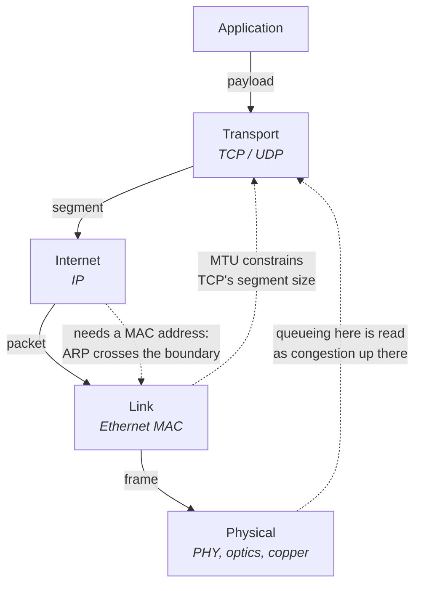
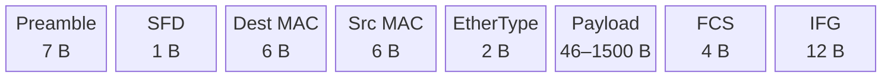
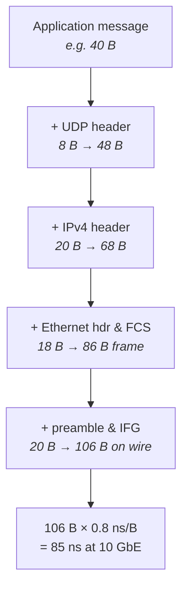
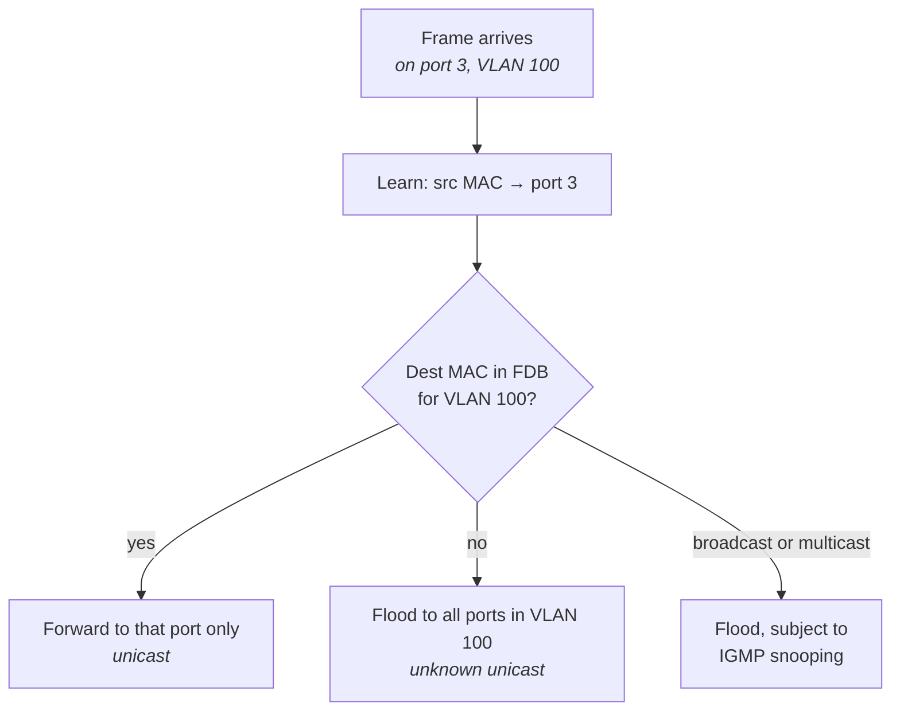
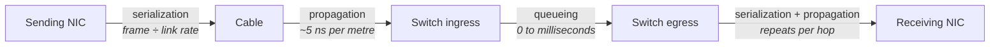

# The Network Stack from the Bottom Up

You learned the OSI model in a networking course: seven layers, each one using the services of the
one below, each one ignorant of the ones above. It is a good teaching device and a poor description
of a running system. The picture it gives you is of an orderly stack in which every layer is a black
box, and it deliberately hides the two things that dominate latency work — what each layer *costs*,
and where the boxes are not actually closed.

The costs are the more surprising part. An engineer who has only written socket code thinks of a
packet as a logical object: you call `send`, it arrives. On a low-latency path it is a physical
object with a duration. A 1500-byte Ethernet frame on a 10 Gb/s link occupies the wire for about
1.2 microseconds — during which nothing else can be sent on that link, and during which the frame is
not yet fully anywhere. That is longer than a syscall, longer than a hundred cache misses, and it is
pure physics: you cannot optimize it away in software, only by sending fewer bytes or buying a faster
link. Meanwhile a 64-byte frame on the same link takes about 67 nanoseconds including its mandatory
gap. The ratio between those two numbers — roughly eighteen — is the single most important thing to
internalize about how a network behaves, because it means the wire treats a small message and a large
one as fundamentally different events.

This chapter builds the bottom of the stack: what a frame actually is, what every byte of overhead
costs you in nanoseconds, how a switch decides where to send it, and — the part everything in Part III
depends on — the three physically distinct components of network delay. Serialization delay is set by
your link speed and your frame size. Propagation delay is set by the length of your cable and the
speed of light in glass. Queueing delay is set by everyone else's traffic. They have different causes,
different magnitudes, and different fixes, and an engineer who cannot separate them will spend money
on the wrong one. The Linux side of this — how a frame becomes an `sk_buff` and travels to a socket
— is covered in "The Linux Networking Stack"; here we stay below that boundary, on the wire and in the
switch.

## Layering Models and Where They Leak

The reason layering exists is decomposition. Ethernet does not need to know about TCP retransmission;
TCP does not need to know whether it is running over fiber or microwave. Each layer defines a service
interface, and the layer above builds on that interface without knowing the implementation. This is
the same argument as any other abstraction boundary in software, and it works: the Internet ran
essentially unchanged while the physical layer underneath it went from 10 Mb/s coaxial cable to
400 Gb/s optics.

The seven-layer OSI model, though, is a standards document from a competing protocol suite that lost.
Real systems implement the four-layer TCP/IP model, and the mapping between the two is loose enough
that arguing about which layer something belongs to is usually a waste of time. What matters for our
purposes is which boundaries correspond to real code, real hardware, and real headers on the wire.

| TCP/IP layer | OSI equivalent | What it is in a real system | Header on the wire |
|---|---|---|---|
| **Link** | 1–2 (physical, data link) | NIC MAC block + PHY, Ethernet switch fabric | 14–18 bytes + 4-byte FCS |
| **Internet** | 3 (network) | IP forwarding in the kernel or in switch/router silicon | 20 bytes (IPv4), 40 (IPv6) |
| **Transport** | 4 | TCP/UDP state machines in the kernel or a bypass stack | 20+ (TCP), 8 (UDP) |
| **Application** | 5–7 | Your process | Whatever you define |

The OSI session and presentation layers have no independent existence in this stack — there is no
piece of code and no header corresponding to them. Treat them as vocabulary, not architecture.

### Where the boxes are not closed

The useful exercise is not memorizing the layers but cataloguing the places where the abstraction
demonstrably leaks, because every one of those places is somewhere a latency bug can hide. A leak is
any situation where a layer's behavior depends on, or is visible to, a layer it is supposed to be
independent of.



Each dotted edge in that diagram is a real dependency that the clean model denies:

- **MTU is a link property that transport must know.** The maximum payload a link can carry is set by
  Ethernet, but TCP has to choose a segment size that fits, so the maximum segment size is negotiated
  in the TCP handshake based on an L2 number. Get this wrong and connections hang — covered in "IP and
  the Network Layer."
- **Congestion control infers L1/L2 queue state from L4 signals.** TCP has no way to see a switch
  buffer. It deduces that buffers are filling from rising round-trip time and from loss, both of which
  are physical-layer consequences observed three layers up (see "TCP In Depth").
- **ARP is an L2/L3 hybrid by construction.** To send an IP packet you need the destination's MAC
  address, so the network layer has to ask the link layer a question the model says it should not need
  to ask. ARP packets carry their own EtherType and are neither cleanly L2 nor L3.
- **Offloads make the stack lie about frame boundaries.** With generic receive offload enabled, the
  NIC or driver merges several arriving frames into one large buffer before the IP layer sees it, so
  what your code observes as one 40 KB "packet" was never on the wire. The transmit-side equivalent,
  TCP segmentation offload, hands the NIC one oversized buffer to chop up. Both are throughput
  optimizations that destroy the correspondence between what software sees and what the wire carried
  (see "The Linux Networking Stack").
- **Checksum offload means the checksum you read may be wrong on purpose.** The NIC computes it after
  the packet leaves the stack, so a capture taken on the sending host shows placeholder values.
- **Cut-through switching forwards a frame before it exists.** A switch can begin transmitting on the
  egress port after reading only the destination MAC address — long before the frame's error-detecting
  checksum has arrived. The "frame" is simultaneously on two links.
- **VLAN tags change frame sizes underneath IP.** Inserting a 4-byte tag reduces the payload budget,
  and a device that has not been configured for the larger frame will drop it as oversized.

The practical version of all this is a rule that will save you repeatedly: **when a network problem
does not make sense at the layer where you observed it, the cause is almost always one or two layers
below.** A TCP connection with terrible tail latency is very often a duplex mismatch, a marginal
optical transceiver producing checksum errors, or a switch queue — none of which TCP can name.

**Failure mode: a capture shows "incorrect checksum" on every outgoing packet.** Symptom is `tcpdump`
or Wireshark flagging bad checksums on packets your host sent, while the connection works fine. Cause
is transmit checksum offload — the NIC fills the field in after the capture point. Confirm with
`ethtool -k <iface> | grep checksum`; if `tx-checksumming: on`, this is expected and not a fault.

**Failure mode: captured packets are far larger than the link MTU.** Symptom is `tcpdump` showing
inbound segments of 20–60 KB on a 1500-byte MTU interface. Cause is generic receive offload coalescing
frames before the capture point. Confirm with `ethtool -k <iface> | grep -E 'generic-receive|large-receive'`,
and disable with `ethtool -K <iface> gro off lro off` when you need to see the real wire.

**Try it:** take one capture with offloads on and one with them off, and compare frame counts for the
same transfer. Run `ethtool -k eth0 > /tmp/offloads.txt` first so you can restore the settings, then
`sudo tcpdump -e -n -c 200 -i eth0 -w /tmp/on.pcap`, then `sudo ethtool -K eth0 gro off tso off gso off`
and repeat. The second capture will contain many more, much smaller frames for identical traffic. That
difference is the layering leak made visible, and it is why measurements taken through the kernel stack
disagree with measurements taken at a network tap.

## Ethernet Framing, MTU, and Jumbo Frames

A frame is what a NIC actually transmits: a specific sequence of bytes with a specific structure that
the receiving NIC's hardware knows how to find, delimit, and check. Everything above it — IP, TCP,
your message — is opaque payload as far as the link layer is concerned. The structure exists to solve
three problems that only arise once you put bits on a shared physical medium: the receiver must know
when a frame begins, which station it is for, and whether it arrived intact.

The first problem is solved by the **preamble**, seven bytes of alternating ones and zeros, followed by
a one-byte **start frame delimiter** (SFD). Modern links are continuously clocked, so the preamble is
partly a historical artifact of a time when the receiver's clock recovery circuit needed a run-up, but
it is still transmitted and it still occupies the wire. The second problem is solved by the two
**MAC addresses** — 6 bytes of destination followed by 6 bytes of source — and the third by the
**frame check sequence** (FCS), a 4-byte CRC-32 over the whole frame. A frame whose CRC does not match
is discarded silently by the receiving hardware; the link layer offers no repair, only detection.

Between the addresses and the payload sits a 2-byte field that is either a length or an **EtherType**,
depending on its value: below 1536 it is a length (the original 802.3 interpretation), at or above it
is a type code identifying the payload protocol. In practice you will only ever see the type
interpretation. And after every frame comes the **interframe gap** (IFG): 96 bit times of enforced
silence, 12 bytes' worth, during which the link must stay idle. It exists to give receivers time to
recover between frames, and like the preamble it is mandatory overhead you pay per frame regardless of
frame size.



The diagram is drawn in transmission order, and the accounting it implies is the thing to memorize:

- **The "frame" is 64 to 1518 bytes** — destination MAC through FCS inclusive. This is what standards
  documents mean by frame size, and what a switch's giant/runt counters compare against.
- **The wire footprint is 20 bytes larger** than the frame: 8 bytes of preamble and SFD before, 12
  bytes of interframe gap after. Neither is part of the frame, both consume link time.
- **The minimum payload is 46 bytes**, and shorter payloads are zero-padded to reach it. The 64-byte
  frame minimum is a fossil of half-duplex CSMA/CD collision detection, but it is still enforced.
- **The default maximum payload — the MTU — is 1500 bytes.** MTU (maximum transmission unit) counts
  only the payload, not the Ethernet header or FCS. This is the single most common off-by-18 error in
  networking.
- **Common EtherType values:** `0x0800` IPv4, `0x86DD` IPv6, `0x0806` ARP, `0x8100` 802.1Q VLAN tag.

### What a frame costs in time

Here is where the physical object asserts itself. A link with a given bit rate transmits bytes at a
fixed pace, so frame size converts directly into microseconds of occupied wire. At 10 Gb/s, one byte
takes 0.8 ns. That single constant lets you compute everything else.

| Frame | Frame bytes | Wire bytes (+20) | Time at 1 GbE | Time at 10 GbE | Time at 25 GbE | Time at 100 GbE |
|---|---|---|---|---|---|---|
| Minimum (64 B) | 64 | 84 | 672 ns | 67.2 ns | 26.9 ns | 6.7 ns |
| Small message (~100 B payload) | 118 | 138 | 1.10 µs | 110 ns | 44 ns | 11 ns |
| Full MTU (1500 B payload) | 1518 | 1538 | 12.3 µs | 1.23 µs | 492 ns | 123 ns |
| Jumbo (9000 B payload) | 9018 | 9038 | 72.3 µs | 7.23 µs | 2.89 µs | 723 ns |

Two consequences follow immediately. First, **the maximum frame rate of a 10 GbE link is about
14.88 million frames per second**, because 10 Gb/s divided by 84 bytes × 8 bits gives that figure.
That number is worth remembering: it is the ceiling any packet-processing design must respect, and it
is why per-packet costs matter more than per-byte costs on small-packet workloads.

Second, **small frames waste an enormous fraction of the link.** A 64-byte frame carries at most 46
bytes of payload but occupies 84 bytes of wire time — 55% efficiency before any IP or UDP header. Push
the payload down to a 30-byte message and you are below a third. This is not a defect to be fixed; it
is the price of low latency, and a system that fills frames to improve efficiency has chosen throughput
over latency (see "Systematic Optimization" on batching).

### Jumbo frames

If per-frame overhead is fixed, the obvious move is bigger frames. **Jumbo frames** raise the MTU
above 1500 bytes, conventionally to 9000, which cuts the number of frames — and therefore the number
of per-frame overheads, interrupts, and header-processing operations — by a factor of six for bulk
transfers. For a storage network or a backup path this is straightforwardly good.

For a latency-critical path it is usually irrelevant and occasionally harmful, for a reason that
follows directly from the table above. A jumbo frame takes 7.2 µs to serialize at 10 Gb/s. If a jumbo
frame from a bulk transfer begins transmitting on a switch port one nanosecond before your small,
urgent frame arrives at that switch, your frame waits the full 7.2 µs behind it — even on a
cut-through switch, because the egress port is busy. That is **head-of-line blocking at the link
layer**, and raising the MTU raises the worst case sixfold.

Jumbo frames also have to be configured consistently. MTU is a property of a broadcast domain, not of
a host: every switch port, every router interface, and every host on the segment must agree, because a
frame that exceeds a device's configured maximum is dropped, not fragmented. Switches often need a
separate system-level maximum frame size raised in addition to per-port settings, and the numbers
vendors use are inconsistent about whether they include the 18-byte header and FCS.

| | Standard MTU | Jumbo MTU |
|---|---|---|
| Payload | 1500 B | 9000 B (conventional; not standardized) |
| Frame on wire | 1538 B incl. preamble and IFG | 9038 B |
| Serialization at 10 GbE | 1.23 µs | 7.23 µs |
| Per-frame overhead as fraction of payload | ~2.5% | ~0.4% |
| Worst-case blocking behind one frame | 1.23 µs | 7.23 µs |
| Right choice for | Latency paths, mixed traffic | Bulk transfer, storage, replication |

There is a middle case worth knowing by name: a **baby giant** is a frame slightly over 1518 bytes,
typically 1522 or 1526, produced when a VLAN tag or a tunnel header is added to an otherwise standard
frame. Switches that have not been configured to accept them drop them, producing a fault that appears
only for tagged traffic.

**Failure mode: large transfers stall while small ones succeed.** Symptom is that `ping` works, a TCP
connection establishes, and then the session hangs the moment real data flows. Cause is an MTU
mismatch somewhere on the path — one device is configured for 9000 and another for 1500, and the
oversized frames are silently discarded. Confirm by probing with a do-not-fragment ping of increasing
size: `ping -M do -s 1472 -c 3 <peer>` sends exactly a 1500-byte IP packet (1472 payload + 8 ICMP +
20 IP). If that succeeds and `ping -M do -s 8972 -c 3 <peer>` fails with "message too long" or times
out, the path does not carry jumbo frames.

**Failure mode: rising `rx_crc_errors` on a port.** Symptom is sporadic loss and retransmission with
no congestion. Cause is physical: a marginal transceiver, a dirty fiber connector, a bent or
out-of-spec cable, or electrical noise. The FCS catches the corruption and the frame is discarded
before any protocol layer sees it, so it appears to upper layers as loss with no explanation. Confirm
with `ip -s link show <iface>` for the aggregate error counters and `ethtool -S <iface> | grep -iE 'crc|err|frame'`
for the driver-specific detail. Any nonzero and increasing CRC error count on a trading path is a
hardware fault, not a tuning problem.

**Try it:** read the actual configuration rather than assuming it. `ip link show eth0` prints the MTU
in the first line; `cat /sys/class/net/eth0/mtu` is the same value; `ethtool eth0` reports negotiated
`Speed:` and `Duplex:`. Then compute your own serialization table: divide the link speed in bits per
second into 8 × (frame bytes + 20) and check the 10 GbE column above. Doing this arithmetic once by
hand is what makes the numbers stick.

**Try it:** change the MTU and watch it propagate. `sudo ip link set dev eth0 mtu 9000` on a test
interface, then `ping -M do -s 8972 <peer>` to the far side. If the switch between them is not
configured for jumbo frames, the ping fails while a normal ping still works — a two-command
demonstration of why MTU must be consistent across an entire broadcast domain.

## Encapsulation, Headers, and Per-Layer Overhead

Encapsulation is the mechanism that makes layering work on the wire: each layer takes the unit handed
down from above, treats it as opaque payload, prepends its own header, and hands the result down
again. By the time your message reaches the NIC it is wrapped in three or four envelopes, each
addressed to a different piece of infrastructure. The Ethernet header is read by the switch and thrown
away at the next hop; the IP header is read by routers and survives end to end; the TCP or UDP header
is read only by the two endpoints.

The reason this matters for latency, rather than being a diagram in a textbook, is that headers are
bytes, bytes are serialization time, and small messages are mostly header. An engineer used to
thinking in terms of application payloads will estimate the cost of sending a 40-byte message and be
wrong by a factor of three.



The chain in that diagram is the calculation you should be able to do in your head:

- **Every layer adds a fixed cost**, and the fixed costs dominate when the message is small. A 40-byte
  application message becomes 106 bytes on the wire — the payload is 38% of what you transmit.
- **The 46-byte Ethernet minimum can bite.** A 10-byte message over UDP/IPv4 gives a 38-byte payload,
  below the minimum, so 8 bytes of padding are added. Below that threshold, shrinking your message
  costs nothing and saves nothing.
- **Preamble and IFG are invisible to every tool.** No capture shows them; no counter reports them.
  They are 20 bytes of wire time per frame that you must remember to include manually.

### Header sizes worth memorizing

| Header | Size | Notes |
|---|---|---|
| Ethernet (dest, src, type) | 14 B | Plus 4 B FCS at the end |
| 802.1Q VLAN tag | +4 B | Inserted after source MAC; QinQ doubles it |
| Preamble + SFD + IFG | 20 B | Wire time only, not in the frame |
| IPv4, no options | 20 B | Options are rare and slow-path on routers |
| IPv6 | 40 B | Fixed; extension headers add more |
| UDP | 8 B | Source port, dest port, length, checksum |
| TCP, no options | 20 B | 32 B is typical in practice with timestamps |
| TCP with common options | ~32–40 B | Timestamps, SACK blocks, window scale |

Two combinations are worth having memorized outright, because you will use them constantly:

- **Minimum useful UDP/IPv4 over Ethernet: 42 bytes of overhead** (14 + 20 + 8) before payload, plus
  4 bytes FCS and 20 bytes of preamble and gap — 66 bytes of non-payload on the wire.
- **Minimum useful TCP/IPv4 over Ethernet: 54 bytes of overhead** (14 + 20 + 20), typically 66 in
  practice once TCP timestamps are enabled — which is why a bare TCP acknowledgment is a 64-byte
  frame, exactly at the Ethernet minimum.

This is a large part of why market data is carried over UDP multicast rather than TCP: 12 fewer bytes
of header per message and no per-receiver acknowledgment traffic (see "UDP and Multicast"). It is also
why every additional encapsulation layer — a VLAN tag, a VXLAN or GRE tunnel, an MPLS label stack —
is a direct latency cost as well as a reduction in usable MTU. Tunnels are common in general data
centers and essentially absent from trading paths for exactly this reason.

**Failure mode: throughput plateaus well below line rate on a small-message workload.** Symptom is a
link showing, say, 4 Gb/s of "useful" traffic on a 10 GbE port that the switch reports as nearly
saturated. Cause is header and inter-frame overhead: at small frame sizes the majority of wire time is
not payload. Confirm by dividing the interface's frame counter by its byte counter — both are in
`ip -s link show <iface>` — to get the mean frame size, then computing wire bytes as mean frame size
plus 20 and comparing the ratio.

**Try it:** verify the header stack by hand. Run `sudo tcpdump -e -n -i eth0 -c 5 'udp'` and read the
line prefix: `tcpdump -e` prints the Ethernet header, so you will see source and destination MAC,
the EtherType, and then the frame length. Compare the printed length against your computed
14 + 20 + 8 + payload. If a VLAN tag is present, `tcpdump` shows `vlan <id>` and the length is 4 bytes
larger. This is the fastest way to confirm what encapsulation your traffic is actually carrying.

## ARP, VLANs, and Switching Fundamentals

An IP packet cannot be transmitted on Ethernet until the sender knows the destination's MAC address —
not the MAC address of the final IP destination, but of the **next hop**: either the destination host
itself if it is on the same subnet, or the router that leads toward it. The IP layer has an IP
address; the Ethernet layer needs a hardware address; something must bridge them. That something is
the **Address Resolution Protocol** (ARP), and it is the clearest example of a layering leak in daily
operation.

ARP works by broadcast. The sender emits a frame to the broadcast MAC address `ff:ff:ff:ff:ff:ff`
containing the question "who has IP address X?" Every host on the segment receives it; the one that
owns X replies by unicast with its MAC address. The sender caches the answer in a **neighbour table**
and uses it for subsequent packets. Because the answer is cached, ARP is almost never on the hot path
— but the word "almost" is doing serious work, and the first packet after a cache entry expires is a
latency event measured in hundreds of microseconds or worse.

Linux tracks each neighbour entry through a small state machine, and understanding it explains
precisely when you pay:

| State | Meaning | Effect on a packet |
|---|---|---|
| `INCOMPLETE` | Request sent, no reply yet | Packet is queued pending resolution |
| `REACHABLE` | Confirmed recently | Sent immediately — the normal case |
| `STALE` | Cached but unconfirmed for a while | Sent immediately; probe scheduled |
| `DELAY` | Waiting briefly before probing | Sent immediately |
| `PROBE` | Actively re-verifying | Sent immediately |
| `FAILED` | No response to probes | Packet dropped |
| `PERMANENT` | Statically configured | Never expires, never probed |

The dangerous transition is not `STALE` — a stale entry still forwards traffic while the kernel
re-verifies in the background. The dangerous case is an entry being **garbage-collected out of the
table entirely**, which puts the next packet into `INCOMPLETE` and holds it while a broadcast round
trip completes. On a quiet path where you talk to a peer only occasionally, this is exactly the
scenario that produces a mysterious multi-hundred-microsecond outlier on the first message after an
idle period. The relevant knobs are `net.ipv4.neigh.default.gc_thresh1` (below this many entries,
never garbage-collect), `gc_thresh2` (soft limit), and `gc_thresh3` (hard limit), plus
`net.ipv4.neigh.default.base_reachable_time_ms` for how long a confirmed entry stays `REACHABLE`.

The standard remedy on a latency-critical host is to remove ARP from the path entirely by installing
permanent entries for the handful of peers that matter:

```sh
ip neigh replace 10.0.0.2 lladdr 00:1b:21:aa:bb:cc dev eth0 nud permanent
ip neigh show                      # inspect state of all entries
ip -s neigh show 10.0.0.2          # with statistics
```

**Failure mode: the first packet after an idle period is hundreds of microseconds slow.** Symptom is a
latency histogram with a small cluster of enormous outliers that correlate with gaps in traffic. Cause
is a neighbour entry that aged out, forcing a synchronous ARP round trip. Confirm by watching
`ip neigh show <peer>` transition away from `REACHABLE` during the idle period, and by capturing with
`sudo tcpdump -n -e -i eth0 arp` to see the request immediately preceding the slow packet. Fix with a
permanent entry.

**Failure mode: intermittent connectivity loss to one host, with the wrong MAC in the table.** Cause
is a duplicate IP address, or a gratuitous ARP from a failover event overwriting the entry. Confirm
with `arp -n` or `ip neigh show` and compare the learned MAC against the one you expect; capture ARP
traffic to see two different hosts answering for the same address.

### VLANs

A **VLAN** (virtual LAN) partitions one physical switch into several independent broadcast domains.
Ports are assigned to a numbered VLAN, and a frame entering on a port in VLAN 100 can only be
forwarded to other ports in VLAN 100. Broadcasts — including ARP — are contained within the VLAN. The
motivation is partly security and partly scale: an unrestricted broadcast domain means every host
processes every ARP request from every other host, and that load grows with the square of the segment
size.

When a link must carry more than one VLAN — typically a link between switches, or between a switch and
a host running several logical networks — frames need a VLAN identifier attached. The **802.1Q** tag
is 4 bytes inserted directly after the source MAC address: a 2-byte tag protocol identifier of
`0x8100` in the position where the EtherType would be, then 3 bits of **priority code point** (PCP),
1 bit of drop-eligible indicator, and 12 bits of VLAN ID, giving 4094 usable VLANs. The original
EtherType follows the tag.

The consequences to keep in mind:

- **A tag costs 4 bytes and expands the frame to 1522 bytes** at standard MTU. Every device on the
  path must accept the larger frame.
- **The PCP field is the L2 quality-of-service marking**, distinct from the IP-layer DSCP field. A
  switch configured for priority queueing reads PCP, not DSCP, on a tagged frame — a common source of
  QoS policies that quietly do nothing (see "IP and the Network Layer").
- **An access port carries untagged frames**; a trunk port carries tagged frames for multiple VLANs.
  The VLAN a trunk uses for untagged frames is the native VLAN, and mismatched native VLANs on the two
  ends of a trunk is a classic misconfiguration.
- **QinQ (802.1ad) stacks two tags**, costing 8 bytes and pushing the frame to 1526 bytes.

On Linux, a tagged sub-interface is created with `ip link add link eth0 name eth0.100 type vlan id 100`,
after which `eth0.100` behaves like an ordinary interface whose frames carry tag 100.

### How a switch actually forwards

A switch is a device that forwards frames between ports based on the destination MAC address, and its
entire intelligence consists of one table and one learning rule. The table — the **forwarding
database** (FDB), also called the MAC address table or CAM table — maps a MAC address and VLAN to a
port. The rule is: when a frame arrives, record its *source* MAC as reachable via the port it arrived
on, then look up its *destination* MAC and forward accordingly.

Three outcomes are possible on lookup, and the third is the one that causes trouble:



The flooding branch is the important one. A switch that does not know where a MAC address lives sends
the frame everywhere in the VLAN. This is correct — it guarantees delivery and the reply teaches the
switch the right port — but it means one host's traffic lands on every other host's NIC, consuming
their receive bandwidth and CPU. **Unknown unicast flooding** becomes chronic when a host is silent
for longer than the FDB aging timer (commonly 300 seconds) while others keep sending to it: the entry
ages out, and every subsequent frame to that host is flooded until it transmits something.

The other switch property that matters more than anything else in this chapter is the **forwarding
mode**, and it is a direct application of the serialization arithmetic from the previous section.

```mermaid
sequenceDiagram
    participant I as Ingress port
    participant SW as Switch logic
    participant E as Egress port
    Note over I,E: Cut-through
    I->>SW: first 14 bytes (dest MAC read)
    SW->>E: begin transmitting<br/><i>~100–500 ns after first bit</i>
    I->>SW: remainder of frame streams through
    Note over I,E: Store-and-forward
    I->>SW: entire frame received &amp; FCS verified
    SW->>E: begin transmitting<br/><i>after full serialization delay</i>
```

- **Cut-through** begins forwarding once the destination MAC is read, roughly 14 bytes into the frame.
  Port-to-port latency is therefore nearly independent of frame size — typically 300–500 ns on a
  standard low-latency data-center switch, and well under 100 ns on purpose-built ultra-low-latency
  hardware (see "Buses, Devices, and I/O Hardware" for switch architecture).
- **Store-and-forward** buffers the entire frame, verifies the FCS, then transmits. It therefore adds
  the full serialization delay of the frame to the hop: about 1.2 µs for a full-MTU frame at 10 GbE,
  7.2 µs for a jumbo frame.
- **Cut-through propagates corrupt frames.** Because the switch commits before checking the CRC, a
  frame corrupted in flight is forwarded and discarded by the receiver instead of by the switch. Many
  switches count these as forwarded-with-error and fall back to store-and-forward on a port with a
  high error rate.
- **Any speed change forces store-and-forward.** A frame entering at 25 Gb/s cannot be emitted at
  10 Gb/s without buffering, because the egress link cannot drain it as fast as it arrives. Mixed-speed
  paths therefore silently lose the cut-through advantage.

One more physical-layer detail that engineers routinely miss: **the PHY, not just the switch, has
latency.** A 10GBASE-R link over fibre or a direct-attach copper cable adds tens to a couple of hundred
nanoseconds per PHY. A 10GBASE-T link over RJ45 twisted pair adds roughly 2 microseconds per PHY
because of its block-coding and forward-error-correction pipeline. That is a factor-of-ten difference
in hop latency determined entirely by cable type, and it is why low-latency deployments use SFP+
direct-attach or fibre and not 10GBASE-T.

**Failure mode: a host receives traffic addressed to other hosts.** Symptom is unexplained inbound
frame rate and CPU spent dropping packets in the NIC or kernel. Cause is unknown unicast flooding
because a silent host's FDB entry aged out, or a MAC table overflow. Confirm on Linux with a promiscuous
capture — `sudo tcpdump -e -n -i eth0 'not ether dst <my mac> and not broadcast and not multicast'` —
and on the switch by inspecting its MAC address table for the missing entry.

**Failure mode: latency doubles after a cabling change with no configuration change.** Cause may be a
switch to 10GBASE-T copper from direct-attach, adding ~2 µs per PHY at each end, or a speed mismatch
forcing store-and-forward at a hop that was previously cut-through. Confirm the link medium and speed
with `ethtool <iface>`, which reports `Port:` (`Twisted Pair`, `Direct Attach Copper`, `FIBRE`) along
with `Speed:` and `Duplex:`.

**Try it:** watch MAC learning happen on a Linux bridge, which uses the same mechanism as a hardware
switch. Create one with `sudo ip link add br0 type bridge`, attach two interfaces, and then run
`bridge fdb show br0` before and after passing traffic. Entries appear with the port they were learned
on, and disappear again after the aging timeout. `bridge fdb show` distinguishes `permanent` from
learned entries, which is the same distinction as a static versus dynamic MAC table entry on a switch.

**Try it:** inventory your own L2 environment in three commands. `ip -br link` gives every interface
with its MAC and state; `ip neigh show` gives everything your host has resolved and the state of each
entry; `ip -s link show <iface>` gives cumulative RX/TX packets, bytes, errors, and drops. Take a
snapshot of the error columns, wait a few minutes under load, and take another. Anything that moved
in the error or dropped columns is a real fault worth chasing before you touch a single TCP parameter.

## Serialization, Propagation, and Queueing Delay

Everything up to this point has been structure. This section is the payoff: the model that lets you
predict, and then attribute, the time a packet spends in the network. Total one-way network delay
decomposes into four components, three of which are large enough to reason about.

**Serialization delay** — sometimes called transmission delay — is the time to clock the bits of a
frame onto the wire. It is frame size divided by link rate, and it is paid once at the sending NIC and
once at every store-and-forward hop. It depends on how many bytes you send and how fast the link is,
and on nothing else. It is completely deterministic.

**Propagation delay** is the time for a bit to travel the physical distance. Light moves at about
300,000 km/s in vacuum, but in single-mode fibre the refractive index of glass slows it to roughly
200,000 km/s — **about 5 nanoseconds per metre, or 5 microseconds per kilometre**. Copper twisted pair
and direct-attach cable are similar, around 4.5 to 5 ns/m. Radio through air is faster, about
3.3 ns/m, which is the entire reason microwave links exist between financial centres (see "Network
Design and Operations"). Propagation depends only on distance and medium; it is unaffected by load,
frame size, or link speed, and it is the one component you cannot improve with better equipment.

**Queueing delay** is time spent waiting in a buffer because the egress port is busy with another
frame. Unlike the first two it is not a property of your traffic at all — it is a property of
*everyone else's* traffic, arriving at the same port at the same instant. It is the only component
with meaningful variance, and it is therefore the dominant contributor to the tail of your latency
distribution.

**Processing delay** — the time a device spends examining headers and making a forwarding decision —
is the fourth component. In modern switch silicon it is tens of nanoseconds and folded into the
quoted port-to-port figure, so we will not treat it separately.



The diagram shows the ordering, and each edge maps to one of the components:

- **Serialization is paid per transmission**, so once per hop on a store-and-forward path and
  essentially once end-to-end on a cut-through path.
- **Propagation is paid per metre of cable**, summed over the whole path regardless of how many devices
  are in it.
- **Queueing is paid per congested egress port**, and is zero when the port is idle at the moment your
  frame arrives.

### Doing the arithmetic

The reason to separate these is that they have wildly different magnitudes at different scales, and
knowing which one dominates tells you what to fix. Consider three concrete paths, all at 10 GbE with a
200-byte frame (220 bytes on the wire, 176 ns of serialization):

| Path | Distance | Serialization | Propagation | Switch hops | Typical one-way total |
|---|---|---|---|---|---|
| Same rack, one switch | ~5 m | 176 ns | ~25 ns | 1 × ~400 ns | ~600 ns |
| Same colo hall, three hops | ~100 m | 176 ns | ~500 ns | 3 × ~400 ns | ~1.9 µs |
| Cross-metro, 30 km of fibre | 30 km | 176 ns | **150 µs** | several | ~150 µs |

The lesson is stark. Inside a rack, serialization and switch latency dominate, and shaving bytes off
your message or removing a hop is a meaningful win. Across a metropolitan area, propagation swamps
everything, and the only lever that matters is the physical length of the path — which is precisely
why colocation exists and why cross-connect cable lengths are negotiated.

The same arithmetic explains a fact that surprises people about round-trip time. A 1 ms RTT
corresponds to about 100 km of fibre each way. If you measure 40 µs of RTT between two hosts you
believe are in the same building, roughly 4 km of that is cable — the fibre is not taking the route
you assumed.

### Why queueing is the one that varies

Serialization and propagation are fixed. Run the same test a million times and you get the same
answer. Queueing is where the tail comes from, and it is worth being precise about the mechanism
without reaching for formulas.

A switch egress port can transmit exactly one frame at a time. If two frames destined for the same
port arrive simultaneously on two different ingress ports, one of them is transmitted and the other
waits — for at least the serialization time of the first. Nothing is wrong; the switch is behaving
correctly; but your frame just acquired 1.2 µs of delay it did not have on the previous run. Extend
this to a port receiving traffic from many sources at once and the queue can grow to hundreds of
frames.

Two qualitative properties govern how bad this gets, and both are worth internalizing as intuitions
rather than equations:

**Queue depth grows sharply as utilization approaches capacity.** At low utilization the port is
usually idle when your frame arrives and you wait for nothing. As average utilization climbs, the
probability that the port is busy climbs with it, and the number of frames already waiting grows
faster than linearly. Near saturation, small increases in load produce large increases in delay. This
is the same hockey-stick shape you saw in memory bandwidth saturation (see "Memory Systems"), and for
structurally the same reason: a shared server with a queue in front of it.

**Burstiness matters more than average load.** A port running at 10% average utilization can still
have a deep queue if the traffic arrives in concentrated bursts. This is the crucial insight for
market data paths, where an event triggers a large number of messages within a few microseconds. A
**microburst** is exactly this: a burst of traffic short enough to be invisible in per-second
utilization statistics but long enough to fill a switch buffer. Your monitoring shows a 2 Gb/s link
average and your packets are being dropped, and both observations are correct.

Three specific queueing scenarios produce most real problems:

| Scenario | Mechanism | Where the queue forms |
|---|---|---|
| **Speed mismatch** | Traffic arrives at 25 or 40 Gb/s and must exit at 10 Gb/s | Egress port of the down-shifting switch |
| **Incast / fan-in** | Many senders transmit to one receiver simultaneously | Egress port facing the receiver |
| **Microburst** | Correlated event produces a dense burst from one source | Any port on the path, transiently |

The consequence when the queue overflows is drop, not delay: switch buffers are finite, and a frame
arriving at a full buffer is discarded. For TCP this appears as loss and triggers retransmission,
converting a microsecond-scale queueing problem into a millisecond-scale recovery problem (see "TCP
In Depth"). For UDP multicast market data it appears as a gap that must be detected and recovered
(see "UDP and Multicast").

There is also a self-inflicted version of queueing on your own host. The Linux transmit path has its
own queues — the interface's transmit queue and its queueing discipline — and if your application
hands the stack more data than the link can drain, the delay accumulates locally before a single bit
reaches the switch. Deep local buffers make this worse, which is the host-side face of **bufferbloat**.
The mechanics are covered in "The Linux Networking Stack" and the pathology in "TCP In Depth"; what
matters here is that "queueing delay" is not exclusively a property of the network.

**Failure mode: p50 latency is unchanged but p99.9 is orders of magnitude worse.** Symptom is a
latency distribution with a normal body and a long tail, uncorrelated with your own code path. Cause
is almost always queueing at a switch egress port or a NIC transmit queue. Confirm by checking the
switch's per-port output drop and buffer-occupancy counters (vendor-specific, but every data-center
switch exposes them), and on the host with `ip -s link show <iface>` for the `dropped` and `overrun`
columns plus `ethtool -S <iface> | grep -iE 'drop|discard|nobuf|fifo'`.

**Failure mode: drops on a link whose reported utilization is low.** Symptom is loss on a port that
monitoring shows at 15% average utilization. Cause is microbursts — the averaging interval, often one
minute or five, hides sub-millisecond saturation entirely. Confirm by sampling the interface byte
counters at a much finer interval, or by capturing at a tap and computing instantaneous rate over
100 µs windows. The mismatch between averaged and instantaneous rate is the whole diagnosis.

**Failure mode: latency to a peer is far higher than the physical distance justifies.** Symptom is
an RTT of, say, 800 µs between two racks in one facility. Cause is either a path that physically
routes somewhere unexpected — 800 µs is roughly 80 km of fibre each way — or persistent queueing on a
congested hop. Distinguish them by checking whether the delay is stable (propagation, so a routing or
cabling issue) or variable (queueing, so a congestion issue). A histogram separates these in one
glance; an average cannot.

**Try it:** measure propagation directly. Ping a peer you know to be in the same rack and one you know
to be in another building, and take the *minimum* observed RTT from a few hundred samples — the
minimum is the closest you get to a queue-free measurement, since queueing can only add. Divide by two
for one way, then by 5 ns/m. The result is the apparent fibre length. Compare it against the distance
you believe separates the hosts; a large discrepancy means the path is not what you think it is.

**Try it:** separate the fixed from the variable component experimentally. Run `ping -i 0.2 -c 1000`
to a peer and look at the summary line's `min/avg/max/mdev`. The minimum is serialization plus
propagation plus unloaded switch latency — the deterministic floor. Everything between minimum and
maximum is queueing and host-side scheduling jitter. Now generate background load on the same path
and repeat: the minimum will barely move while the maximum explodes. That gap, and its behavior under
load, is the entire practical content of this section.

**Try it:** make the serialization/propagation trade-off concrete. Run `ping -c 200 -s 32` and
`ping -c 200 -s 1400` to the same peer and compare the minima. On a short link at 10 GbE the
difference should be roughly 2 × 1.1 µs of extra serialization for the larger payload, in each
direction — small but measurable. On a long-haul link the difference should be nearly invisible
against the propagation delay. Two commands, and you have demonstrated which component dominates at
each scale.

## Numbers to Know

| Quantity | Value | Notes |
|---|---|---|
| Serialization, 1 GbE | 8 ns per byte | Divide bit rate into 8 bits |
| Serialization, 10 GbE | 0.8 ns per byte | The constant to memorize |
| Serialization, 25 GbE | 0.32 ns per byte | |
| Serialization, 100 GbE | 0.08 ns per byte | |
| Minimum Ethernet frame | 64 B frame, 84 B on wire | 67.2 ns at 10 GbE |
| Full-MTU frame | 1518 B frame, 1538 B on wire | 1.23 µs at 10 GbE |
| Jumbo frame (9000 B MTU) | 9018 B frame, 9038 B on wire | 7.23 µs at 10 GbE |
| Max frame rate, 10 GbE | ~14.88 Mpps | At minimum frame size |
| Per-frame wire overhead | 20 B | 7 B preamble + 1 B SFD + 12 B IFG |
| Ethernet header + FCS | 18 B | 22 B with an 802.1Q tag |
| UDP/IPv4 header overhead | 42 B | 14 + 20 + 8, before FCS and IFG |
| TCP/IPv4 header overhead | 54 B minimum, ~66 B typical | Options push it up |
| Propagation, single-mode fibre | ~5 ns/m, ~5 µs/km | Refractive index ~1.47 |
| Propagation, copper cable | ~4.5–5 ns/m | Velocity factor ~0.65–0.7 |
| Propagation, microwave in air | ~3.3 ns/m | ~1.5× faster than fibre |
| RTT per 100 km of fibre | ~1 ms | Round trip, so 2 × 500 µs |
| Cut-through switch, port to port | ~300–500 ns typical | Under 100 ns on ultra-low-latency hardware |
| Store-and-forward switch | Cut-through figure + full serialization | Adds 1.2 µs at MTU, 7.2 µs at jumbo |
| 10GBASE-R PHY (fibre / DAC) | Tens to ~200 ns per PHY | |
| 10GBASE-T PHY (RJ45 copper) | ~2 µs per PHY | Why trading paths avoid it |
| FDB aging timeout | ~300 s typical | Vendor default; controls unknown-unicast flooding |

*Order-of-magnitude figures. Serialization and propagation numbers are exact arithmetic from link rate
and medium; switch and PHY latencies are vendor- and model-specific and should be read from the
datasheet of the hardware you actually have.*

## Key Takeaways

- A frame is a physical object with a duration: frame size divided by link rate gives serialization
  delay, and at 10 GbE one byte is 0.8 ns.
- Every frame carries 20 bytes of invisible wire overhead — preamble, SFD, and interframe gap — that
  no capture or counter reports.
- MTU counts payload only; a 1500-byte MTU is a 1518-byte frame and 1538 bytes of wire time.
- Small frames are mostly overhead: a 40-byte message over UDP/IPv4 is 106 bytes on the wire, and
  that is the correct trade for latency.
- Jumbo frames improve bulk efficiency and worsen worst-case head-of-line blocking sixfold, so they
  belong on storage paths and not latency paths.
- Layering leaks in specific, enumerable places — MTU constraining TCP, ARP crossing L2/L3, offloads
  hiding real frame boundaries, and congestion control inferring queue state from RTT.
- ARP is off the hot path only while the neighbour entry is cached; an aged-out entry turns the next
  packet into a synchronous broadcast round trip, which permanent entries eliminate.
- A switch floods unknown unicast to every port in the VLAN, so a silent host whose FDB entry expired
  imposes its traffic on everyone else.
- Cut-through forwarding makes hop latency nearly independent of frame size; store-and-forward adds
  the full serialization delay, and any speed mismatch forces store-and-forward.
- Cable medium is a latency decision: 10GBASE-T adds roughly 2 µs per PHY versus tens of nanoseconds
  for fibre or direct-attach copper.
- Network delay is serialization plus propagation plus queueing; the first two are deterministic and
  the third supplies essentially all the variance.
- Queues deepen sharply as utilization rises and are driven by burstiness more than by average load,
  so a link averaging 15% can still drop microbursts.
- Inside a rack, serialization and switch latency dominate; over tens of kilometres, propagation at
  5 µs/km swamps everything and only physical distance matters.
