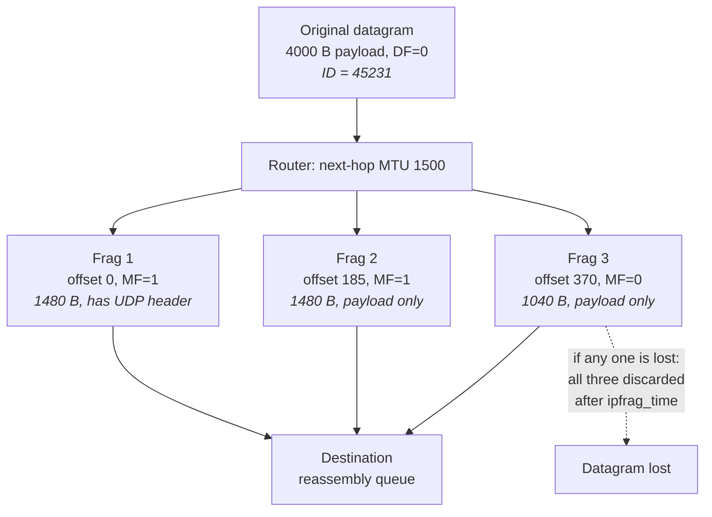
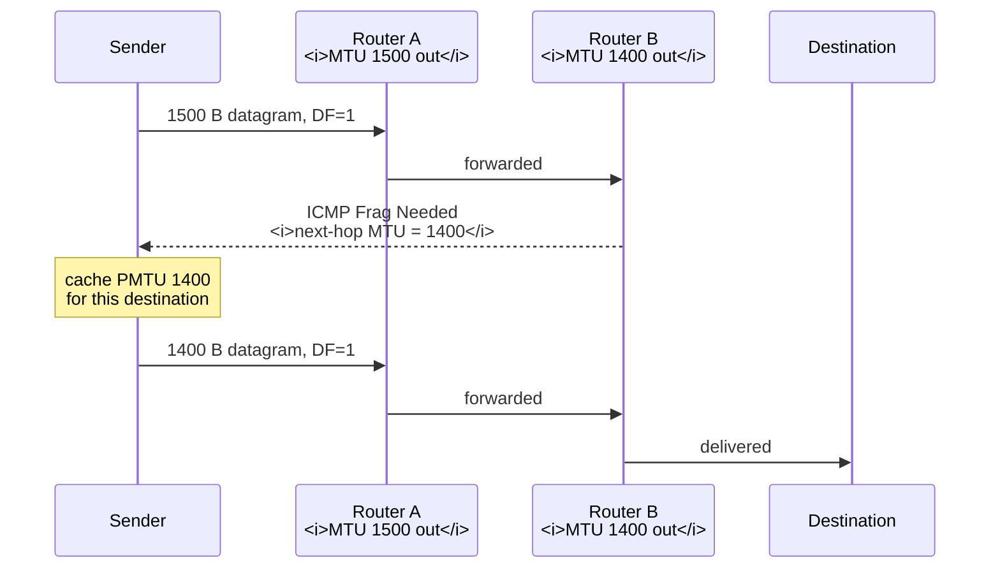
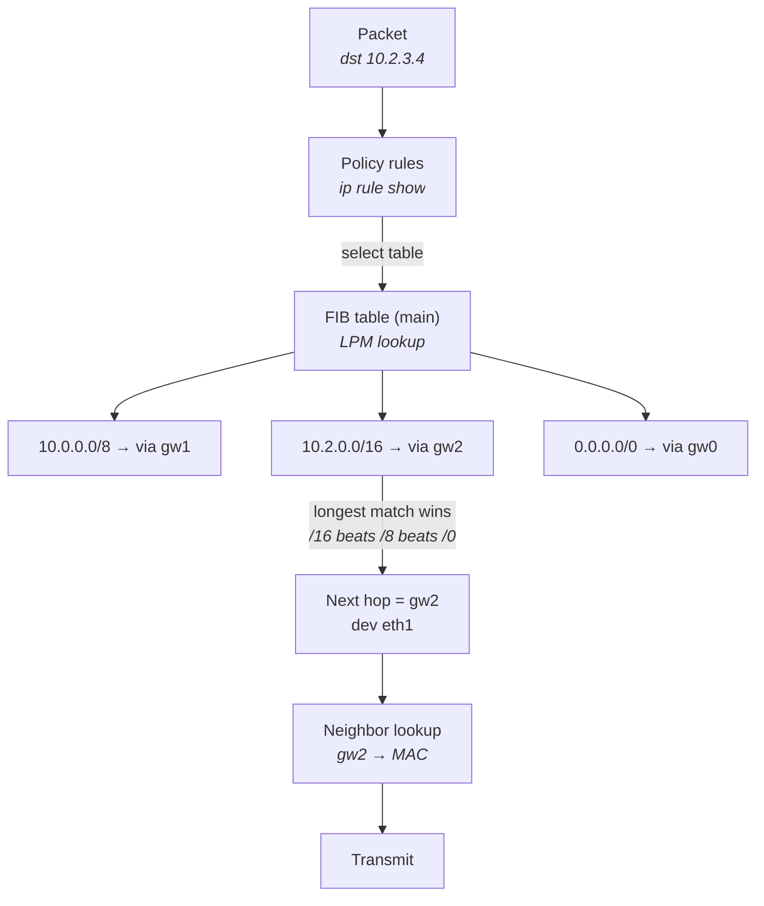
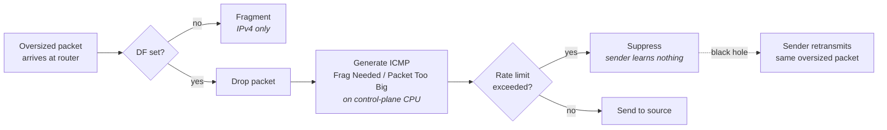
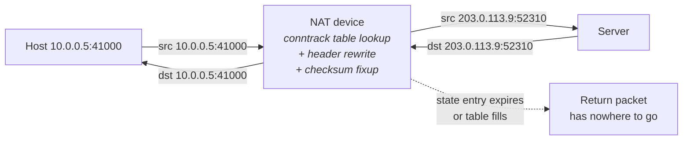
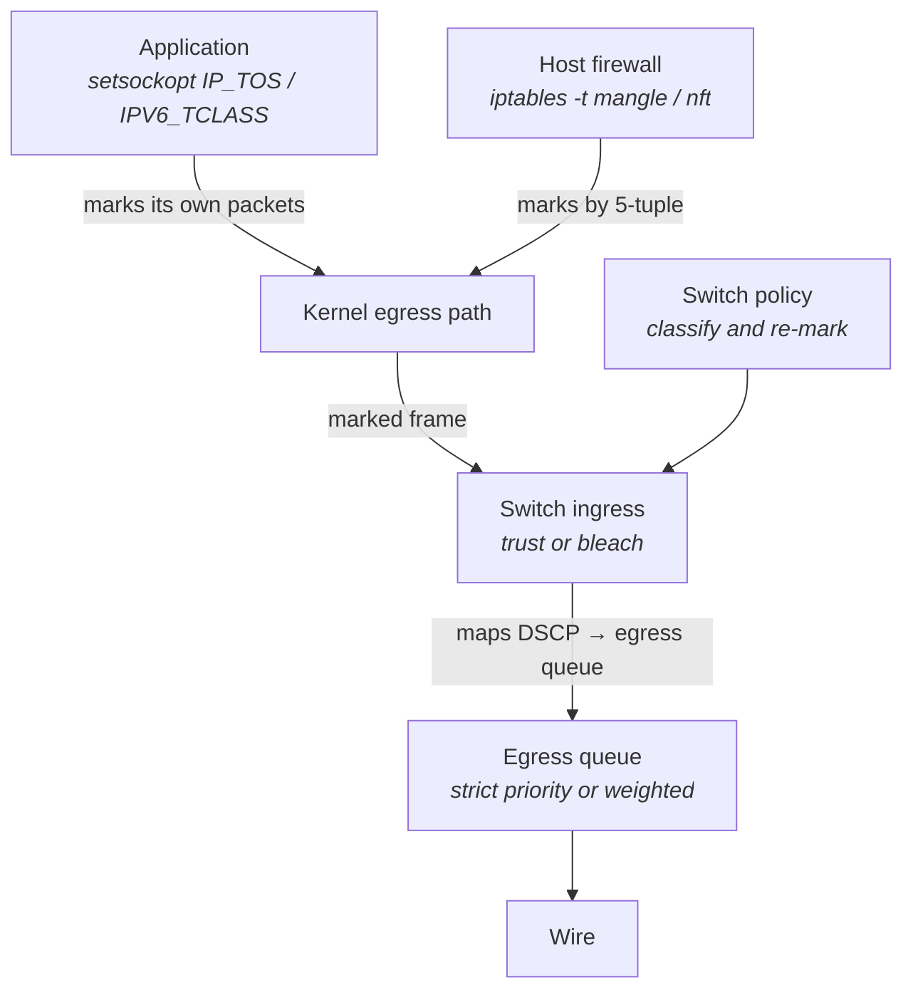

# IP and the Network Layer

The previous chapter left off with a frame on the wire: a preamble, a destination MAC address, a
payload, and a CRC, delivered to every host in one broadcast domain and filtered by a switch that
learned where each MAC lives (see "The Network Stack from the Bottom Up"). That mechanism has a hard
limit built into it. A MAC address is flat — 48 bits of manufacturer-assigned identity with no
structure a forwarding device can exploit. To forward on MAC addresses, a switch must have seen
every address it will ever forward to, and must hold an entry for each one. That works for a few
thousand hosts in a building. It cannot work for the Internet, and it cannot even work for a large
exchange's cross-connect fabric.

IP exists to fix exactly that, and the fix is a single idea: **make the address hierarchical, so that
a forwarding decision can be made about an entire range of destinations from one table entry.** A
router does not need to know where `192.0.2.47` is. It needs to know where `192.0.2.0/24` is, and one
entry covers 256 hosts. Everything else in the network layer — the header format, the routing table,
the time-to-live counter, fragmentation, the error protocol — is machinery around that idea, or
machinery to clean up after it.

For a latency-sensitive system, IP matters in three specific ways, and only three. First, the header
is 20 or 40 bytes of per-packet overhead that you pay on every single message, which at high message
rates is real bandwidth and real serialization time. Second, the network layer contains two
mechanisms — fragmentation and Path MTU Discovery — that are the single most common source of
mysterious, intermittent, size-dependent failures in production networks, and the failure mode is
usually a silent black hole rather than an error. Third, everything the network layer does per hop
(look up a route, decrement a counter, recompute a checksum) is done in hardware on a real switch and
in software on a Linux host, and the difference between those two is roughly a factor of ten in
latency. This chapter treats the protocol as something you read out of a capture and reason about,
not as something you memorized once for an exam.

## The IPv4 and IPv6 Headers, Field by Field

You have seen an IPv4 header diagram in a textbook. The version that appears in a course is usually
presented as if all fields matter equally, which is badly misleading: about half of the IPv4 header
is either vestigial, ignored by every device on the path, or actively dangerous to use. Knowing which
half is which is what separates someone who can read a `tcpdump -vv` line from someone who recognizes
the diagram.

Start with what the header must accomplish. A router receives a frame, strips the Ethernet header,
and now holds a sequence of bytes it must forward. It needs to know: where this is going (destination
address), where to send errors (source address), how long the thing is (because Ethernet padding
means the frame length is not the datagram length), what is inside it (so the receiving host can hand
the payload to TCP, UDP, or something else), and whether this datagram has been bouncing around the
network forever (so a routing loop does not melt the network). Those five needs account for most of
the header. Everything else is either an artifact of 1981 design decisions or the fragmentation
machinery.

The IPv4 header is a minimum of 20 bytes and, because of options, can be up to 60. The variable
length is itself a design mistake — it means a forwarding ASIC cannot assume a fixed offset to the
transport header, and it is why almost every network device on the planet either ignores or drops
packets carrying IP options. In practice you will see 20-byte IPv4 headers essentially always.

### The IPv4 header

| Field | Bits | What it is actually for | Operational relevance |
|---|---|---|---|
| **Version** | 4 | Always `4`. Distinguishes v4 from v6 when the L2 protocol type is ambiguous — which it is not on Ethernet, since EtherType already says `0x0800` vs `0x86DD` | Vestigial in practice; check it when hand-decoding hex |
| **IHL** (Internet Header Length) | 4 | Header length in 32-bit words. Minimum 5 (= 20 bytes), maximum 15 (= 60 bytes) | Read it whenever you compute the offset of the transport header by hand; a value other than 5 means options are present, which is itself suspicious |
| **DSCP** (Differentiated Services Code Point) | 6 | Traffic class marking, used by routers to select a queue on congested links | Operationally live — see the QoS section below |
| **ECN** (Explicit Congestion Notification) | 2 | Lets a router signal congestion by marking a packet instead of dropping it | Live if enabled end-to-end; frequently bleached by middleboxes |
| **Total Length** | 16 | Length of header + payload, in bytes. Caps a datagram at 65,535 bytes | Live and load-bearing. Ethernet pads short frames to 64 bytes; without this field a 40-byte datagram in a padded frame would appear to have 18 bytes of garbage payload |
| **Identification** | 16 | A per-datagram serial number so that fragments of the same original datagram can be matched up at the destination | Only meaningful for fragmentation; a source of subtle bugs at high packet rates (see below) |
| **Flags** | 3 | Bit 0 reserved (must be zero), bit 1 **DF** = Don't Fragment, bit 2 **MF** = More Fragments | DF is critical — it is the mechanism Path MTU Discovery is built on. MF tells the reassembler this is not the last fragment |
| **Fragment Offset** | 13 | Where this fragment's payload sits in the original datagram, **in units of 8 bytes** | The 8-byte granularity is why every non-final fragment's payload must be a multiple of 8 |
| **TTL** (Time To Live) | 8 | Decremented by one at each router; the packet is discarded at zero | Live. It is a hop count, not a time, despite the name. It is what `traceroute` weaponizes |
| **Protocol** | 8 | Identifies the next header: 1 = ICMP, 2 = IGMP, 6 = TCP, 17 = UDP, 41 = IPv6-in-IPv4, 47 = GRE, 50 = ESP | Live. This is how the receiving host demultiplexes to the right transport handler |
| **Header Checksum** | 16 | Ones-complement checksum over the **header only**, not the payload | Live but nearly invisible — the NIC computes and verifies it in hardware. Must be recomputed at every hop because TTL changes |
| **Source Address** | 32 | Who sent it — the address errors and replies go back to | Live |
| **Destination Address** | 32 | Where it goes — the input to the routing lookup | Live |
| **Options** | 0–320 | Record Route, Timestamp, Loose/Strict Source Route, Router Alert | Effectively dead. Options force a router to punt the packet from its hardware fast path to its control-plane CPU, adding milliseconds; most operators drop optioned packets outright |

Three of these deserve more than a table row.

**The header checksum covers only the header.** This surprises people who expect a checksum to
protect data. The reasoning was end-to-end: the transport layer (TCP, and optionally UDP) already
checksums the payload, so IP only needs to protect the fields routers act on. The consequence is that
every router must *recompute* the checksum, because it changed TTL. Routers do this incrementally —
adjusting the checksum arithmetically for the one field that changed rather than resumming the whole
header — which is cheap enough to do at line rate in an ASIC. IPv6 removed the field entirely on the
grounds that it was per-hop work protecting against an error mode that link-layer CRCs and transport
checksums already cover.

**Total Length exists because Ethernet lies about size.** An Ethernet frame has a minimum payload of
46 bytes. A bare 40-byte TCP ACK inside a 20-byte IP header is 40 bytes total, so the NIC pads the
frame with 6 bytes of zeros. Without Total Length, the receiver would have no way to know those 6
bytes are not part of the datagram. When you are reading a capture and the frame length and the IP
total length disagree, this is why — and `tcpdump` will show you both.

**The Identification field is a 16-bit counter, and 16 bits is not many.** At high packet rates a
sender can wrap it in well under a second. That only matters if you are fragmenting, but if you are,
two different datagrams to the same destination with the same protocol can end up sharing an ID
while both have fragments in flight, and the reassembler will happily splice them together into a
corrupt datagram that passes the transport checksum some fraction of the time. This is the deepest
argument against relying on IP fragmentation for anything you care about.

**Try it:** capture a single packet with full header decoding and match every field to the table
above: `sudo tcpdump -vv -n -c 1 -i eth0 'ip'`. You will see a line like
`IP (tos 0x0, ttl 64, id 45231, offset 0, flags [DF], proto TCP (6), length 60)`. Every one of those
is a header field. Then dump the raw bytes with `-XX` and hand-decode the first 20: the first nibble
is `4`, the second is `5` (IHL — 5 words = 20 bytes), and byte 8 is the TTL. Doing this once by hand
is worth more than reading three diagrams.

**Try it:** confirm the padding effect. Capture a bare TCP ACK with
`sudo tcpdump -vv -n -i eth0 'tcp[tcpflags] == tcp-ack and len <= 66'` and compare the frame length
`tcpdump` reports against the `length` value inside the IP header parenthetical. The frame is larger.

### The IPv6 header

IPv6 is usually taught as "IPv4 with bigger addresses," which undersells the redesign. The address
size is the visible change; the structural change is that the header is **fixed at 40 bytes with no
options**, and everything optional was moved into a linked list of extension headers that sits between
the IP header and the transport header.

That restructuring is a direct response to what went wrong with IPv4. A forwarding ASIC parsing IPv4
must read IHL, branch on it, and compute a variable offset before it can find the TCP ports it needs
for equal-cost-multipath hashing. An IPv6 forwarding ASIC knows the transport header starts at byte
40 unless the Next Header field says otherwise. The common case became branch-free.

| Field | Bits | What it is actually for | Operational relevance |
|---|---|---|---|
| **Version** | 4 | Always `6` | Vestigial, same reasoning as v4 |
| **Traffic Class** | 8 | Identical semantics to IPv4's byte: 6 bits DSCP + 2 bits ECN | Live; same QoS mechanism as v4 |
| **Flow Label** | 20 | A sender-chosen, pseudo-random per-flow tag. Lets a router hash a flow onto an ECMP path without parsing past the IP header | Live on modern gear; the main reason IPv6 ECMP can be cheaper than IPv4 ECMP |
| **Payload Length** | 16 | Length of everything **after** the 40-byte base header, including extension headers | Live. Note the difference from IPv4's Total Length, which *includes* the header |
| **Next Header** | 8 | Same number space as IPv4's Protocol field, but it may point at an extension header rather than a transport protocol | Live and the source of parsing complexity |
| **Hop Limit** | 8 | Exactly IPv4's TTL, honestly renamed | Live |
| **Source Address** | 128 | | Live |
| **Destination Address** | 128 | | Live |

What is *absent* is as informative as what is present:

- **No header checksum.** Removed deliberately. Consequence: UDP checksums, which are optional in
  IPv4, are **mandatory** in IPv6 — there is no longer any other integrity check on the addresses.
- **No IHL.** The header is always 40 bytes.
- **No fragmentation fields.** Identification, Flags, and Fragment Offset moved into a Fragment
  extension header, and — critically — **routers are forbidden from fragmenting IPv6 packets at all.**
  Only the source may fragment. This makes Path MTU Discovery mandatory rather than optional.
- **No options in the base header.** Hop-by-Hop Options exist as an extension header, and are as
  operationally toxic as IPv4 options for the same reason: they force slow-path processing.

The extension header chain is a linked list. Each extension header's own Next Header field points at
the following one, terminating in a transport protocol number. The defined order is Hop-by-Hop,
Destination Options, Routing, Fragment, Authentication, ESP, Destination Options again, then the
transport header.

In the common case the chain is empty: the base header's Next Header reads `6`, and the TCP header
begins at byte 40. That is the case forwarding silicon is optimized for. When the chain is not empty
— say Next Header `44` pointing at an 8-byte Fragment header whose own Next Header is `6` — anything
downstream that needs port numbers must walk a linked list of variable-length structures at line
rate. Many firewalls and load balancers decline to do this and drop packets carrying extension header
chains outright, which is the practical reason IPv6 fragmentation is even less usable than IPv4's.

**Failure mode: IPv6 traffic works for small packets and silently fails for large ones on a path with
a firewall.** Symptom is that ping succeeds and a bulk transfer stalls. Cause is that a fragmented
IPv6 packet carries a Fragment extension header, the firewall's stateless ACL cannot find the port
numbers in non-initial fragments, and its default action is deny. Confirm by watching
`nstat -az | grep -i Ip6Reasm` on the receiver: if `Ip6ReasmReqds` is far above `Ip6ReasmOKs`, or is
zero while the sender is fragmenting, fragments are being lost in the path.

**Try it:** look at the difference in header cost directly. Send a small UDP datagram over both
families and compare `tcpdump` frame lengths — an 8-byte payload costs 14 (Ethernet) + 20 (IPv4) + 8
(UDP) = 42 bytes on the wire against 14 + 40 (IPv6) + 8 = 62. At small message sizes the IPv6 header
nearly doubles the per-packet byte count, which is a real consideration when you are packing many
small messages into a link budget.

## Fragmentation, Reassembly, and Path MTU Discovery

Every link has a **Maximum Transmission Unit** — the largest payload its framing can carry. Ethernet's
is 1500 bytes by default, 9000 with jumbo frames enabled (see "The Network Stack from the Bottom
Up"). A datagram that is too large for the next link cannot simply be sent, and the network layer has
to do something about it.

IPv4's answer, designed when links varied wildly and hosts were dumb, was to let any router along the
path chop an oversized datagram into pieces that fit. The pieces are independently routed IP
datagrams, each with a copy of the original header, distinguished by the Identification, Flags, and
Fragment Offset fields. Reassembly happens **only at the final destination**, never at an intermediate
router — because in a network with multiple paths, no single router is guaranteed to see all the
fragments.

This is a beautiful design that fails badly in practice, and understanding *why* it fails is more
useful than understanding how it works.

The first failure is that **fragmentation converts one loss into total loss**. If a datagram is split
into three fragments and any one is dropped, the destination cannot reconstruct the datagram, so all
three are wasted. The effective loss rate for the datagram is roughly three times the per-packet loss
rate. There is no partial recovery and no fragment-level retransmission — the network layer has no
retransmission at all.

The second failure is that **only the first fragment contains the transport header**. Fragment offset
0 has the TCP or UDP header; every subsequent fragment is raw payload bytes with an IP header stapled
on. Anything downstream that needs port numbers — a stateless firewall ACL, an ECMP hash, a load
balancer, a NIC's receive-side scaling hash (see "The Linux Networking Stack") — cannot find them.
The typical outcomes are that non-initial fragments get dropped by a default-deny ACL, or that all
fragments of a flow hash to a different path than the first fragment and arrive out of order, or that
RSS steers the first fragment to one receive queue and the rest to another.

The third failure is the Identification wraparound described above.

The fourth is resource exhaustion: a receiver holding fragments must buffer them until the datagram
completes or a timer expires. Linux defaults that timer to 30 seconds and caps total fragment memory,
which makes the reassembly queue a denial-of-service target and a source of unbounded latency.



- Offsets are in 8-byte units: fragment 2 starts at byte 1480 of the original payload, so its offset
  field reads 185.
- Only fragment 1 carries the UDP header, which is why the other two are invisible to any
  port-based classifier — the second failure above.
- The dotted edge is the amplified-loss property: the reassembly queue times out after
  `net.ipv4.ipfrag_time` seconds (30 by default on Linux) and discards everything it holds.

Market data feeds are engineered so that each message fits in a single unfragmented datagram
precisely to avoid all four of these; that constraint is why exchange message formats care about
their maximum size. Back to mechanism.

### Path MTU Discovery

Since fragmentation is undesirable, the sender should just send datagrams that fit. The problem is
that the sender knows its own link's MTU and nothing about the rest of the path. The smallest MTU
along the path is called the **Path MTU**, and discovering it is the job of **Path MTU Discovery
(PMTUD)**.

The mechanism is a deliberate provocation. The sender sets the **DF (Don't Fragment)** bit on every
datagram. A router that needs to forward a DF-marked datagram onto a link with a smaller MTU is
forbidden from fragmenting it, so instead it drops the packet and sends back an ICMP error —
**Destination Unreachable, code 4: Fragmentation Needed and DF Set** — which carries the next-hop MTU
in a field that was unused in the original ICMP specification. The sender reads that MTU, caches it
against the destination, and resends smaller. IPv6 does the same thing with **ICMPv6 Packet Too Big
(type 2)**, which has a dedicated MTU field, and it is not optional there because routers cannot
fragment at all.

Linux caches the discovered PMTU per destination in the routing cache and ages it out (the kernel
periodically retries a larger value to detect a path that has improved). You can see the cached value
per-socket.



- The ICMP error is what makes the whole mechanism work, and it is generated by a router in the
  middle of the path, not by the destination.
- The `Note` step is the cached state — on Linux it lives in the route cache and is visible per
  socket via `ss -i`.

### The black hole

PMTUD has one catastrophic dependency: **the ICMP error must get back to the sender.** If it does
not, the sender never learns the path MTU, keeps sending oversized DF-marked datagrams, and every one
of them is silently dropped by the same router. Nothing is retransmitted successfully, nothing is
reported, and no counter on the sender says "too big."

This happens constantly, for boring reasons. A firewall configured by someone who believed "ICMP is a
security risk" blocks all ICMP inbound. A router rate-limits ICMP error generation under load and
drops yours. A tunnel (GRE, IPsec, a VPN) reduces the effective MTU but the encapsulating device
generates its error from an address that the sender's return path filters. Any of these produces the
same signature.

The signature is distinctive once you know it: **small transfers work, large transfers hang.** A TCP
connection completes its three-way handshake perfectly — SYN and SYN-ACK are tiny — and then stalls
the instant the sender tries to push a full-sized segment. `ping` works because default ping payloads
are small. DNS over UDP works until a response is large. It looks like an application bug and it is
not.

Linux ships a workaround called **Packetization Layer Path MTU Discovery (PLPMTUD)**, enabled with
`net.ipv4.tcp_mtu_probing`. Instead of relying on ICMP, TCP infers the path MTU from its own behavior:
if a segment is repeatedly retransmitted and never acknowledged while smaller segments get through,
TCP lowers its segment size and probes upward. It is slower than ICMP-based discovery — it costs
retransmission timeouts to converge — but it works through a black hole.

| Knob | Values | Effect |
|---|---|---|
| `net.ipv4.ip_no_pmtu_disc` | 0 (default) | Perform PMTUD normally |
| | 1 | Disable PMTUD; on receiving a Frag-Needed error, clamp to `route.min_pmtu` |
| | 2 | Additionally discard incoming PMTU messages; behaves as if every socket set `IP_PMTUDISC_DONT` |
| | 3 | Hardened mode: only accept Frag-Needed errors the transport can validate (e.g. TCP sequence check) |
| `net.ipv4.route.min_pmtu` | bytes (552 default) | Floor on any discovered PMTU; prevents a forged tiny-MTU error from crippling a path |
| `net.ipv4.tcp_mtu_probing` | 0 (default) | Off — rely on ICMP |
| | 1 | Enable PLPMTUD only after a black hole is detected |
| | 2 | Always use PLPMTUD, starting from `net.ipv4.tcp_base_mss` |
| `net.ipv4.tcp_base_mss` | bytes (1024 default) | Starting MSS for probing when `tcp_mtu_probing=2` |
| `net.ipv4.ip_forward_use_pmtu` | 0 (default) | When forwarding, ignore cached PMTU and use the interface MTU — safer, since the cached value came from a different flow |

There is one more MTU number worth internalizing: **IPv6 guarantees a minimum link MTU of 1280
bytes.** Any IPv6 link must carry at least that. This is why setting a tunnel MTU to 1280 is the
standard blunt fix for IPv6 black holes — it is guaranteed to traverse anything. IPv4's equivalent
guarantee is much weaker: a link must forward at least 68 bytes, and a host must be able to reassemble
at least 576, which is why 576 shows up as a historical fallback MSS.

**Failure mode: TCP handshake succeeds, then the connection hangs on the first large write.** Symptom
is a connection in `ESTABLISHED` with a non-zero send queue that never drains. Cause is a PMTUD black
hole: DF-marked full-size segments are being dropped and the ICMP error is filtered. Confirm with
`ss -itm` on the stuck socket — look at the `pmtu` and `mss` values, and at a climbing `retrans`
count with zero progress — and with `nstat -az | grep -i IcmpInDestUnreachs` staying flat while the
stall occurs. If the counter never moves, no error is reaching you.

**Failure mode: intermittent packet loss that correlates with datagram size.** Symptom is that a UDP
application loses only its large messages. Cause is fragmentation combined with a downstream device
dropping non-initial fragments. Confirm on the receiver with
`nstat -az | grep -iE 'IpReasm|IpFrag'`: a large `IpReasmFails` against `IpReasmReqds` means fragments
are arriving but datagrams are not completing.

**Failure mode: the reassembly queue is the bottleneck, not the network.** Symptom is
`IpReasmFails` rising under load with no corresponding link errors. Cause is that fragment memory hit
`net.ipv4.ipfrag_high_thresh` and the kernel began evicting incomplete datagrams. Confirm by reading
that sysctl and watching `nstat -az | grep IpReasmFails` against offered load.

**Try it:** find your path MTU by hand. `ping -M do -s 1472 <host>` sends a 1472-byte payload, which
with 8 bytes of ICMP header and 20 bytes of IP header is exactly 1500 — the standard Ethernet MTU —
with DF set. If it succeeds, the path is 1500 or larger. Bisect downward until it succeeds and add 28
to get the path MTU. If it fails with `Message too long` locally, your own interface MTU is the limit;
if it fails with `Frag needed and DF set (mtu = N)`, a router told you the answer directly. Compare
against `tracepath <host>`, which automates the bisection and reports the MTU at each hop.

**Try it:** watch the kernel cache a PMTU. Run `ip route get <dest>` before and after forcing a
smaller-MTU path (easiest reproduction: set a low MTU on your own interface with
`sudo ip link set dev eth0 mtu 1400` in a lab namespace). The `mtu` attribute appears in the route
output once the kernel has learned it. Then open a TCP connection to the destination and read
`ss -itm` — the `pmtu` field reflects the same cached value.

**Try it:** simulate a black hole and watch PLPMTUD rescue it. In a network namespace pair, set the
middle link's MTU to 1400, then block ICMP type 3 with
`sudo iptables -A OUTPUT -p icmp --icmp-type fragmentation-needed -j DROP` on the router. A large TCP
transfer will stall. Set `sudo sysctl -w net.ipv4.tcp_mtu_probing=1` on the sender and observe that
the transfer eventually resumes at a reduced MSS, visible in `ss -itm`.

## Routing Tables, Longest-Prefix Match, and TTL

A host with a packet to send has to answer one question: which interface, and to which next-hop
neighbor? The naive answer — a table with one row per destination address — is exactly what the
hierarchical address structure exists to avoid. Instead, the table holds **prefixes**: an address plus
a mask length, like `10.0.0.0/8`, matching every address whose first 8 bits are `00001010`.

That immediately creates an ambiguity that does not exist in a flat table. A destination can match
several prefixes at once. An address like `10.2.3.4` matches `10.0.0.0/8`, `10.2.0.0/16`, and
`0.0.0.0/0` (the default route, which matches everything) if all three are present. The rule that
resolves this is **longest-prefix match (LPM)**: the most specific matching prefix wins, regardless of
the order entries appear in the table, and regardless of their metrics. Longer mask, higher priority.
This is not a tie-break heuristic; it is the fundamental semantics of an IP routing table, and it is
what makes hierarchical aggregation work — a general route can be installed for a whole region and
punched through with specific exceptions.

Implementing LPM at line rate is a genuinely hard problem, which is why it is where routers spend
their silicon. Software implementations use a **trie** — a tree indexed by successive bits of the
address, walked until no longer match exists. Linux uses an LC-trie (level-compressed trie), exposed
readably at `/proc/net/fib_trie`. Hardware implementations use **TCAM** (ternary content-addressable
memory), which stores each prefix with "don't care" bits and compares against all entries in
parallel in a single clock, at very high cost in power and die area. The size of a switch's TCAM is a
first-order spec number: it is the limit on how many routes the box can hold in its fast path, and
overflowing it causes routes to be handled in software at roughly a thousand times the latency.



- Linux consults **policy rules** first (`ip rule show`), which choose *which* routing table to search;
  the default rules search `local` (table 255), then `main` (254), then `default` (253).
- The LPM step selects among all matching prefixes by mask length only. Route metrics break ties
  *within* the same prefix length, never across lengths.
- The next-hop address is not the destination address — the neighbor lookup that turns it into a MAC
  address is ARP or NDP, covered in "The Network Stack from the Bottom Up."

### Reading the table

`ip route` is the tool; the legacy `route -n` and the raw `/proc/net/route` (hex, little-endian, and
IPv4-only) exist but are strictly worse. The most useful command in this chapter is **`ip route get`**,
which does not print the table — it asks the kernel to perform an actual lookup and report the answer,
including the source address it would select and the cached MTU.

| Command | What it tells you |
|---|---|
| `ip route` | The `main` table: prefixes, next hops, output devices, source-address hints, metrics |
| `ip route show table all` | Every table, including `local` (the host's own addresses and broadcast entries) |
| `ip route get 10.2.3.4` | The actual forwarding decision for one destination — next hop, device, chosen source address, cached MTU |
| `ip route get 10.2.3.4 from 10.0.0.5 iif eth0` | The decision as if forwarding a received packet, which exercises policy rules that depend on input interface |
| `ip -6 route`, `ip -6 route get <addr>` | The same for IPv6; note IPv6 keeps link-local routes and has no `local` table in the v4 sense |
| `ip rule show` | Which tables are searched, in what order, and under what conditions |
| `ip addr` | Which addresses are on which interface — the input to source-address selection |
| `/proc/net/fib_trie` | The actual trie structure, showing prefix lengths and how routes are nested |
| `/proc/net/route`, `/proc/net/ipv6_route` | Raw table dumps; useful only when `ip` is unavailable |

**Source address selection** is a step people forget exists. When an application does not bind to a
specific address, the kernel picks the source address *after* the route lookup, based on the chosen
output interface and, for IPv6, a documented preference algorithm. This is why `ip route get` prints
`src` — and why a multi-homed host can send packets with a source address the remote end does not
expect. On a host with separate market-data and order-entry interfaces, getting this wrong sends
traffic out the correct interface with the wrong source address, and the reply never returns.

### Forwarding, and where the time goes

A Linux host does not forward packets between its interfaces unless you tell it to. That switch is
`net.ipv4.ip_forward` (and `net.ipv6.conf.all.forwarding`), and enabling it turns the box into a
router — with the enormous caveat that a general-purpose CPU running the Linux forwarding path is
one to two orders of magnitude slower per packet than a switching ASIC. Order-of-magnitude figures,
for a modern x86 server and current-generation datacenter switch silicon:

| Forwarding element | Per-packet latency | Notes |
|---|---|---|
| Low-latency cut-through L2/L3 switch ASIC | ~300–800 ns port-to-port | 10/25 GbE class; begins forwarding before the frame is fully received |
| Store-and-forward datacenter switch | ~1–3 µs port-to-port | Must buffer the whole frame; adds serialization delay of the frame itself |
| Linux software forwarding, tuned | ~2–10 µs | Interrupt/softirq, route lookup, sk_buff handling (see "The Linux Networking Stack") |
| Route punted to a router's control-plane CPU | 100 µs – ms | What happens with IP options, TTL expiry, or TCAM overflow |

The last row is the operationally important one. A hardware router has a fast path (ASIC) and a slow
path (its own CPU). Anything the ASIC cannot handle gets **punted** to the CPU, which is
catastrophically slower and usually rate-limited to protect the control plane. IP options punt. TTL
expiry punts, because generating the ICMP error is a CPU job. This is why `traceroute` results
frequently show a middle hop with far higher latency than the hops on either side of it — that hop is
not slow, it is answering your probe from its slow path while forwarding everything else at line
rate. Reading a traceroute as if intermediate RTTs were cumulative path latency is one of the most
common mistakes in network debugging.

### TTL

TTL is a loop-prevention mechanism, nothing more. Every router that forwards a packet decrements it
by one; a router that receives a packet with TTL 1 (i.e. would decrement to 0) discards it and sends
back **ICMP Time Exceeded, type 11 code 0**. Without this, a transient routing loop — which happens
routinely during convergence after a link failure — would circulate packets until the loop was fixed,
consuming bandwidth on every link in the loop.

Linux's default initial TTL is 64, set by `net.ipv4.ip_default_ttl`. Other stacks historically used
128 or 255, which is why observing the arriving TTL lets you estimate hop count (subtract from the
nearest plausible initial value) and sometimes guess the sender's OS.

Two practical uses follow. **`traceroute` works by sending probes with deliberately small TTLs** — one
packet with TTL 1, then TTL 2, and so on — collecting the Time Exceeded message from each successive
router, and thereby mapping the path. And **a TTL of 255 on receipt proves the sender is one hop
away**, since no router could have decremented it; this is the "generalized TTL security mechanism"
that routing protocols use to reject spoofed control-plane packets.

**Failure mode: an application can reach a host but the reply never arrives, on a multi-homed box.**
Symptom is unidirectional traffic. Cause is usually either asymmetric routing tripping reverse-path
filtering, or wrong source-address selection. Confirm with `ip route get <dest>` to see which `src`
the kernel would choose, and check `net.ipv4.conf.all.rp_filter` and the per-interface equivalent
under `/proc/sys/net/ipv4/conf/<iface>/rp_filter` — a value of `1` (strict) drops packets arriving on
an interface that is not the one the kernel would use to reach their source.

**Failure mode: traceroute shows a huge latency spike at hop 4, but hops 5 and 6 are fast.** Symptom
looks like a slow router in the middle. Cause is ICMP generation on that router's slow path, plus
ICMP rate limiting. It is a measurement artifact, not path latency. Confirm by noting that the
*later* hops' RTTs — which include hop 4's forwarding — are lower; forwarding latency cannot be
negative.

**Failure mode: a subset of destinations becomes unreachable after a routing change, with no
interface errors.** Cause may be TCAM exhaustion on a hardware router, pushing some prefixes into
software forwarding or dropping them. Confirm on the host side with
`nstat -az | grep -i IpInNoRoutes` and on the network side with the vendor's TCAM utilization
counters; on Linux specifically, `/proc/net/fib_triestat` reports the size of the trie.

**Try it:** run `ip route get 8.8.8.8` and then `ip route get 127.0.0.1` and compare the output.
The first shows `via <gateway> dev <iface> src <addr>`; the second shows `dev lo src 127.0.0.1`
because it matched an entry in the `local` table. Then run `ip route show table local` to see the
table you did not know you had — it contains an entry for every address configured on the box.

**Try it:** read the trie. `sudo cat /proc/net/fib_trie | head -40` shows the actual level-compressed
structure with the prefix length at each node. Add a more specific route in a namespace
(`sudo ip route add 8.8.8.0/24 via <gw>`) and watch the trie gain a node — then confirm with
`ip route get 8.8.8.8` that the lookup result changed, demonstrating longest-prefix match rather than
insertion order.

**Try it:** demonstrate TTL manually. `ping -t 1 8.8.8.8` sets the outgoing TTL to 1 and you will get
`Time to live exceeded` from your own first-hop router. Increase to 2 and the reply comes from the
next router. You have just implemented `traceroute` by hand, which is the fastest way to internalize
what it is actually doing.

## ICMP and Diagnostics

ICMP is not a diagnostic protocol that someone bolted on. It is a **required component of IP**, and
several IP mechanisms are simply broken without it — PMTUD most conspicuously. Treating ICMP as
optional, which many firewall policies do, breaks the network layer in ways that surface as
application bugs.

ICMP messages are carried inside IP datagrams (protocol number 1 for IPv4; 58 for ICMPv6) and come in
two categories with completely different purposes. **Error messages** are generated by a router or
host that cannot process a datagram, and they carry the IP header plus at least the first 8 bytes of
the offending datagram so the original sender can work out which of its flows the error refers to —
those 8 bytes contain the TCP or UDP source and destination ports. **Query messages** are
request/response pairs used for active probing, of which Echo Request and Echo Reply are the only
ones you will meet in practice.

ICMPv6 does considerably more than ICMPv4. It absorbed the functions of ARP (Neighbor Solicitation
and Advertisement), router discovery, and multicast group management (which is IGMP's job in IPv4 —
see "UDP and Multicast"). Blocking ICMPv6 wholesale does not merely degrade diagnostics; it prevents
IPv6 from working at all.

| Type | Name | Why it matters |
|---|---|---|
| **ICMPv4 3 / code 4** | Destination Unreachable, Frag Needed and DF Set | Carries next-hop MTU; the entire basis of IPv4 PMTUD |
| ICMPv4 3 / code 0,1 | Net/Host Unreachable | A router has no route; surfaces to the socket as `EHOSTUNREACH` if the socket is connected |
| ICMPv4 3 / code 3 | Port Unreachable | Nothing is listening on that UDP port; the only failure signal UDP has |
| ICMPv4 3 / code 13 | Communication Administratively Prohibited | An ACL dropped it — a firewall being polite |
| **ICMPv4 11 / code 0** | Time Exceeded, TTL exceeded in transit | The mechanism behind `traceroute` |
| ICMPv4 11 / code 1 | Time Exceeded, fragment reassembly | The receiver gave up waiting for missing fragments |
| ICMPv4 5 | Redirect | A router telling you a better first hop exists on your own subnet |
| ICMPv4 8 / 0 | Echo Request / Reply | `ping` |
| **ICMPv6 2** | Packet Too Big | IPv6 PMTUD; mandatory, since routers cannot fragment |
| ICMPv6 1 | Destination Unreachable | Same role as ICMPv4 type 3, minus the frag-needed code |
| ICMPv6 3 | Time Exceeded | `traceroute6` |
| ICMPv6 128 / 129 | Echo Request / Reply | `ping6` |
| ICMPv6 133–137 | Router/Neighbor Solicitation, Advertisement, Redirect | Neighbor Discovery — IPv6's replacement for ARP |

Two behaviors of ICMP surprise people and both cause real debugging errors.

**ICMP errors are rate-limited, by design and by default.** A router generating an ICMP error for
every dropped packet would amplify a flood into a second flood. So routers cap the rate, and so does
Linux: `net.ipv4.icmp_ratelimit` sets the minimum interval in milliseconds between error messages
(1000 by default), and `net.ipv4.icmp_ratemask` is a bitmask selecting *which* types are rate-limited
(default `6168`, covering types 3, 4, 11 and 12). The consequence is that **the absence of an ICMP
error proves nothing** — it may have been rate-limited away. It also means PMTUD can fail
intermittently on a busy router, which produces the maddening case of a black hole that appears only
under load.

**ICMP responses are generated on the slow path.** A switch or router forwards data plane traffic in
its ASIC and generates ICMP in its CPU. Therefore `ping` RTT to a router measures its control plane,
not its forwarding latency, and the two can differ by orders of magnitude. Never characterize a
device's forwarding latency with `ping` to that device; measure a round trip *through* it to an
endpoint that responds fast, or better, use hardware timestamps (see "Network Design and
Operations").



- The `DF set?` branch is where fragmentation and PMTUD diverge — the same router, the same packet,
  entirely different outcomes.
- The rate-limit branch is why PMTUD failures are often intermittent rather than deterministic, which
  makes them far harder to diagnose than a permanent ICMP block.
- The dotted edge back to retransmission is the black hole loop from the previous section, now shown
  with its actual cause.

### Counters

The single most useful diagnostic habit for this layer is reading the SNMP-style counters the kernel
maintains. They live in `/proc/net/snmp` and `/proc/net/snmp6`, and `nstat` reads them with the
useful property that by default it prints only *deltas since the last invocation* — which is exactly
what you want when correlating counters against an incident. `nstat -az` prints absolute values
including zeros.

| Counter | Meaning | Read it when |
|---|---|---|
| `IcmpInDestUnreachs` / `IcmpOutDestUnreachs` | Type 3 messages received / sent | Diagnosing PMTUD; flat means no errors are arriving |
| `IcmpMsgInType3` / `IcmpMsgOutType11` | Per-type breakdown | You need to know *which* ICMP type, not just the category |
| `IcmpInTimeExcds` | Type 11 received | Suspecting a routing loop |
| `Icmp6InPktTooBigs` | ICMPv6 type 2 received | IPv6 PMTUD diagnosis |
| `IpReasmReqds` / `IpReasmOKs` / `IpReasmFails` | Fragments seen / datagrams reassembled / reassembly abandoned | Any size-dependent loss |
| `IpFragOKs` / `IpFragCreates` / `IpFragFails` | Datagrams fragmented / fragments produced / fragmentation refused (DF set) | Confirming you are the one fragmenting |
| `IpInHdrErrors` | Malformed header, bad checksum, bad version, TTL 0 on arrival | Hardware or cabling suspicion |
| `IpInAddrErrors` | Destination address not local and forwarding disabled | Someone is sending you traffic you will not route |
| `IpInNoRoutes` | No route for a datagram to be forwarded | Routing table gaps |
| `IpForwDatagrams` | Datagrams forwarded | Confirming whether this host is acting as a router at all |

**Failure mode: an application sees `ECONNREFUSED` or `EHOSTUNREACH` on a UDP socket.** Symptom is a
UDP `send` or `recv` returning an error, which surprises people who believe UDP has no errors. Cause
is an ICMP Port Unreachable or Host Unreachable arriving and being matched to a *connected* UDP
socket — Linux delivers ICMP errors to connected sockets. Confirm with
`nstat -az | grep IcmpInDestUnreachs` rising in step with the errors. This is worth knowing precisely
because it is the only negative feedback UDP has.

**Failure mode: ping to a device shows 5 ms while traffic through it is fast.** Cause is control-plane
ICMP generation and its rate limiting, as above. Confirm by comparing `ping` to the device against a
round trip through the device, and by increasing ping rate: control-plane responses degrade sharply
under rate, forwarding does not.

**Try it:** watch PMTUD happen in counters. On a lab pair, run
`nstat -n` (which zeroes the delta baseline), then force a large transfer across a reduced-MTU link,
then `nstat` again. You should see `IcmpInDestUnreachs` increment by a small number — one per
destination, not one per packet, because the sender caches the result. That "small number" is the
proof the mechanism worked.

**Try it:** measure ICMP rate limiting directly. Run `ping -f` (flood ping, requires root) against a
host and compare the reply rate against the request rate; then read
`sysctl net.ipv4.icmp_ratelimit net.ipv4.icmp_ratemask` on the *responder* — note that Echo Reply
(type 0) is not in the default ratemask, so echo is not limited by that knob, while the error types
are. Repeat with a destination port that is closed to generate Port Unreachable errors instead, and
observe that those *are* limited.

**Try it:** compare `traceroute` and `mtr`. `traceroute -n <host>` sends three probes per hop once;
`mtr -n <host>` sends continuously and shows per-hop loss and latency distribution. Watch a hop that
shows 40% loss in `mtr` while all later hops show 0% — that hop is rate-limiting its ICMP responses,
not dropping traffic. Loss that does not propagate to subsequent hops is always a measurement
artifact.

## NAT and Why It Is Absent from Trading Paths

**Network Address Translation** rewrites addresses, and usually ports, as packets cross a boundary. It
exists because IPv4 has 32-bit addresses and the world ran out of them. A NAT device holds a table
mapping internal (address, port) pairs to external ones, rewrites the header on the way out, rewrites
it back on the way in, and fixes up the checksums — including the transport checksum, since the TCP
and UDP checksums cover a pseudo-header containing the IP addresses.

The critical property is that **NAT is stateful**. Layer 3 forwarding is stateless: a router examines
a packet, consults a table that does not change per-packet, and forwards. It has no memory of
previous packets and needs none. A NAT device must remember every active flow, because the return
packet's rewrite depends on what the outbound rewrite did. That single difference produces every
consequence that follows.



- The rewrite is not the expensive part; the **table lookup and insertion** are, and they scale with
  the number of concurrent flows.
- The dotted edge is the operational hazard: NAT state is soft, has a timeout, and lives in a
  bounded table. When either expires, a live connection dies with no warning to either endpoint.

The costs, in the order they matter for a latency-critical path:

- **Per-packet state lookup.** Every packet requires a hash lookup in a connection-tracking table.
  On Linux (`nf_conntrack`) this is on the order of a few hundred nanoseconds per packet when the
  table is small and cache-resident, and considerably worse when it is large — at which point the
  lookup becomes a cache miss on a large hash table, and the tail is far worse than the mean (see
  "Memory Systems").
- **A hard capacity limit.** `net.netfilter.nf_conntrack_max` bounds the table. Exceeding it causes
  packet drops logged as `nf_conntrack: table full, dropping packet`. This is a cliff, not a slope.
- **State timeouts kill idle connections.** A NAT entry has an idle timeout. A connection that goes
  quiet longer than that has its entry reclaimed, and the next packet in either direction is dropped
  or reset. Applications compensate with keepalives, which is why keepalive intervals are tuned around
  NAT timeouts rather than around any protocol requirement.
- **It breaks the end-to-end model.** ICMP errors from mid-path routers reference the *original*
  packet, whose header contains the translated address; the NAT device must parse the embedded header
  inside the ICMP payload to route the error back. Implementations vary in how well they do this, and
  a NAT that mishandles it is another route to a PMTUD black hole.
- **It cannot work for multicast.** Multicast has no per-flow return path to rewrite, and a
  translation table keyed on a unicast pair is meaningless for a one-to-many distribution tree.
- **It destroys attribution.** Every internal host appears as one external address, so packet
  captures and switch counters no longer identify who sent what.

A colocated trading host is connected to the exchange by a cross-connect — a physical cable into the
exchange's network — and is assigned an address out of the exchange's own space. There is no address
shortage to solve, both endpoints are known and static, and market data arrives as UDP multicast that
NAT cannot carry at all. So the path is plain stateless layer 3 forwarding, frequently with fewer
than three hops, and the design principle generalizes well beyond trading: **on any latency-critical
path, prefer stateless forwarding, because state means a table, a table means a lookup and a
capacity limit, and a capacity limit means a cliff.** The same reasoning argues against stateful
firewalls, deep packet inspection, and proxying in the hot path.

**Failure mode: long-lived connections drop after a consistent idle interval.** Symptom is a
connection that works, sits idle for exactly some number of minutes, then fails on the next write —
usually with `ETIMEDOUT` or a reset. Cause is NAT or stateful-firewall state expiry. Confirm by
correlating the interval against the middlebox's timeout, and on a Linux NAT by watching entries
disappear from `sudo conntrack -L` or `/proc/net/nf_conntrack`.

**Failure mode: new connections fail under load while existing ones are fine.** Symptom is connection
setup failing at a load threshold, with established flows unaffected. Cause is connection-tracking
table exhaustion. Confirm by comparing `sysctl net.netfilter.nf_conntrack_count` against
`net.netfilter.nf_conntrack_max`, and by checking `dmesg` for `nf_conntrack: table full`.

**Try it:** measure what conntrack costs. On a test host, run a packet-rate benchmark with no netfilter
rules loaded, then load a trivial rule that pulls in connection tracking
(`sudo iptables -A INPUT -m conntrack --ctstate ESTABLISHED -j ACCEPT`) and re-measure. Watch
`sysctl net.netfilter.nf_conntrack_count` climb, and compare per-packet CPU with
`perf stat -e cycles -a`. The point is not the exact number — it is that a rule you thought was free
put a hash table on the receive path of every packet.

**Try it:** confirm that your own path is NAT-free. Compare the source address a remote endpoint
observes against the address `ip addr` reports locally. If they match, no NAT is in the path; if they
differ, something is rewriting. Then run `ip route get <remote>` and count hops with
`traceroute -n <remote>` — on a colocated path, expect single-digit hop counts.

## DSCP and QoS Marking

Everything so far assumed a packet either gets forwarded or gets dropped. Real links have queues, and
when more traffic arrives at an output port than the port can transmit, packets wait. That waiting is
**queueing delay**, and it is both the largest and the most variable component of latency inside a
datacenter (see "The Network Stack from the Bottom Up"). The purpose of quality-of-service marking is
to let a network device decide *whose* packets wait.

The mechanism is deliberately minimal. The **DSCP** field — 6 bits in the IPv4 ToS byte and the IPv6
Traffic Class byte — is a label, and nothing more. It carries no bandwidth request, no latency
target, and no reservation. Its entire meaning is whatever the network operator configures each
device to do with it. A switch is configured to map DSCP values to its own egress queues, and to
schedule those queues by some policy — typically strict priority for one queue and weighted sharing
among the rest. The value `46` means "expedited forwarding" only because the operator wrote a rule
saying so.

This layer-of-indirection design has one important consequence: **DSCP markings do not survive
administrative boundaries.** A provider that does not trust your markings will *bleach* them — reset
the field to zero at the ingress port — because otherwise every customer would mark everything as
highest priority. So DSCP is useful within a domain you control, and decorative across the public
Internet.

The second consequence matters more for latency work: **on an uncongested link, DSCP does nothing at
all.** Priority scheduling only expresses itself when there is a queue to reorder. If the egress port
is never oversubscribed, every packet is transmitted on arrival regardless of its marking. This means
QoS is not a latency optimization; it is a **latency-under-congestion insurance policy**. The
engineering conclusion is that DSCP is worth configuring precisely where contention is unavoidable —
a shared uplink, a WAN circuit, a link where a bulk file transfer coexists with time-critical traffic
— and is pure ceremony on a dedicated, uncontended path.

| DSCP name | Value (decimal) | Conventional intent |
|---|---|---|
| CS0 / Default | 0 | Best effort; what unmarked traffic gets |
| CS1 | 8 | Scavenger / lower-than-best-effort in some deployments |
| AF11 / AF21 / AF31 / AF41 | 10 / 18 / 26 / 34 | Assured forwarding classes, each with drop-precedence variants |
| **EF** (Expedited Forwarding) | **46** | Low-latency, low-jitter queue; conventionally strict-priority and rate-limited |
| CS6 | 48 | Network control — routing protocol traffic |
| CS7 | 56 | Reserved for the most critical control traffic |

The top 3 bits of DSCP correspond to the old 3-bit IP Precedence field, which is why the Class
Selector values (CS0–CS7) are multiples of 8 — they are the values that look identical to a legacy
device. The remaining 2 bits of the ToS byte are ECN, and confusing the two is a classic error: a
tool reporting "TOS 0xb8" is reporting DSCP 46 (EF) with ECN 0, since `0xb8 = 10111000` and DSCP is
the top six bits.

There are three places a marking can be applied, and choosing among them is the actual engineering
decision.



- Marking at the **application** via `IP_TOS` (IPv4) or `IPV6_TCLASS` (IPv6) is the most precise — the
  process that knows which messages are urgent sets the bits — and costs nothing per packet, since it
  is a socket-level setting, not a per-send operation.
- Marking at the **host firewall** requires no application change but puts a classifier on the
  transmit path of every packet; the same "state means cost" caution as NAT applies, though a
  stateless match on ports is far cheaper than connection tracking.
- Marking at the **switch** is the operator's tool and the only one that survives an untrusted host,
  but it means the network must classify traffic it did not generate.

The host-side commands are worth having exactly right:

```sh
# Mark outbound UDP to a given port as EF (DSCP 46), IPv4, with iptables
sudo iptables -t mangle -A OUTPUT -p udp --dport 31337 -j DSCP --set-dscp-class ef

# Same with nftables, covering IPv4 and IPv6 in one rule
sudo nft add table inet mangle
sudo nft add chain inet mangle output '{ type route hook output priority mangle; }'
sudo nft add rule inet mangle output udp dport 31337 ip dscp set ef

# Verify on the wire: tcpdump prints the ToS byte
sudo tcpdump -vv -n -i eth0 'udp port 31337'
# expect:  (tos 0xb8, ...)   0xb8 = DSCP 46 (EF), ECN 0
```

Note also that DSCP is an IP-layer marking and the switch may translate it to the layer-2 **PCP**
(Priority Code Point) bits in the 802.1Q VLAN tag for the next hop, or vice versa (see "The Network
Stack from the Bottom Up"). The two are independent fields with independent configuration, and a
mismatch between them — traffic marked EF at layer 3 but landing in the default PCP queue at layer 2
— is a common and entirely silent misconfiguration.

**Failure mode: DSCP marking has no measurable effect.** Symptom is that latency under load is
identical with and without marking. Cause is one of three things, in decreasing order of likelihood:
the link is not congested, so there is no queue to prioritize; the switch is not configured to trust
ingress DSCP and is bleaching it; or the switch has no queue mapped to that value. Confirm by
capturing at the *far* end and checking whether the ToS byte survived — `tcpdump -vv` prints it. If
the value arrived intact and behavior is unchanged, the switch's queue mapping is the problem.

**Failure mode: marked traffic is *slower* than unmarked traffic.** Symptom is an inversion after
enabling QoS. Cause is usually that the strict-priority queue is also rate-limited — a common and
correct switch configuration, since an unpoliced strict-priority queue can starve everything else —
and your traffic is exceeding the policer, which then drops it. Confirm with the switch's per-queue
drop counters; there is no host-side counter that will show this.

**Try it:** verify a marking end to end. Set DSCP with the `nft` rule above on the sender, capture on
the receiver with `sudo tcpdump -vv -n 'udp port 31337'`, and read the `tos` value in the header
parenthetical. If it reads `0xb8` at the sender and `0x0` at the receiver, something in the path
bleached it, and you have localized the problem to a specific hop by repeating the capture at
intermediate points.

**Try it:** observe that marking does nothing without congestion. Measure round-trip latency on an
idle link with and without EF marking — the distributions will be indistinguishable. Then saturate
the link with a bulk transfer and repeat. Only in the second case does the marking separate the
distributions, and that difference is the entire value of QoS stated as an experiment.

## Numbers to Know

| Quantity | Value | Notes |
|---|---|---|
| IPv4 header size | 20 bytes minimum, 60 maximum | 20 in practice; anything else means options |
| IPv6 header size | 40 bytes, fixed | Plus any extension headers |
| Ethernet MTU | 1500 bytes default, 9000 jumbo | The datagram size that fits without fragmenting |
| IPv6 minimum link MTU | 1280 bytes | Guaranteed traversable; the standard tunnel fallback |
| IPv4 minimum reassembly buffer | 576 bytes | Historical fallback MSS derives from this |
| Maximum IPv4 datagram | 65,535 bytes | 16-bit Total Length field |
| Fragment offset granularity | 8 bytes | Every non-final fragment payload is a multiple of 8 |
| Identification field width | 16 bits | Wraps in well under a second at high packet rates |
| Default initial TTL (Linux) | 64 | `net.ipv4.ip_default_ttl` |
| Fragment reassembly timeout (Linux) | 30 s | `net.ipv4.ipfrag_time` |
| ICMP error rate limit (Linux) | 1000 ms minimum interval | `net.ipv4.icmp_ratelimit`, masked by `icmp_ratemask` (default 6168) |
| PMTU floor (Linux) | 552 bytes | `net.ipv4.route.min_pmtu` |
| Cut-through L2/L3 switch, port to port | ~300–800 ns | 10/25 GbE low-latency ASIC class |
| Store-and-forward datacenter switch | ~1–3 µs | Adds full-frame serialization |
| Linux software forwarding | ~2–10 µs per packet | Tuned modern x86 server |
| Slow-path punt on a hardware router | 100 µs – ms | IP options, TTL expiry, TCAM overflow |
| `nf_conntrack` lookup | ~hundreds of ns, worse when the table is large | Modern x86 server; tail dominated by cache misses |
| Serialization of a 1500-byte frame | ~1.2 µs at 10 GbE, ~120 ns at 100 GbE | Why MTU interacts with link speed |

*Order-of-magnitude figures for modern x86 servers and current-generation datacenter switch silicon.
Protocol constants are fixed by the standards; Linux defaults change across versions — read them from
your own machine with `sysctl` rather than quoting these.*

## Key Takeaways

- IP exists to make addresses hierarchical so one table entry covers a range of destinations;
  longest-prefix match is the semantics that makes aggregation work, and mask length always beats
  metric.
- About half the IPv4 header is operationally dead — Version, the checksum, and Options — while
  Total Length, Protocol, TTL, DF, and the addresses do all the work.
- IPv6's 40-byte fixed header exists to make forwarding branch-free; it dropped the checksum (making
  UDP checksums mandatory) and moved fragmentation into an extension header that routers may not
  create.
- Fragmentation amplifies loss, hides transport ports from every downstream classifier, and risks ID
  collisions at high rates — design to fit the MTU rather than relying on it.
- Path MTU Discovery works by setting DF and reading the ICMP error a router returns; it fails
  silently and completely when that error is filtered or rate-limited, producing the "small packets
  work, large ones hang" signature.
- `tcp_mtu_probing` implements a black-hole-tolerant fallback that infers path MTU from
  retransmission behavior instead of ICMP, at the cost of slower convergence.
- ICMP is a required part of IP, not an optional diagnostic; blocking it breaks PMTUD in IPv4 and
  breaks address resolution entirely in IPv6.
- ICMP errors are generated on a router's control-plane CPU and rate-limited by default, so
  intermediate traceroute latency and per-hop loss are usually measurement artifacts, not path
  properties.
- TTL is a hop count for loop prevention; expiry punts the packet to a router's slow path, which is
  why `traceroute` measures something different from forwarding latency.
- `ip route get` performs a real lookup rather than printing the table, and it reveals the next hop,
  the selected source address, and the cached path MTU in one line.
- NAT is stateful, so it adds a per-packet table lookup, a hard capacity cliff, idle timeouts that
  kill live connections, and no multicast support — which is why latency-critical paths stay on
  stateless layer 3 forwarding.
- DSCP is a label with no meaning beyond the local operator's queue configuration; it changes nothing
  on an uncongested link and is routinely bleached at administrative boundaries.
