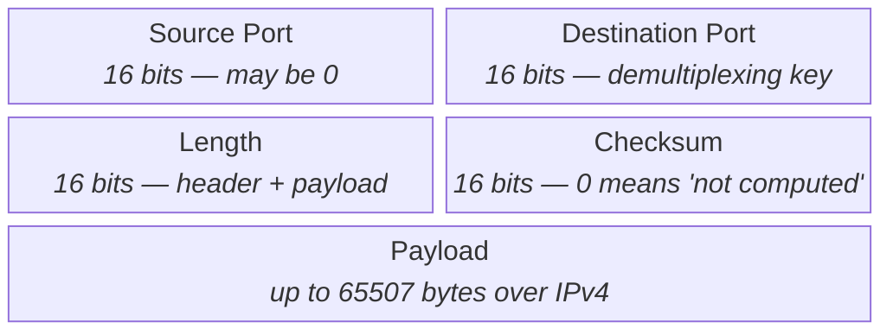
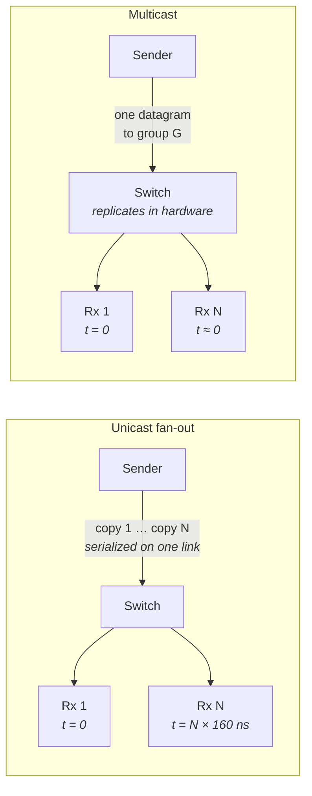
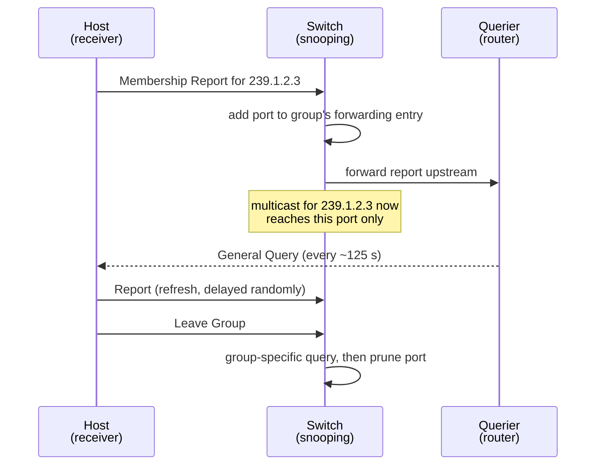
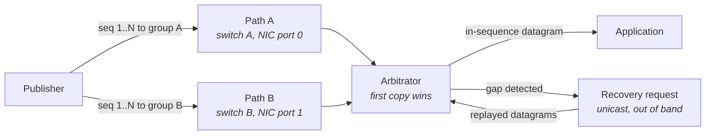
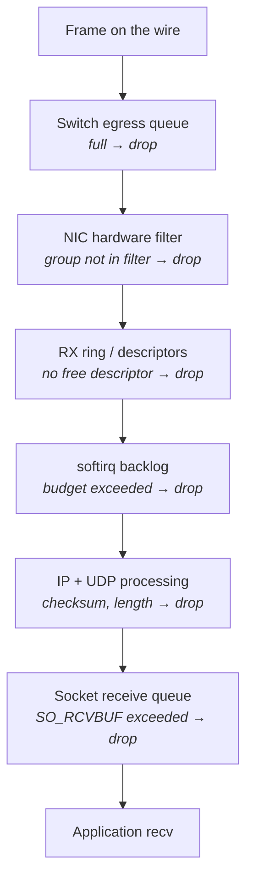
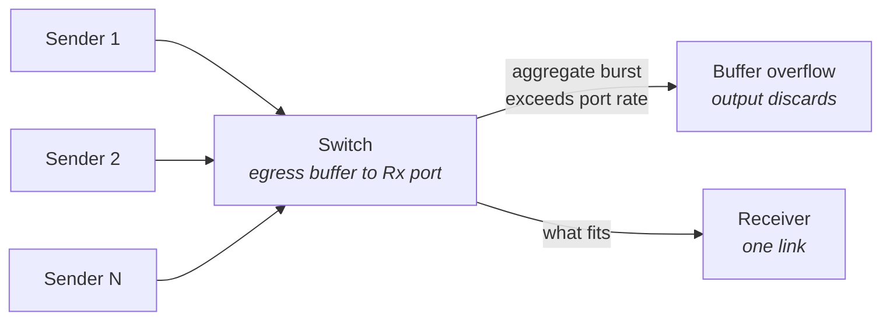

# UDP and Multicast

You know TCP as the protocol that "works": it retransmits what is lost, reorders what arrives out of
sequence, and paces itself so it does not overwhelm the network. UDP is usually introduced as the
protocol that does none of that — a thin wrapper around IP with ports bolted on, suitable for DNS
lookups and video streaming and not much else. That framing is accurate about the mechanism and
completely wrong about the motivation. Latency-critical systems do not choose UDP because they are
willing to tolerate loss. They choose it because **every service TCP provides is implemented by
delaying delivery**, and a system whose value decays in microseconds would rather see a packet
immediately and imperfectly than correctly and late.

That is the first idea this chapter has to install. TCP's in-order delivery guarantee means that when
packet 7 is lost, packets 8, 9, and 10 sit in the receiver's kernel buffer, complete and correct and
undeliverable, until a retransmitted 7 arrives one round-trip later. The application cannot ask for
them. It cannot even know they exist. That is head-of-line blocking (covered in depth in "TCP In
Depth"), and on a colocated link with a 20-microsecond round trip it converts a single lost packet
into a 20-microsecond stall for *everything behind it*. UDP hands you packet 8 the moment it arrives
and lets you decide what to do about the missing 7. The decision is yours, made in user space, with
full knowledge of what the data means — and that is precisely the point.

The second idea is multicast, which solves a different problem: **fan-out without per-receiver cost
at the sender**. If forty machines need the same stream of data, a unicast sender must serialize
forty copies onto the wire, one after another, and the fortieth receiver gets its copy measurably
later than the first. Multicast pushes the replication into the switching fabric, where it happens in
hardware, in parallel, and — crucially — *fairly*. This chapter covers the UDP datagram itself, why
one-to-many distribution is built on it, how group membership is negotiated between hosts and
switches, the sequence-number machinery a receiver needs when nothing underneath it guarantees
anything, and the specific ways this whole arrangement fails: loss, reordering, duplication, buffer
overrun, and traffic storms.

## The UDP Header, Its Semantics, and the Checksum

Strip TCP of connections, sequence numbers, acknowledgments, windows, timers, and congestion state,
and what remains is UDP: eight bytes of header that add exactly two things to raw IP. The first is
**demultiplexing** — port numbers, so that more than one application on a host can receive traffic.
The second is **an optional integrity check** over the payload. Everything else about a UDP datagram
is inherited unchanged from the IP packet carrying it (see "IP and the Network Layer").

The eight bytes are worth knowing by heart, because they are small enough that the per-packet
overhead arithmetic in "The Network Stack from the Bottom Up" depends on them, and because two of
the four fields have non-obvious semantics.



- **The Length field is redundant with IP.** The IP header already carries a total length from which
  the payload size can be derived, so UDP's length duplicates information. Linux validates the two
  against each other and counts a mismatch as an error rather than trusting either blindly.
- **The Source Port is genuinely optional in IPv4** — a sender with no interest in replies may set it
  to zero. A one-way data feed has no reply channel, so this is legal, though most senders fill it in
  because switches and NICs hash on it for load distribution (see "The Linux Networking Stack").
- **The Checksum covers a pseudo-header**, not just the UDP datagram: source and destination IP
  addresses, the protocol number, and the UDP length are folded in alongside the header and payload.
  This is what lets a receiver detect a datagram that was misdelivered to the wrong address.

### What UDP does not do, stated precisely

The absence of TCP's machinery is easy to state as a list of missing features, which teaches nothing.
State it instead as a list of consequences the receiving application must now handle itself, because
that list is the design brief for everything in section four of this chapter.

| Property | TCP | UDP | What the receiver must do |
|---|---|---|---|
| Delivery | Guaranteed or connection fails | Best-effort; silent loss | Detect gaps itself, from application-level sequence numbers |
| Ordering | In-order, always | Arbitrary | Reorder, or tolerate out-of-order, in user space |
| Duplication | Suppressed by the stack | Possible | Deduplicate |
| Message boundaries | None — a byte stream | Preserved exactly | Nothing; this is a *gift*, see below |
| Flow control | Receive window backpressures sender | None | Size buffers for the worst burst |
| Congestion control | Sender slows down | None | Nothing — the network must be provisioned |
| Connection state | Handshake, teardown, timers | None | Nothing |

The row that people underrate is **message boundaries**. TCP is a byte stream: if a sender writes
100 bytes then 200 bytes, the receiver may read 300 bytes in one call, or 43 then 257, and it must
carry framing logic to find message edges — length prefixes, delimiters, a state machine that
survives a partial message spanning two reads. That framing logic is real code on the hot path, and
it is a permanent source of bugs. UDP preserves boundaries exactly: **one `sendto` produces one
datagram, and one `recvfrom` returns exactly one datagram or nothing.** Each read gives you a whole,
self-contained message. For a fixed-format data feed this eliminates an entire layer of parsing
state, and the latency saving is not incidental.

The trade for that gift is that a datagram is atomic in a way a byte stream is not. If your buffer is
smaller than the arriving datagram, the excess is **discarded, not retained for the next read** — and
unless you asked for the `MSG_TRUNC` flag, the read returns the truncated length with no indication
anything was lost. A datagram larger than the path MTU (Maximum Transmission Unit, the largest frame
a link will carry) gets fragmented by IP, and if any one fragment is lost the whole datagram is
dropped after the reassembly timer expires (see "IP and the Network Layer"). This is why practical
UDP feeds keep datagrams comfortably under the MTU — typically at or below 1472 bytes of payload on a
standard 1500-byte-MTU Ethernet path — and never rely on fragmentation.

### The checksum, and why it is sometimes zero

The checksum is a 16-bit one's-complement sum over the pseudo-header, the UDP header, and the
payload. Its purpose is to catch corruption that Ethernet's own frame check sequence cannot: bit
errors introduced *inside* a router or switch, after the frame was validated on ingress and before a
new FCS was computed on egress. Memory corruption in a device's buffers is rare but not
hypothetical, and the UDP checksum is the only end-to-end integrity check the datagram gets.

Two details make it unusual. First, **in IPv4 the checksum is optional**: a sender that does not want
to compute one transmits zero, and the receiver skips validation. Because zero is the "absent" marker,
a computed checksum that happens to come out as zero is transmitted as all-ones (0xFFFF) instead —
the two values are numerically equivalent in one's-complement arithmetic. Second, **in IPv6 the
checksum is mandatory**, because the IPv6 header dropped its own header checksum entirely and there
would otherwise be no integrity protection at all. A received IPv6 UDP datagram with a zero checksum
is discarded.

On any modern NIC neither the sender nor the receiver actually computes this in software. Checksum
offload is a standard hardware feature: the NIC computes it on transmit and validates it on receive,
marking the socket buffer so the stack skips its own verification. This is one of the few offloads
worth leaving *enabled* on a latency-tuned host — unlike the segmentation and coalescing offloads
discussed in "The Linux Networking Stack," checksum offload adds no batching delay and removes real
per-byte work from the CPU.

**Failure mode: datagrams are silently discarded and the application sees gaps with no socket-level
drop counter moving.** The cause may be checksum failure — corruption somewhere in the path, or a
sender producing malformed datagrams. Confirm with `nstat -az | grep -i udp` and look specifically at
`UdpInErrors` and `UdpInCsumErrors`; the latter isolates checksum failures from length mismatches and
truncation, which both also land in `UdpInErrors`. If `UdpInCsumErrors` is climbing, capture with
`tcpdump -i eth0 -v udp` and check whether the printed `bad udp cksum` annotation appears — but note
that on the *sending* host, tcpdump sees the packet before the NIC fills in the offloaded checksum,
so it reports bogus checksums for locally-originated traffic as a matter of course. Only a capture on
the receiver, or on a tap, tells you anything.

**Failure mode: the application receives short messages and misparses them, with no error anywhere.**
The cause is a receive buffer smaller than the arriving datagram; UDP truncates and discards the
remainder silently. Confirm by passing `MSG_TRUNC` to `recvmsg`, which makes the return value report
the *original* datagram length rather than the copied length — if it exceeds your buffer, you have
been losing bytes. This bug survives for years in code that "works" because the feed's messages
happened to be small until one day they were not.

**Try it:** read your UDP counters and learn where they live. `cat /proc/net/snmp | grep -A1 '^Udp:'`
prints the raw kernel counters as two lines — a header line naming the fields and a value line — and
`nstat -az | grep -i udp` prints the same information one metric per line with the totals since boot.
`netstat -su` renders them in prose form. Run all three and match the fields up: `InDatagrams`,
`NoPorts`, `InErrors`, `OutDatagrams`, `RcvbufErrors`, `SndbufErrors`, `InCsumErrors`. Then send a
datagram to a port nothing is listening on and watch `UdpNoPorts` increment by exactly one. These
counters are host-wide, not per-socket, which matters later.

**Try it:** confirm your NIC is doing checksum work rather than the CPU. `ethtool -k eth0 | grep
checksumming` reports `rx-checksumming` and `tx-checksumming` state. Turn RX checksum offload off with
`sudo ethtool -K eth0 rx off`, run a high-rate UDP receive workload, and compare CPU time in softirq
context via `mpstat -P ALL 1` — the `%soft` column will rise measurably. Turn it back on. This is a
useful demonstration that "offload" is not marketing: the per-byte sum over a 1500-byte frame is real
work at a few million packets per second.

## Why One-to-Many Data Distribution Uses Multicast

Consider the concrete problem. A single source produces a stream of small messages — say 200 bytes
each, arriving in bursts — and forty machines in a data centre all need every message, as close to
simultaneously as physics permits. The obvious approach is a TCP connection to each receiver. Work
out what that costs and the reason multicast exists becomes self-evident.

The sender must now serialize forty copies of every message onto its own link. At 10 Gbit/s, a
200-byte frame occupies the wire for roughly 160 nanoseconds plus interframe overhead (see "The
Network Stack from the Bottom Up" for the arithmetic). Forty copies take on the order of 8
microseconds of pure serialization, so the last receiver's copy leaves the NIC 8 microseconds after
the first — and that gap exists *before* any network transit. Worse, the ordering is systematic:
whichever receiver the sender writes to first is consistently first, every single message, forever.
The sender has become an arbiter of who gets data first, and it is making that decision by loop
iteration order. That is unacceptable in any system where the recipients are peers, and no amount of
sender optimization fixes it, because the wire is serial.

The second cost is state. Forty TCP connections mean forty sets of congestion state, forty
retransmission timers, forty send buffers, and forty independent opportunities for a slow receiver to
apply backpressure that the sender must handle — by buffering (which grows unboundedly), by dropping
(which requires per-connection logic), or by blocking (which lets one slow machine stall the other
thirty-nine). Slow-consumer handling is genuinely hard and it is covered in "Sockets Programming
Model"; the relevant observation here is that multicast makes the problem disappear at the sender
rather than solving it.

Multicast moves replication into the network. The sender transmits **one** datagram, addressed not to
a host but to a **group** — an IP address in the multicast range that names a set of interested
receivers rather than a machine. The switch replicates the frame to every port that has a member on
it, in hardware, in parallel. The copies leave the switch at essentially the same instant, so all
forty receivers see the data within nanoseconds of each other rather than microseconds. The sender's
link carries one copy regardless of whether there is one receiver or a thousand, and the sender holds
no per-receiver state at all — it does not know, and does not need to know, who is listening.



- **The unicast branch shows both problems**: total time grows linearly with receiver count, and the
  arrival order is fixed by the sender's iteration order.
- **The multicast branch shows why fairness is a property of the fabric**, not of the application —
  replication happens at the egress ports of a switch that has no reason to prefer one over another.
- **Neither branch shows the recovery path.** Multicast gives up reliability entirely; getting it back
  is section four's problem.

### Multicast addressing

A multicast group is identified by an IPv4 address in `224.0.0.0/4` — the old "class D" range,
`224.0.0.0` through `239.255.255.255`. Several sub-ranges have specific meanings, and confusing them
produces failures that look like network problems but are addressing problems.

| Range | Name | Behavior |
|---|---|---|
| `224.0.0.0/24` | Link-local control | Never forwarded by a router regardless of TTL; used by protocols like IGMP itself and OSPF. Switches typically flood these rather than constraining them |
| `224.0.1.0` – `238.255.255.255` | Globally scoped | Routable; allocation is administratively coordinated |
| `232.0.0.0/8` | Source-Specific Multicast (SSM) | Receivers must name both a group *and* a source address; the network delivers only that source's traffic |
| `239.0.0.0/8` | Administratively scoped | Private to an organization, analogous to RFC 1918 unicast space; the usual choice inside a data centre |

Below IP, a multicast datagram must still be carried in an Ethernet frame, which needs a destination
MAC address. The mapping is fixed and mechanical: the low 23 bits of the IP group address are copied
into a MAC address beginning `01:00:5e`. Since a multicast IP group has 28 significant bits, **32
different IP groups map onto the same Ethernet multicast MAC address.** The hardware filter on the
NIC and the forwarding table in the switch both work at the MAC level, so two groups that collide in
this mapping cannot be separated by hardware — the unwanted traffic arrives at your NIC and the
kernel discards it after examining the IP header.

That software discard is not free. Every colliding packet costs a DMA write, an interrupt or NAPI
poll iteration, a trip through the protocol stack, and a cache line's worth of pollution, all to
reach a `drop` (see "The Linux Networking Stack" for the reception path). At high rates the wasted
work is measurable, and it is invisible in application-level metrics because the packets never reach
a socket.

### Sender-side controls

A multicast sender needs three things configured that a unicast sender does not, and getting any of
them wrong produces a silent failure — packets are transmitted, no error is returned, and nobody
receives anything.

| Socket option | Controls | Why it matters |
|---|---|---|
| `IP_MULTICAST_IF` | Which interface multicast egress uses | Multicast destinations rarely match a specific route, so without this the kernel picks the default route's interface — frequently the management NIC, not the data NIC |
| `IP_MULTICAST_TTL` | The IP TTL on outgoing multicast | Defaults to **1**, meaning the datagram never leaves the local segment. Correct for a switch-local feed; a silent black hole if a router is in the path |
| `IP_MULTICAST_LOOP` | Whether a local copy is delivered to sockets on the same host | Defaults to **enabled** in IPv4, so a sender that also joined the group receives its own traffic |

The TTL default of 1 deserves emphasis because it violates the intuition built by unicast, where TTL
defaults to 64 and is effectively invisible. For multicast, TTL was historically overloaded as a
*scoping* mechanism: a TTL of 1 confines traffic to a link, larger values expand the radius. Modern
practice prefers administratively scoped addressing (`239.0.0.0/8`) over TTL scoping, but the default
remains 1 and it is a routine cause of "my feed works in the lab and not in production."

**Failure mode: a multicast sender transmits successfully but no receiver on another host sees
anything.** The most common cause is egress on the wrong interface: the datagram went out the
management port into a network that does not carry the group. Confirm by capturing on each candidate
interface with `tcpdump -i eth0 -n multicast` and `tcpdump -i eth1 -n multicast` simultaneously — the
`multicast` primitive matches frames with the group bit set in the destination MAC. If the traffic
appears on the wrong interface, the fix is `IP_MULTICAST_IF` (or `SO_BINDTODEVICE`), not a routing
change.

**Failure mode: the sender and a receiver on the same host work perfectly; a receiver on another host
sees nothing.** Cause is almost always `IP_MULTICAST_TTL` left at its default of 1 with a router in
the path, or the packets never reaching the wire at all and only being looped back internally.
Confirm by capturing on a *different* host, or on a tap; a capture on the sending host cannot
distinguish "transmitted" from "looped back." Cross-check the TTL value that `tcpdump -v` prints on
the receiver side.

**Failure mode: a receiver on the sending host gets duplicate messages or unexpectedly sees its own
traffic.** Cause is `IP_MULTICAST_LOOP` being enabled by default. This is genuinely useful for
development on one machine and a source of confusion when the same code runs in production alongside
a real feed. Confirm by disabling the option and observing that the duplicates disappear.

**Try it:** generate and receive multicast without writing a program. In one terminal, join a group
and dump what arrives: `socat -u
'UDP4-RECV:5000,ip-add-membership=239.1.2.3:eth0,reuseaddr' -` (substitute your interface). In
another, send: `printf 'hello\n' | socat -u - 'UDP4-DATAGRAM:239.1.2.3:5000,ip-multicast-if=eth0'`.
Then confirm the join is real by checking `ip maddr show dev eth0` for the group, and watch the frames
with `tcpdump -i eth0 -n -e host 239.1.2.3` — the `-e` prints link-layer headers so you can verify the
destination MAC begins `01:00:5e` and that its low 23 bits match the group address.

**Try it:** demonstrate the 32-to-1 MAC collision. Join `239.1.2.3` on one socket, then send traffic
to `239.129.2.3` — an address differing only in a bit above the low 23, so it maps to the same
Ethernet multicast MAC. The frames will reach your NIC and pass its hardware filter, visible in
`tcpdump -i eth0 -n -e ether dst 01:00:5e:01:02:03`, but no socket will receive them, and
`InDatagrams` in `/proc/net/snmp` will not rise for them. That gap between "arrived at the NIC" and
"delivered to a socket" is exactly the wasted work described above.

## IGMP, Group Membership, and Switch Snooping

A switch's normal forwarding logic is built on learning: it observes the source MAC address of every
frame arriving on a port and records that the address lives behind that port, so future frames for
that destination go out one port only (see "The Network Stack from the Bottom Up"). This mechanism
cannot work for multicast, because **no host ever transmits a frame with a multicast source address.**
There is nothing to learn from. A switch with no additional information has exactly one safe option:
flood every multicast frame out every port, which is what an unmanaged switch does.

Flooding is correct and catastrophic. Correct because every interested receiver gets the data;
catastrophic because every *uninterested* receiver also gets it. A single 1 Gbit/s stream flooded to
a 48-port switch means every server on that switch is burning NIC bandwidth, PCIe bandwidth, and
softirq CPU on packets it will discard. Ten such streams and the machines that need none of them are
saturated.

The fix is a protocol by which hosts announce what they want, and a switch feature that listens in on
those announcements. The protocol is **IGMP** — Internet Group Management Protocol — and it operates
between hosts and their first-hop router. The switch feature is **IGMP snooping**: the switch,
although it is a layer-2 device with no business inspecting IGMP, examines these messages as they
pass through and builds a table of which ports have members of which groups. It then forwards each
multicast group only to the ports in that group's entry, plus the port toward the querier.

### How membership is established and maintained

IGMP has three message types that matter and a maintenance cycle built on timers. A host that wants
traffic sends a **Membership Report** naming the group. A router (or a switch acting as **querier**)
periodically sends a **Membership Query** to which every host with an active interest must reply. A
host that no longer wants traffic sends a **Leave Group** message, which prompts the querier to send a
group-specific query to check whether anyone else still wants it.



- **The report is what installs the forwarding entry** — until the switch sees it, traffic for the
  group either floods or does not arrive at all, depending on the switch's unregistered-multicast
  policy.
- **The periodic query is the keepalive.** If it stops, membership state expires on a timer and
  forwarding to that port ceases; this is the single most damaging IGMP failure and it is covered
  below.
- **The randomized report delay** exists so that a query to a group with hundreds of members does not
  produce hundreds of simultaneous replies — one host's report suppresses the others.

Two protocol versions are in common use and the difference is operationally significant. **IGMPv2**
lets a host join a group, full stop; it receives traffic from any source sending to that group.
**IGMPv3** adds source filtering: a host can join `(group G, source S)` and the network delivers only
S's traffic, which is what Source-Specific Multicast in `232.0.0.0/8` requires. Version mismatch is a
classic failure — if any device on a segment speaks only v2, the querier may fall back, and v3
source-specific joins silently degrade to any-source behavior or fail outright.

On the host side the join is a socket option, and Linux exposes both generations:

| Option | Version | Semantics |
|---|---|---|
| `IP_ADD_MEMBERSHIP` | IGMPv2-style | Join group G on a named interface, accepting all sources |
| `IP_DROP_MEMBERSHIP` | — | Leave group G |
| `IP_ADD_SOURCE_MEMBERSHIP` | IGMPv3 | Join (G, S) — deliver only source S |
| `MCAST_JOIN_GROUP` | Protocol-independent | Same as `IP_ADD_MEMBERSHIP` but works for IPv4 and IPv6 |
| `MCAST_JOIN_SOURCE_GROUP` | Protocol-independent | Same as `IP_ADD_SOURCE_MEMBERSHIP`, address-family agnostic |

Every one of these takes an **interface** — as an index, or as a local address to match. Omitting it,
or passing zero and letting the kernel choose, makes the kernel consult the routing table for the
group address, which typically resolves via the default route to the wrong interface. On a machine
with a management NIC and a data NIC this is the most common multicast bug there is, and it produces
a join that succeeds, reports no error, and receives nothing.

There is a Linux-specific option that surprises people the first time they meet it:
**`IP_MULTICAST_ALL`**, which defaults to enabled. When a socket is bound to the wildcard address, the
default behavior is that it receives traffic for **every group joined anywhere on the host**, not just
the groups joined on that socket. A process that carefully joined group A on socket 1 and group B on
socket 2 will find both sockets receiving both groups. The fixes are to bind each socket to the
specific group address rather than the wildcard, or to set `IP_MULTICAST_ALL` to zero. This matters
enormously for the A/B pattern in the next section, where two sockets are supposed to carry two
distinct copies of a stream and instead each carry both.

### Where membership state lives, and how to read it

Membership is tracked at three levels, and diagnosing a "not receiving" problem means checking all
three in order — socket, host, switch.

| Level | What to read | What it tells you |
|---|---|---|
| Kernel IGMP state | `/proc/net/igmp` | Which groups the host has joined per interface, the IGMP version in use, and the refresh timer |
| Link-layer filter | `ip maddr show dev eth0`, `/proc/net/dev_mcast` | Which multicast MAC addresses the NIC's filter accepts |
| Socket | `ss -uanm`, `/proc/net/udp` | Which sockets exist, their bind addresses, and their queue depths |
| Switch | Vendor CLI (`show ip igmp snooping groups` or equivalent) | Whether the switch installed a forwarding entry for your port |

`/proc/net/igmp` needs a decoding note: **group addresses are printed in hexadecimal in host byte
order**, so on a little-endian x86 machine `224.0.0.1` appears as `010000E0` — the bytes reversed. The
`Querier` column shows the negotiated IGMP version (`V2` or `V3`), which is how you confirm a version
mismatch without touching the switch.

Two sysctls bound what the host will do. `net.ipv4.igmp_max_memberships` caps the number of groups a
single socket may join — the default is 20, which is small enough that any application subscribing to
a large number of groups on one socket hits it and gets `ENOBUFS` from `setsockopt`. And
`net.ipv4.conf.<iface>.force_igmp_version` pins the version rather than negotiating, which is
occasionally the only way to work around a switch that mishandles v3.

**Failure mode: multicast delivery works for about four minutes after startup, then stops
permanently.** This is the signature failure of a missing querier. Nothing is generating periodic
General Queries, so the switch's snooping table entries expire — the group membership interval under
default IGMPv2 timers is roughly 260 seconds (two query intervals of 125 seconds plus the response
window) — and the switch stops forwarding the group to your port. Confirm by capturing IGMP with
`tcpdump -i eth0 -n igmp` and observing that Membership Reports leave the host but no Queries ever
arrive. The fix is on the network: enable an IGMP snooping querier on the switch, or ensure a router
is present on the VLAN.

**Failure mode: a join succeeds, `setsockopt` returns zero, and no data ever arrives.** Cause is the
join being made on the wrong interface — the kernel resolved the group through the default route.
Confirm by reading `/proc/net/igmp` and checking which interface the group is listed under; if it is
the management interface, that is the bug. Cross-check with `ip maddr show dev <data-nic>` to see
whether the corresponding `01:00:5e` MAC filter was installed there.

**Failure mode: every server on a VLAN shows high `softirq` CPU and elevated packet counts for
traffic none of them want.** Cause is IGMP snooping disabled or ineffective, so the switch is flooding
all multicast to all ports. Confirm on a machine that has joined *no* groups: run `tcpdump -i eth0 -n
multicast` and see whether feed traffic appears anyway. If it does, the switch is flooding. Note that
`224.0.0.0/24` link-local control traffic is flooded by design and does not indicate a problem.

**Failure mode: an application that subscribes to many groups fails at startup with `ENOBUFS`.**
Cause is `net.ipv4.igmp_max_memberships`, default 20, being exceeded on a single socket. Confirm with
`sysctl net.ipv4.igmp_max_memberships` and raise it, or restructure to spread joins across sockets.

**Try it:** watch a join happen end to end. Start `tcpdump -i eth0 -n igmp` in one terminal. In
another, join a group with `socat -u 'UDP4-RECV:5000,ip-add-membership=239.1.2.3:eth0,reuseaddr' -`.
You should see a Membership Report leave immediately. While it runs, check `cat /proc/net/igmp` for
the group under the right interface (remember the byte-reversed hex), and `ip maddr show dev eth0`
for the `01:00:5e:01:02:03` MAC filter. Kill the receiver and watch the Leave Group message and the
entries disappear.

**Try it:** measure join latency, which is a real operational number. Timestamp the moment your
process calls `setsockopt(IP_ADD_MEMBERSHIP)` and the moment the first datagram of an
already-flowing group arrives. On a switch with snooping enabled the gap is typically well under a
millisecond on modern hardware, but it is not zero, and it is not bounded by anything you control —
which is why production systems join groups during startup rather than on demand.

## Sequence Numbers, Redundant Paths, and Gap Detection

Having given up TCP's guarantees, the receiver has to rebuild the subset it actually needs — and the
subset is smaller than TCP provides, which is the entire justification for the exercise. The pattern
that emerged for one-to-many streams over lossy multicast has three components: **sequence numbering**
for detection, **redundant transmission over diverse paths** for avoidance, and **an out-of-band
recovery channel** for the residue. Each solves a different fraction of the problem and each costs
something different.

Start with detection. Every datagram carries a monotonically increasing sequence number assigned by
the publisher. The receiver tracks the highest contiguous sequence it has processed. When a datagram
arrives with the expected next number, it is delivered immediately — no buffering, no delay, which is
the whole point. When it arrives with a *higher* number, one or more datagrams are missing. When it
arrives with a *lower* number, it is either a duplicate or a reordered straggler. This is three lines
of logic and it gives the receiver complete knowledge of what it has and has not seen, with no
round-trip to anyone.

Notice what this does *not* do: it does not delay anything. A TCP receiver that detects a gap must
hold subsequent data. A sequence-checking UDP receiver delivers subsequent data immediately and
records the gap separately. The application decides whether a gap is tolerable, whether to request
recovery, or whether to stop and rebuild state — and it makes that decision knowing what the data
means, which the kernel never can. **The gap becomes a policy question rather than a stall.**

### Redundant paths

Detection alone does not prevent loss. The avoidance mechanism is to transmit the same stream twice,
over two paths that share as little infrastructure as possible — conventionally called the A and B
feeds. Each carries identical payloads with identical sequence numbers; they differ only in the
multicast group they use and in the physical route they take. The receiver joins both and takes
whichever copy of each sequence number arrives first.

The engineering claim being made is a statistical one about **independence**. Two copies help only to
the extent that the events causing loss on path A are uncorrelated with those causing loss on path B.
If both feeds traverse the same switch, the same uplink, or the same NIC, then a buffer overrun drops
both copies simultaneously and the redundancy has bought nothing but doubled bandwidth. Genuine
diversity means separate switches, separate cabling, separate NIC ports, and ideally separate
interrupt vectors and CPU cores on the receiving host (see "Buses, Devices, and I/O Hardware" for why
sharing a PCIe path also correlates failures).



- **The arbitrator is the only new component**, and it is small: a highest-contiguous-sequence
  counter, a bounded buffer for out-of-order arrivals, and a duplicate test.
- **First-copy-wins is what reduces latency, not just loss** — path A and path B rarely have
  identical delay, so taking whichever arrives first gives you the minimum of two random variables on
  every single message.
- **The recovery request is unicast and off the hot path**, because it is by definition already too
  late to be fast.

The latency benefit is worth dwelling on, because it is the part engineers miss. Even with zero loss,
two paths are better than one: the jitter on any single path is dominated by queueing delay in
switches (see "The Network Stack from the Bottom Up"), and queueing on two independent paths is
uncorrelated. Taking the earlier of two arrivals systematically shaves the tail. The arbitrator is not
purely a reliability device; it is a jitter-reduction device that happens to also provide redundancy.

### The arbitrator's real decision: how long to wait

The hard design question is what to do the instant a gap is detected. There are two defensible
policies and they sit at opposite ends of a latency-versus-completeness trade.

| Policy | Behavior on gap | Latency cost | When it is right |
|---|---|---|---|
| **Forward immediately, flag the gap** | Deliver the out-of-sequence datagram now; report the hole to the application | Zero added latency | The application can act on partial information and reconcile later |
| **Buffer until the gap fills or a timer expires** | Hold subsequent datagrams for a bounded window | The full timeout, on every gap | The application requires strict ordering to remain correct |

The buffering policy is TCP's head-of-line blocking, reimplemented in user space — with the crucial
difference that *you* choose the timeout, and you choose it in microseconds rather than inheriting a
retransmission timeout measured in milliseconds. A window of a few tens of microseconds absorbs
reordering caused by two paths with slightly different delays while costing almost nothing; a window
of milliseconds recreates exactly the problem UDP was chosen to avoid. Sizing this window is a
measurement exercise, not a guess: capture the actual inter-path delay difference and the actual
reordering distribution on your network, and set the window past their tail.

The buffer itself must be **bounded and preallocated**. An unbounded reorder buffer that grows during
an outage is a memory-allocation event on the hot path — page faults, allocator work, and possibly
huge-page compaction stalls (see "Memory Systems"). The standard structure is a fixed-size circular
array indexed by sequence number modulo its length, which makes insertion and lookup a single indexed
write with no allocation and no search. If a gap exceeds the array's span, that is itself the signal
to abandon incremental recovery and resynchronize from scratch.

### Recovery channels

For the loss that survives both paths, the pattern adds a request-response channel: the receiver
sends a unicast request naming the missing sequence range, and a retransmission service replies with
the missing datagrams. This is the only part of the design that resembles TCP, and it is deliberately
placed off the hot path, usually on a separate socket and often on a separate thread, because a
request that has already lost a round trip cannot be made fast and should not be allowed to interfere
with data that still can.

Two hazards attend it. The first is the **request storm**: an event that causes loss usually causes it
for everyone simultaneously, so a hundred receivers detect the same gap in the same microsecond and
all issue requests at once. The recovery service is now the target of an incast burst (section seven)
at the exact moment the network is already congested. Real implementations mitigate this with
randomized delay before requesting, by suppressing a request if the gap fills on its own during that
delay, and by rate-limiting requests per receiver.

The second is the **resynchronization path**. Incremental recovery works only for small gaps. A
receiver that has been disconnected long enough, or whose gap exceeds its reorder buffer, needs to
rebuild its state wholesale — which is a bulk transfer, usually TCP, and completely different in
character from the streaming path. Designing for that transition explicitly is what separates a system
that degrades from one that fails: the interesting engineering question is how a receiver reattaches
to the live stream at a well-defined point after a bulk load, which requires buffering live data
during the load and discarding the overlap by sequence number.

**Failure mode: A and B feeds show identical loss at identical instants.** The redundancy is fake —
the paths share a component. Confirm by checking whether both groups arrive on the same interface
(`tcpdump -i eth0 -n 'ip multicast'` will show both), whether both NIC ports sit behind the same PCIe
switch (`lspci -tv`), and whether the two RX queues share a CPU via `/proc/interrupts`. Independent
paths that share an interrupt-handling core are not independent under load.

**Failure mode: p99 latency is far worse than p50 with no corresponding loss.** Cause is an
arbitrator that buffers on gaps with too generous a timeout — every transient reorder costs the full
window. Confirm by instrumenting the arbitrator to record, per message, whether it was delivered
immediately or held, and for how long; the held population will be exactly the tail.

**Failure mode: a burst of loss is followed by a second, larger burst.** Cause is a recovery request
storm — every receiver requested simultaneously, and the resulting incast on the recovery service
caused further drops. Confirm by correlating the timestamps of recovery requests across receivers and
by watching the recovery service's `UdpRcvbufErrors` and its switch port's output-drop counter during
the incident.

**Try it:** build the arbitrator's core and measure what it buys. Take any two multicast groups
carrying identical sequenced data (you can generate them with two `socat` senders reading the same
file), receive both, and record for each sequence number which feed arrived first and by what margin.
Two results should emerge: neither feed wins consistently, and the distribution of the margin is your
inter-path jitter. That distribution is what determines the reorder window.

**Try it:** verify the `IP_MULTICAST_ALL` trap concretely, because it silently destroys the A/B
design. Open two sockets, bind both to `0.0.0.0:5000`, join group A on one and group B on the other,
and send to group A only. Both sockets will receive the traffic. Now bind each socket to its specific
group address instead of the wildcard and repeat — the separation appears. Any arbitrator built on
wildcard-bound sockets is deduplicating against itself.

## Loss, Reordering, and Duplication

These three pathologies are usually taught as "things the network does," which is misleading in a way
that costs debugging time. Each has a small number of specific causes at specific points on the path,
and each cause has a counter that identifies it. The skill is localization: given a gap in a sequence
number stream, determining *which* of six or seven places destroyed the packet, because the fix for
each is completely different.

Walk the path from the sender's wire to the application and enumerate where a datagram can die. Note
how many of these are inside the receiving host — in practice, on a well-provisioned data-centre
network, **most multicast loss is host-side, not network-side**, and engineers who assume the network
is at fault spend days looking in the wrong place.



- **Each stage has its own counter**, and reading them in path order localizes the loss in about
  three commands.
- **The switch egress queue is the only network-side stage in the diagram** — everything below it is
  on your host and therefore within your control.
- **The socket receive queue is the most common culprit** for a correctly configured feed, because it
  is the one stage whose service rate depends on your application's scheduling (see "The Linux
  Networking Stack").

| Stage | Counter to read | Command |
|---|---|---|
| Switch egress | Output drops / discards on the port | Vendor CLI |
| NIC ring / no descriptor | `rx_missed_errors`, `rx_no_buffer_count`, `rx_fifo_errors` (names vary by vendor) | `ethtool -S eth0 \| grep -Ei 'drop\|miss\|err\|no_buf'` |
| Device aggregate | `RX dropped`, `overrun` | `ip -s -s link show eth0` |
| softirq backlog | Column 2 of each CPU's row | `awk '{print $1, $2, $3}' /proc/net/softnet_stat` |
| Protocol errors | `UdpInErrors`, `UdpInCsumErrors` | `nstat -az \| grep -i udp` |
| Socket buffer | `UdpRcvbufErrors` globally; `drops` column per socket | `nstat -az UdpRcvbufErrors`; `/proc/net/udp` |

### Reordering

Reordering has a narrower set of causes than loss and one dominant one: **multi-path forwarding**. A
network with equal-cost multi-path routing or link aggregation distributes traffic across parallel
links by hashing header fields, and two packets that hash differently take different links with
different queue occupancies, so the second can overtake the first. Correctly configured hashing keeps
a single flow — one source address, destination address, and port pair — on one link, so a single
multicast group should not reorder from this cause. It happens anyway when the hash omits ports, when
a link fails and traffic redistributes mid-stream, or when the two copies in an A/B pair are
mistakenly treated as one flow.

The second cause is **receive-side steering on the host**. If two packets of the same group land on
different RX queues and therefore different CPUs, the order in which the two CPUs deliver them to the
socket is not guaranteed. Correct RSS configuration hashes the whole flow to one queue and prevents
this; misconfiguration — such as a hash that excludes UDP ports — spreads a single group across
queues (see "The Linux Networking Stack" for `ethtool -n`/`-N` and hash-field configuration).

The third cause is **the arbitrator itself**, by design. Merging two feeds with different delays
produces a merged stream that is out of order with respect to either input. This is not a fault; it
is why the reorder window exists.

### Duplication

Duplicates arrive from four sources, and they are easy to distinguish once you know the list.
**Redundant feeds** produce one duplicate per message by construction, which the arbitrator removes.
**Multicast loopback** delivers a sender's own traffic back to sockets on the same host when
`IP_MULTICAST_LOOP` is enabled. **Multiple joins of the same group on one host** — for instance two
sockets both bound to the wildcard, or the `IP_MULTICAST_ALL` behavior described earlier — cause the
kernel to deliver a copy to each matching socket. And **network-level duplication**, from a
misconfigured aggregation group or a forwarding loop, delivers the same frame twice from the wire.

The last one is worth separating from the others because it indicates a real network fault rather
than a local configuration choice, and it is diagnosable: a packet capture will show two frames with
identical IP identification fields and identical payloads, whereas the local causes produce a single
frame on the wire delivered twice by software.

**Failure mode: sequence gaps appear only under high message rates, and `ethtool -S` shows
`rx_missed_errors` rising.** The NIC had no free descriptor when a packet arrived — the ring was full
because the softirq was not draining it fast enough. Confirm the correlation, then attack it with a
larger ring (`ethtool -g eth0` to read, `ethtool -G eth0 rx <n>` to set), lower interrupt coalescing,
or a dedicated core for the interrupt (see "The Linux Networking Stack").

**Failure mode: gaps appear, but every NIC and switch counter is clean.** The packets reached the
host and died at the socket. Confirm with `nstat -az UdpRcvbufErrors` sampled before and after, and
identify the specific socket via the `drops` column of `/proc/net/udp`. This is a receiver-speed
problem, not a network problem, and it is the subject of the next section.

**Failure mode: the arbitrator reports large numbers of duplicates from a single feed.** Cause is
almost certainly local — loopback, a second socket joined to the same group, or `IP_MULTICAST_ALL`.
Confirm by capturing on the wire with `tcpdump -i eth0 -n host 239.1.2.3 -c 100` and counting frames;
if the wire shows one copy per sequence number and the application sees two, the duplication is
inside your host.

**Try it:** localize a drop deliberately. Write or script a UDP receiver that sleeps between reads,
point a high-rate multicast sender at it, and read the counters in path order: `ethtool -S eth0 |
grep -Ei 'drop|miss'`, then `awk '{print $2}' /proc/net/softnet_stat`, then `nstat -az | grep -i udp`.
Only the last should move. Now instead of sleeping, saturate the receiving CPU with a busy loop pinned
to the same core as the NIC's interrupt, and repeat — now the NIC-level counters move too. Two
different failures, distinguished purely by which counter changed.

**Try it:** observe reordering directly. Send a sequenced stream and record arrival order at the
receiver. On a single-path switched network you will see none. Then deliberately create the condition
by steering the same group across two RX queues if your NIC supports explicit flow rules
(`ethtool -N`), and observe out-of-order arrivals appear. This is the clearest demonstration that
reordering is usually a configuration property, not a fact of nature.

## Receive Buffer Sizing and Burst Absorption

The socket receive buffer is a queue between two processes with wildly different timing
characteristics: the kernel's softirq context, which appends packets whenever they arrive, and your
application thread, which drains them whenever it gets scheduled. Its purpose is to absorb the
difference. Traffic that arrives faster than the application drains — or arrives while the application
is not running at all — is held in the buffer until it can be consumed. When the buffer is full, the
kernel drops the datagram, increments a counter, and tells nobody. The mechanics of that drop and its
`truesize` accounting are covered in "The Linux Networking Stack"; what matters here is how to size
the buffer for a multicast feed specifically.

The sizing question has an exact form. Two quantities determine it: **how long the application can
fail to drain**, and **how fast data can arrive during that interval**. The product is the required
depth. Both quantities are tail statistics, not averages, and using averages for either produces a
buffer that works in testing and drops in production.

The first quantity is the application's worst-case stall, and it is a scheduling question, not a
networking one. A thread that is not pinned can be preempted for a full scheduler timeslice. A pinned
thread on a non-isolated core still yields to interrupts, softirqs, and kernel threads. Even a pinned
thread on an isolated core can stall on a page fault, a THP compaction event, or a TLB shootdown IPI
triggered by an unrelated process (see "Memory Systems" and "Processes, Threads, and Scheduling").
The stall you must size for is the p99.9 of that distribution, and on an untuned machine it is
comfortably into the milliseconds.

The second quantity is the peak arrival rate, and the trap is that feeds are not smooth. The
meaningful figure is the **microburst** rate — the instantaneous rate over a window of tens or
hundreds of microseconds — which can exceed the one-second average by an order of magnitude or more.
A feed averaging 50,000 packets per second may deliver 500 packets in a 200-microsecond burst,
because the events driving the data are themselves bursty and the network preserves that burstiness.
Sizing against the one-second average is the single most common buffer-sizing error.

### Doing the arithmetic

Multiply the two, then multiply again by per-packet memory cost — and that last factor is where the
calculation usually goes wrong. `SO_RCVBUF` limits `skb->truesize`, the *total memory charged* for
each packet including the socket buffer metadata and the entire driver-allocated data buffer, not the
payload length. A 200-byte datagram sitting in a 2 KiB driver buffer is charged something close to 2
KiB plus metadata. A buffer nominally sized for ten thousand 200-byte messages therefore holds a
small fraction of that.

Worked example, for a modern x86 server with a 25 GbE NIC — these are illustrative figures, not
constants:

| Quantity | Value | Source |
|---|---|---|
| Application worst-case stall (p99.9) | 1 ms | Measured, not assumed |
| Microburst arrival rate | 500,000 packets/s | Measured over a 100 µs window |
| Packets to absorb | 500 | Stall × rate |
| Charged memory per packet | ~2–4 KiB | `truesize`, driver-dependent |
| Required `SO_RCVBUF` | ~1–2 MiB | Product |

Compare that to defaults. `net.core.rmem_default` is commonly 212,992 bytes on stock Linux, and
`net.core.rmem_max` is often the same or slightly larger. The required buffer exceeds both, which is
why the sequence matters:

```bash
# Read the current ceilings first.
sysctl net.core.rmem_max net.core.rmem_default

# Raise the ceiling BEFORE any application calls setsockopt(SO_RCVBUF).
sudo sysctl -w net.core.rmem_max=16777216

# Optional: raise the default so sockets that never set it get more.
sudo sysctl -w net.core.rmem_default=1048576
```

Three behaviors of `SO_RCVBUF` catch people out, and all three are silent:

- **The value is doubled.** The kernel stores twice what you request, on the theory that roughly half
  is accounting overhead. `getsockopt` returns the doubled figure, so a request for 4 MiB reads back
  as 8 MiB and nothing is wrong.
- **The value is clamped to `net.core.rmem_max`.** If the ceiling is lower than your request, the
  `setsockopt` call *succeeds* and you get the ceiling. There is no error. Reading the value back is
  the only way to know.
- **`SO_RCVBUFFORCE` bypasses the clamp** but requires `CAP_NET_ADMIN`. It exists precisely because
  the silent clamp is such a common trap, but it is not a substitute for setting the sysctl.

A second structural decision is **how many sockets carry how many groups**. A single socket can join
many groups, in which case all their traffic shares one receive buffer and one drain thread — simple,
but one bursty group can fill the buffer and cause drops on all the others, and the
`igmp_max_memberships` limit of 20 applies. Separate sockets per group give independent buffers and
isolate bursts from each other, at the cost of more file descriptors and a more complex event loop.
For latency work, the isolation usually wins: a shared buffer couples unrelated streams' failure
modes together for no benefit.

**Failure mode: loss appears only in bursts, with the application's average CPU utilization low.**
The buffer was sized against the average rate rather than the microburst rate. Confirm by sampling
`ss -uam` repeatedly during operation and watching the `Recv-Q` column — with `-m` it also prints the
per-socket memory breakdown including `rb` (the receive buffer size) and `r` (currently allocated).
If `Recv-Q` spikes toward the buffer size during bursts, the buffer is the constraint. A capture with
hardware timestamps (see "The Linux Networking Stack") gives the true instantaneous rate.

**Failure mode: `SO_RCVBUF` was set to a large value, the call succeeded, and drops continue at the
old threshold.** The value was clamped to `net.core.rmem_max`. Confirm by calling `getsockopt` and
comparing to twice what you requested; or read the `rb:` field in `ss -uam` output for the socket,
which shows the effective size. Raise `net.core.rmem_max` and restart the application — a running
socket does not pick up the new ceiling.

**Failure mode: a very large receive buffer eliminates drops but latency gets worse.** A deep buffer
does not make the receiver faster; it converts loss into delay. If the application is persistently
slower than the feed, a large buffer means it processes data that is increasingly stale, with the
staleness growing without bound until the buffer finally fills. Confirm by timestamping messages at
the NIC (hardware timestamps) and at the application, and plotting the difference over time — a
rising trend means you have a throughput deficit that buffering cannot fix. The buffer is for
absorbing *transient* bursts; a persistent deficit needs a faster consumer.

**Try it:** find your own drop threshold empirically. Write a receiver that sleeps a controlled number
of milliseconds between `recv` calls, join a group carrying a known rate, and sweep the sleep interval
while watching `nstat -az UdpRcvbufErrors`. The sleep at which drops begin, multiplied by the packet
rate, tells you how many packets your buffer actually held — and dividing your `SO_RCVBUF` by that
count gives your real per-packet `truesize`, which is almost always several times the payload size.
That number is the one to use in the sizing arithmetic above.

**Try it:** inspect a live socket's buffer state. `ss -uam` shows every UDP socket with its `Recv-Q`
and, from `-m`, a memory line of the form `skmem:(r<N>,rb<N>,...)` where `r` is currently queued bytes
and `rb` is the buffer limit. Run it in a loop with `watch -n 0.2 'ss -uam'` during a burst and watch
`r` climb toward `rb`. Seeing the queue fill in real time is more convincing than any counter.

## Multicast Storms and Incast

Two congestion pathologies specific to this architecture deserve separate treatment, because both
produce loss that is invisible in the counters engineers usually check and both are fixed in the
network rather than the host.

A **multicast storm** is the flooding failure described earlier, at scale. When snooping fails — it is
disabled, the querier disappears, a switch in the path does not support it, or the group is in a range
the switch floods by policy — every multicast frame goes out every port. The consequences compound.
Each server's NIC now receives every group on the VLAN, spends DMA bandwidth and PCIe transactions
delivering them to memory, spends softirq cycles pushing them through the stack, and discards them
after the IP header check. Machines with no interest whatsoever in multicast are affected. And the
switch's own uplinks now carry the aggregate of all groups, which can saturate them and cause drops
for the traffic that *is* wanted.

The pathological version involves a forwarding loop — a redundant path without a spanning-tree
protocol correctly suppressing it — where flooded frames circulate and multiply until the segment is
unusable. This is the classic broadcast storm and multicast is subject to it identically.

**Incast** is a different shape of failure and a subtler one. It occurs when many senders transmit to
one receiver simultaneously and their combined instantaneous rate exceeds the receiver's link
capacity. The switch buffers what it can and drops the rest. What makes incast distinctive is that
**the aggregate average rate can be far below the link rate and the drops still happen**, because the
overload lasts only microseconds — a burst far shorter than any monitoring interval. Utilization
graphs averaged over a second show a link at 20% and give no hint that its egress buffer overflowed
forty times.



- **The buffer is the only thing standing between the burst and loss**, and switch buffers are small
  — often a few hundred kilobytes to a few megabytes shared across many ports on a low-latency
  cut-through switch (see "Buses, Devices, and I/O Hardware").
- **The recovery-request pattern from section four is an incast generator**: many receivers, one
  recovery service, all bursting at once.
- **Nothing on the host can prevent this** — the packets are destroyed before the receiver's NIC ever
  sees them, so every host-side counter stays clean.

That last point is why incast is hard: the only counter that moves is the **output discard counter on
the switch egress port**, which lives on equipment you may not administer. A host-side investigation
finds nothing wrong, because nothing is wrong on the host.

The mitigations are structural, and they trade against each other:

| Mitigation | Mechanism | Cost |
|---|---|---|
| **IGMP snooping with a reliable querier** | Constrains flooding to interested ports | None; this is table stakes |
| **Switch storm control** | Rate-limits multicast per port, dropping the excess | Drops *your* traffic during a legitimate burst if the threshold is low |
| **Deeper switch buffers** | Absorbs longer bursts | Buffering adds delay; deep-buffer switches are usually store-and-forward and higher-latency |
| **Faster receiver link** | Raises the rate at which the burst drains | Cost, and it moves the bottleneck rather than removing it |
| **Spreading receivers across ports** | Reduces per-port aggregate | Only helps if the burst was destined for multiple receivers |
| **Randomized delay on recovery requests** | Desynchronizes the self-inflicted incast | Adds latency to recovery, which is already off the hot path |

The trade in row three is the important one and it is a genuine architectural tension rather than a
tuning knob. A cut-through switch forwards a frame as soon as it has read the destination address,
achieving port-to-port latency in the low hundreds of nanoseconds, and it necessarily has shallow
buffers. A deep-buffer switch absorbs microbursts but adds store-and-forward delay to every frame.
Choosing between them is choosing between low latency in the common case and loss avoidance in the
tail — and the right answer depends on which the workload can least tolerate.

**Failure mode: a host that has joined no multicast groups still shows significant received-packet
counts and elevated softirq CPU.** Cause is multicast flooding due to failed or absent snooping.
Confirm with `tcpdump -i eth0 -n multicast` on that idle host — if feed traffic appears, the switch is
flooding. Distinguish genuine flooding from normal link-local control traffic by checking whether the
destination addresses fall in `224.0.0.0/24`.

**Failure mode: loss occurs in short bursts, host counters are entirely clean, and link utilization
graphs look healthy.** This is incast. Confirm by obtaining the output-discard counter for your
switch port and correlating its increments with the loss timestamps; on the host side, the absence of
any moving counter is itself diagnostic. Sub-second-resolution monitoring, or a capture on a tap with
hardware timestamps, is required to see the burst at all.

**Failure mode: a feed works normally but loses packets every time a recovery event occurs
system-wide.** Cause is the self-inflicted incast of synchronized recovery requests. Confirm by
capturing recovery-channel traffic and observing that requests from many receivers cluster within a
few hundred microseconds. Randomized backoff before requesting is the fix.

**Try it:** create incast on a bench. Point several senders at one receiver, each generating traffic
at a rate that is individually well below the receiver's link rate but collectively above it in short
bursts — a burst generator that sends N packets back-to-back then idles. Watch that host-side counters
stay clean while the application observes gaps. If you have access to the switch, read the port's
output discard counter before and after; that is the only place the evidence exists.

**Try it:** measure the flooding cost. On a machine that has joined no groups, record
`ip -s link show eth0` and `mpstat -P ALL 1` output while a substantial multicast feed runs on the
VLAN. Then have the switch admin enable or disable IGMP snooping and repeat. The difference in
received-packet rate and `%soft` CPU is the tax the machine was paying for a switch feature it never
knew about.

## Numbers to Know

| Quantity | Value | Notes |
|---|---|---|
| UDP header size | 8 bytes | Source port, destination port, length, checksum |
| Maximum UDP payload | 65,507 bytes over IPv4 | 65,535 minus 20-byte IP header minus 8-byte UDP header |
| Practical maximum payload | ≤1472 bytes | Fits a 1500-byte MTU without fragmentation |
| Multicast address range | `224.0.0.0/4` | `239.0.0.0/8` is the admin-scoped private range |
| IP-to-Ethernet multicast mapping | Low 23 bits into `01:00:5e:xx:xx:xx` | 32 IP groups share one MAC address |
| `IP_MULTICAST_TTL` default | 1 | Confines traffic to the local segment |
| `IP_MULTICAST_LOOP` default | Enabled (IPv4) | Local sockets receive the host's own transmissions |
| IGMPv2 query interval | ~125 s | Default; configured on the querier |
| IGMPv2 group membership interval | ~260 s | Time to expiry with no query — the "works for four minutes" failure |
| `net.ipv4.igmp_max_memberships` | 20 by default | Per-socket group join limit |
| `net.core.rmem_default` | ~212,992 bytes commonly | Stock Linux; distribution-dependent |
| `SO_RCVBUF` accounting | Request is doubled, then clamped to `rmem_max` | Silent clamp; read back with `getsockopt` |
| Charged memory per small datagram | ~2–4 KiB `truesize` | Driver-dependent; far larger than the payload |
| Unicast fan-out serialization | ~160 ns per 200-byte frame at 10 GbE | Multiplied by receiver count; the reason multicast exists |
| Cut-through switch port-to-port latency | Low hundreds of ns | Shallow buffers, poor microburst tolerance |
| Store-and-forward deep-buffer switch | Microseconds | Better burst absorption, worse baseline latency |
| Multicast join latency | Sub-millisecond typically | Not bounded or guaranteed; join at startup, not on demand |

*Order-of-magnitude figures for modern x86 servers with 10–25 GbE NICs on a data-centre switched
network. Protocol defaults are from stock Linux and standard IGMP timers; sysctl defaults vary by
distribution and kernel version — read them from your own machine.*

## Key Takeaways

- UDP is chosen not for tolerating loss but for avoiding delay: every TCP guarantee is implemented by
  holding data back, and head-of-line blocking converts one lost packet into a round-trip stall for
  everything behind it.
- UDP preserves message boundaries exactly, which eliminates the framing state machine a byte stream
  requires — but an undersized read buffer truncates a datagram silently unless `MSG_TRUNC` is used.
- The checksum is optional in IPv4 (zero means absent) and mandatory in IPv6; `UdpInCsumErrors`
  separates corruption from other `UdpInErrors` causes.
- Multicast exists because unicast fan-out serializes N copies on the sender's link, making delivery
  order a function of loop iteration order and total delay linear in receiver count.
- Multicast senders need `IP_MULTICAST_IF` explicitly — the default route usually resolves to the
  wrong interface — and `IP_MULTICAST_TTL` defaults to 1, confining traffic to the local segment.
- Thirty-two IP groups map to one Ethernet multicast MAC, so hardware filters cannot always separate
  them and the kernel discards colliding traffic after paying full reception cost.
- Switches cannot learn multicast paths from source addresses, so without IGMP snooping they flood;
  snooping depends on a querier, and a missing querier stops delivery about 260 seconds after start.
- `IP_MULTICAST_ALL` defaults to on, so wildcard-bound sockets receive every group joined anywhere on
  the host — which silently defeats any design that separates two feeds by socket.
- Sequence numbers turn a gap from a stall into a policy decision, and redundant diverse paths reduce
  both loss and jitter by taking the minimum of two arrival times per message.
- Redundancy is only as good as path independence: shared switches, shared NICs, shared PCIe paths,
  or shared interrupt cores correlate the failures the second feed was supposed to cover.
- Most multicast loss on a well-provisioned network is host-side; read counters in path order —
  `ethtool -S`, `/proc/net/softnet_stat`, `nstat` UDP — to localize it in three commands.
- Size the receive buffer from the p99.9 application stall times the microburst rate times
  `truesize`, not from averages and not from payload size — and raise `net.core.rmem_max` first,
  because the clamp is silent.
- Incast leaves no evidence on the host: the only counter that moves is the switch egress port's
  output discard, and synchronized recovery requests are a self-inflicted source of it.
