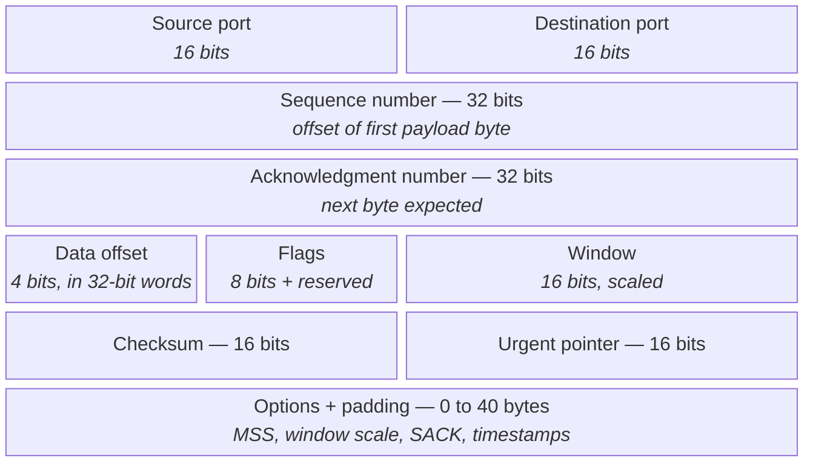
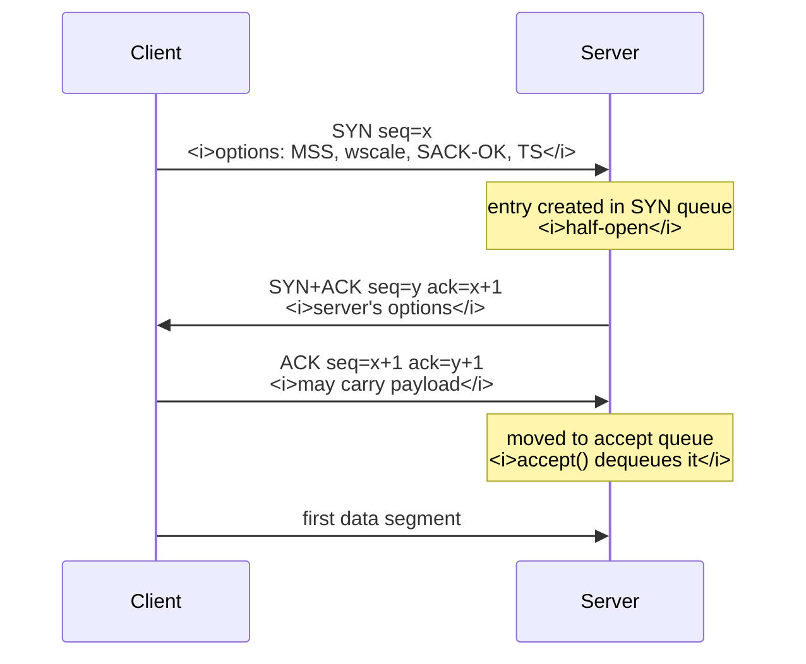
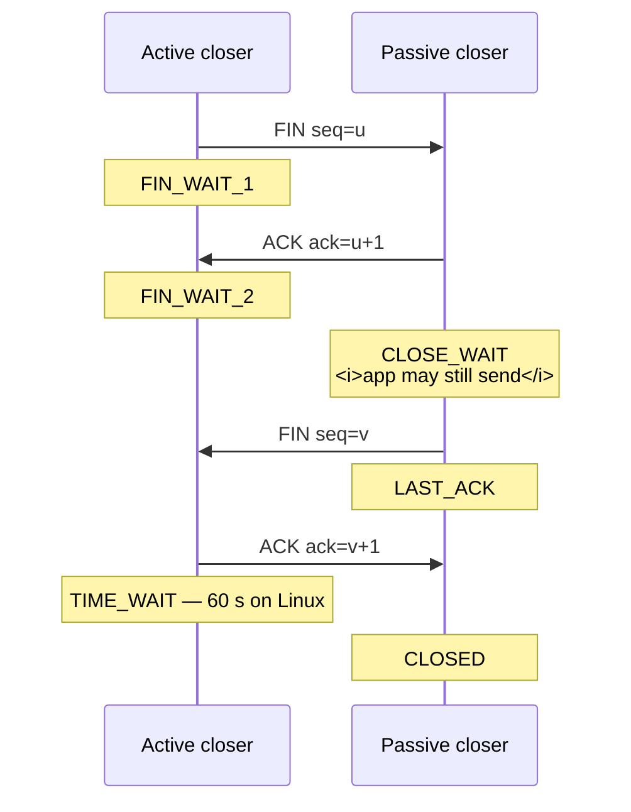
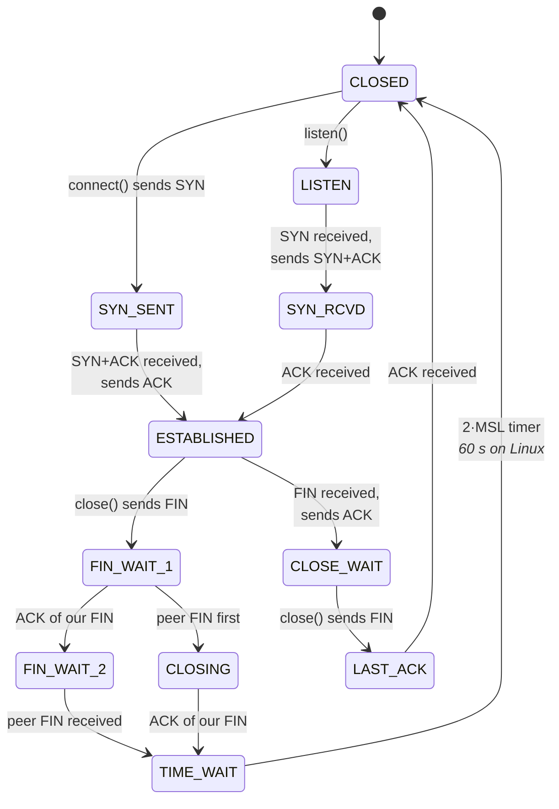
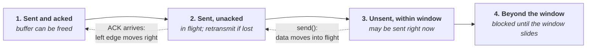
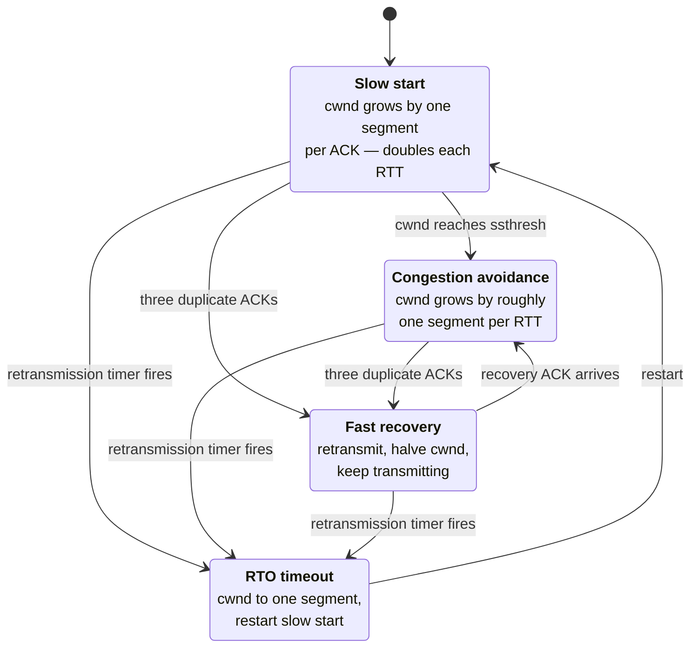
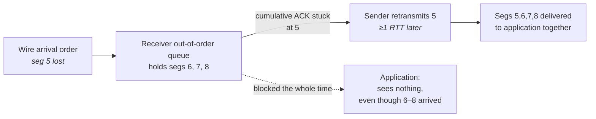
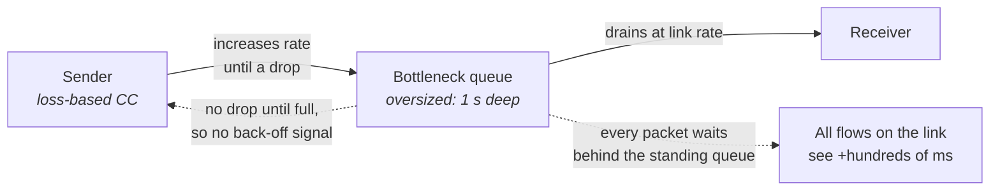

# TCP In Depth

You know what TCP promises: a reliable, ordered, flow-controlled byte stream between two endpoints.
A networking course teaches that promise, sketches the three-way handshake, draws a sliding window,
and moves on. What it does not teach is that every one of those guarantees is implemented by a
*timer*, a *counter*, or a *buffer* — and that each of those is a place where your data can sit
still for milliseconds while the network is completely idle.

That is the gap this chapter closes. A TCP connection that is behaving badly almost never looks
broken. Throughput is fine. No errors are reported. `send()` returns immediately with the full byte
count. And yet the far end receives your 80-byte message 40 milliseconds after you wrote it, because
two independent, individually reasonable optimizations — one on your side, one on theirs — combined
into a deadlock that only a timer can break. Or your connection quietly halves its sending rate for
several round trips because one packet was reordered, not lost. Or your process stalls in `send()`
because a switch three hops away has 200 milliseconds of buffered packets ahead of yours. None of
these produce an error. All of them produce latency, and all of them are invisible unless you know
which counter to read.

The framing to carry through the chapter: TCP is a *control loop*. It observes the network only
indirectly — through acknowledgments arriving, or failing to arrive — and it adjusts two independent
limits on how much data it may have outstanding at any moment. One limit, the receive window, is set
by the receiver and protects the receiver's memory. The other, the congestion window, is estimated
by the sender and protects the network. The sender may transmit up to the smaller of the two. Almost
everything TCP does is either updating one of those two numbers or recovering from having got them
wrong. Where the mechanisms in the previous three chapters — Ethernet framing, IP forwarding, UDP's
absence of state (see "The Network Stack from the Bottom Up," "IP and the Network Layer," and "UDP
and Multicast") — were mostly about *where a packet goes*, TCP is about *when it is allowed to
leave*. For latency work, "when it is allowed to leave" is the whole game.

## The Header, Field by Field

TCP's header is 20 bytes before options and up to 60 bytes with them, which makes it the largest
per-packet tax in a normal stack: on top of 14 bytes of Ethernet and 20 bytes of IPv4, a TCP segment
carrying a 50-byte message spends more bytes on headers than on payload (see "Encapsulation,
headers, and per-layer overhead" in "The Network Stack from the Bottom Up"). More important than the
size is what those bytes *do*. Every field in the header is either an identifier for the connection,
a position in the byte stream, or an input to one of the control loops.

The single idea that unlocks the header is the **sequence space**. TCP does not number packets — it
numbers *bytes*. Each direction of a connection has an independent 32-bit counter, and the sequence
number in a segment's header is the position of that segment's first payload byte in the sender's
stream. If a segment carries sequence 1000 and 500 bytes of payload, the next segment's sequence
number is 1500. Nothing in the header says "this is packet 7." That design decision is why TCP can
resegment freely — the sender may retransmit lost data in differently-sized segments than it
originally sent, coalescing or splitting as it likes, because the receiver reassembles by byte
offset, not by packet identity. It is also why TCP preserves no message boundaries whatsoever, which
is the source of the framing burden every application-level protocol on TCP has to carry.

The acknowledgment number is the mirror image and is the field people most often get subtly wrong.
It is **cumulative and forward-looking**: it names the next sequence number the receiver expects,
which is equivalent to saying "I have every byte below this." An ACK of 1500 means bytes up to 1499
arrived contiguously. If bytes 1500–1999 are lost but 2000–2999 arrive, the receiver *cannot* ack
2999 — the cumulative field can only report the contiguous prefix, so it keeps repeating 1500. Those
repeats are the "duplicate ACKs" that drive fast retransmit, and the inability of the cumulative
field to describe the out-of-order data the receiver actually holds is precisely the deficiency that
the SACK option exists to fix.

The sequence number is not initialized to zero. Each side chooses a random **Initial Sequence Number
(ISN)** during the handshake. The original motivation was to keep segments from an old incarnation of
the same four-tuple from being accepted by a new connection; the modern motivation is to make
off-path injection attacks impractical. The consequence for you is practical: raw sequence numbers in
a packet capture look like arbitrary huge integers, which is why tooling shows *relative* sequence
numbers by default and why you should know which mode you are looking at.



The diagram above is the fixed 20-byte header plus the variable option area; the **data offset**
field is what tells the receiver where the options end and the payload begins, expressed in 32-bit
words, which is why the maximum header is 15 words — 60 bytes — and why options are padded to a
4-byte boundary.

| Field | Width | What it does | Why you care |
|---|---|---|---|
| **Source / destination port** | 16 bits each | With the source and destination IP addresses, forms the **four-tuple** that identifies the connection | The client's ephemeral port is a finite resource — see port exhaustion below |
| **Sequence number** | 32 bits | Byte offset of the first payload byte in this direction's stream | Randomized at connection start; wraps after 4 GiB, handled by the timestamp option |
| **Acknowledgment number** | 32 bits | Next byte expected — cumulative, valid only when the ACK flag is set | Cannot describe out-of-order data; hence SACK |
| **Data offset** | 4 bits | Header length in 32-bit words | Bounds the options area to 40 bytes total |
| **Flags** | 8 bits (plus reserved) | Control bits, listed below | Determines what the segment *is* |
| **Window** | 16 bits | Free receive-buffer space the sender of this segment is advertising | Left-shifted by the window scale factor negotiated at handshake |
| **Checksum** | 16 bits | Covers header, payload, and a pseudo-header of IP addresses and protocol | Normally offloaded to the NIC (see "The Linux Networking Stack") |
| **Urgent pointer** | 16 bits | Offset of "urgent" data when URG is set | Effectively dead; ambiguous across implementations, never use it |
| **Options** | 0–40 bytes | MSS, window scale, SACK-permitted, SACK blocks, timestamps, Fast Open cookie | Several are handshake-only and cannot be renegotiated later |

The flag bits, in the order they appear:

| Flag | Name | Meaning |
|---|---|---|
| **CWR** | Congestion Window Reduced | Sender is telling the peer it responded to an ECN congestion signal |
| **ECE** | ECN-Echo | Receiver is reflecting an ECN congestion mark back to the sender |
| **URG** | Urgent | Urgent pointer is meaningful — obsolete in practice |
| **ACK** | Acknowledgment | The acknowledgment number field is valid; set on every segment after the initial SYN |
| **PSH** | Push | Hint to deliver buffered data to the application promptly rather than waiting for more |
| **RST** | Reset | Abort the connection immediately, no graceful close |
| **SYN** | Synchronize | Connection setup; consumes one sequence number |
| **FIN** | Finish | No more data from this direction; consumes one sequence number |

Two behaviors in that table repeatedly confuse people. **SYN and FIN each consume a sequence
number** even though they carry no payload — that is how they become reliably acknowledgeable, and
it is why a connection that transfers exactly 1000 bytes ends with sequence numbers 1002 past the
ISN. And **PSH is a hint, not a control**: Linux sets it on the last segment produced by a given
write when the send queue drains, and the receiving stack largely ignores it, because the receiving
socket already wakes a blocked reader as soon as any in-order data arrives. Interviewers sometimes
ask whether setting PSH reduces latency. It does not; it is not exposed as a socket option, and the
receive-side wakeup does not wait for it.

The options are where the modern protocol lives, and the critical structural fact is that most of
them are negotiated **only in the SYN and SYN-ACK**. If both sides do not agree during the handshake,
the feature is unavailable for the life of the connection.

| Option | Kind | Negotiated | What it buys |
|---|---|---|---|
| **Maximum Segment Size (MSS)** | 2 | SYN only | Each side announces the largest payload it will accept, derived from the interface MTU |
| **Window scale** | 3 | SYN only | A left-shift factor (up to 14) applied to the 16-bit window field, raising the ceiling from 64 KiB to ~1 GiB |
| **SACK-permitted** | 4 | SYN only | Enables selective acknowledgment for the connection |
| **SACK blocks** | 5 | Any segment | Reports up to three or four contiguous ranges of out-of-order data actually received |
| **Timestamps** | 8 | SYN only | Round-trip measurement on every ACK, plus protection against sequence-number wrap |
| **Fast Open cookie** | 34 | SYN / SYN-ACK | Allows payload in the SYN on subsequent connections to the same server |

The window scale option deserves emphasis because it explains a whole class of throughput problems.
The window field is 16 bits, so without scaling a connection can never have more than 65,535 bytes in
flight. On a link with a 100 ms round trip, that caps throughput at roughly 5 Mbit/s no matter how
fast the link is. Window scaling fixes it — but because the shift factor is exchanged only in the
SYN, a middlebox that strips unknown options from the SYN silently pins the connection to the
unscaled ceiling forever.

**Failure mode: a connection over a long path plateaus at a few Mbit/s regardless of link capacity.**
The symptom is throughput that is stable, well below capacity, and inversely proportional to round-trip
time. The cause is usually window scaling not in effect, either because a middlebox stripped the
option or because `net.ipv4.tcp_window_scaling` is disabled on one side. Confirm by checking
`sysctl net.ipv4.tcp_window_scaling` on both hosts and by looking at the SYN and SYN-ACK in a capture
(`tcpdump -i <iface> -nn 'tcp[tcpflags] & tcp-syn != 0'`), where `tcpdump` prints `wscale N` when the
option is present and prints nothing when it is not.

**Try it:** capture a single handshake and read the negotiated feature set directly. Run
`sudo tcpdump -i any -nn -v 'tcp[tcpflags] & (tcp-syn|tcp-ack) == tcp-syn or (tcp[tcpflags] & tcp-syn != 0 and tcp[tcpflags] & tcp-ack != 0)'`
in one terminal and open any TCP connection in another. In the two SYN lines you will see
`mss`, `sackOK`, `TS val`, and `wscale` — that list is the entire negotiated capability set for the
connection's lifetime. Then run `ss -tin` against an established socket and note that the same
information reappears as `wscale:7,7`, `sack`, `ts`, and `mss:` in the per-socket line.

## Establishing a Connection

The purpose of the three-way handshake is often stated as "synchronizing sequence numbers," which is
true but understates it. The handshake has to accomplish four things at once, over a channel where
packets can be lost, duplicated, delayed arbitrarily, and forged: both sides must learn each other's
ISN, both must confirm the other is actually reachable and actually wants the connection, both must
exchange the option set that governs the rest of the connection, and both must be able to distinguish
this connection from an old incarnation of the same four-tuple whose stray packets might still be
wandering the network.

Two messages cannot do this. A SYN followed by a SYN-ACK proves to the client that the server is
alive and has its ISN, but the server has no evidence the client received the SYN-ACK, and no
evidence the client's SYN was not a replayed or spoofed packet from an address that never asked for
anything. The third message — the client's ACK, carrying a sequence number the client could only know
by having received the SYN-ACK — supplies exactly that missing proof. This is also why the handshake
is the foundation of TCP's spoofing resistance: an attacker who cannot see return traffic cannot
produce a valid third packet.

The cost is one round trip before any application data can move. On a colocated path with a
round-trip time in the tens of microseconds this barely registers; across a wide-area link at 30 ms
it dominates a short request. Note that the client can send data in the same segment as the ACK, so
the true cost is one RTT of latency added to the first exchange, not two.



The diagram shows the detail that matters operationally: on the server there are **two queues, not
one**, and they overflow for different reasons and are sized by different knobs.

- **The SYN queue** (also called the half-open queue) holds connections between the arrival of the
  SYN and the arrival of the final ACK. Its size is bounded by `net.ipv4.tcp_max_syn_backlog`. An
  entry sits here for one round trip under normal conditions, or until the SYN-ACK retransmissions
  configured by `net.ipv4.tcp_synack_retries` are exhausted if the client never replies.
- **The accept queue** holds fully established connections that the application has not yet picked up
  with `accept()`. Its size is the `backlog` argument to `listen()`, capped by
  `net.core.somaxconn`. It drains at the speed of your accept loop — which makes it a direct
  measurement of whether your application is keeping up.

That distinction is a standard interview question, and the standard follow-up is what happens when
each one overflows. If the accept queue is full when the final ACK arrives, Linux by default
**drops the ACK silently** and lets the client's SYN-ACK retransmission timer fire, on the theory
that the application may catch up shortly. The client sees a connection that appears established from
its side but whose first data goes unanswered for a second or more. Setting
`net.ipv4.tcp_abort_on_overflow=1` changes this to sending an RST instead, which turns a mysterious
multi-second stall into an immediate, visible connection failure — often the better behavior for a
latency-critical service, since a fast failure can be retried and a hidden stall cannot.

The SYN queue overflowing is the older and more famous problem, because it is trivially weaponized. An
attacker sends SYNs from addresses that will never complete the handshake; each one occupies a SYN
queue slot for the full SYN-ACK retransmission timeout; the queue fills; legitimate SYNs are dropped.
**SYN cookies** are the defense, and the mechanism is worth understanding because it explains the
feature's limitations. Instead of allocating state when the SYN arrives, the server computes its ISN
as a cryptographic function of the four-tuple, a coarse timestamp, and a secret, encoding a small
amount of information (notably an index into a fixed table of MSS values) into the low bits. It then
discards all state. When the final ACK arrives, the acknowledgment number is the ISN plus one, so the
server can recompute the function, verify the cookie is one it would have issued recently, and
reconstruct the connection from nothing.

The cost follows directly: the server kept no state, so **the options carried in the original SYN are
gone**. The MSS survives only because it was encoded into the cookie at reduced precision. Window
scaling, SACK, and timestamps survive only if the timestamp option was in use, because Linux can then
stash a few bits in the timestamp echo. A connection established via cookie may therefore have worse
throughput and worse loss recovery than one established normally. This is why `net.ipv4.tcp_syncookies`
defaults to `1`, meaning "only when the SYN queue overflows," rather than `2`, meaning "always."

| Knob | Default (typical Linux) | What it controls |
|---|---|---|
| `net.ipv4.tcp_max_syn_backlog` | 128–4096, memory-dependent | SYN queue size |
| `net.core.somaxconn` | 4096 on recent kernels, 128 historically | Ceiling on the `listen()` backlog |
| `net.ipv4.tcp_syncookies` | 1 | 0 off, 1 on overflow, 2 unconditionally |
| `net.ipv4.tcp_synack_retries` | 5 | SYN-ACK retransmissions before giving up on a half-open connection |
| `net.ipv4.tcp_syn_retries` | 6 | Client-side SYN retransmissions; the reason a dead server takes ~2 minutes to fail |
| `net.ipv4.tcp_abort_on_overflow` | 0 | Send RST instead of silently dropping when the accept queue is full |
| `net.ipv4.tcp_fastopen` | 1 (client) | Bitmask: 1 enables client, 2 enables server |

The client-side retry count deserves a note because it produces one of the most common
"why did this take forever to fail" reports. A SYN to a host that silently drops it is retransmitted
with exponentially increasing backoff — roughly 1, 2, 4, 8, 16, 32 seconds — so with the default of
six retries a `connect()` can block for over two minutes before returning `ETIMEDOUT`. A
latency-sensitive client should either lower this per-socket with the `TCP_SYNCNT` socket option or
use a non-blocking connect with its own timeout (see "Sockets Programming Model").

**TCP Fast Open** removes the handshake round trip for repeat connections. On the first connection to
a server, the client requests a cookie; the server issues one, bound to the client's address. On
subsequent connections the client puts the cookie *and* application data in the SYN itself, and the
server may pass that data to the application before the handshake completes. It saves exactly one
RTT, it requires support on both ends, and it is frequently broken by middleboxes that reject SYNs
carrying payload. Enable it with `sysctl net.ipv4.tcp_fastopen=3` for both roles.

**Failure mode: connections intermittently take a full second to establish under load.** The symptom
is a bimodal connect-time distribution with a cluster near one second — the SYN-ACK retransmission
interval — while the server appears healthy. The cause is accept-queue overflow: the final ACK was
dropped because the application was not calling `accept()` fast enough. Confirm with
`nstat -az TcpExtListenOverflows TcpExtListenDrops` before and after; a rising `ListenOverflows` is
conclusive. Cross-check with `ss -lnt`, where for a *listening* socket the `Recv-Q` column is the
current accept queue depth and `Send-Q` is its configured maximum — if `Recv-Q` is pinned at
`Send-Q`, you have found it.

**Failure mode: throughput collapses only for connections established during a traffic spike.** The
cause is SYN cookies engaging and stripping window scale and SACK from those connections. Confirm
with `nstat -az TcpExtSyncookiesSent TcpExtSyncookiesRecv TcpExtSyncookiesFailed`; a nonzero
`SyncookiesRecv` means real connections were completed from cookies. The kernel also logs
"possible SYN flooding on port N" to the ring buffer, visible with `dmesg`.

**Try it:** create the overflow deliberately. Write a listener that calls `listen(fd, 1)` and then
sleeps without ever calling `accept()`, then fire fifty connections at it. Watch
`ss -lnt 'sport = :<port>'` show `Recv-Q` climb to its ceiling and stop, and watch
`nstat -az TcpExtListenOverflows` increment once per rejected connection. Then set
`sysctl -w net.ipv4.tcp_abort_on_overflow=1`, repeat, and observe that the clients now fail
immediately with `ECONNRESET` instead of hanging — the same underlying condition, made visible.

## Tearing a Connection Down

Closing is harder than opening, and the reason is that TCP connections are two independent
half-duplex streams that happen to share a four-tuple. Closing your direction says only "I have no
more data to send." It says nothing about whether you are still willing to *receive*, and the peer may
legitimately keep sending for an arbitrarily long time afterwards. So the graceful close is a FIN and
an ACK in each direction — four segments in principle, often three when the peer's ACK and its own
FIN can be combined.

The abrupt alternative is RST. A reset is not a request to close; it is a declaration that the
connection no longer exists and that anything further about it should be discarded. It is generated
when a segment arrives for a four-tuple with no matching socket, when data arrives on a socket that
was closed with unread data still queued, when a listener's accept queue overflows under
`tcp_abort_on_overflow`, and deliberately when an application sets `SO_LINGER` with a zero timeout.
RST is not acknowledged and not retransmitted, which means it can be lost, which in turn means a
peer may keep an established socket for a connection the other side has already destroyed.

Then there is **TIME_WAIT**, the state that generates more confusion than the rest of the protocol
combined. The side that closes *first* — which is not necessarily the client — must keep the
four-tuple reserved after the exchange completes, for twice the maximum segment lifetime. Linux fixes
this at 60 seconds; it is a compile-time constant, not a sysctl, and `net.ipv4.tcp_fin_timeout`
despite its name governs how long a socket may sit in `FIN_WAIT_2` waiting for the peer's FIN, not
the TIME_WAIT duration.



TIME_WAIT exists for two reasons, and only the first is usually taught. The obvious one is that the
final ACK might be lost; if it is, the peer retransmits its FIN, and someone has to be present to
re-acknowledge it. Without TIME_WAIT that retransmitted FIN would hit a nonexistent socket and draw
an RST, which the peer would report to its application as an error on a connection that closed
cleanly. The subtler reason is **old duplicates**: a segment from this connection could still be
buffered somewhere in the network, and if the same four-tuple were immediately reused, that straggler
could be accepted as valid data by the new connection. Two maximum segment lifetimes is how long the
protocol is willing to wait for such stragglers to expire.

The diagram highlights the asymmetry that matters for server design: **only the active closer pays
TIME_WAIT**. The passive closer goes straight to CLOSED. This makes "who closes first" an
architectural decision. A server that closes connections itself accumulates TIME_WAIT sockets at the
rate it serves them; a server that lets clients close pushes the cost to the clients, where it is
spread across many hosts.

That cost becomes a hard limit through **ephemeral port exhaustion**. A connection is identified by
the four-tuple, so a client connecting repeatedly to the same server IP and port varies only its
source port. Linux's default range, readable from `/proc/sys/net/ipv4/ip_local_port_range`, is
32768–60999 — about 28,000 ports. Every closed connection holds its port for 60 seconds of
TIME_WAIT. Divide: sustaining more than roughly 470 connections per second to a single destination
exhausts the range, after which `connect()` fails with `EADDRNOTAVAIL`. This is a genuinely common
production failure and it has nothing to do with load on the server.

| Mitigation | What it does | Caveat |
|---|---|---|
| **Persistent connections** | Eliminates the churn entirely | The real fix; everything else is a workaround |
| **Widen the port range** | `sysctl -w net.ipv4.ip_local_port_range="10000 65535"` | Buys roughly 2×; delays the wall rather than removing it |
| **`net.ipv4.tcp_tw_reuse=1`** | Lets a *new outbound* connection reuse a TIME_WAIT four-tuple when timestamps prove the old one is stale | Client-side only; requires `net.ipv4.tcp_timestamps=1` on both ends |
| **More destination addresses or ports** | Each distinct destination gets its own port space | Requires cooperation from the server side |
| **`SO_REUSEADDR`** | Allows `bind()` to a local port in TIME_WAIT | Affects binding, not the outbound-connection limit; commonly misapplied here |
| **Let the peer close first** | Moves TIME_WAIT to the other host | Only works if the protocol allows it |

One item is conspicuously absent: `net.ipv4.tcp_tw_recycle`. It aggressively recycled TIME_WAIT
entries and broke badly for clients behind NAT, whose timestamps arrive from multiple machines and
appear to move backwards. It was **removed from Linux in 4.12**. Advice on the internet still
recommends it; that advice is stale, and recognizing this is a reasonable interview signal.

**Failure mode: a client suddenly cannot open connections, with `connect()` returning `EADDRNOTAVAIL`.**
The cause is ephemeral port exhaustion from TIME_WAIT accumulation. Confirm with
`ss -tan state time-wait | wc -l` and compare against the width of
`cat /proc/sys/net/ipv4/ip_local_port_range`. If the count approaches the range size, that is the
whole story. `nstat -az TcpExtTW` shows the rate at which TIME_WAIT sockets are being created.

**Failure mode: peers report "connection reset by peer" on connections your application closed
normally.** The cause is usually that your application called `close()` while unread data was still in
the receive queue — Linux converts that close into an RST rather than a FIN, since the data can never
be delivered. Confirm with `nstat -az TcpExtTCPAbortOnData`, which counts exactly this event, and with
`nstat -az TcpOutRsts` for total resets emitted. The fix is to drain the receive queue before closing,
or to use a half-close (`shutdown(fd, SHUT_WR)`) and read until end-of-stream.

**Failure mode: sockets accumulate in `CLOSE_WAIT` and never leave.** `CLOSE_WAIT` means the peer sent
FIN and your application has not yet called `close()` on that descriptor — it is an application bug,
not a network problem, and no timer will clear it. Confirm with `ss -tan state close-wait` and map the
descriptors back to the process with `ss -tanp` or `lsof`.

**Try it:** watch TIME_WAIT accumulate and identify who owns it. Run a loop that opens and
immediately closes a connection to a local service a thousand times, then check
`ss -tan state time-wait | wc -l`. Now change which side closes first — have the server call `close()`
instead — and repeat. The TIME_WAIT sockets move to the other host. This is the clearest possible
demonstration that TIME_WAIT is a property of *closing first*, not of being the client.

## The State Machine in Full

Everything so far has been fragments of one finite state machine. Seeing it whole is worth the effort
for two reasons: it is directly asked about in interviews, and it is the fastest way to diagnose a
stuck connection, because the state name alone usually tells you which side is at fault.

The machine has eleven states. Three are transient parts of setup, five are parts of teardown, one is
the steady state, one is the passive-open state, and one is the null state.



Two paths in the diagram exist only for cases people forget. `CLOSING` is the simultaneous-close
path: both sides sent FIN before receiving the other's, so neither can go to `FIN_WAIT_2`. And
`SYN_RCVD` can be reached from `SYN_SENT` as well, on a simultaneous open — both sides sent SYN at
once. Neither is common, both are correct, and an interviewer asking "what happens if both sides
close at the same time" is checking whether you know `CLOSING` exists.

The operational value is in the diagnostic mapping. Every abnormal state accumulation points at a
specific culprit:

| State | Meaning | If sockets pile up here, suspect |
|---|---|---|
| `LISTEN` | Passive open, awaiting SYNs | Normal; check its `Recv-Q` in `ss -lnt` for accept-queue depth |
| `SYN_SENT` | Our SYN sent, no reply | Server down, firewall dropping SYNs, or routing black hole |
| `SYN_RECV` | SYN-ACK sent, awaiting final ACK | SYN flood, or clients whose return path is broken |
| `ESTABLISHED` | Data transfer | Normal |
| `FIN_WAIT_1` | Our FIN sent, unacknowledged | Peer unreachable or ignoring; bounded by `tcp_orphan_retries` |
| `FIN_WAIT_2` | Our FIN acked; awaiting peer's FIN | Peer application never calls `close()`; bounded by `tcp_fin_timeout` |
| `CLOSE_WAIT` | Peer's FIN received; ours not sent | **Your own application** leaked the descriptor — unbounded |
| `LAST_ACK` | Our FIN sent after theirs | Final ACK lost; short-lived |
| `TIME_WAIT` | Waiting out old duplicates | Normal for the active closer; watch for port exhaustion |
| `CLOSING` | Simultaneous close | Rare, benign |

Note the asymmetry that makes this table so useful in practice: `CLOSE_WAIT` is the one state with no
timer behind it. A connection can sit there until the process exits. So a growing `CLOSE_WAIT` count
is always a file-descriptor leak in your own code, while a growing `FIN_WAIT_2` count points at the
peer.

**Failure mode: file descriptor exhaustion with thousands of sockets in `CLOSE_WAIT`.** The kernel is
waiting for your `close()`, which never comes — usually because an error path returned early without
closing the descriptor. Confirm with `ss -tan state close-wait | wc -l` and by comparing against
`ls /proc/<pid>/fd | wc -l` and the process's limit in `/proc/<pid>/limits`.

**Try it:** watch a connection walk the whole machine. In one terminal run
`watch -n 0.2 "ss -tan '( sport = :8080 or dport = :8080 )'"`. In another, start a listener, connect,
exchange a byte, and close from the client side. You will see `SYN-SENT` flash by, `ESTAB` sit for
the duration, then `FIN-WAIT-2` on one side and `CLOSE-WAIT` on the other, then `TIME-WAIT` for
sixty seconds. Deliberately delay the server's `close()` by ten seconds and observe `CLOSE_WAIT`
persist for exactly that long — the state is a direct readout of the peer application's behavior.

## The Sliding Window and Flow Control

Consider the simplest reliable protocol: send a segment, wait for its ACK, send the next. It is
obviously correct and it is useless. On a path with a 100 µs round trip and a 1500-byte MTU, it
delivers roughly 15 MB/s — about 120 Mbit/s — regardless of whether the link is 1 Gbit/s or
100 Gbit/s, because the sender spends almost all of its time waiting. Link capacity is irrelevant if
you refuse to use it concurrently.

The fix is to allow multiple segments in flight, and the amount that *should* be in flight follows
from a single observation: the network path behaves like a pipe whose volume is its bandwidth
multiplied by its round-trip delay. To keep a 10 Gbit/s link with a 100 µs round trip continuously
busy, roughly 125 KB must be outstanding at all times. Send less and the link idles; send more and
the excess necessarily sits in a queue somewhere. That quantity — the **bandwidth-delay product** —
is the target the entire windowing system is trying to hit.

But the sender cannot simply blast 125 KB and hope. Two separate things can be overwhelmed, and TCP
guards them with two separate limits. The receiver's socket buffer is finite, so the receiver
advertises a **receive window** in every ACK saying how much free space it has. And the network's
queues are finite, so the sender maintains its own estimate — the **congestion window** — of how much
the path will absorb. The sender is permitted to have `min(rwnd, cwnd)` bytes unacknowledged. Flow
control (this section) is the first; congestion control (the next) is the second. Conflating them is
the single most common misunderstanding of TCP, and the practical way to keep them apart is to
remember that one is a number the *peer tells you* and the other is a number you *guessed*.

The send side maintains four regions of the sequence space, and every ACK slides the boundaries
rightward:



Regions 2 and 3 together are the window. Its left edge advances when an ACK arrives; its right edge
advances when the peer advertises more space or the congestion window grows. If your application is
blocked in `send()`, it is because region 3 has shrunk to nothing — and the two possible reasons are
exactly the two limits above, which is why the diagnostic question is always "am I receive-window
limited or congestion-window limited?"

The receiver's side has its own subtlety, called **silly window syndrome**. Suppose the receive buffer
is full, the application reads 10 bytes, and the receiver dutifully advertises a 10-byte window. The
sender emits a 10-byte segment wrapped in 54 bytes of headers, and the cycle repeats — the connection
degenerates into maximum overhead per useful byte. Both sides implement avoidance: the receiver
withholds a window update until it can offer a worthwhile amount (roughly a full MSS or half the
buffer), and the sender declines to send small segments into a small window. Nagle's algorithm, later
in this chapter, is the sender-side half of this idea.

When the window reaches exactly zero, a deadlock threatens. The sender must stop. It will restart when
a window update arrives — but window updates are pure ACKs, which are not retransmitted, so if that
update is lost, both sides wait forever. The **persist timer** breaks it: the sender periodically emits
a one-byte window probe, forcing the receiver to respond with its current window. This is the
mechanism behind connections that hang for tens of seconds and then resume.

Linux sizes socket buffers automatically, and understanding the knobs matters because a manual
override is one of the most common self-inflicted performance wounds.

| Setting | Form | Effect |
|---|---|---|
| `net.ipv4.tcp_rmem` | three integers: min, default, max | Receive buffer autotuning bounds, per socket |
| `net.ipv4.tcp_wmem` | three integers: min, default, max | Send buffer autotuning bounds, per socket |
| `net.core.rmem_max` / `net.core.wmem_max` | single integer | Ceiling on what `SO_RCVBUF` / `SO_SNDBUF` may set explicitly |
| `net.ipv4.tcp_moderate_rcvbuf` | 0 or 1 | Enables receive-buffer autotuning; on by default |
| `net.ipv4.tcp_mem` | three integers, in pages | System-wide TCP memory pressure thresholds |

The trap: **setting `SO_RCVBUF` or `SO_SNDBUF` explicitly disables autotuning for that socket.** The
kernel takes an explicit request as authoritative and stops growing the buffer, so a value that looked
generous on a fast local path becomes a hard ceiling on a slower or longer one. Unless you have
measured a specific need, leave both alone and let the `tcp_rmem` / `tcp_wmem` maxima bound them. Note
also that the kernel accounts overhead against the buffer — the space available to payload is less
than the number you set, historically governed by `net.ipv4.tcp_adv_win_scale`.

**Failure mode: throughput is capped well below link capacity, and `ss` shows a small `rcv_space`.**
The cause is a receive window too small for the bandwidth-delay product, usually because the
application set `SO_RCVBUF`, or because it is not reading fast enough to keep the buffer drained.
Confirm with `ss -tin`, comparing the reported `rcv_space` and window against the product of
`delivery_rate` and `rtt` in the same output. A nonzero `Recv-Q` in `ss -tan` for an established socket
means data is waiting for your application, not for the network.

**Failure mode: transfers stall completely for tens of seconds, then resume as if nothing happened.**
The cause is a zero-window condition — the receiving application stopped reading — followed by
recovery when it resumed and a persist-timer probe elicited the update. Confirm with
`nstat -az TcpExtTCPToZeroWindowAdv TcpExtTCPFromZeroWindowAdv TcpExtTCPZeroWindowDrop`, and by
looking for `win 0` segments in a `tcpdump` capture.

**Try it:** watch the two limits separately. Start a bulk transfer and run
`ss -tin dst <peer>` repeatedly. The line reports `cwnd:`, `ssthresh:`, `rtt:<srtt>/<rttvar>`,
`bytes_acked:`, `delivery_rate:`, and — critically — cumulative `rwnd_limited:` and `sndbuf_limited:`
times. Those last two are the direct answer to "which limit is binding": whichever accumulates time is
the one holding you back. If neither does and `cwnd` is stable, you are application-limited, which is
the normal state for a request/response workload.

## Congestion Control

Flow control protects the receiver, and it was the whole of TCP's rate management until the
mid-1980s. Then the NSFNET collapsed. The mechanism was a positive feedback loop with no damping:
senders had no notion of network capacity, so they filled router queues; queues overflowed and dropped
packets; drops triggered retransmissions; retransmissions added load; more drops followed. Useful
throughput fell by roughly three orders of magnitude while the links stayed saturated with
retransmissions of data that had already been sent. This is **congestion collapse**, and everything in
this section exists to prevent its recurrence.

The design problem is severe. Routers do not tell endpoints how fast to send — there is no signal in
plain IP for "slow down." The sender therefore has to *infer* the path's capacity from the only
evidence it has: which of its packets were acknowledged and when. Classical TCP treats a lost packet
as the congestion signal, on the reasoning that on a wired link packets are rarely lost for any
reason other than a full queue. That inference is the foundation of the whole edifice and also its
main weakness — on a wireless link, or a path with a flaky optic, losses that have nothing to do with
congestion cause the sender to slow down anyway.

Given that signal, the sender maintains a **congestion window (cwnd)**: its private estimate of how
many bytes the path will accept without loss. The rules for adjusting it have a shape everyone should
be able to state: increase gradually while things are going well, decrease sharply when loss appears.
The asymmetry is deliberate — being too aggressive harms everyone sharing the path, while being too
conservative harms only you — and it produces the sawtooth pattern of a long-lived TCP flow's sending
rate. A second variable, the **slow start threshold (ssthresh)**, records the window size where trouble
was last observed and marks the boundary between the two growth regimes.



**Slow start** is badly named: it is the fastest-growing phase. A new connection has no information
about the path, so it starts small and probes upward exponentially. Every acknowledged segment allows
one more, so the window doubles every round trip. Linux begins at an initial window of ten segments —
roughly 14 KB — which was standardized precisely because most web-scale responses fit in it and a
smaller start added a needless round trip. The phase ends when cwnd reaches ssthresh or when loss
occurs.

Because the doubling continues until something breaks, classic slow start systematically *overshoots*
— it discovers the path's capacity by exceeding it, which means the very first congestion event on a
connection typically comes with a burst of losses. **HyStart**, enabled by default in Linux's CUBIC,
mitigates this by watching for the round-trip time to start climbing, which indicates a queue is
forming, and leaving slow start before packets are actually dropped.

**Congestion avoidance** is the cautious phase above ssthresh. Instead of one extra segment per ACK,
the window grows by roughly one segment per *round trip*, a linear ramp that gently probes for
additional capacity. This is where a long-lived connection spends most of its life.

**Fast retransmit and fast recovery** are the improvements that made TCP usable on real networks.
Before them, any loss was detected only by the retransmission timer expiring, which meant hundreds of
milliseconds of dead air. The insight: when a segment is lost, the segments *after* it still arrive,
and each one makes the receiver emit another ACK repeating the same cumulative number. Those duplicate
ACKs are therefore evidence both that something was lost and that the network is still delivering
data. The convention is to treat **three duplicate ACKs** as a loss signal — three rather than one,
because a single reordering event on the path also produces duplicates and would otherwise cause a
spurious retransmission on every reorder.

On that signal the sender retransmits the missing segment immediately, without waiting for any timer,
and then enters fast recovery: it reduces cwnd (classically to half) rather than collapsing it to one
segment, and continues transmitting new data as further duplicate ACKs arrive, since each duplicate
proves a packet left the network. That "keep transmitting during recovery" behavior is the difference
between a small dip and a complete stall. The distinction people miss is that **fast retransmit costs
about one round trip; an RTO costs at least the timer's minimum**, and on Linux that minimum is
200 ms. On a colo path with a 50 µs round trip, an RTO is roughly four thousand times worse than a
fast retransmit. Avoiding RTOs is therefore worth far more than avoiding loss per se.

| Event | cwnd response | Approximate cost |
|---|---|---|
| ACK during slow start | +1 segment per ACK (exponential) | — |
| ACK during congestion avoidance | +1 segment per RTT (linear) | — |
| Three duplicate ACKs | Multiplicative decrease, keep sending | ~1 RTT |
| RTO expiry | Collapse to 1 segment, ssthresh halved, restart slow start | ≥200 ms on Linux |
| Idle period, if `tcp_slow_start_after_idle=1` | cwnd reset toward initial value | Several RTTs to recover |

That last row is a specific hazard for request/response workloads with sparse traffic. If a connection
sits idle longer than one RTO, Linux by default assumes its cwnd estimate is stale and resets it, so
the next burst of traffic starts from a small window and has to climb again. For a connection that is
idle between bursts — exactly the profile of a control or order-entry session — this reintroduces slow
start latency on every burst. Setting `net.ipv4.tcp_slow_start_after_idle=0` disables the reset. This
is one of the few congestion-control sysctls that is nearly always correct to change on a
latency-sensitive host with stable, known paths.

**Failure mode: the first few hundred milliseconds of every connection are slow, then it speeds up.**
The cause is slow start: the window has not yet grown to the bandwidth-delay product. Confirm by
sampling `ss -tin` during the transfer and watching `cwnd` climb. For a service whose responses are
slightly larger than the initial window, raising it per-route with
`ip route change <prefix> dev <iface> initcwnd 20` is the targeted fix — but it is antisocial on
shared paths and should be confined to networks you control.

**Failure mode: a periodically idle connection shows a latency spike on the first message after each
gap.** The cause is `tcp_slow_start_after_idle` resetting cwnd. Confirm by reading
`sysctl net.ipv4.tcp_slow_start_after_idle`, then sampling `cwnd` from `ss -tin` immediately before
and after an idle period — you will see it drop back toward ten segments.

**Failure mode: throughput drops sharply and recovers over seconds, repeatedly.** The cause is RTO-based
loss recovery rather than fast retransmit — meaning losses are not being detected by duplicate ACKs,
often because the loss occurred at the tail of a burst with nothing behind it to trigger duplicates.
Confirm with `nstat -az TcpExtTCPTimeouts TcpExtTCPLossProbes TcpRetransSegs`; a high ratio of
`TCPTimeouts` to `TcpRetransSegs` means timer-driven recovery is dominating.

**Try it:** make the sawtooth visible. Start a long transfer and sample the congestion window once per
100 ms with `while :; do ss -tin dst <peer> | grep -o 'cwnd:[0-9]*'; sleep 0.1; done`. On a clean
path it climbs and plateaus; introduce loss with
`sudo tc qdisc add dev <iface> root netem loss 0.5%` and watch it collapse and rebuild repeatedly.
Remove it afterwards with `sudo tc qdisc del dev <iface> root`. Do this on a test interface only.

## Modern Algorithms: CUBIC and BBR

The classic algorithm described above — Reno, and its successor NewReno — has a structural problem
that became severe as links got faster. Its growth rate in congestion avoidance is one segment per
round trip, which is a fixed number of *segments*, not a fixed fraction of capacity. On a fast,
long path, recovering from a single loss can take an extremely long time: the window must climb, one
segment per RTT, back to a value that may be tens of thousands of segments. During that climb the link
sits underused. Worse, the recovery time depends on the round-trip time, so a flow on a short path
grabs bandwidth far faster than a flow on a long one — the algorithm is systematically unfair by
distance.

**CUBIC**, the Linux default since 2006, addresses both problems by changing what the window growth is
a function of. Instead of counting acknowledgments, it computes the window from the *elapsed time*
since the last congestion event, following a curve that rises steeply at first, flattens as it
approaches the window size where loss previously occurred, and then — if no loss appears — accelerates
past it to probe for new capacity. Two properties follow directly, and they are all you need to
describe CUBIC accurately without touching the math. First, growth is a function of time, so
connections with different round-trip times converge at similar rates: the RTT unfairness is gone.
Second, the curve deliberately spends a long interval near the previous congestion point, which is the
region most likely to be the true capacity — it lingers where the answer probably is, then probes
aggressively if it turns out to be wrong.

CUBIC also reduces the window less aggressively on loss than Reno does, keeping more of it after a
congestion event. It remains fundamentally **loss-based**: it needs a dropped packet to learn the
path's limit, which means it will fill whatever queue exists ahead of it before it backs off. That
property is the direct link to bufferbloat, at the end of this chapter.

**BBR** — Bottleneck Bandwidth and Round-trip propagation time — takes a different position: that loss
is a bad congestion signal because it arrives only *after* a queue has already formed and filled.
Instead of reacting to drops, BBR continuously builds a *model* of the path from two measurements it
takes from ordinary ACK arrivals: the maximum delivery rate it has recently observed, and the minimum
round-trip time it has recently observed. The minimum RTT approximates the path with no queue; the
maximum rate approximates the bottleneck's capacity. Their product is the amount of data that fills
the pipe without filling any queue, and BBR paces its transmissions to sit at that operating point.

The behavioral consequences are what matter for a systems engineer:

| Property | CUBIC | BBR |
|---|---|---|
| Congestion signal | Packet loss | Measured delivery rate and minimum RTT |
| Behavior with deep buffers | Fills them, then backs off — high latency | Avoids filling them — low latency |
| Behavior with shallow buffers and random loss | Backs off on losses that were not congestion | Largely unaffected by non-congestive loss |
| Transmission pattern | Bursts limited by window | Paced; requires a pacing mechanism |
| Periodic probing | Continuous window growth | Explicit phases: startup, drain, bandwidth probe, RTT probe |
| Fairness with the other | — | BBRv1 can be aggressive against loss-based flows sharing a bottleneck; later versions address this |

BBR's phase structure is the part worth being able to describe. It starts with an exponential
**startup** to find the bandwidth quickly, then a **drain** phase to empty the queue that startup
inevitably created, then settles into **bandwidth probing**, cycling its sending rate slightly above
and below its estimate to detect capacity changes. Periodically it enters a brief **RTT probe** phase
in which it deliberately reduces its sending rate so that queues drain and it can observe the true
minimum round-trip time — a distinctive, momentary throughput dip that is normal, not a fault.

Choosing between them is genuinely workload-dependent, and honest interview answers say so. BBR helps
substantially on paths with deep buffers or non-congestive loss, and it usually delivers lower latency
at the same throughput. CUBIC is more predictable and better understood in a fully controlled
environment. For a colocated path measured in microseconds with negligible loss and no deep queues,
the choice barely matters, because neither algorithm ever leaves its initial regime — which is itself
a useful thing to say out loud, since it demonstrates you understand that congestion control only
engages when there is congestion.

Two implementation facts. BBR paces packets, which requires pacing support; modern kernels have
internal pacing, but the `fq` queueing discipline is the traditional and still-recommended companion.
And congestion control is a **pluggable kernel module** with per-socket selection, so you do not have
to choose globally.

```bash
# What this kernel can do right now
cat /proc/sys/net/ipv4/tcp_available_congestion_control
# What it is using
sysctl net.ipv4.tcp_congestion_control
# Load and select BBR system-wide, with fair queueing for pacing
sudo modprobe tcp_bbr
sudo sysctl -w net.ipv4.tcp_congestion_control=bbr
sudo tc qdisc replace dev <iface> root fq
```

A per-socket override is available through the `TCP_CONGESTION` socket option, which is the right
choice when only one class of connection on the host needs different behavior. The set of algorithms a
non-privileged process may select is constrained by
`/proc/sys/net/ipv4/tcp_allowed_congestion_control`.

**Failure mode: enabling BBR does not change observed behavior.** The most common cause is that the
module was never loaded, so the sysctl write failed silently or the value was rejected. Confirm by
reading `/proc/sys/net/ipv4/tcp_available_congestion_control` — if `bbr` is absent, `modprobe tcp_bbr`
first. Second most common: the flow never leaves slow start because the transfers are too short for
congestion control to matter at all.

**Try it:** observe the algorithms' distinct signatures on the same path. Set
`sudo tc qdisc add dev <iface> root netem delay 50ms limit 10000` on a test interface to emulate a
long path with a deep queue. Run a bulk transfer under CUBIC, sampling `ss -tin` for `rtt:` — you will
see the measured RTT climb well above 50 ms as CUBIC fills the emulated queue. Switch to BBR and
repeat: throughput should be comparable while the measured RTT stays much closer to the baseline
50 ms. That difference *is* bufferbloat, and you have just measured it. Under BBR, `ss -tin` also
prints a `bbr:(bw:...,mrtt:...,pacing_gain:...,cwnd_gain:...)` block exposing the model directly.

## Timers, RTT Estimation, and Selective Acknowledgment

Every reliability mechanism so far depends on noticing that something did not arrive. Duplicate ACKs
handle the common case, but they need traffic behind the lost segment to generate them. When the loss
is at the end of a burst, or when the whole window is lost, nothing comes back at all, and the only
remaining mechanism is a timer: the **retransmission timeout (RTO)**.

Setting that timer is a genuine engineering problem. Too short and the sender retransmits data that
was merely delayed, wasting capacity and — because a spurious timeout also collapses the congestion
window — badly hurting throughput. Too long and every real loss costs the full timeout. And the right
value is not knowable in advance: it depends on the path, which varies by orders of magnitude between
a rack-local link and an intercontinental one, and changes over the life of a connection as queues
build and drain.

So TCP measures. Each acknowledgment of newly-sent data yields a round-trip sample. The stack keeps a
**smoothed RTT** — a running average that gives recent samples modest weight, so it tracks changes
without jittering — and, just as importantly, a **variance estimate** that tracks how much the samples
scatter. The timeout is set well above the smoothed average, with the margin driven by that variance:
a path with a stable RTT gets a tight timer, while a path whose RTT swings gets a loose one. This is
why a jittery path recovers from loss more slowly than a stable path with the same average latency,
and it is a good thing to be able to explain, because it connects the variance-versus-average theme
from "What 'Low Latency' Actually Means" to a concrete protocol mechanism.

Two details bound the result. Sampling a *retransmitted* segment is ambiguous — an arriving ACK might
be for the original or the copy, and taking the wrong one corrupts the estimate; the classical rule is
to simply not sample retransmitted segments, while the **timestamp option** resolves the ambiguity
directly by echoing the sender's timestamp, giving a clean sample on every ACK. And the RTO is
clamped: Linux uses a minimum of 200 ms and a maximum of 120 s. That floor is by far the more
important one for us. On a colocated path with a 50 µs round trip, the computed RTO would be a few
hundred microseconds, but the floor forces 200 ms — a four-thousand-fold penalty over the actual path
delay. **A single RTO on a low-latency path is catastrophic and cannot be tuned away with a sysctl**;
the floor is a kernel constant. Avoiding RTOs entirely is the only strategy.

Two mechanisms exist precisely to avoid falling through to the RTO:

- **Tail Loss Probe (TLP)** fires a much shorter timer — on the order of two round trips rather than
  the RTO floor — when a burst ends with unacknowledged data. It retransmits the last segment (or
  sends new data), which either elicits the missing ACK or generates duplicate ACKs that trigger
  ordinary fast recovery. Counted by `TcpExtTCPLossProbes` and `TcpExtTCPLossProbeRecovery` in
  `nstat`.
- **RACK** (Recent ACKnowledgment) replaces the "three duplicate ACKs" heuristic with a time-based
  one: a segment is deemed lost if a segment sent *later* has been acknowledged and enough time has
  passed. This detects loss correctly even when only one packet was in flight, and it handles
  reordering more gracefully than a fixed duplicate count. Controlled by `net.ipv4.tcp_recovery`,
  which enables RACK by default on modern kernels.

The other half of loss recovery is telling the sender *what* was lost. The cumulative acknowledgment
cannot: if segments 2 and 5 of a ten-segment window are lost, the receiver can only keep repeating
"I have through 1," even though it holds 3, 4, and 6 through 10. A sender with no better information
has two poor options — retransmit everything from 2 onward, wasting the network, or retransmit one
segment per round trip, taking as many round trips as there were losses.

**SACK** (Selective Acknowledgment) fixes this. The receiver attaches an option listing the contiguous
*ranges* it has actually received beyond the cumulative point. The sender then knows exactly which
holes to fill and retransmits only those, recovering from multiple losses in a single round trip. The
40-byte option limit caps this at three or four blocks per segment (three when timestamps are also
present, since timestamps consume ten bytes plus padding), which is enough in practice because the
blocks are reported most-recent-first. **D-SACK**, an extension, lets the receiver report that it
received a *duplicate* — which tells the sender its retransmission was unnecessary, allowing it to
recognize a spurious retransmission and undo the congestion window reduction it made in error.

| Mechanism | Detects | Latency cost | Confirm with |
|---|---|---|---|
| Fast retransmit (3 dup ACKs) | Single loss with traffic behind it | ~1 RTT | `nstat -az TcpExtTCPFastRetrans` |
| SACK-based recovery | Multiple losses in one window | ~1 RTT for all of them | `nstat -az TcpExtTCPSackRecovery` |
| RACK | Loss with little or no traffic behind it | ~1 RTT plus a reorder allowance | `sysctl net.ipv4.tcp_recovery` |
| Tail loss probe | Loss at the end of a burst | ~2 RTT | `nstat -az TcpExtTCPLossProbes` |
| RTO | Anything else, including total blackout | ≥200 ms on Linux | `nstat -az TcpExtTCPTimeouts` |

**Failure mode: occasional latency outliers at almost exactly 200 ms, 400 ms, or 800 ms.** Those are
the RTO floor and its exponential backoff. The cause is a loss that no faster mechanism detected —
frequently a tail loss on a request/response connection with nothing behind it. Confirm with
`nstat -az TcpExtTCPTimeouts` and by checking the `rto:` field in `ss -tin`. Verify that
`net.ipv4.tcp_sack=1` and that TLP is active (`TcpExtTCPLossProbes` should be nonzero on a lossy
path); if SACK was disabled somewhere, every multi-loss event degrades to timer recovery.

**Failure mode: retransmissions occur but no packets were actually lost.** The cause is reordering on
the path — commonly from a link aggregation group or ECMP hashing that splits a flow across paths —
triggering fast retransmit spuriously. Confirm with `nstat -az TcpExtTCPDSACKRecv`, which counts
D-SACKs received telling you a retransmission was redundant, and `TcpExtTCPSpuriousRTOs`. The
underlying fix is in the network: flows should hash to a single path.

**Try it:** read the timers off a live socket. `ss -tino` prints the smoothed RTT and its variance as
`rtt:12.3/4.5` (both in milliseconds), the current retransmission timeout as `rto:`, the delayed-ACK
timeout as `ato:`, and cumulative retransmissions as `retrans:<current>/<total>`. The `-o` flag adds
the currently-armed timer and its remaining time. Watch `rto:` on a local connection: it will sit at
the 200 ms floor even though `rtt:` reads a small fraction of a millisecond. That gap is the single
most important number in this section.

## Nagle's Algorithm, Delayed ACK, and the 40 ms Stall

This is the most heavily interviewed interaction in TCP, and it is worth understanding at full depth,
because it is the canonical example of two locally-correct optimizations combining into a
globally-terrible outcome.

Start with the problem Nagle's algorithm solved. In 1984, interactive terminal sessions sent one
keystroke at a time: a single byte of payload wrapped in 40 bytes of TCP and IP headers, plus link
framing — a 4,000% overhead. On the congested links of the era, these "tinygrams" were a real threat to
network stability. John Nagle's fix was a rule that requires no negotiation and no new protocol state:
**a sender may have at most one small, unacknowledged segment outstanding at a time.** If the
application writes a small amount of data and there is already unacknowledged small data in flight, the
new data is buffered rather than sent. When the outstanding ACK arrives, everything buffered goes out
as one segment. The algorithm is self-clocking and adaptive: on a fast path, ACKs return quickly and
almost nothing is delayed; on a slow path, more data coalesces per segment. Full-sized segments are
never delayed at all.

Now the other optimization, invented independently. A receiver that has data to acknowledge but nothing
to send would emit a 40-byte pure-ACK packet. But if the application is about to produce a response —
as it usually is in a request/response protocol — waiting a moment lets the ACK ride along on the
response, saving a packet entirely. And if a second data segment arrives in the meantime, one ACK can
cover both. Hence **delayed ACK**: hold the acknowledgment briefly, hoping to piggyback it or to
combine it with another. The specification requires the delay be under 500 ms and that every second
full-sized segment be acknowledged immediately. Linux uses a dynamic delay between a 40 ms minimum and
a 200 ms maximum; the 40 ms floor is where the famous number comes from.

Each is reasonable alone. Put them together in a specific and extremely common pattern and they
deadlock.

The pattern requires the application to write a logical message in **more than one `write()` call** —
a header then a body, say, which is exactly what a naive serializer does — with the total smaller than
one MSS. Then:

```mermaid
sequenceDiagram
    participant App as Sender app
    participant TX as Sender TCP<br/><i>Nagle on</i>
    participant RX as Receiver TCP<br/><i>delayed ACK on</i>
    App->>TX: write(header, 16 B)
    TX->>RX: segment 1 (16 B) — nothing outstanding, send now
    App->>TX: write(body, 200 B)
    Note over TX: small segment already unacked<br/>→ Nagle buffers the body
    Note over RX: incomplete message —<br/>app does not reply,<br/>so no ACK to piggyback on
    Note over RX: delayed-ACK timer running<br/><i>40 ms minimum on Linux</i>
    RX-->>TX: ACK of segment 1 <i>(after 40 ms)</i>
    TX->>RX: segment 2 (200 B) — released
    Note over RX: message finally complete;<br/>application can now respond
```

Trace the deadlock precisely, because being able to do so is the interview answer. The sender will not
transmit the body until the header is acknowledged, because Nagle forbids a second small segment in
flight. The receiver will not acknowledge the header promptly, because delayed ACK is waiting either
for a response from its application or for a second segment to arrive. The application will not
respond, because it has only half a message. Nobody is at fault, nothing is lost, the network is idle,
and the deadlock persists until the receiver's delayed-ACK timer expires — 40 ms on Linux, historically
200 ms on Windows. The application sees a request that "usually takes 200 µs" occasionally take
40.2 ms, with a distribution that has a sharp spike at exactly the timer value.

Several details are worth nailing down, because they explain when the bug appears and when it hides:

- **It only bites when a message spans multiple writes.** A single `write()` containing the whole
  message produces one segment, which is sent immediately since nothing small is outstanding. This is
  why the bug appears when someone refactors a serializer into "write header, write body," and why it
  vanishes when they combine them again.
- **It only bites below one MSS.** A full-sized segment is exempt from Nagle entirely, so bulk transfer
  never sees it.
- **It only bites on request/response patterns.** A stream of continuous small writes keeps ACKs
  flowing, and the receiver's every-second-segment rule keeps them prompt.
- **A 40 ms spike in an otherwise-microsecond distribution is diagnostic.** No other common mechanism
  produces exactly that value.

The bug's practical footprint is larger than the protocol interaction, and the deeper lesson
generalizes: **any mechanism that waits for a second event before acting will stall when the second
event depends on the first.** The same shape appears in interrupt coalescing on a NIC (see "The Linux
Networking Stack") and in batching in application code (see "Systematic Optimization"). Recognizing
the shape is more valuable than memorizing this instance of it.

**Failure mode: a request/response latency histogram with a sharp mode at ~40 ms.** Cause is the
Nagle/delayed-ACK interaction. Confirm with a capture: `sudo tcpdump -i <iface> -nn -ttt host <peer>`
prints inter-packet deltas, and you will see a ~0.040 s gap between the sender's first small segment
and the receiver's ACK, with the sender's second segment arriving immediately after that ACK. The
signature is that the *network* did nothing during the gap. Cross-check the receiver's counters with
`nstat -az TcpExtDelayedACKs`.

**Failure mode: the same code is fast on one host pair and slow on another.** Cause is often that the
two operating systems have different delayed-ACK minimums, or that one path's RTT is long enough that
the ACK returns before the timer would have fired, masking the interaction. Do not conclude the code is
fine because it was fast in one environment.

**Try it:** reproduce it deliberately, then fix it three ways. Write a client that sends a 16-byte
header and a 200-byte body as two separate `write()` calls and waits for a reply, over a loopback or
LAN connection, and time a thousand iterations into a histogram. You should see a mode near 40 ms.
Now (a) combine the two writes into one and re-measure, (b) restore the split and set `TCP_NODELAY` on
the sender, and (c) restore the split and set `TCP_QUICKACK` on the receiver. All three eliminate the
mode. Understanding *why each one works* — removing the multi-write pattern, removing the sender's
delay, removing the receiver's delay — is the complete answer to the interview question.

## The Knobs: `TCP_NODELAY`, `TCP_QUICKACK`, and `TCP_CORK`

Having seen the mechanisms, the socket options that control them become straightforward. Three of them
manage the sender's willingness to emit small segments and the receiver's willingness to delay
acknowledgments; a fourth, less known, controls how much unsent data the kernel will let you queue.

**`TCP_NODELAY`** disables Nagle's algorithm on a socket. Data is transmitted as soon as the
application writes it, regardless of size or of what is outstanding. This is the correct default for
essentially any latency-sensitive application, and it is set unconditionally by most modern RPC
frameworks. The cost is real but usually small: more, smaller packets, meaning more per-packet header
overhead and more per-packet CPU work in the stack and on the NIC. On a low-latency path the trade is
overwhelmingly favorable — you are paying bandwidth you have to remove milliseconds you cannot afford.

**`TCP_QUICKACK`** disables delayed acknowledgment — but it is unusual and its quirk is a favorite
interview detail. **It is not sticky.** Setting it puts the connection into quick-ack mode temporarily;
the kernel reverts to its normal delayed-ACK heuristics after a short period or a few packets. An
application that genuinely needs quick acks must re-set the option, typically after each receive.
There is no per-socket permanent form and no system-wide sysctl to disable delayed ACK; the
`net.ipv4.tcp_low_latency` sysctl that older documentation sometimes cites was removed from the kernel
in 4.14 and did not control this in any case.

**`TCP_CORK`** is the opposite of `TCP_NODELAY`: it explicitly *prevents* transmission of partial
segments, accumulating writes until a full segment can be sent, the cork is removed, or roughly 200 ms
elapse. It exists for the case where the application knows more data is coming imminently and wants it
coalesced — writing a header and then a file body, for example. Uncorking flushes whatever is buffered.
It is a throughput-and-efficiency option and has no place on a latency-critical send path. Linux also
performs a limited automatic version of this, controlled by `net.ipv4.tcp_autocorking`, which coalesces
small writes when the previous packet is still queued in the qdisc and thus has not left the host yet.

**`TCP_NOTSENT_LOWAT`** is the least-known of the four and the most interesting for tail latency. Its
problem is different: not whether a segment is sent, but how much data your application has already
handed to the kernel and can no longer change. If the socket's send buffer holds a megabyte of data
your application wrote a moment ago, and something more urgent then becomes available, that urgent data
sits behind the whole megabyte — head-of-line blocking created entirely inside your own host.
`TCP_NOTSENT_LOWAT` sets a limit on *unsent* bytes in the send queue: the socket is reported as
writable by `epoll` only when the unsent backlog falls below that limit, so the application naturally
keeps its own queue instead of stuffing the kernel's. The system-wide default is
`net.ipv4.tcp_notsent_lowat`. This is the mechanism that lets an application reprioritize or drop stale
data, which the kernel cannot do on its own.

| Option | Effect | Use when | Watch out for |
|---|---|---|---|
| `TCP_NODELAY` | Send small segments immediately | Any latency-sensitive connection | More packets, more per-packet CPU |
| `TCP_QUICKACK` | Acknowledge immediately, skipping the delay | Receiver in a request/response protocol | **Not sticky** — must be re-set |
| `TCP_CORK` | Withhold partial segments until full or uncorked | Header-plus-bulk-body throughput cases | Adds up to ~200 ms of latency by design |
| `TCP_NOTSENT_LOWAT` | Cap unsent bytes in the kernel send queue | Applications that want to prioritize or drop stale data | Application must handle its own queueing |

**Failure mode: setting `TCP_NODELAY` did not fix the 40 ms stall.** Two common causes. The option was
set on the wrong socket — Nagle is a *sender-side* mechanism, so it must be set on the side that writes
the split message, and setting it on the receiver does nothing for that direction. Or the framework
opened the socket and applied its own options afterwards, overwriting yours. Confirm the effective
value with `getsockopt`, or observe directly in a capture that small segments now leave immediately.

**Failure mode: `TCP_QUICKACK` appears to work initially and then the stalls return.** That is the
non-sticky behavior, exactly as designed. The fix is to re-apply the option, conventionally after each
`recv()` on the connection.

**Try it:** verify Nagle's presence rather than assuming it. With `TCP_NODELAY` unset, run the
two-write client from the previous section under
`sudo tcpdump -i lo -nn -ttt port <port>` and observe that the second segment leaves only after the
ACK. Set `TCP_NODELAY` and repeat: the two segments now leave back to back, microseconds apart, and
the ACK arrives whenever it arrives. You have made the sender-side mechanism visible independently of
the receiver's.

## Keepalives, Half-Open Connections, and Failure Detection

TCP has a property that seems obvious once stated and surprises people constantly: **an idle connection
sends nothing.** There is no heartbeat in the protocol. A connection that has exchanged no data for an
hour generates zero packets. Which means that if the peer host is powered off, or its network cable is
pulled, or a stateful firewall between you silently drops its state table entry, *nothing happens*.
Your socket remains `ESTABLISHED` indefinitely. `select` and `epoll` report it as perfectly healthy. It
is a **half-open connection**: one side believes a connection exists, the other has no record of it.

The failure only surfaces when you try to use it. You write; the data is retransmitted according to the
normal schedule with exponential backoff; after `net.ipv4.tcp_retries2` attempts — default 15, which
works out to somewhere between roughly 13 and 30 minutes depending on the RTT — the kernel gives up and
reports `ETIMEDOUT`. For a system that is supposed to detect a peer failure and act on it in
milliseconds, discovering the problem a quarter of an hour later is indistinguishable from never.

**TCP keepalive** is the protocol-level answer. After a configured idle period, the stack sends a probe
segment — deliberately malformed in a harmless way, carrying one byte of already-acknowledged sequence
data — which any live peer must acknowledge. If the peer is gone, the probes go unanswered and after a
configured count the connection is torn down with `ETIMEDOUT`. If the peer host is alive but has no
record of the connection (it rebooted, say), it responds with RST, and the failure is detected
immediately.

The defaults are useless for our purposes, and knowing that is the point of this section:

| Setting | Socket option | Default | Meaning |
|---|---|---|---|
| Idle before first probe | `TCP_KEEPIDLE` | `net.ipv4.tcp_keepalive_time` = 7200 | Two hours of silence before anything is sent |
| Interval between probes | `TCP_KEEPINTVL` | `net.ipv4.tcp_keepalive_intvl` = 75 | 75 seconds |
| Probes before giving up | `TCP_KEEPCNT` | `net.ipv4.tcp_keepalive_probes` = 9 | Nine failures |
| Enable at all | `SO_KEEPALIVE` | **off** | Keepalive is opt-in per socket |

Two hours plus nine probes at 75-second intervals is over two hours and eleven minutes to detect a dead
peer, and that is only if you remembered to set `SO_KEEPALIVE` in the first place, which is off by
default. Tune these per socket rather than system-wide — the system-wide values affect every connection
on the host, including ones where aggressive probing is undesirable.

There is a better option for detecting a stuck peer specifically. **`TCP_USER_TIMEOUT`** sets the
maximum time that transmitted data may remain unacknowledged before the kernel forcibly closes the
connection. Unlike keepalive, it applies to *real* data, so it catches the case where the peer is
alive enough to answer keepalives but has stopped consuming data — a peer whose application has hung
while its kernel keeps responding. It also interacts with keepalive usefully: when set, it overrides
the keepalive probe count as the effective deadline. For a latency-sensitive service, a
`TCP_USER_TIMEOUT` in the low hundreds of milliseconds to a few seconds, chosen against the path's
worst plausible RTT, converts a 15-minute hang into a prompt, actionable error.

The broader design point: **TCP-level failure detection tells you the transport is alive, not that the
application is.** A process that is deadlocked, or swapping, or stuck in a garbage collection pause,
has a perfectly healthy kernel that answers keepalives and acknowledges data into a receive buffer
nobody is reading. If your requirement is "detect a failed peer within N milliseconds," an
application-level heartbeat with an application-level timeout is the only mechanism that actually
measures the thing you care about. Keepalives are a backstop for the transport, not a health check.

**Failure mode: a connection appears healthy but the peer has been gone for hours.** Confirm by
checking how long ago anything was exchanged: `ss -tino` prints `lastsnd`, `lastrcv`, and `lastack` in
milliseconds since the last such event. Values in the millions on a connection that is supposed to be
active mean the connection is dead and nobody noticed. The `-o` flag also shows whether a keepalive
timer is armed at all — if it prints no `keepalive` timer, `SO_KEEPALIVE` was never set.

**Failure mode: connections through a firewall or NAT die silently after a fixed idle interval.** Many
middleboxes expire idle flow state after a few minutes and then drop — or worse, silently discard —
subsequent packets. Confirm by correlating the failures with a consistent idle duration. The remedy is
a keepalive interval shorter than the middlebox's timeout, which requires setting `TCP_KEEPIDLE` well
below the default two hours.

**Try it:** produce a half-open connection and watch it fail to be noticed. Establish a connection
between two hosts, then drop traffic from the peer with
`sudo iptables -I INPUT -s <peer-ip> -j DROP` on your side. Observe with `ss -tan` that the socket
remains `ESTAB` indefinitely and that nothing at all is sent. Then write data and watch retransmissions
begin, with `ss -tino` showing the `on` timer counting down and the retry count climbing. Now repeat
with `SO_KEEPALIVE` and `TCP_KEEPIDLE` set to five seconds, and observe the connection being torn down
in seconds instead. Remove the rule with `sudo iptables -D INPUT -s <peer-ip> -j DROP`.

## Head-of-Line Blocking

TCP's ordering guarantee is what makes it easy to program against: bytes arrive in the order they were
sent, or not at all. What is rarely made explicit is the price. Delivery is strictly in order, so if
segment *N* is lost, every segment after it — however many arrived correctly, however long ago — is
held in the receiver's out-of-order queue and withheld from the application until *N* is retransmitted
and arrives. One lost packet stalls the delivery of everything behind it for at least one round trip,
and if the loss requires an RTO, for at least 200 ms on Linux.

This is **head-of-line (HOL) blocking**, and its severity is proportional to how much independent data
shares the connection. If a connection carries a single logical stream, the blocking is unavoidable and
arguably correct: the application could not have used the later data anyway. But the moment you
multiplex *independent* messages over one connection — many logical channels, or many concurrent
requests — a loss affecting one of them blocks all of them, including messages that are complete and
sitting in kernel memory. The receiving application is prevented from seeing data that has already
arrived, by a rule that exists to protect an ordering relationship those messages never had.



The diagram shows the essential asymmetry: segments 6, 7, and 8 are in the receiving host's memory the
whole time, and the application cannot have them. The kernel counts this queue — `nstat -az
TcpExtTCPOFOQueue` reports segments placed into it, and a large value on a connection you thought was
loss-free is direct evidence that reordering or loss is causing HOL stalls.

There are several distinct places HOL blocking arises, and distinguishing them is what a good answer
looks like:

- **Transport-level, from loss.** The case above. Inherent to TCP's ordered delivery; unavoidable
  within one connection.
- **Application-level, from multiplexing.** Independent streams sharing one connection inherit each
  other's stalls. This is the well-known limitation of HTTP/2 over TCP, and the reason QUIC was built
  on UDP with per-stream ordering — it delivers stream *A* while stream *B* waits for a retransmission,
  something TCP structurally cannot do.
- **Send-queue-level, inside your own host.** Data already handed to the kernel cannot be reordered or
  withdrawn, so a large write blocks a subsequent urgent one. This is what `TCP_NOTSENT_LOWAT`
  addresses.
- **Anywhere else with a single FIFO on the path.** A NIC transmit queue, a qdisc, a switch port
  buffer, or a single-threaded application event loop all exhibit the same shape (see "The Linux
  Networking Stack" and "Network Design and Operations").

The mitigations available inside TCP are limited, and being honest about that is better than
overselling them:

| Approach | What it achieves | Limit |
|---|---|---|
| Separate connections per independent stream | Removes cross-stream blocking entirely | More sockets, more state, no shared congestion view |
| Reduce loss on the path | Removes the trigger | Not always within your control |
| Ensure fast recovery rather than RTO (SACK, RACK, TLP) | Cuts the stall from ~200 ms to ~1 RTT | Cannot reach zero |
| `TCP_NOTSENT_LOWAT` | Removes the *self-inflicted* variant | Only addresses the local send queue |
| Move to a per-stream-ordered transport (QUIC) | Removes it architecturally | Different protocol, different operational profile |
| Use UDP for data that tolerates loss | No ordering constraint at all | Application must handle gaps — see "UDP and Multicast" |

The last row is the reason market data is distributed over UDP multicast rather than TCP: for a feed
where a stale update has no value, blocking fresh data behind the retransmission of an old update is
strictly worse than delivering the fresh data with a gap the application can detect and handle itself.

**Failure mode: a multiplexed connection shows correlated latency spikes across logically unrelated
streams.** The cause is transport-level HOL blocking — a single loss stalling every stream on the
connection. Confirm by correlating the spikes with `nstat -az TcpRetransSegs TcpExtTCPOFOQueue` on the
receiver; if retransmissions align in time with spikes on streams that had no traffic of their own, the
diagnosis is established.

**Try it:** measure the blocking directly. Set up two logical streams over one connection, apply 1%
loss on a test interface with `sudo tc qdisc add dev <iface> root netem loss 1%`, and record per-stream
message latency. Both streams will show identical spike timings even when only one was transmitting at
the moment of loss. Then run the same test over two separate connections and observe the spikes
decorrelate. Clean up with `sudo tc qdisc del dev <iface> root`.

## Bufferbloat and Queue Management

The final topic ties the congestion control discussion to physical network equipment, and it starts
from an assumption that turns out to be wrong: that more buffer memory in a router or switch is always
better. The reasoning seems sound — a bigger buffer absorbs bigger bursts and drops fewer packets, and
memory got cheap, so vendors added a lot of it.

The flaw is in what a loss-based congestion control algorithm does with that buffer. CUBIC, and every
loss-based algorithm, increases its sending rate until it observes a drop. If the bottleneck has a
1-second-deep buffer, the sender will happily fill it, because nothing is dropped until it is full.
Only then does the sender learn it has been sending too fast — at which point every packet crossing
that bottleneck, including packets from every other flow sharing it, is sitting behind up to a second
of queued data. Throughput is fine. Latency is destroyed. The buffer that was added to prevent loss has
converted a loss problem into a latency problem, and made it everyone's problem rather than just the
aggressive flow's. This is **bufferbloat**.

The signature is unmistakable once you know it: a path whose idle round-trip time is 20 ms shows 500 ms
or more under load, with the excess proportional to the size of the bottleneck buffer rather than to
anything about the traffic. And the flow generating the queue may not be yours — a backup job on the
same link degrades every latency-sensitive flow across it.



The diagram shows why the feedback loop fails: the drop signal — the only thing the sender listens to —
arrives only after the queue is completely full, so the queue's depth becomes the sender's operating
point. The fix must therefore change *when the signal is generated*, not how big the buffer is.

That is what **active queue management (AQM)** does: drop or mark packets *before* the buffer is full,
based on how long they have been queued rather than on how many are queued. The modern implementations
on Linux:

| Discipline | Mechanism | Where it fits |
|---|---|---|
| `pfifo_fast` | Plain FIFO with three priority bands; drops only when full | The historical default; the bufferbloat-prone case |
| `fq_codel` | Per-flow queueing plus CoDel, which drops when a packet's *sojourn time* exceeds a target (~5 ms) over an interval (~100 ms) | The right general-purpose default; the modern Linux default on many distributions |
| `fq` | Per-flow fair queueing with pacing support, no AQM of its own | Pairs with BBR, which does its own rate control |
| `cake` | Per-flow queueing, AQM, and shaping combined | Edge links where you also need to shape below the physical rate |

Two adjacent mechanisms complete the picture. **Byte Queue Limits (BQL)** applies the same idea inside
the host: it bounds how many bytes the driver may keep queued in the NIC's transmit ring, so packets
wait in the qdisc — where the queueing discipline can reorder, prioritize, and drop them — rather than
in a dumb FIFO the kernel cannot manage. It is exposed per transmit queue under
`/sys/class/net/<iface>/queues/tx-<n>/byte_queue_limits/`. And **ECN (Explicit Congestion
Notification)** lets a router *mark* a packet instead of dropping it, so the sender receives the
congestion signal without anyone losing data and without paying a retransmission (see "IP and the
Network Layer" for the two ECN bits in the IP header). The receiver reflects the mark with the ECE
flag; the sender acknowledges its response with CWR. Controlled by `net.ipv4.tcp_ecn`, where `1` means
request ECN on outgoing connections and `2` means accept it when the peer requests it.

For a latency-critical deployment, the practical guidance is short. On hosts you control, use `fq_codel`
or, if you are running BBR, `fq`; verify with `tc qdisc show`. On switches in a path you control, the
buffer question is genuinely a trade-off rather than a one-way improvement — large buffers absorb
microbursts (see "Network Design and Operations") but permit standing queues, and the right answer
depends on whether your traffic is bursty-but-brief or sustained. Say that explicitly in an interview
rather than reciting "big buffers are bad," because in a colocated environment with short bursts of
correlated traffic, buffer depth is often exactly what saves you from loss.

**Failure mode: latency to a destination rises by an order of magnitude whenever a large transfer is in
progress, on the same link.** The cause is a standing queue at the bottleneck. Confirm by running
`ping` to the destination continuously and starting a bulk transfer: if the round-trip time climbs from
tens of milliseconds to hundreds and returns when the transfer stops, that is bufferbloat, and the size
of the increase is the queue's depth in time.

**Failure mode: `tc -s qdisc show dev <iface>` reports rising `drops` or `overlimits` on the host's own
transmit path.** That means packets are being discarded or delayed locally, before ever reaching the
network. The cause is usually a transmit queue too shallow for the offered burst, or a shaper
configured below the traffic rate. This is a host problem, not a network problem, and confusing the two
wastes a lot of time.

**Try it:** measure your own queueing. Run `tc qdisc show dev <iface>` to see what you have. If it is
`pfifo_fast`, start a continuous `ping` to a peer, note the baseline round-trip time, then start a bulk
transfer and watch it rise. Now switch with `sudo tc qdisc replace dev <iface> root fq_codel` and repeat
— the round-trip time under load should stay far closer to baseline at similar throughput. Then read
`tc -s qdisc show dev <iface>`, which for `fq_codel` reports `maxpacket`, `drop_overlimit`, `new_flows_len`
and, most usefully, `ecn_mark` — the count of packets marked rather than dropped.

**Try it:** inspect BQL. Read
`cat /sys/class/net/<iface>/queues/tx-0/byte_queue_limits/limit` and `.../inflight` while a bulk
transfer runs. The `limit` value is the driver's dynamically-tuned bound on bytes in the hardware
ring; watching it adapt shows the same control-loop logic as everything else in this chapter, operating
one layer down.

## Numbers to Know

| Quantity | Value | Notes |
|---|---|---|
| TCP header, no options | 20 bytes | 40 bytes with IPv4, 60 with IPv6 |
| TCP header, maximum | 60 bytes | Data offset field caps it at 15 words |
| Option space | 40 bytes | Shared by MSS, window scale, SACK, timestamps |
| Unscaled window ceiling | 65,535 bytes | Why window scaling exists |
| Scaled window ceiling | ~1 GiB | Shift factor up to 14 |
| Initial congestion window | 10 segments (~14 KB) | Linux default; per-route via `ip route ... initcwnd` |
| Handshake cost | 1 RTT before data | 0 RTT on repeat connections with TCP Fast Open |
| Linux TIME_WAIT duration | 60 s | Compile-time constant, not a sysctl |
| Default ephemeral port range | 32768–60999 (~28k ports) | `/proc/sys/net/ipv4/ip_local_port_range` |
| Connections/sec to one destination before exhaustion | ~470 | 28k ports ÷ 60 s TIME_WAIT |
| Linux minimum RTO | 200 ms | Kernel constant; dominates any low-latency path |
| Linux maximum RTO | 120 s | After exponential backoff |
| Linux delayed-ACK delay | 40–200 ms | 40 ms minimum is the classic stall value |
| Nagle + delayed ACK stall | ~40 ms on Linux | Historically ~200 ms on Windows |
| `TCP_CORK` maximum hold | ~200 ms | By design |
| Fast retransmit trigger | 3 duplicate ACKs | Modern kernels also use time-based RACK |
| Tail loss probe timer | ~2 RTT | Far cheaper than falling through to RTO |
| Default keepalive idle | 7200 s (2 hours) | Plus 9 probes at 75 s → >2 h to detect a dead peer |
| `tcp_retries2` default | 15 | ~13–30 minutes before a write fails with `ETIMEDOUT` |
| SYN retry backoff | ~1, 2, 4, 8, 16, 32 s | 6 retries → >2 minutes for `connect()` to fail |
| SACK blocks per segment | 3–4 | 3 when timestamps are also present |
| CoDel target sojourn time | ~5 ms over a ~100 ms interval | `fq_codel` defaults |
| Bandwidth-delay product, 10 Gbit/s × 100 µs | ~125 KB | The window size that keeps such a link busy |

*Figures are Linux defaults on recent mainline kernels and order-of-magnitude teaching values. Kernel
constants such as the RTO floor and TIME_WAIT duration are stable but are implementation details, not
protocol requirements — read them from your own system before relying on them.*

## Key Takeaways

- TCP numbers bytes, not packets; the acknowledgment number is cumulative and names the *next* byte
  expected, which is exactly why it cannot describe out-of-order data and why SACK exists.
- Window scale, SACK-permitted, and timestamps are negotiated only in the SYN — if they are missing
  there, the connection lacks them for life.
- The server has two queues, not one: the SYN queue sized by `tcp_max_syn_backlog` and the accept
  queue sized by `listen()` and capped by `somaxconn`; accept-queue overflow silently drops the final
  ACK and costs a full retransmission interval.
- Only the side that closes first pays TIME_WAIT; at 60 s on Linux and ~28,000 ephemeral ports, that
  caps a client at roughly 470 connections per second to a single destination.
- `CLOSE_WAIT` accumulation is always your own application failing to `close()`; no timer will ever
  clear it.
- The sender may have `min(receive window, congestion window)` bytes outstanding — flow control
  protects the receiver's memory, congestion control protects the network, and they are independent.
- Setting `SO_RCVBUF` or `SO_SNDBUF` explicitly disables Linux's buffer autotuning for that socket,
  which is usually a downgrade.
- Fast retransmit recovers in about one round trip; falling through to the RTO costs at least the
  200 ms Linux floor, so on a microsecond-scale path an RTO is thousands of times worse than the loss
  that caused it.
- CUBIC grows its window as a function of time since the last loss, making it RTT-fair but
  queue-filling; BBR models bandwidth and minimum RTT and paces to avoid standing queues.
- Nagle plus delayed ACK deadlocks whenever a sub-MSS message is written in more than one `write()`
  and the peer must reply before it can ACK — a ~40 ms spike in an otherwise-microsecond histogram is
  the fingerprint.
- `TCP_NODELAY` is sender-side and permanent; `TCP_QUICKACK` is receiver-side and *not sticky*, so it
  must be re-applied.
- Keepalive defaults take over two hours to detect a dead peer and are off unless you ask;
  `TCP_USER_TIMEOUT` bounds unacknowledged data instead, and neither tells you the peer *application*
  is alive.
- One lost segment blocks delivery of every segment behind it, so multiplexing independent streams
  over a single TCP connection makes every stream inherit every other stream's losses.
- Oversized buffers do not prevent congestion; they convert it from loss into hundreds of milliseconds
  of standing queue, which `fq_codel`, `fq` with BBR, BQL, and ECN each attack from a different angle.
