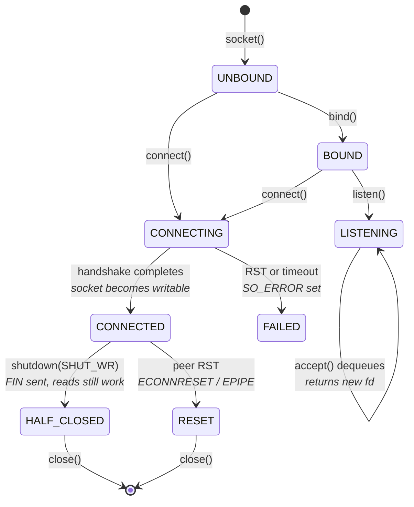
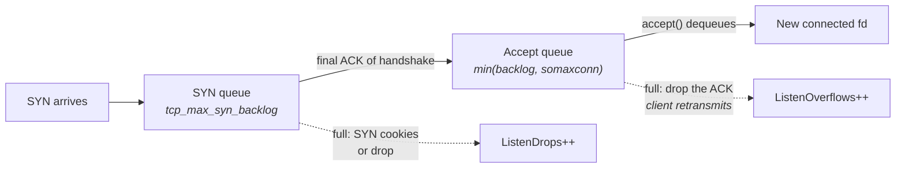
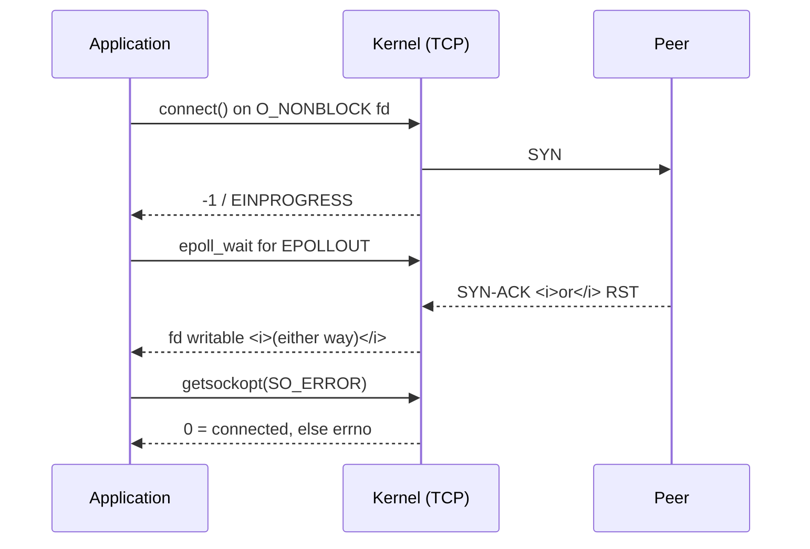
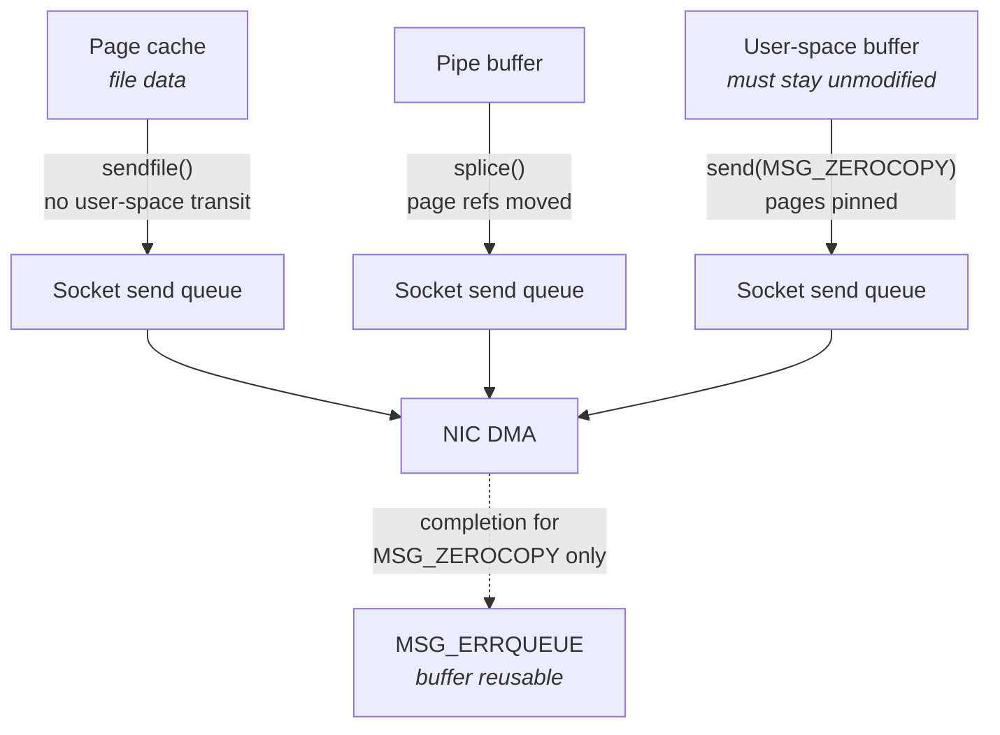
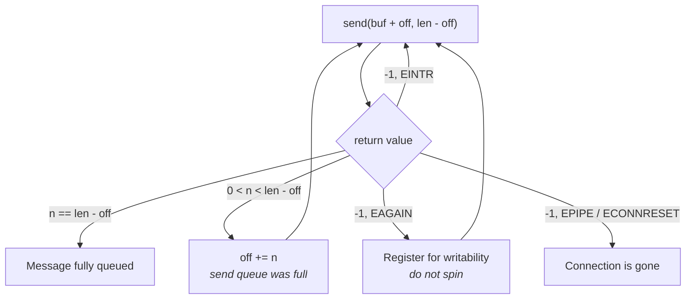
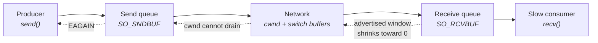

# Sockets Programming Model

You know what a socket is: a file descriptor that happens to talk to the network. That definition is
correct and almost useless, because it hides the thing that matters. A socket is not an object with
methods; it is a **state machine with two bounded queues attached**, and nearly every syscall you make
against it is a request to move data across the boundary between your address space and the kernel's,
under rules that change depending on which state the machine is in and which of about forty options
you have set on it.

The gap this chapter closes is the one between "I have called `send` before" and "I can predict what
`send` will do." The reader who has only written application code has, without noticing, been relying
on a chain of defaults: the socket blocks, so a full send buffer manifests as a pause rather than an
error; `SIGPIPE` kills the process, so a peer reset never has to be handled; Nagle's algorithm
coalesces small writes, so nobody notices that the application issues four writes per message. On a
general-purpose server those defaults are mostly fine. On a latency-critical path every one of them is
wrong, and the failure they produce is rarely a crash — it is a 40-millisecond stall, or a message
silently truncated, or a connection that appears healthy while its send queue grows without bound.

The socket API is also the last piece of software the kernel runs on your behalf before the packet
belongs to the network stack, and the first it runs after the stack hands a packet back. Chapter 14
("The Linux Networking Stack") covered what happens below the socket — the driver, the softirq, the
protocol processing, the `sk_buff`. Chapter 19 ("TCP In Depth") covered the protocol's own behavior on
the wire. This chapter covers the API surface itself: what each call promises, what it does *not*
promise, which options change the timing of the path, and the specific error semantics that experienced
engineers still get wrong. Treat it as an operating-system interface, not a programming exercise. The
questions to hold in mind throughout are: *how many times is this data copied, how many syscalls does
one message cost, and what happens when the other side stops reading?*

## The Socket API Surface and Its State Transitions

Start from what the descriptor actually refers to. When you call `socket(AF_INET, SOCK_STREAM, 0)`, the
kernel allocates three linked things: a `struct file` (the generic descriptor object shared with files
and pipes, described in "I/O Subsystems"), a `struct socket` (the protocol-independent layer), and a
`struct sock` (the protocol-specific control block — for TCP this is where the sequence numbers,
congestion window, timers, and both queues live). Your integer descriptor indexes a per-process table
that points at the first of those. Every syscall in this chapter is a lookup through that table
followed by a call into a protocol-specific operation vector.

The two queues are the part that a systems course usually skips. Each socket has a **receive queue**
(`sk_receive_queue`) holding data the stack has accepted but the application has not read, and a **send
queue** (`sk_write_queue` for TCP) holding data the application has written but the stack has not yet
finished transmitting *and having acknowledged*. Both are bounded — by `SO_RCVBUF` and `SO_SNDBUF`
respectively — and both bounds are accounted in kernel memory charged to the socket, not in payload
bytes. Almost every interesting behavior in this chapter is a consequence of one of those two queues
being full or empty at the moment a syscall arrives.

The critical mental correction is this: **`send` does not send, and `recv` does not receive.** `send`
copies bytes from your buffer into the socket's send queue and returns; whether a packet leaves the NIC
during that syscall depends on the congestion window, the receiver's advertised window, Nagle's
algorithm, and the qdisc — all covered in "TCP In Depth" and "The Linux Networking Stack." `recv`
copies bytes out of the receive queue that a softirq deposited there some time earlier, possibly
microseconds ago, possibly milliseconds. The syscall boundary and the wire are decoupled, and the whole
craft of low-latency socket work is about narrowing that decoupling and making it predictable.

### The call surface

Grouped by what they do rather than by man-page section:

| Call | Effect on socket state | Notes for latency work |
|---|---|---|
| `socket(domain, type, protocol)` | Creates unbound socket | `type` accepts `SOCK_NONBLOCK` and `SOCK_CLOEXEC` ORed in — saves two `fcntl` syscalls |
| `bind(fd, addr, len)` | Assigns local address/port | Required for servers; optional for clients, but binding a client explicitly avoids an ephemeral-port lookup later |
| `listen(fd, backlog)` | Passive open; creates the accept queue | `backlog` is clamped by `/proc/sys/net/core/somaxconn` |
| `connect(fd, addr, len)` | Active open; starts the handshake | Blocking by default; returns `EINPROGRESS` on a non-blocking socket |
| `accept(fd, addr, len)` | Dequeues one established connection | Returns a *new* descriptor; the listener keeps its own |
| `accept4(fd, addr, len, flags)` | Same, plus `SOCK_NONBLOCK`/`SOCK_CLOEXEC` atomically | Preferred — avoids a race and a syscall |
| `read`/`recv`/`recvfrom`/`recvmsg`/`recvmmsg` | Drains the receive queue | Increasing generality: flags, source address, control messages, batching |
| `write`/`send`/`sendto`/`sendmsg`/`sendmmsg` | Fills the send queue | Same progression |
| `readv`/`writev` | Vectored variants of `read`/`write` | Discussed under scatter-gather below |
| `shutdown(fd, how)` | Half-closes a direction | `SHUT_WR` sends FIN but keeps the descriptor and the read side alive |
| `close(fd)` | Drops the descriptor reference | Only closes the connection when the last reference goes; behavior depends on `SO_LINGER` |
| `getsockopt`/`setsockopt` | Reads/writes options at a protocol level | The subject of the next section |
| `getsockname`/`getpeername` | Reads local/remote address | The only way to learn the kernel-chosen ephemeral port |
| `fcntl(fd, F_SETFL, O_NONBLOCK)` | Toggles non-blocking mode | Read flags with `F_GETFL` first and OR — overwriting them clears others |
| `ioctl(fd, SIOCINQ / SIOCOUTQ, &n)` | Queue depth in bytes | `SIOCINQ` (a.k.a. `FIONREAD`) unread; `SIOCOUTQ` unsent+unacked |

Two of those deserve emphasis immediately because they are the ones people misuse. `accept` returns a
**new** descriptor with its own options — it does *not* inherit most socket options from the listener,
and notably on Linux it does *not* inherit `O_NONBLOCK`. Code that sets the listener non-blocking and
assumes the accepted socket is too has a latent blocking call in it. Use `accept4` with
`SOCK_NONBLOCK`. And `close` is a descriptor operation, not a connection operation: if the descriptor
was duplicated by `fork` or `dup`, the connection stays open until every copy is closed, which is a
classic source of connections stuck in `CLOSE_WAIT` on a server that "definitely closed them."

### The state machine you actually program against

TCP's own eleven-state machine is covered in "TCP In Depth." The one you program against is smaller and
different: it describes what the *API* will let you do, and it maps onto the protocol states only
loosely. The diagram below is the API view.



- **The `CONNECTING` → `CONNECTED` edge is the one that trips people**: on a non-blocking socket, the
  only portable signal is the descriptor becoming writable, and writability alone does not mean
  success — it means "the handshake finished, one way or the other."
- **`HALF_CLOSED` is a real, useful state**: `shutdown(SHUT_WR)` sends a FIN so the peer sees
  end-of-stream and can flush, while you continue reading its response. `close` cannot express this.
- **`RESET` is not entered by a syscall you made** — it is entered by a packet arriving, and you only
  discover it on your next read or (often) your *second* write.

A parallel picture is worth drawing for the server side, because the "accept queue" is genuinely two
queues and confusing them wastes hours of debugging. A SYN arriving at a listening socket creates a
half-open entry in the SYN queue (bounded by `net.ipv4.tcp_max_syn_backlog`); when the handshake's
final ACK arrives, the connection moves to the accept queue (bounded by `min(backlog, somaxconn)`),
where it sits, fully established, until the application calls `accept`.



- **Connections in the accept queue are already established from the peer's point of view** — the
  client believes the connection is up and may already have sent data, which is why accept-queue delay
  shows up as first-message latency rather than as a connection failure.
- **Accept-queue overflow is silent to the server**: the kernel drops the ACK, the client's stack
  retransmits after a retransmission timeout of roughly one second, and the connection eventually
  succeeds — looking, from the client, like a mysterious one-second connect.

**Failure mode: connections take exactly ~1 s or ~3 s to establish under bursts.** Symptom is a
bimodal connect-latency distribution with modes at retransmission-timeout boundaries. Cause is
accept-queue overflow — the application was not in `accept` when the handshake completed. Confirm with
`nstat -az TcpExtListenOverflows` before and after, and with `ss -lnt`, where for a *listening* socket
`Recv-Q` is the current accept-queue depth and `Send-Q` is its configured maximum. If `Recv-Q` is
sitting at `Send-Q`, you have found it. The fixes are a larger `backlog` (after raising
`/proc/sys/net/core/somaxconn`), a dedicated accept thread, or both.

**Failure mode: descriptors accumulate in `CLOSE_WAIT` on a server that closes every connection.**
Cause is a duplicated descriptor — `fork` after `accept`, or a `dup` in a logging path — so the
connection's reference count never reaches zero and no FIN is sent. Confirm with `ss -tan state
close-wait` to count them, then `ls -l /proc/<pid>/fd | grep socket` across every process on the box to
find who else holds the same socket inode.

**Try it:** watch the two queues separately. Start a listener with a small backlog and no `accept`
loop, then open connections to it faster than it drains them. Run `ss -lnt` and watch `Recv-Q` climb to
`Send-Q` and stop; then run `nstat -az | grep -i listen` and confirm `TcpExtListenOverflows` rising in
step. Now set `sysctl -w net.ipv4.tcp_abort_on_overflow=1` and repeat: instead of silent drops and
one-second client retries, clients get an immediate RST. Neither behavior is universally right — the
point is to see that the choice exists and that the default hides the problem.

**Try it:** confirm the syscall/wire decoupling directly. Run `strace -tt -T -e trace=%network` against
a trivial client that connects and sends one small message, alongside `tcpdump -ttt -i any port <p>` on
the same host. Line up the timestamps: `sendto` returns long before the segment appears, and on a
freshly opened connection the first data segment may wait for the handshake to finish. The `-T` column
is the time spent *inside* the syscall, which is the only part of the path your application controls.

## Socket Options That Matter for Latency

`setsockopt` is a strange API: a single entry point into dozens of unrelated knobs, addressed by a
`(level, optname)` pair, each with its own argument type and its own quiet failure modes. The level is
which layer of the stack owns the option — `SOL_SOCKET` for the generic socket layer, `IPPROTO_TCP`
for TCP-specific behavior, `IPPROTO_IP`/`IPPROTO_IPV6` for the network layer. Getting the level wrong
returns `ENOPROTOOPT`; getting the *size* wrong is worse, because the kernel may silently accept a
truncated value.

Two general behaviors apply across many options and cause more confusion than any individual knob.
First, **several options are clamped rather than rejected**: you ask for a 64 MiB receive buffer, the
kernel clamps it to `net.core.rmem_max`, and `setsockopt` returns success. Second, **buffer sizes are
doubled**: `SO_RCVBUF` and `SO_SNDBUF` store twice what you pass, because the kernel reserves roughly
half for per-packet accounting overhead. The consequence is a rule that should be reflexive: **always
read the value back with `getsockopt` after setting it.** If your code sets an option and never
verifies it, you do not know what your socket is configured to do.

The third general point concerns *when* options take effect. Options that influence the handshake —
buffer sizes affecting the advertised window scale factor, `TCP_MAXSEG`, `TCP_FASTOPEN_CONNECT` — must
be set on the socket *before* `connect` or `listen`, because the handshake is where those values are
negotiated. Options that affect steady-state behavior can be set later. And options set on a listening
socket are inherited by accepted sockets only for a specific subset; the reliable practice is to set
per-connection options explicitly on each accepted descriptor.

### The reference table

This is the section to return to. Options are grouped by what they control, with the level, the
argument, and the effect that matters for a latency-sensitive path.

**Buffer sizing and queue depth**

| Level / Option | Argument | Effect and latency relevance |
|---|---|---|
| `SOL_SOCKET` / `SO_RCVBUF` | `int` bytes | Bound on the receive queue, accounted in `skb->truesize` not payload. Value is doubled and clamped by `net.core.rmem_max`. Setting it explicitly **disables TCP receive-buffer autotuning** for that socket. Sizing is a burst-absorption calculation (see "The Linux Networking Stack") |
| `SOL_SOCKET` / `SO_SNDBUF` | `int` bytes | Bound on the send queue. Doubled; clamped by `net.core.wmem_max`. Large values *hide* backpressure and add queueing delay inside your own host |
| `SOL_SOCKET` / `SO_RCVBUFFORCE`, `SO_SNDBUFFORCE` | `int` bytes | Same, but bypasses the `rmem_max`/`wmem_max` clamp. Requires `CAP_NET_ADMIN` |
| `SOL_SOCKET` / `SO_RCVLOWAT` | `int` bytes | Minimum bytes before `select`/`poll`/`epoll` report the socket readable (honoured for readiness since Linux 2.6.28). Lets a message-framed reader avoid waking on partial messages |
| `SOL_SOCKET` / `SO_SNDLOWAT` | `int` | **Not changeable on Linux** — always 1. Listed because interview questions and portable code both reference it |
| `IPPROTO_TCP` / `TCP_NOTSENT_LOWAT` | `int` bytes | Report the socket writable only when **unsent** bytes in the send queue fall below this. The correct tool for keeping your own send queue shallow without shrinking `SO_SNDBUF` |

**Latency and coalescing behavior**

| Level / Option | Argument | Effect and latency relevance |
|---|---|---|
| `IPPROTO_TCP` / `TCP_NODELAY` | `int` bool | Disables Nagle's algorithm — send small segments immediately instead of waiting for an outstanding ACK. Effectively mandatory on request/response paths; mechanism and the delayed-ACK interaction are in "TCP In Depth" |
| `IPPROTO_TCP` / `TCP_QUICKACK` | `int` bool | Temporarily disables delayed ACKs. **Not sticky** — the kernel re-enters delayed-ACK mode based on traffic pattern, so it must be re-set, which costs a syscall each time |
| `IPPROTO_TCP` / `TCP_CORK` | `int` bool | The opposite of `TCP_NODELAY`: hold partial segments to build full ones, for up to ~200 ms. A throughput option; on a hot path it is a stall generator |
| `IPPROTO_TCP` / `TCP_MAXSEG` | `int` bytes | Advertises a maximum segment size at handshake time. Rarely useful except to work around path-MTU problems (see "IP and the Network Layer") |
| `IPPROTO_TCP` / `TCP_CONGESTION` | string | Selects the congestion control algorithm for this socket, e.g. `"cubic"`, `"bbr"`, `"reno"`. Only algorithms listed in `/proc/sys/net/ipv4/tcp_available_congestion_control` are accepted |
| `IPPROTO_TCP` / `TCP_THIN_LINEAR_TIMEOUTS` | `int` bool | For connections with few packets in flight, retransmit linearly instead of with exponential backoff — reduces recovery time on sparse, latency-sensitive streams |

**Polling, steering, and wakeup**

| Level / Option | Argument | Effect and latency relevance |
|---|---|---|
| `SOL_SOCKET` / `SO_BUSY_POLL` | `int` µs | Spin in the driver's poll routine for this many microseconds inside a blocking receive rather than sleeping. Removes the interrupt and wakeup from the receive path at the cost of a burning core. Requires `CAP_NET_ADMIN`; default comes from `net.core.busy_read`. Mechanism in "The Linux Networking Stack" |
| `SOL_SOCKET` / `SO_PREFER_BUSY_POLL` | `int` bool | (Linux 5.11+) Lets busy polling take priority over the NAPI softirq path, reducing interference between the two |
| `SOL_SOCKET` / `SO_BUSY_POLL_BUDGET` | `int` | (Linux 5.11+) Packets processed per busy-poll iteration |
| `SOL_SOCKET` / `SO_REUSEPORT` | `int` bool | Multiple sockets bind the same address/port; the kernel hashes incoming flows across them. The basis for per-core accept and per-core receive. Must be set on every socket *before* `bind` |
| `SOL_SOCKET` / `SO_ATTACH_REUSEPORT_CBPF`, `SO_ATTACH_REUSEPORT_EBPF` | program fd/bytecode | Replace the default hash with your own selection logic across a `SO_REUSEPORT` group — e.g. steer a flow to the socket whose reader is pinned to the core that handled its softirq |
| `SOL_SOCKET` / `SO_INCOMING_CPU` | `int` | Read: which CPU last processed a packet for this socket. Write: a hint used when selecting among `SO_REUSEPORT` sockets |
| `SOL_SOCKET` / `SO_INCOMING_NAPI_ID` | `int` (get) | Identifies the NAPI/receive-queue context that delivered the last packet — the durable identifier for building queue-to-thread affinity |

**Addressing, binding, and lifetime**

| Level / Option | Argument | Effect and latency relevance |
|---|---|---|
| `SOL_SOCKET` / `SO_REUSEADDR` | `int` bool | For TCP, allows `bind` to a local port that has connections in `TIME_WAIT`. Does **not** permit two live listeners on the same address — that is `SO_REUSEPORT`. For UDP multicast, allows several sockets to bind the same group/port |
| `SOL_SOCKET` / `SO_LINGER` | `struct linger` | Controls `close`. `l_onoff=0` (default): `close` returns immediately, kernel flushes in background. `l_onoff=1, l_linger>0`: `close` blocks until data is acknowledged or the timer expires. `l_onoff=1, l_linger=0`: **discard the send queue and send RST** — the standard way to tear down without `TIME_WAIT` |
| `SOL_SOCKET` / `SO_BINDTODEVICE` | interface name | Pins the socket to one interface regardless of the routing table. Requires `CAP_NET_RAW`. Useful on multihomed hosts where routing is not the arbiter you want |
| `SOL_SOCKET` / `SO_KEEPALIVE` | `int` bool | Enables TCP keepalives; tuned per-socket with `TCP_KEEPIDLE`, `TCP_KEEPINTVL`, `TCP_KEEPCNT` (all `IPPROTO_TCP`, seconds/count) |
| `IPPROTO_TCP` / `TCP_USER_TIMEOUT` | `int` ms | How long unacknowledged data may remain outstanding before the connection is aborted. **The fastest and most direct failure detector** — it acts on real transmitted data, unlike keepalives which only probe an idle connection |
| `IPPROTO_TCP` / `TCP_SYNCNT` | `int` | Number of SYN retransmits before `connect` fails. Bounds connect-failure detection time |
| `IPPROTO_TCP` / `TCP_DEFER_ACCEPT` | `int` s | The connection is not handed to `accept` until data arrives. Saves a wakeup for protocols where the client always speaks first |
| `IPPROTO_TCP` / `TCP_FASTOPEN`, `TCP_FASTOPEN_CONNECT` | `int` | Carry payload in the SYN, saving one RTT on reconnect. Requires cooperation from the peer and from middleboxes |
| `IPPROTO_TCP` / `TCP_LINGER2` | `int` s | How long an orphaned connection stays in `FIN_WAIT_2` |

**Observation and timestamping**

| Level / Option | Argument | Effect and latency relevance |
|---|---|---|
| `SOL_SOCKET` / `SO_ERROR` | `int` (get only) | Reads **and clears** the pending socket error. The only way to find out whether a non-blocking `connect` succeeded |
| `SOL_SOCKET` / `SO_TYPE`, `SO_DOMAIN`, `SO_PROTOCOL`, `SO_ACCEPTCONN` | `int` (get only) | Introspection — useful in a library that is handed a descriptor it did not create |
| `IPPROTO_TCP` / `TCP_INFO` | `struct tcp_info` (get) | The single richest diagnostic on a TCP socket: RTT estimate and variance, congestion window, retransmit counts, bytes acked, unsent bytes, receive window. This is exactly what `ss -ti` prints |
| `IPPROTO_TCP` / `TCP_INQ` | `int` bool | Makes `recvmsg` return the number of remaining unread bytes as a control message, so a reader learns "there is more" without a separate `ioctl` |
| `SOL_SOCKET` / `SO_TIMESTAMPING` | `int` flag mask | Requests hardware or software transmit/receive timestamps, delivered as control messages (transmit timestamps arrive via the error queue). The basis of wire-to-wire measurement; mechanism and flag meanings in "The Linux Networking Stack" |
| `SOL_SOCKET` / `SO_TIMESTAMPNS` | `int` bool | Simpler nanosecond software receive timestamps as an `SCM_TIMESTAMPNS` control message |

**Prioritization and zero-copy**

| Level / Option | Argument | Effect and latency relevance |
|---|---|---|
| `SOL_SOCKET` / `SO_PRIORITY` | `int` | Sets the `skb` priority used for qdisc class selection — how you steer traffic into a priority band (see "The Linux Networking Stack") |
| `SOL_SOCKET` / `SO_MARK` | `int` | Attaches a firewall/routing mark for policy routing. Requires `CAP_NET_ADMIN` |
| `IPPROTO_IP` / `IP_TOS`, `IPPROTO_IPV6` / `IPV6_TCLASS` | `int` | DSCP marking for switch-level QoS (see "IP and the Network Layer") |
| `SOL_SOCKET` / `SO_ZEROCOPY` | `int` bool | Enables the use of the `MSG_ZEROCOPY` send flag on this socket. Covered below |
| `IPPROTO_TCP` / `TCP_ZEROCOPY_RECEIVE` | struct (get) | Receive-side zero copy: the kernel maps received pages into your address space instead of copying. Requires page-aligned, MSS-aligned data flow to be usable |

**Timeouts on the calls themselves**

| Level / Option | Argument | Effect and latency relevance |
|---|---|---|
| `SOL_SOCKET` / `SO_RCVTIMEO`, `SO_SNDTIMEO` | `struct timeval` | Bound how long a *blocking* call waits before returning `EAGAIN`. Convenient for control-plane sockets; irrelevant on a non-blocking hot path, and a partial `send` can still occur on timeout |

**Failure mode: `SO_RCVBUF` is set to a large value and the socket still drops.** Symptom is loss under
burst despite an apparently generous buffer. Two causes stack: the value was clamped to
`net.core.rmem_max`, and the accounting is against `skb->truesize`, so a 100-byte datagram may consume
2 KiB of the budget. Confirm by reading the size back with `getsockopt(SO_RCVBUF)` — expect roughly
double what you asked for if it was accepted, and exactly `2 × rmem_max` if it was clamped — and by
watching `UdpRcvbufErrors` in `nstat -az`.

**Failure mode: options set on the listener do not appear on accepted connections.** Symptom is a
server whose first connection behaves correctly in tests but whose production connections show Nagle
delays. Cause is assuming inheritance. Confirm by calling `getsockopt(fd, IPPROTO_TCP, TCP_NODELAY,
…)` on an accepted descriptor and comparing to the listener. Set per-connection options explicitly
after `accept4`.

**Failure mode: 40 ms stalls on a request/response protocol.** Cause is the Nagle/delayed-ACK
interaction, usually triggered by an application that writes a message in two pieces (header then
body). Confirm with `strace -T` showing two `send` calls per message and `tcpdump` showing the second
segment delayed. The fix is `TCP_NODELAY` *plus* coalescing the two writes into one `writev` — the
protocol analysis is in "TCP In Depth," and the API-side fix is in the scatter-gather section below.

**Try it:** build a habit of verification. Write a shell-free test that sets `SO_SNDBUF` to 1 MiB and
immediately reads it back, on a machine where `net.core.wmem_max` is at its default. Then raise the
sysctl with `sysctl -w net.core.wmem_max=8388608` and repeat. Watching the same code produce two
different socket configurations on two machines is the fastest cure for trusting `setsockopt`'s return
value.

**Try it:** read a live connection's internals. Start any TCP transfer and run `ss -tim` against it.
The `-i` block is `TCP_INFO` rendered as text: `rtt:` is the smoothed round-trip estimate and its
variance, `cwnd:` the congestion window in segments, `retrans:` current and cumulative retransmits,
`bytes_acked`, and `unacked`. The `-m` block is socket memory: `skmem:(r…,rb…,t…,tb…)` gives receive
queue used and its bound, transmit queue used and its bound. Learning to read one `ss -tim` line is
worth more in a debugging session than any amount of application logging.

## Blocking Versus Non-Blocking Connect and Accept

Blocking is the default for a reason: it is the simplest correct behavior. A blocking `recv` on an
empty socket puts the calling thread to sleep on a wait queue; when a packet arrives, the softirq that
delivers it also wakes the thread, and the scheduler eventually runs it. The cost of that path is the
part that a general-purpose engineer has never had to think about. The wakeup itself involves a
cross-core interrupt if the waking core differs from the sleeping thread's core, a scheduler run-queue
insertion, and then whatever delay separates "runnable" from "running" — which depends on what else is
on that core. Even on a tuned box this is comfortably in the **microseconds**, and its *variance* is
much worse than its median because it is at the mercy of the scheduler (see "Processes, Threads, and
Scheduling").

That is the real argument for non-blocking sockets on a hot path, and it is not the one usually given.
Non-blocking mode is not primarily about handling many connections in one thread — `epoll` does that,
and `epoll_wait` blocks. It is about **never entering the sleep/wake path at all**: a thread that
polls a set of non-blocking descriptors in a loop stays running, keeps its cache and TLB state warm
(see "The Cache Hierarchy"), and converts "wake me when data arrives" into "check whether data has
arrived," which costs a syscall or, with busy polling, nothing beyond the check. The trade is a core
burned continuously — a real cost that "Kernel Bypass" revisits.

A non-blocking socket changes the contract of every operation on it: instead of waiting, the call
performs whatever it can do immediately and returns, using `EAGAIN` (identical to `EWOULDBLOCK` on
Linux) to mean "nothing to do right now, try again when readiness says so." Set it either at creation
with `SOCK_NONBLOCK` in the `socket` type argument, at accept with `accept4`, or afterwards with
`fcntl` — reading the existing flags first, because `F_SETFL` replaces the whole flag word.

| Operation | Blocking behavior | Non-blocking behavior |
|---|---|---|
| `connect` | Returns when the handshake completes or fails; can block for seconds | Returns `-1`/`EINPROGRESS` immediately; completion signalled by writability |
| `accept` | Sleeps until a connection is on the accept queue | Returns `-1`/`EAGAIN` if the queue is empty |
| `recv` | Sleeps until at least one byte is available | Returns `-1`/`EAGAIN` on an empty receive queue |
| `send` | Sleeps until *all* bytes fit in the send queue (for TCP) | Copies what fits, returns that count; `-1`/`EAGAIN` if nothing fits |
| `close` | Returns immediately unless `SO_LINGER` says otherwise | Never blocks, even with `SO_LINGER` set |

### Non-blocking connect

`connect` is the awkward case, because it is the one call whose non-blocking form requires a
follow-up. The handshake takes at least one round trip, so a non-blocking `connect` cannot report
success synchronously. It returns `-1` with `errno == EINPROGRESS`, and the kernel continues the
handshake in the background. The socket then becomes **writable** when the handshake resolves — and
this is the trap — *whether it succeeded or failed*. A connection refused by an RST also makes the
descriptor writable.

The disambiguation is `getsockopt(fd, SOL_SOCKET, SO_ERROR, …)`. It returns zero if the connection is
established, or the errno value (`ECONNREFUSED`, `ETIMEDOUT`, `EHOSTUNREACH`, `ENETUNREACH`) if it
failed. It also **clears** the pending error, so read it exactly once. This is the one syscall
sequence in the chapter that cannot be described honestly without code:

```c
int rc = connect(fd, addr, len);          /* rc == -1, errno == EINPROGRESS */
/* ... wait for fd to become writable via epoll/poll ... */
int err; socklen_t l = sizeof err;
getsockopt(fd, SOL_SOCKET, SO_ERROR, &err, &l);  /* err == 0 means connected */
```



- **Writability is not success** — the `getsockopt(SO_ERROR)` step is mandatory, and omitting it
  produces a client that cheerfully writes into a connection that was refused.
- **The failure path can be slow by default**: an unanswered SYN is retransmitted with exponential
  backoff, so an unreachable host can take over two minutes to report `ETIMEDOUT`. `TCP_SYNCNT` bounds
  the number of SYN retransmits and therefore the detection time.
- **Connect latency has a floor of one RTT** and no ceiling worth trusting; treat connection setup as a
  cold-path operation and establish connections before you need them.

### Non-blocking accept

`accept` on a non-blocking listener returns `EAGAIN` when the queue is empty. Two subtleties matter
beyond that.

The first is that **`accept` can fail with errors that belong to the connection, not to the listener**.
`ECONNABORTED` means the peer reset the connection after the handshake completed but before you
accepted it — the entry was in the accept queue and is now gone. This is a normal, expected occurrence
on a public-facing listener, and it must be treated as "continue the loop," not as a fatal error. Under
Linux, `accept` may also return errors already pending on the new connection.

The second concerns edge-triggered readiness. Under level-triggered `epoll`, one `accept` per event is
correct: if more connections remain, the next `epoll_wait` reports readiness again. Under
edge-triggered, an event means "the queue transitioned from empty to non-empty," and if three
connections arrived between polls you get **one** event. You must loop on `accept` until `EAGAIN`, or
connections will sit in the queue indefinitely, waiting for another arrival to generate an edge (the
level/edge distinction itself is covered in "I/O Subsystems").

**Failure mode: a client hangs for two minutes on a connection to a down host.** Cause is default SYN
retransmission with exponential backoff. Confirm with `tcpdump` showing SYNs at roughly 1, 3, 7, 15…
second intervals, and by reading `/proc/sys/net/ipv4/tcp_syn_retries`. The per-socket fix is
`TCP_SYNCNT`; the application-level fix is an explicit deadline enforced by whatever runs your event
loop.

**Failure mode: an edge-triggered server accepts one connection per burst and stalls the rest.**
Symptom is connections that establish and then sit idle until the *next* client arrives. Cause is a
single `accept` per `EPOLLIN` edge. Confirm with `ss -lnt` showing a persistently non-zero `Recv-Q` on
the listener while the process is idle. The fix is to loop until `EAGAIN`.

**Failure mode: a client treats a refused connection as established.** Symptom is a write that returns
success followed by an inexplicable `EPIPE` or `ECONNRESET`. Cause is skipping
`getsockopt(SO_ERROR)` after a writable non-blocking `connect`. Confirm with `strace` — the absence of
the `getsockopt` call is the whole diagnosis.

**Try it:** demonstrate the writable-on-failure semantics. Attempt a non-blocking `connect` to a port
on `127.0.0.1` where nothing is listening, register the descriptor for `EPOLLOUT`, and observe that
`epoll_wait` returns promptly with the descriptor writable. Then call `getsockopt(SO_ERROR)` and print
the value — `ECONNREFUSED`. Call it a second time and observe zero: the error was consumed.

**Try it:** measure the wakeup cost that motivates non-blocking mode. Run a ping-pong between two
processes over a loopback TCP socket, first with blocking `recv` on both sides, then with a
busy-polling non-blocking loop on both sides, then with `SO_BUSY_POLL` set on a real NIC. Record the
p50 and p99 round-trip times for each. The p50 gap shows the cost of the sleep/wake path; the p99 gap
shows its variance, which is the larger number and the real reason for the technique.

## Zero-Copy Paths

Count the copies on a conventional TCP send. Your application has data in a user-space buffer. `send`
copies it into kernel memory attached to an `sk_buff`. The NIC then DMAs it from there onto the wire.
That is one CPU copy — the DMA is not a CPU copy — and on the receive side it is symmetric: the NIC
DMAs into a kernel buffer, and `recv` copies from there into your buffer.

For a 200-byte message, that copy is irrelevant: it is a handful of cache-line moves, tens of
nanoseconds, dwarfed by the syscall and the protocol processing. For a 64 KiB message it is a
different story. Copying 64 KiB at a realistic single-core memory bandwidth of a few gigabytes per
second is on the order of ten microseconds of pure CPU, plus the cache pollution of pushing 64 KiB of
data through L1 and L2 and evicting whatever was there — which slows down everything the core does
next (see "The Cache Hierarchy"). **Zero-copy is a bulk-transfer optimization.** The single most
common mistake with it is applying it to small messages, where it is reliably *slower* than a copy.

Linux offers three mechanisms with genuinely different shapes, and choosing between them is a matter
of where the data lives.



- **`sendfile` and `splice` move data that is already in the kernel** — they never bring it into your
  address space, so there is nothing to synchronize.
- **`MSG_ZEROCOPY` sends data that is in your address space**, which is why it alone needs a completion
  notification: you must not touch the buffer until the kernel says the NIC is done with it.

### `sendfile`

`sendfile(out_fd, in_fd, offset, count)` copies between two descriptors entirely inside the kernel.
Historically `in_fd` had to be a regular file and `out_fd` a socket; since Linux 2.6.33 `out_fd` may be
any file. The data path is: page cache → socket send queue, with only page references moving. No user
buffer, no syscall per chunk beyond the one, no cache pollution from a copy.

Its constraint is that the data must already be a file. It is the right answer for serving static
content, shipping a log segment, or replaying a captured file to a socket. It is not applicable when
your bytes were just computed in memory.

### `splice`

`splice(fd_in, off_in, fd_out, off_out, len, flags)` generalizes the idea using a **pipe as the
intermediary**: one of the two descriptors must be a pipe. It moves page references from one buffer
into the pipe, then from the pipe into the destination. This makes socket-to-socket forwarding possible
without ever touching the payload — the classic proxy case — at the cost of two syscalls and a pipe
descriptor pair.

| Flag | Meaning |
|---|---|
| `SPLICE_F_MOVE` | Hint to move pages rather than copy (advisory; the kernel may ignore it) |
| `SPLICE_F_NONBLOCK` | Do not block on the pipe; return `EAGAIN` |
| `SPLICE_F_MORE` | More data follows — same hint as `MSG_MORE`, lets the stack build full segments |

There is also `vmsplice`, which maps user pages into a pipe. With `SPLICE_F_GIFT` you donate the pages
to the kernel, and must never touch or free them again. This is sharp enough that it is rarely the
right choice outside specialized data movers.

### `MSG_ZEROCOPY`

This is the one that applies to data you generated yourself. Enable it per socket with
`setsockopt(SOL_SOCKET, SO_ZEROCOPY, 1)`, then pass `MSG_ZEROCOPY` to `send`/`sendmsg`. Instead of
copying, the kernel pins your pages and builds the `sk_buff` to reference them directly.

The consequence is an ownership problem that does not exist anywhere else in the socket API. `send`
returns as usual, but **your buffer is still in use by the kernel and possibly by the NIC**. You may
not modify or free it until the kernel says so. The notification arrives asynchronously on the
socket's **error queue**: you call `recvmsg` with the `MSG_ERRQUEUE` flag and read a `sock_extended_err`
control message with origin `SO_EE_ORIGIN_ZEROCOPY`, whose `ee_info` and `ee_data` fields delimit a
*range* of send sequence numbers now complete. Completions are batched and can arrive out of order
relative to sends, so the application must track outstanding buffers by sequence number.

Two further details decide whether it is worth using at all. First, the kernel may **silently fall back
to copying** — if the pages cannot be pinned, or the device or protocol path cannot handle it. It
signals this by setting `ee_code` to `SO_EE_CODE_ZEROCOPY_COPIED` in the completion, and you should
count those: a workload that always falls back has paid all of the complexity and received none of the
benefit. Second, the mechanism has a fixed cost — pinning pages, accounting, and reading the error
queue is itself a syscall — so it only pays above roughly **10 KB per send**, and the kernel
documentation is explicit that below that threshold it is a pessimization. `MSG_ZEROCOPY` was
introduced for TCP in Linux 4.14 and extended to UDP in 5.0.

| Mechanism | Source of data | Destination | Copies removed | When it applies |
|---|---|---|---|---|
| `sendfile` | Regular file (page cache) | Socket (or any file, 2.6.33+) | User-space transit entirely | Serving files, shipping logs |
| `splice` | Any fd, via a pipe | Any fd, via a pipe | User-space transit entirely | Proxying, socket-to-socket forwarding |
| `vmsplice` | User pages → pipe | — | The copy into the pipe | Specialized; `SPLICE_F_GIFT` surrenders the pages |
| `send(MSG_ZEROCOPY)` | User buffer | Socket | The user→kernel copy on send | Large, computed payloads (≳10 KB) |
| `TCP_ZEROCOPY_RECEIVE` | Socket | User address space (mapped) | The kernel→user copy on receive | Bulk receive with page-aligned, MSS-aligned flow |

The honest summary for a latency-critical path: **most hot paths send small messages and get nothing
from zero copy.** The copy they would eliminate costs tens of nanoseconds; the syscall around it costs
an order of magnitude more. Zero copy earns its place on the *bulk* side of a system — snapshot
delivery, historical replay, file service — where the copy is microseconds and the cache pollution is
real. Reaching for `MSG_ZEROCOPY` on a 100-byte message is a reliable way to make a system both slower
and harder to reason about.

**Failure mode: data sent with `MSG_ZEROCOPY` arrives corrupted.** Symptom is intermittent garbage on
the receiver, correlated with buffer reuse rate. Cause is modifying or freeing a buffer before its
completion notification arrived. Confirm by draining `MSG_ERRQUEUE` and checking that every send
sequence number is accounted for before its buffer is recycled; a reproduction with a deliberately
delayed reuse that makes the corruption disappear is conclusive.

**Failure mode: `MSG_ZEROCOPY` is enabled but performance is unchanged or worse.** Cause is either
message sizes below the ~10 KB threshold, or silent fallback to copying. Confirm by counting
completions whose `ee_code` has `SO_EE_CODE_ZEROCOPY_COPIED` set — if that is most of them, the
zero-copy path is not being taken and you are paying only its overhead.

**Try it:** quantify the copy you would be removing. Send a fixed total volume — say 1 GiB — over a
loopback TCP socket in three configurations: 200-byte writes, 64 KiB writes, and 64 KiB writes with
`MSG_ZEROCOPY`. Measure with `perf stat -e task-clock,cache-misses` on the sender. The 200-byte case
is dominated by syscalls; the 64 KiB case shows the copy in `task-clock` and the cache pollution in
`cache-misses`; the zero-copy case should reduce both, and the delta is exactly what the mechanism is
worth on your hardware.

**Try it:** watch `sendfile` in a trace. Serve a large file over a socket with and without `sendfile`
and compare `strace -c` output. The non-`sendfile` path shows paired `read`/`write` calls scaling with
file size; the `sendfile` path shows a small constant number of calls. Then compare `perf stat`
`task-clock` between the two — the difference is CPU you did not have to spend.

## Scatter-Gather I/O

Consider a message with a fixed header and a variable body, held in separate buffers. Three obvious
approaches exist and all three are worse than they look. Writing the header and then the body is two
syscalls, and — before `TCP_NODELAY` — two segments and a possible delayed-ACK stall. Copying both into
one contiguous staging buffer costs a memory copy and, on a hot path, quite possibly an allocation.
Designing the protocol so the header and body are always adjacent constrains every layer above.

**Scatter-gather I/O** removes the choice. Instead of one buffer pointer and one length, you pass an
array of (pointer, length) pairs, and the kernel walks the array as though it were one contiguous
region. On the write side this is *gather*: several buffers become one byte stream. On the read side it
is *scatter*: one byte stream is distributed into several buffers, filled in order, each completely
before the next begins.

```c
struct iovec {
    void  *iov_base;   /* start of buffer */
    size_t iov_len;    /* bytes in buffer */
};
```

The interface is worth internalizing because it changes the arithmetic of the hot path. A message
composed of a 16-byte header, a 40-byte fixed section, and a variable payload costs **one** syscall
and **zero** staging copies. That is the difference between roughly 1–2 µs and 3–6 µs on a modern x86
server for the same logical operation, and — more importantly — it removes two failure modes at once:
the Nagle interaction that comes from writing a message in pieces, and the risk that a partial write
lands between the header and the body, leaving the peer's framing to be resynchronized.

| Call | Buffers | Address | Control messages | Batching |
|---|---|---|---|---|
| `read` / `write` | One | Connected peer | No | No |
| `readv` / `writev` | Vector | Connected peer | No | No |
| `recv` / `send` | One | Connected peer | No | No — but takes flags |
| `recvfrom` / `sendto` | One | Explicit (datagram) | No | No |
| `recvmsg` / `sendmsg` | Vector | Explicit | **Yes** (`msg_control`) | No |
| `recvmmsg` / `sendmmsg` | Vector, per message | Explicit, per message | Yes | **Yes** — many messages, one syscall |

`sendmsg`/`recvmsg` are the full-generality forms and are the ones that matter beyond gathering,
because they carry **control messages** (ancillary data, `cmsg`). This is the channel through which the
kernel delivers hardware timestamps (`SCM_TIMESTAMPING`), packet metadata such as the receiving
interface (`IP_PKTINFO`), `TCP_INQ`'s remaining-bytes hint, `MSG_ZEROCOPY` completions on the error
queue, and file-descriptor passing over Unix sockets (`SCM_RIGHTS`, see "Synchronization and IPC").
Anything a hardware-timestamped receive path needs comes through `recvmsg`; there is no simpler call
that can deliver it.

`recvmsg` also returns flags in `msg_flags`, and two of them are frequently ignored to the reader's
cost:

- **`MSG_TRUNC`** — the datagram was larger than the supplied buffers and the excess was discarded.
  For UDP this is silent data loss unless you check.
- **`MSG_CTRUNC`** — the control-message buffer was too small, so ancillary data was dropped. A
  timestamping receiver that forgets this gets messages with no timestamps and no error.

The batching forms, `sendmmsg` and `recvmmsg`, amortize the syscall over many messages: you pass an
array of `struct mmsghdr`, each wrapping one `msghdr`, and each element's `msg_len` is filled in with
that message's transferred byte count. For a UDP receiver handling hundreds of thousands of small
datagrams per second, this is a large throughput win. It is also, and this is the point that matters
here, a **latency trade**: the first message in a batch waits for the syscall to be issued, and
`recvmmsg` with a timeout can hold early messages while waiting for later ones. Batching and latency
pull in opposite directions (a theme "Systematic Optimization" develops at length). On a hot path,
prefer `recvmmsg` with a large array and *no* timeout, so it returns immediately with whatever is
available rather than waiting to fill.

Two practical limits. The iovec array is capped at `IOV_MAX` entries — 1024 on Linux, queryable with
`sysconf(_SC_IOV_MAX)`; exceeding it yields `EINVAL`. And the kernel must copy the iovec array itself
in from user space on every call, so a vector of 500 tiny buffers is not free: the per-entry overhead
eventually exceeds what a staging copy would have cost. In practice a handful of entries is where the
technique pays.

**Failure mode: a UDP receiver silently loses the tails of large datagrams.** Symptom is malformed
messages that correlate with size. Cause is an undersized receive buffer with `MSG_TRUNC` unchecked.
Confirm by inspecting `msg_flags` after `recvmsg`, or by passing `MSG_TRUNC` as an *input* flag to
`recv`, which makes the return value the true datagram length rather than the truncated one — if it
exceeds your buffer, you have your answer.

**Failure mode: hardware timestamps stop appearing after a code change.** Cause is usually a
control-buffer size regression, signalled by `MSG_CTRUNC` in `msg_flags`. Confirm by checking that flag
explicitly; the receive itself succeeds, so nothing else indicates a problem.

**Failure mode: a message is delivered to the peer in two segments despite `TCP_NODELAY`.** Cause is
two `send` calls for one logical message. Confirm with `strace -T -e trace=sendto,sendmsg,write`
counting calls per message, and `tcpdump` counting segments. The fix is `writev`/`sendmsg` with a
gather list.

**Try it:** measure the gather win. Send a fixed number of two-part messages three ways — two `write`
calls, one `write` after copying into a staging buffer, and one `writev` — and compare with
`strace -c` (syscall counts) and `perf stat -e task-clock` (CPU). The `writev` version should show
half the syscalls of the first and none of the copy of the second.

**Try it:** see control messages arrive. Enable `SO_TIMESTAMPING` with hardware receive timestamps on a
NIC that supports them (`ethtool -T <iface>` lists the capabilities), then receive with `recvmsg` and
walk the `cmsg` chain looking for `SCM_TIMESTAMPING`. Compare the hardware timestamp to a
`clock_gettime(CLOCK_REALTIME)` taken immediately after the syscall returns: the difference is the
host-side portion of your receive latency, invisible by any other means (see "The Linux Networking
Stack").

## Error Handling: Partial Writes, `EAGAIN`, `EINTR`, and Reset Semantics

This section covers the bugs. Not hypothetical ones — the specific, recurring mistakes that appear in
production socket code written by competent engineers, because the API's defaults make the wrong
behavior look correct in testing.

The root cause is that **TCP is a byte stream, and the socket API is honest about it in a way people
do not expect**. `send` returns the number of bytes it accepted. That number can be less than what you
asked for. It is not an error, it is not exceptional, and it is not rare under load — it is the normal
consequence of the send queue having less room than your message needs. A blocking socket usually hides
it, because a blocking `send` waits until it can accept everything (though even that guarantee
evaporates if a signal arrives or `SO_SNDTIMEO` fires). A non-blocking socket exposes it constantly.

### The short write

The classic bug is treating `send`'s return value as a success/failure boolean. Code that checks
`if (send(fd, buf, len, 0) < 0)` and otherwise proceeds is silently correct on loopback with small
messages and silently *broken* everywhere else: it drops the tail of the message, the peer's framing
desynchronizes, and the resulting corruption appears far from its cause and only under load. This is
the single most common serious defect in hand-written socket code.

The correct handling is a loop that advances a cursor by the returned count and retries until the
message is fully accepted or the socket reports `EAGAIN`. With `writev` the same applies, with the
extra wrinkle that the returned count may land in the *middle* of an iovec entry, so the vector must be
adjusted — the fully consumed entries dropped and the partially consumed one advanced. Getting that
adjustment wrong is a second, subtler version of the same bug.

Receives have the mirror-image property: `recv` returns *whatever is available*, up to your buffer
size. One `recv` is not one message. A reader must maintain a buffer and a framing state machine,
because a 100-byte application message can arrive as 100 one-byte reads or as the tail of one read and
the head of the next.



- **The `0 < n < len` edge is the one that gets omitted**, and it is indistinguishable from success if
  you only test the sign of the return value.
- **`EAGAIN` must return control to the event loop**, not retry immediately: retrying in a tight loop
  burns a core while the send queue drains at the network's pace, and on a shared core it starves the
  very softirq that would drain it.
- **`EINTR` means nothing happened yet** and the call should simply be reissued.

### The error vocabulary

| errno | When it occurs | Correct response |
|---|---|---|
| `EAGAIN` / `EWOULDBLOCK` | Non-blocking call with nothing to do: empty receive queue, full send queue, empty accept queue | Not an error. Return to the readiness loop |
| `EINTR` | A signal was delivered before any data was transferred | Retry the call. Handlers installed with `SA_RESTART` make most calls restart automatically, but `SO_RCVTIMEO`/`SO_SNDTIMEO` sockets are excepted |
| `EPIPE` | Write to a connection whose peer has closed or reset. Also raises `SIGPIPE` | Connection is dead. Use `MSG_NOSIGNAL` on `send`, or ignore `SIGPIPE` process-wide, so you get the errno instead of dying |
| `ECONNRESET` | The peer sent an RST | Connection is dead; any unread queued data is discarded |
| `ETIMEDOUT` | Retransmissions exhausted, or `TCP_USER_TIMEOUT` expired | Connection is dead |
| `ECONNREFUSED` | No listener at the destination (TCP RST, or ICMP for a connected UDP socket) | Connect failed |
| `EINPROGRESS` | Non-blocking `connect` started | Wait for writability, then `getsockopt(SO_ERROR)` |
| `EALREADY` | A `connect` is already in progress on this socket | Do not reissue `connect`; wait |
| `ECONNABORTED` | `accept` found the queued connection already aborted | Normal on a public listener; continue the accept loop |
| `EMSGSIZE` | Datagram exceeds what the path or socket allows | Fragment at the application level, or fix the path MTU (see "IP and the Network Layer") |
| `ENOBUFS` | The kernel could not allocate memory for the packet | Backpressure from the transmit path — usually a full qdisc |
| `EMFILE` / `ENFILE` | Per-process / system-wide descriptor limit hit | Almost always a descriptor leak; count entries in `/proc/<pid>/fd` and compare against `/proc/<pid>/limits` |

Two entries deserve expansion. `EPIPE` is dangerous specifically because it is paired with `SIGPIPE`,
whose default disposition **terminates the process**. A server that has never seen a peer disappear
mid-write works perfectly until the day one does, and then it exits with no log line. Every network
program must either pass `MSG_NOSIGNAL` on every send or set `SIGPIPE` to ignored at startup. There is
no third option and no situation where the default is what you want.

And `EAGAIN` on a *blocking* socket is not a contradiction: it is what `SO_RCVTIMEO` or `SO_SNDTIMEO`
produce when their timer fires. Code that assumes `EAGAIN` implies non-blocking mode will mishandle it.

### RST semantics, and why the error arrives late

An RST is TCP's abort signal. It is generated when a segment arrives for a connection that does not
exist, when a socket is closed with unread data still in its receive queue, when `SO_LINGER` is set
with a zero timeout, or when the peer's application crashes and the kernel cleans up its sockets.

What makes RST behave unintuitively at the API level is that **the connection's death is discovered by
a packet arriving, not by anything you did**, so the syscall that reports it is whichever one you
happen to make next. In particular, on a peer that has vanished, the *first* `send` after the RST often
returns success — it copied into the send queue before the stack processed the reset — and the *second*
returns `EPIPE`. Any protocol design assuming a failed write reliably identifies the failed message is
wrong.

An RST also **discards data**. Bytes sitting in the send queue that were never acknowledged are
dropped; bytes in the receive queue that the application never read are dropped. This is the semantic
difference between `close` and `shutdown` that matters most:

| Action | Wire effect | Data effect |
|---|---|---|
| `shutdown(fd, SHUT_WR)` | FIN sent | Send queue flushed normally; reading continues |
| `shutdown(fd, SHUT_RD)` | Nothing on the wire | Subsequent reads return 0 |
| `close(fd)` with default `SO_LINGER` | FIN sent, kernel flushes in background | Send queue delivered on a best-effort basis |
| `close(fd)` with unread data in the receive queue | **RST** sent | Both queues discarded |
| `close(fd)` with `SO_LINGER{1, 0}` | **RST** sent immediately | Send queue discarded; no `TIME_WAIT` |
| `close(fd)` with `SO_LINGER{1, N}` | FIN, then blocks up to N seconds | Blocks until acknowledged or timeout |

The `SO_LINGER{1, 0}` row is a real tool, not a curiosity: it is how a server sheds thousands of
connections without accumulating `TIME_WAIT` entries, at the explicit cost of possibly discarding
in-flight data. Use it when the connection is being abandoned anyway; never as a routine close.

**Failure mode: a server exits silently under load with no error in its logs.** Cause is `SIGPIPE` on a
write to a disconnected client. Confirm from the exit status — `WTERMSIG` is 13 — or from
`dmesg`/journal records of the termination. The fix is `MSG_NOSIGNAL` on every send or a process-wide
`SIG_IGN`.

**Failure mode: a receiver periodically desynchronizes and reports framing errors.** Symptom is
corruption that appears only under load and never in tests. Cause is an unhandled short write on the
sender. Confirm with `strace -e trace=sendto,sendmsg,write` and compare each call's return value to its
length argument; any mismatch that the application ignored is the bug. `ss -tim` showing a persistently
non-zero `Send-Q` confirms the send queue is filling, which is the precondition.

**Failure mode: a client's writes succeed after the server has died, then fail once.** Cause is RST
processing racing the send path. Confirm with `tcpdump` showing the RST timestamped between the two
`send` calls in an `strace -tt` log. The design conclusion is that write success never means delivery —
only an application-level acknowledgement does.

**Failure mode: `TIME_WAIT` sockets accumulate into the tens of thousands and connects begin failing
with `EADDRNOTAVAIL`.** Cause is ephemeral-port exhaustion from a high connection churn rate. Confirm
with `ss -tan state time-wait | wc -l` and by comparing against the range in
`/proc/sys/net/ipv4/ip_local_port_range`. Fixes, in order of preference: reuse connections instead of
reopening them; widen the port range; have the *client* side close last so `TIME_WAIT` accrues on the
server.

**Try it:** produce a short write deliberately. Set `SO_SNDBUF` to its minimum on a connected socket,
stop the peer from reading (suspend it with `SIGSTOP`), then issue a large non-blocking `send` and
print the return value. It will be far less than the length. Repeat until it returns `EAGAIN`. Then
resume the peer and watch the socket become writable again. This is the whole partial-write mechanism
in one experiment.

**Try it:** watch an RST discard data. Have a server write a large message and immediately `close`
while the client is not reading, with `SO_LINGER{1, 0}` set. Capture with `tcpdump` and confirm an RST
rather than a FIN, and confirm the client's `recv` returns `ECONNRESET` rather than the data. Repeat
without `SO_LINGER` and observe the FIN and the data arriving.

## Backpressure and Slow-Consumer Handling

Every producer eventually meets a consumer that cannot keep up, and the socket API's default answer —
block — is the one answer a latency-critical system cannot use. The interesting question is not *how*
to detect it but *what to do*, and that turns out to be a design decision that the API cannot make for
you.

Begin with where the queueing actually is. When a sender writes faster than the network and the
receiver can absorb, data piles up in exactly three places: the sender's socket send queue (bounded by
`SO_SNDBUF`), the network path itself (bounded by the congestion window and any switch buffering — see
"TCP In Depth" on bufferbloat), and the receiver's socket receive queue (bounded by `SO_RCVBUF`, and
advertised back to the sender as the receive window). TCP's flow control links them: when the
receiver's queue fills, its advertised window shrinks toward zero, the sender stops transmitting, its
own send queue fills, and finally `send` returns `EAGAIN`. That chain is the backpressure signal, and
it is **the only honest one you get**.



- **The `EAGAIN` at the far left is the last link in a chain that started at the far right** — by the
  time you see it, the data is already queued in three places and its latency is already lost.
- **Each buffer in the chain adds delay proportional to its occupancy**, so oversizing `SO_SNDBUF` does
  not prevent the stall, it merely delays the signal and lengthens the queue.

That last point is the counterintuitive heart of this section. The instinct on seeing `EAGAIN` is to
enlarge the send buffer. This *always* works in the sense that `EAGAIN` becomes rarer, and it is
*always* wrong in the sense that it makes latency worse: a message sitting behind 8 MiB of queued data
will not reach the wire until that data does. Bufferbloat inside your own host is still bufferbloat.
The correct instinct is the opposite: **keep the send queue as shallow as the link can keep busy, and
learn about congestion early.**

`TCP_NOTSENT_LOWAT` is the mechanism for exactly this. It changes the definition of "writable" from
"there is room in `SO_SNDBUF`" to "there are fewer than N bytes in the send queue that have not yet
been handed to the network." With it set, `epoll` stops reporting writability while unsent data is
backing up, so the application learns about congestion while its own queue is still shallow. The
data that has been transmitted but not acknowledged still occupies the send buffer — so throughput
does not collapse — but the *unsent* backlog, which is pure added delay, is capped.

### Deciding what to do

Once you have an early signal, you must choose a policy, and the choice depends on what the data means.

| Policy | Mechanism | Appropriate when |
|---|---|---|
| **Block** | Blocking socket, or application-level wait | Never on a hot path — one slow consumer stalls the producer and everyone else it serves |
| **Buffer in user space** | Application queue drained on writability | Only with a hard bound; unbounded queues convert a latency problem into an out-of-memory crash |
| **Drop oldest** | Bounded ring; overwrite on overflow | Data whose value decays — the newest state is what matters |
| **Conflate** | Replace the queued item for a key with the newer one | Periodic state updates where only the latest value is meaningful |
| **Drop newest** | Refuse to enqueue when full | Data where ordering must not have gaps and a gap must be detected |
| **Disconnect** | Close the connection past a watermark | Fan-out to many consumers, where one slow peer must not affect the others |
| **Sample / summarize** | Send a lower-fidelity substitute | Telemetry and monitoring paths |

The disconnect policy deserves defense, because it feels harsh. On a one-to-many distribution path, a
consumer that cannot keep up is *already* not receiving current data; the queue in front of it holds
only stale bytes. Keeping the connection alive consumes memory and, if the producer's send loop is
shared, adds latency for every other consumer. Disconnecting with a clear reason converts a
system-wide degradation into one client's visible failure, which is nearly always the better trade —
and it is why "a slow consumer gets disconnected" is a standard rule in market-data distribution.

The rule that ties the policies together: **the bound must exist somewhere.** If the application does
not impose one, the bound is the machine's memory, and the failure is an OOM kill rather than a dropped
message (see "Memory Management" on the OOM killer). A bounded ring that drops with a counter is a
system you can operate; an unbounded queue is a system that fails at the worst possible moment.

### Measuring it

Backpressure must be observable before it can be managed, and there are four independent vantage
points:

| Signal | How to read it | What it tells you |
|---|---|---|
| `SIOCOUTQ` ioctl | `ioctl(fd, SIOCOUTQ, &n)` | Bytes in the send queue not yet acknowledged — per-socket, cheap, callable from the application |
| `tcpi_notsent_bytes` | `getsockopt(TCP_INFO)` | Bytes queued but **not yet transmitted** — distinguishes "the network is slow" from "I am over-queueing" |
| `Send-Q` column | `ss -tn` | Same quantity from outside the process; the fastest triage |
| Advertised receive window | `ss -tim`, or `tcpdump` | A window pinned near zero identifies the *receiver* as the bottleneck, not the network |

The distinction between the first two is the diagnostic that matters. If `SIOCOUTQ` is large but
`tcpi_notsent_bytes` is near zero, everything you wrote has been transmitted and is merely awaiting
acknowledgement — the network or the peer is the constraint. If `tcpi_notsent_bytes` is large, your
data is sitting in your own kernel's queue and the delay is self-inflicted, which is the case
`TCP_NOTSENT_LOWAT` addresses.

**Failure mode: a producer's memory grows without bound while one consumer is slow.** Symptom is RSS
climbing in proportion to the duration of the slowness, ending in an OOM kill. Cause is an unbounded
user-space output queue absorbing what `EAGAIN` was trying to tell the application. Confirm by
correlating RSS from `/proc/<pid>/status` against the affected socket's `Send-Q` in `ss -tn`. The fix
is a bound plus an overflow policy, not a bigger buffer.

**Failure mode: all consumers see latency rise when one consumer is slow.** Cause is a shared send
loop that blocks or spends its time retrying on the congested socket. Confirm by comparing per-consumer
`Send-Q` in `ss -tn` — if exactly one is deep while the others are empty yet all are late, the loop is
the coupling. The fix is per-consumer queues with independent policy, or `SO_REUSEPORT`-style
per-consumer threads (see "The Linux Networking Stack").

**Failure mode: latency is high but no queue looks full.** Cause is a large `SO_SNDBUF` absorbing the
backlog so that `EAGAIN` never fires while delay accumulates. Confirm with `tcpi_notsent_bytes` from
`ss -ti` or `getsockopt(TCP_INFO)`: a persistently large unsent count with a healthy congestion window
is the signature. The fix is `TCP_NOTSENT_LOWAT` and a smaller send buffer.

**Try it:** build the whole chain and watch it propagate. Run a producer that sends continuously to a
consumer, then `SIGSTOP` the consumer. Watch, in order: the consumer's `Recv-Q` fill in `ss -tn`; the
advertised window in `ss -tim` shrink toward zero; the producer's `Send-Q` fill; and finally `send`
return `EAGAIN`. Time each transition. The total is how much data your system will buffer before it
tells you anything, and it is usually much larger than people guess.

**Try it:** see `TCP_NOTSENT_LOWAT` change the signal timing. Repeat the experiment above with
`TCP_NOTSENT_LOWAT` set to 16 KiB on the producer's socket and compare how quickly `epoll` stops
reporting writability. Then measure end-to-end message latency under moderate load in both
configurations — the shallow-queue version should show a markedly better tail with no throughput loss.

**Try it:** distinguish the two queue types by hand. During a transfer, read `SIOCOUTQ` via `ioctl` and
`tcpi_notsent_bytes` via `getsockopt(TCP_INFO)` in a loop, printing both. Then add artificial network
delay with `tc qdisc add dev lo root netem delay 50ms` and watch which number moves. Unacknowledged-
but-sent grows with network delay; not-sent grows with your own over-queueing. Remove the qdisc with
`tc qdisc del dev lo root` afterwards.

## Numbers to Know

| Quantity | Value | Notes |
|---|---|---|
| Small TCP `send`/`recv` syscall, warm | ~1–3 µs | Modern x86 server with default mitigations; includes protocol processing, not wire time |
| Blocking sleep/wake round trip | ~5–50 µs | Dominated by scheduler variance, not by the wakeup itself |
| Loopback TCP round trip, blocking | ~20–50 µs | Two sleep/wake cycles plus two syscall pairs |
| Loopback TCP round trip, busy-polled non-blocking | ~5–15 µs | No sleep/wake path |
| CPU cost of copying 64 KiB | ~10–20 µs | At a few GB/s single-core, plus cache pollution |
| `MSG_ZEROCOPY` break-even payload | ~10 KB | Below this it is a pessimization |
| `SO_RCVBUF` / `SO_SNDBUF` stored value | 2× what you pass | Clamped by `net.core.rmem_max` / `wmem_max` |
| `IOV_MAX` | 1024 on Linux | `sysconf(_SC_IOV_MAX)`; exceeded yields `EINVAL` |
| `somaxconn` default | 4096 on Linux 5.4+ (128 before) | `/proc/sys/net/core/somaxconn` |
| First SYN retransmit timeout | ~1 s, then exponential | Bounded by `tcp_syn_retries` or `TCP_SYNCNT` |
| Accept-queue overflow recovery | ~1 s or ~3 s | Client's retransmitted ACK; appears as bimodal connect latency |
| `TCP_CORK` maximum hold | ~200 ms | Why it is disqualifying on a hot path |
| Nagle + delayed-ACK stall | ~40 ms typical | Delayed-ACK timer; see "TCP In Depth" |
| Ephemeral port range default | 32768–60999 | `/proc/sys/net/ipv4/ip_local_port_range` |
| `TIME_WAIT` duration | 60 s on Linux | Not tunable per-socket; avoid via connection reuse |

*Order-of-magnitude figures for a modern x86 server (Skylake-and-later class) running a mainline Linux
kernel. Syscall and wakeup costs vary substantially with speculative-execution mitigations, kernel
version, and CPU idle-state configuration — measure your own.*

## Key Takeaways

- A socket is a state machine with two bounded queues; `send` fills the send queue and `recv` drains
  the receive queue — neither touches the wire.
- `accept` returns a new descriptor that inherits almost nothing, including not `O_NONBLOCK`; use
  `accept4` and set per-connection options explicitly.
- The SYN queue and the accept queue are different queues with different limits and different
  counters; accept-queue overflow shows up as one-second connect latency, not as failure.
- `setsockopt` clamps rather than rejects and doubles buffer sizes, so every option that matters must
  be read back with `getsockopt`.
- `TCP_NODELAY` is close to mandatory on request/response paths, `TCP_QUICKACK` is not sticky, and
  `TCP_CORK` can stall for 200 ms.
- Non-blocking mode's real value on a hot path is avoiding the sleep/wake path entirely, whose
  variance is worse than its median.
- A non-blocking `connect` makes the descriptor writable whether it succeeded or failed;
  `getsockopt(SO_ERROR)` is the only way to tell, and it clears the error.
- Zero copy — `sendfile`, `splice`, `MSG_ZEROCOPY` — is a bulk-transfer optimization that pays above
  roughly 10 KB and is a pessimization below it; `MSG_ZEROCOPY` additionally requires tracking buffer
  ownership through the error queue.
- Scatter-gather (`writev`, `sendmsg`) turns a multi-part message into one syscall with no staging
  copy, and `recvmsg` is the only way to receive control messages such as hardware timestamps.
- A short write is normal, not exceptional; ignoring `send`'s return value produces framing corruption
  that appears only under load.
- `EPIPE` arrives with `SIGPIPE`, which kills the process by default — `MSG_NOSIGNAL` or a
  process-wide ignore is mandatory in every network program.
- An RST is discovered by the next syscall you happen to make, often the second write after the peer
  vanished, and it discards queued data in both directions.
- Backpressure propagates receiver → window → sender queue → `EAGAIN`; enlarging `SO_SNDBUF` delays the
  signal and lengthens the delay, while `TCP_NOTSENT_LOWAT` does the opposite.
- Every output queue needs an explicit bound and an overflow policy — drop, conflate, or disconnect —
  because the alternative bound is the machine's memory.
