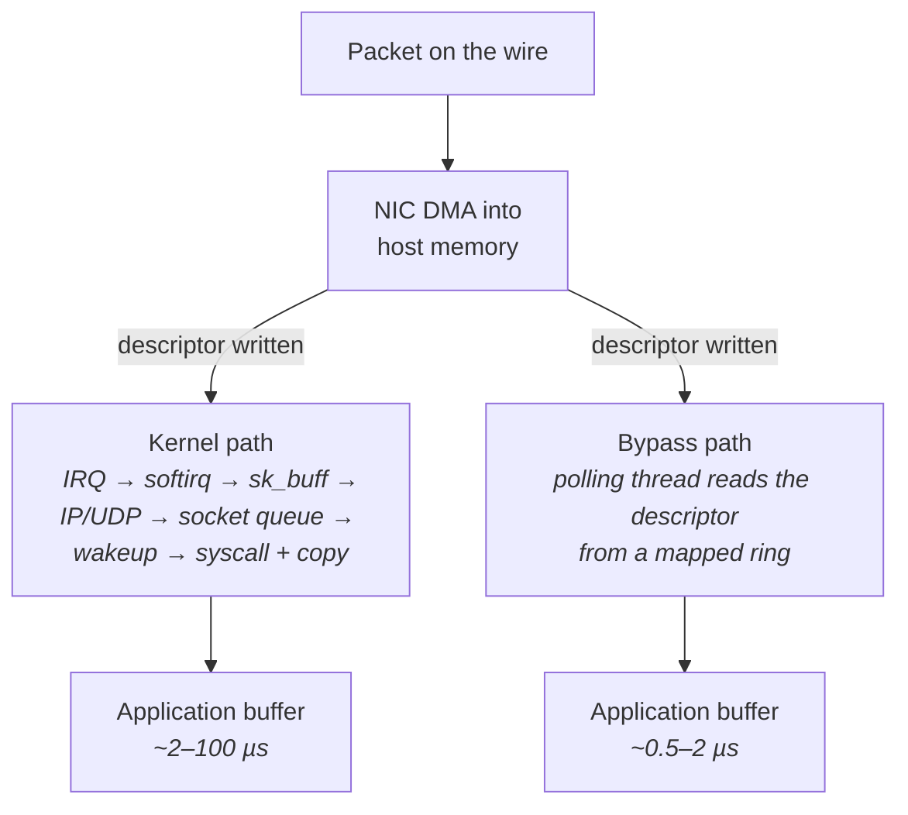
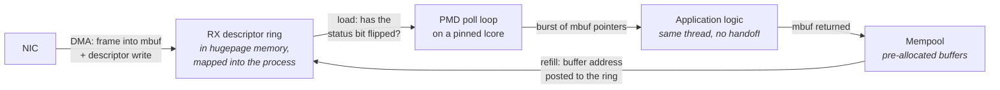
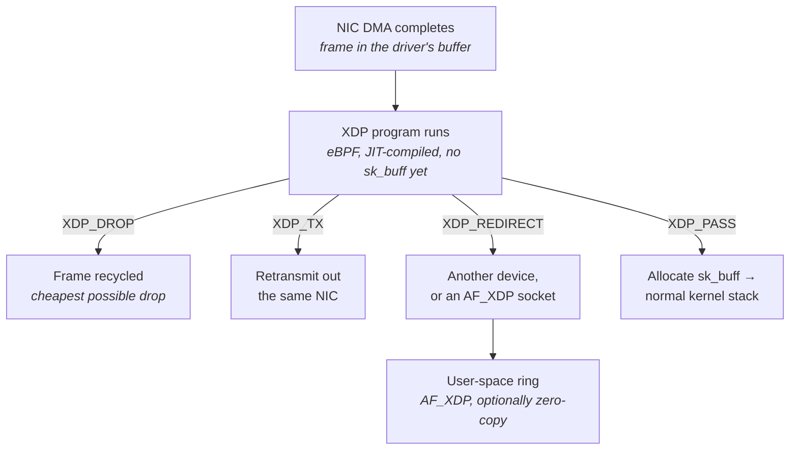
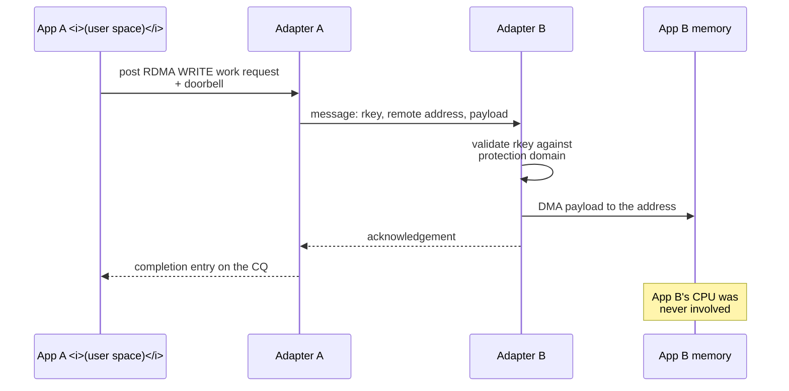
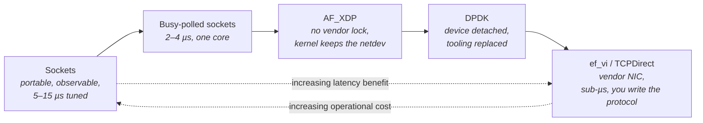
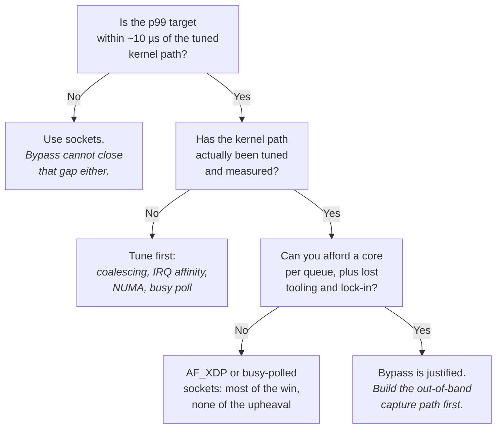

# Kernel Bypass

"The Linux Networking Stack" walked a packet from the wire to your application and priced every step:
a DMA write into host memory, an MSI-X interrupt, a hardirq that does almost nothing, a softirq that
does the real work, an `sk_buff` allocation, route and socket lookup, a queue append, a scheduler
wakeup, a syscall, and a `copy_to_user`. Tuned aggressively — coalescing off, interrupts pinned,
reader co-located, busy polling on — that path lands at roughly 2–4 µs wire-to-application. Untuned,
it is 30–100 µs. Neither number is dominated by the network. Both are dominated by the operating
system.

This chapter removes it. Every technique here is a different answer to the same question: *what if
the NIC's receive ring and packet buffers were mapped directly into your process's address space, so
that reading a packet were a load from memory rather than a syscall?* That single change deletes the
interrupt, the softirq, the `sk_buff`, the protocol stack traversal, the scheduler wakeup, the
syscall boundary, and one of the copies. What remains is a DMA write followed by your thread noticing
it. On modern hardware that is 1–2 µs wire-to-application for a full user-space stack, and under a
microsecond for a raw layer-2 API on a NIC designed for it.

The reason this is not simply the default is that everything the kernel was doing still has to happen
— or has to be consciously given up. The stack was not slow gratuitously. It was slow because it was
*general*: it multiplexed one device across every process on the machine, enforced isolation between
them, implemented a correct and hardened TCP, applied firewall rules, maintained routing, and
answered ARP. Bypass hands the device to one process and makes that process responsible for whichever
of those functions it still needs. The engineering content of this chapter is less about how fast the
fast path goes — that part is easy — and more about what you owe in exchange, and how to tell whether
you can afford it.

## Why the Kernel Is in the Way

The kernel is in the way for four structurally distinct reasons, and separating them matters because
different bypass technologies remove different subsets. Lumping them together as "kernel overhead" is
the reason engineers new to this material cannot predict which technique will help their particular
workload.

The first reason is the **privilege boundary**. The NIC's registers and descriptor rings are a shared
hardware resource. Letting an arbitrary process write a descriptor containing an arbitrary physical
address would let it instruct the device to DMA into any memory on the machine, including the
kernel's. So the classical arrangement is that only the kernel touches the device, and user space
reaches it through syscalls, each of which costs the boundary crossing itself plus the mitigations
layered on top (see "Kernel Architecture and the Syscall Boundary"). At tens to hundreds of
nanoseconds per crossing, and one or two crossings per packet, this alone is not the biggest cost —
but it is the one that forces every other cost to exist, because it is why the packet must be handed
across a boundary at all.

The second is **asynchronous handoff**. The kernel does not process a packet in the context of the
thread that wants it. The NIC raises an interrupt, a hardirq acknowledges it and schedules a softirq,
the softirq runs the driver poll and the protocol stack, the packet lands on a socket queue, and only
then is your thread made runnable. That is at minimum a deferral and usually a full context switch
onto a possibly cold core, with an inter-processor interrupt if the target core is idle and a C-state
exit if it was asleep. It is the single largest and most variable component of the kernel path, and
it is variable precisely because it depends on scheduler state you do not control.

The third is **generality**. A packet arriving at the stack does not know what it is. The kernel must
parse it, look up a route, walk netfilter hooks, demultiplex by protocol, hash into the socket table,
check socket buffer accounting, and handle every option and edge case the protocol permits. Your
application, by contrast, usually knows exactly what to expect on a given interface: a specific
multicast group carrying a specific format, or a handful of long-lived TCP connections to known
peers. The kernel pays for flexibility you are not using.

The fourth is **memory motion and metadata**. Each packet gets an `sk_buff` — roughly 200 bytes of
metadata, allocated and freed per packet, touching the slab allocator and dirtying cache lines that
have nothing to do with your payload — and the payload itself is copied from the kernel's buffer into
yours at `recvmsg` time. The copy is small in absolute terms, but the allocation traffic and the
cache footprint of the stack's own data structures evict *your* working set (see "The Cache
Hierarchy"), which shows up as a slower application even after the packet has arrived.



The diagram makes the shape of the win explicit: the DMA write is common to both and is not
avoidable, so bypass cannot reduce latency below the device's own store-to-memory time (~200–500 ns
on PCIe, landing in last-level cache where DDIO is enabled — see "Buses, Devices, and I/O Hardware").
Everything above the DMA is what is on the table.

| Kernel cost | Approximate contribution | Removed by bypass? |
|---|---|---|
| NIC DMA into host memory | 200–500 ns | No — hardware, unavoidable |
| Interrupt delivery to first handler instruction | 1–2 µs | Yes — replaced by polling |
| Softirq scheduling and driver poll | 1–2 µs | Yes |
| `sk_buff` allocate/free and metadata setup | 200–500 ns | Yes — replaced by a pre-allocated buffer pool |
| IP + UDP/TCP protocol processing | 0.5–1.5 µs | Only if you also replace the protocol stack |
| Socket queue append and accounting | ~200 ns | Yes |
| Wakeup and context switch to a blocked reader | 2–10 µs | Yes — replaced by a spinning thread |
| Syscall boundary plus `copy_to_user` | 0.5–1.5 µs | Yes — replaced by a load from a mapped ring |

Note the row that is conditional. A technique that only removes the *delivery* mechanism — AF_XDP,
for example, in its simplest use — still leaves you holding a raw Ethernet frame, and if you need TCP
you must get it from somewhere. This distinction runs through the whole chapter: **bypass the
delivery path, bypass the protocol stack, or bypass both.**

**Failure mode: bypass is adopted and latency barely improves.** Symptom is a migration to a
poll-mode driver that yields far less than the tables above predict. Cause is almost always that the
original measurement was dominated by something bypass does not touch — interrupt coalescing that was
never disabled (so the comparison baseline was 40 µs of pure configuration error), a cross-NUMA NIC
placement, or a downstream queue in the application. Confirm by first tuning the kernel path properly
per "The Linux Networking Stack" and re-measuring; the honest comparison is bypass against a *tuned*
kernel, not against a default one.

**Try it:** establish your own baseline before reading further. On a receive host, record
wire-to-application latency three ways — default configuration, then with `ethtool -C <if> rx-usecs 0
rx-frames 1` and the receive IRQ pinned to the reader's core, then with `SO_BUSY_POLL` on the socket
and the reader pinned to an isolated core. The spread between the first and third number is what
tuning buys you for free. Anything a bypass stack claims must be measured against the third number.

## DPDK: Poll-Mode Drivers, Hugepages, and the Core Model

The Data Plane Development Kit is the most complete expression of the idea, and also the most
demanding. Its position is that the kernel should not be involved in the data path at all: the
device is detached from the kernel driver entirely, its registers and rings are mapped into a user
process, and that process drives the hardware itself. There is no netdev, no `eth0`, no socket. The
interface disappears from `ip link`. What you get instead is a library that hands you batches of raw
frames.

The core mechanism is the **poll-mode driver (PMD)**. A conventional driver is interrupt-driven: it
sleeps until the NIC signals that a descriptor has been written, then wakes and processes. A PMD does
the opposite — it never sleeps. A dedicated thread loops forever, reading the receive descriptor ring
to see whether the NIC has posted anything new. Because the descriptor ring lives in host memory that
the device DMAs into, "checking for a packet" is a load from a cache line that the device will have
invalidated when it wrote. On a quiet link this load hits in cache and costs a few nanoseconds; when
a packet arrives, the line has been invalidated by the device's write and the load pulls the fresh
descriptor, typically from last-level cache if DDIO is active. That is the whole receive path: no
interrupt, no handoff, no wakeup. Detection latency is bounded by the loop iteration time rather than
by interrupt delivery.

The cost is stated plainly: **a PMD consumes 100% of a CPU core whether or not traffic is flowing.**
`top` shows that core pegged at all times. This is not a bug or an inefficiency to be tuned away — it
is the trade being made. You are spending a core to avoid an interrupt.



Three things in that diagram are worth naming, because they are where DPDK's design shows through.
The buffers are **pre-allocated in a pool** at startup and recycled — there is no per-packet
allocation, which removes the `sk_buff` cost entirely and, more importantly, removes allocation
*variance*. The application runs on **the same thread** as the driver poll, so there is no queue and
no wakeup between them. And the receive call is a **burst** call: it returns up to *N* packets in one
go, amortizing the loop overhead across them, which is a throughput optimization with a latency cost
you should be aware of — a packet that arrives just after a burst read completes waits for the next
loop iteration.

### Detaching the device: UIO and VFIO

For a user process to drive a PCIe device, two things must be arranged. Its registers — the memory
mapped I/O (MMIO) region, including the doorbell used to tell the NIC that descriptors are ready —
must be mapped into the process's address space. And the process must be able to hand the device
addresses to DMA into. Both are dangerous by default, and the two available mechanisms differ
precisely in how they handle that danger.

**UIO** (Userspace I/O) is the older and simpler mechanism. It provides a generic kernel driver that
claims the device, exposes its MMIO regions through a character device for `mmap`, and otherwise gets
out of the way. It does nothing about DMA safety: the addresses the process programs into descriptors
are physical addresses, and the device will write wherever it is told. A bug in your code, or a
malicious process with access to the UIO device node, can corrupt arbitrary physical memory. In
mainline Linux the usable variant is `uio_pci_generic`; DPDK historically shipped its own `igb_uio`,
which is no longer part of the main tree.

**VFIO** (Virtual Function I/O) is the modern mechanism and the one to use. It does the same mapping,
but it programs the **IOMMU** — the hardware unit that translates addresses on device DMA requests,
exactly analogously to how the MMU translates addresses on CPU accesses (see "Memory Systems" for the
CPU-side equivalent). Under VFIO, the process gives the device *I/O virtual addresses*, and the IOMMU
will only permit DMA to pages the process has explicitly mapped for that device. A buggy descriptor
now causes a contained fault rather than silent memory corruption. The cost is that the IOMMU
translation sits on the DMA path; with `iommu=pt` (pass-through for host devices) and large mappings
backed by hugepages, the IOTLB hit rate is high enough that the overhead is small, but it is not
zero, and it is a real consideration on high packet rates.

Binding is done through ordinary sysfs driver binding, which is worth seeing directly rather than
only through DPDK's wrapper script:

```sh
# What does the kernel think each NIC is, and which driver owns it?
ethtool -i eth1
lspci -nn | grep -i ethernet

# DPDK's inventory view: which devices are bound to kernel drivers,
# which to DPDK-compatible drivers, and which are unused.
dpdk-devbind.py --status

# Load VFIO and bind a device by PCI address.
modprobe vfio-pci
dpdk-devbind.py --bind=vfio-pci 0000:81:00.0

# The same operation without the script, so you can see what it does:
echo 0000:81:00.0 > /sys/bus/pci/devices/0000:81:00.0/driver/unbind
echo 8086 1572     > /sys/bus/pci/drivers/vfio-pci/new_id

# Confirm: the device now appears under the vfio-pci driver directory,
# and has vanished from `ip link`.
ls -l /sys/bus/pci/drivers/vfio-pci/
```

VFIO requires the IOMMU to be enabled in firmware and in the kernel — on Intel platforms,
`intel_iommu=on iommu=pt` as boot parameters; on AMD, `amd_iommu=on iommu=pt`. Without an IOMMU,
`vfio-pci` will refuse to bind unless the module is loaded with its unsafe no-IOMMU mode enabled,
which discards the entire safety argument and should be treated as a lab-only configuration.

One important exception to all of this: **not every DPDK driver detaches the device.** NVIDIA/Mellanox
ConnectX parts use a *bifurcated* model — the `mlx5` PMD works through the kernel `mlx5_core` driver
and the `rdma-core` user-space verbs libraries, so the netdev stays present and usable. The kernel
keeps the interface, `ethtool -S` still works, and flow rules decide which traffic is steered to the
bypass path and which continues up the normal stack. This is operationally far more pleasant than the
detach model, and it is a real differentiator when choosing hardware.

**Failure mode: the interface disappears and the host loses management connectivity.** Symptom is an
unreachable machine after a bind operation. Cause is binding the management NIC — device numbering
under `lspci` does not match interface naming in any reliable way. Confirm and prevent by reading
`dpdk-devbind.py --status`, which annotates the interface name and marks devices carrying an active
route as `*Active*`; always bind by PCI address that you have cross-checked with `ethtool -i` on the
interface you intend to keep.

**Failure mode: `vfio-pci` binds but the application fails at initialization with DMA mapping
errors.** Cause is usually that the IOMMU is disabled in firmware, or that the device shares an IOMMU
group with other devices still bound to kernel drivers — VFIO grants access at group granularity, not
device granularity. Confirm by listing `/sys/bus/pci/devices/<addr>/iommu_group/devices/`; every
device in that directory must be bound to `vfio-pci` or unbound before the group can be claimed.

### Hugepages and the memory model

DPDK allocates its packet buffers, rings, and internal structures out of hugepages, and this is not a
minor optimization — it is structural, and the application will refuse to start without them.

There are two independent reasons. The first is the one from "Memory Systems": TLB reach. A
poll-mode application's working set includes a buffer pool that is often hundreds of megabytes,
touched in a pattern that is effectively random as buffers cycle through the pool. With 4 KiB pages,
a few thousand TLB entries cover only a few megabytes, so nearly every buffer access would pay a page
walk. With 1 GiB pages, the entire pool is covered by a handful of entries and translation
disappears as a cost.

The second reason is specific to DMA and less widely understood. When the device writes into a
buffer, it must be given an address that resolves correctly from the device's side — a physical
address under UIO, or an IOMMU-mapped I/O virtual address under VFIO. Either way the buffer must be
**physically contiguous and pinned**: it cannot be moved, swapped, or reclaimed by the kernel while
the device might write to it. Hugepages allocated from the hugetlbfs pool satisfy both properties by
construction. Ordinary anonymous pages do not — they are individually 4 KiB, scattered physically,
and movable.

Reservation is done through sysfs or at boot, and boot is strongly preferred because a 1 GiB
allocation requires 1 GiB of physically contiguous free memory, which a machine that has been up for
a while may simply not have:

```sh
# Boot-time reservation (kernel command line). Reserve at boot; fragmentation
# only ever gets worse with uptime.
default_hugepagesz=1G hugepagesz=1G hugepages=16

# Runtime reservation, 2 MiB pages, per NUMA node so the memory is local
# to the core that will poll the NIC.
echo 1024 > /sys/devices/system/node/node0/hugepages/hugepages-2048kB/nr_hugepages

# The global view, and the corresponding /proc summary.
cat /sys/kernel/mm/hugepages/hugepages-2048kB/nr_hugepages
grep -i huge /proc/meminfo

# hugetlbfs must be mounted for the allocator to use it.
mount -t hugetlbfs nodev /dev/hugepages
```

The NUMA dimension is not optional here. The NIC hangs off one socket's root complex, and buffers it
DMAs into should live on that socket's memory; the lcore polling the ring should run on that socket's
cores. Getting any of the three wrong puts the inter-socket interconnect on the path of every packet,
which costs microseconds and adds variance proportional to whatever else is crossing the link (see
"Memory Systems"). Read the device's node from
`/sys/class/net/<if>/device/numa_node` before it is unbound, or from
`/sys/bus/pci/devices/<addr>/numa_node` afterwards, and reserve hugepages and select cores
accordingly. DPDK's runtime environment abstraction layer accepts per-socket memory sizing for
exactly this reason.

**Failure mode: the application starts and runs, but throughput is well below line rate and latency
is inflated by microseconds.** Cause is frequently that hugepages were reserved only on node 0 while
the NIC is on node 1, so every DMA and every buffer touch crosses the interconnect. Confirm by
comparing `/sys/bus/pci/devices/<addr>/numa_node` against the per-node hugepage counts under
`/sys/devices/system/node/node*/hugepages/` and against the lcore mask you passed.

**Failure mode: runtime hugepage reservation silently gives you fewer pages than requested.** Symptom
is initialization failing with an out-of-memory error despite the `echo` having appeared to succeed.
Cause is physical fragmentation — the kernel could not find enough contiguous regions. Confirm by
reading back `nr_hugepages` and comparing with what you wrote, and by inspecting `/proc/buddyinfo`
where the high-order columns will be near zero. The fix is boot-time reservation.

### The lcore model

DPDK's threading model is deliberately austere, and it is the part that most often surprises
engineers arriving from a conventional server background. There is no thread pool, no work queue, no
scheduler. There is a set of **lcores** — logical cores — each of which is one thread pinned to one
CPU, running one function in an infinite loop. One lcore is designated the main lcore and performs
initialization and control; the rest are workers.

The intended structure is that each worker owns a receive queue, polls it, processes what it gets,
and transmits, all within one loop iteration and one thread. Nothing is handed off. This is the
opposite of the pipeline architectures that are natural in throughput-oriented systems, and the
reason is that every handoff between threads costs a queue, a cache line bouncing between cores (see
"Multicore, Coherence, and Memory Ordering"), and a synchronization point where jitter can enter. The
**run-to-completion** model keeps the packet in one core's cache from arrival to departure.

DPDK does support a pipeline model where lcores are connected by its lock-free rings, and for
high-throughput multi-stage processing it can be the right choice. But for latency, run-to-completion
is the default and the deviations should be justified. Scaling is horizontal: more traffic means more
receive queues, more lcores, and hardware steering — receive side scaling, or explicit flow rules
programmed into the NIC — to distribute flows across them, exactly as in the kernel case (see "The
Linux Networking Stack") but with the steering decision now yours to make explicitly.

Launching a DPDK application means telling the environment abstraction layer which cores and which
devices it owns:

```sh
# -l: which CPUs become lcores.  -a: allow exactly these PCI devices
# (everything else is ignored).  Cores 4-7 must be isolated from the
# scheduler for this to be deterministic.
dpdk-testpmd -l 4-7 -a 0000:81:00.0 -- --rxq=2 --txq=2 --forward-mode=rxonly
```

Those cores must be isolated at boot — `isolcpus`, `nohz_full`, and RCU offload as covered in "Tuning
a Linux Box for Determinism" — or the kernel's scheduler will periodically place other work on them
and the timer tick will interrupt the poll loop. A poll loop on a non-isolated core is a poll loop
with a several-microsecond hole in it at unpredictable intervals, which defeats the purpose of having
built one.

| DPDK concept | Kernel equivalent | Why the difference matters |
|---|---|---|
| lcore | Kernel thread + softirq context | One pinned thread, no scheduler involvement, no preemption |
| PMD poll loop | NAPI poll invoked from softirq | Always running; detection bounded by loop time, not interrupt latency |
| mempool of mbufs | slab-allocated `sk_buff` per packet | Pre-allocated and recycled; no allocation on the data path |
| Burst receive of N packets | NAPI budget of 64 | Same amortization idea, but the burst size is yours to tune against latency |
| `rte_flow` rules | `ethtool -N` ntuple filters, RSS | Same hardware, programmed directly rather than through the netdev API |
| DPDK port statistics | `ethtool -S` | **The `ethtool` path is gone once the device is detached** |

That last row is the operational sting and it recurs throughout this chapter. Once a device is bound
to `vfio-pci`, there is no netdev, so `ethtool -S` reports nothing, `ip -s link` reports nothing,
`tcpdump` sees nothing, and the counters you have spent the previous chapters learning to read are
simply unavailable. DPDK exposes equivalents through its own statistics interface, readable from a
secondary process — `dpdk-proc-info` attaches to a running primary process and dumps port statistics
and extended statistics — and it provides its own packet capture path through `dpdk-dumpcap` and the
pdump library. These work, but they are different tools with different names for the same counters,
and none of your existing monitoring understands them.

**Failure mode: periodic latency spikes of tens of microseconds on an otherwise clean poll loop.**
Cause is that the lcore is not isolated, so the scheduler tick, an RCU callback, or a kernel thread
runs on it. Confirm by checking the boot command line in `/proc/cmdline` for `isolcpus` and
`nohz_full` covering that core, and by reading `/proc/interrupts` for local timer interrupts
accumulating on it.

**Try it:** watch a device leave and re-enter the kernel's world. On a spare NIC port, record
`ethtool -i <if>`, `ip link show <if>`, and `ethtool -S <if> | head`. Bind it to `vfio-pci` with
`dpdk-devbind.py`, then confirm the interface has vanished from `ip link`, that
`/sys/bus/pci/drivers/vfio-pci/` now contains a symlink for its PCI address, and that `ethtool` can
no longer find it. Run `dpdk-testpmd` against it, and observe one core at 100% in `top` with no
traffic offered. Then unbind and rebind to the original kernel driver named by your earlier
`ethtool -i` output, and confirm the interface returns.

## Solarflare, Onload, ef_vi, and TCPDirect

DPDK's model asks you to rewrite your application. Solarflare's — now AMD's, via Xilinx — asks you to
choose how much you want to rewrite, and offers three tiers at very different points on the
effort/latency curve. Understanding why those tiers exist is more instructive than the product
details, because the same structure appears in every vendor's low-latency offering.

The top tier is **Onload**, and its defining property is that it requires no application changes at
all. Onload is a user-space TCP and UDP stack packaged as a shared library, injected into an
unmodified binary through the dynamic linker's preload mechanism. The `onload` wrapper script sets
`LD_PRELOAD` so that the library's definitions of `socket`, `bind`, `connect`, `send`, `recv`,
`epoll_wait` and the rest are resolved ahead of the C library's. When your program calls `recv`, it
calls Onload's `recv`, which reads directly from a NIC receive ring mapped into the process — no
syscall, no kernel. Sockets that Onload cannot or should not accelerate are passed through to the
real system calls, so a program using a mix of accelerated market data and unaccelerated management
connections works unmodified.

```sh
# Run an unmodified binary with acceleration.
onload ./my_app

# With a shipped tuning profile; the latency profile enables spinning
# and disables features that trade latency for generality.
onload --profile=latency ./my_app

# Inspect the running stacks: per-stack and per-socket counters, ring
# occupancy, spin behaviour. This replaces `ss` and `netstat`, which
# cannot see accelerated sockets.
onload_stackdump lots

# Capture accelerated traffic, which ordinary tcpdump cannot see.
onload_tcpdump -i any -w /tmp/accel.pcap
```

Behaviour is controlled entirely through environment variables, which is what makes it deployable
without touching source. The ones that matter most concern **spinning**: by default a blocking `recv`
on an accelerated socket can spin in user space for a configured interval before falling back to
blocking in the kernel. `EF_POLL_USEC` sets that interval; `EF_UDP_RECV_SPIN` and `EF_TCP_RECV_SPIN`
enable it per protocol. Spinning is the same trade as a PMD's poll loop, but bounded and optional —
you choose how many microseconds of CPU to burn before giving up and sleeping, which lets you tune
the CPU/latency exchange per deployment rather than accepting a fully consumed core.

The middle tier is **ef_vi**, the raw layer-2 API underneath Onload. Here there is no socket
abstraction, no TCP, and no UDP. You allocate a virtual interface, register a region of memory with
the NIC so it can DMA into it, install filters describing which packets the hardware should steer to
you, post receive buffers, and poll an event queue. What you get back is an Ethernet frame and a
buffer index. Everything above that — checking the IP header, checking the UDP port, gap detection on
a sequenced feed — is yours to write. This is the same architectural position as DPDK, at
substantially lower latency on the vendor's own hardware because the entire path is co-designed, and
with the significant operational advantage that **the kernel driver remains bound**. The netdev still
exists, `ethtool -S` still reports NIC counters, and unfiltered traffic still flows up the normal
stack. Bypass here is per-flow rather than per-device.

The third tier is **TCPDirect**, which sits between the other two: a TCP and UDP implementation
built directly on the ef_vi datapath, exposed through its own API rather than through the socket
API. Because it is not constrained to reproduce socket semantics, it can eliminate copies and
indirections that Onload must keep, and it reaches lower latency than Onload — at the price of an
application written against a non-standard API, and a feature set narrower than a general-purpose
stack's.

| | Onload | TCPDirect | ef_vi |
|---|---|---|---|
| Application changes | None — `LD_PRELOAD` | Rewrite against a dedicated API | Rewrite against a raw L2 API |
| Protocols provided | TCP, UDP, full socket semantics | TCP and UDP, reduced surface | None — you get Ethernet frames |
| Typical wire-to-app | ~1–2 µs | Under ~1 µs | Under ~1 µs, lowest available |
| Kernel driver bound? | Yes | Yes | Yes |
| Non-accelerated traffic | Falls through to the kernel stack | Coexists via kernel stack | Coexists via kernel stack |
| Standard tooling | `onload_stackdump`, `onload_tcpdump` | Vendor tooling | Vendor tooling |
| Portability | Any NIC the library supports | Vendor-locked | Vendor-locked |

The pattern generalizes beyond one vendor. Every low-latency NIC family offers some version of this
ladder: a transparent socket-compatible acceleration layer for teams that cannot or will not rewrite,
and a raw API for teams that will. The transparent layer is dramatically easier to adopt and leaves
perhaps a microsecond on the table relative to the raw one. Which side of that microsecond you should
be on is an organizational question as much as a technical one.

Hardware matters here in a way it does not for the kernel path. These latency figures assume a NIC
designed for the purpose, with a short internal pipeline and a datapath optimized for small packets
and low queue occupancy — the Solarflare/Xilinx X2 and X3 families being the canonical examples, with
the newer parts pushing application-to-wire below a microsecond. A general-purpose data-centre NIC
running the same software will not reach the same numbers, because its internal store-and-forward
latency is larger to begin with (see "Buses, Devices, and I/O Hardware").

**Failure mode: Onload is enabled but a given socket is not accelerated, and nobody notices.**
Symptom is that latency is unchanged for one traffic class while others improved. Cause is that the
socket was created before acceleration could apply, bound to an interface without a Solarflare NIC,
or used a feature the accelerated path declines to handle, so it fell through to the kernel silently
— which is by design, since silent fallback is what makes transparent acceleration safe. Confirm with
`onload_stackdump` and check whether the socket appears as an accelerated endpoint at all.

**Failure mode: `tcpdump` on the interface shows nothing while the application is clearly receiving
data.** Cause is that accelerated packets are delivered by the NIC straight into the process and
never traverse the kernel's packet tap point. Confirm by using `onload_tcpdump` instead, or by
capturing on a switch SPAN port. This is not a bug; it is the defining property of bypass, and it is
the single most disorienting thing about operating one of these systems for the first time.

**Try it:** identify what you actually have before assuming anything. Run `ethtool -i <if>` on every
interface and record the `driver` and `firmware-version` fields — `sfc` indicates a Solarflare/Xilinx
part, `mlx5_core` a ConnectX, `ice`/`i40e`/`ixgbe` an Intel. That one field determines which of the
technologies in this chapter are even available to you, and it is the first thing to establish in any
conversation about kernel bypass.

## AF_XDP and the eBPF/XDP Fast Path

DPDK and ef_vi both require specific hardware support and a substantially rewritten application. XDP
— eXpress Data Path — is the kernel community's answer: a fast path built *into* Linux, available on
any driver that implements it, with no device detachment and no vendor library.

The mechanism starts from a hook. XDP places a program execution point in the driver's receive
routine, at the earliest moment at which a packet is available — **after the DMA has completed but
before an `sk_buff` has been allocated**. That position is the entire point. The `sk_buff` allocation
and initialization is a meaningful fraction of the kernel's per-packet cost, and everything the stack
does afterwards depends on it. A decision made before that allocation is a decision made for free.

The program that runs at the hook is an **eBPF** program: bytecode loaded from user space, verified by
the kernel for termination and memory safety, then JIT-compiled to native code. It receives a
pointer to the raw frame and returns an action code that tells the driver what to do next.



The five actions are the whole vocabulary, and each corresponds to a distinct use:

- **`XDP_DROP`** — discard immediately, before any allocation. This is the fastest drop mechanism in
  Linux by a wide margin and it is why XDP was first adopted for denial-of-service mitigation.
- **`XDP_PASS`** — continue to the normal stack. The packet is allocated an `sk_buff` and proceeds
  exactly as it would have without XDP.
- **`XDP_TX`** — send the frame back out the interface it arrived on, after any modification the
  program made. Used for in-line responders and load balancers.
- **`XDP_REDIRECT`** — send the frame to another interface, or into a user-space **AF_XDP socket**.
  This is the action that turns XDP into a bypass mechanism.
- **`XDP_ABORTED`** — signals a program error; the frame is dropped and a tracepoint fires, which is
  how you notice that your program is failing rather than working.

**AF_XDP** is the socket address family on the receiving end of `XDP_REDIRECT`. Its structure is
recognizably the same as DPDK's, which is not a coincidence — both are solving the same problem. A
region of user memory called the **UMEM** is registered with the kernel and divided into fixed-size
frames. Four single-producer/single-consumer rings connect the application to the kernel: a **fill
ring** on which the application posts empty frames for the NIC to write into, an **RX ring** on which
the kernel returns descriptors of frames that have been filled, a **TX ring** for frames the
application wants sent, and a **completion ring** on which the kernel returns frames it has finished
transmitting. Receiving a packet is reading a descriptor from a mapped ring — a load, not a syscall.

The critical distinction within AF_XDP is **copy mode versus zero-copy mode**. In copy mode, which
works on any driver, the kernel copies the frame from the driver's buffer into your UMEM frame. In
zero-copy mode, which requires explicit driver support, the driver posts *your UMEM frames* as
receive buffers directly, so the NIC DMAs straight into your memory and no copy occurs. The
performance difference is large, and whether you get it depends entirely on the driver — which
returns you to `ethtool -i` as the first diagnostic.

There is a second axis: where the XDP program itself runs.

| Attach mode | Where the program runs | Requirement | Use |
|---|---|---|---|
| Generic / SKB mode | In the stack, *after* `sk_buff` allocation | None | Development and testing only — the main saving is already gone |
| Native / driver mode | In the driver's receive routine, before allocation | Driver support | The real fast path |
| Offloaded | On the NIC itself | Rare, specific hardware | Highest performance, most restricted program |

Loading and inspecting programs uses `ip` and `bpftool`:

```sh
# Attach a compiled program. `xdpdrv` forces native mode and fails loudly
# if the driver lacks support; `xdpgeneric` forces the slow path.
ip link set dev eth1 xdp obj xdp_prog.o sec xdp
ip link set dev eth1 xdpdrv obj xdp_prog.o sec xdp

# Detach.
ip link set dev eth1 xdp off

# What is loaded, and what is attached where.
bpftool prog show
bpftool net show
bpftool prog show id 42 --pretty

# Maps are how the program and user space communicate: counters out,
# configuration in, and the XSKMAP that names AF_XDP sockets for redirect.
bpftool map show
bpftool map dump id 17
```

XDP's position in the design space is genuinely distinct, and it is worth being precise about it. It
is *not* as fast as ef_vi or a well-tuned DPDK path — the eBPF program execution, the verifier's
constraints, and the driver's generic buffer handling all cost something. But it needs no special
hardware, no device detachment, no vendor library, and no license. The interface keeps working. The
kernel keeps its counters. `XDP_PASS` means non-bypassed traffic — ARP, ICMP, SSH, monitoring — still
reaches the normal stack on the same port. For a system that needs *most* of the benefit with *none*
of the operational upheaval, it is frequently the correct answer, and it has been steadily closing the
gap.

One consequence catches everyone. **`tcpdump` attaches below XDP, not above it.** The kernel's packet
tap point sits after `sk_buff` allocation, so any frame the program drops or redirects never reaches
it. Turn on an XDP program that redirects your traffic and `tcpdump` goes quiet, exactly as under
DPDK, even though the interface is fully present and `ethtool -S` still shows packets arriving. The
NIC-level counters are the ground truth that they were not lost.

**Failure mode: attaching an XDP program silently halves throughput instead of improving it.** Cause
is that the driver does not support native mode, so the load fell back to generic mode where the
program runs after `sk_buff` allocation and adds cost without removing any. Confirm with
`bpftool net show`, which reports the attach mode per interface, and by re-attaching with the
`xdpdrv` keyword, which fails outright rather than falling back.

**Failure mode: an AF_XDP application receives packets but at unexpectedly high CPU cost per
packet.** Cause is copy mode rather than zero-copy — the driver or its configuration did not permit
zero-copy binding, and the kernel silently degraded. Confirm by checking whether the socket was bound
with the zero-copy flag and whether the bind succeeded with it, and by cross-checking driver support
via `ethtool -i` and the kernel version's documented AF_XDP zero-copy driver list.

**Failure mode: packets vanish entirely after loading a program.** Cause is a program returning
`XDP_DROP` on a path you did not intend, or returning `XDP_ABORTED` because of a runtime error.
Confirm by reading a per-action counter map with `bpftool map dump`, and by tracing the
`xdp:xdp_exception` tracepoint, which fires on `XDP_ABORTED`.

**Try it:** measure XDP's drop cost against the stack's. Write a minimal program that returns
`XDP_DROP` unconditionally, attach it with `ip link set dev <if> xdpdrv obj ...`, and offer a packet
flood from another host while watching `ethtool -S <if>` for received-packet counters and
`mpstat -P ALL` for CPU consumption. Compare against dropping the same flood with an `iptables` rule.
Then detach, confirm with `bpftool net show` that nothing remains attached, and note that during the
XDP test `tcpdump` saw nothing at all.

## RDMA and RoCE

Everything so far bypasses the kernel on the local machine while leaving the network protocol
conventional. Remote Direct Memory Access goes further: it moves the data placement decision into the
network adapters at both ends, so that a machine can write into another machine's memory with no
software involvement on the far side at all.

The motivating observation is that even a perfect user-space stack still requires the receiving
*application* to act. A packet arrives, the receiver polls, finds it, and copies or interprets it.
RDMA removes that step. The sender's adapter transmits a message that carries a destination memory
address and an access key; the receiver's adapter validates the key, DMAs the payload directly into
that address, and — for a one-sided operation — never notifies the receiving CPU at all. No thread is
scheduled, no poll loop observes it, no interrupt fires. The data is simply there.

Making that safe requires a large amount of setup, and the setup is the part worth understanding. The
abstraction is called **verbs**, and its objects are:

- **Protection domain (PD)** — a container that associates memory regions and queues, so a key issued
  in one domain cannot be used against memory in another.
- **Memory region (MR)** — a range of the process's memory registered with the adapter. Registration
  pins the pages so they cannot be swapped or moved, and programs the adapter's translation tables so
  it can convert the virtual addresses used in requests into physical ones. It returns two keys: a
  local key (`lkey`) for the adapter's own use, and a remote key (`rkey`) that must be given to the
  peer before the peer can access the region.
- **Queue pair (QP)** — a send queue and a receive queue, mapped into the process, forming the
  connection endpoint. Posting work is writing a work request into the queue and ringing a doorbell.
- **Completion queue (CQ)** — where the adapter reports finished operations. The application polls
  it; there is an interrupt-driven mode, but the low-latency path polls.



Operations divide into two families, and the distinction is the one to carry into an interview:

- **Two-sided** — `SEND` and `RECV`. The receiver must have pre-posted a receive buffer; the adapter
  places the message in the next posted buffer and generates a completion on the receiver's queue.
  This is message passing, semantically close to a socket, and the receiver knows something arrived.
- **One-sided** — `RDMA WRITE` and `RDMA READ`, plus atomics such as compare-and-swap. The initiator
  names the remote address and key; the target's CPU is not notified and generates no completion. All
  coordination — how the initiator learned the address, how the target learns the data is valid — is
  the application's problem.

The transport underneath comes in three flavours. **InfiniBand** is a purpose-built fabric with its
own link and network layers, its own switches, and credit-based flow control that makes it lossless
by construction. **RoCE** — RDMA over Converged Ethernet — carries the same verbs semantics over
Ethernet: version 1 as a raw Ethernet payload with its own ethertype, non-routable; version 2
encapsulated in UDP on destination port 4791, and therefore routable across IP subnets like any other
traffic. **iWARP** layers RDMA over TCP, which makes it tolerant of loss at the cost of latency and
complexity.

RoCEv2 is what appears in Ethernet data centres, and it carries a requirement that is the source of
most operational pain in the technology: **the reliable-connected transport was designed assuming a
lossless fabric.** Its recovery from a dropped packet is crude — historically a go-back-N
retransmission that discards everything after the loss — so a link that drops even occasionally
produces throughput collapse rather than graceful degradation. The mitigation is to make the Ethernet
fabric lossless with **priority flow control (PFC)**, a link-level mechanism where a congested switch
sends a pause frame telling the upstream port to stop sending on a given traffic class, and to add
congestion control on top — typically explicit congestion notification marking driven by switch queue
occupancy, fed back to the sender to reduce its rate. PFC works, and it introduces a new class of
failure: pause frames propagate backwards through the fabric, so congestion at one point can stall
unrelated traffic several hops away, and misconfiguration can produce fabric-wide deadlock. Deploying
RoCE is a network engineering project, not a host configuration change.

Verify and inspect from the host side:

```sh
# Does this machine have an RDMA-capable device, and what does it report?
ibv_devices
ibv_devinfo

# The netlink view: RDMA links and their association with netdevs.
rdma link show
rdma resource show

# Sysfs presence, port state, and rate.
ls /sys/class/infiniband/
cat /sys/class/infiniband/*/ports/1/state

# Latency measurement with the standard perftest suite: one-sided write
# and two-sided send, reported as half round-trip.
ib_write_lat -d mlx5_0
ib_send_lat  -d mlx5_0
```

For the systems engineer, three facts about RDMA are the ones that matter. Memory registration is
expensive — it pins pages and programs adapter translation tables, taking microseconds to
milliseconds — so it belongs entirely in the startup path, never on the data path. Registered memory
is pinned memory, so it is not swappable and counts permanently against your memory budget. And the
adapter has its own translation cache; a working set spanning more registered pages than that cache
holds produces adapter-side translation misses that look exactly like TLB thrashing, for the same
reason, which is one reason RDMA deployments register hugepage-backed regions.

**Failure mode: RoCE throughput collapses under load rather than degrading.** Symptom is a cliff
correlated with congestion elsewhere in the fabric. Cause is packet loss interacting with go-back-N
recovery, or a PFC misconfiguration where the traffic class carrying RDMA is not the one being paused.
Confirm by reading the adapter's hardware counters — the RoCE-specific error and retransmission
counters exposed under `/sys/class/infiniband/<dev>/ports/1/` and by the vendor's counter tooling —
and by checking switch-side pause frame counters on the relevant priority.

**Failure mode: connection setup takes far longer than expected and shows up as a startup stall.**
Cause is memory registration on the connection path rather than at initialization. Confirm by timing
the registration call directly; the fix is a pre-registered buffer pool sized at startup.

**Try it:** determine whether the machine in front of you can do RDMA at all, which is the first
question in any such discussion. Run `ibv_devinfo` and `rdma link show`. If devices appear, note
whether their transport reports InfiniBand or Ethernet — the latter means RoCE — and read the port
state. Then run `ib_write_lat` between two hosts and compare the reported half round-trip against the
1–2 µs figure this section gives, and against a UDP round-trip measured over the same link with a
kernel socket. The gap is what one-sided placement plus bypass buys.

## User-Space TCP Stacks

Bypass the kernel and you get raw frames. If your protocol is UDP multicast that is nearly enough —
UDP is a length, a checksum, and a port pair (see "UDP and Multicast"), and parsing it is a few
instructions. If your protocol is TCP, you have a problem, because you have just discarded one of the
most carefully hardened pieces of software in the system and you now need a replacement.

The scope of what a TCP implementation actually owns is easy to underestimate until you enumerate it:
connection establishment and teardown with the full state machine, sequence number tracking,
retransmission with round-trip time estimation and exponential backoff, selective acknowledgement,
sliding-window flow control, congestion control, out-of-order reassembly, delayed acknowledgement,
keepalives, and correct behaviour under every combination of loss, reordering, duplication, and
malice (see "TCP In Depth"). Timers are the part that surprises people: the kernel has a timer wheel
and a tick to drive retransmission timeouts, and a user-space stack that only runs when the
application polls it must arrange to be called frequently enough to fire its own — meaning a stack
whose application stops polling stops retransmitting.

Existing implementations cluster into three groups. **Vendor stacks** — Onload and TCPDirect being
the examples from earlier — are production-grade, maintained, and tested against real networks, at
the cost of hardware lock-in. **Open-source research and infrastructure stacks** — mTCP, F-Stack
(which ports the FreeBSD network stack on top of DPDK), the stack embedded in Seastar, lwIP for
embedded use — vary enormously in maturity and in how much of TCP they actually implement.
**In-house stacks** exist at firms with the engineering capacity to maintain them, usually
implementing a deliberately narrow subset: known peers, no path MTU discovery, a fixed window, a
simple retransmission policy, and an explicit decision to fail loudly rather than degrade gracefully
in situations a general stack would handle.

Beyond the protocol itself, a user-space stack inherits a set of integration problems that have
nothing to do with TCP and are routinely forgotten in planning:

| Responsibility | Kernel provides it | User-space stack must |
|---|---|---|
| ARP / neighbour resolution | Automatically, with a cache | Resolve and cache peer MAC addresses itself, or use static entries |
| IP address ownership | The netdev owns the address; the kernel answers for it | Answer ARP for its address, or use a dedicated address the kernel does not claim |
| Routing and next-hop selection | Routing table, longest-prefix match | Usually a single configured gateway MAC |
| ICMP | Generates and consumes it | Typically ignores it — including path MTU messages |
| Fragmentation and reassembly | Full support | Usually unsupported; requires MTU discipline |
| Firewalling | netfilter | Nothing — the bypass path is not filtered |
| Connection visibility | `ss`, `netstat`, `/proc/net/tcp` | Its own tooling; connections are invisible to standard tools |
| Port allocation | Kernel-wide, conflict-free | Must not collide with kernel-owned ports on the same address |

That table is the honest cost of a user-space TCP stack, and the last two rows cause more production
incidents than the protocol logic does. A connection that does not appear in `ss` is a connection
nobody can debug with the tools they know. A bypass path that netfilter cannot see is a path your
security review has not covered.

The mitigating factor, and the reason this is nonetheless done, is that trading-adjacent TCP usage is
unusually simple: a small number of long-lived connections to known peers over a colocated link with
essentially no loss and negligible round-trip time. Congestion control barely engages. Path MTU
discovery is unnecessary when the MTU is fixed and known. Under those conditions a narrow
implementation can be both correct and much faster than a general one — and it is precisely those
conditions that make the decision non-transferable to a system whose TCP traverses the public
internet.

**Failure mode: a user-space TCP connection stalls indefinitely after a single lost packet.** Cause
is a retransmission timer that never fired because the application stopped calling into the stack —
it was busy processing, or blocked on something else. Confirm by instrumenting the stack's poll
frequency and correlating stalls with gaps in it. The structural fix is a guaranteed minimum poll
rate, which in practice means the poll loop must never block on anything.

**Failure mode: the peer's traffic arrives but nothing is ever sent back.** Cause is unresolved
neighbour state — the user-space stack never answered or issued an ARP, so it has no destination MAC.
Confirm by capturing on a switch SPAN port, since the frames never reach the kernel's tap point, and
by checking whether the peer's ARP table shows an entry for your bypass address.

**Try it:** demonstrate the visibility gap before you depend on it. With an Onload-accelerated TCP
application running, run `ss -tan` and observe that the accelerated connections do not appear the way
kernel connections do, then run `onload_stackdump lots` and find them there. Do the same comparison
for byte counters: `ip -s link` on the interface versus the stack's own statistics. Write down which
of your existing dashboards and alerts read the counters that just stopped moving.

## Trade-offs: Portability, Debuggability, and CPU Burn

The individual technologies differ, but the costs of bypass are largely common to all of them, and
they are the substance of a serious discussion about adopting it. Latency is the only thing on the
benefit side of the ledger. Everything else is on the other side.

**CPU burn is total, not proportional.** A poll loop consumes a core continuously regardless of
traffic. Ten receive queues means ten cores gone, whether the link is at line rate or idle overnight.
There are second-order consequences that catch people: a core at 100% utilization draws power and
generates heat, which on many server parts reduces the turbo frequency headroom available to *other*
cores on the same package (see "Clocks, Timers, and Time"), so a spinning core can slow down the
threads you actually care about. Hyper-threading makes it worse — a sibling thread sharing execution
resources with a spin loop gets a fraction of the machine it would otherwise have, which is one of
several reasons SMT is commonly disabled on these hosts (see "Multicore, Coherence, and Memory
Ordering"). And bypass and virtualization interact badly: a spinning vCPU tells the hypervisor
nothing about whether it is doing useful work.

**Observability is the largest practical cost.** Almost every diagnostic technique taught in "Network
Debugging Toolkit" assumes packets traverse the kernel. Under full bypass, they do not.

| Tool | Under the kernel stack | Under bypass |
|---|---|---|
| `tcpdump` / `AF_PACKET` | Sees everything | Sees nothing on the bypass path — the tap is above the divergence point |
| `ethtool -S` | NIC hardware counters | Unavailable if the device is detached; still available for Onload, ef_vi, XDP |
| `ss`, `netstat`, `/proc/net/tcp` | Every connection | Accelerated connections absent |
| `/proc/net/snmp`, `nstat` | Protocol counters | Do not count bypassed packets |
| `iptables` / `nftables` | Filters everything | Bypass path is unfiltered |
| `tc` / qdiscs | Shapes egress | Not on the bypass path |
| `perf` on stack symbols | Attributes time inside the kernel | Nothing to attribute — it is all your code |

There are replacements — `dpdk-proc-info` and `dpdk-dumpcap` for DPDK, `onload_stackdump` and
`onload_tcpdump` for Onload, `bpftool` and per-action maps for XDP — and mature deployments
supplement all of them with an out-of-band capture path: a switch SPAN port or an optical tap feeding
a dedicated capture host with hardware timestamping (see "Network Design and Operations"). That
capture path is not a nicety. It is frequently the only way to establish what actually crossed the
wire, and building it should be part of the bypass project rather than a response to the first
incident.

**Portability and lock-in are real and asymmetric.** Code written against ef_vi or TCPDirect runs on
one vendor's NICs. Code written against DPDK is portable across the many NICs with PMDs, but not off
DPDK. Code written against AF_XDP is portable across drivers with support, and degrades to copy mode
elsewhere rather than failing. Sockets run everywhere. The gradient from "fastest" to "most portable"
is monotonic and there is no cheat.



**Operational complexity compounds.** A bypass host needs specific firmware, specific driver versions,
IOMMU settings in firmware, boot parameters for hugepages and core isolation, hugepage reservation
that must survive reboots, PCI device binding that must be reapplied, and a NUMA layout that must
match physical card placement. Every one of those is a configuration item that can drift, and drift
on a bypass host is often silent — the system works, just slower, or works until the one path that
depended on the misconfigured item is exercised (see "Build, Deploy, and Environment Discipline").

**Kernel and driver version coupling is tighter than it looks.** Out-of-tree modules must be rebuilt
against each kernel; XDP capabilities and AF_XDP zero-copy driver support vary by kernel version;
verifier behaviour changes across releases so an eBPF program that loads on one kernel may be
rejected on another. Upgrades that are routine on a normal fleet are projects here.

**Failure mode: latency regresses after a kernel or firmware upgrade, with no application change.**
Cause is a driver behaviour or capability change — zero-copy support silently lost, an XDP program
falling back to generic mode, a PMD falling back to a scalar rather than vectorized path. Confirm by
recording `ethtool -i` output including firmware version, `bpftool net show` attach modes, and the
bypass stack's own initialization log for every host, and diffing before against after. Version
recording is not bureaucracy; it is the only way to make these regressions diagnosable.

**Try it:** quantify the CPU cost honestly before proposing bypass to anyone. Run a poll-mode
receiver with zero offered traffic and confirm with `mpstat -P ALL 1` that the core is at 100%. Read
the package's frequency behaviour under that load — `turbostat` reports per-core frequency, C-state
residency, and package power — and compare against idle. Then multiply by the number of receive
queues and the number of hosts. That product is the real price, and it is the number that decides
these arguments in practice.

## When Bypass Is the Wrong Answer

The reason to be careful here is that kernel bypass has an unusually strong reputation-to-benefit
ratio. It is the visible, nameable, impressive-sounding optimization, and it is therefore proposed far
more often than it is warranted. An engineer who can explain when *not* to use it is demonstrating
something more valuable than an engineer who can list DPDK's initialization parameters.

Start from arithmetic. Bypass removes something on the order of 3–10 µs from a tuned kernel path, and
perhaps 1–2 µs more if you go from a transparent stack to a raw API. If your end-to-end budget is
dominated by something larger — a 100 µs application computation, a 500 µs network hop, a disk write,
a garbage collection pause, a downstream service, a database query — then removing 5 µs is a
rounding error purchased at enormous cost. This is the first question to ask, and it is answered by
measurement, not by argument (see "Measuring Correctly"). The failure pattern is a team that adopts
bypass, achieves the predicted microseconds, and finds that end-to-end latency is statistically
unchanged because the bottleneck was elsewhere all along.

Then check whether the cheap wins have been taken. A shocking fraction of "we need bypass" situations
resolve into a default `rx-usecs` of 50 µs, an unpinned interrupt landing on a busy core, a NIC on
the wrong NUMA node, a receive buffer too small to absorb a microburst, or a reader thread competing
with the scheduler. Those are configuration changes measured in minutes, and they routinely deliver
more improvement than bypass does, on top of which bypass would then deliver less. The correct
sequence is: tune, measure, and only then evaluate bypass against the tuned baseline.



Several situations argue against bypass on their own, independent of the budget:

- **Throughput-bound rather than latency-bound workloads.** If the requirement is bytes per second
  and the tail does not matter, the kernel with segmentation and receive offloads enabled is
  efficient and vastly simpler. Bypass optimizes the wrong axis.
- **Many connections, low rate each.** Bypass economics assume a small number of hot queues polled
  continuously. Ten thousand mostly-idle connections mean either many spinning cores or an
  event-driven design that reintroduces the costs bypass was meant to remove; `epoll` on kernel
  sockets is the better structure.
- **Cloud and virtualized environments.** Without SR-IOV or a passthrough device, the guest cannot
  drive hardware directly; and even where it can, hypervisor scheduling adds variance measured in
  tens of microseconds, which swamps what bypass saves. Spending a vCPU on a spin loop that the
  hypervisor may deschedule is the worst of both worlds.
- **Regulatory, security, or audit requirements on network traffic.** If traffic must be filtered by
  netfilter, logged by conntrack, or inspected by an agent that hooks the kernel path, bypass
  removes exactly the hook those requirements depend on.
- **Small teams without operational depth.** Bypass concentrates responsibility. When the network
  misbehaves at 3 a.m., there is no `tcpdump`, no `ss`, and no `netstat` — only the tooling you built
  and the expertise you retained. A team that cannot staff that is buying an outage with its
  microseconds.
- **The protocol needs a real TCP.** Loss, long round-trips, path MTU variation, and unknown peers
  are exactly what a general TCP handles and a narrow user-space stack does not.

There is also a middle ground that is frequently the right answer and is under-considered because it
is less interesting to talk about. **Busy-polled kernel sockets** — `SO_BUSY_POLL` with coalescing
disabled and an isolated, pinned reader — reach 2–4 µs wire-to-application while keeping every socket
API, every counter, `tcpdump`, `ss`, netfilter, and full portability (see "The Linux Networking
Stack"). That is within a small multiple of full bypass, for a configuration change. **AF_XDP** sits
one step further along, keeping the netdev and the NIC counters while removing the stack from the
data path. **Onload-style transparent acceleration** gets most of the remaining gap without an
application rewrite. Skipping straight to a raw layer-2 API is justified only when the last
microsecond is genuinely worth its price, and knowing where on that ladder to stop is the actual
skill.

Finally, a point that is easy to miss in a latency discussion: bypass improves the *mean* and,
usually, the *tail* — but it does not by itself make a system deterministic. A poll loop on a
non-isolated core, with transparent huge pages enabled and page faults in the hot path and a
frequency governor scaling clocks, will show worse p99.9 than a carefully tuned kernel path on a
properly configured box. Bypass is one item on the determinism checklist, and it is neither the first
nor the largest (see "Tuning a Linux Box for Determinism" and "Jitter Hunting").

**Failure mode: bypass is deployed, the mean improves, and p99.9 gets worse.** Cause is that the
bypass path was built on an untuned host — the poll loop is interrupted by the scheduler tick, or
faults on a page it never pre-touched, or runs on a core whose frequency is being scaled. Confirm by
checking `/proc/cmdline` for `isolcpus` and `nohz_full`, `/proc/interrupts` for local timer
interrupts on the poll core, and the process's minor fault count in `/proc/<pid>/stat` after the
warm-up period.

**Try it:** run the decision procedure on a system you actually work on. Measure its end-to-end p99
latency and decompose it into wire time, host receive time, application time, and host send time.
Compute what fraction of the total the kernel receive path represents. If it is under 10%, you have
just produced the argument against bypass. If it is over half, tune the kernel path per "The Linux
Networking Stack" and repeat the measurement — then decide, with two numbers rather than one.

## Numbers to Know

| Quantity | Value | Notes |
|---|---|---|
| Wire-to-application, tuned interrupt-driven sockets | ~5–15 µs | Coalescing off, IRQ pinned, reader co-located |
| Wire-to-application, busy-polled sockets | ~2–4 µs | `SO_BUSY_POLL`, isolated pinned core |
| Wire-to-application, AF_XDP zero-copy | ~2–3 µs | Driver-dependent; native attach mode |
| Wire-to-application, DPDK or Onload | ~1–2 µs | Full user-space stack |
| Wire-to-application, ef_vi / TCPDirect | Under ~1 µs | Vendor NIC designed for it |
| NIC DMA into host memory | ~200–500 ns | Common to every path; the irreducible floor |
| Interrupt delivery removed by polling | ~1–2 µs | Largest single saving on the receive path |
| Wakeup plus context switch removed | ~2–10 µs | Largest source of *variance* removed |
| Syscall plus `copy_to_user` removed | ~0.5–1.5 µs | Post-mitigation syscall cost dominates |
| `sk_buff` allocate/free removed | ~200–500 ns | Plus its cache footprint |
| PMD poll loop iteration on an idle link | ~10–100 ns | A load from a cache-resident descriptor |
| CPU cost of a poll-mode driver | 1 core per queue, 100%, always | Independent of traffic |
| RDMA one-sided write, half round-trip | ~1–2 µs | InfiniBand or RoCE, adapter-dependent |
| RDMA memory registration | µs to ms | Startup-path only; pins pages |
| Hugepage sizes used by bypass stacks | 2 MiB and 1 GiB | Reserve at boot to avoid fragmentation failure |
| RoCEv2 UDP destination port | 4791 | Routable; RoCEv1 is a raw ethertype |

*Order-of-magnitude figures for a modern x86 server (Skylake-and-later class) with a 10/25 GbE NIC on
a colocated link. Vendor hardware, driver version, and kernel version move all of these — measure on
your own machine rather than quoting the table.*

## Key Takeaways

- Bypass removes interrupt delivery, softirq handoff, `sk_buff` allocation, stack traversal, the
  scheduler wakeup, the syscall, and one copy; it cannot remove the NIC's DMA into host memory.
- Compare bypass against a *tuned* kernel path, never a default one — coalescing, IRQ affinity, and
  NUMA placement often account for more latency than bypass removes.
- A poll-mode driver trades a fully consumed core for the elimination of interrupt delivery and the
  variance that comes with it; the core is spent whether traffic flows or not.
- DPDK detaches the device from the kernel via `vfio-pci` — confirmed under
  `/sys/bus/pci/drivers/vfio-pci/` and by the interface vanishing from `ip link` — which is why VFIO
  with an IOMMU is the safe binding and UIO is not.
- Hugepages are structural for bypass, not an optimization: they provide TLB reach and the pinned,
  physically contiguous memory that device DMA requires; reserve them at boot.
- The vendor ladder — transparent `LD_PRELOAD` acceleration, a dedicated protocol API, a raw
  layer-2 API — trades roughly a microsecond per rung against application rewrite effort and lock-in.
- XDP runs an eBPF program in the driver before `sk_buff` allocation and returns one of `XDP_DROP`,
  `XDP_PASS`, `XDP_TX`, `XDP_REDIRECT`, or `XDP_ABORTED`; only `XDP_REDIRECT` into AF_XDP is bypass.
- AF_XDP keeps the netdev, the driver, and `ethtool -S` while removing the stack from the data path,
  which makes it the lowest-upheaval bypass option — verify native mode and zero-copy with
  `bpftool net show`, since both degrade silently.
- RDMA moves data placement into the adapters: one-sided operations write into remote memory with no
  far-side CPU involvement, at the cost of pinned registered memory and, for RoCE, a fabric that must
  be made lossless.
- A user-space TCP stack inherits far more than TCP — ARP, routing, ICMP, port allocation, and all of
  its own observability — which is why the decision is only defensible for known peers on a lossless
  colocated link.
- `tcpdump` taps above the divergence point, so bypassed traffic is invisible to it under every
  technology here; build an out-of-band SPAN or tap capture path as part of the project, not after
  the first incident.
- Bypass is the wrong answer when the budget is dominated by something else, when the workload is
  throughput-bound or has many idle connections, in virtualized environments, where netfilter-based
  controls are mandatory, or where no one can operate it without the standard toolkit.
