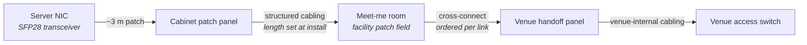
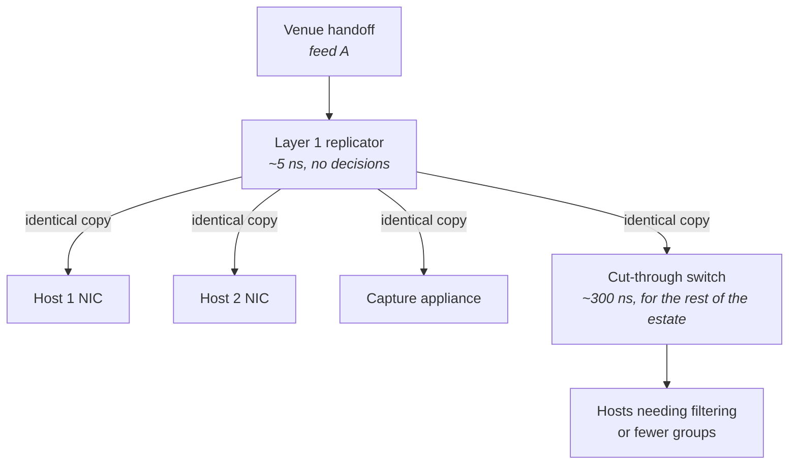
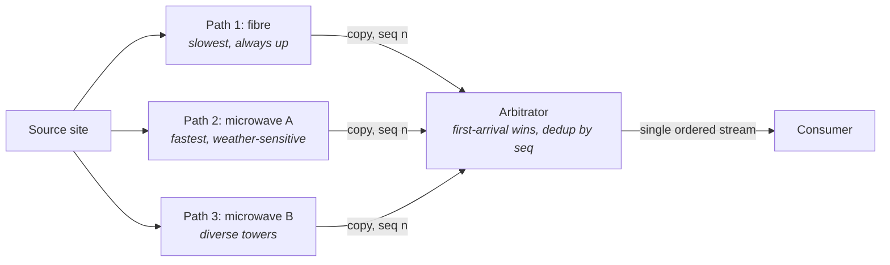
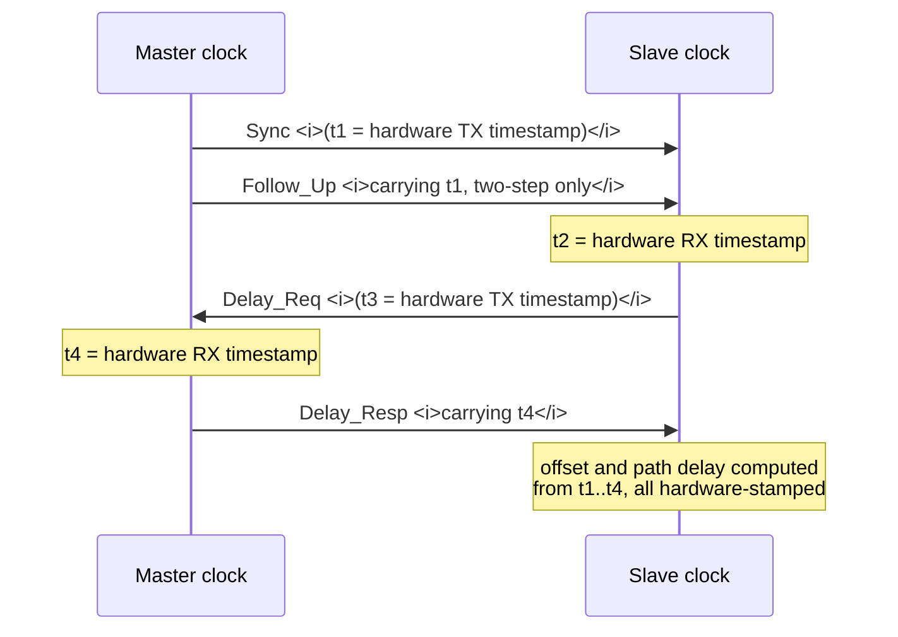
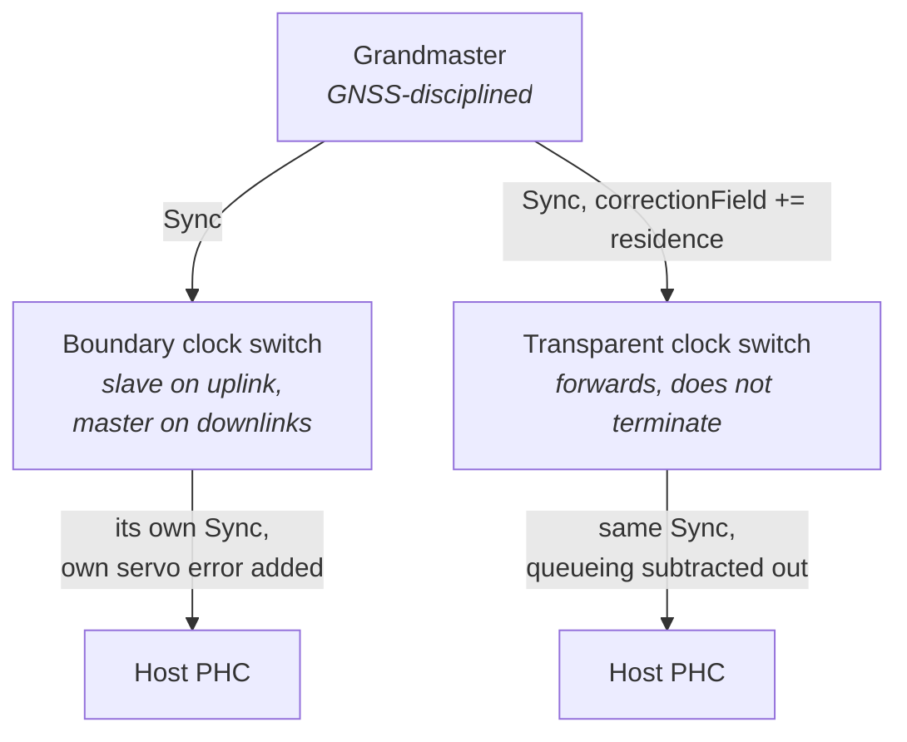
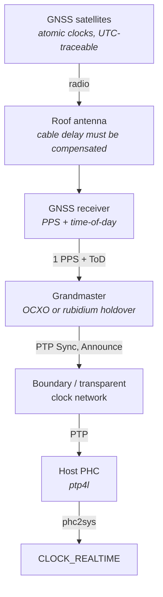
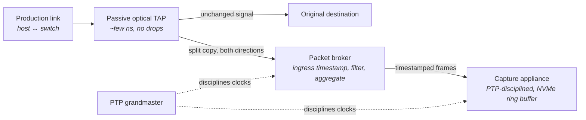

# Network Design and Operations

Every chapter so far has been about things you can change from a keyboard. You can pin a thread, size
a ring, disable an offload, or rewrite a data structure, and the machine responds. This chapter is
about the part of the latency budget that is decided by where equipment is physically installed, what
was bought, and which cable was pulled through which conduit — decisions that are frequently made
once and then live for years, and that no amount of host tuning can undo.

That makes the material feel unlike the rest of the book, and engineers new to it tend to
underestimate it in a specific way. They have internalized that a syscall costs a microsecond and
that a cache miss costs a hundred nanoseconds, so they optimize hard against those numbers. Then they
discover that the cross-connect from their cabinet to the venue's handoff is thirty metres longer
than it needed to be, which is 150 nanoseconds each way, permanently — larger than the win from three
weeks of careful hot-path work. Or they discover that the switch between them and the handoff is a
general-purpose store-and-forward device adding several microseconds per hop. Or that a burst of
traffic lasting forty microseconds, invisible in every monitoring graph they have, is filling a switch
buffer and dropping the packets they most needed.

There is a second theme running through the chapter, and it is arguably more important than the
first: **you cannot manage what you cannot measure, and measuring a network requires infrastructure
of its own.** Inside a single host, the TSC gives you a cheap common time base and every component
you care about is on the same side of it (see "Clocks, Timers, and Time"). Across a network, there is
no shared clock unless you build one, and there is no view of what happened on the wire unless you
tap it. Time synchronization and packet capture are therefore not peripheral operational chores; they
are the instruments without which every other claim in this chapter is unverifiable. Chapter 7
deliberately left cross-machine time to this chapter, and roughly a third of what follows is spent on
it.

## Colocation, Cross-Connects, and Cable Length as Latency

Start with the one number that governs everything physical: light in a standard single-mode optical
fibre travels at about **5 nanoseconds per metre** — 5 microseconds per kilometre (see "The Network
Stack from the Bottom Up"). Copper direct-attach cable is close to the same, around 4.5 to 5 ns/m.
Those figures are not equipment specifications you can improve on with a better vendor; they follow
from the refractive index of the medium, and the only lever they expose is *length*.

Colocation is the direct consequence. If a venue's matching infrastructure is in a particular
building, then a participant 30 km away pays 150 µs of one-way propagation that no host tuning can
recover, while a participant in the same building pays a few hundred nanoseconds. That gap is four
orders of magnitude, which is why access to the building itself became a product: datacentre
operators and venues sell rack space in the same facility, and the entire low-latency industry
arranges itself around that fact. For our purposes the trading motivation stops there. What matters is
the engineering consequence: **once you are in the building, the remaining physical latency is a
matter of metres, and metres are worth optimizing.**

The physical path from your server to a venue's handoff has more segments than most engineers expect,
and each one contributes. Your NIC connects to a patch panel at the top or bottom of your cabinet.
That panel is wired to a patch panel in a **meet-me room** — a neutral space in the facility where
tenants can be interconnected. From there, a **cross-connect** — a dedicated physical cable, ordered
from and installed by the facility operator, not a network service — runs to the counterparty's
equipment or to their own patch panel. Each hop involves connectors, and each patch cable adds its
own length. A cross-connect ordered casually may be routed via a cable tray that takes a scenic route
around the hall.



The diagram is worth reading as a bill of materials rather than a topology:

- **Every segment is separately procured**, so nobody owns the end-to-end length unless someone
  explicitly measures it.
- **The cross-connect is the segment you negotiate**, and facility operators will normally tell you
  its installed length if you ask; some will route a shorter path on request.
- **Patch cables inside your own cabinet are the segment you control outright**, and a spare 10 m
  cable coiled behind a server is 50 ns each way that you are paying for aesthetics.

There is a fairness dimension that shows up as a design constraint rather than an optimization
opportunity. Several major venues **length-equalize** their colocation cross-connects: every cabinet
in the colocation hall is given a cable of identical length to the handoff, regardless of physical
distance, with the slack coiled. The stated purpose is to remove the advantage of being physically
nearer to the venue's own equipment. The engineering consequence for you is that in an equalized
facility, cable length between your cabinet and the handoff is *not* a lever, and effort spent
lobbying for a shorter run is wasted. Confirm which regime you are in before optimizing; this is a
question for the facility, not something you can infer from a traceroute.

Connectors and media conversions matter less than people assume but are not free. A fibre connector
pair adds essentially no latency — it is a few centimetres of glass — but it adds optical loss, and
loss budgets are what eventually break a link. Optical transceivers do add real time: an SFP+ or SFP28
module performs serialization and deserialization, and the round trip through a module pair is on the
order of tens of nanoseconds. Direct-attach copper cable (DAC) skips the optical conversion entirely
and is measurably lower latency than an optical pair over the same short distance, which is why
in-rack links in latency-sensitive designs are usually DAC rather than fibre.

**Failure mode: your measured round-trip time to a peer in the same building is far larger than the
straight-line distance implies.** Symptom is, say, 40 µs of RTT to a host you believe is 100 m away,
where the physics allows about 1 µs. Cause is that the fibre is not taking the route you assumed —
it may transit another floor, another building on the campus, or a carrier's equipment. Confirm by
asking the facility for the as-built length of each cross-connect and comparing the sum against 5 ns/m
against your measured one-way delay; the residual is equipment, not cable.

**Failure mode: a link that worked at 10 Gb/s fails or errors at 25 Gb/s after an upgrade.** Symptom
is a link that will not come up, or comes up and shows rising CRC errors. Cause is usually an optical
power budget that was adequate at the slower rate and is not at the faster one — often because a
passive tap, an extra patch panel, or a dirty connector was added at some point. Confirm with
`ethtool -m <iface>`, which reads the transceiver's diagnostic monitoring page and reports received
optical power; compare it against the module's specified receive sensitivity.

**Try it:** build a physical map of your own host's connectivity without leaving the shell. Install
`lldpd` and run `lldpcli show neighbors details`. The **Link Layer Discovery Protocol (LLDP)** is a
layer 2 protocol in which switches periodically advertise their identity, port, and capabilities on
every port; the output tells you the exact switch name, physical port ID, and port description your
NIC is plugged into. Cross-check with `ethtool <iface>` for negotiated speed and `ethtool -m <iface>`
for the transceiver type and its optical levels. Write down the chain — most engineers have never
verified which port they are actually on, and cabling records are frequently wrong.

## Choosing a Switch, and What Port-to-Port Latency Does Not Tell You

Chapter 8 established the mechanism: store-and-forward switches wait for the whole frame before
transmitting and therefore add its full serialization delay, while cut-through switches begin
transmitting after reading enough header to make a decision, giving a small and largely frame-size
independent port-to-port latency (see "Buses, Devices, and I/O Hardware"). It also gave the classes:
roughly 1–20 µs for a general-purpose store-and-forward device, 500 ns to 2 µs for ordinary
cut-through top-of-rack silicon, 100–400 ns for purpose-built low-latency switches, and single-digit
nanoseconds for a layer 1 device that does not inspect frames at all.

What that framing leaves out is that **port-to-port latency is a marketing number measured under
ideal conditions**, and several other properties of the same device can cost you more than the
difference between two vendors' quoted figures. A switch quoted at 350 ns port to port might be
sitting behind a forward error correction layer that adds more than that, or might be configured in a
mode where cut-through is silently disabled. Reading the datasheet number alone is how people end up
surprised.

The first and most commonly missed of these is **forward error correction (FEC)**. At 25 Gb/s and
above, the raw bit error rate of the electrical or optical channel is high enough that the standards
define an error-correcting layer beneath the MAC. Reed-Solomon FEC — the variant required for most
25G and 100G reaches — operates on blocks of symbols, which means the receiver must accumulate a full
codeword before it can decode and pass data up. That accumulation is latency, and it is added at
*every link*, in *both directions*. Order-of-magnitude, RS-FEC costs on the order of 100–250 ns per
link direction; the lighter-weight BASE-R ("firecode") FEC costs substantially less; and short
direct-attach copper runs can often be operated with FEC disabled entirely, at some risk of
uncorrected errors.

This produces a genuinely counter-intuitive result that is worth carrying around: **for very small
frames over a short link, 10 Gb/s can beat 25 Gb/s.** A 100-byte frame serializes in about 80 ns at
10 Gb/s and about 32 ns at 25 Gb/s — a saving of roughly 48 ns — but 10GBASE-R defines no FEC while
25G commonly runs RS-FEC, which can add several times that. Turn FEC off on the 25G link and it wins
again. Whether you can turn it off depends on the cable, the transceivers, and both endpoints
agreeing, and it is a genuine reliability trade rather than a free win.

| Property | What it actually controls | How to check on the host side |
|---|---|---|
| **Forwarding mode** | Whether frame size shows up as latency | Measure latency versus frame size; a flat line means cut-through |
| **FEC encoding** | ~100–250 ns per link direction for RS-FEC | `ethtool --show-fec <iface>`; set with `ethtool --set-fec <iface> encoding off\|baser\|rs\|auto` |
| **Media type** | Optical transceiver pairs add tens of ns over DAC | `ethtool -m <iface>` identifies the module |
| **Buffer architecture** | Whether one congested port starves another | Switch-side statistics only; not visible from the host |
| **Replication behaviour** | Whether multicast receivers are served simultaneously or in sequence | Capture at two receivers with a common clock |
| **Timestamping support** | Whether the switch can stamp frames for you | Vendor feature; see the capture section |

Two further switch properties matter for latency-critical designs and do not appear in a port-to-port
figure at all.

**Replication order for multicast.** A switch receiving one frame that must go to twelve ports has to
produce twelve transmissions. Some silicon does this from a shared buffer with a fixed port ordering,
so port 1's copy leaves measurably before port 12's; some does it with genuinely parallel egress. The
spread between first and last copy is usually tens to low hundreds of nanoseconds, it is stable per
device, and it is invisible unless you capture at two receivers against a common clock. When many
hosts consume the same feed, this is a real and permanent difference between the hosts.

**Oversubscription and the fabric.** A switch with 48 ports at 25 Gb/s does not necessarily have the
internal capacity to forward all of them simultaneously at line rate. Single-chip low-latency switches
usually do; multi-chip chassis switches often do not, and the internal fabric introduces both extra
latency and a second place for queueing to occur. For a latency path, a single-ASIC device with no
internal hop is preferable to a larger chassis, even when the chassis quotes a similar port-to-port
number for a best-case path.

**Failure mode: latency grows linearly with frame size on a path you believe is cut-through.**
Symptom is that a plot of median RTT against payload size has a slope several times steeper than one
link's serialization. Cause is a store-and-forward hop, or a cut-through switch that fell back to
store-and-forward because the ingress and egress port speeds differ. Confirm with the frame-size slope
test from "Buses, Devices, and I/O Hardware", then check the port speeds along the path — a 10 Gb/s
host port feeding a 25 Gb/s uplink forces buffering in that direction regardless of configuration.

**Failure mode: an upgrade from 10G to 25G made small-message latency worse.** Cause is RS-FEC on the
new links. Confirm with `ethtool --show-fec <iface>` on both ends; if it reports RS encoding active,
evaluate whether the link's media supports `off` or `baser`, and measure both.

**Try it:** enumerate the negotiated state of your own links completely. Run `ethtool <iface>` for
speed, duplex, and auto-negotiation state; `ethtool --show-fec <iface>` for the FEC mode actually in
use; `ethtool -m <iface>` for the transceiver type and optical power; and `ethtool -k <iface>` for the
offloads currently enabled (see "The Linux Networking Stack"). Record all four for every interface on
a latency path. Configuration drift on these settings is common after maintenance, and a single link
that renegotiated to a different FEC mode is a permanent, silent latency regression.

## Microbursts, Buffer Occupancy, and Diagnosing Drops

A **microburst** is a period — typically microseconds to a few milliseconds — during which the
instantaneous offered rate at a port exceeds its capacity, even though the average rate over any
conventional measurement interval is low. This is the single most common source of unexplained
network latency and loss in a well-built low-latency network, and it is difficult to diagnose for a
structural reason: **every standard monitoring tool averages over an interval far longer than the
burst.**

Consider the arithmetic. A 10 Gb/s port transmits 1.25 gigabytes per second, so a 1 megabyte burst
occupies the port for 800 microseconds. If your monitoring polls interface counters every 30 seconds
— which is typical — that burst appears as 1 MB spread over 30 s, or about 267 kb/s, which on a
10 Gb/s link reads as 0.003% utilization. The graph is flat. Meanwhile, for 800 µs the port was at
100%, a queue built up behind it, every frame in that queue experienced delay proportional to its
position, and if the queue exceeded the buffer, frames were discarded. Both the graph and the
complaint are accurate.

Bursts are not an anomaly in this environment; they are the normal shape of the traffic. A market data
feed is quiescent and then emits a large number of messages within a few microseconds when something
happens — the traffic is event-driven, and events are correlated across instruments (see "UDP and
Multicast"). That is the systems requirement it imposes: the network and the receiving host must
absorb a burst whose peak rate is many times the average, and every buffer along the path is either
big enough or it is not.

A burst travelling from the venue handoff to your application passes through three distinct buffers in
series — the switch's egress buffer, the NIC's receive ring, and the socket receive buffer — and any
one of them can be the one that overflowed. Confusing them wastes days:

- **The switch egress buffer** fills when the aggregate arriving rate destined for one port exceeds
  that port's line rate — the classic case is many-to-one **incast**, where several sources transmit
  to one destination at once. Overflow here shows up as a switch discard counter and as a gap in your
  received sequence numbers, with nothing wrong on the host.
- **The NIC receive ring** fills when frames arrive faster than the host can free descriptors, which
  happens if the driver's poll loop is delayed or if the ring is small (see "Buses, Devices, and I/O
  Hardware"). Overflow here typically shows as a counter with `missed`, `no_buffer`, or `fifo` in its
  name under `ethtool -S`.
- **The socket receive buffer** fills when the kernel has the data but your application has not read
  it fast enough. Overflow here is counted as a UDP receive buffer error, and it is a host-scheduling
  problem, not a network problem.

The distinction between them is the whole diagnosis, and it is decided entirely by which counter
increments. That is why the mechanical part of this section is a counter inventory rather than a
theory.

| Where it dropped | Counter to read | Command |
|---|---|---|
| Upstream switch | Per-port discards, buffer high-water marks | Switch CLI or telemetry; not visible from the host |
| NIC hardware ring / FIFO | `rx_missed_errors`, `rx_no_buffer_count`, `rx_fifo_errors` (names vary by driver) | `ethtool -S <iface>` |
| Driver / kernel receive path | `rx_dropped` | `ip -s -s link show dev <iface>`, `/proc/net/dev` |
| Socket receive buffer | `RcvbufErrors`, `InErrors` | `nstat -az \| grep -i udp`, `netstat -su`, `/proc/net/snmp` |
| Per-socket, right now | `Recv-Q` and socket memory | `ss -u -m -a` |
| Egress qdisc | `backlog`, `dropped`, `overlimits` | `tc -s qdisc show dev <iface>` |

Two warnings about that table. First, **NIC counter names are vendor-specific and not standardized** —
Intel, Mellanox/NVIDIA, Broadcom, and Solarflare/AMD parts all name their drop counters differently,
and some expose per-queue variants. Do not memorize a name; dump everything with
`ethtool -S <iface>` and look for anything containing `drop`, `discard`, `err`, `miss`, `nobuf`, or
`fifo`. Second, several of these counters are aggregates that combine unrelated events, so a rising
number tells you where to look next rather than what happened.

On the transmit side, the equivalent visibility comes from the queueing discipline. `tc -s qdisc show
dev <iface>` reports, per queue, the number of bytes and packets sent, the current `backlog` in bytes
and packets, and cumulative `dropped` and `overlimits` counts. A nonzero instantaneous backlog on a
latency path means your own transmissions are queueing inside the host before they reach the wire —
which is worth knowing, because it is a host problem with a host fix (see "The Linux Networking
Stack"). Note that a kernel-bypass path does not traverse the qdisc layer at all, so these counters
stay at zero and tell you nothing (see "Kernel Bypass").

There is one more mechanism that turns a local burst into a global problem: **Ethernet flow control**,
also called pause frames (IEEE 802.3x). When a receiver's buffer fills, it can transmit a pause frame
telling the sender to stop for a specified time. This converts a drop into a delay, which sounds like
an improvement and is usually a disaster for latency. A pause frame stops *all* traffic on the link,
not just the flow that caused the congestion, so one congested destination stalls every other
conversation sharing that link — head-of-line blocking at layer 2. Worse, the congestion propagates
upstream hop by hop as each device pauses its own senders. On a latency-critical network, standard
link-level pause is normally disabled and losses are handled by the application layer instead.

**Failure mode: sequence gaps in a feed with every host-side counter at zero.** Symptom is missing
messages with clean `ethtool -S`, clean `nstat`, and no socket errors. Cause is a discard in an
upstream switch, almost always an egress buffer overflow during a microburst. Confirm by reading the
switch's per-port discard counters and buffer high-water-mark statistics, and by capturing at a tap on
both sides of the suspect switch — the frame present on ingress and absent on egress localizes it
exactly.

**Failure mode: drops appear only under load and only on one receive queue.** Symptom is a rising
`rx_missed_errors` or per-queue drop counter for a single queue while others are clean. Cause is that
receive-side scaling has hashed a heavy flow onto one queue whose handling core is also doing
something else, so descriptors are not replenished fast enough. Confirm by reading the per-queue
counters in `ethtool -S <iface>` and correlating with per-core softirq time in `/proc/softirqs` and
interrupt counts in `/proc/interrupts` (see "The Linux Networking Stack").

**Failure mode: `UdpRcvbufErrors` climbs while the NIC counters stay clean.** Symptom is loss that
correlates with application pauses rather than with traffic peaks. Cause is that the socket buffer
overflowed because the reading thread was descheduled, blocked, or garbage-collecting. Confirm with
`ss -u -m` during the incident: a large `Recv-Q` with the drop counter rising is conclusive, and the
fix is on the host — larger `SO_RCVBUF`, a dedicated pinned reader, or busy polling — not on the
network.

**Failure mode: every conversation on a link stalls at once, periodically.** Symptom is
synchronized multi-millisecond delays across unrelated flows. Cause is pause frames. Confirm by
checking `ethtool -a <iface>` for the negotiated pause settings and looking for `rx_pause` and
`tx_pause` counters in `ethtool -S <iface>`; if they are rising, flow control is active. Disable with
`ethtool -A <iface> rx off tx off`, and make the same change on the switch side, since pause must be
disabled at both ends to be effective.

**Try it:** catch a microburst that your monitoring cannot see. Poll a single interface counter at
high frequency — read `/sys/class/net/<iface>/statistics/rx_bytes` in a tight loop with a 1 ms sleep,
recording each value and a timestamp — and compute the implied instantaneous rate for each interval.
Compare the peak of that series against the average over the whole run. On any real feed the ratio
will be large. Then repeat with a 1 s sampling interval and observe the peak disappear entirely; that
disappearance is exactly what your monitoring system is doing.

**Try it:** watch the receive path fill up. While a burst-heavy feed is running, sample
`ss -u -m -a` repeatedly and record the `Recv-Q` values, and in parallel sample
`nstat -az UdpRcvbufErrors`. If `Recv-Q` peaks well below the buffer size and errors stay at zero, the
host is keeping up. If `Recv-Q` reaches the buffer limit at the moment errors increment, you have
directly observed the overflow.

## Link Aggregation and Redundancy

The obvious way to make a link both faster and more reliable is to use two of them. **Link
aggregation** — standardized as IEEE 802.3ad and negotiated with the Link Aggregation Control
Protocol (LACP) — bundles several physical links into one logical link, and Linux implements the host
side as bonding or teaming. It is one of the most widely deployed networking features in existence,
and it is also one of the most frequently misunderstood in a latency context, because of a property
that follows directly from how packet networks work.

**Aggregating two 10 Gb/s links does not give you a 20 Gb/s link.** It gives you two 10 Gb/s links
with a distribution function in front of them. The reason is packet ordering: if consecutive frames
of the same conversation were sprayed across both members, they would arrive out of order whenever the
two links had different queue depths, and out-of-order delivery breaks TCP's fast-retransmit heuristics
and complicates any sequenced UDP consumer (see "TCP In Depth" and "UDP and Multicast"). To avoid
that, every practical implementation hashes each frame's header fields to select a member link, so
that all frames of a given flow deterministically take the same member and stay in order.

The consequences follow immediately, and they are what interviewers probe:

- **A single flow never exceeds one member link's rate.** Two bonded 10 Gb/s links give a single TCP
  connection 10 Gb/s, not 20.
- **Aggregation does not reduce latency.** A frame traverses exactly one member link, at that link's
  speed, with that link's queue. The best case is unchanged and the tail can be worse, because you
  now have two queues that might be the one you land in.
- **Hash polarization creates imbalance.** If the traffic consists of a small number of flows, or if
  every device in the path uses the same hash inputs, load can concentrate on one member while
  another sits idle. A "20 Gb/s" bundle then drops packets at 10 Gb/s of offered load.
- **The hash inputs are configurable and matter.** Linux exposes this as `xmit_hash_policy`, with
  options including `layer2` (MAC addresses only), `layer2+3` (adds IP addresses), and `layer3+4`
  (adds port numbers). Hashing on layer 2 alone with a single peer MAC address puts everything on one
  member.

For a latency-critical path, aggregation is usually the wrong tool, and the right structure is
**parallel independent paths rather than a bundled one**. Instead of bonding two NICs into one logical
interface, run two entirely separate networks — commonly called A and B — with separate switches,
separate cabling, and separate power, and have the application receive both. This is the standard
architecture for market data delivery, where the venue itself publishes two identical copies of every
feed on independent infrastructure. The consumer takes whichever copy of each message arrives first
and discards the duplicate.

The structural difference is that a bundle is two cables into one switch, while A/B is two cables into
two switches with nothing shared between them:

- **A bundle shares fate at the switch**, so a switch failure or a switch software upgrade takes the
  whole bundle down even though two cables survive.
- **A/B paths share nothing**, so a failure removes one copy of the data and the consumer continues on
  the other with no failover event at all — the recovery time is zero because nothing had to be
  detected or switched.
- **A/B costs duplicate work at the host**: two receive paths, two sets of buffers, and a
  deduplication step. That cost is the price of eliminating failover latency.

Failover *time* is the thing to reason about when you do use redundancy that requires detection.
Link-down detection on a directly connected fibre is fast — the physical layer notices loss of light
in microseconds and the driver reports carrier loss promptly — but detection of a *soft* failure,
where the link stays up and traffic silently stops, depends on a protocol timer. LACP in its fast mode
transmits every second and declares a member dead after three missed frames, so roughly 3 seconds;
slow mode is 30 seconds per transmission and correspondingly worse. Spanning-tree reconvergence, if
your design permits loops at all, is worse still. On a latency-critical network, spanning tree is
normally eliminated by design rather than tuned, because its convergence behaviour is measured in
seconds.

| Mechanism | Detects | Typical recovery | Latency during normal operation |
|---|---|---|---|
| **A/B independent feeds** | Nothing — both always run | Zero; the surviving copy was already arriving | Best of the two paths |
| **Carrier loss on a bonded member** | Physical link down | Milliseconds | Unchanged |
| **LACP timeout, fast rate** | Soft failure of a member | ~3 s | Unchanged |
| **LACP timeout, slow rate** | Soft failure of a member | ~90 s | Unchanged |
| **Spanning tree reconvergence** | Topology change | Seconds | Unchanged, but blocks links |

There is also a host-side cost worth knowing. The bonding driver sits in the transmit path as an
additional layer that selects a member and re-queues the frame, which adds a small amount of per-packet
work and, more importantly, an extra software layer whose behaviour under load you now have to
reason about. Kernel-bypass stacks generally attach to a physical function directly and do not see the
bond at all, so a design that relies on bonding for redundancy and on bypass for latency has to
resolve that contradiction explicitly — usually by doing the A/B selection in the application (see
"Kernel Bypass").

**Failure mode: an aggregated bundle drops packets at half its nominal capacity.** Symptom is loss and
queueing while the bundle's aggregate utilization graph shows 50%. Cause is hash polarization
concentrating traffic on one member. Confirm by reading per-member byte counters — `/proc/net/bonding/<bond>`
lists each slave, and `ip -s link show dev <slave>` gives its counters — and comparing them. A large
imbalance is conclusive; the remedy is a hash policy with more entropy, set via
`/sys/class/net/<bond>/bonding/xmit_hash_policy`.

**Failure mode: a link fails and traffic stops for seconds rather than milliseconds.** Cause is that
the failure was soft — the optical link stayed up while the far end stopped forwarding — so recovery
waited for an LACP timeout rather than for carrier loss. Confirm by reading `/proc/net/bonding/<bond>`
for each slave's MII status and LACP state and correlating the transition time against your outage.
The structural fix is a design that does not require detection.

**Try it:** inspect a bond's real state rather than its configured state. `cat /proc/net/bonding/bond0`
shows the mode, the hash policy in force, each slave's link status, its LACP actor and partner state,
and its MAC. Then compare per-slave traffic with `ip -s link show dev <slave>` for each member. Do this
on a production bond and you will very often find that one member carries the large majority of the
traffic.

## Multicast Distribution Architecture

Chapter 18 covers the protocol machinery — the UDP semantics, IGMP group management, switch snooping,
and gap detection (see "UDP and Multicast"). This section is about the physical and topological
question that sits on top of it: given one stream arriving from a venue handoff and *N* hosts that
each need every byte of it, what equipment makes the copies, and what does each choice cost?

The naive answer is that the switch does it. A switch receiving a multicast frame replicates it to
every port that has a listener, which is exactly what you want functionally. The problem is that
replication happens inside the switch's forwarding pipeline, so every receiver pays that switch's
port-to-port latency, and — as noted earlier — receivers may not be served simultaneously. Adding a
second layer of switching to reach more hosts adds another port-to-port latency to everyone behind it.
With a low-latency cut-through switch at 300 ns per hop, a two-tier distribution network costs each
host 600 ns before the packet reaches its NIC, plus whatever queueing occurs.

The alternative is to replicate at layer 1. A **layer 1 switch** or optical splitter takes an incoming
signal and reproduces it on several outputs without decoding frames at all, at a cost of a few
nanoseconds (see "Buses, Devices, and I/O Hardware"). It cannot make forwarding decisions, cannot
filter groups, and cannot merge traffic, so it works only where the distribution is fixed: one
incoming feed, a known set of consumers, all of whom want everything. That is precisely the shape of a
market data distribution tree, which is why layer 1 replication appears in these designs and almost
nowhere else.



The topology in the diagram encodes a specific set of trade-offs:

- **The hosts that need the lowest latency hang directly off the layer 1 device**, paying nanoseconds
  and receiving every group whether they want it or not.
- **Everything else sits behind a switch**, where IGMP snooping can restrict which groups reach which
  port and where the traffic can be mixed with other flows.
- **Capture takes a copy from the same replication point**, so the capture sees exactly what the hosts
  see (more on this below).
- **Port count is the constraint**: a layer 1 device fans out to a fixed number of outputs, and each
  additional split reduces optical power, so the depth of the tree is limited by the optical budget
  rather than by logic.

The cost of the layer 1 approach is that every attached host receives every group at full rate. A feed
that runs at 2 Gb/s peak arrives at a 10 Gb/s NIC in its entirety, and the host must filter in
hardware or software. NIC-level multicast MAC filtering handles some of this, but there is a wrinkle
that catches people out: **the mapping from an IPv4 multicast group address to an Ethernet multicast
MAC address discards bits.** Only 23 bits of the 28-bit group address are carried into the MAC, so 32
different groups map to the same MAC address. A NIC filtering purely on MAC address will therefore
deliver groups the host never joined, and the kernel must discard them — burning PCIe bandwidth,
descriptors, and CPU on traffic you did not ask for. A group addressing plan that avoids collisions
within a single distribution domain is a real design task.

The other architectural decision is **static versus dynamic group membership**. IGMP is a dynamic
protocol: hosts join, switches snoop the joins and build forwarding state, and membership times out if
nobody refreshes it. That dynamism has failure modes — a missed query, a snooping table entry aging
out, a switch losing the querier — and each one manifests as traffic stopping for a group for a period
measured in tens of seconds. On a fixed distribution tree where the same hosts always want the same
groups, many designs configure the forwarding state statically on the switch instead, removing the
protocol from the failure surface entirely. The trade is operational: static state must be maintained
by hand and does not follow hosts when they move.

A related hazard is **unregistered multicast flooding**. If a switch has snooping enabled but no
forwarding entry for a group — because nobody has joined, or because the snooping state was lost — its
default behaviour for unknown multicast is typically to flood the frame to all ports in the VLAN. On a
network carrying a high-rate feed, that turns one group into traffic on every port simultaneously, and
hosts that never joined it now spend receive bandwidth and CPU discarding it. This is the mechanism
behind most "multicast storms," and it is a configuration property of the switch rather than something
the host can defend against.

**Failure mode: a host receives traffic for groups it never joined.** Symptom is unexpected packets
visible in a capture, or NIC receive counters much higher than the joined groups' rates explain. Cause
is either 32:1 multicast MAC aliasing or unregistered-multicast flooding on the switch. Confirm by
listing the groups the host has actually joined with `ip maddr show dev <iface>` and comparing against
`/proc/net/igmp`, then capturing and checking whether the unexpected groups' MAC addresses collide
with a joined group's — if they do, it is aliasing; if not, it is flooding.

**Failure mode: a feed stops for one group, for tens of seconds, and then resumes.** Symptom is a
clean gap affecting exactly one group while others continue. Cause is IGMP snooping state expiring —
often because the network has no IGMP querier after a topology change, so no membership queries are
sent and every snooping entry ages out together. Confirm by checking whether the host's IGMP
membership is still present in `/proc/net/igmp` during the outage; if the host still believes it is
joined while traffic has stopped, the loss of state is upstream.

**Failure mode: joining more groups than expected silently fails.** Symptom is that some joins appear
to succeed but no traffic arrives for later groups. Cause is the per-socket multicast membership limit.
Confirm by reading `sysctl net.ipv4.igmp_max_memberships` and counting the groups in `/proc/net/igmp`;
the default is a few tens per socket and a busy consumer can exceed it.

**Try it:** map the multicast state of a running host. `ip maddr show` lists every multicast address
the interfaces are subscribed to at both layer 2 and layer 3; `/proc/net/igmp` shows the IPv4 group
memberships per interface with their reporter state; and `/proc/net/dev_mcast` shows the hardware
filter entries actually programmed into the NIC. Compare the three. The layer 2 list will be shorter
than the layer 3 list if aliasing is occurring, and any entry present in the hardware filter that you
did not join deliberately is worth explaining.

## Line Arbitration and Diverse Paths

Once a path leaves the building, redundancy stops being a matter of two cables and becomes a matter of
two *routes*, and the reasoning changes. A wide-area link between two cities can be interrupted by a
backhoe, a fire, a power failure at a regeneration site, or a carrier's maintenance window, and none
of those is detectable in advance. The standard response is to buy more than one path and use them
simultaneously.

The naive form of this is active/standby: use path 1, detect failure, switch to path 2. It is simple,
and for a latency-critical stream it is the wrong shape, because detection takes time and because the
standby path's health is unknown until you need it. The better form is **line arbitration**: run
identical copies of the same data over every available path simultaneously, and at the receiving end
take the first copy of each message to arrive, discarding the rest by sequence number.

Line arbitration has three properties that are worth stating explicitly, because they are what make it
attractive beyond redundancy.

**The latency you experience is the minimum over all paths, per message, not per path.** If path A is
usually faster but experiences a 200 µs queueing event, path B's copy of the messages sent during that
window arrives first and is used. You get the better of the two on every individual message, which is
strictly better than the better of the two on average.

**Failure requires no detection and no action.** If a path goes down entirely, its copies simply stop
arriving and the arbitrator continues emitting messages from the surviving path. There is no timeout,
no reconvergence, and no gap — the recovery time is zero because nothing failed over.

**It requires a sequence number and a deduplication buffer.** The arbitrator must recognize that a
message arriving on path B is the same message it already emitted from path A. That means the payload
must carry a sequence identifier, and the arbitrator must retain recently seen identifiers for at
least as long as the maximum delay difference between paths. If path A is 4 ms faster than path B, the
dedup window must exceed 4 ms, and the arbitrator's memory must hold every message seen in that window.



The diagram makes the placement question visible, and placement is the main engineering decision:

- **The arbitrator must sit downstream of all paths**, so it is necessarily at the receiving site.
- **Every microsecond spent in the arbitrator is added to the fastest path's latency**, which is why
  arbitration in these designs is frequently implemented in an FPGA rather than in software — the
  fixed, low, deterministic latency of a hardware implementation matters more than its raw speed (see
  "Buses, Devices, and I/O Hardware").
- **The dedup window sizing is a memory-versus-correctness trade**: too small and you re-emit
  duplicates when a path lags; too large and you hold state proportional to the message rate times the
  window.

**Diverse paths** is the discipline of ensuring the routes actually are independent, and it is harder
than buying from two vendors. Carriers lease capacity from each other, and two circuits sold as
diverse routinely share a conduit, a bridge crossing, a building entrance, or a single amplifier hut.
The formal concept is the **shared risk link group (SRLG)** — a set of circuits that will fail
together because they share a physical element. Real diversity requires the carrier to disclose the
route at the level of physical structures, and requires you to check the two routes for common
elements at every scale: different conduits, different building entry points, different meet-me rooms,
different power feeds, and, inside your own facility, different cabinets and different upstream
switches.

The same principle applies inside the building, where it is cheaper to get right. An A path and a B
path that both terminate on the same switch, or draw power from the same distribution unit, or run
through the same cable tray, are one path with extra cost.

**Failure mode: two "diverse" circuits fail simultaneously.** Symptom is total loss of a
supposedly redundant wide-area path. Cause is a shared physical element that neither carrier disclosed.
There is no host-side tool for this; confirmation is a route audit against the carriers' as-built
records, requested explicitly and compared structure by structure. The operational lesson is that
diversity is a contractual and documentary property, verified on paper, not something you can test
except by outage.

**Failure mode: the arbitrated stream emits duplicates during a path degradation.** Symptom is the
consumer seeing the same sequence number twice, correlated with one path slowing rather than failing.
Cause is a deduplication window shorter than the current inter-path delay difference. Confirm by
measuring the per-path arrival time of the same sequence number at the arbitrator — which requires
capture on each path input with a common clock, exactly the capability the last two sections of this
chapter exist to provide.

**Failure mode: the arbitrated stream stalls when the fastest path degrades but does not fail.** Cause
is an arbitrator implementation that waits for the expected path rather than emitting on first arrival,
or that reorders to a canonical path. Confirm by comparing the arbitrator's output timing against the
per-path input captures; if output timing tracks the slow path, the logic is not first-arrival.

## The Physics of the Fast Route: Microwave, Millimeter Wave, and Hollow-Core Fibre

Everything in this chapter so far has treated 5 ns/m in fibre as a constant of nature. It is not. It
is a property of *glass*, and there are media in which light travels faster. Over a few metres this is
irrelevant; over hundreds of kilometres it is the largest single lever available, and it is the reason
an entire category of specialized infrastructure exists.

The physics is a single relationship. Light in vacuum travels at very nearly 300,000 km/s, which is
about **3.34 nanoseconds per metre**. In a medium, it travels slower by the medium's refractive index.
Standard single-mode fibre has a group index around 1.47 at telecom wavelengths, which gives about
4.9 ns/m — the familiar 5 ns/m, and about 5 µs per kilometre. Air has a refractive index of
approximately 1.0003, essentially indistinguishable from vacuum at this precision, so a signal
travelling through air covers a metre in about 3.34 ns.

That is the whole idea. **A radio signal through air is about 1.5 times faster than light through
glass** — roughly 1.6 µs per kilometre saved, or about 33%.

| Medium | Refractive index | Time per metre | Time per 1000 km |
|---|---|---|---|
| Vacuum | 1.0 | 3.336 ns | 3.34 ms |
| Air (radio path) | ~1.0003 | ~3.34 ns | ~3.34 ms |
| Hollow-core fibre | ~1.003 and up, design-dependent | ~3.4–3.6 ns | ~3.4–3.6 ms |
| Standard single-mode fibre | ~1.47 group index | ~4.9 ns | ~4.9 ms |
| Copper twisted pair / DAC | — | ~4.5–5 ns | not used at this scale |

There is a second, independent advantage that is often larger than the medium advantage: **route
length**. Fibre follows rights of way — railways, highways, pipelines — and its physical route between
two cities is typically 15–30% longer than the great-circle distance. A microwave path is a series of
straight line-of-sight hops between towers and comes much closer to the geodesic. So a microwave route
wins twice: fewer metres, and faster metres. On a well-known long-haul corridor of roughly 1,200 km
great-circle distance, publicly discussed figures put best-case one-way fibre latency in the region of
6.5 ms and best-case microwave in the region of 4 ms — the difference being roughly a third from the
medium and the rest from the route.

### What you give up

If air is faster and straighter, the obvious question is why anything uses fibre. Three reasons, and
they are severe.

**Bandwidth.** A single fibre pair carries terabits per second using wavelength division multiplexing.
A licensed microwave link in the traditional 6–11 GHz bands carries, order-of-magnitude, tens to a
couple of hundred megabits per second per channel, depending on channel width and modulation. That is
four to five orders of magnitude less. It is enough for a carefully compressed subset of data and
nothing more, which forces a design where only the most time-critical information goes over radio and
everything else goes over fibre.

**Line of sight and hop count.** Microwave requires an unobstructed path between antennas, and the
Earth's curvature limits how far apart two towers can be for a given height — practically, hops of
tens of kilometres, up to perhaps 80 km with tall towers and favourable terrain. A 1,200 km route
therefore needs on the order of twenty hops. Each hop is a full receive-demodulate-remodulate-transmit
cycle in a radio, and even purpose-built low-latency modems add a few microseconds per hop. Twenty
hops of equipment latency is tens of microseconds — small against a 4 ms path, but not zero, and it is
why hop count is minimized aggressively and why each tower's equipment is chosen for latency rather
than throughput.

**Weather.** This is the decisive operational property. Radio at these frequencies is attenuated by
rain, and the attenuation grows sharply with frequency. In heavy rain a link's signal-to-noise ratio
drops, and the radio responds with **adaptive modulation**: it falls back to a more robust, lower-order
modulation scheme that carries fewer bits per symbol. Capacity drops, sometimes by more than half, and
in extreme conditions the link drops entirely. Fog, and the atmospheric refraction changes that cause
**multipath fading**, produce similar effects. A microwave network's availability is therefore
weather-dependent in a way that fibre's simply is not, which is precisely why the line arbitration
architecture of the previous section exists: fibre is the always-available slow path, radio is the
fast path that sometimes goes away, and the arbitrator makes the transition seamless and instantaneous.

**Millimeter wave** — typically the 70/80 GHz E-band — trades these parameters differently. The much
wider channels available at those frequencies allow gigabit-class capacity, which removes the
bandwidth objection. But rain attenuation at 70–80 GHz is far more severe than at 6–11 GHz — an order
of magnitude worse per kilometre in heavy rain — so hop distances shrink to a few kilometres and
availability degrades faster. The practical result is that millimeter wave is used for short,
high-capacity, latency-sensitive hops — between buildings in a metropolitan area, or as the final leg
into a datacentre campus — rather than for long-haul routes.

| Property | Long-haul microwave (6–11 GHz) | Millimeter wave (70/80 GHz) | Long-haul fibre |
|---|---|---|---|
| Speed in medium | ~3.34 ns/m | ~3.34 ns/m | ~4.9 ns/m |
| Route directness | Near geodesic | Near geodesic | 15–30% longer |
| Capacity per link | Tens to ~200 Mb/s | Gigabit-class | Terabits with WDM |
| Practical hop length | Tens of km, up to ~80 km | A few km | ~80–100 km between amplifiers |
| Rain sensitivity | Moderate; adaptive modulation | Severe | None |
| Availability | Weather-dependent | Weather-dependent, worse | Very high |
| Failure mode | Capacity reduction, then outage | Outage | Fibre cut |

### Hollow-core fibre

The third option attacks the problem from the other direction: keep the fibre, remove the glass. A
**hollow-core fibre** guides light through an air-filled central channel, confining it not by total
internal reflection off a lower-index cladding but by a microstructured arrangement of thin glass
membranes surrounding the core. Because the light spends the great majority of its travel in air
rather than in silica, the effective index approaches 1, and propagation approaches 3.4 ns/m — roughly
30% faster than standard fibre, capturing most of the medium advantage of radio while remaining a
cable you can pull through a duct.

Historically the obstacle was attenuation. Early hollow-core designs lost far more signal per
kilometre than solid silica fibre, which limited spans and made long-haul deployment impractical.
Fabrication has improved substantially — recent designs have reported losses approaching and in some
cases matching conventional fibre at telecom wavelengths — and the technology has moved from laboratory
to selective deployment. The deployments that matter most are short: a hollow-core run of a few hundred
metres inside or between datacentres saves a few hundred nanoseconds over the same route in standard
fibre, at a cost that is justified only where those nanoseconds are worth a great deal.

The trade summary is that hollow-core fibre offers most of radio's speed advantage with fibre's
immunity to weather and fibre's capacity, at high cost, limited availability, and with the route
still constrained to whatever ducts exist. It does not eliminate the 15–30% route-length penalty that
makes microwave attractive over long distances, which is why it complements rather than replaces
radio in these designs.

**Failure mode: a wide-area path's latency is stable but its capacity collapses periodically.**
Symptom is that the fast path stops carrying the full message rate during certain weather, while its
measured latency for the messages it does carry is unchanged. Cause is adaptive modulation on a
microwave link reducing capacity in rain. Confirm by correlating the path's delivered message rate
against the radio link's reported modulation state and received signal level, which the radio
equipment exposes; the latency of a microwave hop does not degrade gracefully, its *capacity* does.

**Failure mode: an arbitrated stream silently reverts to the slow path and nobody notices.** Symptom
is a permanent step increase in end-to-end latency with no errors anywhere. Cause is the fast path
being down or degraded while arbitration continues to work perfectly. Confirm by instrumenting the
arbitrator to report per-path arrival counts, not just output counts — an arbitrator that reports only
its output is indistinguishable from one whose fast input has been dead for a week.

**Try it:** verify the 5 ns/m figure on infrastructure you have. Measure round-trip time between two
hosts whose cable path length you know — a rack-local link and a link across a building will do — using
hardware timestamps if available, and subtract the switch port-to-port latency and the two hosts'
processing. Divide the residual by twice the cable length. You should land near 5 ns/m for fibre. Then
apply the same arithmetic to a wide-area path and compute the implied route length; the ratio of that
implied length to the great-circle distance between the sites is the route's directness factor, and it
is usually a surprise.

## Time Synchronization: NTP, PTP, Hardware Timestamping, and GPS

Everything in this chapter that involves comparing two places depends on a shared notion of time.
Measuring one-way delay across a link, correlating a capture at the venue handoff with a capture at
your host, determining which of two receivers got a multicast frame first, proving that a message was
sent before another arrived — all of these require timestamps taken on different machines to be
comparable. Chapter 7 established the local machinery: the TSC provides cheap sub-nanosecond-resolution
timestamps, but every crystal drifts, typically tens of parts per million, so two machines left alone
will disagree by hundreds of milliseconds within a day (see "Clocks, Timers, and Time"). This section
is about closing that gap, and about the fact that closing it to sub-microsecond accuracy requires a
fundamentally different mechanism from closing it to millisecond accuracy.

### The problem beneath every synchronization protocol

Every network time protocol rests on the same two-way exchange, and understanding its one weakness
explains every design decision that follows.

A client wants to know the offset between its clock and a server's. It records its own time when it
sends a request, the server records its time when the request arrives, the server records its time
when it sends the response, and the client records its own time when the response arrives. Four
timestamps: two on the client's clock, two on the server's. From those, two quantities can be
extracted. The **round-trip delay** is the total elapsed time on the client's clock minus the time the
server spent holding the request. The **offset** is the client-side timestamps' midpoint compared
against the server-side timestamps' midpoint.

Call those four timestamps t1 through t4 — they reappear in exactly the same roles in the PTP exchange
diagrammed later in this section. The critical thing this arithmetic hides is an assumption: **the
offset calculation is only correct if the path takes the same amount of time in each direction.** The protocol measures the *round trip*; to
split it into two one-way delays it must assume symmetry. If the forward path is faster than the
reverse path, the computed offset is wrong by exactly half the difference, and — this is the part that
matters — **no amount of averaging, filtering, or additional exchanges can detect or correct it.**
Asymmetry is invisible to the protocol. It can only be removed by engineering the path, or compensated
by measuring it out of band.

That single fact generates most of the requirements:

- **Paths should be physically symmetric.** Same fibre length in each direction, same equipment, same
  queue treatment. A path where one direction transits an extra hop is permanently biased.
- **Queueing is asymmetry.** A sync packet delayed 20 µs in a switch buffer in one direction and not
  the other produces a 10 µs offset error. This is why loaded networks synchronize worse than idle
  ones, and why the protocol machinery below exists.
- **Timestamps must be taken as close to the wire as possible.** Every microsecond of variable
  software delay between the wire and the timestamp is potential asymmetry.

### NTP: what it does and where it stops

The **Network Time Protocol (NTP)** implements exactly the exchange above, over UDP, with a hierarchy
of servers organized into **strata**: stratum 0 is a reference such as a GPS receiver or atomic clock,
stratum 1 is a server directly attached to one, stratum 2 synchronizes from stratum 1, and so on. A
client polls several servers at intervals of seconds to many minutes, filters the samples to reject
those with anomalous round-trip delay, selects among the servers, and steers the local clock — mostly
by adjusting its rate (slewing) rather than stepping it, so that time remains monotonic (see "Clocks,
Timers, and Time").

NTP's accuracy is bounded by the two things it does not control: the variability of the network path,
and where the timestamps are taken. Classical NTP timestamps in software, in the daemon, after the
packet has traversed the driver, the protocol stack, and the scheduler — adding hundreds of
microseconds of variable delay on a loaded machine. Over a wide-area path, delay asymmetry of
milliseconds is routine. The result is the familiar figure: NTP over the internet achieves
single-digit to tens of milliseconds; NTP on a quiet LAN achieves tens of microseconds to a few
milliseconds.

`chrony` is the modern Linux implementation and it improves on this in ways worth knowing, because a
well-configured chrony on a local network is much better than NTP's reputation suggests. It uses a
better clock model, it can discipline the clock more aggressively at startup, and — importantly for
us — it can use **hardware timestamps** for its own packets where the NIC supports them, and it can
take its reference directly from a **PTP hardware clock**.

The two commands to know are `chronyc tracking` and `chronyc sources`.

`chronyc tracking` reports the daemon's current view of its own accuracy. The fields that matter:

| Field | What it means |
|---|---|
| `Reference ID` / `Stratum` | Which source is being followed and how far from a reference clock |
| `System time` | Current estimated error of the system clock against the source |
| `Last offset` | The offset measured at the most recent update |
| `RMS offset` | Long-term average magnitude of the offset — the honest accuracy figure |
| `Frequency` | The rate correction being applied, in ppm — this is your crystal's measured drift |
| `Skew` | Estimated error bound on that frequency figure |
| `Root delay` / `Root dispersion` | Accumulated path delay and accumulated error bound back to stratum 0 |
| `Leap status` | Whether a leap second is pending |

`chronyc sources -v` lists each configured source with its stratum, poll interval, reachability
bitmask, last measured offset, and a mode/state character indicating which source is currently
selected. `chronyc sourcestats -v` adds the regression statistics chrony is using per source, including
its estimated frequency offset and skew.

**Failure mode: a host's clock is wrong by milliseconds and `chronyc tracking` reports a tiny
offset.** Symptom is that the daemon believes it is well synchronized while cross-machine comparisons
disagree. Cause is path asymmetry to the selected source — the daemon is measuring correctly and
computing the wrong answer, exactly as the symmetry assumption predicts. Confirm by adding a second,
independent source reached by a different path and comparing; a consistent disagreement between two
well-tracked sources is asymmetry, not noise.

**Try it:** measure your own machine's oscillator error. Run `chronyc tracking` and read the
`Frequency` line — it reports, in parts per million, how much faster or slower than nominal your
crystal is running, as measured against an external reference. Compare that to the 10–50 ppm range
quoted in "Clocks, Timers, and Time" and to the drift table there. Then run `chronyc sourcestats -v`
and observe how many samples chrony needed before its skew estimate became small; that settling time is
why a freshly booted host is not immediately trustworthy.

### PTP: fixing the timestamp point and the queueing

The **Precision Time Protocol (PTP)**, standardized as IEEE 1588, uses the same two-way exchange but
changes two things that together buy three to four orders of magnitude of accuracy.

The first change is **where the timestamp is taken**. PTP is designed so that the timestamp can be
applied by hardware at the point the frame crosses the physical layer — at the detection of the
start-of-frame delimiter — rather than by software after the packet has been processed. This removes
the entire variable software path from the measurement. It requires NIC support, which is why a PTP
deployment starts with checking whether your hardware can do it at all.

The second change is **making the network participate**. Under NTP, a switch is an opaque source of
variable delay. PTP defines clock types that eliminate that opacity, which we come to below.

The message exchange has a wrinkle worth understanding because it explains a configuration option you
will see. A master sends a **Sync** message and must report the exact instant it left. But the exact
instant is only known once the frame is on the wire, which is after the contents were composed. Two
solutions exist. A **one-step** clock writes the timestamp into the frame as it is being transmitted,
using hardware in the transmit path. A **two-step** clock transmits the Sync message, notes the
hardware timestamp of its departure, and then sends that timestamp in a separate **Follow_Up** message.
Two-step needs no timestamp-insertion hardware and is therefore more widely supported; one-step halves
the message count.

The reverse direction is measured by the slave sending a **Delay_Req** message, which the master
timestamps on arrival and reports back in a **Delay_Resp**. That is the end-to-end (E2E) delay
mechanism. An alternative, **peer-to-peer (P2P)**, has each link's two endpoints continuously measure
the delay of that individual link with `Pdelay_Req`/`Pdelay_Resp` exchanges, so path delay is built up
per link rather than measured end to end; P2P behaves better when the topology changes.



The diagram earns its place by showing what is different from NTP: every one of t1 through t4 is taken
by hardware at the wire, and the roles are reversed — the master is passive and the slave drives its
own correction.

Which clock is the master is not configured directly; it is elected. The **Best Master Clock Algorithm
(BMCA)** has every clock announce its own quality in periodic **Announce** messages, and every clock
independently compares the announcements it receives against its own attributes using a fixed priority
order: `priority1` (an administrative override), then `clockClass` (how the clock is traceable to a
reference), then `clockAccuracy`, then a variance measure, then `priority2`, then the clock's unique
identity as a tiebreak. The result is that the network converges on a single **grandmaster** without
central configuration, and re-converges automatically if it disappears.

PTP also has the concept of a **domain**: a number carried in every message that partitions the
network into independent synchronization hierarchies. Two domains on the same wire ignore each other
completely. A domain mismatch between a master and a slave is one of the most common and most confusing
misconfigurations, because everything looks healthy on both sides and no synchronization occurs.

### Boundary clocks and transparent clocks

A plain switch destroys PTP accuracy, and the mechanism is exactly the asymmetry problem from earlier.
A Sync message entering a switch waits in the egress queue for however long that port happens to be
busy. That wait is variable, is different in each direction, and is added to the measurement. On a
loaded network it is easily tens of microseconds, which sets a floor on accuracy far above what the
hardware timestamps could otherwise deliver. This is why "we run PTP" and "we are synchronized to
100 ns" are entirely different claims: the second requires the network to be PTP-aware end to end.

IEEE 1588 defines two ways to make a switch cooperate, and they work quite differently.

A **boundary clock (BC)** terminates PTP. It acts as a slave on the port facing the grandmaster,
synchronizes its own internal clock, and then acts as a master on all its other ports, originating its
own Sync messages from that internal clock. The queueing on each side is now measured independently by
each hop's own exchange. The downside is that error accumulates: each boundary clock adds its own
servo error to the chain, so a long cascade of boundary clocks degrades gradually.

A **transparent clock (TC)** does not terminate PTP. It forwards the message, but it measures how long
the message spent inside the device — the **residence time** — and adds that value into a field in the
message called the `correctionField`. The downstream slave subtracts the accumulated correction, so
the queueing delay is removed from the calculation without the switch ever needing to be synchronized
itself. Transparent clocks come in E2E and P2P variants matching the two delay mechanisms; the P2P
variant also corrects for the link delay of each hop.



- **A boundary clock isolates each hop's queueing** and limits the number of PTP slaves the
  grandmaster must serve, at the cost of adding its servo error to the chain.
- **A transparent clock adds no servo error** because it never disciplines itself to the master, but
  every switch in the path must support it or the uncorrected hop reintroduces the problem.
- **An unaware switch anywhere in the path** silently caps accuracy at that switch's queueing
  variability, regardless of what everything else does.

| | Boundary clock | Transparent clock | Unaware switch |
|---|---|---|---|
| Terminates PTP | Yes | No | N/A |
| Corrects for queueing | Yes, per hop | Yes, via `correctionField` | No |
| Adds servo error | Yes, one per hop | No | No |
| Grandmaster load | Reduced — one slave per BC | Unchanged — all slaves visible | Unchanged |
| Accuracy through many hops | Degrades gradually | Degrades slowly | Capped by queueing |

### Hardware timestamping and the PTP hardware clock

The hardware side of this has a piece of vocabulary that confuses people the first time. A NIC that
supports PTP contains its own oscillator and counter — a **PTP Hardware Clock (PHC)** — which is a
completely separate clock from the system's `CLOCK_REALTIME`. Linux exposes it as a character device,
conventionally `/dev/ptp0`, with metadata under `/sys/class/ptp/ptp0/`. The NIC timestamps frames
against the PHC, not against the system clock.

That separation produces a two-stage synchronization architecture that must be understood as two
separate jobs:

1. **`ptp4l` disciplines the PHC against the network.** It runs the PTP protocol on an interface,
   participates in BMCA, and steers the NIC's hardware clock to match the grandmaster.
2. **`phc2sys` copies time between the PHC and the system clock.** Normally it reads `/dev/ptp0` and
   steers `CLOCK_REALTIME` to match, so that ordinary software timestamps are also correct.

Both must be running. A very common deployment error is running only `ptp4l`, which leaves the NIC
beautifully synchronized and the system clock free-running — so hardware-timestamped captures are
correct while every application log is wrong, and the two disagree by an amount that grows over the
day.

`phc2sys` can also run in the other direction (system clock to PHC), which is what you want on a
machine whose reference is something other than PTP — for example a host whose system clock is
disciplined by a GPS-fed chrony. And on a machine with multiple PTP-capable NICs, each has its own PHC,
and they must all be brought into agreement, typically by disciplining one from the network and the
others from it.

The capability check comes first, and it is a single command:

```
ethtool -T <iface>
```

Its output lists the timestamping capabilities the driver reports, the index of the associated PTP
hardware clock, the transmit timestamping modes, and the receive filter modes. What you are looking
for:

- **`hardware-transmit (SOF_TIMESTAMPING_TX_HARDWARE)` and `hardware-receive
  (SOF_TIMESTAMPING_RX_HARDWARE)`** — without these the NIC cannot stamp at the wire and PTP will fall
  back to software timestamping with correspondingly worse accuracy.
- **`PTP Hardware Clock: N`** — the index; `N` corresponds to `/dev/ptpN`. A value of `none` means
  there is no PHC.
- **Receive filter modes** — `HWTSTAMP_FILTER_ALL` means every received frame can be stamped, which is
  what a capture host wants; a NIC that supports only PTP-specific filters can synchronize but cannot
  timestamp arbitrary traffic in hardware.

A minimal working configuration looks like this:

```
# Discipline the NIC's PTP hardware clock from the network.
# -i: interface, -m: log to stdout, -s: slave only, -2: IEEE 802.3 (layer 2) transport
ptp4l -i eth0 -m -s -2

# Copy the PHC's time onto the system clock.
# -s: source clock, -c: destination clock, -w: wait for ptp4l to synchronize first
phc2sys -s /dev/ptp0 -c CLOCK_REALTIME -w -m
```

`ptp4l`'s log lines are the primary diagnostic, and they have a fixed shape:

```
ptp4l[1234.567]: master offset       -12 s2 freq  -21567 path delay       342
```

| Field | Meaning |
|---|---|
| `master offset` | Current estimated offset from the master, in nanoseconds |
| `s0` / `s1` / `s2` | Servo state: `s0` unlocked, `s1` first update applied, `s2` locked and steering by frequency |
| `freq` | Frequency correction applied to the PHC, in ppb — the NIC oscillator's measured drift |
| `path delay` | Measured one-way path delay in nanoseconds — should be stable and should match your cable length |

`phc2sys` logs the same shape for the PHC-to-system-clock relationship. A healthy system shows `s2`,
a `master offset` oscillating in the tens of nanoseconds around zero, a `freq` value that is stable,
and a `path delay` that does not move.

For querying state rather than watching logs, `pmc` is the PTP management client. It speaks the
protocol's management messages, either over the network or over a local Unix domain socket to a running
`ptp4l` with `-u`. The queries worth memorizing:

| Command | What it tells you |
|---|---|
| `pmc -u -b 0 'GET TIME_STATUS_NP'` | Whether a grandmaster is present, its identity, and the current master offset |
| `pmc -u -b 0 'GET PARENT_DATA_SET'` | The grandmaster's identity, priority, and clock class |
| `pmc -u -b 0 'GET CURRENT_DATA_SET'` | `stepsRemoved` (hop count to the grandmaster), `offsetFromMaster`, `meanPathDelay` |
| `pmc -u -b 0 'GET PORT_DATA_SET'` | Per-port state — `MASTER`, `SLAVE`, `LISTENING`, `FAULTY` — and the peer delay |
| `pmc -u -b 0 'GET DEFAULT_DATA_SET'` | This clock's own identity, domain number, and priorities |

The `-b` argument is the boundary hop limit for the query; `-b 0` restricts it to the local clock,
higher values query further into the network.

Configuration beyond the command line lives in a `ptp4l.conf` file passed with `-f`. The settings that
come up constantly:

- **`domainNumber`** — must match the grandmaster's, and a mismatch produces total silence.
- **`network_transport`** — `L2` for raw Ethernet, `UDPv4` or `UDPv6` for IP. Layer 2 avoids the IP
  stack entirely and is common in a single broadcast domain.
- **`delay_mechanism`** — `E2E` or `P2P`, and it must match what the network's switches implement.
- **`logSyncInterval`** — the rate at which Sync messages are sent, expressed as a power of two
  seconds; more frequent syncs converge faster and track oscillator wander better, at the cost of
  traffic.
- **`priority1` / `priority2`** — the BMCA overrides that let you deterministically choose which
  grandmaster wins.
- **`slaveOnly`** — prevents this clock from ever becoming a master, which you want on every host.
- **`step_threshold`** — the offset above which the servo steps the clock rather than slewing it.
- **`boundary_clock_jbod`** — enables boundary-clock operation across NICs that do not share a single
  hardware clock.

**Failure mode: `ptp4l` reports a stable `master offset` in the tens of nanoseconds, and applications
still log times that are wrong by milliseconds.** Cause is that `phc2sys` is not running, so the PHC is
synchronized and `CLOCK_REALTIME` is not. Confirm by comparing the two clocks directly — read the PHC
with `phc_ctl /dev/ptp0 get` and compare against the system clock — and check for a running `phc2sys`.

**Failure mode: `ptp4l` never leaves servo state `s0` and reports no master.** Cause is usually a
domain mismatch, a transport mismatch (layer 2 versus UDP), or a delay-mechanism mismatch with the
network. Confirm with `pmc -u -b 0 'GET DEFAULT_DATA_SET'` to read the local domain and
`pmc -u -b 0 'GET PARENT_DATA_SET'` to see whether any parent has been identified; then verify the
grandmaster's domain and transport independently.

**Failure mode: offset is stable but wrong by a fixed amount, identical on every host behind one
switch.** Cause is path asymmetry — most often a physically longer fibre in one direction, or a switch
that is PTP-unaware in one direction of a redundant topology. Confirm by checking that `path delay`
reported by `ptp4l` matches the physical cable length at 5 ns/m; a path delay far larger than the
cable justifies indicates queueing or an unaware hop.

**Failure mode: accuracy is fine at night and degrades under daytime load.** Cause is switch queueing
affecting Sync and Delay_Req messages differently in each direction, on a path without transparent or
boundary clocks. Confirm by watching the variance of `path delay` in the `ptp4l` log across the day;
on a properly corrected path it is nearly constant, and on an uncorrected one it tracks network load.

**Failure mode: the grandmaster changes unexpectedly and every host steps its clock.** Cause is a
device that should not be eligible winning BMCA — commonly a newly installed switch or server whose
default `priority1` beats the intended grandmaster's. Confirm with
`pmc -u -b 0 'GET PARENT_DATA_SET'` before and after, comparing `grandmasterIdentity`; the fix is
explicit `priority1` values on the intended grandmasters and `slaveOnly` everywhere else.

**Try it:** establish what your hardware can actually do. Run `ethtool -T <iface>` on every interface
and record which report `SOF_TIMESTAMPING_TX_HARDWARE` and `SOF_TIMESTAMPING_RX_HARDWARE`, and which
PTP hardware clock index each maps to. Then list `/sys/class/ptp/` to see the PHCs the kernel knows
about, and read `/sys/class/ptp/ptp0/clock_name` to identify which device owns it. Many servers have
several NICs where only some are PTP-capable, and the capable one is not always the one in use.

**Try it:** watch a servo converge. Start `ptp4l -i <iface> -m -s` on a host attached to a PTP network
and watch the log from the first line. You will see it move through `s0`, `s1`, and into `s2`, with
`master offset` shrinking from potentially milliseconds to tens of nanoseconds and `freq` settling on a
stable value. That final `freq` figure, in parts per billion, is the NIC oscillator's drift — divide by
1000 to compare it against the ppm figures for system crystals in "Clocks, Timers, and Time".

**Try it:** quantify the gap between the PHC and the system clock. With `ptp4l` running but `phc2sys`
stopped, sample the offset between `/dev/ptp0` and `CLOCK_REALTIME` repeatedly over several minutes
using `phc_ctl /dev/ptp0 cmp`, and plot it. The slope is the difference between the two oscillators'
rates. Then start `phc2sys` and watch the offset collapse. This is the most direct demonstration of why
both daemons are required.

### Grandmaster architecture and GPS/PPS

Everything above distributes time. Something has to *originate* it, and that something is a
**grandmaster clock** whose own time comes from outside the building.

The near-universal source is a **Global Navigation Satellite System (GNSS)** receiver — GPS and its
counterparts. Each satellite carries atomic clocks and broadcasts its time and position; a receiver
that can see several satellites solves simultaneously for its own position and for the offset of its
local clock from the system's time scale, which is tightly traceable to UTC. A good receiver with a
clear sky view recovers UTC to within tens of nanoseconds. This is the cheapest way to get an
authoritative absolute time reference, and it is why every serious timing deployment starts on a roof.

A GNSS receiver produces two distinct outputs, and the split matters:

- **A one pulse per second (PPS) signal** — an electrical pulse whose rising edge marks the start of
  each UTC second, with jitter in the low nanoseconds. It is extremely precise and carries no
  information about *which* second it is.
- **A time-of-day message** — a serial data stream, commonly NMEA sentences, saying which second the
  next pulse corresponds to. It is informative and imprecise, arriving with millisecond-scale
  variability.

Combining them gives both: the message identifies the second, the pulse pins its boundary. Linux
represents PPS sources as `/dev/pps0` and similar, and the `pps-tools` package's `ppstest` utility
prints each pulse's arrival with the kernel's timestamp, which is the simplest way to confirm a PPS
input is alive. The linuxptp suite includes `ts2phc`, which disciplines a PTP hardware clock directly
from an external PPS input plus a time-of-day source — the tool you use when the grandmaster function
lives on a server rather than in a dedicated appliance.



The chain in the diagram has four properties that each cause real outages when neglected:

- **Antenna cable delay is a real offset.** A 60 m run of coaxial cable from roof to equipment room
  delays the signal by roughly 250–300 ns, and the receiver applies a configured compensation value.
  If nobody configured it, every clock in the building is a few hundred nanoseconds late, consistently,
  and no amount of PTP tuning reveals it.
- **Holdover determines what happens when the sky is lost.** A grandmaster that loses GNSS keeps time
  on its internal oscillator. An oven-controlled crystal oscillator (OCXO) typically holds to
  microseconds over a day; a rubidium standard does considerably better; a plain crystal is useless.
  The grandmaster advertises its degraded state through `clockClass` in its Announce messages, so
  downstream clocks can see the reference has been lost — but only if someone is watching that field.
- **GNSS is a radio signal and can be jammed or spoofed.** It arrives at extremely low power and is
  trivially disrupted, deliberately or accidentally. Serious deployments run at least two grandmasters
  with antennas in different locations, and compare them continuously.
- **The grandmaster is a single point of truth, so it needs a peer.** Two grandmasters synchronized to
  the same UTC should agree to within their combined error. Continuously monitoring the difference
  between them is the only way to detect that one has drifted, been spoofed, or lost its reference
  while still claiming health.

There is a regulatory dimension that sets a floor on all of this rather than a target: European
regulation requires participants engaged in high-frequency trading to keep business clocks within
100 microseconds of UTC with timestamp granularity of one microsecond. That is a compliance
requirement, easily met by a competent PTP deployment, and it is not the reason these networks
synchronize to tens of nanoseconds. The engineering reason is the one this chapter opened with:
comparing timestamps taken at two points on a path is only meaningful to the precision of the clocks
that took them, and the paths themselves are hundreds of nanoseconds long.

**Failure mode: every clock in a facility is offset from an external reference by a constant few
hundred nanoseconds.** Cause is uncompensated antenna cable delay at the grandmaster. Confirm by
comparing against a second, independently fed grandmaster — the constant difference will equal the
cable delay difference — and by checking the receiver's configured cable compensation against the
as-built cable length.

**Failure mode: time quality degrades slowly over hours with no configuration change.** Cause is the
grandmaster in holdover after losing GNSS, drifting on its own oscillator. Confirm with
`pmc -u -b 0 'GET PARENT_DATA_SET'` and examining the grandmaster's advertised `clockClass`, which
changes when traceability to the reference is lost; also check the receiver's satellite count, which
its own management interface reports.

**Try it:** verify a PPS input end to end if you have one. Confirm the device exists under `/sys/class/pps/`,
then run `ppstest /dev/pps0` and watch the assert timestamps. Successive pulses should be almost exactly
one second apart on the system clock; the deviation from exactly one second, expressed in parts per
million, is your system clock's rate error measured against an atomic reference — the same quantity
`chronyc tracking` reports as `Frequency`, arrived at independently.

## Network Capture: SPAN, TAPs, Packet Brokers, and Nanosecond Timestamps

The final piece of infrastructure exists because of an uncomfortable fact: **every measurement taken
inside a host measures the host.** A timestamp taken when your application reads from a socket includes
DMA, interrupt latency, softirq scheduling, protocol stack traversal, and your own wakeup — potentially
several microseconds of things that happened before your code ran (see "Clocks, Timers, and Time"). If
you want to know when a frame was actually on the wire, and if you want to compare that against when a
different frame was on a different wire, you need an observer that is not the host.

That observer needs three properties, and the architecture of a capture system is entirely a matter of
getting all three simultaneously: it must see **every** frame, it must not **perturb** the path it is
observing, and it must timestamp with enough precision and against a clock shared with every other
capture point. Chapter 23 covers what you do with the resulting traces (see "Network Debugging
Toolkit"); this section is about building the thing that produces them.

### SPAN versus TAP

The convenient way to get a copy of traffic is to ask the switch. **SPAN** — Switched Port Analyzer,
the common name for port mirroring — configures the switch to send a copy of frames from one or more
source ports to a designated destination port. It requires no new hardware, it can be turned on and off
remotely, and it can select specific traffic.

It also has three properties that disqualify it for serious measurement.

**SPAN is best-effort.** Mirroring is a low-priority function in switch silicon. Under load — which is
exactly when you are investigating — the switch will drop mirrored frames in preference to dropping
forwarded ones. The mirror silently loses precisely the traffic you were trying to capture, and
frequently does so without a counter you can see. A capture that is missing frames during a microburst
is worse than no capture, because it produces a confident wrong answer.

**SPAN can be structurally oversubscribed.** A full-duplex 10 Gb/s link carries up to 20 Gb/s of total
traffic. Mirroring both directions into a single 10 Gb/s destination port cannot work at full rate, by
arithmetic, and the excess is discarded.

**SPAN destroys timing information.** The mirrored frame is queued and forwarded like any other frame,
so its arrival at the capture host is separated from its arrival at the switch by a variable amount.
Relative ordering between frames mirrored from different source ports may not even be preserved.

The alternative is a **TAP** — a test access point, a device inserted into the physical link that
produces a copy. For optical links the good implementation is entirely passive: a fused optical
splitter divides the incoming light between the original destination and a monitor port, in a fixed
ratio such as 70/30 or 50/50. It contains no electronics, requires no power, adds a few nanoseconds of
glass, cannot drop frames because it is not making decisions, and — the property that matters most —
**cannot fail in a way that breaks the link**, because a passive splitter with no power still splits
light.

The cost is optical. Splitting the signal means each side gets a fraction of the original power, and
that loss comes out of the link's power budget. A 50/50 split costs each side roughly 3 dB plus
insertion loss, which is significant on a link that was already near its budget. This is the
engineering constraint on TAP deployment: you must know the link's loss budget before inserting one,
and the split ratio must be chosen so both the production receiver and the monitor receiver stay above
their sensitivity thresholds.

Copper TAPs cannot be passive — there is no way to split an electrically encoded signal without
regenerating it — so they contain active electronics, add real latency, and introduce a failure mode
where losing power breaks the link (mitigated by relay-based bypass, which itself takes milliseconds to
engage). This is one more reason latency-sensitive links that need monitoring are optical.

| | SPAN / port mirror | Passive optical TAP | Active copper TAP |
|---|---|---|---|
| Extra hardware | None | Splitter in the link | Powered device in the link |
| Drops frames under load | Yes, silently | No | No |
| Latency added to the production path | None | A few ns of glass | Tens to hundreds of ns |
| Fails open | N/A | Cannot fail — passive | Requires relay bypass |
| Optical power cost | None | Real; consumes loss budget | N/A |
| Timing fidelity at the capture point | Poor | Full | Full |
| Can filter or select traffic | Yes | No | No |

### Packet brokers

TAPs create a new problem: there are more monitored links than capture appliances, each TAP produces
two monitor outputs (one per direction), and capture appliances are expensive. A **network packet
broker** is a purpose-built device that sits between the TAPs and the tools and performs aggregation,
filtering, replication, and load balancing.

Its functions in a low-latency capture architecture:

- **Aggregation** — combine both directions of a link, or several links, onto one output feeding a
  single capture appliance.
- **Filtering** — forward only traffic matching a rule, so a capture appliance handling 10 Gb/s of
  capacity can monitor several links carrying mostly uninteresting traffic.
- **Replication** — send the same traffic to several tools simultaneously.
- **Load balancing** — distribute a stream across several appliances by flow hash, keeping each flow on
  one appliance so ordering is preserved.
- **Timestamping** — the important one: some brokers stamp each frame at ingress, before any
  aggregation or queueing, and append the timestamp to the frame. This moves the timestamp point back
  to the broker's input, so the broker's own queueing no longer corrupts the measurement.

That last function is what makes a broker acceptable in a measurement path rather than merely
convenient. A broker without ingress timestamping reintroduces exactly the SPAN problem — variable
queueing between the observation point and the timestamp. A broker with it is the only device in the
chain that needs a disciplined clock, and it must be disciplined by the same PTP hierarchy as
everything else.

Aggregation has an arithmetic limit that catches people. Combining both directions of a fully utilized
10 Gb/s link produces up to 20 Gb/s, which will not fit on a 10 Gb/s output. Combining four such links
produces up to 80 Gb/s. Brokers buffer, and then they drop, and unlike SPAN they at least count the
drops — but the design must respect the arithmetic rather than relying on average utilization, because
the events you care about are bursts.

### Nanosecond-precision capture

The last element is the device that writes packets to disk. A capture appliance for this environment
differs from a Linux host running `tcpdump` in three specific ways.

**It timestamps in hardware, at the wire.** The frame is stamped by an FPGA or NIC at the physical
layer as it arrives, with resolution in the single nanoseconds. This is the same mechanism PTP uses,
applied to all traffic — which is why the receive filter mode in `ethtool -T` matters: a NIC that
supports `HWTSTAMP_FILTER_ALL` can stamp arbitrary frames, while one supporting only PTP-specific
filters cannot be used this way.

**Its clock is disciplined to the same reference as everything else.** A timestamp is only comparable
against another timestamp if both clocks trace to the same source. A capture appliance whose clock is
free-running produces internally consistent traces that cannot be compared with anything, which is a
subtle and common form of useless data.

**It is engineered for sustained write throughput.** A 10 Gb/s link at line rate is 1.25 gigabytes per
second; two directions is 2.5 GB/s. Capturing that continuously requires striped NVMe storage and a
write path with no per-packet software overhead. Most deployments do not capture continuously at line
rate; they run a large in-memory or on-disk ring buffer that retains the last several minutes and
freeze it on a trigger.

There is one detail about timestamps that is small, easy to miss, and capable of invalidating a whole
analysis: **which point in the frame the timestamp refers to.** A device may stamp at the start-of-frame
delimiter or at the end of the frame. Those differ by the frame's serialization time — 1.2 µs for a
1500-byte frame at 10 Gb/s, 120 ns at 100 Gb/s. If two capture points in a comparison use different
conventions, or if one link's speed differs from the other's, the resulting one-way delay is wrong by
an amount that varies with frame size. Establishing the convention at every capture point, in writing,
is part of commissioning a capture system.



The dotted edges in the diagram are the part that is usually forgotten:

- **The TAP is in the production path and must not perturb it**, which is why it is passive and why the
  optical budget is checked before installation.
- **The broker timestamps at ingress**, so its internal queueing does not corrupt the measurement.
- **Both the broker and the appliance are PTP slaves of the same grandmaster**, which is the only thing
  that makes timestamps from different capture points comparable.
- **Nothing in the capture chain touches the host**, so a capture running at full rate costs the
  measured system exactly nothing — the property that host-based `tcpdump` cannot offer.

**Failure mode: a capture is missing exactly the frames you are investigating.** Symptom is sequence
gaps in a capture taken during an incident, with the production hosts having received the frames fine.
Cause is SPAN dropping mirrored traffic under the same load that caused the incident. Confirm by
comparing frame counts between the capture and the receiving host's `ethtool -S` receive counters over
the same interval; a shortfall in the capture with none on the host is conclusive, and the fix is a
TAP.

**Failure mode: one-way delay computed between two capture points is negative.** Symptom is a frame
apparently arriving before it was sent. Cause is one of three things: the two capture clocks are not
disciplined to the same grandmaster, a fixed offset exists between them due to path asymmetry, or the
two points use different timestamp reference points within the frame. Confirm by capturing the *same*
frame at both points on a link whose length you know and comparing the measured delta against 5 ns/m
plus the known equipment latency; a constant residual is a clock offset or a convention mismatch, and
a variable one is queueing.

**Failure mode: adding a TAP causes CRC errors on the production link.** Symptom is `rx_crc_errors`
appearing on a previously clean link immediately after a maintenance window. Cause is that the split
dropped received optical power below the receiver's sensitivity. Confirm with `ethtool -m <iface>` on
both ends, comparing reported receive power against the transceiver's specified sensitivity; the
remedy is a less aggressive split ratio or a higher-power optic.

**Try it:** determine whether your own NIC could serve as a capture point. Run `ethtool -T <iface>` and
look specifically for `HWTSTAMP_FILTER_ALL` in the receive filter list and for
`SOF_TIMESTAMPING_RX_HARDWARE` in the capabilities. If both are present, the NIC can hardware-stamp
arbitrary received traffic, and a capture on it can be compared against another host's — provided both
PHCs are disciplined. If only PTP-specific filters are listed, the NIC can synchronize but cannot
timestamp your data traffic, and its captures carry software timestamps with microseconds of
uncertainty.

**Try it:** measure the cost of the naive approach so you know why the infrastructure exists. Run a
latency benchmark against a peer, first with nothing else running, then with `tcpdump -i <iface> -w
/dev/null` capturing the same traffic on the host under test. Compare the p50 and, more importantly,
the p99.9. The degradation is the observer effect that a TAP-based capture architecture eliminates
entirely.

## Numbers to Know

| Quantity | Value | Notes |
|---|---|---|
| Propagation, single-mode fibre | ~5 ns/m, ~5 µs/km | Group index ~1.47 |
| Propagation, air / radio | ~3.34 ns/m, ~3.34 µs/km | Refractive index ~1.0003 |
| Propagation, hollow-core fibre | ~3.4–3.6 ns/m | Design-dependent; ~30% faster than solid fibre |
| Radio versus fibre speed advantage | ~1.5× in medium, plus 15–30% shorter route | Both effects compound |
| Optical transceiver pair | Tens of ns | DAC copper avoids it |
| RS-FEC, 25G/100G | ~100–250 ns per link direction | `ethtool --show-fec`; can exceed the serialization saving |
| Low-latency cut-through switch | ~100–400 ns port to port | Established in "Buses, Devices, and I/O Hardware" |
| Layer 1 replicator | ~5 ns and up | No forwarding decision |
| Multicast replication spread across ports | Tens to low hundreds of ns | Device-specific and stable |
| Microwave hop equipment latency | A few µs per hop | Twenty hops over a long-haul route |
| Long-haul microwave capacity | Tens to ~200 Mb/s per link | Versus terabits on fibre |
| Millimeter-wave (70/80 GHz) hop | A few km, gigabit-class | Severe rain attenuation |
| 10 Gb/s port, byte rate | 1.25 GB/s | A 1 MB burst occupies it for 800 µs |
| LACP fast-rate failover | ~3 s | Slow rate ~90 s |
| NTP over WAN | 1–50 ms | Bounded by path asymmetry |
| NTP / chrony on a quiet LAN | Tens of µs to a few ms | Software timestamping |
| PTP with hardware timestamping, PTP-aware path | Tens to a few hundred ns | Requires BC or TC at every hop |
| PTP through an unaware switch | µs to ms | Capped by that switch's queueing variability |
| GNSS receiver to UTC | Tens of ns | Clear sky view, good antenna |
| PPS edge jitter | Low ns | Carries no date information |
| GNSS antenna cable delay | ~250–300 ns for a 60 m run | Must be compensated in the receiver |
| OCXO holdover | ~µs to tens of µs per day | Rubidium considerably better |
| Regulatory clock accuracy floor (EU, HFT) | 100 µs to UTC, 1 µs granularity | A compliance floor, not an engineering target |
| Timestamp convention difference (SFD vs end of frame) | Frame serialization time — 1.2 µs at 10G for 1500 B | Silently corrupts cross-point comparisons |

*Order-of-magnitude figures for current-generation switch, radio, and timing equipment. Vendor,
generation, and configuration variation is large; measure your own path rather than quoting these.*

## Key Takeaways

- Physical length is permanent latency at ~5 ns/m in fibre, so cross-connect routing and patch cable
  lengths are worth the same scrutiny as hot-path code — unless the venue length-equalizes, in which
  case it is not a lever at all.
- Port-to-port latency is not the whole switch: FEC mode, media type, replication behaviour, and
  fabric oversubscription can each cost more than the difference between two vendors' quoted figures.
- RS-FEC adds enough per-link latency that 10 Gb/s can beat 25 Gb/s for very small frames, and
  `ethtool --show-fec` is how you find out which you are running.
- A microburst is invisible to any monitoring that averages over more than a few milliseconds, so
  diagnosis proceeds entirely by which counter increments: switch discards, NIC ring counters,
  `rx_dropped`, or `UdpRcvbufErrors`.
- Ethernet pause frames convert a local drop into a link-wide stall and propagate congestion upstream,
  which is why they are normally disabled on latency-critical networks.
- Link aggregation hashes flows onto members, so it never reduces latency, never lets one flow exceed
  one member's rate, and adds hash polarization as a new failure mode.
- Independent A/B paths beat bonded redundancy because they need no failure detection: the recovery
  time is zero since the surviving copy was already arriving.
- Layer 1 replication delivers a multicast feed in nanoseconds instead of a switch hop, at the cost of
  no filtering, a fixed fan-out limited by optical budget, and every receiver getting every group.
- Line arbitration over diverse paths gives the minimum latency of all paths on every individual
  message, and requires only a sequence number and a dedup window wider than the inter-path delay
  difference.
- Radio beats fibre because air's refractive index is near 1 and radio routes are near-geodesic; it
  loses on capacity, hop count, and weather, which is exactly why fibre remains the arbitrated slow
  path.
- Every synchronization protocol assumes path symmetry, and any asymmetry becomes half its magnitude
  as an undetectable, uncorrectable offset error.
- PTP beats NTP by moving the timestamp to the wire in hardware and by making switches subtract their
  own queueing, via boundary clocks that re-originate or transparent clocks that write residence time
  into the `correctionField`.
- `ptp4l` disciplines the NIC's PTP hardware clock and `phc2sys` copies it to `CLOCK_REALTIME` — run
  only the first and your captures are right while every log is wrong.
- SPAN drops mirrored frames under exactly the load you are investigating; a passive optical TAP cannot
  drop, cannot fail the link, and costs only optical budget.
- Capture timestamps are comparable only if every capture point is disciplined by the same grandmaster
  and uses the same reference point within the frame.
