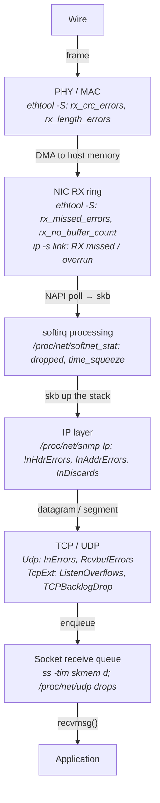
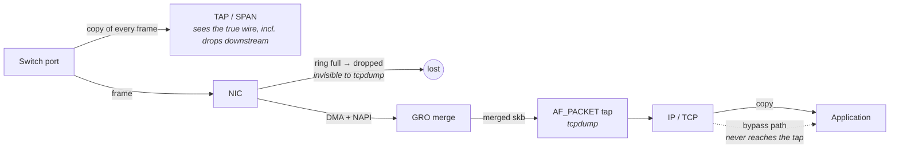
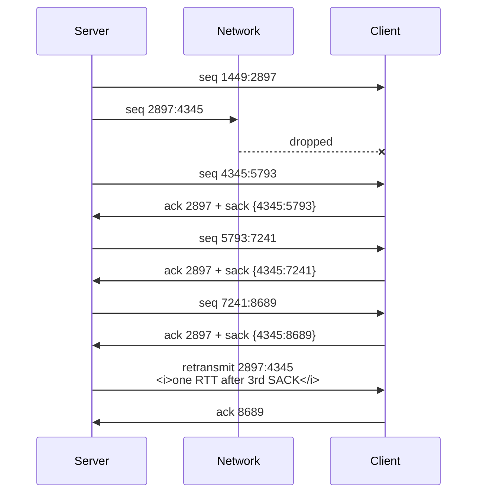
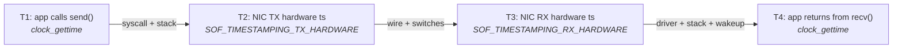

# Network Debugging Toolkit

Every previous chapter in this part described a mechanism: how a frame is serialized, how TCP decides
to retransmit, how the kernel moves an `sk_buff` from a NAPI poll into a socket queue. This chapter
is about the inverse problem. Something is wrong on a running machine — a feed handler is missing
messages, a session stalls for 200 ms twice an hour, the wire-to-wire latency histogram has grown a
second mode at 40 µs — and you have to find out which of those mechanisms is misbehaving using only
what the system is willing to tell you.

The reason this is hard has nothing to do with a shortage of tools. Linux exposes an enormous number
of network counters, and `tcpdump` will happily print every packet that crosses an interface. The
difficulty is that the output of every one of these tools is ambiguous until you know *where in the
stack it was produced*. A packet counted as "dropped" by `ip -s link` and a packet counted as dropped
by `nstat` were lost in completely different places, for completely different reasons, and require
completely different fixes — and the word printed next to the number is the same. A `tcpdump` capture
on the receiving host proves that a segment did not reach the kernel, but says nothing about whether
the switch dropped it or the NIC did. An `ss` output showing a large `Send-Q` means one thing on a
listening socket and something entirely unrelated on an established one.

So the organizing idea of this chapter is not "here are the commands." It is: **every observation you
make has a tap point, and the tap point determines what the observation can and cannot prove.** Once
you can place each tool at its layer, diagnosis becomes a process of elimination rather than a guessing
game. You will spend most of your debugging time answering one question — *is the packet arriving?* —
and the entire skill is knowing which counter answers it at which boundary.



- **Read that diagram as a filter chain, not a list.** A packet dropped at the NIC ring never
  increments a TCP counter, and a packet dropped for lack of socket buffer space was already counted
  as *received* by every layer below it. The lowest counter that moved is the one that tells you the
  truth.
- **`tcpdump` taps between `SOFT` and `IPL`.** Everything below that boundary is invisible to it;
  everything above it is a copy of a packet `tcpdump` already saw.

## Capturing Packets and Reading a Trace by Hand

You have almost certainly run `tcpdump` and been given more output than you could use. That reaction
is the correct one: an untargeted capture on a busy interface produces tens of thousands of lines per
second, and no amount of scrolling turns that into understanding. The way out is not to read faster.
It is to (a) filter aggressively in the kernel so that the packets you never wanted are never copied
to you, (b) capture to a file rather than to a terminal, and (c) learn to read a small number of lines
*completely* — because a trace of thirty packets that you understand line by line answers more
questions than a million-packet capture you can only run statistics over.

The mechanism matters here because it explains the tool's cost and its blind spots. `tcpdump` opens an
`AF_PACKET` socket and attaches a compiled BPF program to it — the filter expression you type is
compiled to bytecode and executed *in the kernel*, on the softirq path, for every packet. Packets that
fail the filter are discarded immediately and cost only the filter's execution. Packets that pass are
copied into a ring buffer shared with the `tcpdump` process, which then formats them. This has three
consequences you must internalize before you trust a capture:

**The tap point is the netdev layer, so offloads lie to you.** On receive, generic receive offload
(GRO) has already merged several wire segments into one large `sk_buff` before `tcpdump` sees it; on
transmit, TCP segmentation offload (TSO) means the kernel hands the NIC one oversized buffer and the
NIC cuts it into MTU-sized frames *after* `tcpdump` has recorded it. A capture on a host with offloads
enabled routinely shows segments of 4344 or 65160 bytes that never existed on any wire. If you are
counting segments, measuring inter-packet gaps, or reasoning about what the peer actually received,
this destroys your analysis (see "The Linux Networking Stack" for the offload mechanics).

**Everything below the tap point is invisible.** If the NIC dropped the frame because its receive ring
was full, `tcpdump` sees nothing — and "nothing" looks exactly like "the switch dropped it" and exactly
like "the peer never sent it." Distinguishing those three requires counters, not captures. This is the
single most common reasoning error in network debugging: treating the absence of a packet in a
host capture as proof of loss upstream.

**Kernel bypass makes `tcpdump` blind entirely.** If the application uses an accelerated user-space
stack, packets go from the NIC to user memory without ever entering the kernel's netdev layer, so an
`AF_PACKET` capture shows an empty trace on a link carrying gigabits (see "Kernel Bypass"). Vendors
supply their own capture path for this — Solarflare/AMD's Onload ships `onload_tcpdump`, DPDK
applications need `dpdk-pdump` or an in-application capture hook. Knowing that the trace is empty
*because of the bypass* rather than because of a fault is worth a lot of wasted time.



- **The TAP is the only tap point that sees what the wire carried**, which is why serious capture
  infrastructure uses passive optical taps and dedicated capture NICs (see "Network Design and
  Operations").
- **The `AF_PACKET` tap sits above GRO on receive and below TSO on transmit**, which is why an
  offload-enabled capture is not a record of the wire.

### Capturing without destroying your own evidence

A capture that drops packets is worse than no capture, because you will interpret the gaps as network
loss. `tcpdump` tells you when this happens: on exit it prints three numbers — packets captured,
packets received by the filter, and packets dropped by the kernel. That third number is the ring
buffer overflowing because `tcpdump` could not drain it fast enough. If it is nonzero, the trace is
untrustworthy and any "missing" packet in it may be your own tool's fault.

The remedies all reduce per-packet work in the capturing process:

| Flag | What it does | Why it matters |
|---|---|---|
| `-w file.pcap` | Write raw packets, no formatting | By far the biggest saving; formatting is the expensive part |
| `-nn` | No DNS or service-name lookups | A reverse lookup per address will stall the capture loop |
| `-s0` | Capture the whole packet (modern default) | `-s 96` truncates to headers if you only need control-plane detail and want less I/O |
| `-B <KiB>` | Enlarge the kernel-to-userspace ring | Directly reduces "dropped by kernel" |
| `-c N` / `-G <sec>` / `-C <MB>` / `-W N` | Stop after N packets; rotate by time; rotate by size; keep N files | Ring-buffer capture you can leave running for days |
| `-Q in` / `-Q out` | Capture only one direction | Halves the volume when you only care about arrivals |
| `-p` | Do not enable promiscuous mode | Avoids pulling in every frame the switch floods at you |

The other half of the volume problem is the filter. BPF filter syntax is a small language and the man
page documents it exhaustively, so what follows is only the part that is non-obvious: the primitives
that let you match on *header bits* rather than addresses, because those are what turn a capture from
"all traffic to this host" into "only the events I am hunting."

| Filter | Matches | Use |
|---|---|---|
| `tcp[tcpflags] & tcp-rst != 0` | Any segment with RST set | Hunting connection aborts across all peers at once |
| `tcp[tcpflags] & (tcp-syn\|tcp-fin\|tcp-rst) != 0` | Connection lifecycle events only | Long-running capture of who connects and who dies, at trivial volume |
| `ip[6:2] & 0x1fff != 0` | Non-first IP fragments | Confirming fragmentation is occurring at all (see "IP and the Network Layer") |
| `ether[0] & 1 != 0` | Multicast or broadcast frames | Finding flooding on a supposedly quiet link |
| `greater 1000` / `less 100` | Frame length bounds | Separating bulk data from control chatter |
| `vlan 100` | Traffic on VLAN 100 | Note the trap below |
| `not port 22` | Everything but your own SSH session | Always worth adding |

**Failure mode: a `vlan` filter silently changes the meaning of everything after it.** The `vlan`
primitive does not merely test for a tag — it shifts libpcap's notion of where the headers begin by
four bytes for all subsequent primitives in the expression. So `vlan and tcp port 9401` works, while
`tcp port 9401 and vlan` matches nothing at all, and `vlan or tcp port 9401` is nonsense. Symptom is
an empty capture on a link you can see is busy. Confirm by dumping the compiled program with
`tcpdump -d '<expr>'` and reading the byte offsets it loads.

**Failure mode: `tcp[...]` byte-offset filters silently fail on IPv6.** The `tcp[n]` syntax requires
libpcap to know the fixed offset of the TCP header, which IPv6's chain of extension headers makes
impossible in general, so libpcap refuses or matches nothing. Symptom is an IPv6 capture that finds no
RSTs on a connection you know is being reset. Use `ip6 and tcp` plus post-filtering in `tshark`
instead.

**Try it:** run `tcpdump -nn -i <if> -c 20000 -w /dev/null 'tcp'` on a moderately busy interface and
read the three summary numbers on exit. Then repeat with the same filter but formatting to the
terminal instead of `-w /dev/null`, and watch the "dropped by kernel" count appear. Then add
`-B 16384` and watch it fall. You have just measured your capture pipeline's capacity, which is a
number you need before you trust any trace taken under load.

**Try it:** compile a filter and read it. `tcpdump -d 'tcp[tcpflags] & tcp-syn != 0'` prints the BPF
program — half a dozen instructions that load the protocol field, load the flags byte, mask, and
branch. Seeing that it really is a tiny program executed per packet in the kernel is what makes the
cost model concrete.

### Reading a trace by hand

Here is the part that no tool does for you. The following is a capture taken **on the client host**,
with offloads disabled, over a 1 GbE test link. The 1 GbE detail matters: a 1514-byte frame takes
about 12 µs to serialize at that rate, so back-to-back segments land roughly 12 µs apart and the trace
is legible. On a 10 GbE colocation link the same sequence of events compresses by a factor of ten and
you would need microsecond arithmetic to see the structure; nothing else changes.

```
tcpdump -nn -i eth0 -s0 -ttt-off --no-promiscuous-mode host 10.20.0.40 and port 9401
```

For clarity the timestamps below are absolute (`-tt`-style wall clock with microsecond resolution),
which is what you want when correlating a capture against application logs. Line numbers are added by
hand.

```
 1  15:22:04.100112 IP 10.20.0.11.51420 > 10.20.0.40.9401: Flags [S], seq 2837451903,
        win 64240, options [mss 1460,sackOK,TS val 3611094821 ecr 0,nop,wscale 7], length 0
 2  15:22:04.100167 IP 10.20.0.40.9401 > 10.20.0.11.51420: Flags [S.], seq 1180773413, ack 1,
        win 65160, options [mss 1460,sackOK,TS val 2244913005 ecr 3611094821,nop,wscale 7], length 0
 3  15:22:04.100179 IP 10.20.0.11.51420 > 10.20.0.40.9401: Flags [.], ack 1, win 502,
        options [nop,nop,TS val 3611094821 ecr 2244913005], length 0
 4  15:22:04.100223 IP 10.20.0.11.51420 > 10.20.0.40.9401: Flags [P.], seq 1:65, ack 1, win 502,
        options [nop,nop,TS val 3611094821 ecr 2244913005], length 64
 5  15:22:04.100281 IP 10.20.0.40.9401 > 10.20.0.11.51420: Flags [.], seq 1:1449, ack 65, win 509,
        options [nop,nop,TS val 2244913005 ecr 3611094821], length 1448
 6  15:22:04.100294 IP 10.20.0.11.51420 > 10.20.0.40.9401: Flags [.], ack 1449, win 491,
        options [nop,nop,TS val 3611094821 ecr 2244913005], length 0
```

Take these one field at a time, because every one of them is load-bearing.

**Line 1 — the SYN.** `Flags [S]` is a bare SYN. `seq 2837451903` is printed absolutely because this
is the first packet `tcpdump` has seen in this direction; from here on it will print sequence numbers
*relative* to this initial sequence number, which is why line 4 says `seq 1:65` rather than
`seq 2837451904:2837451968`. That relative rendering is a display convenience, not something on the
wire — pass `-S` if you need the absolute numbers, which you will if you are correlating two captures
taken at different points that started at different times.

`win 64240` is the raw 16-bit window field. Window scaling has been *offered* in the options but is
not yet in effect — the scale factor only applies after both sides have agreed, so the window on a SYN
is always unscaled. `wscale 7` means "multiply my future advertised windows by 2⁷ = 128."
`sackOK` offers selective acknowledgment; `TS val`/`ecr` are the TCP timestamp option's own clock and
echo fields. `length 0` is the *TCP payload* length, not the frame length — a distinction worth
fixing in your head now, because the frame carrying line 1 is 74 bytes on the wire.

**Line 2 — the SYN-ACK, and your first real measurement.** `Flags [S.]` is SYN plus ACK; `tcpdump`
renders the ACK flag as a period, which is why a plain data-carrying ACK is `[.]` and a pushed one is
`[P.]`. Its `seq` is absolute for the same reason line 1's was — it is the first packet in the
server-to-client direction. Its `ack 1` is already relative to the client's ISN.

The gap between line 1 and line 2 is 55 µs. That number is the round-trip time including the server
kernel's SYN-ACK generation, and it is the single most useful number in the whole trace, because
everything later — how long a retransmit *should* take, whether a stall is a timer or a response — is
measured against it. Write it down before reading further.

**Line 3 — the handshake completes.** 12 µs after the SYN-ACK arrived. That is the client kernel's own
processing time, not a network round trip, which is why it is four times smaller. `win 502` is the
first *scaled* window: 502 × 128 = 64,256 bytes of receive buffer advertised.

**Line 4 — the first data.** `Flags [P.]` sets PSH, which the sending stack sets when it has emptied
the send queue. `seq 1:65` with `length 64` — 64 bytes of request. Note that this went out 44 µs after
line 3 and that it is a *separate packet* from the handshake ACK; if you were expecting TCP Fast Open
to have folded them together, its absence is visible right here.

**Line 5 — the response.** 58 µs after the request, consistent with the 55 µs RTT measured at the
handshake, meaning the server application responded essentially instantly and all of the observed
latency is network and stack. If line 5 had arrived 300 µs after line 4, the extra 245 µs would be
server-side think time, and no amount of network tuning would touch it. **This subtraction — observed
gap minus known RTT — is how you split client, network, and server contributions using nothing but a
one-sided capture.**

**Line 6 — the acknowledgment.** `ack 1449` acknowledges the 1448 bytes. `win 491` has fallen from 502:
491 × 128 = 62,848, which is 1,408 bytes less than before. The receive buffer is holding data the
application has not yet read. A window that keeps falling across a burst is the clearest possible
signal that the reader is behind the writer.

Now the interesting part. Forty milliseconds later, the server sends a burst and one segment is lost
in the network.

```
 7  15:22:04.140611 IP 10.20.0.40.9401 > 10.20.0.11.51420: Flags [.], seq 1449:2897, ack 65,
        win 509, options [nop,nop,TS val 2244913045 ecr 3611094861], length 1448
        <<< segment 2897:4345 never appears in this capture >>>
 8  15:22:04.140624 IP 10.20.0.40.9401 > 10.20.0.11.51420: Flags [.], seq 4345:5793, ack 65,
        win 509, options [nop,nop,TS val 2244913045 ecr 3611094861], length 1448
 9  15:22:04.140631 IP 10.20.0.11.51420 > 10.20.0.40.9401: Flags [.], ack 2897, win 468,
        options [nop,nop,TS val 3611094861 ecr 2244913045,nop,nop,sack 1 {4345:5793}], length 0
10  15:22:04.140637 IP 10.20.0.40.9401 > 10.20.0.11.51420: Flags [.], seq 5793:7241, ack 65,
        win 509, options [nop,nop,TS val 2244913045 ecr 3611094861], length 1448
11  15:22:04.140643 IP 10.20.0.11.51420 > 10.20.0.40.9401: Flags [.], ack 2897, win 457,
        options [nop,nop,TS val 3611094861 ecr 2244913045,nop,nop,sack 1 {4345:7241}], length 0
12  15:22:04.140650 IP 10.20.0.40.9401 > 10.20.0.11.51420: Flags [.], seq 7241:8689, ack 65,
        win 509, options [nop,nop,TS val 2244913045 ecr 3611094861], length 1448
13  15:22:04.140656 IP 10.20.0.11.51420 > 10.20.0.40.9401: Flags [.], ack 2897, win 446,
        options [nop,nop,TS val 3611094861 ecr 2244913045,nop,nop,sack 1 {4345:8689}], length 0
14  15:22:04.140711 IP 10.20.0.40.9401 > 10.20.0.11.51420: Flags [.], seq 2897:4345, ack 65,
        win 509, options [nop,nop,TS val 2244913045 ecr 3611094861], length 1448
15  15:22:04.140724 IP 10.20.0.11.51420 > 10.20.0.40.9401: Flags [.], ack 8689, win 434,
        options [nop,nop,TS val 3611094861 ecr 2244913045], length 0
```

**Lines 7–8 — the hole.** Line 7 ends at sequence 2897. Line 8 begins at 4345. The 1448 bytes in
between are missing. Because this capture is on the *client*, the segment's absence proves only that
it did not reach this host's netdev layer. It could have been dropped by a switch, dropped by this
NIC's receive ring, or never transmitted. A capture on the server would distinguish these
immediately: there, the original transmission of `2897:4345` would appear, followed later by an
identical retransmission — two lines with the same sequence range. **Where you capture determines what
"loss" means, and this is the single most important habit to build.**

**Lines 9, 11, 13 — duplicate acknowledgments with SACK.** Each says `ack 2897` — the client cannot
advance the cumulative acknowledgment past the hole, no matter how much later data it holds. But the
`sack 1 {4345:5793}` block says "in addition to everything below 2897, I also hold bytes 4345 through
5793." The `1` is the number of SACK blocks present. Watch the block *grow* across the three lines —
`{4345:5793}`, then `{4345:7241}`, then `{4345:8689}` — as more out-of-order data arrives and coalesces
into one contiguous range. If the client held two separate ranges you would see `sack 2 {a:b}{c:d}`.

Note also the windows falling: 468, 457, 446. Each is 11 units (1,408 bytes) below the last, matching
one segment of held out-of-order data. The receiver is buffering everything past the hole, which is
exactly what SACK exists to make possible — without it, the sender would have to resend everything
from 2897 onward.

**Line 14 — the fast retransmit, and how to prove it.** The retransmitted segment `2897:4345` arrives
55 µs after line 13. Fifty-five microseconds is exactly the RTT you measured at the handshake. That is
the proof that this was a **fast retransmit** — the server saw the third selective acknowledgment,
inferred the loss, and resent immediately, so the delay is one network round trip and nothing more.
Had the server instead waited for its retransmission timeout, the gap would have been at least
200 ms, because Linux clamps the minimum RTO to 200 ms regardless of how small the measured RTT is
(see "TCP In Depth"). **Distinguishing a fast retransmit from an RTO-driven one is a matter of
comparing a single gap against a single number, and the difference between them is three orders of
magnitude of application-visible latency.**

**Line 15 — recovery.** `ack 8689` jumps forward over everything: the hole is filled, so the cumulative
acknowledgment leaps to cover all the SACKed data at once, and the SACK option disappears because
there is no longer a discontiguous range to report. `win 434` — 502 minus 68 units, or 8,704 bytes —
matches almost exactly the 8,688 bytes now sitting unread in the receive queue.

The same sequence as a diagram, which is worth internalizing because you will recognize its shape in
`tshark` expert output, in Wireshark's I/O graph, and in `ss` counters for years:



- **The three duplicate acknowledgments are the trigger**, not the timer; the one-RTT gap before the
  retransmit is the observable that distinguishes the two paths.
- **The SACK block growing rather than multiplying** tells you the loss was a single isolated segment,
  not a burst — a burst produces multiple disjoint blocks and a much slower recovery.

### Where Wireshark and `tshark` earn their keep

Reading by hand does not scale past a few dozen packets, and it cannot compute. Wireshark's value is
that it maintains per-connection state as it parses — it tracks each direction's expected next
sequence number, so it can *label* a segment as a retransmission, an out-of-order delivery, or a
duplicate acknowledgment, and it can compute the time between a segment and the acknowledgment that
covers it. Those derived fields are what you filter on.

The crucial caveat is that these labels are *inferences from the capture*, and they inherit all of the
capture's blind spots. Wireshark marks a segment "out-of-order" versus "retransmission" using a
heuristic based on timing and sequence gaps; on a capture taken at one end of a path with real
reordering, it will sometimes get this backwards. Treat the labels as a fast index into the trace, not
as ground truth — then confirm by reading the packets themselves.

| Display filter / option | What it selects or enables |
|---|---|
| `tcp.analysis.retransmission` | Any segment Wireshark believes it has seen before |
| `tcp.analysis.fast_retransmission` | Retransmission preceded by duplicate ACKs |
| `tcp.analysis.out_of_order` | Sequence gap that resolved without a resend |
| `tcp.analysis.duplicate_ack` | Repeated ACK of the same sequence number |
| `tcp.analysis.zero_window` | Receiver advertised a window of zero |
| `tcp.analysis.window_full` | Sender has filled the peer's advertised window |
| `tcp.analysis.ack_rtt` | Time from a segment to the ACK covering it |
| `tcp.time_delta` | Time since the previous packet *on this connection* |
| `-o tcp.calculate_timestamps:TRUE` | Required for `tcp.time_delta` to be populated |

`tshark` is the same dissector without the GUI, and its `-z` statistics are what turn a large capture
into a small number of numbers. These run in a single pass and are the fastest way to triage a file
you have never seen:

```sh
# Per-second packet and byte rates — finds the burst.
tshark -q -r cap.pcap -z io,stat,1

# Every TCP conversation, sorted, with byte counts and durations.
tshark -q -r cap.pcap -z conv,tcp

# Wireshark's own list of anomalies, grouped by severity.
tshark -q -r cap.pcap -z expert

# Per-second maximum ACK round-trip time — a latency time series from a pcap.
tshark -q -r cap.pcap -z 'io,stat,1,MAX(tcp.analysis.ack_rtt)tcp.analysis.ack_rtt'
```

The last one deserves emphasis: it converts a packet capture into a per-second latency series without
any instrumentation in the application at all. When someone reports "it was slow around 15:22," that
one command tells you whether the network agrees.

Two companion tools do the unglamorous work. `capinfos cap.pcap` prints the capture's duration, packet
count, and — importantly — its timestamp resolution, so you know whether you are looking at microsecond
or nanosecond stamps before you start doing arithmetic on them. `editcap` slices: `editcap -A` and
`-B` cut by absolute time, so you can extract the ninety seconds around an incident from a rotating
capture and hand a 40 MB file to a colleague instead of a 40 GB one.

**Failure mode: Wireshark reports a flood of "TCP Previous segment not captured" and "out-of-order"
that the endpoints never experienced.** Symptom is a trace that looks catastrophically lossy while the
application reports no problem and `nstat` shows no retransmissions. Cause is capture-side drop — the
tool missed packets, so the dissector sees holes. Confirm with the "dropped by kernel" line from
`tcpdump`, or by checking whether the retransmission count in the capture is consistent with
`TcpRetransSegs` from `nstat` over the same window. When the capture and the kernel counters
disagree, the kernel counters are right.

**Failure mode: a capture shows huge segments and abnormally low packet rates.** Cause is GRO and TSO
still enabled at capture time. Confirm with `ethtool -k <if> | grep -E 'generic-receive|tcp-segmentation|large-receive'`.
Disable with `ethtool -K <if> gro off lro off tso off gso off` for the duration of the capture, and
remember to re-enable afterwards on any host where throughput matters.

**Try it:** capture your own loopback or LAN traffic for a short transfer, then compare hand-reading
against tooling. Run `tcpdump -nn -s0 -w /tmp/c.pcap 'port <p>'`, generate a few hundred kilobytes of
traffic, then read the first twenty lines with `tcpdump -nn -r /tmp/c.pcap | head -20` and identify by
eye the SYN, the SYN-ACK, the handshake RTT, and the first data segment. Then run
`tshark -q -r /tmp/c.pcap -z conv,tcp` and check that the byte counts match what you expected.

**Try it:** measure the difference the tap point makes. Capture the same transfer simultaneously on
both hosts (`tcpdump -w` on each), then compare packet counts for one direction. Any difference is
either loss between the two tap points or capture-side drop, and the `tcpdump` exit statistics tell
you which.

## Socket and Interface State: `ss`, `netstat`, `ethtool`, `ip`

A capture tells you what crossed the wire. It cannot tell you what the sending TCP stack *believed* at
the time — its congestion window, its round-trip estimate, whether it was blocked on the peer's window
or on its own send buffer or on nothing at all. That state lives in the kernel, and reading it is
often faster than inferring it from packets.

`ss` is the tool for this, and it is worth understanding why it replaced `netstat`. `netstat` reads
`/proc/net/tcp`, a text file the kernel regenerates by walking the entire socket hash table; on a host
with tens of thousands of sockets, reading it repeatedly is expensive enough to perturb the machine
you are trying to measure. `ss` instead uses the `NETLINK_INET_DIAG` interface, which lets it request a
filtered subset directly from the kernel in binary form. On a busy host the difference is one to two
orders of magnitude of CPU. `netstat` remains useful for exactly two things — `netstat -s`, which
formats the protocol counters readably, and `netstat -i`, which prints the interface table — and both
of those have better replacements covered below.

The output most worth knowing is `ss -tin`: TCP sockets, with the internal TCP information block,
numeric. A single line of it contains most of what you would otherwise reconstruct from a capture.

```
ESTAB  0  0  10.20.0.11:51420  10.20.0.40:9401
     cubic wscale:7,7 rto:204 rtt:0.055/0.011 ato:40 mss:1448 pmtu:1500 rcvmss:1448
     advmss:1448 cwnd:24 ssthresh:18 bytes_sent:4210488 bytes_retrans:2896
     bytes_acked:4207592 bytes_received:118240 segs_out:2941 segs_in:1602
     data_segs_out:2908 send 5054Mbps lastsnd:2 lastrcv:2 lastack:2
     pacing_rate 6065Mbps delivery_rate 4980Mbps delivered:2906 busy:3120ms
     retrans:0/2 dsack_dups:1 reordering:5 rcv_space:14480 rcv_ssthresh:64088 minrtt:0.049
```

The fields that carry diagnostic weight:

| Field | Meaning | What it tells you |
|---|---|---|
| `rtt:a/b` | Smoothed RTT and its mean deviation, in ms | `b` is the jitter estimate; a large `b` relative to `a` means the path is variable, which inflates the RTO |
| `minrtt` | Smallest RTT ever observed | Compare against `rtt`: the gap is queueing delay, on the path or in the peer's stack |
| `rto` | Current retransmission timeout, ms | Will read `204` on almost every healthy LAN socket — the 200 ms floor plus a tick |
| `cwnd` / `ssthresh` | Congestion window in segments; slow-start threshold | A `cwnd` stuck at 2–4 after a long-lived connection means repeated loss |
| `retrans:a/b` | Currently outstanding retransmits / total for this socket | The total is the per-connection retransmission count you usually want |
| `bytes_retrans` | Bytes retransmitted | Divide by `bytes_sent` for a per-connection loss rate |
| `unacked` | Segments in flight | Compare with `cwnd`: equal means congestion-window-limited |
| `lastsnd` / `lastrcv` / `lastack` | ms since last send / receive / ACK received | A large `lastrcv` on a supposedly active session is a stall, visible instantly |
| `rwnd_limited` / `sndbuf_limited` | Time (and percentage) blocked on the peer's window / on our own send buffer | Names the bottleneck outright — this is the field people most often do not know exists |
| `notsent` | Bytes queued in the socket but not yet sent | Nonzero under load means the sender is throttled, not the application |
| `busy` | Total time the socket has had data outstanding | Denominator for the `*_limited` percentages |
| `pacing_rate` / `delivery_rate` | Sender's pacing target / measured throughput | A `delivery_rate` far below `pacing_rate` means the path, not the sender, is the limit |
| `dsack_dups` / `reordering` | Duplicate-SACK count; the stack's reordering estimate | A high reordering estimate suggests a multi-path or LAG issue, not loss (see "Network Design and Operations") |

`ss -tim` adds the socket memory block, which is where per-socket drops live:

```
skmem:(r0,rb131072,t0,tb87040,f0,w0,o0,bl0,d17)
```

Read that as: `r` bytes currently allocated to the receive queue, `rb` the receive buffer *limit*,
`t` and `tb` the same for transmit, `f` forward-allocated memory, `w` bytes queued for transmit but not
in flight, `o` option memory, `bl` backlog, and — the one that matters — **`d` the number of packets
this socket has dropped.** A nonzero `d` is unambiguous: this socket, specifically, could not accept
data. No other counter attributes a drop to an individual socket.

**Failure mode: `Send-Q` is large on a listening socket and everyone misreads it.** On a *listening*
socket, `Recv-Q` is the number of completed connections waiting for `accept()` and `Send-Q` is the
configured backlog limit — so `ss -lnt` showing `Recv-Q 128 Send-Q 128` means the accept queue is
completely full and new connections are being dropped. On an *established* socket the same two columns
mean bytes unread by the application and bytes sent but unacknowledged. Same header, entirely different
semantics. Confirm accept-queue overflow with the `TcpExtListenOverflows` counter (next sections).

**Try it:** watch a connection's internal state evolve. In one terminal run
`watch -n0.5 'ss -tinm dst <peer-ip>'`; in another, start a large transfer. Observe `cwnd` climbing
during slow start, `unacked` tracking it, and — if you introduce loss with
`tc qdisc add dev <if> root netem loss 0.5%` — `ssthresh` appearing and `bytes_retrans` climbing.
Remove the qdisc afterwards with `tc qdisc del dev <if> root`.

### `ip` and `ethtool`: the interface and the device

`ip` owns everything about interfaces, addresses, routes, and neighbours; `ethtool` owns everything
about the *device* below the interface. The boundary is worth stating precisely because it determines
where you look: `ip` reports what the kernel's networking core knows, `ethtool` asks the driver, and
the driver asks the hardware.

`ip -s link show <if>` prints the interface statistics, which are the same numbers as
`/proc/net/dev` — an aggregate the driver reports upward. `ip -s -s link show <if>` (the second `-s`
is not a typo) expands the error columns into the underlying per-cause counters, which is what you
actually need, since "errors" as a single number is useless. `ip -j -s link` emits JSON if you are
scripting.

The routing side matters more than people expect on a multi-homed trading host, where separate NICs
carry market data and order flow. `ip route get <dst>` does not print the routing table — it asks the
kernel to perform an actual lookup and report the result, including the source address and interface
it would choose. That is the difference between reading a config and testing it. `ip neigh` shows the
ARP/neighbour cache with state (`REACHABLE`, `STALE`, `FAILED`), and `ip maddr show` lists the
multicast groups each interface has joined, which is the first thing to check when a multicast feed
goes silent (see "UDP and Multicast").

`ethtool` is the device-level tool, and its subcommands map onto distinct hardware concerns:

| Command | Reports / sets | When you reach for it |
|---|---|---|
| `ethtool <if>` | Speed, duplex, auto-negotiation, link status | First check on any "it's slow" report — a link that negotiated 1 Gb/s on a 10 Gb port explains everything |
| `ethtool -S <if>` | The driver's full statistics block | The authoritative source for hardware-level drops; names are vendor-specific |
| `ethtool -g <if>` / `-G` | RX/TX ring descriptor counts | Ring too small ⇒ overruns under burst; too large ⇒ more buffering latency |
| `ethtool -c <if>` / `-C` | Interrupt coalescing settings | Directly trades latency against CPU (see "The Linux Networking Stack") |
| `ethtool -k <if>` / `-K` | Offload feature flags | Must be checked before trusting any capture |
| `ethtool -l <if>` / `-L` | Number of RX/TX/combined channels | Determines how many queues RSS can spread across |
| `ethtool -x <if>` / `-X` | RSS indirection table and hash key | Confirms which queue a flow lands on |
| `ethtool -u <if>` / `-U` | n-tuple flow steering rules | Pins a specific flow to a specific queue and therefore a specific core |
| `ethtool -T <if>` | Hardware timestamping capabilities | Prerequisite for everything in the final section |
| `ethtool -m <if>` | Optical module diagnostics | Transmit/receive optical power and temperature from the SFP |
| `ethtool -i <if>` | Driver and firmware versions | Firmware version is a real variable in NIC behaviour |
| `ethtool -a <if>` / `-A` | Ethernet pause frame (802.3x) settings | Pause frames turn a downstream buffer problem into an upstream stall |

**Failure mode: intermittent packet loss on one link, clean on its redundant twin.** Symptom is a
low-rate, roughly constant loss that does not correlate with traffic volume. Cause is frequently a
marginal optical path — a dirty connector, a bent fibre, a failing transceiver. Confirm with
`ethtool -m <if>` and read the receive optical power against the module's own low-warning threshold,
which the same output prints; then cross-check `rx_crc_errors` in `ethtool -S`. Loss that scales with
*traffic* is congestion; loss that is constant regardless of traffic is physical.

**Failure mode: throughput collapses and latency spikes on an otherwise idle host.** Cause can be
Ethernet pause frames: a congested switch port asserts flow control, and your NIC stops transmitting
entirely for the requested duration, stalling every flow on the interface including latency-critical
ones. Confirm with the pause counters in `ethtool -S <if>` (commonly `rx_pause_frames` /
`tx_pause_frames`, driver-dependent) and with `ethtool -a <if>`. On latency-critical links, flow
control is usually disabled deliberately so that congestion produces a drop on one flow instead of a
stall on all of them.

**Try it:** inventory a machine's network configuration in one pass and write it down.
`ip -br link`, `ip -br addr`, then for each interface `ethtool <if>`, `ethtool -g <if>`,
`ethtool -c <if>`, `ethtool -k <if>`, `ethtool -l <if>`, and `cat /sys/class/net/<if>/device/numa_node`.
The last one tells you which NUMA node the NIC's PCIe root port hangs off, which determines whether
packet processing crosses the interconnect (see "Memory Systems").

**Try it:** prove that `ip route get` is a lookup, not a print. Run `ip route get 8.8.8.8` and
`ip route get <peer-on-your-market-data-vlan>` and compare the `dev` and `src` fields. On a multi-homed
host these frequently differ from what someone assumed when they wrote the config.

## Drops, Errors, and Overruns: Which Layer Is Complaining

This is the section that separates people who can debug networks from people who can run commands.
Linux uses the same three words — drop, error, overrun — at four or five different layers, and each
occurrence means something structurally different. Reading `ip -s link` and seeing `dropped 4213`
tells you almost nothing on its own. Knowing *which* of the five kinds of drop it is tells you what to
fix.

Start with the physical distinction that underlies all of them. A packet can be lost because it was
**corrupted** (the bits arrived wrong), because it was **malformed or unwanted** (the bits arrived
fine but the packet was not for us, or violated a protocol rule), or because there was **nowhere to
put it** (the packet was fine and wanted, but the buffer that should have held it was full). These
three have entirely different causes: corruption is physical, malformation is configuration or
attack, and buffer exhaustion is a rate mismatch. And crucially, buffer exhaustion can happen at every
single level of the stack, which is why "nowhere to put it" accounts for the overwhelming majority of
drops on a healthy network and why identifying *which* buffer is the whole job.

Walk the receive path bottom-up and name the buffer at each step.

**The PHY and MAC.** The NIC's receiver recovers bits from the wire and checks the frame check
sequence. A frame that fails the CRC is discarded here and counted as `rx_crc_errors` in
`ethtool -S`; frames shorter or longer than Ethernet allows appear as `rx_length_errors`. These are
**physical** faults — bad optics, bad cable, a failing transceiver, or a duplex mismatch on copper.
They do not respond to tuning, they are not caused by load, and any nonzero rate on a colocation
cross-connect is a ticket to the facility, not a configuration change.

**The NIC receive ring.** Frames that pass the CRC are DMA'd into buffers described by the receive
ring — a circular array of descriptors, each pointing at host memory the driver posted in advance.
The ring is finite. If frames arrive faster than the driver's NAPI poll refills descriptors, the NIC
has a valid frame and nowhere to put it, and it drops it *in hardware*. This is an **overrun**, and it
is the single most important drop class for latency-critical receivers because it is exactly what a
microburst produces (see "Network Design and Operations"). Intel drivers usually call it
`rx_missed_errors` and/or `rx_no_buffer_count`; other vendors use other names. It surfaces in
`ip -s link` as the RX `missed` column (older iproute2 versions label the same column `overrun`) and in
`netstat -i` as `RX-OVR`.

**The softirq and backlog stage.** Once the driver has built `sk_buff`s, they are processed in
softirq context. Two things can go wrong, and `/proc/net/softnet_stat` reports both, one line per CPU,
in hexadecimal:

- Column 1 is packets **processed** by that CPU.
- Column 2 is packets **dropped** because the per-CPU input backlog queue was full. This queue is only
  on the path for non-NAPI drivers and for RPS-steered packets; on a modern NIC with RSS and no RPS it
  is usually zero, and a nonzero value tells you RPS is in play and its target CPU is saturated.
- Column 3 is **`time_squeeze`**: the number of times the NAPI poll loop exhausted its budget or its
  time slice with work still pending, and had to reschedule the softirq. This is not a drop — it is
  the warning that precedes one. A rising `time_squeeze` means the receive path is running at its
  limit, and the next burst will produce ring overruns.

**The qdisc, on transmit.** On the send side the analogous buffer is the queueing discipline.
`tc -s qdisc show dev <if>` reports `dropped`, `overlimits`, `requeues`, and the instantaneous
`backlog`. A nonzero `dropped` here is your own host discarding your own outbound packets because the
transmit queue filled — usually because the link is saturated or because flow control has stalled
transmission.

**The IP layer.** `/proc/net/snmp`'s `Ip` row counts packets discarded for protocol reasons:
`InHdrErrors` (bad version, bad header length, bad checksum, expired TTL), `InAddrErrors` (destination
address not local and not forwardable), and `InDiscards` (no buffer at the IP layer). `IpExt` in
`/proc/net/netstat` adds `InNoRoutes` and `InCsumErrors`. These are almost always **configuration**
problems — a route missing, a multicast group not joined, a VLAN mismatch — not capacity problems.

**The transport layer and the socket.** Finally, a datagram that reached UDP or TCP intact can still be
dropped because the *socket's* receive buffer is full. For UDP this is `UdpRcvbufErrors` and is
included in `UdpInErrors`; per-socket it is the last column of `/proc/net/udp` and the `d` field of
`ss -tim`'s `skmem`. For TCP this manifests as pruning and backlog drops rather than a simple counter,
covered in the next section. **This is the drop class you can actually fix from the application:** it
means the reader is not keeping up, and the answers are a larger `SO_RCVBUF`, a faster reader, or both
(see "UDP and Multicast" for the burst-absorption arithmetic).

The mapping, in one table you should be able to reproduce from memory:

| Layer | Counter | Where to read it | What it means |
|---|---|---|---|
| PHY/MAC | `rx_crc_errors`, `rx_length_errors` | `ethtool -S`, `ip -s -s link` | Physical corruption — cable, optics, duplex |
| NIC ring | `rx_missed_errors`, `rx_no_buffer_count` | `ethtool -S`; RX `missed`/`overrun` in `ip -s link` | Hardware had no descriptor — microburst or slow poll |
| Driver→stack | col 2 `dropped`, col 3 `time_squeeze` | `/proc/net/softnet_stat` | Backlog full (RPS) / NAPI budget exhausted |
| Qdisc (TX) | `dropped`, `overlimits`, `backlog` | `tc -s qdisc show dev <if>` | Outbound queue full — link saturated |
| IP | `InHdrErrors`, `InAddrErrors`, `InDiscards` | `/proc/net/snmp` `Ip:` | Protocol or configuration fault |
| IP ext | `InNoRoutes`, `InCsumErrors`, `InTruncatedPkts` | `/proc/net/netstat` `IpExt:` | No route, checksum failure |
| UDP | `UdpInErrors`, `UdpRcvbufErrors`, `UdpNoPorts` | `/proc/net/snmp` `Udp:` | Socket buffer full, or nobody listening |
| TCP | `ListenOverflows`, `TCPBacklogDrop`, `PruneCalled` | `/proc/net/netstat` `TcpExt:` | Accept queue full, socket backlog full, memory pressure |
| Per-socket | `skmem` `d`, `/proc/net/udp` drops column | `ss -tim`, `/proc/net/udp` | This specific socket's reader is behind |

Two structural warnings about this table. First, **`ethtool -S` names are defined by the driver, not by
Linux.** There is no standard. `mlx5`, `ixgbe`, `i40e`, `bnxt`, and `sfc` all use different names for
conceptually identical counters, some report per-queue counters and some do not, and some report a
counter that is always zero because the hardware does not implement it. Never assume a name; run
`ethtool -S <if>` and read the list on the machine in front of you. Second, **the generic `dropped`
column in `ip -s link` is an aggregate the driver chooses how to populate**, and different drivers roll
different underlying causes into it. It is a signal to go look at `ethtool -S`, never an answer.

**Failure mode: UDP multicast receiver reports gaps; `ip -s link` shows no drops.** Symptom is
sequence-number gaps at the application with an apparently clean interface. Cause is almost always
socket receive buffer overflow — the packets arrived fine and were discarded at the very top of the
stack. Confirm with `nstat -az | grep -i udp` and look for `UdpRcvbufErrors` climbing, and with the
final column of `/proc/net/udp` for the specific socket. Fix by raising `net.core.rmem_max` and the
application's `SO_RCVBUF`, and by making the reader drain faster.

**Failure mode: drops appear only during bursts, and only on one CPU.** Symptom is `rx_missed_errors`
climbing in step with traffic peaks. Cause is the receive ring draining too slowly relative to the
burst — either the ring is too small (`ethtool -g`), the NAPI poll is being starved because its CPU is
also running application work, or interrupt coalescing is delaying the poll. Confirm by checking
`time_squeeze` in `/proc/net/softnet_stat` for the specific CPU handling that queue, and correlate with
`/proc/interrupts` to find which CPU that is.

**Failure mode: `time_squeeze` rising with no drops yet.** This is the pre-failure signal and the
reason to watch it. Cause is the receive path saturating. Confirm by tracing the poll directly:
`bpftrace -e 'tracepoint:napi:napi_poll { @work = hist(args->work); }'` shows the distribution of work
done per poll; a distribution piled up at the budget value (64 by default) means every poll is hitting
its limit.

**Try it:** read `/proc/net/softnet_stat` and decode it properly. The values are hexadecimal and there
is one row per CPU in CPU order with no header, which is why people misread it. Run
`awk '{printf "cpu%-3d processed=%d dropped=%d time_squeeze=%d\n", NR-1, strtonum("0x"$1), strtonum("0x"$2), strtonum("0x"$3)}' /proc/net/softnet_stat`.
Then generate load and run it again. Any CPU whose `time_squeeze` moves is a CPU whose receive
processing is at its limit.

**Try it:** find every drop site in the kernel by name. On a kernel with the drop-reason infrastructure
(5.17 and later), run `bpftrace -e 'tracepoint:skb:kfree_skb { @[args->reason] = count(); }'` for
thirty seconds. Each entry is a distinct reason the kernel freed a packet rather than delivering it.
On older kernels, use the call site instead: `bpftrace -e 'tracepoint:skb:kfree_skb { @[kstack(4)] = count(); }'`,
or run `dropwatch -l kas` and type `start`, which resolves the same information to symbol names using
the kernel's drop-monitor netlink interface. This is the tool of last resort when the counters say
"dropped" and you need to know precisely where.

## The Protocol Counters: `nstat` and `/proc/net/snmp`

Packet captures are expensive and only cover the window you happened to be recording. Counters are
free, always on, and cover the whole life of the machine. The problem is that they are cumulative
since boot, so a raw reading tells you almost nothing — 4.2 million retransmitted segments is
alarming or irrelevant depending on whether the host has been up for an hour or a year, and on whether
they all happened during one incident last Tuesday.

**The entire skill is turning cumulative counters into deltas over a defined window.** Once you do
that, counters become the most efficient diagnostic in the kit: you can bracket a single test run, or
a single one-second incident, and see exactly which of two hundred protocol events fired.

The raw data lives in two files. `/proc/net/snmp` holds the counters defined by the SNMP MIBs — the
`Ip`, `Icmp`, `IcmpMsg`, `Tcp`, `Udp`, and `UdpLite` rows. `/proc/net/netstat` holds Linux's own
extensions, in the `TcpExt` and `IpExt` rows, and this is where nearly all the interesting counters
live, because the standardized MIB predates every mechanism you care about. Both files use the same
awkward format: a header line naming the fields, then a value line, which is why nobody reads them
directly.

`nstat` parses both and does the differencing for you. It keeps a history file (by default under
`/tmp`, overridable via the `NSTAT_HISTORY` environment variable) and prints the change since the last
invocation. That gives you a clean idiom:

```sh
nstat -n            # snapshot, print nothing
<run the workload / wait for the incident>
nstat               # print only what changed, and by how much
```

The other essential form is `nstat -az`, which shows *absolute* values (ignoring the history) and
includes counters currently at zero — necessary because otherwise you cannot tell "this counter does
not exist on this kernel" from "this counter is zero." `nstat -az | grep -i <pattern>` is how you find
a counter whose exact name you have forgotten. `nstat -d 1` runs in scan mode, printing changes every
second, which turns the counter set into a live event stream.

`netstat -s` prints roughly the same data in English sentences. It is more readable the first time and
less useful every time after, because it is cumulative, it omits counters that are zero, and it cannot
be diffed reliably. Use it once to learn what a counter is called; use `nstat` for everything else.

### The counters that carry information

There are several hundred. These are the ones that actually change a diagnosis.

**Connection lifecycle** — `Tcp:` row of `/proc/net/snmp`:

| Counter | Meaning | Interpretation |
|---|---|---|
| `TcpActiveOpens` | Outbound connections initiated | Rate should match your reconnect logic; a spike means churn |
| `TcpPassiveOpens` | Inbound connections accepted | Compare with `TcpActiveOpens` at the peer to find dropped SYNs |
| `TcpAttemptFails` | Connection attempts that failed | SYNs unanswered or refused |
| `TcpEstabResets` | Established connections reset | Every one of these is a session that died mid-life |
| `TcpCurrEstab` | Currently established connections | The only gauge in the set; everything else is a monotonic counter |
| `TcpOutRsts` | Resets *we* sent | The most under-used counter in TCP debugging — see the next section |
| `TcpInErrs` | Segments received with a bad checksum or bad length | Nonzero implies corruption that survived the Ethernet CRC, i.e. corruption inside a device |

**Loss and recovery** — mostly `TcpExt:` in `/proc/net/netstat`:

| Counter | Meaning | Interpretation |
|---|---|---|
| `TcpRetransSegs` | Total segments retransmitted (in `Tcp:`) | The headline number; divide by `TcpOutSegs` for a loss rate |
| `TCPFastRetrans` | Retransmits triggered by duplicate ACKs / SACK | Cheap recovery — costs one RTT |
| `TCPTimeouts` | Retransmission timers that fired | Expensive recovery — costs at least the 200 ms RTO floor |
| `TCPLossProbes` | Tail Loss Probes sent | TLP fires when a tail segment may be lost; converts a would-be RTO into a probe |
| `TCPLossProbeRecovery` | Losses recovered by a TLP | High ratio to `TCPLossProbes` means TLP is doing its job |
| `TCPSynRetrans` | SYNs retransmitted | Connection setup is being lost — a very different problem from mid-stream loss |
| `TCPSpuriousRTOs` | RTOs later determined to be unnecessary | The RTO was too aggressive for the path; usually a variance problem |
| `TCPDSACKRecv` / `TCPDSACKOfoRecv` | Duplicate-SACKs received | Tells you the peer got data twice — reordering or spurious retransmission, not loss |
| `TCPSACKReorder` / `TCPRenoReorder` | Reordering detected | Reordering, not loss; suspect link aggregation or ECMP (see "Network Design and Operations") |
| `TCPLostRetransmit` | A retransmission was itself lost | Severe congestion; recovery is now compounding |

**The ratio of `TCPFastRetrans` to `TCPTimeouts` is the number to look at first.** Both increment
`TcpRetransSegs`, but their latency costs differ by three orders of magnitude. A host with a million
fast retransmits and no timeouts is losing packets and recovering in microseconds; a host with a
thousand timeouts is stalling for a fifth of a second, a thousand times.

**Queue and memory pressure** — all `TcpExt:`:

| Counter | Meaning |
|---|---|
| `ListenOverflows` | A completed connection could not be queued because the accept queue was full |
| `ListenDrops` | Any SYN or connection dropped at the listener, for any reason (superset of the above) |
| `TCPBacklogDrop` | A segment dropped because the socket's backlog queue was full while the socket was locked by its owner |
| `TCPRcvQDrop` | A segment dropped because the receive queue could not accept it |
| `TCPOFOQueue` / `TCPOFODrop` | Segments queued out-of-order / dropped for lack of out-of-order queue space |
| `PruneCalled` / `RcvPruned` / `OfoPruned` | The stack ran short of receive memory and collapsed or discarded queued data |
| `TCPMemoryPressures` | The whole TCP stack entered memory pressure (`net.ipv4.tcp_mem` middle threshold) |
| `TCPZeroWindowDrop` | A segment arrived while we advertised a zero window |
| `TCPWqueueTooBig` | Write queue exceeded its limit |

**Abort accounting** — the `TCPAbortOn*` family, which attributes every locally generated reset:

| Counter | The reset happened because |
|---|---|
| `TCPAbortOnData` | The application called `close()` with unread data still in the receive queue |
| `TCPAbortOnClose` | The application closed in a state requiring an abort |
| `TCPAbortOnTimeout` | Retransmission or keepalive timer exhausted its retries |
| `TCPAbortOnMemory` | The stack was out of memory and killed the connection |
| `TCPAbortOnLinger` | `SO_LINGER` with a zero timeout forced an abortive close |

This family is the reason `TcpOutRsts` is worth watching: when it climbs, one of these five names tells
you *why*, and the answer is usually a bug in application shutdown logic rather than anything network
related.

**Delayed ACK and window behaviour**: `DelayedACKs` counts delayed acknowledgments sent,
`DelayedACKLost` counts cases where the delay ran to its full timeout and a retransmission arrived,
and `TCPHPHits` counts segments that took the "header prediction" fast path in the receive routine. A
low `TCPHPHits` ratio means the stack's fast path is missing — often because of reordering or unusual
option use.

**Failure mode: connections are refused or hang at setup under bursty load.** Symptom is clients
timing out on connect while the server appears healthy. Cause is accept-queue overflow. Confirm with
`nstat -az | grep -E 'ListenOverflows|ListenDrops'` and with `ss -lnt`, where `Recv-Q` equal to
`Send-Q` on the listening socket is the smoking gun. Fix by raising the application's `listen()`
backlog *and* `net.core.somaxconn`, which caps it — raising only one has no effect.

**Failure mode: `TCPBacklogDrop` climbing on a low-latency receiver.** Cause is that segments arrive
while the application thread holds the socket lock inside a `recvmsg()`, so the softirq must queue them
into the socket backlog, which has a size limit derived from the receive buffer. Confirm by correlating
`TCPBacklogDrop` deltas against periods when the reader is slow. It is a sign the receiving thread is
being descheduled or is doing too much work per call (see "Processes, Threads, and Scheduling").

**Try it:** bracket a workload with counters. Run `nstat -n`, then run a transfer or reproduce your
incident, then run `nstat` alone. You get exactly the events that occurred in that window, with no
history to subtract by hand. Do this once and the technique becomes reflexive.

**Try it:** find the counters that exist on your kernel. `nstat -az | wc -l` gives the total;
`nstat -az | grep -i drop` and `nstat -az | grep -i retrans` give you the two families you will reach
for most. Compare against `cat /proc/net/netstat` to see the raw format and appreciate why `nstat`
exists.

## Diagnosing Retransmits, Resets, and Stalls

These three are the symptoms you will actually be handed, and each has a decision procedure. The
common structure is: *establish whether the event is loss-driven, peer-driven, or self-inflicted*,
because those three have disjoint fixes and the observable that distinguishes them is usually a single
counter or a single timing gap.

```mermaid
flowchart TB
    S["Symptom: latency spike<br/>or missing data"] --> Q1{"TcpRetransSegs<br/>rising?"}
    Q1 -->|no| Q2{"TcpOutRsts or<br/>TcpEstabResets rising?"}
    Q1 -->|yes| Q3{"TCPTimeouts or<br/>TCPFastRetrans?"}
    Q3 -->|"TCPFastRetrans"| L1["Real loss, cheap recovery<br/><i>find the dropping hop</i>"]
    Q3 -->|"TCPTimeouts"| L2["Tail loss or path outage<br/><i>200 ms+ stalls</i>"]
    Q2 -->|yes| R1["Connection abort<br/><i>check TCPAbortOn* family</i>"]
    Q2 -->|no| Q4{"ss shows rwnd_limited<br/>or zero window?"}
    Q4 -->|yes| W1["Receiver stall<br/><i>application not draining</i>"]
    Q4 -->|no| W2["Not a TCP problem<br/><i>look at scheduling / app</i>"]
```



- **The first branch separates loss from everything else**, and it costs one `nstat` invocation.
- **The `TCPFastRetrans` versus `TCPTimeouts` split is the latency-relevant one** — same loss, two
  wildly different application-visible costs.
- **The final branch matters because most reported "network stalls" are not network stalls**; a
  receiver that stops calling `recvmsg()` produces a zero window and a stalled sender, and nothing on
  the wire is at fault.

### Retransmits

A retransmission means the sender concluded a segment was not delivered. That conclusion can be right
or wrong, and it can be reached by two very different routes. Distinguishing them is the whole
diagnosis.

The cheap route is **fast retransmit**: duplicate acknowledgments (or SACK blocks) tell the sender
about a hole, and it resends after one round trip. You saw this in the annotated trace — 55 µs.
The expensive route is the **retransmission timeout**: no feedback arrives at all, so the sender waits
for a timer. Linux's minimum RTO is 200 ms, and it doubles on each successive failure, so an RTO on a
50 µs LAN costs four thousand times the RTT. Tail Loss Probe exists specifically to convert the common
case of "the last segment of a burst was lost, so there is no subsequent data to generate duplicate
ACKs" into something recoverable in roughly two RTTs instead of 200 ms.

Once you know *which* kind you have, the next question is where the loss occurred, and the walk is
mechanical: check your own transmit-side qdisc drops, then your own receive-side NIC counters, then
the switch's port counters, then the peer's. The counters at each hop tell you whether the packet made
it that far.

| Observation | Most likely cause |
|---|---|
| `TCPFastRetrans` high, `TCPTimeouts` near zero | Steady low-rate loss on the path; recovery is working |
| `TCPTimeouts` significant | Bursty or tail loss, or a path that went away entirely |
| `TCPSynRetrans` high, others low | Loss or a full accept queue at *connection setup* only |
| `TCPDSACKRecv` high, `TcpRetransSegs` high | Spurious retransmissions — the data was arriving, just late or reordered |
| `TCPSACKReorder` / `reordering:` in `ss` high | Reordering, likely from a LAG or ECMP hash spreading one flow across links |
| `TCPLostRetransmit` nonzero | Congestion severe enough that recovery traffic is also being lost |

**Failure mode: high retransmission counts with no actual loss.** Symptom is `TcpRetransSegs` climbing
while application throughput is fine and the peer reports no gaps. Cause is spurious retransmission
driven by reordering — the sender saw duplicate ACKs caused by out-of-order delivery, not by loss.
Confirm with `TCPDSACKRecv`, which counts the peer telling you "I already had that," and with the
`reordering:` and `dsack_dups:` fields in `ss -tin`. Reordering on a LAN almost always means a link
aggregation group is hashing one connection's packets across multiple member links (see "Network
Design and Operations").

**Try it:** watch retransmissions live, with the connection attributed. Run
`bpftrace -e 'tracepoint:tcp:tcp_retransmit_skb { @[args->sport, args->dport] = count(); }'` for a
minute on a busy host. Unlike `nstat`, this tells you *which* connections are retransmitting, which is
usually the question you actually have.

### Resets

A reset is a connection being torn down abruptly rather than closed. Every RST has exactly one of a
small number of causes, and the diagnostic mistake people make is assuming the peer sent it. Half the
time you sent it.

The causes divide cleanly by who generated the segment. **You** send an RST when: a SYN arrives for a
port nobody is listening on; a segment arrives for a connection you no longer have (after a crash, a
restart, or a `TIME_WAIT` expiry); your application called `close()` with unread data in the receive
queue; `SO_LINGER` with a zero timeout was set; or a retransmission or keepalive timer exhausted its
retries. **The peer** sends one for the mirror-image reasons.

The reason `close()` with unread data deserves special mention is that it is a *bug pattern*, not a
network condition, and it is extremely common. The socket API's contract is that closing a socket with
data still queued for you means you are discarding data the peer believed you accepted; TCP therefore
cannot perform an orderly shutdown and sends an RST instead of a FIN. The kernel records this as
`TCPAbortOnData`. If that counter is climbing in production, an application is closing sockets without
draining them.

Here is what each looks like on the wire, which is how you tell them apart in a capture:

```
# Refused connection — nothing listening on 9401.
15:31:02.881003 IP 10.20.0.11.51502 > 10.20.0.40.9401: Flags [S], seq 91827364, win 64240, ...
15:31:02.881058 IP 10.20.0.40.9401 > 10.20.0.11.51502: Flags [R.], seq 0, ack 91827365, win 0, length 0

# Orderly close — FIN exchange, no RST anywhere.
15:33:10.400112 IP 10.20.0.11.51420 > 10.20.0.40.9401: Flags [F.], seq 65, ack 8689, win 434, ...
15:33:10.400168 IP 10.20.0.40.9401 > 10.20.0.11.51420: Flags [F.], seq 8689, ack 66, win 509, ...
15:33:10.400179 IP 10.20.0.11.51420 > 10.20.0.40.9401: Flags [.], ack 8690, win 434, ...

# Abortive close — application closed with unread data; RST instead of FIN.
15:35:44.210004 IP 10.20.0.11.51530 > 10.20.0.40.9401: Flags [R.], seq 65, ack 22417, win 0, length 0
```

The distinguishing features: a **refusal** RST arrives immediately after a SYN, carries `seq 0`, and
acknowledges the SYN. An **abortive close** RST arrives mid-session on a connection that was carrying
data, and there is no FIN before it. A **timeout-driven** RST arrives after a visible gap during which
retransmissions were occurring — you will see the retransmits, then silence, then the RST.

**Failure mode: sessions die under load and nobody knows which side killed them.** Symptom is
disconnects during traffic peaks with clean logs on both sides. Cause is ambiguous until you attribute
the RST. Confirm by comparing `TcpOutRsts` on both hosts over the same window with
`nstat -n; sleep 60; nstat | grep -E 'Rst|Abort'` — the host whose counter moved sent it. Then the
`TCPAbortOn*` family names the reason on that host.

**Failure mode: RSTs on connections that were merely idle.** Cause is often a stateful middlebox — a
firewall or load balancer — expiring its flow table entry and resetting both sides, or the peer
restarting. Confirm by checking whether the RST correlates with an idle period longer than a typical
firewall timeout, and by whether TCP keepalives (which refresh middlebox state) suppress it (see
"TCP In Depth").

**Try it:** attribute resets by connection in real time.
`bpftrace -e 'tracepoint:tcp:tcp_send_reset { @sent[args->dport] = count(); } tracepoint:tcp:tcp_receive_reset { @recvd[args->dport] = count(); }'`
separates resets you generate from resets you receive, per port — which `nstat` cannot do. Run it while
deliberately connecting to a closed port and watch `@sent` move.

### Stalls

A stall is the hardest of the three because nothing appears to be wrong: no loss, no errors, no
resets, and yet data stops flowing for tens or hundreds of milliseconds. There are exactly four common
mechanisms, and each has an unambiguous signature.

**Zero window.** The receiving application is not draining its socket, the receive buffer fills, and
the receiver advertises a window of zero. The sender then stops entirely and sends periodic
zero-window probes, backing off exponentially, until a window update arrives. On the wire:

```
17:02:11.400100 IP 10.20.0.40.9401 > 10.20.0.11.51420: Flags [.], seq 262625:264073, ack 65,
        win 509, length 1448
17:02:11.400118 IP 10.20.0.11.51420 > 10.20.0.40.9401: Flags [.], ack 264073, win 0, length 0
17:02:11.600124 IP 10.20.0.40.9401 > 10.20.0.11.51420: Flags [.], seq 264072:264073, ack 65,
        win 509, length 1
17:02:11.600141 IP 10.20.0.11.51420 > 10.20.0.40.9401: Flags [.], ack 264073, win 0, length 0
17:02:12.000158 IP 10.20.0.40.9401 > 10.20.0.11.51420: Flags [.], seq 264072:264073, ack 65,
        win 509, length 1
17:02:12.000174 IP 10.20.0.11.51420 > 10.20.0.40.9401: Flags [.], ack 264073, win 0, length 0
17:02:12.412003 IP 10.20.0.11.51420 > 10.20.0.40.9401: Flags [.], ack 264073, win 502, length 0
```

Read it: `win 0` at line 2 is the stall beginning. The one-byte segments at 200 ms and then 600 ms are
zero-window probes — note that they re-send a byte the receiver *already acknowledged* (sequence
264072, one below the ACK point), which is how a probe elicits a response without violating the
window. The doubling interval is the probe backoff. The final line is the window update after the
application finally read. Total stall: just over one second, entirely on the receiving application.
`ss -tin` on the *sender* during this shows `rwnd_limited` accumulating.

**Send buffer limited.** The mirror image: the sending application writes faster than the socket can
drain, so `send()` blocks or returns `EAGAIN`. `ss -tin` reports `sndbuf_limited` and a growing
`notsent`. This is not a network problem either; it means the application is offering more than the
path can carry.

**Congestion window collapse.** After loss, `cwnd` drops and recovers slowly. `ss -tin` shows a small
`cwnd` with `unacked` equal to it — the sender is congestion-limited, not application-limited or
receiver-limited. Distinguishing this from the other two is precisely why `ss` prints all three
constraints separately.

**Nagle interacting with delayed ACK.** The classic pathological stall: the sender has a small amount
of data left and Nagle's algorithm holds it waiting for an acknowledgment; the receiver has nothing to
send back and delays its acknowledgment by up to 40 ms hoping to piggyback it. Neither side does
anything for 40 ms. On the wire the signature is unmistakable — a gap of almost exactly 40 ms (or 200
ms on some stacks) between a small segment and the next one, with no retransmission and no loss (see
"TCP In Depth" for the mechanism and `TCP_NODELAY` for the fix).

| Stall type | `ss -tin` signature | Wire signature |
|---|---|---|
| Zero window | `rwnd_limited` accumulating on the sender | `win 0`, then 1-byte probes with doubling gaps |
| Send buffer limited | `sndbuf_limited`, `notsent` nonzero | Sender simply quiet; peer's window healthy |
| Congestion-limited | `unacked` == `cwnd`, low `cwnd` | Data in RTT-spaced bursts |
| Nagle / delayed ACK | Nothing unusual | Gaps of ~40 ms with no loss, on small writes |
| RTO | `retrans:` nonzero, `rto:` elevated | Gap ≥ 200 ms, then a retransmission of the oldest unacked segment |

**Failure mode: a 40 ms gap that nobody can explain.** Symptom is a bimodal request latency
distribution with a mode near 40 ms. Cause is Nagle plus delayed ACK on a request/response pattern
where the request is split across two writes. Confirm by finding the gap in a capture and checking that
the segment before it was smaller than the MSS, and that no retransmission follows. `nstat`'s
`DelayedACKs` will be climbing in step.

**Failure mode: a 200 ms gap with a retransmission at the end of it.** Cause is an RTO, meaning the
loss was at the tail of a burst with no subsequent data to trigger duplicate ACKs. Confirm with
`TCPTimeouts` and `TCPLossProbes` in `nstat` over the incident window. On a LAN where the real RTT is
tens of microseconds, every one of these is a 4,000× outlier.

**Try it:** produce a zero-window stall deliberately and watch it from both sides. Write a receiver
that connects, then sleeps for several seconds without calling `recv()`, while a sender pushes bulk
data. Capture with `tcpdump` on the sender and simultaneously run `watch -n0.2 'ss -tin dst <receiver>'`.
You will see the advertised window walk down to zero, the probes begin, and `rwnd_limited` climb in
`ss`. Then reduce the receiver's `SO_RCVBUF` and observe how much sooner it happens.

## Measuring Latency: Ping, One-Way Delay, and Hardware Timestamps

Everything above is about correctness — is the data arriving. This section is about the number you
actually care about, and the reason it needs its own treatment is that the obvious tool is misleading
in ways that are not obvious at all.

`ping` sends an ICMP echo request and times the reply. The problem is what that path traverses. On the
remote host, the echo request is handled by the kernel's ICMP code, which is not a fast path and is
frequently rate-limited (`net.ipv4.icmp_ratelimit`, `net.ipv4.icmp_msgs_per_sec`). On an intermediate
router or switch, ICMP destined *to the device itself* is punted from the forwarding ASIC to the
control-plane CPU, which is orders of magnitude slower and heavily rate-limited — which is why a
traceroute frequently shows a middle hop with 40 ms of latency and 30% loss while traffic passing
*through* that hop is perfectly healthy. And on the local host, `ping`'s timestamps are taken in user
space, so they include the full syscall and stack traversal in both directions.

So `ping` measures "round trip including two ICMP control paths," which is a fine sanity check for
reachability and a poor measurement of the latency your application experiences. It is still worth
knowing precisely, because its options let you extract more than most people do:

| Option | Effect | Why it matters |
|---|---|---|
| `-i 0.2` | Interval between probes | Sub-second intervals need privilege; `-i 0.001` gives a dense sample |
| `-c N` | Stop after N | Always bound a measurement |
| `-D` | Print absolute send timestamps | Lets you correlate a latency spike against other logs |
| `-U` | Report user-to-user latency | Includes local stack time rather than excluding it |
| `-A` | Adaptive — send as fast as replies arrive | Finds the RTT floor quickly |
| `-M do -s <n>` | Set DF and a payload size | Path MTU probing (see "IP and the Network Layer") |
| `-Q <tos>` | Set the DSCP/ToS byte | Verifies QoS classification end to end |
| `-f` | Flood | Load-generating, not a measurement; use with care |

`mtr` combines `traceroute` and `ping` into a continuous per-hop view, which is genuinely useful for
localizing a problem along a path — with the same caveat, amplified. Per-hop loss reported by `mtr` is
usually ICMP rate limiting at that hop, not real loss. **The rule for reading `mtr` output: loss at one
hop that does not persist at every subsequent hop is an artifact. Only loss that continues to the final
hop is real.** `mtr -rwzbc 100 <host>` gives a report-mode run with 100 probes, wide output, AS numbers,
and both hostnames and addresses; `--tcp --port <p>` probes with TCP SYNs instead, which follows the
same forwarding path as your real traffic when ECMP hashing is in play.

For measuring what the application experiences, use a request/response benchmark over the real
transport instead: `netperf -t TCP_RR`, `sockperf ping-pong`, or `qperf` all send a small message and
wait for a reply, which exercises exactly the path you care about. These report a percentile
distribution rather than a mean, which — as "Measuring Correctly" develops in detail — is the only
useful summary of a latency sample.

### One-way delay, and why it is hard

Round-trip time hides asymmetry. A path whose forward direction takes 30 µs and whose return takes
70 µs has the same RTT as a symmetric 50/50 path, and for a system that receives market data on one
path and sends orders on another, that difference is the entire measurement.

Measuring one-way delay requires the sender's clock and the receiver's clock to agree, and that is the
whole difficulty. If your two hosts' clocks differ by 500 µs — entirely normal under NTP — then a
one-way delay measurement of a 20 µs path produces a number that is 96% clock error. **The precision of
a one-way delay measurement is bounded by the synchronization error between the two clocks, and nothing
else you do matters until that is smaller than the delay you are measuring.**

That is why PTP (Precision Time Protocol, IEEE 1588) exists and why it is deployed on every serious
trading network: it disciplines clocks to sub-microsecond, and with hardware timestamping and
PTP-aware switches, to tens of nanoseconds (see "Network Design and Operations" for the deployment
architecture and "Clocks, Timers, and Time" for the clock hardware). Operationally, `ptp4l` disciplines
the NIC's PTP hardware clock to the grandmaster, `phc2sys` slews the system clock to match the PHC, and
`pmc` queries the PTP management interface. The number to watch is the offset-from-master that `ptp4l`
logs continuously — the running root-mean-square and maximum offset. If that number is 10 µs, no
one-way measurement finer than 10 µs is meaningful.

### Hardware timestamps

Once the clocks agree, the remaining question is *where* the timestamp is taken. A `clock_gettime()`
call in your application, immediately before `send()` or after `recv()`, includes everything: the
syscall, the stack traversal, the driver, the DMA, and any scheduling delay in between. That is the
right measurement if you are optimizing your own host, and the wrong one if you are trying to
characterize the network.

A NIC with a PTP hardware clock can timestamp packets in the MAC, at the moment they cross the
device boundary. The difference between a hardware timestamp and a software one is not merely
precision — it is *which delays are included*.



- **T2 → T3 is the network**, and it is the only interval a hardware timestamp pair can isolate; it
  requires synchronized PHCs at both ends.
- **T1 → T2 and T3 → T4 are your own host's stack cost**, and their variance is the jitter that
  OS tuning addresses (see "Tuning a Linux Box for Determinism").
- **T1 → T4 is what the application feels**, and quoting it as a network number is the most common
  measurement error in this area.

Enabling this is a socket option, `SO_TIMESTAMPING`, whose mechanics belong to "The Linux Networking
Stack." What belongs here is the diagnostic workflow around it:

```sh
# What can this NIC actually do? Look for hardware-transmit, hardware-receive,
# hardware-raw-clock, the PTP Hardware Clock index, and the receive filter modes.
ethtool -T eth0

# Which PHC device does it map to, and what does it read?
ls /sys/class/ptp/
phc_ctl /dev/ptp0 get

# Enable hardware RX timestamping for all packets (linuxptp's helper).
hwstamp_ctl -i eth0 -r 1

# Discipline the PHC to the grandmaster and watch the offset.
ptp4l -m -i eth0
```

The receive filter modes in `ethtool -T` matter more than people expect. Many NICs can hardware-stamp
only PTP event packets, not arbitrary traffic; a device that supports only `HWTSTAMP_FILTER_PTP_V2_EVENT`
cannot timestamp your market data feed. `HWTSTAMP_FILTER_ALL` is what you need, and whether the device
offers it is a purchasing decision, not a tuning one.

`tcpdump` can also use these stamps directly, which is the most convenient way to get hardware-accurate
packet times without writing any code:

```sh
# What timestamp sources does this interface offer?
tcpdump -J -i eth0

# Use the NIC's own free-running clock, at nanosecond resolution.
tcpdump -j adapter_unsynced --time-stamp-precision=nano -nn -i eth0 -s0 -w /tmp/hw.pcap
```

`-J` lists the supported types. `-j adapter` requests the adapter's clock *synchronized to system
time*; `-j adapter_unsynced` requests the adapter's raw free-running clock, which has no relationship
to the system clock but is not perturbed by clock discipline — so it is the better choice for measuring
*intervals between packets*, and the wrong choice for correlating against wall-clock logs.
`--time-stamp-precision=nano` writes nanosecond-resolution stamps instead of the pcap default of
microseconds; without it, you have thrown away three decimal digits before analysis begins.

**Failure mode: `ping` reports 0.3 ms on a link you believe is 20 µs.** Cause is usually ICMP handling
on the remote host or an intermediate device, not the path. Confirm by measuring with a real transport
instead — `netperf -t TCP_RR` or `sockperf ping-pong` — and comparing. If the transport measurement is
20 µs and `ping` is 300 µs, `ping` was measuring a control plane.

**Failure mode: a one-way delay measurement produces negative numbers.** Symptom is exactly what it
sounds like: the receive timestamp precedes the send timestamp. Cause is clock offset between the two
hosts exceeding the actual delay. Confirm by reading the offset-from-master from `ptp4l`'s log output
on both hosts. A negative one-way delay is not a bug in your measurement code; it is proof that your
clocks are not synchronized well enough for the measurement to exist.

**Failure mode: hardware timestamps are all identical or all zero.** Cause is that hardware
timestamping was never enabled for the traffic class in question — the NIC's receive filter is set to
PTP-only, or the driver does not implement it. Confirm with `ethtool -T <if>` and check both the
capability list and the "Hardware Receive Filter Modes" list.

**Try it:** compare software and hardware timestamps on the same packets. Capture the same traffic
twice — once with the default host timestamps, once with `-j adapter_unsynced --time-stamp-precision=nano`
— and compute the inter-packet gaps in each. The hardware series will show the true wire spacing; the
software series will show that spacing plus the variance of the host's interrupt and softirq
scheduling. The difference between the two distributions is your host's contribution to jitter,
measured rather than guessed.

**Try it:** measure your own stack's contribution directly. Run `netperf -t TCP_RR` between two hosts,
then run it again with both sides pinned to isolated cores and busy-polling enabled
(`sysctl net.core.busy_poll` and `net.core.busy_read`, or `SO_BUSY_POLL` per socket). The difference is
the wakeup and scheduling cost you were paying, and it is usually several microseconds — enormous
relative to a 20 µs path.

**Try it:** check whether your clocks are good enough before trusting any one-way number. On both
hosts, run `ptp4l -m -i <if>` (or read the logs if it is already running as a service) and record the
maximum offset over a few minutes. If that maximum exceeds the delay you intend to measure, stop and
fix time synchronization first.

## Numbers to Know

| Quantity | Value | Notes |
|---|---|---|
| Linux minimum RTO (`TCP_RTO_MIN`) | 200 ms | Floor regardless of measured RTT; the cost of every timeout-driven retransmit |
| Fast retransmit recovery time | ~1 RTT | Tens of µs on a LAN — the reason SACK matters |
| Delayed ACK timeout | up to 40 ms (Linux) | The other half of the Nagle interaction |
| Zero-window probe interval | starts near the RTO, doubles | Visible as 1-byte segments at 200 ms, 400 ms, 800 ms |
| Typical LAN RTT, same rack | 20–80 µs | Kernel stack both ends; ~10–20 µs with bypass |
| 1514-byte frame serialization | ~12 µs at 1 GbE, ~1.2 µs at 10 GbE | Sets the readable time scale of a trace |
| Default NAPI poll budget | 64 packets (`net.core.netdev_budget` default 300 total) | `time_squeeze` counts exhaustion of this |
| Default socket accept queue cap | `net.core.somaxconn` | Caps the application's `listen()` backlog |
| PTP synchronization accuracy | sub-µs typical, tens of ns with hardware stamping and PTP-aware switches | Bounds any one-way delay measurement |
| NTP synchronization accuracy | ~100 µs to several ms | Far too coarse for one-way delay on a LAN |
| pcap timestamp resolution | 1 µs default, 1 ns with `--time-stamp-precision=nano` | Check with `capinfos` before doing arithmetic |
| `tcpdump` capture ring | `-B` in KiB | Raise until "dropped by kernel" reaches zero |

*Order-of-magnitude figures for modern x86 servers running mainline Linux. RTO floor, delayed-ACK
timeout, and NAPI budget are Linux implementation details that have changed across versions; NIC
counter names are vendor-specific in every case.*

## Key Takeaways

- Every network observation has a tap point, and the tap point determines what it can prove; a
  missing packet in a host capture does not identify where it was lost.
- `tcpdump` taps the netdev layer, so GRO and TSO make a capture a record of the kernel's view rather
  than the wire's — disable offloads before trusting segment boundaries or inter-packet gaps.
- A capture that drops packets manufactures evidence of loss; always read `tcpdump`'s exit statistics
  before interpreting a trace.
- Read a trace by measuring the handshake RTT first, then interpreting every subsequent gap relative
  to it — a retransmit one RTT after duplicate ACKs is a fast retransmit, one 200 ms later is a timeout.
- SACK blocks growing rather than multiplying identify single isolated loss; the receiver's advertised
  window falling across a burst identifies a reader falling behind.
- `ss -tin` exposes what the sender's stack believed — `rwnd_limited`, `sndbuf_limited`, `cwnd`,
  `minrtt` versus `rtt` — and names the bottleneck without any capture at all.
- Drop counters mean different things at every layer: physical corruption at the PHY, buffer exhaustion
  at the NIC ring, budget exhaustion in softirq, protocol faults at IP, and reader lag at the socket.
- `ethtool -S` counter names are driver-defined and unstandardized; read the list on the machine in
  front of you rather than assuming a name.
- Cumulative counters are useless until differenced; `nstat -n` before and `nstat` after turns the
  whole protocol counter set into a per-incident event list.
- `TCPFastRetrans` versus `TCPTimeouts` splits the same loss into recoveries costing one RTT and
  recoveries costing 200 ms — the ratio matters far more than the total.
- Every locally generated RST is attributed by the `TCPAbortOn*` family, and `TCPAbortOnData` usually
  means an application closed a socket without draining it.
- `ping` measures ICMP control paths, not your data path; per-hop loss in `mtr` that does not persist
  to the final hop is rate limiting, not loss.
- One-way delay is bounded by clock synchronization error, so PTP quality is a prerequisite for the
  measurement, and hardware timestamps isolate the network by excluding your own stack.
