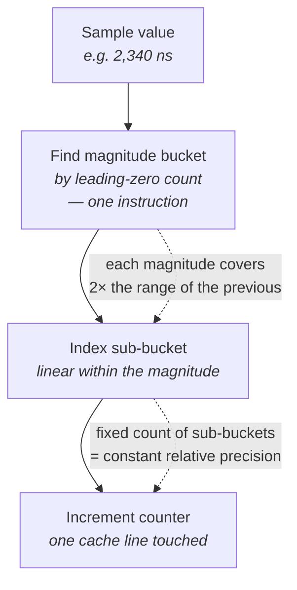
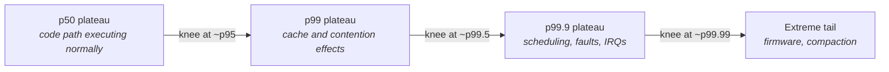
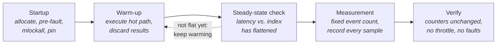
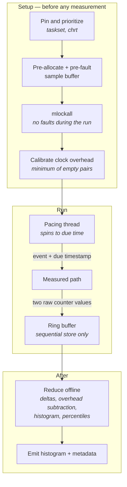
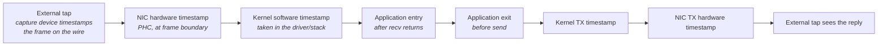

# Measuring Correctly

Every chapter so far has ended with an instruction to go and measure something. This one is about the
part nobody teaches: measurement is itself an engineering artifact, it has bugs, and its bugs are
systematically biased toward telling you good news. A benchmark that is merely wrong in a random
direction is not much of a threat — you notice, because the numbers wobble. The dangerous ones are
wrong in a consistent direction, produce tight and reproducible results, and confirm what you hoped.
Almost every measurement mistake in this chapter has that character. Coordinated omission deletes the
tail. Warm-up bias reports a machine state your production system never occupies. In-process
instrumentation reports a fraction of the real time. Unfenced timestamps under-report short regions.
None of these produce noise. They all produce numbers that are too good, and stable enough to defend.

The reason this matters more here than in ordinary performance work is that the thing you are trying
to observe is small and rare. Optimizing a batch job, you are looking for a 20% change in a
ten-second runtime; almost any measurement technique resolves that. Here you are trying to detect a
50-nanosecond regression in a 2-microsecond path, or to characterize an event that happens once in
ten thousand. Fifty nanoseconds is about the cost of reading the clock twice. One-in-ten-thousand
means that a run of ten thousand samples contains exactly one observation of the thing you care
about. The measurement apparatus and the effect are the same order of magnitude, which means the
apparatus is part of the experiment and has to be designed with the same care as the system under
test.

This chapter is the methodological foundation for the rest of Part IV. Chapter 25 gives you
profilers and hardware counters; Chapter 26 gives you an optimization method; Chapter 27 gives you a
jitter hunt. All three assume you can produce a number that means something. That assumption is what
this chapter builds. Chapter 1 introduced percentiles, tail latency, and coordinated omission at the
level needed to understand why the rest of the book exists — a one-paragraph sketch each. Here they
get their full treatment, along with the practical craft that surrounds them: how a histogram is
actually constructed, how to build a load generator that does not lie, how to measure and subtract
your own instrumentation overhead, how to decide whether a change is real, and how far your
measurement's scope actually extends.

## Why Averages Lie: Percentiles and Histograms

The case against the mean was made in Chapter 1 with an arithmetic example: a million events, most
at 1 µs, a thousand at 10 ms, and a mean of 11 µs that describes neither population. What that
example established is that the mean is the wrong *summary*. What it did not establish is what the
right one is, or how you produce it, and that turns out to involve more machinery than it first
appears.

Start from the honest baseline. The complete, lossless representation of a latency measurement is
the list of every individual sample. Nothing is inferred, nothing is approximated, and every question
you might later think to ask is answerable. For a short run this is entirely practical: a million
samples at eight bytes each is eight megabytes, which you can pre-allocate before the run starts,
write to sequentially during it, and dump to a file afterwards. If you can afford this, do it —
recording raw samples is the least presumptuous thing you can do, because it defers every analysis
decision until after you know what you are looking for.

The reason people move away from raw samples is not usually size but *rate and duration*. A system
handling a million events per second, measured for an hour, produces 3.6 billion samples. That is
nearly 30 GB of storage, and — much worse — 8 bytes of memory traffic per event on the hot path,
streaming through the cache and evicting the working set you are trying to measure. At that point
you need to summarize during the run rather than after it, and the structure that does this is a
histogram.

A histogram divides the range of possible latencies into **buckets** and stores, for each bucket, a
count of how many samples fell into it. Recording a sample is: compute which bucket the value falls
into, increment that counter. Both operations are a handful of instructions and touch one cache line,
so the per-sample cost is a few nanoseconds and, critically, is *constant* — it does not grow with
the number of samples already recorded. The whole structure is a fixed-size array of counters
allocated once at startup. Nothing allocates, nothing reallocates, nothing sorts, and nothing takes a
lock. That is what makes a histogram suitable for the hot path in a way that a growing list of
samples is not.

What you give up is exact values. A sample landing in the bucket covering 1,000–1,100 ns is now
indistinguishable from any other sample in that bucket. This is a real loss, and the entire design
question for a latency histogram is how to make it a small and *bounded* loss.

### Why linear buckets fail and logarithmic ones work

The obvious bucketing is uniform: fixed-width buckets across the whole range. Say 100 ns wide. Now
consider what range you need to cover. Your median is around 2 µs, so you need fine resolution there.
Your worst observed outlier is 200 ms, because a firmware stall happened once. Uniform 100 ns buckets
spanning 0 to 200 ms require two million counters — 8 MB of counters, most of which will hold zero
forever, and which will not fit in any cache.

Widen the buckets to make it fit and you destroy the low end. Ten-microsecond buckets give you a
manageable twenty thousand counters, but now your entire median region — everything from 1 µs to
10 µs, which is where all your normal traffic lives — collapses into a single bucket. You can no
longer see a 200 ns regression at all.

The tension is that latency measurements span many orders of magnitude and you want *proportional*
precision at every one of them. Nobody cares about the difference between 200 ms and 200.1 ms. But
everybody cares about the difference between 2.0 µs and 2.1 µs, which is the same absolute gap. What
you actually want is constant *relative* precision: bucket widths that grow with the magnitude of the
value they cover, so that every bucket is, say, within 0.1% of its own value.

That is what logarithmic bucketing gives you, and it is the design behind **HdrHistogram** (High
Dynamic Range Histogram), the de facto standard structure for this job. Its construction is worth
understanding rather than treating as a black box, because the two parameters it asks for are exactly
the two engineering decisions you have to make anyway.



The structure is a set of magnitude ranges, each covering twice the span of the one below it, and
each subdivided linearly into the *same fixed number* of sub-buckets. Because a magnitude spanning
2 µs–4 µs and one spanning 2 ms–4 ms are cut into the same number of pieces, the sub-buckets in the
first are a thousand times narrower in absolute terms and identical in relative terms. Finding the
magnitude is a leading-zero-count instruction; finding the sub-bucket within it is a shift and a
mask. This is the "O(1) record" property that makes the structure hot-path-safe.

The two parameters:

- **Significant value digits** — how many digits of precision you want preserved, typically 2 or 3.
  Three digits means every recorded value is stored within 0.1% of its true value, and it sets the
  number of sub-buckets per magnitude.
- **Highest trackable value** — the top of the range. Anything above it is either rejected or
  clamped, depending on configuration, and either behavior will silently corrupt your tail if you set
  it too low. Set it generously; the cost of extra range is logarithmic, not linear.

The memory consequence is the point of the whole design. Three significant digits across a range from
1 ns to 60 seconds costs on the order of tens of kilobytes of counters — small enough to sit in L2
cache alongside your working set. The same range at 100 ns uniform resolution would need 600 million
counters. This is why the logarithmic structure is not a nicety: it is the only way to have both fine
median resolution and honest tail coverage in a structure you can afford to touch on every event.

| Property | Raw sample array | Uniform-bucket histogram | Logarithmic (HdrHistogram-style) |
|---|---|---|---|
| Per-sample cost | One store, sequential | Divide/shift, one increment | Leading-zero count, shift, one increment |
| Memory | 8 bytes × sample count, unbounded | Range ÷ bucket width | Tens of KB for ns-to-minutes range |
| Precision at the median | Exact | Fixed absolute width | Fixed *relative* width |
| Precision at the tail | Exact | Same absolute width — wasteful | Coarser absolute, same relative — appropriate |
| Cache footprint during a run | Streams through cache | Can be megabytes | Fits in L2 |
| Mergeable across threads/runs | Concatenate | Add counters | Add counters |
| Suitable for a long production run | No | Only over a narrow range | Yes |

**Failure mode: your histogram's maximum is suspiciously round and repeats exactly.** Symptom is a
reported max of exactly the configured highest-trackable value, appearing across multiple runs. Cause
is out-of-range samples being clamped rather than recorded — the real outliers were larger and you
cannot tell how much larger. Confirm by checking whether your histogram library counts or rejects
out-of-range values, raise the bound by an order of magnitude, and re-run; if the max moves, every
tail number from the earlier runs was wrong.

### Reading a histogram, and reading a percentile

A **percentile** is defined operationally, and it is worth stating as a procedure because the
procedure is what makes its limitations obvious. To find the p99 of a set of samples: sort them in
ascending order, then take the value at the position 99% of the way along. That is all. The p99 is
the value that 99% of samples came in at or below, equivalently the value that 1% exceeded. With a
histogram you do the same thing without sorting — walk the buckets from lowest to highest,
accumulating counts, and report the bucket you are in when the running total crosses 99% of the
total.

Two consequences drop straight out of that procedure. First, **a percentile is a rank, so it is
always an actual observed value** (or the bucket containing one) — it is not an extrapolation, and it
cannot tell you anything about behavior you did not observe. Second, and this is the one that governs
everything in the repeatability section later, **the stability of a percentile depends entirely on
how many samples lie beyond it.** The p99.9 of a 1,000-sample run is determined by a single
observation. Quote it as a system property and you are quoting one coin flip.

The default way to display a latency distribution — a bar chart of counts against latency, the shape
you learned to call a histogram — is a poor fit for this data, and it is worth being explicit about
why. The interesting region is the extreme right end of the x-axis, where the counts are so small
they are invisible next to the mode. You cannot see a bar representing 0.01% of samples on the same
axis as one representing 40%.

The display that works is a plot of **latency against percentile, with the percentile axis scaled
logarithmically in the distance from 100%** — so that p90, p99, p99.9, and p99.99 are equally spaced.
HdrHistogram's tooling emits this format directly, and its online plotter renders it; you will also
see it called a latency-by-percentile plot or, from its shape, a "tail latency" plot. The
interpretation is direct and visual:

- **A flat line that suddenly turns upward** marks where a different mechanism takes over. The
  percentile at which the knee occurs tells you how often that mechanism fires — a knee at p99.9
  means roughly one event in a thousand.
- **A staircase** means the distribution is multi-modal: several distinct behaviors, each with its
  own plateau. Each riser is a mechanism boundary; each tread is one population of events.
- **A curve that rises smoothly the whole way** usually means queueing rather than discrete stalls —
  a continuum of wait times rather than a fixed-cost interruption.
- **A line that stops climbing at the far right** is often an artifact, not a result: a clamped
  histogram bound, or a sample count too small to populate that region.

The corresponding rule about the ordinary count-versus-latency histogram is that it is still the
right tool for one job — identifying *modes*. If your latency distribution has two humps, that is
visible instantly in the count plot and invisible in the percentile plot. Look at both.



That staircase is the shape Chapter 1 described in words: each tier produced by a different
mechanism. On a real percentile plot you can read off not just the cost of each mechanism but its
*frequency*, from the percentile at which its riser begins. That is a genuinely diagnostic reading —
a knee at p99.9 on a system doing 100,000 events per second means the mechanism fires about a hundred
times a second, which is often enough to correlate against `/proc/interrupts` deltas or a `perf`
trace.

### Percentiles do not average, and they do not add

Two arithmetic mistakes with percentiles are common enough in production monitoring that they deserve
naming, because both silently understate the tail.

**Averaging percentiles is meaningless.** A monitoring system that computes a p99 every second and
then reports the hourly average of those 3,600 p99 values has produced a number with no
interpretation. It is not the p99 of the hour. It is not any percentile of anything. If one second in
the hour was catastrophic, its p99 is one of 3,600 values being averaged and contributes almost
nothing — which is exactly backwards from what you want. The same objection applies to the maximum of
per-interval p99s, which overstates instead.

The correct operation is to **merge the underlying histograms and compute the percentile from the
merged counts.** This is why histograms are the right wire format for latency telemetry and
pre-computed percentiles are not: histograms are mergeable — you add the counter arrays element by
element and the result is exactly the histogram you would have built from all the samples — and
percentiles are not. Recording per-interval histograms and aggregating them later preserves the
ability to ask any percentile question over any time range. Recording per-interval percentiles throws
that away permanently at the moment of recording.

**Percentiles do not add across stages**, as Chapter 1 noted: three stages with a p99 of 1 ms each do
not compose to a 3 ms end-to-end p99, because a request only has to be unlucky in one stage to be
slow overall. The practical consequence for measurement is that **you cannot reconstruct an
end-to-end distribution from per-stage distributions.** If you want the end-to-end p99.9, you must
measure end-to-end latency per event and build a histogram of *that*. Per-stage histograms tell you
where time goes on average and which stage has the worst tail; they do not tell you the composite
tail. If you want both, record per-event timestamps at each stage boundary and derive both the
composite and the components from the same records.

**Failure mode: your dashboard's p99 is far better than user-visible behavior.** Symptom is a
monitoring system reporting a healthy tail while incident reports say otherwise. Cause is very often
percentile-of-percentiles aggregation across time buckets or across hosts. Confirm by finding the
worst single interval's raw histogram and computing the percentile from it directly; if that number
is dramatically worse than the aggregate, the aggregation is the bug.

**Try it:** build both plots from the same data and see what each one hides. Instrument any repeating
operation to record into a pre-allocated array, run it a few million times with something else
loading the machine, then produce (a) a count-versus-latency histogram with linear buckets and (b) a
latency-versus-percentile plot with a logarithmic percentile axis. The first will show you a single
narrow spike and appear to say the system is perfectly behaved. The second will show you the
staircase. Then re-bucket the same data at 10 µs uniform width and confirm that the entire median
region collapses into one bar — that is the resolution problem the logarithmic structure exists to
solve.

## Coordinated Omission

Chapter 1 introduced coordinated omission as the closed-loop load generator that stops sending during
a stall and therefore records one bad sample where reality would have produced a hundred thousand.
That is the canonical case and it is worth having in your head. But the phenomenon is more general
than that description suggests, and the general form is what makes it so hard to eradicate: **any
measurement whose sampling is throttled by the very stall it is trying to observe will under-report
that stall.** The load-generator case is one instance. It appears at least three more places in a
real system, and engineers who have learned to fix the load generator routinely have the same bug
elsewhere.

The name, coined by Gil Tene, is precise about the mechanism: the omission is *coordinated* with the
stall. If the missing samples were random, they would not bias the result — you would just have fewer
samples. They are not random. They are exactly the samples that would have been slow. That is why the
error is not noise but a systematic deletion of the right-hand side of the distribution.

To be precise about what is being measured, two terms are needed. **Service time** is how long the
system took to handle a request once it started handling it. **Response time** is how long the
requester waited, from the moment the request was ready to be issued until the response arrived —
which includes any time the request spent queued because the system was busy. A closed-loop benchmark
— send, wait for reply, send again — measures service time and calls it response time. Under load,
those two are radically different numbers, and response time is the one that describes what an
external observer experiences.

```mermaid
sequenceDiagram
    participant C as Closed loop
    participant O as Open loop
    participant S as System
    Note over C,S: system stalls 100 ms; intended rate 1 per µs
    C->>S: request at t=0
    S-->>C: reply at t=100ms
    Note over C: 1 sample recorded: 100 ms
    Note over O: keeps issuing on schedule
    O->>S: requests due at t=0 … t=100ms
    S-->>O: replies drain after t=100ms
    Note over O: ~100,000 samples: 100 ms down to 0
```

The two rows of that diagram receive identical treatment from the system and report distributions
that differ by orders of magnitude at the tail. That is the whole of coordinated omission, and every
variant below is a rediscovery of the same shape.

### The four places it hides

**In the load generator.** The classic form. The generator's send rate is a function of the system's
completion rate, so the offered load automatically backs off exactly when the system is struggling.
Beyond deleting the tail, this means you never actually tested the system at the rate you claimed to
be testing it at — a "one million requests per second" benchmark that self-throttles during stalls
delivered less than a million.

**In in-process instrumentation.** This is the variant that catches people who have already learned
about the load-generator case, and it is arguably more common in production code. Suppose your
receive loop dequeues a packet, timestamps it, processes it, timestamps again, and records the delta.
You have measured how long *processing* took. If a stall caused fifty packets to pile up in the
socket buffer or the NIC ring, those fifty packets each waited — but your timer for each of them
started when you dequeued it, which is after the wait. You have measured service time again, and you
have coordinated your measurement with your own backlog. The fix is structural: **start the clock
when the event arrived at the machine, not when your code got to it.** A kernel or hardware receive
timestamp (see "The Linux Networking Stack") is exactly the right start point, which is one of the
strongest arguments for using them even when you are not doing wire-to-wire measurement.

**In sampled monitoring.** A thread that wakes every 10 ms to record a metric will not record
anything during a 500 ms stall, because it was not scheduled either. Its samples are, by
construction, taken only from periods when the machine was healthy enough to schedule it. This is why
`cyclictest`-style measurements — which explicitly record the gap between when a wakeup *should* have
happened and when it did — are structured the way they are, and why a monitoring agent that samples
"CPU is fine" during an outage is not evidence of anything.

**In anything with backpressure.** If a slow consumer causes an upstream producer to block, the
producer stops generating events, so the events that would have been slow are never created. Any
measurement taken downstream of a backpressure boundary is measuring a rate the system chose, not the
rate the world offered.

**Failure mode: p99.9 is implausibly close to p50.** Symptom is a distribution with almost no tail on
a system running on a stock kernel with default settings, where a tail is essentially guaranteed to
exist. Cause is almost certainly coordinated omission somewhere in the path. Confirm by checking
whether anything in the measurement path waits for the previous event before generating or
timestamping the next one — a load generator that paces off completions, or an instrumentation point
downstream of a queue.

**Failure mode: the benchmark's achieved rate is lower than its configured rate and nobody noticed.**
Symptom is a harness configured for N events per second that completes a fixed event count in longer
than the expected wall time. Cause is closed-loop self-throttling. Confirm by having the harness
report achieved rate and total elapsed time next to the configured rate; if they differ by more than
a percent or two, the load model is not what you think it is and the latency numbers are not
comparable across configurations.

### Building a harness that does not omit

There are two remedies. One is honest and one is an approximation, and it is worth knowing which is
which.

**The correct remedy is open-loop generation.** The generator maintains its own schedule, derived
from a start time and an intended interval, entirely independent of what the system under test is
doing. For each event it computes the time that event was *due*, waits until then, sends, and later
records `completion_time − due_time`. If the system stalls, the generator keeps issuing on schedule,
requests accumulate, and each one records a response time that includes its queueing. Nothing is
deleted because nothing was ever suppressed.

The implementation details matter more than they look:

- **Derive each due time from the start time, not from the previous one.** Accumulating an interval
  onto the previous send time lets timing error compound, and worse, lets the schedule drift later
  every time you are late — which is coordinated omission creeping back in through the side door.
  Compute the *n*-th due time from the start time and the index.
- **Pace by spinning on a cycle counter, not by sleeping.** `nanosleep` and timer file descriptors
  have wakeup latencies in the tens of microseconds and their own jitter, which is comparable to or
  larger than what you are trying to measure. On an isolated core, a spin loop reading the TSC is the
  only pacing mechanism with sub-microsecond accuracy (see "Clocks, Timers, and Time").
- **Do not "catch up" by bursting.** When the generator falls behind, the correct behavior is to
  issue the backlog as fast as it can *while recording each event against its own due time*. Issuing
  them without correcting the due times converts the backlog into a burst of artificially fast
  samples and re-hides the stall.
- **Separate the sender from the receiver.** If one thread both sends and collects replies, its own
  send work delays its reply handling and vice versa. Two threads, each pinned, with a lock-free
  handoff (see "Synchronization and IPC") keeps the schedule clean.
- **Record the achieved rate and the maximum backlog depth.** These are your evidence that the load
  model held. A run where the backlog grew monotonically did not measure latency at a fixed rate; it
  measured a system being overloaded, which is a different and also useful experiment, but you must
  know which one you ran.

**The approximate remedy is post-hoc correction.** HdrHistogram provides a recording call that takes
an expected interval between samples and, when a recorded value exceeds that interval, synthesizes
additional decreasing samples to fill the gap — the ones the generator would have produced had it
kept issuing. This is what `wrk2` and other corrected harnesses use, and it is far better than doing
nothing. But understand its assumption: it back-fills *linearly*, as though the requests had queued
at exactly the intended rate and drained in order. Real queueing during a stall may not have that
shape. Treat correction as a repair for a harness you cannot restructure, not as equivalent to real
open-loop generation.

| | Closed loop | Open loop | Closed loop + correction |
|---|---|---|---|
| What it measures | Service time | Response time | Response time, approximated |
| Offered load during a stall | Drops to zero | Unchanged | Drops to zero; gap synthesized after |
| Tail fidelity | Tail deleted | Faithful | Approximately restored, shape assumed |
| Useful for | Measuring an isolated operation's cost | Any system-level latency claim | Legacy harnesses you cannot rewrite |
| Tooling | Most naive benchmarks | Custom harness; `wrk2` for HTTP | HdrHistogram's expected-interval recording |

A closed loop is not always wrong — it is the right structure when you genuinely want the cost of one
operation with nothing queued behind it, which is exactly what a microbenchmark of a function is. The
error is using it to make a claim about system latency under load.

**Try it:** measure the size of the lie on your own machine. Build the simplest possible closed-loop
harness against any request-response service, run it, and record the percentiles. Then inject a
deliberate stall — the crudest version is to have the server sleep 100 ms once every five seconds —
and re-record. Note how little the p99.9 moves. Now restructure the client as an open loop: compute
each send's due time from a fixed start time and interval, spin until then using
`clock_gettime(CLOCK_MONOTONIC)`, and record completion minus due time. Re-run against the same
stalling server. The two p99.9 figures will differ by orders of magnitude, and the ratio between them
is the amount of tail the first harness was deleting.

**Try it:** find the in-process variant in code you already have. Take any event loop that dequeues
from a socket and instruments its own processing. Enable `SO_TIMESTAMPING` with the software receive
flag on that socket (see "The Linux Networking Stack"), and record both the
kernel-timestamp-to-completion delta and the dequeue-to-completion delta for every event. Under light
load they agree. Put the machine under load and watch them diverge — the gap is queueing that your
original instrumentation could not see, because it started counting after the queue.

## Warm-Up, Steady State, and Measurement Bias

A benchmark reports a number for a machine in a particular state. The mistake is assuming that state
is the one you care about. Two opposite errors follow, and most engineers make one of them without
ever considering the other.

The first is measuring a **cold** machine and reporting it as steady state. Chapter 1 listed the
mechanisms: caches empty, TLB entries absent, branch predictors untrained, pages allocated but not
faulted in, the CPU sitting in a deep idle state with a wakeup cost, frequency scaled down and not
yet ramped, JIT-style lazy initialization not yet done. Every one of these penalizes the first
executions of a code path, by amounts ranging from tens of nanoseconds (a cold branch predictor) to
milliseconds (a major page fault). A run that includes the first few thousand events reports a
distribution polluted by all of them, and — this is the part that makes it insidious — the pollution
lands entirely in the tail, so it looks exactly like a real tail problem.

The second error is the mirror image and is much less discussed: measuring a machine that is
**warmer than production will ever be**. A microbenchmark that executes the same code path ten
million times in a tight loop keeps every instruction in the L1 instruction cache, every data
structure in L1d, every branch perfectly predicted, and every page mapped in the TLB. Production
executes that path once every few hundred microseconds with entirely different code running in
between, evicting all of it. The benchmark reports 800 ns; production sees 3 µs; nothing is wrong
with either measurement and the benchmark is simply answering a question nobody asked.

Both errors have the same root: **the machine's hidden state is an input to your measurement, and you
have not specified it.** The remedy is to decide deliberately which state you want to measure, put
the machine into it, and confirm it stayed there.



The phase that is nearly always skipped is the third one, and it is the only one that turns warm-up
from a superstition into a procedure. "Warm up for 10,000 iterations" is a guess. The check that
makes it a measurement is direct and requires no statistics: **record the warm-up samples too, plot
latency against iteration index, and look at where the curve stops descending.** If it is still
falling at the end of your warm-up, warm up longer. If it flattened after 300 iterations, your 10,000
were wasteful but harmless. If it never flattens, you have a leak, a growing data structure, or
thermal drift — all of which are results in their own right.

### The parts of the machine that need warming

Each has a different time constant, and knowing which is which tells you what your warm-up is
actually accomplishing:

- **Page mappings** — first touch of every buffer costs a minor fault of roughly 1–3 µs. Fixed by
  pre-faulting at startup and `mlockall(MCL_CURRENT | MCL_FUTURE)`, not by warm-up iterations (see
  "Memory Management").
- **Instruction and data caches** — warm within a few executions of the path. Fast to warm, fast to
  lose.
- **Branch predictors and indirect-branch targets** — need enough executions to train, typically
  hundreds; this is a real effect and a real reason a warm-up loop helps (see "CPU Microarchitecture
  Essentials").
- **TLB entries** — warm on first touch, but easily evicted; huge pages make them stay warm (see
  "Memory Systems").
- **CPU frequency and idle state** — a core coming out of a deep C-state or a low P-state takes tens
  to hundreds of microseconds to reach full speed, and the governor's reaction time can be
  milliseconds (see "Tuning a Linux Box for Determinism").
- **Package temperature** — moves in *seconds*, in the opposite direction. A long run gets slower as
  the package heats and turbo headroom shrinks. This is the one warm-up mechanism that argues for
  *shorter* runs, and it is why interleaving A and B runs matters.
- **Connection and protocol state** — TCP congestion windows start small and grow; a benchmark's
  first seconds run at a different effective rate than its later ones (see "TCP In Depth").

**Failure mode: the first N events of every run are dramatically slower and N is stable.** Symptom is
a distribution with a fat tail that disappears entirely if you discard an initial prefix. Cause is
cold-start effects, most often minor page faults. Confirm by reading `ps -o min_flt,maj_flt -p <pid>`
before and after the warm-up phase — if the minor fault count climbs during the slow phase and stops
climbing once the distribution stabilizes, that is the mechanism, and the fix is pre-faulting rather
than a longer warm-up.

**Failure mode: latency degrades slowly and monotonically across a long run.** Symptom is a p50 that
is measurably worse in the last minute than the first. Cause is usually thermal — the package heating
and turbo frequency dropping — or memory fragmentation, or a data structure growing. Confirm by
reading the per-core throttle counters under `/sys/devices/system/cpu/cpu*/thermal_throttle/` before
and after, and by watching `turbostat` during the run; if the observed frequency drops as the run
proceeds, it is thermal and your two configurations must be interleaved rather than run back to back.

### Measurement bias

There is a broader problem that warm-up is one instance of, and it deserves naming because it
explains a category of results that are otherwise baffling. Measurement bias is any systematic
influence on a benchmark from a factor unrelated to the thing being measured. The definitive
treatment is Mytkowicz et al., *Producing Wrong Data Without Doing Anything Obviously Wrong!*
(ASPLOS 2009), which demonstrated that changing the size of a process's environment variables — which
shifts the stack's starting address, which changes cache set and alignment behavior — could produce
performance differences larger than the compiler optimizations the authors were trying to evaluate.

The lesson is not that measurement is hopeless. It is that **a single configuration measured
carefully is still a single sample from a space of layouts, and the space has real variance in it.**
The practical defenses:

- **Randomize what you cannot control, or fix it explicitly.** Address space layout randomization is
  a per-run variable; `kernel.randomize_va_space=0` on a dedicated benchmark host removes it as a
  source of run-to-run variance, at the cost of measuring one specific layout forever.
- **Never change two things at once**, including things you consider irrelevant — a rebuild, a kernel
  update, a different core, a different time of day.
- **Interleave configurations** rather than running all of A then all of B, so that any drift over
  time affects both equally (see "Tuning a Linux Box for Determinism," which owns the full
  environment-capture discipline).
- **Fix the event count, not the duration.** A fixed-duration run of a faster configuration does more
  work, ends in a different thermal and cache state, and is not comparable.
- **Control the observer.** Attaching `perf` with a high sampling frequency, running `strace`, or
  enabling verbose logging changes the thing being measured. If a tool must be attached, attach it to
  both configurations.

**Try it:** demonstrate measurement bias to yourself in ten minutes, because until you have seen it
you will not believe the magnitude. Take any small benchmark, run it thirty times, and record the
median of each run. Then run it thirty more times with a large dummy environment variable set —
`env PADDING=$(head -c 4096 /dev/zero | tr '\0' 'x') ./bench`. Compare the two sets of run medians.
On many machines and benchmarks the difference is larger than the optimizations you were planning to
evaluate. Then set `kernel.randomize_va_space=0` and repeat both, and observe how much of the
run-to-run spread disappears.

## Timestamping Methodology and Instrumentation Overhead

The mechanics of reading a clock belong to Chapter 7, which covers the TSC, its invariance
properties, the fencing required to stop the out-of-order engine reordering `rdtsc` around the region
you are timing, and the relative costs of `rdtsc`, `rdtscp`, and `clock_gettime` through the vDSO.
What this chapter owns is the layer above: given a way to read the clock, how do you build a
measurement out of it that is not dominated by the act of measuring?

Start with the arithmetic that makes this a real problem. A fenced timestamp pair costs on the order
of 30–60 ns on a modern x86 server — Chapter 7's table gives roughly 15–30 ns for a properly fenced
single read. If you are timing a region that takes 2 µs, that overhead is 2–3% and mostly ignorable.
If you are timing a region that takes 100 ns, the instrumentation costs as much as the code. And if
you are timing a region that takes 20 ns — an atomic operation, a lookup, a queue push — the
instrumentation costs *more than the thing*, and the number you get is mostly a measurement of your
measurement.

There are exactly three responses to that, and choosing among them is the first decision in any
timestamping design.

**Subtract the overhead.** Works when the overhead is stable and small relative to the region.
Requires calibration, described below.

**Amortize across iterations.** Time a loop of N repetitions and divide. The instrumentation cost is
paid twice for N executions instead of twice for one, so it vanishes. The price is total: **you lose
the distribution entirely.** A loop of 1,000 iterations produces one sample, which is a mean, and the
whole point of this chapter is that means hide what matters. Amortization is the right tool for
answering "what does this operation cost" and the wrong tool for anything involving a tail.

**Measure a bigger region.** Often the correct answer. If the individual operation is too small to
time, time the whole event — packet in to response out — and use profiling (Chapter 25) rather than
timestamps to attribute time within it. Hardware counters and sampling profilers exist precisely
because timestamping does not scale down.

### Calibrating and subtracting your own overhead

The procedure is simple and the one subtlety in it matters a great deal.

1. Put the measurement thread in its final environment — pinned to its target core with `taskset -c`,
   at its final scheduling policy with `chrt`, on a warmed machine.
2. Execute your exact timestamp sequence twice back to back with **nothing between them**, and record
   the delta. Same instructions, same fences, same store into the sample buffer.
3. Repeat that a few hundred thousand times, recording every result.
4. **Take the minimum, not the mean.**
5. Subtract that minimum from every subsequent measurement.

Step four is the one people get wrong. The distribution of the empty-region delta is one-sided:
there is a floor set by the actual instruction cost, and everything above the floor is interference —
an interrupt, a cache miss on the sample buffer, a frequency transition. The mean of that
distribution includes the interference; the minimum is the closest available estimate of the true,
uninterrupted cost. Subtracting the mean over-corrects and can produce negative measured latencies,
which is an unambiguous sign you did this wrong.

Two further points on this calibration. It is **hardware- and configuration-specific** — it changes
with CPU model, frequency, mitigation settings, and whether you fenced — so it must be re-measured
on every machine and captured alongside your results. And it is a useful **health check on the
machine itself**: if the empty-region distribution has a fat tail, your isolated core is not isolated,
and you should find out why before trusting anything else you measure on it (`cyclictest` and
`hwlatdetect` are the tools for that, covered in "Tuning a Linux Box for Determinism").

**Failure mode: some measured latencies are negative or absurdly small.** Symptom is a histogram with
samples at or below zero. Causes are, in order of likelihood: subtracting a mean overhead instead of
a minimum; unfenced `rdtsc` letting the closing read execute before the region finished (see "Clocks,
Timers, and Time"); or the two reads happening on different cores with unsynchronized TSCs. Confirm
the last one by using `rdtscp` and comparing the auxiliary core-identifier value from both reads — if
they differ, your thread migrated mid-measurement and the delta is meaningless.

### Resolution, precision, and the comb artifact

Three properties of a clock get conflated and they fail in different ways. **Resolution** is the
smallest difference the clock can represent. **Precision** is how repeatable a reading is.
**Accuracy** is how close it is to true time. For interval measurement on one machine you need
resolution and precision and you do not care about accuracy at all — a clock that is off by a year
but ticks steadily measures a 2 µs interval perfectly. For comparing timestamps taken on two
different machines, accuracy is the only thing that matters, and that is what the wire-to-wire
section is about.

Insufficient resolution produces a distinctive and recognizable artifact. If the clock advances in
discrete steps larger than the variation you are measuring, every sample lands on a multiple of the
step, and the histogram becomes a **comb**: regularly spaced spikes with nothing between them. This
happens with coarse clock sources, with `CLOCK_*_COARSE` variants that read a cached kernel value,
and inside virtual machines where the hypervisor may be virtualizing the timer. Seeing a comb means
your clock is too coarse for the interval you are measuring, and no amount of extra samples will
help.

| Symptom in the histogram | Likely cause | Check |
|---|---|---|
| Comb — evenly spaced spikes | Clock resolution coarser than the measured interval | `clock_getres`; check the clocksource in `/sys/devices/system/clocksource/clocksource0/current_clocksource` |
| Impossible spike at the very low end | Unfenced `rdtsc` reordering | Add `lfence` fencing and re-measure |
| Negative values | Mean-subtracted overhead, or cross-core TSC | Use minimum; compare `rdtscp` core IDs |
| Hard ceiling at a round number | Histogram bound clamping | Raise the highest trackable value |
| Bimodal with a fixed gap | Two code paths, or two cores with different frequencies | Record which core each sample came from |

### The probe effect

Instrumentation does not merely add its own cost — it changes the behavior of the code around it.
This is the probe effect, and four mechanisms produce it, all of which have appeared earlier in this
book.

**Fences serialize.** The `lfence` needed for correct short-region timing prevents the out-of-order
engine from overlapping the region with its surroundings. In instrumented code the region runs
serialized; in production it overlaps with neighbouring work. The instrumented version can be
genuinely slower than the uninstrumented one by more than the cost of the timestamp instructions
themselves (see "Clocks, Timers, and Time").

**The sample buffer occupies cache.** Writing 16 bytes per event into an array means that after a
million events you have streamed 16 MB through the cache hierarchy, evicting whatever your hot path
was keeping resident. Mitigations: keep the record small, write sequentially so the hardware
prefetcher and write-combining behave, and consider non-temporal stores if the buffer is large and
never re-read during the run (see "The Cache Hierarchy").

**Instrumentation adds branches.** A `if (sampling_enabled)` check in the hot path costs a
predictable branch — cheap, but it also occupies a branch predictor entry and a few bytes of
instruction cache, both of which are finite.

**Sampling changes what you see.** Recording one event in a thousand reduces overhead but interacts
badly with tails: if slow events are rare, uniform sampling will mostly miss them, and if slow events
are correlated in time, periodic sampling can lock onto or miss the pattern entirely. For tail work,
record everything or record nothing.

The design that resolves most of this is to **separate recording from analysis in time**. On the hot
path, do the absolute minimum: two clock reads and one sequential store of raw values into a
pre-allocated, pre-faulted ring buffer. No subtraction, no bucket computation, no formatting, no
conditionals beyond a wrap check. Everything else — computing deltas, subtracting calibrated
overhead, building histograms, computing percentiles, writing files — happens after the run, or on a
different thread reading the ring at its leisure. This is the same principle as low-overhead logging
(see "Observability Without Slowing Down"), applied to measurement.

**Failure mode: the system is measurably faster when instrumentation is compiled out.** Symptom is a
change in end-to-end performance larger than the instrumentation's own measured cost. Cause is the
probe effect — usually fence-induced serialization or cache displacement by the sample buffer.
Confirm by measuring end-to-end throughput or an external wire-to-wire latency with instrumentation
on and off; if the external number moves, your internal number describes an instrumented system, not
the production one.

**Try it:** measure your own floor. Time several hundred thousand back-to-back timestamp pairs with
an empty region, using `clock_gettime(CLOCK_MONOTONIC)`, then again using a fenced TSC read. Report
the minimum, the median, and the p99.9 of each. The minimum is your subtractable overhead. The gap
between minimum and p99.9 is your machine's interference floor — no measurement you take on that core
can be cleaner than that, which means it is also the smallest effect you could ever hope to detect
there. Then repeat pinned to an isolated core with `taskset -c` and compare; if the p99.9 does not
improve, your isolation is not working.

**Try it:** produce a comb on purpose so you recognize it later. Measure a sub-microsecond operation
using `clock_gettime(CLOCK_MONOTONIC_COARSE)`, which reads a value the kernel updates once per timer
tick rather than reading the hardware counter. Plot the histogram. Every sample will be zero or one
tick. Then switch to `CLOCK_MONOTONIC` and watch the distribution become continuous.

## Repeatability and Confidence Without Heavy Statistics

You made a change. The p50 went from 1,240 ns to 1,190 ns. Is that a real 4% improvement, or is it
the same number twice with different noise? This question comes up on every single optimization, and
answering it badly is how teams accumulate a codebase full of changes that were never improvements.

The formal answer involves statistical machinery that is out of scope here and, more importantly, is
usually inapplicable — the standard tests assume things about your samples that a stream of latency
measurements from a shared machine does not satisfy. The practical answer is a set of procedures that
require no formulas and that experienced performance engineers use in preference to the formal
machinery anyway, because they are robust and because they force you to confront the actual sources
of variation.

The foundational distinction is between two kinds of variation, and conflating them is the single
most common error in benchmark interpretation.

**Within-run variation** is the spread of individual event latencies inside one run. This is what your
histogram shows, and it is a property of the system: cache misses, interrupts, contention.

**Between-run variation** is the difference between the *summary statistics* of two separate runs of
the identical binary and configuration. This comes from everything the previous section listed —
address layout, physical page placement, thermal state, which cores you landed on, background
activity, huge page pool state.

The error is using within-run variation to judge a between-run difference. Ten million samples in a
run gives you a very precisely determined p50 for *that run*. It says nothing about whether the next
run of the same binary would produce the same p50. If between-run variation is 3% and you are trying
to detect a 4% improvement, a single run of each configuration cannot distinguish them no matter how
many samples each contains.

### The procedure

The rule that follows is: **repeat the run, not just the iteration, and compare the spread of
run-level results.**

1. **Establish your noise floor first.** Run configuration A ten times, unchanged, alternating with
   nothing. Record the statistic you care about — p50, p99, whatever you are optimizing — for each
   run. Look at the spread between the best and worst of those ten. That range is the resolution of
   your entire measurement setup. You cannot detect an effect smaller than it.
2. **Interleave.** Run A, B, A, B, … rather than all A then all B, so that drift over time is shared
   between configurations rather than attributed to one.
3. **Compare ranges, not points.** Line up A's ten run-level p50s and B's ten. If the ranges overlap
   at all, you have not demonstrated a difference. If they are cleanly separated — every B run better
   than every A run — you have, without needing any test to tell you so.
4. **When the ranges overlap and you still care, reduce the noise floor rather than adding runs.**
   Pin harder, isolate the core, disable turbo so thermal state stops mattering, fix the address
   layout. A noise floor of 0.5% makes a 1% effect visible; a noise floor of 3% will not be beaten by
   any amount of averaging you can afford.

`perf stat -r` implements the mechanical part of this for whole-program runs: `perf stat -r 20 ./bench`
executes the binary twenty times and reports each counter's mean with a variation percentage
alongside. That variation figure *is* your between-run noise, and reading it is a much better use of
`perf stat` than reading the counter values themselves. If it says ±4%, then a 2% improvement is not
something you have measured.

**Failure mode: a change looks like an improvement and does not survive re-testing next week.**
Symptom is a regression that appears to reverse, or an optimization whose gain evaporates. Cause is
that the original difference was inside the between-run noise floor. Confirm by re-running both
configurations ten times interleaved and comparing ranges; if they overlap, the original result was
never evidence.

**Failure mode: a change improves the benchmark and does nothing in production.** Symptom is an
optimization with a clean benchmark result and no operational effect. Cause is usually that the
benchmark's state — warm caches, no neighbours, one code path — differs from production's in a way
that matters for this specific change. Confirm by re-running the benchmark with realistic
interference (`stress-ng` on neighbouring cores) and with a realistic gap between events, and seeing
whether the improvement survives.

### How many samples a percentile needs

The other half of confidence is knowing when a *percentile* is meaningful, and this follows directly
from the definition given earlier. A percentile is a rank, so its stability depends on how many
observations lie beyond it. If only one sample exceeds your p99.9, then p99.9 is that one sample, and
it will be a different number next run.

The counting is straightforward and worth internalizing as a table:

| Percentile | Samples for 1 observation beyond it | Samples for ~100 observations beyond it |
|---|---|---|
| p50 | 2 | 200 |
| p90 | 10 | 1,000 |
| p99 | 100 | 10,000 |
| p99.9 | 1,000 | 100,000 |
| p99.99 | 10,000 | 1,000,000 |
| p99.999 | 100,000 | 10,000,000 |

The right-hand column is the working rule: **you want on the order of a hundred observations beyond
a percentile before you treat it as a stable property rather than an anecdote.** One observation is a
coin flip; a hundred is a shape. Report the sample count next to every percentile so a reader can
apply this themselves, and refuse to quote a percentile whose left-hand-column requirement you barely
met.

There is a direct, formula-free way to check whether you have enough samples, and it is the single
most useful trick in this section. **Split your samples in half and compute the percentile in each
half separately.** If the p99.9 of the first half and the p99.9 of the second half agree closely, the
figure is stable. If they differ by a factor of two, it is not, and no amount of confident reporting
will change that. This works for any statistic, requires nothing but a split and a re-computation,
and gives you a direct empirical read on how much your number moves. Splitting into ten chunks
instead of two gives you a range rather than a pair, which is even more informative.

The maximum deserves its own rule. **Always report it, never gate on it alone.** It is the single
most operationally important number — it is the worst thing your system did, and in a
latency-critical context the worst case is the requirement — but it is also, by construction, one
observation, so it is the least stable statistic you have. Use it to trigger investigations, not to
pass or fail a regression test. For automated regression gates, use a percentile with a hundred
observations behind it, and separately alert on any max exceeding a fixed absolute threshold.

**Try it:** find out how many samples your machine needs for a stable p99.9. Run a single long
measurement of at least ten million samples, storing raw values. Then compute p99.9 from the first
10,000 samples, the first 100,000, the first million, and all ten million. Then compute p99.9 from
ten disjoint one-million-sample chunks and look at the spread. You will see the number stabilize as
the count grows, and the chunk-to-chunk spread at each size tells you directly what sample count your
system needs for the percentile you intend to report.

**Try it:** measure your between-run noise floor before you optimize anything. Run
`perf stat -r 20 ./your_benchmark` and read the ± variation on `task-clock` and `instructions`. Then
run your benchmark twenty times manually and record its reported p50 each time. The spread of those
p50s is the smallest improvement you are equipped to detect. Write it on the wall.

## Building a Latency Harness

Everything above assembles into an artifact. A latency harness is a small program, but it has more
requirements than its size suggests, and every requirement traces to a failure mode already
described. Building one deliberately — rather than accreting one out of a `main` function and a timer
— is worth doing once, because you will reuse it for the rest of your career.

The harness has five responsibilities that should be kept mentally and structurally separate:
**control the environment**, **generate load on a schedule**, **capture timestamps with minimum
disturbance**, **store samples without perturbing the system**, and **reduce and report offline**.
Mixing these is where harnesses go wrong — the classic disaster is a harness that formats and prints
a result inside the measurement loop, so every thousandth event pays for an `snprintf` and a `write`
syscall, and the p99.9 you are measuring is your own logging.



### Setup: making the machine boring

The environment work happens before a single sample is taken, and most of it is covered in detail by
"Tuning a Linux Box for Determinism." The harness's job is to apply and *record* it.

- **Pin every thread.** `taskset -c 4 ./harness` for the simple case; separate cores for the pacing
  thread, the measured thread, and any reply-collection thread. A migration mid-run invalidates both
  the cache state and, on unsynchronized TSCs, the timestamps.
- **Set the scheduling policy explicitly.** `chrt -f 80 ./harness` puts the harness under
  `SCHED_FIFO` so it is not preempted by ordinary work. Be aware of the real-time throttle — by
  default the kernel reserves a slice per second for non-RT tasks, which appears as a periodic stall
  in your histogram if your thread spins (see "Processes, Threads, and Scheduling").
- **Pre-allocate and pre-fault everything**, then `mlockall(MCL_CURRENT | MCL_FUTURE)`. Allocating or
  first-touching a page inside the measurement loop injects microsecond faults into the tail (see
  "Memory Management").
- **Size the sample buffer for the entire run.** Wrapping is acceptable if you only want a recent
  window; growing is not.
- **Capture the environment before and after.** Kernel command line, microcode revision, frequency
  policy, mitigation status, interrupt counts, throttle counts. The after-capture is what lets you
  invalidate a run: if `/proc/interrupts` on your measured core moved, or the thermal throttle
  counter incremented, the run is contaminated regardless of how the histogram looks.

### The loop: doing as little as possible

The measured path should contain the smallest possible amount of harness. In order:

1. Read the counter.
2. Do the thing.
3. Read the counter.
4. Store two 64-bit raw values (or the due-time and completion pair, for open-loop response time) at
   the next buffer index.
5. Increment the index.

No subtraction, no bucketing, no branches on the value, no I/O, no allocation, no locks. Everything
that can be deferred is deferred, because everything you do in the loop is something you are also
measuring.

Two structural choices deserve explicit thought:

- **Record absolute timestamps, not deltas.** Absolute values let you reconstruct deltas *and*
  reconstruct the timeline — which events were adjacent, whether slow events clustered, how a stall
  lines up against an interrupt count or a `perf` trace. Deltas throw the timeline away and you cannot
  get it back.
- **Record a little context alongside each sample** if you can afford the bytes: the core ID from
  `rdtscp`'s auxiliary value, a sequence number, and the queue depth at the time of the event. Queue
  depth in particular converts "some events were slow" into "events were slow when the backlog was
  deep," which is a diagnosis rather than an observation.

### Validating the harness itself

This is the step that distinguishes a harness you can trust from one you merely wrote, and it is
almost universally skipped. A measurement instrument that has never been tested against a known input
is not an instrument.

- **Measure nothing.** Run the harness with an empty measured region. It must report a distribution
  centred on your calibrated clock overhead. If it reports something much larger, the harness itself
  has cost you have not accounted for.
- **Measure a known delay.** Put a calibrated spin of, say, 10 µs in the measured region and confirm
  the harness reports 10 µs, tightly. This validates your clock scaling — TSC ticks to nanoseconds —
  which is a step people get wrong by a factor equal to the ratio of turbo to base frequency.
- **Inject a known stall at a known frequency.** Stall for 1 ms on exactly one event in ten thousand.
  The harness must show that stall at p99.99 and not before. If it does not appear, you have
  coordinated omission. If it appears at the wrong percentile, your sample accounting is wrong.
- **Check the floor against an independent instrument.** Run `cyclictest` on the same isolated core
  and compare its maximum against your harness's empty-region maximum. They measure different things
  but both are bounded by the same interference, so a large disagreement means one of them is wrong
  (see "Tuning a Linux Box for Determinism").

**Failure mode: the harness's own histogram has a periodic spike at a fixed interval.** Symptom is
regularly spaced outliers — often around once per second. Causes include the real-time throttle
releasing a `SCHED_FIFO` thread's core, the residual timer tick under `nohz_full`, per-CPU statistics
folding at `vm.stat_interval`, or your own reporting thread waking. Confirm by correlating the
timestamps of the outliers against `/proc/interrupts` and `/proc/softirqs` deltas, and by checking
whether the interval matches `kernel.sched_rt_period_us`.

**Failure mode: the harness reports a beautiful distribution and the service it wraps is visibly
slow.** Symptom is disagreement between the harness and any external observation. Cause is scope —
the harness is measuring a region that excludes most of the real work — or coordinated omission.
Confirm with the wire-to-wire comparison described in the next section; that comparison is the only
way to bound how much your in-process measurement is missing.

**Try it:** build the harness once, properly, and validate it with the four checks above before you
use it for anything. Then run it against a deliberately pathological target: a function that is fast
99.99% of the time and sleeps 1 ms otherwise. Confirm that your histogram shows the sleep at p99.99,
that your max equals the sleep duration, and that your p50 is unaffected. A harness that passes this
test can be trusted; one that has not taken it cannot.

## Wire-to-Wire Versus In-Process Measurement

Every measurement has a **scope**: the two points in the system between which time is counted.
Everything outside that scope is invisible, and the single most common way to produce a confidently
wrong latency number is to report one whose scope is much narrower than the claim being made.
Chapter 1 made this point with the latency budget — instrument at the top and bottom of your
application and you have measured the application box, while the NIC, both PCIe traversals, the
driver, and the entire kernel path sit outside. Here is how to actually place the instrumentation
points, what each one costs, and what each one still misses.

The available measurement points form a nested sequence, each enclosing the previous one:



Reading that diagram outward from the middle: the innermost pair, application entry to application
exit, is what naive instrumentation measures. Each step outward adds a segment of real time that the
inner scope omitted. The outermost pair — tap to tap — is **wire-to-wire**, the only scope that
corresponds to what an external party actually experiences, and the one an interviewer means when
they ask what your latency is. (In trading it is usually called tick-to-trade; the measurement
question is identical.)

| Measurement point | What it captures | Typical resolution | Overhead | What it still misses |
|---|---|---|---|---|
| Application entry/exit | Your code only | Clock overhead, ~20–60 ns | Lowest | NIC, PCIe, driver, kernel stack — often most of the total |
| Kernel software timestamp (`SOF_TIMESTAMPING_RX_SOFTWARE`) | Adds the kernel receive path from the driver up | ~100 ns–1 µs, depends on where in the stack it is taken | Small; a `recvmsg` control message | NIC internal time, PCIe/DMA, interrupt latency |
| NIC hardware timestamp (`SOF_TIMESTAMPING_RX_HARDWARE` / `_RAW_HARDWARE`) | Adds PCIe traversal, DMA, interrupt and driver latency | ~1–10 ns clock granularity; accuracy is device-dependent | Small, but may disable some offloads | Cable, switch, and anything before the NIC |
| External tap / capture device | Everything inside the host, plus cabling to the tap | Sub-nanosecond on purpose-built capture hardware | None on the host | Only what happens beyond the tap point |

### Getting hardware timestamps

The mechanism belongs to "The Linux Networking Stack," which covers `SO_TIMESTAMPING`'s flag bitmask
and how timestamps come back as control messages on `recvmsg`. Two operational points belong here.

First, **check capability before designing around it**. `ethtool -T <iface>` reports exactly which
timestamping modes the device supports, which transmit and receive filters it implements, and the
index of its PTP hardware clock (PHC). A device reporting only software timestamping cannot give you
hardware ones no matter how the socket is configured, and a device that supports hardware receive
timestamping only for PTP packets will silently give you nothing for your traffic.

Second, **hardware timestamps come from the NIC's own clock, not the system clock.** That clock is
the PHC, it is a separate time domain, and it drifts relative to `CLOCK_REALTIME`. For measuring an
interval between two events timestamped by the *same* PHC, this does not matter at all and is in fact
an advantage — no synchronization error enters. For comparing a PHC timestamp against a
`clock_gettime` timestamp, you must relate the domains, which is what `phc2sys` does and what the PTP
material in "Network Design and Operations" covers.

**Failure mode: hardware timestamps are requested and software timestamps arrive.** Symptom is
timestamp values with microsecond-scale granularity, or timestamps that track the system clock
exactly. Cause is that the NIC does not support hardware timestamping for this traffic class, or the
requested receive filter was not applied and the driver fell back. Confirm with `ethtool -T <iface>`
against the filter you requested, and check which control message flags actually came back rather
than assuming the requested ones did.

**Failure mode: enabling hardware timestamping changes the latency being measured.** Symptom is a
different distribution with timestamping on versus off. Cause is that some drivers disable receive
offloads or change interrupt behavior when timestamping is enabled. Confirm by comparing `ethtool -k`
output with timestamping enabled and disabled, and by measuring wire-to-wire with an external tap in
both configurations — an instrument that changes the system is telling you about the instrumented
system.

### One-way, round-trip, and the clock domain problem

The hardest part of wire-to-wire measurement is not instrumentation but time. A one-way latency —
frame arrives at host A, response leaves host A — is easy if both timestamps come from the same
clock. A one-way latency measured *between two hosts* requires their clocks to be synchronized, and
your measurement error is then bounded below by the synchronization error, which for PTP with
hardware timestamping is typically tens to hundreds of nanoseconds and for NTP is milliseconds. If
you are trying to measure a 3 µs path, an NTP-synchronized cross-host measurement is meaningless.

Three approaches, in decreasing order of how much they require of you:

- **Round-trip on one clock.** Timestamp send and receive on the same host with the same clock. No
  synchronization needed at all; the error is just the clock's own. The limitation is that you
  measure the round trip and cannot decompose it into the two directions.
- **Same-device wire-to-wire.** If the inbound frame arrives on one port and the reply leaves another
  port of the *same* NIC, both hardware timestamps come from the same PHC and are directly
  subtractable with no synchronization error. This is the cleanest possible measurement of a host's
  internal latency, and it is why capture setups are often built specifically to arrange it.
- **External tap with a single capture device.** A tap or switch SPAN port feeding one nanosecond-
  precision capture device sees both the inbound and outbound frames and timestamps both with its own
  single clock. Same trick, moved outside the host, and it additionally captures the NIC and cabling.
  This is the reference measurement — the one you validate everything else against (see "Network
  Design and Operations" for capture architecture, and "Network Debugging Toolkit" for reading the
  trace).

Two conventions to nail down before comparing numbers from different sources. **Where in the frame is
the timestamp taken?** Hardware timestamps are typically taken at a frame boundary such as the
start-of-frame delimiter, but the exact reference point differs between vendors and between the
receive and transmit directions; a 1,500-byte frame at 10 Gb/s is 1.2 µs of serialization, so
first-bit versus last-bit is not a rounding error. And **what does a transmit timestamp actually
mean?** Some devices timestamp when the frame is handed to the MAC; others when it goes on the wire.
Read the driver documentation for the specific NIC rather than assuming.

### Reconciling the scopes

The productive use of these measurement points is not to pick one but to **run two at once and
subtract**. If your application reports a p99 of 2 µs and the tap reports a p99 of 11 µs, the 9 µs
difference is real time spent somewhere between the wire and your code, and you now have a number for
the segment you were previously ignoring. Doing this decomposition is exactly how you populate the
latency budget from Chapter 1 with measured rather than estimated values.

The practical workflow:

- **Instrument in-process for iteration speed.** It is cheap, always available, and fine for
  answering "did this change make my code faster."
- **Validate against a hardware or tap measurement periodically.** At minimum before making any
  external claim about latency, and any time the ratio between the two measurements changes.
- **Alert on the outer measurement, not the inner one.** A regression in the kernel path, the NIC
  configuration, or the network is invisible to in-process instrumentation and is exactly the kind of
  thing that changes without a code change.
- **Never quote an in-process number as system latency.** This is the credibility failure that a
  competent interviewer probes for immediately: ask what a candidate's latency was, then ask where
  the timestamps were taken.

**Failure mode: application-reported latency is excellent and unchanged while the tap shows a
regression.** Symptom is divergence between the inner and outer measurement after a configuration
change. Cause is a change outside the application's scope — interrupt coalescing re-enabled, an
offload toggled, `irqbalance` moving an IRQ, a NIC ring resized. Confirm by diffing `ethtool -c`,
`ethtool -k`, and `/proc/irq/*/smp_affinity_list` against the known-good capture (see "Tuning a Linux
Box for Determinism").

**Try it:** quantify your own measurement's blind spot. Check what your NIC supports with
`ethtool -T <iface>`. If it supports hardware receive timestamping, enable `SO_TIMESTAMPING` on a
receiving socket with the hardware and raw-hardware flags and record, for every packet, both the
hardware timestamp and a `clock_gettime` reading taken the instant `recvmsg` returns. The difference
is everything between the NIC and your code — interrupt latency, softirq scheduling, the protocol
stack, the copy to user space. Build a histogram of that difference alone. Its p99.9 is a segment of
your latency budget that in-process instrumentation could never have shown you.

**Try it:** compare against a capture. Run `tcpdump -i <iface> --time-stamp-precision=nano -j
adapter_unsynced -w capture.pcap` to capture with adapter timestamps where supported, drive a
request-response workload, and compute the wire-to-wire delta from the capture. Compare it against
what your application reported for the same events. The ratio between them is the fraction of your
real latency your instrumentation was covering — for an untuned kernel path it is frequently under a
third.

## Numbers to Know

| Quantity | Value | Notes |
|---|---|---|
| Fenced timestamp pair overhead | ~30–60 ns | Two properly fenced reads; the floor for any single-event measurement |
| `clock_gettime(CLOCK_MONOTONIC)` via vDSO | ~15–30 ns | See "Clocks, Timers, and Time" for the full table |
| Histogram record cost | a few ns | Leading-zero count, shift, one counter increment, one cache line |
| Raw sample storage | 8–16 bytes per event | 1 M events ≈ 8–16 MB; streams through cache |
| HdrHistogram footprint, 3 significant digits, ns-to-minutes | tens of KB | Small enough to stay resident in L2 |
| Samples for a stable p99 | ~10,000 | ~100 observations beyond the percentile |
| Samples for a stable p99.9 | ~100,000 | One observation at 1,000 samples is not a measurement |
| Samples for a stable p99.99 | ~1,000,000 | Rarely achievable in a short run |
| Between-run variation, untuned host | several percent | Reported directly by `perf stat -r N` |
| Between-run variation, tuned and pinned host | well under 1% | The prerequisite for detecting small effects |
| Minor page fault during a run | ~1–3 µs | Why pre-faulting precedes measurement |
| PTP synchronization error, hardware timestamping | tens to hundreds of ns | Lower bound on cross-host one-way measurement |
| NTP synchronization error | ~1 ms | Useless for microsecond-scale one-way latency |
| Serialization of a 1,500-byte frame at 10 GbE | ~1.2 µs | Why first-bit vs. last-bit timestamp conventions matter |
| Kernel path invisible to in-process instrumentation | often 2/3 of total | Untuned commodity stack; measure it, do not assume it |

*Order-of-magnitude figures for modern x86 servers, Skylake-and-later class, with a 10/25 GbE NIC.
Clock overheads and sample-count thresholds should be re-derived on your own hardware — the
procedures for doing so are in this chapter.*

## Key Takeaways

- Measurement bugs are not random noise; they are systematically biased toward flattering results
  that are stable enough to defend.
- Record raw samples when you can afford to, because it defers every analysis decision until after
  you know what you are looking for.
- Latency spans orders of magnitude, so histogram buckets must give constant *relative* precision —
  that is what logarithmic, HdrHistogram-style bucketing buys, at a few nanoseconds and one cache
  line per record.
- A percentile is a rank in sorted samples, so it is always an observed value and its stability
  depends entirely on how many samples lie beyond it.
- Plot latency against a logarithmically-scaled percentile axis: knees mark mechanism boundaries and
  the percentile of each knee tells you how often that mechanism fires.
- Percentiles cannot be averaged and cannot be added across stages — merge histograms and compute
  once, and measure end-to-end latency end to end.
- Coordinated omission is any measurement throttled by the stall it is trying to observe: it appears
  in load generators, in instrumentation placed downstream of a queue, in sampled monitoring, and
  behind backpressure.
- The real fix for coordinated omission is open-loop generation against a schedule derived from a
  fixed start time; post-hoc correction assumes a queue shape and is a repair, not an equivalent.
- Decide deliberately whether you are measuring a cold, warm, or unrealistically-warm machine, and
  confirm steady state by plotting latency against iteration index rather than guessing a warm-up
  count.
- Calibrate instrumentation overhead by timing empty timestamp pairs and subtracting the
  **minimum**, never the mean; the spread of that same calibration is your machine's interference
  floor.
- Instrumentation perturbs: fences serialize the out-of-order engine and the sample buffer displaces
  cache, so record raw values into a pre-faulted buffer and do all reduction offline.
- Distinguish within-run from between-run variation; establish the between-run noise floor with
  interleaved repeated runs before claiming any improvement, and use `perf stat -r` to read it.
- Check a percentile's stability by splitting the samples and recomputing — if the halves disagree,
  the number is an anecdote.
- Validate the harness itself against known inputs: empty region, calibrated delay, and an injected
  stall at a known frequency that must appear at the right percentile.
- Every measurement has a scope, and in-process instrumentation typically omits most of the real
  time; hardware timestamps and an external tap are the only way to bound how much.
- Cross-host one-way latency is limited by clock synchronization error, so prefer round trips or
  same-PHC wire-to-wire measurements where no synchronization enters.
