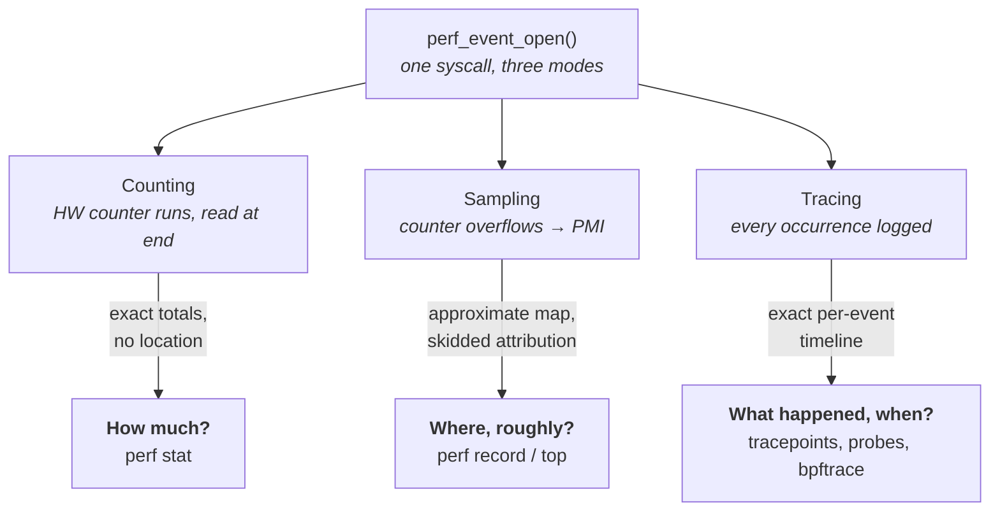
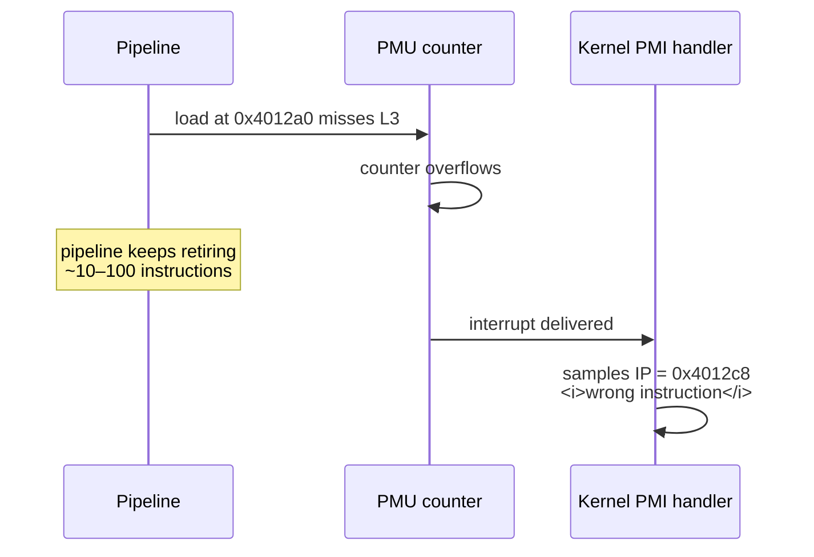
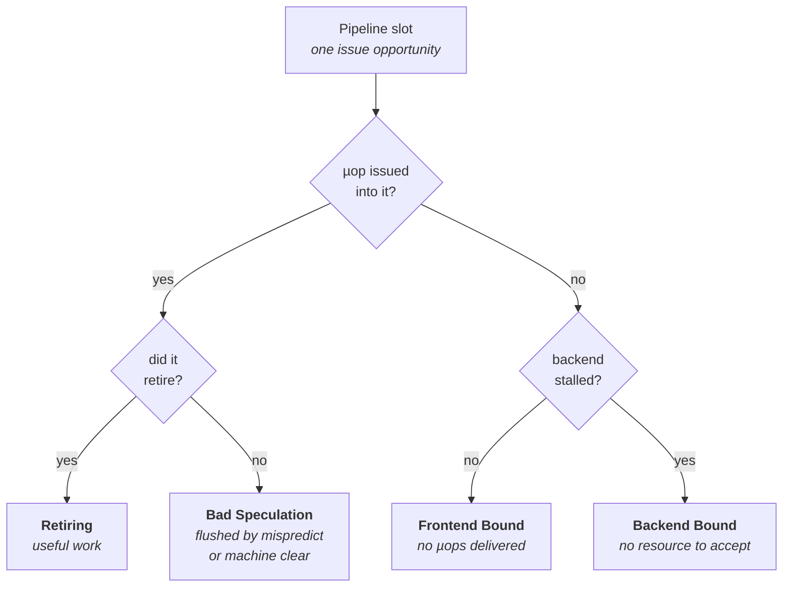
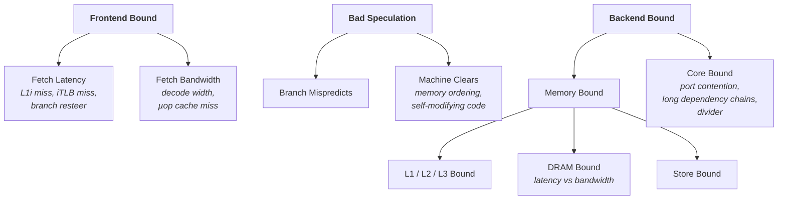
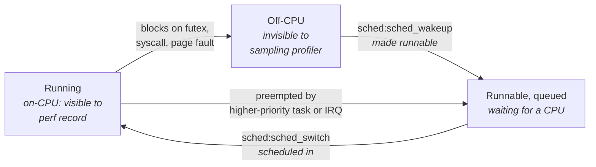
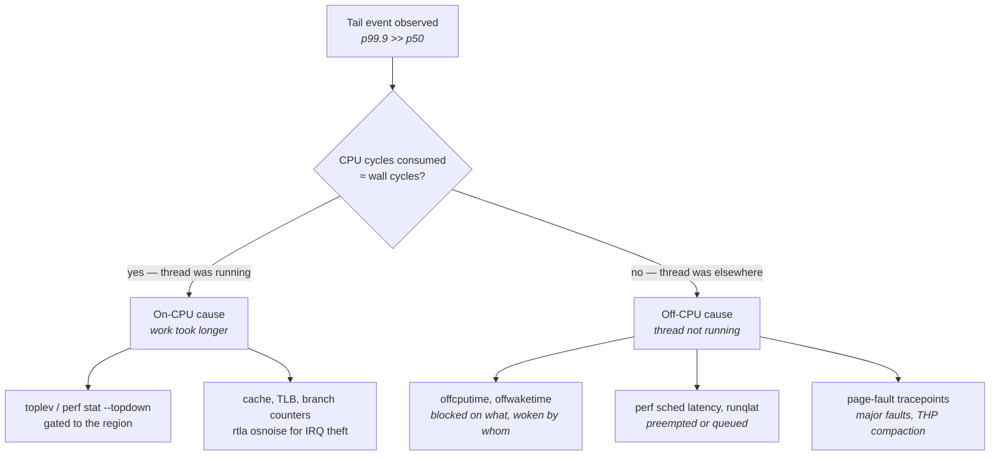

# Profiling Tools and Hardware Counters

The previous chapter established how to measure a system honestly: percentiles rather than averages,
histograms rather than summary statistics, and a harness that does not lie to itself about
coordinated omission (see "Measuring Correctly"). That gives you a number. It does not tell you where
the number comes from. A histogram that says "p99.9 is 41 µs and p50 is 900 ns" is a statement of
fact and a complete mystery: 41 µs is forty times longer than anything in your code should take, and
nothing in the source explains it.

This chapter is about the second half of the loop — turning a symptom into a mechanism. The tools
that do that fall into three families, and confusing them is the most common reason engineers new to
this work reach wrong conclusions. **Counting** tools ask the hardware "how many times did X happen
during this interval," and give you an exact, cheap, unbiased total with no idea where in the program
it happened. **Sampling** tools interrupt the program periodically and record where it was, giving
you a spatial map that is statistically approximate and — critically — systematically skewed in ways
you have to know about. **Tracing** tools record every occurrence of a specific event with a
timestamp, giving you exact ordering and timing of individual incidents at a cost that scales with
event frequency. Each answers a question the others cannot, and each is misleading when used for the
wrong question.

The other thing to internalize early: **profilers were built for throughput work, and a latency
engineer is using them against their design intent.** A conventional profiler answers "where does the
program spend most of its aggregate time," which is the right question if you want to make a batch
job finish sooner. It is the wrong question when the program is fast 99.9% of the time and the entire
problem is the 0.1%. Aggregate time is dominated by the common case; your problem lives in the rare
one. Nearly every technique in this chapter is either a way of getting a hardware-level explanation
of the common case (top-down analysis, PMU counters) or a way of catching a rare event in the act
(tracing, Intel PT, off-CPU analysis). Chapter 27 uses these tools against a specific problem; this
chapter is about what the tools actually do, what they perturb, and how far you can trust each one.

## `perf`: Counting, Sampling, and Tracing

`perf` is the Linux kernel's own performance tooling, built around one syscall — `perf_event_open` —
and one file descriptor abstraction. You ask the kernel to open an *event*, which may be a hardware
counter in the CPU's Performance Monitoring Unit (PMU), a kernel software counter such as page
faults, or a static instrumentation point compiled into the kernel. The kernel programs the hardware
(or hooks the software path) and hands you back a descriptor you can read. Everything `perf`
does — `stat`, `record`, `top`, `sched`, `c2c`, `mem`, `probe` — is a front end over that one
mechanism configured differently.

The distinction that determines what you can trust is what you do with the event once it is open.
There are exactly three options, and they have different accuracy properties, different overheads,
and different blind spots.

In **counting** mode, the kernel programs a hardware counter register, lets it run, and reads it at
the end. The counter increments in hardware, in parallel with execution, with no software involvement
whatsoever. The result is an exact total — if the CPU retired 8,411,203,918 instructions, that is the
number you get, not an estimate. The cost is essentially zero during the measured region; the only
overhead is at start and stop, and at context switches where the kernel must save and restore counter
values per task. What you do not get is location: the counter tells you the program suffered 4.2
million L3 misses and says nothing about which loads caused them.

In **sampling** mode, you additionally arm the counter to overflow. You set a *period* — say, every
1,000,000 cycles — and when the counter wraps, the hardware raises a Performance Monitoring Interrupt
(PMI). The kernel's handler records the current instruction pointer, and optionally the call stack,
the register set, and a branch history, into a ring buffer that `perf record` drains to disk. Now you
have location, but you have paid for it three times over: with interrupt overhead proportional to
sample rate, with statistical uncertainty (you sampled 1 in a million cycles, so rare things may not
appear at all), and with *skid* — the fact that the instruction pointer captured by the interrupt is
not the instruction that caused the event. Skid is important enough to get its own subsection below.

In **tracing** mode, you attach to an instrumentation point that fires on a specific software event —
a tracepoint compiled into the kernel, a dynamic kprobe on a kernel function, or a uprobe on a
user-space function — and every single occurrence is recorded with a timestamp. There is no sampling
and no statistical uncertainty: if the scheduler switched away from your thread eleven times, you get
eleven records with nanosecond timestamps. The cost is proportional to how often the event fires, and
for hot events (every syscall, every packet, every function call) that cost can be enormous. Tracing
is how you catch a once-per-minute anomaly that sampling would never see.



- **Counting answers "how much"** — totals over an interval, exact, near-zero overhead, no attribution.
- **Sampling answers "where, approximately"** — a probability map of where cycles or misses land, with
  interrupt overhead and skid.
- **Tracing answers "what happened and when"** — an exact, ordered, timestamped log of individual
  events, with cost proportional to event rate.

The rule that follows: **use counting to decide whether a hypothesis is worth pursuing, sampling to
localize it, and tracing to catch the specific incident.** Reaching for `perf record` first is the
most common workflow error, because a flat sampled profile of a hot path that is already fast tells
you almost nothing.

### Counting with `perf stat`

`perf stat` runs a command (or attaches to a process, or watches whole CPUs) and prints event totals
when it finishes. With no arguments it gives a default set that is genuinely useful as a first look.

```
perf stat -- ./mywork
```

The default output includes `task-clock` (CPU time actually consumed, in milliseconds),
`context-switches`, `cpu-migrations`, `page-faults`, `cycles`, `instructions` with the derived
instructions-per-cycle ratio, `branches`, and `branch-misses`. Three of those are software events
maintained by the kernel rather than hardware counters — context switches, migrations, and page
faults are counted by kernel code incrementing a variable, which is why they work identically on
every CPU and inside virtual machines where the PMU may be unavailable.

The flags that matter in practice are about *scope* and *repetition*, because the default scope — one
command, aggregated across all its threads and all CPUs it ran on — is rarely what a latency engineer
wants.

| Flag | Effect | When you want it |
|---|---|---|
| `-e <ev>[,<ev>...]` | Select specific events instead of the default set | Always, once you have a hypothesis |
| `-p <pid>` | Attach to a running process | Profiling a live service |
| `-a` | System-wide: count on every CPU | Catching work that happens outside your process |
| `-C <cpulist>` | Count only on the named CPUs | Isolating one pinned core's behavior |
| `-I <ms>` | Print a running total every N milliseconds | Finding *when* a rate changes, not just its average |
| `-r <n>` | Repeat the command N times and report mean and variance | Establishing whether a difference is real |
| `-d`, `-dd`, `-ddd` | Progressively larger canned event sets (cache, TLB, etc.) | Quick reconnaissance |
| `--per-core`, `--per-socket` | Break totals down by core or socket instead of aggregating | Finding the one core doing something different |

The `-I` flag deserves emphasis, because it converts a counting tool into a coarse time series and
that is often the difference between seeing a problem and not. A run that averages 1.4 instructions
per cycle might be a steady 1.4 throughout, or it might be 2.1 for nine intervals and 0.2 for the
tenth. The average is identical; the second case is the one that produces your tail. `perf stat -I
1000` prints one line per second and makes that immediately visible.

**Failure mode: an event reports zero on every run.** The symptom is a counter that stubbornly stays
at 0 or shows `<not supported>` next to it. The cause is usually one of three things: the event does
not exist on this microarchitecture and `perf`'s generic name maps to nothing; you are running in a
virtual machine where the hypervisor does not expose the PMU (common on cloud instances, and the
reason `perf record` silently falls back to the `cpu-clock` software event); or `perf_event_paranoid`
forbids it. Confirm by checking whether the event appears in `ls /sys/devices/cpu/events/`, and
whether the same command with `cycles` produces a plausible nonzero number.

**Failure mode: totals are inflated by work you did not intend to measure.** The symptom is
instruction counts far larger than the hot path could produce. The cause is scope — `perf stat` on a
multithreaded process aggregates all threads, including logging, telemetry, and initialization. Use
`-C <core>` to count only the isolated core your hot thread is pinned to, and compare against
`--per-core` output to see the split.

**Try it:** run `perf stat -e cycles,instructions,branches,branch-misses -- sleep 1` and then
`perf stat -a -e cycles,instructions -I 1000 sleep 5` on an otherwise idle machine. The first shows
you a near-empty program and how few instructions it really executes; the second shows you the
machine's background noise floor, counted system-wide, second by second. On a supposedly quiet
production host the second number is often startlingly large, and finding out what generates it is a
worthwhile afternoon.

### Sampling with `perf record` and `perf top`

Sampling produces a map. You choose an event whose accumulation you consider a proxy for cost —
cycles, by default — and the profile shows which code accumulated the most of it. The interpretation
is probabilistic: if 30% of your samples landed in a function, then roughly 30% of the sampled
event's occurrences happened there, within a margin that shrinks as sample count grows.

Two ways to set the rate exist, and the choice affects both cost and validity. `-F <hz>` requests a
target *frequency* — perf dynamically adjusts the counter period to hit roughly that many samples per
second, defaulting to about 4,000 Hz for the cycles event. This is convenient because it is
self-normalizing across machines of different speeds, but the dynamic period adjustment means the
effective sampling period changes over the run, which can subtly bias comparisons. `-c <period>`
fixes the period explicitly — sample every N events — which is what you want when you are counting
occurrences of something (every 10,000th L3 miss) rather than sampling time.

```
perf record -F 999 -g -- ./mywork
perf record -e cycles:pp -c 200000 -g -p 4711 -- sleep 10
perf report --stdio --sort overhead,symbol
```

The `-F 999` rather than `-F 1000` is a real convention with a real reason: sampling at a frequency
that shares a common factor with a periodic system activity (the 1,000 Hz timer tick, a 100 Hz
polling loop) causes the sampler to land in lockstep with that activity and systematically over- or
under-represent it. An off-by-one prime-ish frequency breaks the correlation. This is the same
aliasing problem as in signal processing, and it produces profiles that look plausible and are wrong.

`perf top` is the same machinery with a live display and no output file — it samples continuously and
shows a rolling top-N. It is the right tool for the thirty-second question "what is this box doing
right now," and the wrong tool for anything you intend to reason carefully about, because it gives
you no way to save, re-sort, or diff the data.

Overhead is the thing to keep in mind. At 4,000 Hz, a PMI fires every 250 µs on each monitored CPU;
the handler must save state, walk a call stack if you asked for one, and write into a ring buffer.
Stack walking dominates, and its cost depends entirely on which unwinding method you chose. On a
latency-critical thread this is not free, and at high frequencies with DWARF unwinding it is
emphatically not free — it is entirely possible to add microseconds of jitter to the very thread
whose jitter you are investigating.

| Sample rate | Approx. interrupt interval per CPU | Practical use |
|---|---|---|
| 99–999 Hz | 1–10 ms | Long production profiling; minimal perturbation |
| ~4,000 Hz (default) | 250 µs | Standard development profiling |
| 10,000+ Hz | <100 µs | Short, targeted runs only; measurable perturbation |

**Failure mode: the profile is flat and nothing stands out.** The symptom is a `perf report` where
the top entry is 3% and there is no obvious hotspot. Two very different causes produce this. Either
the work genuinely is spread evenly — in which case there is no single fix and top-down analysis is
the next step — or the samples are landing in the *common* case while your actual problem is a rare
tail event that contributed a handful of samples out of a hundred thousand. Distinguish them by
checking whether the p99.9 latency you care about, multiplied by its frequency, is even a measurable
fraction of total CPU time. Usually it is not, and sampling is structurally the wrong tool.

**Failure mode: samples are attributed to a symbol called `[unknown]` or to raw addresses.** The
cause is missing symbols — the binary was stripped, or the mapping was JIT-generated, or the samples
are in a shared library whose debug info is not installed. Confirm with `perf report --sort dso` to
see which object file the unknown samples belong to, then install its debug package or rebuild with
symbols retained.

**Try it:** run the same workload twice, once with `perf record -F 999 -g` and once with
`perf record -F 20000 -g --call-graph dwarf`, and compare the workload's own measured latency
distribution between the two runs. The second run will show a visibly worse tail. That difference is
the observer effect, and quantifying it on your own machine is the only way to develop judgment about
how much profiling a hot path can tolerate.

### Skid, and Why Sampled Attribution Misleads

Here is the mechanism that trips up nearly everyone the first time. When a performance counter
overflows, the CPU does not stop instantly. It raises an interrupt, and the interrupt is delivered
some number of cycles later — after the currently-executing instructions have made further progress,
possibly after speculative work has been discarded, possibly at a completely different instruction
than the one that caused the overflow. The distance between the instruction that caused the event and
the instruction recorded in the sample is called **skid**.

Skid is not a small effect. On an out-of-order core with a deep pipeline, tens of instructions can
retire between the counter overflow and the interrupt being taken. Worse, skid is not random: it
tends to land *after* long-latency operations, because the interrupt cannot be delivered while a
lengthy operation is in flight. The classic consequence is that a cache miss gets attributed not to
the load instruction that missed, but to the next instruction that consumed its result — or to
something further downstream entirely. You look at the annotated assembly, see 40% of your cycles on
an innocuous `add`, and conclude the arithmetic is slow.



The hardware fix is **precise sampling**. Intel calls its mechanism PEBS (Precise Event-Based
Sampling); AMD's equivalent capability is IBS (Instruction-Based Sampling), which works on a
different principle — tagging individual instructions or micro-operations for detailed recording
rather than reacting to counter overflow. With PEBS, when the counter overflows the hardware itself
writes a record — architectural register state plus the instruction pointer — into a memory buffer,
without waiting for an interrupt. The captured pointer is therefore much closer to the truth. On
Skylake-and-later Intel parts, PEBS records an "eventing IP" that identifies the actual instruction
responsible for many event types.

In `perf`, you request precision with suffixes on the event name:

| Suffix | Meaning |
|---|---|
| `:p` | Request some precision (constant skid, if the event supports it) |
| `:pp` | Request that the sample be attributed with no skid where the hardware allows |
| `:ppp` | Request maximum available precision |
| `:P` | Let perf pick the maximum precision the event supports |

So `perf record -e cycles:pp` is materially more trustworthy than `perf record -e cycles` for
instruction-level attribution, and there is essentially no reason not to use it when the event
supports it. Not all events support PEBS; asking for precision on an unsupported event produces an
error rather than a silent downgrade, which is the right behavior.

Two more caveats. PEBS on many Intel generations has a **one-instruction offset** for some events —
the recorded IP is the instruction *after* the one that caused the event — which `perf` corrects for
where it knows how, but which you should keep in mind when reading annotated assembly. And precise
sampling costs memory bandwidth, because the hardware is writing records to a buffer; at high sample
rates this is measurable.

**Failure mode: annotated assembly blames an instruction that obviously cannot be slow.** The symptom
is `perf annotate` showing a large percentage on a register-to-register move or an increment. The
cause is skid attributing a preceding long-latency operation's cost downstream. Confirm by re-running
with `:pp` and seeing whether the attribution shifts to a load, a branch, or a division a few
instructions earlier.

**Failure mode: the profile blames the instruction after a function call.** Same mechanism, different
shape — the call's cost lands on the return path. Precise events plus a check of the call target's
own profile resolves it.

**Try it:** profile any memory-bound loop twice, with `-e cycles` and `-e cycles:pp`, then run
`perf annotate` on the hot function in each. Compare which instruction carries the largest
percentage. The shift you observe is skid made visible, and once you have seen it on your own code
you will never again trust a non-precise annotation.

### Tracepoints, Probes, and Exact Event Timelines

Counting and sampling both work on aggregate behavior. Tracepoints work on individual events, and
they are how you answer questions of the form "did this specific thing happen, and exactly when."

A **tracepoint** is a static instrumentation point compiled into the kernel at a semantically
meaningful place — a context switch, a softirq entry, a page fault, an interrupt handler dispatch, a
packet being received. When disabled it costs approximately nothing (the kernel patches it out via a
no-op that becomes a jump only when armed). When enabled, each occurrence writes a structured record
with a timestamp and typed fields. `perf list` shows every tracepoint the running kernel offers,
grouped by subsystem.

The subsystems that matter for latency work are a short list, and knowing them by name is worth more
than knowing any particular tool:

| Subsystem | Representative tracepoints | What it tells you |
|---|---|---|
| `sched` | `sched:sched_switch`, `sched:sched_wakeup`, `sched:sched_migrate_task` | Every context switch, wakeup, and migration, with both tasks named |
| `irq` | `irq:irq_handler_entry`, `irq:softirq_entry`, `irq:softirq_exit` | Hardware and software interrupt servicing, with duration derivable |
| `timer` | `timer:hrtimer_expire_entry`, `timer:timer_expire_entry` | Timer callbacks running on your core |
| `raw_syscalls` | `raw_syscalls:sys_enter`, `raw_syscalls:sys_exit` | Every syscall, cheaply, without per-syscall tracepoints |
| `exceptions` | `exceptions:page_fault_user` | User-space page faults with faulting address |
| `power` | `power:cpu_idle`, `power:cpu_frequency` | C-state and P-state transitions (see "Clocks, Timers, and Time") |
| `net` | `net:netif_receive_skb`, `net:net_dev_xmit` | Packets crossing the stack boundary (see "The Linux Networking Stack") |

Where no static tracepoint exists, you can create one dynamically. **kprobes** let the kernel trap on
any kernel function entry or arbitrary instruction address; **uprobes** do the same for user-space
binaries. `perf probe` is the front end:

```
perf probe --add 'do_page_fault'
perf probe -x /usr/lib/libc.so.6 --add 'malloc'
perf record -e probe:do_page_fault -a -- sleep 10
perf probe --del '*'
```

Dynamic probes are more expensive than static tracepoints — a kprobe traditionally works by patching
a breakpoint instruction, taking a trap, running the handler, and single-stepping or emulating the
displaced instruction, though modern kernels optimize many kprobes into direct jumps. A uprobe is
more expensive still, because it involves a trap from user space into the kernel and back for every
hit. Putting a uprobe on a function called a million times per second will destroy the performance
you are trying to measure.

**Failure mode: enabling a tracepoint changes the behavior you were investigating.** The symptom is a
latency problem that disappears the moment you trace it, or a new one that appears. The cause is
event rate — `raw_syscalls:sys_enter` on a busy system, or a uprobe on a hot function, generates so
many records that the tracing infrastructure itself becomes the bottleneck. Confirm by checking for
dropped events in the trace output (both `perf` and ftrace report overruns) and by measuring the
workload's latency with tracing on versus off.

**Try it:** run `perf list | grep -c tracepoint` to see how many static instrumentation points your
kernel exposes — it is typically well over a thousand. Then run
`perf stat -e 'sched:sched_switch,irq:softirq_entry' -a -- sleep 10` on an idle machine, and again on
a machine with your workload running. Counting tracepoints, rather than recording them, is a cheap
way to test a hypothesis about *how often* something happens before you pay to record *when*.

### Permissions: What the Kernel Will Let You See

None of this works if the kernel refuses. Access to `perf_event_open` is gated by a sysctl that most
distributions set conservatively, and hitting it produces confusing errors rather than clear ones.

```
cat /proc/sys/kernel/perf_event_paranoid
```

| Value | What is permitted to unprivileged users |
|---|---|
| `-1` | Everything, including raw tracepoint access and system-wide profiling |
| `0` | CPU-wide and per-task events, including kernel-space samples |
| `1` | Per-task events only; no CPU-wide profiling |
| `2` | Per-task, user-space measurements only (common default) |
| `3` | Disallowed entirely (a Debian/Ubuntu-family patch, not upstream) |

A second knob, `/proc/sys/kernel/kptr_restrict`, controls whether kernel symbol addresses are visible
in `/proc/kallsyms`. If it is set to restrict, kernel samples resolve to hex addresses instead of
function names even when profiling is otherwise permitted, which looks like a broken profiler.

On a development or dedicated benchmarking host the right settings are usually
`kernel.perf_event_paranoid = -1` and `kernel.kptr_restrict = 0`. These are genuine information
disclosures — hardware counters have been used in side-channel research, and kernel addresses defeat
address-space layout randomization — so this is a deliberate trade, not an oversight to be blindly
corrected on a shared machine.

One more thing competes with you for hardware: the NMI watchdog, which uses a performance counter to
detect hung CPUs. Disabling it via `/proc/sys/kernel/nmi_watchdog` frees one general-purpose counter
per core, which matters more than it sounds when you are trying to measure eight events at once.

**Try it:** check all three at once with
`sysctl kernel.perf_event_paranoid kernel.kptr_restrict kernel.nmi_watchdog`, then run
`perf record -a -- sleep 1` and `perf report --sort dso`. If you see `[kernel.kallsyms]` with named
functions, you have full visibility; if you see raw addresses or an immediate permission error, you
have found your first obstacle.

## The PMU: What the Counters Actually Count

Every modern CPU core contains a Performance Monitoring Unit: a small set of hardware registers that
can be programmed to count architectural and microarchitectural events. This is not instrumentation
in the software sense — nothing is inserted into your program, nothing is patched, and the counting
happens in parallel with execution at no cycle cost. That is why counting is the cheapest form of
observation available and why it should usually be the first thing you reach for.

The PMU exists because CPU designers need to validate their own designs, and it is exposed to
software because operating systems and compilers benefit from it. What this means practically is that
**the counter set is a vendor-specific implementation detail, not an architectural interface.** There
is no guarantee that an event present on Skylake exists on Ice Lake, that it means the same thing on
both, or that AMD offers anything analogous. Some events are documented with caveats about
over-counting under specific conditions. Some are documented and simply wrong on certain steppings,
requiring errata workarounds. Treating a PMU event name as a portable API is the single largest
source of wasted effort in this domain.

`perf` papers over some of this with **generic events** — abstract names like `cache-misses` or
`branch-misses` that it maps onto whatever the local microarchitecture provides. This is genuinely
useful for portability and genuinely dangerous for precision, because the mapping is a judgment call
made by kernel developers. `cache-misses` on Intel typically maps to a last-level-cache miss event;
what exactly counts as "last level" on a machine with a non-inclusive L3 and a large L2 is not
obvious, and the number you get may not mean what you assume. When precision matters, use the
microarchitecture-specific event name and read its definition in the vendor's optimization manual.

You can see what your machine actually supports:

```
perf list
perf list hw cache
ls /sys/devices/cpu/events/
ls /sys/bus/event_source/devices/
```

`/sys/devices/cpu/events/` is the authoritative list for the core PMU — each file names an event and
contains the raw encoding perf will program. On hybrid CPUs with performance and efficiency cores,
this splits into `/sys/devices/cpu_core/events/` and `/sys/devices/cpu_atom/events/`, and the two
have different event sets, which is a good reminder of how non-portable this all is.
`/sys/bus/event_source/devices/` lists every PMU the kernel knows about, including *uncore* PMUs —
counters that live outside the core, in the memory controllers, the L3 slices, and the interconnect
(see "Memory Systems" for what those measure).

### The Core Four: Cycles, Instructions, IPC, and Reference Cycles

Start with the events that exist everywhere and mean roughly the same thing everywhere.

**Cycles** counts core clock cycles while the core is not halted. The crucial detail is *core clock*:
if the CPU changes frequency, a cycle changes duration, so cycle counts are not proportional to time
under frequency scaling. This is why `ref-cycles` exists — it counts at a fixed reference frequency
regardless of what the core is actually running at, and the ratio of `cycles` to `ref-cycles` tells
you the effective frequency multiplier. On a properly configured low-latency host with turbo and
frequency scaling pinned down (see "Tuning a Linux Box for Determinism"), the two track each other;
if they diverge, your frequency is moving and you have found a jitter source.

**Instructions** counts instructions retired — that is, instructions that actually completed and
committed their results, not instructions fetched or speculatively executed. This distinction matters
enormously on an out-of-order core, where a mispredicted branch can cause dozens of instructions to
execute and then be discarded. Retired counts are the honest ones.

**Instructions per cycle (IPC)** is the ratio, and it is the single most useful first-order health
metric for a hot path. A modern x86 core can retire 4 to 6 instructions per cycle at peak. What IPC
you should expect depends entirely on the code, but the interpretive ranges are broadly stable:

| IPC (Skylake-and-later class) | Interpretation |
|---|---|
| 3.0+ | Near peak; the core is well fed. Optimization must reduce instruction count, not stalls |
| 1.5–3.0 | Healthy for typical branchy, memory-touching code |
| 0.7–1.5 | Something is stalling regularly — cache, branches, or dependencies |
| <0.5 | Severely stalled; almost always memory or mispredictions. Top-down analysis will say which |

The trap with IPC is that it is a *throughput* metric being used to reason about *latency*, and the
two can point in opposite directions. A hot path that spends most of its time spinning on an empty
queue will show excellent IPC — a tight spin loop retires instructions beautifully — while doing no
useful work at all. Conversely, code that has been optimized by removing instructions will show
*worse* IPC while being faster, because you removed the cheap instructions that were padding the
ratio. **IPC is a diagnostic for stalls, not a score to maximize.**

**Failure mode: IPC improves after a change but latency gets worse.** The symptom is exactly as
stated, and it is confusing until you see it once. The cause is that IPC is instructions divided by
cycles, and you can raise it by adding cheap instructions. Confirm by looking at absolute cycle counts
per unit of work rather than the ratio — `perf stat -e cycles` divided by your own operation counter
is the number that actually matters.

**Try it:** run `perf stat -e cycles,ref-cycles,instructions -- ./yourwork` on a machine with default
power management, then again after setting the CPU governor to `performance` and disabling turbo via
`/sys/devices/system/cpu/intel_pstate/no_turbo` (Intel) or the equivalent for your platform. Compare
the `cycles`-to-`ref-cycles` ratio in each. In the first run it will be noisy and above or below 1;
in the second it should be close to constant. That constancy is what determinism looks like at the
counter level.

### Cache and TLB Events

The generic cache events follow a naming scheme that is easy to remember and easy to over-trust:
a level, an access type, and whether you want accesses or misses.

```
perf stat -e L1-dcache-loads,L1-dcache-load-misses,LLC-loads,LLC-load-misses \
          -e dTLB-loads,dTLB-load-misses,iTLB-load-misses -- ./mywork
```

These map onto real hardware events, but the mapping quality varies. `L1-dcache-load-misses` is
usually reliable. `LLC-load-misses` is where interpretation gets subtle, because what happens on an
L3 miss depends on the machine: the line might come from DRAM on the local socket, from DRAM on a
remote socket, or from another core's cache via the coherence protocol (see "Multicore, Coherence,
and Memory Ordering"). Those three have very different costs — roughly 80–100 ns, 130–200 ns, and
tens of nanoseconds respectively — and a single miss counter lumps them together.

Resolving that requires either microarchitecture-specific events that break misses down by data
source, or `perf mem`, which uses precise memory-sampling events to record the *data source* for
sampled loads:

```
perf mem record -- ./mywork
perf mem report --sort mem,symbol
```

The report classifies each sampled load by where the data came from — L1, L2, L3 hit, L3 miss to
local DRAM, remote DRAM, or another core's cache — which is exactly the breakdown a raw miss counter
cannot give you. The mechanism is Intel's PEBS memory events or AMD's IBS; both tag individual loads
with latency and source information at sample time.

A related specialized tool is `perf c2c` ("cache to cache"), which exists for one purpose: finding
false sharing. It samples loads and stores that hit a modified line in another core's cache — the
HITM condition — and aggregates them by cache line, showing you which line, which offsets within it,
and which code on which cores are fighting over it.

```
perf c2c record -a -- sleep 10
perf c2c report --stdio
```

If you have read "The Cache Hierarchy," you know false sharing conceptually: two threads writing
different variables that happen to share a 64-byte line, causing the line to ping-pong between cores
at coherence-miss cost. `perf c2c` is the tool that finds it in a real binary, and it is close to
irreplaceable, because false sharing is invisible in a conventional profile — the affected loads and
stores look like ordinary loads and stores that are inexplicably slow.

TLB events matter for the reasons "Memory Systems" laid out: TLB reach with 4 KiB pages is only a few
megabytes, so a working set that fits comfortably in L3 can still thrash translation. The generic
counters `dTLB-load-misses` and `iTLB-load-misses` tell you misses happened; what you usually want is
the *cost*, which means cycles spent walking page tables. Intel exposes this as a walk-duration event
(the family of `dtlb_load_misses.*` and `itlb_misses.*` events, whose exact member names vary across
generations); dividing walk cycles by total cycles gives the fraction of your time spent translating
addresses rather than using them. AMD exposes equivalent information under entirely different names.
**Look the name up on your specific part rather than copying one from a blog post** — this is the
single most common way to end up measuring nothing.

**Failure mode: cache miss counts look fine but the code is clearly memory-stalled.** The symptom is
a low `LLC-load-misses` rate alongside terrible IPC. Two causes are common: the misses are in the
TLB, not the data cache, so the stall is page walks (check TLB walk-cycle events); or the misses are
few but *dependent*, forming a pointer-chasing chain with no memory-level parallelism, so a small
number of misses serializes into a large amount of time. Confirm the second by comparing miss count
against stall cycles — a high stall-per-miss ratio means poor overlap.

**Failure mode: two threads scale terribly despite touching different data.** Classic false sharing.
Confirm with `perf c2c record -a` during the contended run and look for a single cache line dominating
the HITM report, then check the byte offsets — they will belong to two different fields.

**Try it:** run `perf stat -e L1-dcache-loads,L1-dcache-load-misses,LLC-loads,LLC-load-misses` over a
loop that walks an array much larger than L3, then over one that walks an array that fits in L1.
Compute the miss rates. Then run `perf mem record` on the large-array version and look at the data
source breakdown in `perf mem report` — you should see the overwhelming majority classified as local
DRAM, which is the counter-level confirmation of what the timing already told you.

### Branch Events

Branch counters are simple and unusually trustworthy. `branches` (also `branch-instructions`) counts
retired branch instructions; `branch-misses` counts those that were mispredicted. The ratio is your
misprediction rate.

The reason to care is the cost, established in "CPU Microarchitecture Essentials": a mispredicted
branch flushes the pipeline, discarding all speculative work, at a penalty of roughly 15–20 cycles on
Skylake-and-later cores. At 3 GHz that is 5–7 ns per mispredict. That sounds small until you compute
the aggregate: a hot path executing 2,000 instructions with 15% branches and a 5% misprediction rate
suffers 15 mispredicts, costing 250–300 cycles — comfortably 10% of the whole operation.

The interpretive rule is that a misprediction rate below about 1% is excellent, 1–3% is normal for
branchy code, and above 5% means you have a genuinely unpredictable branch that is worth restructuring
or eliminating. Localizing *which* branch requires sampling on the branch-miss event:

```
perf record -e branch-misses:pp -c 10000 -g -- ./mywork
perf report --stdio
```

Note the `-c` rather than `-F`: you are sampling every 10,000th misprediction, not sampling at a
frequency, which is the correct mode for counting-style events. And note `:pp` — skid on branch
events is exactly as misleading as on cache events.

**Failure mode: a rarely-taken error path destroys predictability.** The symptom is a high
misprediction rate in code that looks straightforwardly predictable. A common cause is that a branch
that is almost always taken one way becomes unpredictable when a rare condition alternates — or that
the branch predictor's history table is being thrashed by *other* code, since predictor state is a
shared, finite resource. Confirm by sampling `branch-misses:pp` and checking whether the top
mispredicting branch is in the code you suspected.

**Try it:** write a loop that branches on a condition derived from an array of values, run it twice —
once with the array sorted so the branch is highly predictable, once shuffled — and compare
`perf stat -e branches,branch-misses,cycles,instructions` for both. Same instruction count, same
memory traffic, dramatically different cycles. Divide the cycle difference by the misprediction-count
difference to derive your machine's actual mispredict penalty in cycles. That derived number is worth
more than any published figure because it is yours.

### Stall Events and Counter Scarcity

The events above tell you what *happened*. What you usually want to know is what the core was *not*
doing and why. That is the domain of stall events, and it is where PMU work gets genuinely
microarchitecture-specific.

`perf` offers two generic stall events: `stalled-cycles-frontend` and `stalled-cycles-backend`. These
map to whatever the local hardware provides, and their availability is spotty — on many parts one or
both report `<not supported>`. When they work, the split is meaningful: frontend stalls mean the core
could not supply instructions to execute (instruction cache misses, decode bottlenecks, branch
resteers); backend stalls mean instructions were available but could not proceed (waiting on memory,
waiting on a busy execution port, waiting on a dependency). That frontend/backend split is the
foundation of top-down analysis, covered in the next section, which is a far more rigorous version of
the same idea.

More specific stall events exist and are worth knowing about *by mechanism* even though their names
vary. On Intel Skylake-and-later there is a family of `cycle_activity.*` events that count cycles
during which execution was stalled with an outstanding miss at a particular level — `stalls_l3_miss`
being the one that isolates DRAM-bound stalls. AMD provides analogous information through different
events and through IBS. The correct workflow is: describe the mechanism you want to measure ("cycles
stalled waiting on a last-level-cache miss"), then find the event that provides it on your part via
`perf list` and the vendor manual.

The reason all of this feels cramped is **counter scarcity**. A core has a small number of physical
counter registers, and they are the hard limit on how many events you can count simultaneously.

| Class | Typical count (modern Intel server core) |
|---|---|
| General-purpose programmable counters | 4 per hardware thread, or 8 with SMT disabled on many parts; 8 on newer generations |
| Fixed-function counters | 3 (instructions, core cycles, reference cycles); newer parts add a slots counter |
| Consumed by NMI watchdog | 1 general-purpose, if enabled |

When you ask for more events than there are counters, `perf` does not fail — it **multiplexes**. It
time-slices the counters between event groups, measuring each for a fraction of the run, then scales
the results up to estimate a full-run total. The output marks this with a percentage in brackets next
to each event, indicating what fraction of the time that event was actually being counted.

This is the trap. Multiplexed results are *estimates*, and the estimate is only valid if the event
rate is stationary — that is, if the behavior during the sampled windows is representative of the
whole run. For a steady batch workload, that is often true. For a latency-critical hot path where the
whole point is a rare anomaly, it is exactly wrong: multiplexing will miss the anomaly most of the
time and then scale the miss up as though it were representative.

**Failure mode: counter values change substantially between identical runs.** The symptom is `perf
stat -r 5` reporting large variance on an event that should be deterministic. The cause is usually
multiplexing. Confirm by looking at the bracketed percentage — anything below 100% means the value is
scaled. The fix is to ask for fewer events per run and take more runs, or to disable the NMI watchdog
to free a counter.

**Try it:** run `perf stat -e cycles,instructions -- ./mywork` and note the absence of bracketed
percentages. Then run it with ten events specified and watch the percentages appear, typically around
40–60% each. Then run `echo 0 | sudo tee /proc/sys/kernel/nmi_watchdog` and repeat — you should see
the percentages improve slightly, because one more counter became available.

## Top-Down Microarchitecture Analysis

Everything so far has been a collection of individual signals with no structure connecting them. You
can count cache misses, branch misses, and TLB walks, but nothing tells you which of them actually
matters, or whether together they explain the observed slowdown, or whether you have missed a fourth
thing entirely. This is why bottom-up counter work so often stalls out: you accumulate a pile of
numbers with no way to rank them.

Top-Down Microarchitecture Analysis (TMA) solves this. It is a hierarchical, quantitative
decomposition that starts from a single question — for every opportunity the CPU had to do useful
work, what happened to it? — and drills down through successive levels, at each step accounting for
100% of the resource. Because it is exhaustive at every level, it does not just tell you that
mispredictions are happening; it tells you what *fraction of your total performance* mispredictions
cost, and therefore whether fixing them is worth your afternoon. It is the most valuable analytical
framework in this chapter and the one worth learning properly.

### Slots: The Unit of Accounting

The framework rests on one abstraction. A superscalar core's frontend can issue a fixed number of
micro-operations (µops) per cycle into the backend — 4 on Skylake-class cores, 5 or 6 on more recent
Intel generations, with AMD offering comparable width. Call each of those per-cycle issue
opportunities a **pipeline slot**. If the core runs for a billion cycles at 4-wide issue, it had 4
billion slots. That is the total budget of useful work the machine could possibly have performed.

Every slot ends up in exactly one of four states, and this is the level-1 decomposition:

- The slot was filled with a µop that **retired** — genuinely useful work.
- The slot was filled with a µop that was later **discarded** because of a mispredicted branch or a
  machine clear — wasted work, categorized as *bad speculation*.
- The slot was **empty because the frontend could not deliver** a µop — *frontend bound*.
- The slot was **empty because the backend could not accept** a µop, having run out of some
  resource — *backend bound*.

These four categories are mutually exclusive and collectively exhaustive. They sum to exactly 100% of
slots. That property is what makes the framework usable: unlike a pile of individual counters, the
top-level breakdown cannot be missing a cause.

The decision procedure at level 1 is a two-question test applied to each slot. First: was the slot
filled? If yes, the µop either retired or was discarded — retiring versus bad speculation. If the
slot was empty, the second question: was the backend stalled at the time? If the backend had room and
still got nothing, the frontend was the problem. If the backend was full, it was the constraint.



- **The four level-1 buckets sum to 100% of slots**, which is why the decomposition can rank causes
  rather than merely list them.
- **A slot is empty for exactly one reason**, so frontend and backend attribution never double-count.

Reading the level-1 numbers is a matter of knowing what each bucket implicates.

| Bucket | Typical healthy value | What a large value means | Chapter that explains the mechanism |
|---|---|---|---|
| **Retiring** | As high as possible; 30–50% is good for real code | The core is working; further gains need fewer instructions, not fewer stalls | "CPU Microarchitecture Essentials" |
| **Bad Speculation** | <5% | Branch mispredictions or machine clears (memory ordering violations, self-modifying code, certain faults) | "CPU Microarchitecture Essentials" |
| **Frontend Bound** | <10% for compact hot paths | Instruction fetch is the bottleneck: L1i misses, iTLB misses, µop cache misses, decode limits | "The Cache Hierarchy" |
| **Backend Bound** | Usually the largest non-retiring bucket | Waiting on something: memory, execution port capacity, or dependency chains | "Memory Systems", "The Cache Hierarchy" |

A caution that is easy to miss: **high Retiring is not automatically good.** A tight busy-wait loop
polling a queue retires almost every slot and accomplishes nothing. TMA measures how well the *core*
is being utilized, not whether the work is worth doing. Pair it with an application-level measure of
useful operations per second, or you will optimize a spin loop to perfection.

### Drilling Down: Levels 2 and 3

Level 1 tells you which of four things dominates. Level 2 splits each bucket into its two main
sub-causes, and level 3 splits further. Each level again sums to its parent, so the ranking property
is preserved all the way down.



- **Frontend Bound splits by cause type**: latency (a fetch that took long, e.g. an L1i miss) versus
  bandwidth (fetch delivered µops but not enough per cycle).
- **Backend Bound splits into Memory Bound and Core Bound**, which is the single most valuable
  discrimination in the whole framework — it separates "waiting for data" from "not enough execution
  resources or too long a dependency chain."
- **Memory Bound splits by cache level**, so you learn whether you are L2-bound (fix with better
  blocking) or DRAM-bound (fix with layout, prefetching, or huge pages) — see "Memory Systems".

Two entries in that tree deserve explanation because they are unfamiliar. A **machine clear** is a
full pipeline flush that is not caused by branch misprediction — the most common variety in
multithreaded code is a *memory ordering machine clear*, where the core speculatively performed a
load out of order and another core's store invalidated the assumption, forcing a re-execution.
Elevated machine clears in a concurrent workload are a strong signal of true sharing or contention on
a hot line (see "Multicore, Coherence, and Memory Ordering"). And **Core Bound** is the bucket people
find hardest to act on: it means µops were ready and data was available, but the backend could not
retire them fast enough, either because too many wanted the same execution port or because a
dependency chain serialized them. Core Bound with high Retiring often means you are near the
machine's limit; Core Bound with low Retiring usually means a long serial dependency chain.

### Running It

There are three ways to get top-down numbers, in increasing order of capability and setup cost.

**`perf stat --topdown`** gives you the level-1 breakdown directly. On Ice Lake and later Intel
parts, the hardware provides the decomposition in a dedicated metrics register, so the four values
come from one read with no multiplexing at all — this is essentially free and exact. On Skylake-class
parts, `perf` computes the same four values from a set of underlying events. Newer `perf` versions
accept `--td-level=2` to descend a level.

```
perf stat --topdown -- ./mywork
perf stat --topdown --td-level=2 -- ./mywork
```

**Metric groups** are the more flexible route. Modern `perf` ships with per-microarchitecture metric
definitions and exposes them by name:

```
perf list metricgroup
perf stat -M TopdownL1 -- ./mywork
perf stat -M TopdownL2 -- ./mywork
```

This has the advantage of working uniformly across vendors where the metric definitions exist, and of
printing named metrics rather than raw counter values.

**`toplev`**, part of Andi Kleen's `pmu-tools`, is the reference implementation and goes deepest. It
knows the full TMA hierarchy for each Intel microarchitecture, automatically handles the event
multiplexing needed at deeper levels, and — the genuinely valuable part — will only descend into a
sub-tree whose parent exceeded a threshold, so it does not waste counters measuring branches of the
tree that do not matter.

```
git clone https://github.com/andikleen/pmu-tools
./pmu-tools/toplev.py -l1 -- ./mywork
./pmu-tools/toplev.py -l3 --no-desc -- ./mywork
./pmu-tools/toplev.py -l3 -a -I 1000 -- sleep 30
```

The `-l3` run needs many events and will multiplex heavily, so it wants a long, steady workload. The
`-I` form gives a level-3 time series, which is how you catch a workload whose bottleneck *changes*
across phases.

### Reading Top-Down on a Latency-Critical Path

There is a structural problem with applying TMA to a hot path, and it is worth being explicit about
because it catches people who otherwise use the framework correctly.

TMA measures how a core spent its issue slots over a window. A latency-critical thread typically
spends the overwhelming majority of its wall time waiting — polling a receive queue, spinning on a
flag — and only microseconds actually processing. If you run `toplev` over the whole process, you
measure the spin loop, which is uninteresting and which will dominate every bucket. The breakdown
will look beautiful and tell you nothing.

Two approaches fix this. The first is to construct a benchmark that runs *only* the processing path in
a loop with pre-staged inputs, and analyze that. This is what most people do, and it works, at the
cost of not measuring the cold-cache reality of the real system — in production your hot path runs
once every few hundred microseconds and finds its instructions and data evicted, whereas the benchmark
loop keeps everything resident (see "The Cache Hierarchy" on cache warming). The benchmark will show
you a far better frontend picture than reality.

The second is to gate the counters around the region of interest. `perf stat` can be told to start
disabled and be enabled by a signal, and `perf record` supports address-range filtering on some event
types, but the most robust approach is to read the counters directly from your own process via
`perf_event_open` and read the values before and after the region. That is real work to set up, and
it is what serious shops do, because it is the only way to get counter data attributed to the actual
hot path rather than to the wait loop around it.

**Failure mode: top-down says Frontend Bound but only in production.** The symptom is a benchmark
showing 5% frontend bound and the deployed system showing 30%. The cause is instruction cache and
µop-cache residency: in the benchmark the hot path runs continuously, in production it runs rarely and
its instructions are evicted between invocations by everything else on the core. Confirm by measuring
`L1-icache-load-misses` and iTLB misses in both settings, and by testing whether periodically
exercising the path (cache warming) reduces the production figure.

**Failure mode: Bad Speculation is high but branch-misses are low.** The cause is machine clears
rather than mispredicts — level-2 decomposition separates them. In multithreaded code the usual
culprit is memory-ordering clears from contention on a shared line; confirm by correlating with
`perf c2c` output on the same workload.

**Try it:** run `perf stat --topdown -- ./mywork` on three deliberately different programs: a tight
loop over an array that fits in L1 (should be strongly Retiring), a random walk over an array much
larger than L3 (should be strongly Backend Bound → Memory Bound → DRAM Bound), and a loop with an
unpredictable data-dependent branch (should show Bad Speculation). Seeing the framework correctly
classify three known-cause programs is what makes you trust it on an unknown one.

**Try it:** run `toplev.py -l1 -I 1000 -a -- sleep 60` on a production-like host and watch the
per-second breakdown. If the buckets shift substantially between intervals, the machine's bottleneck
is not stationary — which immediately invalidates any single aggregated number, including one you may
have quoted in a design document.

## VTune and uProf

`perf` gives you access to the hardware; it does not give you the vendor's knowledge of what the
hardware means. Intel VTune Profiler and AMD uProf are the vendors' own tools, and their real value
is not that they collect data `perf` cannot — mostly they collect the same PMU events through the
same kernel interface — but that they ship the microarchitecture-specific event definitions, the
derived metric formulas, the thresholds for what counts as a problem, and prose explanations of what
to do about each finding. That knowledge exists in the optimization manuals; the tools save you from
having to internalize a 900-page PDF.

Both operate in two modes. Either they install a kernel driver that gives them deeper access to the
PMU (including uncore counters and some sampling modes with better precision), or they run
"driverless" on top of the standard `perf_event_open` interface, which requires the same paranoid-level
permissions discussed above. The driverless mode is far more common now and is what you get in a
container or on a host where you cannot load modules.

The analysis types are where the accumulated knowledge lives:

| VTune analysis | What it is really doing | Closest `perf` equivalent |
|---|---|---|
| Performance Snapshot | Short broad collection; recommends which deeper analysis to run | `perf stat -d` plus judgment |
| Hotspots | Sampled profile with call stacks | `perf record -g` |
| Microarchitecture Exploration | Full TMA hierarchy with vendor thresholds and prose | `toplev -l3` |
| Memory Access | Sampled loads with data source, plus uncore bandwidth counters | `perf mem` plus uncore events |
| Threading | Wait/lock analysis, concurrency over time | `perf sched`, off-CPU profiling |

AMD uProf covers analogous ground with a different command surface. `AMDuProfCLI` performs collection
and reporting on a per-process basis, and `AMDuProfPcm` reports system-level and uncore metrics such
as memory bandwidth and interconnect utilization. AMD's sampling story leans on IBS, which — unlike
counter-overflow sampling — selects an instruction or micro-op to tag and then records rich detail
about it, including data address and completion latency for loads. That is a genuinely different
mechanism from PEBS and in some respects a cleaner one, because there is no skid to correct for.

The practical question is when to use a vendor tool rather than `perf`. The honest answer for a
latency engineer is: for the initial microarchitecture survey of a new hot path, and for memory access
analysis where the data-source and bandwidth correlation is genuinely hard to assemble by hand. For
everything involving rare events, tracing, scheduling, or production hosts, `perf` and eBPF are
better, because they are always installed, they are scriptable, they have no licensing questions, and
they impose no GUI between you and the data.

**Failure mode: vendor tool results disagree with `perf` results on the same workload.** Usually the
cause is different scope or different event mapping rather than a bug — the GUI tool may be including
child processes, or measuring wall time where you measured CPU time, or using a different underlying
event for a similarly named metric. Confirm by having the vendor tool export raw event counts and
comparing those, not the derived metrics.

**Try it:** if you have access to either tool, run its microarchitecture analysis and
`toplev.py -l2` on the same workload and put the level-1 and level-2 numbers side by side. They
should agree closely, because they are computing the same formulas from the same counters. Confirming
that once is what lets you use the cheaper tool with confidence afterwards.

## Flame Graphs and Off-CPU Analysis

A `perf report` gives you a ranked list of functions, which answers "what is hot" but destroys the
structure — you cannot see that a function is hot because of one particular caller, or that three
separate call paths each contribute a third of the cost. Call-graph reports partially recover this,
but reading a deeply nested text tree with percentages is slow and error-prone.

A **flame graph** is a visualization that fixes this. Take every sampled call stack, merge stacks that
share a prefix, and draw each frame as a box whose width is proportional to the number of samples
containing it, stacked vertically in call order. The x-axis is *not* time — it is alphabetically
sorted stack ordering, chosen purely to make merging deterministic. Width means "fraction of samples,"
and that is all it means. The result is that a wide box anywhere in the graph is a place where time
goes, and its position in the stack tells you the full path that got there.

```
perf record -F 999 -g -- ./mywork
perf script > out.perf
./FlameGraph/stackcollapse-perf.pl out.perf > out.folded
./FlameGraph/flamegraph.pl out.folded > flame.svg
```

Modern `perf` can also produce a flame graph directly via `perf script report flamegraph`, which
generates an HTML output without the external toolchain.

### Getting Correct Stacks

The flame graph is only as good as the stacks, and stack collection is where most flame graphs go
wrong. `perf` offers three unwinding methods with sharply different costs and reliability:

| Method | How it works | Cost | Failure mode |
|---|---|---|---|
| `--call-graph fp` | Follows the frame pointer chain in registers | Very cheap | Broken if any frame was compiled without frame pointers — very common, since omitting them is a default optimization |
| `--call-graph dwarf` | Copies a chunk of stack memory per sample, unwinds offline using DWARF debug info | Expensive: copies kilobytes per sample | Truncated stacks if the copied region is too small; needs debug info |
| `--call-graph lbr` | Uses the CPU's last-branch record hardware to reconstruct the call chain | Cheap, hardware-assisted | Limited depth (the LBR stack holds 16 or 32 entries depending on generation); Intel-specific |

The frame-pointer problem is worth stating plainly because it silently produces wrong graphs rather
than obviously broken ones: if a library in the middle of your call chain was compiled without frame
pointers, the unwind stops there, and every stack through that library gets truncated and merged into
a misleadingly shallow tower. The fix is to build with frame pointers retained for anything you intend
to profile — the couple of percent of performance this costs is repaid many times by being able to
see what your program is doing.

**Failure mode: the flame graph shows a wide box at the bottom and nothing above it.** The symptom is
stacks one or two frames deep for code you know is deeply nested. The cause is frame pointer omission,
or missing debug info with DWARF unwinding. Confirm by running `perf script` and looking at the raw
stacks — you will see them terminating immediately. Fix by rebuilding with frame pointers or by using
`--call-graph dwarf` with an increased stack dump size.

### Off-CPU Analysis: Where Latency Actually Hides

Here is the most important limitation of everything discussed so far, and the reason many latency
investigations using conventional profilers fail outright.

**A sampling profiler can only sample a thread that is running.** The sampling interrupt fires on a
CPU and records what is executing there. If your thread is blocked — waiting on a futex, sleeping in
`epoll_wait`, waiting for a page fault to be serviced, sitting on the run queue waiting for a CPU that
is busy with something else — it generates *zero* samples. It contributes nothing to the flame graph.
It is invisible.

Now consider what a latency tail usually consists of. Your hot path normally takes 900 ns. Once every
few seconds it takes 40 µs. Where did 39 µs go? Almost certainly not into executing instructions —
39 µs is over 100,000 cycles, and no plausible amount of cache missing accounts for it in a code path
that normally completes in under three thousand. It went into *not running*: descheduled by the
kernel, blocked on a lock, waiting for a major page fault, preempted by an interrupt handler. Every
one of those is invisible to a CPU profiler by construction.



- **The transition into the off-CPU state is what a CPU profiler cannot see**, so time spent there
  never appears in a flame graph.
- **The two tracepoints on the return edges** — `sched:sched_wakeup` and `sched:sched_switch` — are
  exactly what off-CPU tooling instruments to reconstruct the missing time.
- **Runnable-but-queued is a distinct state from blocked**, and confusing them misdirects the fix:
  blocked means you are waiting on something, queued means you are waiting for a CPU (see "Processes,
  Threads, and Scheduling").

Off-CPU analysis fills the gap by tracing scheduler events rather than sampling. The standard tool is
`offcputime` from BCC, which hooks the scheduler's switch path, records the stack of the thread going
off-CPU and the timestamp, and when that thread is switched back in, attributes the elapsed time to
the recorded stack.

```
offcputime -f -p $(pgrep mywork) 10 > offcpu.folded
./FlameGraph/flamegraph.pl --title="Off-CPU" --countname=us offcpu.folded > offcpu.svg
```

The `-f` produces folded output directly consumable by the flame graph script; the resulting graph is
read exactly like a CPU flame graph except that width means microseconds blocked rather than samples
executed.

Two related tools go further. `wakeuptime` shows which thread *woke* the blocked thread, and
`offwaketime` combines both stacks into a single graph — the blocked stack and the waker's stack —
which is how you find out that your thread was blocked on a lock held by a logging thread that was
itself waiting on disk. That chain is essentially impossible to see any other way.

The `perf` equivalent for scheduling specifically is the `perf sched` family, which records the
scheduler tracepoints and analyzes them:

```
perf sched record -- sleep 10
perf sched latency --sort max
perf sched timehist
```

`perf sched latency` reports, per task, the average and maximum time spent runnable-but-not-running —
the scheduling delay. On an isolated core running a pinned hot-path thread, that maximum should be
essentially zero; anything else means something else got scheduled on your core, and the tool names
it. `perf sched timehist` prints a per-event timeline of switches with wait times, which is the raw
material for understanding a specific incident.

**Failure mode: the CPU flame graph accounts for 100% of the profile but not for the latency.** The
symptom is a clean profile with a clear hotspot, and fixing the hotspot does not improve p99.9. The
cause is that the tail is off-CPU time, which the profile structurally excludes. Confirm by running
`offcputime` for the same window and checking whether the off-CPU totals are comparable to or larger
than the on-CPU totals.

**Failure mode: a pinned thread on an isolated core still shows scheduling delay.** Confirm with
`perf sched latency` filtered to that CPU and look at which other tasks appear — typically kernel
threads (`kworker`, RCU callbacks, `ksoftirqd`) that isolation did not exclude (see "Tuning a Linux
Box for Determinism").

**Try it:** run `offcputime -f -p <pid> 30` against any service that does I/O, generate a flame graph
from it, and compare it against a CPU flame graph of the same 30 seconds. For most real services, the
two graphs look nothing alike, and the off-CPU one explains the latency while the CPU one explains the
CPU bill. Realizing this once permanently changes how you approach a tail-latency problem.

## `ftrace`, eBPF, `bpftrace`, and BCC

`perf` records events to a buffer, ships them to user space, and analyzes them afterwards. That
architecture has a hard limit: at high event rates, the data volume becomes the bottleneck. Tracing
every context switch on a busy 64-core machine produces hundreds of megabytes per minute, most of
which you will discard.

The Linux tracing infrastructure offers two answers. **ftrace** is the kernel's built-in tracer,
configured entirely through a filesystem interface, with in-kernel filtering and several purpose-built
analysis modes. **eBPF** lets you load a small verified program into the kernel that runs at each
event and aggregates in place — so instead of shipping a million records to compute a histogram, you
build the histogram in kernel memory and read it once. For high-frequency events, that difference is
the difference between feasible and not.

### ftrace

ftrace is controlled by reading and writing files under `/sys/kernel/tracing` (also mounted at
`/sys/kernel/debug/tracing` on older systems). There is no binary to install; it is the kernel.

```
cd /sys/kernel/tracing
cat available_tracers
echo function_graph > current_tracer
echo do_page_fault > set_ftrace_filter
echo 1 > tracing_on
cat trace_pipe
echo 0 > tracing_on
echo nop > current_tracer
```

The two general-purpose tracers are `function`, which logs every kernel function entry, and
`function_graph`, which logs entry and exit and prints a nested, indented call tree with per-function
durations. `function_graph` with `tracing_thresh` set will print only calls exceeding a duration
threshold, which turns a firehose into a short list of slow kernel operations — an extremely effective
technique for finding which kernel path is occasionally slow.

The mechanism matters for judging cost: function tracing uses the compiler-inserted `mcount`/`fentry`
hook present in every kernel function, dynamically patched from a no-op to a call when tracing is
enabled. It is cheap per call but there are a great many calls, so unfiltered function tracing on a
busy system perturbs it substantially. Always set `set_ftrace_filter` before enabling.

`trace-cmd` is a command-line front end that saves you from the filesystem choreography and records
to a file for later analysis, and is what you should generally use in practice.

### The Latency Tracers: `hwlat`, `osnoise`, `timerlat`

ftrace also ships three special-purpose tracers built specifically for the problem this book cares
about, and they are underused relative to their value.

**`hwlat`** hunts for latency the operating system cannot cause. It pins itself to a CPU, disables
interrupts, and spins reading the timestamp counter in a tight loop, looking for gaps. With interrupts
off and nothing else able to run, any gap larger than the loop's own granularity must have come from
*below* the OS — a System Management Interrupt (SMI) that transferred control to firmware, or a
hardware stall. This is the canonical way to detect SMIs, which are otherwise invisible to every
software tool because the operating system is not informed they occurred.

**`osnoise`** measures the opposite: how much of a CPU's time is stolen by the operating system. It
runs a similar spin loop *with* interrupts enabled, and attributes every observed gap to a source —
hardware interrupt, softirq, NMI, or another thread — producing a per-CPU accounting of noise.

**`timerlat`** measures wakeup latency directly. It arms a timer for a precise future instant and
measures how late the wakeup actually arrives, both in the interrupt handler and in the woken thread.
The gap between those two numbers separates interrupt-delivery latency from scheduler latency.

The `rtla` tool (Real-Time Linux Analysis, shipped in the kernel tree) provides a usable front end:

```
rtla osnoise top -c 3 -d 60s
rtla timerlat hist -c 3 -d 60s
```

Running `rtla timerlat hist` on a core you believe is isolated, and getting a histogram with a tail in
the tens of microseconds, is one of the fastest ways to prove that your isolation is not working
before you waste a week optimizing application code.

**Failure mode: an isolated core shows microsecond-scale noise with no process to blame.** Run
`rtla osnoise top` on it; the per-source breakdown will name interrupts, softirqs, or NMIs. If nothing
in the OS accounts for it, run the `hwlat` tracer — a gap that survives interrupts being disabled is
firmware, and the fix is in BIOS settings, not in Linux (see "Tuning a Linux Box for Determinism").

**Try it:** run `rtla timerlat hist -c <isolated_core> -d 30s` on your most carefully tuned core and
read the maximum off the histogram. Then run it on a general-purpose core on the same machine. The
difference between those two maxima is the value your isolation configuration is actually delivering,
expressed in microseconds.

### eBPF, `bpftrace`, and BCC

eBPF is a small in-kernel virtual machine. You compile a restricted program, the kernel's verifier
proves it terminates and touches only permitted memory, and it is then attached to a hook — a
tracepoint, kprobe, uprobe, or perf event — and runs on every occurrence. It can maintain maps
(hash tables, histograms, per-CPU arrays) that user space reads asynchronously.

The consequence for tracing is aggregation at the source. A histogram of syscall durations built in
eBPF costs a few tens of nanoseconds per syscall and produces one small map; the equivalent built by
recording every syscall entry and exit to a buffer and post-processing costs vastly more and can drop
events under load.

`bpftrace` is a high-level language for writing these programs in one line. Its structure is
awk-like: probe specification, optional filter, action.

```
bpftrace -l 'tracepoint:sched:*'
bpftrace -l 'kprobe:*page_fault*'

bpftrace -e 'tracepoint:sched:sched_switch /args->prev_pid == PID/ { @[kstack] = count(); }'

bpftrace -e 'tracepoint:raw_syscalls:sys_enter { @[args->id] = count(); }'

bpftrace -e 'kprobe:finish_task_switch { @[comm] = count(); }'
```

The `-l` form is how you discover what you can attach to, and it is the first command to run when you
have a question — the answer to "can I see X" is usually yes, and `bpftrace -l` with a wildcard finds
the attachment point.

BCC (BPF Compiler Collection) is a library plus a set of pre-written tools that cover the common
cases. The ones a latency engineer uses repeatedly:

| Tool | What it measures | Why it matters here |
|---|---|---|
| `offcputime` | Stacks and durations of blocked time | The off-CPU analysis described above |
| `runqlat` | Histogram of scheduler run-queue delay | Quantifies "runnable but not running" — the isolation health check |
| `runqslower` | Individual run-queue delays above a threshold | Catches the specific incidents `runqlat` shows in aggregate |
| `funclatency` | Histogram of a single function's duration | Attaches to a kernel or user function and gives you its distribution, not its average |
| `hardirqs` / `softirqs` | Time spent in interrupt handlers, by handler | Names the interrupt source stealing time from a core |
| `cpudist` | Histogram of on-CPU time per scheduling slice | Shows whether a thread is being preempted mid-work |
| `syscount` | Syscall counts and latency by type | Finds unexpected syscalls on a path that should have none |
| `execsnoop` | Every process execution | Catches cron jobs and agents that fire during your incident window |

`funclatency` deserves particular note because it answers a question no other tool answers cleanly.
Given any function name, it produces a latency histogram:

```
funclatency -u -p $(pgrep mywork) 'do_sys_openat2'
funclatency -u -d 10 vfs_read
```

That is a distribution, not an average, applied to an arbitrary function, with in-kernel aggregation
so the cost is low enough to run in production. Compare against the alternative — instrumenting the
function by hand, rebuilding, and redeploying — and the appeal is obvious.

**Failure mode: uprobe-based tracing tanks throughput.** The symptom is a workload that slows by an
order of magnitude when you attach a probe to a user-space function. The cause is that each uprobe hit
traps into the kernel; on a function called millions of times per second this is fatal. Confirm by
comparing throughput with the probe attached and detached, and mitigate by filtering in the probe (so
the aggregate cost is still paid, but the buffer is not flooded) or by choosing a less frequently
called attach point.

**Failure mode: bpftrace reports lost events.** The symptom is a warning about lost events at exit.
The cause is that your program is *printing* per event rather than aggregating — every `printf` is a
record shipped to user space. Rewrite to accumulate into a map (`@[key] = count()` or `hist()`) and
print once at the end.

**Try it:** run `runqlat 10 1` on a machine while starting a compile job. Watch the histogram develop a
tail into the milliseconds. Then run the same thing against a thread pinned to an isolated core with
`runqlat -p <pid>`, and confirm the distribution is a single bucket near zero. That contrast is the
clearest possible demonstration of what core isolation buys you.

**Try it:** run `bpftrace -e 'tracepoint:raw_syscalls:sys_enter /pid == <your_pid>/ { @[args->id] = count(); }'`
against your hot-path process for ten seconds. A properly built hot path should produce almost
nothing. Any syscall appearing thousands of times per second is either a bug or a design decision you
should be able to justify (see "Kernel Architecture and the Syscall Boundary").

## Intel PT and Last-Branch Records

Every technique so far either aggregates (losing individual incidents) or samples (losing most
incidents). For the hardest class of problem — a rare, non-reproducible latency spike where you need
to know *exactly what the CPU executed* during the bad microsecond — neither is enough. Two hardware
features close that gap by having the CPU itself record control flow.

**Last Branch Records (LBR)** is a small hardware ring buffer, 16 or 32 entries deep depending on
generation, that continuously records the source and destination address of the most recent taken
branches. It costs nothing — the hardware writes it unconditionally — and when a sample is taken, the
current contents can be captured alongside. Newer Intel generations add timing information per entry.

That gives two distinct capabilities. First, **cheap and accurate call stacks**: because calls and
returns are branches, the LBR contents can be walked to reconstruct the call chain, which is what
`--call-graph lbr` does, at a fraction of DWARF unwinding's cost and with no dependence on frame
pointers. Second, **branch-level attribution**: recording branch stacks lets `perf` build a picture of
which specific branches are taken, mispredicted, or hot, and even reconstruct the basic-block
execution counts within a function.

```
perf record -b -e cycles:pp -- ./mywork
perf report --sort symbol_from,symbol_to
perf record --call-graph lbr -F 999 -- ./mywork
perf record -j any,call -e cycles:pp -- ./mywork
perf report --branch-history
```

The `-j` flag filters which branch types are recorded — `any_call`, `any_ret`, `ind_call`, `cond`, and
`u`/`k` for user/kernel — which lets you spend the limited LBR depth on the branch class you care
about. Restricting to calls, for example, effectively deepens the reconstructable call stack.

AMD provides comparable functionality under different names and with different depth characteristics
across Zen generations; the mechanism is the same idea, the interface is not.

**Intel Processor Trace (PT)** is a different order of capability. It records a compressed trace of
*every* control flow decision the processor makes — not a sample, not a summary, but enough
information to reconstruct the exact sequence of executed instructions after the fact, with
timestamps. The compression is what makes it feasible: PT does not record instruction addresses, it
records only the outcomes of conditional branches (one bit each) and the targets of indirect branches,
because a decoder holding the binary can reconstruct everything else. The result is roughly a few
hundred megabytes per second per core rather than the terabytes a naive instruction trace would
require, written by hardware into a memory buffer with an overhead typically in the low single-digit
percent.

```
perf record -e intel_pt//u -- ./mywork
perf record -e intel_pt// -a -- sleep 5
perf script --insn-trace --xed
perf script --call-trace
perf script --insn-trace --xed -F+srcline,+ipc
```

Decoding is where the cost lands: reconstructing instructions from the compressed trace is
computationally expensive and can take far longer than the run itself. This makes PT unsuitable for
broad profiling and ideal for a narrow, targeted question.

The killer application for latency work is **snapshot mode**. You run PT continuously into a
fixed-size circular buffer, so the hardware is always recording the last N milliseconds and
overwriting older data. When your application detects an anomaly — it timed an operation and found it
exceeded a threshold — it signals `perf` to dump the buffer. You now have an exact instruction-level
trace of the microseconds *leading up to* the anomaly, for an event you could never have reproduced.

```
perf record -e intel_pt// -S --no-buildid-cache -a -- ./mywork
```

The `-S` option enables snapshot mode; the buffer is dumped on `SIGUSR2` to the `perf` process, which
your application (or a watchdog thread) sends when it detects the condition.

This same buffer-and-dump structure is what makes PT the tool of last resort for the genuinely
mysterious: the spike that happens once an hour, is not reproducible in a benchmark, and leaves no
trace in any counter. It is also the only widely available tool that shows you what a *kernel* path
did instruction by instruction during your outage.

| Capability | LBR | Intel PT |
|---|---|---|
| What is recorded | Last 16–32 taken branches | Every control-flow decision |
| Overhead | Effectively zero to record; sampled capture cost only | Low single-digit percent to record; expensive to decode |
| Output volume | Tiny | Hundreds of MB/s per traced core |
| Best use | Cheap call stacks, branch attribution | Exact reconstruction of a specific incident |
| Reconstruction | Approximate call chain | Full instruction sequence with timing |
| Typical invocation | `perf record -b`, `--call-graph lbr` | `perf record -e intel_pt//`, `perf script --insn-trace` |

**Failure mode: PT trace decoding produces errors or gaps.** The symptom is `perf script` reporting
decoding failures. Common causes are a buffer too small for the trace rate (raise the AUX buffer size
with `-m,<pages>`), or the decoder lacking the binary or the correct build ID for code that executed
(JIT-generated code, or a binary replaced since the trace). Confirm by checking whether the gaps
correspond to specific address ranges.

**Failure mode: `--call-graph lbr` produces shallower stacks than expected.** The cause is LBR depth —
16 or 32 entries covers only that many recent taken branches, and a deeply nested call chain exhausts
it. Restrict recorded branch types with `-j any_call` so the limited depth is spent on calls, or fall
back to DWARF unwinding when you need full depth and can afford it.

**Try it:** on an Intel machine, confirm PT is available with
`ls /sys/devices/intel_pt/`, then run `perf record -e intel_pt//u -- ls` and
`perf script --insn-trace --xed | head -50`. Seeing the literal instruction sequence of a trivial
program is the moment the capability becomes real. Then check the size of `perf.data` for that
one-command trace and extrapolate to a minute of your hot path — that arithmetic is why snapshot mode
exists.

## Tracing Jitter to Its Source

The tools are now assembled. What remains is method — a repeatable procedure that takes an
unexplained tail and narrows it to a mechanism, choosing the right tool at each step rather than
reaching for whichever one is familiar.

The organizing question is one you can almost always answer cheaply and which cuts the search space
in half: **during the slow operation, was the thread running or not?** Those two answers lead to
completely disjoint sets of causes and completely disjoint sets of tools. Everything downstream
follows from getting that answer first, and the most common way investigations go wrong is skipping
it — profiling on-CPU behavior for a week when the thread was descheduled the entire time.

Answering it does not require exotic tooling. If your harness already timestamps the operation (see
"Measuring Correctly"), then instrument the same region with a cycle count read from the timestamp
counter and a `task-clock` or per-thread cycle counter. If the slow operation consumed 120,000 cycles
of CPU time, the thread was running and burning them. If it spanned 120,000 cycles of wall time but
consumed 3,000 cycles of CPU, it spent the difference off-CPU. That comparison alone eliminates most
of the candidate causes.



- **The first branch is the cheap measurement** that determines which entire half of the toolkit
  applies.
- **On-CPU causes** are microarchitectural (a cold cache, a mispredict storm) or interference
  (interrupts executing on your core while your thread is nominally running).
- **Off-CPU causes** split again into blocked-on-something and merely-not-scheduled, which
  `offcputime` and `runqlat` respectively distinguish.

An important subtlety on the on-CPU branch: a hardware interrupt or a softirq that executes on your
core *while your thread is current* consumes wall time and, depending on accounting, may or may not
be charged to your thread's CPU time. This is why `rtla osnoise` appears on the on-CPU side of the
tree — it attributes stolen time to interrupts, softirqs, and NMIs specifically, catching the case
where the thread was "running" but the core was doing someone else's work.

Once you are on one branch, the procedure is to narrow by frequency and then by mechanism.

**Step one: establish the incident rate.** Cheap counting tells you whether the candidate cause even
happens often enough. If your tail event occurs 10 times per minute and `perf stat -a -e
'sched:sched_switch'` shows your isolated core taking 4 switches per minute, those are plausibly
related; if it shows zero, scheduling is not your problem and you have eliminated a large category for
the cost of one command.

**Step two: correlate in time.** Aggregate rates prove possibility, not causation. `perf stat -I 1000`
on a candidate counter, run alongside your latency harness printing per-second maxima, lets you check
whether the counter spikes in the same second the latency does. This is crude and it is remarkably
effective — most jitter sources are bursty, and a visual correlation between two per-second series
eliminates or confirms a hypothesis in minutes.

**Step three: catch it in the act.** Once a hypothesis survives the first two steps, switch to
tracing. Set up the trace so that it captures only the incident: `funclatency` with a threshold,
`runqslower` with a microsecond threshold, `function_graph` with `tracing_thresh`, or PT in snapshot
mode dumped by your own detector. The general pattern — arm a trace, have the application detect its
own anomaly, dump the buffer — is the single most powerful technique in this chapter for rare events,
and it is applicable with every tracing mechanism discussed.

A rough mapping from symptom class to first tool, which is worth keeping in your head:

| Symptom | First tool | What confirms it |
|---|---|---|
| Steady, uniform slowness | `perf stat --topdown`, then `toplev -l3` | A dominant bucket at level 2 or 3 |
| Slowness only in production, not in benchmark | Compare `L1-icache-load-misses`, iTLB, and Frontend Bound between the two | Cold instruction footprint |
| Occasional µs-scale spikes on an isolated core | `rtla osnoise top`, `/proc/interrupts` deltas | An interrupt or softirq source named |
| Occasional µs-scale spikes with no OS cause | `hwlat` tracer | Gaps observed with interrupts disabled → SMI/firmware |
| Occasional ms-scale spikes | `offcputime`, `perf sched latency`, major fault counters | Off-CPU time or a major fault dominating |
| Spikes correlated with another process's activity | `perf c2c`, uncore bandwidth counters, `runqlat` | Shared line, shared bandwidth, or shared CPU |
| Spikes at a fixed period | `perf stat -a -e 'timer:hrtimer_expire_entry'`, `execsnoop` | A periodic timer or a cron-launched process |
| Spikes with no counter explanation at all | Intel PT snapshot mode | The instruction trace of the bad interval |

**Failure mode: the correlation is real but the direction is wrong.** The symptom is a counter that
spikes exactly when latency does, and fixing it changes nothing. The cause is that both are effects of
a third thing — for example, a burst of incoming packets simultaneously raises interrupt counts and
raises latency, and the interrupts are not what made it slow. Confirm by finding a case where one
occurs without the other, or by artificially inducing the suspected cause and checking whether latency
follows.

**Failure mode: the problem disappears when you instrument it.** The symptom is a tail that vanishes
under tracing. Two causes: the instrumentation perturbed timing enough to hide a race or a resource
conflict, or — more often — the instrumentation's own overhead changed the workload's rate, moving it
off whatever cliff it was on. Confirm by adding equivalent *inert* overhead (a probe attached to a
never-called function, or a lower sample rate) and checking whether the tail returns.

**Try it:** build the anomaly-triggered capture pipeline end to end on a toy workload. Have the
program time an operation, and when the time exceeds a threshold, send `SIGUSR2` to a `perf record -S
-e intel_pt//` process, or simply write a marker via
`echo "slow at $(date +%s%N)" > /sys/kernel/tracing/trace_marker` while ftrace is recording scheduler
and interrupt tracepoints. Then find your marker in the trace and read backwards through the events
that preceded it. Having built this once, you can deploy it against a real problem in an hour instead
of a week.

**Try it:** take a jitter source you can create on demand — start a `stress-ng` memory workload on a
neighbouring core, or run a `find /` — and run the full procedure against your own hot path: measure
the tail, split on-CPU versus off-CPU, count, correlate, and trace. Practising the method on a known
answer is what makes it usable when the answer is unknown.

## Numbers to Know

| Quantity | Value | Notes |
|---|---|---|
| `perf record` default sample rate | ~4,000 Hz | Adjustable with `-F`; use 999 to avoid aliasing with periodic activity |
| PMI interval at 4,000 Hz | ~250 µs per monitored CPU | The granularity at which sampling perturbs a hot thread |
| Sampling skid without PEBS | Tens of instructions | Systematically lands after long-latency operations |
| PEBS/precise skid | Zero to one instruction | Requested with `:p`, `:pp`, `:ppp` |
| General-purpose PMU counters | 4 per thread (8 with SMT off on many parts); 8 on newer generations | Exceeding this triggers multiplexing |
| Fixed-function counters | 3 (instructions, cycles, ref-cycles), plus a slots counter on newer parts | Do not consume general-purpose counters |
| Pipeline slots per cycle | 4 on Skylake-class, 5–6 on newer Intel | The denominator for all top-down percentages |
| Healthy Bad Speculation | <5% of slots | Above that, mispredicts or machine clears are worth chasing |
| Healthy Frontend Bound | <10% of slots for a compact hot path | Higher in production than in benchmark is normal and diagnostic |
| Branch mispredict penalty | ~15–20 cycles | ~5–7 ns at 3 GHz; derive your own by experiment |
| Good IPC | 1.5–3.0 for typical branchy code | <0.5 means severe stalling; not a score to maximize |
| LBR depth | 16 or 32 entries | Generation-dependent; limits `--call-graph lbr` stack depth |
| Intel PT raw trace rate | Hundreds of MB/s per traced core | Recording overhead low single-digit percent; decoding is the expensive part |
| Scheduling delay on a properly isolated core | Effectively 0 | Anything else means isolation is incomplete |
| Off-CPU time for a millisecond-scale tail | Nearly all of it | A CPU profiler is structurally blind to this |

*Figures are typical for modern x86 servers (Skylake-and-later class) with recent mainline kernels.
Counter counts, event names, and pipeline width vary by microarchitecture — read them from your own
hardware.*

## Key Takeaways

- Counting, sampling, and tracing answer different questions: how much, where approximately, and what
  happened when — using the wrong one produces confident wrong answers.
- `perf stat` costs nothing and gives exact totals; use it to test a hypothesis before paying for
  `perf record`, and use `-I` to turn averages into a time series.
- Sampling attributes events to the wrong instruction because of skid; always request precise events
  with `:pp` before believing an annotated profile.
- PMU event names and availability are microarchitecture-specific, not architectural — verify against
  `/sys/devices/cpu/events/` and the vendor manual rather than copying names.
- Asking for more events than there are counters silently triggers multiplexing, and multiplexed
  numbers are scaled estimates that are wrong precisely when behavior is non-stationary.
- Top-down analysis is exhaustive at every level, so it ranks causes rather than listing them; the
  level-1 split into Retiring, Bad Speculation, Frontend Bound, and Backend Bound sums to 100% of
  pipeline slots.
- Backend Bound splitting into Memory Bound versus Core Bound is the most actionable single
  discrimination the framework provides.
- Top-down on a hot path measures the wait loop unless you gate the counters to the region of
  interest, and a benchmark loop flatters the frontend relative to production.
- A sampling profiler cannot see a thread that is not running, so millisecond-scale tails are
  structurally invisible to flame graphs — off-CPU analysis is where that time is found.
- Frame pointer omission silently truncates stacks; LBR-based unwinding is cheap but shallow, DWARF is
  deep but expensive.
- eBPF aggregates in the kernel, so it can instrument events far too frequent to record — histograms
  built in place, not a firehose shipped to user space.
- The ftrace latency tracers (`hwlat`, `osnoise`, `timerlat`, via `rtla`) attribute stolen time to
  interrupts, softirqs, or firmware, and `hwlat` is the only practical way to see an SMI.
- Intel PT in snapshot mode plus an application-side anomaly detector is the technique for rare,
  non-reproducible incidents that leave no trace in any counter.
- Split every jitter investigation on one cheap question first — was the thread running or not —
  because the two answers lead to disjoint tool sets.
