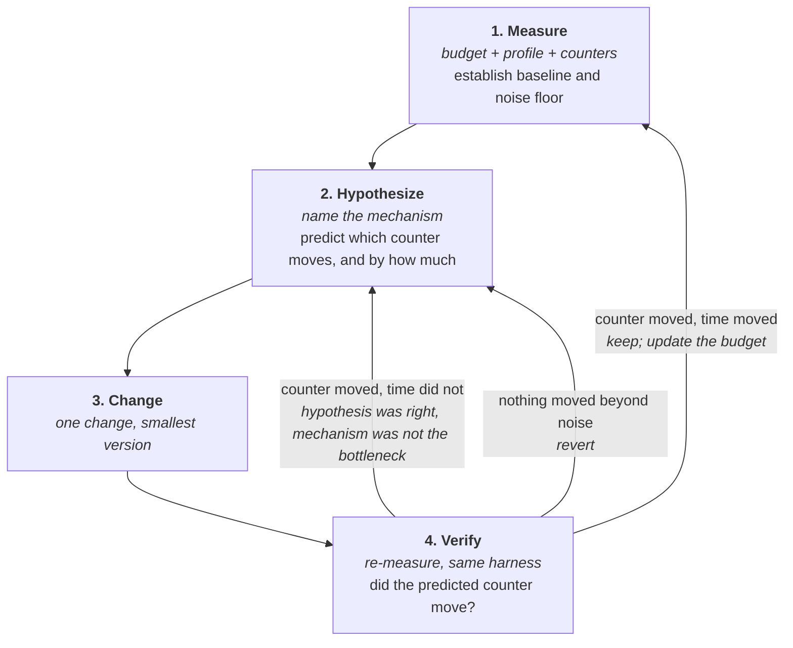
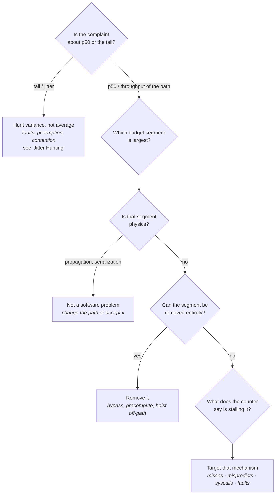
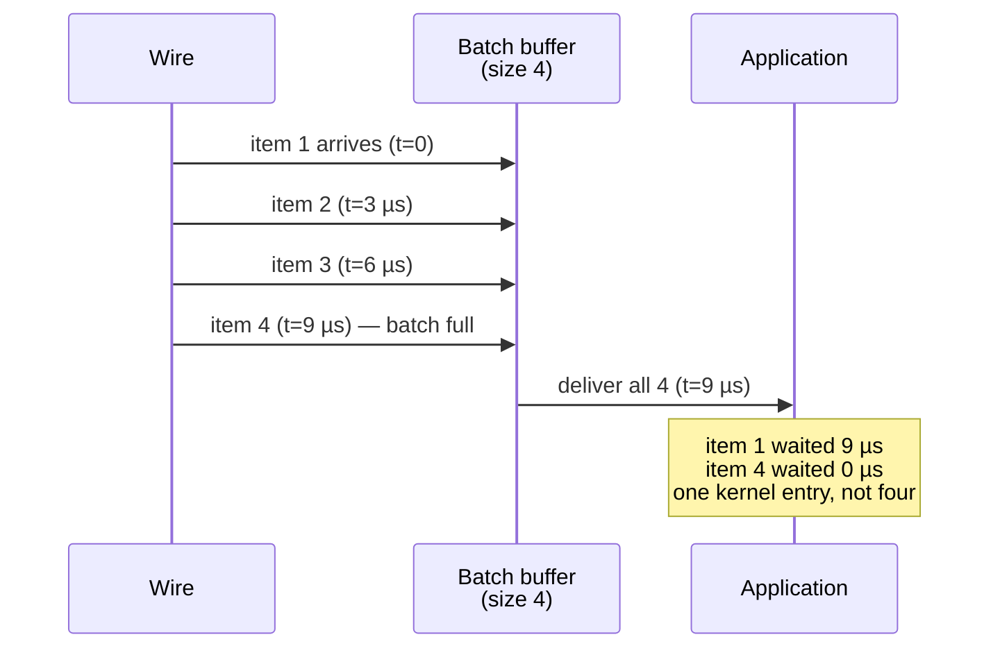
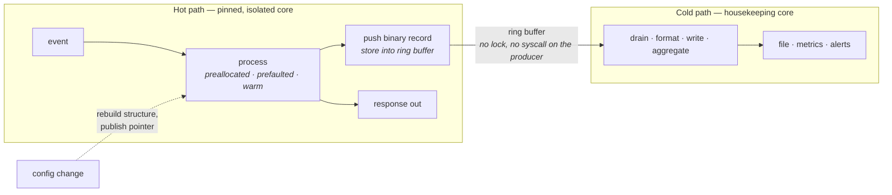

# Systematic Optimization

Everything up to this point has been mechanism: how a cache line is fetched, what a syscall costs,
why a page fault takes a thousand times longer than a cache hit, how to read a counter that proves
it. This chapter is about *method* — the discipline that turns all of that knowledge into a system
that is actually faster, rather than into a pile of changes that felt productive.

The gap between those two outcomes is wider than most engineers expect, and it is not a knowledge
gap. It is entirely possible to know every mechanism in Parts I through III and still spend three
weeks making a system slower. The characteristic failure is not ignorance; it is a broken feedback
loop. Someone reads that huge pages help, enables them, sees the benchmark improve by 3%, ships it,
and never learns that the benchmark's run-to-run spread was 5% and the change did nothing. Someone
else opens a profiler, sees that a parsing routine is the top entry at 22% of samples, spends a week
halving it, and gains 200 nanoseconds on a path where the kernel network stack costs 8 microseconds.
Both of them worked hard, used real tools, and produced nothing. Neither made a factual error about
how the hardware works.

What separates productive optimization from cargo-cult tuning is a specific, unglamorous habit:
before you change anything, you write down what you believe is slow, why you believe it, and what
number will move if you are right. That prediction is the whole discipline. It is what converts a
change from a guess into an experiment, and it is what lets you learn something when the change
fails — which it will, most of the time. This chapter builds that loop, shows how to choose what to
put inside it, catalogues the handful of transformations that account for most real wins on a hot
path, and then walks through the ways people reliably fool themselves.

## A Method: Measure, Hypothesize, Change, Verify

Start with the version of this loop that everyone already half-knows and that is missing a step.
"Profile, then optimize the hot spot" is the folk wisdom of performance work, and it is wrong in a
specific and expensive way. It contains a measurement and a change, and nothing in between. The step
it omits — forming an explicit, falsifiable hypothesis about *why* the hot spot is slow — is the
only step that produces knowledge.

Consider what happens without it. A profiler tells you that 30% of your cycles retire in a function
that walks a lookup structure. That is a fact about *where* time is spent, and it is compatible with
at least five different causes: the function is executing too many instructions; it is stalling on
cache misses; it is stalling on TLB misses; it is mispredicting a branch on every iteration; or it
is fine and simply gets called far too often. Each of those has a completely different remedy, and
four of the five remedies will do nothing if you pick the wrong one. If you skip straight to
"optimize it," what you actually do is apply whichever transformation you last read about — and if
it happens to help, you learn nothing generalizable, because you never established which mechanism
was responsible. That is the definition of cargo-cult tuning: applying a technique that worked
somewhere else, on the strength of the resemblance rather than the cause.

With a hypothesis, the same profile leads somewhere. You state: *"I believe this function stalls on
L3 misses because the structure is 40 MiB and access is effectively random. If I am right,
`perf stat` will show a cache-miss rate near one per element, and the last-level-cache miss count
will be within a factor of two of the element count."* Now you have a prediction that can be wrong.
You check it before writing any code. Half the time it *is* wrong — the miss count is a tenth of
what you predicted, the stalls are elsewhere — and you have saved yourself the rewrite. The other
half, you proceed knowing what you are fixing and what number should move.

The loop has four steps, and each has a specific exit condition that must be met before you advance.



The two distinct failure exits from the verify step are the valuable part of that diagram, because
they mean different things. If the counter you predicted moved but the wall-clock latency did not,
your model of the mechanism was correct and your model of the *budget* was wrong — you fixed
something real that did not matter. That sends you back to hypothesizing, but with new information:
this mechanism is not on the critical path. If nothing moved at all, either the change did not do
what you thought it did, or the effect is below your measurement noise. Those need different
follow-ups, and conflating them is how a change that does nothing ends up shipped as an improvement.

### What "measure" has to include

A single number is not a measurement. Before you can hypothesize about anything you need three
things, and skipping any one of them makes the rest of the loop unreliable.

- **A wire-to-wire or end-to-end baseline distribution**, not an average — p50, p99, p99.9, and max,
  with the sample count (see "Measuring Correctly"). The average is the number that will lie to you
  most consistently.
- **A latency budget**: the end-to-end time decomposed into named segments with costs, so you know
  what fraction any given target represents (see "What 'Low Latency' Actually Means").
- **A noise floor**: how much your benchmark's result varies when you change *nothing*. Without this
  you cannot tell an improvement from a coincidence, and this is the single most commonly skipped
  step in the entire discipline.

Establishing the noise floor takes two minutes and is non-negotiable. Run the unmodified binary
repeatedly under `perf stat`, which reports the standard deviation across runs directly:

```
perf stat -r 20 --  ./bench
```

The output ends with lines like `1.2043 +- 0.0181 seconds time elapsed ( +- 1.50% )`. That
percentage is your floor. Any subsequent "improvement" smaller than roughly twice that spread is not
an improvement you have evidence for. For comparing two whole binaries end-to-end, `hyperfine` does
the same job with better ergonomics and explicit warm-up handling:

```
hyperfine --warmup 10 --runs 50 './bench-baseline' './bench-modified'
```

`hyperfine` reports a ratio with a confidence interval and will tell you outright when the two are
statistically indistinguishable. Note its limitation: it measures whole-process wall time, so it is
right for comparing full runs and useless for the p99.9 of an in-process hot path, which needs the
histogram harness from "Measuring Correctly."

**Failure mode: an "improvement" that is entirely run-to-run variance.** The symptom is a change
that measures 2–4% better on one run and is never seen again in production. The cause is a noise
floor that was never established, compounded by the natural tendency to stop re-running once you get
the answer you wanted. Confirm by running the *unmodified* binary twenty times with
`perf stat -r 20` and observing the reported spread; if it is comparable to your gain, you have
measured nothing. On an untuned machine — frequency scaling active, no CPU pinning, address space
randomization on — a spread of 3–10% is entirely normal.

**Failure mode: run-to-run variance dominated by memory layout, not by code.** The symptom is that
two builds differ consistently by several percent even though the change is unreachable at runtime.
The cause is that link order, environment size, and address-space randomization shift code and data
alignment, which changes cache set conflicts and branch predictor aliasing. Confirm by re-measuring
with a deliberately different environment size (add a long dummy variable to the environment) and
seeing the difference move or reverse. This is why a single A/B comparison of two binaries is weak
evidence, and why a counter that explains the difference is worth more than the timing itself.

**Try it:** measure your own machine's noise floor twice, once untuned and once tuned. Run
`perf stat -r 20 -- ./bench` normally, then again with the process pinned and elevated:
`taskset -c 5 chrt -f 80 perf stat -r 20 -- ./bench`, after setting
`echo performance | sudo tee /sys/devices/system/cpu/cpu*/cpufreq/scaling_governor`. Compare the
reported `+- %` figures. The gap between them is how much of your "performance data" was previously
scheduler and frequency noise. Everything you measure from now on should be measured in the second
configuration.

### One change at a time, and the smallest version of it

The change step has exactly one rule that matters: change one thing. This sounds like advice from a
debugging tutorial, and it is, but the reason is sharper here. Optimizations interact
non-monotonically. Enabling huge pages and restructuring a data layout in the same commit can
produce a net 5% gain that is actually a 20% gain from one and a 15% regression from the other — and
you will ship the regression permanently, because the aggregate looked fine. Performance changes
almost always carry a complexity cost, so shipping one you cannot attribute means paying that cost
forever for nothing.

The corollary is to implement the *smallest* version of the change that tests the hypothesis, not
the production-quality version. If you believe a structure's layout is causing misses, you do not
need to refactor the whole system to find out — you can often test the hypothesis by padding the
structure, by shrinking it artificially with fields removed, or by running the benchmark over a
smaller data set that fits in cache. If the small, ugly, obviously-not-shippable experiment does not
move the number, the beautiful refactor will not either.

### Verification is re-measurement, not re-reasoning

The verify step fails most often not because people skip it but because they change the measurement
along with the code. The benchmark gets a new input file, the harness gets an extra warm-up phase,
the machine has been up for another two days. Verification means running the *same* harness, on the
*same* machine, in the *same* tuned configuration, against both the old and new binaries, ideally
interleaved rather than sequentially so that slow drift in machine state affects both equally.

And verification checks two things, in this order: did the predicted counter move, and did the
end-to-end latency distribution move. Checking the counter first is what makes the result
attributable. A latency improvement with no corresponding counter movement is suspicious — it means
you do not know why you got faster, which means you cannot predict when you will stop being faster.

| Verify outcome | Interpretation | Next action |
|---|---|---|
| Counter moved, p99.9 improved beyond noise | Hypothesis confirmed, target was on the critical path | Keep; update the latency budget and re-profile |
| Counter moved, latency unchanged | Mechanism real, but not the bottleneck | Revert if it added complexity; re-target using the budget |
| Counter unchanged, latency "improved" | Almost certainly noise or a measurement artifact | Re-run interleaved with more repetitions before believing it |
| Counter unchanged, latency unchanged | The change did not do what you thought | Verify the change is actually active before concluding anything |
| Counter moved, p50 improved, p99.9 worse | Traded tail for median — usually a batching or caching change | Reject unless the tail was explicitly not the goal |

That last row deserves emphasis, since it is the outcome people most often mislabel as a win. Many
optimizations improve the common case by adding a rarely-taken expensive path: a cache with a miss
handler, a fast path with a fallback, a buffer that occasionally has to grow. Each of those improves
p50 and adds a new contributor to p99.9. On a system where the tail is the specification, that is a
regression wearing a green benchmark.

**Failure mode: the change was never actually active.** The symptom is a modification that produces
literally identical counter values. The cause is usually a build that did not pick it up, a runtime
flag that gates it off, a `sysctl` that reverted at reboot, or a huge-page mapping that silently fell
back to 4 KiB pages. Confirm by looking for direct evidence the change is live rather than inferring
it from timing — for example `grep AnonHugePages /proc/<pid>/smaps` for huge pages, `strace -c` for
a claimed syscall removal, or `/proc/<pid>/status` for a scheduling change.

## Picking the Right Target: Where the Time Actually Goes

The most consequential decision in an optimization effort is made before any code is touched, and it
is a decision about arithmetic rather than about engineering. It is the choice of *which segment of
the budget to attack*, and getting it wrong bounds everything you do afterwards to irrelevance.

The principle is simple enough to state in one sentence and is violated constantly: **the time you
do not touch does not get faster.** If a segment accounts for a twentieth of the end-to-end latency,
then deleting it entirely — making it take literally zero time — improves the total by a twentieth.
Halving it improves the total by a fortieth. No amount of cleverness inside that segment changes
that ceiling, because the ceiling is set by everything outside it.

Work through it concretely, because the abstract version never lands. Take a wire-to-wire budget
typical of a commodity, kernel-based, lightly-tuned host handling a UDP datagram (see "What 'Low
Latency' Actually Means" for where these segment costs come from):

| Segment | Cost |
|---|---|
| NIC receive into host memory | ~1 µs |
| Kernel receive path (interrupt, softirq, protocol stack, copy to user) | ~5 µs |
| Application processing | ~0.5 µs |
| Kernel transmit path | ~4 µs |
| NIC transmit onto the wire | ~1 µs |
| **Total** | **~11.5 µs** |

Now suppose the profiler says 40% of application CPU time is in one parsing routine. That is a real,
true fact, and it is the top entry in the report. The routine costs about 200 ns. If you spend two
weeks and make it infinitely fast — zero nanoseconds — the end-to-end latency goes from 11.5 µs to
11.3 µs. Under 2%. Meanwhile the kernel receive and transmit paths together are 9 µs, and kernel
bypass replaces them with roughly 1–3 µs of poll-mode work (see "Kernel Bypass"), which is a factor
of three on the whole system. The profiler was not lying; it was answering a different question than
the one you needed answered.

This is the single most important thing this chapter has to say, so state it as a rule: **the
profiler tells you the distribution of time within what it can see; the budget tells you what
fraction of the total that is.** A profiler attached to your process cannot see the NIC, the PCIe
traversal, the interrupt, the softirq, the switch, or the fiber. Its top entry is the top entry of a
subset. Ranking your work by the profiler alone systematically over-invests in application code,
which is exactly the segment engineers are most comfortable with and which is frequently the
smallest.

### The decision procedure

Given a budget and a profile, the choice of target follows a short sequence of questions. Ask them in
order; the order is what keeps you out of the trap above.



Several branches of that tree are worth spelling out, because each corresponds to a class of mistake.

- **Tail versus median is the first fork, not an afterthought.** They have different root causes
  entirely: the median is set by the work your code does on a normal event, while the tail is set by
  events that *interrupt* it — page faults, preemption, cache-cold execution, lock contention,
  interrupt storms. Optimizing instruction count will move the median and leave p99.9 untouched.
- **Physics is not negotiable in software.** Fiber propagation is roughly 5 µs per kilometer, and
  serialization at 10 GbE is roughly 0.8 ns per byte. If those dominate, the answer is a shorter
  path, a different medium, or fewer bytes on the wire — not a faster loop.
- **Removal beats optimization whenever it is available.** Making a syscall cheaper is a small win;
  not making it is the whole win. Most large improvements in this discipline come from deleting a
  segment, not accelerating it.
- **The counter, not the intuition, names the mechanism.** "Stalling" is not a diagnosis. Cache
  misses, TLB walks, mispredicts, port contention, and store-buffer stalls all look identical in a
  time-based profile and are distinguished only by PMU counters and top-down analysis (see
  "Profiling Tools and Hardware Counters").

**Failure mode: optimizing the profiler's top entry without checking the budget.** The symptom is a
large, well-verified reduction in one function's cost that produces no measurable change in
wire-to-wire latency. The cause is that the function was a large fraction of a small segment.
Confirm before starting, not after: take the function's measured cost and divide it into the
end-to-end p50 from your wire-to-wire harness. If it is under a few percent, the maximum possible
payoff is under a few percent, and you should say so out loud before committing time to it.

**Failure mode: optimizing p50 while the complaint is p99.9.** The symptom is a benchmark that
improves 15% while the operational alert that triggered the work continues firing unchanged. The
cause is that the tail is produced by mechanisms absent from the median path. Confirm by plotting
the before/after histograms on the same axes rather than comparing summary numbers: the median will
have shifted left while the tail sits exactly where it was. The fix is a different investigation
entirely — see "Jitter Hunting."

**Failure mode: a segment that is invisible because nothing measures it.** The symptom is that the
budget's segments sum to noticeably less than the measured wire-to-wire time. The cause is an
unaccounted segment — time in the driver, time queued in the NIC, time in a switch, time between
the packet arriving and your thread being woken. Confirm by comparing hardware timestamps against
in-process timestamps: check NIC timestamping support with `ethtool -T <iface>`, then compare a
`tcpdump` capture's arrival time against the first timestamp your application takes. The gap is a
real segment you were not optimizing because you could not see it.

**Try it:** build the comparison that makes this concrete. Instrument your application to record its
own processing time per event into a preallocated array, and simultaneously capture the same traffic
with `tcpdump -j adapter_unsynced --time-stamp-precision=nano -i <iface> -w capture.pcap` (verify
adapter timestamping is supported with `ethtool -T <iface>` first). Compare the in-process p50
against the wire-to-wire p50. The ratio between them is the fraction of the problem your profiler
can see, and for an untuned kernel-based path it is routinely under 10%.

### Reading a profile without being misled by it

Once you have confirmed that the segment is worth attacking, the profile does become the right tool
— but only if you read it with two corrections in mind.

The first is that a sampling profiler attributes time to whatever instruction was executing when the
sample fired, and on an out-of-order machine that instruction is frequently not the one responsible
(see "Profiling Tools and Hardware Counters"). A load that misses to DRAM does not stall at the load;
it stalls at the first instruction that consumes the loaded value, possibly dozens of instructions
later. Precise event sampling (`perf record -e cycles:pp`) reduces this skid but does not eliminate
the attribution problem.

The second correction is that on-CPU profiles are blind to time spent not running. If your thread
blocks in the kernel, waits on a futex, or is descheduled, a CPU profile shows nothing at all for
that period — it simply has fewer samples. On a hot path, off-CPU time is frequently the whole
problem. Off-CPU analysis, scheduler tracepoints, and `perf sched` cover this ground, and a
first-pass check is cheap:

```
perf stat -e context-switches,cpu-migrations,page-faults,minor-faults,major-faults -- ./bench
```

A hot-path thread that is supposed to run pinned and uninterrupted should show a context-switch count
near zero for the measured interval and a major-fault count of exactly zero. Anything else is a
finding before you have looked at a single line of code.

## Eliminating Syscalls, Allocations, and Copies from the Hot Path

Three specific operations account for a disproportionate share of avoidable hot-path latency, and
they share a common property that makes them worth grouping: each one is cheap enough in the common
case to escape notice, and each has a slow path that is one to three orders of magnitude worse than
its fast path. That asymmetry is what makes them tail-latency generators rather than merely costs.

A system call is the clearest example. The transition itself is roughly 100 ns to 1 µs on a modern
x86 server, depending heavily on which speculative-execution mitigations are enabled (see "Kernel
Architecture and the Syscall Boundary"). That is already several cache misses' worth of time. But
the number that matters is not the transition cost — it is that entering the kernel exposes you to
everything the kernel might decide to do while you are there: take a lock, allocate, handle a pending
softirq, or preempt you. A syscall is not just expensive; it is an *unbounded* operation, and
unbounded operations are what produce tails.

Allocation has the same shape. A well-tuned allocator satisfies most requests from a thread-local
cache in tens of nanoseconds. But when that cache is empty it goes to a central arena, possibly takes
a lock, possibly calls `mmap` or `brk`, and the resulting pages are unmapped — so the first write to
each of them takes a minor page fault costing 1–3 µs (see "Memory Management"). Free has the mirror
problem: returning memory to the kernel triggers `munmap`, which triggers TLB shootdown
inter-processor interrupts on every core holding a stale translation, including cores running other
people's hot paths (see "Memory Systems"). The median allocation is fine. The distribution is not.

Copies are the third, and they are the most insidious because they rarely appear as a discrete
operation you could point to. A packet arriving on a kernel-based path is DMA'd into a driver buffer,
possibly copied into an `sk_buff`, and then copied again from the socket buffer into your
application's buffer when you call `recv` (see "The Linux Networking Stack"). Each copy costs
bandwidth, evicts useful lines from cache, and adds latency proportional to size. Application code
adds more of them: building a message in one buffer and then moving it into another before sending,
or maintaining two representations of the same data.

The remedy for all three is the same in structure, and it is the single most reliable transformation
in this book: **do the expensive thing before the event arrives, or do it after the event has left.**

```mermaid
flowchart TB
    subgraph before["Before — costs on the critical path"]
        B1["packet arrives"] --> B2["recv syscall<br/><i>kernel entry + copy</i>"]
        B2 --> B3["allocate message buffer<br/><i>may fault, may lock</i>"]
        B3 --> B4["copy into working buffer"]
        B4 --> B5["process"]
        B5 --> B6["log to file<br/><i>write syscall, may block</i>"]
        B6 --> B7["send syscall"]
    end
    subgraph after["After — critical path is loads, stores, and one send"]
        A1["packet arrives"] --> A2["read descriptor<br/><i>polled, no kernel entry</i>"]
        A2 --> A3["process in place<br/><i>preallocated, pre-faulted, locked</i>"]
        A3 --> A4["push log record to<br/>ring buffer <i>(store only)</i>"]
        A4 --> A5["send"]
    end
```



Every arrow removed in the second path corresponds to one of the three eliminations: the `recv`
syscall and its copy are gone (polled descriptor access, see "Kernel Bypass"), the allocation is gone
(buffers preallocated, pre-faulted, and `mlockall`'d at startup), and the logging syscall is gone
(replaced by a store into a shared ring buffer drained by a cold-path thread, see "Synchronization
and IPC").

### Finding the syscalls you did not know you were making

The hard part is not removing syscalls; it is discovering them. Very little hot-path code calls
`write` explicitly. What it does is call a logging function, a metrics function, a time function, or
a library routine that calls one of those. The syscall is three layers down and invisible in review.

Counting them takes one command:

```
strace -c -f ./bench
```

`strace -c` runs the program and prints a summary table: calls, time, errors, per syscall name. This
is the fastest way to discover that your "allocation-free" hot loop makes 40,000 `futex` calls, or
that something calls `clock_gettime` in a way that does not resolve through the vDSO, or that a
supposedly quiet path performs `openat` on a config file every iteration. To attach to something
already running:

```
strace -c -p <pid>
```

Two cautions. First, `strace` uses `ptrace` and stops the process on every syscall — overhead of 10×
to 100× is normal, so use it for *counts*, never for timings. Second, it cannot see calls that do not
enter the kernel, which is exactly what makes it useful for confirming the vDSO is working: if
`clock_gettime` appears in the `strace -c` table at all, it is *not* going through the vDSO and each
call costs a real kernel entry rather than ~20–30 ns (see "Kernel Architecture and the Syscall
Boundary").

For lower-overhead counting on a production-like run, `perf` reads syscall tracepoints instead of
stopping the process:

```
perf stat -e 'syscalls:sys_enter_*' -p <pid> -- sleep 10
perf trace -s -p <pid>
```

`perf trace -s` prints a per-syscall summary similar to `strace -c` at a fraction of the cost.

Library calls that never reach the kernel are a separate blind spot — an allocation served from the
allocator's thread cache makes no syscall and is invisible to both tools above. `ltrace -c` counts
dynamic library calls and will surface `malloc`/`free` traffic, though it carries the same `ptrace`
overhead and only works for dynamically linked symbols.

**Failure mode: a logging call that is cheap in testing and blocking in production.** The symptom is
occasional multi-millisecond outliers correlated with log volume or with disk activity from an
unrelated process. The cause is a `write` to a file that reached a full page cache, hit a filesystem
lock, or triggered writeback. Confirm with `strace -c -p <pid>` to establish that `write` is being
called from the hot thread at all, and with `perf stat -e context-switches` to see the thread being
descheduled. The fix is structural: the hot path stores a binary record into a preallocated ring
buffer and a separate thread formats and writes it (see "Observability Without Slowing Down").

**Failure mode: allocation that is invisible because it succeeds.** The symptom is a p99.9 that is
tens of microseconds worse than p99 with no corresponding CPU time. The cause is allocator slow-path
excursions — arena locks, `mmap` growth, and the minor faults on newly-mapped pages. Confirm with
`perf stat -e page-faults,minor-faults -p <pid>` over a steady-state interval; on a correctly
prepared hot path this should be flat at zero after warm-up. Any ongoing fault rate in steady state
means memory is still being mapped, which means allocation is still happening.

**Failure mode: `clock_gettime` costing a full syscall.** The symptom is a timestamping harness whose
overhead is hundreds of nanoseconds rather than tens, which then contaminates every measurement it
takes. The cause is a clock source that cannot be read from user space — typically because the
system clocksource is not TSC. Confirm by reading
`/sys/devices/system/clocksource/clocksource0/current_clocksource`; if it reports `hpet` or
`acpi_pm` rather than `tsc`, vDSO acceleration is unavailable and every clock read is a real kernel
entry (see "Clocks, Timers, and Time").

**Try it:** count the syscalls in a path you believe is clean. Run `strace -c -f` against your
benchmark and read the table top to bottom. Then run it again with the hot loop's iteration count
increased tenfold. Any syscall whose count scales with iterations is on the hot path; any that stays
constant is startup. This two-run diff is the fastest way to separate the two, and it routinely finds
something the author was certain was not there.

### Copies: counting them rather than guessing

Copies are harder to enumerate because there is no tracepoint for "memcpy." The practical approach is
to count them by reasoning about the data path and then confirm with bandwidth. For each message, ask
how many distinct buffers its bytes occupy between arriving at the NIC and leaving it, and multiply
by message rate to get the bandwidth those copies consume. If the resulting figure is a meaningful
fraction of what the memory subsystem can deliver (see "Memory Systems"), the copies are not
incidental.

The mechanisms for removing them are all covered elsewhere and are listed here as a checklist of what
is available:

| Copy | Where it happens | How it is removed |
|---|---|---|
| DMA buffer → `sk_buff` → socket buffer → user buffer | Kernel receive path | Kernel bypass: the application reads the DMA'd buffer directly (see "Kernel Bypass") |
| User buffer → socket buffer on send | `send`/`write` | `MSG_ZEROCOPY`, or bypass (see "Sockets Programming Model") |
| File → user buffer → socket | Serving file data | `sendfile`, `splice` (see "Sockets Programming Model") |
| Message assembled in buffer A, moved to buffer B | Application code | Build in place in the transmit buffer; scatter-gather I/O for headers |
| Struct copied to pass it around | Application code | Pass indices into a dense preallocated array (see "Memory Systems") |

The last row is worth dwelling on because it is the one that is nobody else's fault. A hot path that
copies a 200-byte record three times moves 600 bytes and, more importantly, touches ten cache lines
instead of four. The latency cost of the copy instructions is minor; the cost of the cache footprint
is not.

## Reducing Branches and Improving Predictability

A branch is not expensive. A *mispredicted* branch is expensive — roughly 15–20 cycles, about 5 ns on
a 3 GHz machine, because the pipeline must be flushed and refilled (see "CPU Microarchitecture
Essentials"). Modern predictors are extremely good, routinely above 99% accurate on ordinary code, so
the vast majority of branches in a program cost effectively nothing. This asymmetry has an immediate
methodological consequence that people get backwards constantly: **the goal is not fewer branches, it
is more predictable ones.**

The distinction matters because the standard "branchless" transformations — replacing a conditional
with arithmetic, a lookup table, or a conditional move — are not free. They convert a control
dependency into a data dependency, which means the work of both sides gets done, and the result
becomes part of the dependency chain rather than something the machine can speculate past. On a
branch that predicts at 99%, that trade is a straightforward loss: you have replaced a nearly-free
correct prediction with unconditional extra work. On a branch that predicts at 60% — genuinely
data-dependent, essentially random — it is a large win. There is a crossover, it depends on how much
work each side does, and you find it by measuring, not by reasoning.

There is a second reason predictability matters that has nothing to do with mispredict cost, and it
is the one that dominates on a latency-critical path. A branch that is *rarely* taken is a branch
whose target code is not in the instruction cache, whose data is not in the data cache, and whose
translations are not in the TLB. When the rare case finally fires — the error path, the resize, the
slow-path fallback — it costs vastly more than its instruction count suggests, because everything it
touches is cold. This is why "the fast path is fast and the rare case is a bit slower" is usually an
understatement by an order of magnitude, and it is a first-class contributor to p99.9.

The practical implications form a short list.

- **Measure the mispredict rate before restructuring anything.** `perf stat -e branches,branch-misses`
  gives the rate; a well-predicted hot loop is typically under 1%, and anything above a few percent
  is worth investigating.
- **Locate the specific branch, do not guess.** `perf record -e branch-misses:pp` samples on
  mispredicts with precise attribution, and `perf report` will point at the instruction.
- **Branchless helps only unpredictable branches.** A data-dependent test on random input is the
  candidate; a loop bound, a null check, or an error test is not.
- **Sorting the input can outperform removing the branch.** If a branch's outcome correlates with a
  key you can order by, sorting makes the predictor's job trivial and leaves the code simple. This is
  frequently a larger win than any branchless rewrite.
- **A lookup table trades a mispredict for a possible cache miss.** At ~5 ns for a mispredict and
  ~90 ns for a DRAM miss, that trade is only sound if the table stays resident in L1 or L2.
- **Indirect branches are a distinct and harder case.** A call through a function-pointer table has
  many possible targets, and the indirect predictor has to guess among them; when the target varies
  per event, the mispredict is close to guaranteed. Replacing per-event dispatch with a batched
  arrangement — group events by type, then run one homogeneous loop per type — makes the indirect
  target constant within each loop.

**Failure mode: a branchless rewrite that is slower than the branch it replaced.** The symptom is a
carefully-constructed arithmetic version that measures worse than the naive conditional. The cause is
that the original branch was already predicted correctly, so the rewrite added work and lengthened
the dependency chain without removing any flushes. Confirm by running
`perf stat -e branches,branch-misses` on the *original*: if the miss rate is under about 1%, there
was nothing to win, and the change should be reverted regardless of how elegant it is.

**Failure mode: the rare path is catastrophically slow, not merely slow.** The symptom is a p99.99
outlier of tens of microseconds attributable to a code path that executes a few hundred instructions.
The cause is cold instruction cache, cold data, cold TLB entries, and possibly a page fault on
first-touch of a path that has not run since startup. Confirm by forcing the rare path to execute
repeatedly in a benchmark and observing that it is an order of magnitude cheaper when warm than when
executed once after a long idle period. The remedy is either to keep the path warm deliberately or to
move it off the hot thread entirely (see "The Cache Hierarchy" for cache warming).

**Failure mode: a mispredict rate that jumps when an unrelated thread is co-resident.** The symptom
is branch-miss counts rising with no code change, correlated with load on a sibling hyperthread. The
cause is that branch predictor state is a shared microarchitectural resource between SMT siblings, so
a co-resident thread evicts your predictor entries. Confirm by re-running with the sibling logical
CPU offlined (`echo 0 | sudo tee /sys/devices/system/cpu/cpu<N>/online`) and comparing branch-miss
rates — this is one of the concrete arguments for disabling SMT on trading hosts (see "Multicore,
Coherence, and Memory Ordering").

**Try it:** find the crossover yourself, because the intuition it produces is worth more than the
rule. Write a loop that conditionally accumulates values from an array based on a threshold test.
Run it three ways: input sorted so the branch is almost perfectly predicted, input shuffled so the
branch is near-random, and a branchless version using arithmetic on both. Record wall time and
`perf stat -e branches,branch-misses` for all three. You will see the branchless version lose badly
against the sorted input and win clearly against the shuffled input, and the branch-miss counter will
explain both results exactly.

## Data Layout and Access Pattern Rewrites

"The Cache Hierarchy" and "Memory Systems" established the mechanisms: cache lines are 64 bytes, a
line you partially use is bandwidth you partially waste, TLB reach with 4 KiB pages is only a few
megabytes, a dependent chain of misses cannot overlap, and false sharing turns an innocuous layout
into cross-core traffic. What those chapters did not cover is the *method* — how to decide a layout
rewrite is worth doing, and how to know afterwards whether it did what you think.

Layout rewrites are the most expensive class of change in this chapter. They touch every piece of
code that reads the data, they are hard to revert, and they frequently make the code less readable in
ways that persist for years. That cost profile makes them exactly the wrong place to work on a hunch,
and exactly the right place to insist on a hypothesis with a predicted counter.

The hypothesis for a layout change always takes one of four forms, and identifying which one you are
claiming determines which counter verifies it.

| Claim | Mechanism | Counter that confirms it |
|---|---|---|
| "We fetch lines and use a fraction of each" | Poor line utilization from record-at-a-time layout on a field scan | `cache-misses` × 64 bytes versus bytes actually consumed |
| "We miss the TLB, not the cache" | Working set exceeds TLB reach | `dTLB-load-misses`, `dtlb_load_misses.walk_active` as a fraction of `cycles` |
| "Our misses cannot overlap" | Pointer chasing — dependent address chain | Miss count roughly unchanged while time is several times worse than an independent-access equivalent |
| "Cores are fighting over a line" | False sharing on a shared, frequently-written structure | `perf c2c record` / `perf c2c report`, which identifies the contended line and the offsets involved |

The fourth row is worth calling out because `perf c2c` is the one tool that directly answers a
question that is otherwise nearly impossible to answer: which cache line is being bounced between
which cores, and which fields within it are responsible. Without it, false sharing is found by
guesswork.

The correction that distinguishes a methodical layout rewrite from a hopeful one is this: **a layout
change that reduces miss counts but not latency means memory was not the bottleneck.** That outcome
is common and it is informative. It usually means the loop was limited by something else — a
dependency chain, a divide, an execution port, or the fact that the whole loop is 3% of the budget.
The counter moved, so your model of the mechanism was correct; the latency did not, so your model of
the budget was wrong. Revert the change and re-target.

The transformations themselves are the ones already taught, applied through the loop:

- **Hot/cold field splitting.** Move rarely-read fields out of the record into a parallel array, so
  more of the hot fields fit per line. Predicted effect: fewer misses on the scan, no change to the
  rare accesses. Verify with `cache-misses` and with the record size itself.
- **Struct-of-arrays for field scans.** Only when the access pattern is genuinely a scan of one or
  two fields across many records; record-at-a-time access gets worse, not better (see "Memory
  Systems").
- **Indices instead of pointers.** Smaller, keeps data dense, and converts pointer chasing into
  arithmetic the prefetcher can follow. Predicted effect: unchanged miss count but substantially
  lower time, because the misses now overlap.
- **Blocking a traversal.** Restructure a large cache-hostile pass into chunks that stay resident in
  cache and TLB. Predicted effect: large drop in both `cache-misses` and `dTLB-load-misses`.
- **Padding to eliminate false sharing.** Separate independently-written fields onto distinct lines.
  Predicted effect: no change in miss count on a single core, large improvement under concurrency —
  which means it must be measured with the concurrent workload running, or it will appear to do
  nothing.

**Failure mode: a layout rewrite verified on a single thread that does nothing in production.** The
symptom is a benchmark improvement that vanishes when the real system runs. The cause is that the
benchmark did not reproduce the concurrency, so neither false sharing nor coherence traffic was
present in the measurement. Confirm by running the benchmark with the other threads actually
running and pinned as they are in production, and by checking `perf c2c report` for contended lines.

**Failure mode: huge pages enabled but not actually used.** The symptom is a TLB-motivated change
with no movement in `dtlb_load_misses.walk_active`. The cause is that transparent huge pages were
requested for a region that could not be backed by them — wrong alignment, insufficient size, or
fragmented physical memory. Confirm by reading `AnonHugePages` in `/proc/<pid>/smaps` for the mapping
in question; if it is 0 kB, the mapping is on 4 KiB pages regardless of what the settings say (see
"Memory Systems").

**Try it:** practise the counter-first discipline on a layout change you are considering. Before
writing any code, predict the numbers: how many bytes per record you consume versus fetch, and
therefore how many `cache-misses` you expect per thousand records before and after. Then implement
the smallest ugly version, run `perf stat -e cache-misses,cache-references,dTLB-load-misses`, and
compare against your prediction. When the measurement diverges from the prediction, that divergence
is the finding — chase it before you chase the wall clock.

## Batching Versus Latency, and When Batching Hurts

Batching is the most effective throughput technique in systems engineering and one of the most
reliable ways to destroy latency, and it is worth understanding precisely why both statements are
true at once.

The mechanism is amortization of fixed cost. If handling an event carries a fixed overhead — a kernel
entry, an interrupt, a lock acquisition, a cache-cold function prologue — and the per-item work is
small relative to that overhead, then processing sixteen items per fixed cost gives you close to
sixteen times the throughput. This is why `recvmmsg` exists, why NICs coalesce interrupts, why
`io_uring` lets you submit many operations per ring doorbell, why generic receive offload merges
segments, and why Nagle's algorithm accumulates small writes (see "The Linux Networking Stack",
"I/O Subsystems", and "TCP In Depth").

The cost is equally mechanical: **an item cannot be processed until the batch it is in is complete.**
The first item to arrive waits for all the others. If the batch is filled by a timer, the first item
waits for the timer. If the batch is filled by arrivals, the first item waits for arrivals that may
be arbitrarily far apart. The latency of an individual event is now a function of *other events'*
arrival times, which is exactly the property a deterministic system is trying to eliminate.



The diagram makes the asymmetry visible: the *last* item in a batch sees the batching as pure
benefit, while the first item pays the full accumulation window. Since tail latency is what a
low-latency system is specified on, and the tail is populated by the unluckiest items, batching moves
the number you care about in the wrong direction even while improving both the average throughput and
often the average latency.

There is one important case where batching *improves* latency rather than trading against it, and
recognizing it is what keeps this from being a blanket prohibition. When the system is already
overloaded — arrivals faster than the per-item service rate — queues are growing and every item is
already waiting. In that regime, amortizing fixed cost raises the service rate, drains the queue, and
reduces the waiting time for everyone. This produces self-clocking behavior: batch only what has
already accumulated, never wait to fill a batch. Under light load the batch size is one and latency is
minimal; under heavy load the batch size grows naturally and throughput rises to meet demand. That is
the design pattern to reach for, and it is the operating principle behind NAPI polling in the Linux
receive path.

| Batching form | Where it lives | Latency cost | The knob |
|---|---|---|---|
| Interrupt coalescing | NIC | Up to the coalescing timer per packet | `ethtool -C <iface> rx-usecs 0 rx-frames 1` |
| Generic receive offload | Kernel receive path | Waits to merge adjacent segments | `ethtool -K <iface> gro off` |
| Nagle's algorithm | TCP transmit | Up to one RTT, pathological with delayed ACK | `TCP_NODELAY` socket option |
| Segmentation offload | Kernel transmit | Small; mostly a throughput win | `ethtool -K <iface> tso off gso off` |
| Multi-message syscalls | Application | Waiting to fill the array | Use with a non-blocking, drain-what's-there loop |
| Submission queue batching | `io_uring` | Time between submissions | Submit immediately; batch only under load |
| Log/metric flushing | Application cold path | None, if it is genuinely off the hot path | Ring buffer drained by a separate thread |

The general rule for a latency-critical host is to disable every batching mechanism whose window is
time-based, and keep the ones whose window is opportunistic. A timer-based batch imposes a fixed
waiting cost regardless of load; an opportunistic batch imposes none when load is low. That single
distinction resolves most of the table above.

**Failure mode: p99 dominated by an interrupt coalescing setting nobody chose.** The symptom is a
latency histogram with a suspicious ceiling — a cluster of samples near some round number of
microseconds, with almost nothing above it. The cause is a coalescing timer: packets wait up to
`rx-usecs` before the NIC raises an interrupt, so the distribution acquires a hard shoulder at that
value. Confirm by reading `ethtool -c <iface>` and comparing `rx-usecs` against where the shoulder
sits in your histogram. Defaults are often 50 µs or adaptive, which is tuned for throughput and CPU
efficiency, not latency (see "Buses, Devices, and I/O Hardware").

**Failure mode: small writes delayed by up to a full round trip.** The symptom is a bimodal latency
distribution on a TCP path, with a second mode at roughly one RTT or at 40 ms. The cause is Nagle's
algorithm interacting with delayed ACK: the sender withholds a small segment waiting for an
outstanding ACK, and the receiver withholds the ACK waiting for data to piggyback on (see "TCP In
Depth"). Confirm with `tcpdump` — you will see the send timestamp lag the application's write, with
the delay ending exactly when an ACK arrives. The fix is `TCP_NODELAY`, and it should be set on every
socket on a latency path without exception.

**Failure mode: disabling batching makes the system slower under load.** The symptom is that
`rx-usecs 0` improves p50 and p99 at low rates and causes packet loss and worse tails during bursts.
The cause is that one interrupt per packet consumes so much CPU that the receive path cannot keep up,
so packets queue and drop. Confirm by checking receive drop and overrun counters with
`ethtool -S <iface>` and `ip -s link show <iface>` during the burst. This is the honest trade-off:
turning batching off is right up to the packet rate at which per-event overhead saturates a core, and
past that point you need bypass or more cores, not a coalescing timer.

**Try it:** make the coalescing shoulder appear and disappear. Record a latency histogram of a UDP
echo path, then set `sudo ethtool -C <iface> rx-usecs 50 rx-frames 32` and record again, then
`sudo ethtool -C <iface> adaptive-rx off rx-usecs 0 rx-frames 1` and record a third. (Read the
originals with `ethtool -c <iface>` first so you can restore them; not every driver accepts every
field.) Overlay the three histograms. The middle one will show a distinct shoulder near 50 µs that
the third does not — the batching window made visible in the distribution.

## Precomputation and Hot-Path/Cold-Path Separation

The most powerful idea in this chapter is also the simplest: work done before the event is free, and
work done after the event has left is nearly free. The entire optimization effort can be reframed as
moving work out of the window between "the packet arrived" and "the response left."

This reframing changes what counts as a solution. Faced with a slow lookup, the instinct is to make
the lookup faster. The better question is whether the lookup's result could have been computed at
startup, or when a configuration changed, or on a different thread — because a lookup that does not
happen is faster than any lookup that does. Most of the largest wins in latency engineering are
instances of this move, not of local optimization:

- Buffers are allocated, touched, and locked at startup, so the hot path never allocates and never
  faults (see "Memory Management").
- Connections are established, sockets configured, and routes resolved before the first event, so the
  hot path never does a name lookup or a handshake.
- Message templates are pre-formatted with fixed fields already in place, so the transmit path fills
  in a few fields rather than serializing a whole structure.
- Lookup structures are built once and made read-only, so the hot path never rehashes, resizes, or
  takes a writer lock.
- The hot path's code and data are executed once before the event stream starts, so caches, TLB, and
  branch predictors are warm (see "The Cache Hierarchy").

The mirror-image move is to push work *after* the response. Logging, metrics, statistics, audit
records, and monitoring are all things the hot path must *record* but need not *perform*. The
standard structure is a single-producer single-consumer ring buffer: the hot path writes a compact
binary record with a plain store and moves on, and a separate thread on a separate core reads,
formats, and writes it (see "Synchronization and IPC" and "Observability Without Slowing Down").



The boundary in that diagram is not just a code organization choice — it is a *resource* boundary,
and the failure modes cluster at exactly that seam.

The first is CPU: the cold-path thread must be on a different core, and specifically not on the
sibling hyperthread of the hot core, since siblings share execution ports, L1, and predictor state
(see "Multicore, Coherence, and Memory Ordering"). The second is cache: a cold-path thread that
streams through memory formatting log lines will evict the hot path's data from a shared L3 and push
the socket up the memory bandwidth curve. The third is the shared line: the ring buffer's producer
index and consumer index must live on different cache lines, or every push by the hot path contends
with every pop by the cold path. The fourth is the ring itself: it must be sized so it never fills
under burst, because a full ring forces the hot path to either block or drop, and blocking on a
logging buffer is precisely the outcome the whole design was meant to prevent.

Precomputation has its own boundary condition, and it is the one people miss. **A precomputed table
is only a win if it stays resident.** Replacing a computation with a lookup into a 64 MiB table
converts a few nanoseconds of arithmetic into a DRAM miss plus a probable TLB miss — 100 to 200 ns,
and worse under memory pressure. The trade is sound when the table fits comfortably in L1 or L2 and
unsound when it does not, with a large ambiguous region in between that depends on what else is
competing for the cache. Measure it; do not assume that avoiding work is automatically faster than
doing it.

**Failure mode: the cold path steals the hot path's cache.** The symptom is that hot-path latency
degrades when logging volume rises, even though the hot path performs only a store per event. The
cause is L3 and memory bandwidth contention from the drain thread, not the store itself. Confirm by
running the hot path with the drain thread disabled and comparing `perf stat -e cache-misses,LLC-load-misses`
on the hot thread specifically. Remedies are moving the drain thread to another NUMA node or another
socket, throttling it, or restricting its L3 share where cache partitioning is available.

**Failure mode: the ring buffer indices share a cache line.** The symptom is that a supposedly
lock-free, syscall-free push costs 100–300 ns instead of a few nanoseconds. The cause is false
sharing between the producer and consumer indices, so each push requires acquiring the line
exclusively from the other core. Confirm with `perf c2c record` / `perf c2c report`, which names the
line and the offsets contending on it (see "Synchronization and IPC").

**Failure mode: precomputation that moved the cost rather than removing it.** The symptom is a lookup
table replacing arithmetic with no improvement, or a regression. The cause is that the table does not
fit in cache, so each lookup is a miss. Confirm by shrinking the table artificially — even if the
smaller version computes the wrong answer — and re-measuring; if the small wrong version is fast and
the correct one is slow, the problem is residency and not logic.

**Try it:** verify the hot path is genuinely quiet in steady state. Run the system under load and
sample your hot thread specifically:
`perf stat -e context-switches,cpu-migrations,page-faults,minor-faults,major-faults -t <tid> -- sleep 30`.
Every one of those counters should be zero or very near it after warm-up. A nonzero minor-fault count
means allocation is still happening; a nonzero context-switch count means the thread is being
descheduled or making blocking calls; any major fault at all is a defect. This one command is the
single best five-second audit of whether the hot/cold separation is real or aspirational.

**Try it:** verify the pinning is what you think it is. Read `/proc/<pid>/task/<tid>/status` and check
the `Cpus_allowed_list` field, then confirm the thread's actual current CPU with
`ps -L -o tid,psr,comm -p <pid>`. It is extremely common to find that a thread believed to be pinned
to an isolated core is running on a housekeeping core because the affinity call happened before a
library spawned the thread, or because a container's cgroup CPU set overrode it (see "Processes,
Threads, and Scheduling").

## Avoiding the Classic Anti-Patterns

Everything above is the positive form of the method. The negative form — the specific ways
competent engineers reliably waste effort — is worth stating explicitly, because recognizing the
shape of a mistake is faster than deriving the right answer from first principles each time.

These are not exotic. Every one of them is a reasonable-sounding step that omits exactly one part of
the loop from the first section. They are grouped here by which part they omit.

### Omitting the measurement

**Micro-optimizing before measuring** is the archetype. It feels productive because the changes are
small and immediately reviewable, and it is nearly always wasted, because without a budget you have
no basis for believing the code you are looking at matters. The rule: no change to the hot path
without a baseline distribution and a budget entry that justifies the target. The cost of measuring
first is an hour; the cost of not measuring first is measured in weeks.

**Optimizing something you cannot measure** is the sibling case. If you cannot construct a
measurement that would show the change working, you cannot know it worked, and you should not make
it. This applies with particular force to changes justified by reasoning about the hardware — "this
should reduce port pressure," "this should let the prefetcher engage." Those hypotheses are fine, but
they are hypotheses, and a hypothesis you cannot test is a belief.

### Omitting the hypothesis

**Applying a technique because it worked elsewhere.** Huge pages, kernel bypass, lock-free queues,
SoA layouts, and busy-polling are all real techniques with real preconditions. Applying one without
establishing that its precondition holds is cargo-cult tuning even when the technique is sound.
Huge pages help when TLB reach is exceeded and do nothing when it is not; lock-free queues help under
contention and cost more than a mutex when uncontended (see "Synchronization and IPC"); busy-polling
helps when the alternative is a wakeup and burns a core when it is not.

**Copying a tuning checklist without understanding the knobs.** Every one of these settings changes a
mechanism, and several of them trade something away. `isolcpus` removes cores from the scheduler and
therefore from everything else that needs them; `PREEMPT_RT` improves worst-case preemption latency
and costs throughput and average-case syscall time; disabling speculative-execution mitigations
changes your security posture measurably (see "Tuning a Linux Box for Determinism"). A knob you
cannot explain is a knob you cannot debug.

**Chasing the top profiler entry without checking the budget.** Covered above, and restated here
because it is the most common single error in this discipline. The profiler's ranking is conditional
on the profiler's scope.

### Omitting a controlled change

**Changing several things at once.** Aggregate improvement hides component regressions, and you will
carry the regression forever because you never attributed it.

**Adding complexity for an unmeasurable gain.** Every optimization has an ongoing cost: it is harder
to read, harder to modify, and more likely to hide a bug. A change that buys 2% on a segment that is
5% of the budget has bought 0.1% and will cost review time for years. The honest question at the end
of every loop iteration is not "did this help?" but "did this help *enough to be worth carrying*?"
This is where a substantial fraction of low-latency codebases go wrong: not in any single decision,
but in the accumulated weight of dozens of unattributable micro-optimizations that nobody dares
remove because nobody knows which ones matter.

### Omitting honest verification

**Measuring on a machine unlike production.** This is the anti-pattern with the widest blast radius,
because it invalidates every result rather than one. A laptop with aggressive frequency scaling,
thermal throttling, a shared cache, an unpinned scheduler, transparent huge pages on `always`, and
a different NIC will rank optimizations differently from a colocated server. The differences that
matter most:

| Difference | Effect on your results |
|---|---|
| Frequency scaling / turbo active | Multi-percent run-to-run swings; short benchmarks run at a different frequency than long ones |
| No CPU pinning | Migrations discard cache and TLB state mid-measurement |
| Deep C-states enabled | Wake-from-idle latency of tens of µs contaminates the tail on an idle benchmark |
| Different core count / SMT topology | Contention behavior differs entirely, so concurrency results do not transfer |
| Different NUMA topology | A layout that is local on one machine is remote on another |
| Different NIC or driver | Coalescing defaults, offloads, and descriptor behavior differ |
| Transparent huge pages set differently | Layout results shift, and compaction stalls appear or vanish |
| Different kernel version | Scheduler, allocator, and network-stack behavior all change across releases |

The minimum viable discipline is: pin the benchmark (`taskset -c <n>`), fix the frequency governor to
`performance`, run at a real-time priority if the production process does (`chrt -f 80`), and record
the machine's configuration alongside every result — kernel version from `uname -r`, governor,
`/sys/kernel/mm/transparent_hugepage/enabled`, `/sys/devices/system/cpu/vulnerabilities/`, and the
relevant `ethtool -c`/`-k` output. A result without its configuration is not reproducible and
therefore is not a result.

**Accepting an improvement within the noise.** Discussed at length in the first section, and the most
frequent single cause of shipped changes that do nothing. The check is mechanical: compare the claimed
gain against the `+- %` that `perf stat -r` reports for the unmodified binary.

**Declaring victory on the median.** If the operational complaint is the tail, the median improving is
not evidence. Plot the histograms; do not compare summary lines.

**Never re-profiling after a win.** The moment a change lands, the budget has changed and the ranking
of targets may have inverted. The loop closes back to *measure* for exactly this reason. A team that
optimizes a ranked list produced once, months ago, is optimizing a system that no longer exists.

**Failure mode: the benchmark result that will not reproduce next week.** The symptom is a documented
improvement that cannot be re-demonstrated on the same machine. The cause is usually an unrecorded
environmental variable — governor reset at boot, a `sysctl` not persisted, THP settings changed by a
configuration management run, a different kernel after an update. Confirm by diffing the current
machine state against what you recorded; if you recorded nothing, this failure is unfixable, which is
the argument for recording it.

**Try it:** quantify how much your untuned environment distorts rankings. Take two variants of a
benchmark whose relative performance you have already established on a properly tuned, pinned,
fixed-frequency configuration. Now run the same comparison unpinned, with the governor set to
`powersave`, and with a `stress-ng`-style load on other cores. Run each comparison ten times and
count how often the ranking inverts. On a laptop this can invert a genuine 10% difference a
meaningful fraction of the time — which is the whole argument for the tuned harness in one
experiment.

## Numbers to Know

This chapter is about method rather than mechanism, so most of its numbers are borrowed from earlier
chapters. These are the ones you will use while running the loop.

| Quantity | Value | Why it matters here |
|---|---|---|
| Branch mispredict | ~5 ns (~15–20 cycles) | The ceiling on what a branchless rewrite can recover per branch |
| L1 hit vs. DRAM miss | ~1 ns vs. ~90 ns | The trade you make when a lookup table stops fitting in cache |
| Trivial syscall | ~100 ns – 1 µs | Mitigation-dependent; the floor cost of any kernel entry you fail to remove |
| `clock_gettime` via vDSO | ~20–30 ns | Your measurement floor; times below this need amortization |
| Minor page fault | ~1–3 µs | Why a nonzero steady-state fault count is a finding, not noise |
| Context switch | ~1–5 µs | Plus cache and TLB pollution the next thread pays for |
| Untuned benchmark noise floor | ~3–10% run-to-run | Frequency scaling, migrations, layout; the bar any claimed gain must clear |
| Tuned benchmark noise floor | well under 1% typically | Pinned, fixed frequency, isolated core |
| `strace` overhead | ~10–100× | Fine for counting syscalls, useless for timing them |
| Default NIC RX coalescing | often ~50 µs or adaptive | Frequently the entire explanation for a p99 shoulder |
| Kernel RX + TX path | ~5–10 µs combined | The segment that usually dominates an untuned budget |

*Order-of-magnitude figures for modern x86 servers, Skylake-and-later class. Measure your own machine
before quoting any of them.*

## Key Takeaways

- The loop is measure → hypothesize → change → verify; skipping the hypothesis produces cargo-cult
  tuning and teaches you nothing when a change fails.
- A hypothesis must name a mechanism and predict which counter moves, so that the result is
  attributable rather than merely favorable.
- Establish the noise floor with `perf stat -r` or `hyperfine` before believing any improvement;
  untuned machines routinely vary by 3–10% with no change at all.
- The profiler ranks time within its scope; only the latency budget tells you what fraction of the
  total that scope is, and a segment you do not touch does not get faster.
- Removal beats optimization: eliminating a syscall, an allocation, or a copy wins more than making
  any of them cheaper.
- Discover hidden syscalls with `strace -c` or `perf trace -s`, and confirm a clean hot path with a
  steady-state fault and context-switch count of zero.
- The goal with branches is predictability, not fewer of them; branchless rewrites lose against
  well-predicted branches and win only when `branch-misses` says the branch is genuinely random.
- Layout rewrites are expensive and hard to revert, so they demand a predicted counter — and a change
  that moves misses but not latency means memory was never the bottleneck.
- Batching amortizes fixed cost by making the first item in each batch wait; prefer opportunistic
  batching that shrinks to one under light load over any timer-based window.
- Move work before the event (preallocate, pre-fault, pre-format, warm) or after it (ring buffer
  drained by a cold-path thread), and treat the hot/cold boundary as a CPU, cache, and cache-line
  boundary as well as a code one.
- A precomputed table only wins while it stays cache-resident; a lookup that misses to DRAM costs
  more than the arithmetic it replaced.
- Measure on a machine configured like production — pinned, fixed frequency, same topology, same NIC
  settings — and record the configuration with the result, or the result is not reproducible.
- Reject changes that improve p50 while worsening p99.9, and re-profile after every win, because the
  budget you ranked targets against has changed.
