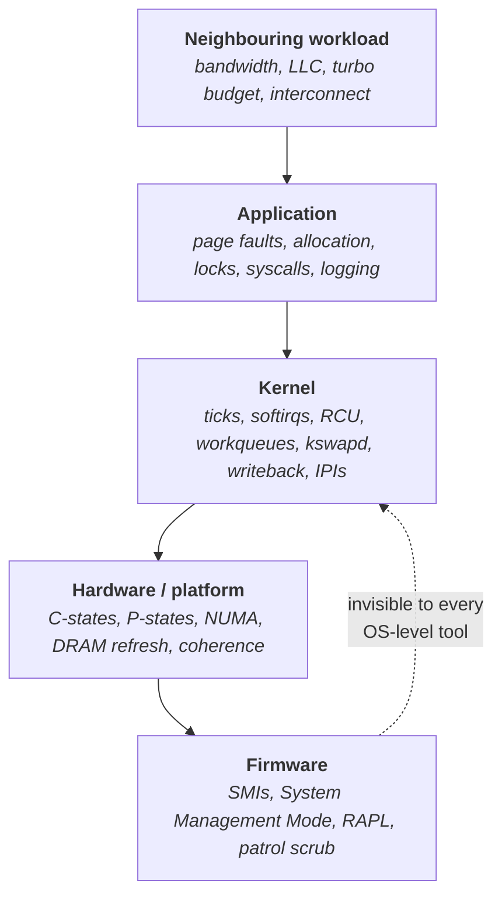
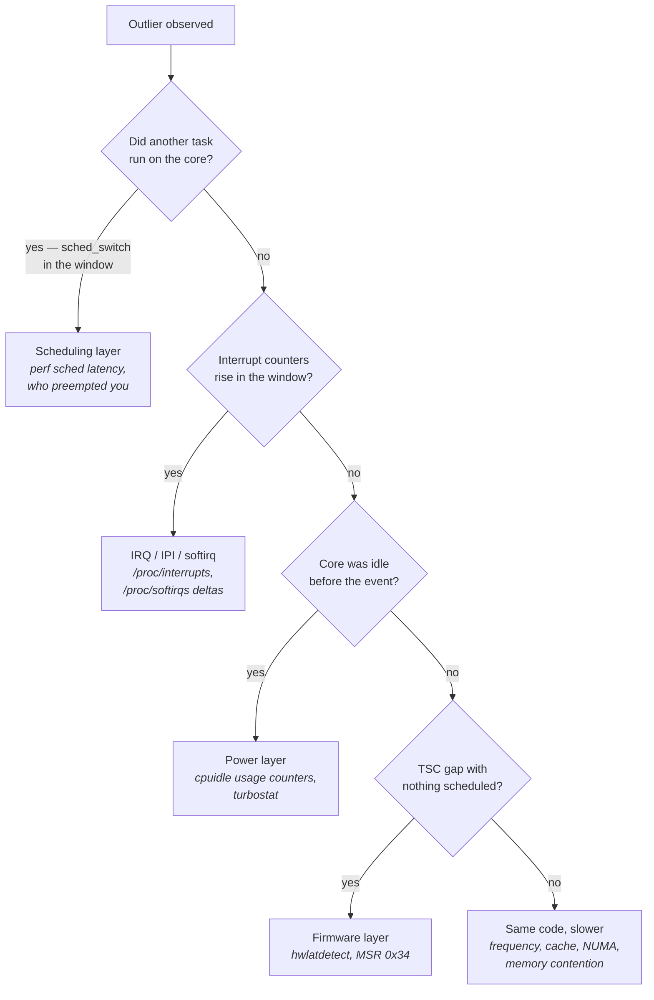
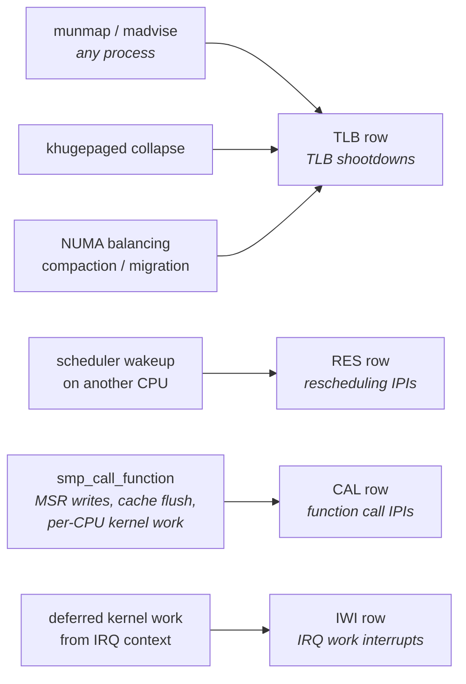
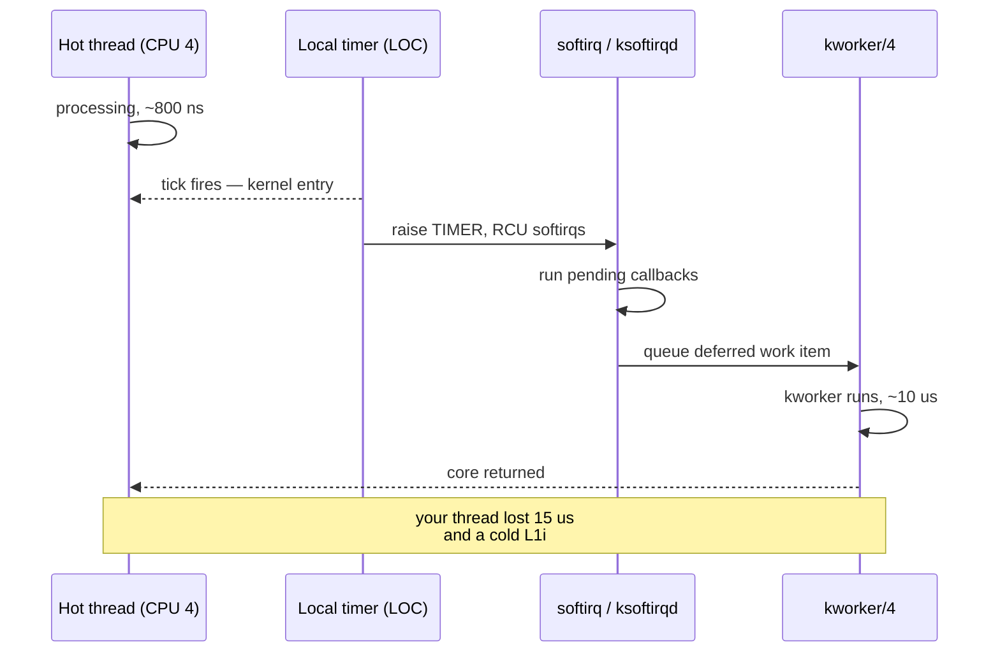
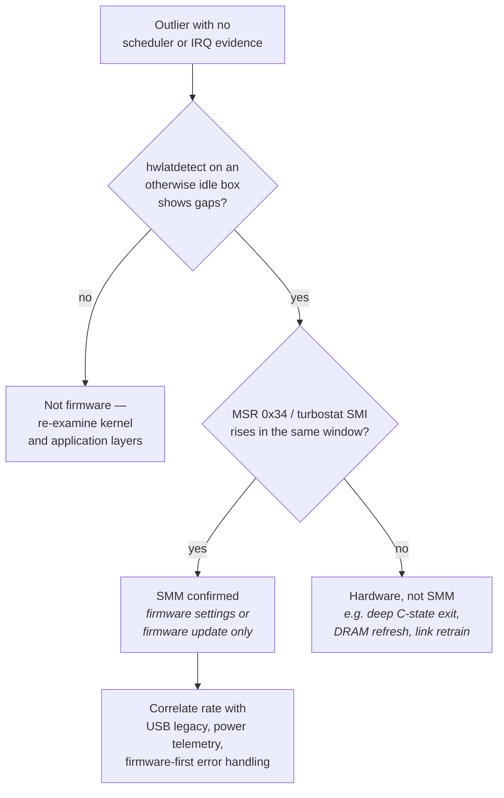
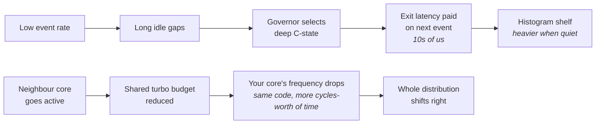

# Jitter Hunting

Every earlier chapter in this book ended with the same shape of advice: here is a mechanism, here is
what it costs, here is how to configure it so it costs less. That is the *construction* half of the
job. This chapter is the other half. You have a running system, a latency histogram, and a
population of outliers — a few hundred events out of ten million that took forty microseconds when
the body of the distribution sits at eight hundred nanoseconds. Nothing in your code explains them.
Your profiler, which samples where CPU time goes, shows a perfectly ordinary profile, because the
outliers are not places where your code ran slowly; they are places where your code *did not run at
all*. Something took the core away and gave it back, and the whole problem is finding out what.

The reason this is hard, and the reason it deserves a chapter of its own, is that the search space
spans five layers of the machine and most of them are invisible to the tool you would naturally
reach for first. An outlier can originate in your own address space (a page fault), in another
process's address space (a TLB shootdown that interrupts you), in the kernel's own maintenance work
(an RCU callback, a workqueue item, a `vmstat` update), in the power-management hardware (a C-state
exit, a frequency transition), or in firmware running in a processor mode that the operating system
cannot observe, cannot preempt, and cannot even be told about. A `perf record` profile will attribute
some of these correctly, some of them to the wrong thing, and some of them to nothing at all. If your
method is "profile it and look," you will find the easy ones and spend weeks failing to find the
hard ones.

So the deliverable here is not a list of facts — most of the individual mechanisms have already been
taught in "Memory Systems," "Clocks, Timers, and Time," "Processes, Threads, and Scheduling," and
"Tuning a Linux Box for Determinism." The deliverable is a **method**: a layered taxonomy that
functions as a search tree, a mapping from each layer to the specific counter or tracer that
confirms or eliminates it, and — most importantly — the discipline of *eliminating* rather than
*suspecting*. A jitter hunt that ends with "we think it was probably NUMA" has failed. A jitter hunt
ends when you can produce a counter that moves in lockstep with the outliers and a change that makes
both go away.

## A Checklist of Jitter Sources

Start from the observation that makes the whole hunt tractable: **an outlier is a period during which
your thread made no progress, and something on the machine must have a record of why.** The core
either executed someone else's instructions, or executed nothing, or executed yours more slowly than
usual. Those three cases have different signatures and different evidence, and separating them on the
first pass eliminates most of the search space in one step.

The naive approach — attach a profiler and look at the slow samples — fails for a specific and
instructive reason. A sampling profiler like `perf record` interrupts the CPU periodically and
records where the instruction pointer is. If your thread is descheduled for forty microseconds, the
samples taken during that window land in whatever *else* was running, which is usually a kernel
thread doing something that looks harmless. If the core is in a deep idle state, or frozen in System
Management Mode, no samples are taken at all — the sampling interrupt itself is deferred — so the
window simply vanishes from the profile. Sampling tells you where CPU time goes; jitter is about
where CPU time *does not* go, which is why off-CPU analysis and tracing, not sampling, are the
primary tools here (see "Profiling Tools and Hardware Counters").

The organizing principle that works is layering. Jitter sources stack from the firmware upward, and
each layer is invisible to the tools that live above it. Firmware is invisible to the kernel. Kernel
background work is invisible to your process. Another process's memory activity is invisible to your
process except through its effects. Working top-down through the layers — cheapest and most likely
first, deepest and least visible last — is the standard order because the upper layers are far more
common and far easier to prove.



Each layer in that stack has a characteristic *duration signature*, and this is the single most
useful triage heuristic in the chapter. Different mechanisms produce outliers of characteristically
different magnitudes, so the size of your outlier already tells you which shelf of the taxonomy to
search. This is not a rule, because durations overlap and an unlucky machine can stack several
effects into one event — but as a starting prior it is very good.

| Outlier magnitude | Most likely sources | Least likely |
|---|---|---|
| **100 ns – 1 µs** | Cache miss, branch mispredict, DRAM row conflict, coherence miss, atomic contention | Anything involving the kernel |
| **1 – 10 µs** | Minor page fault, timer tick, softirq, IPI, context switch, C1 exit, syscall storm | Firmware, storage |
| **10 – 100 µs** | TLB shootdown fan-out, deep C-state exit, RCU/workqueue burst, IRQ on your core, cross-socket miss storm, a badly behaved SMI | Compaction, swap |
| **100 µs – 1 ms** | Pathological SMIs, `stop_machine`, cgroup throttling, lock convoy under burst, NUMA page migration | Cache effects |
| **1 ms and up** | THP synchronous compaction, major page fault, real-time throttling, writeback stall, swap, `kswapd` direct reclaim | Anything microarchitectural |

The second triage question is **periodicity**. Plot the outliers against wall-clock time rather than
summarizing them into a histogram — a histogram deliberately destroys the time axis, which is exactly
the information you need here (see "Measuring Correctly"). Jitter with a clean period points at a
timer: the kernel tick at `CONFIG_HZ`, the `vmstat` updater, a `systemd` timer unit, a monitoring
agent's collection interval, machine-check polling every 300 seconds. Jitter that correlates with
your own event rate points at your code or at allocation. Jitter that correlates *inversely* with
your event rate — worse when quiet — points at idle states, which is the most counter-intuitive
signature on this list and one that engineers routinely misread as a cold-cache effect.

The third question is **locality**: does it happen on one core, on all cores simultaneously, or on
cores at random? Simultaneous stalls on every core of a package are the signature of something that
freezes the whole package — an SMI, `stop_machine`, or a package-level power event. A stall on one
core at a time, moving around, suggests per-CPU kernel work. A stall confined to your core alone,
correlated with another process's activity, suggests IPIs or interrupt affinity.

Those three axes — magnitude, periodicity, locality — collapse into a decision tree you can run in
about twenty minutes on a live machine.



- The first branch is answered by tracing `sched:sched_switch` on the affected CPU; if nothing else
  ran, the whole scheduling layer is eliminated at once.
- The second branch is answered by reading `/proc/interrupts` and `/proc/softirqs` immediately before
  and after a measurement window and diffing them per-CPU.
- The `E` leaf — your code ran, but slower — is the one people forget exists, and it is where
  frequency changes and memory-system contention live.

The single best first move on a modern kernel is to skip straight to the tracer that answers the
whole tree at once. The `osnoise` tracer measures every source of interference on a CPU and
attributes it to a category: hardware, NMI, IRQ, softirq, or thread. The `rtla` front end prints it
as a table. One sixty-second run against an isolated core replaces an afternoon of guessing, and it
tells you which section of this chapter to read next.

```sh
# Category-attributed noise on CPU 4 for 60 seconds
sudo rtla osnoise top -c 4 -d 60s

# The same, as a histogram of individual noise events
sudo rtla osnoise hist -c 4 -d 60s

# Timer wakeup latency, split into IRQ-level and thread-level
sudo rtla timerlat hist -c 4 -d 60s
```

The distinction `timerlat` draws is worth understanding because it localizes the problem to a layer
by itself. It arms a timer, then measures two things: how long after the timer's scheduled expiry the
*interrupt handler* ran (IRQ latency), and how long after that the *user thread* waiting on it ran
(thread latency). A large IRQ latency means something was blocking or delaying interrupt delivery —
interrupts disabled in a kernel critical section, an SMI, a deep C-state exit. A large thread latency
with small IRQ latency means the interrupt arrived promptly but the scheduler did not run your thread
— preemption disabled, a higher-priority task, a cgroup throttle. Those are entirely different
investigations, and one number separates them.

The older and more portable equivalent is `cyclictest`, from the same `rt-tests` package. It does
essentially what `timerlat`'s thread half does, from user space, and it is the standard way to
characterize a machine's wakeup latency before you put any real workload on it.

```sh
# One thread, pinned to CPU 4, SCHED_FIFO 95, 200 us period, 10 minutes,
# histogram to 400 us, memory locked
sudo cyclictest -m -p95 -t1 -a4 -i200 -h400 -q -D 10m
```

The `-b` option deserves a specific mention because it converts `cyclictest` from a measurement tool
into a capture tool. `-b <us>` stops the kernel's function tracer the instant a sample exceeds the
given threshold, freezing the trace buffer with the events immediately preceding the outlier still
in it. That is the closest thing this domain has to a debugger breakpoint on a latency spike: you run
until it happens, then read what the kernel was doing in the microseconds before.

**Failure mode: the profiler shows a flat, healthy profile while the histogram has a fat tail.**
Symptom is a `perf record` profile in which nothing looks expensive, yet p99.9 is fifty times p50.
Cause is that the outliers are off-CPU time, which sampling cannot see. Confirm by switching to
off-CPU analysis — trace `sched:sched_switch` and `sched:sched_wakeup` and measure the time between
them per thread — or by running `rtla osnoise top` on the affected CPU, which reports the interference
directly rather than inferring it.

**Failure mode: the outliers disappear when you turn on tracing.** Symptom is that a problem
reproducible in production vanishes under `perf record` or `ftrace`. Cause is usually that enabling a
tracepoint triggers static-key patching, which runs `stop_machine` and briefly perturbs every CPU —
and more importantly, that the tracing overhead changes timing enough to break the race or the
alignment that produced the outlier. Confirm by comparing the histogram with tracing enabled but
output discarded against the untraced baseline; if the *baseline* changed, your instrument is the
problem (see "Measuring Correctly").

**Try it:** build the elimination harness before you need it. Write a script that snapshots
`/proc/interrupts`, `/proc/softirqs`, `/proc/vmstat`, and `/proc/<pid>/stat` at the start and end of
a measurement run and prints the per-CPU deltas. Run it around a clean ten-minute measurement on an
idle tuned host and record the result as your baseline. Every future hunt starts by diffing against
that baseline, and roughly half of them end there — the counter that moved is usually the answer.

**Try it:** characterize your machine's noise floor before you blame your application. Run
`sudo cyclictest -m -p95 -t1 -a<isolated_cpu> -i200 -h400 -q -D 10m` with nothing else on the box and
read the maximum. A well-tuned host reports a maximum in the single-digit microseconds; a stock host
reports tens to hundreds. Your application cannot be more deterministic than the machine it runs on,
and this number is the ceiling.

## Page Faults, TLB Shootdowns, and IPIs

These three belong in one section because they share a property that makes them uniquely confusing:
**the code that causes them and the code that pays for them are frequently different programs.** A
page fault is at least yours. A TLB shootdown is somebody else's memory-map change billed to your
core. An inter-processor interrupt is, by definition, work initiated elsewhere and executed on you.
This is the layer where "but my thread is pinned and isolated, nothing should be able to touch it"
turns out to be false.

Recall the mechanism from "Memory Systems" and "Memory Management": a page fault occurs when the
hardware page walk finds no valid translation and traps into the kernel. A minor fault — the mapping
exists conceptually but is not installed, as on the first write to freshly allocated memory — costs
roughly one to three microseconds. A major fault, requiring I/O, costs tens of microseconds to
milliseconds. Neither belongs on a hot path, and the remedy (preallocate, pre-touch, `mlockall`) is
covered there. What belongs *here* is the diagnosis: how you establish that a given outlier
population was faults rather than something else.

The good news is that faults are among the best-instrumented events in the kernel, and the evidence
is unambiguous. Every process carries per-task fault counters, and they are cheap to read.

```sh
# Minor and major fault counts for a running process
ps -o min_flt,maj_flt -p <pid>

# The same, and much more, from /proc — fields 10 and 12 of stat
grep -E '' /proc/<pid>/stat

# Fault counts attributed to a command, from the PMU-adjacent software events
perf stat -e page-faults,minor-faults,major-faults -p <pid> -- sleep 60

# Which instruction pointer and which address faulted, live
sudo bpftrace -e 'tracepoint:exceptions:page_fault_user /pid == $1/ {
    @[kstack, args->address] = count(); }' <pid>
```

The rule to internalize is absolute: **on a latency-critical process in steady state, both counters
must be flat.** Not low — flat. A process that takes even a handful of minor faults per second during
steady operation has a defect: something is allocating, something is growing, or something released
memory back to the kernel that it will fault back in later. `maj_flt` above zero after warm-up means
the process is not fully locked into memory and can be paged out, which is a latent multi-millisecond
outlier waiting for the wrong moment.

### The shootdown, and why it hits cores that ran nothing

The TLB caches translations per core, and x86 provides no hardware mechanism for one core to
invalidate another core's TLB. So when a mapping changes — a page unmapped, migrated, protected, or
collapsed into a huge page — the kernel must ask every core that could hold a stale translation to
throw it away. It does this by sending an inter-processor interrupt: a hardware interrupt raised by
one CPU and delivered to others, which forces each target to stop what it is doing, run a handler,
and acknowledge. The initiator waits for all acknowledgements before proceeding, which is why the
cost scales with the number of targets.

The consequence, and the reason this section exists, is that **memory-map churn anywhere on the
machine is a jitter source on cores that never executed the offending code**. A deployment agent
`mmap`ing a new binary, a JVM's garbage collector returning pages, a `free()` large enough to trigger
`munmap`, `khugepaged` collapsing 4 KiB pages into 2 MiB ones, automatic NUMA balancing unmapping
pages to sample access patterns, memory compaction relocating pages — every one of these fans out
IPIs to cores running your isolated, pinned, real-time-priority hot path. Isolation protects you from
the *scheduler*. It does not protect you from interrupts.

IPIs come in several flavours, and `/proc/interrupts` gives each its own row, which makes attribution
straightforward once you know what the abbreviations mean. This file is per-CPU: one column per
logical CPU, one row per interrupt source, counts monotonic since boot. Diff it across a measurement
window and read the columns for the CPU you care about.



- The **`TLB`** row is the direct shootdown counter and the first one to check when an isolated core
  shows unexplained microsecond-scale spikes.
- The **`RES`** row counts rescheduling IPIs: one CPU waking a task that belongs on another CPU. On a
  properly isolated core this should be near zero; a rising count means something is being woken
  there.
- The **`CAL`** row counts function-call IPIs, the kernel's general-purpose "run this on that CPU"
  mechanism. It rises when the kernel does per-CPU maintenance — MSR updates, cache invalidation,
  some tracing operations.
- The **`LOC`** row is the local timer, covered in the next section, and **`NMI`**, **`PMI`**,
  **`TRM`**, and **`MCP`** cover non-maskable interrupts, performance-monitoring interrupts, thermal
  events, and machine-check polling respectively.

A single shootdown handler is quick — the invalidation itself is a few hundred nanoseconds. The cost
that matters is the round trip: interrupt entry, handler, acknowledgement, interrupt exit, plus the
pipeline and cache disruption of having been interrupted at all, plus, on the initiating side,
waiting for the slowest target. Measured end-to-end from the initiator, a shootdown to a handful of
cores lands in the low microseconds; a broadcast across a large socket under load can reach tens of
microseconds. From your side, as a target, you lose a couple of microseconds per event — which is
irrelevant once and catastrophic ten thousand times a second.

Modern kernels expose the flush directly as a tracepoint, which turns "I think it is shootdowns" into
"here is the calling stack that sent them."

```sh
# Count TLB flush events per CPU
sudo bpftrace -e 'tracepoint:tlb:tlb_flush { @[cpu] = count(); }'

# Attribute them to a kernel stack, which names the mechanism
sudo bpftrace -e 'tracepoint:tlb:tlb_flush { @[kstack(8)] = count(); }'
```

On kernels built with `CONFIG_DEBUG_TLBFLUSH`, `/proc/vmstat` additionally carries
`nr_tlb_remote_flush` and `nr_tlb_remote_flush_received`, which give initiator-side and target-side
totals; that option is not enabled on most distribution kernels, so treat the tracepoint as the
portable route. Very recent kernels also add `ipi:ipi_send_cpu` and `ipi:ipi_send_cpumask`
tracepoints on x86, which attribute *any* IPI to its sending call site — check
`ls /sys/kernel/tracing/events/ipi/` to see whether your kernel has them before relying on them.

**Failure mode: latency spikes on an isolated core whose CPU utilization is essentially zero.**
Symptom is a pinned thread showing microsecond-scale outliers while `top` reports the core as idle
apart from your thread, and `perf record` on that core attributes nothing. Cause is IPIs — most often
TLB shootdowns. Confirm by diffing the `TLB`, `RES`, and `CAL` rows of `/proc/interrupts` for that
CPU across a measurement window; a count that rises while your thread is the only thing scheduled
there is proof.

**Failure mode: outlier rate rises whenever a deployment or a log rotation runs.** Symptom is jitter
correlated with unrelated administrative activity on housekeeping cores. Cause is memory-map churn —
new mappings, file-backed pages being dropped, large frees returning memory to the kernel — fanning
shootdowns out to every core. Confirm with `bpftrace` on `tlb:tlb_flush` aggregated by `kstack`,
which names the subsystem doing it.

**Failure mode: fault counts are flat but latency degrades after hours of uptime.** Symptom is a slow
drift with no code change. Cause is often automatic NUMA balancing, which periodically unmaps pages
to sample which node touches them and then migrates them — producing faults, page copies, and
shootdowns. Confirm by watching `numa_pages_migrated` in `/proc/vmstat` and by checking
`sysctl kernel.numa_balancing`.

**Try it:** produce a shootdown storm and watch it land somewhere it has no business landing. On an
otherwise idle machine, record the `TLB` row of `/proc/interrupts`. Then run a loop on a housekeeping
core that repeatedly `mmap`s and `munmap`s a multi-megabyte region — a few lines of shell driving a
small program, or simply a process that allocates and frees a large buffer in a loop. Read
`/proc/interrupts` again and note that the counts rose on *every* CPU, including the isolated ones
that never ran your program. Then repeat with a `cyclictest` run in progress on an isolated core and
watch its maximum degrade.

**Try it:** verify that your hot process is genuinely fault-free. Run
`perf stat -e page-faults -p <pid> -- sleep 300` against it in steady state. The correct answer is
zero. If it is not, run the `bpftrace` `page_fault_user` script above to get the faulting stack, and
you will usually find either an allocation you did not know about or a buffer that was never
pre-touched.

## Timer Interrupts and Kernel Background Work

The most persistent illusion about an isolated core is that isolation empties it. It does not. What
`isolcpus` and friends do is tell the *scheduler* not to place tasks there. The kernel itself
maintains a substantial amount of per-CPU machinery that runs on every online CPU by design, and
none of it consults your isolation configuration before running. A core with no user tasks on it is
still running the timer tick, still processing softirqs, still executing RCU callbacks, still hosting
per-CPU workqueue items, still updating statistics.

Start with the tick, because it is the largest single item and the easiest to reason about.
Historically Linux raises a timer interrupt on every CPU at `CONFIG_HZ` — commonly 250 or 1000 times
per second — to drive scheduling decisions, CPU-time accounting, and timer expiry. Each tick is an
interrupt: it enters the kernel, evicts some of your L1 instruction and data cache, does a few
microseconds of work, and returns. At 1000 Hz that is a guaranteed disturbance every millisecond,
which is unacceptable for a system whose entire hot path takes under a microsecond. The `nohz_full`
mechanism removes it, and the details of configuring it belong to "Tuning a Linux Box for
Determinism." What belongs here is the diagnostic: **`nohz_full` only takes effect when exactly one
task is runnable on the CPU**, so the tick you thought you had eliminated comes straight back the
moment a second thread becomes runnable there — and the `LOC` row of `/proc/interrupts` tells you
which state you are actually in. Roughly one per second means tickless is working. Hundreds per
second means it is not, and you are hunting for the second runnable task.

Below the tick sits a second tier of work that is harder to see because it is not an interrupt in the
`/proc/interrupts` sense. **Softirqs** are the kernel's mechanism for deferring work out of hardware
interrupt context: an interrupt handler must be short, because it runs with interrupts disabled, so
it does the minimum and raises a softirq to finish the job later — typically on the way out of the
interrupt, or, if there is too much of it, in the per-CPU `ksoftirqd/N` kernel thread. Network
receive processing is the big one on a trading host (see "The Linux Networking Stack"), but timers,
block I/O completion, RCU, and the scheduler's load-balancing all use softirqs too.

The counters live in `/proc/softirqs`, in exactly the same per-CPU format as `/proc/interrupts`.

| Row | What raises it | Why you care |
|---|---|---|
| `TIMER` | Expiry of kernel timers and timer-driven work | Rises with the tick; residual activity on a supposedly tickless core |
| `NET_RX` | Packet reception past the driver's hard IRQ | The main packet-path cost; should be on the core you chose, and only that one |
| `NET_TX` | Transmit completion processing | Same |
| `SCHED` | Scheduler load balancing across CPUs | Should be near zero on an isolated core |
| `RCU` | Read-Copy-Update grace-period and callback processing | The classic surprise; see below |
| `BLOCK` | Block I/O completion | Any activity here on a hot core means storage work landed in the wrong place |
| `TASKLET` | Legacy deferred-work mechanism used by some drivers | Occasionally the explanation for an otherwise inexplicable driver-related spike |

RCU deserves its own paragraph because its cost lands somewhere counter-intuitive. Read-Copy-Update
allows readers to traverse a kernel data structure with no locking at all; the price is paid by
writers, who cannot free the old version until every CPU has passed through a *quiescent state*
(proved it is not holding a reference), and who then queue a **callback** to do the actual freeing.
Those callbacks run on the CPU that queued them, in softirq context, at a time determined by grace
period completion rather than by anything your application did. A burst of kernel activity anywhere
can therefore produce a burst of callback work on your core several milliseconds later. `rcu_nocbs`
moves callback invocation into dedicated `rcuo/N` kernel threads — but those threads must then be
pinned to housekeeping cores, and a very common misconfiguration is enabling the offload and
forgetting the pinning, which relocates the work without relocating it *off your core*.

The third tier is the assorted kernel threads. Each has a different trigger and a different control
surface, and the reason to enumerate them here rather than in the tuning chapter is that during a
hunt you need to recognize the *name* in a trace and immediately know what it means.



- The diagram shows the chain that makes a single tick expensive: the interrupt itself is a couple of
  microseconds, but it raises softirqs, which may queue workqueue items, which wake a `kworker`.
- Each hop is small; the aggregate is what shows up in your histogram, and each hop is separately
  visible — `LOC` in `/proc/interrupts`, `TIMER`/`RCU` in `/proc/softirqs`, and the
  `workqueue:workqueue_execute_start` tracepoint for the last one.

| Thread | What wakes it | Signature in a trace |
|---|---|---|
| `ksoftirqd/N` | Softirq backlog too large to finish inline | Appears when packet rate or timer load spikes; a sign the inline path is saturated |
| `kworker/N:*` | Per-CPU workqueue items | Extremely varied; use the workqueue tracepoints to name the actual work function |
| `rcuo*` / `rcuc*` | RCU callback offload / RCU core processing | Bursty, correlated with kernel data-structure churn elsewhere |
| `kswapd*` | Free memory dropping below a watermark | Milliseconds of reclaim; means the machine is under memory pressure |
| `kcompactd*` | Fragmentation, huge-page allocation pressure | Page migration, and therefore TLB shootdowns |
| `khugepaged` | Scanning for 4 KiB runs to collapse into 2 MiB pages | Periodic, and a shootdown source |
| `kworker/u*-flush-*` | Dirty page writeback thresholds | Storage-rate-dependent stalls; check `vm.dirty_*` |
| `migration/N` | `stop_machine` — CPU hotplug, module load, static-key patching | All CPUs frozen simultaneously; nothing protects against it |

`stop_machine` is worth flagging separately during a hunt because it violates every assumption your
tuning made. It exists to make a change that requires every CPU to be quiescent, so it forces all
CPUs into a tight loop while one makes the modification. Isolation, `SCHED_FIFO` priority, and
`nohz_full` are all irrelevant to it — the mechanism exists precisely to override them. Its practical
consequence is that loading a module, onlining a CPU, or enabling a tracepoint is a *disruptive*
operation on a production host, which is a trap for the jitter hunter specifically: the act of
turning on your instrument produces an outlier that then contaminates the measurement.

Naming the work is the part that turns a `kworker` sighting into an answer. The workqueue tracepoints
carry the function pointer of the item being executed, which resolves to a symbol.

```sh
# Which work functions run on CPU 4, and how often
sudo bpftrace -e 'tracepoint:workqueue:workqueue_execute_start /cpu == 4/ {
    @[ksym(args->function)] = count(); }'

# How long each one takes, as a histogram, in microseconds
sudo bpftrace -e '
  tracepoint:workqueue:workqueue_execute_start /cpu == 4/ { @s[tid] = nsecs; }
  tracepoint:workqueue:workqueue_execute_end /@s[tid]/ {
      @us[ksym(args->function)] = hist((nsecs - @s[tid]) / 1000); delete(@s[tid]); }'
```

The equivalent with `ftrace`, which is available on kernels without BPF and has lower overhead for
this particular job, is to enable the relevant tracepoint groups and record for a window:

```sh
sudo trace-cmd record -e irq -e sched -e timer -e workqueue -M 10 -- sleep 30
trace-cmd report | less
```

`-M` takes a hexadecimal CPU mask, not a CPU number: `-M 10` is binary `10000` and therefore selects
CPU 4. Restricting the recording this way keeps trace volume manageable and avoids perturbing the
rest of the machine, which matters because tracing every CPU is itself a jitter source.

**Failure mode: `nohz_full` is configured but `LOC` on the isolated core is in the hundreds per
second.** Symptom is periodic ~1 ms jitter on a core you believe is tickless. Cause is almost always
a second runnable task on that CPU. Confirm by finding what else runs there:
`ps -eLo pid,tid,psr,comm | awk '$3 == 4'` lists every thread whose last-run CPU was 4, and tracing
`sched:sched_switch` filtered to that CPU catches transient visitors that `ps` misses.

**Failure mode: periodic multi-microsecond spikes at exactly one-second intervals.** Symptom is
clean, suspiciously regular periodicity. Cause is one of a small set of per-second kernel activities:
the `vmstat` updater (`vm.stat_interval`, default 1 second), a residual tick, or a monitoring agent
polling on a one-second cadence. Confirm by raising `vm.stat_interval` to 300 and re-measuring — if
the period changes to 300 seconds, you have your answer.

**Failure mode: a `kworker` appears on an isolated core and nothing you configure moves it.** Symptom
is a `kworker/N:x` in `perf sched` output on a core that should have none. Cause is that the work
item is bound to that specific CPU — per-CPU workqueue items cannot be migrated. Confirm by naming
the work function with the `workqueue_execute_start` tracepoint above; the fix is to stop whatever
queues it, not to move it. Only *unbound* workqueues honour
`/sys/devices/virtual/workqueue/cpumask`.

**Try it:** measure the tick's real cost. Read the `LOC` row of `/proc/interrupts` for an isolated
core, wait sixty seconds, read it again, and divide. Then compare against a non-isolated core. Then
run `cyclictest` on each and compare the maxima. The difference between the two maxima is roughly
what the tick and its downstream softirq work cost you.

**Try it:** watch `stop_machine` interrupt something it should not be able to interrupt. With
`cyclictest -m -p95 -a4 -i200 -h400 -q -D 60s` running on an isolated core, enable a tracepoint from
another terminal:
`echo 1 | sudo tee /sys/kernel/tracing/events/sched/sched_switch/enable`. Look for the outlier in the
histogram. It is a useful demonstration that some interruptions are not configurable away, and a
reminder to enable tracing *before* the measurement window rather than during it.

## SMIs and Firmware Interference

Every layer discussed so far shares an assumption: that Linux is in charge of the processor and that
some Linux-visible artifact records what happened. There is exactly one mechanism on x86 for which
that assumption is false, and it is responsible for a wildly disproportionate share of the worst
outliers on badly configured hardware — precisely because it is the one thing you cannot find by
looking harder at the kernel.

**System Management Mode (SMM)** is a processor operating mode that sits beneath the kernel. It is
entered by a **System Management Interrupt (SMI)**, which is non-maskable, non-routable,
non-deferrable, and invisible to the operating system. When an SMI is asserted, every logical CPU on
the package abandons what it was doing, saves its architectural state into a protected memory region
called SMRAM, and executes firmware code that the operating system cannot read, profile, preempt, or
even be notified about. When the handler executes `RSM`, the cores resume exactly where they left
off. Nothing in the kernel is informed. The only trace left behind is a gap: the time-stamp counter
advanced, and no software on the machine can account for the interval.

This is what makes SMIs uniquely nasty for a jitter hunt. Every other source in this chapter leaves
evidence in a counter, a tracepoint, or a scheduler event. SMM leaves an *absence*. If your method is
"trace everything and find the culprit," SMM is the case where tracing everything shows you nothing,
and the natural conclusion — "it must be our code, since nothing else was running" — is exactly
backwards. Engineers have spent months rewriting hot paths to chase outliers that were firmware
polling an emulated USB keyboard controller.

Duration is entirely a property of the firmware, and the spread is enormous. A well-written handler
finishes in a few microseconds. Handlers that do real work — logging a corrected ECC memory error,
reading a thermal sensor over a slow management bus, polling an emulated USB device, updating power
and utilization telemetry for the baseboard management controller — run for tens to hundreds of
microseconds. Pathological firmware has been observed producing SMIs exceeding a millisecond. A
single such event dwarfs everything else in this chapter combined: you can eliminate every tick,
every softirq, and every context switch and still see a 500 µs outlier, because the cause occurred
while the kernel was frozen.

There are two independent ways to detect it, and using both is what makes the diagnosis solid rather
than suggestive.

The **direct** method is a counter. Intel processors from Nehalem onward implement `MSR_SMI_COUNT` at
MSR address `0x34`, a monotonically increasing count of SMIs delivered. There are three convenient
ways to read it:

```sh
# Raw MSR read, all CPUs (requires the msr module and msr-tools)
sudo modprobe msr
sudo rdmsr -a 0x34

# turbostat's SMI column does the same, per-CPU, per-interval
sudo turbostat --interval 1 --show CPU,SMI,Avg_MHz,Busy%

# perf exposes it as an event on the msr PMU, which makes it correlatable
perf list msr
sudo perf stat -e msr/smi/ -a -- sleep 60
```

That last form matters more than it looks, because `perf stat -e msr/smi/` lets you count SMIs over
exactly the same interval as your latency measurement, which is what converts "the machine has SMIs"
into "the machine had eleven SMIs during the window in which we recorded eleven outliers."

The **indirect** method measures the effect rather than the cause, and it is what you use when the
platform exposes no counter or when you need to prove that the gap is genuinely hardware. The
`hwlatdetect` tool from `rt-tests` stops all other activity, spins in a tight loop reading the TSC,
and reports any gap between consecutive reads exceeding a threshold. Since nothing in software could
have interrupted that loop, a gap is by elimination hardware or firmware interference. Underneath it
drives the kernel's `hwlat` tracer, which you can also invoke directly through
`/sys/kernel/tracing/current_tracer`.

```sh
# Five minutes, report any gap over 10 microseconds
sudo hwlatdetect --duration=300 --threshold=10
```



- The tree's first branch is the important one: `hwlatdetect` finding *nothing* eliminates the entire
  firmware layer, which is worth doing early precisely because it is otherwise unfalsifiable.
- The second branch distinguishes SMM from other hardware-level stalls, which matters because the
  remedies are completely different — firmware configuration versus kernel power settings.

The `osnoise` tracer draws the same distinction more finely, because its category breakdown includes
a `HW` bucket representing time that elapsed with no software explanation. Running `rtla osnoise top`
and seeing a large hardware column is the same evidence as `hwlatdetect`, obtained without stopping
the machine.

Once confirmed, the remedy is not in your hands as a software engineer, which is worth saying plainly
because it changes what you do next. No kernel tuning prevents SMM. The controls are firmware
settings and firmware versions, and the usual suspects are enumerable:

| Firmware feature | Why it raises SMIs | Typical remedy |
|---|---|---|
| **USB legacy emulation** | Each poll of an emulated keyboard/mouse controller enters SMM | Disable; trivial on a headless colo host |
| **Power / utilization telemetry for the BMC** | Periodic sampling of energy and utilization counters | Disable or reduce the reporting interval |
| **Firmware-first error handling** | Each corrected ECC error is reported via SMI rather than to the OS | Switch to OS-first handling where the platform allows |
| **Patrol scrub / memory error polling** | Background memory scanning with firmware involvement | Reduce the rate or disable, accepting reduced error detection |
| **Aggressive power capping** | Firmware enforcing a platform power limit in SMM | Raise or disable the cap |
| **Thermal / fan management in firmware** | Sensor reads over slow management buses | Usually not disableable; a firmware update is the fix |

The kernel-side machine-check polling interval is adjacent to this and worth knowing during a hunt:
the kernel scans for corrected hardware errors periodically, at an interval readable at
`/sys/devices/system/machinecheck/machinecheck<N>/check_interval` (300 seconds by default). On
platforms using firmware-first error handling, that scan can itself trigger firmware activity, and
its 300-second period is a distinctive signature if you are plotting outliers against time.

**Failure mode: outliers of 50–500 µs that appear in no kernel trace whatsoever.** Symptom is a
histogram with a small population of enormous values and `ftrace` showing an unexplained gap in
timestamps at exactly those moments. Cause is SMM. Confirm by reading `MSR 0x34` before and after the
measurement window with `rdmsr -a 0x34`, or by running `perf stat -e msr/smi/ -a` over the same
interval and comparing the count against the outlier count.

**Failure mode: SMI rate is proportional to how much you interact with the machine.** Symptom is more
SMIs during an SSH session or with a KVM dongle attached than when the host is left alone. Cause is
usually USB legacy emulation polling an emulated controller. Confirm by comparing `turbostat`'s `SMI`
column with and without the USB device physically attached.

**Failure mode: a host is a persistent outlier in a fleet of supposedly identical machines.** Symptom
is that one or a few hosts show a latency shelf the others do not, with identical software and
configuration. Cause is very often a firmware version or firmware setting difference rather than
anything in the operating system. Confirm by comparing `dmidecode -t bios` across the fleet and by
running `hwlatdetect` on the good and bad hosts side by side.

**Try it:** establish your firmware noise floor. On an otherwise idle machine, run
`sudo hwlatdetect --duration=300 --threshold=10`. Anything above roughly 10 µs is a firmware problem
worth chasing; a machine reporting hundreds of microseconds is not usable for latency-critical work
until its firmware configuration is fixed. Record the number per host — it is a property of the
machine, not of your software, and it belongs in your inventory alongside the CPU model.

**Try it:** correlate SMIs with outliers directly rather than inferring. Run your latency harness and
`sudo perf stat -e msr/smi/ -a -- sleep 300` simultaneously, then compare the SMI count against the
number of outliers above your firmware noise threshold. If the two numbers are close, you have a
mechanism, not a hypothesis. If SMIs are near zero and outliers are numerous, you have decisively
eliminated the hardest-to-eliminate layer, which is worth just as much.

## Thermal Throttling and Power Events

The power-management layer produces the most counter-intuitive jitter signature in this chapter,
which is why so many engineers misdiagnose it: **the system is slowest exactly when it is least
busy.** Every instinct formed on throughput systems says the opposite, so the reflexive explanation
for "latency is worse overnight than at peak" is a cold cache, and hours get spent building
cache-warming machinery that does not help.

Two families of mechanism are at work, and keeping them apart is essential because they have
different signatures, different measurements, and different fixes. **C-states** are idle states: the
core is executing nothing, and progressively more of it is powered down. **P-states** are performance
states: the core is executing, at one of several frequency and voltage operating points. C-states
change how long it takes your thread to *start*. P-states change how fast it proceeds once started.
The full mechanism for both is taught in "Clocks, Timers, and Time"; what follows is how each one
shows up in a histogram and how you prove it.

The C-state signature comes from the interaction between idle residency and exit latency. When a core
has nothing to run, the kernel's cpuidle governor predicts how long the idle period will last and
picks a state accordingly. Deeper states save more power by turning off more of the core — gating
clocks, then saving architectural state and dropping voltage, then in the deepest package states
flushing and powering down shared cache. Every one of those steps must be undone before the core can
execute an instruction again, and the time to undo them is the **exit latency**, published per state
in sysfs. On a modern x86 server, C1 exit is one to two microseconds and the deepest core states are
tens to a couple of hundred microseconds.

Now put that together with message rate. A core dedicated to one latency-critical thread spends most
of its time waiting. If the thread blocks or the core otherwise idles between events, then at low
event rates the idle periods are long, the governor picks deep states, and nearly every event pays
full exit latency. At high event rates the core never idles deeply and pays nothing. The resulting
histogram has a distinctive shape: a tight main body plus a shelf tens of microseconds out, whose
*weight varies inversely with load*. Recognizing that shape is most of the diagnosis.



- The upper path is the C-state mechanism and produces a *shelf* — a separate population of slow
  events — which is why it is visible as bimodality in a histogram.
- The lower path is the P-state mechanism and produces a *shift* — every event slightly slower — which
  is why it is invisible in a histogram of a single run and only appears when you compare runs.
- The distinction between a shelf and a shift is the fastest way to tell which of the two you are
  looking at.

The evidence for C-states is direct and requires no special tooling, because the kernel counts every
entry into every state per CPU.

```sh
# What states exist, and what each costs to exit (microseconds)
grep . /sys/devices/system/cpu/cpu4/cpuidle/state*/name
grep . /sys/devices/system/cpu/cpu4/cpuidle/state*/latency
grep . /sys/devices/system/cpu/cpu4/cpuidle/state*/residency

# How many times each was entered, and total time spent in it
grep . /sys/devices/system/cpu/cpu4/cpuidle/state*/usage
grep . /sys/devices/system/cpu/cpu4/cpuidle/state*/time

# Same information, human-readable
cpupower idle-info
```

The `usage` counters are the ones to diff across a measurement window. If `state3/usage` (or whatever
your deepest exposed state is) rises by roughly the number of outliers you observed, you have your
mechanism. `turbostat`'s per-state residency columns (`CPU%c1`, `CPU%c6`, and package-level
equivalents) show the same thing as percentages, which is easier to read at a glance but harder to
correlate exactly.

The tracepoint view is `power:cpu_idle`, which fires on entry to and exit from an idle state and
carries the state index — so you can build a histogram of idle durations and see directly which
events were preceded by a deep sleep.

```sh
sudo bpftrace -e 'tracepoint:power:cpu_idle /cpu == 4/ { @[args->state] = count(); }'
```

The remedies form a ladder, from surgical to blunt, and it is worth knowing all of them because they
trade determinism against power and thermal headroom differently:

| Control | Effect | Cost |
|---|---|---|
| `/dev/cpu_dma_latency` | A process holding this device open with a written latency bound caps how deep any core may sleep, for as long as the file descriptor stays open | Requires a resident helper process; the constraint vanishes if it exits |
| `/sys/devices/system/cpu/cpu*/cpuidle/state*/disable` | Writes `1` to forbid an individual state on an individual CPU | Per-CPU, per-state, survives until reboot; easy to apply asymmetrically to hot cores only |
| `intel_idle.max_cstate=1` (boot parameter) | Caps state depth machine-wide at boot | Machine-wide power cost; not selective |
| `idle=poll` (boot parameter) | The idle loop spins instead of halting; the core never leaves C0 | Maximum power draw and heat on every core, which can *reduce* available turbo headroom |
| Busy-polling in the application | The core never becomes idle in the first place | Burns a core permanently; usually the right answer for a hot path anyway (see "Processes, Threads, and Scheduling") |

Note the interaction hiding in the last two rows: `idle=poll` keeps every core in C0, which raises
package power and temperature, which can reduce the turbo frequency available to your hot core. The
blunt fix for a C-state problem can create a P-state problem. Selective per-state disabling on the
cores that matter is usually better than a machine-wide setting.

The P-state side has three distinct sources of variance, and only the first is obvious. Frequency
transitions themselves cost time — a voltage change and a PLL relock, microseconds at most, at times
chosen by a power controller you cannot see. Turbo budget is shared across the package, so the
maximum frequency available to your core depends on how many *other* cores are active and what
instructions they are executing; on several Intel server generations, wide vector instructions on a
neighbouring core force a frequency reduction that applies broadly. And thermal or power limits cut
frequency when the package exceeds a temperature or a power cap.

That last one is worth measuring specifically because it is the failure that develops over time
rather than being present from the start — a fan degrades, a filter clogs, a rack's cooling changes,
and a machine that was fine for six months starts throttling. Linux counts throttle events per core
and per package.

```sh
# Throttle event counters, per core and per package
grep . /sys/devices/system/cpu/cpu*/thermal_throttle/core_throttle_count
grep . /sys/devices/system/cpu/cpu*/thermal_throttle/package_throttle_count

# Thermal interrupt counters, per CPU — the TRM row
grep -E 'TRM|THR' /proc/interrupts

# Live temperature, frequency, and power
sudo turbostat --interval 1 --show CPU,Avg_MHz,Bzy_MHz,Busy%,CoreTmp,PkgTmp,PkgWatt

# The RAPL power cap actually in force, in microwatts
grep . /sys/class/powercap/intel-rapl/intel-rapl:0/constraint_0_power_limit_uw
grep . /sys/class/powercap/intel-rapl/intel-rapl:0/name
```

**RAPL** — Running Average Power Limit — is the mechanism by which a power cap is enforced, and it
matters here because the cap is often set by firmware to a value below the part's thermal capability,
for reasons of rack power budgeting that nobody on the software side is told about. A machine hitting
a RAPL cap throttles frequency in a way that looks exactly like thermal throttling but occurs at
perfectly normal temperatures, which is a genuinely confusing combination. The power limit files
above tell you what cap is in force; comparing `PkgWatt` from `turbostat` against it tells you
whether you are near it.

The measurement that separates "my code got slower" from "my clock got slower" is a two-counter
comparison, and it is the single most useful `perf` invocation in this section. The `cycles` event
counts actual core cycles; `ref-cycles` counts at a fixed reference rate independent of frequency
scaling. Their ratio over an interval is your effective frequency.

```sh
sudo perf stat -e cycles,ref-cycles,instructions -C 4 -- sleep 10
```

If instructions-per-cycle is unchanged but wall time rose, frequency fell. If IPC fell, something in
the memory system or the pipeline changed. Those are two different investigations, and this one
command tells you which one you are in.

**Failure mode: latency is worse overnight and during quiet periods than at peak load.** Symptom is a
histogram shelf whose weight varies inversely with message rate. Cause is deep C-state entry between
events. Confirm by diffing `/sys/devices/system/cpu/cpu<N>/cpuidle/state*/usage` across a quiet
window and a busy one; the deep-state count will be high in the quiet window and near zero in the
busy one. The fix is to stop the core idling — busy-poll, or cap state depth.

**Failure mode: a benchmark is 15% faster when run alone than alongside unrelated work, with no
shared data.** Symptom is a uniform shift, not a shelf, correlated with total machine activity. Cause
is shared turbo budget. Confirm with `turbostat` running concurrently and comparing `Bzy_MHz` on your
core between the two conditions; re-test with turbo disabled and see whether the two converge.

**Failure mode: a machine that was fine for months develops a gradually worsening tail.** Symptom is
slow degradation with no software change. Cause may be thermal throttling from degraded cooling, or a
newly applied RAPL cap. Confirm with the `core_throttle_count` and `package_throttle_count` files
above — any nonzero value that increases over a measurement window is definitive — and by comparing
`PkgWatt` against `constraint_0_power_limit_uw`.

**Try it:** make the C-state shelf appear and disappear on demand. Run
`cyclictest -m -p95 -t1 -a4 -i10000 -h400 -q -D 120s` — note the 10 ms period, which is deliberately
long enough that the core will idle deeply between wakeups — and record the maximum. Then hold
`/dev/cpu_dma_latency` open with a zero written to it (the `rt-tests` package ships
`cyclictest --latency=0`, which does exactly this) and re-run. The maximum should drop by roughly the
deepest state's published exit latency, which you can read from
`/sys/devices/system/cpu/cpu4/cpuidle/state*/latency`. That is the mechanism, quantified on your own
hardware.

**Try it:** watch the turbo budget move. Run `sudo turbostat --interval 1` while starting busy loops
on additional cores one at a time. Watch `Bzy_MHz` on the first core fall as the others come up, and
watch `TSC_MHz` stay pinned at the nominal rate throughout — which is invariant TSC and shared turbo
budget demonstrated on one screen.

## NUMA and Cross-Socket Traffic

NUMA problems are the most consistently *mis-diagnosed* items in this chapter, because they produce a
symptom that looks like a code problem: some fraction of your work is slower than the rest, with no
apparent pattern in the work itself. The pattern is not in the data — it is in which core happened to
run it, and nothing in your application's instrumentation records that.

The underlying facts belong to "Memory Systems": memory controllers live on the CPU die, so each
socket owns some DRAM directly and reaches the rest across an inter-socket interconnect at roughly
1.5 to 2 times the local latency. What matters for a hunt is the set of ways a NUMA misplacement can
arise *without anybody making a visible mistake*, and there are more of them than people expect.

The first is the classic first-touch bug. Linux places a physical page on the NUMA node of whichever
thread first *writes* to it, not the thread that allocated it. A program that allocates and
initializes all its buffers from a startup thread, then spawns workers across both sockets, has put
every page on the startup thread's node. Half the workers are permanently remote and nothing in the
source looks wrong.

The second is device placement. A PCIe device — including your NIC — hangs off one socket's root
complex. If the NIC is on socket 0 and DMAs packets into memory on socket 1, every packet crosses the
interconnect before your code sees it (see "Buses, Devices, and I/O Hardware"). If the interrupt for
that queue is affinitized to a core on socket 1 and the handler thread runs on socket 0, it crosses
back. Each crossing is a couple of microseconds on a path budgeted in hundreds of nanoseconds.

The third is that the topology can change without anyone touching software. A card moved to a
different slot during maintenance, a BIOS update that renumbers nodes, a Sub-NUMA Clustering setting
toggled, a chassis where slot-to-socket mapping differs between two ostensibly identical models.
Single-socket machines are not exempt: Intel's Sub-NUMA Clustering and AMD's chiplet topology both
expose multiple NUMA nodes within one physical socket, with real latency differences.

The fourth is migration. Even a pinned thread's *memory* can move: automatic NUMA balancing migrates
pages toward their observed users, memory compaction relocates pages to create contiguous regions,
and both produce faults and TLB shootdowns while they work.

The evidence is straightforward once you know which files to read, and the discipline is to read the
topology on the specific machine rather than assuming it.

```sh
# Nodes, their memory, and the relative distance matrix
numactl --hardware

# Which CPUs belong to which node
grep . /sys/devices/system/node/node*/cpulist

# Which node your NIC is attached to (-1 means the platform did not report one)
cat /sys/class/net/eth0/device/numa_node

# Where a running process's pages actually live
numastat -p <pid>

# Per-node allocation statistics: numa_hit vs numa_miss vs numa_foreign
grep . /sys/devices/system/node/node*/numastat

# Per-mapping node breakdown for a process
sudo cat /proc/<pid>/numa_maps
```

The four counters in `numastat` are the ones worth learning, because they answer different questions:

| Counter | Meaning |
|---|---|
| `numa_hit` | Allocation succeeded on the intended node |
| `numa_miss` | Allocation was intended for this node but satisfied elsewhere — this node was full or restricted |
| `numa_foreign` | Allocation was intended for *another* node and landed here — the mirror image of `numa_miss` |
| `local_node` / `other_node` | Allocations made by a process running on this node, split by where the memory landed |

A rising `numa_miss` on the node you care about means your placement policy is being silently
overridden by memory pressure, which is exactly the failure that `--preferred` hides and `--membind`
exposes.

Cross-socket traffic has a second, subtler cost beyond raw latency, and it is worth stating because
it explains why NUMA effects are load-dependent. The interconnect carries not only remote memory
accesses but also **cache coherence traffic** (see "Multicore, Coherence, and Memory Ordering"). Every
cache line shared between sockets generates coherence messages, and a line that is written by one
socket and read by another produces a remote-cache-to-remote-cache transfer that can cost more than a
local DRAM access. So your remote latency depends on what everyone else on the machine is doing, in a
way your local latency does not — which is why a NUMA problem can be invisible in a quiet lab and
severe in production.

The `perf c2c` tool exists for exactly this: it samples memory accesses with address information and
reports cache lines that are being contended across cores and sockets, along with the offsets within
the line and the code doing it. It is the right tool for false sharing and for cross-socket line
ping-ponging, and it is one of the few ways to attribute coherence cost to a specific data structure.

```sh
sudo perf c2c record -a -- sleep 10
sudo perf c2c report --stdio
```

**Failure mode: a bimodal latency distribution that correlates with which core handled the work.**
Symptom is two clean populations with a ratio near 1.5–2×. Cause is that some threads are accessing
remote memory. Confirm with `numastat -p <pid>` to see the page distribution, and by re-running the
process under `numactl --cpunodebind=0 --membind=0` to force locality; if the slow population
disappears, that was it.

**Failure mode: packet handling is a few microseconds worse than the NIC's specification suggests,
on one host only.** Symptom is a uniform offset relative to identical hosts. Cause is often the NIC
sitting on a different node from the handling thread or from its interrupt. Confirm with
`cat /sys/class/net/<iface>/device/numa_node`, compare against the node of the pinned handler core
from `/sys/devices/system/node/node*/cpulist`, and check where the queue's IRQ is directed via
`/proc/irq/<n>/smp_affinity_list`.

**Failure mode: latency degrades slowly over hours or days of uptime with no change to anything.**
Symptom is drift. Cause may be automatic NUMA balancing migrating pages, or physical fragmentation
reducing huge-page availability. Confirm by watching `numa_pages_migrated` and the `compact_*`
counters in `/proc/vmstat` over time, and check `sysctl kernel.numa_balancing`.

**Try it:** measure your machine's real remote-access penalty rather than trusting the distance
matrix, which reports a firmware-supplied relative estimate, not a measurement. Run a pointer-chasing
benchmark over a region much larger than L3 under `numactl --cpunodebind=0 --membind=0`, then again
with `--membind=1`, and take the ratio. Write it down — it is the conversion factor between "this
allocation is misplaced" and "this costs us N nanoseconds."

**Try it:** audit a running production process for placement errors in one command. `numastat -p
<pid>` prints its memory distribution across nodes. A process pinned to node 0 with a substantial
fraction of its pages on node 1 is a latency defect you can fix without touching a line of logic.

## Contention and Lock Convoys

The final application-layer source is contention, and it is distinctive in this chapter because it is
the one where the *shape* of the latency distribution changes qualitatively rather than just growing
a tail. Contention does not add a fixed cost to each event. It creates a positive feedback loop in
which being slow makes you slower, which is why contention-driven tails are so much worse than the
underlying lock cost suggests and why they appear suddenly at a load threshold rather than degrading
smoothly.

Start with the uncontended baseline, because the numbers are counter-intuitive in the helpful
direction. A modern futex-based mutex has a fast path that never enters the kernel: acquiring an
uncontended lock is a single atomic compare-and-swap, tens of nanoseconds (see "Synchronization and
IPC"). The cost only materializes on contention, and then it materializes brutally: the loser spins
briefly, gives up, calls `futex(FUTEX_WAIT)`, and the kernel deschedules it. Getting it back requires
the holder to call `futex(FUTEX_WAKE)`, the scheduler to make the waiter runnable, possibly an IPI to
the CPU where it will run, and a context switch — with the cache and TLB refill that follows (see
"Processes, Threads, and Scheduling"). Round trip: several microseconds at best, tens under load.

A **lock convoy** is what happens when that cost becomes self-sustaining. The setup requires only two
ingredients: a lock held frequently enough that arrivals overlap, and a hold time occasionally long
enough that a waiter blocks rather than spinning through. Once a waiter has blocked, releasing the
lock requires waking it, which takes microseconds, during which the lock is either held by the waiter
who is not yet running or handed to another arrival. Under some handoff policies the woken thread
must re-contend and loses again. Throughput collapses to the rate at which threads can be woken —
which is a scheduler-limited rate, not a lock-limited one, and it is several orders of magnitude
slower.

```mermaid
sequenceDiagram
    participant T1 as Thread A (holder)
    participant K as Kernel / futex
    participant T2 as Thread B
    participant T3 as Thread C
    T1->>T1: holds lock, runs long
    T2->>K: FUTEX_WAIT — blocks
    T3->>K: FUTEX_WAIT — blocks
    T1->>K: unlock, FUTEX_WAKE
    K-->>T2: wakeup (~5 us: IPI + switch)
    Note over T2,T3: lock is idle during the wakeup —<br/>capacity wasted
    T2->>K: FUTEX_WAIT again if it lost the re-race
    Note over T1,T3: queue grows; every acquisition<br/>now costs a wakeup
```

- The critical detail is the note in the middle: the lock sits *idle* while a waiter is being woken,
  so a convoy wastes capacity precisely when capacity is scarce.
- The measurable signature is a jump in involuntary context switches and futex syscall counts, both
  of which are cheap to read.

The related pathology is **priority inversion**, which turns a lock into an unbounded stall. A
low-priority thread takes the lock. A high-priority `SCHED_FIFO` thread tries to take it and blocks.
Because `SCHED_FIFO` runs to completion on its core, and because the low-priority holder may be
starved by a medium-priority thread elsewhere, the holder may not run for an arbitrarily long time —
and the high-priority thread waits the whole while. This is the failure mode that makes people
nervous about mixing real-time priorities with shared locks, correctly. The mitigations —
priority-inheritance mutexes, or simply not sharing locks across priority levels — are covered in
"Synchronization and IPC." What matters here is recognizing the signature: an outlier whose duration
is unrelated to the critical section's length and correlates with unrelated system load.

Contention also exists below the lock level, on the cache line itself. Two threads writing to
different fields of the same 64-byte cache line — **false sharing** — force the line to ping-pong
between cores, each transfer costing a coherence miss. There is no lock, no syscall, and no counter
in your application; there is just a load that occasionally takes 100 ns instead of 1 ns. `perf c2c`
is the tool that finds these, and the mechanism is taught in "The Cache Hierarchy."

The measurements that separate these cases:

```sh
# Involuntary context switches — the convoy signature
grep -E 'ctxt_switches' /proc/<pid>/status

# Per-thread scheduling latency and switch counts, ranked
sudo perf sched record -- sleep 30
sudo perf sched latency --sort max

# Event-by-event view: who ran, for how long, and how long they waited
sudo perf sched timehist

# Futex traffic by thread — high counts mean the fast path is being missed
sudo perf trace -e futex -p <pid>

# Off-CPU time attributed to the stack that blocked
sudo bpftrace -e '
  tracepoint:sched:sched_switch /args->prev_pid == $1/ { @off[args->prev_pid] = nsecs; }
  tracepoint:sched:sched_wakeup /@off[args->pid]/ {
      @us = hist((nsecs - @off[args->pid]) / 1000); delete(@off[args->pid]); }' <pid>

# Cache lines contended across cores, with the offending offsets
sudo perf c2c record -a -- sleep 10 && sudo perf c2c report --stdio
```

`perf sched latency` is the workhorse. It reports, per task, the maximum and average time spent
runnable-but-not-running — which is precisely the quantity a convoy inflates, and precisely the
quantity that is invisible in a CPU profile. Sorting by maximum rather than average is important: the
average will look fine.

Two structural notes matter more than any tool. First, the fields in
`/proc/<pid>/status` distinguish `voluntary_ctxt_switches` (the thread blocked on something) from
`nonvoluntary_ctxt_switches` (the scheduler preempted it). On a pinned hot-path thread on an isolated
core, both should be essentially zero in steady state; a rising voluntary count means you are
blocking somewhere you did not intend to, and a rising involuntary count means something is preempting
you that should not be able to.

Second, the structural fix for hot-path contention is almost always to eliminate the sharing rather
than to make the lock faster. A single-producer single-consumer ring buffer with no lock at all, one
per producer-consumer pair, removes the mechanism rather than tuning it (see "Synchronization and
IPC"). The classic instance of avoidable sharing on a trading host is a statistics or logging
structure that the hot path updates under a mutex shared with a telemetry thread — a cold-path
concern injected directly into the hot path, and one of the most common real findings in this
category.

**Failure mode: p50 is excellent and p99.9 is three orders of magnitude worse, only under burst.**
Symptom is a distribution that is fine at steady rate and collapses above a threshold. Cause is a
convoy forming once arrival rate exceeds the rate at which waiters can be woken. Confirm with
`perf sched latency --sort max` during a burst and by watching `nonvoluntary_ctxt_switches` in
`/proc/<pid>/status`; both will jump discontinuously at the threshold.

**Failure mode: a high-priority thread stalls for milliseconds waiting on a lock whose critical
section is a hundred nanoseconds.** Symptom is an outlier wildly out of proportion to the work
protected. Cause is priority inversion — the holder is not running. Confirm with `perf sched timehist`
around the stall, which shows what actually occupied the CPUs during the window, and check whether the
holder is a lower-priority thread.

**Failure mode: an atomic counter update that should cost 20 ns shows up as a top hotspot.** Symptom
is a profile in which a trivial increment dominates. Cause is cache-line contention — either true
sharing of the counter or false sharing with an unrelated neighbouring field. Confirm with
`perf c2c report`, which names the cache line, the offsets within it, and the code touching each.

**Try it:** watch a convoy form. Take a workload with a shared mutex and increase the arrival rate in
steps, recording the full latency histogram and `nonvoluntary_ctxt_switches` at each step. Plot p50
and p99.9 against arrival rate. You will see p50 stay flat while p99.9 turns sharply upward at a
specific rate, and the context-switch count will inflect at the same point. That inflection is the
convoy threshold, and it is the number that tells you how much headroom you actually have.

**Try it:** verify your hot thread never blocks. Read `voluntary_ctxt_switches` from
`/proc/<pid>/status` for the hot thread's TID (use `/proc/<pid>/task/<tid>/status`) before and after a
five-minute steady-state run. Any increase names a blocking call you did not know you had; find it
with the off-CPU `bpftrace` script above, which will give you the stack.

## Case Studies: From Symptom to Root Cause

The mechanisms above are individually straightforward. What is hard, and what these case studies
exist to teach, is the *sequence*: how a plausible first hypothesis survives long enough to waste
time, what evidence kills it, and how the real cause is finally attributed. Each of the following
follows the same arc — symptom, first hypothesis, the measurement that refuted it, and the actual
cause with the counter that proved it.

### The three hosts that were always worse

**Symptom.** A fleet of forty colocated hosts, identical hardware model, identical operating system
image, identical application build. Three of them consistently showed a small population — roughly
one event in fifty thousand — at 150 to 200 µs, against a p99 of 4 µs everywhere else. The three
hosts were not adjacent in the rack, did not share a switch, and did not share a power feed.

**First hypothesis: a NIC firmware difference.** Reasonable, because the outlier magnitude was in the
right range for a device-level problem and because the fleet had been built over several months, so
firmware drift was plausible. The team compared `ethtool -i` output across all forty hosts.

**What refuted it.** The NIC firmware versions matched. More decisively, someone ran
`hwlatdetect --duration=300 --threshold=10` on a good host and a bad host with the application
stopped and the network interfaces administratively down. The good host reported a maximum of 4 µs.
The bad host reported a maximum of 187 µs. With no application running and no network traffic, the
NIC could not be the cause — and neither could anything else in software, because `hwlatdetect`'s
tight TSC-reading loop is not interruptible by anything Linux does.

**Actual cause.** Reading `MSR 0x34` before and after a five-minute window showed the bad hosts
accumulating SMIs at roughly one per two seconds while the good hosts accumulated none.
`turbostat --show CPU,SMI` confirmed it live. Comparing `dmidecode -t bios` output showed identical
firmware versions, so the difference was a *setting*, not a version — and the three bad hosts turned
out to have USB legacy emulation enabled, a leftover from having been built with a crash-cart
keyboard attached while the rest were provisioned headless. Each poll of the emulated keyboard
controller entered System Management Mode. Disabling legacy USB support in firmware removed the
outliers entirely.

**The lesson.** The evidence that mattered was obtained with the application *not running*. When a
symptom persists after you remove your own software from the picture, you have eliminated four of
five layers in a single step, and the remaining ones are the ones no profiler can see.

### The system that was slowest at night

**Symptom.** A market data handler showed a p99.9 of 9 µs during peak hours and 55 µs overnight, when
message rates were roughly a hundredth of peak. The histogram at night was clearly bimodal: a tight
body identical to the daytime body, plus a distinct shelf around 50 µs holding a few percent of
events.

**First hypothesis: cold caches.** Intuitive and widely believed — at low message rates the hot path
runs rarely, so its instructions and data get evicted by whatever else touches the machine, and each
message pays the refill. The team built a cache-warming thread that periodically walked the hot data
structures and re-executed a dummy pass through the hot code.

**What refuted it.** The warming thread made no difference to the shelf at all. More usefully,
`perf stat -e cache-misses,cache-references,instructions,cycles -C <hot cpu>` run during the quiet
period showed cache miss *rates* essentially identical to the busy period, and IPC unchanged. If the
caches had been cold, the miss rate would have risen. It had not. The time was going somewhere that
was not executing instructions at all.

**Actual cause.** Diffing `/sys/devices/system/cpu/cpu<N>/cpuidle/state*/usage` across a quiet
ten-minute window showed the deepest exposed state's entry count rising by almost exactly the number
of shelf events. Reading `/sys/devices/system/cpu/cpu<N>/cpuidle/state*/latency` gave that state's
published exit latency as 133 µs — larger than the observed shelf, but the observed value is the
portion of the exit that fell inside the measured path, and the correlation of counts was
unambiguous. The hot thread had been written to block on `epoll_wait` between messages, so at low
rates the core idled long enough for the governor to select a deep state, and every message after a
long gap paid the exit. The fix was to busy-poll instead of blocking; the belt-and-braces version
also pinned state depth with `/dev/cpu_dma_latency`.

**The lesson.** "Slowest when idle" is a signature, not a paradox, and the counter that proves it is
free to read. Also note the discipline that saved the investigation: the refuting evidence was a
*rate*, not a total. Cache misses per instruction is comparable across two runs with different
message counts; raw cache miss totals are not.

### The four-millisecond stall that happened twice a day

**Symptom.** Roughly twice a day, at no predictable time, a single event took between 2 and 5 ms.
Everything else was under 10 µs. Two events per day out of tens of millions, but each one an eternity.

**First hypothesis: a major page fault or swap.** The magnitude was right for storage I/O, which made
it the obvious candidate. The team checked and found `maj_flt` at zero for the process's entire
lifetime and swap disabled machine-wide (`swapon --show` printed nothing). That eliminated the
hypothesis but not the magnitude class — something was still doing millisecond-scale work.

**What refuted the follow-up.** The second hypothesis was `kswapd` direct reclaim, since the box ran
close to its memory limit. `/proc/vmstat`'s `pgscan_kswapd` and `pgsteal_kswapd` counters were flat
across several incidents, and PSI (`/proc/pressure/memory`) showed no memory pressure at the incident
timestamps. Reclaim was not happening.

**Actual cause.** The team snapshotted all of `/proc/vmstat` every second into a ring buffer and
correlated against the next incident. `compact_stall` incremented by one at exactly the incident
timestamp, and `thp_fault_fallback` incremented alongside it. `compact_stall` counts occasions on
which a process performing an allocation had to enter *synchronous* memory compaction — physically
relocating pages to assemble a contiguous region — while it waited. Reading
`/sys/kernel/mm/transparent_hugepage/defrag` returned `[always]`. The trigger was a logging buffer
that grew twice a day when a particular reconciliation ran; the growth touched new pages, Transparent
Huge Pages tried to back them with 2 MiB pages, physical memory was fragmented after weeks of uptime,
and the kernel compacted memory synchronously on the allocating thread. Setting THP to `madvise` and
preallocating the logging buffer at startup removed it.

**The lesson.** Millisecond-scale outliers come from a short list, and each item on it has a counter.
The technique that cracked it — snapshot a whole `/proc` file periodically into a ring buffer and
correlate after the fact — is the standard approach for events too rare to catch live, and it costs
almost nothing to leave running.

### The isolated core that was never idle enough

**Symptom.** A hot-path thread pinned to an isolated core, `SCHED_FIFO` priority 80, `nohz_full`
configured, `mlockall` applied, showed 30 to 80 µs outliers a few hundred times per hour. `top`
reported the core at 100% running the hot thread and nothing else. `perf record -C <cpu>` produced a
profile in which the hot path accounted for essentially all samples, with nothing anomalous.

**First hypothesis: a rare branch in the application.** Natural, given that the profile showed only
application code. The team added timestamps around each phase of the hot path to localize which part
was slow.

**What refuted it.** The instrumentation showed the stall landing at random points, sometimes in the
middle of a straight-line sequence with no branches, no syscalls, and no memory allocation. Then
someone replaced the entire hot path with a synthetic loop that read the TSC repeatedly and recorded
gaps — no application logic at all — and the outliers persisted at the same rate and magnitude. The
application was conclusively not the cause.

**Actual cause.** A per-CPU diff of `/proc/interrupts` across a one-hour window showed the `TLB` row
for the isolated core rising by several hundred, matching the outlier count within noise. The `CAL`
row rose as well. `bpftrace -e 'tracepoint:tlb:tlb_flush { @[kstack(8)] = count(); }'` attributed the
flushes to two sources: `khugepaged` collapsing pages, and a configuration-management agent that ran
every few minutes and `mmap`ed a large temporary file. The isolated core had never run either one —
it was simply a target of the resulting shootdown IPIs. Setting `transparent_hugepage=never`,
confining the agent with `AllowedCPUs=` to housekeeping cores, and reducing its memory-map churn cut
the outlier rate by roughly ninety percent.

**The lesson.** Isolation is a scheduling property, not an interrupt property. When a core with no
scheduled work still stalls, `/proc/interrupts` per-CPU deltas are the first thing to read, and the
synthetic-workload substitution — replace your code with a do-nothing loop and see if the symptom
survives — is the cheapest possible way to eliminate an entire layer.

### The host that regressed after a maintenance window

**Symptom.** After a scheduled hardware maintenance window in which a failed DIMM was replaced, one
host showed every packet-processing measurement about 3 µs worse than the rest of the fleet. Not a
tail problem — the entire distribution had shifted right, uniformly.

**First hypothesis: a cabling or switch port change.** Plausible, because a technician had been in
the rack. The team compared switch port-to-port latency and had the network team check the
cross-connect. Both were identical to the other hosts.

**What refuted it.** Hardware timestamping at the NIC (see "Network Design and Operations") showed
packets arriving at the same wire time as on the reference host. The extra 3 µs was entirely inside
the machine, between NIC arrival and application processing. That eliminated everything outside the
box in one measurement.

**Actual cause.** `cat /sys/class/net/eth0/device/numa_node` returned `1`. On every other host it
returned `0`. The technician had reseated the NIC into a different physical slot while working on the
DIMM, and that slot hung off the other socket's root complex. The application's threads were pinned
to socket 0 cores by a configuration file that hard-coded CPU numbers, so every packet was now DMAed
into memory reachable by socket 1, read across the interconnect by a socket 0 thread, and its
interrupt handled on whichever core `/proc/irq/<n>/smp_affinity_list` had been statically configured
for. `numastat -p <pid>` showed a large `other_node` count that had been near zero before. Moving the
card back to its original slot restored the baseline; adding a startup check that reads
`/sys/class/net/<iface>/device/numa_node` and refuses to start if it disagrees with the pinning
configuration prevented recurrence.

**The lesson.** A uniform shift is a different problem from a fat tail, and the distinction should
change your search immediately: a shift means every event got slower, which points at topology,
frequency, or a code path change, not at intermittent interference. Also: tuned machines drift
physically, not just in software, and the topology assertions your application depends on should be
checked at startup rather than assumed (see "Build, Deploy, and Environment Discipline").

### The burst that collapsed the tail

**Symptom.** Steady-state behavior was excellent: p50 of 2 µs, p99.9 of 11 µs. During bursts —
morning open, and a handful of scheduled events — p50 stayed at 2 µs but p99.9 exceeded 900 µs. The
degradation was not proportional to burst size; it appeared abruptly above a particular arrival rate
and then got much worse.

**First hypothesis: network incast and NIC receive buffer overflow.** Entirely reasonable for a burst
symptom. The team checked `ethtool -S` drop and overrun counters, socket receive buffer overflows in
`/proc/net/snmp` and via `nstat`, and the qdisc drop counters. All were zero (see "Network Debugging
Toolkit").

**What refuted it.** Comparing wire-to-wire measurement against in-process measurement localized the
delay (see "Measuring Correctly"). Hardware timestamps showed packets arriving at the NIC on
schedule, and the kernel's software receive timestamp showed them reaching the socket promptly. The
delay was entirely between the application reading the message and finishing with it — downstream of
everything the network hypothesis covered.

**Actual cause.** `perf sched latency --sort max` during a burst showed the hot thread accumulating
hundreds of microseconds of runnable-but-not-running time, which should be impossible for a
`SCHED_FIFO` thread on an isolated core unless it was *blocking*. Reading
`/proc/<pid>/task/<tid>/status` confirmed `voluntary_ctxt_switches` climbing steeply during bursts and
flat otherwise. `perf trace -e futex` named the lock. It was a mutex protecting a shared statistics
structure, updated once per message by the hot path and read once per second by a telemetry thread on
a housekeeping core. At steady rate the two almost never collided. Above a threshold arrival rate the
collisions became frequent enough that a waiter blocked, and once one blocked, every subsequent
acquisition paid a wakeup — the convoy. Replacing the shared structure with per-thread counters
aggregated by the reader, with no lock at all, eliminated the shelf entirely.

**The lesson.** A cold-path concern — telemetry — reached into the hot path through a shared lock,
and the resulting failure appeared only above a load threshold, which is why it survived every
steady-state test. Two general points: `perf sched latency --sort max` finds off-CPU time that no
profiler will show you, and the sequence "compare wire-to-wire against in-process to localize, then
trace" is the general method for splitting a networking hypothesis from an application one.

**Try it:** run one complete hunt end to end on a machine you control, with a cause you plant
yourself. Start `cyclictest -m -p95 -t1 -a<isolated cpu> -i200 -h400 -q -D 5m` on an isolated core and
record the baseline maximum. Then, from another core, introduce exactly one of the mechanisms in this
chapter — an `mmap`/`munmap` loop for shootdowns, a busy loop on a sibling hyperthread for
microarchitectural contention, a memory-streaming loop for bandwidth pressure, or simply
`echo 1 > /sys/kernel/mm/transparent_hugepage/enabled` plus an allocating loop. Before looking at what
you started, run the decision tree from the first section and see whether the evidence leads you to
the right layer. Doing this once with a known answer is worth ten hunts with unknown ones.

## Numbers to Know

| Quantity | Value | Notes |
|---|---|---|
| Uncontended mutex acquire | ~20–50 ns | Atomic compare-and-swap, no kernel entry |
| Contended mutex round trip | ~3–10 µs | `futex` wait/wake, scheduler, context switch |
| Minor page fault | ~1–3 µs | First touch, copy-on-write |
| Major page fault | 20 µs – many ms | Storage-backed; never acceptable on a hot path |
| TLB shootdown, target side | ~1–3 µs per event | Interrupt entry, invalidate, ack, exit |
| TLB shootdown, initiator side | ~5–50 µs | Scales with number of target cores |
| Timer tick handling | ~1–5 µs | Plus downstream softirq and workqueue work |
| Tick rate, `CONFIG_HZ` | 250 or 1000 Hz | ~1 Hz under `nohz_full` with one runnable task |
| Context switch, same address space | ~0.5–1 µs direct | Cache/TLB refill after it costs far more |
| C1 exit latency | ~1–2 µs | Read the real value from `cpuidle/state*/latency` |
| Deep core C-state exit | ~50–150 µs | The overnight-latency shelf |
| P-state transition | Low single-digit µs | Voltage change plus PLL relock |
| Well-behaved SMI | A few µs | Firmware-dependent, not architectural |
| Badly-behaved SMI | 100 µs – >1 ms | Invisible to every OS-level tool |
| Remote NUMA DRAM access | ~1.5–2× local | Two-socket server; measure yours |
| Cross-socket cache-to-cache transfer | Can exceed local DRAM latency | Coherence traffic, not just distance |
| THP synchronous compaction stall | Up to several ms | `defrag=always` plus fragmented memory |
| `stop_machine` freeze | 10s–100s of µs | All CPUs; isolation does not protect you |
| Tuned-host `cyclictest` maximum | Single-digit µs | The ceiling on your application's determinism |
| Stock-host `cyclictest` maximum | 10s–100s of µs | Why untuned measurement is uninformative |
| `hwlatdetect` acceptable maximum | < ~10 µs | Above this, fix firmware before anything else |

*Order-of-magnitude figures for modern x86 servers, Skylake-and-later class, running mainline Linux.
C-state exit latencies, SMI durations, and NUMA ratios vary enormously by platform and firmware — read
them from your own hardware rather than quoting these.*

## Key Takeaways

- An outlier is time your thread did not run; sampling profilers show where CPU time goes, so they
  are the wrong first tool, and off-CPU analysis and tracing are the right ones.
- Triage on three axes before touching a tracer — magnitude, periodicity, and locality — because each
  one eliminates whole layers of the taxonomy in a single question.
- Jitter sources stack from firmware upward, and every layer is invisible to the tools that live
  above it, so the hunt must proceed layer by layer rather than tool by tool.
- `rtla osnoise` attributes interference to hardware, NMI, IRQ, softirq, or thread in one run, and
  `rtla timerlat` splits a wakeup into interrupt-level and thread-level latency, which localizes the
  problem by itself.
- Page fault counters must be flat, not merely low, in steady state; any nonzero `maj_flt` on a
  latency-critical process is a latent multi-millisecond outlier.
- Isolation is a scheduling property, not an interrupt property — TLB shootdowns and other IPIs reach
  cores that never ran the offending code, and per-CPU `/proc/interrupts` deltas prove it.
- `nohz_full` stops the tick only when exactly one task is runnable, so the `LOC` row tells you
  whether the configuration you applied is actually in effect.
- SMM leaves an absence rather than evidence; `hwlatdetect` proves hardware interference by
  elimination, and `MSR 0x34` or `perf stat -e msr/smi/` names it as SMM specifically.
- A histogram *shelf* whose weight rises when the machine is quiet is a C-state signature; a uniform
  *shift* correlated with machine activity is a frequency signature.
- NUMA misplacement produces a bimodal or uniformly shifted distribution with no pattern in the work
  itself, and topology must be verified per host and per boot rather than assumed.
- Contention changes the shape of the distribution rather than adding a fixed cost, and a convoy
  appears abruptly above an arrival-rate threshold that steady-state testing never reaches.
- A hunt ends when a counter moves in lockstep with the outliers and a change removes both;
  everything short of that is a hypothesis, not a root cause.
