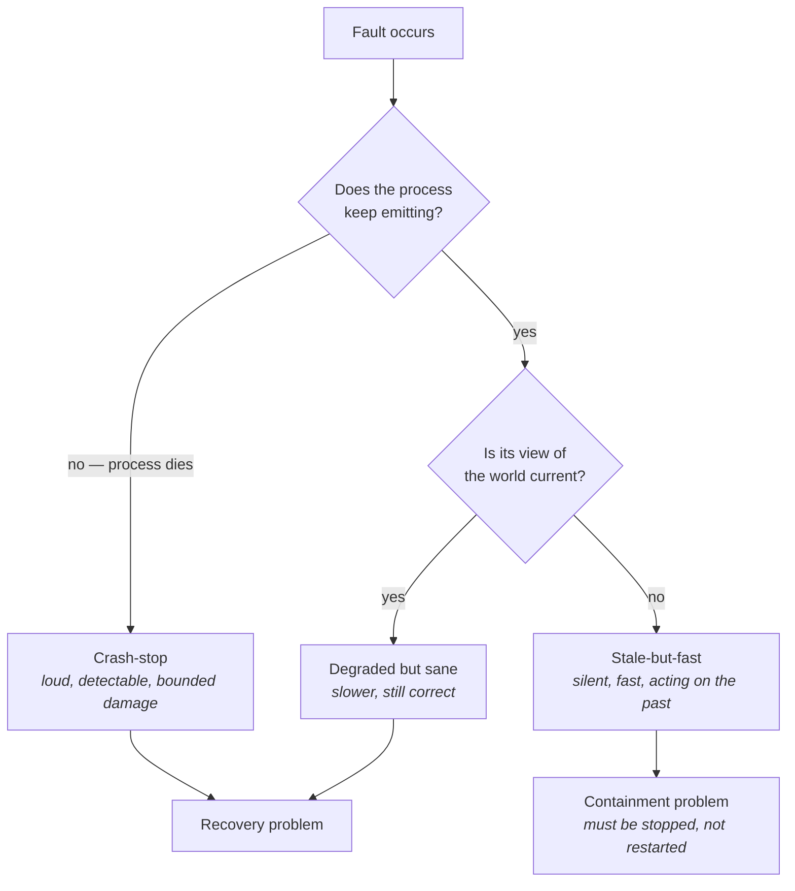
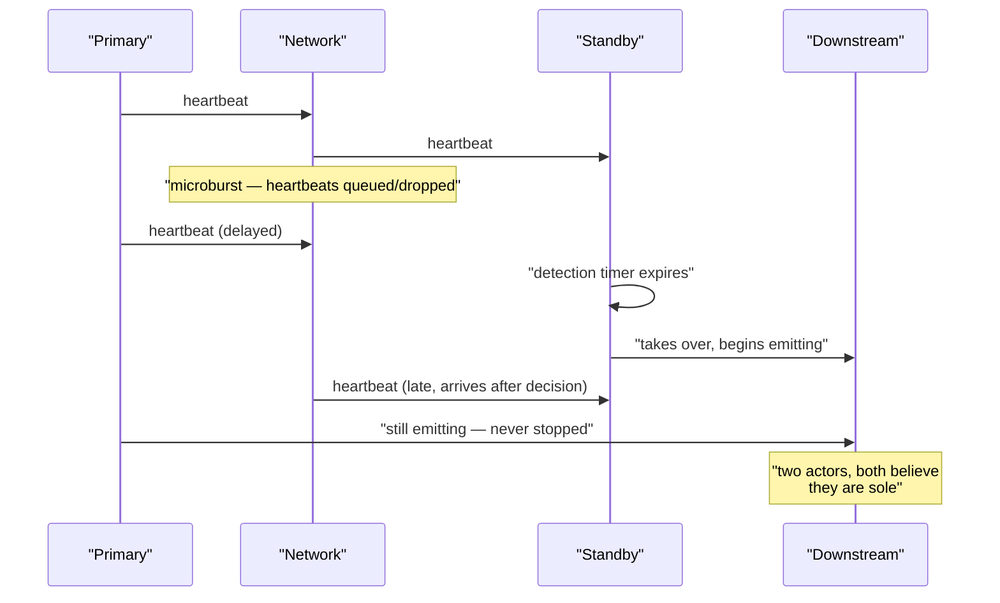
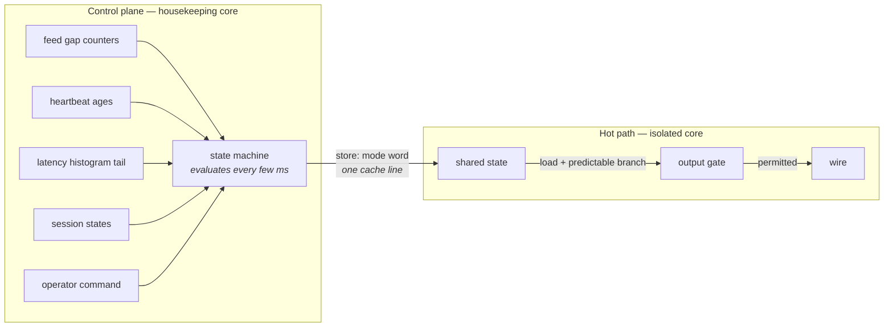
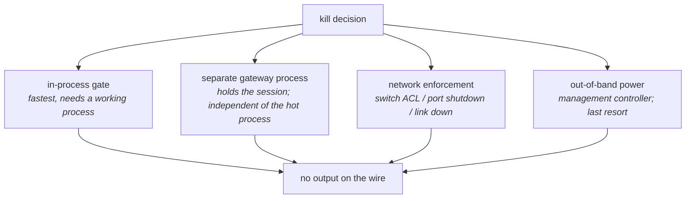
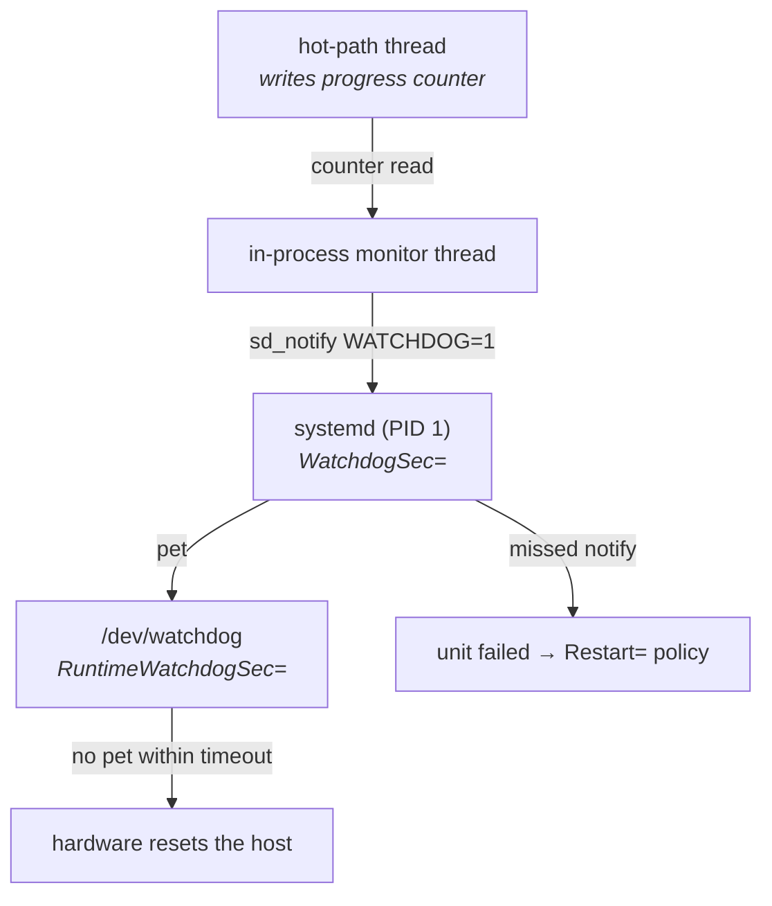
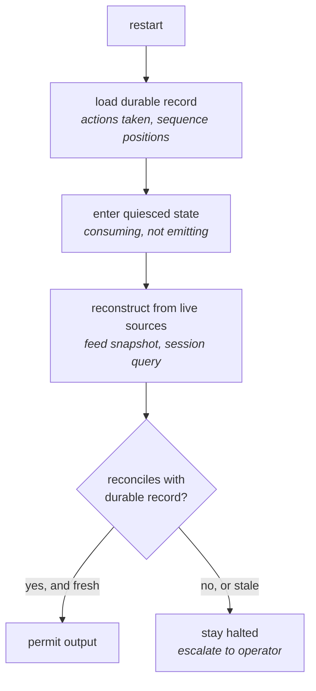

# Reliability and Failure Handling

Every chapter so far has been about making one thing happen faster, or more predictably, than it
otherwise would. Cache lines were laid out to avoid a fetch, threads were pinned to avoid a
migration, the kernel was bypassed to avoid a copy. The whole exercise assumed a machine that works.
This part of the book removes that assumption, and the first thing that becomes clear is how many of
those optimizations were quietly buying speed by removing safety margin.

That is not an accusation; it is the actual engineering situation. A busy-polling thread on an
isolated core with interrupts steered away and huge pages locked into RAM is a beautiful thing, and
it is also a thread that no longer yields, no longer faults, and no longer gives the operating
system any natural opportunity to notice it has stopped making sense. A kernel-bypass data path
means the kernel's socket state, its drop counters, and its retransmission machinery are no longer
watching your traffic (see "Kernel Bypass"). A preallocated, pre-touched, `mlockall`-pinned heap
means you never see an allocation failure — you have merely moved the moment of failure earlier and
made it quieter. Determinism and observability pull against each other, and reliability is where the
bill arrives.

The central question of this chapter is therefore not "how do we make the system reliable" in the
abstract. It is a narrower and more useful one: **every reliability mechanism costs latency
somewhere, so which parts of it can be moved off the critical path without weakening the guarantee
it provides?** Some can, entirely — a health check that reads a counter written by the hot path
costs the hot path a single store. Some can be moved partially — a failover decision can be
precomputed and staged so that only the final switch is on the path. And some cannot be moved at
all, which means you must decide, explicitly and in advance, how much latency that guarantee is
worth. Engineers who have not thought this through end up with systems that are fast when healthy
and dangerous when not, which is precisely the wrong shape.

## How Latency-Critical Systems Fail

Start from what you already know about failures in ordinary distributed systems. The standard
taxonomy — crash-stop, crash-recovery, omission, Byzantine — was built to reason about correctness
and availability. A crashed replica is the easy case: it is loud, it is unambiguous, and every
detection mechanism you have will catch it. The hard cases are the ones where a node keeps running
but stops being right.

A latency-critical system inherits all of that and adds a dimension the classical taxonomy does not
have: **being late is a failure even when the output is correct.** A web service that answers in
900 ms instead of 90 ms has degraded. A system that emits a correct response 5 ms after the world
moved on has produced garbage — the response is arithmetically correct and operationally wrong, and
nothing in the process will report an error. This is the single most important reframing in the
chapter. In a system whose whole purpose is to act on information before it goes stale, *slow* and
*wrong* are the same category, and the system must be built to treat them the same way.

That collapses into an ordering of failure severity that inverts the usual intuition. Most engineers
rank a crash as the worst thing that can happen to a process. Here it is close to the best thing that
can happen, because a crashed process stops emitting. The genuinely dangerous states are the ones
where the process is alive, responsive, passing every check you wrote, and acting on a view of the
world that is no longer true. A stalled thread that resumes after 200 ms and dutifully processes its
entire backlog of stale input is worse than the same thread never resuming at all.

The diagram's right-hand branch is the one this chapter keeps returning to:

- **Crash-stop is the benign failure.** The process is gone, the TCP connection resets, every peer
  learns within one round trip, and no further output is produced. Damage is bounded by what already
  went out.
- **Degraded-but-sane is a capacity problem.** Latency rose, the system knows it, and the correct
  response is to shed work or hand over. This is the case ordinary service engineering handles well.
- **Stale-but-fast is the failure mode that needs its own machinery.** The process is healthy by
  every conventional measure and is operating on inputs that no longer describe reality. No restart
  fixes it, because restarting produces a process that is equally happy to act on stale input. It
  must be *stopped*, and stopping it is a different mechanism from restarting it.

### Where staleness comes from

Staleness is not exotic. Every mechanism in the preceding chapters can produce it, and the reader
has already met most of the causes under a different name — they were jitter sources when we cared
about the tail, and they are correctness hazards when the stall is long enough.

A thread that is descheduled for 3 ms (see "Processes, Threads, and Scheduling") wakes up holding a
snapshot of the world from 3 ms ago. Whether that matters depends entirely on how the code resumes:
if it drains its input queue and processes every entry as though it had just arrived, it is now
replaying history at high speed. If instead it timestamps every input on arrival and discards
anything older than a threshold on the way in, the same 3 ms stall produces a gap in output rather
than a burst of wrong output. Nothing about the stall changed; the difference is entirely in how the
resume path is written.

The same structure appears at every layer. A UDP multicast feed that drops packets does not
announce itself — the socket keeps delivering the packets that did arrive, and the receiving process
has a view with holes in it that looks exactly like a view without holes unless it is checking
sequence numbers (see "UDP and Multicast"). A NIC receive ring that overflows during a microburst
drops silently and increments a counter nobody reads. A clock that has drifted produces timestamps
that are internally consistent and externally wrong, so every staleness check built on them passes
(see "Clocks, Timers, and Time").

| Source | What the process observes | Why it looks healthy |
|---|---|---|
| Scheduling stall, page fault, THP compaction | A gap in wall-clock time, then a burst of queued input | Process alive, queue draining, throughput briefly *high* |
| Socket receive buffer overflow | Missing messages, no error return | `recv` succeeded on everything it did return |
| NIC ring overrun during a microburst | Missing packets | Only `ethtool -S` knows; the socket API cannot tell you |
| Multicast gap on one feed leg | A view with holes | Sequence numbers reveal it; nothing else does |
| Clock drift or a stepped clock | Wrong timestamps, consistent with each other | Every age check computed from that clock passes |
| Half-open TCP connection | No data, no error, no reset | The socket is `ESTABLISHED` until something forces the issue |
| Upstream process wedged | Input simply stops arriving | Absence of input is indistinguishable from a quiet market |

The last two rows are worth dwelling on because they are the ones that most reliably surprise people.

A **half-open TCP connection** is a connection where one end has gone away — the host was
power-cycled, a middlebox dropped the flow state, a cable was pulled — without sending a FIN or an
RST. TCP is a protocol with no inherent liveness requirement: a connection with no data flowing
generates no packets at all, so the surviving end has no way to distinguish "peer is idle" from
"peer no longer exists." The socket remains in `ESTABLISHED` indefinitely (see "TCP In Depth"). If
your input arrives over that connection, you will wait forever, and every check that asks "is the
socket open?" will say yes.

The **absence of input** case is the deepest one. If your process is designed to react to arriving
messages, and messages stop arriving, the process does exactly nothing — which is also what it does
when there is legitimately nothing to react to. A system that only ever checks whether its own code
is running cannot distinguish a dead upstream from a quiet one. Detecting this requires an
independent expectation of what input *should* look like, which is why heartbeats exist and why the
section on them insists they be end-to-end.

**Failure mode: the restart made it worse.** Symptom is that a supervisor detected a stall, killed
and restarted the process, and the restarted process immediately emitted a burst of output derived
from state it reloaded from disk. Cause is that the recovery path treated persisted state as
current without checking its age. Confirm by correlating the process start time from
`systemctl show <unit> -p ExecMainStartTimestamp` against the timestamps embedded in the state it
loaded; if the gap exceeds the staleness threshold the system is supposed to enforce, the recovery
path is not enforcing it. The fix is that every recovery path must validate the age of what it
restores, and refuse to act rather than act on old data.

**Failure mode: the stall is invisible because the process measured itself.** Symptom is a latency
histogram from in-process instrumentation showing a clean tail, while an external capture shows
multi-millisecond gaps. Cause is that a descheduled thread cannot timestamp the moment it was
descheduled — the code that would record the event is exactly the code that is not running. Confirm
by comparing in-process timestamps against hardware receive timestamps from `SO_TIMESTAMPING` or a
tap capture (see "Measuring Correctly" for why self-measurement misses this class of event
entirely).

**Try it:** produce a half-open connection and watch how long the kernel takes to notice. Open a TCP
connection between two hosts or namespaces, stop sending data, then on the peer side sever the path
without a clean close — `sudo ip link set dev <iface> down` on the peer, or drop the flow with a
firewall rule, rather than killing the process, since killing the process sends an RST and defeats
the experiment. On the surviving side, watch `ss -tni dst <peer>` and observe that the connection
sits in `ESTABLISHED` with no timer running and no indication of trouble. It will stay that way
indefinitely unless keepalives or `TCP_USER_TIMEOUT` are configured; the later section on health
checks covers both.

**Try it:** simulate a stall precisely and see what your resume path does. Run a workload, then
`sudo systemctl kill --signal=SIGSTOP <unit>`, wait a measured interval, and
`sudo systemctl kill --signal=SIGCONT <unit>`. `SIGSTOP` cannot be caught or ignored, so this
reproduces a scheduling stall of exactly the duration you choose, with no cooperation from the
process. Then examine the output the process produced in the second after resuming. If it processed
its whole backlog at full speed, you have a stale-but-fast bug and you now have a deterministic
reproducer for it.

## Redundancy, Failover, and Standby

The obvious response to a machine that can fail is to have a second machine. That instinct is
correct, and almost everything interesting is in the details, because a badly designed failover
converts a single-node failure into a two-node failure. Before anything else, it is worth being
precise about what redundancy is actually buying, because the answer differs by failure class.

Redundancy protects well against **independent, fail-stop** faults: a power supply dies, a DIMM goes
bad, a link goes down, a kernel panics. Two machines fail independently, so a spare genuinely helps.
Redundancy protects poorly, or not at all, against **correlated** faults: a bad configuration
deployed to both machines, a software defect triggered by a specific input that both machines will
receive, an upstream feed that has gone wrong, a firmware bug in identical NICs. And redundancy
actively *hurts* in the case this chapter cares about most — the stale-but-fast failure — because
now there are two processes that might act, and the failure of coordination between them is a new
failure mode that did not exist with one machine.

The naive design is: run two identical processes, have the standby watch the primary, and when the
standby stops seeing the primary, the standby takes over. Every word of that is a trap. "Stops
seeing" is a network observation, and a network can fail in ways that make a healthy primary
invisible. "Takes over" is an action, and if the primary is in fact alive and also taking action, the
system now has two actors that each believe they are sole. This is **split-brain**, and it is the
central difficulty of the section.

### Hot, warm, and cold

Standby designs differ along one axis: how much work the standby has already done at the moment it
is asked to take over. That work is not just state — it is also *microarchitectural* state, which is
where low-latency systems diverge sharply from ordinary service engineering.

The three tiers differ by orders of magnitude in takeover time, and the reason is worth spelling out
rather than tabulating:

- **Cold standby** is hardware that exists but is not running the application. Takeover means
  starting a process, faulting in its pages, establishing sessions, and rebuilding state. Even with
  everything automated this is seconds to minutes, dominated by session establishment and state
  reconstruction rather than by process start.
- **Warm standby** is a running process that holds current state — it consumes the same input
  stream, maintains the same internal view — but does not emit. Takeover is fast in the sense that
  the state is already right. It is *not* fast in the sense that matters, because a process that has
  never executed its output path has that path cold in every cache: instruction cache, data cache,
  branch predictors, and TLB (see "The Cache Hierarchy" and "Memory Systems"). Its first real
  transaction runs through cold code and can be tens of microseconds slower than steady state.
- **Hot standby** is a warm standby that additionally exercises its entire path continuously,
  including the output path, with the actual emission suppressed at the last possible point. It
  keeps caches, predictors, and TLB entries resident for the code that matters. Takeover means
  flipping one flag.

That distinction — suppress at the last point, not the first — is the single most useful design
rule in standby architecture for latency-critical systems, and it is the direct analogue of cache
warming from earlier chapters. If the standby decides "I am not active" at the top of its processing
function and returns immediately, it has warmed nothing. If it runs the entire path and the *only*
difference is that a final send is skipped, everything up to that point stays hot. The cost is that
the suppression point is now the most safety-critical branch in the program, because a bug there
means both nodes emit.

| Property | Cold | Warm | Hot |
|---|---|---|---|
| Application running | No | Yes | Yes |
| Consuming live input | No | Yes | Yes |
| Internal state current | No | Yes | Yes |
| Output path exercised | No | No | Yes, suppressed at the end |
| Caches/TLB/predictors primed | No | Partially | Yes |
| Takeover time | seconds–minutes | ~ms plus a cold-path penalty | microseconds, plus session work |
| Split-brain risk | Low | Moderate | **Highest** |
| Resource cost | Lowest | Moderate | Full duplicate |

Notice the split-brain column moves in the opposite direction from takeover time. This is not a
coincidence and it is the trade-off that makes the topic hard: **the closer the standby is to being
able to act instantly, the smaller the barrier between "standby" and "second active node."** A cold
standby cannot cause split-brain in under a minute even if you tell it to. A hot standby is one
mispredicted branch away from it.

**Failure mode: the standby's first message is dramatically slower than the primary's median.**
Symptom is a takeover that succeeds functionally but shows a large latency outlier on the first
several transactions. Cause is cold instruction cache and branch predictor state on the output path
plus, frequently, minor page faults on buffers the standby allocated but never touched. Confirm by
checking the minor fault counter across the takeover window with
`ps -o min_flt,maj_flt -p <pid>`, and by running `perf stat -e L1-icache-load-misses,branch-misses`
on the standby before and after it becomes active. The fix is to exercise the full path with
suppression at the very end, and to pre-touch every buffer at startup.

### Split-brain, and why fast failover is dangerous

Here is the concrete scenario. Two hosts, primary and standby, connected by a network. The standby
decides the primary is dead when it stops receiving heartbeats for some interval. The primary is
in fact fine — but the link carrying heartbeats saturated for 40 ms during a microburst, or a switch
control plane hiccuped, or the heartbeat process was descheduled behind a housekeeping task. The
standby's detection logic cannot tell the difference, because from its position the evidence is
identical.

The sequence diagram makes the essential point: the standby's decision was based on an *absence of
evidence*, and absence of evidence over a shared network is not evidence of absence. Every
heartbeat-based failover has this property. The only variables are how long you wait before
concluding, and what you do to make the conclusion true.

Two families of answer exist, and they are not alternatives — a serious system uses both.

**Make the conclusion true by force (fencing).** Rather than inferring the primary is dead, take an
action that *makes* it dead, and only proceed once that action has been confirmed. In cluster
software this is called fencing, or STONITH — "shoot the other node in the head." The concrete
mechanisms are unglamorous and effective: cut the primary's network access at the switch port,
power-cycle it through its out-of-band management controller, or revoke its credential with the
downstream system so its traffic is rejected at the far end. The essential property is that fencing
does not require the primary's cooperation, because a wedged primary is exactly the case you are
guarding against. The essential cost is that fencing takes time — hundreds of milliseconds to
seconds for a management-controller action — which puts a floor under safe failover that is far
above the microsecond scale everything else in this book operates at.

**Make the conclusion unnecessary (external arbitration).** Move the decision to a component that
can enforce it rather than merely announce it. If the point where output enters the outside world is
itself a gate — a switch ACL, a separate control-plane process holding the only credential, a
hardware device that forwards from exactly one input — then "who is active" becomes a property of
that gate rather than an opinion held independently by two hosts. Two processes may both *believe*
they are active without harm, because only one of them can actually emit.

The engineering conclusion inverts a common instinct:

- **Fast automatic failover maximizes exposure to split-brain**, because a short detection window
  means ordinary network jitter and ordinary scheduling stalls are enough to trigger it. A 50 ms
  detection threshold on a link that occasionally queues for 40 ms is a system that will fail over
  spuriously.
- **Slow failover trades availability for safety**, and in a system where the failure of *stopping*
  is cheap and the failure of *duplicating* is expensive, that is usually the correct trade. Stopping
  is recoverable; two uncoordinated actors are not.
- **The detection threshold must exceed the worst-case benign delay**, which is a measurement, not a
  guess. You need the tail of your heartbeat delivery distribution, over a real network, under real
  load — the p99.9, not the median (see "What 'Low Latency' Actually Means" for why the tail is the
  only number that matters here).
- **Prefer "stop" to "switch" as the default reaction.** If the primary might be sick, halting the
  primary is safe and can be done unilaterally. Promoting the standby is not safe and cannot.

**Failure mode: a fail-over storm — the pair flaps between primaries.** Symptom is repeated
promotion and demotion, often several times a minute, with both nodes logging that the other was
unreachable. Cause is a detection threshold below the network's real delay tail, combined with
preemption logic that returns mastership to the higher-priority node as soon as it reappears.
Confirm from the timing of role transitions in `journalctl -u <unit> -b -o short-monotonic`, and
correlate against interface counters from `ip -s link show dev <iface>` and switch port statistics.
The fixes are to raise the threshold above the measured tail and to disable automatic preemption so
that a recovered node stays passive until a human promotes it.

### VRRP as a concrete, checkable example

Keepalived implements the Virtual Router Redundancy Protocol (VRRP), and it is worth studying not
because you would necessarily use it on a hot path — you generally would not, for reasons that
become obvious — but because it is a real, inspectable implementation of exactly the mechanism
described above, with all of the trade-offs visible in its configuration file.

VRRP works by having a set of routers share a **virtual IP address** and a virtual MAC address of
the form `00:00:5E:00:01:<VRID>`, where VRID is the virtual router ID. Exactly one router is master
and answers for that address. The master multicasts VRRP advertisements to `224.0.0.18` using IP
protocol 112 at a configured interval. Backups run a timer; when no advertisement arrives for the
master-down interval — three advertisement intervals plus a small skew derived from priority — the
highest-priority backup promotes itself, assigns the virtual IP to its interface, and broadcasts
gratuitous ARP so that switches and neighbours relearn where the virtual MAC lives.

Every hazard in this section is present in that description:

- **The detection window is three advertisement intervals.** With the default one-second interval,
  detection takes roughly 3–4 seconds. VRRPv3 permits sub-second intervals, and keepalived accepts
  fractional `advert_int` values, but shortening it moves you directly into the spurious-failover
  regime described above.
- **The failover action is unilateral and unfenced.** A backup that promotes itself does not verify
  the master is gone; it assigns an address and sends ARP. If the master is alive and merely
  unreachable *from the backup*, both now claim the address, and downstream devices will send to
  whichever the switch's MAC table last learned — which can oscillate.
- **`nopreempt` exists because flapping is real.** By default a returning higher-priority node
  reclaims mastership immediately, which turns a single transient into two role changes.
  `nopreempt` makes a promoted backup keep mastership until it fails, and `preempt_delay` adds a
  hold-off. Both are admissions that automatic return-to-normal is frequently worse than staying
  put.
- **`vrrp_script` plus `track_script` is the health-check hook**, running an external command
  periodically and adjusting the instance's priority by `weight` on failure. This is where a real
  health check gets attached — and where an insufficient one does most of its damage, since a script
  that only checks whether a process exists will keep a wedged node as master indefinitely.

The reason this design is unsuitable for a trading hot path is now visible: its detection is in
seconds, its failover is unfenced, and its takeover mechanism depends on ARP relearning across a
switch fabric, which is neither instantaneous nor deterministic. It is an excellent control-plane
tool — for management interfaces, for the network path used by monitoring, for anything where
multi-second detection is fine — and studying its configuration is the fastest way to internalize
the trade-offs.

**Failure mode: both nodes hold the virtual IP and traffic oscillates between them.** Symptom is
intermittent connectivity, duplicate replies, and switch logs reporting a MAC address moving between
ports. Cause is a VRRP partition — advertisements are not reaching the backup, typically because the
advertisement multicast is blocked, the interface is wrong, or a firewall drops IP protocol 112.
Confirm by capturing on both nodes with `sudo tcpdump -i <iface> -n proto 112` and checking whether
each sees the other's advertisements; if each sees only its own, you have a partition, not a
failure. Also check `ip -4 addr show dev <iface>` on both nodes for the same address.

**Try it:** take a link down deterministically and time the reaction. On a test pair, run
`sudo ip link set dev <iface> down` on the master. Unlike unplugging a cable or killing a process,
this produces an immediate, clean, reproducible carrier loss you can repeat exactly. Watch the
backup with `journalctl -f -u keepalived -o short-monotonic` and record the interval between the
link going down and the address appearing in `ip -4 addr show`. Then repeat with `advert_int`
halved, and again with a `tc` impairment in place —
`sudo tc qdisc add dev <iface> root netem delay 50ms 20ms loss 1%`, removed afterwards with
`sudo tc qdisc del dev <iface> root` — and observe the point at which detection starts firing on
delay rather than on failure. That crossover is the number the whole design hinges on.

**Try it:** watch link state change independently of any daemon. Run `ip monitor link` in one
terminal and toggle an unused interface with `ip link set dev <iface> down` and `up` in another. The
kernel emits the netlink event essentially immediately, which tells you that carrier loss is the
*fastest* possible failure signal available — far faster than any heartbeat — and worth wiring
directly into failover logic where the failure is a physical link rather than a process.

## Graceful Degradation and Kill Switches

A system that can only be fully working or fully stopped will spend more time fully stopped than it
needs to. Graceful degradation is the practice of defining intermediate states in advance — reduced
function, reduced input, reduced output — so that a partial failure produces a partial response
rather than a binary one. The reason it belongs in a latency chapter rather than a general
availability chapter is that in a latency-critical system the degradation triggers are usually
*timing* conditions, not error conditions, and the mechanism must therefore be designed against a
latency budget rather than against an exception.

The naive approach is to handle each failure at the point where it is detected: the feed handler
notices a gap and decides what to do, the session layer notices a disconnect and decides what to do,
and so on. This fails for two reasons. First, the decisions interact — a feed gap and a session
disconnect together mean something different from either alone — and local handlers cannot see the
combination. Second, and worse for our purposes, it puts policy logic on the hot path. Every branch
that asks "are we in degraded mode, and if so which one?" is a branch the CPU must predict, in code
that runs on every message.

The design that resolves both is to separate the **decision** from the **enforcement**. A control
plane, running off the hot path on a housekeeping core, gathers evidence — feed sequence gaps,
heartbeat ages, latency histogram tails, session states — and decides what state the system should
be in. It publishes that decision as a small piece of shared state. The hot path reads that state
and does nothing else: no evaluation, no policy, one load and one predictable branch. The expensive
part of the reliability mechanism has been moved entirely off the critical path, while the guarantee
— that the system stops when it should — is unweakened, because the enforcement point is still on
the path where it must be.

The diagram's asymmetry is the point:

- **All evaluation lives left of the shared word.** Counters, thresholds, hysteresis, and operator
  input are all cold-path work, running at whatever cadence is appropriate — every millisecond is
  ample — on a core that is not the hot one.
- **The hot path reads one word.** A single load from a cache line that is almost always in L1 in
  Shared state, and a branch that is taken the same way millions of times in a row and therefore
  predicts perfectly (see "CPU Microarchitecture Essentials"). The steady-state cost is effectively
  a couple of nanoseconds.
- **The shared word must be on its own cache line.** If the control plane writes it frequently and it
  shares a line with something the hot path also reads, you have manufactured false sharing on the
  critical path — a coherence miss on every message (see "The Cache Hierarchy").
- **The gate sits at the last point before the wire**, for the same reason the hot standby's
  suppression does: everything upstream stays warm, and there is exactly one place to audit.

### Degradation levels

Useful degradation states are ordered by how much capability they remove, and each needs an
explicitly defined entry condition, exit condition, and — critically — whether exit is automatic.

| State | Trigger | Behavior | Automatic recovery? |
|---|---|---|---|
| **Normal** | — | Full function | — |
| **Reduced input** | One redundant feed leg has gaps | Continue on the surviving leg, mark data lower-confidence | Yes, when the leg recovers cleanly |
| **Read-only** | Session to a downstream endpoint is unhealthy | Continue consuming and maintaining state; suppress all output | Yes, on session re-establishment plus a state check |
| **Quiesce** | Internal state cannot be trusted — sequence gap that cannot be filled, staleness threshold exceeded | Suppress output, keep consuming, attempt reconstruction | Only after successful reconstruction |
| **Halted (kill switch)** | Operator action, or an unrecoverable invariant violation | All output blocked at every layer | **No — manual only** |

The last row's final column is the design decision that matters most. A kill switch that can
un-trip itself is not a kill switch; it is a circuit breaker with a retry loop, and the failure mode
it produces — repeatedly resuming into the same broken condition — is worse than either staying
stopped or staying running. Anything that automatically resumes belongs in one of the rows above.

### The kill switch as a control plane

Treat a kill switch as an engineering problem with three requirements, and the design follows
directly. It must be **deterministic** — when it is engaged, no further output can leave, with no
race in which an in-flight message escapes. It must be **verifiable** — an operator must be able to
confirm it is engaged, from outside the process, without trusting the process's own report. And it
must be **independent** — it must work when the process being stopped is wedged, spinning, or
malfunctioning, which rules out any mechanism that requires the process's cooperation.

No single enforcement point satisfies all three, which is why real designs layer them. Each layer
is slower to act and harder to defeat than the one above it.

The layers map onto the three requirements as follows:

- **In-process gate** — nanoseconds to take effect, and the only layer fast enough to be considered
  part of normal operation. It is not independent: a spinning or corrupted process may never reach
  the gate. Necessary but never sufficient.
- **Separate gateway process** — the process that owns the outbound socket is not the process that
  computes what to send. Killing or gating the gateway stops output regardless of what the hot
  process is doing. Costs an IPC hop on the hot path (see "Synchronization and IPC" for shared-memory
  transports that make this hop cheap), and buys genuine independence.
- **Network enforcement** — a switch ACL, an administrative port shutdown, or `ip link set dev
  <iface> down` on the host. Independent of every process on the machine. Takes effect in
  milliseconds to seconds depending on the mechanism, and — importantly — is verifiable from the
  network side, by an operator who does not have to trust anything running on the host.
- **Out-of-band power control** — the management controller can power off the host irrespective of
  the operating system's state. Slowest, most disruptive, completely independent, and the only layer
  that works against a kernel that has stopped scheduling.

Two properties of the layering deserve emphasis. First, **the layers must be independently
actuatable**. If engaging the network layer requires an agent on the host to be healthy, it is not
actually a separate layer. Second, **each layer must be independently verifiable**. "The process
reported that it is halted" is the weakest possible evidence, because a malfunctioning process is
exactly the one whose reports you cannot trust. A packet capture on the outbound interface showing
zero egress is strong evidence. A switch counter showing zero frames from that port is stronger. The
verification story, not the actuation story, is what separates a kill switch from a wish.

**Failure mode: the kill switch was engaged and messages still went out.** Symptom is egress traffic
after the halt was confirmed by the application. Cause is almost always buffering below the gate —
data already handed to the kernel socket buffer, already in the NIC transmit ring, or already in a
user-space bypass stack's queue (see "Kernel Bypass," where the kernel has no visibility into the
send path at all). Confirm with a capture on the outbound interface, or better, on a tap or SPAN
port so the observation does not depend on the host. The fix is to define the gate as the last point
before the buffer, and to make halting also drain or discard whatever is already queued below it.

**Failure mode: the halt state is not durable across a restart.** Symptom is a process that was
deliberately halted coming back up in normal mode after a supervisor restarted it. Cause is that the
halt lived only in process memory while the supervisor policy is `Restart=always`. Confirm by
reading `systemctl show <unit> -p Restart,RestartSec,StartLimitBurst,StartLimitIntervalSec`. The fix
is to persist the halt outside the process — a file the startup path checks, or a systemd drop-in
that disables the unit — and to have the startup path fail loudly rather than silently resume.

**Failure mode: a supervisor restart loop hides a permanent fault.** Symptom is a service that
appears to be running whenever you check it, while `journalctl` shows it starting every few seconds.
Cause is `Restart=always` with a `RestartSec=` short enough that the service is nearly always in the
"running" window. Confirm with `systemctl show <unit> -p NRestarts` and by scanning
`journalctl -u <unit> -b -o short-monotonic` for repeated start records. The correct configuration
for a latency-critical service is a bounded burst — `StartLimitBurst=` with
`StartLimitIntervalSec=` — so that after N failures in the interval systemd stops trying and the
unit enters a failed state that monitoring will actually notice.

**Try it:** measure how deterministically you can stop egress. With a workload running, capture on
the outbound interface and simultaneously run `sudo ip link set dev <iface> down`. Then compare the
last captured frame's timestamp against the netlink event timestamp from `ip monitor link`. This
gives you the actual latency of your bluntest enforcement layer, and it is usually much better than
people expect — carrier goes down in microseconds — which makes link-down a surprisingly credible
emergency mechanism where losing the whole interface is acceptable.

**Try it:** verify that your halt is verifiable. Engage whatever kill mechanism your system has,
then confirm the outcome using only evidence from outside the process: `ss -tnp` to show no
established outbound sessions, `ip -s link show dev <iface>` to show the transmit packet counter
frozen, and a capture on a tap or SPAN port showing nothing. If you cannot construct that evidence
without asking the process, the mechanism is incomplete.

## Health Checks and Heartbeats

A health check exists to answer one question: should this component be trusted to keep doing its
job? Almost every health check written in practice answers a different and much weaker question:
does this process exist? The gap between those two is where most reliability failures live.

Consider what a process-existence check actually proves. It proves that a `task_struct` is present
in the kernel and has not been reaped. It does not prove that any thread is running — a thread can
be blocked forever on a futex, deadlocked against another thread, or spinning in a loop that never
terminates. It does not prove that input is arriving, that output is being produced, or that either
is correct. A process that has deadlocked, a process that has silently stopped receiving multicast
because an IGMP membership expired, and a process happily doing its job are all indistinguishable to
that check. Worse, in a hot standby architecture, a check this weak actively harms you: it will
report the wedged primary as healthy and prevent the takeover that should happen.

TCP-connect checks are barely better. Accepting a connection proves that a listening socket exists
and that *some* thread reached `accept` — frequently a monitoring thread that has nothing to do with
the hot path. HTTP-endpoint checks that return a hard-coded `200 OK` prove that the HTTP handler
runs. None of these touch the machinery that actually matters.

The useful reframing is to build health checks as a ladder, where each rung proves strictly more
than the one below it, and to be explicit about which rung you are actually standing on.

- **Existence** is what a PID file, `systemctl is-active`, or a process-table scan gives you. Treat
  it as proving nothing beyond "not yet reaped."
- **Liveness** requires the process to *do* something on request. A watchdog ping that a thread must
  answer proves that thread is being scheduled — but only that thread.
- **Progress** requires evidence that the *hot path specifically* has advanced. The standard
  implementation is a monotonically increasing counter or a timestamp written by the hot loop, read
  by an external observer. Cost on the hot path: one store to a resident cache line.
- **Freshness** requires that the input driving that progress is current. A counter that advances is
  not enough if what it is advancing through is a replay of stale data.
- **Correctness** requires internal invariants to hold: sequence numbers contiguous, both feed legs
  agreeing, state consistent with what was last acknowledged downstream.

The essential insight for latency work is that the higher rungs can be implemented almost entirely
off the hot path. A progress check that costs the hot path one store to an already-resident line and
costs the *checker* an entire evaluation is the archetype of the whole chapter's thesis: the
guarantee is unweakened, and nearly all of the expense has been relocated.

### Watchdogs: software and hardware

A watchdog inverts the direction of a health check. Instead of an external agent asking the process
whether it is well, the process must periodically assert that it is well, and something else takes
action if the assertion stops. The inversion matters because it fails safe: a process that is wedged
cannot assert anything, so silence is automatically interpreted as failure.

systemd implements this directly. Setting `WatchdogSec=` in a unit's `[Service]` section, with
`Type=notify`, requires the service to send `WATCHDOG=1` via the `sd_notify` protocol at least that
often. systemd passes the interval to the process in the `WATCHDOG_USEC` environment variable —
convention is to ping at half that interval — and the socket path in `NOTIFY_SOCKET`. If a ping is
missed, systemd considers the service failed and applies the unit's restart policy;
`Restart=on-watchdog` restarts specifically on that condition.

That covers a wedged process. It does not cover a wedged kernel, because systemd is itself a
process. For that there is the **hardware watchdog**: a timer in the chipset or a dedicated device,
exposed as `/dev/watchdog`, that resets the machine if it is not petted within its timeout. systemd
can own it — `RuntimeWatchdogSec=` in `/etc/systemd/system.conf`, with `WatchdogDevice=` to select
which one — so that PID 1 pets the hardware and the hardware resets the box if PID 1 stops running.
The result is a chain in which each link is watched by something strictly more privileged and less
likely to fail than the thing it watches.

The chain has one property worth stating explicitly: **the monitor thread must derive its ping from
the hot path's progress counter, not from its own liveness.** If the monitor pings on a timer of its
own, it will keep pinging happily while the hot path is deadlocked, and the entire structure proves
nothing beyond what a process-existence check proves. The value is in the coupling.

| Mechanism | What it detects | What it cannot detect | Where configured |
|---|---|---|---|
| `systemctl is-active` | Process exists per systemd | Deadlock, stall, staleness, wrongness | — |
| `WatchdogSec=` + `sd_notify` | The pinging thread is scheduled | Other threads wedged, if ping is uncoupled | Unit `[Service]` |
| Progress counter + external reader | The hot path advanced | Advancing through stale input | Application + monitor |
| `RuntimeWatchdogSec=` + `/dev/watchdog` | Kernel or PID 1 wedged | Anything application-level | `/etc/systemd/system.conf` |
| End-to-end heartbeat | The whole path works, including the network | Correctness of content | Application protocol |

**Failure mode: the watchdog ping is decoupled from the work.** Symptom is a service that systemd
reports as healthy for hours while producing no output. Cause is a monitor thread pinging on its own
timer with no dependency on hot-path progress. Confirm by reading the progress counter externally —
if it is frozen while `systemctl status <unit>` shows the service active and the journal shows no
watchdog complaints, the coupling is missing. This is the single most common defect in watchdog
implementations.

**Failure mode: the hardware watchdog reboots a healthy machine.** Symptom is an unexplained reset
with nothing in the journal from just before it, because the reset is immediate and unbuffered log
lines are lost. Cause is a `RuntimeWatchdogSec=` shorter than a real stall the system can legitimately
experience — heavy I/O, a storage controller hiccup, or a long compaction pause. Confirm after the
fact with `journalctl --list-boots` to see the unclean boundary and `wdctl` to read the device's
configured timeout and, on hardware that supports it, its boot status. Set the hardware timeout well
above any survivable stall; it is the last resort, not the first responder.

**Failure mode: nothing detects a dead peer because keepalives were never enabled.** Symptom is a
session that hangs indefinitely with no error. Cause is that `SO_KEEPALIVE` is off by default on
every socket, and even when on, the Linux defaults are useless for this purpose: `tcp_keepalive_time`
is 7200 seconds, so the first probe is two hours after the connection goes idle, followed by
`tcp_keepalive_probes` (9) probes at `tcp_keepalive_intvl` (75 s). Confirm with
`sysctl net.ipv4.tcp_keepalive_time net.ipv4.tcp_keepalive_intvl net.ipv4.tcp_keepalive_probes` and
by checking for a keepalive timer on the connection in `ss -tnoi`. The per-socket overrides
`TCP_KEEPIDLE`, `TCP_KEEPINTVL`, and `TCP_KEEPCNT` are what you actually want, and `TCP_USER_TIMEOUT`
— which bounds how long unacknowledged data may remain outstanding before the connection is aborted
— is often the more direct control, because it applies to a connection with data in flight rather
than an idle one.

### Application heartbeats and why they must be end-to-end

TCP keepalives detect that the *connection* is gone. They do not detect that the peer's application
has stopped reading, or has wedged with its receive buffer full, or is reading and discarding. For
that you need a heartbeat at the application layer, exchanged over the same path and processed by
the same code as real traffic.

The "same code" requirement is the one that gets violated. If heartbeats are generated and consumed
by a dedicated thread that shares nothing with the hot path, they prove that the dedicated thread
and the network are fine — which is not the question. A heartbeat is only as informative as the
amount of real machinery it traverses. The design goal is for a heartbeat to fail whenever real
traffic would fail, which means it should be produced by the same thread, serialized by the same
code, sent through the same socket, and on the receiving side, consumed by the same loop.

Heartbeat interval selection then follows the same logic as failover detection, because it *is*
failover detection:

- **Detection time is at least interval × misses-tolerated**, so a one-second interval tolerating
  three misses cannot detect anything faster than three seconds.
- **The miss threshold must exceed the benign delay tail**, measured, not assumed — including
  scheduling stalls on both ends and queueing in the network.
- **Heartbeats and data should share a path**, so that a heartbeat arriving while data does not is
  impossible rather than merely unlikely.
- **Asymmetric intervals are usually right.** Detecting that you have lost contact with a downstream
  endpoint is more urgent than detecting the reverse, because the former means you may be acting
  blindly.

**Try it:** build a progress check and prove it catches what a liveness check misses. Have a
workload write a monotonically increasing counter into a `/dev/shm` file (see "Synchronization and
IPC" for why shared memory is the right transport here) on every iteration of its hot loop. Write a
one-line shell reader that samples the file twice a second and reports the delta. Now stop the
process with `sudo systemctl kill --signal=SIGSTOP <unit>`. `systemctl is-active` will continue
reporting `active`, because a stopped process still exists; your counter will freeze immediately.
That difference is the entire argument for progress-based checks in one experiment.

**Try it:** configure a real watchdog on a test unit. Add `Type=notify` and `WatchdogSec=10s` to a
service, and have it ping with `systemd-notify --pid=<pid> WATCHDOG=1` every few seconds. Confirm
the interval reached the process by inspecting `WATCHDOG_USEC` in `/proc/<pid>/environ`. Then stop
the pings and watch `journalctl -u <unit> -f` report the watchdog timeout and the restart. Then set
`Restart=on-watchdog` and confirm the restart happens only for that condition and not for a clean
exit.

**Try it:** inspect the hardware watchdog before you ever rely on it. Run `wdctl` and read
`/sys/class/watchdog/watchdog0/` — `identity`, `state`, `timeout`, `nowayout`, and `bootstatus`
where the driver supports them. Note whether `nowayout` is set: if it is, the watchdog cannot be
disabled once opened, so closing the device without the magic-close sequence will reboot the
machine. Learning that on a production host is an expensive way to learn it.

## Deterministic Recovery and State Reconstruction

Restarting is easy. Restarting into a state you can justify is the hard part, and it is where the
distinction between an ordinary service and a latency-critical one becomes sharpest. An ordinary
service usually restores state from a database and resumes; a stale read is a correctness annoyance
that eventual consistency will fix. A system that acts on a view of the world cannot do that,
because there is no eventual consistency for an action already taken. Recovery must therefore
establish not just *what* the state is but *when* it was true, and refuse to proceed if the answer
is "a while ago."

The naive recovery design is to checkpoint state periodically and reload the latest checkpoint on
restart. It fails in two distinct ways. The first is the staleness problem already described: a
checkpoint from 400 ms ago describes a world that no longer exists, and acting on it is exactly the
stale-but-fast failure mode. The second is subtler and specific to the low-latency setting: writing
checkpoints costs latency on the hot path. `fsync` is measured in hundreds of microseconds to
milliseconds even on NVMe (see "I/O Subsystems"), and a checkpoint frequent enough to be useful is
frequent enough to be ruinous.

The resolution follows the pattern of the whole chapter. Split recovery state into what must be
durable and what can be reconstructed, then make the durable part small enough that persisting it is
cheap and the reconstructible part large enough that not persisting it is fine. Concretely:

- **Recoverable-by-reconstruction state** can be rebuilt from a source that is still available after
  the restart — replaying a market data feed from the start of a snapshot cycle, or re-querying a
  downstream endpoint for the current session state. It should never be persisted, because
  reconstructing it is both cheaper and *more correct*, since the reconstruction produces current
  data rather than old data.
- **Must-be-durable state** is what cannot be recovered from any external source: the record of
  actions already taken and their identifiers, and the sequence position of anything with
  at-most-once semantics. This is typically small — tens of bytes per event — and its write can be
  made asynchronous and off-path via a lock-free ring drained by a separate writer thread (see
  "Synchronization and IPC"), so the hot path pays a store to shared memory and nothing else.

The diagram encodes three rules that are easy to state and frequently violated:

- **Recovery starts quiesced, not active.** The default on startup is that output is blocked. Every
  path to permitting output must pass an explicit check, so a bug in the recovery logic produces a
  system that does nothing rather than a system that does something arbitrary.
- **Reconstruction precedes permission.** State is rebuilt from live sources before the gate opens,
  and the rebuild's freshness is verified against a clock the system trusts.
- **Reconciliation failure is terminal, not retryable.** If the reconstructed view disagrees with
  the durable record of what was already done, that is an unresolved inconsistency. Automatic retry
  cannot resolve it because retrying produces the same disagreement; the correct action is to stay
  halted and raise it to a human.

### Determinism in recovery

"Deterministic recovery" means that recovering twice from the same inputs produces the same state.
This sounds like a formality until you try to debug a recovery bug, at which point it is the only
thing that makes the debugging possible at all.

Non-determinism creeps in through a small number of well-known doors, all of which have been
discussed in earlier chapters in their performance guise and reappear here as correctness hazards:

| Source | Why it breaks determinism | Mitigation |
|---|---|---|
| Wall-clock timestamps | `CLOCK_REALTIME` can step; two replays get different times | Use monotonic time for intervals, record arrival timestamps as data (see "Clocks, Timers, and Time") |
| Thread interleaving | Different scheduling order produces different merge order | Make ordering explicit: sequence numbers, single-writer designs |
| Address-space layout | Pointer values differ per run; iteration order of pointer-keyed containers differs | Never let state depend on addresses; key by stable identifiers |
| Uninitialized or reused memory | Residual values differ per run | Explicit initialization, which you are doing anyway to pre-fault pages |
| Multicast A/B arrival order | Legs arrive in different orders on different runs | Arbitrate by sequence number, not arrival (see "UDP and Multicast") |
| Reading current time inside logic | The same input yields different results | Time enters as an input, not as an ambient read |

The last row is the one with real teeth. If recovery logic calls `clock_gettime` in the middle of
reconstructing state, then the reconstruction depends on how long the reconstruction took, and
replaying the same inputs will not reproduce the same result. Treating time as an explicit input —
captured once, at a defined point, and passed through — is what makes replay-based debugging
possible. This is the same discipline that makes post-mortem replay from packet captures work at all
(see "Observability Without Slowing Down").

There is one further determinism hazard specific to systems that recover automatically: **the
recovery path is the least-tested code in the system.** It runs rarely, usually under conditions
nobody reproduced deliberately, and it is exactly the code that must be correct when everything else
has already gone wrong. The only real mitigation is to make recovery a routine operation rather than
an exceptional one — restart in normal operation, on a schedule, so that the recovery path executes
frequently under observation. A recovery path exercised daily is a recovery path you have some
reason to trust.

**Failure mode: recovery reconstructs a state that never existed.** Symptom is post-restart state
that is internally consistent but disagrees with an external record. Cause is typically merging a
persisted snapshot with a replayed stream without a well-defined join point — some events applied
twice, some not at all. Confirm by replaying the same recorded inputs twice offline and diffing the
resulting state; if two replays disagree, the join is under-specified. If they agree with each other
but not with the external record, the join point is wrong rather than non-deterministic. Recording
the exact sequence position of the snapshot alongside it is the standard fix.

**Failure mode: recovery is fast in test and slow in production.** Symptom is a reconstruction that
takes seconds in production and milliseconds in a test environment. Cause is usually that the test
replayed from a local file — page-cache resident — while production reconstructs from a live feed
and must wait for the next snapshot cycle, whose period is a property of the feed and not of your
code. Confirm by instrumenting the wait separately from the processing; if the time is spent waiting
for input, no amount of code optimization will help and the design must instead avoid needing a full
reconstruction.

**Failure mode: the durable write became the latency bottleneck.** Symptom is a p99.9 spike
correlated with recording events. Cause is a synchronous `write` plus `fsync` on the hot path.
Confirm with off-CPU analysis or by checking I/O pressure in `/proc/pressure/io` during the spike
window; a rising `some avg10` there while the hot thread stalls is direct evidence. The fix is a
lock-free handoff to a writer thread on a housekeeping core, which moves the cost off the path while
preserving the record.

**Try it:** measure your actual recovery time and its variance, rather than assuming it. Restart the
service twenty times under a representative input load, and record the interval between process
start and the moment the output gate opens. `systemd-analyze` will not help here because it measures
unit activation, not application readiness — instrument the application, or emit a journal line at
gate-open and extract the timestamps with
`journalctl -u <unit> -o short-monotonic --since '1 hour ago'`. What you want is the distribution,
not the mean: a recovery whose p50 is 800 ms and whose p99 is 40 seconds is a recovery you do not
understand yet.

**Try it:** prove your recovery is deterministic. Capture a recorded input sequence, replay it into
a fresh instance twice, and compare the resulting state byte-for-byte using whatever state dump the
application offers. If the two differ, walk the table above — the difference is almost always a wall
clock read, a pointer-ordered iteration, or an arrival-ordered merge. Fixing it is usually a small
change and it converts every future recovery bug from a mystery into a reproducible test case.

**Try it:** confirm your journal will actually survive the incident. Check
`journalctl --disk-usage` and the unit's rate limits — journald drops messages when a service
exceeds `RateLimitBurst=` within `RateLimitIntervalSec=`, and a process failing loudly is precisely
one that emits a burst of messages. Look for the "Suppressed N messages" lines that journald itself
emits in that case. A logging pipeline that discards exactly the messages describing the failure is
a common and avoidable way to lose a post-mortem.

## Numbers to Know

| Quantity | Value | Notes |
|---|---|---|
| Hot standby takeover (gate flip only) | ~ns–µs | One load and a predictable branch; excludes session work |
| Warm standby first-transaction penalty | ~10s of µs | Cold i-cache, branch predictors, TLB on the output path |
| Cold standby takeover | seconds–minutes | Dominated by session setup and state reconstruction |
| VRRP default advertisement interval | 1 s | keepalived `advert_int`; VRRPv3 permits sub-second |
| VRRP master-down detection | ~3× advert interval + skew | ~3–4 s at defaults |
| Carrier-loss detection (`ip link set down`) | ~µs to netlink event | Fastest available failure signal |
| Fencing via management controller | ~100s of ms – seconds | Puts a floor under safe failover |
| `tcp_keepalive_time` default | 7200 s | First probe two hours after idle — useless as-is |
| `tcp_keepalive_intvl` / `tcp_keepalive_probes` | 75 s / 9 | Roughly 11 further minutes to declare death |
| Typical `WatchdogSec=` for a service | 1–30 s | Must exceed the longest survivable stall |
| Typical `RuntimeWatchdogSec=` (hardware) | 10s of seconds | Last resort; a short value reboots healthy machines |
| `fsync` on NVMe | ~100 µs – ms | Why durable writes never sit on the hot path |
| Progress-counter store on the hot path | ~1–2 ns | Store to a resident, exclusively-owned cache line |
| Mode-word read on the hot path | ~1–4 ns | L1 hit plus a perfectly predicted branch |

*Order-of-magnitude figures for modern x86 servers running mainline Linux with systemd. Watchdog and
keepalive defaults are distribution- and version-dependent — read them from the machine rather than
quoting these.*

## Key Takeaways

- In a latency-critical system, being late is a failure even when the output is correct, so *slow*
  and *wrong* belong to the same category and need the same machinery.
- Crash-stop is the benign failure; stale-but-fast is the dangerous one, because it passes every
  conventional check and must be *stopped* rather than restarted.
- Redundancy protects against independent fail-stop faults, does nothing against correlated ones,
  and introduces split-brain as a wholly new failure mode.
- Hot, warm, and cold standby differ by how much of the path is already warm — suppress output at
  the last point before the wire, not the first branch of the loop, or the standby warms nothing.
- Fast automatic failover maximizes split-brain exposure, because a short detection window makes
  ordinary jitter look like death; detection thresholds must be measured against the delay tail.
- Prefer "stop" to "switch": halting a possibly-sick node is safe and unilateral, promoting a
  standby is neither, and fencing or external arbitration is what makes promotion sound.
- Separate the degradation *decision* from its *enforcement* — evaluate on a housekeeping core,
  publish one cache-line-aligned mode word, and let the hot path pay one load and one predictable
  branch.
- A kill switch must be deterministic, verifiable from outside the process, and independent of the
  process it stops, which is why real designs layer in-process, gateway, network, and out-of-band
  enforcement.
- A health check that only proves a PID exists proves nothing; the useful ladder is existence →
  liveness → progress → freshness → correctness, and progress checks cost the hot path one store.
- A watchdog ping must be derived from hot-path progress, not from the monitor's own timer, or the
  whole chain proves only that the monitor is scheduled.
- TCP keepalive defaults detect a dead peer in roughly two hours; per-socket `TCP_KEEPIDLE` and
  `TCP_USER_TIMEOUT` are what actually bound failure detection.
- Recovery must start quiesced, reconstruct from live sources rather than trusting a checkpoint's
  age, and treat reconciliation failure as terminal — and it must be deterministic, or you cannot
  debug it.
