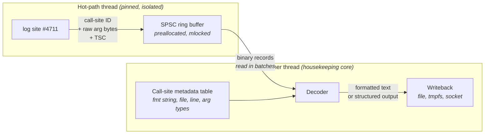
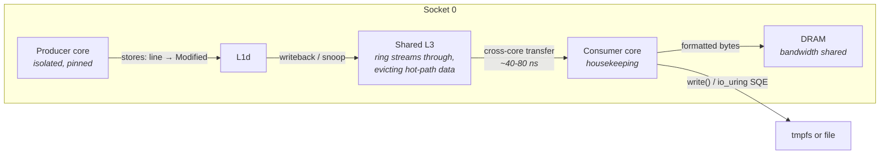
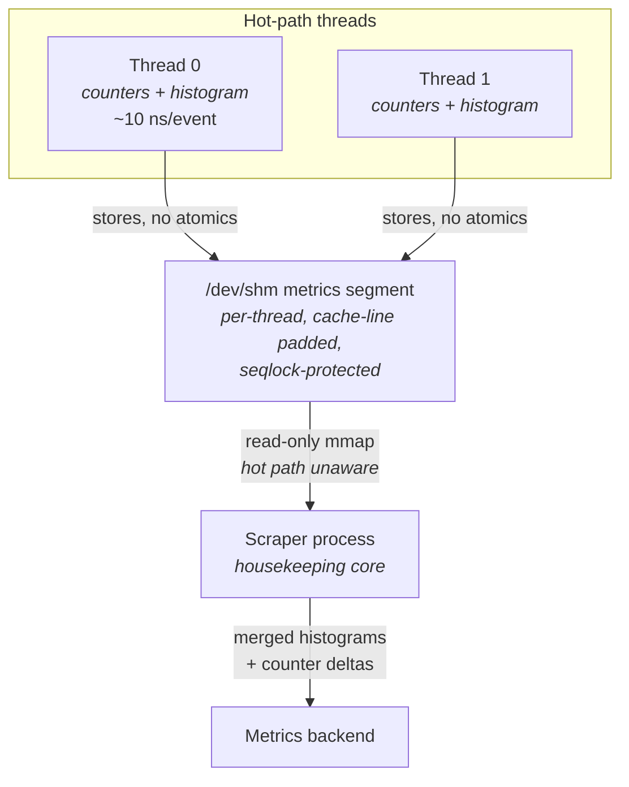
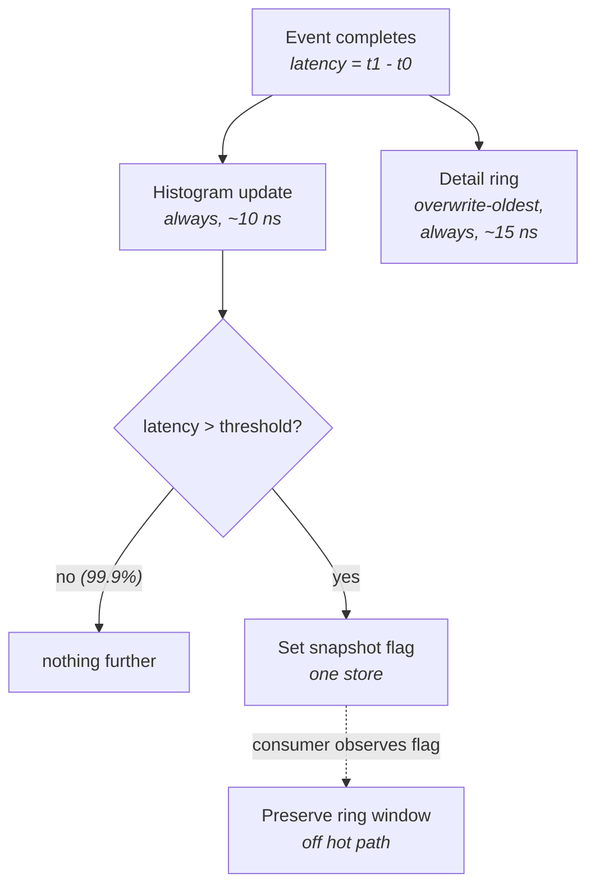
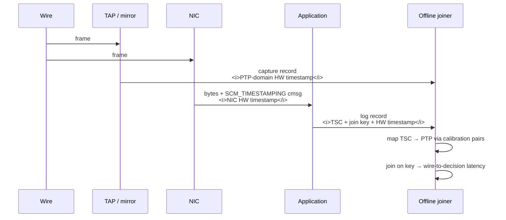
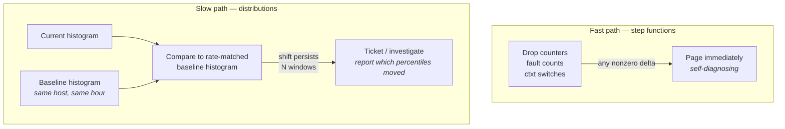

# Observability Without Slowing Down

You have written `log.info("order %d rejected: %s", id, reason)` a thousand times and never once
wondered what it cost. In a web service, the honest answer is "nobody can tell" — the request took
40 milliseconds, and the log line took 2 microseconds, so the log line is 0.005% of the request and
beneath notice. In a system whose entire budget from wire to wire is 2 microseconds, that same log
line *is* the budget. It does not slow the path down by a measurable percentage; it doubles it.

This is the tension the whole chapter is built around, and it has no clean resolution. You cannot
operate a system you cannot see. When latency degrades at 09:31:14 you need to know which stage
degraded, whether the input rate changed, whether a buffer overflowed, and whether the machine was
still tuned — and none of that is knowable unless something on the machine recorded it. But every
act of recording consumes time, cache, and memory bandwidth on the very path you are trying to
protect, and the recording is densest precisely when the system is busiest, which is precisely when
you can least afford it. Observability is not free and cannot be made free. It can only be made
*cheap, bounded, and predictable* — and the engineering discipline of this chapter is entirely about
those three words.

The strategy that makes it tractable is to separate three things that a conventional logging library
fuses into one call: **capturing** what happened, **formatting** it into something a human can read,
and **persisting** it somewhere durable. Capture is unavoidable and must happen on the hot path.
Formatting and persistence are not, and must not. Almost everything that follows — binary records,
ring buffers, off-path consumers, shared-memory metrics, tail-triggered capture, packet-trace replay
— is a specific application of that one split. Earlier chapters gave you the pieces: the I/O
mechanics of writing bytes to a file ("I/O Subsystems"), how to measure a latency distribution
honestly ("Measuring Correctly"), how to profile without instrumenting ("Profiling Tools and
Hardware Counters"), and how packet capture infrastructure is built ("Network Design and
Operations"). This chapter is the system design that assembles them into something you can run in
production for years.

## Logging That Costs Nanoseconds

Start by pricing the call you already know. When you invoke a conventional logging library with a
format string and a few arguments, a specific sequence of work happens synchronously on your thread,
before the call returns. It is worth walking through it item by item, because every item is a
mechanism this section will eventually remove.

First, the library reads a clock. If it is well written it uses the vDSO path for
`clock_gettime(CLOCK_REALTIME)`, which avoids a full syscall but still costs roughly 20–25 ns on a
modern x86 server, and reads a clock source that may or may not be the TSC depending on how the
machine is configured (see "Clocks, Timers, and Time"). Second, it checks whether this severity
level is enabled — cheap, a load and a branch, though a mispredicted branch on a cold path costs
more than you would guess (see "CPU Microarchitecture Essentials"). Third, and this is the expensive
part, it *formats*: it parses the format string character by character, and for each conversion
specifier it converts a binary value into decimal or hexadecimal digits. Integer-to-decimal
conversion is a division-heavy loop; floating point is worse. Then it copies the resulting characters
into a buffer, which may involve a heap allocation if the message does not fit a small stack buffer.
Fourth, it takes a lock, because the output stream is shared between threads and interleaved lines
are unreadable. Fifth, it appends to a buffer and, depending on flush policy, issues a `write`
syscall — and if the file is on real storage rather than tmpfs, that write may enter the page cache
and eventually the block layer, and if anyone configured `fsync` on every line, it waits for the
device.

Priced out on a modern x86 server, the cheap end of that sequence is a few hundred nanoseconds and
the expensive end is tens of microseconds. The *median* is not the problem. The problem is that the
distribution has no bounded upper end: the allocation can hit a slow path in the allocator, the lock
can be contended and fall through to a futex sleep costing microseconds of wakeup latency (see
"Synchronization and IPC"), the buffer can fill and force a flush, and the flush can hit a writeback
storm. A logging call is a syscall, an allocation, a lock, and an I/O operation wearing a trench
coat, and the hot path is supposed to contain none of those (see "Systematic Optimization").

| Stage of a naive `log.info()` | Typical cost | Tail behavior |
|---|---|---|
| `clock_gettime` via vDSO | ~20–25 ns | Bounded; the only genuinely necessary step |
| Parse format string, integer→decimal | ~100–500 ns | Bounded but large; scales with argument count |
| Allocate or grow the message buffer | ~20 ns fast path | **Unbounded** — allocator slow path |
| Acquire the shared stream lock | ~20 ns uncontended | **Unbounded** — futex sleep costs µs |
| `memcpy` into the stream buffer | tens of ns | Evicts hot-path data from L1 |
| `write()` syscall | ~1–5 µs | **Unbounded** — writeback throttling |

Every stage in that table except the clock read is removable, and removing them is what the rest of
this section does. Note which stages dominate and why they differ: formatting is expensive *on
average*, while the allocation, the lock, and the syscall are expensive *in the tail* — and the tail
is what a latency-critical system is actually spending its budget on.

### Deferred formatting: the central idea

Here is the observation that makes low-overhead logging possible. The formatted string is for a
human. No human is reading it at the moment it is produced — they are reading it minutes or hours
later, or never. So there is no reason to produce it at the moment of the event. All that is
genuinely required on the hot path is to record *enough information to reconstruct the message
later*, as cheaply as possible.

What does reconstruction actually require? Two things: the identity of the log statement, and the
values of its arguments. The format string itself is a compile-time constant — it does not change
between invocations, so it does not need to be copied, parsed, or transmitted at runtime. It needs
to be *identified*. Assign every log statement in the binary a small integer at build time, and emit
a side table mapping that integer to the format string, the source file, the line number, the
severity, and the types of the arguments. That table is static data; it can be embedded in the
binary or written once at startup. On the hot path, the "message" becomes a call-site ID plus the
raw, unformatted argument bytes.

The cost collapses. Recording a call-site ID and two 8-byte integers is a handful of stores into a
buffer you already own. There is no format-string parse, no decimal conversion, no allocation, no
lock if the buffer is per-thread, and no syscall. The whole operation is on the order of 10–30 ns on
a modern x86 server, and it is *bounded* — it consists of a fixed number of stores to memory that
you have arranged to be resident. Later, off the hot path, a consumer reads the raw record, looks up
the call-site ID in the side table, and does the expensive formatting work on a core that has nothing
better to do.

- **The metadata table is the load-bearing artifact**: it is what lets the hot path emit an integer
  where a naive logger emits a string.
- **The ring buffer is the only shared state** between the two halves, which is what keeps the hot
  path free of locks.
- **Everything expensive lives on the right-hand side of the ring**, where its cost is charged to a
  core you have deliberately sacrificed.

This architecture is not exotic; it is what the kernel's own tracing infrastructure does. `perf`
does not write text — it writes fixed-layout binary records into a memory-mapped ring buffer shared
with user space, and `perf report` does the decoding afterwards, resolving symbols and formatting
from side tables. `ftrace` does the same into per-CPU ring buffers under `/sys/kernel/tracing`, and
the human-readable rendering happens when you read `trace` or `trace_pipe`. If you are ever asked in
an interview to justify this design, the honest answer is that Linux's two flagship tracing systems
both arrived at it independently.

### What a binary record looks like

The record format is where the design either stays cheap or quietly becomes expensive again. The
constraints are: fixed-size fields wherever possible, so the producer can compute the write size
without branching; small total size, so a burst of logging does not blow out the cache; and
self-describing enough that a consumer can skip a record it does not understand.

A workable layout is a small fixed header followed by a payload of raw argument bytes:

| Field | Typical size | Purpose |
|---|---|---|
| Sequence number | 4–8 bytes | Monotonic per producer; a gap proves a drop occurred |
| Timestamp | 8 bytes | Raw TSC value, *not* converted to wall clock |
| Call-site ID | 2–4 bytes | Index into the static metadata table |
| Payload length | 2 bytes | Lets the consumer skip unknown records |
| Payload | 0–48 bytes typical | Raw argument values, in declaration order |

Three details in that table are doing more work than they appear to.

**The timestamp is a raw TSC value.** Converting the TSC to a wall-clock time requires knowing the
TSC frequency and an offset, and doing a multiply and a shift — cheap, but not free, and entirely
unnecessary on the hot path. Store the raw counter and convert on the consumer side. This also
preserves precision: the TSC ticks at a fixed rate on any machine with invariant TSC, so differences
between two raw values are exact, whereas differences between two converted values have accumulated
rounding. The consumer needs one calibration pair — a TSC value and a `CLOCK_REALTIME` value read
close together — to anchor the whole stream, and it should re-read that pair periodically to track
drift (see "Clocks, Timers, and Time").

**The sequence number makes loss visible.** This is the single most important field in the record
and the one most often omitted. A bounded buffer will eventually overflow, and when it does, the
records you lose are the ones from the busiest moment — the exact moment you are investigating. If
the producer increments a sequence number on every attempted write, including ones it drops, then
the consumer sees a gap and knows precisely how many records vanished and where. A logging system
that drops silently is worse than one that does not log at all, because it produces a plausible but
false narrative of the incident.

**The payload is raw bytes, not values with types.** The metadata table already knows that call site
4711 takes a 4-byte integer and an 8-byte pointer, so the record does not need to carry type tags.
This is what keeps records small. It also means the metadata table and the binary must stay in sync
— decoding a log stream with the wrong table produces garbage, not an error. In practice you embed a
build ID in the stream header and refuse to decode a mismatch (see "Build, Deploy, and Environment
Discipline").

### The string problem

Fixed-size arguments are easy. Strings are where deferred formatting gets genuinely hard, and it is
worth being precise about why, because this is the part an interviewer will push on.

If a log call takes a string argument, the naive move is to copy the string bytes into the record.
That reintroduces an unbounded `memcpy` on the hot path: the cost now depends on the string length,
which you may not control, and a long string can fill the remainder of the ring buffer by itself. The
alternative — storing a *pointer* to the string and letting the consumer read it later — is worse in
a different way: it is a use-after-free waiting to happen, because the consumer dereferences that
pointer milliseconds later, by which time the buffer may have been freed, reused, or overwritten
with the next message. This is the most common serious bug in hand-rolled deferred logging, and it
manifests as garbled log output during load spikes and nowhere else, because only under load is the
consumer far enough behind for the memory to have changed.

There are three defensible answers, and a real system usually uses all three:

- **String literals are pointers, safely.** A compile-time string constant lives in the binary's
  read-only data section for the process's whole lifetime. Storing its address is safe, and better,
  the address can be resolved to the actual text from the binary's symbol and rodata sections at
  decode time — so it can be stored as a small offset rather than a full pointer.
- **Dynamic strings are interned.** Maintain a table of strings seen before, mapped to small IDs.
  The hot path does a lookup (a hash and a compare — tens of nanoseconds) and stores the ID. This
  works well when the set of distinct strings is small and stable, which it usually is for
  identifiers and symbolic names, and badly when every string is unique.
- **Everything else is copied, with a hard bound.** Copy at most N bytes — 32 or 64 is typical —
  and set a truncation flag in the header. The cost is now bounded and known, and truncated output
  is honest about being truncated.

**Failure mode: log output is garbled or nonsensical, but only during bursts.** Symptom is records
whose text fields contain fragments of unrelated data, appearing only in high-rate windows. Cause is
a deferred record holding a pointer into a buffer that was reused before the consumer read it.
Confirm by checking whether the corrupted records cluster at times when the ring's occupancy was
high — which requires the producer to record occupancy, another reason to instrument the ring itself
— and by running the consumer with an artificial delay to reproduce it on demand.

**Failure mode: a single log statement is far more expensive than its siblings.** Symptom is a hot
path whose p99.9 spikes only when one particular code path executes. Cause is usually an argument
that is not cheap to capture: a long string being copied, or a value whose capture requires
dereferencing a cold pointer and taking a cache miss. Confirm by timing the log call itself with
paired TSC reads and building a per-call-site histogram of the *logging* cost — the observability
system must be able to observe itself.

### The ring buffer

The buffer between producer and consumer is a single-producer, single-consumer (SPSC) ring — the
structure covered mechanically in "Synchronization and IPC." What matters here is not the algorithm
but the *provisioning*, because a ring buffer that is correct and badly provisioned will still ruin
your tail latency.

The buffer must be allocated at startup, before the hot path begins, and every page of it must be
touched so that the kernel installs the mappings. Otherwise the first write to each new page takes a
minor page fault — roughly 1–3 µs on a modern x86 server — and those faults land on the hot path in
exactly the pattern of "the system was fine for the first few thousand messages and then got slow"
(see "Memory Management"). Following the touch, `mlock` or `mlockall(MCL_CURRENT | MCL_FUTURE)`
prevents the kernel reclaiming the pages under memory pressure, which would turn a later write into
a major fault costing milliseconds.

Size it in terms of *consumer stall tolerance*, not in terms of message volume. The question the
capacity answers is: how long can the consumer be unavailable before the producer starts dropping?
If the producer emits at most 200,000 records per second at 32 bytes each, that is 6.4 MB/s, and a
16 MB ring gives you about 2.5 seconds of consumer stall tolerance. Two and a half seconds sounds
absurdly generous until you remember what actually stalls a consumer: a page-cache writeback storm,
a scheduler decision to run something else, a stop-the-world pause in a runtime, or an operator
running `tar` on the log directory. Generous sizing is cheap; the memory is not on the hot path's
critical working set as long as the *write cursor* stays cache-resident, and it does, because writes
are sequential.

Where the buffer lives is a real decision:

| Placement | Mechanism | Trade-off |
|---|---|---|
| Process-private anonymous memory | `mmap` anonymous, `mlock` | Simplest; dies with the process, so a crash loses the last records |
| POSIX shared memory | A file under `/dev/shm` (tmpfs), `mmap`ed by both processes | Survives producer crash; consumer can be a separate process, restarted independently |
| Explicit huge pages | hugetlbfs mapping | Fewer TLB entries consumed by the ring itself; matters for large rings |
| A file on real storage, `mmap`ed | Page cache backed | Durable, but introduces writeback into the producer's address space — avoid |

`/dev/shm` is the standard choice for anything that must survive a crash, and it is worth
understanding what it actually is: a tmpfs mount, i.e. a filesystem backed by page cache with no
backing store. Files there are memory, addressed through the filesystem namespace. A file created in
`/dev/shm` and `mmap`ed by two processes gives you shared memory with a name, permissions, and a
lifetime independent of either process. If the trading process segfaults, the ring's contents are
still sitting in `/dev/shm` and the consumer — or a post-mortem tool — can drain it. That property
alone justifies the choice.

The caveat is that tmpfs pages are swappable by default. On a machine with swap enabled and memory
pressure, your log ring can be paged out, and the next write to it takes a major fault. On a
latency-critical host swap should be off entirely (see "Tuning a Linux Box for Determinism"), and
the ring should be `mlock`ed regardless.

**Try it:** look at the sizing decision the kernel already made for you. Run
`sudo cat /sys/kernel/tracing/buffer_size_kb` to see ftrace's per-CPU ring size (typically a few
thousand KiB per CPU), and `perf record -m 512 -e cycles -- sleep 1` to set perf's mmap buffer to 512
pages. Then deliberately undersize it: `perf record -m 1 -e cycles:P -F 100000 -- <busy workload>`
and watch for the "Check IO/CPU overload!" warning and the lost-event count in `perf report -D`.
That warning is the kernel telling you the producer outran the consumer — the same failure your own
ring will have, with the same cause.

**Try it:** create a ring by hand and confirm it is memory, not disk. `dd if=/dev/zero
of=/dev/shm/logring bs=1M count=64`, then `ls -l /dev/shm/logring` and `df -h /dev/shm`. Note that
the space came out of RAM. Then check the mount: `mount | grep /dev/shm` shows tmpfs, and its default
size is half of physical memory unless overridden.

### When the buffer fills

Bounded buffers fill. That is not a design flaw, it is the design: an unbounded buffer converts a
consumer stall into an out-of-memory kill, which is strictly worse. So the interesting question is
what the producer does at the moment it finds no free space, and there are exactly four answers.

| Policy | Producer behavior | Consequence |
|---|---|---|
| **Block** | Wait for space | The hot path is now coupled to the consumer's worst case. Never acceptable on a latency-critical path. |
| **Drop newest** | Discard the record, bump a drop counter | Bounded cost, but you lose the records from the peak of the incident |
| **Overwrite oldest** | Advance the read cursor, clobber unread data | Bounded cost; you keep the most recent history, lose the oldest. This is "flight recorder" mode. |
| **Grow** | Allocate more space | Allocation on the hot path — the thing you were avoiding. Unbounded memory. |

Block and grow are wrong for a hot path, unconditionally. The real choice is between drop-newest and
overwrite-oldest, and it is a choice about what you are logging *for*.

If the log is an audit trail — a record that must be complete for compliance or reconstruction —
drop-newest with a loud drop counter is correct, because you would rather have a gap you can point
at than silently rewritten history. If the log is a debugging aid whose purpose is to explain what
happened immediately before a fault, overwrite-oldest is correct, because when the fault occurs, the
last few thousand records are the only ones you want. That second mode is precisely `ftrace`'s
`overwrite` option — `/sys/kernel/tracing/options/overwrite`, on by default — combined with its
snapshot mechanism, where a trigger swaps the live buffer with a reserve buffer, freezing a window of
history at the instant something interesting happened. That pattern reappears in the metrics section
as tail-triggered capture, and it is one of the most useful ideas in this chapter.

**Failure mode: the log is complete right up until the interesting moment, then blank.** Symptom is
that the incident window has no records at all while the surrounding minutes are dense. Cause is a
drop-newest ring that filled during the burst. Confirm via the sequence-number gap in the decoded
stream and the producer's drop counter; if neither exists, add them before doing anything else.

**Failure mode: the hot path's p99.9 tracks disk activity on the box.** Symptom is latency outliers
correlated with unrelated I/O. Cause is a blocking or `mmap`-file-backed log buffer coupling the
producer to the writeback path. Confirm by watching `Dirty` and `Writeback` in `/proc/meminfo`
during the spikes, and by moving the ring to `/dev/shm` and re-measuring.

## Telemetry Off the Hot Path — and What It Still Costs

The previous section moved all the expensive work onto a consumer thread and declared victory. That
victory is real but partial, and the gap between "off the hot path" and "free" is where a lot of
production systems quietly lose a microsecond. It is worth being blunt about this: **a consumer
thread is not free, and calling telemetry "asynchronous" does not make its cost disappear — it moves
the cost to resources the hot path shares.**

Three resources are shared even between threads on different cores. The first is the **cache
coherence fabric**. When the producer stores a record into the ring, that cache line becomes
Modified in the producer's L1. When the consumer reads it, the coherence protocol must transfer
ownership: the consumer's read misses, snoops, finds the line Modified in another core's cache, and
pulls it across — a cross-core transfer costing on the order of 40–80 ns within a socket and
substantially more across sockets (see "Multicore, Coherence, and Memory Ordering"). Most of that
cost is paid by the consumer, which is fine. But the producer pays too, because the line it just
wrote is no longer exclusively its own, and the head/tail index variables are read and written by
both threads on every batch.

The second shared resource is the **last-level cache**. The ring buffer's data occupies L3, and L3
is shared across the socket. A 16 MB ring being written sequentially by the producer and read
sequentially by the consumer will stream through L3 continuously, evicting whatever the hot path had
resident there. The hot path's working set does not get smaller because you moved logging to another
thread; it gets *evicted more often*.

The third is **memory bandwidth**, and this is the one people underestimate. Chapter "Memory
Systems" established that memory latency degrades sharply as bandwidth utilization approaches
saturation — the hockey stick. A consumer thread that reads 6 MB/s from a ring, formats it into text
(expanding it 3–5×), and writes 25 MB/s to a file is not going to saturate a server's memory
bandwidth. But a consumer that is behind and catching up in a burst, or one that also compresses,
can push tens of gigabytes per second through the memory subsystem for short periods, and those are
exactly the periods when the hot path is busiest.

- **The L3 arrow is the cost most people miss** — it is not a data dependency, it is capacity
  pressure, and it shows up as an increased hot-path cache miss rate with no change to hot-path code.
- **The cross-core transfer arrow is where the index variables live**, and it is why head and tail
  must be on separate cache lines.

### Making the shared cost small

Four techniques reduce these costs, and each maps directly to one of the three shared resources.

**Separate and batch the cursors.** The producer's write index and the consumer's read index must
live on different cache lines, padded to 64 bytes, or every producer write invalidates the line the
consumer is polling and vice versa — classic false sharing, and it can cost more than the logging
itself (see "The Cache Hierarchy"). Beyond separation, each side should keep a *cached local copy* of
the other's index and only re-read the shared one when its local copy says the buffer is full or
empty. A producer that reads the consumer's index on every write pays a coherence miss on every log
call; one that reads it once per thousand writes pays it once per thousand.

**Batch the consumer's reads.** A consumer that wakes on every record pays a wakeup and a coherence
miss per record. A consumer that sleeps briefly and then drains everything available amortizes both
across hundreds of records, and gets better cache behavior because it walks memory sequentially. The
trade-off is added latency in the *visibility* of the log, which is almost never a real constraint —
you are not reading the log in real time.

**Consider non-temporal stores, carefully.** The producer can write records using non-temporal
(streaming) stores, which bypass the cache hierarchy and write to memory through write-combining
buffers, avoiding L3 pollution entirely. This sounds ideal and is sometimes wrong: the consumer must
then fetch the data from DRAM rather than from L3, which is slower for the consumer and consumes
more memory bandwidth. It is a good trade when the ring is large and the consumer is far behind (the
data would have been evicted anyway), and a bad trade when the ring is small and the consumer is
close behind (the data would have been an L3 hit). Measure rather than assume; this is genuinely
workload-dependent.

**Place the consumer deliberately.** Three placement rules, in descending order of how badly you
will regret violating them:

- **Never on an SMT sibling of a hot-path core.** Simultaneous multithreading shares the L1, the
  execution ports, and the frontend between siblings. A consumer thread doing string formatting on
  your hot core's sibling is competing for L1d capacity and issue slots with the code you care most
  about, and can cost more than 20% of hot-path throughput (see "Multicore, Coherence, and Memory
  Ordering"). If SMT is enabled at all on the box, the sibling of an isolated core must be idle or
  isolated too.
- **Same NUMA node as the producer.** A ring written on node 0 and read on node 1 sends every cache
  line across the inter-socket interconnect, roughly doubling the transfer cost and adding
  interconnect traffic that competes with the NIC's DMA (see "Memory Systems").
- **On a housekeeping core, not an isolated one.** The whole point of `isolcpus` and `nohz_full` is
  that the isolated cores run one thread and nothing else. The consumer belongs with the other
  background work (see "Tuning a Linux Box for Determinism").

**Failure mode: hot-path cache miss rate rises when logging is enabled, even though logging runs on
another core.** Symptom is `perf stat -e cache-misses,LLC-load-misses` on the hot-path thread showing
a step increase with no code change on that path. Cause is L3 capacity pressure from the ring
streaming through the shared cache. Confirm by shrinking the ring, or by measuring with the consumer
paused; a large delta implicates the consumer.

**Failure mode: the producer's log call is sometimes 10× its median cost.** Symptom is a bimodal
distribution of logging cost with the slow mode clustered in time. Cause is usually false sharing on
the ring's index variables or on a shared drop counter. Confirm with `perf c2c record` followed by
`perf c2c report`, which identifies cache lines with heavy HITM (hit-modified) traffic and attributes
them to specific data addresses and offsets. A line showing both producer and consumer accesses at
different offsets is a padding bug.

**Try it:** measure the SMT tax directly. Pin your hot-path benchmark to a core, record its p50 and
p99, then pin a busy loop to that core's SMT sibling and re-measure. Find the sibling with
`cat /sys/devices/system/cpu/cpu<N>/topology/thread_siblings_list`. The degradation you see is what
a carelessly placed telemetry thread would cost you.

### The writeback path

Once the consumer has formatted its output, it has to put it somewhere, and this is where the
consumer can stall for a long time. A stalled consumer does not directly hurt the hot path — that is
the entire benefit of the decoupling — but it consumes the ring's slack, and once the ring fills the
hot path starts dropping. So the consumer's tail latency becomes the ring's sizing requirement.

The default path, a buffered `write` to a file, is fast in the common case and unbounded in the tail.
Data is copied into the page cache and the syscall returns; the kernel writes it out later. The
problem is *later*. Linux tracks the fraction of memory that is dirty, and when it exceeds
`vm.dirty_ratio` (a percentage of available memory, commonly 20 by default), the writing process is
forced to do writeback synchronously — it is *throttled*, blocking in `write` until pages are
cleaned. On a machine whose log volume is high or whose disk is slow, this converts a routine write
into a multi-hundred-millisecond stall.

Three approaches keep the consumer's tail bounded:

- **Write to tmpfs and let something else move it.** Writing to `/dev/shm` or another tmpfs mount is
  a memory copy with no block device involved, so the tail is short. A separate, entirely
  unprivileged process ships the files elsewhere on its own schedule. The cost is RAM, and the risk
  is filling it — cap the mount size and rotate aggressively.
- **Use `io_uring` for asynchronous writeback.** Submit writes to a submission queue and reap
  completions later, so the consumer never blocks in a syscall (see "I/O Subsystems"). With
  `IORING_SETUP_SQPOLL`, a kernel thread polls the submission queue and the consumer does not issue a
  syscall at all for submission. This is the modern answer, and it keeps the consumer's own loop
  bounded even when the storage is slow.
- **Use direct I/O to bypass the page cache.** `O_DIRECT` writes go to the device without dirtying
  page cache, which eliminates writeback throttling entirely, at the cost of strict alignment
  requirements on buffer address, offset, and length, and no read caching. Reasonable for a
  high-volume append-only log; overkill for most.

**Failure mode: log drops occur in bursts every few tens of seconds, with no corresponding burst in
the hot path.** Symptom is periodic ring overflow on an otherwise steady workload. Cause is
writeback throttling stalling the consumer. Confirm by sampling `/proc/meminfo` — `Dirty` climbing
toward a threshold and then collapsing, with `Writeback` spiking — and by checking
`/proc/pressure/io`, whose `full` line reports the fraction of time all tasks were stalled on I/O.
The fix is `io_uring`, tmpfs, or lowering `vm.dirty_background_ratio` so background writeback starts
earlier and the synchronous threshold is never reached.

**Failure mode: the consumer keeps up on average but falls behind for seconds at a time.** Symptom
is ring occupancy sawtoothing to full. Cause is often that the consumer is not pinned at all and is
being migrated or descheduled. Confirm by reading `nonvoluntary_ctxt_switches` from
`/proc/<pid>/status` for the consumer thread; a high and rising count means the scheduler is
preempting it, and the fix is a pin plus, if necessary, a real-time scheduling class (see
"Processes, Threads, and Scheduling").

### Instrumenting nothing at all

Everything so far assumes you have modified the program to emit records. There is an entirely
different strategy that costs the hot path nothing when disabled and very little when enabled: let
the kernel do the observing.

`ftrace` and eBPF-based tools like `bpftrace` attach probes to kernel functions, tracepoints, and —
via uprobes and USDT (user statically-defined tracing) markers — to user-space code, and write
results into their own kernel ring buffers. When a probe is not attached, the cost is a `nop`
instruction (for statically patched sites) or nothing at all (for tracepoints). When it is attached,
the cost is the probe's own work plus the trap into the handler — for a uprobe that is on the order
of a microsecond, which is too expensive for a per-packet hot path, but for a kernel tracepoint or a
kprobe on a rare event it is far cheaper. Aggregating *inside* the kernel — `bpftrace`'s `hist()`
and `count()` build the histogram in a BPF map rather than emitting one record per event — removes
the per-event transfer cost entirely (see "Profiling Tools and Hardware Counters").

The strategic point for chapter purposes is this: **the cheapest instrumentation is the
instrumentation you do not ship.** For anything that is not needed continuously — "how long does this
syscall take", "what is the distribution of wakeup latency on this core", "which function is
faulting" — a `bpftrace` one-liner run for thirty seconds during an investigation beats a permanent
counter in the hot path. Reserve in-process instrumentation for the things you need on every event,
forever.

**Try it:** get a latency histogram of a kernel path with zero application changes.
`sudo bpftrace -e 'kprobe:vfs_write { @start[tid] = nsecs; } kretprobe:vfs_write /@start[tid]/
{ @us = hist((nsecs - @start[tid]) / 1000); delete(@start[tid]); }'` and let it run for a few
seconds. Note that the histogram is built in kernel memory and printed once at exit — no per-event
record crosses to user space. That aggregation-at-the-source design is exactly what the next section
argues for.

## Counters, Histograms, and the Sampling Trap

Logs answer "what happened at this instant." Metrics answer "what is the system doing, in
aggregate, right now." They have completely different cost profiles, and the reason is that a metric
is a *fold*: many events collapse into one number, so the per-event cost can be tiny and the storage
cost is constant regardless of event rate.

The cheapest metric is a **counter**: a monotonically increasing integer that something increments.
If the counter is thread-local and its cache line is in the incrementing core's L1 in Modified state,
the increment is a load, an add, and a store — a couple of cycles, effectively free. If the counter
is shared between threads and incremented atomically, the cost is entirely different: an atomic
read-modify-write requires exclusive ownership of the line, so under contention every increment
drags the line across the coherence fabric, costing 40–80 ns within a socket and serializing the
threads that share it. The distinction between "a counter costs 2 cycles" and "a counter costs 80 ns
and serializes four threads" is purely a question of whether it is shared, and it is the first thing
to get right.

A **gauge** — an instantaneous value like queue depth or buffer occupancy — is the same cost as a
counter, a single store. A **histogram** is where the interesting design happens, because a
histogram is the only metric type that preserves a distribution, and distributions are what latency
work is about. Chapter "Measuring Correctly" made the case that averages are useless for latency
because the mean of a bimodal distribution describes neither mode. The operational consequence is
that the hot path must record something from which percentiles can be recovered — and that means a
histogram, updated on every event.

The mechanics of a histogram update are: take the measured value, compute a bucket index, increment
that bucket. Everything depends on how cheap the index computation is. Fixed linear buckets (bucket
= value / width) require a division, or a multiply-and-shift if the width is a constant. Logarithmic
buckets — the right shape for latency, because you want fine resolution at 1 µs and coarse resolution
at 1 ms — can be computed with a leading-zero count instruction plus a shift and a mask, taking a few
cycles. The standard scheme, used by HDR-style histograms, splits the value into an exponent (found
by bit-scanning for the highest set bit) and a mantissa (the next few bits), giving constant relative
precision across many orders of magnitude. Practically: **a histogram update is a bit-scan, a shift,
a mask, an add, and a store — under 10 ns on a modern x86 server, with no branches and no allocation.**

That number is the crux of the entire section. A histogram update is cheap enough to do on every
single event. Which means you never have to sample latency.

### Aggregation placement

Where the fold happens determines what it costs and what you can recover later.

| Placement | Hot-path cost | What you keep | What you lose |
|---|---|---|---|
| **In the hot-path thread**, per-thread histogram | ~10 ns per event | Full distribution per thread | Correlation with individual events |
| **In the consumer**, from raw event records | ~15 ns per event (ring write) | Everything — can re-fold any way later | Higher bandwidth; ring capacity is the limit |
| **In the scraper**, from a shared-memory snapshot | Zero on the hot path | Whatever the producer chose to keep | Anything the producer discarded |
| **Off-host**, in a metrics backend | Zero on the hot path | Cross-host views | Resolution — network scrapes are per-second at best |

The right architecture uses all of these in layers, and the layering has a simple logic: **fold as
early as possible for the things you need always, and as late as possible for the things you need
rarely.** Latency histograms and event counters are needed always, so fold them in the hot-path
thread. Individual event details are needed rarely, so ship them raw through the ring and let the
consumer decide.

Per-thread state is what makes the early fold cheap. Give every hot-path thread its own copy of every
counter and histogram, each padded so that no two threads' state shares a cache line. The threads
never coordinate, so there is no coherence traffic and no atomic. An aggregator — the scraper —
periodically reads all of them and sums. That sum is slightly inconsistent, because the threads are
still running while it reads, but the inconsistency is bounded by one scrape interval's worth of
events and is irrelevant for every use metrics have.

Making the scrape itself safe is a small but important detail. The scraper needs a consistent
snapshot of a multi-word structure that the producer is updating without locks. The standard
technique is a **seqlock**: the producer increments a sequence number before it starts writing and
again after it finishes, so the number is odd while a write is in progress. The reader records the
sequence, reads the data, re-reads the sequence, and retries if it changed or was odd. The producer
never blocks and never waits for the reader — its cost is two extra stores. That property is
essential: **the scrape must be invisible to the hot path**, and a design where the scraper takes a
lock the producer also takes fails that test catastrophically, because now an external monitoring
system can stall your trading path.

Put the whole metrics block in a shared-memory segment under `/dev/shm`, mapped read-only by the
scraper. The hot-path process does not know or care that scraping happens; it has no socket, no
handler thread, and no HTTP endpoint. If the process dies, the metrics block is still there with its
final values — often the single most useful artifact in a post-mortem.

- **The read-only mapping is the guarantee**: the scraper cannot perturb, lock, or corrupt the
  producer's state, so a misbehaving monitoring agent cannot become a latency incident.
- **The per-thread split is what removes atomics** from the increment path.

**Failure mode: adding a counter to the hot path costs far more than a few cycles.** Symptom is a
measurable latency increase from what should be a single increment. Cause is false sharing — the new
counter landed on a cache line another thread writes. Confirm with `perf c2c report`, which will show
the line with HITM traffic and the byte offsets each core touches. Fix by padding to 64 bytes.

**Failure mode: the worst latencies never appear in the histogram.** Symptom is a histogram whose
top bucket is populated but whose reported maximum is exactly the top bucket's boundary. Cause is
clamping: values above the histogram's range are silently folded into the last bucket, so a 50 ms
outlier and a 10 ms outlier are indistinguishable. Confirm by tracking a separate running maximum
alongside the histogram — one compare and a conditional store — and comparing it to the top bucket
boundary. If they are equal, your range is too small.

### Why sampling hides the tail

Now the trap. When people worry about instrumentation cost, the reflex is to sample: record one
event in a thousand instead of all of them. For CPU profiling this is exactly right — `perf record`
samples at a few thousand hertz, and because the question is "where does time go on average," a
random sample answers it perfectly with negligible overhead (see "Profiling Tools and Hardware
Counters").

For latency measurement it is exactly wrong, and the reason is worth internalizing because it comes
up constantly. The tail is, by definition, the rare part of the distribution. If you sample one event
in a thousand, you see one event in a thousand *from every part of the distribution* — including the
tail. Consider what that means concretely. Suppose the system processes a million events per minute,
and one in ten thousand of them takes 500 µs while the rest take 3 µs. In an unsampled histogram,
that is 100 events per minute in the slow region: unmistakable, well-populated, and trackable
minute over minute. Sample at one in a thousand, and you now expect *one tenth of one event per
minute* in that region. Some minutes you see one; most minutes you see none. The tail has not gone
away — you have just built a measurement system that cannot see it.

The asymmetry is stark: sampling reduces your cost by a factor of a thousand and reduces your
statistical resolution *at the tail* by the same factor, at a place in the distribution where you had
very little resolution to spare. And since a histogram update costs under 10 ns while the sampling
decision itself costs a random number generation and a branch — plausibly comparable — sampling the
latency measurement often saves nothing at all.

The correct architecture separates the two questions:

- **"How bad is the tail?"** — answered by an always-on, never-sampled histogram. Cheap, constant
  cost, complete coverage.
- **"Why was that one event slow?"** — answered by detailed capture, which is expensive and
  therefore must be conditional. Do not sample it randomly; **trigger it on the tail itself.**

Tail-triggered capture is the pattern that resolves the tension. Keep a ring of detailed records in
overwrite-oldest mode, so the last few thousand events' worth of detail is always in memory at
constant cost. Measure every event's latency into the histogram. When an event exceeds a threshold —
say the current p99.9 — set a flag that tells the consumer to snapshot and preserve the ring instead
of overwriting it. You now have full detail for exactly the events you care about and no detail for
the 99.9% that are uninteresting, which is the correct allocation of a fixed observability budget.
This is structurally the same mechanism as `ftrace`'s snapshot buffer
(`/sys/kernel/tracing/snapshot`), which exists for precisely this reason.

- **The hot path's cost is identical for slow and fast events** except for one store, so the
  measurement does not distort the thing being measured.
- **The preserve step happens entirely on the consumer**, so an incident that produces many triggers
  cannot itself become the latency problem.

**Failure mode: p99.9 is reported but is pure noise.** Symptom is a p99.9 that swings by 3× between
adjacent one-minute windows with no corresponding change in anything else. Cause is too few events
above the percentile in each window — with 60,000 events per minute, p99.9 is determined by about 60
observations, and with sampling it may be determined by none. Confirm by plotting the *count* of
events in the tail buckets alongside the percentile; if the count is in single digits, the percentile
is not a measurement. Widen the window or stop sampling.

**Failure mode: percentiles from multiple hosts are averaged and the result is meaningless.**
Symptom is a fleet dashboard whose p99 is lower than several individual hosts' p99. Cause is
averaging percentiles, which is not a valid operation — the percentile of a combined population is
not the average of the populations' percentiles. Confirm by comparing against a percentile computed
from merged raw histograms. The fix is architectural: ship *histograms*, not percentiles, and merge
them (bucket-wise addition) before extracting any percentile.

**Try it:** demonstrate the sampling trap with a tool you already have. Run
`sudo bpftrace -e 'tracepoint:syscalls:sys_enter_write { @ = hist(args.count); }'` for thirty seconds
on a busy box, and note how populated the extreme buckets are. Then add a sampling filter —
`/ (nsecs % 100) == 0 /` — and re-run for the same duration. The bulk of the distribution looks
identical; the extreme buckets are empty or single-count. That difference is your tail.

**Try it:** check what your own histogram's resolution costs. A histogram with an exponent-plus-
3-bit-mantissa layout covering 1 ns to 10 s needs roughly 250–300 buckets; at 8 bytes per bucket that
is about 2.4 KiB, comfortably L1-resident. Widen the mantissa to 6 bits and it is roughly 2,000
buckets and 16 KiB — larger than a typical 32 KiB L1d can spare alongside your working set. Measure
your hot path's L1 miss rate with `perf stat -e L1-dcache-load-misses` at both resolutions; the
histogram is data too, and it competes.

## The Ground Truth on the Wire

Everything recorded so far is the system's account of itself. That account is written by the same
code whose behavior is in question, using the same clock, on the same host, and it stops the instant
the process dies. When a system misbehaves in a way you do not understand, self-reporting is exactly
the evidence you should trust least — not because it lies, but because the failure may be in the very
layer doing the reporting. If a packet arrived and your application never logged it, the application's
log cannot tell you whether the packet was dropped by the NIC, the kernel, the socket buffer, or your
own code.

The packet capture is different in kind. A tap or mirror port produces a record of what actually
crossed the wire, timestamped by hardware, generated by equipment that is not your process and does
not fail when your process does. It is the only observation in the whole system that is genuinely
independent of the thing being observed. The physical and architectural details of getting it —
SPAN ports versus passive optical taps, packet brokers, nanosecond-resolution capture appliances —
are covered in "Network Design and Operations," and reading a trace by hand is in "Network Debugging
Toolkit." What belongs here is the *system design*: how the capture is retained, how it is joined to
in-process records, and how it is turned into a reproducible replay.

The retention problem is arithmetic. A 10 GbE link at 50% utilization carries about 625 MB/s, which
is 2.25 TB per hour, per direction, per link. You cannot keep that indefinitely and you should not
try. The standard architecture is a **rolling capture with a preservation trigger**: the capture
appliance or host writes into a fixed-size circular store holding some hours of traffic, continuously
overwriting the oldest — the same flight-recorder pattern as the log ring, one layer down — and an
external trigger causes a time window around an event of interest to be extracted and archived
before it is overwritten. Everything therefore depends on the trigger firing within the retention
window, which sets a hard requirement on how fast your alerting must notice a problem. If retention
is four hours and your regression detection takes six, you will never have the trace.

### Joining the wire to the process

A packet capture with nanosecond hardware timestamps and an application log with TSC timestamps are
two clocks in two domains, and correlating them is the practical skill this section exists to teach.

Two problems must be solved. The first is a **common time base**. The capture device timestamps in
its own clock, which on a properly built system is disciplined by PTP (Precision Time Protocol,
IEEE 1588) from a grandmaster, typically GPS-backed. The application's TSC is a free-running counter
with an arbitrary origin. To relate them, the application needs at least one packet for which it
knows *both* a hardware timestamp in the PTP domain and a TSC value. `SO_TIMESTAMPING` provides
exactly this: enabled on a socket, it delivers per-packet timestamps as ancillary data alongside the
received bytes, and with `SOF_TIMESTAMPING_RX_HARDWARE` those timestamps come from the NIC's own
clock (see "The Linux Networking Stack"). If the NIC's PTP hardware clock is disciplined to the same
grandmaster as the capture device, then reading the hardware timestamp and the TSC on the same packet
gives you a calibration pair. Do it periodically — once a second is ample — and you have a running
mapping that tracks drift.

The second problem is **identifying the same packet in both records**. Timestamps alone are not
enough, because the whole point is that you do not yet trust the timestamps. You need a join key
carried in the data. For a multicast market data feed the sequence number in the payload is the
natural key, and it is already parsed by the receiving code. For request/response traffic, the
TCP sequence number plus the connection 5-tuple identifies a byte range uniquely within a connection.
Failing both, a hash of the first N payload bytes works. Whatever the key, the discipline is to
*record it in the in-process log record*, so the join is a lookup rather than a guess.

- **The joiner needs three timestamps per event** — the tap's, the NIC's, and the application's TSC —
  and the difference between the first two is the time the packet spent between the tap point and the
  NIC, which is a network measurement your application cannot make alone.
- **The calibration mapping is what makes the TSC comparable**, and it must be refreshed because
  the TSC and the PTP clock drift relative to one another.

The payoff is a genuine wire-to-decision latency measurement, decomposed by stage: tap to NIC (cable
and switch), NIC to application (driver, kernel or bypass stack, scheduling), application in to
application out (your code). Each of those is attributable to a different team and a different fix,
and without the join you cannot tell them apart. This is the production form of the wire-to-wire
measurement discussed in "Measuring Correctly."

**Failure mode: the capture has gaps exactly during the incident.** Symptom is a trace that thins out
or stops during the microsecond-scale burst you are investigating. Cause is capture-side drops — the
capture host's kernel could not keep up. Confirm from `tcpdump`'s own summary line, which reports
"N packets dropped by kernel", and from `/proc/net/dev` and `ethtool -S <iface>` drop counters on the
capture interface. The fix is a larger capture buffer (`tcpdump -B <KiB>`), a dedicated capture NIC
with hardware timestamping, or a purpose-built appliance — a general-purpose host doing `tcpdump` on
a 10 GbE mirror will drop under microburst, which is precisely when you need it (see "Network Design
and Operations").

**Failure mode: correlated timestamps disagree by a constant offset of tens or hundreds of
microseconds.** Symptom is a computed "wire to application" latency that is negative, or implausibly
large, and consistently so. Cause is that the two clocks are in different domains — the NIC's PTP
clock is not disciplined, or is disciplined to a different grandmaster than the capture device.
Confirm with `ethtool -T <iface>` to verify the NIC actually supports hardware receive timestamping
and reports a PTP hardware clock index, and check the PTP daemon's own offset reporting. A constant
offset is a clock domain bug; a *varying* one is a drift or discipline bug.

**Try it:** verify your capture path's timestamping capability before you need it. Run
`ethtool -T <iface>` and look for `hardware-receive` in the receive-timestamp capabilities and a
`PTP Hardware Clock` index other than none. Then capture with nanosecond precision and adapter
timestamps: `sudo tcpdump -i <iface> --time-stamp-precision=nano -j adapter_unsynced -w /tmp/cap.pcap
-c 1000`, and confirm with `tcpdump -r /tmp/cap.pcap --time-stamp-precision=nano -tt` that the
fractional seconds have nine digits and are not all zeros in the last three. If they are, you are
getting software timestamps and your correlation resolution is microseconds, not nanoseconds.

### Deterministic replay

A capture is not only evidence; it is an input. If you can feed the captured packets back into the
binary in an offline harness, you get something production can never give you: **the ability to run
the failing scenario under a debugger, a profiler, or a sanitizer, as many times as you like.** In
production you cannot attach `gdb` to a latency-critical process, you cannot run it under a memory
checker that slows it 30×, and you get one shot at every incident. In replay you can do all of it.

The requirement that makes this work is determinism: the same input must produce the same execution
every time, or the bug you are chasing may not reappear and the fix you make may not be verifiable.
Achieving determinism is mostly a matter of enumerating the ways a program can depend on something
other than its input, and removing each:

| Non-determinism source | Effect on replay | Architectural fix |
|---|---|---|
| Reading the wall clock or TSC | Timestamps differ, timeout branches differ | Abstract the clock; in replay mode return the captured packet's timestamp |
| Thread interleaving | Different orderings each run | Single-threaded replay mode, or record and replay the ordering |
| Address-space layout randomization | Pointer values, hash ordering by address differ | Disable ASLR for replay (`setarch -R`) |
| Hash iteration order seeded by address or time | Different traversal orders | Seed deterministically |
| Random number generation | Any sampling decision differs | Fixed seed in replay |
| Uninitialized memory | Garbage differs per run | This is a bug; a sanitizer will find it during replay |
| External I/O (files, other sockets) | Different responses | Record responses in the capture; stub them in replay |

The clock abstraction is the one worth designing for from the start, because retrofitting it is
painful. Every read of time in the application goes through a single interface. In production it
reads the TSC. In replay it returns the timestamp attached to the packet currently being processed,
so the program's notion of "now" advances exactly as it did in production, and any logic conditioned
on elapsed time behaves identically. This also gives you a free capability: replay at arbitrary
speed. Feed packets as fast as the CPU allows for a fast functional test, or pace them to their
original inter-arrival times to reproduce a timing-dependent problem such as a buffer filling.

Replay serves two distinct purposes and it is useful to keep them separate:

- **Functional replay** answers "does the code do the right thing given this input" — run it as fast
  as possible, under sanitizers, with assertions on.
- **Performance replay** answers "how long does the code take on this input" — run it pinned,
  isolated, tuned exactly like production, with pacing preserved, and compare the resulting latency
  histogram against a baseline. This is the mechanism behind continuous performance regression
  testing (see "Build, Deploy, and Environment Discipline"), and it is far more trustworthy than a
  synthetic benchmark because the input is a real production burst with all its real irregularity.

**Failure mode: replay does not reproduce the production behavior.** Symptom is that the captured
input runs cleanly offline while the same traffic caused a fault in production. Cause is an
un-enumerated non-determinism source, most often a wall-clock read that was not routed through the
clock abstraction or a second thread whose interleaving differed. Confirm by running the replay twice
and diffing the output: if two replays of the same input differ from *each other*, the harness is not
deterministic yet and reproducing production is hopeless. That self-consistency check should be the
first thing a replay harness does.

**Failure mode: performance replay shows a regression that production does not have, or vice
versa.** Cause is environmental drift between the replay host and production — different BIOS
settings, frequency scaling enabled, THP defaults, different core isolation. Confirm by running the
same drift-detection checks on both hosts (see "Build, Deploy, and Environment Discipline"); replay
is only a performance oracle if the machine underneath it matches.

## Alerting on Latency Regressions

The last problem is the hardest, and it is not a measurement problem — it is a decision problem. You
have histograms from every host and every stage. Something has to look at them and decide, without a
human, whether today's numbers are worse than yesterday's in a way that warrants waking someone.
Getting this wrong in either direction is expensive: an alert that fires on noise gets muted within a
week and then never fires when it matters, and an alert that only fires on catastrophes misses the
slow degradations that are the actual failure mode of a tuned system.

Start with what not to do. **Do not alert on the mean.** A system that normally runs at 3 µs and
begins taking 500 µs for one event in a thousand has moved its mean by half a microsecond — a 17%
change that looks like noise on a graph and would not trip any sane threshold. Meanwhile its p99.9
has gone from 5 µs to 500 µs, a hundredfold degradation that matters enormously. The mean is
structurally incapable of seeing tail regressions, which are the only regressions worth alerting on
(see "Measuring Correctly").

So alert on percentiles. But percentiles bring their own difficulty: **a percentile computed from few
observations is not a stable quantity.** If you evaluate p99.9 over a one-minute window containing
60,000 events, the value is determined by roughly the worst 60 of them, and the worst 60 events in a
minute are subject to every scheduling accident, interrupt, and cache eviction on the box. Adjacent
windows will differ substantially with nothing actually wrong. Threshold that quantity directly and
you get an alert that fires several times an hour on a healthy system.

There is a genuine, unavoidable trade-off here, and stating it clearly is most of the answer:
**the longer the window, the more stable the percentile and the slower the detection.** A one-minute
p99.9 is fast and noisy; a one-hour p99.9 is stable and tells you about a regression an hour after it
started. There is no configuration that gives you both, so the design must use different mechanisms
for fast detection and for regression detection.

### Making the comparison meaningful

Four techniques turn a noisy percentile into a signal you can threshold.

**Compare against a matched baseline, not a fixed number.** A constant threshold is wrong because the
correct value depends on the machine, the software version, the time of day, and the traffic mix.
Instead keep a baseline histogram — the same host, the same time of day, from a known-good period —
and compare the current window's histogram against it. A regression is a *shift*, and shifts are
detectable at smaller magnitudes than absolute thresholds are.

**Condition on load.** Latency is a function of arrival rate; every queue in the system says so.
An alert that ignores rate will fire on every burst, because during a burst latency genuinely and
correctly rises. Bucket observations by message rate and compare like with like: this window's p99 at
80,000 messages/second against the baseline's p99 at 80,000 messages/second. This one change removes
most false positives in practice.

**Require persistence.** A regression that is real does not go away in the next window. Requiring the
shift to hold for N consecutive windows converts an alert that fires on any single unlucky window
into one that fires only on sustained change, at the cost of N windows of detection delay. This is
the cheapest noise reduction available and it should be the default.

**Look at the shape, not one number.** Real regressions have signatures. A change that moves p50,
p99, and p99.9 together by a similar factor is usually a systemic change — a clock frequency drop, a
different code path, more work per event. A change that moves only p99.9 while p50 is untouched is
usually an interference source — a new background process, an interrupt landing on the wrong core,
memory reclaim. Alerting on two or three percentiles and reporting which moved gives the responder a
diagnosis along with the alarm.

### Alert on the causes, not just the symptom

The most useful practical insight in this whole section is that **percentile drift is a bad alerting
signal compared to the counters that predict it.** A percentile is a statistical estimate that
requires windows, baselines, and persistence rules. A drop counter is an integer that was zero and is
now not zero. Step functions are trivially alertable; distributions are not.

Nearly everything that damages tail latency also increments some counter first. Alerting on those
counters gives you a signal that is immediate, unambiguous, and diagnostic:

| Signal | Where to read it | What it predicts |
|---|---|---|
| NIC receive drops, ring overruns | `ethtool -S <iface>` (`rx_dropped`, `rx_missed_errors`, names vary by driver) | Packets lost before your process saw them |
| Socket receive buffer overflow | `nstat -az` / `/proc/net/snmp` (`UdpRcvbufErrors`, `TcpExtListenDrops`) | Burst exceeded receive buffer sizing |
| Log/telemetry ring drops | Your own drop counter and sequence gaps | Observability itself is failing — read this first in any incident |
| Page faults | `/proc/<pid>/stat` fields 10 and 12; `ps -o min_flt,maj_flt` | Memory not pre-faulted or locked; any major fault is a defect |
| Involuntary context switches | `nonvoluntary_ctxt_switches` in `/proc/<pid>/status` | Something is preempting a supposedly isolated thread |
| Interrupts on isolated cores | Per-CPU columns of `/proc/interrupts` | IRQ affinity drifted or a shootdown source appeared |
| Frequency / throttling | `/proc/cpuinfo` MHz, `/sys/devices/system/cpu/cpu*/cpufreq/scaling_cur_freq`, `MSR`-based thermal status | Power management re-enabled, or thermal event |
| Stall pressure | `/proc/pressure/{cpu,io,memory}` | Resource contention that has not yet become a latency spike |

Each of these is a step function on a healthy machine: it sits at zero or at a stable value and then
changes. That makes the alerting rule trivial — alert on any nonzero delta — and the alert
self-diagnosing, because the counter names the subsystem. The percentile alert then becomes the
backstop for regressions that do not trip any counter, which is a much smaller and more manageable
set.

- **The two paths have different urgency and different evidence quality**, and merging them into one
  alerting rule produces something that is both noisy and slow.
- **The baseline node is why the slow path works at all** — an absolute threshold on p99.9 does not
  survive a hardware refresh or a traffic mix change.

### The alerting system must not become the incident

Two operational hazards recur often enough to design against explicitly.

The first is that the observability pipeline throttles itself exactly when the system is in trouble.
`systemd-journald` is the canonical example and it is worth knowing by name: it applies rate limiting
per service, governed by `RateLimitIntervalSec` and `RateLimitBurst` in
`/etc/systemd/journald.conf`, defaulting to 10,000 messages per 30 seconds. Exceed it and journald
drops the excess and logs a "Suppressed N messages" note. A process that starts emitting errors
during an incident will hit that limit within seconds, and the record of the incident's *middle* —
usually the informative part — will not exist. The same class of problem applies to any metrics agent
with a queue, any log shipper with a rate cap, and any alerting system with a deduplication window.
The rule is: **know every rate limit between your process and your eyes, and either raise it or
account for it.** Note also that every message to journald or syslog is a socket write from your
process — a syscall in the microseconds range — which is another reason the hot path must never talk
to it directly.

The second hazard is alert amplification. An alert rule evaluated per event, or per host, or per
symptom, produces one page per occurrence — and an incident produces thousands of occurrences across
hundreds of hosts. Alerts must be aggregated and deduplicated before they reach a human, and the
aggregation must be in the alerting system, not in the responder's inbox. This is a routing design
question rather than a latency one, but it is where good latency monitoring most often dies in
practice: not because the measurement was wrong, but because the twelfth false page in a week caused
someone to silence the rule.

**Failure mode: an alert that never fires because its window is too short.** Symptom is a known
regression at p99.99 that the monitoring system has never flagged. Cause is that p99.99 over a
one-minute window is determined by a handful of events and is statistically invisible; the rule can
never accumulate evidence. Confirm by counting events in the relevant tail buckets per window. The
fix is a longer aggregation window for the extreme percentiles specifically — merge histograms across
fifteen minutes or an hour before extracting p99.99.

**Failure mode: a regression appears immediately after a deployment but the alert fires days
later.** Symptom is a latency shift whose start correlates exactly with a release timestamp, detected
long afterwards. Cause is a persistence requirement or window length tuned for stability at the cost
of detection speed, with no separate faster check at deployment time. The fix is architectural rather
than statistical: run a performance replay against the new binary before it reaches production, where
you control the input and can compare histograms directly with no noise from traffic variation.

**Failure mode: alerting stops during the incident.** Symptom is a gap in metrics coincident with the
outage. Cause is either journald-class rate limiting, a scrape that failed because the scraper was
starved of CPU on a saturated box, or a telemetry ring that overflowed. Confirm by checking for
"Suppressed" messages with `journalctl -u <service> | grep -i suppress`, by checking the scraper's
own liveness metric, and by checking the ring drop counter. Design so the scraper runs on a
housekeeping core with a guaranteed share and reads from `/dev/shm` — a read from a memory mapping
cannot be starved by the process being observed.

**Try it:** find your machine's actual journald limits and watch them engage. Read
`/etc/systemd/journald.conf` (and `/usr/lib/systemd/journald.conf` for defaults) for
`RateLimitIntervalSec` and `RateLimitBurst`. Then emit a burst — `for i in $(seq 1 20000); do
systemd-cat -t burst echo "msg $i"; done` — and check with
`journalctl -t burst | wc -l` how many actually landed, plus `journalctl | grep -i "Suppressed"` for
the suppression notice. The gap between what you sent and what was kept is your observability blind
spot, measured.

**Try it:** build the counter-based alert baseline. Run `nstat -az > /tmp/base.txt`, wait a minute
under normal load, run it again, and diff. Every counter that moved on an idle-ish system is
background noise you must tolerate; every counter that is stable is a candidate for a
zero-tolerance alert. Do the same with `ethtool -S <iface>` and with the per-CPU columns of
`/proc/interrupts` for your isolated cores.

## Numbers to Know

| Quantity | Value | Notes |
|---|---|---|
| Conventional `log.info()` with formatting | ~1–10 µs | Format, allocate, lock, buffer, occasionally syscall |
| `clock_gettime` via vDSO | ~20–25 ns | No syscall, but not free; TSC read is ~10 ns |
| Format string parse + integer→decimal | ~100–500 ns | Dominates the median cost of naive logging |
| Uncontended lock acquire/release | ~20 ns | Microseconds if it falls through to a futex sleep |
| `write()` syscall to a file | ~1–5 µs | Unbounded if writeback throttling engages |
| Deferred binary log record write | ~10–30 ns | Call-site ID + raw args into a preallocated ring |
| Histogram update (log-linear bucketing) | < 10 ns | Bit-scan, shift, mask, increment |
| Thread-local counter increment | ~1–2 cycles | Line resident and exclusively owned |
| Contended atomic counter increment | ~40–80 ns | Coherence transfer per increment, serializes writers |
| Cross-core cache line transfer, same socket | ~40–80 ns | Paid on every ring cursor read that misses |
| Cross-socket cache line transfer | ~100–200 ns | Why the consumer belongs on the producer's NUMA node |
| Minor page fault | ~1–3 µs | Why ring buffers must be pre-touched and `mlock`ed |
| uprobe / USDT probe hit | ~1 µs order | Too costly per-packet; fine for rare events |
| Typical binary log record | 24–64 bytes | Header plus fixed-size arguments |
| Ring sizing at 200k records/s × 32 B | 6.4 MB/s | A 16 MB ring buys ~2.5 s of consumer stall tolerance |
| 10 GbE at 50% utilization | ~625 MB/s ≈ 2.25 TB/hour | Per direction; sets capture retention economics |
| journald default rate limit | 10,000 msgs / 30 s | `RateLimitBurst` / `RateLimitIntervalSec` |
| Events behind p99.9 in a 1-minute, 60k-event window | ~60 | Why a short-window p99.9 is noise |

*Order-of-magnitude figures for modern x86 servers (Skylake-and-later class) running mainline Linux.
Costs of logging and histogram updates depend heavily on implementation; measure your own rather than
quoting these.*

## Key Takeaways

- Observation always costs time on the path being observed; the goal is not zero cost but cost that
  is small, bounded, and predictable.
- Split capture from formatting from persistence — only capture belongs on the hot path, and it can
  be reduced to a handful of stores.
- Deferred formatting works because the format string is a compile-time constant: emit a call-site ID
  plus raw argument bytes, and decode against a static metadata table off-path.
- Store raw TSC values in records and convert on the consumer side; carry a sequence number so
  dropped records are visible rather than silent.
- Strings are the hard case in binary logging: point at literals, intern repeated values, and bound
  every copy — a stored pointer to a mutable buffer is a use-after-free by construction.
- Ring buffers must be preallocated, pre-touched, and `mlock`ed; `/dev/shm` gives you a named,
  crash-surviving segment at the cost of needing swap disabled.
- Bounded buffers fill by design: block and grow are unacceptable on a hot path, leaving drop-newest
  for audit trails and overwrite-oldest for flight-recorder debugging.
- An off-path consumer is not free — it costs coherence traffic, L3 capacity, and memory bandwidth,
  so pin it to the producer's NUMA node, never to an SMT sibling of a hot core.
- Fold early for what you always need and late for what you rarely need: per-thread histograms and
  counters in the hot path, raw event detail through the ring.
- Expose metrics through a read-only shared-memory mapping with seqlock snapshots, so a scrape can
  never stall, lock, or perturb the process being measured.
- Never sample latency measurement — a histogram update is under 10 ns and sampling destroys tail
  resolution exactly where you have least to spare; sample the expensive *detail* instead, triggered
  by the tail itself.
- Ship histograms rather than percentiles, because percentiles cannot be averaged across hosts or
  time windows; merge buckets first, extract percentiles last.
- The packet capture is the only record independent of the process; join it to in-process records via
  `SO_TIMESTAMPING` hardware timestamps and a payload-level key, with periodic TSC calibration.
- Deterministic replay from a capture buys you debuggers, sanitizers, and repeatability that
  production can never provide — and it requires abstracting the clock before you need it.
- Alert on cause counters, which are step functions, before alerting on percentile drift, which
  requires rate-matched baselines and multi-window persistence to be anything but noise.
- Know every rate limit between your process and your eyes — journald's default of 10,000 messages
  per 30 seconds will silently delete the middle of your incident.
