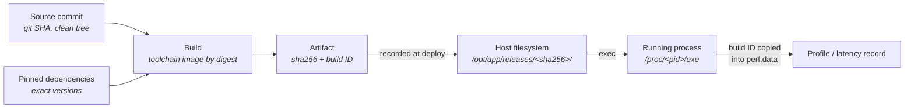
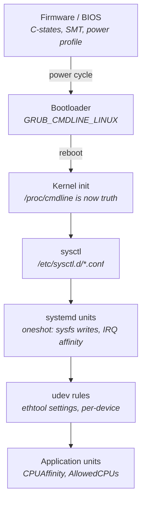
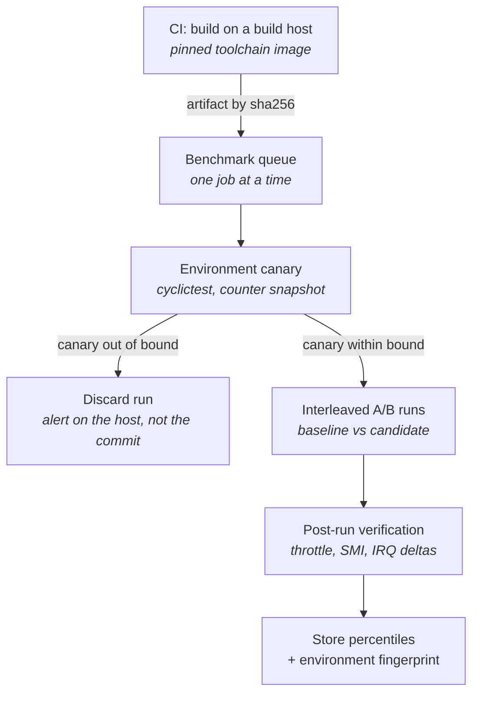
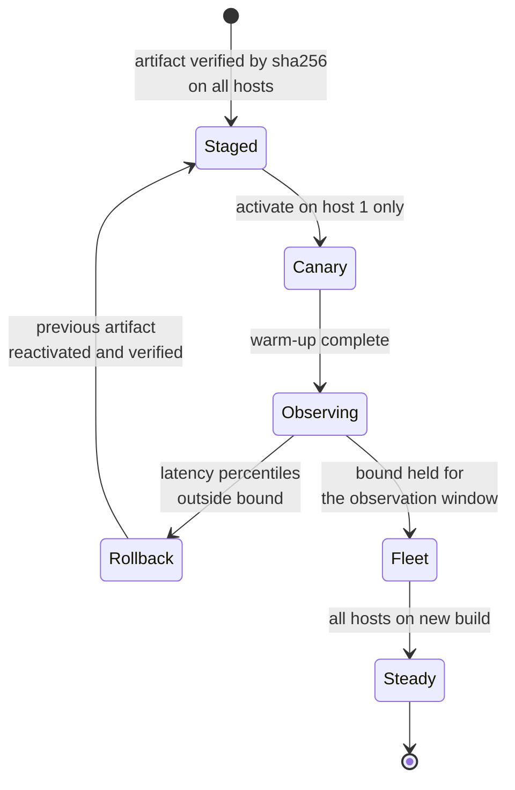
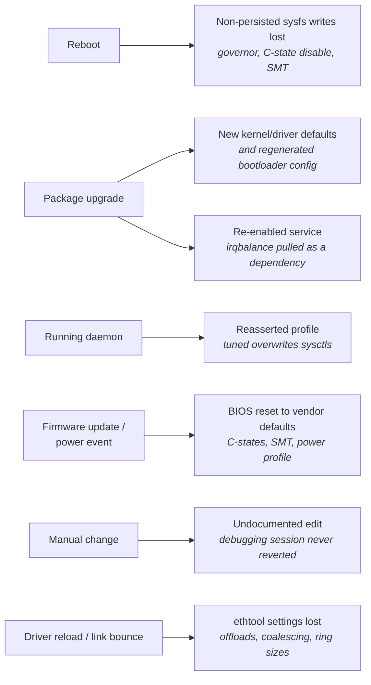

# Build, Deploy, and Environment Discipline

The previous chapter left you with a machine that behaves. Cores are isolated, interrupts are steered
away from them, frequency is pinned, C-states are capped, huge pages are reserved, and a
`cyclictest` run under load produces a maximum latency you would be willing to defend in a review
(see "Tuning a Linux Box for Determinism"). That machine is not a permanent object. It is a
particular arrangement of several hundred settings spread across firmware, the bootloader, kernel
parameters, `sysctl` values, sysfs files, systemd units, udev rules, and device driver state — and
almost every one of them can be reverted by something that is not you: a kernel package upgrade that
installs a new default, a `tuned` daemon reasserting its profile, a firmware update that resets the
BIOS to vendor defaults, a colleague who re-enabled `irqbalance` while chasing an unrelated problem
and did not put it back, or simply a reboot that lost every setting nobody remembered to persist.

The same perishability applies to the software. A binary you deployed in March and a binary you build
today from the same source commit are not necessarily the same bytes, and if they are not, you cannot
attribute a latency change between them to a code change — the difference might be in the code, or in
a dependency that floated, or in a toolchain that was upgraded underneath you, or in nothing at all
except the order in which files happened to be read from disk during the build. Every one of the
measurement disciplines in "Measuring Correctly" assumes you can hold everything constant except one
variable. Build and environment discipline is what makes that assumption true. Without it,
performance engineering degenerates into folklore: the system got slower some time in the last six
weeks, forty things changed, and nobody can say which.

This chapter is about the four mechanisms that keep a tuned system tuned. **Reproducible builds and
provenance** make a binary an identifiable object, so that "which build is running" and "what changed
between these two builds" have exact answers. **Configuration management** expresses Chapter 15's
tuning as code that can be applied to a fresh host and reapplied to an existing one without
surprises. **Continuous performance regression testing** catches a latency change close to the commit
that caused it, when the diff is small enough to read. And **drift detection** — the most important
and most often skipped — continuously proves that the machine still is what your configuration
management said it should be. The first three are ordinary good engineering practice sharpened by
latency requirements. The fourth is close to unique to this domain, because on a normal server, a
setting silently reverting costs you nothing you would notice, and here it costs you the entire
reason the host exists.

## Reproducible Builds and Binary Provenance

Start with a concrete situation. Your monitoring shows that the p99.9 of your hot path went from
18 µs to 26 µs some time between Tuesday and Thursday. There were nine commits in that window, plus
a routine deployment of a new base image. You would like to bisect: build each intermediate commit,
run each on the benchmark host, find the step change. This works only if a build is a *function* of
its inputs. If building the same commit twice can produce different binaries, then a difference you
measure between commit *N* and commit *N+1* may be nothing to do with the source change, and a
bisection will wander.

A **reproducible build** is one where the same source, built with the same recorded inputs, produces
a byte-identical output — same size, same `sha256sum`. That is a much stronger property than "builds
successfully" and most build processes do not have it by default. The reason is that build tools
casually embed environmental facts into their output. Timestamps of the build moment. Absolute paths
of the build directory, which end up in debug information. The build host's name and the building
user's name. The order in which the filesystem returned directory entries, which can determine the
order objects are linked and therefore the layout of the final binary. Locale settings, which change
how strings sort. Any parallelism whose completion order affects output ordering. None of these are
inputs you meant to have; all of them make two builds differ.

Bit-identity is not an aesthetic goal. It buys three specific things. First, **negative
information**: if today's rebuild of the deployed commit is byte-identical to the deployed artifact,
then the code and toolchain are eliminated as causes of a regression, and you can spend your effort
on the environment instead — which, on a latency-critical host, is where the cause usually is.
Second, **exact attribution**: when two binaries do differ, a reproducible pipeline means every byte
of difference traces to a deliberate input change, so a binary diff is a meaningful signal rather
than noise. Third, **cache validity**: if artifacts are content-addressed by their hash, identical
inputs produce a cache hit, and you stop rebuilding and re-benchmarking things that did not change.

The standard sources of non-determinism, and their standard remedies, are worth knowing by name
because they recur in every language ecosystem and every packaging format:

| Source of non-determinism | Where it shows up | Remedy |
|---|---|---|
| **Build timestamp** | Embedded version strings, archive member headers, package metadata | Set `SOURCE_DATE_EPOCH` to the commit time; most modern tooling honours it |
| **Absolute build paths** | Debug information, embedded assertion strings | Build in a fixed path, or use the toolchain's path-remapping option |
| **Build host and user identity** | Version banners, package metadata | Strip them, or substitute a constant |
| **Directory iteration order** | Link order, archive member order, resource bundling | Sort explicitly; set `LC_ALL=C` so sorting is byte order, not locale order |
| **Archive metadata** | `tar`/`zip` member ownership, permissions, mtimes | `tar --sort=name --mtime=@$SOURCE_DATE_EPOCH --owner=0 --group=0 --numeric-owner` |
| **Floating dependency versions** | A `latest` tag, an unpinned package range | Pin to exact versions and, where the format supports it, to content digests |
| **Toolchain version** | Everything | Build inside a container image referenced by digest, not by tag |

That last row is the one people underestimate. `build-image:latest` is not a pinned input; it is a
mutable pointer, and the image behind it changes without notice. `build-image@sha256:<digest>` is
pinned. The distinction is exactly the same one as between a branch name and a commit hash, and the
same reasoning applies: you cannot reproduce a build whose inputs you can only name, not identify.

**Failure mode: a bisection produces a step change at a commit that touched only documentation.**
Symptom is a latency difference between two adjacent builds whose source diff cannot plausibly
explain it. Cause is almost always that the two builds were produced with different toolchain or
dependency versions, because the build environment floated between them. Confirm by rebuilding both
commits back-to-back in the same pinned environment and checking whether the difference survives; if
it vanishes, the environment was the variable.

**Try it:** measure how reproducible your current build actually is. Build the same commit twice into
two directories, then run `sha256sum` over every produced artifact and compare. For any artifact that
differs, run `diffoscope old/artifact new/artifact`, which recursively unpacks archives, disassembles
binaries, and renders debug information into readable form so you can see *what* differs rather than
just that something does. In most untouched pipelines the first differences you find are embedded
timestamps and absolute paths, and both are cheap to fix.

### Artifact identity: hashes, build IDs, and embedded metadata

Reproducibility gives you the property that identical inputs produce identical outputs. Provenance is
the complementary property: given an output, you can determine which inputs produced it. These need
separate mechanisms, because a hash tells you *whether* two things are the same but nothing about
where either came from.

There are three layers of identity worth carrying, and they answer different questions.

The outermost is the **content hash of the artifact file** — `sha256sum` over the deployed file. It
is the identity of the exact bytes and it is what your deployment tooling should record and verify.
It answers "is the file on this host the file I intended to ship?" and nothing else. It changes if
you strip debug symbols, re-sign, or repackage, which is a limitation and occasionally a nuisance.

The middle layer, on Linux, is the **ELF build ID**. When a binary is linked with `--build-id`
(which every mainstream distribution's toolchain does by default), the linker computes a hash over
the binary's contents and stores it in a note section named `.note.gnu.build-id`. The default
algorithm produces a 160-bit SHA-1 value, rendered as forty hex characters. Its useful property is
that it survives stripping: a stripped binary and its separate debug-info file carry the same build
ID, which is precisely how debug information is looked up after the fact. You can read it three ways:

```sh
file ./myservice                 # prints BuildID[sha1]=<40 hex chars>
readelf -n ./myservice           # shows the .note.gnu.build-id section
readelf -p .comment ./myservice  # producer strings recorded by the toolchain
```

The build ID is the identity that follows a binary into the profiling ecosystem. `perf` records the
build IDs of every mapped object into `perf.data` when it captures a profile, and `perf
buildid-list -i perf.data` prints them back. That means a profile captured six months ago carries an
unambiguous statement of which binary it profiled, and you do not have to trust a filename (see
"Profiling Tools and Hardware Counters").

The innermost layer is **metadata you embed deliberately**. A binary should be able to tell you what
it is without any external registry: the source commit it was built from, whether the working tree
was clean at build time, the digest of the toolchain image, and the identifier of the build job. The
mechanism does not matter much — a version string linked in, a note section added afterwards with
`objcopy --add-section`, or a small data file shipped alongside — as long as it is present in the
deployed artifact and readable with `strings -a` or `readelf` on a host where nothing else is
working. The important discipline is the dirty-tree flag: `git describe --dirty` will append a
marker if the working tree had uncommitted changes, and an artifact built from a dirty tree is by
construction unreproducible and should never reach a production host.

The chain that these layers form is what "provenance" means in practice.



- Every arrow in that chain is a place identity can be lost. The commonest break is the last-but-one:
  a file is replaced on disk while the old process keeps running, so the deployed artifact and the
  executing artifact are different objects.
- The `/proc/<pid>/exe` symlink resolves to the actual file backing the running process, and it is
  the only authoritative answer to "what is running right now." If the file was replaced underneath
  the process, the link target is suffixed with ` (deleted)`.
- Because the build ID crosses into `perf.data`, a latency record and a profile taken months apart
  can be joined to the exact binary without trusting any filename or version label.

Above the artifact, the industry-standard vocabulary is **attestation**: a signed statement, produced
by the build system, asserting which source and which inputs produced which output digest. The
frameworks (in-toto, SLSA, and the signing tools around them) exist mostly to defend a software
supply chain against tampering, which is not this chapter's concern. The reason to care here is
narrower and more prosaic: an attestation is a machine-readable record of build inputs, so six months
later "what toolchain built this?" is a lookup rather than an archaeology project.

**Failure mode: the binary on disk is not the binary in memory.** Symptom is that a fix you deployed
appears to have no effect, or a profile's symbols do not line up with the source you are reading.
Cause is that the file was replaced without restarting the process — a plain `cp` over a running
executable is refused, but replacing a symlink or renaming a new file into place is not, and the
running process keeps its original inode. Confirm with `ls -l /proc/<pid>/exe`, which will show the
old path marked `(deleted)`, and with `lsof +L1`, which lists open files whose link count has fallen
to zero.

**Failure mode: two hosts are running "the same version" and one is slower.** Symptom is a latency
difference between hosts that a code change cannot explain. Cause is that the version *label* matches
but the bytes do not — a rebuild from the same tag with a floated dependency, or one host that
received a hotfix nobody recorded. Confirm by comparing `sha256sum` of the artifact and the build ID
from `file` on both hosts; if the build IDs differ, the version label is a lie and you should stop
trusting it.

**Try it:** establish the identity chain on a binary you already have. Run `file /usr/bin/ls` and note
the `BuildID[sha1]=` value, then `readelf -n /usr/bin/ls` and find the same value in the
`.note.gnu.build-id` note. Now start any long-running process, look at `ls -l /proc/<pid>/exe`, and
confirm it resolves to a real path. Finally record a short profile with `perf record -- sleep 1` and
run `perf buildid-list -i perf.data`; you will see build IDs for the kernel and for every shared
object that was mapped. That list is a provenance record you did not have to write.

## Configuration Management for Tuned Hosts

Chapter 15's tuning, as most people first perform it, is a sequence of interactive commands and
hand-edited files. That works exactly once. The moment you have a second host, or the first host is
rebuilt, or you need to answer "is host B configured the same as host A?", the interactive approach
has no answer, because the knowledge lives in a shell history and someone's memory. The fix is the
standard one from general infrastructure work — express the configuration as code and have a tool
apply it — but latency-critical hosts add two complications that a typical web fleet does not have.

The first complication is **layering with different activation semantics**. The settings from Chapter
15 do not live in one place and do not take effect at one time. Firmware settings are applied by the
BIOS before Linux exists and usually require a reboot and often out-of-band access to change. Kernel
command-line parameters are written into the bootloader configuration and take effect only at the
next boot. `sysctl` values in `/etc/sysctl.d/` are applied early in boot and can also be applied at
runtime. Some sysfs files — CPU frequency limits, individual C-state disable flags, SMT control —
are not persistent at all and must be rewritten after every boot by something that runs at boot.
Device settings applied with `ethtool` are lost when the driver is reloaded or the link bounces, so
they belong in a udev rule or a service unit rather than in a script someone runs manually. A
configuration management tool that treats all of these as "files to write" will report success while
leaving the machine in a state that does not match the intent until the next reboot, or that reverts
the next time a NIC driver reloads.



- Only the top two boxes require a reboot to take effect; everything below can be applied to a
  running host, which is why a playbook can report "changed" without the machine actually changing.
- The udev layer exists because device settings do not survive a driver reload — putting `ethtool`
  invocations in a boot-time script leaves them silently absent after any link event.
- `/proc/cmdline` is the boundary between intent and reality: what you wrote in `/etc/default/grub`
  is a request, and what appears in `/proc/cmdline` after a reboot is what the kernel actually got.

The second complication is that **the correct value of many settings depends on the host's hardware
topology**, which the configuration must therefore discover rather than hard-code. Which cores to
isolate depends on which cores share a NUMA node with the NIC, which depends on which PCIe slot the
card is in. Writing `isolcpus=4-15` into a template and applying it to a machine with a different
core enumeration produces a host that looks configured and is not (see "Memory Systems" for why NIC
node affinity matters). A configuration definition should derive its core lists from
`/sys/class/net/<iface>/device/numa_node` and `/sys/devices/system/node/node*/cpulist` on the target,
and then assert the result, rather than encoding one machine's answer as a constant.

### Idempotence, convergence, and what a tool actually proves

Every mainstream configuration management system — Ansible, Salt, Puppet, Chef — is built on the same
core idea: you describe the desired state, and the tool inspects the current state and makes only the
changes needed to reach it. The property this gives you is **idempotence**: applying the same
definition twice has the same result as applying it once, and the second application reports that it
changed nothing. Idempotence is what makes it safe to run the tool on an already-configured
production host, which is what makes it usable as a verification mechanism rather than only a
provisioning mechanism.

The tools differ in their execution model — push over SSH versus a pulling agent, imperative
ordering versus declarative dependency graphs — and for this purpose the differences matter less than
the disciplines you impose on top:

- **Every change goes through the repository.** A setting changed by hand on one host is a setting
  that will be reverted by the next run, or worse, will not be reverted and will make that host
  silently different. This rule is the entire value proposition; without it the tool is decoration.
- **Run in check mode routinely.** `ansible-playbook --check --diff` and Salt's `test=True` compute
  what *would* change without changing it. On a correctly configured host the answer is nothing. Any
  reported change is drift, and finding it in check mode is how you learn about drift before it
  matters.
- **A run that reports changes on a production host is an incident, not a success.** The play recap
  showing `changed=0` is the outcome you want. `changed=7` means something moved between the last run
  and this one, and you should find out what before you let the tool "fix" it.
- **Separate reboot-required changes explicitly.** Anything touching firmware, the kernel command
  line, or the kernel package is a different class of operation with a different risk profile, and it
  should be visible as such rather than buried in the same run as a sysctl adjustment.
- **Never let two systems own the same setting.** The classic instance is `tuned` and hand-written
  `/etc/sysctl.d/` files: the profile reasserts its values and your file appears to have no effect.
  Pick one owner per setting. If you use `tuned`, define a custom profile that inherits from a stock
  one and put your values there; if you do not, mask the daemon.

That last point generalizes into the most useful mental exercise for this section: for every setting
you care about, ask *who else on this machine writes it?* `irqbalance` writes IRQ affinity. `tuned`
writes governors, sysctls, and PM QoS requests. NetworkManager writes interface configuration. A
distribution's kernel package post-install script regenerates the bootloader configuration. The
kernel itself picks defaults at boot that depend on the version. Each of these is a second author for
state you believe you own, and each is a drift source that the next section's audit has to catch.

| Layer | Where the desired state lives | Applied by | Lost when |
|---|---|---|---|
| Firmware | Vendor tooling / BMC redfish interface | Out-of-band, then reboot | Firmware update, CMOS reset, sometimes a power event |
| Kernel command line | `/etc/default/grub`, then `grub2-mkconfig`/`update-grub` | Bootloader at boot | A kernel package installing a new entry with different arguments |
| `sysctl` | `/etc/sysctl.d/*.conf` | Boot, or `sysctl --system` | A daemon such as `tuned` writing a different value |
| Non-persistent sysfs | A systemd oneshot unit | `systemd` at boot | Every reboot, unless a unit rewrites it |
| Module options and blacklists | `/etc/modprobe.d/*.conf` | Module load | An initramfs that was not regenerated |
| NIC settings | udev rule or a per-interface unit | Device add / link up | Driver reload, link bounce, interface rename |
| Service placement | `/etc/systemd/system.conf` `CPUAffinity=`, unit `AllowedCPUs=` | `systemd` | A unit shipped by a package without the drop-in |

The systemd row deserves elaboration because it is the cheapest large win in this table. Setting
`CPUAffinity=` in `/etc/systemd/system.conf` constrains every service systemd starts — every daemon,
every timer-triggered job, every logging agent — to the housekeeping cores, without touching any
individual unit file. Per-unit, the cgroup v2 property `AllowedCPUs=` does the same for one service,
and unit drop-ins under `/etc/systemd/system/<unit>.d/override.conf` let you add it to a
package-shipped unit without editing the package's file (which would be overwritten on upgrade).
`systemctl cat <unit>` prints the unit plus every drop-in in effect, which is how you check what is
actually applied rather than what you think you wrote.

**Failure mode: the playbook reports success and the setting is not active.** Symptom is that
`/proc/cmdline` does not contain a parameter that `/etc/default/grub` clearly requests. Cause is
either that the bootloader configuration was not regenerated, or that it was and the host has not
rebooted since. Confirm by comparing `/proc/cmdline` against the generated bootloader config
(`grubby --info=ALL` on RHEL-family systems shows the arguments per boot entry), and check the mtime
of the generated config against the boot time from `uptime -s`.

**Failure mode: a setting reverts a few seconds after being applied.** Symptom is that a `sysctl -w`
or a sysfs write appears to take, then reads back as the old value shortly afterwards. Cause is
another daemon owning the setting — usually `tuned` with dynamic tuning enabled, or `irqbalance` for
IRQ affinity. Confirm with `tuned-adm active` to see whether a profile is managing the host and
`systemctl is-active irqbalance`; the durable fix is `systemctl mask irqbalance` and, if `tuned`
stays, `dynamic_tuning=0` in `/etc/tuned/tuned-main.conf`.

**Failure mode: two hosts built from the same definition behave differently.** Symptom is a latency
difference between supposedly identical machines. Cause is frequently a topology-dependent setting
that was hard-coded — an isolated-core list, an IRQ affinity mask, or a NUMA binding that is correct
on one chassis and wrong on another with a different slot layout. Confirm by diffing
`lscpu`, `numactl --hardware`, and `/sys/class/net/<iface>/device/numa_node` between the two hosts
before diffing anything else.

**Try it:** run your configuration definition in check mode against a host you believe is correctly
configured, and read every reported difference. `ansible-playbook --check --diff site.yml --limit
host1` prints the exact textual change it would make to each file. On a host that has been in service
for a few months you will nearly always find at least one difference, and the interesting question is
not how to fix it but how it got there — the answer identifies a drift source you did not know about.

**Try it:** find every second author on your machine. List enabled units with
`systemctl list-unit-files --state=enabled` and look for anything that writes tuning state:
`irqbalance`, `tuned`, `NetworkManager`, a vendor management agent, a monitoring agent. For each one,
read its unit with `systemctl cat` and work out what it touches. Then check `tuned-adm active`, and
if a profile is active, `tuned-adm verify` will tell you whether the machine currently matches it —
a mismatch here means either you or the profile lost a fight.

### Immutable hosts versus convergent hosts

There is a design choice underneath all of this that is worth stating explicitly because it changes
what drift means. In the **convergent** model, a long-lived host is repeatedly nudged toward the
desired state by a tool that runs periodically; the host accumulates history, and configuration
management's job is to keep correcting it. In the **immutable** model, the host's state is baked into
an image, hosts are never modified in place, and any change means rebuilding and redeploying the
image — image-based Linux systems and container-hosted workloads both take this shape.

The immutable model is genuinely better at eliminating drift, because there is no in-place mutation
to drift from, and image-based systems make "what is the state of this host" a single content
digest. Colocated latency hosts adopt it only partially, for reasons that are physical rather than
philosophical: reimaging a host takes it out of service for the length of a reboot cycle plus
firmware and hardware re-verification, and you may only have a handful of hosts, each with a
physically distinct cross-connect (see "Network Design and Operations"). Firmware, which is where
several of Chapter 15's most consequential settings live, is outside the image regardless of model.
So most firms run a hybrid: an image or a package set that pins everything above the kernel, a
configuration layer for the machine-specific tuning, and an audit — the last section of this chapter
— that assumes drift will happen anyway and looks for it.

## Continuous Performance Regression Testing

Correctness tests answer a yes-or-no question and give the same answer on any machine. Performance
tests answer a numeric question whose answer depends on the machine, the moment, the temperature of
the package, what else was running, and how the operating system happened to lay out physical memory
that time. Running them in CI is therefore a fundamentally different problem from running unit tests,
and the failure mode of doing it naively is worse than not doing it at all: a benchmark that reports
regressions caused by its own noise trains everyone to ignore it within about two weeks, and then you
have a red build nobody reads.

The motivation is nonetheless strong. Latency regressions are almost never introduced deliberately.
They arrive as a side effect: an added field pushes a structure across a cache line boundary, a
dependency upgrade changes an allocator's behaviour, a refactor introduces an allocation on a path
that used to have none, a logging call that was cheap becomes a syscall. Each of these costs a small
number of nanoseconds or a rare microsecond-scale outlier, invisible to any functional test, and
undetectable in production until enough of them accumulate to move a percentile. If you catch a
regression the day it lands, the diff is a few dozen lines and the cause is obvious. If you catch it
six weeks later, the diff is two hundred commits and a base image change, and you are bisecting.

The hard part is not running the benchmark. It is producing a number stable enough that a real change
is distinguishable from run-to-run variation. That requires solving the environment problem, and the
environment problem is why most organizations' performance CI does not work.

### The benchmark host is the whole problem

A shared CI runner is useless for latency measurement, and it is worth being precise about why rather
than treating it as received wisdom. A cloud CI executor is a container on a shared machine with
unknown neighbours, a scheduler that will migrate your threads between cores, frequency scaling under
someone else's thermal budget, and a CPU model that may differ between runs of the same job. Every
single mechanism the earlier chapters identified as a jitter source is present and uncontrolled:
neighbours consuming memory bandwidth and pushing the socket up the saturation curve (see "Memory
Systems"), C-state transitions, unpinned threads, interrupt storms from other tenants' I/O. The
resulting measurement has a variance far larger than the effects you are trying to detect. A
regression of 200 ns is real and important; the noise floor on a shared runner is comfortably tens of
microseconds.

So the benchmark host is a dedicated bare-metal machine, tuned exactly as Chapter 15 describes, ideally
the same hardware SKU and firmware revision as production, doing nothing else. That immediately
imposes constraints on the pipeline:

- **One benchmark at a time, serialized by a queue.** Two concurrent jobs on the same host contend
  for memory bandwidth and L3, and both results are worthless. The benchmark stage is a lock, not a
  parallel matrix.
- **No benchmark on every commit if the queue cannot keep up.** Batching to a nightly run, or to
  every merge to the main branch, is an acceptable trade — the cost is a coarser bisection granularity
  when something does regress.
- **The build must not run on the benchmark host.** Compilation saturates memory bandwidth, fills the
  page cache, heats the package, and fragments physical memory, which depletes the huge page pool.
  Build elsewhere, ship the artifact by content hash, run.
- **Capture the environment with every result.** The capture table from "Tuning a Linux Box for
  Determinism" is exactly the artifact needed here, stored alongside each measurement. When a
  baseline shifts, the first question is whether the environment fingerprint changed, and you can
  only answer it if you recorded it.
- **Reboot on a schedule, not opportunistically.** Uptime changes behaviour through memory
  fragmentation and huge page pool depletion. A host rebooted between runs and a host up for forty
  days are different measurement instruments.



- The canary stage is what separates a usable pipeline from an unusable one: it decides whether the
  machine was fit to measure on *before* attributing anything to the commit.
- The interleaving in the run stage exists because running all of A then all of B confounds the code
  change with any drift over the intervening minutes, thermal state being the most common.
- The post-run verification stage re-reads the counters that indicate interference — thermal throttle
  counts, the SMI counter, `/proc/interrupts` on the measured core — and invalidates the run if they
  moved.

`cyclictest` is the natural canary because it measures the machine rather than your code. A short run
— something like `cyclictest -m -p 99 -t 1 -a <isolated_cpu> -i 200 -D 30 -q` — produces a maximum
wakeup latency for the host in its current state. If that maximum is meaningfully worse than the
host's established baseline, the machine is not fit to benchmark on and every number it produces
today is suspect. Failing the run *on the host* rather than on the commit is the important design
decision: the pipeline should be able to say "this result is invalid because the environment
degraded," and that verdict must route to whoever owns the host, not to the engineer who happened to
push a commit.

**Failure mode: every commit for a week shows a small regression, and none of them are real.**
Symptom is a monotone drift in the baseline series rather than a step change at one commit. Cause is
the benchmark host itself changing — a kernel or microcode update, a `tuned` profile reapplied after
a package upgrade, huge page pool depletion from long uptime, or a fan or thermal problem reducing
sustained turbo. Confirm by plotting the *baseline* measurement (the unchanged reference build) over
the same period; if the baseline moved, the host is the cause, not the commits. This is the strongest
argument for measuring a fixed reference build on every run.

**Try it:** measure your machine's noise floor before you gate anything on it. Take one binary, and
run the benchmark against it as if it were two different candidates — the same bytes on both sides of
the comparison. Do this twenty times. The distribution of the reported "difference" is your noise
floor, and it tells you the smallest effect the pipeline can honestly detect. Any threshold tighter
than that floor produces false alarms at a rate you can now predict, and any regression smaller than
it is not detectable with this setup no matter how you analyze it.

### Separating a regression from noise

Once the environment is controlled, the remaining question is statistical in spirit but does not need
any statistics beyond reading a histogram. The naive approach — run the benchmark once for the old
build, once for the new, compare the means, fail if the new one is higher — is wrong in three
independent ways, and each has a direct fix.

It compares means. A mean is a poor summary of a latency distribution, because latency distributions
are asymmetric: the mean is dragged by the tail and is insensitive to changes in the body. A change
that makes the median 5% worse and the tail 20% better can leave the mean unchanged. Compare
percentiles — p50, p99, p99.9 — as separate quantities, because they answer different questions and
can move in opposite directions (see "Measuring Correctly").

It compares single runs. One run of each gives you no idea how much two runs of the *same* build
would differ, so you have no scale against which to judge the observed difference. The fix is
repetition and interleaving: several runs of each, alternating, so that any drift over the
measurement window affects both sides equally.

It uses a fixed threshold. "Fail if p99 rose more than 2%" sounds principled and is arbitrary — 2%
may be far below the noise floor on one benchmark and far above a real regression on another. Derive
the threshold from the null experiment described above, per benchmark, and re-derive it when the host
changes.

The practical gating policy that falls out of this is a two-stage one, and it is worth stating as a
rule because it resolves the tension between sensitivity and false alarms:

| Signal | Interpretation | Action |
|---|---|---|
| Difference within the measured noise band | Indistinguishable from run-to-run variation | Record, do not alert |
| Difference beyond the band, single occurrence | Possibly real, possibly an unlucky run | Automatically re-run both sides; do not fail the build yet |
| Difference reproduces on re-run | Real, attributable to this change | Fail the stage, report which percentile moved |
| Baseline build also moved | Environment changed | Invalidate the comparison; alert the host owner |
| p50 unchanged, p99.9 moved | A new rare event, not a steady-state cost | Investigate as a jitter source, not a throughput change |

That last row is the one worth internalizing. A change to the steady-state cost of the hot path
shifts the whole distribution — p50 and p99 move together. A change that introduces a rare event —
an occasional allocation, a page fault, an occasional syscall — leaves p50 exactly where it was and
moves only the far tail. The shape of the change tells you what kind of defect you are looking for
before you have looked at any code (see "Jitter Hunting").

Hardware counters make excellent covariates here, because they discriminate between a code change and
an environment change in a way that timing alone cannot. If the new build executes measurably more
instructions per event, the regression is in the code. If it executes the *same* number of
instructions but takes longer — a lower instructions-per-cycle ratio — then the code did the same
work and the machine served it more slowly, which points at cache behaviour, memory placement, or the
environment. Recording `perf stat -e cycles,instructions,cache-misses,dTLB-load-misses` alongside
every benchmark result costs nothing and repeatedly saves an afternoon.

For coarse, process-level benchmarks — startup time, a batch job's wall clock, a cold-path operation
— `hyperfine` is a reasonable off-the-shelf harness. It handles warm-up runs, repeats to a
configurable count, and exports machine-readable results:

```sh
hyperfine --warmup 5 --runs 50 --export-json result.json './myservice --selftest'
```

Its resolution is that of process execution, which is milliseconds — entirely wrong for a hot path
measured in nanoseconds, where you need an in-process harness with an explicit histogram and
warm-up discipline (see "Measuring Correctly"). Knowing which of the two a given benchmark needs is
part of the design: `hyperfine` for anything you would time with a stopwatch, an in-process harness
for anything you would time with a cycle counter.

**Failure mode: the benchmark is stable in CI and the regression shows up only in production.**
Symptom is a clean pipeline and a real production p99 increase. Cause is that the benchmark does not
exercise the condition that regressed — most commonly, it runs with a warm cache and a small working
set while production has a larger footprint, or it runs single-threaded while production has
concurrent activity contending for L3. Confirm by comparing the working set and the counter profile
(`perf stat` cache-miss and TLB-miss rates) between the benchmark and a production process; if they
differ by an order of magnitude, the benchmark is measuring a different regime.

**Try it:** build the shape-of-change intuition deliberately. Take a benchmark you have, and
introduce two artificial regressions: one that adds a small constant amount of work to every
iteration, and one that does something expensive on one iteration in ten thousand — touching an
untouched page is a convenient choice, since it costs a minor page fault of a microsecond or so (see
"Memory Management"). Compare the p50, p99, and p99.9 deltas for each. The first moves everything;
the second moves only the far tail. Recognizing those two signatures on sight is most of what
interpreting a regression report requires.

## Rollout in a Colo Environment

Deployment practice in most of the industry assumes elasticity. You can bring up a parallel fleet,
shift traffic gradually, and tear the old one down — blue-green deployment, in the standard
vocabulary — because compute is a commodity you rent by the minute. A colocated latency-critical
environment violates every assumption in that sentence. The hosts are physical machines in a specific
rack in a specific facility, each connected by a specific cross-connect to a specific switch port
(see "Network Design and Operations"). There may be four of them. You cannot double the fleet for an
hour, because there is no second set of ports and the racks are full. The old-fleet-alongside-new
pattern is simply unavailable.

Two further constraints follow from the physical facts. The **hosts are not interchangeable**: they
differ in cable length, in which switch port they land on, and sometimes in hardware revision, so a
change validated on one host has not been validated on the others in the way that a change validated
on one identical cloud instance has. And the **service window is externally imposed**: markets open
and close at fixed times, which means the deployment calendar is not yours to choose. That single
scheduling constraint is the source of most of what is distinctive about deployment here.

The risk calculation splits cleanly along it. Outside market hours you have hours of wall-clock time,
you can reboot, you can update firmware, and a mistake costs you only the time to fix it — but there
is no live traffic, so a class of defects that only appears under real load and real message rates
will not be found. During market hours you have live traffic and instant feedback, and a defect is
immediately consequential, and your rollback window is measured in minutes. These are not two points
on a spectrum; they are different operations with different rules.

| | Outside market hours | During market hours |
|---|---|---|
| Time to fix a mistake | Hours | Minutes |
| Reboot permitted | Yes | No |
| Firmware / kernel change permitted | Yes | Never |
| Validation available | Synthetic load and replay only | Real traffic |
| Cost of a bad deploy | Time and a possible late finish | Immediate and unbounded |
| Restart warm-up cost | Absorbed before the session | Paid on live traffic |
| Appropriate change class | Anything | Reversible, single-artifact, pre-validated |

That last row of the table is the operative rule. During a session, the only changes that belong are
ones whose rollback is a single, rehearsed, verified action. Anything requiring a reboot, a firmware
change, a kernel change, or a coordinated change across multiple components is a maintenance-window
operation, because its rollback is itself a long operation and a failed rollback during a session has
no floor.

### Staged rollout without a parallel fleet

With no room for a parallel fleet, staging happens across your existing hosts and across time rather
than across a duplicate environment. The general shape is: one host first, observe, then the rest,
with a defined observation period and defined criteria between the stages.



- Staging the artifact onto every host *before* activating it anywhere separates the slow, failure-
  prone step (copying and verifying bytes) from the fast, risky step (switching which one runs).
- The `Observing` state has an explicit duration and explicit exit criteria, both decided in advance;
  "it looks fine" is not an exit criterion because the person watching is the person who wants it to
  be fine.
- `Rollback` returns to `Staged`, not to `[*]` — the previous artifact is already present on disk, so
  reverting is an activation, never a rebuild or a re-download.

The mechanics that make this work are unglamorous and specific. Artifacts land in a directory named
by their content hash, for example `/opt/app/releases/<sha256>/`. A symlink — `/opt/app/current` —
points at the active one. Activation replaces the symlink atomically and restarts the service unit;
`ln -sfn` followed by `mv` performs the replacement as a single `rename(2)`, so there is no instant at
which the path does not resolve. Rollback is the same operation pointing at the previous directory.
Because the previous release directory is still on disk, rollback does not depend on a build system,
an artifact registry, or a network path being available — all of which are things that fail at
exactly the wrong moment.

Verification after every activation is not optional, and it must check the thing that actually
matters rather than a proxy:

- **Confirm the running process is the intended artifact.** Read `ls -l /proc/<pid>/exe` and compare
  the build ID via `file` against the expected value. "The symlink points at the right directory" is
  a weaker statement than "the process is executing those bytes," and the gap between them is where
  the "I deployed it but it didn't take" incidents live.
- **Confirm the service actually started.** `systemctl is-active` plus `journalctl -u <unit> -b
  --since "5 minutes ago"` catches a unit that started, failed a check, and was restarted into a
  degraded mode.
- **Confirm configuration and binary versions match.** A binary that expects a configuration schema
  the deployed configuration does not provide is the most common way a rollback fails. Version the
  configuration with the binary and roll them back together.
- **Wait out the warm-up before believing any latency number.** A freshly restarted process has cold
  caches, cold branch predictors, an empty TLB, and un-faulted pages; its first thousands of events
  are slow for reasons that have nothing to do with the change (see "Memory Management"). Measuring
  during warm-up produces a false alarm; measuring only after it produces a real signal.

That warm-up cost is a large part of why in-session deployment is different in kind. Restarting a
process during a session means paying the full cold-start penalty on live traffic — minor page faults
in the microsecond range on first touch of every buffer, cold L1/L2/L3, an unwarmed branch predictor,
and, if the hot path involves connections, a re-established connection whose congestion state starts
from scratch (see "TCP In Depth"). None of this is a defect and all of it is visible in the latency
distribution for a period after restart.

**Failure mode: a rollback restores the old binary and the problem persists.** Symptom is that
reverting does not recover the previous behaviour. Cause is that something else changed alongside the
binary and was not reverted — a configuration file, a schema, a sysctl applied by the deployment
process, a NIC setting. Confirm by diffing the full environment capture from before the deploy
against the current one, not just the artifact hash; this is exactly what the capture script exists
for.

**Failure mode: half the fleet is on the new build and the two halves behave differently in a way
that matters.** Symptom is inconsistent behaviour across hosts during the staged window. Cause is a
change that is not backward-compatible with its own previous version — a shared-memory layout, a
message format, a file format on a shared path. Confirm by checking whether the hosts communicate or
share state at all; if they do, staged rollout requires a compatibility discipline (new version reads
both formats, writes the old one; a later release flips the writer) rather than a straight swap.

**Failure mode: the deployment succeeded but the service is running from a deleted file.** Symptom is
that a subsequent rollback appears to do nothing. Cause is a release directory removed by a cleanup
job while a process still held its executable open. Confirm with `lsof +L1` and `ls -l /proc/<pid>/exe`;
the fix is a retention policy that keeps at least the previous two releases and never deletes a
directory referenced by a running process.

**Try it:** rehearse a rollback with a stopwatch, outside a session, on a host that is not serving.
Time the complete sequence: decide, flip the symlink, restart the unit, verify the build ID from
`/proc/<pid>/exe`, confirm the unit is active in `journalctl`, and wait for warm-up. Whatever that
number is, it is your true rollback window, and it is almost always longer than people assume because
the verification steps are the ones nobody counts. A rollback procedure that has never been timed is
a rollback procedure that has never been tested.

**Try it:** verify the atomicity of your activation step. In one shell, loop reading the target of
your `current` symlink several thousand times a second; in another, perform the activation. If your
activation does `rm` followed by `ln -s`, the reader will observe a window where the path does not
exist. If it does `ln -sfn` into a temporary name followed by `mv`, it will not. That window is small
and it is exactly the kind of thing that eventually bites during the one deployment you could not
afford to have go wrong.

## Drift Detection: Verifying the Machine Is Still Tuned

Configuration management proves something about the past: that at the moment the tool ran, the
machine's state matched the definition. Drift detection proves something about the present: that the
state still matches, right now. Those are different claims, and on a general-purpose server the gap
between them rarely matters, because the settings that drift are ones nobody notices. On a host whose
entire purpose is determinism, every one of Chapter 15's settings is load-bearing, and a single one
reverting can add tens of microseconds to a tail without producing a single error message anywhere.

Consider the specific shape of the problem. A distribution kernel update lands during a maintenance
window. The package installs a new kernel, regenerates the bootloader configuration, and the host
reboots into the new kernel. The new bootloader entry was generated from the current `/etc/default/grub`,
so the command line survives — usually. But `intel_idle`'s defaults changed between kernel versions,
so a C-state you had capped is available again; a driver you had blacklisted got renamed and the
blacklist no longer matches; the `tuned` package was updated and reapplied its profile over your
sysctls; and `irqbalance` was pulled in as a dependency of something else and is now enabled and
running, spreading interrupts back across your isolated cores. Nothing failed. No log line says
anything is wrong. The machine boots, the service starts, traffic flows, and the p99.9 is now three
times what it was. You will discover this in one of two ways: because you were monitoring the latency
and it moved, which tells you *that* something is wrong and nothing about what; or because an audit
asserted every setting and told you exactly which four reverted.

The second is enormously cheaper, and building it is the highest-leverage work in this chapter.

### The taxonomy of drift

Drift has distinct causes with distinct signatures, and knowing them tells you both what to assert
and where to look when an assertion fires.



- The left column is the *cause*, which is what you correlate against when an assertion fires — a
  reboot and a package upgrade both leave timestamped evidence you can find.
- Only the bottom two rows are detectable purely from device state; the rest are visible in the
  system's own records, which is why the audit should collect both.
- Firmware drift is the nastiest entry, because the settings live outside the operating system
  entirely and can only be read through `dmidecode` and vendor tooling.

Correlating an assertion failure to its cause is usually a two-command job:

```sh
journalctl --list-boots          # when did this host last reboot?
journalctl -b -1 -k              # what did the previous boot's kernel log say?
rpm -qa --last | head -40        # RHEL family: what was installed most recently?
grep ' install \| upgrade ' /var/log/dpkg.log   # Debian family: same question
```

If an assertion started failing at 03:14 and the host rebooted at 03:12, you have your answer. If it
started failing at 14:30 on a Tuesday with no reboot, you are looking for a daemon or a person.

### Building the audit

The audit is a script. That is deliberately anticlimactic — the value is not in the implementation but
in the completeness of the assertion list and in the fact that it runs continuously rather than when
someone remembers. Structurally it has four properties, and each one is the difference between an
audit that works and one that gets muted.

**It asserts values, not just captures them.** A script that dumps state is a capture script; you
already have one from Chapter 15's benchmark discipline. An audit compares each captured value
against an expected value and produces a per-assertion pass or fail. The distinction matters because
a human will not diff a 4,000-line capture every five minutes, and a machine will not diff it
usefully either without an ignore list.

**It emits one metric per assertion, not one overall verdict.** A single "host healthy: 0" is nearly
useless — it tells you something is wrong and makes you go read logs. A metric per assertion, labelled
by the setting name, means the alert itself says `cstate_max_c1 = 0` and the investigation starts
already knowing what broke. Exporting these as metrics (a Prometheus textfile-collector directory is
the conventional mechanism, but any metrics pipeline works) puts them on the same dashboards as your
latency data, which is how you correlate a drift event with a latency step change.

**It runs on a timer, on the host, forever.** A systemd timer unit invoking a oneshot service every
few minutes is the right mechanism, because it survives reboots, it is itself expressed in
configuration management, and its own failures are visible in `journalctl`. Running the audit from a
central orchestrator instead is fine, but then the orchestrator's reachability becomes part of your
detection path, and silence becomes ambiguous.

**It is tested by being deliberately broken.** An audit nobody has ever seen fire is an audit you
have no evidence works. The check is trivial: change one setting by hand, confirm the alert fires
within the expected interval, change it back, confirm the alert clears. Do this for a few assertions
periodically, and especially after any change to the audit itself.

The assertion list is the substance. Every row below corresponds to something Chapter 15 established,
and every one has a specific file or command that reads its current value:

| Assertion | How to read it | What its failure means |
|---|---|---|
| Kernel version unchanged | `uname -r` | The host rebooted into a different kernel; every default is now suspect |
| Kernel command line unchanged | `/proc/cmdline` | Isolation, huge pages, mitigations, or clocksource may have changed |
| Microcode revision unchanged | `/sys/devices/system/cpu/cpu0/microcode/version` | A silent performance change with no other visible cause |
| BIOS version and date unchanged | `dmidecode -s bios-version`, `dmidecode -s bios-release-date` | Firmware settings may have been reset to vendor defaults |
| SMT state as intended | `/sys/devices/system/cpu/smt/control`, `/sys/devices/system/cpu/smt/active` | Sibling threads are competing for your core's resources |
| Frequency policy pinned | `/sys/devices/system/cpu/cpu*/cpufreq/scaling_governor`, `scaling_min_freq`, `scaling_max_freq` | The clock can now vary, so every measurement drifts |
| Idle states capped | `/sys/devices/system/cpu/cpu*/cpuidle/state*/disable` | Deep C-state exit latency is back on the critical path |
| Mitigation status unchanged | `/sys/devices/system/cpu/vulnerabilities/*` | The largest single configuration-driven latency difference on the host |
| Huge page pool intact | `/proc/meminfo` (`HugePages_Total`, `HugePages_Free`), `/sys/devices/system/node/node*/hugepages/` | Silent fallback to 4 KiB pages and a TLB reach collapse |
| IRQ affinity as intended | `/proc/irq/*/smp_affinity_list`, `/proc/irq/default_smp_affinity` | Interrupts are landing on isolated cores |
| `irqbalance` not running | `systemctl is-active irqbalance` | Affinity will be rewritten continuously, so a one-time fix will not hold |
| Tuning profile as intended | `tuned-adm active`, `tuned-adm verify` | A profile is managing settings you believe you own |
| Loaded modules unchanged | `lsmod` diffed against a baseline | A new driver is present, or a blacklisted one loaded anyway |
| Enabled units unchanged | `systemctl list-unit-files --state=enabled` | A package upgrade enabled a service that will run on your cores |
| NIC configuration unchanged | `ethtool -k`, `-c`, `-g`, `-l` per interface | Offloads, coalescing, or ring sizes reverted after a driver reload |
| NIC NUMA node as expected | `/sys/class/net/<iface>/device/numa_node` | The card moved slots, or the topology enumeration changed |
| Full `sysctl` state unchanged | `sysctl -a` diffed against a baseline | Any runtime knob at all |
| Package file integrity | `rpm -Va` (RHEL family), `debsums` (Debian family) | A file shipped by a package was modified locally |

The `sysctl -a` row needs one operational caveat, because it is the assertion most likely to be
switched off out of frustration. Some sysctl values legitimately change every time you read them —
counters and identifiers, `kernel.random.uuid` being the obvious example, along with several entries
under `fs.` that report live kernel state. A naive diff of `sysctl -a` against a stored baseline
therefore reports differences on every run, and an alert that fires constantly gets muted, at which
point you have lost the check entirely. The fix is an explicit ignore list of key patterns, reviewed
when it changes, so that the diff is normally empty. An assertion that is normally noisy is not an
assertion.

**Failure mode: the audit is green and the machine is slow.** Symptom is a latency regression with no
failing assertion. Cause is an assertion coverage gap — the thing that drifted is something you never
thought to assert. This will happen, repeatedly, and the correct response is procedural: every time
an environment-caused latency incident is root-caused, the last step of the investigation is adding
an assertion for it. The list grows monotonically and its completeness is a direct function of how
many incidents you have survived.

**Failure mode: the audit fires constantly and everyone ignores it.** Symptom is a check with a
permanently failing assertion that has been acknowledged and forgotten. Cause is a baseline captured
from a host that was not actually in the intended state, or a value that legitimately varies and was
not excluded. Confirm by reviewing every currently-failing assertion; the correct steady state is
zero, and any tolerated failure erodes the credibility of the whole mechanism.

**Try it:** build the smallest useful audit today. Take five assertions — `uname -r`, `/proc/cmdline`,
the `scaling_governor` of every CPU, `HugePages_Total` from `/proc/meminfo`, and
`systemctl is-active irqbalance` — and write a script that compares each against an expected value
and prints one line per assertion with a pass or fail. Wire it to a systemd timer running every five
minutes. Then deliberately break one: `sysctl -w vm.stat_interval=1` if you had raised it, or
`echo powersave > /sys/devices/system/cpu/cpu0/cpufreq/scaling_governor` on a test host. Confirm the
failure appears within one interval, then revert and confirm it clears. You now have the smallest
version of the thing, and every subsequent assertion is one more row in the same script.

**Try it:** find drift that already exists. On any host you have been using for a few months, run
`tuned-adm verify` if a profile is active, `rpm -Va` or `debsums -c` to find locally-modified
package files, and diff `lsmod` against what you believe should be loaded. Then run
`journalctl --list-boots` and see how many reboots the host has been through since anyone last
verified anything. The number of surprises is a good estimate of how much you need this.

### Behavioural canaries: asserting what you forgot to assert

Every assertion in the table above tests a setting you knew to write down. The coverage gap — the
thing you did not think to assert — is by construction invisible to that approach, and it is where
the expensive incidents come from. The complement is a **behavioural canary**: a periodic measurement
of how the machine actually behaves, compared against an established bound, which fires when the
machine's behaviour degrades regardless of whether any setting you track has changed.

`cyclictest` is the standard instrument, and it is worth being clear about what it measures. It
arms a timer for a fixed interval, sleeps, and on waking compares the actual wake time against the
intended one; the difference is wakeup latency, and its maximum over a run is a direct measurement of
the longest interruption the machine imposed on a high-priority thread. It is not measuring your
application; it is measuring the machine's willingness to run a thread when it said it would. That is
precisely the property that Chapter 15's tuning buys, so a periodic `cyclictest` maximum is a
single number that summarizes whether the tuning is still doing its job.

Running it in production requires care, because a `SCHED_FIFO` priority-99 thread is exactly the kind
of thing that can interfere with the workload it is monitoring. The usual arrangement is a short run
on a spare isolated core — one held back from the hot path for exactly this purpose — at a low
frequency, with the result recorded as a metric:

```sh
cyclictest -m -p 99 -t 1 -a <spare_isolated_cpu> -i 200 -D 60 -q -h 400
```

The `-m` locks memory so the measuring thread does not take page faults, `-p 99` runs it at real-time
priority, `-a` pins it to the named CPU, `-i 200` sets a 200 µs interval, `-D 60` runs for a minute,
and `-h 400` produces a histogram with 400 buckets so you can see the shape rather than only the
maximum. What you record is the maximum and a couple of high percentiles; what you alert on is the
maximum exceeding the bound you established when the host was known-good.

The reason this catches what assertions cannot is that it is sensitive to causes that have no
configuration file. A firmware update that changed the rate or duration of System Management
Interrupts will not change any file the audit reads, and will show up immediately as an increased
`cyclictest` maximum (see "Tuning a Linux Box for Determinism" for why SMIs are invisible to the
operating system). The same is true of a failing fan changing the thermal envelope, a new background
task in a management agent's firmware, or a hardware fault degrading a link.

The two mechanisms are complementary and you need both:

| | Declarative assertions | Behavioural canary |
|---|---|---|
| Detects | Settings that changed | Behaviour that degraded |
| Coverage | Exactly what you listed | Anything affecting scheduling latency |
| Tells you the cause | Yes — names the setting | No — only that something is wrong |
| False negatives | Anything you forgot to assert | Slow degradation within the bound |
| False positives | Values that vary legitimately | Interference from other work on the host |
| Cost to run | Negligible | A core, briefly, at real-time priority |

Reading that table from left to right gives the operating procedure. The canary tells you *that* the
machine got worse; the assertions tell you *which* setting caused it; and if the canary fires and no
assertion does, you have found a coverage gap and the investigation ends with a new row in the
assertion table. That loop — degrade, detect, root-cause, assert — is the mechanism by which a tuned
machine stays tuned over years rather than weeks.

**Failure mode: the canary's maximum degrades gradually over months with no single event.** Symptom
is a slow upward creep in `cyclictest` maximum rather than a step change. Cause is usually cumulative
rather than configurational — memory fragmentation depleting the huge page pool, thermal paste or fan
degradation reducing sustained turbo, or a slowly growing set of background services each adding a
little work. Confirm by checking `/proc/buddyinfo` for high-order fragmentation, thermal throttle
counters, and the count of enabled units against the baseline; a scheduled reboot that recovers the
number identifies fragmentation as the cause.

**Failure mode: the canary fires but only on one host in the fleet.** Symptom is a per-host
divergence in a fleet built from one definition. Cause is hardware- or firmware-specific: a different
BIOS revision, a different DIMM population, a different card in a different slot. Confirm by diffing
`dmidecode -t bios`, `dmidecode --type memory`, `lspci -nn`, and `lscpu` across the hosts; hardware
inventory drift is real drift and belongs in the same audit.

**Try it:** establish your canary's bound honestly. Run the `cyclictest` invocation above on a
known-good, idle host ten times over a day and record the maxima. Then run it ten more times while
`stress-ng --cpu <N> --vm 4 --vm-bytes 4G` loads the housekeeping cores. The second set is the
number that matters, because production is not idle, and a bound derived from an idle host will fire
the first time the machine gets busy. Set the alert threshold above the loaded maximum, not the idle
one, and record both in the host's baseline so a future reader knows which is which.

## Numbers to Know

| Quantity | Value | Notes |
|---|---|---|
| ELF build ID length | 160 bits (40 hex chars) | GNU linker default is SHA-1; survives stripping |
| Artifact content hash | 256 bits (64 hex chars) | `sha256sum`; identity of the exact bytes |
| Benchmark noise floor, tuned dedicated host | ~1% on p50, ~5–10% on p99 | Measure it per benchmark with a null experiment; not a universal figure |
| Benchmark noise floor, shared CI runner | Tens of µs | Far larger than the effects worth detecting |
| Null experiment size | ~20 same-binary comparisons | Enough to see the spread; more is better |
| Drift audit interval | 1–5 minutes | Trade-off between detection latency and audit cost |
| Canary `cyclictest` run | 30–60 s at 200 µs interval | Long enough to catch periodic interference |
| Warm-up before a post-deploy latency reading | Thousands of events | Cold caches, cold predictors, first-touch faults |
| Minor page fault on first touch | ~1–3 µs | Why a restarted process is slow for a while |
| Rollback window during a session | Minutes, measured not assumed | Time the full sequence including verification |
| Releases retained on disk | At least 2 | Rollback must not require a rebuild or a download |

*These are operational figures for a colocated x86 server class of host. The noise floor and the
canary bound in particular must be measured on your own hardware — quoting them from a book is
exactly the mistake this chapter exists to prevent.*

## Key Takeaways

- A tuned host is a perishable artifact: firmware, boot parameters, sysctls, sysfs writes, and device
  settings each have a different owner, a different persistence model, and a different way to revert.
- Reproducible builds make a binary a function of its inputs, which is what allows a latency change to
  be attributed to a code change rather than to a floated dependency or toolchain.
- Pin toolchains and dependencies by content digest, not by tag or version range; a mutable pointer is
  not a pinned input.
- Carry three layers of identity — artifact `sha256sum`, ELF build ID, and embedded source and
  toolchain metadata — because each answers a different question and the build ID follows the binary
  into `perf.data`.
- `/proc/<pid>/exe` is the only authoritative answer to what is running; a `(deleted)` target means
  the file on disk and the process in memory are different objects.
- Configuration management proves the state matched at apply time; a run reporting changes on a
  production host is an incident, and `--check --diff` is how you find drift before it matters.
- Never let two systems own one setting — `tuned` and hand-written sysctls, or `irqbalance` and
  manual IRQ affinity, produce settings that revert seconds after being applied.
- Performance CI requires a dedicated, tuned, serialized bare-metal host; on a shared runner the noise
  floor exceeds every effect worth detecting.
- Derive regression thresholds from a null experiment — the same binary compared against itself —
  rather than picking a fixed percentage, and gate on percentiles, requiring a re-run to confirm.
- p50 and p99 moving together means a steady-state cost change; p50 unchanged with p99.9 moving means
  a new rare event, which is a different kind of defect.
- Colo deployment has no blue-green: stage the artifact everywhere, activate on one host, observe
  against pre-agreed criteria, and keep the previous release on disk so rollback is an activation.
- In-session deploys pay a cold-start penalty on live traffic and have a rollback window of minutes;
  reboots, firmware, and kernel changes belong to maintenance windows.
- Drift detection is the chapter's core: an automated audit asserting every Chapter 15 setting, one
  metric per assertion, on a timer, deliberately broken periodically to prove it works.
- Declarative assertions catch what you listed; a behavioural canary such as a periodic `cyclictest`
  catches what you forgot, including firmware-level changes that no file records.
- Every environment-caused latency incident should end with a new assertion — that loop is what keeps
  a machine tuned for years instead of weeks.
