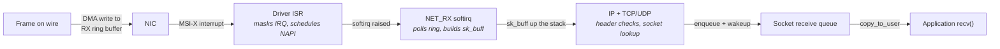
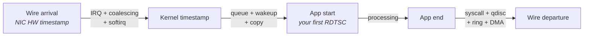

# The Question Bank

Every chapter before this one deliberately withheld its interview questions. They are all here. What
follows is roughly a hundred questions of the kind actually asked in low-latency systems rounds,
grouped by the area they probe, each with a sketch of what a strong answer contains.

Treat the sketches as scaffolds, not scripts. Each one is three to six bullets because that is
roughly what a good spoken answer looks like when it is transcribed: a mechanism, a consequence, a
number with its justification, and a trade-off. It is not a paragraph to recite. If you memorize the
bullets and deliver them verbatim, you will sound exactly like someone who memorized bullets — and
the first follow-up will expose it, because the follow-up always probes the thing the sketch left
implicit. The right way to use a sketch is to read it, close the book, and explain the same thing out
loud in your own words to an empty room. If you cannot, you do not know it yet.

Expect to be pushed past the sketch. As Chapter 1 put it, depth is tested by pushing until you stop
knowing, and the edge of your knowledge is the measurement. That is why the harder questions here
carry an explicit **Follow-up:** — the question the interviewer asks next when your first answer was
correct. Those follow-ups are the actual content of a senior-level interview; the opening question is
just a way in. An answer that stops precisely at the sketch and cannot go further reads as
familiarity. An answer that goes one level deeper unprompted — naming the counter you would check,
the reason the obvious fix fails, the case where the rule inverts — reads as experience.

Each question closes with an italic pointer to the chapter that owns the material. Use it as a
diagnostic: when a sketch reads as a list of unfamiliar assertions rather than a summary of something
you understand, that pointer is telling you which chapter to reread. The bank is meant to be worked
through repeatedly, and a question you answered fluently in week one is not the same question in week
four, because by then the follow-up should also be easy.

Two conventions throughout. All latency figures are order-of-magnitude, for modern x86 server
hardware of the Skylake-and-later class, unless a question says otherwise — quoting them as universal
constants is itself a wrong answer. And where an answer names a tool, counter, or file, it is a real
one; if an interviewer asks for a name you do not have, "I would look for it in `ethtool -S` output"
is a passing answer and an invented flag name is not.

---

## Cache and Memory

This section tests whether you have a mechanical model of what happens between a load instruction
issuing and the data arriving. The characteristic failure is a candidate who knows the cache
hierarchy as a list of sizes and latencies but cannot explain why two programs with identical miss
counts differ by 5× in runtime, or why a working set that fits in L3 can still stall on every access.
Interviewers probe this area early because it is cheap to test and strongly predictive: the mental
model that gets cache questions right is the same one that gets everything else right.

**Q: Walk me through what happens when a load misses in L1.**

- The core allocates a **line-fill buffer** (LFB) to track the outstanding miss and looks up L2; the
  load does not block the core immediately, because out-of-order execution continues past it until a
  dependent instruction needs the result or a resource runs out.
- On an L2 miss the request goes to the shared L3 slice that owns the address, reached over the
  on-die interconnect; on Intel server parts since Skylake-SP, L3 is non-inclusive, so an L3 lookup
  is also a coherence lookup via the snoop filter.
- On an L3 miss the memory controller for that address range is consulted, which may be on the local
  socket or across the interconnect on a remote NUMA node.
- The whole 64-byte line is returned and installed, not just the bytes requested; a subsequent access
  to a neighbouring byte is a hit, which is the entire basis of spatial locality.
- Rough costs: L1 ~4–5 cycles, L2 ~12–15 cycles, L3 ~40 cycles plus interconnect, local DRAM ~80–100
  ns, remote DRAM 1.5–2× that.

**Follow-up: how many of these can be in flight at once, and why does it matter?**

- Roughly 10–16 line-fill buffers per core, so that is the cap on a single core's outstanding misses.
- That cap is why a single thread cannot saturate a server's memory bandwidth no matter how it is
  written — bandwidth requires many cores.
- It is also why *independent* misses are far cheaper per miss than *dependent* ones: the LFBs
  overlap the latencies. This is memory-level parallelism.

*(Chapter 4, "The Cache Hierarchy"; Chapter 5, "Memory Systems")*

**Q: Two loops touch the same amount of memory and generate the same number of cache misses, but one
is five times slower. What is going on?**

- The slow one is a **dependent chain** — pointer chasing, where the address of access *n+1* comes
  from the data returned by access *n*. Nothing can overlap; every miss costs full latency.
- The fast one computes its addresses independently (say, from an index array), so the core issues
  many misses concurrently up to the line-fill buffer limit and overlaps their latencies.
- Miss *count* is the wrong metric; miss *concurrency* is what determines time. Confirm the miss
  counts really are equal with `perf stat -e cache-misses` — that equality is the point of the
  demonstration.
- The practical consequence: converting a linked structure into indices into a dense array is often a
  bigger win than reducing the number of misses.

*(Chapter 5, "Memory Systems")*

**Q: What is false sharing and how would you detect it?**

- Two threads write to *different* variables that happen to occupy the same 64-byte cache line. The
  coherence protocol works at line granularity, so each write invalidates the other core's copy even
  though the data is logically disjoint.
- The line ping-pongs between cores' L1 caches; each write pays a coherence miss rather than an L1
  hit — tens of nanoseconds instead of about one.
- The symptom is negative scaling: adding threads makes throughput worse, with high cycles and low
  instructions retired, so IPC collapses.
- Detect it with PMU events that attribute misses to remote-cache sources rather than DRAM — on
  Intel, the HITM ("hit modified in another core") variants exposed by `perf c2c`, which is built
  specifically for this and reports the offending cache line and the offsets within it.
- The fix is padding and alignment: put each independently-written variable on its own line, and
  separate producer-written from consumer-written fields in shared structures.

**Follow-up: where does false sharing bite that people do not expect?**

- Adjacent array elements indexed by thread ID — the classic per-thread counter array.
- A lock and the data it protects sharing a line, so acquiring the lock invalidates the data.
- The head and tail indices of a ring buffer sharing a line, which turns a lock-free SPSC queue into
  a coherence ping-pong on every operation.

*(Chapter 4, "The Cache Hierarchy")*

**Q: Your working set fits comfortably in L3, cache miss counters look fine, and the code is still
memory-stalled. What else could it be?**

- Translation, not fetch. The data is close; the *directions to the data* are not — the TLB is
  thrashing.
- TLB capacity is measured in translations, not bytes. An L2 STLB of ~1,500–2,000 entries with 4 KiB
  pages reaches only about 6 MiB, far less than a 32 MiB L3.
- Every TLB miss triggers a hardware page walk: up to four dependent memory accesses on x86-64,
  partially absorbed by paging-structure caches and by page-table entries themselves being cacheable.
- Confirm with `perf stat -e dTLB-load-misses,dtlb_load_misses.walk_active,cycles` and compute the
  fraction of cycles spent walking. More than a few percent means translation is the bottleneck.
- The fix is huge pages: the same entry count over 2 MiB pages reaches roughly 3 GiB, and the walk
  terminates one level early.

*(Chapter 5, "Memory Systems")*

**Q: Transparent huge pages or explicit huge pages for a latency-critical process?**

- Explicit — hugetlbfs pages reserved at boot with the `hugepages=` kernel parameter.
- THP's hazard is `defrag`: to hand out a 2 MiB page the kernel needs 2 MiB of physically contiguous
  free memory, and on a fragmented machine it may synchronously compact memory while your thread
  waits. That is a multi-millisecond stall at an unpredictable moment.
- THP also brings `khugepaged`, a background thread that collapses 4 KiB pages into huge pages,
  burning CPU and triggering TLB shootdowns on cores that are running your hot path.
- Explicit huge pages fail *visibly* at reservation time instead of stalling invisibly at touch time,
  and they are not reclaimable or swappable.
- Reserve at boot rather than at runtime, because reservation needs contiguity and physical memory is
  only unfragmented at boot. Set `/sys/kernel/mm/transparent_hugepage/enabled` to `madvise` or
  `never` so nothing gets huge pages by accident.

*(Chapter 5, "Memory Systems"; Chapter 11, "Memory Management")*

**Q: What is a TLB shootdown, and why should a pinned thread on an isolated core care?**

- TLBs are per-core caches of translations, and x86 has no hardware mechanism to invalidate them
  across cores. When a mapping changes, the kernel does it in software.
- The initiating core sends an **inter-processor interrupt** (IPI) to every core that might hold a
  stale translation; each target must interrupt whatever it is doing, invalidate, and acknowledge.
  The initiator waits for all acknowledgements.
- So an unrelated process calling `munmap`, `madvise(MADV_DONTNEED)`, or an allocator returning
  memory to the kernel, interrupts your isolated core. Isolation does not protect you from IPIs.
- Cost is roughly single-digit microseconds, scaling with the number of target cores.
- Confirm by reading the `TLB` row of `/proc/interrupts` before and after an incident and observing
  the count rise on the supposedly quiet core.

*(Chapter 5, "Memory Systems"; Chapter 27, "Jitter Hunting")*

**Q: Why does the first minute after process startup have worse latency than steady state?**

- Minor page faults on first touch. `malloc` returns a pointer almost instantly but the kernel has
  only made a promise; no physical page is mapped until the first *write*, which faults into the
  kernel, gets a frame, zeroes it, and installs the mapping. Roughly 1–3 µs each.
- Caches and TLBs are cold, branch predictors are untrained, and the µop cache holds nothing useful.
- Any lazily-initialized data structure — a hash table that grows, a pool that expands — pays its
  allocation cost during the measurement window.
- Confirm by reading minor fault counts with `ps -o min_flt,maj_flt -p <pid>` before and after, and
  checking whether they climb during the slow phase.
- The remedy is allocate at startup, *touch* every page, and `mlockall(MCL_CURRENT | MCL_FUTURE)`.
  Allocation alone does nothing; the touch is the part that works.

**Follow-up: what if you still see multi-millisecond outliers after doing all that?**

- Check for *major* faults — a page read from storage or swap, 20 µs to many milliseconds. Any
  nonzero major fault count on a hot-path process is a defect.
- Check THP compaction: `/proc/vmstat`'s `compact_stall` rising across the incident.
- Check whether the outliers correlate with allocator behavior — a `malloc` implementation returning
  memory to the kernel and later re-faulting it, or hitting an arena's slow path.

*(Chapter 11, "Memory Management")*

**Q: What is NUMA and what specifically goes wrong on a two-socket trading host?**

- Memory controllers live on the CPU die, so each socket has DIMMs directly attached. A core
  accessing memory owned by the other socket traverses the inter-socket interconnect (Intel UPI, AMD
  Infinity Fabric) — typically 1.5–2× the local latency.
- Worse than the ratio: the interconnect is a *shared* resource carrying everyone's remote traffic
  plus coherence traffic, so remote latency varies with unrelated load in a way local latency does
  not.
- PCIe devices have a NUMA node too. If the NIC hangs off socket 0 and DMAs into memory on socket 1,
  every packet crosses the interconnect before your code sees it.
- Linux defaults to **first-touch**: a page lands on the node of the thread that first *writes* it.
  Allocating and initializing everything in `main`, then spawning workers on both sockets, silently
  puts half the workers on remote memory.
- The correct order is pin the thread, then allocate, then touch from that thread. Verify with
  `numastat -p <pid>` and `/proc/<pid>/numa_maps`.

**Follow-up: single-socket machine — can I stop worrying?**

- No. Intel Sub-NUMA Clustering and AMD's chiplet/CCX topology both expose multiple NUMA nodes inside
  one socket, with real latency differences.
- Always discover topology per machine: `numactl --hardware`, `lscpu`,
  `/sys/devices/system/node/node*/cpulist`, and `/sys/class/net/<iface>/device/numa_node` for the NIC.
- The distance matrix `numactl` prints is a firmware-supplied estimate, not a measurement. Measure
  the real ratio with a pointer-chasing benchmark under `--cpunodebind` and `--membind`.

*(Chapter 5, "Memory Systems")*

**Q: Explain cache associativity and how it produces a conflict miss.**

- A cache is divided into **sets**; an address maps to exactly one set by its index bits, and within
  that set it may occupy any of *N* **ways**. *N* is the associativity.
- A conflict miss happens when more than *N* live lines map to the same set, so they evict each other
  even though the cache as a whole has free capacity elsewhere.
- Because the index bits are middle address bits, addresses separated by a large power-of-two stride
  all land in the same set. A stride of exactly 4096 bytes over many arrays is the classic trigger.
- The symptom is a performance cliff at a round-numbered array size or stride, which disappears if
  you pad the stride by one line.
- Distinguish from compulsory misses (first ever touch, unavoidable except by prefetching) and
  capacity misses (working set exceeds the cache).

*(Chapter 4, "The Cache Hierarchy")*

**Q: What does a hardware prefetcher actually detect, and how do you cooperate with it?**

- Modern x86 cores have several prefetchers: a next-line prefetcher, a stride/IP-based prefetcher
  that learns constant strides per load instruction, and an L2 streamer that follows detected streams.
- They work on *physical* addresses within a page and generally do not prefetch across a 4 KiB page
  boundary — which is a second, less-known reason huge pages help streaming access.
- They detect sequential and constant-stride patterns. They cannot detect pointer chasing, indirect
  gathers, or hash lookups, because the address is not predictable from prior addresses.
- Cooperate by traversing contiguously, keeping strides small and regular, and using indices into
  dense arrays rather than pointers to individually allocated objects.
- Prefetching costs bandwidth and can evict useful lines; on a machine where the hot path is small and
  latency-bound, aggressive prefetch of cold data is a net loss.

*(Chapter 3, "CPU Microarchitecture Essentials")*

**Q: AoS or SoA?**

- The question is always: which fields are touched together, and how often?
- Array-of-structs wins when you process a whole record at a time — all fields on one or two lines.
- Struct-of-arrays wins when you scan one field across many records — every byte of every fetched
  line is used instead of a small fraction.
- Line *utilization* is the metric: bytes actually consumed divided by bytes fetched, where bytes
  fetched is miss count × 64.
- In practice a hybrid usually wins: pack hot fields into a compact structure and push cold fields to
  a parallel array so they stop displacing useful lines.

*(Chapter 5, "Memory Systems")*

**Q: Why does adding one field to a struct sometimes cause a disproportionate slowdown?**

- The record crossed the 64-byte boundary. A 60-byte record fits in one line; a 68-byte record
  straddles two, so every access fetches two lines — a far larger regression than the 13% size
  increase suggests.
- Or records-per-line dropped from three to two, cutting effective cache capacity by a third for that
  structure.
- Alignment holes compound it: compilers pad to satisfy each field's alignment, so field *order*
  changes size. Ordering largest-to-smallest minimizes interior padding.
- A field that crosses a page boundary is worse still — two TLB entries and potentially two page
  walks for one access.
- Confirm by printing the structure size, comparing against the sum of field sizes, and comparing
  cache miss counts before and after.

*(Chapter 5, "Memory Systems"; Chapter 4, "The Cache Hierarchy")*

**Q: What is a non-temporal store and when would you use one?**

- An ordinary store that misses allocates the line: the core fetches the line from memory (a
  *read-for-ownership*) just to overwrite it, wasting bandwidth and polluting the cache.
- A non-temporal store writes through write-combining buffers to memory, bypassing the cache
  hierarchy and avoiding the read-for-ownership.
- Use it for large writes you will not read back — filling a buffer that DMA will consume, or writing
  a log region — where cache pollution would evict the hot working set.
- It requires care with ordering: non-temporal stores are weakly ordered relative to other stores and
  need an explicit store fence before anything can observe them reliably.
- Misusing it is easy: if you *do* read the data back soon, you have converted a cache hit into a
  DRAM round trip.

*(Chapter 4, "The Cache Hierarchy")*

**Q: Why is DRAM latency variable rather than a constant?**

- DRAM reads a whole **row** (~1–2 KiB) into a row buffer of sense amplifiers; a bank holds exactly
  one open row at a time.
- Three outcomes: **row hit** (row already open — pay only column access), **row miss with idle bank**
  (activate then read), and **row conflict** (precharge the open row, activate yours, then read).
  Each of tCAS, tRCD, tRP is on the order of 12–20 ns, so the device contribution ranges roughly
  15–50 ns.
- The memory controller *reorders* requests to maximize row hits and bus utilization. Your
  latency-critical load can be deferred behind a batch job's requests purely because that ordering
  yields better aggregate bandwidth.
- Refresh adds small periodic unavoidable bumps, since a rank being refreshed cannot serve requests.
- Address interleaving spreads consecutive addresses across channels and banks; a stride aligned with
  the interleaving can serialize onto one bank.

*(Chapter 5, "Memory Systems")*

**Q: What happens to latency as memory bandwidth utilization rises?**

- It is a hockey stick, not a line. Queues at the memory controller are empty at low utilization and
  deep near saturation.
- Roughly: stable near 90 ns at low utilization, visibly worse and with a widening tail around 60%,
  and 200 ns or more with an exploding tail near saturation.
- Both p50 and p99 degrade, but p99 degrades far faster — which is what matters.
- This is the technical justification for keeping bandwidth-hungry work (logging, compression,
  monitoring agents streaming through memory) off the hot-path socket. It is not stealing CPU so much
  as pushing the whole socket up the curve.
- Measure with the uncore integrated memory controller counters — on Intel,
  `perf stat -e uncore_imc/cas_count_read/,uncore_imc/cas_count_write/`, with names varying by
  platform.

*(Chapter 5, "Memory Systems")*

**Q: How would you keep the hot path resident in cache?**

- Shrink the working set until it genuinely fits: this is the only fix that always works. Hybrid
  hot/cold layout, smaller records, indices instead of pointers.
- Keep cold-path code out of the hot instruction stream, since L1i is a scarce resource and a rarely
  taken branch into a large cold function evicts hot lines and pollutes the µop cache.
- Warm deliberately: run the hot path against synthetic input during quiet periods so code, data,
  branch predictors, and TLB entries stay resident. The concern is real — a path exercised once a
  second is cold every time.
- Keep the neighbours off the shared L3, since it is shared across the socket and a streaming
  neighbour will evict you. Cache partitioning technologies exist on some server parts to enforce
  this; availability is vendor- and SKU-specific.
- Verify with `perf stat` on `cache-references`, `cache-misses`, and `LLC-load-misses` rather than by
  reasoning about it.

*(Chapter 4, "The Cache Hierarchy")*

**Q: A branch mispredict — what does it actually cost and why?**

- The frontend speculatively fetches and decodes down the predicted path, and the backend executes
  those instructions out of order. When the branch resolves and the prediction was wrong, everything
  after the branch must be discarded and the pipeline refilled from the correct target.
- The cost is roughly the pipeline depth: on the order of 15–20 cycles on modern x86, so about 5 ns
  at typical clocks.
- It is worse than the raw number suggests when the correct path then misses in L1i or the µop cache,
  because the refill itself stalls.
- Rare-branch cost is invisible in averages and shows up in the tail: an error path taken once in ten
  thousand iterations mispredicts nearly every time it is taken.
- Measure with `perf stat -e branches,branch-misses`, and locate them with `perf record -e
  branch-misses`.

*(Chapter 3, "CPU Microarchitecture Essentials")*

---

## Concurrency and Memory Ordering

This is where interviews separate people who have written threaded code from people who understand
what the hardware does with it. The area tests three things at once: what the coherence protocol
costs, what reorderings the architecture permits, and what a synchronization primitive does on its
slow path. The most common failure is treating "atomic" as a synonym for "fast" and "lock-free" as a
synonym for "low latency" — both of which are wrong in ways an interviewer will find quickly.

**Q: Explain MESI and what happens when two cores write the same cache line alternately.**

- Each cached line has a state: **M**odified (dirty, exclusive to this core), **E**xclusive (clean,
  only this core has it), **S**hared (clean, possibly in several caches), **I**nvalid.
- To write, a core needs the line in M or E. If another core holds it, the writer issues a
  request-for-ownership, the holder's copy is invalidated, and if it was Modified the data is
  transferred.
- Alternating writes therefore transfer ownership of the line back and forth on every write. Each
  transfer is a coherence miss.
- Cost is on the order of 30–80 ns for a cross-core transfer within a socket, and considerably more
  across sockets — comparable to or worse than a DRAM miss, which surprises people.
- Real protocols add states: MESIF's **F**orward designates one sharer to respond, MOESI's **O**wned
  allows dirty sharing. The point of both is to avoid going to memory when another cache has the data.

**Follow-up: is a coherence miss cheaper or more expensive than a DRAM miss?**

- Within a socket, a clean transfer from another core's cache can be comparable to L3 latency.
- A *dirty* transfer — the other core has it Modified — is more expensive, and across sockets it can
  exceed local DRAM latency outright.
- So "it's in cache" is not automatically good news: it depends whose cache and in what state. This
  is exactly what `perf c2c` is built to show.

*(Chapter 6, "Multicore, Coherence, and Memory Ordering")*

**Q: x86 is described as having a strong memory model. What reordering does it still permit?**

- x86 implements **TSO**, total store order: loads are not reordered with loads, stores are not
  reordered with stores, and loads are not reordered with earlier stores to the same location.
- The one reordering permitted is **StoreLoad**: a store followed by a load to a *different* address
  may appear to execute out of order, because the store sits in the core's store buffer while the
  later load reads from cache.
- That is precisely the reordering that breaks Dekker-style mutual exclusion and the "store my flag,
  then read yours" pattern, where both threads can read stale values.
- The fix is a full barrier — on x86, `MFENCE` or, more commonly, any `LOCK`-prefixed instruction,
  which has the same fencing effect as a side effect.
- Consequence: on x86 acquire and release ordering are essentially free at the hardware level;
  sequential consistency is not, because it requires draining the store buffer.

**Follow-up: what does a store buffer do for you, and what does it cost?**

- It lets a store retire without waiting for the line to arrive in a writable state, hiding coherence
  latency from the pipeline.
- Store-to-load forwarding lets a subsequent load of the same address read directly from the buffer.
- The cost is the visible StoreLoad reordering, plus stalls when the buffer fills — a burst of stores
  to lines the core does not own will back it up and stall retirement.
- On weakly ordered architectures the same buffer exists but far more reorderings are exposed, which
  is why portable code needs explicit acquire/release semantics even though x86 would not.

*(Chapter 6, "Multicore, Coherence, and Memory Ordering")*

**Q: What does the `LOCK` prefix actually do, and what does an atomic cost?**

- It makes a read-modify-write sequence appear indivisible. Historically it asserted a bus lock;
  modern implementations hold the line in Modified state in the local cache for the duration of the
  operation, which is far cheaper.
- Uncontended, on a line already in the core's L1 in Modified state, the cost is on the order of
  20 cycles — expensive relative to a normal store, cheap relative to anything involving another core.
- Contended, every operation is a coherence transfer, so throughput collapses and latency becomes a
  function of how many cores are competing.
- The pathological case is an atomic on a line that *spans* a cache line boundary — a split lock —
  which on modern hardware falls back to a far more expensive mechanism that stalls the whole system
  briefly. Linux can be configured to detect these.
- It also acts as a full barrier, so a `LOCK`-prefixed operation is doing two jobs at once.

*(Chapter 6, "Multicore, Coherence, and Memory Ordering")*

**Q: What is a futex and why does an uncontended mutex not enter the kernel?**

- A mutex is an atomic word in user space plus a kernel wait queue reached via the `futex` syscall.
- The fast path is entirely user space: an atomic compare-and-swap on the word. Uncontended lock and
  unlock cost tens of nanoseconds, no syscall.
- Only on contention does the loser call `futex(FUTEX_WAIT)` to sleep on that address, and only if
  waiters exist does the unlocker call `futex(FUTEX_WAKE)`.
- So mutex cost is bimodal: tens of nanoseconds uncontended, several microseconds contended, because
  the slow path is a syscall plus a deschedule plus a wakeup plus a context switch back.
- That bimodality is exactly what a latency-sensitive system cannot tolerate — the average is
  irrelevant when the tail is a scheduling event.

**Follow-up: so should the hot path use a spinlock instead?**

- Only if the holder is guaranteed to be running on another core and the critical section is very
  short — otherwise you spin while the holder is descheduled and burn a full timeslice.
- Spinning also generates coherence traffic on the lock line; a naive spin on an atomic
  read-modify-write is much worse than a test-then-test-and-set that spins on a plain load.
- Use the `PAUSE` instruction in the spin loop to reduce memory-order machine clears and power draw.
- The honest answer is usually neither: restructure so the hot path does not share mutable state, via
  an SPSC ring buffer, so there is no lock to contend on.

*(Chapter 12, "Synchronization and IPC")*

**Q: What is priority inversion and how do you handle it?**

- A high-priority thread blocks on a lock held by a low-priority thread, which cannot run because a
  medium-priority thread is occupying the CPU. The high-priority thread is effectively running at the
  low priority.
- Under `SCHED_FIFO` this is unbounded: the low-priority holder may never be scheduled at all, since
  real-time classes do not yield to lower priorities on their own.
- Priority inheritance fixes it by temporarily boosting the holder to the waiter's priority for the
  duration; POSIX exposes this as a mutex protocol attribute.
- Inheritance is not free — it makes lock operations more expensive and does not bound the critical
  section length, only the interference.
- The structural fix in a latency system is to avoid sharing locks across priority levels at all.

*(Chapter 12, "Synchronization and IPC"; Chapter 10, "Processes, Threads, and Scheduling")*

**Q: Design an SPSC ring buffer for inter-thread messaging. What are the performance-critical
details?**

- A fixed-size array plus a head index written only by the consumer and a tail index written only by
  the producer. Neither side writes the other's index, so no atomic read-modify-write is needed —
  only ordered loads and stores.
- Head and tail must be on *separate cache lines*, padded. Sharing a line makes every operation a
  coherence transfer between producer and consumer and destroys the whole design.
- Each side caches the other's index locally and only re-reads it when its cached copy says the queue
  is full or empty. This removes the cross-core read from the common case.
- Ordering: the producer must publish the data before publishing the tail (release), and the consumer
  must read the tail before reading the data (acquire). On x86 these need no fence instructions, but
  the compiler must still be prevented from reordering.
- Power-of-two capacity so the index wrap is a mask rather than a division, and cache-line-aligned
  slots so a message does not straddle lines unnecessarily.

**Follow-up: how do you handle a slow consumer?**

- Decide the policy explicitly: block the producer, drop the newest, or overwrite the oldest. Each is
  right in a different context, and having no policy means the queue fills and the producer stalls on
  the hot path.
- For market-data-style feeds, overwriting the oldest keeps the hot path non-blocking at the cost of
  the consumer missing data — acceptable for telemetry, unacceptable for state that must be complete.
- Instrument occupancy, not just drop counts: a queue that is usually 90% full is about to become a
  latency problem and no drop counter shows that yet.

*(Chapter 12, "Synchronization and IPC")*

**Q: What is the ABA problem?**

- A lock-free algorithm reads a value A, prepares an update, and uses compare-and-swap to commit,
  assuming that A being unchanged means nothing happened.
- But another thread may have changed A to B and back to A. The CAS succeeds while the underlying
  structure has been mutated — classically a node freed and reallocated at the same address.
- Mitigations: a tagged pointer with a version counter incremented on every change and swapped
  atomically alongside the pointer (double-width CAS on x86-64), or avoiding reuse of addresses.
- The deeper problem is memory reclamation: you cannot free a node while another thread may still
  hold a pointer to it. Hazard pointers and epoch-based reclamation solve this, at the cost of
  bookkeeping and deferred frees.
- Deferred free means memory is returned in batches, which is itself a latency event — one reason
  lock-free structures are not automatically low-latency.

*(Chapter 12, "Synchronization and IPC")*

**Q: Lock-free versus wait-free — and does lock-free mean fast?**

- **Lock-free** guarantees that *some* thread makes progress; an individual thread can be starved
  arbitrarily long by others' successful CAS operations.
- **Wait-free** guarantees *every* thread completes in a bounded number of steps regardless of others.
- Neither says anything about latency. A lock-free stack under heavy contention can be far slower and
  far more variable than a mutex, because every failed CAS is a wasted coherence transfer.
- What lock-free actually buys is immunity to a participant being descheduled or killed mid-operation
   — valuable for shared memory across processes, where a crashed peer must not hold a lock forever.
- The right framing in an interview: choose lock-free for the *progress* guarantee, not for speed, and
  measure rather than assume.

*(Chapter 12, "Synchronization and IPC")*

**Q: Should you disable SMT (hyperthreading) on a trading host?**

- Two hardware threads on a core share the L1 and L2 caches, the TLBs, the execution ports, and the
  frontend. A sibling running anything at all steals those resources.
- The effect on the hot path is jitter: your instruction stream's throughput now depends on what an
  unrelated thread is doing, which is the opposite of determinism.
- Common practice is to disable SMT in BIOS on latency-critical hosts, accepting less aggregate
  throughput for more predictable per-thread performance. This is a genuine trade-off, not a
  universal truth.
- The middle path is to leave SMT enabled but isolate *both* siblings of every hot-path core so no
  other work can land on the partner thread — `lscpu` and
  `/sys/devices/system/cpu/cpu*/topology/thread_siblings_list` tell you the pairing.
- Say the trade-off aloud: disabling SMT halves your logical core count, which matters if the same
  host runs support work.

*(Chapter 6, "Multicore, Coherence, and Memory Ordering")*

**Q: How do you wake another thread with the lowest possible latency?**

- Do not wake it — have it spinning. A busy-polling consumer sees a published value in tens of
  nanoseconds. Any kernel-mediated wakeup costs microseconds.
- If you must block, the cost is the syscall, the scheduler run, the IPI to the target core if it is
  idle or running something else, and the context switch in — several microseconds end to end, more
  if the target core is in a deep C-state.
- C-state exit is the hidden term: waking a core from a deep idle state adds tens of microseconds on
  top. This is why latency-critical hosts limit C-states via `intel_idle.max_cstate` or
  `processor.max_cstate`.
- The hybrid is spin-then-block: spin for a bounded interval, then fall back to blocking so an idle
  system does not burn a core forever. Choose the spin duration relative to the wakeup cost you are
  avoiding.
- The cost of spinning is a permanently busy core, more power, more heat, and less turbo headroom for
  neighbours — state that trade-off rather than presenting spinning as free.

*(Chapter 12, "Synchronization and IPC"; Chapter 10, "Processes, Threads, and Scheduling")*

**Q: What is a memory-order machine clear?**

- The core speculatively executes loads out of order. If another core modifies a line that a
  speculatively-executed load already read, the speculation violated the memory model and the
  pipeline must be flushed and re-executed.
- It is roughly as expensive as a branch mispredict, sometimes worse, and it is caused by *another
  core's* behavior — so it is invisible in single-threaded profiling.
- It is a strong signal of contention on a shared line, often the same lines that show up in false
  sharing analysis.
- On Intel, the `machine_clears.memory_ordering` event counts them; availability and naming vary by
  microarchitecture.
- Spin loops without `PAUSE` are a classic generator, which is part of why `PAUSE` exists.

*(Chapter 6, "Multicore, Coherence, and Memory Ordering")*

**Q: Two threads on the same socket exchange a message through shared memory. Where does the time
go?**

- Producer writes the payload: if the line is not in its L1 in a writable state, a request-for-
  ownership from the consumer's cache, tens of nanoseconds.
- Producer publishes the index with a release store; consumer's polling load of that index misses
  because the producer just invalidated it — another coherence transfer.
- Consumer reads the payload: another set of coherence transfers, one per line of the message.
- So a small message costs a handful of cross-core line transfers, landing in the low hundreds of
  nanoseconds — dominated entirely by coherence, not by the copy itself.
- This is why message size matters less than line count, and why keeping the message within one or
  two lines is a real optimization.

*(Chapter 6, "Multicore, Coherence, and Memory Ordering"; Chapter 12, "Synchronization and IPC")*

**Q: Why can a condition variable wakeup be much slower than the signal suggests?**

- The signaller marks the waiter runnable; the waiter still has to be *scheduled*, which depends on
  the target core being available and the scheduler picking it.
- If the waiter's core is idle in a deep C-state, add the exit latency. If it is running another
  runnable task under CFS/EEVDF, the waiter may wait for a scheduling opportunity.
- Then the woken thread runs with cold caches and a cold TLB — the wakeup latency is only part of the
  cost; the first thousand instructions after it are slow too.
- The thundering herd variant: broadcasting to many waiters wakes them all, they all contend for the
  associated mutex, and all but one immediately block again.
- Measure it directly rather than assuming — `perf sched` or a `sched:sched_wakeup` to
  `sched:sched_switch` trace gives the real distribution, and its tail will be much worse than its
  median.

*(Chapter 12, "Synchronization and IPC")*

**Q: Where does a shared-memory IPC transport beat a Unix domain socket, and where does it not?**

- Shared memory with an SPSC ring is user-space only: no syscall, no copy into and out of kernel
  buffers, latency in the low hundreds of nanoseconds with a polling consumer.
- A Unix domain socket costs two syscalls and at least one copy through kernel buffers, landing in
  the low single-digit microseconds — plus a wakeup if the reader blocks.
- What the socket gives you that shared memory does not: flow control, framing, connection lifetime
  and EOF semantics, and the ability to wait on it with `epoll` alongside other descriptors.
- Shared memory forces you to build all of that yourself, including deciding what happens when a peer
  dies mid-write, which is the hard part.
- A common hybrid: shared memory for the data path plus an `eventfd` for wakeups, so a consumer can
  block when idle and poll when busy.

*(Chapter 12, "Synchronization and IPC")*

---

## Operating Systems and Scheduling

The question this section really asks is whether you understand that the kernel is a *shared*
resource that will interfere with you unless configured not to. Candidates who have only written
application code tend to describe the OS as a service that responds when called. Interviewers are
looking for the other model: a large concurrent system running on the same cores as your hot path,
with timers, background threads, interrupts, and reclaim work that will preempt you at the worst
moment. Nearly every question here is a variation on "what runs on my core that I did not put there."

**Q: What does a syscall actually cost, and why is it more than the instruction?**

- The `SYSCALL` instruction itself switches privilege level and jumps to the kernel entry point — a
  few tens of cycles.
- Around it sits the real cost: saving and restoring registers, switching to the kernel stack,
  validating arguments, and on return, checking for pending signals and reschedule requests.
- Total is on the order of 100 ns for a trivial syscall on an unmitigated modern machine, and
  several hundred nanoseconds with Spectre/Meltdown mitigations enabled, because KPTI switches page
  tables on entry and exit and the indirect-branch mitigations flush prediction state.
- The indirect cost is often larger than the direct one: the kernel path evicts your L1i, L1d, and
  branch predictor state, so the code after the syscall runs slower too.
- Measure it yourself: a tight loop of a cheap syscall, timed, is a one-line experiment and the
  number is worth knowing for your specific machine and mitigation configuration.

**Follow-up: how do you get the time of day without a syscall?**

- The **vDSO** — a small shared library the kernel maps into every process, containing
  implementations of a few calls that read kernel-maintained data from a shared page instead of
  trapping.
- `clock_gettime` with `CLOCK_MONOTONIC` is the important one; it reads the TSC and applies a
  scaling factor from the shared page, costing on the order of 20–30 ns rather than 100+.
- It only works when the clocksource supports it — if the system falls back to HPET, the vDSO path
  degrades to a real syscall and gets an order of magnitude slower. Check
  `/sys/devices/system/clocksource/clocksource0/current_clocksource`.
- Reading the TSC directly via `RDTSC` is cheaper still (a couple of tens of cycles) but gives you
  cycles, not time, and requires an invariant TSC plus your own calibration.

*(Chapter 9, "Kernel Architecture and the Syscall Boundary"; Chapter 7, "Clocks, Timers, and Time")*

**Q: What actually happens in a context switch, and what does it cost?**

- The kernel saves the outgoing task's register state, switches kernel stacks, updates scheduler
  bookkeeping, and restores the incoming task's state. If the switch crosses processes, it also
  reloads `CR3` to change address space.
- Direct cost is on the order of 1–3 µs; the register save/restore is a small part of it.
- The indirect cost is usually larger: caches and TLB now hold the wrong data. A thread returning
  after a switch runs at reduced speed for thousands of instructions while it refills.
- Cross-process switches cost more than cross-thread ones because of the address space change, and
  with KPTI enabled the page table switching is more expensive still.
- Count them with `perf stat -e context-switches,cpu-migrations`; a pinned hot-path thread should
  show essentially none in steady state, and any migration at all is a bug.

*(Chapter 10, "Processes, Threads, and Scheduling")*

**Q: `SCHED_FIFO` versus `SCHED_OTHER` for a hot-path thread. What are you actually buying, and what
can go wrong?**

- `SCHED_OTHER` (CFS/EEVDF) is fair-share: your thread gets a slice proportional to its weight and
  will be preempted so others can run. Latency is not a design goal of that policy.
- `SCHED_FIFO` runs until it blocks or yields, and preempts everything in lower classes. A
  `SCHED_FIFO` thread is not descheduled by a `SCHED_OTHER` thread becoming runnable.
- What goes wrong: a `SCHED_FIFO` thread that busy-loops on a core with kernel work pending can
  starve that work. Linux's real-time throttling
  (`/proc/sys/kernel/sched_rt_runtime_us` and `sched_rt_period_us`) exists to prevent a runaway
  real-time thread from locking the machine, and it will preempt your thread if it exceeds the
  budget — often a surprise.
- Priority inversion becomes unbounded under FIFO, since a lower-priority lock holder may never run.
- Set it with `chrt`; combine with pinning, because a real-time thread on a shared core is still
  competing with interrupts and kernel threads.

**Follow-up: if the thread is pinned to an isolated core, does the policy still matter?**

- Less, but it is not free — `isolcpus` keeps the *scheduler* from placing other tasks there, but
  per-CPU kernel threads, IPIs, and timer interrupts still occur.
- `SCHED_FIFO` ensures that when a kernel worker does become runnable on your core, it does not
  preempt you as an equal.
- The strongest configuration combines isolation, pinning, a real-time policy, `nohz_full` to stop
  the tick, and `rcu_nocbs` to move RCU callback processing off the core.

*(Chapter 10, "Processes, Threads, and Scheduling"; Chapter 15, "Tuning a Linux Box for Determinism")*

**Q: What does `isolcpus` do, and what does it *not* do?**

- It removes the listed CPUs from the default scheduler's load balancing, so ordinary tasks are not
  placed there unless explicitly pinned.
- It does not stop the timer tick, does not move interrupts, does not stop per-CPU kernel threads,
  and does not prevent IPIs such as TLB shootdowns.
- `nohz_full` complements it by disabling the periodic scheduler tick on those cores when exactly one
  runnable task is present — with more than one, the tick returns.
- `rcu_nocbs` moves RCU callback invocation off those cores to housekeeping cores, removing another
  source of periodic work.
- Interrupt affinity must be handled separately: `irqaffinity=` on the kernel command line for the
  default mask, plus per-IRQ steering via `/proc/irq/<n>/smp_affinity`, verified in
  `/proc/interrupts`.

*(Chapter 10, "Processes, Threads, and Scheduling"; Chapter 15, "Tuning a Linux Box for Determinism")*

**Q: Your pinned, isolated thread still shows periodic microsecond-scale jitter. Name five plausible
sources.**

- **Timer interrupts** — the scheduler tick still fires unless `nohz_full` is configured and the core
  has exactly one runnable task. Check `/proc/interrupts` for `LOC` on that core.
- **IPIs** — TLB shootdowns, function-call IPIs, reschedule IPIs from other cores. Check the `TLB`,
  `CAL`, and `RES` rows of `/proc/interrupts`.
- **SMIs** — system management interrupts from firmware, invisible to the OS, which stop all cores
  and can last tens to hundreds of microseconds. Count them with `turbostat`'s SMI column.
- **Frequency and C-state transitions** — turbo changes and idle-state exits, visible in `turbostat`.
- **Page faults or allocator activity** — check `ps -o min_flt,maj_flt`, and `/proc/vmstat` for
  compaction stalls.
- Others worth naming: RCU callbacks, kernel worker threads (`kworker`), NMI watchdog, and
  cross-socket coherence traffic from a neighbour.

**Follow-up: how do you attribute a specific spike to a specific cause?**

- Correlate timestamps: record the hot path's per-event timestamps, then trace kernel entries in the
  same window with `ftrace` or `bpftrace` and align them.
- `perf sched` and the `sched:` and `irq:` tracepoints give you what ran and when.
- For hardware-level attribution, Intel PT reconstructs the exact instruction stream around the
  spike, which is the tool of last resort when nothing else explains it.
- The general method is to reproduce the spike under a trace that is cheap enough not to change the
  behavior — a trace that adds microseconds cannot diagnose microsecond problems.

*(Chapter 27, "Jitter Hunting"; Chapter 15, "Tuning a Linux Box for Determinism")*

**Q: Why do C-states and P-states matter for latency?**

- **C-states** are idle states. Deeper states save more power but take longer to exit — from under a
  microsecond for shallow states to tens of microseconds for deep package states, during which the
  core cannot run your code.
- A core that has been idle waiting for a packet is exactly the core that needs to respond fastest,
  so the power saving lands precisely where you cannot afford it.
- **P-states** are frequency/voltage operating points. Transitions take time, and a core that has
  been idle may run at a low frequency for the first microseconds after waking.
- Turbo makes it worse for determinism, not better: achievable frequency depends on how many cores
  are active and on thermal headroom, so identical code runs at different speeds at different times.
- Control via BIOS, the `intel_pstate`/`acpi-cpufreq` driver and the `performance` governor
  (`/sys/devices/system/cpu/cpu*/cpufreq/scaling_governor`), and boot parameters such as
  `intel_idle.max_cstate` or `processor.max_cstate`. Verify with `turbostat`, not with configuration
  files.

*(Chapter 7, "Clocks, Timers, and Time"; Chapter 15, "Tuning a Linux Box for Determinism")*

**Q: What is the difference between a minor and a major page fault, and which is acceptable on a hot
path?**

- **Minor**: the kernel knows the mapping but has not installed it in the page tables — first touch
  of anonymous memory, a copy-on-write break, or a page already in the page cache. Roughly 1–3 µs.
- **Major**: the page's contents must be read from storage or swap. Tens of microseconds to many
  milliseconds.
- Neither is acceptable in steady state on a hot path; minor faults are acceptable during startup, by
  design, if you pre-fault deliberately.
- Read them per-process from `/proc/<pid>/stat` or more readably `ps -o min_flt,maj_flt -p <pid>`.
- Prevent both with pre-allocation, pre-touching, `mlockall(MCL_CURRENT | MCL_FUTURE)`, and no swap.

*(Chapter 11, "Memory Management")*

**Q: What does `mlockall` do and what does it not do?**

- It pins the process's pages in physical memory so the kernel will not reclaim or swap them, and
  with `MCL_FUTURE` applies the same to subsequently mapped memory.
- With `MCL_CURRENT` it also pre-faults existing mappings, so the pages become resident at the point
  of the call rather than on first touch.
- It does not stop the allocator from returning memory to the kernel and re-obtaining it later, so a
  process can still take minor faults on newly-mapped regions.
- It does not defragment or place memory, does not affect NUMA node choice, and does not prevent TLB
  shootdowns.
- It requires privilege or a sufficient `RLIMIT_MEMLOCK`, which is a common deployment failure —
  the call fails silently if nobody checks the return value.

*(Chapter 11, "Memory Management")*

**Q: How does `epoll` differ from `poll`, and where does it still cost you?**

- `poll` passes the entire descriptor set into the kernel on every call, so the kernel does O(n) work
  per call regardless of how many descriptors are ready.
- `epoll` keeps the interest set in the kernel across calls and returns only ready descriptors, so
  the per-call cost scales with readiness rather than with set size.
- The remaining cost is the syscall itself plus, if no descriptor is ready, blocking and being woken
  — which is the microsecond-scale path, not the nanosecond-scale one.
- Edge-triggered mode reports a transition rather than a state, so it delivers fewer wakeups but
  requires you to drain each descriptor until `EAGAIN` or you will lose events.
- For a single hot socket, `epoll` is the wrong tool entirely — it is a scalability mechanism, and the
  hot path wants busy polling or kernel bypass instead.

*(Chapter 13, "I/O Subsystems")*

**Q: What does `io_uring` change, and does it help a latency-critical path?**

- It replaces per-operation syscalls with two shared-memory ring buffers — a submission queue and a
  completion queue — so operations can be queued and reaped without entering the kernel per
  operation.
- In polled modes the kernel side can poll the submission queue from its own thread, allowing
  submission with no syscall at all; the cost is a kernel thread burning CPU.
- It genuinely helps throughput-oriented and storage-heavy workloads by amortizing the syscall
  boundary.
- For a single-socket receive path measured in nanoseconds, it removes the syscall but not the
  network stack, so kernel bypass remains the bigger lever.
- It is also a fast-moving interface with a history of behavior changing across kernel versions,
  which matters when your production kernel is pinned.

*(Chapter 13, "I/O Subsystems")*

**Q: Why is `malloc` a problem on the hot path, and what do you do instead?**

- Cost is bimodal and unbounded: a fast path from a thread-local cache in tens of nanoseconds, and a
  slow path that takes a lock, refills from a central arena, or calls `mmap`/`brk` to get more memory
  from the kernel.
- The `mmap` path adds a syscall plus minor faults on first touch of the new region, and freeing back
  to the kernel adds `munmap` and TLB shootdowns affecting other cores.
- Different allocators trade differently — glibc's malloc, tcmalloc, and jemalloc have different
  arena, caching, and return-to-OS policies — but all of them have a slow path.
- The hot path answer is to not allocate at all: pre-allocated pools and ring buffers sized at
  startup, with fixed-size slots.
- If you must allocate, tune the allocator to never return memory to the kernel and keep per-thread
  caches large enough that the slow path is never reached in steady state.

*(Chapter 11, "Memory Management")*

**Q: What is the OOM killer and how do overcommit settings interact with a latency system?**

- Linux by default overcommits: it grants more virtual memory than it has physical memory plus swap,
  on the assumption that most of it will never be touched.
- When physical memory genuinely runs out, the kernel selects a process and kills it. Selection is
  score-based and biased toward large-RSS processes — which is your process.
- `vm.overcommit_memory` controls the policy; strict accounting makes allocation fail visibly instead
  of succeeding and killing you later.
- For a latency host the relevant configuration is: no swap, memory locked, size the box so the
  working set fits with headroom, and adjust `/proc/<pid>/oom_score_adj` so the hot process is not
  the first choice.
- Note the interaction with `mlockall`: locked memory cannot be reclaimed, so it makes OOM *more*
  likely under pressure, not less. That is the correct trade — visible failure over invisible
  stalls — but say it explicitly.

*(Chapter 11, "Memory Management")*

**Q: What is the vDSO and what breaks it?**

- A kernel-provided shared object mapped into every process containing user-space implementations of
  a few calls that only need to read kernel-maintained data, avoiding the trap entirely.
- `clock_gettime`, `gettimeofday`, and `time` are the ones that matter; they read a shared page and
  the TSC.
- It breaks when the clocksource cannot be read from user space — falling back to HPET or the ACPI PM
  timer turns the call into a real syscall and an order-of-magnitude slowdown, sometimes with an
  MMIO read on top.
- Confirm the active clocksource with
  `/sys/devices/system/clocksource/clocksource0/current_clocksource`; it should read `tsc`.
- The kernel demotes the TSC if it detects instability, so a machine can silently switch clocksources
  at runtime and your timestamps become expensive. Alert on this.

*(Chapter 9, "Kernel Architecture and the Syscall Boundary"; Chapter 7, "Clocks, Timers, and Time")*

**Q: How does `RDTSC` behave and what do you have to be careful about?**

- It reads a per-core counter. On modern parts the TSC is **invariant**: it increments at a constant
  rate independent of the core's current frequency and does not stop in idle states.
- It is not serializing, so out-of-order execution can move it relative to the code you are timing.
  `RDTSCP` and `LFENCE`-bracketed sequences constrain that; each adds cost.
- It counts *reference* cycles, not actual cycles, so you cannot derive real clock frequency from it,
  and you need a calibration to convert to nanoseconds.
- Cross-core comparison requires the TSCs to be synchronized. Firmware usually synchronizes them at
  boot on a single-socket system; cross-socket synchronization is generally maintained but should be
  verified rather than assumed.
- Cost is a couple of tens of cycles, cheap enough to instrument a hot path — but not free, so
  measure the measurement overhead and subtract it.

*(Chapter 7, "Clocks, Timers, and Time")*

**Q: What do Spectre and Meltdown mitigations cost, and would you disable them?**

- KPTI (page table isolation) unmaps most of the kernel from the user-mode page tables, so every
  syscall and interrupt switches `CR3` twice, invalidating TLB state. This is the largest term.
- Indirect-branch mitigations (retpolines, IBRS/IBPB variants) make indirect branches slower or flush
  branch-prediction state at privilege boundaries, degrading prediction after every kernel entry.
- Aggregate cost is workload-dependent but heavily weighted toward syscall-heavy and interrupt-heavy
  paths, where it can double the effective syscall cost.
- On a dedicated colocated host running only trusted code with no untrusted tenants, `mitigations=off`
  is a defensible configuration and is used in practice — but it is a *security* decision requiring
  sign-off, not a performance decision you make alone.
- Read the current state from `/sys/devices/system/cpu/vulnerabilities/*` rather than assuming what
  the boot line did.

*(Chapter 9, "Kernel Architecture and the Syscall Boundary")*

**Q: What are cgroups and how do they interfere with a latency-critical process?**

- Control groups impose resource limits and accounting on groups of processes: CPU shares and quotas,
  memory limits, I/O weights.
- The CPU quota mechanism enforces a budget per period. When a group exhausts its quota, every thread
  in it is **throttled** — stopped until the next period begins, which is a scheduling stall measured
  in milliseconds.
- That is catastrophic for a hot path and completely invisible from inside the process; the code just
  stops. Check the throttling counters in the group's cgroup filesystem statistics.
- Memory limits trigger reclaim inside the cgroup, causing direct reclaim stalls in whichever thread
  happens to allocate.
- On a container platform this is the single most common cause of unexplained millisecond stalls, and
  the fix is to run the hot path without a CPU quota, using pinning and isolation instead.

*(Chapter 10, "Processes, Threads, and Scheduling")*

**Q: What does PREEMPT_RT buy and what does it cost?**

- It converts most kernel spinlocks into sleeping locks and makes almost all of the kernel
  preemptible, so a high-priority real-time task can interrupt kernel work rather than waiting for it.
- The benefit is a much lower *worst-case* scheduling latency — the tail improves substantially,
  which is measurable with `cyclictest`.
- The cost is throughput and often median latency: more preemption points, more locking overhead,
  more context switches.
- It is the right choice when the requirement is a hard bound on the worst case, and the wrong choice
  when the requirement is the lowest possible median on a busy-polling path that never enters the
  kernel anyway.
- Many trading systems get better results from isolation plus busy polling than from PREEMPT_RT,
  because a thread that never makes a syscall is not helped by a more preemptible kernel.

*(Chapter 15, "Tuning a Linux Box for Determinism")*

---

## TCP/IP and Sockets

Networking rounds go deep quickly, and the depth is almost always in the same three places: what the
kernel does between the wire and your `recv`, what TCP does to your latency when something is lost,
and which socket options change which behavior. A candidate who can recite the layering model but
cannot describe what a softirq is, or why a 40-millisecond stall appears in an otherwise-fast system,
will be found out in the first two follow-ups.

**Q: Walk a packet from the wire to `recv` returning.**

- The NIC receives the frame, validates it, and DMA-writes it into a pre-posted receive buffer
  described by a descriptor in the RX ring; with DDIO on Intel server parts, the write lands in L3
  rather than DRAM.
- The NIC raises an MSI-X interrupt on the core its queue is steered to. The driver's handler does
  minimal work: it disables further interrupts for that queue and schedules NAPI polling.
- The `NET_RX` softirq runs, polling the ring, and for each frame builds an `sk_buff` and passes it
  up through the protocol handlers — IP, then TCP or UDP — which validate headers and look up the
  socket.
- The payload is queued on the socket's receive queue and the blocked reader is woken.
- The reader's `recv` returns, copying from the kernel's socket buffer into user memory. That copy is
  the last of several touches of the data.

**Follow-up: where are the copies and the cross-core hops in that path?**

- One DMA write by the NIC (not a CPU copy), then the copy to user space in `recv`. The stack itself
  passes `sk_buff` pointers rather than copying payload.
- The cross-core hop appears if the softirq runs on a different core than the application thread: the
  data was warmed into one core's cache and is read from another's, costing coherence transfers.
- RFS (receive flow steering) exists to align the two by steering a flow to the core where its socket
  is being read, and RSS spreads flows across queues by a hash of the header tuple.
- If the NIC is on a different NUMA node than either core, add an interconnect crossing per packet.

*(Chapter 14, "The Linux Networking Stack"; Chapter 8, "Buses, Devices, and I/O Hardware")*

**Q: What is a softirq and why does it matter for latency?**

- A deferred-work mechanism. Interrupt handlers must be short, so the bulk of packet processing runs
  in softirq context after the hard interrupt returns.
- Softirqs run on the same core that raised them, either on return from interrupt or in the `ksoftirqd`
  kernel thread if there is too much work to complete inline.
- The `ksoftirqd` fallback is the interesting case: under load, packet processing becomes a scheduled
  thread competing with your application, and latency jumps.
- If your application shares a core with `NET_RX` softirq processing, every burst of packets preempts
  it. This is why interrupt affinity and core assignment are the same problem.
- Observe per-core softirq counts in `/proc/softirqs` and watch for `ksoftirqd` CPU time in `top` or
  `mpstat`.

*(Chapter 14, "The Linux Networking Stack")*

**Q: Explain interrupt coalescing and the trade-off it embodies.**

- The NIC delays raising an interrupt until either several packets have arrived or a timer expires,
  amortizing interrupt and softirq overhead across many packets.
- Throughput improves; latency worsens by up to the coalescing delay, which can be tens of
  microseconds at default settings.
- For a latency path you reduce or disable it — `ethtool -c <iface>` reads the settings, `ethtool -C`
  changes them — accepting far more interrupts and more CPU spent in softirq context.
- Adaptive coalescing, where the NIC varies the delay with load, is worse for determinism than a
  fixed low setting, because the delay becomes load-dependent and therefore unpredictable.
- The endpoint of this reasoning is busy polling, where you stop using interrupts for the hot path
  entirely.

*(Chapter 8, "Buses, Devices, and I/O Hardware"; Chapter 14, "The Linux Networking Stack")*

**Q: Nagle's algorithm and delayed ACK — what is the pathological interaction?**

- **Nagle** withholds a small segment while an earlier small segment remains unacknowledged, to avoid
  flooding the network with tiny packets.
- **Delayed ACK** withholds an acknowledgement briefly, hoping to piggyback it on return data or to
  cover two segments with one ACK.
- Together: the sender has a small segment it will not send until an ACK arrives, and the receiver
  has an ACK it will not send until more data arrives or the timer expires. Deadlock until the delayed
  ACK timer fires — historically up to 40 ms on Linux.
- The signature is a bimodal latency distribution with a cluster of samples at a fixed multi-
  millisecond value, appearing only for request/response patterns with small writes.
- The fix is `TCP_NODELAY` on any latency-sensitive socket, always. `TCP_QUICKACK` on the receiver
  suppresses delayed ACK, but Linux treats it as a one-shot hint that must be re-applied, so it is
  less reliable than fixing the sender.

**Follow-up: are there other ways to hit the same symptom?**

- Writing a message in multiple small `write` calls instead of one — use a single scatter-gather
  `writev` so the message leaves as one segment.
- `TCP_CORK`, which deliberately withholds partial segments and is the opposite of what a latency
  path wants.
- Retransmission timeouts, which also produce fixed-value multi-millisecond clusters but at different
  values; distinguish them with `nstat` retransmit counters.

*(Chapter 19, "TCP In Depth"; Chapter 20, "Sockets Programming Model")*

**Q: A TCP connection stalls for hundreds of milliseconds and then recovers. Diagnose it.**

- Most likely a retransmission timeout. The RTO is derived from smoothed RTT and its variance, with a
  minimum floor — on Linux, 200 ms — so a lost packet with no duplicate ACKs to trigger fast
  retransmit stalls for at least that long.
- Fast retransmit needs duplicate ACKs, which need subsequent packets to arrive. At the *tail* of a
  burst there are none, so tail loss falls back to the timer. This is the common case.
- Confirm with `nstat` counters: `TcpRetransSegs`, `TcpExtTCPTimeouts`, and `TcpExtTCPLostRetransmit`,
  or `ss -tin` on the connection for retransmit counts, RTO, and congestion window.
- Then find *why* the loss happened: switch buffer exhaustion from a microburst, receiver socket
  buffer overflow, or NIC ring overrun. `ethtool -S` for device-level drops, `/proc/net/snmp` and
  `nstat` for stack-level.
- Repeated timeouts also collapse the congestion window, so throughput degrades after the stall as
  slow start rebuilds it.

*(Chapter 19, "TCP In Depth"; Chapter 23, "Network Debugging Toolkit")*

**Q: What is head-of-line blocking in TCP and why does it matter?**

- TCP delivers a byte stream in order. If segment *n* is lost but *n+1* through *n+k* arrive, the
  receiver holds them in the out-of-order queue and delivers nothing to the application until *n* is
  retransmitted and arrives.
- So one lost packet delays every subsequent message, not just the one it carried — the latency
  penalty is the recovery time, applied to everything queued behind it.
- Multiplexing independent message streams over one TCP connection makes it worse, because unrelated
  streams block each other.
- This is a large part of why market data is UDP multicast: independent messages should not be able
  to block each other, and a lost message should be recovered out of band rather than by stalling the
  stream.
- Observe the out-of-order queue growing via `TcpExtTCPOFOQueue` in `nstat`.

*(Chapter 19, "TCP In Depth"; Chapter 18, "UDP and Multicast")*

**Q: Why is market data UDP multicast rather than TCP unicast?**

- One copy on the wire reaches every subscriber, so the publisher's cost does not scale with
  subscriber count and every subscriber sees the packet at nearly the same instant.
- No retransmission, no congestion control, no per-receiver state — so a slow receiver cannot apply
  backpressure to the publisher or affect anyone else.
- No head-of-line blocking: each datagram is independent, so a loss delays only the lost message.
- The cost is that loss is the application's problem. The standard pattern is redundant A/B feeds on
  diverse paths with sequence numbers, arbitrating by taking whichever copy arrives first and using
  the other to fill gaps.
- Group membership is managed with IGMP, and switches use IGMP snooping to avoid flooding multicast
  to ports that did not join.

*(Chapter 18, "UDP and Multicast")*

**Q: What is a microburst, and why does it cause loss on a link that is only 10% utilized on
average?**

- A microburst is a very short interval — microseconds to low milliseconds — during which the
  instantaneous arrival rate greatly exceeds the link rate, even though the one-second average is
  low.
- Buffers absorb the excess; when a buffer fills, packets are dropped. Utilization averaged over a
  second tells you nothing about the buffer occupancy during a 50 µs window.
- Where it happens: switch egress ports when many ingress ports send simultaneously to one
  destination (incast), and the receiver's NIC ring or socket buffer.
- Diagnose it with switch buffer occupancy counters where the platform exposes them, NIC drop and
  overrun counters from `ethtool -S`, and `UdpRcvbufErrors` / `UdpInErrors` in `nstat`.
- Mitigate by sizing receive buffers for burst absorption (`net.core.rmem_max` plus `SO_RCVBUF`), and
  by ensuring the receiver drains fast enough — a bigger buffer only converts loss into latency.

*(Chapter 22, "Network Design and Operations"; Chapter 18, "UDP and Multicast")*

**Q: You are dropping UDP datagrams. Where exactly, and how do you tell?**

- Four candidate places, in order along the path: the switch, the NIC's RX ring, the kernel's backlog
  between softirq and socket, and the socket receive buffer.
- Switch drops: the port's discard counters, which are the only evidence if the packet never reached
  the host — its absence from a host-side capture is not by itself proof.
- NIC ring overrun: `ethtool -S <iface>` for the driver's drop and missed counters (exact names are
  driver-specific), meaning the host did not drain the ring fast enough.
- Backlog drop: `net.core.netdev_max_backlog` exceeded, visible in `/proc/net/softnet_stat`.
- Socket buffer overflow: `UdpRcvbufErrors` in `nstat` and the drop counter in `ss -uam` for that
  socket, meaning the *application* is too slow, not the kernel.
- The distinction matters because each has a different fix: switch buffering, ring size (`ethtool
  -g`), backlog sysctl, or socket buffer plus application speed.

**Follow-up: you raised `SO_RCVBUF` and the drops stopped. Are you done?**

- No — you converted drops into queueing latency. Datagrams now sit in the buffer waiting, so p99
  goes up even though the loss counter reads zero.
- Buffer occupancy is now the metric to watch, not drop count.
- The real fix is making the consumer fast enough that the buffer stays shallow; a large buffer is
  burst tolerance, not throughput.
- Also check that `net.core.rmem_max` was raised, since `SO_RCVBUF` is silently clamped to it.

*(Chapter 14, "The Linux Networking Stack"; Chapter 23, "Network Debugging Toolkit")*

**Q: Which offloads would you disable on a latency-critical receive path, and why?**

- **GRO/LRO** (generic/large receive offload) merge multiple received segments into one before
  handing them up. That is a throughput optimization that *adds* latency by waiting for more
  segments, and it destroys per-packet timing fidelity.
- **TSO/GSO** on transmit let the stack hand down one large buffer for the NIC to segment. Less
  harmful for latency, but it changes when packets actually hit the wire and complicates timestamp
  interpretation.
- **Checksum offload** is generally worth keeping — it is pure win with no batching or delay.
- **Interrupt coalescing** is not an offload but belongs in the same conversation, and is usually the
  bigger lever.
- Read the current state with `ethtool -k <iface>`, change with `ethtool -K`, and always measure
  rather than assuming, since some drivers implement GRO cheaply enough that the effect is small.

*(Chapter 14, "The Linux Networking Stack")*

**Q: Explain RSS, RPS, RFS, and XPS.**

- **RSS** (receive side scaling) is a NIC feature: it hashes the packet's header tuple and selects
  one of several hardware receive queues, each with its own interrupt, so different flows land on
  different cores.
- **RPS** is the software equivalent, redistributing packets across cores in the kernel after
  reception — useful when the NIC lacks queues, but it costs an IPI to the target core.
- **RFS** extends RPS by steering a flow to the core where the application is actually reading the
  socket, improving cache locality by removing the cross-core hop.
- **XPS** is the transmit-side equivalent, selecting a transmit queue based on the sending core.
- For a hot path with a single flow, the goal is simpler: steer that flow's queue to one known core
  via `ethtool -X` / flow steering rules, pin the application there, and pin the queue's IRQ there
  too. Verify with `/proc/interrupts`.

*(Chapter 14, "The Linux Networking Stack")*

**Q: Where do you get accurate packet timestamps?**

- Software timestamping in the kernel records when the stack processed the packet, which is after
  interrupt latency, softirq scheduling, and any coalescing delay — so it measures your host's
  behavior, not the wire.
- Hardware timestamping records the time on the NIC as the packet crosses the MAC, giving
  nanosecond-class accuracy independent of host scheduling.
- Request them via `SO_TIMESTAMPING` with the appropriate flags; check what the device supports with
  `ethtool -T <iface>`.
- For a true wire-to-wire measurement you want a capture device on a TAP or SPAN port with its own
  timestamping, so the measurement does not perturb the host at all.
- Timestamps are only comparable across machines if the clocks are disciplined — PTP (IEEE 1588) with
  hardware timestamping, ideally with a GPS-disciplined grandmaster, rather than NTP.

*(Chapter 14, "The Linux Networking Stack"; Chapter 22, "Network Design and Operations")*

**Q: Which socket options actually matter for latency, and what does each do?**

- `TCP_NODELAY` — disables Nagle. Non-negotiable on any latency-sensitive TCP socket.
- `SO_RCVBUF` / `SO_SNDBUF` — buffer sizing for burst absorption; clamped by `net.core.rmem_max` and
  `net.core.wmem_max`, so both must be set.
- `SO_BUSY_POLL` — makes the socket poll the device queue directly for a bounded number of
  microseconds rather than sleeping, cutting wakeup latency at the cost of CPU.
- `SO_TIMESTAMPING` — hardware or software timestamps for measurement.
- `SO_REUSEPORT` — multiple sockets bound to the same port with kernel-side load distribution across
  them, used to scale accept and receive across cores.
- `IP_ADD_MEMBERSHIP` for multicast joins, and `SO_PRIORITY` or `IP_TOS`/DSCP marking where the
  network honors it.

*(Chapter 20, "Sockets Programming Model")*

**Q: What is TIME_WAIT for and when is it a real problem?**

- After an active close, the endpoint that closed first holds the connection in TIME_WAIT for twice
  the maximum segment lifetime, so that delayed duplicate segments from the old connection cannot be
  accepted by a new one using the same four-tuple, and so the final ACK can be retransmitted.
- It is a correctness mechanism, not a bug, and the sockets consume kernel state.
- It becomes a problem when a host makes very many short-lived outbound connections and exhausts the
  ephemeral port range for a given destination, causing connect failures.
- Mitigations in rough order of safety: reuse long-lived connections instead (the right answer for
  trading systems), widen `net.ipv4.ip_local_port_range`, or arrange for the *peer* to close first.
- Recycling-style sysctls that reuse TIME_WAIT sockets aggressively have a history of breaking in the
  presence of NAT and have been removed or restricted in modern kernels — do not reach for them.

*(Chapter 19, "TCP In Depth")*

**Q: Explain the three-way handshake and what SYN backlog and SYN cookies do.**

- Client sends SYN, server replies SYN-ACK, client sends ACK. Connection setup therefore costs one
  full round trip before any data flows.
- Between SYN and the final ACK the connection is half-open, held in the SYN queue; completed
  connections move to the accept queue where `accept` retrieves them.
- If the accept queue overflows because the application is not calling `accept` fast enough, the
  kernel drops connections — visible as `TcpExtListenOverflows` and `TcpExtListenDrops` in `nstat`.
- SYN cookies encode the connection state into the initial sequence number so the server need not
  hold SYN queue state, defending against SYN floods at the cost of losing some options.
- For a latency path, the implication is simply to establish connections at startup and keep them
  open — a handshake in the hot path is a round trip you cannot afford.

*(Chapter 19, "TCP In Depth")*

**Q: What is bufferbloat and how does it apply inside a data centre?**

- Oversized buffers in switches and hosts absorb congestion instead of signalling it, so loss-based
  congestion control does not back off until the queue is already deep — converting packet loss into
  large queueing delay.
- The effect is that latency under load is dominated by standing queue occupancy, not by
  transmission time.
- Inside a data centre the buffers are smaller and the round trips are microseconds, so classic
  bufferbloat is less severe — but incast onto a single egress port produces the same standing-queue
  effect on a short timescale.
- Host-side, the transmit queueing discipline contributes; `tc qdisc show` reveals what is
  configured, and a simple `fq` or no-op discipline is usually preferable to something with deep
  queues on a latency host.
- The general principle to state: a buffer converts loss into delay, and which one you want is a
  design decision, not a default.

*(Chapter 19, "TCP In Depth"; Chapter 22, "Network Design and Operations")*

**Q: How long does a 1500-byte frame take to serialize onto a 10 Gb/s link, and why does that number
matter?**

- 1500 bytes is 12,000 bits; at 10 Gb/s that is 1.2 µs. On 25 Gb/s, about 0.48 µs.
- It matters because serialization delay is a real, unavoidable term in the latency budget, and it is
  the reason small messages are sent as small frames rather than being batched.
- Propagation delay is separate: light in fibre travels roughly 5 µs per kilometre, so a 10 km path
  costs about 50 µs each way regardless of link speed.
- Queueing delay is the third term and the only variable one — it is what buffering and congestion
  add.
- Being able to decompose an observed latency into serialization, propagation, and queueing, and say
  which term you can change, is the point of the question.

*(Chapter 16, "The Network Stack from the Bottom Up")*

**Q: Cut-through versus store-and-forward switching.**

- **Store-and-forward** receives the entire frame, validates its checksum, then forwards it. Port-to-
  port latency therefore includes the full serialization time of the frame.
- **Cut-through** begins forwarding as soon as it has read enough header to make a forwarding
  decision, so latency is roughly constant regardless of frame size — a few hundred nanoseconds on
  low-latency switches.
- The cost of cut-through is that corrupt frames are forwarded, since the checksum is not known until
  the frame ends.
- Cut-through cannot be used when the egress port is busy or when speeds differ between ingress and
  egress, so a switch may fall back to store-and-forward dynamically.
- The practical consequence: quoted port-to-port latency is a best case, and the number degrades
  under contention exactly when you care most.

*(Chapter 8, "Buses, Devices, and I/O Hardware"; Chapter 22, "Network Design and Operations")*

---

## Kernel Bypass and the NIC

This area tests whether you understand *why* bypass exists, not just that it does. The strong answer
decomposes the kernel path into its costs, identifies which ones bypass removes, and — critically —
names what you give up. Candidates who describe kernel bypass as an unambiguous improvement are
signalling that they have read about it rather than operated it. The most valuable thing you can say
in this section is when bypass is the wrong answer.

**Q: What exactly does kernel bypass eliminate?**

- The syscall boundary on every receive and send, along with its register save/restore, page-table
  switching under KPTI, and the cache and branch-predictor pollution that follows.
- The interrupt and softirq path — the driver ISR, the NAPI scheduling, the softirq that may be
  deferred to `ksoftirqd` under load.
- The generic protocol stack: `sk_buff` allocation and lifecycle, per-layer header validation, netfilter
  hooks, socket lookup, and the queueing disciplines on transmit.
- The final copy from the kernel's socket buffer to user memory, since the application reads the DMA
  target directly.
- Aggregate saving is on the order of several microseconds per packet, and — more importantly — a
  large reduction in variance, because the removed components were the ones that behaved differently
  under load.

**Follow-up: what does it *not* eliminate?**

- PCIe transaction latency, DMA, and the NIC's own processing — the hardware path is unchanged.
- NUMA effects: a NIC on the wrong node still costs an interconnect crossing per packet.
- Cache misses on your own data structures, which often become the dominant term once the stack is
  gone.
- The need to implement whatever protocol handling you still require, which for TCP is substantial.

*(Chapter 21, "Kernel Bypass")*

**Q: What do you give up with kernel bypass?**

- The entire standard toolchain: `tcpdump`, `ss`, `netstat`, `/proc/net/snmp` counters, and the
  kernel's firewall and routing. The packets never enter the stack, so nothing that reads kernel
  state can see them.
- Portability: the code is written against a specific vendor's API, and moving to different hardware
  is a rewrite.
- CPU: poll-mode drivers burn a core at 100% permanently, whether or not traffic is arriving. That
  is power, heat, reduced turbo headroom for neighbours, and one fewer core for anything else.
- Operational safety: no kernel to enforce isolation between processes sharing the device, and
  misconfiguration fails in less friendly ways.
- Protocol correctness becomes yours. A user-space TCP stack must reimplement retransmission, timers,
  congestion control, and edge cases the kernel has been debugging for thirty years.

*(Chapter 21, "Kernel Bypass")*

**Q: Compare DPDK, Onload, ef_vi, AF_XDP, and XDP at a high level.**

| Technology | Model | Application changes | Keeps kernel stack |
|---|---|---|---|
| DPDK | Poll-mode driver, device owned entirely by user space | Substantial — you build the packet path | No |
| Onload | Library preloaded under the sockets API | None to minimal | Bypasses it for accelerated sockets |
| ef_vi | Low-level layer-2 API to the same hardware | Substantial — raw frames | No |
| AF_XDP | Kernel-supported zero-copy socket fed by an XDP program | Moderate | Yes, coexists |
| XDP/eBPF | Program runs in the driver before `sk_buff` allocation | Program, not application | Yes — can drop, redirect, or pass |

- The key axis is how much of the stack you replace versus how much application change you accept.
  Onload sits at one end (drop-in, vendor-specific), DPDK at the other (total control, total
  responsibility).
- AF_XDP is the interesting middle: it is upstream, works across drivers with varying degrees of
  zero-copy support, and leaves the kernel stack functioning for everything else on the interface.
- XDP alone is not bypass — it is a hook that runs earlier than the stack, valuable for filtering and
  dropping at very low cost before `sk_buff` allocation.

*(Chapter 21, "Kernel Bypass")*

**Q: When is kernel bypass the wrong answer?**

- When the application is not actually stack-bound. If the profile says your time is in cache misses
  and business logic, removing three microseconds of stack from a hundred-microsecond path is not the
  win you need.
- When the traffic is low-rate and bursty and you cannot justify a permanently burning core per
  interface.
- When the operational cost is not affordable — no in-house expertise, no ability to debug without
  `tcpdump`, no way to reproduce a production issue.
- When the requirement is throughput rather than latency; the kernel stack with GRO, TSO, and
  multiple queues is very good at throughput.
- When a cheaper change gets most of the benefit: busy polling with `SO_BUSY_POLL`, coalescing
  disabled, interrupts and threads pinned, and offloads tuned often recovers a large fraction of the
  gap with none of the downsides.

*(Chapter 21, "Kernel Bypass")*

**Q: How does a NIC actually receive a packet? Describe the ring and descriptors.**

- The driver pre-allocates receive buffers and writes **descriptors** — records containing the
  physical address and length of each buffer — into a circular ring in host memory.
- The NIC maintains a head pointer into that ring. On receiving a frame it reads the next descriptor,
  DMA-writes the frame into the named buffer, then writes back a completion status.
- The driver advances a tail pointer as it consumes completions and re-posts fresh buffers, and tells
  the NIC by writing a **doorbell** register over MMIO.
- If the driver falls behind, the NIC runs out of posted descriptors and drops frames — a ring
  overrun, counted in `ethtool -S` output under driver-specific names.
- Ring size is tunable with `ethtool -g` / `ethtool -G`: larger rings absorb bigger bursts but let
  more queueing latency accumulate before you notice.

*(Chapter 8, "Buses, Devices, and I/O Hardware")*

**Q: What is DDIO and why does it matter?**

- Data Direct I/O is an Intel server feature by which inbound DMA writes from a PCIe device land in
  the last-level cache rather than in DRAM.
- The consequence is that the core reading a just-arrived packet hits in L3 instead of taking a DRAM
  miss — saving roughly the difference between an L3 hit and a DRAM access per line touched.
- It works only for devices on the local socket, which is one more reason NIC-to-thread NUMA
  alignment matters.
- It has a downside: high-rate inbound DMA can evict useful data from L3, so a heavy receive path
  competes with the application's working set for cache.
- The number of L3 ways available for DDIO is limited and, on some platforms, configurable — a detail
  worth knowing exists rather than quoting a specific mechanism for.

*(Chapter 8, "Buses, Devices, and I/O Hardware")*

**Q: What does PCIe contribute to packet latency?**

- Each PCIe transaction has real latency — several hundred nanoseconds for a round trip through the
  root complex is a reasonable order of magnitude, and it is dominated by protocol overhead rather
  than by data volume.
- Direction matters: a *posted* write (such as DMA into host memory or a doorbell write) does not
  wait for a response, while a *read* from the device does and is therefore much more expensive.
- This is why drivers avoid MMIO reads on the hot path and use doorbell writes plus DMA-written
  completion status in host memory instead.
- Lane count and generation set bandwidth, not latency: an x8 Gen4 slot has ample bandwidth for a
  100 Gb/s NIC, but plugging that NIC into an x4 slot silently halves it. Check with `lspci -vv`.
- The device's NUMA node matters as much as its slot: `/sys/class/net/<iface>/device/numa_node`.

*(Chapter 8, "Buses, Devices, and I/O Hardware")*

**Q: What is busy polling and what does it cost?**

- Instead of blocking and being woken by an interrupt, a thread repeatedly checks for new data —
  either the socket, via `SO_BUSY_POLL` or the `net.core.busy_poll` sysctl, or the device ring
  directly under a poll-mode driver.
- It removes interrupt latency, softirq scheduling, wakeup latency, and C-state exit — collectively
  several microseconds and, more importantly, several microseconds of *variance*.
- It costs a core at 100% utilization forever, plus the power and thermal consequences, plus reduced
  turbo headroom for other cores on the package.
- It also removes a useful signal: a busy-polling thread's CPU utilization no longer tells you
  anything about load, so you need explicit instrumentation of idle iterations.
- The hybrid is to poll for a bounded window and then block, which recovers most of the latency when
  traffic is frequent and stops burning a core when it is not.

*(Chapter 14, "The Linux Networking Stack"; Chapter 10, "Processes, Threads, and Scheduling")*

**Q: Where does an FPGA sit relative to a software fast path?**

- An FPGA on the NIC or in the path can act on a packet within its own processing time — tens to
  hundreds of nanoseconds — without the packet ever crossing PCIe into host memory.
- That beats any software path, because software cannot avoid the DMA, the PCIe crossing, and the
  core's own processing.
- The trade is development cost, iteration speed, and the difficulty of expressing complex,
  frequently-changing logic in hardware.
- The common architecture is therefore a split: simple, latency-critical, rarely-changing decisions in
  hardware, with everything else in software, and a defined interface between them.
- The honest interview answer names the boundary condition: hardware wins where the logic is simple
  and stable; software wins where it is complex or changes often.

*(Chapter 8, "Buses, Devices, and I/O Hardware")*

**Q: What is RDMA and where does it fit?**

- Remote Direct Memory Access lets a NIC write directly into a remote host's memory without involving
  the remote CPU, using pre-registered memory regions and queue pairs.
- Latency is very low — single-digit microseconds end to end is a reasonable order of magnitude for
  RoCE on modern hardware — and the remote CPU does no per-message work.
- RoCE (RDMA over Converged Ethernet) runs it on Ethernet, but generally requires a lossless fabric
  configured with priority flow control, which is a significant network-design commitment.
- Memory must be registered and pinned in advance, so it interacts with the same pre-allocation
  discipline the rest of the hot path needs.
- It is more common in storage and HPC than on the market-data path, where multicast semantics matter
  more than one-sided writes.

*(Chapter 21, "Kernel Bypass")*

**Q: How do you steer a specific flow to a specific core?**

- Determine the NIC's queue count and configuration with `ethtool -l`, and its RSS hash configuration
  with `ethtool -x` / `ethtool -X`.
- Install an explicit steering rule matching the flow's tuple to a chosen queue with `ethtool -N`
  (or `-U`), rather than relying on where the RSS hash happens to place it.
- Find that queue's interrupt in `/proc/interrupts` and pin it to the target core by writing
  `/proc/irq/<n>/smp_affinity`, having first disabled `irqbalance` so it does not undo you.
- Pin the application thread to the same core — or, if you want the softirq and the application on
  different cores, to the sibling arrangement you have chosen deliberately.
- Verify by reading `/proc/interrupts` under load and confirming the counts land where you expect;
  configuration that was not verified is configuration that is wrong.

*(Chapter 14, "The Linux Networking Stack"; Chapter 15, "Tuning a Linux Box for Determinism")*

**Q: What is a user-space TCP stack for, and what makes it hard?**

- It provides TCP semantics — ordering, retransmission, flow and congestion control — on top of a
  bypass data path, so an application that needs a reliable stream can still avoid the kernel.
- The value is removing the syscall and softirq path from a TCP workload, which the kernel cannot do
  even with busy polling.
- The difficulty is that TCP's hard parts are the rare paths: RTO estimation, SACK handling,
  window management under loss, and the state machine's corner cases around simultaneous close and
  half-open connections.
- Timers are a specific problem — a user-space stack must drive its own timers from its poll loop,
  and getting timer resolution and cost right is nontrivial.
- Operationally you also lose the kernel's counters, so you must reimplement the observability that
  `nstat` and `ss` would have given you.

*(Chapter 21, "Kernel Bypass")*

---

## Measurement and Profiling

Every other section in this bank is about mechanism. This one is about evidence, and it is where
strong candidates separate themselves, because the discipline it tests is rarer than the knowledge.
The characteristic weak answer optimizes something without having measured whether it mattered, or
reports a mean when the tail is the whole question, or trusts a benchmark that was measuring its own
harness. Interviewers ask these questions to find out whether your performance claims would be
believable.

**Q: Why is the mean latency of a hot path close to useless?**

- The distribution is not normal; it is a tight body with a long right tail produced by discrete
  events — a cache miss, a page fault, a preemption, a retransmit — each with its own order of
  magnitude.
- The mean is dominated by whichever tail event happens to be present in the sample, so it is
  simultaneously insensitive to the body and unstable across runs.
- What matters operationally is how often you are slow, so the question is always "what is p99, p99.9,
  and the maximum," and how those move.
- Report a histogram, not summary statistics. A histogram shows modes — and the presence of a second
  mode is usually the actual finding.
- A concrete framing to offer: if one request in a thousand takes a millisecond, the mean barely
  moves and the system is unusable.

*(Chapter 1, "What 'Low Latency' Actually Means"; Chapter 24, "Measuring Correctly")*

**Q: What is coordinated omission and how do you avoid it?**

- A load generator sends a request, waits for the response, then sends the next. When the system
  stalls, the generator stalls with it and simply does not issue the requests that would have been
  slow.
- The result is that the measurement omits exactly the samples that the stall caused, so the reported
  tail is far better than reality — the worse the system behaves, the fewer bad samples you record.
- Avoid it by driving load on a fixed schedule and measuring each request's latency from its
  *intended* send time, not from when you actually managed to send it.
- Equivalently: measure from arrival, not from service start, so queueing delay is included.
- The same error appears in application instrumentation that timestamps at the start of processing
  rather than at packet arrival — the queue wait is invisible.

**Follow-up: how would you detect that an existing benchmark has this problem?**

- Compare its reported tail against a wire-level measurement taken independently — a capture on a TAP
  with hardware timestamps does not coordinate with anything.
- Check whether throughput dips during the intervals when latency spikes; a closed-loop generator's
  throughput falls when the system stalls, which is the signature.
- Check whether the harness records intended send times at all. If it does not, it cannot correct for
  this even in principle.

*(Chapter 24, "Measuring Correctly")*

**Q: How do you build a latency harness you would trust?**

- Timestamp as close to the wire as possible on both ends — hardware timestamps via `SO_TIMESTAMPING`
  or an external capture — so the measurement includes everything you claim it includes.
- Use an open-loop generator with a fixed schedule, recording intended send time per request.
- Record every sample into a pre-allocated array; never format, log, or aggregate during the
  measurement, because that adds work correlated with the thing being measured.
- Characterize the harness first: measure the timestamping call itself, measure an empty loop, and
  subtract or at least report the floor. If your instrumentation costs 30 ns you cannot resolve 30 ns
  differences.
- Warm up until the distribution stabilizes, then measure a defined steady-state window, and repeat
  the whole run several times to see run-to-run variance — a single run's p99.9 is not a number.

*(Chapter 24, "Measuring Correctly")*

**Q: What is the difference between wire-to-wire and in-process measurement, and when do you need
each?**

- **In-process** measures from the point your code sees the data to the point it finishes — cheap,
  fine-grained, and attributable to specific code.
- **Wire-to-wire** measures from the packet arriving at the NIC to the response leaving it,
  capturing the driver, stack, scheduling, and everything else you did not instrument.
- The gap between them is the part of the system you are not measuring, and it is frequently the
  larger part. Discovering that the gap is 8 µs while your in-process number is 900 ns is the
  characteristic finding.
- Wire-to-wire is what a counterparty actually experiences, so it is the number that matters
  externally; in-process is what you optimize against day to day.
- Do both, and track the difference as its own metric — a growing gap is a systems problem even when
  your code's own number is flat.

*(Chapter 24, "Measuring Correctly")*

**Q: `perf stat` shows low IPC. What does that tell you and what do you do next?**

- IPC — instructions per cycle — low means the core is stalled rather than doing work; it does not by
  itself say why.
- The next step is top-down analysis, which attributes each stalled slot to one of four categories:
  frontend bound (instruction supply), backend bound (data supply or execution resources), bad
  speculation (mispredicts and clears), or retiring (actual work).
- That single classification tells you which family of counters to look at next, which is the point
  of doing it before anything else.
- Backend-bound sends you to cache and memory counters (`cache-misses`, `LLC-load-misses`,
  `dTLB-load-misses`); bad speculation sends you to `branch-misses` and machine clears; frontend-bound
  sends you to instruction cache and µop cache behavior.
- Beware the opposite error too: high IPC can mean the code is efficiently executing instructions it
  should not be executing at all.

*(Chapter 25, "Profiling Tools and Hardware Counters")*

**Q: What is a flame graph and what does it hide?**

- It aggregates sampled stacks into a hierarchical view where width is time (or sample count) and
  depth is stack depth, so the widest frames are where the samples landed.
- It shows *where CPU time goes*, which is exactly the wrong question when your problem is a tail:
  a stall that happens once in ten thousand iterations contributes almost no samples.
- It also hides off-CPU time entirely — blocking, page faults, preemption — which is where latency
  problems usually live. Off-CPU flame graphs, built from scheduler tracepoints, address that.
- Sampling frequency sets the resolution: at 99 Hz you cannot see a microsecond event, and raising
  the frequency perturbs the system.
- Use it to find throughput hot spots and to orient yourself; use tracing and per-event timestamps to
  find tail events.

*(Chapter 25, "Profiling Tools and Hardware Counters")*

**Q: How would you find where a rare 500 µs spike comes from?**

- Sampling will not find it — it is one event in a large population. You need tracing keyed to the
  event.
- Instrument the hot path to record per-event timestamps into a pre-allocated ring, so you know
  exactly when the spike occurred rather than that it occurred.
- Run a low-overhead trace of candidate causes in the same window: `sched:` tracepoints for
  preemption and wakeups, `irq:` for interrupts, page-fault tracepoints, with `ftrace` or `bpftrace`.
- Correlate timestamps. The cause usually announces itself as an event landing inside the spike
  window on the same core.
- If nothing in software explains it, look at hardware and firmware: SMI counts from `turbostat`,
  frequency and C-state residency, and thermal events. An unexplained stall with no kernel activity
  is the SMI signature.

**Follow-up: your tracing changes the behavior. What now?**

- Reduce what you capture rather than how long you capture: trace one tracepoint on one core, not
  everything everywhere.
- Use hardware mechanisms that do not perturb: PMU counters read at interval boundaries, or Intel PT
  which records branch history to a hardware buffer with far lower overhead than software tracing.
- Move to snapshot mode — keep a trace buffer running in a ring and dump it only when your own
  instrumentation detects a spike, so you pay the dump cost once rather than continuously.
- If it still will not reproduce, take the measurement off the host entirely: a wire-level capture on
  a TAP perturbs nothing.

*(Chapter 25, "Profiling Tools and Hardware Counters"; Chapter 27, "Jitter Hunting")*

**Q: What is off-CPU analysis and why does it matter more than CPU profiling here?**

- CPU profiling samples what is running. If your thread is *not* running — blocked, preempted,
  waiting on a fault — it contributes nothing to the profile, and the profile shows nothing wrong.
- Off-CPU analysis measures time spent not running, attributed to the stack at the point the thread
  went off CPU, built from scheduler tracepoints.
- For latency work this is usually the higher-value view, because a hot path's tail is dominated by
  events that take it off CPU rather than by slow instructions.
- The output tells you what it blocked *on*: a futex, a page fault, a read, an involuntary preemption.
- The distinction between voluntary and involuntary context switches matters: voluntary means your
  code blocked, involuntary means the scheduler took the core away, and the fixes are entirely
  different.

*(Chapter 25, "Profiling Tools and Hardware Counters")*

**Q: What makes a benchmark reproducible?**

- Fix the machine state: frequency governor at `performance`, turbo and C-states in a known
  configuration, SMT setting fixed, and verified with `turbostat` rather than assumed from
  configuration files.
- Fix placement: same cores, same NUMA node, memory bound explicitly, IRQs steered the same way.
- Fix the software: same kernel version and command line, same mitigation settings, same binary built
  the same way.
- Control the neighbours: an otherwise-idle machine, since a background job changes memory bandwidth
  and L3 occupancy even when it uses different cores.
- Then quantify the residual: run the identical benchmark several times and report run-to-run
  variation. A change smaller than that variation is not a result.

*(Chapter 15, "Tuning a Linux Box for Determinism"; Chapter 24, "Measuring Correctly")*

**Q: You made a change and p99 improved by 8%. How do you know it was real?**

- Repeat both configurations several times, interleaved rather than in blocks, so drift in machine
  state does not correlate with the variable you changed.
- Compare against the run-to-run variation of the *unchanged* configuration. If that is 10%, an 8%
  improvement is noise.
- Verify the mechanism, not just the number: if you claim to have removed cache misses, the miss
  counter should have moved by the amount your explanation predicts.
- Check that nothing else changed — a different kernel, a different clocksource, a machine that had
  been up longer and was more fragmented.
- State the causal chain out loud. A number that improved for a reason you cannot name is a number
  that will regress for a reason you cannot name.

*(Chapter 26, "Systematic Optimization"; Chapter 24, "Measuring Correctly")*

**Q: How do you log from a hot path without destroying it?**

- Do no formatting on the hot path. Write the raw binary arguments plus an identifier for the format
  string into a pre-allocated per-thread ring buffer, and format offline or in a consumer thread.
- Never allocate, never take a lock, never call into an I/O path, and never call anything that can
  block.
- The ring must be per-thread or SPSC so there is no contention, and its indices must be on separate
  cache lines.
- Accept a drop policy explicitly: if the consumer falls behind, overwrite or drop, and count it. A
  logger that blocks the producer has converted an observability feature into a latency defect.
- Timestamp with the cheapest adequate source — `RDTSC` in the hot path, converted to wall time
  later — and measure what that costs before deciding it is free.

*(Chapter 29, "Observability Without Slowing Down")*

**Q: What is the right method for an optimization task, stated as a process?**

- Measure first and define the target precisely: which percentile, of which measurement boundary,
  under which load.
- Attribute before hypothesizing: use counters and traces to find where the time is, rather than
  guessing from the code.
- Change one thing. Predict what the counters should do, then check whether they did — that is the
  step that catches accidental wins and wrong explanations.
- Verify against the same measurement boundary you started with, including the tail, and re-verify
  after the change has been in production long enough to encounter real load.
- Keep a record of what you tried and what happened, including the failures, because the failures are
  what stop the next person from repeating them.

*(Chapter 26, "Systematic Optimization")*

**Q: How do you detect that a tuned host has drifted out of tune?**

- Treat the tuning as configuration with an expected state, and check it continuously rather than at
  build time: governor, clocksource, C-state limits, SMT, huge page reservations, IRQ affinities,
  offload settings, and mitigation status.
- Several of these can change at runtime without anyone acting: the kernel can demote the clocksource
  if it distrusts the TSC, `irqbalance` can be restarted by a package update and move IRQs, and a
  reboot can lose anything set at runtime instead of at boot.
- Compare the running state against a declared baseline and alert on any difference, with the check
  reading the *effective* state (`turbostat`, `ethtool -k`, `/proc/interrupts`) rather than the
  configuration files that were supposed to produce it.
- Track the latency distribution itself as a drift signal: a slow p99.9 regression across weeks is
  usually environmental, not code.
- Include huge page availability and memory fragmentation (`/proc/buddyinfo`) — those degrade with
  uptime rather than with change.

*(Chapter 30, "Build, Deploy, and Environment Discipline")*

**Q: How would you alert on a latency regression without alerting on noise?**

- Alert on percentiles computed over a window, not on individual samples, and choose the percentile
  that matches the requirement rather than whichever one is convenient.
- Compare against a baseline that accounts for known variation — time of day, traffic rate — since
  latency at a low message rate is not comparable to latency at a high one.
- Alert on the *shape* changing, not just the level: a new mode appearing in the histogram is a
  stronger signal than a small shift in p99.
- Separate the alert on the number from the diagnosis: the alert should carry enough context —
  message rate, CPU state, counter deltas — to start the investigation without a second incident.
- Make the measurement itself monitored, because a silent instrumentation failure looks exactly like
  a healthy system.

*(Chapter 29, "Observability Without Slowing Down")*

---

## "Why Is This Slow?" Scenarios

The remaining questions are the ones interviews actually spend the most time on. You are given a
symptom and asked to reason toward a cause — not to name the answer, but to show the path. What is
being assessed is method under uncertainty: whether you form hypotheses that distinguish between
candidate causes, whether you name the specific evidence that would confirm or eliminate each one,
and whether you notice when a proposed fix would merely move the problem.

A usable structure for every one of these: restate the symptom precisely and ask what measurement
boundary produced it; enumerate candidate causes by *layer* rather than by guess; for each, name the
single observation that discriminates it; then say what you would do first and why. Saying "I would
check X, and if X shows Y then it is Z, otherwise it is not" is worth far more than arriving at the
right answer by intuition.

**Scenario: p50 is 2 µs and p99.9 is 900 µs. The code path is identical for every message.**

- The size of the gap is the clue. Three orders of magnitude is not a code path being slower
  sometimes; it is a *different kind of event* occurring occasionally. Code-level variation produces
  factors of two, not factors of five hundred.
- Build the candidate list by matching the magnitude to known event costs: ~1–3 µs suggests a minor
  page fault; ~1–3 µs also suggests a context switch; tens of microseconds suggests a C-state exit,
  an SMI, or interrupt handling; hundreds of microseconds to milliseconds suggests a major fault, THP
  compaction, cgroup throttling, or a scheduling stall.
- Get the timestamps of the slow events first — you cannot correlate anything without knowing exactly
  when they happened. Record per-message timestamps into a pre-allocated ring.
- Then run the discriminating checks in the same window: `ps -o min_flt,maj_flt` deltas for faults,
  `perf stat -e context-switches,cpu-migrations` for scheduling, `/proc/interrupts` deltas per core
  for IRQs and IPIs, `turbostat` for SMIs and C-state residency, `/proc/vmstat` `compact_stall` for
  THP, and the cgroup throttling counters if containerized.
- Check whether the events are periodic. Periodicity at a round interval points at a timer,
  monitoring agent, or housekeeping task; randomness points at load-dependent contention.
- Finally, confirm the measurement boundary is honest. If it starts when your code sees the message
  rather than when the packet arrived, you may be measuring the tail of a queue rather than the tail
  of your processing.

*(Chapter 27, "Jitter Hunting"; Chapter 1, "What 'Low Latency' Actually Means")*

**Scenario: a service is fast in the lab and slow in production, with the same binary and the same
hardware SKU.**

- The binary is the same, so the difference is environment. Enumerate what actually differs: kernel
  version and command line, mitigation status, BIOS settings, NUMA placement, other tenants on the
  box, network path, and message rate.
- Check the tuning state on both machines and diff it mechanically: `turbostat` for frequency and
  C-states, the clocksource file, `/proc/cmdline`, `/sys/devices/system/cpu/vulnerabilities/*`,
  `ethtool -k` and `-c` for the interface, `/proc/interrupts` for affinity, `numactl --hardware`.
- Check placement: production may be running under a cgroup with a CPU quota, or on cores that share
  a socket with a busy neighbour, or on a node whose NIC is remote.
- Check the load itself. Lab traffic is usually smooth and production traffic is bursty; a burst that
  fills a buffer produces queueing delay that a steady-rate lab test never generates. Compare the
  arrival-rate distribution, not the average rate.
- Check memory state: a production host with months of uptime is fragmented, so huge page
  reservations may have failed and THP may be compacting. `/proc/buddyinfo` and the huge page counts
  under `/sys/kernel/mm/hugepages/`.
- The general lesson to state: "same hardware" means the same part number, not the same machine
  state, and machine state is where this class of problem lives.

*(Chapter 30, "Build, Deploy, and Environment Discipline"; Chapter 15, "Tuning a Linux Box for
Determinism")*

**Scenario: adding a second worker thread made throughput *worse*.**

- Negative scaling means the threads are interfering, and there are only a few ways two threads
  interfere: a shared lock, a shared cache line, a shared cache, or a shared core.
- Distinguish first between contention on a *lock* and contention on a *line*. Lock contention shows
  up as time blocked — off-CPU analysis, futex waits, involuntary context switches. Line contention
  shows up as low IPC with high cycles and no blocking at all.
- For line contention, `perf c2c` is the direct tool: it identifies the cache lines with cross-core
  hit-modified traffic and the offsets within them, which usually names the variable immediately.
- Check whether the two threads landed on SMT siblings of the same physical core, in which case they
  are sharing L1, L2, TLBs, and execution ports.
  `/sys/devices/system/cpu/cpu*/topology/thread_siblings_list` tells you the pairing.
- Check L3 and memory bandwidth: two threads with a combined working set exceeding L3 evict each
  other, converting hits into DRAM misses. Memory bandwidth counters and per-thread `LLC-load-misses`
  discriminate this from false sharing.
- Also consider that the second thread may simply have pushed the socket up the bandwidth curve, in
  which case both threads got slower and neither is at fault individually.

*(Chapter 4, "The Cache Hierarchy"; Chapter 6, "Multicore, Coherence, and Memory Ordering")*

**Scenario: latency degrades gradually over several days of uptime, then a restart fixes it.**

- "Restart fixes it" narrows the space enormously: the problem is state that accumulates in the
  process or in the kernel, not in the code or the hardware.
- In-process candidates: heap growth and fragmentation causing the allocator's slow path to be hit
  more often; a data structure growing until it no longer fits in cache; accumulated entries in a
  container that is scanned; file descriptors or timers accumulating.
- Kernel-side candidates: physical memory fragmentation reducing huge page availability
  (`/proc/buddyinfo`, huge page counts), page cache pressure driving reclaim, and automatic NUMA
  balancing migrating pages (`numa_pages_migrated` in `/proc/vmstat`).
- Measure rather than infer: track the process's RSS, minor fault rate, and cache miss rate over the
  same multi-day window as the latency. Whichever climbs in step with latency is the lead.
- Note that a restart also re-does first-touch NUMA placement and re-reserves memory, so it fixes
  several distinct causes identically — which is why "restart fixes it" does not by itself identify
  the cause.
- The durable fix is usually structural: fixed-size pre-allocated pools sized at startup so nothing
  grows, plus memory reserved at boot rather than acquired at runtime.

*(Chapter 11, "Memory Management"; Chapter 5, "Memory Systems")*

**Scenario: exactly one message in a few thousand takes 40 ms longer than the rest.**

- A fixed value that repeats is a *timer*, not a variable cost. Variable costs produce a spread;
  timers produce a spike at a specific value.
- 40 ms is the classic delayed-ACK interaction with Nagle. Check whether the socket has `TCP_NODELAY`
  set, and whether the affected messages are the ones written in more than one `write` call or
  smaller than an MSS.
- Distinguish it from a retransmission timeout, which produces clusters at different characteristic
  values starting from the RTO minimum. `nstat` counters `TcpRetransSegs` and `TcpExtTCPTimeouts`
  discriminate: if they are not incrementing, it is not retransmission.
- Capture the traffic and look directly. In a `tcpdump` trace the Nagle interaction is unmistakable —
  a small segment sitting unsent while the peer's ACK is outstanding, then both moving at once.
- Also check the application side: a periodic 40 ms could be a timer in your own process, a logging
  flush, or a `poll` timeout value. Correlate against the message's own timestamps to see whether the
  delay is before the send or after the receive.
- The fix is `TCP_NODELAY` plus writing each message with a single `writev`, and then re-measuring to
  confirm the mode disappeared rather than moved.

*(Chapter 19, "TCP In Depth"; Chapter 20, "Sockets Programming Model")*

**Scenario: your packet-processing thread is pinned to an isolated core, but you still see periodic
microsecond spikes at almost exactly 1 ms intervals.**

- A precise period points at a periodic interrupt. At 1 ms the obvious candidate is the scheduler
  tick, which on many configurations runs at 1000 Hz.
- Check whether `nohz_full` covers this core and whether it is actually effective — it only stops the
  tick when exactly one task is runnable on the core, so a stray kernel thread reinstates it. Compare
  the `LOC` row of `/proc/interrupts` on that core against a known-quiet core.
- If the tick is genuinely off, look for other periodic work: RCU callbacks if `rcu_nocbs` does not
  cover the core, per-CPU kernel worker threads, the NMI watchdog, and monitoring agents that sample
  on an interval.
- Discriminate by tracing rather than by elimination: `sched:` and `irq:` tracepoints in a window
  containing several spikes will show what ran.
- Check whether anything *else* is runnable on the core at all. `ps -eLo psr,comm` shows which
  threads are assigned where; the answer for an isolated core should be your thread and per-CPU
  kernel threads only.
- If nothing in software appears, check `turbostat` for SMIs — firmware interrupts are invisible to
  every kernel-level tool, and a periodic SMI is a known and genuinely difficult case whose only fix
  is a BIOS change.

*(Chapter 15, "Tuning a Linux Box for Determinism"; Chapter 27, "Jitter Hunting")*

**Scenario: the application reports 900 ns of processing time, but wire-to-wire measurement says
14 µs.**

- The 13 µs gap is everything you are not measuring, and it is between the wire and your first
  timestamp plus between your last timestamp and the wire. Split it before doing anything else.
- Get intermediate timestamps: NIC hardware timestamp via `SO_TIMESTAMPING`, kernel software
  timestamp, and your own application timestamp. The differences localize the cost to a stage.
- If NIC-to-kernel dominates: interrupt coalescing (`ethtool -c`), interrupt affinity landing on a
  busy core, or the softirq being deferred to `ksoftirqd` under load.
- If kernel-to-application dominates: the wakeup path — the thread was blocked and had to be
  scheduled, possibly with a C-state exit — or the socket receive queue had depth, meaning the
  application was behind.
- If the transmit side dominates: queueing discipline depth (`tc qdisc show`), transmit ring
  occupancy, or the send happening from a different core than the one that received.
- Also verify the wire measurement itself. If it comes from a capture device on a SPAN port, that
  port may be buffering; a passive TAP does not have that problem.

- The diagram is the decomposition to name out loud: four intervals, each with its own candidate
  causes and its own tools, and the discipline is refusing to guess which one is large before
  measuring it.

*(Chapter 24, "Measuring Correctly"; Chapter 14, "The Linux Networking Stack")*

**Scenario: UDP receive is dropping packets during bursts, but CPU utilization is only 30%.**

- Average CPU utilization over a second says nothing about whether you kept up during a 100 µs burst.
  The relevant question is instantaneous drain rate versus instantaneous arrival rate.
- Localize the drop precisely: `ethtool -S` for NIC ring overruns, `/proc/net/softnet_stat` for
  backlog drops, `UdpRcvbufErrors` and `UdpInErrors` in `nstat` for socket buffer overflow, and
  `ss -uam` for the specific socket.
- Ring overrun means the host did not poll fast enough — look at interrupt coalescing settings,
  whether the softirq is competing with something on its core, and whether the ring is too small
  (`ethtool -g`).
- Socket buffer overflow means the *application* did not drain fast enough — check whether it blocks,
  formats logs, allocates, or does anything else per message that it could defer.
- Check for a periodic stall in the consumer that lines up with the drops: a consumer that pauses for
  200 µs every second will drop a burst that arrives during the pause even at 30% average
  utilization.
- Raising `SO_RCVBUF` and `net.core.rmem_max` is a legitimate first mitigation for burst absorption,
  but say explicitly that it converts loss into latency and that occupancy now needs monitoring.

*(Chapter 18, "UDP and Multicast"; Chapter 14, "The Linux Networking Stack")*

**Scenario: half of the worker threads are consistently about 50% slower than the other half.**

- A clean bimodal split along thread identity points at placement, not code. The candidates are NUMA
  node, socket, SMT sibling, and cache domain.
- Check which cores the slow threads are on and which NUMA node those cores belong to: `ps -eLo
  psr,comm` for placement, `lscpu` and `/sys/devices/system/node/node*/cpulist` for the mapping.
- Check where their memory is: `numastat -p <pid>` and `/proc/<pid>/numa_maps`. The classic cause is
  first-touch — all buffers were initialized by one thread before workers were spawned, so every page
  lives on that thread's node.
- A 50% penalty is right in the range of remote DRAM access (1.5–2× local), which supports the NUMA
  hypothesis over the alternatives.
- Check the NIC's node too if the threads touch received data:
  `/sys/class/net/<iface>/device/numa_node`.
- Confirm the mechanism before fixing: rerun a slow thread under `numactl --cpunodebind` and
  `--membind` to the local node and see whether it becomes fast. Then fix properly by pinning before
  allocating and touching from the owning thread.

*(Chapter 5, "Memory Systems")*

**Scenario: a colleague added a metrics counter to the hot path and p99 got noticeably worse, but the
counter is a single increment.**

- A single increment is not a single increment if it is an atomic on a line other threads touch —
  then it is a coherence transfer per operation, tens of nanoseconds, plus a full barrier.
- Check whether it is atomic and whether it is shared. Per-thread non-atomic counters aggregated
  offline cost about one L1 hit; a shared atomic counter costs a cross-core line transfer.
- Check the line it landed on. Even a per-thread counter array causes false sharing if the entries
  are adjacent rather than padded to 64 bytes — `perf c2c` identifies this directly.
- Check whether the increment forced a layout change that pushed a hot structure across a cache line
  boundary; the counter itself may be innocent.
- Check whether it is on a path that also reads a timestamp. If the "counter" includes a
  `clock_gettime`, that is 20–30 ns via the vDSO and much more if the clocksource has been demoted.
- The general point to make: on a hot path there is no such thing as a free instrumentation point,
  and the cost is usually in the memory system rather than in the instruction.

*(Chapter 6, "Multicore, Coherence, and Memory Ordering"; Chapter 29, "Observability Without Slowing
Down")*

**Scenario: latency is fine at 10,000 messages per second and terrible at 12,000.**

- A sharp knee at a specific rate is a saturation signature: something has crossed the point where
  its service rate no longer exceeds the arrival rate, and a queue has begun to build.
- Find the queue. Candidates in order along the path: switch egress buffer, NIC ring, kernel backlog,
  socket receive buffer, application-internal queue, and any downstream stage.
- Measure occupancy, not just drops. A queue that is deep but not overflowing produces exactly this
  symptom with no drop counter incrementing anywhere.
- Determine what the bottleneck stage's per-message cost is and multiply: if a stage takes 80 µs per
  message it cannot exceed 12,500 per second, and you have found the wall arithmetically rather than
  by search.
- Check for a per-message cost that grows with rate rather than being constant: an allocator hitting
  its slow path more often, a data structure growing, a batching timer that changes behavior above a
  threshold, or memory bandwidth crossing its knee.
- Note that the fix is either making the bottleneck stage cheaper or moving work off it — adding
  buffer only delays the failure and makes the latency worse in the interim.

*(Chapter 26, "Systematic Optimization"; Chapter 1, "What 'Low Latency' Actually Means")*

**Scenario: after a kernel upgrade, syscall-heavy paths are 30% slower.**

- A uniform slowdown concentrated on syscall paths points at the kernel entry/exit cost, and the
  usual cause of a change in that cost is mitigation configuration.
- Read the actual state on both kernels from `/sys/devices/system/cpu/vulnerabilities/*` and compare
  — the new kernel may enable a mitigation the old one did not, or may implement the same mitigation
  differently.
- Compare `/proc/cmdline` too: a boot parameter may not have survived the upgrade, and `mitigations=off`
  is a common casualty.
- Measure the syscall cost directly on both to confirm the mechanism rather than inferring it from
  the application, using a tight loop of a cheap syscall.
- Check whether the vDSO path still works — if the new kernel demoted the clocksource, calls that
  were vDSO-served became real syscalls, which looks exactly like this.
- The durable answer is structural: reduce the syscall count on the hot path so its cost stops being
  a dependency on the kernel's configuration.

*(Chapter 9, "Kernel Architecture and the Syscall Boundary")*

**Scenario: an FPGA-accelerated path is only marginally faster than the software path it replaced.**

- The first question is what the measurement boundary is. If the acceleration removed 3 µs from a
  30 µs wire-to-wire path, a marginal improvement is exactly what you should expect, and the mistake
  is in the expectation.
- Decompose the remaining path and find the dominant term. If the packet still crosses PCIe into host
  memory and gets processed by software before the response, the FPGA removed only part of the work.
- Check whether the hardware path is actually being taken for the messages being measured, or whether
  a fallback to software is triggering more often than assumed.
- Check the interface between hardware and software: if the FPGA must be told what to do by a host
  write, that write's PCIe latency is now on the critical path.
- Check the network path outside the host — switch hops, cable length, and the counterparty's own
  latency do not change because you added an FPGA, and they may dominate.
- The general lesson: acceleration only helps in proportion to the fraction of the budget it
  addresses, and knowing that fraction *before* building is the point of budget thinking.

*(Chapter 8, "Buses, Devices, and I/O Hardware"; Chapter 2, "The Mental Model of a Trading Host")*

**Scenario: the latency histogram has two distinct modes 3 µs apart, with no samples in between.**

- Two modes with a gap means a binary condition, not a variable cost. Something is either happening
  or not happening, and it costs about 3 µs when it happens.
- Enumerate binary conditions with roughly that cost: a context switch, a minor page fault, a branch
  into a cold code path that misses in L1i, a lock taken versus not taken, a cache-resident versus
  non-resident working set, a syscall taken on one path and not the other.
- Look for a correlated attribute. Bucket the samples by anything you know about them — which core,
  which message type, which time within a periodic cycle — and see whether the mode membership
  correlates.
- Instrument the suspected branch directly: record which path was taken alongside the timestamp, then
  compare the two populations. This is far more decisive than statistical inference.
- If the modes correlate with time rather than with message content, look for something periodic
  interfering: a timer, an agent, a housekeeping task.
- Note that reporting only p50 and p99 would hide this entirely — the modes might sit either side of
  a percentile boundary. This is the argument for always looking at the histogram.

*(Chapter 24, "Measuring Correctly"; Chapter 27, "Jitter Hunting")*

**Scenario: a machine that was tuned and verified six months ago is now missing its latency target,
and nobody has deployed anything.**

- "Nobody deployed anything" is a claim about the application, not about the machine. Start by
  verifying the machine's state against the baseline it was tuned to.
- Check the volatile items first, because these change without a deploy: clocksource
  (`/sys/devices/system/clocksource/clocksource0/current_clocksource`), frequency governor and actual
  achieved frequency (`turbostat`), IRQ affinities in `/proc/interrupts`, and NIC settings from
  `ethtool -k`, `-c`, and `-g`.
- Check what a package update might have restarted: `irqbalance` moving interrupts, a monitoring
  agent added by a platform team, a container runtime applying a CPU quota.
- Check what degrades with uptime: memory fragmentation and huge page availability
  (`/proc/buddyinfo`), and whether huge page reservations still hold.
- Check the hardware's own state: thermal throttling and SMI counts in `turbostat`, and whether a
  DIMM or a link has degraded — a NIC that renegotiated to a lower speed, or a PCIe link training at
  fewer lanes, both show up in `ethtool` and `lspci -vv`.
- Check whether the *load* changed. Higher message rates, more subscribers, or a different traffic
  shape change latency without anything on the host changing at all.
- The takeaway to state: a tuned machine is not a state, it is a process, and the absence of a deploy
  is not the absence of change.

*(Chapter 30, "Build, Deploy, and Environment Discipline"; Chapter 15, "Tuning a Linux Box for
Determinism")*
