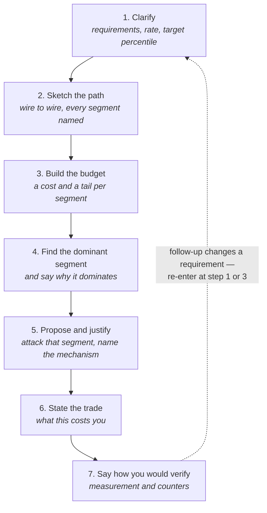
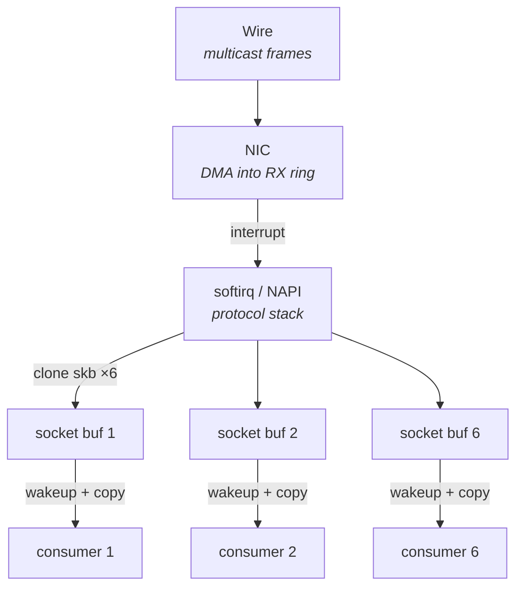
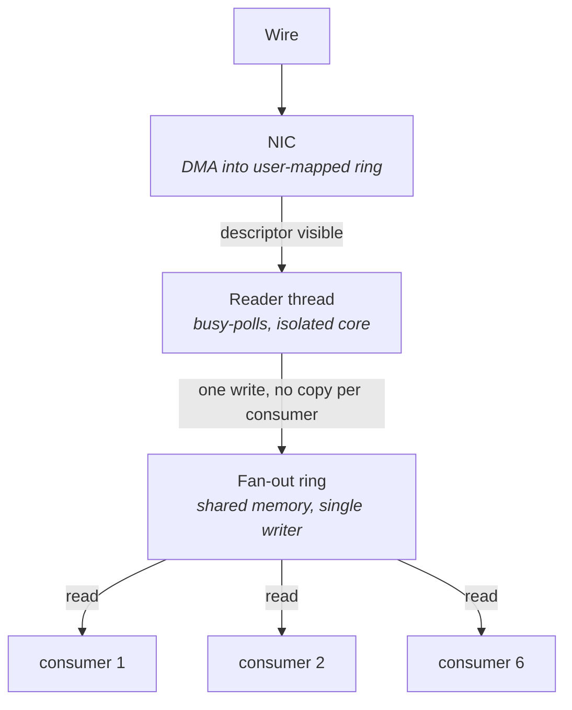
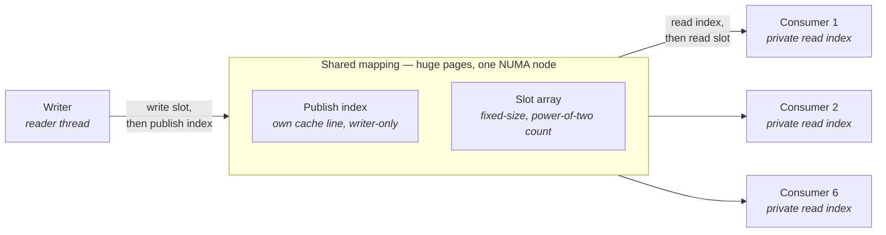
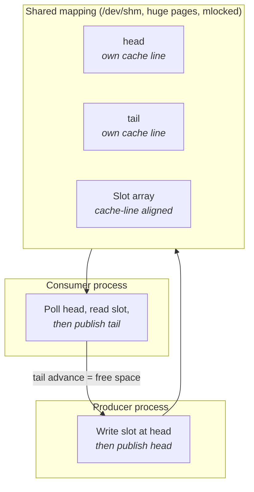
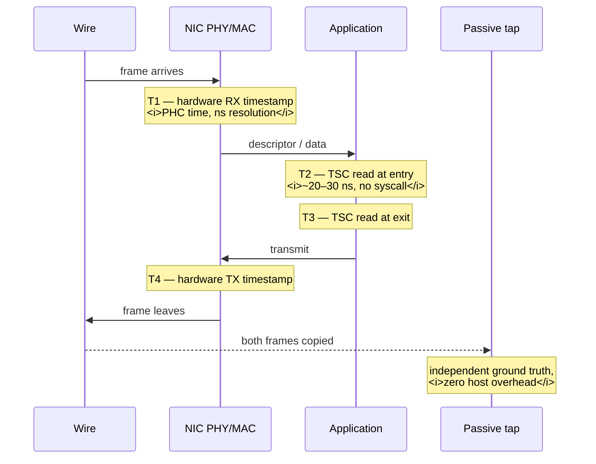
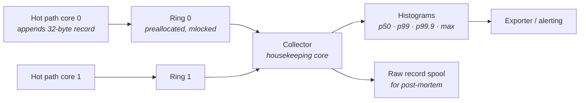
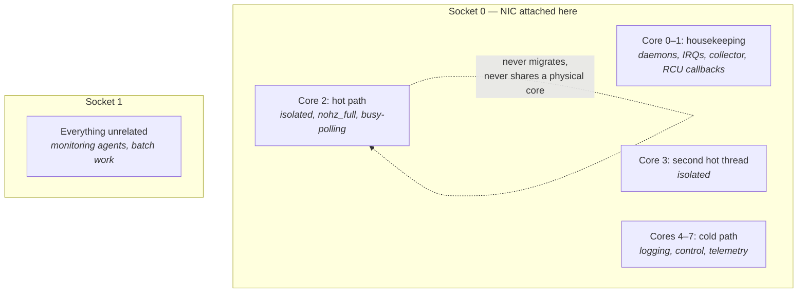

# Systems Design Rounds

A design round in a low-latency interview looks superficially like the system design rounds you may
have done elsewhere, and it is not the same exercise at all. The web-scale version rewards breadth:
you sketch a load balancer, an application tier, a cache, a database, a queue, a replication story,
and you are graded on whether you remembered the pieces and how they fit. The low-latency version
rewards the opposite. There is usually one path, it is short, and every microsecond of it belongs to
some named component. You are graded on whether you know *where the time goes* along that one path,
whether you can defend each choice against the alternative you rejected, and whether you can say
what your design gives up.

That difference has a practical consequence for how you should behave in the room. In a web-scale
round, drawing seven boxes and then adding detail where prompted is a reasonable strategy. Here it
reads as evasion. The interviewer wants to see you commit: pick the receive mechanism, say what it
costs, say why the alternative is worse for this requirement, and say under what change of
requirement you would switch. An answer that lists three options for every decision and never
chooses is a failing answer even when every option listed is correct, because the entire skill being
tested is the ability to make a decision under a stated constraint and own it.

The second thing being assessed is budget thinking, in exactly the sense built in "What 'Low
Latency' Actually Means": the habit of decomposing an end-to-end time into named segments with
costs attached, and then attacking the segment that dominates. Candidates who have not internalized
this optimize whatever is nearest to hand — usually the application segment, because that is the
part they would write code for — and produce designs where a heroically tuned inner loop sits behind
a kernel network stack that costs ten times more. An interviewer notices this immediately. The
budget is also what makes your answer falsifiable: once you have said "the kernel receive path is
five microseconds of a nine-microsecond budget," you have made a claim that can be checked, and the
conversation becomes an engineering discussion rather than a recitation.

The third thing being assessed, and the one candidates most often neglect, is whether you can drive
the conversation. A design round is open-ended by construction. If you wait to be asked, you will be
asked about whatever the interviewer finds interesting, which may not be what you are strongest on.
If you instead impose a structure — here is what I need to know, here is the path, here is the
budget, here is the segment I am attacking, here is what I traded, here is how I would verify it —
you decide the order of topics, you surface your depth on your own terms, and the interviewer's
follow-ups become refinements of your structure rather than a search for it. That is why the method
comes first in this chapter, and why the four worked examples that follow are all instances of the
same seven-step arc.

## How to Structure an Answer: Budget, Bottleneck, Trade-off

The problem with an open-ended question is that it does not tell you when to stop talking about any
one thing. Without a structure, most candidates spiral: they begin somewhere plausible, notice an
adjacent topic they know well, follow it, and forty minutes later have produced a lot of correct
statements that do not add up to a design. The remedy is a fixed arc that you run every time, out
loud, so that the interviewer can hear which step you are on.

The arc has seven steps. It is deliberately front-loaded — the first three steps produce no design
at all, only a quantified statement of the problem — because a design proposed before the budget
exists cannot be justified, and justification is what is being graded.

That loop-back edge matters. Every follow-up an interviewer applies is a perturbation of an input:
the rate doubles, a consumer is added, the box is shared, the requirement becomes wire-to-wire
instead of in-process. The correct response is never to invent a new design from scratch; it is to
identify which step's input changed and re-run the arc from there. Saying this explicitly — "that
changes my per-packet budget, so let me redo step three" — is itself a strong signal, because it
demonstrates that your first answer was derived rather than recalled.

### Step 1: clarify requirements and the latency target

Every design question you will be asked is under-specified on purpose. The under-specification is
part of the test: an engineer who has actually built one of these systems knows which three or four
missing facts change the answer entirely, and asks for exactly those. An engineer who has only read
about them asks generic questions ("what's the scale?") or none at all.

Ask for the numbers that move the design, and ask for them as numbers.

| Question | Why it changes the design |
|---|---|
| **What is the latency target, at which percentile?** | A p50 target and a p99.9 target produce different designs; the second forbids anything unbounded |
| **What is the steady-state rate, and what is the burst rate?** | Steady state sizes the CPU work; the burst sizes every buffer (see "UDP and Multicast") |
| **How long can a burst last?** | Burst rate alone is useless — buffer sizing needs rate × duration |
| **What is the message size distribution?** | Determines bytes/second, serialization delay, and whether copies matter |
| **Is the measurement wire-to-wire or in-process?** | Decides whether the NIC and kernel segments are in your budget at all |
| **How many consumers, and are they on this host?** | Same-host fan-out is a shared-memory problem; cross-host is a network problem |
| **Is loss acceptable, and who detects it?** | Decides whether the transport can drop under pressure or must block |
| **What hardware am I designing for, and how many cores do I get?** | Core count is the hard constraint on how many things can busy-poll |
| **What else runs on this box?** | Determines whether you are designing for interference or can assume isolation |

Two clarifications are worth asking in almost every round. First, **the target percentile**, because
it silently determines whether unbounded operations are permitted; a p50 target tolerates an
allocator, a p99.9 target does not (see the unbounded-operation checklist in "What 'Low Latency'
Actually Means"). Second, **the burst envelope** — rate and duration together — because every
sizing decision downstream is an arithmetic consequence of it and you cannot make a single buffer
decision without it.

Do not ask more than four or five questions before moving on. The clarification phase should take
two or three minutes. Candidates who spend fifteen minutes gathering requirements are usually
stalling, and it reads that way.

### Step 2: sketch the end-to-end path

Draw the path before you design anything on it, and draw it as a sequence of segments with
boundaries you can point at: wire, NIC, kernel or bypass library, application, back out. This is the
canonical budget skeleton from "What 'Low Latency' Actually Means," and reusing it deliberately is
good practice — it is the vocabulary your interviewer already has.

The discipline here is to name a segment for every place a message *waits* as well as every place it
is *worked on*. New candidates draw only the processing stages and omit the queues, which
systematically hides the part of the budget where the tail lives. A ring between two threads is a
segment. A NIC receive ring is a segment. A socket receive buffer is a segment. If a message can sit
somewhere, it gets a box.

### Step 3: build a segment budget

Now attach two numbers to each segment: a typical cost and a rough tail. Both are order-of-magnitude
figures for a stated hardware class, and you should say so — "call it a modern x86 server with a
25 GbE NIC" — because a number without a hardware class is not a claim, and interviewers probe
unqualified numbers.

The tail column is what separates a strong budget from a weak one. Two segments with the same
typical cost are not equivalent if one is a fixed instruction sequence and the other involves the
scheduler. Recall from "What 'Low Latency' Actually Means" that percentiles do not add: an event has
to be unlucky in only one segment to be slow overall, so a single segment with a bad tail dominates
the end-to-end tail regardless of how well the others behave.

Where you cannot state a number, say what it depends on and how you would measure it. "I don't know
what that costs on this hardware, but it is the segment I would measure first" is a much better
answer than a confident invented figure, and it sets up step seven.

### Step 4: identify the dominant segment

Point at one segment and say it dominates. Then say *why* — which mechanism inside it accounts for
the cost. "The kernel receive path dominates" is a start; "the kernel receive path dominates, and
inside it the cost is interrupt-to-softirq scheduling plus the copy into user space, which is why
the p99.9 there is much worse than the p50" is the answer being looked for.

There are usually two candidates for dominance and they call for different responses.

- **A large typical cost** — a segment that is simply expensive every time. Attack it by removing
  the work: bypass, zero-copy, precomputation (see "Systematic Optimization").
- **A large tail** — a segment that is cheap on average and occasionally catastrophic. Attack it by
  removing the *source of variance*: the scheduler, an allocation, an interrupt, a shared resource
  (see "Jitter Hunting").

Naming which of the two you are facing determines your entire next step, and getting it backwards is
the most common substantive error in these rounds — candidates propose kernel bypass, a
typical-cost fix, in response to a tail problem caused by a neighbouring process, and the tail does
not move.

### Step 5: propose and justify

Now design, and design only the dominant segment first. Name the mechanism specifically enough that
it could be built: not "we'd use shared memory" but "a single-producer single-consumer ring in a
shared mapping, with the producer and consumer indices on separate cache lines, consumer busy-polling
on an isolated core."

Justify against the alternative you rejected. Every mechanism in this book has a nearest neighbour
that is more portable, more debuggable, or cheaper, and the reason you did not pick it is the
interesting part of the answer. This is where depth gets demonstrated — the comparison forces you to
say what each mechanism actually does.

### Step 6: state what you traded away

Say it before you are asked. Every technique in this book gives something up, and naming the cost
unprompted is the single clearest signal that you have used the technique rather than read about it.
The recurring currencies are CPU burned, portability lost, debuggability lost, throughput lost,
capacity headroom lost, and operational complexity added.

| Choice | What it buys | What it costs |
|---|---|---|
| Kernel bypass | Removes several microseconds and most of the RX tail | A core burned per polling thread, standard tooling stops working, vendor lock-in |
| Busy-polling instead of blocking | Removes wakeup latency and scheduler variance | A core at 100% utilization, power and thermals |
| Dropping instead of buffering under pressure | Bounds latency during bursts | Data loss that something upstream must detect and handle |
| Pre-allocation and locking memory | Removes page faults and allocator tails | Memory reserved whether used or not; startup cost |
| Batching | Throughput and amortized overhead | The first item of every batch waits for the last |
| Redundant A/B receive paths | Survives loss on one path | Twice the packet rate to process, plus arbitration work |

### Step 7: describe how you would verify

Close by saying how you would know the design works — and, separately, how you would know it was
*still* working next month. This is the step candidates skip most often and it is disproportionately
weighted, because in production the difference between a system that meets its target and one that
does not is usually a measurement discipline rather than a design.

A complete verification story has four parts: the measurement point (where the timestamps come
from), the statistic (a histogram with p99.9 and max plus sample count, never a mean), the load
conditions (steady state *and* burst, since a single-load benchmark tells you nothing about
queueing), and the counters that tell you the system is healthy rather than silently degraded — drop
counters, ring exhaustion counters, context-switch counts (see "Measuring Correctly" and
"Observability Without Slowing Down").

### What follow-up pressure is testing

Interviewers apply a small, predictable set of pressures. Recognizing which one you are facing tells
you what kind of answer is wanted.

| The pressure | What is actually being tested | The shape of a good response |
|---|---|---|
| "What if the rate doubles?" | Whether your sizing was derived or guessed | Re-do the arithmetic out loud; name the segment that saturates first |
| "What breaks first?" | Whether you know your design's failure order | Name one specific component, its counter, and the observable symptom |
| "How would you know it was working?" | Measurement discipline | Timestamp points, percentiles, counters, load levels |
| "Why not just use X?" | Whether you rejected X for a reason | State X's actual cost in this budget, not a slogan |
| "What if you can't do that?" | Whether you have a second-best design | Give the fallback and the latency it costs |
| Silence after your answer | Whether you self-critique | Volunteer the weakest part of your own design |

That last one is real and catches people out. When an interviewer says nothing after you finish, the
productive move is to attack your own design: "the weakest part of this is the slow-consumer
behavior — let me say what happens there." Candidates who fill the silence by restating what they
just said lose ground.

The four sections that follow are worked examples of this arc. Each is written as the round would
actually go: the problem as posed, the clarifications worth spending time on, the budget, the design
evolving through two or three revisions, and the follow-up pressure with the response.

## Designing a Low-Latency Market Data Distribution Path

**As posed:** *"A NIC on this host receives a high-rate UDP multicast feed. Six processes on the same
host each need to see every packet, as fast as possible and with as little variance as possible.
Design the path from the wire to all six consumers."*

Note what this question is and is not. It is a networking and inter-process problem: bytes arrive on
a wire and must reach N readers with low, predictable latency. Nothing about what the bytes mean is
in scope, and candidates who start discussing message semantics have misread the question. The
design surface is the NIC, the receive mechanism, the fan-out, and the buffering — and every one of
those is covered by "The Linux Networking Stack," "UDP and Multicast," "Kernel Bypass," and
"Synchronization and IPC."

### Clarifying

Four questions change this design materially.

- **Rate and burst envelope.** Suppose the answer is: 200,000 packets per second steady state,
  bursting to 2,000,000 packets per second for up to 50 milliseconds, average packet 200 bytes.
- **Do all six consumers need all packets?** Suppose yes. If they needed disjoint subsets, the
  design would change to hardware flow steering with per-consumer receive queues (see "The Linux
  Networking Stack") and the fan-out problem would largely disappear.
- **Is loss acceptable, and who detects it?** Suppose the feed carries sequence numbers and gap
  detection exists at the consumer, so the transport is permitted to drop rather than block — a
  crucial permission, because it converts an unbounded-latency problem into a bounded one.
- **How many cores and what redundancy?** Suppose a two-socket server with plenty of cores, and the
  feed arrives as two identical streams on separate paths (the A/B arrangement described in "UDP and
  Multicast"), so the design must also arbitrate between them.

Do the arithmetic immediately, out loud, because it constrains everything else:

- **Bandwidth at peak:** 2,000,000 packets/s × 200 bytes ≈ 400 MB/s ≈ 3.2 Gb/s. Comfortable on a
  10 or 25 GbE link — this is not a bandwidth problem.
- **Per-packet time budget at peak:** one packet every 500 ns. On a 3 GHz core that is roughly 1,500
  cycles per packet for whatever the receive path does. That is enough for a poll loop and a
  copy, and nowhere near enough for a system call per packet.
- **Burst volume:** 2,000,000 packets/s × 50 ms = 100,000 packets ≈ 20 MB. Any buffer that must
  absorb a full burst without the consumer running is measured in tens of megabytes, which
  immediately rules out default socket buffer sizes.

Those three numbers are the whole capacity argument, and they are arithmetic. Notice that the
per-packet budget is the binding constraint, not the bandwidth — which is typical, and worth saying,
because it tells the interviewer you know that packet rate rather than bit rate is what kills
receive paths.

### The naive design and why it fails

The obvious design is the one every general-purpose system uses: each of the six processes opens its
own UDP socket, joins the multicast group, and reads.

Walk the budget for this design segment by segment. Order-of-magnitude figures for a modern x86
server, Skylake-and-later class, with a 25 GbE NIC and an untuned kernel:

| Segment | Typical | Tail | What dominates it |
|---|---|---|---|
| Wire → NIC RX ring (DMA) | ~1 µs | ~1 µs | PCIe traversal, descriptor handling |
| Interrupt → softirq scheduled | 2–10 µs | tens of µs | IRQ delivery, softirq scheduling, coalescing |
| Protocol stack + multicast replication | 1–3 µs, ×6 | worse under load | Per-socket delivery work in softirq context |
| Socket buffer wait | 0 | unbounded | Consumer not yet running |
| Wakeup + copy to user space | 2–5 µs | 10s of µs | Scheduler wakeup, context switch, copy |
| **End to end, last consumer** | **~10–20 µs** | **100 µs+** | |

Three things are wrong with this, and naming all three is the point of walking the budget.

**The kernel receive path is the dominant segment.** Interrupt-to-softirq scheduling plus the copy
to user space is most of the typical cost and nearly all of the tail. This is the observation from
"What 'Low Latency' Actually Means" that motivates kernel bypass existing at all.

**The fan-out is serialized and unfair.** The kernel replicates the packet to six sockets one after
another inside softirq context. The sixth consumer's packet is systematically later than the
first's, by an amount that grows with consumer count, and that skew is invisible unless you measure
per-consumer. It also means the receive path does six times the work at 2 million packets per
second, which is where the per-packet budget of 500 ns actually gets spent.

**Every consumer pays a wakeup.** Six blocked readers means six scheduler wakeups per packet, each
costing a context switch of roughly 1–5 µs plus the cache and TLB pollution that follows (see
"Processes, Threads, and Scheduling"). At two million packets per second this is not a latency
problem, it is a capacity impossibility — you cannot perform twelve million context switches per
second.

### First revision: one reader, bypass the kernel

The structural fix is to stop making the kernel do fan-out. One process receives from the wire; the
fan-out becomes a shared-memory problem, where it can be made to cost tens of nanoseconds instead of
microseconds.

The reader thread polls the NIC's receive descriptors directly from user space rather than waiting
for an interrupt. This removes the interrupt, the softirq, the protocol stack, and the copy in one
move — the three segments that accounted for most of the budget above. The revised budget for a
tuned host of the same class:

| Segment | Typical | Tail | Notes |
|---|---|---|---|
| Wire → NIC ring, DMA | ~1 µs | ~1 µs | Unchanged; PCIe is PCIe |
| Poll loop notices descriptor | ~100–300 ns | ~1 µs | Depends on loop length; this is the poll interval |
| Reader writes into fan-out ring | ~100–200 ns | ~500 ns | One memory copy of ~200 bytes plus an index update |
| Consumer notices and reads | ~100–300 ns | ~1 µs | Consumer also busy-polls |
| **End to end** | **~1.5–2.5 µs** | **a few µs** | Dominated by the DMA segment, which is physics-adjacent |

The interesting property of the revised budget is that the dominant segment is now the NIC-to-memory
DMA, which is hardware and largely not yours to optimize. That is the correct end state for step
four: you optimize until the dominant segment is one you cannot move, and then you say so.

Which bypass mechanism to name matters, and the interviewer will ask why not one of the others.

| Mechanism | What it is | Why you might pick it | What it costs |
|---|---|---|---|
| **DPDK** | Poll-mode drivers, hugepages, NIC owned entirely by user space | Broad vendor support, mature, full control of the receive path | The NIC leaves the kernel entirely; no `tcpdump`, no `ss`, no kernel stack for anything else on that port |
| **Vendor kernel-bypass API (e.g. Solarflare ef_vi)** | A low-level user-space interface to the NIC's queues | Lowest latency of the software options; can coexist with kernel traffic on the same port | Vendor-specific; ties the design to one NIC family |
| **Socket-preloading library (e.g. Onload)** | Intercepts the socket API and services it in user space | No application change; keeps the socket programming model | Less control, more magic, and behavior differs subtly from the kernel stack |
| **AF_XDP** | Kernel-supported zero-copy path into a user-space ring | In-tree, portable, keeps kernel tooling usable | Higher latency than the vendor path; still involves kernel machinery |
| **Plain sockets, tuned** | Busy-polling socket, large receive buffer, IRQ affinity | Simple, debuggable, no special hardware | Several microseconds and a much worse tail than any of the above |

The honest framing — and the one that reads best — is that the axis here is latency versus
operability, and the choice depends on which the organization can absorb. "Kernel Bypass" makes the
case at length that bypass is sometimes the wrong answer; a candidate who names the operational cost
unprompted is demonstrating that they have read past the marketing.

### Second revision: designing the fan-out itself

Having moved the fan-out into shared memory, it now has to be designed, and this is where the round
usually goes deep, because it exercises "The Cache Hierarchy," "Multicore, Coherence, and Memory
Ordering," and "Synchronization and IPC" simultaneously.

The requirement is one writer and six readers, all of whom need every message, none of whom should
be able to slow down the writer or each other. The structure that satisfies this is a preallocated
circular buffer in a shared mapping where the writer advances a single publish index and each reader
maintains its *own* read index privately. Readers never write to any location the writer reads, so
there is no reverse coherence traffic and no reader can exert backpressure.

The decision points, each with its trade:

- **Fixed-size slots versus variable-length packing.** Fixed slots waste memory on small messages
  but make the index arithmetic trivial and every access aligned; variable-length packing is denser
  but requires readers to parse a length before they can advance. For a receive path where the
  per-packet budget is 500 ns, take the fixed slots and the wasted memory.
- **Slot size rounded to whole cache lines.** A slot that straddles a line boundary makes a
  neighbouring slot share a line with this one, so a writer publishing message N dirties a line a
  reader is reading for message N−1. That is textbook false sharing (see "The Cache Hierarchy") and
  it converts a local read into a coherence transfer costing hundreds of nanoseconds.
- **The publish index on its own cache line.** Six readers polling the publish index put that line
  in shared state across seven cores; every write by the producer invalidates all six copies. That
  cost is unavoidable — it is the fan-out — but it must not be *multiplied* by having other
  frequently-written data on the same line.
- **Publish ordering.** The writer must fill the slot before making the index visible, and the
  reader must read the index before reading the slot. This is a release/acquire pairing at the
  hardware level (see "Multicore, Coherence, and Memory Ordering"); on x86's total-store-order model
  it requires no expensive fences on the store side, which is worth stating because it is a real
  architectural fact rather than a portability assumption.
- **Overwrite rather than block.** The writer never waits for readers. If a reader falls more than
  one buffer-lap behind, it has lost data and must detect that — typically by keeping a sequence
  number in each slot and re-checking it after reading, so that a slot overwritten mid-read is
  detected rather than silently consumed.

That last point is the load-bearing trade of the whole design, and it should be stated as one:

| Slow-consumer policy | Latency behavior | Consequence |
|---|---|---|
| **Writer blocks until the slowest reader catches up** | The whole path stalls at the speed of the worst consumer | Head-of-line blocking; one badly-behaved process degrades everyone (see "TCP In Depth" for the general pathology) |
| **Writer overwrites; readers detect loss** | Writer latency is bounded and independent of consumers | A slow consumer loses data and must recover; requires gap detection |
| **Per-consumer queue, writer copies N times** | Isolation between consumers | N copies per message; per-packet cost scales with consumer count |

For a receive path whose whole purpose is bounded latency, overwrite is the right answer, and it is
right *because* the clarifying question established that gap detection exists. That is the payoff for
asking it in step one: a design decision that would otherwise look reckless is now justified by a
stated requirement.

### Handling the A/B redundancy requirement

Two identical streams arriving by diverse paths is a networking pattern, not a data-processing one:
the same bytes arrive twice, at slightly different times, and either copy may be missing. The design
question is where deduplication happens.

Doing it in the single reader is correct, and the argument is arithmetic. Deduplicating once costs
one lookup per packet in the reader; deduplicating in six consumers costs six. It also means the
fan-out ring carries a single clean stream, so consumers never see duplicates and their code stays
simple. The cost is that the reader now does more per-packet work inside the 500 ns budget, and that
the reader becomes a single point of failure for all six consumers — which is a reliability trade
worth naming (see "Reliability and Failure Handling").

The other question worth pre-empting: does the reader wait for both copies of a packet, or forward
the first to arrive? Forwarding the first is the latency answer; it means the reader's output is
whichever path happened to be faster for that packet, which is the entire point of the redundant
path.

### Follow-up pressure

**"What if the rate doubles to four million packets per second?"**

Re-run the arithmetic rather than reasoning qualitatively. The per-packet budget halves to 250 ns —
roughly 750 cycles at 3 GHz. Bandwidth doubles to about 6.4 Gb/s, still fine on the link. The burst
volume doubles to about 40 MB, so the fan-out ring must double.

Then say what saturates first. The reader thread's per-packet work — read descriptor, deduplicate,
copy 200 bytes, publish — has to fit in 250 ns. A 200-byte copy from a DMA-written buffer is
tolerable if the line is in L3 by way of direct cache injection (see "Buses, Devices, and I/O
Hardware"), and expensive if it has to come from DRAM. So the honest answer is: at this rate the
design becomes sensitive to whether DDIO is working, and I would measure that before claiming the
design scales. If the reader cannot keep up, the next move is to split the feed across multiple
receive queues by flow steering and run two reader threads on separate cores, at the cost of
needing to merge or partition downstream.

**"What breaks first?"**

Name a specific component and a specific counter. Under overload the failure order is:

1. **The NIC receive ring fills**, because the reader is not consuming descriptors fast enough. The
   NIC then drops. This is visible in the driver's own statistics via `ethtool -S <iface>` — the
   exact counter name for ring exhaustion varies by driver, so list them and find the one that
   increments.
2. **The fan-out ring laps a slow consumer**, which shows up as that consumer's own detected-gap
   count rising while the others are clean. This is why per-consumer loss counters belong in the
   design from the start rather than being added after the first incident.
3. **Upstream switch buffers fill** if the host stops absorbing at line rate, which produces loss
   before the host — invisible to any host counter, and diagnosable only from switch statistics or a
   passive capture (see "Network Design and Operations").

The reason to enumerate the order rather than name one failure is that it demonstrates the design
has an understood degradation path, which is exactly what "Reliability and Failure Handling" argues
for.

**"How would you know it was working?"**

Hardware timestamps at the NIC give a wire-arrival reference; each consumer records its own read
time; the difference is the true per-consumer distribution including the fan-out skew. Report
p50/p99/p99.9/max per consumer with sample counts, at steady state *and* under a synthetic burst at
the peak rate. The counters that must be clean: driver ring-exhaustion counters from `ethtool -S`,
and each consumer's detected-gap count. The design is working when the per-consumer distributions
are near-identical — divergence between consumers means the fan-out is not fair, which usually means
one consumer's core is not properly isolated.

## Designing an Inter-Process Transport

**As posed:** *"Two processes on the same host need to exchange messages. One produces, one consumes.
Sub-microsecond, and I care about the tail. Design the transport."*

This is the most common design question in the domain and the one where candidates most often skip
the clarification step, because the answer "shared memory ring buffer" is so readily available. That
answer is correct and it is not sufficient — the round is entirely about the decisions *inside* that
phrase, and about the two decisions on either side of it: how the consumer waits, and what happens
when it cannot keep up.

### Clarifying

- **Message size and rate.** Suppose messages are up to 512 bytes and arrive at up to 500,000 per
  second in bursts, with long idle gaps between them.
- **One producer, one consumer, forever?** Suppose yes for now, and expect the interviewer to add
  consumers later. This matters because a single-producer single-consumer (SPSC) ring is
  dramatically simpler and faster than any multi-producer structure — no atomic
  read-modify-write on the fast path at all.
- **Is loss acceptable?** Suppose not: the consumer must see every message, so the transport needs
  a real backpressure or a real error, not silent overwrite.
- **Is the consumer latency-critical, or is it a logger?** This one decides the waiting strategy and
  is the question most candidates forget. A latency-critical consumer justifies burning a core; a
  logger does not.
- **Same NUMA node?** If the two processes are on different sockets, every message crosses the
  interconnect and the design changes (see "Memory Systems").

### The option space, priced

Before designing, price the alternatives, because the interviewer will ask why not the simple thing.
Order-of-magnitude one-way costs for a small message on a modern x86 server, same NUMA node, tuned
host:

| Transport | Typical one-way | Tail character | Why |
|---|---|---|---|
| **TCP over loopback** | 10–30 µs | Poor | Full protocol stack twice, two syscalls, scheduler wakeup, Nagle/delayed-ACK interactions (see "TCP In Depth") |
| **Unix domain socket** | 5–15 µs | Poor | Two syscalls and a copy each way, plus a scheduler wakeup |
| **Pipe** | 5–15 µs | Poor | Same shape as the Unix socket; also has its own buffer semantics |
| **Shared memory ring, consumer blocks on eventfd** | 3–10 µs | Moderate | The ring itself is fast; the wakeup dominates |
| **Shared memory ring, consumer busy-polls** | 100–300 ns | Good | One cache-line transfer between cores plus the payload copy |

That table is the whole argument, and it makes the design decision for you: everything involving the
kernel on the fast path costs more than the entire latency target. The remaining question is not
*whether* shared memory, but how the consumer waits — because the difference between the last two
rows is a factor of thirty, and it is entirely about the wakeup, not the data movement.

### The design

The specifics that make this a sub-microsecond transport rather than a merely working one:

- **Head and tail on separate cache lines.** They are written by different cores. Sharing a line
  means every producer write invalidates the consumer's copy of the tail and vice versa, turning two
  independent local writes into a stream of coherence transfers costing 100–500 ns each (see "The
  Cache Hierarchy").
- **Cached copies of the other side's index.** The producer needs to know free space, which depends
  on the consumer's tail — but reading the tail every message is a coherence miss every message.
  Instead the producer keeps a private, possibly-stale copy of the tail and re-reads the shared one
  only when its cached value says the ring is full. On a ring that is usually not full, the shared
  tail is read almost never.
- **Power-of-two slot count.** Index wrapping becomes a mask rather than a division; more
  importantly it removes a branch from the hot path (see "CPU Microarchitecture Essentials").
- **Backed by explicit huge pages and locked into memory.** A 512-byte slot array of any useful
  depth exceeds what a handful of 4 KiB TLB entries can cover, and a TLB miss requiring a page walk
  costs 20–100 ns on top of the access. Huge pages extend TLB reach dramatically (see "Memory
  Systems"); `mlockall` prevents the mapping from ever being reclaimed and prevents a first-touch
  minor fault of 1–3 µs appearing in the tail (see "Memory Management").
- **Both processes on the same NUMA node**, with the shared mapping first-touched by a thread on
  that node so the physical pages are allocated locally. Otherwise every message crosses the
  interconnect and both the typical cost and the variance rise.
- **Publish ordering on both sides.** Fill the slot, then publish the head. Read the head, then read
  the slot. On x86 the store-store and load-load orderings you need are guaranteed by the
  architecture, so the cost is a compiler-level ordering constraint, not a fence instruction — again
  worth stating precisely, since the interviewer may probe whether you know the difference between
  what the hardware guarantees and what the language requires.

### The waiting decision

This is where the round earns its keep, because there is no universally right answer and the
interviewer knows it. The trade is a core against a few microseconds.

The ring stays the same in all three cases; only the wait changes.

| Wait strategy | Wakeup cost | Idle CPU | When it is right |
|---|---|---|---|
| **Busy-poll** | ~100–300 ns | One core at 100% | Consumer is latency-critical and cores are available |
| **Spin, then block** | Fast when busy, several µs after idleness | Near zero when idle | Bursts are frequent enough that the loop rarely goes cold |
| **Block on `eventfd`** | ~3–10 µs | Zero | Logger, telemetry, control plane — anything off the critical path |

- **Busy-polling** eliminates the wakeup entirely: the consumer is already running, so the message
  is visible as soon as the producer's store becomes globally visible. The cost is a core burned
  continuously, plus power and heat, plus the fact that the core is unavailable for anything else.
  This is the standard trade described in "What 'Low Latency' Actually Means" — spending throughput
  to buy latency — and it should be named as such.
- **Blocking on an `eventfd`** costs a syscall on the producer side to signal and a scheduler wakeup
  on the consumer side, together several microseconds with a tail set by scheduler behavior. It is
  the right answer when the consumer is not on the critical path.
- **The hybrid** spins for a bounded interval and then blocks. It gets busy-poll latency during
  activity and releases the core during idleness. Its weakness is precisely the case the problem
  statement described — long idle gaps — because after an idle period the consumer is blocked, the
  core may have entered a deep idle state, and the first message of a burst pays both the wakeup and
  the cold-start penalty. If the interviewer specified long idle gaps and you propose the hybrid,
  you must address this; the standard answer is that the consumer keeps spinning through idleness
  precisely because the first message of a burst is the one that matters.

An additional subtlety worth raising if the consumer busy-polls: a tight polling loop that hammers a
shared cache line at full speed produces continuous coherence traffic. On SMT-enabled cores it also
starves the sibling thread of frontend resources (see "Multicore, Coherence, and Memory Ordering").
Both are reasons a poll loop typically includes a pause-style hint to the processor — and both are
reasons the polling core should not share a physical core with anything else.

### Follow-up pressure

**"Now there are eight consumers, and each needs every message."**

This is the fan-out problem from the previous section arriving in a new context, and the right first
move is to state the two structures and their costs rather than picking immediately.

| Structure | Producer cost per message | Isolation | Slow-consumer effect |
|---|---|---|---|
| **Eight SPSC rings, producer writes eight times** | Eight copies — scales linearly with consumers | Total: each consumer has its own buffer | One slow consumer fills only its own ring |
| **One broadcast ring, eight private read indices** | One write regardless of consumer count | Shared buffer depth | A slow consumer either stalls everyone or loses data |

At 500,000 messages per second and 512 bytes, eight copies is 2 GB/s of memory traffic just for
fan-out, which is real but survivable; at ten times the rate it is not. The decision therefore turns
on rate and on whether isolation between consumers is worth the copies. Saying that the answer flips
at a rate you can compute is a much stronger response than asserting one structure is better.

**"What if a consumer crashes?"**

This probes lifetime and reclamation, which "Synchronization and IPC" treats as a first-class hazard.
Three concrete consequences to name:

- **A crashed consumer's read index stops advancing.** In a design where the producer waits for the
  slowest consumer, the transport deadlocks. This alone is an argument for either the overwrite
  policy or a liveness mechanism.
- **Liveness needs a heartbeat, not a check for a running process.** A consumer that is alive but
  stuck is indistinguishable from a crashed one as far as the ring is concerned. A monotonically
  advancing counter per consumer, sampled by a supervisor on a housekeeping core, distinguishes
  "slow" from "dead" (see "Reliability and Failure Handling").
- **The shared mapping outlives the process.** A POSIX shared memory object under `/dev/shm`
  persists after its creator exits, which is useful for restart-in-place and dangerous if a restarted
  consumer resumes from a stale index. The design needs a generation or epoch value written by the
  producer that a restarting consumer checks, so that it re-synchronizes to the current publish
  point rather than replaying a lap-old buffer.

**"Why not just use a Unix domain socket? It's simpler."**

The correct answer is the budget, not a slogan. A Unix domain socket costs two syscalls and a copy
per message plus a scheduler wakeup — several microseconds against a sub-microsecond target, so it
fails the requirement by an order of magnitude, and its tail is set by scheduler behavior which is
the exact variance the requirement was written to exclude. Then concede the real point: it is
simpler, it is debuggable with standard tools, it handles process death cleanly by giving you an
error on the file descriptor, and if the requirement had been "tens of microseconds is fine," it
would be the right choice. Conceding the alternative's genuine advantages after refuting it on the
budget is what a senior answer sounds like.

## Designing a Latency Measurement and Monitoring System

**As posed:** *"You have a latency-critical path in production. Design a system that tells you what
its wire-to-wire latency distribution is, continuously, without materially slowing it down."*

This question separates candidates more sharply than the transport questions, because it has a
recursive trap: the measurement system is itself on the hot path, and a naive design perturbs the
thing it measures. It also tests whether the candidate knows that a mean is not an answer, and
whether they know where a timestamp can honestly come from.

### Clarifying

- **Wire-to-wire or in-process?** Insist on this. In-process instrumentation cannot see the NIC or
  kernel segments — potentially most of the budget, per "What 'Low Latency' Actually Means" — so an
  in-process answer to a wire-to-wire question is wrong regardless of how well it is built.
- **What overhead is acceptable on the hot path?** Suppose the answer is "tens of nanoseconds per
  event, and no variance added." That is a hard constraint and it eliminates most obvious designs.
- **Continuous or sampled?** Suppose continuous, because a sampled system that misses the tail
  defeats the purpose.
- **Do we control both ends?** For a request/response path, whether the far end is ours determines
  whether we can measure one-way delay or only round trip.
- **What decisions will this data drive?** Alerting on regression, post-incident forensics, and
  release comparison have different retention and resolution needs (see "Build, Deploy, and
  Environment Discipline").

### Where a timestamp can come from

There are four honest timestamp sources on this path, and they differ in accuracy, cost, and what
they can see. Being able to lay them out is most of the answer.

| Source | Accuracy | Cost on the hot path | Sees |
|---|---|---|---|
| **NIC hardware timestamp** (`SO_TIMESTAMPING`, or the bypass library's equivalent) | Nanosecond-class, from the NIC's own clock | Near zero — the NIC does it | True wire arrival and departure |
| **TSC read in the application** | Nanosecond-class if the TSC is invariant (see "Clocks, Timers, and Time") | A few nanoseconds to tens of nanoseconds | Only the application segment |
| **`clock_gettime` via the vDSO** | Nanosecond-class, disciplined to system time | ~20–30 ns | Same as TSC but comparable across hosts |
| **Passive tap / SPAN with a capture appliance** | Nanosecond-class, independent of the host | Zero — it is not on the host at all | True wire-to-wire, including everything the host hides |

The key insight to volunteer: **the NIC hardware timestamp and the passive capture are the only two
sources that can answer the wire-to-wire question**, because everything measured inside the host
starts after the packet has already spent a microsecond crossing PCIe. The in-host timestamps are
still valuable — they decompose the budget into segments — but they cannot bound the total. A design
that uses only in-host timestamps and claims wire-to-wire coverage is the specific error this
question is fishing for.

Two constraints on hardware timestamps worth naming because they are where implementations go wrong.
First, hardware timestamps come from the NIC's own clock, which must be disciplined — PTP with
hardware timestamping, as covered in "Network Design and Operations" — or the numbers are precise
and wrong. Second, support and granularity vary; `ethtool -T <iface>` reports which timestamping
modes a given interface actually supports, and checking it is the first thing to do rather than
assuming.

### The collection design

Now the recursive problem: recording the measurement must not perturb the measurement. The naive
design — format a log line and write it — is catastrophic, involving allocation, formatting, a
syscall, and page cache behavior, any one of which is larger than the thing being measured.

The structure that works is the one "Observability Without Slowing Down" argues for: the hot path
writes fixed-size binary records into a preallocated per-core ring and does nothing else; everything
expensive happens on another core.

The design specifics and why each one is there:

- **Per-core rings, no sharing.** A single shared ring means an atomic operation and a contended
  cache line on every hot-path event — 50–500 ns under contention, which exceeds the entire overhead
  budget. Per-core rings make each append a private store.
- **Fixed-size records, no formatting.** The hot path writes raw values: a timestamp, an identifier,
  maybe a sequence number. Formatting a human-readable string is deferred to the collector, where it
  costs nothing that matters.
- **One cache line per record if possible.** A 32- or 64-byte record touching one line costs one
  potential cache miss. A larger record touches more lines and evicts more of the hot path's working
  set — measurement overhead is not only time, it is cache footprint, and the second kind is
  invisible in a timing measurement of the instrumentation itself.
- **The rings are preallocated and locked.** Same reasoning as every other hot-path buffer: no page
  faults in the measurement path, or the measurement generates the tail it is supposed to observe.
- **Overwrite when the collector falls behind, and count the overwrites.** The measurement system
  must never apply backpressure to the hot path. Losing samples is acceptable; stalling the hot path
  is not. But the loss must be counted, because a silently lossy histogram is worse than no histogram
  — it will under-report exactly during the bursts you care about.
- **The collector runs on a housekeeping core**, never on an isolated hot-path core, and it is the
  component that builds histograms and writes anything to disk (see "Tuning a Linux Box for
  Determinism" for the isolated/housekeeping split).

### What to compute and what to keep

The statistic is a histogram, not a mean — for the reasons given at length in "Measuring Correctly."
The reporting unit should carry p50, p99, p99.9, max, and the sample count, because a p99.9 quoted
without its sample count may rest on a single observation.

There is a retention trade worth stating explicitly:

| Approach | Storage | What you can answer later |
|---|---|---|
| **Histograms only, per interval** | Tiny | "What was the distribution at 14:32?" — but not "what was slow about that one event?" |
| **Histograms plus raw records for outliers** | Moderate | Both, provided the outlier threshold is set correctly |
| **All raw records spooled** | Large | Everything, including correlating a slow event with a packet capture |

The middle option is usually right: keep continuous histograms, and additionally spool the full
record for any event above a threshold. That gives you the distribution always and the forensic
detail for the events that matter, at a storage cost proportional to the outlier rate rather than
the event rate. Pairing outlier records with a rolling packet capture (see "Network Debugging
Toolkit") is what makes post-incident analysis possible at all.

### Follow-up pressure

**"You added a synthetic probe that sends a request every millisecond and measures the response.
What's wrong with it?"**

This is a coordinated-omission question, and the expected answer is the mechanism, not the name. If
the probe waits for each response before sending the next, then during a 10 ms stall it sends
nothing, records one bad sample, and continues — where a real client sending every millisecond would
have accumulated ten samples all affected by the stall. The tail is silently deleted. The fix is to
record latency against the *intended* send time rather than the actual send time, so that a probe
due at t=3 ms and completing at t=10 ms is recorded as 7 ms even though it was not sent until t=10
ms (see "Measuring Correctly").

Then add the second-order point that shows depth: a synthetic probe measures the path the probe
takes, which is not necessarily the path production traffic takes. If the probe uses a different
flow, it may land on a different receive queue and a different core. Making the probe traverse the
same queue and the same code path is a design requirement, not a detail.

**"How do you know the instrumentation isn't the cause of the latency you're measuring?"**

Two answers, and giving both is better than either.

The direct one: measure with instrumentation compiled or configured out and compare distributions.
If the p99.9 moves materially, the instrumentation is a participant.

The indirect one, which is more informative: instrumentation costs show up as cache and TLB pressure
rather than as visible time in the instrumented region, so a timing comparison can miss them. Compare
cache-miss counts on the hot path with and without instrumentation using `perf stat` (see "Profiling
Tools and Hardware Counters"). If the miss count rises, the measurement is evicting the working set
even where the timing looks unchanged.

**"How do you alert on this without drowning in noise?"**

Alert on a change in the distribution relative to a baseline, not on an absolute threshold, because
an absolute threshold either fires constantly during normal bursts or never fires during a slow
degradation. Concretely: alert when p99.9 over a window exceeds the same window's value from a
comparable prior period by a stated factor, and alert separately and immediately on any counter that
should always be zero — dropped samples, ring overruns, gap-detection counts. The second class of
alert is more valuable than the first, because a zero-valued counter becoming non-zero is
unambiguous, whereas a percentile moving requires interpretation.

Add the drift point: alert also on the *machine* changing, not only the latency. A host that
silently lost its isolation configuration or had frequency scaling re-enabled will show a latency
regression eventually, but detecting the configuration drift directly is faster and less ambiguous
(see "Build, Deploy, and Environment Discipline").

**"The two hosts' clocks disagree. Now what?"**

One-way delay between hosts requires a common time base, and the only credible one is PTP with
hardware timestamping, disciplining the NIC's clock rather than the system clock (see "Network
Design and Operations"). If that is not available, you cannot measure one-way delay honestly, and
the correct answer is to say so and fall back on round-trip measurement from a single host — which
has half the diagnostic value but is not a lie. Reaching for NTP here is a weak answer: its accuracy
is orders of magnitude coarser than the latencies being measured, so a "one-way delay" computed from
NTP-disciplined clocks is dominated by clock error.

## Designing for Determinism Under Load

**As posed:** *"Your path meets its target at p50 — call it 5 microseconds — but during bursts the
p99.9 goes to 300 microseconds. The code hasn't changed. Design the system so the p99.9 stays within
a small multiple of the p50."*

This is the hardest of the four, because it has no single mechanism as its answer. It is a
whole-host design question and it draws on "Tuning a Linux Box for Determinism," "Processes,
Threads, and Scheduling," "Memory Management," and "Jitter Hunting" at once. It is also the question
most directly aligned with what the discipline actually is: as "What 'Low Latency' Actually Means"
puts it, the goal is a narrow distribution located as low as possible, and this question is
explicitly about the narrowness.

### Clarifying

The clarifications here are diagnostic rather than dimensional, because the design depends on what is
actually causing the tail.

- **Is the tail correlated with the burst, or does it happen at a fixed period?** A periodic tail
  points at timers, background kernel work, or firmware; a burst-correlated tail points at queueing
  (see "Jitter Hunting").
- **Is the p50 also degraded during bursts, or only the tail?** If the p50 holds and only the tail
  moves, this is interference. If both move, it is saturation.
- **What else runs on the box?** Other processes, monitoring agents, container runtimes, and
  logging daemons all contend for cores, cache, and memory bandwidth.
- **What is the burst envelope again** — rate and duration — because absorbing a burst is a sizing
  question and the answer is arithmetic.
- **Is dropping permitted under overload?** This is the pivotal question, because a system that
  must not drop cannot bound its latency under sustained overload. One of the two has to give.

Suppose the answers are: the tail correlates with bursts, the p50 holds during bursts, the box also
runs monitoring and a logging daemon, and dropping is permitted with detection.

That combination is diagnostic. A held p50 with an inflated tail during bursts means the work itself
is not getting slower — something is occasionally *preventing* the work from running or making a
single iteration take orders of magnitude longer. That is interference and queueing, not
computation, and it tells you to stop looking at the application code entirely.

### The host layout

The first design artifact should be a core map, because on a determinism problem the core map *is*
the design.

The reasoning behind each placement, all of it drawn from "Tuning a Linux Box for Determinism":

- **The hot-path cores are isolated from the scheduler** using `isolcpus`, so nothing is placed on
  them by default, and from the timer tick using `nohz_full`, so the periodic scheduling interrupt
  does not fire on them. RCU callback processing is offloaded to housekeeping cores with `rcu_nocbs`
  for the same cores. Each of these removes a specific, identifiable interruption.
- **Interrupts are steered away from the hot cores.** The default `irqbalance` behavior spreads
  interrupts across all cores, including yours. Disabling it and setting explicit affinities in
  `/proc/irq/<n>/smp_affinity` means the hot core takes no device interrupts at all. `/proc/interrupts`
  is where you confirm this — the hot core's columns should stay flat while traffic runs.
- **The hot path is on the socket the NIC is attached to.** A PCIe device is attached to one socket's
  root complex; DMA into memory on the other socket crosses the interconnect, adding both latency and
  variance (see "Memory Systems" and "Buses, Devices, and I/O Hardware"). Confirm the NIC's NUMA
  node before choosing cores rather than assuming.
- **SMT siblings of hot cores are left idle or disabled.** Two hardware threads on one physical core
  share frontend and execution resources; a busy sibling steals issue slots and cache from your hot
  thread in a way that is invisible to every OS-level metric (see "Multicore, Coherence, and Memory
  Ordering"). Whether to disable SMT machine-wide or merely leave siblings idle is genuinely
  contested and depends on how many cores you can spare.
- **Frequency and idle-state management are pinned.** C-states and P-states exist to save power by
  making the processor slow to respond after idleness — precisely the wrong behavior for a system
  that is idle between bursts. The first event after an idle gap otherwise pays a wake-up penalty
  that lands directly in the tail.

### The software rules

Host tuning removes external interference. It does nothing about variance the application creates
for itself, which is governed by the unbounded-operation checklist from "What 'Low Latency' Actually
Means": nothing on the hot path may have an unstateable worst case.

- **No allocation after startup.** All buffers, rings, and records preallocated, then `mlockall` to
  prevent reclaim, then pre-faulted by touching every page so no minor fault (1–3 µs) can occur
  later.
- **No system calls on the hot path.** This is why the receive path bypasses the kernel and why
  logging writes to a ring rather than a file descriptor. A trivial syscall is 100 ns to 1 µs
  depending on mitigations, and a blocking one involves the scheduler.
- **No blocking synchronization.** A contended mutex that sleeps and wakes through the kernel costs
  2–10 µs and admits priority inversion; single-writer structures and lock-free rings avoid the
  question entirely (see "Synchronization and IPC").
- **Bounded work per iteration.** This one is subtle and is discussed below.
- **Cold path physically separated from hot path**, both in code layout and in placement, because a
  cold path that allocates aggressively or streams through memory damages the hot path's cache and
  memory bandwidth even though it never executes on the hot path.

### The burst design: the actual decision

Now the substantive design question, and the one the interviewer is steering toward. A burst arrives
faster than the consumer can process. Something must give, and the choice determines the shape of
the tail.

| Policy | p99.9 during burst | What it costs |
|---|---|---|
| **Deeper buffers** | Grows with burst duration — a 50 ms burst can produce a 50 ms tail | Nothing is lost, but the latency requirement is abandoned exactly when it matters |
| **Drop under pressure** | Stays close to p50 | Data loss; requires gap detection and an upstream that tolerates it |
| **Shed work — degraded processing** | Stays close to p50 | Reduced function during the burst; requires a meaningful degraded mode |

Stating this as a genuine choice rather than reciting "buffer more" is the crux. The instinct
inherited from throughput-oriented systems is that a deeper buffer is a safety margin. In a
latency-critical path it is the opposite: a deep buffer converts a loss event into a latency event,
and a latency event during a burst is usually worse. This is the bufferbloat argument (see "TCP In
Depth") applied to your own queues.

The nuance that earns credit: buffers should be sized to absorb *jitter*, not to absorb *sustained
overload*. A buffer that covers a few hundred microseconds of scheduling variance is doing useful
work. A buffer sized to hold 50 ms of burst is a promise that some message will be 50 ms late. So:
size the buffer to the largest transient you must ride out without loss, and drop beyond it —
deliberately, with a counter.

### Bounded work per iteration

There is one application-level design decision specific to burst behavior that candidates rarely
raise unprompted, and raising it is a strong signal.

A receive loop can either process one message per iteration or drain everything available before
returning to the top. Draining maximizes throughput and is the natural thing to write. Under a burst
it also means one loop iteration can take arbitrarily long, and anything else that loop is
responsible for — checking a control channel, servicing a timer, publishing telemetry — is starved
for the entire drain. The result is a tail that appears in components which are not even busy.

Processing a bounded number of messages per iteration and then completing the rest of the loop's
responsibilities gives a bounded iteration time at some throughput cost. It is the same trade as
everywhere else in this book, applied to loop structure, and it is the correct default for a path
with a p99.9 requirement.

### Verification

The verification story for a determinism design has a specific shape, and it is not a single
benchmark run.

- **Measure at several load levels, not one.** Run at the steady rate, then 2×, 4×, and the peak
  burst rate, and plot p99.9 against load. A single-load benchmark cannot distinguish a design that
  degrades gracefully from one that falls off a cliff just above the tested point — and queueing
  delay rises sharply rather than gradually as a resource approaches saturation (see "What 'Low
  Latency' Actually Means").
- **Reproduce the burst, do not wait for it.** A synthetic burst generator that produces the stated
  envelope is part of the design, not a testing afterthought, and it must not suffer from
  coordinated omission.
- **Watch the counters that should be zero.** Ring exhaustion counters from `ethtool -S`, UDP
  receive-buffer errors from `/proc/net/snmp` or `nstat`, and your own drop counters. A latency
  measurement that looks good while a drop counter climbs is measuring the packets that survived.
- **Watch the counters that reveal interference.** `perf stat -e context-switches,cpu-migrations` on
  the hot-path thread should show essentially none. If either is non-zero, isolation is not actually
  in effect, whatever the boot parameters say.
- **Trace the remaining tail to its source.** When a residual spike remains, it has a cause, and the
  tools in "Jitter Hunting" and "Profiling Tools and Hardware Counters" find it: correlate spike
  timestamps against `/proc/interrupts` deltas, check idle-state residency under
  `/sys/devices/system/cpu/cpu*/cpuidle/state*/usage`, and check minor fault counts before and after
  a run.

### Follow-up pressure

**"You can't have a dedicated box. It's shared with three other services."**

Do not pretend the design is unaffected. State what you lose and what you can still do.

What survives: core pinning and isolation for your threads still works, as does IRQ steering, memory
locking, and NUMA placement. Those cover interference at the scheduler and interrupt level.

What does not survive: shared last-level cache and shared memory bandwidth. A neighbouring process
streaming through memory evicts your working set and queues behind you at the memory controller,
inflating your tail with no change to your own CPU usage — precisely the failure described in
"Memory Systems." No amount of pinning fixes this, because the resource being contended is not the
core.

What you can do about it: place the neighbours on the other socket so they contend for a different
memory controller and a different last-level cache; use cache partitioning if the hardware supports
it, noting that support is vendor- and generation-specific; and, most importantly, measure with the
neighbours running rather than on a quiet machine, so the number you report is the number you will
get. Then quantify the residual degradation and let the organization decide whether a dedicated host
is worth its cost — which is the honest engineering position, and reads far better than claiming the
problem away.

**"What breaks first as load rises?"**

Walk the path in order and name the specific first failure. For the design as built: the NIC receive
ring fills first, because it is the shallowest buffer and the first place a producer outruns a
consumer, and it is visible in the driver counters exposed by `ethtool -S`. Second, the fan-out or
transport ring laps its slowest reader, visible in that reader's gap counter. Third, if the cold path
shares memory bandwidth with the hot path, the hot path's tail inflates before anything drops at all
— which is the sneakiest of the three because no counter reports it directly and it must be inferred
from cache-miss and memory-controller counters.

**"Prove to me the machine is still tuned three months from now."**

This is a "Build, Deploy, and Environment Discipline" question wearing a design costume. The answer
is that tuning is configuration, configuration drifts, and drift must be detected rather than
assumed. Concretely: a periodic check that reads the current state of every setting the design
depends on — the kernel command line from `/proc/cmdline`, the CPU frequency governor and idle-state
configuration under `/sys/devices/system/cpu/`, IRQ affinities from `/proc/irq/*/smp_affinity`,
huge page counts from `/proc/meminfo`, NIC settings from `ethtool` — and compares them against the
intended configuration, alerting on any difference. Pair it with a continuous performance regression
test that runs the same benchmark on every release and compares distributions, so that a change in
latency and a change in configuration are each detected independently. A design that specifies its
own drift detection is one that has been operated, and interviewers can tell.

## Practising This

The four scenarios above are not four things to memorize; they are four instances of one arc, and
the arc is what transfers. Any design question in this domain — a logging path, a control-plane
transport, a capture pipeline, a health-check system — is answered by the same seven steps: clarify
the rate and the target percentile, sketch the path with a box for every place a message waits, put
a typical cost and a tail on each box, name the dominant one and say which of the two kinds of
dominance it is, attack it with a specific mechanism justified against its nearest neighbour, say
what you gave up, and say how you would measure it and how you would know it was still true next
quarter.

The most reliable way to practise is to take a path you actually have access to and run the arc on
it in writing, with real numbers where you can measure them and honest gaps where you cannot. The
gaps matter as much as the numbers: an interviewer will not penalize "I don't know what that costs
on this hardware, and it is the first thing I would measure," and will penalize a confident figure
that turns out to be invented. The budget is a tool for making your own ignorance visible to
yourself, which is why it works in an interview — it is the same thing it does at a desk.
