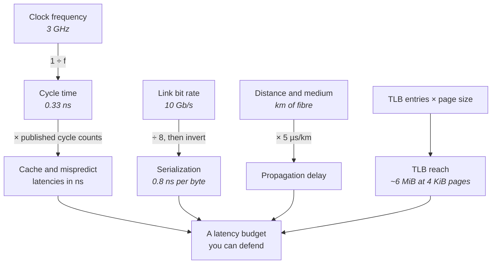
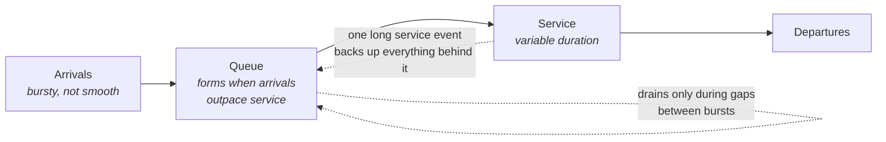
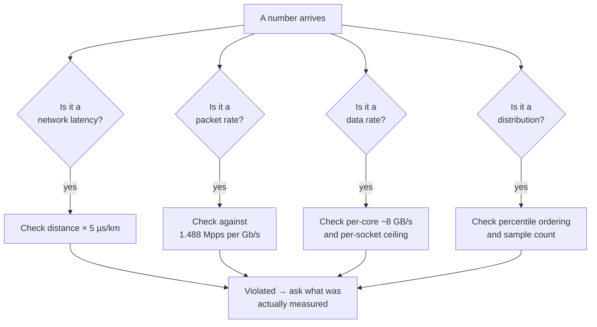

# Estimation and Back-of-the-Envelope

There is a question that appears in almost every low-latency interview, in one form or another:
*how long does that take?* It is asked about a cache miss, about a 1500-byte frame on a 10 Gb/s
link, about a round trip to a venue 40 kilometres away, about a system call. The candidate who
answers "about 90 nanoseconds" has demonstrated recall. The candidate who answers "DRAM is around
200 to 300 cycles, and at 3 GHz a cycle is a third of a nanosecond, so call it 80 to 100
nanoseconds" has demonstrated a model. Only the second one can still answer when the interviewer
changes the clock speed, the link rate, or the page size.

That is the entire point of the exercise, and it is why estimation gets its own chapter rather than
a paragraph in the question bank. Chapter 1 said that numbers are a proxy for reasoning rather than
recall (see *"What 'Low Latency' Actually Means"*). This chapter makes that concrete: it teaches
the half-dozen conversions that generate every other number in the book, and then drills them until
producing one takes a few seconds rather than a few minutes of visible arithmetic.

The second skill this chapter teaches is the more valuable one, and it is not taught anywhere else.
It is the ability to hear a number and immediately know that it is *impossible*. A colleague reports
a 250-nanosecond wire-to-wire latency through the kernel network stack. A vendor datasheet claims
20 million packets per second on a 10 GbE port. A dashboard shows a p99 lower than the p50. A
benchmark reports a single thread sustaining 200 GB/s of random memory access. Each of those
violates a bound that takes ten seconds to check — the speed of light over the stated distance,
the line rate at the stated frame size, the ordering of percentiles, the outstanding-miss capacity
of one core. An engineer who has operated these systems catches all four reflexively. An engineer
who has only read about them accepts all four, and then builds a design on top of a number that
cannot happen.

Everything here is arithmetic: multiplication, division, and unit conversion. No formulas are
introduced and none are needed. The difficulty is not mathematical — it is having the anchor
quantities in memory, keeping the units straight, and knowing which physical bound each claim has
to respect. Every figure below is an order-of-magnitude teaching value for a stated class of
hardware, consistent with the tables in the preceding chapters; the digits will differ on your
machine and the ratios will not.

## Latency Numbers Every Candidate Should Know

The instinct most engineers arrive with is that this is a memorization problem — a table of twenty
rows to be learned by rote before the interview and forgotten after. That approach fails for two
reasons. The first is that the table drifts: cache latencies, clock speeds, and syscall costs all
move between hardware generations and between kernel configurations, so a memorized digit has a
shelf life. The second is that a memorized table cannot be interrogated. If the interviewer says
"suppose this is a 2.2 GHz part," or "now assume huge pages," the recalled number is stranded and
the derived one adapts in a single step.

The productive framing is that there are only about six *anchor* quantities, and everything else in
the book's number tables is derived from them by multiplication or division. Learn the anchors and
the conversions between them, and you can regenerate the tables. Two of the anchors are physics
(the speed of light in a medium, and the bit rate of a link). Two are microarchitectural facts that
change slowly (the cache line size, and the rough cycle counts of the cache tiers). Two are
software costs that vary with configuration but stay within a decade (the syscall boundary, and the
scheduler's wakeup path).

The single most useful conversion is between time and cycles, because CPU vendors publish latencies
in cycles while every requirement you are given is stated in nanoseconds or microseconds. At 3 GHz
a cycle is one third of a nanosecond, so **three cycles per nanosecond, three thousand cycles per
microsecond**. That last figure is the one to keep loaded at all times. It is what makes a
microsecond feel enormous — three thousand cycles is enough to execute several thousand
instructions on a wide out-of-order core — and feeling that is what stops you from casually
accepting a microsecond of overhead on a hot path.

The second most useful conversion is between time and distance, because network latency budgets are
usually handed to you as a map. Light in single-mode fibre travels at roughly two thirds of its
vacuum speed, which works out to about 5 nanoseconds per metre, or 5 microseconds per kilometre
(see *"The Network Stack from the Bottom Up"*). Inverted, that gives the intuition that carries
most of the network arithmetic in this book: **one microsecond is two hundred metres of fibre.** A
nanosecond is twenty centimetres. Once you hold those, the length of a cross-connect stops being an
abstraction and becomes a line item in the budget.

Every arrow in that diagram is a single arithmetic step, and between them they generate almost
every latency figure in this book. The anchors on the left are the only things worth memorizing;
the quantities on the right are outputs.

The table below consolidates the anchors and the figures derived from them. It repeats numbers
already established in Chapters 1 through 17 — nothing here is new — but it groups them by *how you
would produce them under questioning* rather than by subsystem.

| Anchor or derived quantity | Value | How you get there |
|---|---|---|
| Cycle time at 3 GHz | 0.33 ns | 1 ÷ frequency |
| Cycles in one microsecond at 3 GHz | ~3,000 | The conversion to keep loaded |
| Cache line | 64 bytes | The granularity of every transfer |
| L1d hit | ~4–5 cycles, ~1–1.5 ns | Published cycle count × cycle time |
| L2 hit | ~12–20 cycles, ~4–7 ns | Same |
| L3 hit | ~40–50 cycles, ~15–25 ns | Same; varies with slice distance |
| Local DRAM | ~200–300 cycles, ~80–100 ns | Same; the miss that matters |
| Remote NUMA DRAM | ~1.5–2× local | Two-socket server |
| Branch mispredict | ~15–20 cycles, ~5–7 ns | Pipeline depth × cycle time |
| Uncontended atomic RMW | ~15–25 cycles, ~5–8 ns | Local cache lock, no interconnect traffic |
| Contended cache line transfer, same socket | ~50–90 ns | Comparable to a DRAM access |
| Contended cache line transfer, cross-socket | ~150–300 ns | Often worse than local DRAM |
| Line-fill buffers per core | ~10–16 | Caps concurrent misses from one core |
| L2 STLB entries | ~1,500–2,000 | Generation-dependent |
| TLB reach, 4 KiB pages | ~6 MiB | Entries × page size |
| TLB reach, 2 MiB pages | ~3 GiB | Same entries, 512× the page |
| `rdtsc`, fenced | ~15–30 ns | Your measurement floor |
| `clock_gettime` via vDSO | ~15–30 ns | No ring transition |
| Null syscall, mitigations off / on | ~60–80 ns / ~150–400 ns | Configuration-dependent by 5× |
| Minor page fault | ~1–3 µs | Frame allocation, zeroing, PTE install |
| Direct context switch | ~0.5–2 µs | Plus tens of µs of cache refill afterwards |
| Blocking wakeup, untuned | ~5–50 µs | Interrupt, softirq, scheduler, switch |
| Deep C-state (C6) exit | ~50–150 µs | Read yours from sysfs |
| Fibre propagation | 5 ns/m, 5 µs/km | One microsecond = 200 m |
| Air / microwave propagation | 3.3 ns/m, 3.3 µs/km | ~1.5× faster than fibre |
| Serialization at 10 GbE | 0.8 ns/byte | 1 ÷ (10 Gb/s ÷ 8) |

*Order-of-magnitude figures for modern x86 servers, Skylake-and-later class, with 10/25 GbE NICs.*

The drills below escalate from single-step conversions to multi-step budget arithmetic. Work them
out before reading the solution; the goal is to be able to produce the reasoning aloud, in order,
without pausing.

**Drill:** What is the cycle time of a 2.6 GHz core, and how many cycles are there in 100
nanoseconds?

One divided by 2.6 GHz. Rather than reaching for a calculator, anchor on 3 GHz being 0.33 ns and
adjust: 2.6 is about 87% of 3, so the period is about 1/0.87 ≈ 1.15 times longer, giving roughly
0.38 ns. Exactly, 1 ÷ 2.6 = 0.385 ns. In 100 ns there are 100 ÷ 0.385 ≈ 260 cycles — which is
simply the frequency in GHz times the nanoseconds, 2.6 × 100. That shortcut is worth internalizing:
**cycles = GHz × nanoseconds.**

**Drill:** A vendor optimization guide states a branch mispredict penalty of 18 cycles. What is that
in nanoseconds on a 3.2 GHz part, and how does it compare to an L1 hit?

18 ÷ 3.2 = 5.6 ns. An L1d hit is 4 to 5 cycles, so the mispredict costs roughly four L1 hits' worth
of time, or about 5.6 ns against 1.4 ns. The useful framing for an interview is the ratio, not the
digits: a mispredict throws away about as much time as three or four dependent L1 accesses, which
is why a badly-predicted branch in a tight loop is expensive but not catastrophic — and why the
real damage from mispredicts comes from frequency, not from the individual penalty.

**Drill:** How many L1 hits fit in the time of one local DRAM access?

DRAM is ~90 ns, L1 is ~1 ns, so roughly 90. Expressed in cycles at 3 GHz: DRAM is ~270 cycles
against L1's ~4, a ratio near 60 to 1 as Chapter 4's table gives it. Either framing is acceptable;
what matters is landing on "roughly two orders of magnitude." That single ratio justifies every
data-layout argument in Part I.

**Drill:** How many *serialized* cache misses fit in one microsecond, and how many *independent*
ones?

Serialized means each miss's address depends on the previous miss's result — pointer chasing. Each
costs the full ~90 ns of DRAM latency and nothing overlaps, so 1,000 ÷ 90 ≈ 11 misses per
microsecond. Independent means the addresses are all known up front, so the core can have several
misses in flight at once, bounded by its line-fill buffers — roughly 10 to 16. With 12 buffers,
you retire about 12 misses every 90 ns, or 12 × (1000 ÷ 90) ≈ 133 misses per microsecond. **The
same hardware delivers about a twelvefold difference in miss throughput depending purely on whether
the addresses are dependent**, which is the entire argument for array traversal over linked
structures.

**Drill:** Your hot path has a 2 µs wire-to-wire budget and you are considering adding one system
call. At what point does that stop being acceptable?

A null syscall is ~60–80 ns with speculative-execution mitigations disabled and ~150–400 ns with
them enabled (see *"Kernel Architecture and the Syscall Boundary"*). Against 2 µs, the pessimistic
figure is 400 ÷ 2000 = 20% of the entire budget. But the direct cost understates it: the syscall
also pollutes caches and branch predictors, and on a machine with mitigations you cannot assume the
optimistic number. The honest answer is "somewhere between 4% and 20% of the budget, and I would
need to know `/proc/cmdline` to say which" — which is a better interview answer than a single
digit, because it names the variable that dominates.

**Drill:** A thread is woken by a blocking `recvmsg` rather than busy-polling. Express the
difference in the units of the packet rate the system handles.

Busy-poll detection of a new descriptor is ~20–100 ns — one load from a resident cache line. An
untuned blocking wakeup is ~5–50 µs, and even a tuned isolated core is single-digit microseconds
(see *"Processes, Threads, and Scheduling"*). Take the tuned case at 5 µs against 100 ns: the
blocking path costs 50 times more. At an arrival rate of 200,000 packets per second, packets arrive
every 5 µs on average, so a 5 µs wakeup means the wakeup latency equals the entire inter-arrival
gap — you are permanently one packet behind. That reframing, from "5 µs of latency" to "one whole
inter-arrival interval," is the one that makes the number land.

**Drill:** How much of a microsecond does reading the clock consume, and what does that imply for
instrumenting a 20-nanosecond operation?

A fenced `rdtsc` or a vDSO `clock_gettime` is ~15–30 ns. Timing one operation requires two reads,
so 30–60 ns of overhead to measure a 20 ns operation — the instrument costs two to three times the
subject. In a microsecond you can afford roughly 1,000 ÷ 20 ≈ 30 to 60 timestamp pairs before
measurement consumes the whole budget, which is why fine-grained tracing on a hot path is
self-defeating and why short operations are measured by amortizing over many iterations instead
(see *"Clocks, Timers, and Time"*).

**Drill:** A process has a 200 MiB working set that it accesses randomly. How much of it does the
TLB cover with 4 KiB pages, and with 2 MiB pages?

TLB reach is entries × page size. With ~1,500 second-level TLB entries and 4 KiB pages, reach is
1,500 × 4 KiB = 6 MiB — about 3% of the working set, so the overwhelming majority of accesses miss
the TLB and pay a page walk of up to four dependent memory accesses on top of the data access
itself. With 2 MiB pages, the same 1,500 entries reach 1,500 × 2 MiB ≈ 3 GiB, which covers the
entire working set fifteen times over. **The hardware did not change; the reach changed by a factor
of 512**, which is why huge pages are a standard tuning step for large-working-set processes (see
*"Memory Systems"*).

**Drill:** What does a TLB miss cost relative to the access it accompanies?

A page walk is up to four dependent memory accesses, though paging-structure caches usually shorten
it. If two of those levels miss all the way to DRAM, that is 2 × 90 ≈ 180 ns of walk before the
data access even begins. The book's figure of ~20–100 ns for a TLB miss reflects the common case
where the upper levels hit in the paging-structure caches. The point to state under questioning is
that the cost is *variable by an order of magnitude* depending on how much of the walk is cached —
which is exactly the property that makes it a tail-latency contributor rather than a mean-latency
one.

**Drill:** A colocated venue is 32 km away by fibre. What is the one-way and round-trip
propagation delay, and what is the floor on any request-response interaction with it?

32 km × 5 µs/km = 160 µs one way, 320 µs round trip. That is the floor: no amount of kernel bypass,
FPGA offload, or code optimization moves it, because it is the time light takes to cover the glass.
Anything you can influence — the host stack, the switches, the application — is being added on top
of an immovable 320 µs. This is the calculation that tells you whether a proposed optimization is
worth doing at all: shaving 2 µs off a path whose floor is 320 µs is a 0.6% improvement.

**Drill:** Two routes between the same endpoints are 1,000 km apart in path length terms: one is
fibre, one is a microwave chain following a straighter line at 900 km. Which wins, and by how much?

Fibre: 1,000 km × 5 µs/km = 5,000 µs = 5 ms one way. Microwave through air: 900 km × 3.3 µs/km =
2,970 µs ≈ 3 ms one way. The microwave path wins by about 2 ms one way — partly from the faster
medium (3.3 versus 5 µs/km) and partly from the shorter path, since radio links can follow a
straighter line than buried fibre. That 2 ms is the entire commercial justification for microwave
links, which carry a small fraction of fibre's bandwidth and stop working in heavy rain (see
*"Network Design and Operations"*).

**Drill:** A 100-metre cross-connect run inside a colocation facility — is that a rounding error?

100 m × 5 ns/m = 500 ns. A low-latency cut-through switch hop is ~300–500 ns port to port. **The
cable is comparable to a switch.** A 3-metre direct-attach copper cable, by contrast, is 3 × ~4.5
ns/m ≈ 14 ns, which genuinely is a rounding error. The lesson is that cable length becomes a line
item once it reaches tens of metres, and this is why facilities sell equal-length cross-connects
rather than shortest-path ones.

**Drill:** Convert 250 microseconds into cycles, cache misses, and metres of fibre.

At 3 GHz, 250 µs × 3,000 cycles/µs = 750,000 cycles. At ~90 ns per serialized DRAM miss, 250,000 ns
÷ 90 ≈ 2,800 dependent misses. At 200 m/µs, 250 µs is 50 km of fibre. Being able to move fluently
between those three framings is what lets you answer "is 250 µs a lot?" — it is nothing compared to
a disk seek, it is an eternity compared to a cache miss, and it is the propagation delay to a venue
50 km away.

**Drill:** A core enters the C6 idle state between bursts. Express the wake-up cost in packets at a
100,000 packets-per-second arrival rate.

C6 exit is ~50–150 µs on a modern x86 server; read the exact value from
`/sys/devices/system/cpu/cpu0/cpuidle/state*/latency`. At 100 kpps, packets arrive every 10 µs, so
a 100 µs exit latency spans about ten packet arrivals — every one of which queues behind a core
that is still powering up. This is the arithmetic behind the apparently wasteful practice of
burning a core in a spin loop: the spinning core never leaves C0, so it never pays the exit. You
are spending 100% of a core to avoid a delay equivalent to ten packets (see *"Clocks, Timers, and
Time"*).

**Drill:** A minor page fault costs ~2 µs. How many DRAM accesses is that, and how many would a
single 4 KiB page touched for the first time have cost if it were already mapped?

2 µs ÷ 90 ns ≈ 22 DRAM accesses. If the page were already mapped and cold in cache, touching it
would cost one DRAM access per cache line actually read — one line is 64 bytes, so reading the
whole 4 KiB page is 64 lines, but sequential access engages the prefetcher and overlaps them
heavily. The comparison to make is against the *first* access: the fault costs roughly twenty times
a single cold access, entirely in kernel work that produced no data. That ratio is why
pre-faulting and `mlockall` at startup are standard (see *"Memory Management"*).

## Bandwidth and Packet Rate Arithmetic

Network arithmetic trips people up for one specific reason, and it is not the division. It is that
the frame you think about and the frame on the wire are different sizes. Ethernet transmits, ahead
of every frame, a 7-byte preamble and a 1-byte start-of-frame delimiter, and it requires a 12-byte
inter-frame gap afterwards before the next frame may begin. **Every frame therefore occupies 20
bytes more of wire time than its own length.** For a full-MTU 1518-byte frame that overhead is 1.3%
and ignorable; for a minimum-size 64-byte frame it is 31%, and forgetting it produces an answer
that is wrong by nearly a third. Interviewers ask about minimum-size frames precisely because that
is where the mistake shows.

The base conversion is simple. A link rate is quoted in bits per second; divide by eight to get
bytes per second, then invert to get time per byte. 10 Gb/s is 1.25 GB/s, which is 0.8 nanoseconds
per byte. Every other rate follows by scaling: 25 GbE is 0.32 ns/byte, 100 GbE is 0.08 ns/byte,
1 GbE is 8 ns/byte. Note that this is a *latency* figure, not just a throughput one — the first bit
of a frame cannot reach the far end before the last bit has left, which is why link speed shortens
latency and not merely queue drain times.

Packet rate is the reciprocal of the per-frame wire time. A 64-byte frame occupies 84 bytes of
wire, which is 672 bits; at 10 Gb/s that is 67.2 ns, so the maximum frame rate is 1 ÷ 67.2 ns =
14.88 million packets per second. That number is worth memorizing, but the more useful form is the
scaling constant behind it: **1.488 million minimum-size packets per second per gigabit per
second.** From that, 1 GbE gives 1.488 Mpps, 25 GbE gives 37.2 Mpps, and 100 GbE gives 148.8 Mpps,
with no further arithmetic.

The same reciprocal logic applies inside the machine. Memory bandwidth is channels multiplied by
per-channel bandwidth, and per-channel bandwidth is the transfer rate multiplied by the 8-byte
channel width: a DDR4-2400 channel moves 2,400 MT/s × 8 B = 19.2 GB/s, and six populated channels
give about 115 GB/s per socket — consistent with Chapter 5's range of 100–300 GB/s depending on
generation and channel count. PCIe follows the same shape: usable bandwidth is lanes multiplied by
per-lane bandwidth, so a Gen3 x8 slot delivers 8 × 985 MB/s ≈ 7.9 GB/s per direction, or about 63
Gb/s (see *"Buses, Devices, and I/O Hardware"*).

The one place where the naive multiplication misleads is single-core memory throughput, and it is a
favourite interview trap. Per-socket memory bandwidth is a property of the memory controllers; a
single core cannot approach it, because a core can only have as many misses outstanding as it has
line-fill buffers. Twelve buffers, 64 bytes each, resolving every ~90 ns gives 12 × 64 ÷ 90 ns ≈
8.5 GB/s. **One core reaches roughly a tenth of the socket's bandwidth, and saturating a socket
takes a dozen or more cores.** Any claim of tens of GB/s from a single thread doing random access
is wrong on its face.

| Quantity | Value | Derivation |
|---|---|---|
| Serialization, 1 / 10 / 25 / 100 GbE | 8 / 0.8 / 0.32 / 0.08 ns per byte | 1 ÷ (rate ÷ 8) |
| Per-frame wire overhead | 20 bytes | 7 preamble + 1 SFD + 12 IFG |
| Minimum Ethernet frame | 64 B frame, 84 B on wire | 672 bits |
| Full-MTU frame | 1518 B frame, 1538 B on wire | 12,304 bits |
| Jumbo frame (9000 MTU) | 9018 B frame, 9038 B on wire | 72,304 bits |
| Ethernet header + FCS | 18 B | 22 B with an 802.1Q tag |
| UDP/IPv4 overhead above payload | 42 B | 14 Eth + 20 IP + 8 UDP |
| TCP/IPv4 overhead above payload | 54 B minimum, ~66 B typical | Options push it up |
| Max packet rate, minimum frame | 1.488 Mpps per Gb/s | 14.88 Mpps at 10 GbE |
| Max packet rate, full MTU, 10 GbE | ~813 kpps | 10 Gb/s ÷ 12,304 bits |
| Max packet rate, jumbo, 10 GbE | ~138 kpps | 10 Gb/s ÷ 72,304 bits |
| DDR channel bandwidth | Transfer rate × 8 bytes | DDR4-2400 → 19.2 GB/s |
| Per-socket memory bandwidth | Channels × per-channel | ~100–300 GB/s |
| Single-core memory bandwidth ceiling | ~8–10 GB/s | LFBs × 64 B ÷ DRAM latency |
| PCIe Gen3 / Gen4 / Gen5 per lane | ~985 MB/s / ~1.97 / ~3.94 GB/s | Per direction |
| Cache lines per second at 100 GB/s | ~1.6 billion | 100e9 ÷ 64 |

*Order-of-magnitude figures for modern x86 servers with 10/25 GbE NICs; serialization and frame
sizes are exact arithmetic, memory and PCIe figures depend on population and generation.*

**Drill:** Convert 10 Gb/s into bytes per second and into nanoseconds per byte.

10 Gb/s ÷ 8 = 1.25 GB/s. One byte therefore takes 1 ÷ 1.25e9 seconds = 0.8 ns. The sanity check
that keeps the units straight: a gigabyte per second means a nanosecond per byte, so 1.25 GB/s must
be slightly *less* than a nanosecond per byte. If your answer came out above 1 ns, you divided the
wrong way.

**Drill:** How long does a 200-byte frame take to serialize at 25 GbE?

The frame occupies 200 + 20 = 220 bytes of wire. At 25 GbE, 0.32 ns per byte gives 220 × 0.32 =
70.4 ns. Note that if you forget the inter-frame overhead you get 64 ns, a 10% error — small enough
to pass unnoticed and large enough to matter when you multiply it by a packet rate.

**Drill:** Derive the maximum packet rate of a 10 GbE link at minimum frame size, showing every
step.

Minimum Ethernet frame is 64 bytes. On the wire it occupies 64 + 20 = 84 bytes = 672 bits. At
10 Gb/s, that frame takes 672 ÷ 10e9 = 67.2 ns. The rate is the reciprocal: 1 ÷ 67.2e-9 ≈ 14.88
million packets per second. Stating all four steps is the answer the interviewer wants, because the
method transfers to any rate and any frame size.

**Drill:** What is the maximum packet rate at full MTU on the same link, and why does the answer
matter more than the minimum-frame figure for most real systems?

A 1518-byte frame is 1538 bytes on the wire = 12,304 bits, taking 1.23 µs. The rate is 10e9 ÷
12,304 ≈ 813 thousand packets per second. It matters because packet rate, not bandwidth, is what
consumes host CPU: each packet costs roughly the same interrupt, softirq, and protocol-processing
work regardless of size. A link saturated with jumbo frames delivers 10 Gb/s at ~138 kpps and is
easy on the host; the same link saturated with minimum frames delivers far less useful data at
14.88 Mpps and will overwhelm any software stack.

**Drill:** An engineer computes the minimum-frame packet rate of a 10 GbE link as 19.5 Mpps. What
did they do wrong and how large is the error?

They divided 10 Gb/s by 64 bytes (512 bits) instead of 84 bytes (672 bits), omitting the preamble,
start-of-frame delimiter, and inter-frame gap. 10e9 ÷ 512 = 19.53 Mpps against the correct 14.88
Mpps — an overstatement of 31%. This is the single most common error in this arithmetic, and
catching it is a reliable signal to an interviewer that you have actually looked at wire captures
rather than only at protocol diagrams.

**Drill:** At 100 GbE minimum frame size, how much CPU time does a host have per packet?

100 GbE gives 148.8 Mpps, so one packet every 6.72 ns. At 3 GHz that is about 20 cycles per packet
— roughly the cost of a single branch mispredict, and less than the latency of one L2 hit. **No
software stack processes packets individually at that rate.** This is the arithmetic that explains
why 100 GbE line-rate processing requires either aggressive batching across many packets, many
cores in parallel, or hardware offload to an FPGA or NIC (see *"Kernel Bypass"* and *"Buses,
Devices, and I/O Hardware"*).

**Drill:** A market data feed sends 200-byte UDP payloads at 1 million packets per second over
IPv4. What link bandwidth does that consume, and what fraction of it is useful payload?

Build the frame from the payload up: 200 payload + 8 UDP + 20 IPv4 + 14 Ethernet + 4 FCS = 246-byte
frame, plus 20 bytes of preamble/SFD/IFG = 266 bytes on the wire. At 1 Mpps that is 266e6 bytes/s ×
8 = 2.13 Gb/s. Useful payload is 200 × 8 × 1e6 = 1.6 Gb/s. Efficiency is 1.6 ÷ 2.13 ≈ 75%. **A
quarter of the link is framing overhead**, which is why small-message protocols consume far more
bandwidth than their payload accounting suggests.

**Drill:** The same feed is redesigned to send 40-byte payloads at 5 Mpps, carrying the same total
payload volume. What happens to link consumption?

Frame is 40 + 8 + 20 + 14 + 4 = 86 bytes — above the 64-byte minimum, so no padding is needed —
plus 20 on the wire = 106 bytes. At 5 Mpps: 106e6 × 5 × 8 = 4.24 Gb/s. Payload is 40 × 8 × 5e6 =
1.6 Gb/s, the same as before. Efficiency has fallen to 38%, and link consumption has *doubled* for
identical useful data. The packet rate has also risen fivefold, which is the more damaging change,
since host cost scales with packets rather than bytes.

**Drill:** A switch port is offered 3 million packets per second of 100-byte frames. Does a 10 GbE
port carry it?

100 + 20 = 120 bytes on wire × 3e6 = 360e6 bytes/s × 8 = 2.88 Gb/s. Comfortably within 10 Gb/s on
bandwidth. But check the packet rate too: 3 Mpps against the port's 14.88 Mpps ceiling is also
fine. Both checks are necessary — a link can be far below its bit-rate ceiling and still be at its
packet-rate ceiling when frames are small, and the second constraint is the one people forget.

**Drill:** Compute the memory bandwidth of a socket with six DDR4-2666 channels.

Per channel: 2,666 MT/s × 8 bytes per transfer = 21.3 GB/s. Six channels: ~128 GB/s. That sits
inside Chapter 5's ~100–300 GB/s per-socket range, and it is a figure you can produce for any
configuration from two numbers printed on the DIMM label. Note this is a *peak* figure that real
access patterns do not reach — random access with row conflicts pays the full tCAS + tRCD + tRP
sequence and achieves a fraction of it (see *"Memory Systems"*).

**Drill:** How many cache lines per second does 128 GB/s represent, and what does that mean per
core on a 24-core socket?

128e9 ÷ 64 bytes = 2 billion cache lines per second. Divided across 24 cores, that is about 83
million lines per core per second, or one line every 12 ns. Compare that to DRAM latency of ~90 ns:
a core can only sustain that rate by keeping roughly eight misses in flight simultaneously, which
is within its 10–16 line-fill buffers but requires access patterns the prefetcher can follow. The
arithmetic explains why sequential streaming reaches near-peak bandwidth and pointer chasing does
not.

**Drill:** Can a single core saturate a socket's memory bandwidth?

No, and the bound is easy to derive. A core can have at most its line-fill buffer count of misses
outstanding — call it 12. Each miss brings 64 bytes and resolves in about 90 ns. So the core moves
12 × 64 = 768 bytes per 90 ns ≈ 8.5 GB/s. Against a 128 GB/s socket, one core reaches under 7%.
Saturating the socket requires roughly 15 cores streaming concurrently. This is the number that
kills claims like "our single thread processes 50 GB/s of market data."

**Drill:** A 25 GbE NIC is installed in a PCIe Gen3 x8 slot. Is the slot a bottleneck? What about a
100 GbE NIC?

Gen3 x8 gives 8 × 985 MB/s ≈ 7.88 GB/s per direction ≈ 63 Gb/s. A 25 GbE NIC needs 25 Gb/s in each
direction — comfortably inside. A 100 GbE NIC needs 100 Gb/s per direction and the slot provides
63, so the slot throttles it to roughly 60% of line rate; a 100 GbE NIC belongs in a Gen3 x16 slot
(~126 Gb/s) or a Gen4 x8 (~126 Gb/s). Confirm the negotiated width and speed rather than assuming
the physical connector matches, since slots frequently negotiate below their mechanical size.

**Drill:** An RX ring is configured with 4,096 descriptors. How long a burst can it absorb at 10
GbE line rate with minimum-size frames, and with full-MTU frames?

At minimum frame size the link delivers 14.88 Mpps, so 4,096 descriptors fill in 4,096 ÷ 14.88e6 ≈
275 µs. At full MTU the link delivers ~813 kpps, so the same ring lasts 4,096 ÷ 813e3 ≈ 5 ms.
**The ring's depth is a time budget, and its length in time varies by nearly twenty times depending
on frame size.** That converted figure — microseconds of tolerance, not descriptors — is the one to
quote when someone asks whether a ring is deep enough, because it is directly comparable to how
long the consumer might be stalled (see *"The Linux Networking Stack"*).

## Reasoning About Queueing Intuitively

Chapter 1 split every latency into service time and queueing time, and observed that service time
is what your code controls while queueing time is controlled by load. This section is about
reasoning through the second half without formulas — because in an interview you will not be asked
to derive anything, you will be asked to predict a behaviour, and the predictions that matter all
follow from three qualitative facts.

The first is that **waiting time does not rise in proportion to utilization; it rises sharply as
the resource approaches saturation.** A resource at 50% utilization has short queues. The same
resource at 90% has queues that are not 1.8 times longer but several times longer, and the
variability of the waiting time grows faster still. The intuition behind this is worth holding
directly: a queue forms whenever arrivals momentarily outpace service, and it drains during the
gaps. At low utilization, the gaps are large and every transient queue drains before the next one
forms. At high utilization, the gaps are barely large enough, so a queue that forms takes almost as
long to drain as the interval before the next burst — and any two adjacent bursts compound. Near
saturation there is no slack to drain into at all, and the queue simply grows.

The second is that **burstiness matters more than the mean rate.** Traffic averaged over one second
tells you almost nothing about queues that form and drain in microseconds. A 10 Gb/s link carrying
2 Gb/s "on average" may be completely idle for 800 milliseconds of every second and running at full
line rate for the other 200, in which case its momentary utilization is 100% and it will drop
packets, while every dashboard shows it at 20%. This mismatch of timescales is the mechanism behind
the *microburst* — a burst of packets arriving back to back at line rate, lasting microseconds to
milliseconds, invisible to any counter sampled per second. Averaging destroys exactly the
information that predicts queueing.

The third is that **variability in service time creates queues even at low utilization.** If every
request takes exactly 1 µs and they arrive exactly every 2 µs, no queue ever forms regardless of
how long you run. If requests take 1 µs on average but occasionally 50 µs, then during each 50 µs
excursion the arrivals pile up behind it, and the queue that forms has to drain afterwards while
new work continues to arrive. This is why a system with an occasional stall behaves far worse than
its average utilization suggests: the stall does not just delay one request, it delays everything
that arrived during the stall and everything queued behind those. It is also the connection back to
determinism — a bounded slow operation is preferable to an unbounded fast one precisely because the
unbounded case turns into a queue.

The two dashed edges carry the whole section: a queue can only drain into idle time, so removing
idle time removes the drain; and one slow service event propagates its delay to every item already
waiting, which is why tail service time and queueing are the same problem viewed from two ends.

These three facts generate the standard design postures, all of which you should be able to justify
without invoking any theory.

- **Run hot-path resources far below capacity.** You are not buying throughput headroom, you are
  buying the absence of queues and, more importantly, the absence of queue *variance*.
- **Size buffers against the burst you must survive, not the mean rate.** A buffer sized to the
  average is guaranteed to overflow during bursts, which is the only time it was needed.
- **Convert queue depths into time before judging them.** "4,096 descriptors" means nothing;
  "275 µs of line-rate burst tolerance" is comparable to how long the consumer might stall.
- **A buffer trades drops for latency.** Making a queue deeper does not make the system faster; it
  converts a packet that would have been dropped into a packet that arrives very late. Whether that
  is an improvement depends entirely on whether late data is still useful.
- **Batching moves latency onto the earliest item.** The first item of a batch waits for the last
  to arrive, so batch size is directly a latency cost paid by the item that arrived first.
- **Measure utilization at the timescale of the queue.** A queue that forms and drains in 50 µs
  cannot be diagnosed with per-second counters.

**Drill:** A dashboard shows a 10 GbE link at 20% average utilization, sampled every second. Your
switch reports output drops on that port. Are those observations contradictory?

No. The 20% figure is a one-second average, and packets are dropped by a buffer that fills and
empties in microseconds. If the traffic arrives as microbursts — say, 200 ms of line-rate
transmission followed by 800 ms of silence — the average is 20% while the momentary rate is 100%,
and any port whose egress cannot absorb line rate will drop. The correct next step is not to
disbelieve the drop counter but to measure at a finer timescale, or to reason about what upstream
event produces the burst.

**Drill:** Traffic arrives at a switch on a 10 GbE ingress port and must leave on a 1 GbE egress
port. A burst of 500 full-MTU frames arrives back to back. How long does the last frame wait, and
how much buffer is needed?

Arrival: 500 frames × 1,538 wire bytes at 0.8 ns/byte = 500 × 1.23 µs ≈ 615 µs to arrive. Drain: at
1 Gb/s, each frame takes 1,538 × 8 ns/byte = 12.3 µs, so 500 frames take 6.15 ms. The last frame is
therefore transmitted about 6.15 ms after the burst began, having arrived at 615 µs — a wait of
roughly 5.5 ms. Buffer required: at peak, roughly 500 × 1,538 ≈ 769 KB must be held. **A speed
mismatch converts a 615 µs burst into a 6 ms delay**, which is the fundamental reason
speed-mismatched paths are avoided on latency-critical routes.

**Drill:** Twelve servers each transmit at 1 Gb/s toward a single 10 GbE port. Is that sustainable?

Aggregate offered load is 12 Gb/s into a 10 Gb/s port — 120% of capacity. It is not sustainable at
all: the queue grows without bound until the buffer fills and packets drop. Note that eight senders
(8 Gb/s, 80% utilization) would technically fit but would still produce substantial queueing,
because 80% is deep into the region where waiting time rises sharply. The design answer is not
"eight senders is fine" but "how bursty are they, and what is the resulting buffer occupancy?"

**Drill:** A consumer thread takes 1 µs per message. Messages arrive at 1.2 million per second. What
happens?

Capacity is 1 ÷ 1 µs = 1 million messages per second. Arrivals exceed it by 20%, so the queue grows
by 200,000 messages every second and never drains. The system is not "slow," it is *unstable* —
latency grows without limit until a buffer fills and messages are dropped or memory is exhausted.
The distinction matters in an interview: an overloaded system's latency is unbounded, and no amount
of tuning short of increasing capacity or reducing arrivals fixes it.

**Drill:** The same consumer handles 800,000 messages per second — 80% utilization. Is that a
healthy design point for a latency-critical path?

No. The system is stable, so throughput is met and average latency looks acceptable, but at 80%
utilization queues form regularly and their variance is high — which shows up as a p99.9 far worse
than the median while the mean stays flat. This is the shape of the "fine in testing, bad in
production" failure. A latency-critical consumer is typically sized so that its steady-state
utilization sits well under half of capacity, with the remainder reserved as burst absorption
rather than as spare throughput.

**Drill:** A NIC is configured with 50 µs of receive interrupt coalescing. What does that add to the
latency of a packet, and does it depend on load?

Coalescing delays the interrupt until either a packet count or a timer threshold is reached. In the
worst case — a single packet arriving into an idle NIC — the packet waits the full 50 µs before the
host is told about it. Under heavy load the packet-count threshold triggers first, so the added
delay is smaller. **The counterintuitive consequence is that coalescing hurts most when the system
is quiet**, which is why it is one of the first defaults disabled on a trading host (see *"The
Linux Networking Stack"*).

**Drill:** Batching 64 messages at a 1 million messages-per-second arrival rate: what does the first
message in each batch pay?

At 1 Mpps, messages arrive every 1 µs, so filling a 64-message batch takes 64 µs. The first message
waits the full 64 µs before processing begins; the last waits essentially nothing. Average added
latency across the batch is about 32 µs, but the *worst case* — which is what matters — is 64 µs.
Halving the batch to 32 halves both figures. This is the arithmetic that makes "batch size is a
latency knob" concrete rather than a slogan.

**Drill:** A pipeline has three stages capable of 2, 1.2, and 3 million messages per second
respectively. What is the system's throughput, and where does the queue form?

Throughput is set by the slowest stage: 1.2 million per second. The queue forms *in front of* the
slow stage, fed by the faster stage upstream. The third stage runs starved. Adding capacity
anywhere except the second stage changes nothing — a point worth making explicitly, because the
instinct to optimize the stage you understand best is exactly what a budget exists to prevent.

**Drill:** A receive ring holds 512 descriptors on a 10 GbE link carrying full-MTU frames. The
consumer thread is occasionally descheduled for 2 ms. Does the ring survive?

At full MTU the link delivers ~813 kpps, so 512 descriptors represent 512 ÷ 813e3 ≈ 630 µs of
line-rate tolerance. A 2 ms stall is more than three times that, so the ring overflows and packets
are dropped — and the drop happens in the NIC, showing up in `ethtool -S` counters rather than
anywhere in the application. Either the stall must be eliminated (isolating the core, removing the
blocking operation) or the ring must be deepened to roughly 1,600+ descriptors, which trades the
drop for up to 2 ms of added latency on the packets behind it.

**Drill:** Why does a p99.9 degrade faster than a mean as load increases?

Because the mean is dominated by the common case, which barely changes: service time is unchanged
and most events still find an empty queue. The tail is produced by the moments when a queue
actually formed — and those moments become both more frequent and longer as utilization rises,
since there is less idle time available to drain into. The result is a distribution whose body
stays put while its tail stretches. This is the qualitative statement behind the observation in
Chapter 1 that variance grows faster than the mean, and it is the reason a mean-based capacity plan
produces a system that meets its average target and misses its tail target.

## Sanity-Checking a Claimed Number

The skill this section teaches is the one that most clearly separates an engineer who has operated
these systems from one who has read about them, and it is entirely mechanical. Every latency,
throughput, and rate claim is bounded by something physical or arithmetic. When a claim arrives,
you run it against the relevant bound; if it violates the bound, the claim is wrong regardless of
how it was measured, and the interesting question becomes *what was actually measured instead*.

That last reframing is important, because a number below a physical bound is rarely a lie. It is
almost always a measurement that omitted part of the path, or measured a different path, or was
computed against the wrong denominator. A reported 250 ns wire-to-wire latency through the kernel
is not fabricated — it is an in-process measurement that timestamped at the top and bottom of the
application and excluded the NIC, both PCIe traversals, and the entire kernel stack. Saying "that
number is impossible, so I think you measured the application segment only" is a far stronger
response than either accepting it or disputing it.

There are six bounds that catch nearly everything, and they cost seconds to check.

| Bound | The check | What a violation usually means |
|---|---|---|
| Speed of light | Is the claimed one-way delay below distance × 5 µs/km (fibre) or 3.3 µs/km (air)? | Wrong distance, wrong path, or a one-way figure quoted as a round trip |
| Line rate | Is the claimed packet rate above (rate in Gb/s) × 1.488 Mpps, or above rate ÷ frame bits? | Forgotten 20-byte wire overhead, or aggregate across ports quoted as one port |
| Memory bandwidth | Is the claimed throughput above ~8–10 GB/s from one core, or above channels × per-channel for the socket? | Data was cache-resident, not from DRAM |
| Cycle budget | Does the claimed per-item work fit in (ns × GHz) cycles? | Work was amortized across a batch, or the item count is wrong |
| Percentile ordering | Is p99 ≥ p50, p99.9 ≥ p99, max ≥ every percentile? | Percentiles computed over different windows, or averaged across buckets |
| Measurement floor | Is the claimed resolution finer than ~15–30 ns per timestamp pair? | Timing loop overhead not subtracted, or the operation was optimized away |

Each branch of that flowchart is a single division against a bound already in this chapter's
tables; the terminal node is deliberately not "the claim is false" but "ask what was measured,"
because that is the response that produces useful information.

**Drill:** "Our wire-to-wire latency through the standard kernel network stack is 250 nanoseconds."

Impossible by a wide margin. The NIC receive path alone — PCIe traversal and DMA into host memory —
is around 1 µs, before the kernel does anything. Interrupt entry to the first handler instruction is
1–2 µs. IP and UDP protocol processing is another 0.5–1.5 µs. A tuned interrupt-driven host reaches
5–15 µs wire-to-application, and kernel bypass reaches 1–2 µs. 250 ns is below even the bypass
figure and roughly a quarter of the PCIe traversal. The near-certain explanation: the measurement
timestamped inside the application on both sides and reported the application segment only.

**Drill:** "Round-trip latency to the venue is 400 µs. It's 60 kilometres away."

Impossible. 60 km of fibre is 60 × 5 = 300 µs one way, so the round trip cannot be below 600 µs
even with zero equipment in the path. A claimed 400 µs is two thirds of the light bound. Either the
distance is wrong (perhaps it is 60 km of straight-line map distance and the fibre follows a
shorter or different route — unlikely, since fibre routes are almost always *longer* than
straight-line distance), or 400 µs is a one-way figure being described as a round trip, or the
measurement terminates somewhere closer than the venue.

**Drill:** "We measure 300 µs round trip to a site 30 km away."

30 km round trip is 60 km of glass, which is 300 µs of pure propagation. The claim is exactly at
the bound, leaving zero time for the two host stacks, the NICs, and every switch in between. It is
not arithmetically impossible, but it is physically impossible, and the correct response is to say
so: "that is precisely the propagation floor, so it implies zero equipment latency — I'd want to
know whether the 30 km is fibre route distance or map distance." Fibre route length routinely
exceeds map distance by 30% or more.

**Drill:** "This NIC sustains 20 million packets per second of 64-byte frames on a single 10 GbE
port."

Impossible. The port's ceiling at minimum frame size is 14.88 Mpps, and that ceiling is set by
Ethernet framing, not by the NIC. Even the erroneous calculation that omits the 20-byte wire
overhead only reaches 19.5 Mpps. Two plausible explanations: the figure is aggregate across two
ports (2 × 14.88 = 29.8 Mpps, so 20 Mpps across a dual-port card is entirely reasonable), or the
part is 25 GbE rather than 10 GbE, where the ceiling is 37.2 Mpps.

**Drill:** "Our single thread processes 500 million records per second, each one a random lookup
into a 4 GB table."

Impossible on two independent grounds. First, latency: a random access into a 4 GB table misses
cache and costs ~90 ns from DRAM; 500 million per second would require one every 2 ns, which is
forty-five times faster than the access itself, and the accesses are dependent so they cannot
overlap. Second, bandwidth: 500 million cache lines per second is 500e6 × 64 = 32 GB/s from one
core, against a single-core ceiling of roughly 8–10 GB/s set by line-fill buffer count. The likely
reality is that the benchmark's working set was small enough to be cache-resident, so the "4 GB
table" was never actually traversed.

**Drill:** "Our latency dashboard shows p50 = 5 µs, p99 = 3 µs, p99.9 = 40 µs."

Impossible: percentiles are monotonically non-decreasing by definition, so p99 cannot be below p50.
The near-universal cause is averaging percentiles across time windows or across hosts — you cannot
average a p99, because the mean of several p99 values is not the p99 of the combined population.
Another cause is computing percentiles from a histogram whose buckets were reset between the two
reads. The fix is to aggregate the underlying histograms and take percentiles from the merged data.

**Drill:** "Our benchmark's maximum latency over a 10-second run at 1 million messages per second
was 12 µs."

Not impossible, but it demands scrutiny, because 10 million samples with a maximum of 12 µs means
nothing in that window took longer — no timer tick handling (1–5 µs, and at 1000 Hz there are
10,000 ticks in 10 seconds), no context switch (0.5–2 µs plus cache refill), no page fault (1–3 µs),
no C-state exit. On a fully isolated core with `nohz_full`, pre-faulted and locked memory, and idle
states disabled, a 12 µs maximum is achievable and is roughly what a well-tuned host reports. On a
default machine it is not, and the first question to ask is whether the harness is closed-loop —
because coordinated omission removes exactly these stalls from the record (see *"Measuring
Correctly"*).

**Drill:** "We write 2 million audit records per second to disk, calling `fsync` after each one."

Impossible. `fsync` on NVMe costs ~100 µs to several milliseconds, giving a ceiling somewhere
between 10,000 and a few thousand operations per second. Two million per second is two to three
orders of magnitude above that. The likely reality is that records are batched — many records per
`fsync` — or that `fsync` is not actually being called per record, or that the writes land in the
page cache and durability is not what the claim implies.

**Drill:** "Replacing a mutex with an atomic saved 400 nanoseconds per operation."

Suspicious. An uncontended lock acquire and release is ~20–40 ns total, so a 400 ns saving is ten
times the entire uncontended cost of the thing removed. The claim is only consistent if the mutex
was *contended*, where the cost is the cache line transfer plus, in the worst case, a sleep and
wake through the kernel at 2–10 µs. So the number is plausible under contention and impossible
without it. The right follow-up is "was the lock contended, and how do you know?" — which is
answerable with `perf` cache-coherence events or futex tracing.

**Drill:** "Our profiler shows this function takes 5 nanoseconds, measured with `clock_gettime`
around each call."

Impossible to measure that way. A vDSO `clock_gettime` costs ~15–30 ns, and timing requires two of
them, so the instrumentation costs 30–60 ns around a claimed 5 ns subject. The reported figure
cannot be a per-call measurement; it must be a total divided by an iteration count, in which case
the overhead was either subtracted or amortized. Ask which. If the answer is "we ran it in a loop
and divided," the follow-up is whether the compiler kept the work at all, since a loop whose result
is unused is a favourite thing to eliminate.

**Drill:** "The 25 GbE market data link carries 4 Gb/s at 30 million packets per second."

Internally inconsistent. 30 Mpps at any frame size requires at minimum 30e6 × 84 bytes × 8 = 20
Gb/s of wire time, because 84 bytes is the smallest a frame can occupy. A link carrying 4 Gb/s
cannot be carrying 30 Mpps. Working backwards: 4 Gb/s = 500 MB/s of wire bytes, which at 84 bytes
per frame is at most 6 Mpps. Either the packet rate is off by a factor of five, or the bandwidth
figure counts payload only and the packets are far smaller than the link accounting suggests —
though even payload-only accounting cannot reconcile a five-fold gap.

**Drill:** "This cut-through Ethernet switch has 40 nanoseconds port-to-port latency."

Below the class. Low-latency cut-through Layer 2 switches are ~100–400 ns port to port; the
fastest commodity parts sit near 100 ns. 40 ns is faster than any MAC-layer forwarding decision,
which requires at minimum receiving and parsing the destination address before a forwarding choice
can be made. The number is achievable only by a *Layer 1* device — a physical-layer crosspoint that
performs no address lookup and simply replicates or switches the signal, which is a real product
category at around 5 ns and up. The response is not "that is wrong" but "that sounds like a Layer 1
switch, not a Layer 2 one — which is it?"

**Drill:** "Our application achieves 200 GB/s of memory throughput on a two-socket server."

Plausible for the machine, impossible for most applications. Two sockets each with six DDR4-2666
channels give roughly 2 × 128 = 256 GB/s of theoretical peak, so 200 GB/s is about 78% of peak —
achievable only with purely sequential streaming across many cores on both sockets with
NUMA-local allocation. The checks to run: how many threads, are they pinned, is the access pattern
sequential, and is the data NUMA-local? If any answer is unfavourable, the figure is measuring
cache traffic rather than DRAM traffic. The fastest disqualifier is thread count: if the number
came from fewer than about fifteen threads, it cannot be DRAM.

**Drill:** "Adding a second NUMA node doubled our memory latency to 2 microseconds."

Wrong by an order of magnitude in the *result*, though right in direction. Remote NUMA access is
1.5–2× local, so if local is ~90 ns, remote is ~130–200 ns — not 2 µs. A 2 µs figure is in
page-fault territory, or it includes a TLB miss with a full walk plus remote access, or the
measurement includes something other than the memory access. The direction of the claim is correct
and the magnitude is not, which is the most common shape of a wrong number: a real effect,
misattributed by a factor of ten.

**Drill:** "We eliminated a 15 microsecond stall by disabling interrupt coalescing, which was set to
`rx-usecs 8`."

Inconsistent. A coalescing setting of 8 microseconds bounds the added delay at 8 µs, so it cannot
by itself account for a 15 µs stall. Something else contributed the remainder — plausibly the
wakeup path from softirq to the blocked reader (2–10 µs), or a C-state exit, or the two effects
compounding. The response is to accept the improvement and question the attribution: "disabling
coalescing can explain up to 8 µs of that; what accounts for the rest?" Attributing an entire
improvement to a single change whose bound is smaller than the improvement is one of the most
common errors in performance reporting, and catching it is exactly the reasoning an interviewer is
probing for.

**Drill:** "We handle 148 million packets per second on this host with a single core."

The rate is correct for 100 GbE at minimum frame size, so the link claim is fine — but a single
core has 6.72 ns per packet, roughly 20 cycles at 3 GHz. Twenty cycles is not enough to read a
descriptor, touch the packet header, and update a counter; a single L2 hit costs most of it and one
DRAM access costs thirteen times it. The claim can only hold if the "handling" is done by hardware
— NIC-side filtering, FPGA offload, or a switch — with the core seeing a small filtered subset. The
useful question is what fraction of those 148 million packets the core actually touches.
