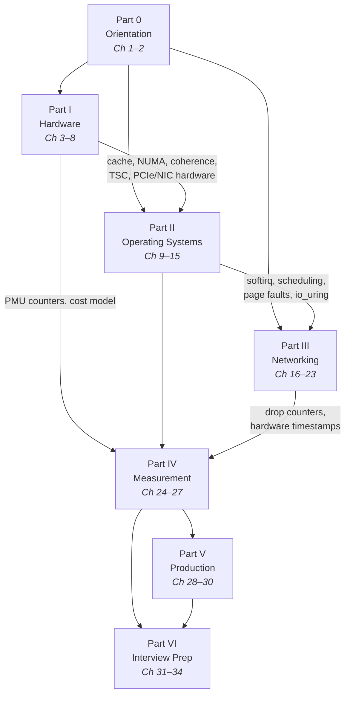
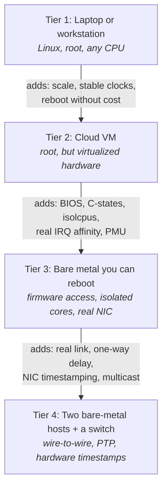
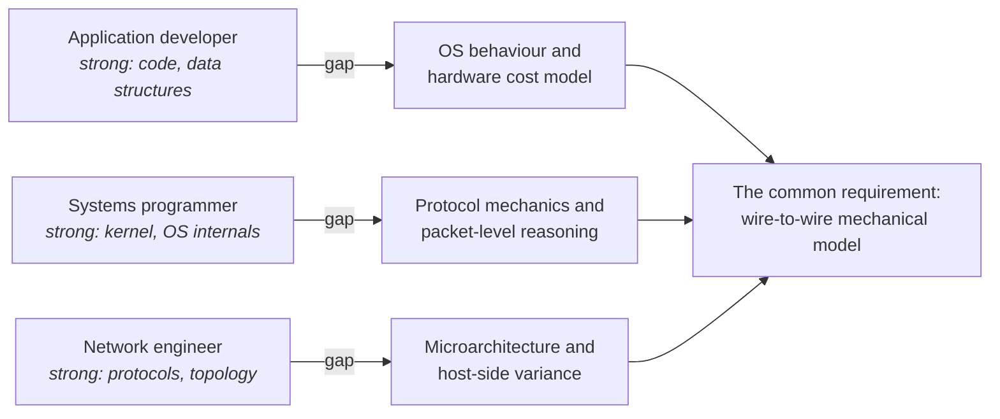

# Study Plan

This book is roughly the size of a graduate course, and it is not organized like one. A course would
give you a semester, a lab, and a professor who notices when you have fallen behind. You have a
deadline that is probably measured in weeks, a machine that is probably a laptop, and no external
signal at all about whether your understanding is real or is the comfortable illusion that comes
from having read a clear explanation of something. That illusion is the specific danger here. The
material in Parts I through IV is written to be readable, and readable material produces a feeling
of comprehension that survives right up until an interviewer asks you what happens next.

The distinction that matters is between recall and a model. Recall is knowing that a cache line is
64 bytes, that `isolcpus` removes a CPU from the scheduler's balancing, that Nagle's algorithm
interacts badly with delayed ACK. A model is being able to work forward from those facts to a
prediction: *if I put two hot counters 8 bytes apart and write them from two cores, throughput will
collapse by roughly an order of magnitude, and `perf stat` will show it as HITM events on the
coherence counters, and moving them 64 bytes apart will fix it.* The first can be acquired by
reading. The second is acquired only by making the prediction, running the experiment, and being
wrong often enough to calibrate. Every chapter in this book carries `**Try it:**` callouts for
exactly this reason, and they are the part most readers skip. Chapters 1 through 17 alone contain
well over a hundred of them; nobody is going to do all of them, and the plan below is largely a
scheme for choosing which ones to do.

There is a second reason the exercises matter, and it is specific to interviewing. The strongest
signal you can give in a low-latency interview is a first-person measurement: "on a Skylake box I
measured the core-to-core handoff at about 45 nanoseconds through shared memory and about 3
microseconds through a pipe, which is why I would not use a pipe for that." That sentence cannot be
faked from reading, and interviewers can tell. It also converts a memorized number into a defensible
one, because you know the conditions under which you obtained it. Candidates who have measured
things sound different from candidates who have read about things, and the difference shows up
within about ninety seconds.

Finally, be realistic about scale. Thirty-three chapters covering hardware, the Linux kernel, the
network stack, TCP/IP, kernel bypass, measurement, and production operation is not something you
absorb in a weekend, and pretending otherwise produces the worst outcome: a uniform, shallow pass
over everything, which is precisely the profile that fails an interview designed to push until you
stop knowing *(see "What 'Low Latency' Actually Means")*. Depth in most of the material beats
familiarity with all of it. The plans below are built around that trade.

## A structured multi-week path

The chapter order in this book is a teaching order, not a dependency order. Read straight through
and you will never hit a forward reference, but you will also spend the first two parts building
foundations without seeing them pay off, which is demoralizing under time pressure. The plans below
reorder slightly to get you to a measurable result early, then return for depth.

Before either plan, understand what actually depends on what. Most of the perceived dependencies in
this material are soft — you can read about TCP congestion control without understanding cache
coherence — but a few are hard, in the sense that the later chapter is largely incomprehensible
without the earlier one.

- **Part 0 gates everything.** Chapters 1 and 2 install the vocabulary — tail, jitter, budget,
  determinism, hot path — that every later chapter assumes. Two hours, no exceptions.
- **Part I gates Part II hard.** "Memory Management" is unreadable without the TLB and page-walk
  material in "Memory Systems"; "Synchronization and IPC" is unreadable without the coherence and
  memory-ordering material in "Multicore, Coherence, and Memory Ordering"; "The Linux Networking
  Stack" assumes the NIC ring and DMA model from "Buses, Devices, and I/O Hardware".
- **Part II gates Part III softly but really.** "Kernel Bypass" only makes sense as a reaction to
  the kernel path taught in "The Linux Networking Stack", and that chapter in turn assumes softirqs
  and scheduling from Part II.
- **Part IV can be read early and should be re-read late.** "Measuring Correctly" needs almost no
  prerequisites and makes every earlier exercise more valuable; "Profiling Tools and Hardware
  Counters" needs Part I to interpret what the counters mean.
- **Part III is the most independent block.** Chapters 16 through 23 depend on Part 0 and on the
  NIC hardware section of Chapter 8, and very little else. A network engineer can start here.
- **Part VI is not a study unit.** Chapters 31 through 33 are rehearsal, used throughout rather than
  read once at the end.

### The four-week intensive track

This assumes roughly 20–25 hours per week — an evenings-and-weekends schedule with real
commitment, or a full-time block. It deliberately sacrifices Part V and compresses Part I, on the
grounds that with four weeks the correct trade is depth in the three areas interviewers probe
hardest: memory hierarchy, OS determinism, and the network path.

| Week | Chapters | Focus | Deliverable |
|---|---|---|---|
| **1** | 1, 2, 24 (early), 3, 4, 5, 6, 7 | Cost model and the memory hierarchy. Read "Measuring Correctly" out of order on day two so every subsequent experiment is instrumented properly. | A latency-harness script you reuse all month: pre-allocated sample array, percentile output, warm-up phase. Plus a one-page table of *your* machine's numbers: cache-tier latencies, core-to-core handoff, `clock_gettime` cost, syscall cost, mispredict penalty. |
| **2** | 8, 9, 10, 11, 12, 15 | The kernel as a source of jitter, and how to remove it. Chapter 13 is skimmed; Chapter 14 is deferred to week 3 where it belongs with the network material. | A written tuning checklist for a hypothetical host — boot parameters, `sysctl` values, IRQ affinity plan, C-state policy — with a justification sentence for every single line. Interviewers ask you to defend these individually. |
| **3** | 14, 16, 17, 18, 19, 20, 21, 23 | The full packet path, twice: once through the kernel, once around it. TCP gets the most hours of any single chapter in the plan. | A hand-annotated packet capture: a TCP connection from SYN to FIN with every state transition, window movement, and retransmission labelled by you from the raw trace, plus a UDP multicast capture showing an IGMP join. |
| **4** | 22, 25, 26, 27, 33, 31, 32 | Diagnosis and rehearsal. Profiling, jitter hunting, estimation, then the question bank and design rounds. | Two written "why is this slow?" case studies, worked from symptom to root cause with the exact tool invocations you would run at each step; plus timed verbal answers to twenty questions from "The Question Bank". |

The sequencing choices worth understanding:

- **"Measuring Correctly" moves to week 1.** Every exercise you run before you understand
  percentiles, warm-up, and coordinated omission produces a number you will have to discard.
  Front-loading it is the single highest-leverage reordering in the plan.
- **Chapter 13 is compressed, not cut.** I/O subsystems matter less on a trading hot path than
  anywhere else in the book, because the hot path does no file I/O by construction. Read the
  `epoll`, edge-versus-level, and `io_uring` sections; skim NVMe and journaling.
- **Part V is cut entirely in four weeks.** Reliability, observability, and deployment discipline are
  real interview topics at senior level, but they are the topics where general engineering experience
  transfers best. If you have run production systems, you can improvise; if you have four weeks, you
  cannot afford chapters where you can improvise.
- **TCP gets a disproportionate share.** "TCP In Depth" has thirteen subsections and is the single
  most reliably probed chapter in the book. Budget two full days.

### The twelve-week steady track

This assumes 8–10 hours per week and is the version to use if your timeline allows it. The extra
time goes almost entirely into exercises and into the two parts the intensive track sacrifices.

| Week | Chapters | Focus | Deliverable |
|---|---|---|---|
| **1** | 1, 2 | Vocabulary and the mental model of a host. Latency versus jitter, hot versus cold path, the budget. | A latency budget for any request path you currently have access to, with every segment named and a number attached — measured where possible, estimated where not. |
| **2** | 24, 3 | Measurement method first, then the pipeline. Histograms, coordinated omission, harness construction, then frontend/backend/ILP. | The reusable latency harness, validated by deliberately injecting a periodic stall and confirming your harness reports it in the tail. |
| **3** | 4, 5 | Cache hierarchy and the memory system. The heaviest single week of Part I. | An empirical plot of access latency versus working-set size showing the L1/L2/L3/DRAM plateaus, with the step positions cross-checked against `lscpu -C`; plus a measured TLB cliff with and without huge pages. |
| **4** | 6, 7 | Coherence, memory ordering, SMT; then clocks and time. | A core-to-core latency matrix for your machine, and a written answer to "should we disable SMT here?" backed by your own measurement of sibling interference. |
| **5** | 8, 9 | I/O hardware and the syscall boundary. | A full inventory of one NIC — PCIe link width and generation, ring sizes, coalescing settings, offload state, IRQ affinity — with each setting's latency implication noted; plus your machine's measured null-syscall cost and its mitigation status. |
| **6** | 10, 11 | Scheduling and memory management: the two largest chapters in Part II. | A demonstration that pinning plus `SCHED_FIFO` plus pre-faulted, `mlockall`-ed memory measurably narrows a latency distribution on your own machine, with before/after percentiles. |
| **7** | 12, 13 | Synchronization, IPC, and I/O multiplexing. | A measured comparison of inter-thread handoff latency across at least three transports — shared-memory ring, `eventfd`, and a pipe or Unix socket — reported as full distributions, not averages. |
| **8** | 14, 15 | The kernel network stack and host tuning. These two belong together: Chapter 14 shows you the path, Chapter 15 shows you how to quiet everything around it. | A tuning checklist as in the intensive plan, plus a before/after `cyclictest`-style jitter measurement if you have any machine you are allowed to reboot. |
| **9** | 16, 17, 18 | Layer 2, IP, and multicast. | A packet capture of an IGMP join and multicast delivery, with the group management exchange identified frame by frame; plus a hand-decoded IPv4 header from raw bytes. |
| **10** | 19, 20 | TCP and the socket API. | The annotated full-connection capture: handshake, window evolution, at least one retransmission you provoked with deliberate loss, teardown, and the `TIME_WAIT` state on the correct side. |
| **11** | 21, 22, 23 | Kernel bypass, network operations, and the debugging toolkit. | A written comparison of the bypass options — DPDK, `AF_XDP`, vendor stacks — as a decision table with the cost of each in portability, debuggability, and CPU burn. |
| **12** | 25, 26, 27 | Profiling and diagnosis. | Two full case studies from symptom to root cause, plus a flame graph and a top-down counter breakdown of some real workload you have. |
| **13–14** *(optional)* | 28, 29, 30, then 31–33 | Production discipline, then rehearsal. | Verbal answers to the full question bank, two design rounds written out under time pressure, and the estimation drills done without a calculator. |

The twelve-week plan pairs chapters that share a subject rather than following the book's linear
order in a few places, and it is worth being explicit about why:

- **Chapters 14 and 15 in the same week.** Chapter 14 explains where interference enters the packet
  path; Chapter 15 explains how to remove it. Read weeks apart, the second reads as a list of knobs.
  Read together, it reads as a set of countermeasures to specific mechanisms.
- **Chapters 4 and 5 in the same week, alone.** These two chapters carry more of the book's
  explanatory weight than any other pair. Cache geometry, false sharing, the page walk, TLB reach,
  and NUMA placement are cited by roughly a dozen later chapters. Under-invest here and everything
  downstream degrades to memorization.
- **Chapter 24 before Chapter 3.** Same reasoning as the intensive plan, with more room: you get a
  full week to build a harness you will use for the following eleven.
- **Part V last, before rehearsal.** Reliability and observability are easier to absorb once you
  know what the hot path costs, because both chapters are fundamentally about doing necessary work
  without touching that path.

### Where you can skip, and where you cannot

Time pressure forces triage. This table is the triage guide — it names what is genuinely optional
against what will silently break later chapters.

| If you skip… | Consequence | Verdict |
|---|---|---|
| Ch 3, frontend/µop-cache detail | Minor. You lose some depth on instruction-side stalls. | Safe to skim |
| Ch 4, any of it | "Synchronization and IPC", "Jitter Hunting", and half of Part IV stop making sense | Do not skip |
| Ch 5, TLB and NUMA sections | "Memory Management" and "Jitter Hunting" become unreadable | Do not skip |
| Ch 6, memory ordering | "Synchronization and IPC" collapses; also a top-three interview topic | Do not skip |
| Ch 7, HPET/ACPI clock-source detail | Minor, provided you understand TSC and C-states | Safe to skim |
| Ch 8, FPGA section | Minor. Useful context, rarely load-bearing | Safe to skim |
| Ch 8, NIC rings and DMA | "The Linux Networking Stack" and "Kernel Bypass" lose their foundation | Do not skip |
| Ch 11, swap/OOM sections | Minor for a hot path that never swaps | Safe to skim |
| Ch 13, NVMe and journaling | Minor unless the role involves storage | Safe to skim |
| Ch 17, DSCP and NAT sections | Minor, though NAT's absence is a common interview aside | Safe to skim |
| Ch 19, any of it | The most probed chapter in the book | Do not skip |
| Ch 22, microwave/hollow-core section | Minor. Good colour, occasionally asked | Safe to skim |
| Part V entirely | Costs you at senior level, survivable at mid level | Skip under pressure |

### The shape of a study session

The plans above allocate chapters to weeks. Within a session, the pattern that works is not
"read the chapter, then do the exercises" — that defers all the difficulty to the end of a session
when your attention is worst. Instead, interleave. Read a section, stop, make a prediction out loud
about what the corresponding exercise will show, then run it. The prediction is the load-bearing
step; running an experiment whose result you have not committed to teaches almost nothing, because
any outcome will feel like confirmation.

Budget roughly 60% reading and 40% hands-on. When you fall behind — and you will — cut reading
breadth rather than exercise depth. Two chapters understood mechanically beat five chapters
recalled.

## Hands-on labs by part

There are far more exercises in this book than anyone will complete. This section selects the
highest-yield ones — the experiments that change your intuition rather than merely confirming a
number — and says what each one is actually teaching. Where a chapter's exercises are numerous, the
ones named here are the ones to do first.

### Part 0 — Orientation

Two exercises, both cheap, both foundational.

| Lab | Chapter | What it teaches |
|---|---|---|
| **Batching versus per-item latency** | 1 | Process items one at a time, then in batches of 64, recording per-item latency from availability to completion. Throughput improves, per-item latency worsens, and the first item of each batch is the worst. This is the throughput/latency trade in your own hands, and every later trade-off in the book is a variation on it. |
| **Histogram versus mean** | 1 | Record per-iteration timings into a pre-allocated array, print p50/p99/p99.9/max, then discard the worst 0.1% and recompute the mean. The mean barely moves while max collapses. That gap is exactly the information averages destroy. |
| **Provoke coordinated omission** | 1 | Inject a periodic 100 ms stall into a closed-loop benchmark, record percentiles, then re-record against an *intended* send schedule. The difference between the two p99.9 figures is the size of the measurement lie you would otherwise ship. |
| **Map your own machine** | 2 | Enumerate sockets, cores, SMT siblings, NUMA nodes, and NIC placement before reading further. Every later exercise references this layout, and doing it once means you stop guessing. |

The coordinated-omission lab is the one to do even if you do nothing else in Part 0. It is the
single most common measurement defect in the industry and a standard interview probe.

### Part I — Hardware Foundations

This is where the highest-yield labs in the book live, because microarchitectural effects are large,
reproducible, and completely invisible without measurement.

| Lab | Chapter | What it teaches |
|---|---|---|
| **The cache-tier ladder** | 4 | Walk arrays of increasing size with a prefetcher-defeating stride and plot ns/access against working-set size. You get visible plateaus at roughly 1 / 4 / 15 / 90 ns. Cross-check the step positions against `lscpu -C`. This is the experiment that converts the memory hierarchy from a diagram into a physical fact. |
| **False sharing, and its fix** | 4 | Two threads incrementing counters in the same cache line, then 64 bytes apart. The throughput difference is an order of magnitude. Confirm the mechanism with coherence counters rather than inferring it from timing — the point is learning to attribute, not just to observe. |
| **The TLB cliff** | 5 | Random access across a working set that exceeds TLB reach, with and without huge pages. Roughly 1,500 entries × 4 KiB is about 6 MiB of reach — small enough that ordinary data structures cross it. Confirm with page-walk counters. |
| **First-touch NUMA placement** | 5 | Allocate on one node, touch from another, and measure the remote-access penalty. Then fix it with explicit placement. This is the most common production performance bug in the book and it is invisible in code review. |
| **Core-to-core latency matrix** | 6 | Measure handoff latency between every pair of logical CPUs. The resulting matrix shows you SMT siblings, same-die cores, and cross-socket pairs as three distinct latency bands. Nothing communicates the cost of topology faster. |
| **SMT sibling interference** | 6 | Run your benchmark pinned to a core, then start a busy loop on that core's SMT sibling, then on a different physical core. Three distinct degradation profiles, three different shared resources. |
| **Branch mispredict penalty** | 3 | Measure a predictable branch against an unpredictable one and derive the penalty in cycles. Gives you a number you can defend rather than quote. |
| **C-state exit latency** | 7 | Measure the same operation in a tight loop versus once every 100 ms, and read idle-state residency before and after. This is the "cold is slow" lesson made quantitative, and it explains a large fraction of real-world tail latency. |
| **NIC inventory** | 8 | Take a complete inventory of one interface: link speed, PCIe width and generation, ring sizes, coalescing settings, offload flags, IRQ affinity. Not a measurement so much as a fluency drill — these are the commands you will be asked to produce from memory. |

If you only have time for four labs in Part I, do the cache ladder, false sharing, the core-to-core
matrix, and first-touch NUMA. Together they cover the four hardware effects that dominate hot-path
variance.

### Part II — Operating Systems

Part II's labs are about interference: proving to yourself that the machine is doing things you did
not ask for, and then making it stop.

| Lab | Chapter | What it teaches |
|---|---|---|
| **Null-syscall cost and the mitigation tax** | 9 | Time a loop of `clock_gettime` through the vDSO against a loop of a genuine kernel entry. Then read `/sys/devices/system/cpu/vulnerabilities/` to see which speculative-execution mitigations are active. The gap between the two numbers is mostly explained by that directory, which is a satisfying and memorable connection. |
| **Context-switch cost, measured** | 10 | Ping-pong two threads and derive the switch cost, then measure the *subsequent* cache refill cost separately. The second number is usually larger than the first and is the one people forget. |
| **Pinning, isolation, and the narrowing distribution** | 10, 15 | Run the same workload unpinned, pinned, and pinned on an isolated core, recording full percentiles each time. Watching p99.9 fall while p50 barely moves is the clearest possible demonstration of what determinism work actually buys. |
| **Interrupt steering** | 10 | Find a device's interrupts in `/proc/interrupts`, move them, and confirm the counts follow. Then deliberately steer an interrupt *onto* your hot core and measure the damage. |
| **Page-fault attribution** | 11 | Watch minor faults accumulate on first touch, then eliminate them with pre-faulting and `mlockall`, verifying end to end that the pages are locked. The verification step is the point: plenty of people call `mlockall` and never confirm it worked. |
| **Allocator tail comparison** | 11 | Measure allocation latency distributions across allocators, swapping them at load time without recompiling. The medians are close; the tails are not. This is "prefer a bounded slow operation to an unbounded fast one" in concrete form. |
| **Spin-versus-block crossover** | 12 | Find the wait duration at which spinning stops beating blocking on your machine. The answer is a property of your hardware and kernel, and knowing how to find it is better than knowing a rule of thumb. |
| **Transport shootout** | 12 | Measure inter-thread handoff latency across a shared-memory ring, `eventfd`, a pipe, and a Unix socket. Roughly two orders of magnitude separate the ends of that range. |
| **Idle-core archaeology** | 15 | Find the background work still happening on a supposedly idle, supposedly isolated core — timer ticks, RCU callbacks, kernel threads, `stop_machine`. Nothing else so effectively destroys the belief that "isolated" means "alone". |

The pinning/isolation lab is the centrepiece of Part II. Do it with full percentile output at every
stage and keep the numbers; they are the best possible answer to "what does core isolation actually
buy you?"

### Part III — Networking and TCP/IP

Network labs need packets, and packets are the one thing you can generate freely on any machine.
Two network namespaces connected by a virtual link give you a fully functional two-host network on a
laptop, which is enough for every protocol-level exercise in Part III.

| Lab | Chapter | What it teaches |
|---|---|---|
| **Decode a header by hand** | 16, 17 | Capture a frame and decode Ethernet, IP, and TCP headers from raw bytes without Wireshark's dissector. Tedious once, permanent afterwards. Interviewers ask for header field offsets and meanings surprisingly often. |
| **Find the path MTU manually** | 17 | Binary-search the MTU using don't-fragment probes, watch the kernel cache the discovered value, then simulate a black hole where ICMP is filtered and observe the stall. Path MTU discovery failure is one of the classic "it works except sometimes" network bugs. |
| **Full TCP connection, annotated** | 19 | Capture a connection from SYN to final FIN and annotate every state transition, window update, and timer event yourself. Add deliberate loss to force a retransmission and a fast-recovery episode. This single capture is worth more than reading the chapter twice. |
| **Nagle meets delayed ACK** | 19 | Construct the pathological interaction — small writes, no `TCP_NODELAY`, a peer that delays ACKs — and observe the ~40 ms stalls in the trace. Seeing it once means you will recognize it in production forever. |
| **Multicast join, observed** | 18 | Join a multicast group and capture the IGMP exchange, then watch what happens to delivery when the join is not renewed. Group management is where multicast actually goes wrong. |
| **Receive-buffer overflow** | 14, 18 | Deliberately undersize a receive buffer, generate a burst, and localize the loss: NIC counters, then socket-level drop counters, then application-level gaps. Learning *where* to look for a drop is more valuable than any single number. |
| **Flow steering verification** | 14 | Configure RSS/RFS and verify empirically which core a given flow lands on, rather than trusting documentation about the hash. Then measure the penalty when the flow lands on the wrong core. |
| **Offload effects in a trace** | 14 | Capture with GRO enabled and disabled and compare. Seeing merged segments in a capture explains a whole category of confusing traces. |
| **Hardware timestamp comparison** | 14, 22 | Check support with `ethtool -T`, then compare a NIC hardware timestamp against a software timestamp taken in your application for the same packet. The delta is the host-side arrival delay — a segment of the budget most people never measure. |
| **The three-command drop triage** | 23 | Practise localizing loss between switch, NIC, kernel, and application using interface counters, `ss`, and the TCP counter set. Speed matters here; this is a live-debugging round in many interviews. |

### Part IV — Measurement, Profiling, and Optimization

Part IV's labs are meta: they are about the tools you use on every other lab.

| Lab | Chapter | What it teaches |
|---|---|---|
| **Build the harness properly** | 24 | Pre-allocated sample storage, explicit warm-up, steady-state detection, percentile output, and open-loop pacing against an intended schedule. Build it once in week one and reuse it for everything. |
| **Wire-to-wire versus in-process** | 24 | Measure the same operation both ways and observe how much of the real time your in-process instrumentation never saw. Frequently the majority. |
| **Top-down counter breakdown** | 25 | Classify a workload's stalls into frontend-bound, backend-bound, bad speculation, and retiring. This turns "it's slow" into a direction, and it is the professional way to open a microarchitectural investigation. |
| **Off-CPU analysis** | 25 | Profile where a thread is *not* running rather than where it is. Most tail latency is off-CPU time, and most people only ever look at on-CPU profiles. |
| **Trace jitter to its source** | 27 | Take a workload with a visible tail and attribute the outliers by category — page faults, interrupts, migrations, TLB shootdowns, throttling — using tracing rather than inference. This is the exact skill the "why is this slow?" interview round tests. |
| **Hypothesis discipline** | 26 | Run a full measure → hypothesize → change → verify loop on a real optimization, writing down the hypothesis *before* the change. Then note how often you were wrong. The humility is the lesson. |

### Part V — Systems in Production

Part V has fewer measurable labs and more design work, which is appropriate to its subject.

- **Build a low-overhead logger** *(Ch 29)* — a ring buffer with deferred formatting, where the hot
  path writes binary records and a separate thread formats them. Then measure the hot-path cost of a
  log call and compare it against a conventional formatted log. The ratio is typically large enough
  to end the argument.
- **Write a drift detector** *(Ch 30)* — a script that captures the machine's tuned state (boot
  parameters, `sysctl` values, IRQ affinities, offload settings, C-state policy, frequency governor)
  and diffs it against a known-good baseline. This is a genuinely useful artifact and a good thing to
  be able to describe in an interview about environment discipline.
- **Design a failover with an explicit latency cost** *(Ch 28)* — on paper, but written out: what
  detection latency your health-checking scheme implies, and what it costs the hot path.

### Part VI — Rehearsal

The exercises here are verbal. Answer questions from "The Question Bank" out loud and on a timer,
because the failure mode in an interview is not ignorance but disorganization. Work the design
prompts in "Systems Design Rounds" on a whiteboard with a budget-first structure. Do the estimation
drills in "Estimation and Back-of-the-Envelope" without a calculator, deriving rather than recalling
— serialization delay from line rate, propagation from distance, cycle time from frequency.

## Building a personal benchmarking playground

Most of this book can be studied on a laptop. A meaningful minority cannot, and being honest about
which is which saves you from both wasted effort and false confidence. The dividing line is not
about performance — a laptop is fast enough — it is about *control*. Everything in this book that
concerns determinism requires the ability to take resources away from the operating system, and that
requires privileges and hardware that a shared or virtualized environment does not give you.

Think of your environment in three tiers, and know which tier each exercise needs.

- **Tier 1 covers more than you expect.** Cache hierarchy, false sharing, branch prediction, TLB
  behaviour, allocator tails, synchronization costs, `epoll` mechanics, protocol decoding, and every
  TCP/IP protocol exercise run perfectly well on a laptop running Linux.
- **Tier 2 adds convenience, not capability.** A cloud VM's main value is that you can reboot it,
  break it, and destroy it. It does not add hardware control.
- **Tier 3 is where determinism work becomes real.** Everything involving firmware, idle states,
  core isolation, and interrupt routing needs a machine whose BIOS you can enter and whose kernel
  command line you can change.
- **Tier 4 is where measurement becomes honest.** Wire-to-wire latency, one-way delay, hardware
  timestamping, PTP synchronization, and multicast switch behaviour all require two real hosts and a
  real switch between them.

### What a cloud VM will not show you

This deserves its own treatment because it is the most common way self-study goes wrong: a reader
spins up a VM, runs the tuning exercises, sees numbers that look plausible, and concludes they have
learned host tuning. They have not, and the reasons are specific.

| Capability | Why the VM cannot provide it | What you see instead |
|---|---|---|
| **BIOS/UEFI settings** | The firmware belongs to the hypervisor operator | No access at all; the settings that matter most are decided for you |
| **C-state and P-state control** | Idle-state transitions are a property of the physical CPU, managed by the host | The guest's `cpuidle` view is synthetic or absent; you cannot measure exit latency |
| **Frequency scaling and turbo** | Frequency is controlled by the host | Governor settings may exist and do nothing |
| **True core isolation** | The vCPU is a thread on the host, subject to the host's scheduler | `isolcpus` isolates from the *guest* scheduler only; the host can still deschedule the whole vCPU — this is the "steal time" problem, and it produces exactly the kind of multi-millisecond outliers you are trying to eliminate |
| **PMU / hardware counters** | Counter virtualization is limited and often disabled | `perf stat` may return zeros, unsupported events, or figures that do not correspond to physical events |
| **TSC stability** | The TSC may be emulated or offset on migration | Clock reads that are slower and less trustworthy than bare metal |
| **NIC tuning** | The virtual NIC is a paravirtual device | Ring sizes, coalescing, and offload settings may be absent, fixed, or meaningless |
| **Hardware timestamping** | Requires a physical PHY/MAC that timestamps | `ethtool -T` reports software timestamping only |
| **PTP synchronization** | Requires a hardware clock on the NIC | No `/dev/ptp*` device to discipline |
| **Interrupt affinity for a real device** | Interrupts come from an emulated or paravirtual source | Moving them teaches you the command syntax and nothing about the effect |

The honest summary: **a cloud VM teaches you the commands and none of the consequences.** That is
not worthless — command fluency is real and interviewers do test it — but do not mistake having run
`tuned-adm profile latency-performance` on a VM for having tuned a host.

The specific exercises in this book that genuinely require bare metal are: firmware setting audits
and idle-state measurement *(Ch 7, 15)*, C-state exit latency *(Ch 7)*, SMI and firmware
interference detection *(Ch 15)*, real interrupt steering with measured effect *(Ch 8, 10)*,
`stop_machine` and isolation validation *(Ch 15)*, DDIO effects *(Ch 8)*, PCIe topology inspection
against a real NIC *(Ch 8)*, hardware timestamping and PTP *(Ch 14, 22)*, and any wire-to-wire
measurement *(Ch 24)*. Everything else has a laptop-scale version.

### A minimal harness

The single most reusable artifact you can build in week one is a latency harness. It does not need
to be sophisticated; it needs to be correct. The requirements come directly from "Measuring
Correctly", and every one of them exists to prevent a specific way of lying to yourself.

- **Pre-allocate all sample storage before measurement begins.** Allocating during measurement
  perturbs exactly what you are measuring, and the perturbation lands in the tail.
- **Never format, print, or aggregate inside the measurement loop.** Store raw values; process
  afterwards.
- **Pace against an intended schedule, not against completions.** This is the coordinated-omission
  fix, and it is the difference between a harness and a toy.
- **Run an explicit warm-up phase and discard it.** Caches, TLBs, branch predictors, and the
  frequency governor all need to reach steady state. Then report warm and cold numbers separately —
  both are real, and the cold one is what a bursty system actually experiences.
- **Report p50, p99, p99.9, p99.99, max, sample count, and run duration.** Without sample count, a
  p99.99 figure may rest on a single observation and should not be quoted.
- **Pin the measurement thread and record the pinning in the output.** An unpinned measurement is
  not reproducible.
- **Record the machine's state alongside the results.** Kernel version, governor, C-state policy,
  mitigation status, and NIC settings. A number without its conditions is not a measurement.
- **Use the same harness everywhere.** Comparability across your own experiments is worth more than
  absolute accuracy in any one of them.

For the network side, the equivalent minimum is a two-namespace setup on a single Linux host: a
virtual link between two network namespaces gives you two independent stacks, real routing, real
sockets, and real captures, with the ability to inject loss, delay, and reordering through the
kernel's traffic-control facilities. Every protocol behaviour in Part III — handshakes, window
evolution, retransmission, fragmentation, multicast group management — is observable there. What it
cannot give you is *timing* truth, because both endpoints share a machine and there is no wire.

Finally, keep a lab notebook. One file per experiment: the hypothesis, the exact commands, the raw
output, the machine state, and what you concluded. This sounds like overhead and is in fact the
thing that converts a month of exercises into a set of numbers you can quote confidently under
pressure six weeks later.

## Reading list and primary sources

The chapters in this book are syntheses. When you need the authoritative version — and in an
interview, "I checked the optimization manual" is a strong sentence — these are the sources to go
to. They are annotated with what each is actually good for, because several are large enough that
reading them cover to cover is a mistake.

### Processor architecture and optimization

- **Intel 64 and IA-32 Architectures Optimization Reference Manual.** The primary source for
  microarchitectural detail: pipeline structure, execution port assignments, cache and TLB
  organization per microarchitecture, prefetcher behaviour, and store-forwarding rules. Available
  free from Intel's developer documentation site. Use it as a reference, not a read-through — the
  microarchitecture overview chapters and the optimization guidelines for the specific generation you
  care about are the parts that matter.
- **Intel 64 and IA-32 Architectures Software Developer's Manual.** Volume 3 (system programming) is
  the authoritative source for paging and page-table structure, the memory-ordering model, cache
  control including non-temporal stores and memory types, and the performance-monitoring
  architecture. The memory-ordering chapter is the definitive statement of x86-TSO's guarantees and
  is worth reading in full — it is short and it is the source interviewers' claims ultimately derive
  from.
- **AMD64 Architecture Programmer's Manual, Volume 2: System Programming**, plus AMD's software
  optimization guides for its EPYC and Zen-family processors. Necessary if you work on AMD hardware,
  where the chiplet and Infinity Fabric topology makes core-to-core and memory-locality behaviour
  materially different from Intel's.
- **Agner Fog's optimization manuals**, at `agner.org/optimize`. Two of the set are directly
  relevant here: the microarchitecture manual, which documents pipeline behaviour for specific Intel
  and AMD generations in more practical terms than the vendor manuals, and the instruction tables,
  which give measured latency and throughput per instruction per microarchitecture. Independently
  measured, frequently more useful than the official numbers.
- **Ahmad Yasin's top-down microarchitecture analysis method.** Published as a conference paper and
  documented in Intel's profiling tooling; it is the formal basis for the frontend-bound /
  backend-bound / bad-speculation / retiring classification used in "Profiling Tools and Hardware
  Counters". Find it via Intel's VTune documentation on the top-down method.
- **Hennessy and Patterson, *Computer Architecture: A Quantitative Approach*.** The textbook. Read
  the memory hierarchy and instruction-level parallelism chapters if your undergraduate architecture
  course was thin.

### Memory, coherence, and concurrency

- **Ulrich Drepper, "What Every Programmer Should Know About Memory" (2007).** Published as a
  multi-part series on LWN.net and available as a single PDF. Nearly two decades old and still the
  best single explanation of DRAM organization, cache behaviour, and NUMA effects from a programmer's
  perspective. The specific hardware numbers are dated; the mechanisms and the reasoning are not.
  Read the DRAM, cache, and NUMA sections.
- **Sorin, Hill, and Wood, *A Primer on Memory Consistency and Cache Coherence*.** A short,
  rigorous treatment of coherence protocols and consistency models. This is the source to use if the
  MESI-family material in "Multicore, Coherence, and Memory Ordering" left you wanting the formal
  version.
- **Paul McKenney, *Is Parallel Programming Hard, And, If So, What Can You Do About It?*** Freely
  available and continuously updated. Written by the maintainer of the kernel's RCU implementation.
  The chapters on memory ordering and on deferred reclamation are the most useful treatment anywhere
  of the hazards in "Synchronization and IPC" — particularly the memory-reclamation problem that
  lock-free structures create.
- **`Documentation/memory-barriers.txt` in the Linux kernel tree**, together with the formal memory
  model under `tools/memory-model/`. Dense, occasionally pedantic, and completely authoritative on
  what barriers do and do not guarantee.
- **Herlihy and Shavit, *The Art of Multiprocessor Programming*.** The standard text on concurrent
  data structures. Its examples are in Java, which is irrelevant — read it for the algorithms and the
  correctness arguments.

### Operating systems and the Linux kernel

- **The kernel's own documentation tree.** This is under-used by candidates and is the highest-value
  reading on this list. The directories that matter:
  - `Documentation/admin-guide/kernel-parameters.txt` — every boot parameter, including `isolcpus`,
    `nohz_full`, `rcu_nocbs`, and the mitigation controls. Read the entries for every parameter you
    intend to put on a command line.
  - `Documentation/admin-guide/pm/` — CPU idle and CPU frequency subsystems, governors, and idle
    states. The direct source for the C-state and P-state material in "Clocks, Timers, and Time" and
    "Tuning a Linux Box for Determinism".
  - `Documentation/admin-guide/mm/` — huge pages, transparent huge pages, and NUMA memory policy.
  - `Documentation/scheduler/` — the scheduling classes, including the deadline scheduler's
    admission control.
  - `Documentation/trace/` — `ftrace`, tracepoints, and Intel Processor Trace support.
- **Michael Kerrisk, *The Linux Programming Interface*, and the man-pages project at `man7.org`.**
  The authoritative reference for the syscall interface. When you need to know exactly what a socket
  option does or what a syscall guarantees, this is the source, and it is more precise than any
  secondary explanation including this book's.
- **LWN.net.** The best ongoing source on kernel development. Its article series on scheduler
  changes, `io_uring` development, and networking work explain not just what changed but why, which
  is the kind of context that produces good interview answers.
- **Red Hat's low-latency tuning documentation.** Red Hat has published tuning guidance for
  latency-sensitive workloads on RHEL, covering `tuned` profiles, isolation, and interrupt handling.
  Find it through Red Hat's customer portal documentation for the RHEL version you care about. Useful
  as a cross-check on your own tuning checklist.
- **The `rt-tests` suite, particularly `cyclictest`.** Not reading, but the standard instrument for
  measuring scheduling latency on a tuned host. Its documentation and the surrounding real-time Linux
  project material explain what the measurement does and does not capture.

### Networking, TCP/IP, and the RFCs

RFCs are shorter and more readable than their reputation suggests, and being able to cite one
accurately is a differentiator. These are the ones that correspond to material in Part III.

| RFC | Subject | Why it matters here |
|---|---|---|
| 791, 792 | IPv4, ICMP | The header layouts in "IP and the Network Layer" |
| 826 | ARP | Address resolution, and the first-packet latency it can cause |
| 768 | UDP | Four fields; read it in five minutes |
| 1112, 3376 | IP multicast host extensions, IGMPv3 | Group management in "UDP and Multicast" |
| 4541 | IGMP/MLD snooping considerations | Why switch snooping behaviour affects multicast delivery |
| 1122 | Requirements for Internet Hosts | Where delayed ACK and much host behaviour is actually specified |
| 9293 | TCP specification | The consolidated modern TCP specification, replacing RFC 793 |
| 896 | Congestion control in IP/TCP internetworks | Nagle's original paper, and short |
| 2018 | TCP selective acknowledgment | SACK, referenced throughout "TCP In Depth" |
| 5681 | TCP congestion control | Slow start, congestion avoidance, fast retransmit and recovery |
| 6298 | Computing TCP's retransmission timer | RTT estimation and the RTO calculation |
| 7323 | TCP extensions for high performance | Window scaling and timestamps |
| 8985 | RACK-TLP loss detection | Modern loss detection, now default in Linux |
| 9438 | CUBIC congestion control | The algorithm Linux uses by default |
| 8200 | IPv6 | Header format and extension headers |
| 1191, 8201, 4821 | Path MTU discovery (IPv4, IPv6, packetization-layer) | The PMTUD material and its black-hole failure mode |
| 2474, 2475 | DSCP and the differentiated services architecture | QoS marking |
| 3168 | Explicit congestion notification | ECN semantics |
| 4987 | TCP SYN flooding and mitigations | SYN backlog and SYN cookies |
| 7567, 8290 | AQM recommendations, FQ-CoDel | Bufferbloat and queue management |

Beyond the RFCs:

- **W. Richard Stevens, *TCP/IP Illustrated, Volume 1: The Protocols*** (second edition with Kevin
  Fall). The book that teaches protocol behaviour through packet traces, which is exactly the skill
  "Network Debugging Toolkit" asks for. Still the best treatment of TCP dynamics available.
- **Stevens, Fenner, and Rudoff, *UNIX Network Programming, Volume 1: The Sockets Networking API*.**
  The definitive reference for socket semantics, socket options, and the edge cases in "Sockets
  Programming Model" — partial writes, `EINTR`, `RST` semantics, and the behaviour of non-blocking
  connect.
- **`Documentation/networking/` in the kernel tree.** Specifically the documents on receive scaling
  and flow steering, NAPI, timestamping, segmentation offloads, `AF_XDP`, and zero-copy transmission.
  These are written by the people who implemented the features and are the correct source when
  secondary material disagrees.
- **The Wireshark User's Guide and the `tcpdump`/`pcap-filter` man pages.** Filter syntax fluency is
  a practical interview asset; being able to write a capture filter for a specific TCP flag
  combination without looking it up reads as experience.
- **Netdev conference material.** The Linux networking community's conference publishes talks and
  papers on stack internals and performance work; it is where a lot of the modern fast-path material
  is first presented.

### Kernel bypass and modern I/O

- **DPDK documentation at `doc.dpdk.org`.** The Programmer's Guide is the substantive one: the poll
  mode driver model, the memory pool and mbuf design, hugepage requirements, and the core model.
  Read the sections on PMDs and on memory management even if you never write DPDK code — the design
  decisions explain why bypass is fast.
- **AMD's Onload documentation** (the product formerly from Solarflare, then Xilinx). The user guide
  covers the accelerated socket library and its configuration; the separate `ef_vi` documentation
  covers the low-level layer-2 API. Access typically requires registration through AMD's support
  channels. Valuable for understanding how a transparent bypass stack intercepts socket calls, which
  is a common interview topic.
- **`io_uring`: the `liburing` repository and its man pages.** The repository (maintained by Jens
  Axboe, `io_uring`'s author) contains the library, examples, and a design document describing the
  submission and completion ring model and polled mode. The `io_uring_setup`, `io_uring_enter`, and
  `io_uring_register` man pages are the authoritative interface description.
- **`AF_XDP` and XDP documentation in the kernel tree**, under `Documentation/networking/`, plus the
  eBPF documentation. The relevant question these answer is where XDP sits between the full kernel
  path and full bypass, and what you give up in each direction.
- **RDMA and RoCE**: the InfiniBand Trade Association specifications are the formal source; for
  practical purposes the `rdma-core` project documentation and vendor programming guides are more
  useful starting points.
- **NIC vendor tuning guides.** Both NVIDIA (for ConnectX-family adapters) and Intel publish
  performance tuning guides for their network adapters, covering ring sizing, coalescing, flow
  steering, and PCIe considerations. Find them through the vendor's support documentation for your
  specific adapter — the settings are model-specific and generic advice is often wrong.
- **The PCI Express base specification** from PCI-SIG is the authoritative source on link training,
  transaction layer packets, and completion behaviour, but it is paywalled and rarely necessary.
  Vendor documentation plus `lspci -vvv` output covers what you need for "Buses, Devices, and I/O
  Hardware".

### Measurement and profiling

- **Brendan Gregg, *Systems Performance: Enterprise and the Cloud*** (second edition). The best
  single book on systems performance methodology. The USE method, the chapters on CPU, memory, and
  network analysis, and the tool coverage are all directly applicable. If you read one book off this
  list end to end, read this one.
- **Brendan Gregg, *BPF Performance Tools*.** The reference for `bpftrace` and BCC, and the source
  for most of the one-liners in this book's tracing material. Also the best explanation available of
  off-CPU analysis, which is where most tail latency actually lives.
- **`brendangregg.com`.** The flame graph material, the off-CPU analysis articles, and the
  methodology posts are freely available and frequently more current than the books.
- **Gil Tene's work on latency measurement.** The HdrHistogram library and his talks on measurement
  error — the "How NOT to Measure Latency" material — are the canonical source on coordinated
  omission. If the Chapter 1 treatment of coordinated omission was compelling, this is where it comes
  from.
- **The `perf` documentation and wiki.** The tutorial material on the kernel wiki, plus the man pages
  for `perf-stat`, `perf-record`, `perf-report`, and `perf-list`. `perf list` on your own machine is
  the authoritative list of what your specific hardware can count.
- **`bpftrace` reference guide and the BCC tools directory.** The BCC repository's tools directory is
  a catalogue of ready-made analysis programs, each with an example file showing its output. Reading
  the examples teaches you what is observable.
- **The linuxptp project documentation.** `ptp4l` and `phc2sys` are the standard Linux PTP
  implementation; their man pages plus `Documentation/networking/timestamping.rst` cover the material
  in "Network Design and Operations" on time synchronization and hardware timestamping.

## Common gaps and how to close them

Candidates arrive at this material from three main directions, and each direction produces a
predictable blind spot. The blind spots are not equally dangerous, and none of them are about
intelligence — they are about which layer of the stack your career happened to make you responsible
for. Recognizing your own profile lets you reallocate study time toward the part you would otherwise
under-weight, because the parts you already know feel productive to read and the parts you do not
know feel uncomfortable.

### The application developer who has never tuned an operating system

This is the most common profile and, on balance, the one with the most ground to cover. The strength
is real: you can reason about code, data structures, and algorithmic cost, and you have probably
done profiling of the "find the hot function" variety. The gap is that everything below your process
has been an abstraction you trusted rather than a mechanism you understood, and low-latency work is
almost entirely about that layer.

The specific symptoms are consistent. You reach for an average when asked about latency. You have
never seen a latency histogram of your own code. You think of a system call as a function call with
slightly more overhead rather than as a privilege transition costing hundreds of nanoseconds and
polluting predictor state. You have no intuition for the cost of a cache miss relative to an
instruction, so you cannot form the hypothesis that a data layout is the problem. Most importantly,
you have never had a performance problem that was not in your code, so your debugging reflex points
inward when the answer is usually outward.

The remedy is measurement-first, in this order:

- **Do the Part 0 measurement labs before anything else**, especially the histogram and
  coordinated-omission exercises. Until averages feel wrong to you, nothing else will land.
- **Build the cost ladder empirically rather than reading it.** Run the cache-tier ladder, the
  syscall cost measurement, and the context-switch measurement on your own machine in your first
  week. The table in Chapter 1 is a summary of results you should reproduce, not facts to memorize.
- **Spend disproportionate time in Part II.** Chapters 9, 10, and 11 are where your gap is widest.
  Specifically: get comfortable reading `/proc` and `/sys`, because your instinct will be to look for
  a library API where the answer is in a file.
- **Learn one tracing tool properly.** `perf` first, then `bpftrace`. The goal is the ability to
  answer "what is my process actually doing" without modifying it, which is the skill that most
  distinguishes systems engineers from application engineers.
- **Practise the outward reflex.** For every slow thing you encounter over the next month, force
  yourself to generate three hypotheses that are *not* about your code before you generate one that
  is.

### The systems programmer who is weak on networking

The second most common profile. You know the kernel, you are comfortable with `/proc`, you have
tuned schedulers and debugged memory problems. Your gap is that networking has been an API to you —
you know sockets work and you have never needed to know what the bytes look like or what the peer's
stack is deciding.

The symptoms: you can describe `epoll` precisely but cannot say what happens between the wire and
the socket becoming readable. You know TCP is reliable but cannot describe what triggers a fast
retransmit versus a timeout, or what the receive window does under a slow consumer. You have never
read a packet capture without a dissector. You are unsure why multicast needs group management at
all. This gap is dangerous because the networking round is usually a separate interview, and it is
usually deep.

The remedy is packet-first, not chapter-first:

- **Start with captures, not text.** Set up two network namespaces, generate traffic, and capture it.
  Read Part III with a trace open next to it. Every mechanism described in "TCP In Depth" is visible
  in a capture, and reading about window evolution is far less effective than watching it.
- **Do the full-connection annotation lab.** Capture SYN to FIN, label every state transition
  yourself, force a retransmission with injected loss. This one exercise closes more of the gap than
  any three chapters of reading.
- **Read the RFCs for the specific mechanisms you are shaky on.** They are short. RFC 5681 for
  congestion control and RFC 6298 for retransmission timing will take an hour combined and will make
  you more precise than most candidates.
- **Connect protocol behaviour to the kernel you already know.** Your advantage is that "The Linux
  Networking Stack" is easy for you — softirqs, NAPI, and `sk_buff` handling are familiar territory.
  Use it as the bridge: work from the code path you understand outward to the protocol behaviour you
  do not.
- **Learn the counters, not just the concepts.** Interface statistics, socket-level drop counters,
  and the kernel's TCP counter set are the evidence base for every networking diagnosis. Chapter 23
  is your highest-yield chapter in Part III.

### The network engineer who is weak on microarchitecture

Less common, but a real profile — and one that comes with a specific hazard: the parts of this book
you already know are Part III, which is the part that *feels* most central to a trading system. It
is not. Once the packet is in host memory, everything that follows is hardware and operating system,
and that is where most of the controllable latency and nearly all of the jitter lives.

The symptoms: you can reason precisely about switch latency, buffering, and path selection, but the
host is a black box. You have not thought about why the same code takes 200 nanoseconds sometimes
and 2 microseconds other times. Cache coherence, NUMA, and memory ordering are words rather than
mechanisms. You are unfamiliar with `perf` and have never looked at a hardware counter. You may also
under-weight the software side of time synchronization — you know PTP as a protocol but not what
disciplining a NIC clock and reading it from an application actually involves.

The remedy is to treat Part I as the priority and to build a host-side cost model:

- **Do not skim Part I.** It will feel like undergraduate revision for the first chapter and then
  stop being revision abruptly, around the point where store buffers and coherence traffic appear.
  Chapters 4, 5, and 6 are your core.
- **Run the hardware labs, all of them.** The cache ladder, false sharing, the core-to-core matrix,
  NUMA first-touch, SMT interference. Your intuition for wire-level effects is good; these labs build
  the equivalent intuition for on-host effects, and they build it the same way — by measurement.
- **Learn `perf stat` as a reflex.** You already read interface counters instinctively when
  diagnosing a link. PMU counters are the same discipline applied to the host, and adopting that
  framing makes the tooling feel natural rather than foreign.
- **Study the host side of timestamping specifically.** You know PTP; the gap is `/dev/ptp*`,
  disciplining the system clock from the NIC clock, `SO_TIMESTAMPING`, and the difference between the
  hardware timestamp and when your application actually sees the packet. That delta is a segment of
  the latency budget you are unusually well positioned to reason about once you can measure it.
- **Re-frame jitter as your existing skill applied one layer down.** You already think about
  microbursts, buffer occupancy, and queueing on a link. The host has exactly the same phenomena at a
  different scale: run queues, ring buffers, memory bandwidth contention. The transfer is more direct
  than it looks.

### The gap everyone shares

Independent of background, almost every candidate arrives without a **wire-to-wire mechanical
model** — the ability to narrate, without hesitation, everything that happens from a signal arriving
at a NIC's PHY to a response leaving it. Not a summary: the actual sequence, with the components
named and an order of magnitude attached to each.

This is the single most valuable thing to build, because it is what the interview is fundamentally
testing and because it is the framework that all the other material hangs from. Build it explicitly.
Write the sequence out, from memory, once a week during your study period. It will be embarrassing
the first time and complete by the fourth. Each pass will reveal a segment you cannot describe, and
that segment is your next study target — which makes this exercise both the assessment and the
curriculum.

## Where This Leaves You

The material in this book is unusual in that almost none of it is difficult in the way that, say, a
distributed consensus algorithm is difficult. There is no single hard idea. What there is instead is
an enormous quantity of specific, interlocking mechanism, most of which is invisible from where a
working programmer normally stands, and all of which becomes obvious the moment you measure it. That
is why the plan above is built around exercises rather than around reading. The difficulty is not
comprehension; it is that the mechanisms stay abstract until you have watched them behave.

If you follow one of the tracks and do the labs, the thing you will have at the end is not a set of
facts about computers. It is the habit of asking, about any system, *where does the time go and what
is the worst case* — and then reaching for a tool rather than an opinion. That habit is what the
interviews are actually screening for. The vocabulary and the numbers are how it gets tested, but
the underlying question is always whether you can look at a machine you have never seen, form a
hypothesis about why it is behaving badly, name the evidence that would confirm it, and go get that
evidence.

The people who do this work well are, almost without exception, people who have been repeatedly
wrong about performance and have learned from it. They have predicted that a change would help and
watched it do nothing. They have blamed their code and found a firmware routine. They have shipped a
benchmark that measured the wrong thing and discovered it in production. The plan in this chapter is
an attempt to compress some of that into a few weeks, deliberately, by putting you in front of
experiments whose outcomes will surprise you. Let them. A surprising result is the only reliable
evidence that your model was incomplete, which makes it the most valuable thing an experiment can
produce.

Start with a histogram. Everything else follows from being unable to look at an average the same way
again.
