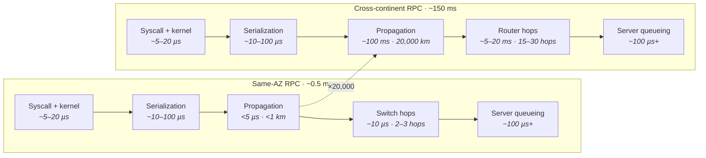
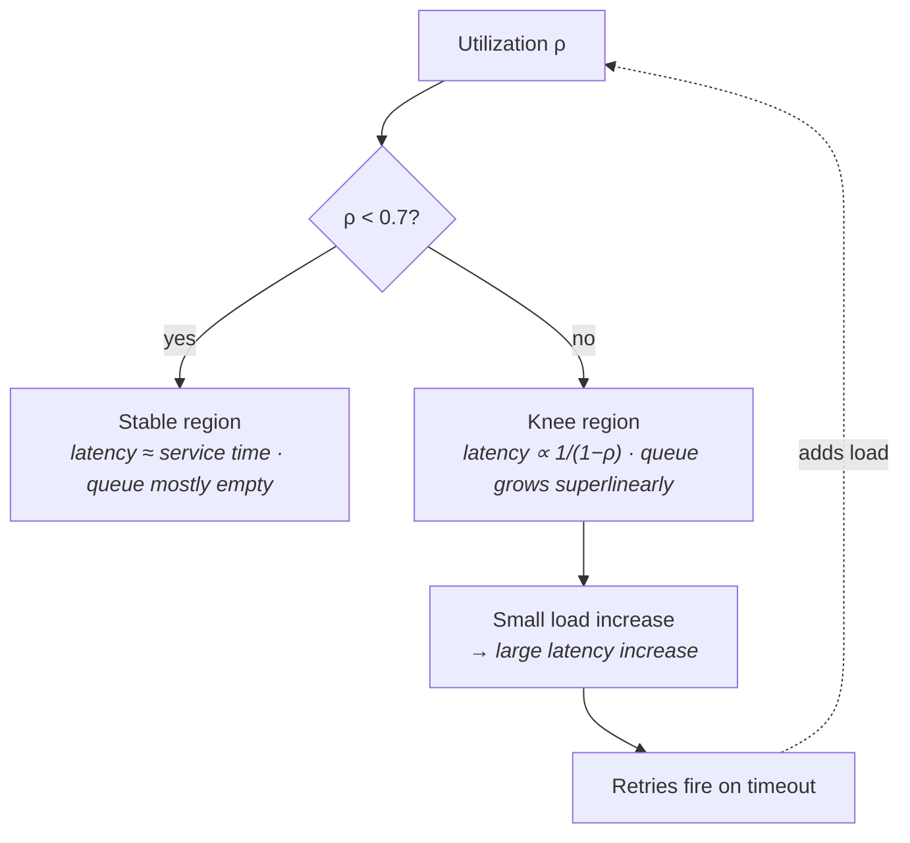
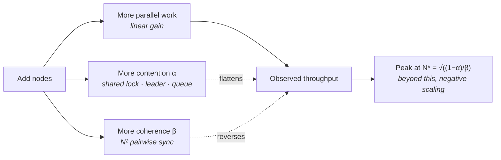
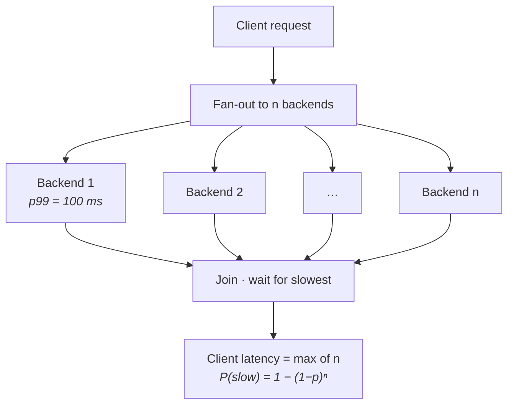
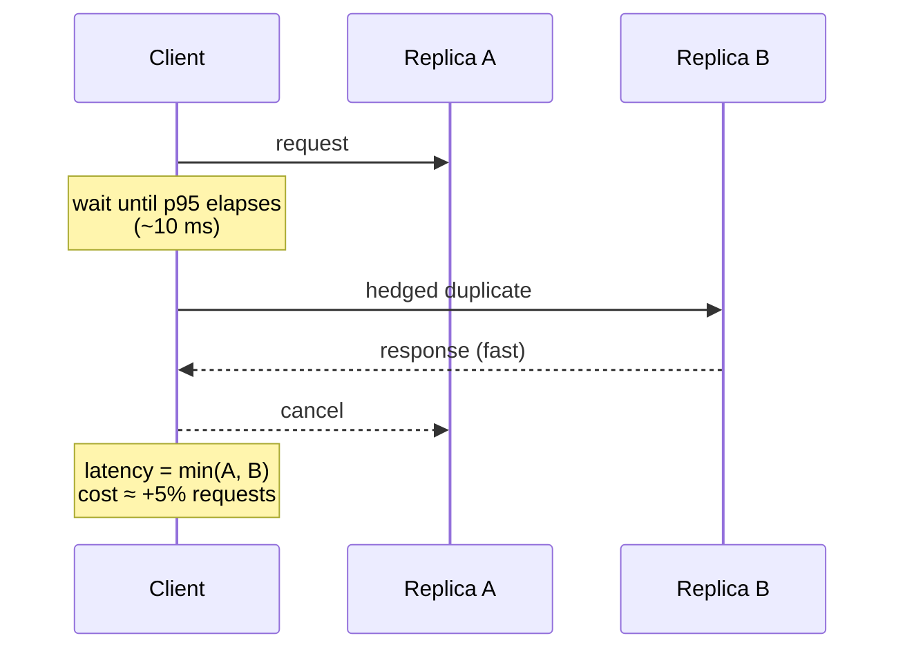
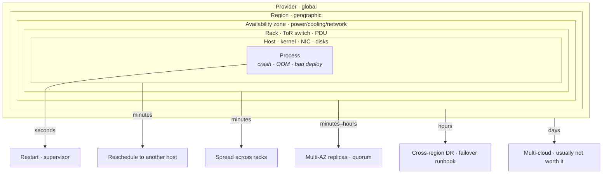
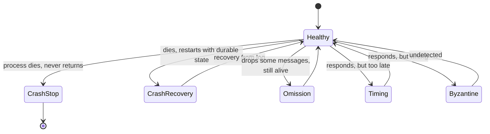
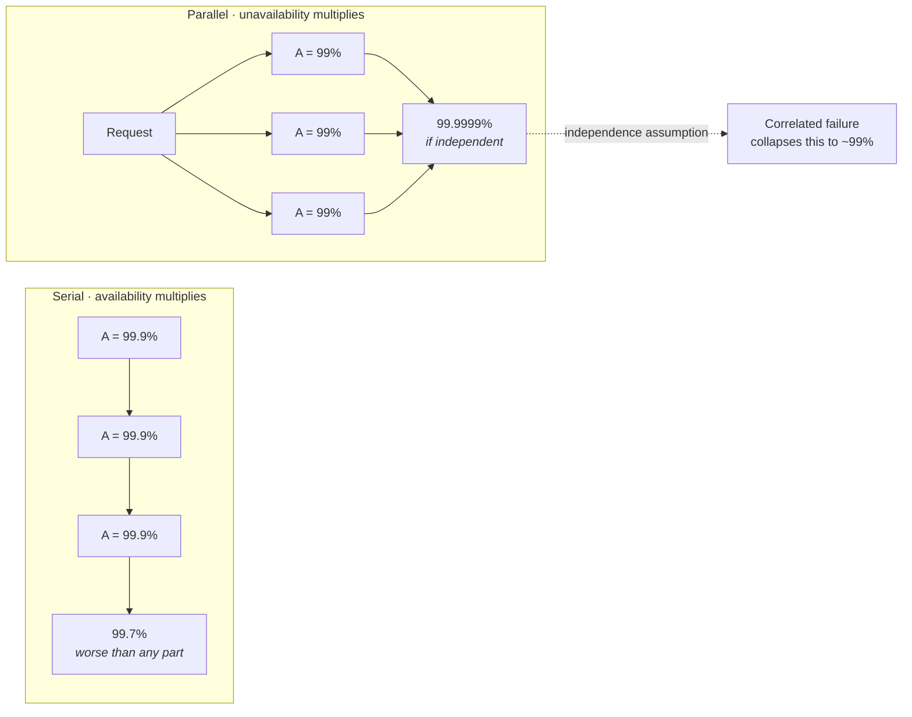

# Physical and Statistical Foundations

This series is about the substrate a staff-level engineer reasons *from*, and this lecture is the bottom of it. Everything later — replication protocols, cache hierarchies, sharding schemes, stream processors — is an application of three things established here: the physics of moving a bit from A to B, the queueing mathematics of what happens when work arrives faster than it is served, and the arithmetic of failure in systems built from parts that fail independently, until they don't.

Learn the numbers in this lecture cold. A design conversation is won or lost on whether you can say "that's a 150 ms round trip, so a synchronous cross-region write costs you two of them per user action" without reaching for a calculator. The rest of the series assumes you can.

## The latency hierarchy

Every performance argument reduces to *how far did the data have to travel, and how many times*. The distances span eleven orders of magnitude, and the boundaries between tiers are where architectures live or die.

### The table you memorize

| Operation | Latency | Relative to L1 |
|---|---|---|
| L1 cache reference | ~1 ns | 1× |
| Branch mispredict | ~3 ns | 3× |
| L2 cache reference | ~4 ns | 4× |
| L3 cache reference | ~20 ns | 20× |
| Uncontended mutex lock/unlock | ~20 ns | 20× |
| **Main memory (DRAM) reference** | **~80–100 ns** | **~100×** |
| Thread context switch | ~1–3 µs | ~2,000× |
| Read 1 MB sequentially from DRAM | ~50 µs | 50,000× |
| **NVMe SSD random read (4 KB)** | **~20–100 µs** | **~50,000×** |
| Read 1 MB from NVMe | ~200–300 µs | ~250,000× |
| **Same-AZ network round trip** | **~0.25–0.5 ms** | **~400,000×** |
| Cross-AZ round trip (same region) | ~0.5–2 ms | ~1,000,000× |
| Rotational disk seek | ~5–10 ms | ~7,000,000× |
| Cross-region RTT, US east↔west | ~60–70 ms | ~65,000,000× |
| Transatlantic RTT (NYC↔London) | ~70–80 ms | ~75,000,000× |
| **Cross-continent RTT (US↔Sydney/Singapore)** | **~150–200 ms** | **~150,000,000×** |

**How to actually use this:**

- **The four tiers that matter** — nanoseconds (cache/DRAM), microseconds (local flash), sub-milliseconds to milliseconds (local network), tens-to-hundreds of milliseconds (geography). Crossing a tier boundary is a 100–1000× cost step. Nothing you do inside a tier compensates for an unnecessary crossing.
- **Random versus sequential is a different axis than fast versus slow.** DRAM sequential bandwidth is ~10–20 GB/s per socket; NVMe Gen4 sequential is ~7 GB/s but random 4 KB is ~100 µs at queue depth 1. The gap between random and sequential narrowed enormously with flash — a rotational disk was ~100× worse at random, NVMe is ~3–10× — and that single change is why LSM trees and log-structured designs stopped being obviously correct.
- **Counting round trips beats micro-optimizing any one of them.** A protocol that takes 4 round trips cross-region costs 600 ms no matter how fast your code is. This is why protocol *chattiness* is a first-order design property.

### Speed of light is the floor

- **The constant** — light in vacuum is 300,000 km/s. In fiber, the refractive index of glass is ~1.5, so signals propagate at ~200,000 km/s, which is **5 µs per kilometer**, one way.
- **Fiber does not go in straight lines.** Cables follow coastlines, rights-of-way, and existing conduit. Assume the fiber path is **1.2–1.5× the great-circle distance**.
- **Worked floor: New York to London.** Great circle ~5,585 km; fiber path ~6,600 km; one way 33 ms; round trip **~66 ms**. Observed production RTT is ~70–80 ms — meaning routers, switches, and serialization add only a few milliseconds. *The physics is nearly the whole cost.*
- **Worked floor: New York to Sydney.** ~16,000 km great circle, ~20,000 km of fiber, ~100 ms one way, **~200 ms RTT**. No amount of engineering will make this 50 ms.
- **The consequence for design** — you cannot have synchronous cross-region strong consistency *and* low write latency. This is not a CAP-theorem subtlety; it is arithmetic. A quorum write across three continents costs at least one inter-continental RTT, so it costs at least 150 ms, so your user-facing write API cannot promise 50 ms.
- **What to do instead:** move the *decision* to the user, not the user's request to the decision. Regional leadership with asynchronous cross-region replication, CRDTs where the merge is commutative, or read-local/write-home partitioning by user home region.

### Why a same-AZ RPC is 0.5 ms and a cross-continent one is 150 ms

The 300× gap decomposes cleanly, and being able to decompose it is the whole point.

- **The fixed software cost is identical** — syscalls, serialization, and server-side work are the same in both. Roughly 100–300 µs of it.
- **Same-AZ is dominated by software and queueing.** Propagation is negligible under a kilometer. If your same-AZ RPC is 5 ms, you have a *software* problem — GC pause, lock contention, a synchronous log flush — not a network problem.
- **Cross-continent is dominated by propagation**, ~100 ms of the 150 ms. Optimizing your serializer buys you 0.05% of the call. The only lever is *not making the call*, or making fewer of them.
- **Key distinction:** latency you can engineer away versus latency you cannot. Software latency is compressible. Distance is not. Categorize every millisecond in your budget into one of these two buckets before proposing an optimization.

## Throughput, concurrency, and Little's Law

Latency and throughput are not the same quantity and are not simply related. The bridge between them is concurrency, and the bridge has one equation.

### Little's Law and its three uses

**`L = λW`** — the average number of items in a stable system (`L`) equals the average arrival rate (`λ`) times the average time each item spends in the system (`W`).

- **It is almost assumption-free.** It requires only that the system be stable — arrivals equal departures over the long run. No distributional assumptions, no independence, no Poisson arrivals. This is why it is the one queueing result you can apply without qualification.

**Use one — derive concurrency from throughput and latency.** A service handling 10,000 QPS with 20 ms mean latency has `L = 10,000 × 0.020 = 200` requests in flight at any instant. That number determines everything downstream: thread count, connection pool size, memory for in-flight buffers.

**Use two — size a thread or connection pool.** Invert it. If each request holds a database connection for 5 ms and you need 4,000 QPS, you need `4,000 × 0.005 = 20` connections. Not 200. Pool sizing is arithmetic, not guesswork, and oversized pools are actively harmful ([§ Universal Scalability Law — the coherence penalty](#universal-scalability-law--the-coherence-penalty)).

**Use three — infer the invisible.** If you measure throughput and concurrency, you get latency for free: `W = L / λ`. A queue you can see the depth of tells you its own wait time. A 5,000-item queue draining at 1,000 items/s imposes **5 seconds** of latency on everything entering it, regardless of how fast the consumer is.

- **The trap:** applying Little's Law to an *unstable* system. If `λ` exceeds service capacity, `L` grows without bound and the law tells you nothing except that you are in trouble. Check stability first.

### Utilization versus latency — the M/M/1 knee

Utilization `ρ` is the fraction of capacity in use. For an M/M/1 queue (Poisson arrivals, exponential service, one server), the mean *response* time is:

`W = S / (1 − ρ)` — where `S` is mean service time.

| Utilization ρ | Latency multiplier `1/(1−ρ)` | 10 ms service time becomes |
|---|---|---|
| 50% | 2× | 20 ms |
| 70% | 3.3× | 33 ms |
| **80%** | **5×** | **50 ms** |
| 90% | 10× | 100 ms |
| 95% | 20× | 200 ms |
| 99% | 100× | 1,000 ms |

- **The curve is a hyperbola, not a line.** Going from 50% to 60% utilization costs you 25% more latency. Going from 90% to 95% costs you 100% more. The pain is entirely at the right edge.
- **Why "the servers are only 40% utilized, we're wasting money" is usually wrong.** Headroom is not waste; it is the latency budget. A system run at 40% has a 1.7× multiplier and absorbs a 2× traffic spike without visible degradation. A system run at 90% has a 10× multiplier and turns a 10% spike into an outage.
- **Rule of thumb:** target **60–70% steady-state utilization** for latency-sensitive services. Batch and analytical systems, which care about throughput and not tail latency, can and should run at 90%+.
- **The failure mode:** the feedback loop in the diagram. Latency crosses the client timeout, clients retry, retries add load, utilization rises, latency rises further. This is the mechanism behind most "the site fell over and stayed over" incidents ([§ MTBF, MTTR, and why MTTR dominates](#mtbf-mttr-and-why-mttr-dominates)).
- **Multiple servers help, but change the shape.** An M/M/c queue with `c` servers tolerates higher utilization at the same latency penalty, because a free server is more likely to exist. This is the queueing argument for a shared queue in front of many workers rather than per-worker queues — one shared queue of 10 workers beats 10 queues of 1 worker at identical total capacity.

### Bandwidth-delay product

- **The definition** — `BDP = bandwidth × RTT`. It is the amount of data that must be *in flight* to keep a link saturated, because you cannot get an acknowledgement back faster than one RTT.
- **Same-datacenter:** 10 Gbps × 0.5 ms = **625 KB**.
- **Cross-country:** 10 Gbps × 70 ms = **87.5 MB** in flight to fill the pipe.
- **The consequence:** a single TCP connection with a 64 KB window on a 70 ms path achieves at most `65,536 / 0.070 ≈ 936 KB/s` — **7.5 Mbps**, on a 10 Gbps link. Bandwidth was never the constraint; the window was.
- **What to do about it** — TCP window scaling (`net.ipv4.tcp_window_scaling`, on by default on any modern kernel), larger socket buffers (`net.core.rmem_max`, `wmem_max`), parallel connections, or BBR-style congestion control that estimates bandwidth and RTT rather than treating loss as the only signal.
- **Why this matters beyond TCP** — the same arithmetic governs *any* request/response protocol over distance. A replication stream, a cross-region backfill, or a chatty ORM all have an in-flight requirement. If your protocol allows only one outstanding request, your throughput is capped at `1 / RTT` operations per second — **6.7 ops/s** on a 150 ms path — no matter how much bandwidth you bought.
- **Long-fat-network intuition:** on high-BDP paths, throughput is a *pipelining* problem, not a bandwidth problem.

## Scalability laws — why more machines stop helping

Two laws bound what parallelism can buy. Amdahl's gives the ceiling; the Universal Scalability Law explains why real systems don't just plateau, they *decline*.

### Amdahl's Law — the serial fraction is the ceiling

- **The formula** — with serial fraction `s`, speedup on `N` processors is `S(N) = 1 / (s + (1−s)/N)`.
- **The limit** — as `N → ∞`, `S → 1/s`. A workload that is 5% serial can never exceed **20×** speedup, on any number of machines, ever.
- **Concrete:** `s = 0.05`, `N = 10` gives 6.9×. `N = 100` gives 16.8×. `N = 1000` gives 19.6×. You spent 10× the machines going from 100 to 1000 and gained 17%.
- **Where the serial fraction hides in real systems** — a single leader that orders writes, a global sequence generator, a shared lock, a coordinator in a commit protocol, a single-writer metadata store, a fan-in aggregation step.
- **The design implication:** finding and eliminating the serial fraction beats adding capacity. Sharding the sequence generator, partitioning the lock, or making the coordinator per-partition changes `s`, and only changing `s` changes the ceiling.

### Universal Scalability Law — the coherence penalty

Amdahl says you plateau. Reality says you peak and then get *worse*. Gunther's USL adds the missing term:

`C(N) = N / (1 + α(N−1) + βN(N−1))`

- **`α` — contention.** Serialization on shared resources: locks, the leader, the single queue. This is Amdahl's term, and it produces a plateau.
- **`β` — coherence.** The cost of keeping `N` participants *consistent with each other*. Cache-line invalidation traffic, gossip, heartbeats, cluster membership, distributed lock coordination. It scales as `N²` because it is pairwise.
- **The peak** — throughput maximizes at `N* = sqrt((1 − α) / β)` and *declines* beyond it.
- **Concrete:** `α = 0.05`, `β = 0.001` gives `N* ≈ 31`. At 31 nodes you get ~13× throughput. At 100 nodes you get ~9×. **You added 69 machines and lost a third of your throughput.**

- **The three regimes, and you should be able to name which one you're in:** linear (α and β both negligible), sublinear/plateau (α dominates), retrograde (β dominates).
- **Where β comes from concretely** — a database connection pool sized at 500 against a server with 32 cores: every connection adds context-switch, lock-manager, and cache-coherence traffic while the actual parallelism ceiling is 32. Shrinking the pool to 50 routinely *increases* throughput. Same for thread pools, same for Kafka partitions per consumer group, same for a Raft group with 9 members instead of 5.
- **Why adding nodes can slow a system down — the three mechanisms:**
  - **Coordination grows superlinearly.** Consensus with `n` members needs `O(n)` messages per decision and a quorum of `⌈(n+1)/2⌉` — more members means a *slower* quorum, because you wait for a larger set drawn from the same latency distribution.
  - **Tail latency compounds.** More participants per operation means a higher chance one of them is slow ([§ Tail amplification through fan-out](#tail-amplification-through-fan-out)).
  - **Shared bottlenecks saturate.** New nodes add load to a metadata service, a service-discovery system, or a shared storage layer that did not grow.
- **In an interview:** when someone says "we'll just add more nodes," the staff-level answer names `α` and `β` for that specific system and asks what happens to them.

## Tail latency

The average is a summary statistic of a distribution that is not remotely normal. At scale, the tail *is* the user experience.

### Percentiles and why averages mislead

- **The vocabulary** — p50 (median), p90, p99, p99.9, p99.99. "p99 = 200 ms" means 1% of requests take longer than 200 ms.
- **Why the mean lies** — latency distributions are heavily right-skewed and often multimodal. A service with p50 = 10 ms and p99 = 800 ms has a mean around 20 ms. The mean describes *nobody*: it is well above the typical request and enormously below the bad one.
- **Who experiences the tail** — your highest-value users. The account with the most data, the most followers, the largest cart triggers the slowest paths. Tail latency is correlated with customer value, which is why "only 1% of requests" is never a defence.
- **Sources of the tail, and they are all real:** garbage collection pauses (10–500 ms), background compaction in an LSM store, log rotation and checkpointing, CPU scheduling and noisy neighbours, cache misses on cold entries, lock convoys, TCP retransmit timeouts (a minimum RTO of ~200 ms produces a sharp spike at exactly 200 ms), queueing behind a large request, and page faults.
- **Rule of thumb:** report p50 *and* p99 *and* p99.9, always, and set SLOs on p99. A single-number latency SLO is a p50 SLO in disguise, and p50 is the number nobody complains about.
- **Percentiles do not average and do not add.** You cannot average the p99s of ten shards to get the fleet p99, and you cannot sum the p99 of two sequential calls to get the p99 of the pair. Aggregate from histograms (HDR histograms, `t-digest`, Prometheus native histograms), never from pre-computed percentiles.

### Tail amplification through fan-out

If one request fans out to `n` backends and must wait for all of them, the probability that *at least one* lands in the slow tail is:

**`1 − (1 − p)ⁿ`**

- **The numbers, with `p` = 1% (each backend's p99):**
  - `n = 1` → 1% of requests slow.
  - `n = 10` → **9.6%**.
  - `n = 100` → **63.4%**.
  - `n = 500` → 99.3%.
- **Read that again.** With 100 backends, *the majority* of your user-facing requests hit at least one backend's p99. Your service's p50 is now your backends' p99.
- **The inversion that follows:** to hold a 1% user-facing slow rate at `n = 100`, each backend needs `p ≈ 0.01%` — a **p99.99** target. Fan-out width converts a per-node p99 requirement into a per-node p99.99 requirement, and p99.99 is roughly an order of magnitude harder and more expensive than p99.
- **This is the single strongest argument against unnecessary fan-out.** Every backend you add to a scatter-gather is a multiplicative tax on the tail. Narrower fan-out with more per-node work is often faster end to end despite doing less parallel work.
- **The same math governs sequential dependency chains.** A request touching 20 services in sequence, each with 0.5% slow probability, is slow `1 − 0.995²⁰ = 9.5%` of the time. Microservice depth costs tail latency exactly like fan-out width.

### Coordinated omission

**The most common way load-test numbers are silently wrong.**

- **The mechanism** — a closed-loop load generator sends a request, waits for the response, then sends the next. When the server stalls for 1 second, the generator *stops sending*. It records one 1-second sample instead of the ~1,000 requests that a real open-loop client population would have issued during the stall, each of which would have observed a progressively worse wait.
- **The result** — the worst latencies are omitted from the sample in a way *coordinated with* the very event you are trying to measure. Reported p99s can be off by one to two orders of magnitude. A stall that should show as a p99.9 of 1,000 ms reports as 40 ms.
- **The fix — measure against intended send time.** Record the timestamp at which a request *should* have been issued under the target rate, not when it actually was, and report `now − intended_start`. Tools that do this correctly: `wrk2`, Gatling, JMeter with throughput shaping, YCSB with the intended-rate correction.
- **The structural fix** — use an **open-loop** generator that issues at a fixed rate regardless of responses, and let outstanding requests accumulate. If the system can't keep up, the load generator should show a growing backlog, not silently reduce its load.
- **The trap:** this bug also lives in production instrumentation. If your metric only records requests that *completed*, you are omitting the ones that timed out or were shed — precisely the worst ones. Count and bucket timeouts explicitly as `+∞`.

### Tail-tolerant techniques

You cannot eliminate the tail. You route around it. These come from Dean and Barroso's *The Tail at Scale*, and the numbers below are theirs.

- **Hedged requests** — send to one replica; if no answer by the p95 deadline, send a duplicate to another and take the first response. Because you only hedge the slowest 5%, the extra load is ~5%. On a BigTable benchmark, hedging after 10 ms across 10 servers cut the 99.9th percentile from **1,800 ms to 74 ms for 2% extra requests**. This is the best latency-per-unit-cost trade in the whole toolkit.
- **Tied requests** — enqueue the request on *two* replicas immediately, each carrying the identity of the other. Whichever *starts executing* first sends a cancellation to its twin. Removes the p95 wait entirely at the cost of a small window where both may run. Reduces median and tail simultaneously.
- **Micro-partitioning** — create far more partitions than machines (say 20–100 tablets per node, not 1). Three payoffs: load can be rebalanced at fine granularity by moving individual partitions; recovery of a failed node parallelizes across *all* surviving nodes rather than one standby; and hot partitions can be split without resharding the world. BigTable, Kafka (partitions ≫ brokers), and Elasticsearch shard counts all encode this.
- **Selective replication / hot-spot mitigation** — detect hot partitions and add replicas for those alone rather than uniformly.
- **Latency-induced probation** — take a persistently slow replica out of rotation without declaring it dead, then health-check it back in. The slow node is the dangerous node ([§ Gray failure and partial degradation](#gray-failure-and-partial-degradation)), and this is the cheap defence.
- **Good-enough responses** — return partial results when a fan-out leg misses the deadline, and mark the response as degraded. Search results from 95 of 100 shards are usually better than a timeout.
- **The cost, stated honestly:** every one of these trades extra work, extra capacity, or correctness-of-completeness for tail latency. Hedging duplicates work; tied requests risk double execution and therefore demand idempotency; micro-partitioning costs metadata and per-partition overhead. Say the cost out loud when you propose one.

## Queueing intuition

Queues are where latency is created. Most latency problems are queueing problems wearing a different hat.

### Arrival variance and burstiness

- **Traffic is not smooth.** Poisson arrivals are the mathematically convenient assumption and almost never the reality — real traffic is bursty, correlated, and self-similar (bursty at every timescale you zoom to).
- **Sources of burstiness** — cron jobs on the hour, cache expiry aligned to a TTL boundary, mobile clients waking on a push notification, retry storms, a deploy restarting a fleet, and *your own batching*.
- **Variance costs latency independent of mean load.** The Pollaczek-Khinchine formula for M/G/1 makes the wait proportional to `(1 + C²ᵥ)` where `Cᵥ` is the coefficient of variation of service time. **Doubling service-time variability roughly doubles queueing delay at the same utilization.** Consistency of service time is worth as much as speed.
- **Peak-to-average ratio is the number you must estimate.** Consumer apps typically run **2–5×**; a system with a scheduled trigger (market open, a game launch, a TV-advertised moment) can be 10–100×. Provision for peak, not average, or shed load at peak ([§ Bounded queues, load shedding, and why unbounded queues are a bug](#bounded-queues-load-shedding-and-why-unbounded-queues-are-a-bug)).
- **What to do:** jitter everything. Randomize cron start times, add jitter to cache TTLs, add jitter to retry backoff. Synchronization is the enemy; the fix is always a random offset.

### Queue depth is latency in disguise

- **Little's Law, applied to a buffer** — a queue holding `L` items draining at `λ` imposes `W = L/λ` of latency on every arrival. A 10,000-message backlog with a 2,000/s consumer means **5 seconds** of latency, and no amount of consumer speed-up fixes it while the backlog persists.
- **A queue does not add throughput.** It only smooths bursts. If the consumer is slower than the producer on average, the queue is not buffering; it is *accumulating*, and its only output is latency followed by memory exhaustion.
- **Bufferbloat** — the canonical case. Network equipment vendors added large packet buffers assuming "dropping packets is bad." But TCP's congestion signal *is* packet loss. Large buffers hide congestion, so senders keep increasing their rate, so buffers fill, so every packet sits in a full buffer. Result: hundreds of milliseconds to seconds of added RTT on a link that is not even at capacity in a useful sense. A saturated home uplink with a bloated buffer can show 1–2 s of ping latency.
- **The fix, and it generalizes** — **CoDel** (Controlled Delay) and **FQ-CoDel** drop packets based on how long they have been *queued*, not how full the queue is. The insight transfers directly: manage queues by **time-in-queue**, not depth. A request that has already waited past its client's timeout should be dropped, not served — serving it costs capacity and delivers nothing.
- **Apply it in your own services** — record enqueue time on every item; at dequeue, if `now − enqueued > deadline`, discard immediately. This single pattern converts a death-spiral into graceful degradation.

### Bounded queues, load shedding, and why unbounded queues are a bug

- **The claim, stated flatly:** an unbounded queue is a bug. It does not prevent overload; it converts a fast, visible failure into a slow, invisible one that ends in memory exhaustion and an OOM kill — after every queued item has already exceeded its deadline.
- **Where they hide** — `Executors.newFixedThreadPool()` in Java uses an *unbounded* `LinkedBlockingQueue`. Go channels created without a size are unbuffered (fine) but a large buffer is the same trap. Any in-memory list used as a work buffer. `asyncio.Queue()` with no `maxsize`.
- **A bounded queue converts overload into a decision.** When the bound is hit you must choose, explicitly: block the producer (backpressure), drop the newest, drop the oldest, or reject with an error.
- **The four responses to a full queue, and when each is right:**
  - **Backpressure** — block or slow the producer. Correct when the producer is a controllable internal component and the work must not be lost. Propagates upstream, which is the point.
  - **Drop newest (reject)** — return `429`/`503` immediately. Correct at a service edge, where fast rejection lets the client retry elsewhere or degrade.
  - **Drop oldest** — correct for time-series and telemetry, where the newest sample is the valuable one.
  - **Drop by priority** — shed low-value traffic (batch, prefetch, analytics) to preserve high-value traffic (user-facing writes). This requires request classification, and classifying requests by criticality is a design decision worth making early.
- **Load shedding is not failure; it is the correct behaviour at overload.** A system that serves 70% of traffic at 50 ms and rejects 30% is strictly better than one that serves 100% of traffic at 30 s — the latter serves nobody, because every client has already timed out.
- **Admission control beats queueing.** Rejecting at the door costs microseconds; rejecting after 30 seconds of queueing costs 30 seconds of capacity you spent on a doomed request.
- **The failure mode:** partial shedding without deadline propagation. If the edge sheds but internal hops keep working on requests whose clients have gone, you burn capacity producing responses nobody will read. Propagate deadlines (gRPC deadlines, `context.Context`) end to end and cancel eagerly.

## Capacity estimation

The point of a capacity estimate is not precision. It is **choosing the right order of magnitude**, because 1,000 QPS and 1,000,000 QPS are qualitatively different systems.

### QPS from users

- **The base formula** — `QPS_avg = DAU × actions_per_user_per_day / 86,400`.
- **Memorize `86,400`** — seconds in a day. Also useful: 100,000 s ≈ 1 day (within 16%), 2.5 M s ≈ 1 month, 31.5 M s ≈ 1 year (`π × 10⁷` is a good mnemonic).
- **Worked:** 100 M DAU × 10 actions/day = 1 B actions/day ÷ 86,400 ≈ **11,600 QPS average**.
- **Peak-to-average ratio** — multiply. Typical consumer diurnal pattern gives **2–3×**; a global product with time-zone spread flattens toward 1.5–2×; a single-timezone product or an event-driven one is 5–10×+. Take 3× here: **~35,000 QPS peak**.
- **Then split by operation type.** Reads and writes have wildly different costs. A read:write ratio of 100:1 is typical for social feeds, ~10:1 for e-commerce, ~1:1 for messaging, and *inverted* for telemetry ingestion. Our 35,000 peak QPS at 100:1 is ~34,650 reads/s and ~350 writes/s — and the 350 writes/s is what sizes the primary database while the 34,650 reads/s sizes the cache tier.
- **The trap:** averaging away the peak, then averaging away the hot key. Aggregate QPS is not per-shard QPS. A uniform hash gives `QPS/shards`; a Zipfian access distribution (which is what real popularity looks like) puts a wildly disproportionate share on shard zero. Always ask what the *hottest* shard sees.

### Storage

- **The formula** — `bytes = row_width × rows × replication_factor × retention × overhead`.
- **Row width, honestly estimated:** fixed-width columns are easy (`int8` = 8 B, `uuid` = 16 B, `timestamp` = 8 B); text is the variable that ruins estimates. Add per-row storage overhead: PostgreSQL's heap tuple header alone is 23 bytes plus alignment padding.
- **Overhead multiplier — use 1.3–2×**, covering secondary indexes (often larger than the table), write-ahead logs, free-space fragmentation, and MVCC bloat. For an LSM store, add space amplification of ~1.1× (leveled) to ~2× (tiered).
- **Worked:** 1 B rows/day × 200 B = 200 GB/day raw → ×3 replicas = 600 GB/day → ×90 days retention = 54 TB → ×1.3 overhead ≈ **70 TB**.
- **The follow-through that separates a good estimate from a number:** 70 TB does not fit on one node comfortably, so this is a sharded or tiered system, so now you need a partition key, so now you need to know the access pattern. **The capacity estimate's job is to force the next architectural question.**
- **Retention is the cheapest lever you have.** Cutting retention from 90 to 30 days cuts storage by 3× and costs nothing but a policy decision. Tiering old data to object storage cuts cost per GB by ~5–10× versus block storage. Ask about retention before you ask about compression.

### Bandwidth

- **The formula** — `bytes/s = payload_size × QPS`, computed separately for request and response.
- **Worked:** 35,000 QPS × 2 KB response = 70 MB/s = **560 Mbps**, comfortable on a 10 Gbps NIC. At 200 KB responses (images), it's 7 GB/s = 56 Gbps, which needs a CDN, not a bigger NIC.
- **Ingress versus egress asymmetry — two distinct asymmetries, don't conflate them:**
  - **Volume asymmetry.** Most services receive small requests and return large responses. A 500 B request and a 50 KB response is a 100:1 ratio. Your egress capacity, not ingress, is the constraint.
  - **Price asymmetry.** Cloud providers charge **nothing for ingress** and $0.05–0.09/GB for egress to the internet. This is not a technical fact; it is a commercial one, and it is deliberate — it makes data easy to move in and expensive to move out. It also means the same byte count costs zero or a fortune depending on direction, so bandwidth estimation *is* cost estimation ([§ Cost modeling](#cost-modeling)).
- **The number to keep:** 1 Gbps sustained = 10.8 TB/day ≈ 324 TB/month. At $0.08/GB egress, 324 TB is **~$26,000/month** for one saturated gigabit. That one calculation justifies most CDN deployments on its own.

## Resource envelopes of a commodity node

Knowing what one machine does is what keeps you from proposing a 50-node cluster for a workload that fits on a laptop.

### The hardware

- **CPU** — a modern commodity server or large cloud instance: **32–128 vCPUs**, 2.5–3.5 GHz, AVX-512 vector units. Per-core throughput for typical service code: roughly 10,000–100,000 simple operations/s, dropping to hundreds/s for anything doing real work per request.
- **Memory** — **128 GB–1 TB** is unremarkable; 2–24 TB exists. Bandwidth ~100–400 GB/s aggregate across channels. **A working set that fits in RAM changes the architecture**, so knowing that 1 TB is buyable matters.
- **NVMe** — a single Gen4 drive: **~1 M random read IOPS** (4 KB), ~200–500 K write IOPS, **~7 GB/s sequential read**, ~4 GB/s sequential write, ~80 µs read latency. A node with 4–8 drives has multi-million IOPS and tens of GB/s.
- **Network** — **10, 25, 50, or 100 Gbps** NICs are standard. 25 Gbps = 3.1 GB/s, which is roughly one NVMe drive's sequential bandwidth. **Note the implication:** network and local disk are now the same order of magnitude, which is why disaggregated storage (EBS, S3-backed engines) became viable.
- **Cloud caveat:** attached network storage is *not* local NVMe. EBS gp3 caps at 16,000 IOPS and 1,000 MB/s by default (io2 Block Express reaches 256,000 IOPS). A benchmark run on instance-local NVMe does not predict production on EBS, and this mistake is made constantly.

### What one node of real software sustains

These are honest, load-dependent ballparks. Quote them as ranges and say what changes them.

- **PostgreSQL** — **5,000–50,000 simple TPS** on good hardware, where the range is set by whether writes fsync per commit or group-commit, and whether the working set is cached. Point lookups on a cached B-tree: 50,000–200,000/s. Practical connection ceiling of a few hundred *because of [§ Universal Scalability Law — the coherence penalty](#universal-scalability-law--the-coherence-penalty)* — pool them. A single instance comfortably manages **1–10 TB**; beyond that, vacuum, backup, and restore times become the operational constraint, not query performance.
- **Redis** — single-threaded core, **~100,000 ops/s** on plain `GET`/`SET`, **500,000–1,000,000/s with pipelining**, sub-millisecond p99. Memory-bound: your dataset must fit in RAM plus fork headroom for `BGSAVE`. Redis 7+ offloads I/O to threads, raising the ceiling, but command execution remains serial — which is exactly Amdahl's `s` ([§ Amdahl's Law — the serial fraction is the ceiling](#amdahls-law--the-serial-fraction-is-the-ceiling)) and why one hot key cannot be scaled by adding replicas *for writes*.
- **Kafka** — a single broker sustains **several hundred MB/s to ~1 GB/s** write throughput and **millions of small messages/s** with batching, because it is sequential-append and uses `sendfile` zero-copy for consumers. The limiting resources are page cache size and disk sequential bandwidth, not CPU. Per-partition throughput is where the real limit lives; partition count is the parallelism knob.
- **Nginx / Envoy as a reverse proxy** — **50,000–200,000 requests/s** per node for simple proxying; TLS termination cuts this substantially (a full handshake is ~1–3 ms of CPU; session resumption makes it far cheaper).
- **The reason to know these:** they let you say "that's 4,000 writes/s, which is one Postgres node with headroom" instead of proposing a distributed system. **Single-node-first is the correct default**, and the numbers above are the evidence for it.

## Cost modeling

Cost is a design constraint with the same standing as latency. A design that meets every SLO at 10× the acceptable cost has failed.

### The three pricing shapes

- **Compute — linear and continuous.** Priced per instance-hour, roughly proportional to vCPU and RAM. Scales down when you turn it off, which makes it the easiest cost to control (autoscaling, spot/preemptible at 60–90% discount, reserved/savings plans at 30–60% discount). *Elastic.*
- **Storage — linear, cheap, and monotonic.** Object storage ~$0.02/GB-month; block storage ~$0.08–0.125/GB-month; provisioned IOPS priced separately. The trap is that storage cost **only ever goes up** unless someone deletes something, and nobody is assigned to delete things. Lifecycle policies to infrequent-access and archive tiers (~$0.004/GB-month) are the standard lever, at the cost of retrieval latency and per-request retrieval fees.
- **Egress — the discontinuous one.** Ingress free; egress to internet **$0.05–0.09/GB** with volume tiers; **cross-AZ $0.01/GB in each direction** (so a round trip between AZs is ~$0.02/GB); **cross-region $0.02/GB**. Egress does not scale down, is not reserved-instance discountable, and is often invisible until the bill arrives.

### Cross-AZ and cross-region transfer as a design constraint

- **The tension is explicit** — multi-AZ deployment is the standard availability answer ([§ The five models, weakest assumption to strongest](#the-five-models-weakest-assumption-to-strongest)), and every cross-AZ byte is billed. Availability and cost pull directly against each other here, and you should say so.
- **Worked:** a service moving 100 MB/s across AZs is 8.6 TB/day = 259 TB/month. At $0.02/GB round trip, that's **~$5,200/month** in transfer alone, likely exceeding the compute cost of the service moving it.
- **Design responses, in order of preference:** AZ-aware routing (prefer a same-AZ replica; only cross AZs on failure), locality-aware placement of chatty component pairs, compression on cross-AZ links (a 5:1 ratio directly divides the bill by 5), and batching to amortize per-message overhead.
- **The trap:** AZ-affinity taken to its conclusion is a *shared-fate* deployment ([§ Correlated failure](#correlated-failure)). If every request is served entirely within one AZ, you have three independent stacks, which is good for cost and blast radius — but only if the data layer is also AZ-local, and an AZ-local data layer is not a durable one. Say which property you are buying.
- **Cross-region is worse on both axes** — 2× the transfer price *and* the 60–150 ms latency floor of [§ Speed of light is the floor](#speed-of-light-is-the-floor). Cross-region is for disaster recovery and user proximity, not for routine request paths.

### Cost per request as a first-class metric

- **The metric** — total monthly infrastructure cost ÷ monthly requests, expressed as $ per million requests. Track it as a time series next to latency and error rate.
- **Why it belongs on the dashboard** — it is the only metric that catches efficiency regressions. Absolute cost rising with traffic is expected; cost *per request* rising means something got less efficient, and you find out in week one instead of at the quarterly budget review.
- **Decompose it** — compute per request, storage per request, egress per request, and third-party/API cost per request. The decomposition tells you which lever to pull. If egress dominates, a CDN or compression is the answer; if compute dominates, it's a profiling problem; if storage dominates, it's a retention policy.
- **It converts architecture arguments into arithmetic.** "Should we cache this?" becomes: cache cost per month versus (cache hit rate × backend cost per request × request volume). A cache that costs more than the backend calls it avoids is a pure loss, and this happens more often than you would think for low-hit-rate caches on cheap backends.
- **Anchor numbers worth carrying:** a cached read served from Redis is on the order of $0.01–0.05 per million; a Postgres point query maybe $0.10–0.50 per million; an LLM inference call is 3–5 orders of magnitude more. When one component is 10,000× the cost of the others, the cost model has exactly one term and everything else is noise.

## Failure domains and correlated failure

The core insight of the section: availability math assumes independence, and independence is the thing your infrastructure is quietly destroying.

### The failure-domain hierarchy

- **Process** — crash, OOM kill, deadlock, bad deploy. Frequency: constant. Mitigation: supervisor restart, health checks. Recovery in seconds.
- **Host** — kernel panic, hardware fault, NIC failure, hypervisor issue. Frequency: at 10,000 hosts, several per day. Mitigation: stateless services rescheduled; stateful services need replicas.
- **Rack** — top-of-rack switch failure or PDU failure takes 20–40 hosts at once. This is the smallest domain where the "independent failure" assumption noticeably breaks, and it is why replica placement must be **rack-aware**, not just host-aware.
- **Availability zone** — shared power, cooling, and network within a datacenter or campus. Fails a few times per year across a large provider. AZs within a region are 1–2 ms apart, which is *close enough for synchronous replication* — this is the single most important fact about AZ design.
- **Region** — geographic. Rare (roughly annual for any given large provider). Cross-region is 60–150 ms apart, which is *too far for synchronous replication* on a user-facing path.
- **Provider** — global control-plane failures, billing/account issues, BGP misconfiguration. Rare but real. Multi-cloud is usually the wrong answer: it doubles operational surface, forces you to the lowest common denominator of every managed service, and the correlated-failure risk it removes is smaller than the complexity risk it adds. Have a reason if you propose it.
- **Rule of thumb:** replicate across the *smallest* domain that gives you the independence you need, because larger domains cost latency, transfer fees, and complexity. Multi-AZ is the sweet spot for nearly everything; multi-region is for disaster recovery and user proximity.

### Correlated failure

**Independence is a modeling assumption, and it is usually false.** The availability math in [§ Availability arithmetic](#availability-arithmetic) is only as good as this assumption, so correlations are where real outages come from.

**The mechanisms, each with its concrete form:**

- **Shared physical dependency** — replicas on the same rack, same power feed, same ToR switch, same hypervisor host. Solved by placement constraints (anti-affinity rules, rack awareness in Cassandra/HDFS/Kubernetes topology spread). If you do not *declare* the constraint, the scheduler will happily co-locate all three replicas.
- **Shared logical dependency** — every service depends on the same DNS, the same service discovery, the same auth service, the same secrets store, the same metadata service. Ten independent services with one shared dependency have the *availability of the dependency*, not of themselves. The control plane is the most common single point of failure in a system with no single point of failure.
- **Shared configuration** — the same bad config pushed everywhere is a *global* failure with a *global* rollout speed. Config deploys are the leading cause of correlated outages, and they are typically far less gated than code deploys, which is exactly backwards.
- **Shared code** — a bug in a common library, sidecar, or base image is present in all instances simultaneously. All replicas run the same code, so a deterministic crash bug on a specific input crashes every replica that sees that input, in order, as it retries.
- **Shared load** — replicas serving the same traffic fail *together* under overload, because they share the cause. Redundancy against overload requires excess capacity, not more copies of a saturated service.
- **The correlation cascade** — when one replica fails, its load moves to the survivors, raising *their* utilization and pushing them up the M/M/1 curve ([§ Utilization versus latency — the M/M/1 knee](#utilization-versus-latency--the-mm1-knee)). Failure of one increases the probability of failure of the next. This is the mechanism that turns a single-node failure into a full-cluster outage, and it is why **N+1 capacity planning must assume the survivors can carry the failed node's share** — with `N` nodes at utilization `ρ`, losing one raises the rest to `ρ × N/(N−1)`. At `N = 3` and `ρ = 70%`, one loss takes the others to **105%**. You are down.
- **What to do:** stagger deploys and config rollouts (canary → 1% → 10% → 100%, with bake time), place replicas with explicit anti-affinity, and diversify shared dependencies where the dependency is on the critical path. Then test it — game days and fault injection exist because correlation is invisible in the architecture diagram and obvious in the incident.

## Failure modes taxonomy

A failure model is a *contract* about what kinds of misbehaviour a protocol must tolerate. Choosing a stronger model costs replicas and round trips; choosing a weaker one than reality delivers costs correctness.

### The five models, weakest assumption to strongest

- **Crash-stop (fail-stop)** — a node halts and never returns. The easiest model to reason about, and the assumption most textbook algorithms make. Real systems rarely satisfy it, because nodes come back.
- **Crash-recovery** — a node crashes and later restarts, possibly with durable state intact and volatile state lost. **This is the model real systems must handle.** It is why protocols persist state before acting (Raft persists `currentTerm` and `votedFor` before responding), and why a restarted node must not contradict its pre-crash promises.
- **Omission** — a node stays alive but drops messages: send omission, receive omission, or a network drop. Indistinguishable from crash at the receiver's end, which is why timeouts are the only detector available and why detection is inherently approximate.
- **Timing (performance failure)** — the node responds *correctly but too late*. In an asynchronous model this is not even a failure — there is no deadline to violate. In practice it is the most damaging real-world mode, because a slow node passes health checks, keeps receiving traffic, and drags down every request that touches it ([§ Tail amplification through fan-out](#tail-amplification-through-fan-out)).
- **Byzantine** — arbitrary behaviour: wrong answers, contradictory messages to different peers, active malice. Tolerating `f` Byzantine faults needs `3f + 1` nodes versus `2f + 1` for crash faults, plus cryptographic message authentication. **Assume crash faults inside a trust boundary; assume Byzantine faults across one** (blockchains, multi-party protocols) or where silent data corruption is the concern (which is really why you checksum everything — bit rot is a Byzantine fault from a disk).

### Gray failure and partial degradation

- **The definition** — the system's own health checks say healthy; the users say broken. The observation gap between the internal view and the external view is the defining property.
- **Why it is the worst mode** — automated recovery does not fire, because nothing has *failed*. The node stays in the load balancer, keeps consuming its share of traffic, and every request routed to it is slow or wrong. **A degraded node can be worse than a dead one**, because a dead node is removed from rotation in seconds while a degraded one poisons traffic for hours.
- **Concrete forms** — a NIC with 5% packet loss; a disk with rising latency but no errors; a node with a memory leak approaching but not reaching OOM; a replica silently lagging; a partially-full disk causing writes to fail while reads succeed; one thread pool exhausted while the process answers `/health` from a different pool.
- **The health-check anti-pattern** — a liveness endpoint that returns `200 OK` from a static handler proves only that the HTTP listener is alive. It says nothing about whether the process can reach its database, whether its queues are drained, or whether its dependencies answer.
- **What to do instead:**
  - **Deep health checks** that actually exercise the critical path (a real query, a real dependency call), with the caveat that deep checks propagate failures — a dependency blip can mark your whole fleet unhealthy. Separate **liveness** (should I be restarted?) from **readiness** (should I get traffic?) and make only readiness deep.
  - **Measure from the client's perspective.** Client-side success rate and latency per-backend is the only signal that sees gray failure. Server-side metrics are computed by the thing that is broken.
  - **Latency-based ejection** — outlier detection in Envoy/gRPC removes a backend whose error rate or latency diverges from its peers, without needing to decide it is "down."
  - **Differential observation** — compare a node against its peers rather than against an absolute threshold. Gray failure is easy to spot as an *outlier* and hard to spot as an *absolute*.

### Fail-stop as a design goal

- **The principle** — when you cannot maintain your invariants, **stop loudly** rather than continue in an undefined state. Convert the failure modes you cannot reason about into the one you can.
- **Fail fast** — validate at the boundary and reject immediately. A request that will fail should fail in microseconds at admission, not after 30 seconds of work and three downstream calls.
- **Fail loud** — never swallow an exception, never log-and-continue on an invariant violation, never return a default on an error path where the caller will treat it as data. A silent failure becomes a gray failure, and gray failures cost hours.
- **Crash-only design** — if the only way to stop is to crash, and the only way to start is to recover, then the recovery path is exercised on every single start and is therefore *tested*. Systems with a graceful shutdown path and a separate crash-recovery path have one well-tested path and one that runs only during incidents. Eliminate the graceful path, or at minimum, kill `-9` in normal operations so recovery is routine.
- **Assertions and checksums in production.** Verify invariants where they matter and abort on violation. Checksum every page and every message; corruption detected is a crash, corruption undetected is a Byzantine fault that propagates into replicas and backups.
- **The tension, stated honestly:** fail-stop trades availability for correctness. A node that halts on a checksum mismatch is unavailable. That is the right trade for anything with durable state, and often the wrong trade for a stateless read path where a degraded answer beats no answer. **Decide per component, and write the decision down.**

## Availability arithmetic

Nines are a vocabulary, error budgets are a policy, and the multiplication rule is the thing that surprises people.

### Nines and error budgets

| Availability | Downtime/year | Downtime/month | Downtime/week |
|---|---|---|---|
| 99% ("two nines") | 3.65 days | 7.2 hours | 1.7 hours |
| 99.9% ("three nines") | 8.77 hours | 43.8 min | 10.1 min |
| **99.95%** | **4.38 hours** | **21.9 min** | **5.0 min** |
| 99.99% ("four nines") | 52.6 min | 4.38 min | 1.01 min |
| 99.999% ("five nines") | 5.26 min | 26.3 s | 6.05 s |

- **Read the five-nines row and think about deploys.** 26 seconds per month of budget means you cannot do a rolling restart that drops any traffic, cannot take a maintenance window, and cannot have a single human-in-the-loop recovery step. Five nines is an architecture and an organization, not a target you set.
- **Error budget** — `1 − SLO`, treated as a spendable resource. At 99.9%, you have 43.8 minutes/month of failure to spend. The point is the *policy*: while budget remains, ship features fast; when it is exhausted, freeze feature work and spend on reliability. It converts the availability-versus-velocity argument from an opinion into a number.
- **Measure availability as a request success ratio**, not as uptime. "The service was up" is meaningless if it returned errors. `good_requests / total_requests` over a rolling window is the definition that matches what users experience.
- **The trap:** an SLO higher than your dependencies' composed availability is not a target, it is a fiction. Compute the ceiling before you promise a number ([§ The serial dependency multiplication rule](#the-serial-dependency-multiplication-rule)).

### The serial dependency multiplication rule

**Serial dependencies multiply.** If your request path requires `n` components, each with availability `Aᵢ`, your availability is `∏ Aᵢ`.

- **Five dependencies at 99.9% each** → `0.999⁵ = 99.5%` — that is **3.6 hours/month**, not 43.8 minutes. You inherited an SLO an order of magnitude worse than any of your parts.
- **Twenty dependencies at 99.9%** → `0.999²⁰ = 98.0%`, or 14.6 hours/month.
- **The design lesson:** every synchronous dependency on the critical path is a multiplication. The most effective availability improvement is usually **removing a dependency from the critical path**, not making a dependency more reliable.
- **How to remove it, concretely:**
  - **Make it asynchronous** — write to a durable queue and let the dependency consume. Its downtime becomes latency, not failure.
  - **Cache with a stale-serving fallback** — serve stale on dependency failure. A stale answer is usually better than an error, and `stale-while-revalidate` makes this a first-class pattern.
  - **Make it optional with a degraded default** — recommendations service down? Show the non-personalized list. Feature-flag every non-essential dependency so it can be shed under pressure.
  - **Circuit-break it** — fail fast on a known-bad dependency instead of waiting for the timeout, which prevents its failure from consuming your threads (this is the queueing argument of [§ Bounded queues, load shedding, and why unbounded queues are a bug](#bounded-queues-load-shedding-and-why-unbounded-queues-are-a-bug) applied to dependency failure).
- **Parallel redundancy divides instead.** With `n` *independent* replicas each with unavailability `u = 1 − A`, the unavailability of "all fail" is `uⁿ`, so availability is **`1 − (1 − A)ⁿ`**. Three replicas at 99% each: `1 − 0.01³ = 99.9999%`. That figure is where the naïve model lives, and [§ Redundancy math — independent versus shared-fate](#redundancy-math--independent-versus-shared-fate) is where it dies.

- **The asymmetry is the whole point.** Adding a serial hop always makes you worse; adding a parallel replica makes you better *only to the extent the replicas are independent*.

### MTBF, MTTR, and why MTTR dominates

- **The identity** — `Availability = MTBF / (MTBF + MTTR)`, where MTBF is mean time between failures and MTTR is mean time to recovery.
- **Worked:** MTBF = 30 days, MTTR = 1 hour → `720/721 = 99.86%`. Halve MTTR to 30 minutes → `99.93%`. Double MTBF to 60 days instead → `99.93%`. *Identical gain.*
- **So why does MTTR dominate in practice? Four reasons:**
  - **Reducing MTTR is cheaper.** Automated failover, better runbooks, faster rollback, and better alerting are engineering work you control. Increasing MTBF means eliminating classes of bugs and hardware faults you often cannot.
  - **MTTR improvements apply to failure classes you have not seen yet.** A 2-minute automated rollback shortens *every* future bad-deploy incident, including the ones caused by bugs nobody has written yet. An MTBF fix removes exactly one cause.
  - **MTBF has a hard floor.** Hardware fails, networks partition, and disks wear out at rates you do not control. MTTR has a floor near zero.
  - **MTTR is where the tail is.** A single 12-hour incident dominates a year of availability. Most annual budgets are spent on one or two long incidents, not on many short ones — so the *distribution* of MTTR matters more than its mean, and the fix is capping the worst case (a rollback that always works, a failover that never needs a human).
- **Decompose MTTR — you improve what you measure:** time to detect, time to page, time to diagnose, time to mitigate, time to verify. **Time-to-detect is usually the largest term and the easiest to fix.** An incident found by a customer tweet has an hour of detection time in it before anyone starts working.
- **Mitigate before you diagnose.** Roll back first, understand later. Every minute spent understanding root cause during an incident is a minute of budget spent. The instinct to diagnose first is the single most common MTTR inflator.

### Redundancy math — independent versus shared-fate

- **The naïve model** — `A = 1 − (1 − Aᵢ)ⁿ`. Three replicas at 99% gives six nines.
- **Why you never observe six nines** — the correlated component. Model total unavailability as `u_total = uᵢⁿ + c`, where `c` is the probability of a *common-mode* failure that takes all replicas together: shared power, shared config push, shared code bug, shared dependency, correlated overload ([§ Correlated failure](#correlated-failure)).
- **The consequence:** once `n` is large enough that `uᵢⁿ ≪ c`, **adding replicas does nothing.** With `uᵢ = 1%` and `c = 0.01%`, two replicas give `10⁻⁴ + 10⁻⁴`; three give `10⁻⁶ + 10⁻⁴ ≈ 10⁻⁴`. The third replica improved availability by 1%. The fourth improves nothing at all.
- **This is why the interesting question is never "how many replicas" but "how independent are they."** Moving from 3 same-rack replicas to 3 different-AZ replicas improves availability far more than moving from 3 to 9 same-rack replicas — and costs less.
- **Durability is a separate axis from availability, and the numbers are different.** S3's 99.999999999% (eleven nines) durability comes from erasure coding across independent devices and facilities; its *availability* SLA is 99.9%. A system can be highly durable and frequently unavailable (tape archive) or highly available and non-durable (a cache). Never quote one number for both.
- **Erasure coding versus replication:** `k`-of-`n` erasure coding tolerates `n − k` failures at `n/k` storage overhead — a 6-of-9 scheme survives 3 failures at 1.5× storage, versus 3× for triple replication with the same tolerance. The cost is CPU on write, and **reconstruction reads that touch `k` nodes**, which turns every degraded read into a fan-out with the tail behaviour of [§ Tail amplification through fan-out](#tail-amplification-through-fan-out). Erasure coding for cold and large; replication for hot and small.

## The eight fallacies of distributed computing

Peter Deutsch's list (with the eighth from James Gosling), from Sun in the 1990s. It reads as trivia until you notice each fallacy names a specific class of production incident.

### The network is reliable

- **The assumption** — messages sent are messages delivered.
- **The reality** — packets drop, links flap, switches fail, cables get unplugged, BGP routes get withdrawn. Partial partitions exist, where A can reach B, B can reach C, but A cannot reach C — and these are far nastier than full partitions because every node has a *different, self-consistent* view of who is alive.
- **The incident shape** — **GitHub, October 2018.** A 43-second network partition between the US East Coast facilities caused an automated failover of the MySQL primary to the West Coast. Writes landed in both regions before the topology settled. The 43 seconds of partition produced **24 hours of degraded service**, because reconciling divergent writes required manual work. *Duration of fault ≠ duration of impact.*
- **The design response** — timeouts on everything, retries with exponential backoff *and jitter*, idempotency keys so a retry is safe, and an explicit decision about what happens during a partition (which is the CAP conversation, in Lecture 2).

### Latency is zero

- **The assumption** — a remote call is like a local call.
- **The reality** — [§ The latency hierarchy](#the-latency-hierarchy). It is 10⁵–10⁸× slower. The abstraction that hides this — RPC frameworks that make a network call look like a method call — is precisely what makes the fallacy easy to commit.
- **The incident shape** — the **N+1 query problem** promoted to the network. An ORM or a GraphQL resolver that looks fine at 10 records issues 1,000 sequential round trips at 1,000 records. At 0.5 ms each, that is 500 ms; cross-region, it is 150 seconds. The code did not change; the data did.
- **The design response** — batch and pipeline, make round-trip count an explicit review criterion, and never let a network boundary be invisible in the code.

### Bandwidth is infinite

- **The assumption** — payload size doesn't matter.
- **The reality** — NICs have limits, cross-AZ links are shared and metered, and BDP ([§ Bandwidth-delay product](#bandwidth-delay-product)) caps single-connection throughput regardless of link capacity.
- **The incident shape** — a "small" schema change adds a field, average response grows from 2 KB to 20 KB, and at 35,000 QPS your egress goes from 560 Mbps to 5.6 Gbps overnight. The service is fine; the *network* saturates, and every service sharing that path degrades with it.
- **The design response** — pagination and field selection by default, compression on the wire, response size as a monitored metric with an alert, and payload-size limits enforced at the framework level.

### The network is secure

- **The assumption** — internal traffic is trusted traffic.
- **The reality** — perimeter security fails; once inside, a flat trusted network means one compromised service reaches everything. Unencrypted internal traffic is readable by anything on the path, including a misconfigured mirror port or a compromised sidecar.
- **The incident shape** — the classic breach pattern: initial access through a low-value edge service, then lateral movement across an internal network with no authentication between services because "it's internal."
- **The design response** — zero trust: mTLS between services, per-service identity (SPIFFE/SPIRE), authorization on every call rather than at the perimeter, and encryption in transit everywhere. The cost is real — TLS handshakes, cert rotation, and a service mesh's operational weight — and worth stating.

### Topology doesn't change

- **The assumption** — the set of nodes and their addresses is stable.
- **The reality** — autoscaling, rolling deploys, pod rescheduling, and instance replacement mean topology changes continuously. In Kubernetes, a pod IP has a lifetime measured in hours.
- **The incident shape** — hardcoded IPs in config; DNS results cached forever (the JVM's `networkaddress.cache.ttl` historically defaulted to caching successful lookups *for the life of the process*, so a failed-over database endpoint was never re-resolved); connection pools pinned to instances that no longer exist; a load balancer holding warm connections to terminated backends.
- **The design response** — service discovery as infrastructure, respect DNS TTLs, health-check-driven membership, and connection pools that recycle rather than pin.

### There is one administrator

- **The assumption** — one person or team understands and controls the whole system.
- **The reality** — dozens of teams, hundreds of services, multiple clouds, third-party dependencies with their own change schedules. Nobody has the whole picture, and the system's behaviour is an emergent property of independent change streams.
- **The incident shape** — team A raises a timeout to be more resilient; team B's circuit breaker now trips *later*; retries stack across three layers; a downstream blip becomes a multi-service outage nobody can attribute. Or: two teams deploy compatible-in-isolation changes on the same afternoon.
- **The design response** — explicit contracts and versioned APIs, ownership metadata on every service, dependency graphs that are *generated* rather than drawn, change coordination for shared infrastructure, and — critically — **retry budgets rather than per-layer retry counts**, so retries cannot multiply across layers.

### Transport cost is zero

- **The assumption** — moving data is free.
- **The reality** — two costs. **CPU cost:** serialization, deserialization, compression, TLS, and copying dominate the CPU profile of many services; JSON parsing alone can be 20–50% of CPU in a chatty microservice. **Money cost:** [§ Cost modeling](#cost-modeling)'s egress and cross-AZ pricing.
- **The incident shape** — the cloud bill where data transfer exceeds compute, discovered at quarter end. Or the profiling result where a service spends more CPU marshalling than computing.
- **The design response** — efficient binary encodings (Protobuf, Avro, FlatBuffers) where volume justifies them, zero-copy paths (`sendfile`, `io_uring`), connection reuse, and transfer cost as a line item in design review.

### The network is homogeneous

- **The assumption** — all links, protocols, and endpoints behave alike.
- **The reality** — mobile networks with 100 ms+ RTT and packet loss, corporate proxies that break long-lived connections, MTU differences causing fragmentation or PMTU black holes, IPv4/IPv6 differences, middleboxes that silently drop idle connections after 350 seconds, and protocol version mismatches.
- **The incident shape** — a service works flawlessly in the datacenter, fails for mobile users; long-lived gRPC streams die silently because a NAT device dropped the idle mapping and neither end noticed until a write failed minutes later.
- **The design response** — test on realistic networks (throttled, lossy, high-latency), keepalives tuned below the shortest middlebox idle timeout, explicit MTU handling, and protocol negotiation rather than assumption.

## Grounding — the numbers and incidents worth naming

Everything above becomes credible in an interview when attached to a real system.

### Numbers to have at hand

- **DynamoDB** — single-digit millisecond p50 at any scale; the scale claim rests on partitioning with a hard 3,000 RCU / 1,000 WCU per-partition limit, which is *why* hot partitions are its canonical failure mode. The architecture and the failure mode are the same fact.
- **Spanner** — TrueTime exposes an uncertainty interval `ε`, typically **1–7 ms**, and a read-write transaction waits out `2ε` before committing to guarantee external consistency. Global strong consistency, purchased at a fixed latency tax paid by every write. This is [§ Speed of light is the floor](#speed-of-light-is-the-floor)'s physics made into a product decision.
- **S3** — 11 nines durability, 99.9% availability SLA, first-byte latency ~20–100 ms, and effectively unbounded throughput given enough key prefixes. The durability/availability gap is the point.
- **Kafka** — LinkedIn ran ~7 trillion messages/day across their clusters; individual brokers sustain hundreds of MB/s. Sequential-append plus zero-copy plus page cache is the entire performance story.
- **Google Search** — a query fans out to over 1,000 machines. At that fan-out, [§ Tail amplification through fan-out](#tail-amplification-through-fan-out) says per-leaf p99 is irrelevant; the tail-tolerance techniques of [§ Tail-tolerant techniques](#tail-tolerant-techniques) are not optimizations, they are load-bearing.
- **Facebook memcache** — the published deployment served ~billions of requests/s from thousands of nodes; the paper's most-cited contributions are all about *stampedes*: leases to prevent thundering herds on a miss, and a gutter pool to absorb the load from a failed node rather than letting it hit the database.

### Incidents worth naming

- **AWS S3, February 2017** — an operator running a debugging playbook mistyped a command and removed more capacity than intended, taking down the index subsystem in `us-east-1`. Recovery took hours because the subsystem had not been fully restarted in years and **restart time had never been measured**. Lesson: untested recovery paths have unbounded MTTR ([§ Fail-stop as a design goal](#fail-stop-as-a-design-goal), [§ MTBF, MTTR, and why MTTR dominates](#mtbf-mttr-and-why-mttr-dominates)).
- **AWS DynamoDB, September 2015** — a metadata service became overloaded, membership requests timed out, storage nodes retried, the retries increased load, and the system could not recover even after the initial trigger passed. This is a textbook **metastable failure**: a sustaining feedback loop that outlives its trigger, requiring load shedding to break. Fix: bounded retries, admission control, and capacity for the metadata service ([§ Utilization versus latency — the M/M/1 knee](#utilization-versus-latency--the-mm1-knee), [§ Bounded queues, load shedding, and why unbounded queues are a bug](#bounded-queues-load-shedding-and-why-unbounded-queues-are-a-bug)).
- **Facebook/Meta, October 2021** — a BGP withdrawal removed the routes to their DNS servers, disconnecting everything globally for ~6 hours. Recovery was slowed because the tools for fixing it depended on the network being fixed, and physical access depended on badge systems that were also down. Lesson: **circular dependencies in the recovery path** ([§ Correlated failure](#correlated-failure)).
- **Cloudflare, July 2019** — a single regex with catastrophic backtracking deployed globally consumed all CPU across the fleet within seconds. Lesson: global config pushes are correlated failures with global blast radius, and staged rollout is the only defence ([§ Correlated failure](#correlated-failure)).
- **Knight Capital, August 2012** — a deploy left old code active on one of eight servers; a repurposed feature flag activated it; the firm lost $440M in 45 minutes. Lesson: partial deploys create heterogeneous fleets, and heterogeneity is a correlated-failure vector in the opposite direction.

### Named failure patterns to be able to name

- **Thundering herd** — a cache entry expires and 10,000 concurrent requests all miss and hit the origin simultaneously. Defences: per-key locking or leases (one request refills, the rest wait), probabilistic early expiry, request coalescing/single-flight, and TTL jitter.
- **Retry storm** — every layer retries 3×, so 3 layers deep is 27× amplification against an already-struggling dependency. Defences: retry budgets (cap retries at, say, 10% of request volume fleet-wide), exponential backoff with full jitter, circuit breakers, and **retry only at one layer**.
- **Metastable failure** — the system has two stable states, healthy and collapsed, and a sufficiently large perturbation moves it to collapsed where a sustaining loop keeps it there after the trigger is gone. The signature is: *removing the trigger does not restore service.* The only exit is shedding load below the recovery threshold, which is usually well below the load the system handled before the incident.
- **Cascading failure** — one component's failure shifts its load to peers, overloading them in turn ([§ Correlated failure](#correlated-failure)'s correlation cascade). Defences: load shedding, circuit breakers, bulkheads (isolated resource pools per dependency so one cannot exhaust all threads), and capacity headroom sized for `N−1`.
- **Hot key / hot partition** — Zipfian popularity concentrates load on one shard. Defences: key salting, dedicated replicas for hot keys, a local in-process cache in front of the shared cache, and request coalescing.
- **Death spiral** — a slow node fails health checks, is removed, its load moves to peers, they slow, they fail health checks. Defence: never remove more than a fixed fraction of a fleet from rotation regardless of health signal, and prefer latency-based load balancing over binary in/out decisions.

## Takeaways

- **The four latency tiers — nanoseconds, microseconds, sub-milliseconds, hundreds of milliseconds — are 100–1000× apart, and only the fourth is physics.** Software latency is compressible; distance is not. Classify every millisecond in your budget before proposing an optimization.
- **`L = λW` is the only queueing result that needs no assumptions.** It sizes pools, converts queue depth into latency, and reveals the concurrency your system is already running at. Learn to apply it in all three directions.
- **Latency is `S/(1−ρ)`, so headroom is not waste — it is the latency budget.** Run latency-sensitive services at 60–70%; the difference between 90% and 95% is a doubling of response time.
- **Amdahl bounds you; the coherence term reverses you.** Beyond `N* = √((1−α)/β)`, adding nodes *reduces* throughput. Name `α` and `β` for the system in front of you rather than assuming scaling is monotone.
- **Fan-out converts a per-node p99 requirement into a per-node p99.99 requirement.** `1 − (1 − p)ⁿ` means 100 backends at p99 = 1% make 63% of your requests slow. Narrow the fan-out or buy tail tolerance — hedged requests bought a 24× p99.9 improvement for 2% extra load.
- **An unbounded queue is a bug, not a buffer.** It converts fast visible failure into slow invisible failure ending in OOM. Bound every queue, expire by time-in-queue rather than depth, and treat load shedding as correct behaviour rather than as failure.
- **Serial dependencies multiply and parallel replicas divide — but only to the extent replicas are independent.** Once the correlated term dominates, additional replicas buy exactly nothing, which is why "how independent" is always the better question than "how many."
- **MTTR beats MTBF because it is cheaper, generalizes to unknown failure classes, and has no floor.** Mitigate before you diagnose; the largest term in most incidents is time-to-detect.
- **A degraded node is more dangerous than a dead one.** Gray failure defeats health checks, keeps taking traffic, and is only visible from the client's perspective or as an outlier against peers.
- **The eight fallacies are an incident taxonomy in disguise.** Each one names a real production failure shape, and being able to attach an incident to a fallacy is what turns the list from trivia into a design checklist.

**Next:** distributed systems theory — the models, impossibility results, and protocols that govern what a multi-node system can promise.
