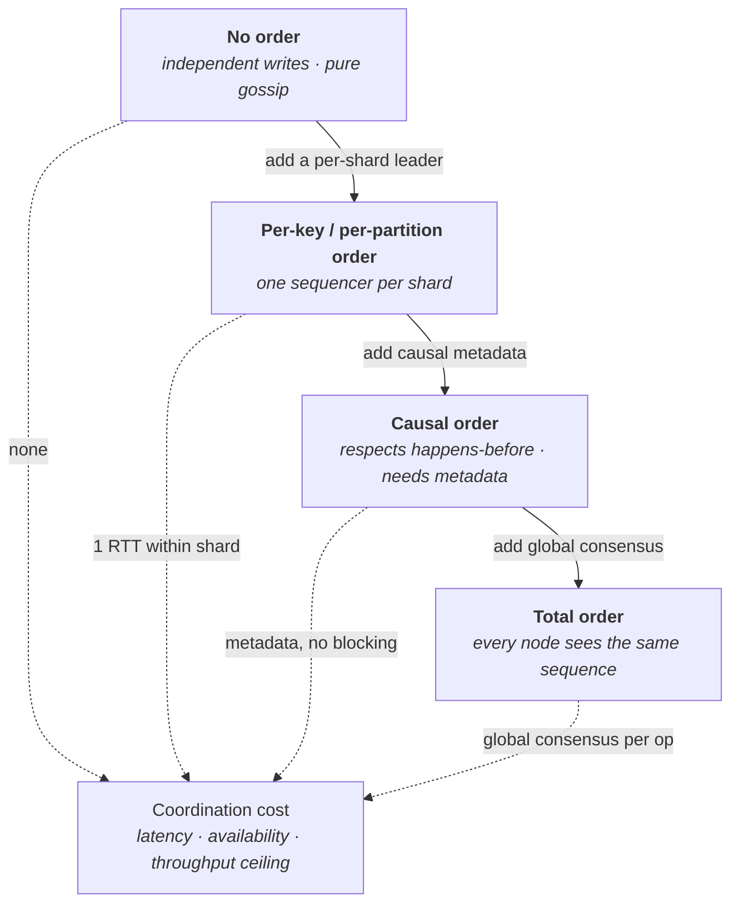
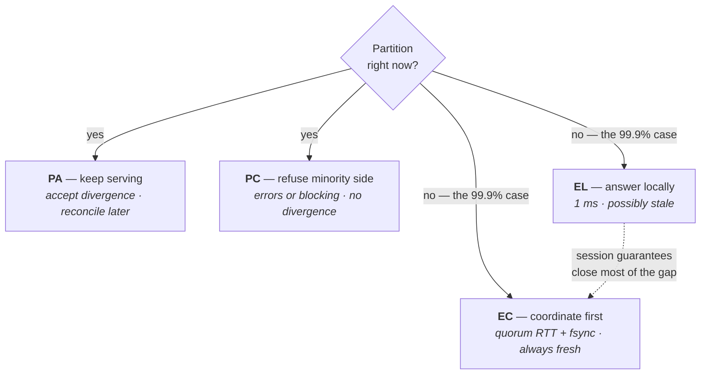
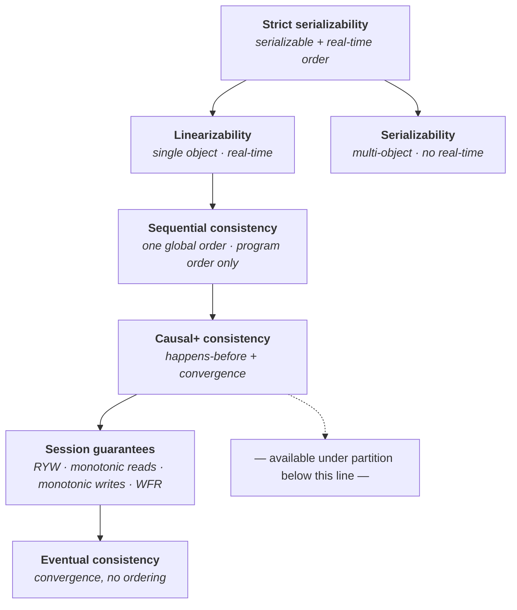
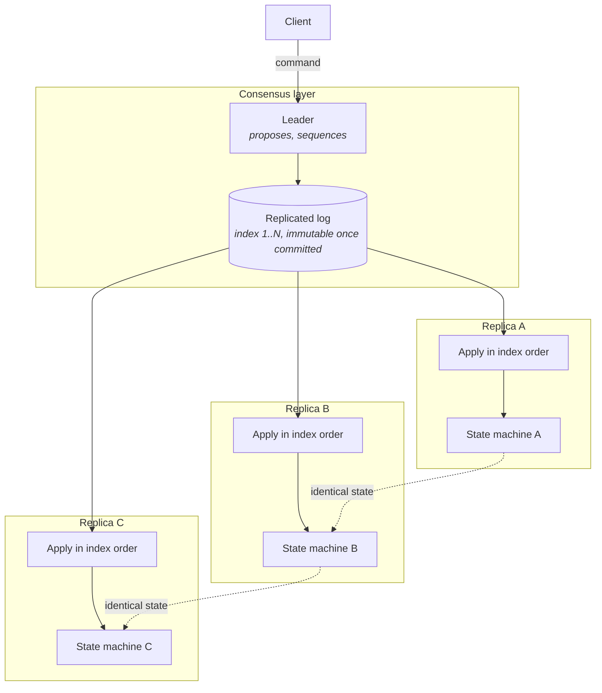
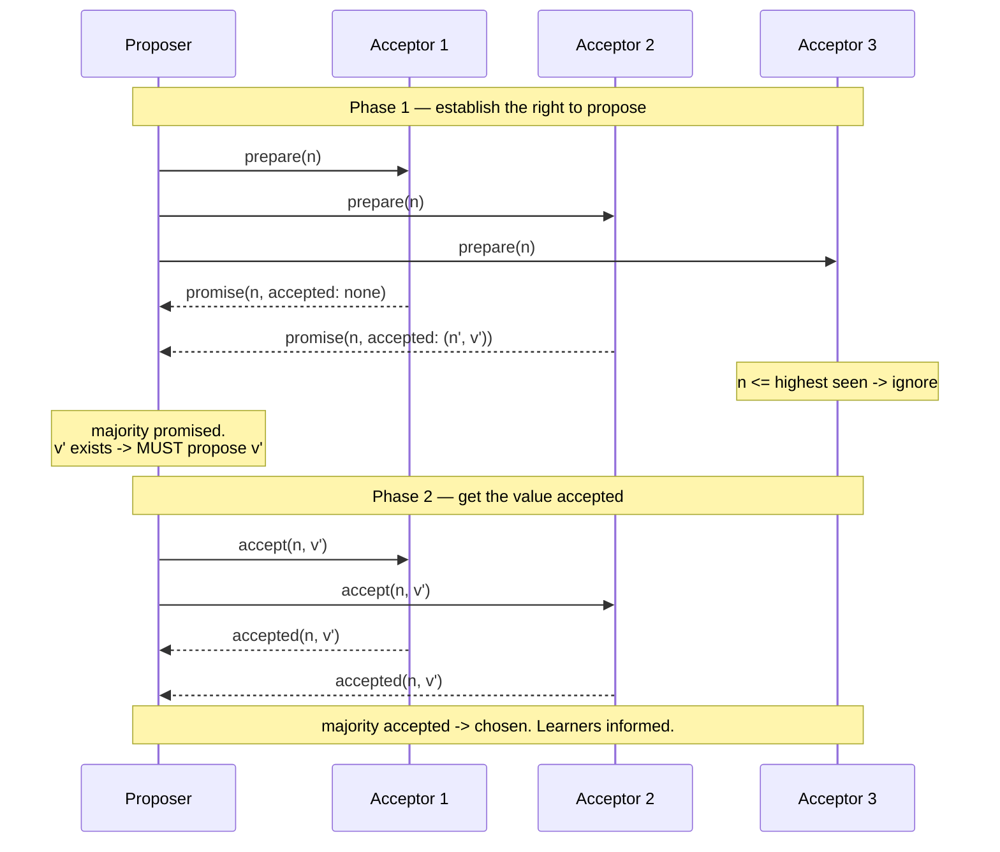
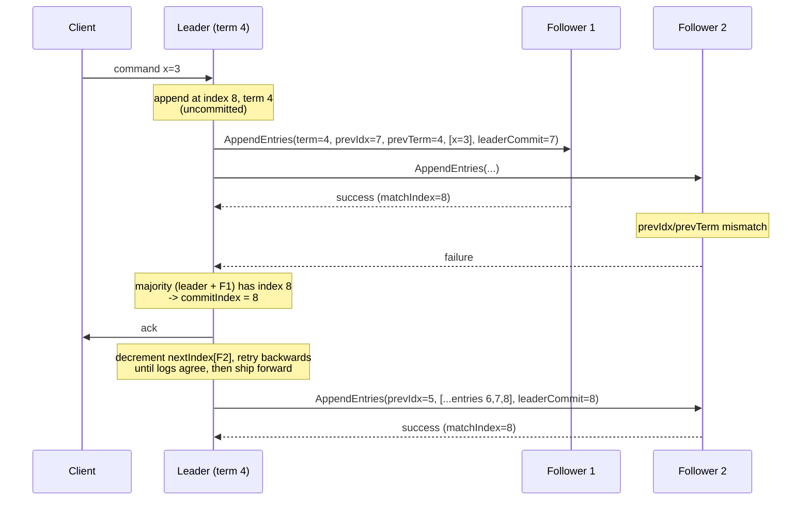
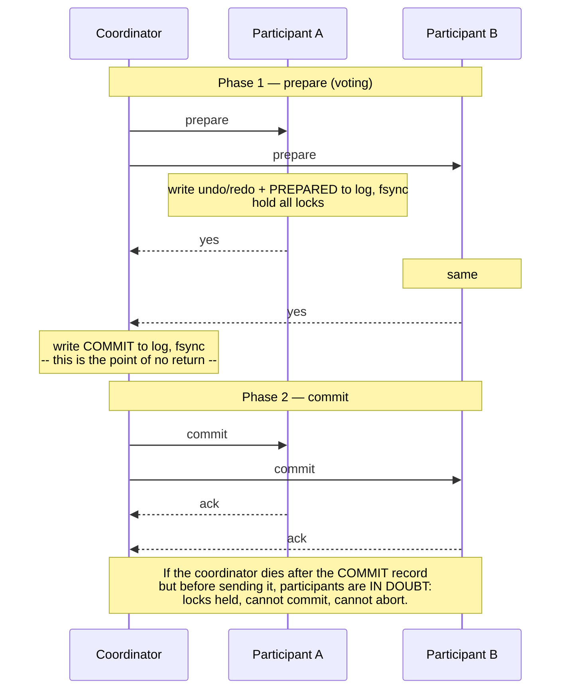
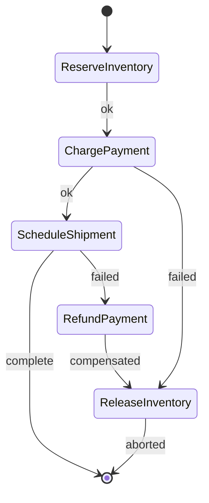

# Distributed Systems Theory

Lecture 1 established the constraints physics and statistics impose: light takes 150 ms to cross the planet and come back, queues amplify variance into tail latency, and failure is a rate, not an event. Those are facts about the substrate. This lecture asks the next question — given a network that drops and delays messages, and machines that stop without warning, *what is logically possible to guarantee at all?*

The answer is a small set of impossibility results, a hierarchy of guarantees ordered by how much coordination they cost, and a handful of protocols that buy the strong end of that hierarchy. Almost every hard system design argument at staff level is really an argument about where on this hierarchy a subsystem should sit, and whether the candidate knows what the next rung up actually costs.

## From physics to logic

- **The single new primitive is uncertainty.** In a single process, "did that write happen?" has an answer. Across a network, a timeout tells you *nothing* about whether the remote side executed — only that you did not hear back.
- **The three things you cannot do**, and everything downstream follows from them:
  - You cannot distinguish a **crashed node** from a **slow node** or a **partitioned node**. There is no ping that returns "dead" rather than "silent".
  - You cannot take a **simultaneous snapshot** of two machines, because "simultaneous" requires a shared clock you do not have.
  - You cannot make two machines **agree atomically** without at least one round trip, and therefore without paying latency for every unit of agreement.
- **Everything in this lecture is a strategy for one of three positions:** pay the coordination (consensus), avoid needing it (monotone logic, CRDTs, partition-affine schemas), or accept a weaker guarantee and be explicit about which anomalies you have admitted.
- **The staff-level tell** is not knowing the names. It is knowing the *precise statement* of CAP, FLP, and PACELC, and refusing the folk versions — because the folk versions license bad designs.

## System and timing models

Before any protocol can be proven correct, you must state what you assume about message delay and clock drift. The proof is only as good as the model.

### The three models

- **Synchronous** — there is a *known* upper bound `Δ` on message delivery, and a known bound on relative clock drift. Every process takes at most a known number of steps per unit of real time.
  - Consequence: a timeout of `Δ` is a **perfect failure detector**. If you did not hear back within `Δ`, the node is genuinely dead.
  - Consensus is easy here. So is distributed locking with plain timeouts.
  - **The problem:** no real network is synchronous. A GC pause, a hypervisor steal, a BGP reconvergence, or a NIC firmware reset produces delays orders of magnitude beyond any bound you would have picked. Assuming synchrony means your safety property is only as strong as the worst pause you never anticipated.
- **Asynchronous** — *no* bound on message delay, no bound on relative process speed, no usable clocks. Messages arrive eventually (or the model allows loss, depending on the variant), but never within a stated time.
  - This is the honest model of the internet. It is also the model in which FLP ([§ FLP impossibility](#flp-impossibility)) says deterministic consensus is impossible.
- **Partially synchronous** — Dwork, Lynch, and Stockmeyer, 1988. Two equivalent formulations, both of which capture "eventually it behaves":
  - There *exists* a bound `Δ`, but it is **unknown** to the algorithm.
  - Or: a bound `Δ` is known, but it only holds after some unknown **global stabilization time** (GST).
  - Either way: the network may misbehave arbitrarily for an arbitrary but finite period, then behaves.

### Why partial synchrony is the model that matters

- **The design rule it enforces:** *safety must hold in the asynchronous model; liveness may depend on synchrony.*
  - Raft and Paxos never elect two leaders for the same term, never commit conflicting entries, and never lose a committed entry — **regardless of timing**. Delay every message by an hour and nothing unsafe happens.
  - What timing buys is **progress**. During an asynchronous period, the protocol may thrash: repeated elections, no commits, an unavailable cluster. After GST, it converges within a few round trips.
- **This split is the single most reusable idea in the lecture.** When you evaluate any protocol, ask: which of its properties survive arbitrary delay, and which only hold when the network cooperates? A protocol whose *safety* depends on a timeout is a protocol that corrupts data during a GC pause.
- **The corresponding failure mode:** systems that embed a synchrony assumption without stating it. A lease-based lock is safe only if clock drift is bounded ([§ Leases and leader stability](#leases-and-leader-stability)). A "the leader must be alive, we heartbeated it 3 seconds ago" argument is a synchrony assumption in disguise.
- **In an interview:** if you propose a timeout as a correctness mechanism, expect to be asked what happens during a 30-second stop-the-world pause. The correct answer is a fencing token, not a shorter timeout.

## Failure detectors

A failure detector is the module that turns "I have not heard from `node-7`" into "`node-7` is suspected". Formalizing it lets you state exactly how much detection accuracy consensus needs.

### Completeness versus accuracy

- **Completeness** — do crashed processes eventually get suspected?
  - *Strong completeness:* every crashed process is eventually permanently suspected by **every** correct process.
  - *Weak completeness:* eventually suspected by **some** correct process. (Weak can be boosted to strong by gossiping suspicions.)
- **Accuracy** — are live processes wrongly suspected?
  - *Strong accuracy:* no correct process is ever suspected. Requires synchrony.
  - *Weak accuracy:* some correct process is never suspected.
  - *Eventual* variants (`◊`): the property holds only after some unknown point in time.
- **Key distinction:** completeness is cheap — just time out aggressively and suspect everyone. Accuracy is what costs you. A detector that suspects everything is perfectly complete and useless.
- **The Chandra–Toueg result:** `◊W` — eventually weak accuracy plus weak completeness — is the **weakest failure detector sufficient to solve consensus** with a majority of correct processes. This is the formal statement of "you need only eventually stop lying about one node".
- **What this means practically:** your failure detector is allowed to be wrong. Repeatedly. As long as it eventually stops being wrong about at least one node, consensus terminates. This is why Raft is correct with sloppy heartbeats and why an over-tuned detector buys you nothing in safety.

### Timeout-based detection and its trade-off

- **The mechanism:** heartbeat every `H`, suspect after `T` missed intervals. Detection time is bounded by `T` plus the network delay.
- **The trade-off is a single dial, and it is unavoidable:**
  - **Short timeout** → fast detection, more false positives. Each false positive costs a leader election, a failover, cache invalidation, a rebalance — real unavailability caused by *nothing being wrong*.
  - **Long timeout** → few false positives, long unavailability windows when a node genuinely dies.
- **Concrete numbers you should carry:** etcd defaults to a 100 ms heartbeat and a 1000 ms election timeout. Raft's original paper suggests randomized election timeouts of 150–300 ms for a LAN. Cassandra's gossip runs on a 1-second interval. Kafka's `session.timeout.ms` defaults to 45 s for consumer group membership — deliberately slack, because a rebalance is expensive.
- **The failure mode: the failover storm.** Under load, latency rises, heartbeats are delayed, nodes are wrongly suspected, failovers begin, failovers add load, more nodes are suspected. The detector converts a latency problem into an availability outage. This is why detection thresholds should scale with observed latency, not be pinned to a constant.
- **Rule of thumb:** set the timeout from the *tail* of your heartbeat RTT distribution, not the mean — p99.9 plus a wide margin. And never let the detector's timeout be shorter than your worst observed GC pause.

### Phi-accrual and adaptive suspicion

- **The idea (Hayashibara et al., 2004):** stop emitting a boolean. Emit a continuously varying **suspicion level** `φ`, and let each consumer pick its own threshold.
- **The mechanism:** maintain a sliding window of recent heartbeat inter-arrival times, fit a distribution (usually normal or exponential), then define

  `φ(t) = -log₁₀ P(inter-arrival > t_now - t_last_heartbeat)`

- **How to read it:** `φ = 1` means roughly a 10% chance you are wrong to suspect; `φ = 2` about 1%; `φ = 8` about 10⁻⁸. Cassandra's `phi_convict_threshold` defaults to **8**, raised to 10–12 on cloud networks with fatter tails.
- **Why this is strictly better than a fixed timeout:** the threshold adapts automatically. On a quiet LAN with 1 ms jitter, `φ = 8` is reached quickly. On a noisy cross-AZ link with 50 ms jitter, the same threshold waits proportionally longer. You tune a *confidence*, not a duration.
- **Its genuine costs:**
  - Assumes inter-arrivals are roughly stationary. A step change in network conditions makes the fitted distribution wrong until the window rolls over.
  - The tail fit is the weak point — real network delays are heavier-tailed than normal, so `φ` overestimates confidence exactly when you most need it not to.
- **What to do instead of tuning blindly:** feed the detector application-level signals too. A node that answers heartbeats but fails every read is a *gray failure* — alive by the detector, useless to clients. Heartbeats that do not exercise the real data path detect only the failures you were least worried about.

## Physical clocks and why they cannot order events

### What a physical clock actually gives you

- **Two different clocks live in every machine, and conflating them is a bug:**
  - **Wall clock** (`CLOCK_REALTIME`, `System.currentTimeMillis`) — tracks civil time. Can jump forward, jump *backward*, and be stepped by an operator. Meaningful across machines, unreliable within one.
  - **Monotonic clock** (`CLOCK_MONOTONIC`, `System.nanoTime`) — counts elapsed time since an arbitrary epoch. Never goes backward, never jumps. Meaningless across machines, reliable within one.
- **The rule:** measure **durations** with the monotonic clock; timestamp **events for humans** with the wall clock; order **events for correctness** with neither.
- **Drift** — a quartz oscillator on a commodity server drifts on the order of 10–100 ppm depending on temperature. At 50 ppm that is about **4 seconds per day** of accumulated error, uncorrected.
- **NTP** disciplines the clock against upstream servers. Realistic accuracy: **sub-millisecond** on a well-managed LAN with a local stratum-1 source, **1–10 ms** typical in a datacenter, **tens of milliseconds** over the public internet, and unbounded when NTP is misconfigured, firewalled, or pointed at a lying server. PTP with hardware timestamping reaches microseconds but requires switch support.
- **NTP corrects in two modes, and both are hazardous:**
  - *Slewing* — speed up or slow down the clock to converge. Safe, but means a "second" is not a second.
  - *Stepping* — jump the clock. Used when offset exceeds a threshold (128 ms by default in `ntpd`). This is where wall clocks **go backwards**.
- **Leap seconds** — a second inserted (or in principle removed) to keep UTC aligned with earth rotation. Naive handling repeats `23:59:59`, so a wall clock genuinely moves backward by one second. The 2012 and 2015 leap seconds caused correlated multi-hour outages across the industry. The mitigation everyone converged on is **leap smearing**: spread the extra second over 24 hours, so the clock is up to 0.5 s wrong but never non-monotonic. Google, Amazon, and Meta all smear — but *differently*, so a machine on Google's NTP and one on Amazon's disagree by up to half a second during a smear.

### Why wall clocks must not order events

- **The failure mode has a name: last-write-wins data loss.** Two replicas accept conflicting writes; conflict resolution compares wall-clock timestamps; the replica whose clock is 200 ms ahead wins, *regardless of which write actually happened later*. The other write is silently discarded — no error, no conflict, no trace.
- This is not hypothetical. It is the standard hazard of Cassandra's LWW cell resolution and of any `updated_at`-based merge.
- **The deeper point:** a timestamp comparison asserts an ordering the system has no evidence for. If `A` did not causally precede `B`, no clock can tell you which "really" came first — the question is not well-posed. If `A` *did* causally precede `B`, then you should be tracking causality ([§ Logical clocks](#logical-clocks)), which is exact, rather than time, which is approximate.
- **Where wall clocks are legitimately fine:** TTLs and expiry (a few hundred ms of error is harmless), rate-limit windows, metrics, log correlation, human-facing display, and cache freshness heuristics.

### TrueTime and bounded-uncertainty commit waits

- **The insight:** the problem with clocks is not that they are wrong, it is that you do not know *how* wrong. Fix that and clocks become usable for ordering.
- **The mechanism (Spanner):** GPS receivers and atomic clocks in every datacenter, and an API that returns an **interval**, not a point — `TT.now()` yields `[earliest, latest]` with the guarantee that true absolute time lies inside. Uncertainty `ε` is half the interval width; Spanner reports a mean of about **4 ms** and a worst case around **7 ms**, sawtoothing with the interval between reference syncs.
- **Commit wait** — the trick that turns bounded uncertainty into external consistency. To commit a transaction at timestamp `s`, the coordinator picks `s = TT.now().latest`, and then **deliberately sleeps** until `TT.now().earliest > s` before releasing locks and acknowledging. That sleep is roughly `2ε` — about **10 ms average** in Spanner.
- **What it buys:** *external consistency* (strict serializability). If transaction `T₁` commits before `T₂` starts in real time, then `s₁ < s₂` globally, across regions, with no communication between them. Read-only transactions can then be served at a timestamp from any sufficiently caught-up replica, lock-free.
- **The cost, stated honestly:** every read-write commit pays `2ε` of pure sleep. Halving `ε` halves that tax, which is why the hardware investment is justified — `ε` is a direct multiplier on write latency.
- **The generalization:** anyone can do this. AWS Time Sync with clock-bound APIs, and CockroachDB's `--max-offset` (default 500 ms), are the same idea with a looser bound. CockroachDB does not commit-wait; it instead *restarts* transactions that observe a value within the uncertainty window, trading a latency tax for an abort rate. **If a node's clock drifts outside `max-offset`, CockroachDB deliberately crashes it** — a self-fencing move, because outside the bound its safety argument is void.

## Logical clocks

If you cannot trust physical time, track the only ordering you actually have evidence for: causality.

### Happens-before

- **Lamport's happens-before relation `→`** is the smallest partial order such that:
  - If `a` and `b` are in the same process and `a` precedes `b`, then `a → b`.
  - If `a` is a send and `b` is the matching receive, then `a → b`.
  - Transitivity: `a → b` and `b → c` imply `a → c`.
- **Concurrency is the negation:** `a ‖ b` iff neither `a → b` nor `b → a`. Concurrent does *not* mean simultaneous — it means *no information flowed between them*, so no ordering is observable and any ordering is as good as another.
- **Why this is the right notion:** it captures exactly the orderings a program could possibly detect. Causality is what you must preserve to avoid observable anomalies; anything beyond it is arbitrary tie-breaking.

### Lamport timestamps

- **The mechanism** — one integer `C` per process:
  - On any local event, `C := C + 1`.
  - On send, attach `C`.
  - On receive of `t`, `C := max(C, t) + 1`.
- **The guarantee, and note the direction:** `a → b` implies `C(a) < C(b)`. **The converse does not hold.** `C(a) < C(b)` tells you nothing — `a` may have caused `b`, or they may be entirely concurrent.
- **Total order via tie-breaking:** append the process ID, `(C, pid)`, and you get an arbitrary but *consistent* total order that never contradicts causality. This is enough for total-order broadcast and for Lamport's original mutual-exclusion algorithm.
- **The loss:** concurrency information is destroyed. You cannot detect a conflict, because every pair of events looks ordered. Any system that needs to say "these two writes conflict, surface both to the application" cannot use Lamport clocks.

### Vector clocks and version vectors

- **The mechanism** — each process keeps a vector `V` of length `N`, one counter per process:
  - On a local event, increment your own entry.
  - On send, attach the whole vector.
  - On receive, take the element-wise `max`, then increment your own entry.
- **The comparison rule, which is the whole point:**
  - `V(a) ≤ V(b)` element-wise and `V(a) ≠ V(b)` → `a → b`.
  - Neither dominates → `a ‖ b`, a genuine **concurrent pair**, i.e. a conflict.
- **This is exact.** Vector clocks characterize happens-before precisely, in both directions — the property Lamport timestamps lack.
- **Version vectors** are the same structure applied to *data objects* rather than events: one counter per replica, attached to a value, used to decide whether an incoming version is newer, older, or conflicting. Dynamo, Riak, and Voldemort use them to produce **siblings** — multiple concurrent values handed to the application to merge.
- **The size problem, which is why they are not universal:**
  - The vector is `O(N)` in the number of entities that can *independently write*. Per-replica (a handful of nodes) is fine. Per-*client* — which is what you need if clients write to different coordinators — is unbounded.
  - Riak's classic pathology is **sibling explosion**: a naive per-client vector grew with the client population, an actor accumulated entries forever, and the metadata dwarfed the value.
  - Pruning old entries to bound the size **breaks correctness** — it can make a causally-later value look concurrent, or worse, look older.
  - The principled fix is **dotted version vectors**, which separate "the causal context I read" from "the specific write I made", giving accurate concurrency detection with size proportional to the number of *replicas*, not clients.
- **Rule of thumb:** vector clocks are affordable when the number of writers is small, fixed, and administratively controlled. Otherwise you need a different conflict story.

### Hybrid logical clocks

- **The problem HLCs solve:** logical clocks are correct but meaningless to humans and useless for "give me a snapshot as of 10:00". Physical clocks are meaningful but unsafe. HLC gives you one value that is both.
- **The mechanism** — a timestamp is a pair `(l, c)`: `l` tracks physical time, `c` is a logical counter for tie-breaking within the same `l`.
  - On a local event: `l' = max(l, pt)`. If `l' == l`, increment `c`; else `c = 0`.
  - On receiving `(l_m, c_m)`: `l' = max(l, l_m, pt)`, and `c` is set by the same case analysis, taking `max(c, c_m) + 1` when the incoming `l` ties.
- **The two properties together:**
  - `a → b` implies `HLC(a) < HLC(b)` — it is a correct logical clock.
  - `l` stays within the clock-skew bound `ε` of true physical time — so it is *also* an approximate wall clock, and a snapshot "as of" an HLC timestamp is meaningful.
  - Size is constant: 64 bits in practice (typically 48 bits of physical, 16 of counter).
- **Who uses it:** CockroachDB, YugabyteDB, MongoDB (as `ClusterTime`). It is the pragmatic answer for anyone without Spanner's hardware — you get causally-correct, human-interpretable timestamps for the price of one 64-bit field.
- **The limitation you must state:** HLC does **not** give external consistency by itself. Two causally-unrelated transactions on disconnected nodes can be assigned timestamps out of real-time order, bounded by `ε`. Spanner pays commit wait to close that gap; CockroachDB pays uncertainty restarts instead.

## Ordering guarantees and what each costs

**Read this as a price list, not a ranking:**

- **No order** — writes are independent; any application of them yields the same state. Only safe when operations genuinely commute (increments, set-adds, idempotent puts of immutable data). Costs nothing. Buys nothing if your operations do not commute.
- **Per-key or per-partition order** — all operations on a given key, or in a given shard, are totally ordered; operations in *different* partitions have no relative order. Cost is one round trip to that partition's leader, and it **scales horizontally** because independent partitions never coordinate. Kafka's per-partition offsets, DynamoDB's per-item ordering, and sharded Raft groups (CockroachDB ranges, Spanner splits) are all this.
- **Causal order** — if `a → b`, every node applies `a` before `b`; concurrent operations may be applied in any order. Crucially, this requires **no agreement** — a node can apply an operation as soon as its dependencies are present. It is therefore compatible with availability under partition ([§ CAP, stated precisely](#cap-stated-precisely), [§ The consistency hierarchy](#the-consistency-hierarchy)). The cost is metadata (version vectors or dependency lists) and a delivery buffer.
- **Total order** — every node observes the identical sequence. This *is* consensus; the two are equivalent problems. Cost is at least one round trip to a majority plus a durable log write, per operation, and a global throughput ceiling set by a single sequencer.

**Why per-partition order is the near-universal compromise:**

- It gives the application the ordering it usually actually needs — operations on the *same* entity are ordered — while permitting linear scale-out, because throughput grows with partition count.
- **The trap:** teams silently assume cross-partition ordering. "Write the order, then write the inventory decrement" gives you no guarantee about the sequence an observer sees, because the two live in different partitions. Any invariant spanning partitions needs an explicit mechanism — a transaction ([§ Two-phase commit](#two-phase-commit) through [§ Deterministic and MVCC-based distributed transactions](#deterministic-and-mvcc-based-distributed-transactions)), a saga ([§ Sagas and compensating transactions](#sagas-and-compensating-transactions)), or a schema change that colocates them ([§ Deterministic and MVCC-based distributed transactions](#deterministic-and-mvcc-based-distributed-transactions)).
- **In an interview:** when someone proposes a globally-ordered log, ask for the write rate. A single Raft group tops out at roughly tens of thousands of small writes per second; a partitioned log does not.

## FLP impossibility

**The precise statement (Fischer, Lynch, Paterson, 1985):** in an asynchronous message-passing system where at most **one** process may fail by crashing, there is no **deterministic** algorithm that solves consensus — that is, that guarantees all three of:

- **Agreement** — no two correct processes decide different values.
- **Validity** (non-triviality) — the decided value was proposed by some process.
- **Termination** — every correct process eventually decides.

**What the result actually says, since this is where people go wrong:**

- **It is about termination, not safety.** FLP does not say consensus algorithms are wrong. It says no deterministic algorithm can *guarantee* it always finishes. Paxos and Raft are entirely correct under FLP — they simply may not terminate, and they do not claim to.
- **One crash is enough.** The result does not need a malicious adversary or a flood of failures. A single crash, in an asynchronous model, at the worst possible moment.
- **The proof shape** is worth carrying: there always exists a *bivalent* configuration — one from which both decisions are still reachable — and the adversary (the scheduler) can always delay exactly the right message to keep the system bivalent forever. Since a crashed process and an infinitely-delayed one are indistinguishable, the algorithm can never safely conclude.
- **It is a purely asynchronous result.** Add any timing assumption and it evaporates.

**How real systems sidestep it — there are exactly three doors:**

- **Partial synchrony** — assume the network eventually behaves ([§ System and timing models](#system-and-timing-models)). Paxos, Raft, ZAB, and Viewstamped Replication all take this door. Safety is unconditional; termination holds after GST. **This is the door essentially all production infrastructure uses.**
- **Randomization** — Ben-Or's algorithm and modern randomized BFT (HoneyBadgerBFT) replace "eventually decides" with "decides with probability 1", in expected constant or logarithmic rounds. The adversary cannot pre-plan against a coin flip. Used where you cannot assume any synchrony at all — chiefly adversarial, open-membership settings.
- **Failure detectors as an oracle** — assume a `◊W` detector ([§ Completeness versus accuracy](#completeness-versus-accuracy)) and consensus becomes solvable. This is formally equivalent to the partial-synchrony door, since `◊W` is exactly what eventual synchrony lets you build.

**The practical reading:** FLP is why every consensus system has a liveness caveat in its documentation and none has a safety caveat. When you are told a system "guarantees consistency and availability", the correct question is which of agreement, validity, or termination it quietly dropped.

## CAP, stated precisely

**The formal statement (Gilbert and Lynch, 2002, proving Brewer's 2000 conjecture):** in an asynchronous network model in which messages between two groups of nodes may be arbitrarily lost, it is impossible to implement a read/write register that provides **both**:

- **Availability** — *every* request received by a *non-failing* node must eventually return a non-error response. No latency bound is implied; "eventually" is literal.
- **Atomic consistency** — **linearizability** ([§ Linearizability](#linearizability)). Not "consistency" in the ACID sense, and not any weaker model.

**And the partition:**

- **A partition** is a period during which the network arbitrarily drops messages between two sets of nodes. It is not a node failure and not slowness — it is message loss between live nodes that continue serving clients.

**The three misreadings, in ascending order of how much damage they cause:**

- **"Pick two of three."** Wrong, and it is the standard version. **`P` is not a choice.** Partitions are something the network does to you; you do not opt out. The actual theorem is a conditional: *when a partition occurs*, you must forfeit either availability or linearizability. `CA` is not a system class — it is the statement "I assume partitions never happen", which is only defensible on a single machine.
- **"Available" means high uptime.** No. CAP-availability is a formal property: *every request to every live node returns successfully*. A system with 99.999% uptime that returns errors during a partition is **CP**, not AP. Conversely a CAP-available system can be desperately slow and still qualify. Uptime and CAP-availability are different axes.
- **"My system is AP" (or CP), full stop.** Wrong granularity. **CP/AP is a per-operation property, not a system property.** The same database routinely offers both:
  - Cassandra with `QUORUM` reads and writes is CP for that operation; with `ONE` it is AP.
  - DynamoDB's eventually-consistent read is AP; its strongly-consistent read is CP; its conditional write is CP.
  - Even inside one request path, a design might take strong consistency on the balance check and eventual consistency on the recommendation panel. Stating that split is exactly the analysis an interviewer is looking for.

**What CAP does not tell you, which is most of what you need:**

- It says nothing about the **normal case** — the 99.9% of time with no partition. That omission is what PACELC exists to fix ([§ PACELC and classifying real systems](#pacelc-and-classifying-real-systems)).
- It says nothing about intermediate consistency models. The theorem is stated against linearizability; **causal+ consistency and every session guarantee are achievable while remaining fully available under partition**, which is the single most useful practical consequence and the one CAP's folk version obscures entirely.
- It says nothing about *how* you should degrade. "Forfeit availability" can mean returning an error, blocking, or serving a stale read with a staleness label — three very different products.

## PACELC and classifying real systems

**The statement (Abadi, 2010/2012), which subsumes CAP:**

> **If** there is a **P**artition, choose between **A**vailability and **C**onsistency; **E**lse (in normal operation), choose between **L**atency and **C**onsistency.

**Why the `E` half is the one you will actually argue about:**

- **Partitions are rare; latency is every request.** A cross-AZ quorum round trip costs roughly **1–2 ms**; a cross-region one costs **30–150 ms**. You pay that on every strongly-consistent operation, forever, partition or not.
- The `E` choice is therefore the dominant *economic* trade-off, while the `P` choice is the dominant *correctness* trade-off. Interviews that only discuss CAP are discussing the rarer half.
- **The physics is unavoidable:** linearizability requires that a read observe the effect of every completed write, which requires contacting a quorum or holding a lease from one. There is no clever engineering that makes a strongly-consistent cross-region read cheaper than one speed-of-light round trip.

**Classifying real systems — memorize a few of these:**

| System | Partition behavior | Normal-case default | Class |
|---|---|---|---|
| DynamoDB, Cassandra, Riak (tunable low) | serve anyway, reconcile | local/nearest replica | **PA/EL** |
| MongoDB (default write concern, primary reads) | minority side rejects writes | reads from primary | **PC/EC** |
| **Spanner** | **minority side unavailable** | **commit wait + Paxos** | **PC/EC** |
| CockroachDB, YugabyteDB | minority ranges unavailable | leaseholder reads, no commit wait | PC/EC |
| PNUTS (Yahoo) | per-record master unavailable | local stale reads permitted | PC/EL |
| ZooKeeper / etcd | minority side rejects writes | reads can be local and stale | PC/EL by default |
| Kafka (`acks=all`, min ISR) | under-replicated partitions reject | ISR ack before commit | PC/EC |

- **Spanner is the honest case to argue about.** It is `PC/EC`: it gives up availability under partition and it pays latency in the normal case. Its own authors' defence is that Google's private network makes partitions rare enough that its *observed* availability exceeds 5 nines regardless — which is an argument about failure rates, not about CAP.
- **The trap:** treating a system's class as fixed. Cassandra at `LOCAL_ONE` is `PA/EL`; Cassandra at `QUORUM` with `LOCAL_SERIAL` compare-and-set is `PC/EC` for those operations. The configuration, not the logo, determines the class.
- **In an interview:** state the class *per operation* and justify the `E` half with a latency number. "Reads are `EL` — served from the local region at 2 ms, bounded staleness under 5 s; the payment write is `EC` and pays a 60 ms cross-region quorum" is a staff-level answer. "It's AP" is not.

## CALM and monotonicity

**The theorem (Hellerstein; proved by Ameloot et al.):** a program has a **coordination-free** distributed implementation **if and only if** it is **monotone**.

- **Monotone** means: adding more input never retracts a previously-produced output. The result only grows as facts arrive.
  - *Monotone:* set union, `max`, `min`, counting up, "has this ever been true?", threshold tests (`count ≥ 5`), append-only log accumulation.
  - *Non-monotone:* set difference, negation, aggregation that can decrease, "is this set complete?", `count = 5` exactly, uniqueness constraints, "no reservation conflicts".
- **Why the equivalence holds intuitively:** coordination exists to establish that you have *seen everything relevant*. A monotone computation never needs that — any answer it emits stays valid as more data arrives, so it can emit immediately from partial information. A non-monotone one must wait for completeness, and establishing completeness across a network **is** coordination.
- **This is the sharpest available test for "do I need consensus here?"** Not a heuristic — an iff. Reframe the question from "is this important?" to "can this output ever be retracted by later input?"

**Applying it:**

- **The classic reframe:** "has this user ever been banned?" is monotone and needs no coordination. "Is this username currently unique?" is non-monotone and needs it. Same domain, opposite answers.
- **Sealing** — a non-monotone computation over a *sealed* input becomes safe. "The daily total" is non-monotone while the day is open and monotone once you can assert the day is closed. Watermarks in stream processing are exactly this mechanism, which is why they are the coordination point in an otherwise coordination-free pipeline.
- **Thresholds are monotone; equality is not.** Designing an invariant as "at least" rather than "exactly" can eliminate a consensus dependency outright.

**"Just make it a CRDT" — when that is the right answer:**

- **It is right when** the operation set is genuinely commutative and monotone, conflicts have a *semantically defensible* automatic merge, and the value of always-available writes exceeds the cost of accepting concurrent updates. Shopping carts, presence, view counters, collaborative text, feature flags, telemetry rollups.
- **It is wrong when** the merge function has to invent a business decision. Merging two concurrent "withdraw $100" operations from a $150 balance by summing them is arithmetically correct and financially wrong. A CRDT can always converge; it cannot tell you the converged value is *acceptable*.
- **The honest framing:** a CRDT does not eliminate the conflict. It **relocates the conflict resolution from runtime coordination into the data type's merge semantics** — which is a genuine win when those semantics are obviously right, and a disguised bug when they are not.

## The consistency hierarchy

The models below are genuinely ordered by strength: each one permits everything the one above it permits, plus more. Every step down removes coordination and therefore removes latency and adds availability. Knowing the order — and where the line of partition-tolerance falls — is the core deliverable of this lecture.

**Reading the diagram:**

- **The two branches under strict serializability are not comparable.** Linearizability is about *single objects with real-time order*; serializability is about *multi-object transactions with no real-time requirement*. Neither implies the other. Strict serializability is precisely their conjunction — and this is a standard interview discriminator.
- **The line matters more than the boxes.** Everything at causal+ and below is achievable while remaining fully available during a partition. Everything above it is not — that is CAP restated as a hierarchy. Causal+ is provably the **strongest always-available model**.
- Each downward step trades a guarantee for a latency and availability gain. There are no free steps and no free upgrades.

### Linearizability

- **Definition:** every operation appears to take effect **atomically at a single instant** between its invocation and its response, and that instant order is consistent with **real time**. If write `W` completes before read `R` begins — by wall-clock, even from different clients that never communicate — `R` must observe `W` or something later.
- **The intuition:** the distributed system behaves as though there is exactly one copy of the data. It is the *recency* guarantee.
- **What it costs:** every read must contact a quorum or hold a lease from the current leader. Cross-region, that is one RTT you cannot optimize away.
- **What depends on it:** distributed locks, leader election, uniqueness constraints, and any external-communication channel — the canonical bug is a system writing to the database and to a message queue where the consumer reads the database and does not find the write yet.

### Sequential consistency

- **Definition:** there exists **some** total order of all operations consistent with each process's **program order**, and all processes observe that same order.
- **How it differs from linearizability — one word: real time.** A sequentially-consistent system may serve you an arbitrarily stale value, as long as everyone is stale in the *same order*. A read issued a minute after a write may legally miss it.
- **The classic realization:** a synchronously-replicated system where reads go to a follower that applies the leader's log in order but lags. Order preserved, recency lost.

### Causal+ consistency

- **Definition:** operations related by happens-before ([§ Happens-before](#happens-before)) are observed by all nodes in that order; concurrent operations may be observed in different orders on different nodes. The **`+`** adds *convergence*: concurrent conflicting writes are resolved by a deterministic function so all replicas eventually agree.
- **Why it is the sweet spot:** it prevents every anomaly a user can actually *notice* as a causality violation — the comment appearing before the post it replies to, the reply visible before the removal that preceded it, the photo-permission-then-upload reversal from the COPS paper.
- **It requires no coordination.** A replica applies an operation as soon as its dependencies are locally present. That is why it survives partitions.
- **The cost is metadata and buffering** — you must track dependencies (version vectors, explicit dependency lists) and hold back operations whose dependencies have not arrived. At high fan-out the dependency tracking, not the data, becomes the dominant overhead. This is the practical reason causal consistency is less deployed than its theoretical position deserves.

### Session guarantees and bounded staleness

- Weaker than causal+, but they cover the anomalies a *single user* perceives. Treated in full in [§ Session guarantees](#session-guarantees).
- **Bounded staleness** is orthogonal in flavor and useful in practice: "reads reflect all writes older than `t` seconds" or "lag at most `k` versions". Cosmos DB exposes it as a first-class level. It is the only weak model that gives you a *number* to put in an SLO, which makes it unusually easy to reason about operationally.

### Eventual consistency

- **Definition, stated at its actual strength:** *if writes stop, all replicas eventually converge to the same value.* That is the entire guarantee.
- **What it does not promise:** any bound on "eventually", any ordering, that a read reflects your own write, or that successive reads move forward in time. Reads may legally go **backward**.
- **Convergence needs a mechanism**, and this is where implementations differ: LWW by timestamp (lossy, [§ Why wall clocks must not order events](#why-wall-clocks-must-not-order-events)), version vectors with application merge (correct, costly), CRDT merge (correct, constrained), read repair, and anti-entropy via Merkle-tree comparison (Dynamo, Cassandra).
- **The honest reading:** "eventually consistent" is a statement about the *floor*, not about typical behavior. Real replication lag in a healthy system is single-digit milliseconds. The design question is never the typical case; it is what your application does the one time in ten thousand that lag is 30 seconds.

## Transaction isolation versus distributed consistency

These are two different axes, routinely conflated, and the conflation is a reliable interview filter.

- **Isolation** (serializability and its weakenings) is about **interleaving of multi-operation transactions**. It asks: is the concurrent execution equivalent to *some* serial execution?
- **Consistency** in the distributed sense (linearizability and its weakenings) is about **recency and ordering of single-object operations across replicas**. It asks: does a read see the latest completed write?
- **Key distinction:** serializability permits *any* serial order — including one that places your transaction before a transaction that committed an hour earlier in real time. It has **no real-time component at all**. Linearizability is entirely about real time but says nothing about grouping operations.
- **Strict serializability = serializability + linearizability.** Transactions appear to execute one at a time, in an order consistent with real time. Spanner's "external consistency" is this. It is the strongest practically-implemented model.
- **The concrete consequence:** a serializable-but-not-linearizable database can commit `T₁`, then commit `T₂` that does not see `T₁`, and remain formally correct. Two independent clients observing this see the world run backward. If any communication happens outside the database — a webhook, a user telling a colleague, a queue message — this is a real bug that isolation alone will never catch.

**The anomaly catalogue — know what each level admits:**

- **Dirty write** — `T₂` overwrites an uncommitted value written by `T₁`. Prohibited at every level including Read Uncommitted; it makes rollback impossible.
- **Dirty read** — `T₂` reads a value `T₁` wrote but has not committed. Allowed at Read Uncommitted only.
- **Non-repeatable read** (fuzzy read) — `T₁` reads a row twice and gets different values because `T₂` committed in between. Allowed at Read Committed.
- **Lost update** — `T₁` and `T₂` both read `x`, both compute `x + 1`, both write; one increment vanishes. Allowed at Read Committed and (nominally) Repeatable Read; **prevented under Snapshot Isolation by first-committer-wins**, and prevented explicitly by `SELECT ... FOR UPDATE` or an atomic `UPDATE x = x + 1`.
- **Read skew** — `T₁` reads `x` before `T₂`'s transfer and `y` after, seeing a state that never existed. Prevented by any snapshot-based level.
- **Write skew** — the one that matters. `T₁` and `T₂` each read an overlapping set, each check an invariant that currently holds, and each write a *different* row such that the invariant is now violated. Two doctors both check "at least one on call", both see two, both go off call. **Snapshot Isolation permits this**, which is precisely why SI is not serializability. Serializable Snapshot Isolation (PostgreSQL's `SERIALIZABLE`) detects the dangerous read-write dependency structure and aborts one side.
- **Phantom** — `T₁` runs a range query, `T₂` inserts a row matching the predicate, `T₁` reruns and sees a new row. Requires predicate locking or index-range locking, or SSI, to prevent.

**Rule of thumb:** most production databases default to Read Committed or Snapshot Isolation, not serializability. If your invariant spans rows that a transaction *reads but does not write*, you are exposed to write skew at the default level, and the fix is an explicit lock, a materialized conflict row, or `SERIALIZABLE`.

## Session guarantees

Full causal consistency is expensive; a single user's *perception* of correctness is cheap. Session guarantees are the four properties that cover almost everything a human notices, scoped to one client session.

- **Read-your-writes (read-your-own-writes)** — after you write, your subsequent reads observe that write or later. The archetypal violation: you post a comment, the page refreshes from a follower, your comment is gone.
- **Monotonic reads** — successive reads never move backward in time. Violated when consecutive requests hit different replicas with different lag: you see the comment, refresh, it disappears, refresh again, it returns.
- **Monotonic writes** — your writes are applied in the order you issued them. Without it, "create the resource" and "update the resource" can be applied in reverse, and the update fails or is lost.
- **Writes-follow-reads** (session causality) — if you read a value and then write, your write is ordered after the value you read. This is what stops your reply being visible on a replica that has not yet received the post you replied to.

**Two mechanisms implement all four:**

### Sticky sessions

- **The mechanism:** route every request from a session to the **same replica**, by client-ID hashing or a routing cookie. That replica applies its own writes before serving its own reads, so all four guarantees follow trivially.
- **Its genuine costs:**
  - **Load imbalance.** Session affinity defeats even distribution; a heavy user pins load to one replica.
  - **Failure discontinuity.** When the sticky replica dies, the client is rerouted to a replica that may be behind, and every guarantee breaks at exactly the moment you least want it to.
  - **It does not survive rebalancing.** Adding a replica reshuffles hashing, and some sessions silently move backwards.
- **When it is fine:** short sessions, low stakes, homogeneous clients. It is the cheapest correct answer and it is frequently the right one.

### Client-side tokens

- **The mechanism:** every write returns a **position token** — a log sequence number, an HLC timestamp, an etcd revision, a MongoDB `operationTime`. The client stores the highest token it has seen and sends it with subsequent reads. The serving replica compares it against its own applied position and either waits until it catches up, or redirects to a replica that has.
- **Why this is strictly better than stickiness:** the guarantee follows the *client*, not the connection. It survives failover, rebalancing, and reading from a different region. It also composes across services — pass the token through your API and read-your-writes holds end-to-end.
- **Its costs:**
  - The token must be plumbed through every layer, including the client. Retrofitting this into an existing API is invasive.
  - A read carrying a token *newer than any available replica* must block or error. You have converted a staleness problem into a latency problem — which is usually the right trade, but it is a trade.
  - Tokens are per-service; making them global requires a shared timestamp domain (HLC), which is exactly why HLC exists.
- **Real instances:** MongoDB causal-consistent sessions (`afterClusterTime`), DynamoDB's consistent-read flag as a coarse version, Kafka consumer offsets, etcd's `WithRev` reads, and MySQL's `MASTER_POS_WAIT` / GTID-based read routing in proxy layers.
- **Rule of thumb:** if you are running read replicas and have not implemented one of these two mechanisms, you do not have read-your-writes, and users will find that out before your monitoring does.

## Convergent replicated data types

A CRDT is a data type whose merge is designed so that concurrent updates converge without coordination. It is the constructive answer to CALM ([§ CALM and monotonicity](#calm-and-monotonicity)): if you can express your state monotonically, you can replicate it with zero agreement.

### State-based versus operation-based

- **CvRDT — state-based (convergent).** Replicas exchange their **whole state**; a `merge` function combines two states. Correctness requires `merge` to form a **join-semilattice**:
  - **Commutative** — `merge(a,b) = merge(b,a)`
  - **Associative** — grouping does not matter
  - **Idempotent** — `merge(a,a) = a`
  - Because of idempotence, the transport may **duplicate and reorder** freely. Gossip over an unreliable channel is sufficient. This is the property that makes CvRDTs operationally forgiving.
  - **Cost:** shipping full state. A 100 MB set replicated every second is not viable.
- **CmRDT — operation-based (commutative).** Replicas broadcast **operations**. Correctness requires concurrent operations to **commute**, and requires the transport to deliver each operation **exactly once, in causal order** — i.e. a reliable causal broadcast layer.
  - **Cost:** the delivery guarantee is not free; you have pushed the hard part into the messaging layer, which now needs dedup and causal buffering.
  - **Benefit:** messages are tiny.
- **δ-CRDTs (delta-state)** are the practical synthesis: state-based semantics, but ship only the **delta** — the join-irreducible fragment that changed — and fall back to full-state merge for recovery. This is what most production CRDT libraries actually implement.

### The catalogue

- **G-Counter** (grow-only) — a vector of per-replica counts; value is the sum; merge is element-wise `max`. Monotone, therefore trivially convergent.
- **PN-Counter** — two G-Counters, one for increments, one for decrements; value is `P − N`. This is the standard trick for making a non-monotone quantity out of two monotone ones. **It cannot enforce a non-negative bound** — that would require coordination, exactly as CALM predicts.
- **LWW-Register** — last write wins by timestamp. Simple, constant-size, and **lossy**: a concurrent update is silently discarded, and correctness of *which* update survives depends entirely on clock quality ([§ Why wall clocks must not order events](#why-wall-clocks-must-not-order-events)).
- **MV-Register** (multi-value) — keeps all concurrent values as siblings and hands them to the application. Nothing is lost; the application must merge. Riak's model.
- **G-Set** — add-only. Merge is union. The base case.
- **2P-Set** — an add-set and a remove-set. An element removed can **never be re-added**, which is usually a surprise to whoever chose it.
- **OR-Set** (observed-remove) — each add carries a unique tag; a remove deletes only the tags it has *observed*. A concurrent add-and-remove resolves as **add-wins**, and re-adding works. This is the set semantics most applications actually want, and the tags are why it costs more.
- **Sequences** (RGA, LOGOOT, Treedoc, YATA, Fugue) — the machinery behind collaborative text. Each character gets a globally unique, densely-orderable identifier so concurrent inserts at the same position get a deterministic total order. Yjs and Automerge are the production implementations. Deletions become tombstones; identifiers grow.

### Metadata growth, tombstones, and garbage collection

- **This is where CRDTs actually hurt in production**, and it is the part that gets skipped.
- **Tombstones** — you cannot simply delete. A removed element must leave a marker, or an old replica that has not seen the delete will resurrect it on merge. So a set that has had a million adds and a million removes may store a million tombstones and appear empty.
- **Metadata can dwarf data.** A text document of 10 KB in Automerge historically carried hundreds of kilobytes of operation history and identifiers. Modern encodings compress this heavily, but the asymptotic issue stands: history is the data structure.
- **Garbage collection requires causal stability** — a tombstone can only be dropped once you know *every* replica has seen the corresponding removal. Establishing that is... coordination. So GC is either periodic and coordinated, or it never happens.
  - Practical mitigations: version-vector-based stability detection, epoch-based compaction when all replicas are online, snapshot-and-restart, or simply bounding document lifetime.
- **The failure mode with a name:** *sibling explosion* ([§ Vector clocks and version vectors](#vector-clocks-and-version-vectors)) — the register/set analogue, where concurrent writes accumulate faster than the application merges them, and a single key grows without bound until it becomes unreadable.

### Where CRDTs are and are not appropriate

- **Appropriate:** offline-first and mobile sync, collaborative editing, presence and awareness, shopping carts, per-user preference sets, telemetry counters, feature-flag propagation, multi-region caches where staleness is acceptable — anywhere the merge is *semantically obvious* and always-writable is worth real money.
- **Not appropriate:**
  - **Invariants that must never be violated.** Non-negative balances, unique usernames, seat inventory, "at most one leader". These are non-monotone; CALM says no.
  - **When merge is a business decision in disguise.** If a product manager has to arbitrate what the merged value should be, you have a workflow, not a data type.
  - **When users must *see* the conflict.** Silent automatic merging is a feature until it silently discards someone's work.
  - **High-cardinality, high-churn data** where tombstones and metadata dominate.
- **The honest summary:** CRDTs buy availability and offline capability at the price of storage, metadata complexity, and a permanent inability to enforce global invariants. That is often an excellent trade. It is never a free one.

## The replicated state machine model

Everything in [§ Paxos](#paxos)–[§ Byzantine fault tolerance](#byzantine-fault-tolerance) is one idea implemented five ways. State it once and the protocols become variations.

**The two premises, and the one obligation they impose:**

- **Premise 1 — deterministic application.** If every replica starts from the same state and applies the same sequence of commands, and the state machine is deterministic, they end in the same state. Trivially true, and the entire foundation.
- **Premise 2 — the only hard problem is agreeing on the sequence.** Replication reduces to: totally order the commands. That is consensus. Everything else is bookkeeping.
- **The obligation: your state machine must actually be deterministic.** This is where real systems break. `NOW()`, `RANDOM()`, `UUID()`, map iteration order, floating-point differences across compiler versions, wall-clock-dependent expiry, and reading external services from inside the state machine all produce divergent replicas. The standard fix is to have the **leader evaluate the nondeterminism and put the result in the log entry** — which is exactly why MySQL moved from statement-based to row-based replication.
- **Why every strongly-consistent system reduces to this:** linearizability requires a single total order of operations with real-time consistency; an ordered log *is* that total order; a leader (or quorum) assigning indices establishes it. Spanner, CockroachDB, etcd, ZooKeeper, Kafka's controller, and every managed relational database's failover mechanism are the same shape, differing only in how the log is agreed and how many logs there are.

## Paxos

### Single-decree Paxos

Paxos decides **one** value. It has three roles — proposer, acceptor, learner — usually colocated on the same nodes, and two phases.

**The mechanism, stated so you could reconstruct it:**

- **Proposal numbers `n` are globally unique and totally ordered** — typically `(counter, node_id)`. Every proposer picks strictly increasing ones.
- **Phase 1 (prepare/promise).** The proposer sends `prepare(n)` to acceptors. An acceptor that has never promised anything higher replies `promise(n)`, undertaking two things: *never accept a proposal numbered below `n`*, and *report the highest-numbered proposal it has already accepted*, if any.
- **Phase 2 (accept/accepted).** On a majority of promises, the proposer chooses the value:
  - If **any** promise reported an accepted value, it **must** propose the one with the **highest proposal number** among them. This single rule is what makes Paxos safe.
  - Only if **no** promise reported a value may it propose its own.
  - It sends `accept(n, v)`; an acceptor accepts unless it has since promised something higher. A majority of `accepted` means the value is **chosen**.
- **Why it is safe:** any two majorities intersect in at least one acceptor. So any later proposer's Phase 1 necessarily hears about an already-chosen value and is forced to re-propose it. A chosen value can never be un-chosen or changed.
- **Why it may not terminate (FLP, [§ FLP impossibility](#flp-impossibility)):** two proposers can leapfrog forever — `P1` prepares `n=1`, `P2` prepares `n=2` invalidating it, `P1` retries with `n=3`, and so on. This is called **dueling proposers**, and it is Paxos's liveness gap made concrete. The fix is a distinguished proposer plus randomized backoff.
- **Latency:** two round trips (4 message delays) per decision.

### Multi-Paxos and stable leaders

- **The optimization:** decide a *sequence* of values, one Paxos instance per log index. The naive version costs two round trips per entry.
- **Elect a stable leader** and Phase 1 can be run **once for all future indices**. A leader that has promised `n` across the whole log tail can skip prepare entirely and issue `accept(n, v)` directly for each new entry. Steady-state cost drops to **one round trip**.
- **Log holes** are Multi-Paxos's distinguishing complication. Because instances are independent, index 7 can be chosen while index 6 is not. Consequences:
  - The state machine cannot apply 7 until 6 is resolved — application must be in index order.
  - A new leader must **fill the holes** before serving, by running full two-phase Paxos on each uncommitted index, proposing a **no-op** where nothing was chosen. This "log recovery" phase is the single most intricate part of a real Multi-Paxos implementation.
  - Raft's key simplification ([§ Raft](#raft)) is to prohibit holes outright.
- **Real implementations:** Chubby, Spanner, Google Megastore, Microsoft's Autopilot, Neo4j's core protocol, and the various "Paxos Made Live" descendants — all of which document that the gap between the paper and a working system is enormous, chiefly around log recovery, membership, and snapshotting.

### Flexible Paxos and quorum generalization

- **The result (Howard, Malkhi, Spiegelman, 2016):** Paxos does **not** require majorities. It requires only that **every Phase-1 quorum intersects every Phase-2 quorum**: `|Q1| + |Q2| > N`. Phase-2 quorums need not intersect each other at all.
- **What that unlocks:** you can shrink the quorum on the hot path at the expense of the rare path. With `N = 5`, instead of `3/3` you can run `Q1 = 4`, `Q2 = 2`. Steady-state commits need only 2 acknowledgements — lower latency and better tail behaviour, since you wait on fewer nodes. Leader election becomes more expensive and less available, which is acceptable because it is rare.
- **The generalization further:** quorums can be *grids* or weighted sets, letting you place a small fast quorum in one AZ and require a larger, slower quorum only for recovery.
- **In an interview:** this is the crisp answer to "how would you cut cross-region write latency without giving up consensus" — reshape the quorums so the common path stays local, and pay on failover.

## Raft

Raft solves the same problem as Multi-Paxos with an explicit design goal of *understandability*. It decomposes into leader election, log replication, and safety, and it enforces a **strong leader** and a **hole-free log**.

### Leader election, terms, and randomized timeouts

- **Terms** are logical time — a monotonically increasing integer. Each term has **at most one leader**. Every RPC carries a term; a node seeing a higher term immediately steps down to follower. This one rule collapses a great deal of Paxos's complexity.
- **Three states:** follower, candidate, leader.
- **The election:**
  - A follower that receives no heartbeat within its **randomized election timeout** (150–300 ms in the paper; etcd defaults to 1000 ms) becomes a candidate.
  - It increments the term, votes for itself, and sends `RequestVote` to all peers.
  - A peer grants its vote if it has not voted this term **and** the candidate's log is **at least as up to date** as its own — compared by (last log term, then last log index).
  - A majority of votes makes it leader; it immediately sends heartbeats to suppress other elections.
- **Randomization is what breaks the symmetry.** Without it, followers time out simultaneously, split the vote, and repeat — Paxos's dueling proposers in another costume. With independent random timeouts, one node almost always times out first. This is a probabilistic sidestep of FLP layered on top of the partial-synchrony one.
- **Rule of thumb from the paper:** `broadcastTime ≪ electionTimeout ≪ MTBF`. Roughly an order of magnitude between each.

### Log replication

**What the diagram encodes:**

- **`AppendEntries` is both heartbeat and replication** — an empty one is a heartbeat. One RPC type does both jobs.
- **`nextIndex[]` and `matchIndex[]`** are per-follower leader state. `nextIndex` is the leader's optimistic guess of where to send next (initialized to leader's last index + 1); `matchIndex` is the highest index *known replicated*. On rejection the leader decrements `nextIndex` and retries, walking backwards until it finds the agreement point. Production implementations return a conflict hint so this converges in one or two rounds instead of one-per-entry.
- **The commit rule, with its critical caveat:** an entry is committed once it is on a majority — **but a leader may only commit an entry from its own current term this way.** Entries from previous terms become committed only indirectly, by committing a current-term entry above them. Ignoring this yields the well-known Figure-8 bug, where a committed entry is later overwritten. New Raft leaders therefore append a **no-op entry** immediately on election, to commit the tail of the previous term.
- **Followers learn of commits lazily**, via `leaderCommit` piggybacked on the next `AppendEntries` — so a follower's applied state trails the leader by up to one round trip.

### The safety argument

Five properties, of which two carry the weight:

- **Log Matching Property** — if two logs contain an entry with the same index *and* term, then the logs are **identical in all entries up to that index**. Enforced inductively by the `prevLogIndex`/`prevLogTerm` consistency check on every `AppendEntries`. This lets a single matching entry certify an entire prefix.
- **Leader Completeness Property** — if an entry is committed in a term, it is present in the log of every leader of every **later** term. Enforced by the voting restriction in [§ Leader election, terms, and randomized timeouts](#leader-election-terms-and-randomized-timeouts): a candidate whose log is behind cannot win. Since a committed entry is on a majority, and any winning candidate needs a majority, the two majorities intersect at a node holding that entry, which will refuse to vote for a candidate lacking it.
- **Election Safety** (one leader per term), **Leader Append-Only** (a leader never overwrites its own log), and **State Machine Safety** (no two nodes apply different commands at the same index) follow from those two.
- **The one-line summary worth memorizing:** *Raft's safety is majority intersection applied twice — once to committing, once to voting.*

### Membership change and snapshotting

- **The hazard:** naively switching from configuration `C_old` to `C_new` means, for an interval, some nodes use one majority definition and some the other — permitting **two disjoint majorities and therefore two leaders in one term**.
- **Joint consensus** — the original solution. Transition through an intermediate configuration `C_old,new` in which every decision requires majorities in **both** old and new configurations separately. It is committed like any log entry; once committed, the leader proposes `C_new`. At no point does a single majority exist under only one configuration.
- **Single-server changes** — the simpler alternative Raft's author later recommended: add or remove **one** node at a time. Any old majority and any new majority necessarily overlap when the sets differ by one element, so no joint phase is needed. Multi-node changes become a sequence of single ones. This is what etcd does.
- **New nodes join as non-voting learners first**, catching up on the log before being counted in quorums, so adding a node does not stall commits while it backfills.
- **Snapshotting** — the log cannot grow forever. Each replica periodically writes a snapshot of its state machine at some index, then discards the log prefix. Two consequences:
  - A follower too far behind cannot be caught up with `AppendEntries` because the leader has discarded the entries; the leader sends `InstallSnapshot` instead.
  - Snapshotting must not block the state machine. Implementations use copy-on-write, fork, or an LSM-style immutable snapshot. **The failure mode is a snapshot pause that exceeds the election timeout**, causing a leader to be deposed by its own housekeeping — a classic etcd incident shape.

## Quorums

### Majority quorums and `R + W > N`

- **The invariant:** with `N` replicas, if every write reaches `W` replicas and every read consults `R`, then `R + W > N` guarantees the read set and write set **intersect** in at least one replica — so the read observes at least one copy of the latest write.
- **Common configurations:** `N=3, W=2, R=2` (the Dynamo default) tolerates one failure on each path. `W=N, R=1` gives fast reads and fragile writes. `W=1, R=N` the reverse.
- **`N` should be odd** for majority quorums: `N=4` and `N=3` both tolerate exactly one failure, so the fourth replica costs storage and write latency and buys nothing in fault tolerance.
- **The limits of `R + W > N` — and there are several, each of which is a real bug source:**
  - **Intersection is not linearizability.** You are guaranteed to *see* a copy of the latest write, but only if you can *identify* which returned value is latest. That requires versioning, and if you resolve by wall-clock timestamp you are back to [§ Why wall clocks must not order events](#why-wall-clocks-must-not-order-events).
  - **It says nothing about concurrent writes.** Two writes that each reach a quorum concurrently produce siblings or a lost update, not an error.
  - **Partial writes are not rolled back.** A write that reaches `W−1` replicas and then fails is reported as failed but is *durable on those replicas* — and may be propagated later by read repair. "Failed" writes can materialize.
  - **Read repair and anti-entropy are load-bearing.** Without them, replicas that missed writes stay wrong indefinitely and the intersection argument degrades as failures accumulate.
  - **Latency is set by the `W`-th slowest replica**, so quorums inherit tail-latency amplification (Lecture 1) — a reason to use hedged reads at `R` and to avoid unnecessarily large `W`.

### Tuning, sloppy quorums, and hinted handoff

- **The tuning dial:** raising `W` improves durability and read freshness at the cost of write availability and latency; raising `R` does the reverse. `R + W > N` is the constraint, not the goal — plenty of systems deliberately run `R + W ≤ N` for latency and accept staleness.
- **Sloppy quorum (Dynamo):** when the `W` *preferred* replicas for a key are unreachable, write to the **first `W` reachable nodes in the ring** instead, even though they are not the key's home. Availability rises sharply — writes succeed as long as *any* `W` nodes are alive.
- **Hinted handoff:** the stand-in node stores the write with a **hint** naming its true home, and replays it once that node returns.
- **The cost, stated plainly:** a sloppy quorum **breaks the `R + W > N` intersection guarantee entirely.** The read quorum consults the preferred nodes; the write went somewhere else; they may not intersect. Sloppy quorums buy durability and availability, not consistency — and Dynamo's own paper is explicit about this.
- **The failure mode:** a node holding hints dies before replaying them, and the writes are gone despite having been acknowledged. Hint queues also grow unboundedly during long partitions and are a common source of memory exhaustion during recovery.

### Witnesses and placement

- **Witness / tiebreaker nodes** participate in **voting** but store little or no data. They give you an odd node count and a majority-forming vote without a third full copy.
  - Real instances: MongoDB arbiters, SQL Server / Windows Failover Cluster file-share witnesses, Spanner's read-only and witness replicas, CockroachDB's non-voting replicas (the inverse — data without a vote).
  - **The trap:** an arbiter lets you run `N=2` data replicas plus a vote, which means **any single data-node loss leaves exactly one copy of the data**. You have preserved availability of the *decision* while destroying redundancy of the *data*. MongoDB now discourages arbiters for exactly this reason.
- **Cross-AZ placement is the reason quorums exist in practice.** With three replicas in three AZs, an AZ loss leaves a majority. With two in one AZ and one in another, losing the two-replica AZ loses quorum — you have three replicas and one-AZ fault tolerance.
- **Cross-region is a different calculation.** Three regions gives region-level fault tolerance but puts a 30–100 ms RTT inside every commit. The common compromise: keep the quorum within a region (or within a metro of nearby AZs) and replicate asynchronously across regions, accepting bounded data loss on region failure. **Decide your RPO explicitly rather than discovering it during the incident.**

## Viewstamped replication, ZAB, and the primary-backup framing

- **Viewstamped Replication** (Oki and Liskov, 1988 — predating Paxos's publication) frames the problem as **primary-backup with view changes** rather than as agreement on a value. A *view* is Raft's *term* and Paxos's *ballot* under a different name.
  - Normal operation: the primary assigns sequence numbers and sends `Prepare`; backups reply `PrepareOK`; a majority commits.
  - View change: on primary failure, replicas move to the next view, exchange logs, and the new primary adopts the most up-to-date one.
  - **The point of learning it:** VR, Multi-Paxos, Raft, and ZAB are the *same algorithm* with different vocabularies. Recognizing that — leader ≡ primary ≡ proposer; term ≡ view ≡ ballot ≡ epoch; log matching ≡ view change log recovery — is what lets you reason about an unfamiliar protocol quickly.
- **ZAB (ZooKeeper Atomic Broadcast)** is a primary-backup atomic broadcast protocol, not a general consensus protocol, and the difference is deliberate.
  - Transaction IDs (`zxid`) are `(epoch, counter)` pairs — a 64-bit value where the high 32 bits are the leader epoch. Epoch changes make the ordering globally unambiguous.
  - Phases: **discovery** (agree on the new epoch and the most up-to-date history), **synchronization** (bring followers to that history), **broadcast** (steady state, two-phase `PROPOSE`/`ACK` then `COMMIT`).
  - **Its distinguishing guarantee is prefix ordering / primary order:** if a leader broadcasts `a` then `b`, every server delivers `a` before `b`, and a new leader must deliver *all* of its predecessor's committed transactions before any of its own. ZooKeeper needs this because its clients issue *sequences* of dependent updates; plain consensus on individual values would not preserve them.
- **ZooKeeper's guarantees as exposed to clients — state these precisely:**
  - **Writes are linearizable.** All writes go through the leader and are totally ordered by `zxid`.
  - **Reads are NOT linearizable by default.** They are served **locally** by whichever server the client is connected to, which may lag. What you get is *sequential consistency* plus **FIFO client order**: your own operations are ordered, and you never see the world go backwards within a session (monotonic reads via the session's last-seen `zxid`).
  - To get a linearizable read you must issue `sync()` first, which forces the follower to catch up to the leader. **This is the single most commonly missed detail about ZooKeeper**, and it has produced real split-brain incidents where two clients each read stale leadership state.
  - This design is `PC/EL` ([§ PACELC and classifying real systems](#pacelc-and-classifying-real-systems)): reads are fast and local, consistency is opt-in per read.

## Byzantine fault tolerance

- **The failure model:** a faulty node may do **anything** — send different messages to different peers, forge, equivocate, collude, stay silent selectively. Crash-stop is the special case where the only faulty behavior is stopping.
- **The `3f + 1` bound.** To tolerate `f` Byzantine faults you need `N ≥ 3f + 1` replicas. The argument:
  - You must make progress after hearing from `N − f` (the other `f` may be crashed and never reply).
  - Of those `N − f` responses, up to `f` may be from Byzantine nodes lying.
  - So the honest responses `N − 2f` must strictly outnumber the lying ones `f`: `N − 2f > f`, hence `N > 3f`.
  - **Contrast with crash faults, where `2f + 1` suffices** — the factor-of-three cost is the price of nodes that lie rather than merely stop.
- **PBFT sketch (Castro and Liskov, 1999)** — three phases after the primary assigns a sequence number:
  - **Pre-prepare** — primary broadcasts `(view, seq, digest)`.
  - **Prepare** — every replica broadcasts its agreement to every other. A replica is *prepared* on `2f` matching prepares plus the pre-prepare. This phase establishes that **the primary did not equivocate** — it sent the same thing to everyone.
  - **Commit** — every replica broadcasts commit; on `2f + 1` matching commits it executes. This phase establishes that **enough replicas are prepared to survive a view change**.
  - Cost: `O(n²)` messages per operation, because two phases are all-to-all. This is why classical BFT does not scale past a few dozen nodes. Modern protocols (HotStuff, used in Diem/Libra derivatives) reduce this to `O(n)` per view with threshold signatures and a leader-collected aggregation, at the price of an extra round.
  - **View change is the hard part**, as always — replicas that suspect the primary broadcast view-change messages with proofs of what they prepared, and the new primary must reconstruct a safe history from `2f + 1` of them.
- **When BFT is warranted:** mutually distrusting parties with no common administrator (public blockchains, consortium ledgers), certificate transparency and other verifiable logs, safety-critical avionics with independently developed implementations, and settings where a single compromised node must not be able to corrupt the system.
- **When it is not — which is nearly all commercial infrastructure:**
  - Your nodes are all administered by you and run the **same binary**. A bug is therefore **correlated**, not Byzantine — all `3f + 1` replicas will produce the same wrong answer, and BFT gives you nothing.
  - The realistic threat is an operator error, a bad deploy, or a compromised control plane — none addressed by BFT.
  - The costs are severe: 3× replica count, `O(n²)` messaging, and enormous implementation complexity.
- **What to do instead:** address the sub-Byzantine failures that actually occur — **checksums end to end** (silent disk and network corruption is real and common at scale), **fencing tokens** ([§ Leases and leader stability](#leases-and-leader-stability)) against stale actors, independent verification jobs that recompute and compare, and signed, auditable logs. These capture most of the practical value of BFT at a small fraction of its cost.

## Leases and leader stability

- **A lease is a lock with an expiry** — a time-bounded grant of exclusive rights. The holder may act unilaterally until the lease expires; the grantor need not be contacted, and need not even be alive, for the holder to know it may proceed.
- **Why leases exist:** they convert "ask permission every time" into "hold permission for a while", which is the only way to make **local reads linearizable**. A leaseholder knows no one else can have written, so it can serve reads from local state with no quorum round trip. This is the single largest performance optimization in Raft-based databases — CockroachDB's *leaseholder* and Spanner's *leader leases* are exactly this.
- **Why a lock service alone is unsafe.** Suppose a client acquires a lock, then experiences a 30-second GC pause. The lease expires. The service grants the lock to a second client. The first client wakes up, believing it still holds the lock, and writes. **Two writers, no error, corrupted data.** No amount of lease-expiry checking in the client fixes this, because the check and the write are not atomic with respect to a pause that can occur between them.
- **Fencing tokens are the only general fix.** Every lease grant carries a **monotonically increasing token**. Every write to the protected resource includes the token. **The resource itself rejects any write bearing a token lower than the highest it has seen.**
  - The stale client writes with token 33; the storage layer has already seen token 34; the write is rejected. The correctness now lives in the resource, not in the client's belief about time.
  - Real instances: ZooKeeper's `zxid` and znode `cversion`, etcd's revision numbers and lease IDs, HDFS NameNode epoch numbers, Raft terms used as fencing tokens by the state machine, and object-storage conditional writes with `If-Match` on an ETag.
  - **The requirement this imposes on your design:** the protected resource must be able to check a token. If it is a legacy service or a third-party API with no conditional-write support, **you cannot fence it**, and no distributed lock will make concurrent access safe. Say this out loud in an interview.

**Clock assumptions hidden inside every lease:**

- **A lease is only safe if the grantor's "expired" precedes the holder's "still valid" in real time.** That requires bounded relative clock drift — a synchrony assumption, smuggled in.
- The standard mitigations, all of which are about making the assumption explicit rather than eliminating it:
  - **Asymmetric expiry.** The grantor treats the lease as expired at `T`; the holder self-expires at `T − δ`, where `δ` exceeds the maximum plausible drift plus scheduling delay. The gap is dead time in which nobody holds the lease — availability traded for safety.
  - **Measure the lease with the monotonic clock**, never the wall clock ([§ What a physical clock actually gives you](#what-a-physical-clock-actually-gives-you)). A wall-clock lease can be extended by an NTP step.
  - **Check the deadline immediately before the I/O**, not at the top of the handler — and understand that this narrows the window without closing it.
  - **Ultimately, fence.** Everything above reduces probability; only a fencing token gives you a guarantee.
- **The interaction with elections is worth stating:** a leader lease must be *shorter* than the election timeout, or a new leader can be elected while the old one still believes its lease is live. CockroachDB and etcd both derive lease duration from the election timeout for this reason.

## Two-phase commit

2PC is atomic commitment across independent participants: everyone commits or everyone aborts.

**The mechanism, precisely:**

- **Prepare** — each participant does everything short of committing: validates constraints, writes undo and redo records plus a `PREPARED` record to its own durable log with an `fsync`, and **retains all locks**. Voting `yes` is a **binding promise**: the participant has surrendered its right to abort unilaterally and *must* be able to commit later, even after a crash and restart.
- **The coordinator's commit record is the atomic moment.** Once `COMMIT` is durable in the coordinator's log, the transaction is committed — regardless of whether any participant has heard. Phase 2 is pure notification and retry.
- **Recovery** — a participant restarting in `PREPARED` state cannot decide on its own. It must ask the coordinator. A coordinator restarting reads its log: if the commit record is there, re-send commit; if not, abort.

**Blocking and in-doubt transactions — the defining flaw:**

- If the coordinator fails after participants vote `yes` but before they learn the outcome, participants are **in doubt**. They **cannot** commit (the coordinator may have decided abort) and **cannot** abort (it may have decided commit). They must **block, holding locks**, until the coordinator returns.
- **This is not a bug in an implementation; it is a theorem.** No atomic commit protocol can be non-blocking in an asynchronous system with a single point of decision.
- **The blast radius is what makes it dangerous.** The blocked participants hold locks on rows that unrelated transactions need. Those transactions block. Connection pools fill. The outage spreads from one failed coordinator to services that never touched it.
- **Heuristic decisions** — the operational escape hatch in XA, where a DBA manually forces a prepared transaction to commit or abort. It resolves the block and may **violate atomicity**, producing a permanently inconsistent state that must be reconciled by hand. Its existence tells you how bad the blocking is in practice.

**Why 2PC is availability-hostile and latency-expensive:**

- **Availability multiplies downward.** The transaction can only commit if *every* participant and the coordinator are up. With `n` participants each at availability `a`, availability is roughly `aⁿ⁺¹` — five participants at 99.9% gives about 99.4%. Adding participants strictly reduces availability.
- **Latency:** two round trips plus **at least two durable log flushes on the critical path** (participant prepare, coordinator commit) — often three or four counting participant commit records. Cross-AZ that is milliseconds; cross-region it is tens to hundreds.
- **Lock hold time is the hidden killer.** Locks are held across two network round trips instead of one local operation. Throughput on contended rows collapses by an order of magnitude, and the effect is superlinear as contention rises.
- **What to do instead, in order of preference:** (1) design so the transaction fits in one partition ([§ Single-partition fast paths and partition affinity](#single-partition-fast-paths-and-partition-affinity)); (2) use a saga with compensations if the business process tolerates intermediate states ([§ Sagas and compensating transactions](#sagas-and-compensating-transactions)); (3) if you truly need atomicity across partitions, use a **Paxos-backed commit** ([§ Non-blocking commit and Paxos-backed commit](#non-blocking-commit-and-paxos-backed-commit)) rather than a single coordinator. Bare XA across heterogeneous systems is a design of last resort.

## Non-blocking commit and Paxos-backed commit

### Three-phase commit

- **The idea:** insert a `pre-commit` phase between voting and committing. After a majority acknowledges `pre-commit`, every participant knows the decision *was* commit, so a recovering group can conclude the outcome among themselves without the coordinator.
- **Its assumptions, which are why it is not used:**
  - It requires a **synchronous** model with bounded message delay and reliable failure detection. Under partial synchrony a false suspicion can lead one group to commit and another to abort — **3PC trades blocking for a partition-triggered safety violation**, which is a strictly worse deal.
  - It adds a third round trip and another log flush to the critical path.
- **Where you should place it:** as an instructive dead end. Its value is understanding *why* it fails, which is exactly the "safety must not depend on timing" rule from [§ Why partial synchrony is the model that matters](#why-partial-synchrony-is-the-model-that-matters).

### Replicated coordinator state — the actual fix

- **The insight:** 2PC blocks because the coordinator's decision is stored in **one place**. Replicate that decision through consensus and the block disappears without needing synchrony.
- **The mechanism (Gray and Lamport, "Consensus on Transaction Commit"):** each participant's vote is decided by its own Paxos/Raft instance, and the commit record itself is a consensus decision. If a coordinator fails, a new one is elected and reads the committed decision from the replicated log. In-doubt windows shrink from "until a human intervenes" to "until a leader election completes" — tens to hundreds of milliseconds.
- **This is what production systems actually do:**
  - **Spanner** — 2PC where every participant is a Paxos group and the coordinator's state is Paxos-replicated. 2PC over Paxos, not 2PC over single nodes.
  - **CockroachDB** — transaction records live in a replicated range; a failed coordinator leaves a record that another node can push, abort, or resolve. Its parallel-commit optimization further removes one round trip by making the commit implicit once all writes and the record are replicated.
  - **FoundationDB** — a resolver plus a replicated transaction log service, with the commit decision durable in a replicated log.
- **What it does not fix:** the **latency** and **lock-hold** costs of [§ Two-phase commit](#two-phase-commit) remain. Consensus-backed commit removes the availability catastrophe, not the cost. Distributed transactions are still expensive; they are merely no longer a liability.

## Sagas and compensating transactions

- **The premise:** give up atomicity, keep the business outcome. A long-running operation becomes a **sequence of local transactions** `T₁ … Tₙ`, each committing independently, with a **compensating transaction** `Cᵢ` for each that semantically undoes it. On failure at step `k`, run `C_{k−1} … C₁`.
- **What you give up, and you must say it out loud:** **isolation**. Intermediate states are visible to everyone. A saga guarantees *eventual* atomicity — all-committed or all-compensated — never point-in-time consistency.

**Reading the state machine:**

- **Forward path and compensation path are both explicit state.** The saga's current position must be **durably recorded** before each step, or a crash leaves you unable to determine what to compensate. The saga log is the whole mechanism.
- **Every step must be idempotent** in both directions — retries are guaranteed, so `ChargePayment` must carry an idempotency key and `RefundPayment` must be safe to apply twice.
- **Compensation is not rollback.** `RefundPayment` is a new, visible transaction. The customer sees a charge and a refund. That is a product decision, not an implementation detail.

### Choreography versus orchestration

- **Choreography** — each service listens for events and emits its own. No central controller.
  - *For:* no single point of failure, low coupling, services deploy independently.
  - *Against:* **the workflow exists nowhere**. Understanding it requires reading `n` services. Cyclic event dependencies are easy to create and hard to see. Debugging a stuck saga means correlating logs across services. Adding a step means changing multiple services.
- **Orchestration** — a central coordinator (Temporal, AWS Step Functions, Cadence, Netflix Conductor, or a hand-rolled state machine) invokes each step and handles failures.
  - *For:* the workflow is **one readable artifact**; state is queryable; timeouts, retries, and compensation are centralized; testing is tractable.
  - *Against:* the orchestrator is a dependency and must itself be durable and highly available; risk of business logic creeping into it.
- **Rule of thumb:** choreography for two or three steps with genuinely independent teams; **orchestration past that**, and essentially always where money or legal obligations are involved. The observability difference alone justifies it — the most common saga failure in production is not a wrong compensation, it is a saga that got stuck and nobody noticed.

### Compensation semantics and impossibility

- **Compensations are *semantic*, not physical.** They restore business meaning, not the prior byte state.
- **Some compensations do not exist.** An email is sent. A physical package ships. A trade is executed on an exchange. An SMS one-time code reaches a phone. A third-party API has no reversal endpoint.
- **The design responses, in order of preference:**
  - **Order the saga so irreversible steps come last** — the "pivot transaction" pattern. Everything before the pivot is compensable; everything after is retriable-until-success. This costs nothing and eliminates most of the problem.
  - **Make the irreversible step retriable rather than compensable** — if it cannot be undone, ensure it can be driven forward indefinitely with idempotency.
  - **Insert a deferral window** — hold the email for 60 seconds so a cancel can preempt it. Cheap and effective.
  - **Escalate to a human** for the residue. A dead-letter queue with an operator runbook is a legitimate design, provided it is explicit rather than emergent.

### Semantic locks, commutativity, and reservations

The three techniques that recover *some* of the isolation a saga gives up:

- **Semantic lock** — a pending state on the record: `status = PENDING_PAYMENT`, `balance_held = 100`. Other transactions see it and behave accordingly. It is an application-level lock with application-defined semantics, and it needs its own timeout-and-cleanup path or you accumulate permanently-pending records.
- **Commutative updates** — express steps as operations that commute, so order does not matter and compensation is exact. `balance -= 100` commutes with other deltas and its compensation `balance += 100` restores the correct value regardless of what happened in between; `balance = 400` does not. **Prefer deltas to absolutes in any saga step.**
- **Reservation pattern** — split the operation into *reserve* then *confirm*. Reserve an inventory unit or place a payment authorization hold; confirm or release later. This is the most broadly applicable technique because:
  - The reservation is a **local, atomic, non-monotone check** done once, at one place, with no distributed coordination.
  - Reservations carry an expiry, so an abandoned saga self-heals without any compensation running at all.
  - It is what airlines, ticketing, and payment authorization have always done. Payment auth-then-capture *is* this pattern, standardized.
- **The unifying idea:** these all convert a global invariant into a **locally enforceable** one. That is the general move whenever you need a non-monotone guarantee without paying for consensus ([§ CALM and monotonicity](#calm-and-monotonicity)).

## Deterministic and MVCC-based distributed transactions

### Calvin-style pre-ordering

- **The insight:** the expensive part of distributed transactions is *agreeing on the outcome after the fact*. If every replica knows the **global order** of transactions in advance, and execution is deterministic, then every replica independently reaches the same result — and **no commit protocol is needed at all**.
- **The architecture — three layers:**
  - **Sequencing layer** — batches incoming transactions into epochs (Calvin uses 10 ms) and uses consensus (Paxos/Raft) **once per batch**, not once per transaction, to fix a global order. This amortizes consensus across thousands of transactions.
  - **Scheduling layer** — deterministically acquires all locks in the agreed order before execution begins.
  - **Storage layer** — executes.
- **What it buys:** replication is free (replicas replay the same input log), there is no 2PC, and there are no distributed deadlocks, since locks are acquired in a globally consistent order.
- **What it costs, and the cost is real:**
  - **Read and write sets must be known in advance.** A transaction whose reads depend on prior reads (`SELECT ... WHERE id = (SELECT ...)`) does not fit. Calvin's workaround is OLLP — run a reconnaissance query, then submit the transaction with the discovered set, and **restart it if the set changed**. Interactive transactions are effectively unsupported.
  - Latency has a floor of the batching epoch.
  - **Any nondeterminism destroys the whole model**, more severely than in the RSM case ([§ The replicated state machine model](#the-replicated-state-machine-model)) because there is no commit protocol to catch divergence.
- **Where you see it:** Calvin itself, FaunaDB, and partially in systems that batch consensus. It is the strongest available argument that "distributed transactions are slow" is a statement about *2PC*, not about distributed transactions.

### Single-partition fast paths and partition affinity

- **The most valuable optimization in distributed transactions is not needing one.** A transaction confined to a single partition commits with a local lock, a local log write, and one consensus round within that partition's replica group — no 2PC, no cross-partition coordination.
- **Schema design is therefore a distributed-systems decision.** Choosing the partition key so that transactional units colocate is the highest-leverage move available:
  - Partition by `customer_id` and orders, line items, and addresses for a customer are all in one partition.
  - DynamoDB's `TransactWriteItems`, Cosmos DB's transactional batch, and Spanner's interleaved tables all exist to make this explicit — Spanner's `INTERLEAVE IN PARENT` physically colocates child rows with the parent.
  - Cassandra's partition key is the same idea; a batch within one partition is atomic, across partitions it is not.
- **Fast paths in real systems:** VoltDB executes single-partition transactions on a single thread with no locking at all. CockroachDB's one-phase commit path skips the transaction record entirely when all writes land in one range.
- **The trap:** a partition key chosen for even data distribution but not for transaction locality gives you good balance and terrible transaction cost. And the inverse — a key chosen for locality that concentrates traffic — gives you a **hot partition**. This tension is genuine and has no general solution; you resolve it per workload.
- **Rule of thumb:** count the fraction of your transactions that would be single-partition under a candidate key. If it is not well above 90%, choose a different key.

### Percolator and Spanner-style distributed MVCC

- **Percolator (Google, 2010)** — snapshot-isolated distributed transactions layered on BigTable **entirely in the client library**, with no changes to the storage system.
  - **Timestamp oracle** — a single service handing out globally monotonic timestamps, batched and persisted in ranges so a restart never reissues one. A transaction takes a `start_ts` at the beginning and a `commit_ts` at commit.
  - **The primary-lock trick** — each row has extra columns: `lock`, `write`, `data`. Prewrite writes the value at `start_ts` and a lock; **one arbitrarily chosen row is the *primary***, and all other rows' locks point to it. Commit is the single atomic write that clears the primary lock and writes its `write` record. **That one write is the atomic commit point** — secondaries are cleaned up lazily, and any reader encountering a secondary lock resolves it by inspecting the primary.
  - This is client-driven 2PC that has replaced the coordinator's durability with a single row write, making it non-blocking in the sense that any client can resolve an abandoned transaction.
  - **Costs:** the oracle is a centralized dependency (mitigated by batching — Google reported ~2M timestamps/sec from one machine), latency roughly doubles versus non-transactional access, and abandoned locks require a cleanup path with a timeout. **TiDB is a direct production descendant.**
- **Spanner** replaces the oracle with **TrueTime** ([§ TrueTime and bounded-uncertainty commit waits](#truetime-and-bounded-uncertainty-commit-waits)), removing the centralized dependency and, via commit wait, upgrading snapshot isolation to **external consistency** (strict serializability). The trade is 10 ms of commit wait against a global service dependency.
- **Snapshot reads without locking — the shared payoff of both designs:**
  - MVCC keeps multiple versions keyed by timestamp. A read at timestamp `t` returns, for each key, the latest version with `commit_ts ≤ t`.
  - **Read-only transactions take no locks and block nothing.** They never abort, never cause aborts, and can be served by **any replica** that has applied everything up to `t`.
  - This is why globally distributed strongly-consistent *reads* are cheap while writes are not — Spanner serves read-only transactions from the nearest replica at local latency. If your workload is read-dominated, the strong-consistency tax is far smaller than the headline write latency suggests.
  - **The cost of MVCC** is the cost it always is: version accumulation, garbage collection, and a bound on how far back you can read. Spanner's default version-retention window is one hour; CockroachDB's GC TTL defaults to 4 hours (25 hours historically). A long-running analytical read that outlives the window fails.

## Coordination primitives

### Distributed locks

- **The correctness requirements — all three, and most implementations satisfy only the first two:**
  - **Mutual exclusion** — at most one holder at a time.
  - **Liveness / deadlock freedom** — a crashed holder's lock is eventually released. This is why locks are leases ([§ Leases and leader stability](#leases-and-leader-stability)).
  - **Fault tolerance** — the lock service survives node failure.
- **Two reasons to take a lock, and they have different requirements:**
  - **Efficiency** — avoid duplicate work (don't transcode the same video twice). A rare double-execution costs money, not correctness. A best-effort lock is fine.
  - **Correctness** — a double execution corrupts data or double-charges a customer. Here a lock without fencing is **not sufficient**, full stop.
- **The Redlock debate**, worth knowing because it crystallizes the whole issue:
  - **Redlock** (Redis) acquires the lock on a majority of `N` independent Redis masters with a TTL, and considers it held if a majority acknowledged within a small fraction of the TTL.
  - **Kleppmann's critique:** its safety depends on bounded clock drift and bounded process pauses. A GC pause or an NTP step lets a stale holder believe it still owns the lock. Since the acquiring clients cannot fence, mutual exclusion is not actually guaranteed. His summary: use it for efficiency, never for correctness.
  - **Antirez's response:** the algorithm relies on *elapsed time* measured locally rather than absolute clocks, and pauses long enough to break it are also long enough to break most systems.
  - **The resolution, which is the part that matters:** the debate is not really about Redis. **Any lock service, including ZooKeeper and etcd, has the same stale-holder problem**, because the gap between "check I hold the lock" and "perform the write" is unprotectable from the client side. The distinguishing feature is not the lock service's consensus quality — it is whether the *protected resource* enforces a fencing token.
- **Fencing tokens as the only safe general answer** — restated because it is the single most reusable takeaway of [§ Leases and leader stability](#leases-and-leader-stability) and [§ Coordination primitives](#coordination-primitives): **correctness must be enforced at the resource, using a monotonic token, not at the client, using a belief about time.** If the resource cannot check a token, you do not have a safe distributed lock — you have a probabilistic one, and you should design as if concurrent execution will occur.

### Leader election

- **Lease-based** — the leader holds a renewable lease (a ZooKeeper ephemeral node, an etcd lease-bound key, a database row with an expiry). Simple, cheap, and its safety rests entirely on the clock assumptions of [§ Leases and leader stability](#leases-and-leader-stability).
- **Consensus-based** — leadership *is* a term in a consensus protocol (Raft, ZAB). Election safety is a proved property, not an operational hope. This is strictly stronger and is what you get when the leader is a leader *of the replicated log itself*.
- **Key distinction:** the two are not competitors, they are layers. Raft elects a leader by consensus and then usually grants it a **lease** so it can serve local reads. Consensus gives safety; the lease gives performance.
- **Split-brain — prevention and detection:**
  - **Prevention by majority quorum.** A minority partition cannot elect a leader, because it cannot assemble a majority. This is why an even node count with a symmetric split leaves *neither* side able to proceed, and why witnesses ([§ Witnesses and placement](#witnesses-and-placement)) exist.
  - **Prevention by fencing at the resource.** Even if two nodes believe they are leader, only the one with the higher token can write. **This is the only defense that survives a bad clock.**
  - **Prevention by STONITH** — in traditional HA clusters, the new leader physically powers off or isolates the old one before taking over. Crude, effective, and it turns an ambiguous state into a definite one.
  - **Detection** is inherently after the fact: divergent writes, two nodes both reporting leadership in metrics, conflicting sequence numbers. **Always emit "am I leader" as a metric**, and alarm on the sum across nodes exceeding one — it is a cheap, high-value signal that catches split-brain within a scrape interval.
  - **The trap:** treating leader election as solved because you used ZooKeeper. If leadership is read via a non-`sync` ZooKeeper read ([§ Viewstamped replication, ZAB, and the primary-backup framing](#viewstamped-replication-zab-and-the-primary-backup-framing)), a client can act on stale leadership information. The lock service being correct does not make the *client's belief* correct.

### Membership and failure detection at scale

- **The problem:** every node needs an approximately consistent view of who is in the cluster. For `N` nodes, all-to-all heartbeating is `O(N²)` messages — fine at 10 nodes, ruinous at 1000.
- **Gossip** — each node periodically picks a few random peers and exchanges state. Information spreads epidemically, reaching all nodes in `O(log N)` rounds with `O(1)` messages per node per round.
- **SWIM** (Scalable Weakly-consistent Infection-style Membership) is the design worth knowing in detail, because Consul (via Serf), HashiCorp Nomad, and Hazelcast all use it:
  - **Separates failure detection from dissemination**, which is the core insight. Detection is a bounded-cost ping protocol; dissemination piggybacks on it.
  - **Direct probe** — each node pings one random peer per protocol period (typically 1 s).
  - **Indirect probe** — if there is no reply, ask `k` other nodes (typically 3) to ping it on your behalf. This distinguishes *the target is down* from *my path to the target is down*, and it is what kills most false positives.
  - **Suspicion mechanism** — a node that fails both probes is marked `suspect`, not `dead`, and the suspicion is gossiped. The suspected node, on hearing it, **refutes** with a higher incarnation number. Only after a suspicion timeout does it become `dead`. This is a cheap, elegant reduction of false-positive cost.
  - **Result:** detection time is roughly constant regardless of cluster size, and message load per node is constant. That is the property `O(N²)` heartbeating cannot provide.
- **Anti-entropy versus dissemination — two gossip jobs, often confused:**
  - **Dissemination (rumor-mongering)** — spread *new* information quickly; stop gossiping a rumor after a few rounds. Fast, but a node that was down misses it.
  - **Anti-entropy** — periodically compare *full state* (or a Merkle-tree digest of it) with a peer and reconcile differences. Slow, high-bandwidth, but **guarantees eventual convergence** and repairs anything dissemination missed.
  - **You need both.** Dissemination for latency, anti-entropy for correctness. Cassandra runs both: gossip for membership dissemination, Merkle-tree repair for data anti-entropy.
- **Central registry versus gossip:**

| | Central registry (etcd, ZooKeeper, Consul servers) | Gossip (SWIM, Cassandra) |
|---|---|---|
| Consistency of view | strongly consistent, single truth | eventually consistent, transiently divergent |
| Scale ceiling | thousands of clients, one small cluster | tens of thousands of peers |
| Failure of the mechanism | registry down → no membership changes | no single point of failure |
| Operational complexity | one more stateful cluster to run | emergent, harder to debug |
| Debuggability | **excellent — query the state** | poor — state is distributed and transient |
| Detection latency | heartbeat/lease TTL, seconds | protocol period × suspicion, seconds |

- **Rule of thumb:** use a central registry when you need a **consistent** membership decision (who is the leader, is this shard assigned) and the cluster is in the hundreds. Use gossip when you need **scale** and can tolerate a transiently inconsistent view (who is alive, what is the ring topology). Many production systems use both: **Consul is exactly this hybrid — gossip for membership and health, Raft for the consistent catalog.**

## Coordination services

### ZooKeeper

- **Data model:** a hierarchical namespace of **znodes**, each holding a small value (default limit **1 MB**, and you should stay far below it). The entire dataset is held in memory on every server and must fit there — this is a deliberate constraint, not a limitation to work around.
- **Znode flavors:**
  - **Persistent** — survives until explicitly deleted.
  - **Ephemeral** — deleted automatically when the creating **session** ends. This is the primitive that makes liveness-linked state possible: presence, membership, and leadership.
  - **Sequential** — the server appends a monotonically increasing counter to the name. Combined with ephemeral, this yields the standard recipes.
- **Sessions** — a client's connection to the ensemble, with a negotiated timeout (typically 4–40 s, bounded by `tickTime`). The session, not the TCP connection, is the unit of liveness; a client can transparently reconnect to a different server and keep its session. **Session expiry is decided by the ensemble, not the client** — which matters, because a partitioned client may believe it still holds a lock long after its ephemeral node was deleted. This is the stale-holder problem ([§ Leases and leader stability](#leases-and-leader-stability)) in its most common concrete form.
- **Watches** — one-shot triggers on a znode. The client is notified *that* something changed, not what it changed to, and must re-read and re-register. One-shot semantics mean **you can miss intermediate states**, which is a correctness consideration, not a nuisance: watches tell you to re-read, they are not an event stream.
- **The canonical recipes, worth being able to sketch:**
  - **Leader election / lock** — every contender creates an ephemeral-sequential znode under a common parent. The **lowest sequence number holds the lock**. Each other contender watches **only the node immediately below its own** — not the parent — which avoids the **herd effect** where every release wakes every waiter.
  - **Group membership** — ephemeral znode per member under a group parent; watch the parent's children.
  - **Configuration** — persistent znode with a watch; every consumer re-reads on change.
- **Guarantees, restated because [§ Viewstamped replication, ZAB, and the primary-backup framing](#viewstamped-replication-zab-and-the-primary-backup-framing) is the part people get wrong:** linearizable writes, FIFO client order, sequentially consistent (possibly stale) reads unless you call `sync()` first.

### etcd

- **The data model is a flat, **MVCC** key space** rather than a tree, and the difference is more significant than it first appears.
- **Revisions** — a single cluster-wide, monotonically increasing 64-bit counter incremented on **every** write. Every key carries `create_revision`, `mod_revision`, and `version`. Consequences:
  - You can **read the entire key space as of any revision** — a consistent global snapshot, for free.
  - You can **watch from a revision**, so a client that disconnects resumes exactly where it left off with **no missed events**. This is the decisive advantage over ZooKeeper's one-shot watches, and it is why Kubernetes is built on etcd: controllers reconcile from a resource version and never lose an update.
  - `mod_revision` is a natural **fencing token** and a natural compare-and-swap predicate.
- **Transactions** — `Txn(compare).Then(ops).Else(ops)`, a mini compare-and-swap over multiple keys, applied atomically. `compare` typically tests `mod_revision` or `create_revision`. This is a genuinely more expressive primitive than ZooKeeper's per-znode versioned write.
- **Leases** — a TTL object; keys are attached to a lease and are deleted when it expires. The client `KeepAlive`s. This is ZooKeeper's ephemeral-node behavior, but decoupled: **many keys can share one lease**, and the lease TTL is chosen per use case rather than per session.
- **Compaction** — old revisions must be compacted or the history grows without bound. A watch or snapshot read of a compacted revision fails with a specific error the client must handle by re-listing. This is the single most common etcd-client bug.
- **Sizing reality:** etcd's default storage quota is **2 GB** (8 GB maximum recommended), and the entire dataset is memory-mapped. Exceeding the quota puts the cluster into a **read-only alarm state** that requires manual intervention — a well-known Kubernetes outage cause.

### Consul

- **The hybrid, and it is the clearest illustration of [§ Membership and failure detection at scale](#membership-and-failure-detection-at-scale)'s rule:** Raft among the server nodes for the consistent KV store and catalog; SWIM gossip (via Serf) across *all* nodes, including clients, for membership and failure detection. Consistency where it is needed, scale where it is needed.
- **Service discovery integration is its distinguishing feature:**
  - Services register with health checks (script, HTTP, TCP, TTL, gRPC), and discovery **excludes unhealthy instances automatically**.
  - Both **DNS** and HTTP interfaces — `service.consul` DNS names let unmodified applications get service discovery with no library. This is a much bigger practical deal than it sounds.
  - Multi-datacenter federation with a WAN gossip pool, keeping cross-DC traffic off the Raft path.
  - Consul Connect adds service mesh identity and mTLS on top of the same registry.
- **Consistency modes for reads** are exposed explicitly, which is good practice worth imitating: `default` (leader-served, possible stale under leader-lease edge cases), `consistent` (leader confirms quorum first — a real round trip), `stale` (any server, fastest, may lag). The API forces the caller to choose, rather than hiding the choice in a default.

### Why coordination services must stay small and off the data path

- **They are deliberately unscalable.** Every write goes through one leader and is replicated to a majority with a durable flush. Realistic capacity: **low tens of thousands of small writes per second** for etcd, similar for ZooKeeper, with reads higher only because they can be served locally. **This is a design ceiling, not a tuning problem.**
- **They hold state in memory** — etcd's 2–8 GB quota, ZooKeeper's full-dataset-in-heap. They are not databases.
- **The failure mode, which is the important one:** if a coordination service is on your request path, **its availability becomes your availability, and its latency becomes your latency floor**. Worse, everything depends on it, so its failure is maximally correlated — the one outage that takes down every service simultaneously. Every large organization that has put ZooKeeper or etcd on the data path has an incident report about it.
- **What to do instead:**
  - **Use it for the control plane, not the data plane.** Store *who is the leader*, *what is the shard map*, *what is the configuration* — kilobytes that change rarely. Never store per-request state, sessions, queues, or anything with request-rate write volume.
  - **Cache the answer locally and use it optimistically**, with a fencing token to make staleness safe. A service should be able to keep serving with a stale shard map for minutes.
  - **Degrade to last-known-good.** If etcd is unavailable, keep running with the configuration you already have. A control plane outage should freeze change, not stop traffic. This is the single most valuable architectural property to be able to articulate about a coordination dependency.
  - **Watch, do not poll.** A thousand clients polling every second is 1000 QPS of pure overhead; watches cost nothing when nothing changes.

## Grounded numbers and named failure modes

**Latency budgets — the numbers that decide every consistency argument:**

- Local `fsync` on NVMe with power-loss protection: **50–500 µs**. On a network block device: **1–10 ms**.
- Same-AZ RPC: **~0.5 ms**. Cross-AZ within a region: **~1–2 ms**. Cross-region US-east↔US-west: **~60–70 ms**. Transatlantic: **~80–90 ms**. US↔Singapore: **~180–200 ms**.
- **Therefore:** a single-region Raft commit is roughly **1–3 ms** (one cross-AZ RTT plus a flush). A three-region Raft commit is roughly **60–100 ms** — the RTT to the second-nearest region. **A cross-region 2PC over Paxos groups is two of those, so 150–200 ms is a realistic floor.** These three numbers frame most consistency debates.
- Spanner's commit wait: **~10 ms** average, on top of everything else.
- A single Raft group's ceiling: **tens of thousands of small writes/sec**. Scaling past that means more groups, i.e. partitioning, i.e. giving up cross-partition ordering.

**Real system configurations worth carrying:**

- **etcd** — 3 or 5 members, 100 ms heartbeat, 1000 ms election timeout, 2 GB default quota, 8 GB max recommended. Kubernetes control planes routinely run 3 or 5.
- **ZooKeeper** — ensembles of 3 or 5; 5 is standard for production because it survives one failure *during maintenance*. Session timeouts 4–40 s. Never 2 or 4.
- **Cassandra** — `RF=3` per DC, `phi_convict_threshold` 8 (10–12 on cloud), `LOCAL_QUORUM` as the near-universal production setting because it keeps the quorum inside one DC.
- **Kafka** — `RF=3`, `min.insync.replicas=2`, `acks=all`. The combination is what gives durability; `acks=all` with `min.insync.replicas=1` is a well-known false sense of safety, since a single surviving replica satisfies it.
- **Raft election timeout** — 150–300 ms randomized in the paper; production systems in cloud environments run 1–5 s because cloud tail latency and CPU steal make aggressive timeouts a source of spurious failovers.

**Named failure modes to be able to recognize on sight:**

- **Split-brain** — two nodes both believe they are leader and both accept writes. Prevented by majority quorum, made harmless by fencing tokens.
- **Failover storm / retry storm** — an aggressive failure detector plus a latency spike produces cascading failovers that themselves generate load. Lecture 1's queueing dynamics, triggered by [§ Failure detectors](#failure-detectors)'s detector.
- **Sibling explosion** — concurrent-write metadata (siblings, vector clock entries, CRDT tombstones) grows faster than it is merged, until a key is unusable.
- **In-doubt transactions** — 2PC participants stuck holding locks after a coordinator failure, propagating blocking to unrelated work.
- **Zombie leader / stale writer** — a paused process resumes after its lease expired and writes with obsolete authority. Only fencing stops it.
- **Gray failure** — a node passes health checks and heartbeats while failing real requests. The heartbeat is not the workload; probe the data path.
- **Metastable failure** — the system remains in a degraded state after the trigger is removed, because the recovery work (retries, cache misses, rebalancing) is itself the load sustaining it. Requires deliberate load shedding to escape; it will not self-heal.
- **Leap-second and clock-step incidents** — 2012 and 2015 produced correlated multi-vendor outages. The lasting lesson is not "handle leap seconds" but "never let wall-clock monotonicity be load-bearing."
- **The thundering herd on a coordination service** — a watch fires, every client re-reads simultaneously, the ensemble is saturated, watch delivery slows, more timeouts. Fixed by watching the predecessor rather than the parent, and by jittered backoff.

## Takeaways

- **Safety must hold under asynchrony; only liveness may depend on timing.** Any protocol whose *correctness* rests on a timeout is a protocol that corrupts data during a GC pause. This one rule explains why partial synchrony is the model, why 3PC is a dead end, and why leases need fencing tokens.
- **The impossibility results are conditionals, not slogans.** FLP forbids guaranteed *termination* under asynchrony with one crash — not correctness. CAP forbids *linearizability* plus *total availability* during a *partition* — and `P` was never optional. Every folk version of these licenses a design that does not work.
- **PACELC's `E` half is where the money is.** Partitions are rare; latency is every request, forever. A cross-region strongly-consistent write costs 60–200 ms and no engineering removes it. Classify per operation, and justify with a number.
- **Causal+ is the strongest model available under partition**, and session guarantees cover most of what users actually perceive. The gap between "eventual" and "strong" is not a cliff — it is a staircase, and most systems should be standing several steps up from the bottom without paying for the top.
- **Serializability and linearizability are orthogonal**, and strict serializability is their conjunction. A serializable database can legally serve you a view of the world that runs backward in real time.
- **Every strongly-consistent system is a replicated state machine**, and its correctness rests on majority intersection applied twice — once to committing, once to electing. Raft, Multi-Paxos, VSR, and ZAB differ in vocabulary and in how much complexity they expose, not in what they do.
- **CALM gives you an exact test for whether you need coordination:** monotone logic can be coordination-free; non-monotone logic cannot. Reframing an invariant from "exactly" to "at least", or sealing an input, can eliminate a consensus dependency outright.
- **Fencing tokens are the only general defense against a stale actor**, because correctness enforced at the client is correctness contingent on a clock. If the protected resource cannot check a monotonic token, you do not have a safe distributed lock — and you should design for concurrent execution rather than pretend otherwise.
- **Distributed transactions are expensive because of 2PC, not because they are distributed.** Consensus-backed commit removes the blocking; single-partition design removes the cost entirely. Partition-key selection is a distributed-systems decision disguised as a schema decision.
- **Coordination services must stay small, off the data path, and degradable to last-known-good.** Their availability otherwise becomes a ceiling on yours, and their failure is the most correlated one in your architecture.

**Next:** networking and communication — the transport, protocol, and traffic-management layer these guarantees are actually carried over.
