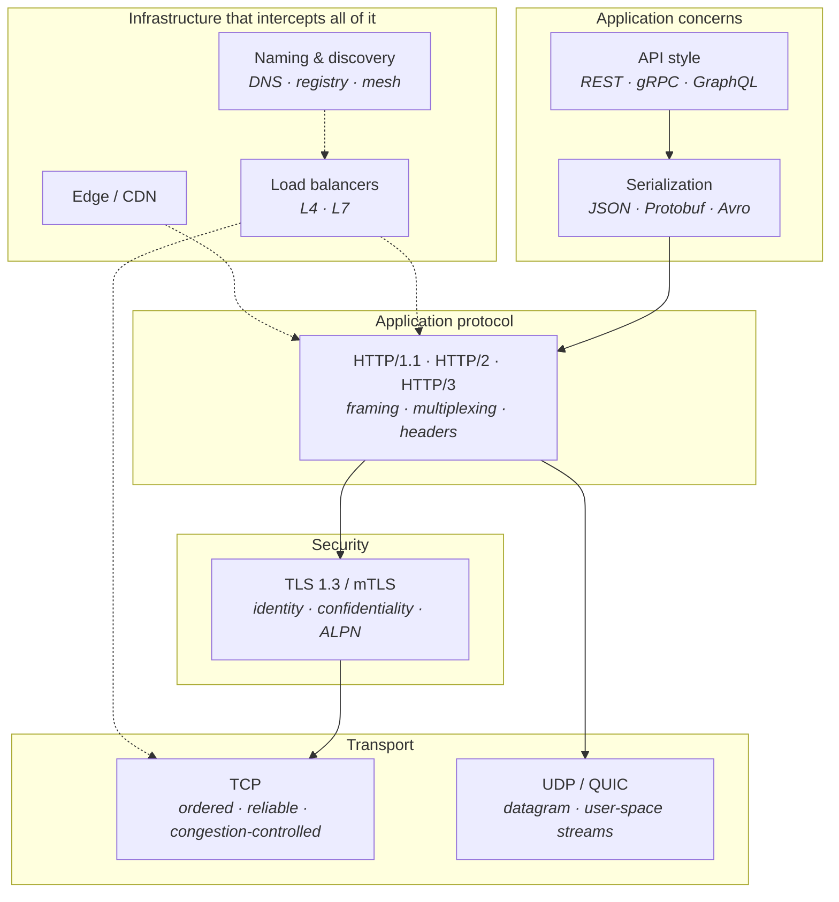
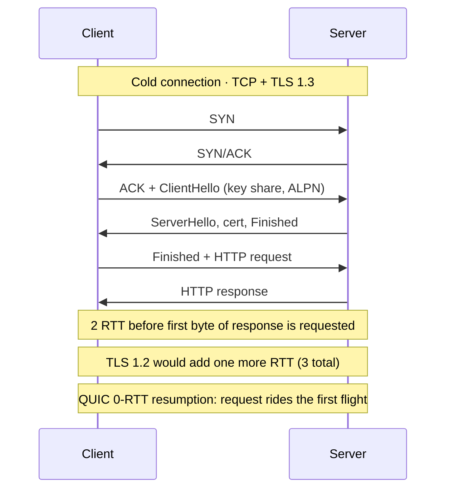
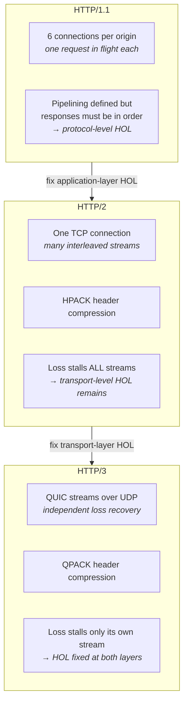
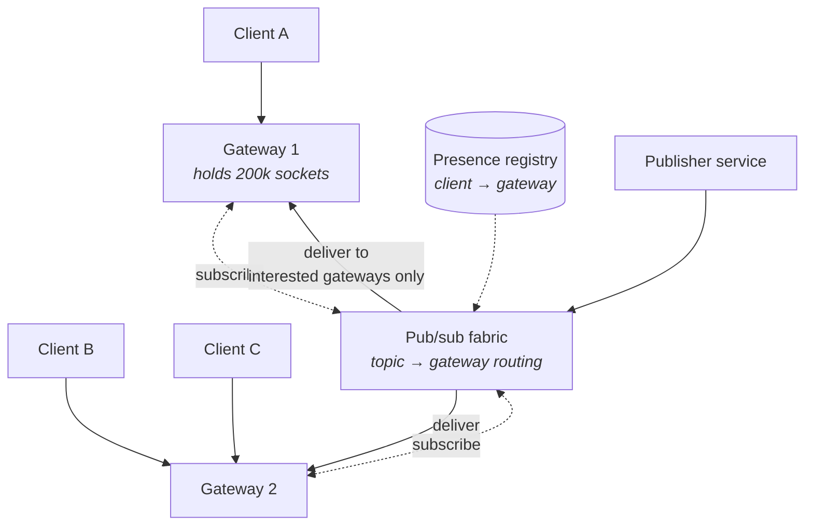
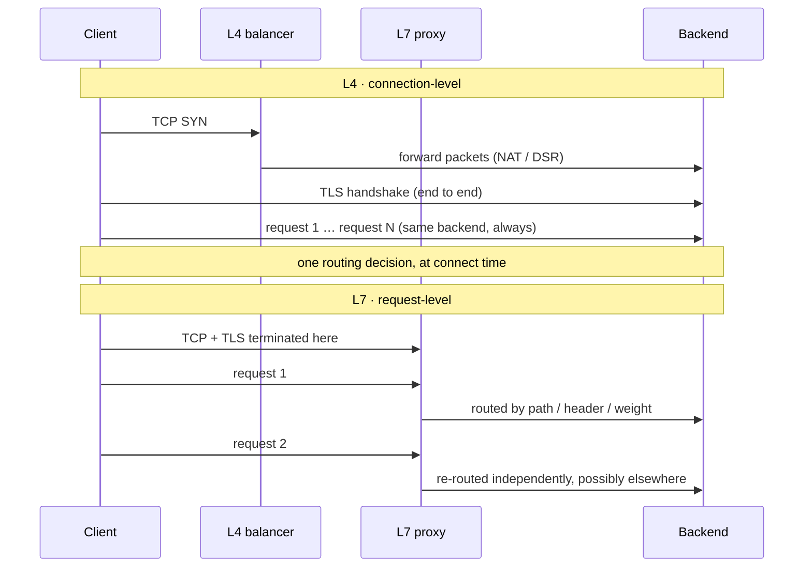
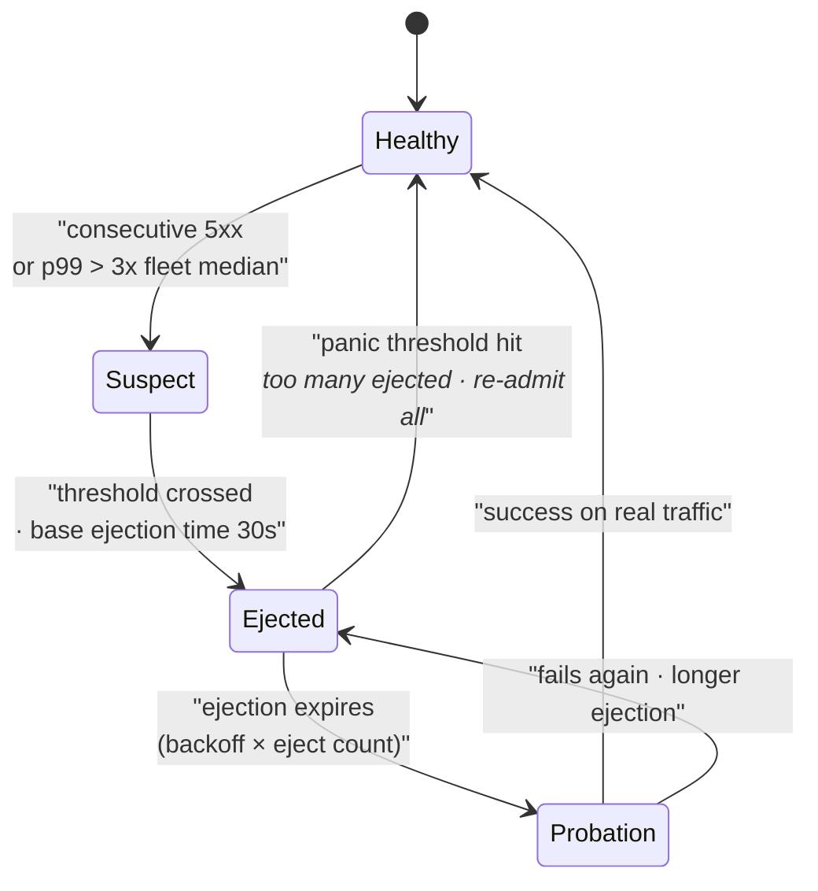
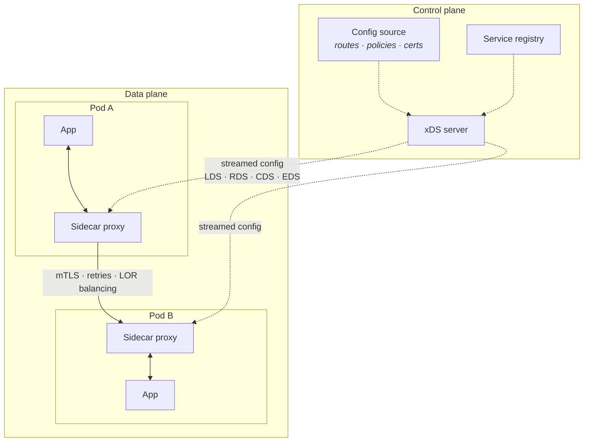
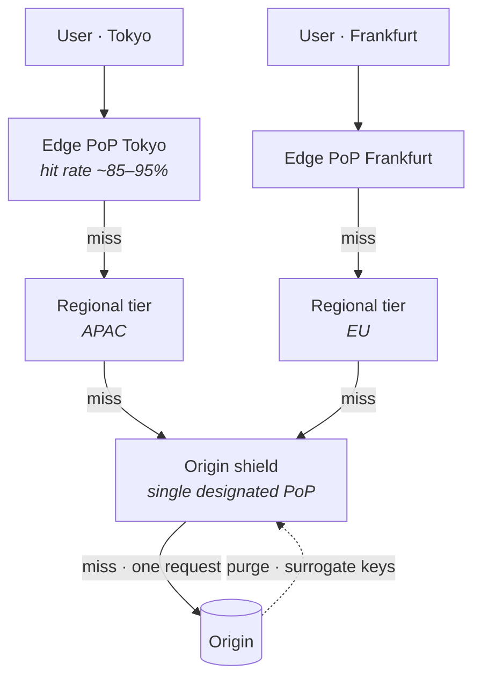

# Networking and Communication

Lecture 2 gave you the guarantees — linearizability, quorums, consensus, commit protocols. Every one of them is a statement about messages: who saw what, in what order, before which acknowledgement. This lecture is the wire those guarantees travel over. A quorum write is not "fast" or "slow" in the abstract; it is one TLS handshake plus two round trips plus a serialization pass plus whatever the load balancer decided to do with your connection.

It is also where your latency budget goes. In a typical request that touches three services and a database, the arithmetic and the storage I/O are usually a small minority of the wall clock. The rest is connection setup, queueing at proxies, serialization, and speed-of-light. Staff-level answers are expected to be *quantitative* about this — to know that a cold HTTPS request costs 3–4 round trips before a single byte of application data moves, and that this is why every serious system is obsessed with keeping connections warm.

## The layered picture

Before the details, fix the stack — because almost every networking question in an interview is really a question about *which layer owns a problem*.

**How to read it:**

- **The vertical chain is a cost stack.** A single request pays at every level: encode, frame, encrypt, segment, transmit. Optimizations at one level rarely help another — HTTP/2 multiplexing does nothing for TCP-level loss ([§ HTTP/1.1, HTTP/2, HTTP/3](#http11-http2-http3)).
- **The infrastructure boxes are transverse**, like the transaction manager in a DBMS. A load balancer is not a stage you pass once; it re-terminates connections, rewrites headers, and re-makes routing decisions, and each interception is a place where guarantees can be silently lost.
- **Head-of-line blocking appears at three different layers** — TCP segments, HTTP/1.1 request order, and application-level queueing. Naming *which* one a fix addresses is the single most reliable way to sound senior on this topic.

## TCP behavior your design actually depends on

TCP is usually taught as "reliable, ordered byte stream." That description is useless for design. What matters is the *cost profile* it imposes: how long before you can send, how fast you may send, and what happens when things go wrong.

### The three-way handshake

- **SYN → SYN/ACK → ACK.** The client cannot send application data until the second round trip begins — in practice **1 RTT of pure setup** before the first byte.
- On a 30 ms intra-continental path that is 30 ms; on a 150 ms transpacific path it is 150 ms, before TLS has even started.
- **TCP Fast Open (TFO)** allows data in the SYN using a cookie from a prior connection, saving that RTT. It is rarely deployable in practice because middleboxes drop unfamiliar SYN payloads — this is exactly the ossification that motivated QUIC ([§ UDP and QUIC](#udp-and-quic)).
- **The `accept` queue matters.** `net.core.somaxconn` and the listen backlog bound how many completed handshakes can wait for `accept()`. Overflow means silently dropped SYN/ACKs and client-side connect timeouts that look like packet loss.
- **SYN floods** are the reason `tcp_syncookies` exists: the server refuses to allocate state until the ACK proves the client can receive.

### Slow start and congestion control

- **TCP does not start fast.** It starts with an *initial congestion window* — **10 segments (~14.6 KB)** since RFC 6928, up from 3 — and doubles per RTT until loss or the slow-start threshold.
- **Consequence:** a 100 KB response on a fresh connection takes roughly 3 round trips just to ramp the window, regardless of available bandwidth. Bandwidth is not the constraint; the *window growth schedule* is.
- **The design implication:** a warm connection is not merely "saves a handshake" — it has a *grown congestion window*. This is the biggest and least-discussed reason connection reuse matters ([§ Connection management](#connection-management)).
- **Cubic** — the Linux default. Loss-based: it grows the window until packets drop, then backs off. On paths with deep buffers this fills them, producing **bufferbloat** — high throughput with terrible latency.
- **BBR** — model-based. It estimates bottleneck bandwidth and minimum RTT and paces to that estimate, so it does not need loss as a signal. Wins dramatically on lossy long-fat paths (Google reported multi-x throughput improvements on international links) and keeps queues shallow, so tail latency improves.
- **The honest trade-off:** BBR (v1 especially) can be *unfair* to Cubic flows sharing a bottleneck, taking more than its share. BBRv2/v3 address this. Choosing a congestion control is a decision about which flows you are willing to disadvantage.

### Head-of-line blocking, Nagle, and delayed ACK

- **TCP head-of-line blocking** — TCP delivers bytes *in order*. One lost segment stalls delivery of every subsequent byte already received, until the retransmission arrives. This is a property of the transport, and no application protocol running over TCP can escape it.
- **Nagle's algorithm** — coalesces small writes: don't send a new small segment while an unacknowledged small segment is outstanding. Designed to stop telnet from sending one packet per keystroke.
- **Delayed ACK** — the receiver waits (up to 40 ms on Linux, 200 ms on some stacks) before acking, hoping to piggyback the ACK on return data.
- **The pathological interaction:** the sender is waiting for an ACK before sending the rest of a small message; the receiver is waiting for more data before sending the ACK. Result: a **40 ms stall** on a request that should have taken microseconds — and it appears only in the tail, only for messages that split awkwardly.
- **What to do instead:** set `TCP_NODELAY` on any latency-sensitive socket. Every RPC framework does this by default. Also write each logical message with a **single** `write`/`writev` rather than header-then-body, which is the shape that triggers the interaction in the first place.

### Keepalives, half-open connections, and the silent peer

- **The core problem:** TCP is a *virtual* circuit. If the peer's machine loses power, or a NAT drops the mapping, or a firewall times out an idle flow, **nothing tells you**. The socket stays `ESTABLISHED` forever and the next write blocks or fails much later.
- **TCP keepalive** — probes after idle. Linux defaults are hostile: `tcp_keepalive_time = 7200` (2 hours), then 9 probes at 75 s. Detection takes **over two hours** with defaults. Tune to seconds/minutes, or don't rely on it.
- **Application-level heartbeats** are usually better: they traverse proxies, exercise the full path including the peer's event loop, and can detect a *hung* process — which TCP keepalive cannot, because the kernel answers probes even when the application is deadlocked.
- **NAT and cloud LB idle timeouts are the practical enemy.** AWS NLB idle timeout is 350 s; ALB defaults to 60 s; many NAT gateways sit at 300 s. Any pooled connection idle longer than that is silently dead. **Rule of thumb:** set your keepalive/heartbeat interval comfortably *below* the shortest idle timeout in the path.
- **The failure mode:** a connection pool full of half-open sockets. Every checkout hands out a corpse; requests fail one by one as each is discovered, producing a slow rolling outage that looks like partial packet loss.

## UDP and QUIC

### When loss tolerance beats ordering

- **UDP gives you framing and nothing else** — no ordering, no retransmission, no congestion control. You are responsible for all of it, which is a feature when TCP's choices are wrong for you.
- **Loss tolerance wins when data has a deadline.** In real-time voice or video, a packet that arrives after its playout time is worthless — retransmitting it wastes bandwidth *and* delays everything behind it. Better to conceal the loss and move on.
- **It also wins when each message is independent**: DNS queries, metrics/StatsD emission, syslog, NTP, gossip and failure-detection traffic (SWIM), game state updates. Losing one sample is cheap; head-of-line blocking a stream of them is not.
- **The obligation you inherit:** if you send at volume over UDP you *must* implement congestion control, or you are the reason someone else's traffic collapses. This is a real responsibility, not a formality.
- **Amplification is the security hazard** — a small spoofed request producing a large response makes you a DDoS reflector. DNS and NTP amplification attacks exist because of exactly this. Any UDP service must keep response size near request size until the source is validated.

### QUIC

QUIC is TCP's job re-implemented in user space over UDP, with the mistakes fixed. HTTP/3 is HTTP over QUIC.

- **Streams are first-class in the transport.** QUIC multiplexes independent streams, each with its own ordering and flow control. A lost packet stalls *only the stream(s)* whose bytes it carried — the other streams deliver. **This is the real fix for transport head-of-line blocking**, and it is the reason HTTP/3 exists at all ([§ HTTP/1.1, HTTP/2, HTTP/3](#http11-http2-http3)).
- **Handshake is merged with TLS 1.3.** QUIC has no separate transport handshake: crypto and transport setup happen together in **1 RTT** for a new connection — versus TCP's 1 RTT *plus* TLS 1.3's 1 RTT.
- **0-RTT resumption** — a returning client sends application data in its very first flight using a cached ticket. **0 round trips to first byte.** The cost: 0-RTT data is **replayable** by an attacker, so it must only carry idempotent operations. Sending a non-idempotent `POST` in 0-RTT is a correctness bug, not a performance tweak.
- **Connection migration** — QUIC connections are identified by a **connection ID**, not by the 4-tuple. Change networks (Wi-Fi to cellular), change NAT mapping, change source port — the connection survives. Under TCP, every one of those events kills the connection and forces a full re-handshake. For mobile clients this is transformative.
- **Its genuine costs:**
  - **CPU.** Congestion control, loss recovery, and per-packet crypto run in user space, not in kernel/NIC offload. Early deployments saw ~2x the CPU per byte of TCP+TLS; GSO/UDP offload has narrowed but not closed the gap.
  - **Middlebox hostility.** Some networks block or throttle UDP outright, so you need a TCP fallback path anyway.
  - **Operational blindness.** The transport headers are encrypted, so your existing packet-capture-based debugging does not work.
- **Where it pays:** lossy, high-latency, mobile, or long-haul client paths. Inside a datacenter with 0.01% loss and 0.2 ms RTT, QUIC's advantages largely evaporate and its CPU cost does not.

## TLS

### Handshake cost and how to avoid paying it

**Read the round-trip arithmetic, because it is the number you quote in an interview:**

- **TCP + TLS 1.2** — 1 RTT handshake + 2 RTT TLS = **3 RTT** before the request is even sent.
- **TCP + TLS 1.3** — 1 RTT + 1 RTT = **2 RTT**. TLS 1.3 removed a full round trip by having the client speculatively send a key share in `ClientHello`.
- **QUIC, new connection** — **1 RTT** total.
- **QUIC or TLS 1.3 with resumption (0-RTT)** — **0 RTT**; data rides the first packet.
- At a 100 ms RTT that spread is 300 ms versus 0 ms of pure setup, per cold connection. On a page that opens connections to six origins, this is the whole perceived load time.

**Session resumption — the two mechanisms:**

- **Session IDs** — the server stores state and the client presents an ID. Requires a shared session cache across your fleet, or the resumption fails whenever the load balancer picks a different server.
- **Session tickets** — the server encrypts the session state into an opaque blob the *client* stores. Stateless, so it works across a fleet, but **every server must share the ticket-encryption key**, and that key must be rotated (hours, not months) or it becomes a forward-secrecy hole.
- **The failure mode:** ticket keys that are per-instance and never shared. Resumption silently drops to ~0% and you pay the full handshake on every connection, with no error anywhere — only a raised handshake rate and CPU.

**ALPN — Application-Layer Protocol Negotiation:**

- A TLS extension in which the client lists protocols (`h2`, `http/1.1`, `h3`) in `ClientHello` and the server picks one — **inside the handshake, at no extra round trip**.
- Without ALPN, negotiating HTTP/2 would need an extra upgrade exchange. This is why HTTP/2 is effectively TLS-only in practice.
- **It matters operationally:** an L7 proxy that terminates TLS must offer the right ALPN list, or clients silently fall back to HTTP/1.1 and you lose multiplexing without a single log line.

### mTLS and certificate rotation

- **Mutual TLS** — both sides present certificates. The client's certificate *is* the service identity, cryptographically verified at connection setup rather than asserted by a header.
- **Why it matters:** it replaces network location as the authorization primitive. "It came from 10.0.4.0/24" is not an identity; "it presented a cert with SPIFFE ID `spiffe://prod/svc/checkout`" is. This is the foundation of zero-trust internal networking.
- **The cost is operational, not cryptographic.** Certificate *rotation* is the hard part:
  - Short-lived certs (hours to days) limit blast radius but require automated issuance — SPIFFE/SPIRE, Istio Citadel, Vault PKI, or cloud-native equivalents.
  - **The classic outage:** a CA certificate or intermediate expires. Every service in the mesh fails to authenticate simultaneously. There is no partial degradation and no rollback, because the expired artifact is baked into every workload. Expiry outages have taken down major providers repeatedly.
  - **What to do instead:** alert on *time to expiry* (weeks of headroom), not on failure; support overlapping trust bundles so a new root can be distributed and trusted *before* it is used to sign; and rehearse rotation, because you will do it under pressure otherwise.
- **Revocation is effectively broken at scale.** CRLs are huge and OCSP adds a network dependency to your handshake. The practical answer is **short lifetimes instead of revocation** — a cert that lives 24 hours does not need revoking.

## Connection management

Connections are expensive objects with a setup cost, a memory cost, and a scarcity limit. Most networking incidents are really connection-lifecycle incidents.

### Pooling and pool sizing

- **A pool amortizes** the handshake ([§ TLS](#tls)), the congestion-window ramp ([§ Slow start and congestion control](#slow-start-and-congestion-control)), and any per-connection authentication over many requests.
- **Warm pools** go further: pre-establish and periodically exercise connections so that the *first* request after a scale-up or a traffic shift does not pay cold cost. Without this, autoscaling produces a latency spike at exactly the moment you added capacity — the new instances have cold pools to every downstream.
- **Sizing is Little's Law, not intuition.** Concurrency = throughput × latency. 500 req/s at 20 ms average service time needs ~10 concurrent connections, not 200. Pools sized "generously" simply move queueing from your client into the server's thread pool, where it is less visible and less controllable.
- **An undersized pool is a queue**; an oversized pool is a *removed* queue, and removing the queue removes your backpressure. **Key distinction:** you want the queue where you can see it, bound it, and shed from it.
- **The multiplicative trap:** pool size is per client instance. 200 app instances × a pool of 50 = 10,000 connections at one database that supports 500. Pool math must be done fleet-wide, which is why a shared proxy (PgBouncer, ProxySQL, RDS Proxy) exists.

### Per-connection memory cost across components

- **Kernel socket buffers** — typically 64 KB–4 MB per socket per direction, autotuned. This is usually the dominant cost and the one people forget: 100k connections at even 128 KB combined is **12.8 GB of kernel memory** before any application state.
- **TLS session state** — record buffers plus keys, on the order of tens of KB per connection.
- **Proxy/LB state** — Envoy or NGINX hold per-connection buffers on both sides; a terminating proxy holds roughly *two* connections' worth per client.
- **Application/database state** — PostgreSQL forks a process per connection (megabytes each); a JVM service with thread-per-connection pays ~1 MB of stack per thread. **This is why connection counts, not query counts, are the binding constraint on many databases.**
- **Rule of thumb:** C10K-style connection counts require an event-loop architecture and deliberate buffer tuning. "It's just an idle connection" is false at every layer.

### Ephemeral port exhaustion and TIME_WAIT

- **The limit:** an outbound connection is identified by (src IP, src port, dst IP, dst port). With a fixed destination, you have only the source port — Linux default range `32768–60999`, about **28,000 ports per source IP per destination**.
- **TIME_WAIT** — the side that closes *actively* holds the 4-tuple for **2×MSL = 60 s on Linux**, so the port is unavailable for reuse against that destination during that window. At 500 new connections/sec to one backend you consume 30,000 tuples of TIME_WAIT state and exhaust the range.
- **Why TIME_WAIT exists** — to absorb delayed duplicate segments from the old connection and to guarantee the final ACK can be retransmitted. Disabling it is not free.
- **Fixes, in order of preference:**
  - **Reuse connections.** Almost every ephemeral-port incident is really an absence of keep-alive.
  - **Widen the range** (`net.ipv4.ip_local_port_range`) and enable `net.ipv4.tcp_tw_reuse` for outbound connections (safe; it reuses TIME_WAIT sockets for new outbound connections when timestamps prove ordering).
  - **Add destination diversity** — more backend IPs or ports multiplies the tuple space.
  - **Add source IP diversity** — multiple source addresses per host, or per-pod IPs.
  - **Never** `tcp_tw_recycle`. It broke behind NAT and was removed from Linux 4.12.
- **The failure mode:** it is invisible until it is total. `connect()` starts returning `EADDRNOTAVAIL` across the fleet at once, and because it is a *source-side* resource, the backend dashboards look perfectly healthy.

## HTTP/1.1, HTTP/2, HTTP/3

The version history is best understood as three successive attacks on head-of-line blocking, each fixing one layer and exposing the next.

**What each version actually fixed and left broken:**

- **HTTP/1.1 — one request per connection at a time.** Browsers worked around it with **6 parallel connections per origin**, which multiplies handshakes, multiplies congestion windows that each start cold, and multiplies server memory.
- **Pipelining** was specified — send request 2 before response 1 arrives — but responses must return **in request order**, so a slow first response blocks the rest. Combined with broken intermediaries, it was disabled everywhere. Treat it as a historical footnote with a lesson: *ordering constraints are what create HOL blocking, not the absence of concurrency.*
- **HTTP/2 multiplexes** many streams over one connection with binary framing, interleaved frames, per-stream flow control, and priorities. **The application layer's HOL blocking is gone.**
- **But HTTP/2 runs on TCP**, and TCP delivers in order. One lost segment stalls *every* multiplexed stream — arguably worse than HTTP/1.1's six connections, where loss on one connection did not stall the others. **This is the trap:** HTTP/2 is a clear win on clean networks and can be a *regression* on lossy ones.
- **HPACK** compresses headers against a shared dynamic table, cutting repeated cookie/user-agent overhead by ~80–90%. It is order-dependent, which is precisely why it could not be reused unchanged for HTTP/3.
- **HTTP/3 = HTTP over QUIC.** Streams are transport-level, so loss recovery is per-stream. **QPACK** re-solves header compression without requiring ordered delivery, at the cost of some encoder complexity and occasional blocking on dynamic-table references.
- **Server push (HTTP/2) is dead.** It over-pushed resources clients already had; Chrome removed support. `103 Early Hints` — telling the client what to preload while the origin thinks — replaced it and is the answer to give if asked.

| | HTTP/1.1 | HTTP/2 | **HTTP/3** |
|---|---|---|---|
| Transport | TCP | TCP | **QUIC / UDP** |
| Concurrency | ~6 conns/origin | streams on 1 conn | **streams on 1 conn** |
| App-layer HOL | yes | no | **no** |
| Transport HOL | per-connection | **whole connection** | **per-stream only** |
| Header compression | none (gzip'd bodies only) | HPACK | **QPACK** |
| Handshake to first byte | 2–3 RTT | 2–3 RTT | **1 RTT, or 0 on resume** |
| Connection migration | no | no | **yes (connection ID)** |
| CPU per byte | low | low | **higher (user-space)** |

**In an interview:** the crisp formulation is *HTTP/2 fixed head-of-line blocking at the protocol layer and inherited it from TCP; HTTP/3 moved the stream abstraction into the transport so it could fix it there too.*

## gRPC and binary RPC

### What gRPC is made of

- **Protobuf on the wire, HTTP/2 underneath.** Each call is an HTTP/2 stream; metadata rides in headers; the message is a length-prefixed binary frame.
- **Protobuf encoding** is tag-length-value with **varint** integers — small numbers cost 1 byte — and no field names on the wire. Typical payloads are **3–10x smaller than equivalent JSON** and parse several times faster, because there is no text scanning, no allocation-per-string-key, and generated code deserializes into fixed structs.
- **Four streaming modes**, and their existence is the main reason to choose gRPC over plain HTTP+JSON:
  - **Unary** — one request, one response. The ordinary RPC.
  - **Server streaming** — one request, a stream of responses. Subscriptions, large result sets, tailing.
  - **Client streaming** — a stream of requests, one response. Uploads, batched ingestion.
  - **Bidirectional streaming** — both directions independently. Interactive protocols, and how xDS ([§ Serialization and schema evolution](#serialization-and-schema-evolution)) works.
- **Deadlines, not timeouts — and the distinction is load-bearing.** A gRPC deadline is an *absolute* point in time propagated in metadata across every hop. Service A's remaining 40 ms is passed to B, which passes its remainder to C. When the deadline passes, everyone downstream cancels.
  - A per-hop *timeout*, by contrast, multiplies down the chain: three hops with a 1 s timeout each can take 3 s, and the client that gave up at 1 s never learns.
  - **The failure mode without deadline propagation:** the client times out and retries while the original request is still running downstream. Work accumulates that nobody is waiting for — the classic ingredient of a retry-driven metastable collapse ([§ Outlier detection and the cascading-ejection hazard](#outlier-detection-and-the-cascading-ejection-hazard)).
  - **Rule of thumb:** every service must accept a deadline, subtract its own budget, and pass the remainder. A service that starts a fresh timeout has broken the chain.

### Load balancing long-lived HTTP/2 connections

This is the most-asked gRPC gotcha, and it deserves its own space.

- **The problem:** an L4 load balancer balances *connections*. gRPC opens one long-lived HTTP/2 connection per backend and sends thousands of requests down it. So the L4 LB makes one balancing decision, at connect time, and then never again.
- **The visible symptom:** you scale from 10 to 20 backends and load does not move. The new pods sit idle because no client is opening new connections. Conversely, one unlucky backend gets a disproportionate share of a heavy client's traffic and stays hot forever.
- **Three real fixes:**
  - **L7 balancing** — a proxy that terminates HTTP/2 and balances *per request* (Envoy, Linkerd, a gRPC-aware ALB). Correct, at the cost of an extra hop and a proxy that must itself be scaled.
  - **Client-side balancing** — the client resolves all backend addresses, holds a subchannel to each, and picks per request. This is gRPC's native model ([§ Schema registries](#schema-registries)) and the lowest-latency answer.
  - **`MAX_CONNECTION_AGE`** — the server periodically sends `GOAWAY` (e.g. every 30 minutes with jitter) to force clients to re-resolve and reconnect. A blunt but effective way to make an L4 LB approximately fair. **Always jitter it**, or every connection in the fleet cycles simultaneously.
- **The general principle:** *the granularity of your load balancing is the granularity of the thing you balance.* Balance connections and you cannot balance requests.

## REST, GraphQL, and RPC style

### Resource versus procedure modeling

- **REST models resources** — nouns with a uniform verb set. `GET /orders/42`. Its real payoff is not aesthetics but **the infrastructure that understands it**: `GET` is cacheable by any CDN and proxy on earth, idempotency is defined by the method, and status codes are interpretable without knowing your domain.
- **RPC models procedures** — verbs. `CancelOrder(order_id)`. It fits naturally when the operation *is not* a state transition on a single resource, which is most internal service work. `POST /orders/42/cancel` is an RPC wearing a REST costume, and everyone knows it.
- **The honest split:** REST at the edge (cacheable, browser-friendly, publicly documented); RPC internally (typed, streaming, fast, versioned by schema rather than URL). Arguing for uniform purity in either direction is a red flag.
- **The genuine cost of REST** is **round trips and over/under-fetching**. A mobile screen assembled from five resources is five requests, and each returns fields the screen does not use.

### GraphQL and its specific hazards

- **What it buys:** one request, exactly the fields requested, a typed schema, and a single graph across multiple backends. It exists because mobile clients are round-trip-sensitive and product teams iterate faster than API teams ship endpoints.
- **What it costs:** you have handed clients a **query language**, which means you have handed them the ability to write expensive queries.
- **The N+1 problem** — a query for 100 users each with an `author` resolves 1 + 100 backend calls, because resolvers execute per-field per-object. **The fix is batching:** DataLoader-style per-request batching collects all `author` lookups in a tick and issues one batched call. This is not optional at any real scale; it is table stakes.
- **Query cost limits** — because a client can request nested connections that explode combinatorially:
  - **Depth limiting** — reject queries nested beyond N levels.
  - **Complexity scoring** — assign a cost per field, multiply by requested page sizes, reject above a budget. Cheaper than executing and killing.
  - **Rate limiting by cost, not by request count** — one GraphQL request is not one unit of work.
- **Persisted queries** — clients register queries at build time and send a hash at runtime. This gives you: smaller requests, an **allow-list** (arbitrary queries become impossible), and `GET`-able queries that a **CDN can cache** — recovering the one thing GraphQL otherwise throws away.
- **The other thing it throws away** is HTTP-level caching in general: everything is a `POST` to `/graphql`, so status codes are uniformly 200 (errors live in the body) and no intermediary can help you. Persisted queries plus explicit cache-control at the resolver layer is the recovery path.

## Server push and realtime transports

### The three mechanisms

- **Long polling** — the client issues a request; the server holds it open until data or timeout, then the client immediately re-requests. Works through every proxy ever built. Costs a held connection *plus* a request/response cycle per message, and a gap between responses where events must be buffered server-side.
- **Server-Sent Events (SSE)** — one long-lived HTTP response, `text/event-stream`, server writes events as they occur. **Unidirectional**, plain HTTP, auto-reconnects with `Last-Event-ID` for resumption, and works with every HTTP intermediary. Vastly underrated: most "realtime" features are server→client only, and SSE is the simplest correct answer. Its one historical wart — the 6-connection-per-origin limit — disappears under HTTP/2.
- **WebSocket** — an HTTP `Upgrade` to a full-duplex binary/text frame protocol. Necessary when the client also sends at high rate (collaborative editing, games, trading). Costs: it bypasses HTTP semantics entirely, so your proxies, auth middleware, tracing, and load balancers must all be taught about it separately.
- **Choosing:** if the client only receives, use SSE. If both directions are chatty, use WebSocket. Long polling is the fallback for hostile networks. gRPC server-streaming covers the same ground service-to-service.

### Connection-state cost and fan-out routing

**What this architecture is buying:**

- **Separate the socket tier from the logic tier.** Gateways are stateful and long-lived; business services are stateless and deployable. If they are the same process, every deploy disconnects every client — a self-inflicted thundering herd.
- **The presence registry** maps client → gateway so a targeted message reaches one gateway instead of being broadcast to all of them. Without it, fan-out is O(gateways) per message and you have built a broadcast network by accident.
- **Subscription state is the real cost**, not the socket. A socket is buffers; a subscription is an entry in a routing structure that must be updated on every connect, disconnect, and topic change — at churn rates far higher than the message rate on mobile networks.
- **The failure mode is reconnect storms.** Drop a gateway holding 200k connections and all 200k clients reconnect at once, each re-authenticating and re-subscribing. **What to do instead:** exponential backoff *with jitter* mandated in the client, connection draining on deploy (stop accepting, let clients migrate over minutes), and capacity headroom sized for losing one gateway's worth of clients at once.
- **Sizing anchor:** a tuned event-loop gateway holds roughly **100k–1M** connections per node, bounded by memory ([§ Per-connection memory cost across components](#per-connection-memory-cost-across-components)) far more than by CPU. Budget your fleet on socket memory and reconnect-storm headroom, not on steady-state message throughput.

## Serialization and schema evolution

### Formats and what distinguishes them

- **JSON** — self-describing, human-readable, universal. Costs: field names repeated on every record, no native integer/binary/date types, and parsing is a hot spot at high QPS.
- **Protobuf** — schema-required, tag-numbered, varint-encoded, code-generated. The default for service-to-service RPC.
- **Avro** — schema-required, and *no tags at all*: fields are positional, so the reader must have the **writer's schema**. Pairs with a schema registry by design. Extremely compact, and the standard choice for Kafka and data-lake pipelines.
- **Thrift** — Protobuf's contemporary from Facebook; comparable encoding, bundles an RPC framework, largely displaced by gRPC.
- **MessagePack** — "binary JSON": self-describing, schemaless, ~20–50% smaller than JSON. Useful when you want JSON's flexibility with fewer bytes and no schema pipeline.
- **Parquet** — not a message format at all. **Columnar, on-disk, block-oriented**, with per-column encoding, compression, and min/max statistics for predicate pushdown. It optimizes analytical scans, not RPC. Mentioning it in the same breath as Protobuf is a category error unless you name the difference.

**Key distinction — self-describing versus schema-required:**

- **Self-describing** (JSON, MessagePack, BSON) — the bytes carry field names. Any reader can parse without out-of-band knowledge. You pay for it on every single record, forever.
- **Schema-required** (Protobuf, Avro, Thrift) — the bytes carry tags or nothing at all. Compact and fast, but a consumer without the schema sees noise, and schema distribution becomes infrastructure you must operate.
- **The trade is: per-message bytes versus operational coupling.** At 10 req/s the self-describing format is obviously right. At 1M msg/s the schema registry pays for itself many times over.

### Compatibility rules

Define these precisely, because the terms are routinely confused and interviewers check.

- **Backward compatible** — a **new reader** can read **old data**. Required when you upgrade consumers first.
- **Forward compatible** — an **old reader** can read **new data**. Required when you upgrade producers first, and it is the harder property.
- **Full compatibility** — both. What you need when producers and consumers deploy independently and in arbitrary order — which is the normal condition in a microservice fleet.
- **The mnemonic:** *backward looks at old data, forward looks at new data.* Name which side you are upgrading first and the requirement follows.

**The mechanical rules that deliver it (Protobuf-flavoured, but general):**

- **Never reuse a field number.** A tag is the field's true identity; the name is a comment. Reusing tag `7` for a new meaning makes old readers silently deserialize garbage into a valid-looking field — no error, wrong data.
- **`reserved 7, 9 to 11; reserved "old_name";`** — mark deleted tags reserved so the compiler blocks reuse. This one line prevents the entire class of bug above.
- **Only add optional fields with defaults.** Adding a required field breaks every old writer. Proto3 makes everything optional precisely for this reason — and the price is that you cannot distinguish "unset" from "zero" without a wrapper type or explicit `optional`.
- **Never change a field's type** in an incompatible way. Widening `int32`→`int64` is safe in Protobuf because both are varints; `int`→`string` is not.
- **Unknown fields must be preserved, not dropped.** If an intermediate service parses, modifies, and re-serializes a message, and its library discards unknown fields, a new field added upstream is **silently deleted in transit**. Proto3 restored unknown-field retention in 3.5 for exactly this reason. This is one of the nastiest data-loss bugs in distributed systems because nothing errors.
- **Avro's rules differ** — compatibility is resolved by matching field *names* between reader and writer schemas, with defaults filling gaps. Renaming a field in Avro is a breaking change; in Protobuf it is a no-op.

### Schema registries

- **What it is:** a service holding versioned schemas by subject, where producers register and consumers fetch. Messages carry a small **schema ID**, not the schema.
- **What it buys:**
  - **Compatibility enforcement at registration time** — the registry rejects an incompatible schema *before* it can be deployed, converting a runtime production failure into a CI failure. This is the whole point.
  - **Avro is unusable without it** at scale, because readers need writers' schemas.
  - Configurable policy per subject: `BACKWARD`, `FORWARD`, `FULL`, and transitive variants that check against *all* prior versions rather than only the previous one.
- **The costs:** it is a runtime dependency on the data path (cache aggressively, fail open on read), and enforcement can be bypassed by anyone who registers with compatibility disabled — so make the policy a reviewed, locked configuration.

### Encoding cost at high QPS

- **Serialization is CPU, and CPU is your fleet size.** At 100k msg/s, shaving 10 µs per message per direction saves roughly a full core; encode and decode both happen, often several times along a request path.
- **Rough anchors** (order of magnitude, hardware-dependent): JSON parse ~100–500 MB/s; Protobuf parse ~1–3 GB/s; a hand-tuned zero-copy format (FlatBuffers, Cap'n Proto) approaches memory bandwidth because parsing is *pointer arithmetic* rather than a pass over bytes.
- **The often-missed cost is allocation and GC**, not the parse loop. JSON parsing allocates a string per key per record; in a managed runtime the garbage collector, not the parser, shows up in your profile.

**Compression — pick by where the bottleneck is:**

- **gzip / DEFLATE** — ~30–60 MB/s compress, best ratio of the classic three. Correct when the network is the constraint and CPU is not: cross-region, egress-billed, or client-facing traffic.
- **snappy** — ~250–500 MB/s, modest ratio. Designed for "make it smaller without thinking about it." Common in Kafka and column stores.
- **lz4** — ~400–800 MB/s, ratio similar to snappy, decompression often >2 GB/s. The choice when decompression speed dominates.
- **zstd** — the modern default. Tunable across the whole curve: level 1 is lz4-class speed, level 3 (the default) beats gzip's ratio at several times gzip's speed, level 19 for archival. **If you are choosing today with no other constraint, choose zstd.**
- **Dictionary compression** is the underused trick: for many small similar messages, a pre-trained zstd dictionary can double or triple the ratio, because individual messages are too short to build a useful window.
- **The trap:** compressing already-compressed or tiny payloads. Below ~1 KB, framing overhead and CPU exceed the savings. Set a minimum-size threshold — every mature HTTP server has one, and it is often left at a bad default.

## Load balancing

### L4 versus L7

**What the two layers can and cannot do:**

- **L4 balances connections.** It sees IP and port, not content. Cheap (millions of packets/sec, often kernel or hardware), preserves end-to-end TLS, and adds sub-millisecond latency. **It cannot** route by path or header, retry a failed request, or rebalance a long-lived connection ([§ Load balancing long-lived HTTP/2 connections](#load-balancing-long-lived-http2-connections)).
- **L7 balances requests.** It terminates TLS, parses HTTP, and decides per request. It can do path routing, header-based canaries, retries, timeouts, circuit breaking, rate limiting, and request-level observability. **It costs** an extra hop, TLS termination CPU, more memory per connection, and it becomes a component that can itself fail or saturate.
- **Terminating TLS at L7 is a security decision, not just a performance one.** Traffic is plaintext inside the proxy. In a zero-trust environment you re-encrypt to the backend, which means the proxy holds credentials for everything.
- **Rule of thumb:** L4 at the edge for raw throughput and DDoS absorption; L7 behind it for anything requiring request semantics. Most large architectures run both, in that order.

**The other addressing-layer options:**

- **DNS-based balancing** — return multiple A records or rotate them. Zero infrastructure, but the granularity is a DNS TTL and clients cache aggressively and ignore your TTLs ([§ CDN architecture](#cdn-architecture)). Fine for coarse distribution, unusable as a failure response.
- **Anycast** — the same IP announced from many locations; BGP delivers each client to the topologically nearest one. Gives you **automatic geographic routing and DDoS absorption** across your whole network footprint. The caveat: a BGP route change mid-connection re-routes packets to a different PoP, killing TCP state. Fine for UDP/DNS, historically risky for long TCP flows — and one of QUIC's connection-migration wins.
- **Hardware LBs** — dedicated appliances (F5, Citrix). High throughput, fixed capacity, long change cycles, and a scaling ceiling you buy your way past.
- **Software LBs** — Envoy, HAProxy, NGINX, plus kernel-level (IPVS) and eBPF/XDP-based (Katran, Cilium). Elastic, configurable via API, and now fast enough that hardware is a niche.

### Algorithms

- **Round robin** — next backend in rotation. Correct only if requests cost the same and backends are identical. Neither is usually true, and it has zero feedback: a backend that is dying still receives its full share.
- **Least connections** — send to the backend with the fewest open connections. Better, but a proxy for load rather than a measurement of it — a backend with many cheap connections looks busier than one with few expensive ones. It also fails badly with long-lived connections ([§ Load balancing long-lived HTTP/2 connections](#load-balancing-long-lived-http2-connections)), where connection count is nearly constant.
- **Least outstanding requests (LOR / least request)** — fewest *in-flight requests*. This is the one you want in an L7 proxy: it tracks actual concurrency, and a slow backend naturally accumulates in-flight requests and receives less traffic. Envoy's `LEAST_REQUEST` is this.
- **The self-correcting property is the point.** LOR handles a partially-degraded backend without any health check firing, because slowness *is* the signal.

**Power of two choices — why it beats naive least-loaded:**

- **The algorithm:** pick two backends at random, send to the less loaded of the two.
- **The result:** maximum load drops from `O(log n / log log n)` (pure random) to `O(log log n)` — exponentially better — with only two probes.
- **Why not just pick the globally least-loaded?** Two reasons, and both are practical rather than theoretical:
  - **Stale state causes herding.** Every client sees the same "least loaded" backend and stampedes it simultaneously. The backend that was idle is now overwhelmed, load information updates, and everyone stampedes the next one. This oscillation is a real and common outage shape.
  - **Global state is expensive** to gather and is always out of date at the moment you use it.
- **Two random choices breaks the herd** because different clients sample different pairs, while still avoiding the worst backends with high probability. **It is the standard answer**, and knowing *why* — herding, not accuracy — is what distinguishes a good answer.

**Consistent hashing with bounded loads:**

- **Plain consistent hashing** maps keys and nodes onto a ring; a key goes to the next node clockwise. Adding or removing a node relocates only ~`1/n` of keys instead of everything. **Virtual nodes** (100–200 per physical node) smooth the otherwise lumpy distribution.
- **Why you want it in a load balancer:** cache affinity. Routing a given key to a consistent backend means that backend's local cache is warm for it — this is how CDN tiers and sharded caches route.
- **Its failure mode is hot keys.** Consistent hashing guarantees *placement* stability, not load balance. One viral key pins to one node and melts it while the ring says everything is fine.
- **Bounded-load consistent hashing** (Mirrokni et al., used by Vimeo/Haproxy and Google) adds a cap: a node may not exceed `(1 + ε)` times average load. Overflow spills to the next node on the ring. **You keep most of the affinity and get a hard ceiling on imbalance** — with `ε = 0.25`, no node exceeds 125% of average. This is the mature answer to "consistent hashing but my keys are skewed."

## Health checking, discovery-driven ejection, and traffic shaping

### Health checking

- **Active health checks** — the balancer probes each backend on an interval (`/healthz` every 5–10 s). Predictable and independent of traffic, but it costs `backends × checkers` probes per interval, and at large fleet sizes the health-check traffic becomes a significant load in its own right.
- **Passive health checks** — infer health from real request outcomes. Free, immediate, and reflects what clients actually experience. Requires traffic to work, so a backend receiving nothing is never evaluated.
- **Use both:** passive for fast detection on live traffic, active to re-admit an ejected backend and to cover idle ones.
- **Shallow check** — "the process is listening and the event loop turns." Cheap, and it says almost nothing.
- **Deep check** — "I can reach my database, my cache, and my downstream dependency."

**The trap with deep checks — and it is a big one:**

- A deep check makes your health *transitive*. If the shared database has a hiccup, **every** backend fails its check simultaneously, the balancer ejects **all** of them, and a partial degradation becomes a total outage. You converted "slow" into "no capacity."
- **What to do instead:** deep checks should influence *readiness for new traffic*, not liveness, and ejection must be bounded ([§ Outlier detection and the cascading-ejection hazard](#outlier-detection-and-the-cascading-ejection-hazard)). Kubernetes' split is exactly this: a failing **liveness** probe restarts the container — so a shared-dependency blip becomes a fleet-wide crash loop — while a failing **readiness** probe merely removes it from the endpoint list. Deep checks belong in readiness, never in liveness.
- **The pattern that works:** report *degraded* rather than *unhealthy*, and let the balancer weight it down instead of removing it. Serving errors on 10% of requests beats serving nothing.

### Outlier detection and the cascading-ejection hazard

**Read the panic-threshold edge carefully — it is the whole safety mechanism:**

- **Outlier detection** ejects backends that misbehave relative to their peers: consecutive 5xxs, consecutive gateway failures, or success-rate/latency statistically below the fleet distribution. It catches the grey failures a binary health check misses.
- **The cascading-ejection hazard:** a fleet is overloaded, so the slowest instances get ejected, so their traffic redistributes onto the remaining instances, which are now *more* overloaded, so more get ejected. The fleet ejects itself to zero in a couple of minutes. **This is a real, repeated outage shape, not a hypothetical.**
- **The guard is a maximum ejection percentage.** Envoy's `max_ejection_percent` (default 10%) refuses to eject beyond a fraction of the fleet. Its **panic threshold** goes further: if fewer than a configured share of hosts (default 50%) are healthy, the balancer *ignores health status entirely* and load-balances across everything. The reasoning is sound — when most of the fleet looks unhealthy, the problem is probably not the fleet.
- **Exponential backoff on re-ejection** prevents flapping: a host ejected repeatedly stays out longer each time.
- **Rule of thumb:** never let any automated removal mechanism be able to remove everything. Every ejector needs a floor.

### Traffic shaping

- **Weighted routing** — assign percentages to backend groups. The primitive under everything below.
- **Canary** — route 1% → 5% → 25% → 100% to a new version, watching error rate and latency between steps. **The subtlety:** 1% of traffic may not exercise the failing path at all, so canaries must run long enough and be evaluated on comparable *cohorts*, not aggregate metrics — otherwise the canary's own low volume hides the regression.
- **Blue/green** — two full environments, flip traffic wholesale. Instant rollback, at the cost of double capacity and a **shared-database problem**: schema changes must be compatible with both versions simultaneously ([§ Compatibility rules](#compatibility-rules) is the same problem in a different dress).
- **Shadow / mirror traffic** — copy live requests to the new version and discard its responses. Real production traffic shape, zero user risk, and the only honest way to load-test a rewrite. **Two hazards:** shadowed writes hit real downstream state unless carefully sandboxed, and mirroring doubles the load on shared dependencies.

**Request hedging and its amplification risk:**

- **The mechanism:** if a request has not returned by the p95 latency, send a second copy to a different backend and take whichever answers first. This directly attacks tail latency, since the probability of *two* independent requests both being slow is much lower than one. Dean and Barroso's "The Tail at Scale" is the canonical reference, and the reported effect is dramatic — near-p95 latency at the p99.9.
- **The cost is bounded and small by construction:** hedging at p95 adds ~5% extra load in steady state.
- **The amplification risk is the interview point:** when the system is overloaded, *everything* exceeds p95, so *every* request hedges, and load instantly doubles at the worst possible moment. Overload becomes collapse. This is a textbook metastable failure — the system had a stable degraded state and the hedging policy pushed it into an unstable one.
- **What to do instead:** enforce a **hedge budget** — cap hedged requests at a small fraction of total (gRPC's `hedgingDelay` with `maxAttempts` and a retry-throughput budget; Envoy's retry budgets do the same for retries). The rule generalizes: **any mechanism that generates extra load in response to slowness must have a global budget, not just a per-request rule.**
- **Only hedge idempotent operations.** A hedged non-idempotent write executes twice.

## Client-side load balancing and service mesh

### The control-plane / data-plane split

**What the split actually gives you:**

- **The data plane is on the request path; the control plane is not.** Every proxy caches its configuration and keeps serving if the control plane dies. **This is non-negotiable** — a control plane on the request path is a single point of failure for every request in the fleet.
- **xDS** is the discovery protocol family: **LDS** (listeners), **RDS** (routes), **CDS** (clusters), **EDS** (endpoints), **SDS** (secrets/certs), delivered over a bidirectional gRPC stream so changes push in milliseconds rather than waiting for a poll. **ADS** (aggregated) puts them on one stream to guarantee ordering — otherwise a route can reference a cluster that has not arrived yet.
- **The sidecar moves cross-cutting concerns out of every language runtime.** Retries, timeouts, mTLS, circuit breaking, and consistent metrics get implemented once in the proxy instead of N times across your polyglot fleet. That deduplication is the mesh's actual value proposition.
- **Client-side balancing without a sidecar** is the same idea in a library (gRPC's built-in resolver + LB policy, Finagle, Ribbon historically): the client holds subchannels to all endpoints and picks per request, with **zero extra network hops**. Fastest possible, but you now maintain that library for every language you use — which is exactly the problem the sidecar solves.

### Mesh overhead and when it is not worth it

- **Latency** — a sidecar on each side means two extra proxy traversals per call. Envoy adds roughly **0.5–3 ms** at p99 per hop when properly tuned. On a 100 ms user request this is noise; on a 2 ms internal cache lookup it is a **2x regression**.
- **Resources** — each sidecar is typically 50–150 MB of memory and a fraction of a core. At 5,000 pods that is hundreds of gigabytes and dozens of cores spent on proxying.
- **Complexity** — you have added a distributed system whose failure modes your team must learn: config propagation lag, xDS version skew, startup ordering races (the app calling out before the sidecar is ready), and a second set of certificates to rotate ([§ mTLS and certificate rotation](#mtls-and-certificate-rotation)).
- **When it is not worth it:** small fleets, single-language shops (use the library), latency-critical paths measured in single-digit milliseconds, or teams without the operational capacity to run a control plane. **The honest position:** a mesh solves *organizational* problems — polyglot consistency, uniform policy, org-wide mTLS — more than technical ones. If you do not have those problems, you are paying for a solution you do not need.
- **Sidecar-less variants** (ambient mesh, eBPF-based) trade some feature completeness for much lower per-pod overhead, and are the direction the field is moving.

## Edge and content delivery

### CDN architecture

**Why the tiers exist — each one solves a distinct problem:**

- **PoPs (points of presence)** put bytes physically near users. The dominant win is *not* bandwidth but **RTT**: 5 ms instead of 150 ms, which compounds across handshake, slow start, and every round trip in the page.
- **Without tiering, a miss is a thundering herd.** 200 PoPs each missing on the same newly-published object send 200 requests to origin for one file. Regional tiers collapse that to a handful.
- **Origin shield** is one designated PoP through which all misses funnel, so the origin sees **one** request per object regardless of global demand. It is the single highest-leverage CDN setting, and it is off by default in most products.
- **Typical hit rates:** 85–95% for static assets, 60–80% for a well-configured dynamic/API cache. Do the arithmetic before optimizing: moving 90% → 95% halves origin load. Moving 95% → 97.5% halves it again. **Each incremental point of hit rate is worth exponentially more than the last.**

**Cache keys, `Vary`, and cardinality explosion:**

- **The cache key** defaults to (host, path, query) and determines what counts as "the same object." Everything about CDN effectiveness reduces to controlling this key.
- **`Vary` adds request headers to the key.** `Vary: Accept-Encoding` is fine — 2–3 variants. `Vary: User-Agent` is a **catastrophe**: thousands of distinct UA strings means thousands of copies of one object, a hit rate near zero, and an origin taking full traffic while your CDN dashboard shows a healthy-looking cache full of unique objects.
- **`Vary: Cookie` is the same disaster**, one variant per user. If content genuinely differs per user, it is not CDN-cacheable — normalize instead: strip the cookie at the edge for public paths, or hash only the specific cookie value that matters.
- **Query parameters are the other explosion source.** `?utm_source=…` produces a distinct cached copy per campaign of an identical asset. **What to do instead:** configure an explicit allow-list of cache-key query parameters and sort them, rather than accepting whatever arrives.
- **Normalize aggressively at the edge**: lowercase the host, strip tracking parameters, bucket `Accept-Language` to supported locales, and reduce device detection to two or three classes.

### Cache-control semantics

- **`max-age` / `s-maxage`** — freshness lifetime for shared caches (`s-maxage`) versus all caches (`max-age`). Set them separately: a long CDN TTL with a short browser TTL gives you offload *and* the ability to purge.
- **`stale-while-revalidate=N`** — after expiry, serve the stale copy immediately and refresh in the background for up to `N` seconds. **The user never waits for the origin.** This single directive converts your p99 on cache-expiry from an origin round trip into an edge hit, and it also prevents the **cache stampede** where thousands of simultaneous requests for a just-expired object all go to origin.
- **`stale-if-error=N`** — if the origin returns 5xx or is unreachable, serve the stale copy for up to `N` seconds. **This is availability insurance costing one header.** With a generous value, an origin outage becomes invisible for cached content. Every CDN configuration should have it; most do not.
- **`private` / `no-store` / `no-cache`** — and note that `no-cache` does *not* mean "do not cache." It means "revalidate before serving." `no-store` is the one that means what people think `no-cache` means. Getting this wrong leaks personal data into shared caches, which is the classic CDN security incident.
- **ETags and conditional requests** — the origin returns `ETag: "abc"`; the client later sends `If-None-Match: "abc"` and gets a **304 Not Modified** with no body. Saves bandwidth, not round trips — you still pay the RTT. `Last-Modified` / `If-Modified-Since` is the weaker, second-granularity equivalent.
  - **The trap:** ETags generated from non-deterministic content (a timestamp, an inode, a hash including the serving hostname) differ across origin servers, so revalidation always misses and every conditional request returns a full body. Generate ETags from content, deterministically, or not at all.

### Invalidation

- **Purge by URL** — precise, but you must know every URL, including every variant produced by `Vary` and every query-parameter permutation. Fine for a handful of objects, unworkable for "everything that mentions product 42."
- **Purge by tag / surrogate key** — the origin returns `Surrogate-Key: product-42 category-shoes homepage` on each response; later you purge the key and every response tagged with it dies at once, globally, typically in **under a second** on modern CDNs. **This is the mechanism that makes caching HTML viable**, because it lets you cache aggressively and invalidate precisely on write. Fastly popularized it; most CDNs now offer an equivalent.
- **Purge everything** — the emergency lever. It also removes your protection: the origin immediately takes 100% of traffic with cold caches everywhere. Treat it as an incident action with known origin capacity, not a deploy step.
- **Versioned URLs as invalidation avoidance** — `/app.9f2a1c.js` with `Cache-Control: max-age=31536000, immutable`. The content hash is in the name, so a new version is a *different object* and there is nothing to invalidate. **This is strictly better than invalidation where it applies** — no purge latency, no cross-CDN coordination, no stale-client window. It applies to any content you can rename on publish: static assets, images, config bundles. It does not apply to canonical URLs users bookmark, which is where tag purging earns its place.

### Edge compute

- **Where to put logic — the decision is about what data the logic needs:**
  - **Client** — zero latency and zero server cost, but untrusted, unversioned once shipped, and constrained by device capability. Never put authorization here.
  - **Edge** — a few milliseconds from the user, runs on every request, with access to request metadata and small distributed state. Right for auth token validation, A/B bucketing, redirects, header normalization, request routing, personalization of otherwise-cacheable content, and bot filtering.
  - **Origin** — full access to your data, transactions, and consistency guarantees. Right for anything authoritative.
- **The heuristic:** push logic edge-ward until it needs strongly consistent data or a large dataset. That boundary is where the edge stops helping.
- **State at the edge and its consistency limits** — this is the honest constraint:
  - Edge KV stores (Cloudflare KV, similar) are **eventually consistent**, with propagation typically measured in seconds to a minute. Excellent for configuration, feature flags, routing tables, and content — anything read constantly and written rarely.
  - **They are not suitable for counters, quotas, inventory, or anything requiring read-modify-write**, because you have hundreds of replicas with no coordination. Rate limiting at the edge is *approximate per PoP*, not global; if you need a global limit, either accept the multiplier (limit × PoP count in the worst case) or coordinate centrally and pay the latency.
  - **The primitives that do work at the edge** are the ones from Lecture 2 that tolerate weak consistency: CRDTs, idempotent writes, and single-writer-per-key designs (Durable Objects and their equivalents pin a key to one instance, buying linearizability for that key at the cost of that key's traffic crossing the network to wherever the instance lives).

## Naming, discovery, and addressing

### DNS

- **The resolution chain:** stub resolver → recursive resolver (ISP or public, e.g. `8.8.8.8`) → root → TLD → authoritative. Every hop caches, and **you control only the last one**.
- **TTL governs caching**, but as an upper bound *in theory* and a suggestion *in practice*:
  - Recursive resolvers frequently impose their own minimums and maximums, ignoring very low TTLs.
  - **The JVM historically cached DNS forever** (`networkaddress.cache.ttl = -1` under a security manager) — a legendary source of "we failed over and Java didn't notice." Always set it explicitly.
  - Browsers and OS stub resolvers keep their own caches with their own rules.
  - Connection pools do not re-resolve at all: an established connection holds an IP, and no TTL will ever move it. **This is the one people miss.**
- **Negative caching** — an `NXDOMAIN` is cached too, governed by the **SOA minimum** field, commonly 300–3600 s. Create a record after someone queried it and they may not see it for an hour. This is the actual mechanism behind "DNS propagation."
- **"DNS propagation" is a myth worth debunking precisely.** Nothing propagates and nothing is pushed. Authoritative servers update immediately; what you are waiting for is **caches expiring**, on schedules set by TTLs you published *previously*. **The consequence:** lowering TTL to 60 s the day you cut over does nothing — resolvers already hold the old record with the old TTL. Lower the TTL at least one old-TTL-period *before* the change.

**DNS as a failover mechanism and its limits:**

- **What it is good for:** planned migrations, coarse geographic steering, and gradual weighted shifts over minutes to hours.
- **What it is bad at — and this is the interview point:**
  - **Failover time is unbounded** because you cannot force caches to expire. Some clients will use the old address for hours.
  - **Existing connections are unaffected.** Long-lived connections keep talking to the dead address until they error.
  - **There is no health feedback in plain DNS.** Health-checked DNS (Route 53) helps, but only for *new* resolutions.
  - Very low TTLs cost you a resolution round trip on the request path and can be ignored anyway.
- **What to do instead:** use anycast, an L4/L7 balancer, or client-side retry with a second endpoint for fast failover; use DNS for the slow, planned, coarse-grained changes it is genuinely good at. **Rule of thumb:** if your failover plan's first step is "update DNS," your RTO is measured in tens of minutes at best.

### Service discovery

- **Registry-based** (Consul, etcd, ZooKeeper, Eureka) — instances register on start and heartbeat; clients query the registry. Rich metadata, fast propagation via watches, and health integrated. Costs: a strongly consistent registry on the discovery path is a critical dependency, so clients must **cache last-known-good endpoints and fail open** when the registry is unavailable.
- **DNS-based** (Kubernetes services, SRV records) — discovery through the resolver every client already has, in every language, with no library. Simple and universal. Costs: TTL-bounded staleness ([§ DNS](#dns)), limited metadata, and SRV records carry weight/priority but almost nothing consumes them properly.
- **Mesh-based** (xDS, [§ The control-plane / data-plane split](#the-control-plane--data-plane-split)) — the sidecar receives endpoints pushed over a stream, so the application never resolves anything. Fastest propagation and richest policy, at the price of running a control plane.
- **Health-state propagation delay is a correctness factor, not a performance detail.** Total time-to-remove is: `detection interval × failure threshold` + registry write + propagation to clients + client cache TTL. Each term is seconds; the sum is routinely **30–90 s**, and during that entire window some fraction of requests is routed into a black hole.
  - **The consequence:** discovery alone can never be your failure-handling mechanism. You also need **request-level** protection — timeouts, retries to a *different* endpoint, circuit breaking, and outlier ejection ([§ Outlier detection and the cascading-ejection hazard](#outlier-detection-and-the-cascading-ejection-hazard)) — because those act in milliseconds while discovery acts in tens of seconds.
  - **The opposite hazard:** making detection aggressive to shrink the window produces false positives, flapping registrations, and — combined with automated ejection — the cascade of [§ Outlier detection and the cascading-ejection hazard](#outlier-detection-and-the-cascading-ejection-hazard). There is a real floor here, and the answer is defense at the request level rather than an ever-faster detector.

### Multi-region addressing

- **GeoDNS** — the authoritative server returns different answers based on the *resolver's* location. **Its structural flaw:** it sees the resolver, not the client. A user on a public resolver may be geolocated to the resolver's location, potentially a continent away. **EDNS Client Subnet (ECS)** passes a truncated client subnet to fix this, at a privacy cost, and not every resolver sends it.
- **Anycast** — one IP, many locations, routing decided by BGP. No resolver involvement, so no GeoDNS flaw, and it absorbs volumetric DDoS by spreading it across every PoP. **But BGP optimizes for AS-path length, not latency**, so "nearest" is topological and occasionally wrong; and a route flap mid-flow breaks TCP connections ([§ L4 versus L7](#l4-versus-l7)).
- **Latency-based routing** — the provider measures actual observed latency from client networks to each region and routes on measurement rather than geography. More accurate than GeoDNS, because network distance is not physical distance. Still bounded by DNS caching.
- **Sticky routing for stateful sessions** — when a session's state lives in one region, subsequent requests must return there. Mechanisms, weakest to strongest:
  - **Cookie-based affinity** at the L7 proxy — the proxy sets a cookie naming the backend or region. Simple, works for browsers, useless for non-browser clients.
  - **Consistent hashing on a session or user key** ([§ Algorithms](#algorithms)) — no state at the proxy, and it survives proxy restarts. Prefer this.
  - **Explicit routing keys in the URL or path** — the honest version, used by systems that shard by tenant.
- **The cost of stickiness is what you must state:** it defeats load balancing (a hot session is stuck on a hot node), it complicates deploys (draining a node means migrating or dropping sessions), and it turns a single node's failure into visible user-facing state loss rather than a retry. **What to do instead where you can:** externalize session state to a shared store and stay stateless. Stickiness should be a *cache-affinity optimization* you can lose safely, not a *correctness requirement* you depend on.

## Numbers, systems, and named failure modes

Concrete anchors. These are the things worth having memorized.

**Latency and round-trip budget:**

- Same-datacenter RTT **0.2–0.5 ms**; cross-AZ **~1 ms**; US coast-to-coast **~60–70 ms**; transatlantic **~80 ms**; transpacific **~150 ms**. Speed of light in fiber is ~200,000 km/s and no engineering removes it.
- Cold HTTPS request over TLS 1.3: **2 RTT** setup; TLS 1.2: **3 RTT**; QUIC new: **1 RTT**; QUIC 0-RTT: **0**. At 150 ms RTT, that is a 300 ms difference before any work happens.
- TCP initial congestion window **10 segments ≈ 14.6 KB**; a 100 KB response needs ~3 RTT of window growth on a fresh connection.
- Delayed-ACK plus Nagle stall: **40 ms** on Linux, up to 200 ms elsewhere.

**Limits worth knowing:**

- Ephemeral ports: **~28,000** per (source IP, destination) with Linux defaults; TIME_WAIT holds each for **60 s**.
- AWS NLB idle timeout **350 s**, ALB default **60 s**; typical NAT gateway **300 s**. Keepalives must be shorter.
- Linux TCP keepalive default: first probe after **7200 s**. Effectively "never."
- Envoy `max_ejection_percent` default **10%**; panic threshold **50%** healthy.
- CDN static-asset hit rates **85–95%**; a well-tuned dynamic cache **60–80%**.

**Named failure modes to be able to describe:**

- **The 40 ms mystery** — Nagle × delayed ACK. Fixed by `TCP_NODELAY` and single-write message framing ([§ Head-of-line blocking, Nagle, and delayed ACK](#head-of-line-blocking-nagle-and-delayed-ack)).
- **The dead pool** — proxy or NAT idle timeout silently kills pooled connections; every checkout fails once ([§ Keepalives, half-open connections, and the silent peer](#keepalives-half-open-connections-and-the-silent-peer)).
- **Ephemeral port exhaustion** — `EADDRNOTAVAIL` fleet-wide, backend dashboards clean ([§ Ephemeral port exhaustion and TIME_WAIT](#ephemeral-port-exhaustion-and-time_wait)).
- **The gRPC scaling no-op** — new backends receive no traffic because L4 balanced connections, not requests ([§ Load balancing long-lived HTTP/2 connections](#load-balancing-long-lived-http2-connections)).
- **Vary explosion** — `Vary: User-Agent` or an unfiltered `utm_*` parameter takes hit rate to near zero while the cache looks busy ([§ CDN architecture](#cdn-architecture)).
- **The cert expiry outage** — an expired intermediate breaks every mTLS handshake in the mesh at once, with no partial degradation ([§ mTLS and certificate rotation](#mtls-and-certificate-rotation)).
- **Cascading ejection** — overload → eject slow hosts → redistribute → more overload → eject everything ([§ Outlier detection and the cascading-ejection hazard](#outlier-detection-and-the-cascading-ejection-hazard)).
- **Hedging amplification** — everything exceeds p95 under load, so everything hedges, doubling load exactly when you can least afford it ([§ Traffic shaping](#traffic-shaping)).
- **The GraphQL N+1** — one query, one hundred backend calls, no batching ([§ GraphQL and its specific hazards](#graphql-and-its-specific-hazards)).
- **Silent field deletion** — an intermediary parses and re-serializes a message with a library that drops unknown fields ([§ Compatibility rules](#compatibility-rules)).
- **DNS failover that isn't** — TTL lowered on the day of cutover, so nobody's cache knows; and existing connections never re-resolve regardless ([§ DNS](#dns)).
- **Reconnect storm** — one WebSocket gateway dies and 200k clients reconnect simultaneously without jittered backoff ([§ Connection-state cost and fan-out routing](#connection-state-cost-and-fan-out-routing)).

**Systems to name and what each is the canonical example of:**

- **Envoy** — the data-plane proxy; xDS, outlier detection, retry budgets, LOR balancing.
- **QUIC/HTTP/3 at Google and Cloudflare** — transport HOL blocking and connection migration solved in production at internet scale.
- **BBR** — congestion control as a model rather than a loss reaction; deployed for YouTube on lossy international paths.
- **Fastly surrogate keys** — tag-based purge that makes caching HTML practical.
- **gRPC deadline propagation** — the reference design for cross-service budgets.
- **Confluent Schema Registry** — compatibility enforced at registration, so evolution errors fail in CI rather than in production.

## Takeaways

- **Round trips, not bandwidth, are the budget.** Handshakes, window growth, and per-hop latency dominate; the fix is always fewer round trips (keep connections warm, resume sessions, move bytes closer) rather than a fatter pipe.
- **Head-of-line blocking lives at a specific layer, and every protocol generation fixed exactly one.** HTTP/2 fixed the application layer and inherited TCP's; HTTP/3 moved streams into the transport to fix both. Naming the layer is the whole answer.
- **A connection is an expensive, scarce, silently-mortal object.** It costs a handshake, a cold congestion window, kernel buffers, an ephemeral port for 60 s after close, and it can die without telling anyone. Almost every networking incident is a connection-lifecycle incident.
- **The granularity of your load balancing is the granularity of the thing you balance.** L4 balances connections and therefore cannot rebalance a long-lived HTTP/2 stream. This is one fact with a dozen symptoms.
- **Power of two choices beats global least-loaded because of herding, not accuracy.** Any mechanism that gives every client the same "best" answer creates a stampede toward it.
- **Every automated removal mechanism needs a floor, and every load-amplifying mechanism needs a budget.** Ejection without `max_ejection_percent` ejects the fleet; hedging or retrying without a budget doubles load precisely at overload.
- **Schema compatibility is a deploy-order question.** Backward means new readers handle old data; forward means old readers handle new data; independent deployment demands both — and the mechanics are never reusing a tag, never dropping unknown fields, and letting a registry reject the mistake before it ships.
- **DNS is a slow, coarse, cache-governed mechanism, and nothing propagates.** Use it for planned change; never make it your failure response, because you cannot revoke a cached answer and you cannot move an established connection.
- **Caching is won or lost on the cache key.** `Vary`, query parameters, and cookie variance quietly destroy hit rates; `stale-while-revalidate` and `stale-if-error` quietly buy latency and availability for the price of one header.
- **A service mesh solves organizational problems more than technical ones.** Two extra proxy hops and hundreds of megabytes per pod are worth it for polyglot policy uniformity and fleet-wide mTLS — and not much else.

**Next:** data storage concepts — engine trade-offs, partitioning, replication, and the transactional guarantees built on them.
