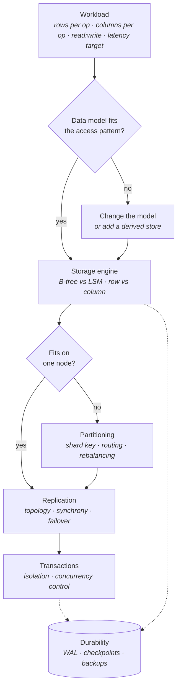
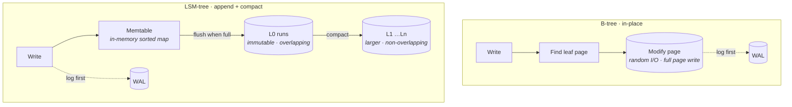
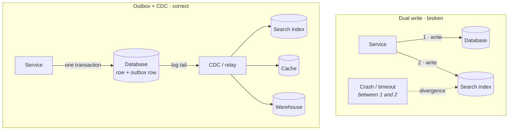
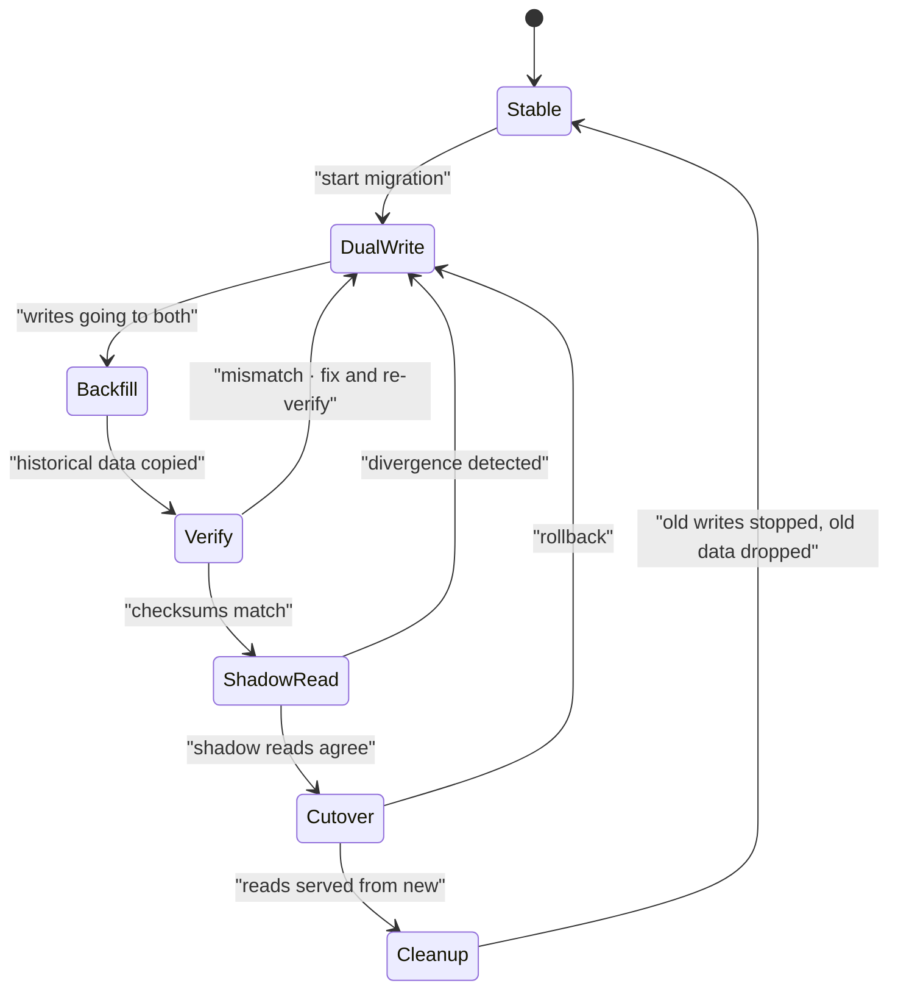
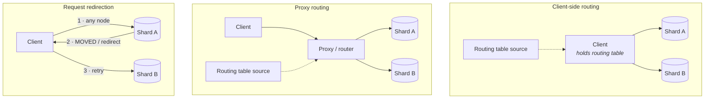
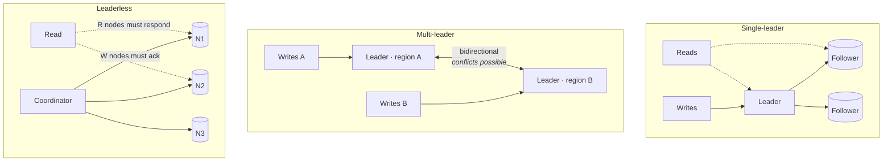
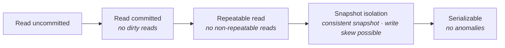
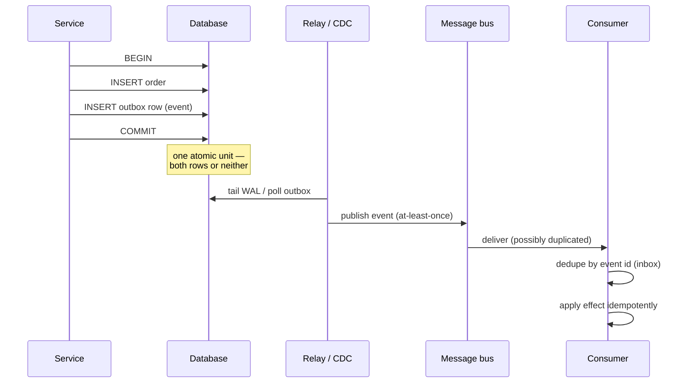
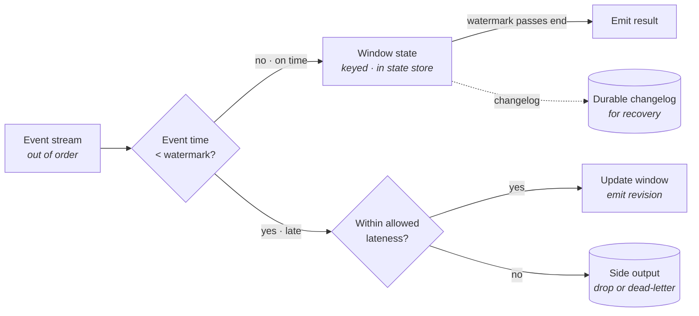

# Data Storage Concepts

Lecture 2 gave you consistency models as abstractions — linearizability, causal, eventual — and the impossibility results that bound them. Lecture 3 gave you the transport those models travel over: connections, protocols, serialization, load balancing. Neither told you where the bytes actually go. This lecture is where those abstractions land on real hardware: on a B-tree page or an LSM run, on a partition assignment, on a replica that is four seconds behind.

The organizing idea is that almost every property you promised in the earlier lectures is *purchased* here, and the price is paid in write amplification, in fan-out, in replication lag, or in operational reversibility. When you say "read-your-writes" in an interview, the follow-up question is which replica the read hit and how the router knew. That question has a storage answer, and this is it.

## The storage decision stack

Storage design is not one decision. It is five, and they are made in a fixed order because each constrains the next.

**Read the order literally — it is the interview structure too:**

- **Workload first.** Every claim below is conditional on rows-per-operation and columns-per-operation. A candidate who names an engine before naming an access pattern has skipped the only step that makes the answer falsifiable.
- **Partitioning is a *conditional* step, not a default.** A single modern node holds tens of terabytes and serves six-figure QPS. Sharding is what you do when one node genuinely cannot, because sharding is the decision that is hardest to reverse ([§ Why the shard key is the hardest decision to reverse](#why-the-shard-key-is-the-hardest-decision-to-reverse)).
- **Replication is not optional** even at one node's worth of data — it is how you get availability and durability, and it is a separate axis from partitioning. Systems conflate them; you should not.
- **Transactions come after topology** because the topology determines what transactions are *affordable*. Single-shard transactions are cheap; cross-shard ones need a commit protocol and cost a round trip per participant.
- **Durability cuts across everything** — the dotted edges. It is a property of the write path, not a stage in it.

## B-tree versus LSM-tree

The single most-probed storage-engine question. Both are ordered key/value structures supporting point lookup and range scan. They differ in *when* they pay for order.

### The two write paths

- **B-tree — update in place.** Find the leaf page that owns the key, modify it, write it back. Order is maintained continuously; the structure is always sorted, always queryable, never needs a background reorganization pass.
- **LSM-tree — append and compact.** Writes go to an in-memory sorted structure (the *memtable*) plus a durability log. When the memtable fills, it is flushed as an immutable sorted file (an *SSTable* or *run*). Background *compaction* merges runs to bound their number and discard superseded versions.

**What the two pictures tell you:**

- **The B-tree does its sorting on the critical path.** A write is a random page read followed by a random page write. Latency is predictable; throughput is bounded by random I/O.
- **The LSM defers sorting to the background.** A write is a memory insert plus a sequential log append. Foreground writes are fast and sequential; the sorting debt accumulates and is repaid by compaction.
- **Both log first.** The WAL is orthogonal to the structure — it is how either engine survives a crash ([§ Outbox, inbox, and change data capture](#outbox-inbox-and-change-data-capture)). Do not confuse the LSM's memtable log with the LSM design itself.
- **The LSM's read path is the cost.** A key may live in the memtable, in any L0 run, or in exactly one run per deeper level. A point lookup may probe several files; a range scan merges several iterators.

### The three amplifications

Every storage engine trades among three quantities. Naming all three is the mark of a serious answer.

- **Write amplification** — bytes written to the device per byte of logical write. B-trees write a whole page (often 4–16 KB) for a 100-byte row change, then rewrite that page again on the next change. LSMs write each byte once per level it descends through.
- **Read amplification** — device reads per logical read. B-tree: one per level of tree height, so about 3–4 for a large table, and the upper levels are cached. LSM: potentially one per run, mitigated by Bloom filters ([§ Membership: Bloom and cuckoo filters](#membership-bloom-and-cuckoo-filters)) and by non-overlapping levels.
- **Space amplification** — bytes on disk per byte of live data. B-trees carry page fragmentation and fill-factor slack, typically 1.3–2×. LSMs carry superseded versions and tombstones until compaction reclaims them; leveled compaction holds this near 1.1×, size-tiered compaction can reach 2× or worse transiently.

**Rule of thumb:** you can pick two. Leveled compaction buys low space and read amplification with high write amplification. Size-tiered compaction buys low write amplification with high space and read amplification. B-trees buy low read amplification with high write amplification and moderate space amplification.

### Compaction cost, stalls, and tail latency

This is the LSM-specific failure mode, and it is where interviews go.

- **Compaction is not free background work.** It reads and rewrites large volumes at full device bandwidth. At steady state, an LSM under sustained writes spends a large fraction of its I/O budget on compaction, not on serving.
- **The failure mode: write stalls.** If ingest outpaces compaction, L0 accumulates runs. Read amplification climbs, and the engine eventually throttles or blocks writers to let compaction catch up. Latency does not degrade smoothly — it is fine, fine, fine, then a multi-second stall.
- **Tail latency is the honest metric.** LSM p50 write latency is excellent and p99.9 is where compaction shows up. A benchmark reporting only means is hiding exactly the number you care about.
- **Compaction competes with reads** for page cache and device queue depth. A compaction burst evicts hot data and inflates read latency at the same moment write latency spikes — the two correlate, which is the worst possible correlation.
- **What to do instead of ignoring it:** rate-limit compaction I/O explicitly, provision device bandwidth for *sustained* write rate times write amplification (not for the logical write rate), and monitor L0 run count as a leading indicator — it rises before latency does.

### Choosing between them

| | B-tree | LSM-tree |
|---|---|---|
| Write path | random in-place | sequential append |
| Write amplification | high, immediate | moderate, deferred |
| Read amplification | low, uniform | higher, filter-mitigated |
| Space amplification | 1.3–2× (fragmentation) | 1.1–2× (uncompacted versions) |
| Latency profile | predictable | **excellent p50, spiky p99.9** |
| Range scans | strong, single structure | good, merged iterators |
| Compression | per page, modest | **per run, aggressive** |
| Natural fit | read-heavy, mixed OLTP | **write-heavy ingest, time series** |
| Representatives | PostgreSQL, MySQL InnoDB, LMDB | RocksDB, Cassandra, ScyllaDB, HBase |

- **Pick the LSM when writes dominate** and the workload tolerates occasional latency spikes — event ingestion, metrics, logs, feed writes.
- **Pick the B-tree when reads dominate** or when latency predictability is contractual — anything user-facing and synchronous, anything with a strict p99 SLO.
- **In an interview:** never say "LSMs are faster." Say "LSMs move the cost from the write path to background compaction, which is the right trade when writes dominate and p99.9 has slack."

## Row, column, and hybrid layouts

The other engine axis, orthogonal to B-tree/LSM: how a tuple's bytes are arranged on a page.

- **Row-major (NSM)** — all columns of one row are contiguous. Fetching one whole row is one page read. Fetching one column of a million rows reads every byte of every row.
- **Column-major (DSM)** — each column stored contiguously across all rows. A scan of 3 columns out of 90 reads roughly 3/90ths of the bytes. Assembling one complete row requires 90 separate reads.
- **Hybrid (PAX)** — rows are grouped into horizontal chunks; within each chunk, storage is column-major. You get columnar scan efficiency within a chunk plus row locality across chunks. Parquet and ORC are this shape, as are most modern analytical file formats.

**Why the split follows the workload exactly:**

- **OLTP point access** touches few rows and most of their columns. Row-major wins because the unit of I/O — the page — contains exactly what you asked for.
- **OLAP scan-and-aggregate** touches enormous row counts and few columns. Column-major wins because the unit of I/O contains nothing you did not ask for.
- **The crossover is real, not rhetorical.** Below a few percent selectivity a row store with an index wins; above it, a column store's scan wins even though it "reads more rows."

**Columnar compression and vectorized execution — the second-order effects that dominate:**

- **Compression works far better on a column** because a column is homogeneous — same type, similar magnitudes, often sorted or near-sorted. Run-length, dictionary, delta, frame-of-reference, and bit-packing encodings routinely give 5–20× on columnar data versus 2–3× on row data.
- **Compression is not just a space win, it is a bandwidth win.** Scanning 1 TB compressed 10× means moving 100 GB. Since analytical queries are bandwidth-bound, the compression ratio *is* the speedup.
- **Late materialization** — operate on compressed, encoded columns as long as possible and only reconstruct rows at the end. Filters can run directly on dictionary codes without decoding.
- **Vectorized execution** — process batches of ~1000 values per operator call instead of one tuple at a time. Amortizes interpretation overhead, keeps data in CPU cache, enables SIMD. A columnar layout is what makes vectorization natural: a batch of one column is a contiguous array.
- **Zone maps / min-max summaries** — per-chunk statistics let the engine skip entire chunks that cannot match a predicate. This is the columnar answer to indexing, and it is why column stores need so few indexes.

**The trap:** columnar stores are usually bad at single-row update and delete. Most implement updates as insert-plus-tombstone with a merge-on-read or periodic rewrite — the same delta-store pattern LSMs use. If your access pattern includes frequent single-row mutation, columnar is the wrong layer to put it in, no matter how good the scans look.

## Indexing concepts

An index is a redundant, ordered copy of some subset of your data, maintained on every write, to make some subset of your reads fast. Every property in that sentence is a cost or a benefit.

### The index taxonomy

- **Primary index** — the index on the primary key. In an index-organized table it *is* the table; in a heap-organized table it is a separate structure pointing at heap locations.
- **Secondary index** — any other index. Maps a non-key column to row identity. Always a second structure to maintain and a second I/O to follow.
- **Composite (multi-column) index** — ordered on `(a, b, c)`. **The leftmost-prefix rule** governs everything: it serves predicates on `a`, on `(a, b)`, and on `(a, b, c)`, but *not* on `b` alone. Column order is the entire design decision — put equality predicates before range predicates, because the first range column terminates useful ordering for everything after it.
- **Covering index** — includes every column the query needs, so the query is answered from the index alone without touching the base table. Eliminates the second I/O. Costs index size and write amplification proportional to the extra columns.
- **Partial (filtered) index** — indexes only rows matching a predicate, e.g. only `status = 'pending'`. When the hot subset is a small fraction of a huge table, this is often a 100× size reduction and a proportional write-cost reduction. The failure mode is a query whose predicate the planner cannot prove implies the index predicate — it silently falls back to a scan.

### Index-organized versus heap-organized

- **Heap-organized** — rows live in an unordered heap; every index, including the primary, stores a physical pointer to a heap location. *PostgreSQL, Oracle by default.*
  - Secondary index lookup is one index traversal plus one heap fetch.
  - All indexes are symmetric — no index is privileged.
  - Row relocation (from an update that no longer fits in place) must be reflected in indexes, which is why engines invest in tricks to avoid it.
- **Index-organized (clustered)** — rows are stored *inside* the primary key's B-tree leaves. *MySQL InnoDB, SQL Server clustered indexes.*
  - Primary-key lookup is one traversal, no extra fetch — a genuine win for PK-dominated access.
  - **Secondary indexes store the primary key, not a physical pointer.** So a secondary lookup is two full traversals: secondary index → primary key → clustered index. This doubles the cost of every non-PK access path.
  - Range scans on the primary key are physically sequential, which is excellent — and is why choosing a monotonic PK creates a write hotspot at the rightmost leaf ([§ Time-ordered keys and the write hotspot](#time-ordered-keys-and-the-write-hotspot)).

**Key distinction:** heap-organized pays a constant extra fetch on *all* index access; index-organized pays zero on primary access and a full extra traversal on secondary access. Which is better is a function of how much of your traffic is PK-keyed.

### Write amplification from index maintenance

The cost nobody volunteers and every interviewer wants to hear.

- **Every index multiplies write cost.** An insert into a table with five secondary indexes is six structure modifications, five of them at random positions in five different B-trees. Each may dirty a page, each generates WAL.
- **Updates are worse than they look.** Updating one column may touch only the indexes containing that column — *if* the engine supports it. If a row relocates, or if the engine uses MVCC with new row versions, every index may need a new entry regardless of which column changed.
- **Deletes leave debris.** Index entries for dead rows survive until a maintenance pass reclaims them. Until then they inflate both size and read cost.
- **The failure mode: index bloat under write-heavy workloads.** Insert throughput degrades non-linearly as indexes exceed memory, because each index insert becomes a random read as well as a random write.
- **Rule of thumb:** an unused index is pure cost. Audit index usage statistics and drop what nothing reads. On a write-heavy table, treat every index as a tax that must justify itself with a named query.

## Probabilistic structures

Structures that trade exactness for orders of magnitude in space. They are the correct answer whenever the exact answer is expensive and a bounded-error answer is actionable.

### Membership: Bloom and cuckoo filters

- **Bloom filter** — a bit array plus *k* hash functions. Insert sets *k* bits; query checks *k* bits.
  - **One-sided error:** "definitely not present" is exact; "possibly present" has a tunable false-positive rate. There are **no false negatives**, which is the property that makes it safe.
  - Roughly **10 bits per element for a 1% false-positive rate**, ~14 bits for 0.1%. Independent of element size — a filter over 1 billion 200-byte keys is ~1.2 GB, not 200 GB.
  - **Cannot delete** (unsetting a bit could break another element's membership). Counting Bloom filters fix this at 3–4× the space.
  - **The canonical use is the LSM read path:** before opening an SSTable, check its filter. A negative answer skips the file entirely, which is what keeps LSM read amplification tolerable.
  - **Second canonical use:** cache-penetration defense — check membership before hitting the database for a key that may not exist (Lecture 5 revisits this).
- **Cuckoo filter** — stores short fingerprints in a cuckoo hash table. **Supports deletion**, has better lookup locality (one or two probes rather than *k* scattered ones), and is more space-efficient than Bloom below ~3% false-positive rate. Costs: insertion can fail when the table is near full, and it needs an explicit capacity bound.

### Cardinality, frequency, quantiles

- **HyperLogLog** — approximate distinct count. Uses the position of the leading one-bit in hashed values across many registers. **~1.6 KB gives roughly 2% error on cardinalities up to billions.** Sketches are **mergeable** — union of two sketches equals the sketch of the union — which is what makes distributed distinct-count tractable. Cannot answer "is X in the set?", only "how many distinct."
- **Count-min sketch** — approximate frequency. A 2-D array of counters with one hash per row; query takes the minimum across rows. **Overestimates only, never underestimates** — bounded error proportional to total stream volume. Used for heavy-hitter detection, per-key rate limiting, and hot-key identification for cache and shard skew ([§ Hotspots, skew, and rebalancing](#hotspots-skew-and-rebalancing)).
- **t-digest (and DDSketch, HDRHistogram)** — approximate quantiles from a stream, mergeable, with **relative error concentrated at the tails** — deliberately accurate at p99 and p99.9 where you need it and loose in the middle where you do not. This is how latency percentiles are computed across a fleet without shipping every sample. Note that **you cannot average percentiles across hosts** — merging sketches is the only correct way, and it is the reason these structures exist in monitoring stacks.

### Where approximation is acceptable — and where it is not

- **Acceptable** when the answer feeds a decision whose outcome is unchanged by small error: dashboards, trend detection, capacity planning, cache admission, hot-key detection, heavy-hitter alerting, "roughly how many unique visitors."
- **Acceptable with a safety net** when a false positive triggers an exact check: Bloom-filtered LSM lookups, cache-existence checks, deduplication pre-filters. The error costs work, not correctness.
- **Not acceptable** where the value is itself the product: billing quantities, financial balances, regulatory counts, anything a user sees as an authoritative number, anything used to enforce a hard limit where over- or under-counting has legal or safety consequences.
- **The trap:** a probabilistic value that starts on a dashboard and quietly ends up in an invoice. The mitigation is naming — call the field `approx_unique_users`, not `unique_users`, so the approximation travels with the data.

## Data models and store classes

The logical vocabulary you describe data in. Choose it from the access pattern, not from familiarity or fashion.

### Relational

- **Normalization** stores each fact exactly once. Its real benefit is not space — it is that an update touches one place, so inconsistent copies cannot arise by construction.
- **Joins** are the price and the point: normalization defers the assembly of an entity to query time, which is what makes the model support *unanticipated* queries. A denormalized store answers the queries you designed for and nothing else.
- **Constraint enforcement** — foreign keys, uniqueness, check constraints, and the ability to enforce them transactionally across multiple rows. This is the capability most frequently under-valued and most expensive to reimplement in application code, because application-level constraints are not enforced under concurrency without explicit locking.
- **When relational is the cheapest correct answer** — and it is more often than staff candidates admit:
  - The access pattern is not fully known at design time.
  - Multi-entity invariants exist (an order and its line items and an inventory decrement must agree).
  - Data volume fits comfortably on one node with replicas — which today means tens of terabytes.
  - You need ad-hoc querying, reporting, or a migration path you have not designed yet.
- **In an interview:** proposing PostgreSQL or MySQL first and justifying the scale ceiling is a stronger answer than reaching for a distributed store, provided you can state the number at which it stops working and what you would do then.

### Key/value and wide-column

- **Key/value** — a dictionary with durability. One access path: the key. Everything else is a full scan or a separately maintained index.
- **Wide-column** — a two-level key: a **partition key** selecting a physical partition and a **clustering key** ordering rows within it. This is the Cassandra/DynamoDB shape, and it is much richer than "key/value" suggests: within a partition you get ordered range scans, which covers a large fraction of real access patterns.
- **Query-driven schema design** — the inverted methodology. You do not model entities and then query them; you enumerate queries first and create one table (or one materialized view) per query, duplicating data across them as needed.
  - **Consequence:** denormalization is the default, not a fallback. The same fact is written to several tables.
  - **Consequence:** a new query pattern often means a new table plus a backfill, not a new `WHERE` clause.
  - **The trade you are making:** predictable single-partition latency at any scale, in exchange for giving up ad-hoc querying and pushing consistency of the duplicated copies into your write path.
- **The failure mode: unbounded partitions.** A partition key with too few distinct values makes partitions grow without limit — Cassandra degrades badly past a few hundred megabytes per partition, and DynamoDB caps an item collection at 10 GB. This is the same skew problem as [§ Hotspots, skew, and rebalancing](#hotspots-skew-and-rebalancing), appearing at the schema level.

### Document

- **Aggregate boundaries** are the central design decision. A document is a unit of atomicity, of retrieval, and usually of locking. Draw the boundary where transactional consistency is required and access is co-occurring.
- **Embedded versus referenced:**
  - **Embed** when the child data is owned by the parent, is bounded in size, and is read with it — order line items, address on a user, comments up to a small cap.
  - **Reference** when the child is independently addressable, unbounded, or shared — a product referenced by thousands of orders, a comment thread that grows forever.
  - **The failure mode of embedding:** unbounded array growth. A document that accumulates entries forever eventually exceeds the size limit (16 MB in MongoDB) and, long before that, makes every read of the parent expensive.
- **Schema-on-read costs** — the schema does not vanish, it moves into every reader.
  - Every consumer must handle every historical shape the collection has ever contained. Old documents are not migrated by an `ALTER`; they persist.
  - Defensive parsing and default-filling spread across the codebase, and a missing field is indistinguishable from a null one.
  - **The honest framing:** schema-on-read buys fast iteration early and charges interest later. It is genuinely right for heterogeneous or rapidly-changing data and genuinely wrong for the core entities of a mature system.

### Specialized stores

Four families where the access pattern is so specific that a general store's index structures do not fit.

- **Graph** — the value is *traversal*: multi-hop relationship queries. In a relational store an *n*-hop query is *n* self-joins whose cost compounds; a native graph store uses index-free adjacency so a hop is a pointer dereference. Use it when traversal depth is variable or unbounded (fraud rings, social distance, dependency resolution). At depth 1–2, a relational store with the right indexes is usually fine and much simpler.
- **Time-series** — append-mostly, time-ordered, queried by time range and tag, with **retention and rollup** as first-class operations. The defining features are aggressive delta/timestamp compression (often <2 bytes per point), automatic downsampling of old data to coarser resolution, and TTL-based expiry that drops whole chunks rather than deleting rows.
- **Search** — an **inverted index** mapping term → posting list of documents, plus analysis (tokenization, stemming, synonyms) and relevance scoring. Fundamentally different from a B-tree: it answers "which documents contain these terms, ranked" rather than "which rows match this predicate." Near-real-time, not real-time — documents become searchable after a refresh interval, typically ~1 s.
- **Vector** — **approximate nearest neighbour** over high-dimensional embeddings. Exact nearest-neighbour search is linear in the corpus; ANN structures (HNSW graphs, IVF-PQ) trade a recall percentage for logarithmic-ish search. The tunable is recall-versus-latency, and *recall is a product decision*, not an infrastructure one.

**Specialized store versus extension on a general store — decide with these questions:**

- **Scale and share of traffic.** If the specialized access pattern is a small fraction of load and the data fits, an extension on the store you already run (full-text search in PostgreSQL, `pgvector`, a time-partitioned table with BRIN) is almost always the better trade. You avoid a second system, a second failure domain, a second on-call rotation, and a sync pipeline.
- **When you cross over.** Dedicated systems win on *depth of feature*, not just speed: relevance tuning and faceting for search, graph algorithms and traversal languages, filtered-ANN and quantization for vectors, continuous aggregates for time series.
- **The hidden cost of the specialized store is always the sync.** A derived store must be populated from the source of truth, which means a pipeline, which means lag, which means a class of bugs where the two disagree. Budget for it explicitly ([§ Partitioning strategies](#partitioning-strategies), [§ Transactions, concurrency, and correctness](#transactions-concurrency-and-correctness)).

### Object storage

Not a database. A flat namespace mapping keys to immutable blobs, and the substrate under nearly every modern data platform.

- **Flat namespace** — there are no directories. `logs/2026/07/a.txt` is a key containing slashes; prefix listing simulates hierarchy. **Consequence:** listing is a paginated scan over sorted keys and is expensive at scale; a "rename a folder" operation is a copy of every object.
- **Consistency** — S3 has offered **strong read-after-write consistency for all operations since 2020**, including overwrites and listings. Do not repeat the pre-2020 folklore about eventual consistency in an interview; do know that it *was* eventually consistent, that many designs still carry workarounds for it, and that other object stores differ.
- **Prefix throughput** — request rate scales with key prefix, because partitioning is by key range. S3 supports roughly **3,500 writes and 5,500 reads per second per prefix**, auto-scaling by splitting hot prefixes. **The failure mode:** date-prefixed keys (`2026-07-25/...`) concentrate all of today's traffic on one prefix — the object-storage instance of the time-ordered-key hotspot in [§ Time-ordered keys and the write hotspot](#time-ordered-keys-and-the-write-hotspot). **What to do instead:** put high-entropy bytes early in the key, e.g. a hash prefix or reversed timestamp.
- **Multipart upload** — split a large object into parts uploaded independently, in parallel, each retryable in isolation. Required above 5 GB, advisable above ~100 MB. **The operational trap:** an abandoned multipart upload leaves parts that are billed but invisible in listings — set a lifecycle rule to abort incomplete uploads.
- **Lifecycle tiering** — automatic transition to colder classes by age. Costs fall roughly an order of magnitude per tier while retrieval latency rises from milliseconds to minutes to hours, and minimum-storage-duration charges appear. **The trap:** tiering a large number of small objects can cost more in per-object transition requests than it saves in storage.
- **Request cost is a real design input.** Object storage is cheap per byte and not cheap per request. A workload of millions of small `GET`s can cost more in requests than in storage. **What to do instead:** batch small objects into larger files (this is exactly what Parquet and open table formats do), and remember that a compaction job which merges small files is a cost optimization as much as a performance one.

## Polyglot persistence

The practice of running several store classes, each matched to an access pattern. Correct in principle, and the source of the most expensive class of data bugs in practice.

- **The argument for it** — no single store is optimal for point lookups, full-text search, analytics, and graph traversal simultaneously. Forcing all four onto one engine means three of them are slow.
- **Its genuine costs:**
  - Each store is a separate operational surface: backups, upgrades, capacity, monitoring, failure modes, and expertise.
  - Cross-store operations have no transactions. Any invariant spanning two stores must be enforced by convention and reconciliation.
  - The number of pairwise consistency relationships grows quadratically with the number of stores.
- **The single-source-of-truth rule:** exactly one store is authoritative for each piece of data. Every other copy is explicitly *derived* — rebuildable from the source, allowed to lag, and never written to directly by application code. A derived store that accepts direct writes has silently become a second source of truth, and you now have a reconciliation problem with no defined resolution.

### The dual-write hazard

**Why the left side cannot be fixed by trying harder:**

- **Two writes to two systems cannot be made atomic without a commit protocol.** A crash, a timeout, or a process kill between them leaves permanent divergence, and no ordering of the two writes removes the window — it only chooses which system is stale.
- **Retries make it worse, not better.** Retrying the second write after the first succeeded turns a consistency problem into a duplicate-application problem unless the target is idempotent.
- **Ambiguity is the real enemy.** A timeout on write 2 does not tell you whether it succeeded. You cannot compensate correctly without knowing, and you cannot know.
- **The right side works because there is only ever one write.** Everything downstream is derived from the durable, ordered log of what the database actually committed. This is the outbox/CDC pattern, developed fully in [§ Transactions, concurrency, and correctness](#transactions-concurrency-and-correctness) — it is the standard fix, and "I would use an outbox rather than dual-write" is one of the highest-signal sentences available in a storage interview.

## Partitioning strategies

Partitioning (sharding) splits one logical dataset across independent physical units so that capacity, throughput, and working-set size scale horizontally. It is the decision with the worst reversibility characteristics in this entire lecture.

### The four basic schemes

- **Range partitioning** — contiguous key ranges per partition (`A–F`, `G–M`, …).
  - **Wins:** range scans are local; a "last 24 hours" query hits one partition.
  - **Loses:** skew is the default outcome, since real key distributions are not uniform. Time-ordered keys put all writes on the last partition ([§ Time-ordered keys and the write hotspot](#time-ordered-keys-and-the-write-hotspot)).
- **Hash partitioning** — partition by `hash(key) mod N` or by hash ranges.
  - **Wins:** near-uniform distribution without knowing the key distribution.
  - **Loses:** destroys ordering. Every range query becomes a scatter-gather across all partitions.
- **List partitioning** — explicit key-to-partition mapping by discrete value (region, tenant tier, country).
  - **Wins:** aligns physical layout with a business or regulatory boundary — data residency is a list-partitioning problem.
  - **Loses:** partition sizes follow business reality, which is never uniform.
- **Composite partitioning** — hash on one dimension, range on another. The dominant real-world pattern: hash by `tenant_id` for uniformity, range by `timestamp` within the tenant for scan locality. Cassandra's partition-key-plus-clustering-key is exactly this, as is `PARTITION BY HASH … SUBPARTITION BY RANGE`.

### Directory-based partitioning

- A **lookup service** maps key (or key range) to partition. Indirection instead of computation.
- **Wins:** arbitrary placement, per-key relocation, per-tenant isolation for large tenants, and *the ability to change the partitioning function without touching the keys*. Migration is a directory update plus a data move.
- **Loses:** the directory is a lookup on the hot path (mitigated by caching), a scaling target of its own, and a single point of failure unless replicated. Cache staleness must be handled explicitly ([§ Routing](#routing)).
- **Where it earns its keep:** multi-tenant systems with wildly uneven tenant sizes, where you want to pin the ten largest tenants to dedicated shards and hash the long tail.

### Consistent hashing, virtual nodes, and jump hash

- **The problem with `hash(key) mod N`:** changing `N` remaps almost every key. Adding one node to a 10-node cluster relocates roughly 90% of the data. This is not a rebalance, it is a rebuild.
- **Consistent hashing** places nodes and keys on a hash ring; a key belongs to the first node clockwise. Adding or removing a node moves only the keys between it and its neighbour — about `1/N` of the data instead of all of it.
- **The residual problem: uneven arcs.** With few nodes, random ring positions produce very unequal segments — load can vary 2× or more.
- **Virtual nodes (vnodes)** — each physical node claims many ring positions (typically 100–256). Averaging over many arcs makes the load distribution tight, makes rebalancing spread across *all* remaining nodes rather than one neighbour, and lets heterogeneous hardware take proportionally more tokens.
- **Jump consistent hash** — a small, allocation-free function mapping a key to one of `N` buckets with optimal, minimal remapping. **Wins:** tiny, fast, no ring state. **Loses:** it can only add or remove buckets at the *end* of the range, so it cannot express arbitrary removal or weighted nodes. Right for stateless shard selection (caches, work assignment), wrong for a cluster where any node may fail.
- **Rendezvous (highest-random-weight) hashing** — for each key, compute a weight per node and take the maximum. Handles weights and arbitrary removals naturally at `O(N)` per lookup; fine for small `N`.

## Shard-key selection

The highest-leverage decision in the lecture, and the one most likely to be probed until you break. Everything else in partitioning can be changed later; this practically cannot.

### The three requirements

A shard key must satisfy all three simultaneously. Failing any one of them is a distinct, recognizable production failure.

- **Cardinality** — the number of distinct values must greatly exceed the number of partitions, and must keep growing with the data. Sharding by `country` caps you at ~200 partitions and permanently strands the largest ones. **Failure if violated:** you cannot split further; a single partition outgrows a node and there is nothing to divide.
- **Uniformity** — access must spread evenly across values, not just *values* spread evenly. `user_id` has excellent cardinality and terrible uniformity if 1% of users generate 50% of traffic. **Failure if violated:** hotspots ([§ Hotspots, skew, and rebalancing](#hotspots-skew-and-rebalancing)) — one shard saturates while the rest idle, and cluster capacity is bounded by the hottest shard, not the average.
- **Query locality** — the shard key must appear in the predicate of your dominant queries, so those queries hit one partition. **Failure if violated:** every read becomes a scatter-gather ([§ Cross-shard queries, scatter-gather, and fan-out cost](#cross-shard-queries-scatter-gather-and-fan-out-cost)), and you have built a distributed system with none of the benefits and all of the costs.

**These three pull against each other, and that tension is the whole problem:**

- Maximizing uniformity pushes toward hashing a high-entropy key — which destroys range locality.
- Maximizing locality pushes toward the natural grouping key (tenant, user, conversation) — which is exactly the dimension with the most skew.
- Maximizing cardinality pushes toward the finest-grained identifier — which scatters entities that are always read together.

**What to do instead of optimizing one axis:** enumerate your top few queries by volume, write down which key each one filters on, and pick the key that appears in the highest-traffic queries while still having acceptable entropy. Then design an explicit plan for the queries that key does *not* serve — a secondary index, a derived store, or accepted fan-out.

### Cross-shard queries, scatter-gather, and fan-out cost

- **Scatter-gather** — a query without the shard key must be sent to every partition and the results merged. Its costs compound:
  - **Latency is the *maximum* over partitions, not the mean.** With 100 shards, your p50 query latency is roughly the shards' p99 latency. This is the tail-amplification result from Lecture 1, and it is why fan-out queries are so much slower than their per-shard cost suggests.
  - **Cost is linear in shard count.** One logical query becomes `N` physical queries. A modest QPS of scatter-gather traffic saturates the cluster.
  - **Availability degrades multiplicatively.** If any shard is unavailable, the query is incomplete or fails. With 100 shards at 99.9% availability each, a fan-out query succeeds ~90% of the time.
  - **Pagination and ordering are much harder.** A global `ORDER BY … LIMIT 20` requires fetching 20 from every shard and merging; deep offsets require fetching `offset + limit` from every shard.
- **Cross-shard writes** need a commit protocol (two-phase commit or a consensus-backed equivalent) — an extra round trip, a coordinator, and blocking-on-coordinator-failure semantics. Lecture 2 covered why; the storage consequence is that a design where the common transaction spans shards has chosen the wrong shard key.
- **What to do instead:** make the dominant access pattern single-shard by construction. Co-locate entities that are transacted together under the same shard key (all of a tenant's data, all of a user's orders). Serve the secondary access patterns from a *derived* store keyed differently — a global secondary index, a search index, or a warehouse — and accept that it lags.

### Why the shard key is the hardest decision to reverse

- **It is embedded everywhere.** The routing layer, the physical placement, the application's query shapes, the transaction boundaries, and any global secondary indexes all encode it.
- **Changing it is a full data rewrite**, not a metadata change. Every row moves, because the new key hashes elsewhere. There is no in-place migration.
- **It must happen online.** You cannot take a petabyte-scale system down for the hours or days a rewrite takes, so you need dual-write plus backfill plus verification plus cutover ([§ Rebalancing](#rebalancing)) — a multi-month project with a permanent risk of divergence in the middle.
- **The symptom arrives late.** A bad shard key works fine at 10% of eventual scale. It reveals itself as skew or fan-out cost at the exact moment you are least able to afford a migration.
- **In an interview:** say explicitly that you would rather over-invest in shard-key analysis up front than plan to fix it later, and name the specific queries that constrain the choice. Then note the escape hatch — a directory-based layer ([§ Directory-based partitioning](#directory-based-partitioning)) preserves the ability to relocate individual keys without rehashing the world, and it is worth its overhead precisely because it buys reversibility.

## Hotspots, skew, and rebalancing

Uniform hashing distributes *keys* evenly. It does not distribute *load* evenly, because load is per-key and real key popularity is power-law distributed.

### The celebrity / hot-key problem

- **The shape:** one key — a celebrity account, a flash-sale product, a viral post, a global config row — receives a disproportionate share of traffic. It lives on exactly one partition, and no partitioning scheme can split a single key.
- **Key salting** — append a bounded random or round-robin suffix, turning key `K` into `K#0 … K#n`, spread across partitions.
  - **Writes** pick a random suffix and are spread by a factor of `n`.
  - **Reads** must query all `n` variants and merge — a deliberate, bounded fan-out traded against unbounded hotness.
  - **Apply it selectively.** Salting every key imposes fan-out on every read. Detect hot keys (a count-min sketch, [§ Cardinality, frequency, quantiles](#cardinality-frequency-quantiles)) and salt only those, with a dynamic `n` proportional to observed heat.
- **Write combining / local aggregation** — for counters and metrics, aggregate in memory per node and flush periodically. Turns a million increments per second on one key into one write per node per interval. Costs a bounded staleness window and loss of the in-flight delta on crash.
- **Splitting the entity** — model the hot object as `n` independent sub-objects (sharded counters, per-region inventory pools) and reconcile on read. Often the cleanest fix, because it removes the hot key rather than hiding it.

### Time-ordered keys and the write hotspot

The most common self-inflicted hotspot, and it is worth recognizing instantly.

- **The mechanism:** any monotonically increasing shard or clustering key — timestamps, auto-increment IDs, ULIDs, Snowflake IDs — sends *every* write to the partition owning the current maximum. All other partitions are idle. In an index-organized table the same thing happens at the rightmost B-tree leaf, producing contention on one page.
- **Why it is seductive:** monotonic keys give perfect range-scan locality for recent data, which is exactly what most queries want. The read pattern argues for the thing that destroys the write pattern.
- **The mitigations, and what each costs:**
  - **Hash the prefix** — `hash(entity_id)` as partition key, timestamp as clustering key. Writes spread; range scans become per-entity rather than global. Usually the right answer, because "recent activity for entity X" is a more common query than "recent activity globally."
  - **Bucket the prefix** — prepend `timestamp mod n` or a reversed timestamp. Spreads writes across `n` partitions; a global time-range scan now fans out to `n`, which is bounded and acceptable if `n` is small.
  - **Time-bucketed partitions** — a new partition per hour or day, with writes landing in the current one. Does *not* fix the write hotspot but makes retention trivial (drop the partition) and pruning excellent. Often combined with hashing.
- **UUIDv7 and monotonic ULIDs are time-ordered on purpose** — they solve B-tree page-split churn from random UUIDs and they *re-introduce* the distributed write hotspot. Know which problem you are solving.

### Rate limiting and caching as skew mitigation

- **Per-key rate limiting** protects a shard from a single abusive or pathological key. It converts an outage that affects every key on that shard into throttling that affects one key. **The point is blast-radius containment, not fairness.**
- **Caching a hot key** is often the cheapest complete fix — a single key at extreme read volume served from a cache tier disappears from the storage layer entirely. This works precisely because the hot key is hot: cache hit rate on it is ~100%.
- **The trap:** a cache in front of a hot key creates a thundering-herd risk on expiry — every request misses simultaneously and stampedes the one shard that can least tolerate it. Lecture 5 covers the mitigations (request coalescing, probabilistic early refresh, negative caching).
- **The trap, part two:** caching hides skew from your metrics. The shard looks healthy until the cache is cold — after a deploy, a failover, or an eviction storm — and then it takes the full unsmoothed load. **Rule of thumb:** know whether your storage layer can survive a cold cache. If it cannot, the cache is not an optimization, it is a load-bearing dependency and must be treated as one.

### Rebalancing

**Fixed partition count versus dynamic splitting:**

- **Fixed partition count** — create many more partitions than nodes at the start (say 1024 partitions on 8 nodes) and move whole partitions between nodes as the cluster grows. Rebalancing is reassignment, never resplitting. Simple, predictable, and used by Kafka, Elasticsearch, and Riak.
  - **The cost:** the count is chosen once, up front, and it caps your maximum node count. Too few and you cannot scale out; too many and per-partition overhead (files, memory, metadata, background tasks) dominates.
- **Dynamic splitting** — partitions split when they exceed a size or load threshold and merge when they shrink. The partition count adapts to the data. Used by HBase, DynamoDB, CockroachDB, TiDB.
  - **The cost:** splits are a control-plane operation with their own failure modes, and a split during a load spike adds work exactly when you have none to spare. Some systems support pre-splitting a new table precisely because splitting under initial load is painful.

**Online resharding — the sequence in the diagram, and why each step exists:**

- **Dual-write** — the application (or the CDC pipeline) writes every mutation to both old and new layouts. Establishes a point after which the new layout does not fall further behind. Writes must be idempotent, because retries will duplicate.
- **Backfill** — copy historical data into the new layout, throttled, usually in key-range chunks with checkpointing so it is resumable. This is the long phase: weeks at petabyte scale.
- **Verify** — compare. Row counts, checksums per key range, and sampled row-level comparison. **Do not skip this**; the entire point of the phased approach is that divergence is detected before it becomes user-visible.
- **Shadow-read** — serve reads from the old layout but also read from the new one and compare, logging mismatches without affecting users. Catches bugs the checksum pass cannot, because it exercises the real query paths.
- **Cutover** — flip reads to the new layout, ideally per-key-range or per-tenant so blast radius is small and rollback is a flag flip. Keep dual-writing until confident.
- **Cleanup** — stop old writes, then drop old data. **Wait longer than feels necessary** — deleting the old copy is the moment rollback stops being possible.

**Data movement cost and throttling:**

- Rebalancing moves real bytes over the real network while the cluster is serving traffic. Moving 10 TB at a throttled 100 MB/s takes about 28 hours; unthrottled it saturates the network and takes production down with it.
- **The failure mode: rebalancing storms.** A node is marked dead, the cluster begins re-replicating its data, the resulting load makes another node time out, it is marked dead, and the cluster cascades itself into an outage. This is a real and repeated production pattern.
- **What to do instead:** rate-limit data movement to a fixed fraction of capacity, cap the number of concurrent migrations, require a delay (and often a human) before treating a node failure as permanent, and make automatic rebalancing something you can pause instantly. **Automatic rebalancing plus automatic failure detection is a positive feedback loop, and every positive feedback loop in a distributed system is an outage waiting for a trigger.**

## Routing

Something must translate a key into a physical node. Where that logic lives is a genuine architectural choice.

**The three models and what each costs:**

- **Client-side routing** — the client library holds the routing table and connects directly to the owning node. **Lowest latency: one network hop.** Costs: routing logic in every client, every language; every client is a cache-invalidation target on topology change; connection count is clients × shards, which becomes the binding constraint at scale. *Cassandra and Kafka clients work this way.*
- **Proxy routing** — a stateless routing tier in front of the cluster. **Costs one extra hop** (typically 0.5–1 ms) and needs its own scaling and availability. Buys: thin clients in any language, one place to change routing, connection pooling and multiplexing, and a natural insertion point for rate limiting, retries, and observability. *Vitess, ProxySQL, `mongos`, Envoy-style data proxies.*
- **Request redirection** — the client asks any node; if that node does not own the key it returns a redirect with the correct address, and the client caches the hint. **Self-healing:** the cluster is authoritative about its own topology and no external distribution mechanism is required. Costs an extra round trip whenever the client's hint is stale. *Redis Cluster's `MOVED`/`ASK` is the canonical example.*

**Routing-table distribution and staleness — this is where routing bugs actually live:**

- **Where the table comes from:** a coordination service (ZooKeeper, etcd, Consul) that clients or proxies watch; a gossip protocol among the data nodes themselves; or a dedicated control plane that pushes updates.
- **Every routing table is a cache, and every cache is stale sometimes.** During a rebalance or failover, some clients will hold the old mapping. The design question is not how to prevent staleness but what happens when it occurs.
- **The correct handling is server-side verification.** The receiving node checks whether it actually owns the key and, if not, either redirects or rejects. **The failure mode without this check is silent wrong-shard writes** — data written to a node that no longer owns it, invisible to reads and undetected until a reconciliation job or a customer finds it.
- **Fencing tokens close the remaining window.** Attach a monotonic topology version (epoch) to requests; a node rejects requests carrying an older epoch than its own. This is the same fencing mechanism as failover ([§ Failover](#failover)), applied to routing, and it is what prevents a client that slept through a rebalance from writing into the past.

## Replication

Multiple copies of the same data, for availability, durability, and read throughput. Independent of partitioning — a system typically does both, with each partition replicated *n* ways.

### Topologies

- **Single-leader** — all writes go to one node; followers apply the stream. **The default, and correctly so.** No write conflicts by construction, a clear ordering, simple reasoning. Costs: write throughput bounded by one node, and a failover event with real downtime and real risk ([§ Failover](#failover)).
- **Multi-leader** — several nodes accept writes and replicate to each other. Wins: local write latency in every region, and survival of inter-region partitions. **The cost is conflicts, which are not an edge case but a routine occurrence**, and they must be resolved by policy ([§ Mechanisms and conflict handling](#mechanisms-and-conflict-handling)). Justified mainly by multi-region write locality, offline-capable clients, and collaborative editing.
- **Leaderless** — the client or a coordinator writes to several replicas and reads from several, using quorums (`W + R > N` for overlap). Wins: no failover event — a down node is just one that does not ack. Costs: read repair and anti-entropy machinery, weaker ordering guarantees, and **the quorum inequality does not by itself give linearizability** — concurrent writes, sloppy quorums, and hinted handoff each break it in different ways. *Dynamo, Cassandra, Riak.*
- **Chain replication** — nodes form a chain; **all writes enter at the head and propagate down; all reads are served by the tail.** Because the tail has by definition seen every acknowledged write, reads are strongly consistent *and* cheap — no quorum on the read path.
  - **The read/write split is the point:** writes pay latency proportional to chain length; reads pay one node. Excellent for read-heavy workloads needing strong consistency.
  - **CRAQ** extends this by letting any node serve reads, checking with the tail only when it holds an uncommitted version — which turns the tail from a read bottleneck into a version oracle.
  - **The cost:** write latency is the sum along the chain, and a node failure requires chain reconfiguration.
- **Cascading replicas / replica trees** — a follower replicates from another follower rather than from the leader. Relieves the leader of *n* outbound streams — important when you have dozens of replicas or replicas across regions, where one cross-region stream feeding a local sub-tree beats *n* cross-region streams. **The cost:** lag compounds down the tree, and a mid-tree failure orphans everything beneath it until reparenting completes.

### Synchrony and its consequences

- **Synchronous** — the leader waits for follower acknowledgement before acknowledging the client. **RPO = 0**: no acknowledged write is ever lost. Costs the network round trip on every write, and — critically — **a slow or dead synchronous follower blocks all writes** unless the system degrades to async, which silently reintroduces data-loss risk at the worst moment.
- **Asynchronous** — the leader acknowledges immediately and ships changes in the background. Lowest write latency, no availability coupling. **RPO > 0**: everything not yet shipped is lost on leader failure. The window equals the replication lag at the moment of failure — which is largest exactly when the leader is under stress.
- **Semi-synchronous** — wait for *one* (or *k*) followers, others async. The standard compromise: bounded data loss, one round trip, and tolerance for slow replicas beyond the first. *MySQL semi-sync, PostgreSQL `synchronous_standby_names` with `ANY 1 (…)`.*
- **Quorum** — wait for a majority. Survives a minority failing without either blocking or losing data, at the cost of majority-round-trip latency on every write. This is what consensus protocols (Lecture 2) provide.

**RPO and RTO, stated precisely — interviewers ask for these by name:**

- **RPO (recovery point objective)** — how much data you can afford to lose, measured in time. Determined by replication synchrony and backup frequency.
- **RTO (recovery time objective)** — how long you can afford to be down. Determined by failure detection time, promotion time, and client reconvergence time.
- **The pairing:** synchronous gives RPO 0 at a latency cost; async gives low latency at an RPO equal to lag; semi-sync gives RPO 0 for single-node failure and RPO > 0 for correlated failure. **Backups alone give an RPO measured in hours** — which is why backups are a corruption defence, not an availability strategy ([§ Log-based change data capture](#log-based-change-data-capture)).

**Replication lag — causes, measurement, and what users see:**

- **Causes:** write burst exceeding the follower's apply rate; single-threaded apply on the follower against a parallel-write leader; long-running read queries on the follower blocking apply; network saturation; follower disk or CPU saturation; a large transaction that must be applied atomically.
- **Measure it in bytes *and* seconds.** Byte lag (log position difference) shows the true backlog; time lag (`now() - last_applied_commit_timestamp`) is what users experience. **The trap:** on an idle leader, time lag looks large simply because nothing new has arrived — always interpret it alongside write rate.
- **User-visible effects, and each maps to a consistency model from Lecture 2:**
  - **Read-your-writes violation** — a user posts a comment, is routed to a lagging follower, and their own comment is missing. *Fix:* route reads to the leader for a short window after a write, or pin the session to a replica known to have the write's log position.
  - **Monotonic-read violation** — two successive reads hit replicas with different lag, and the user sees data move backwards in time. *Fix:* sticky routing of a session to one replica.
  - **Causal violation** — a reply appears before the message it replies to, because they replicate through different paths. *Fix:* causal tokens or co-partitioning of causally related data.
- **The operational failure mode:** lag is bimodal. It sits near zero for weeks, then a bulk job or schema change pushes a follower hours behind, and every read-from-replica code path returns stale data at once. **Alert on lag, and make the read router refuse replicas beyond a lag threshold** — falling back to the leader with degraded capacity beats serving hours-old data.

### Mechanisms and conflict handling

**How changes travel — three mechanisms, with real differences:**

- **Statement-based** — ship the SQL. Compact, but **unsafe for anything non-deterministic**: `NOW()`, `RANDOM()`, auto-increment ordering under concurrency, and triggers with side effects all diverge between leader and follower. Largely abandoned for this reason.
- **Row-based / logical** — ship the resulting row changes ("row with PK 42 changed column `balance` from 100 to 50"). Deterministic by construction, decoupled from the physical storage format, so it works **across versions and even across engines** — which is what makes it the substrate for CDC ([§ Concurrency-control families](#concurrency-control-families)), for logical replication of a subset of tables, and for zero-downtime major-version upgrades.
- **Physical / WAL-based** — ship the storage engine's own write-ahead log records, describing page-level changes. Fastest and lowest overhead because the follower simply replays what the leader already wrote. **The cost is tight coupling:** replicas must run a compatible version and identical storage layout, all-or-nothing at the whole-cluster granularity, and the replica is a byte-level clone rather than a logically equivalent database.
- **Snapshot + stream bootstrap** — the universal pattern for adding a replica or starting a CDC consumer: take a consistent snapshot at a known log position, copy it, then stream every change from exactly that position. **The correctness hinge is that the snapshot's log position is captured atomically with the snapshot** — miss this and you either skip changes or duplicate them, and only one of those is recoverable (duplicates, if consumers are idempotent).

**Conflict handling — only multi-leader and leaderless systems have this problem, and it is the reason they are hard:**

- **Last-write-wins (LWW)** — keep the write with the highest timestamp. Simple, stateless, and **it silently discards data**: two concurrent writes to the same key mean one is destroyed with no record. Worse, with wall-clock timestamps and clock skew (Lecture 2), the "winner" may be the *earlier* write. Acceptable for caches, session data, and last-seen-state; unacceptable for anything where a lost update is a lost customer action.
- **Application-level merge** — the store retains both versions (siblings) and hands them to the application, which merges with domain knowledge: union two shopping carts, take the maximum of two counters, prompt the user. Correct, and it forces every reader to handle conflicts — real work, but the only approach that respects domain semantics.
- **CRDTs (conflict-free replicated data types)** — data types whose merge operation is commutative, associative, and idempotent, so replicas converge automatically regardless of message order or duplication. Counters, sets, registers, and text sequences all have CRDT forms. **The cost is metadata:** tombstones and version vectors that must be retained, sometimes indefinitely, and the fact that only some domain logic can be expressed this way.
- **Conflict logs** — record every conflict and its resolution to a durable, auditable stream. This is the operational minimum: even with LWW, *knowing* you lost a write is far better than discovering divergence months later. If a design uses LWW without a conflict log, it has chosen silent data loss.
- **Write-affinity routing — avoid conflicts instead of resolving them.** Route all writes for a given entity to one designated leader (by user, tenant, or region). Conflicts become impossible for that entity because there is only ever one writer. **This is by far the best answer when it is available**, and it usually is: most entities have a natural home region or owner. Multi-leader with affinity gives you regional write latency without the conflict problem, and only cross-affinity writes (rare) need real resolution.

### Failover

- **Automatic promotion** — a detector notices the leader is gone and promotes a follower. Wins: RTO in seconds instead of the minutes-to-hours of paging a human. Costs: **false positives**. A network blip or a GC pause is indistinguishable from death, and an unnecessary failover is itself an outage plus a data-loss risk.
- **Manual promotion** — a human decides. Wins: judgement, and no spurious failovers. Costs: RTO bounded by human response time, and humans are slow and error-prone at 3 a.m. **The honest middle ground** most mature systems land on: automatic detection and automatic *preparation*, with a human confirming promotion — or automatic promotion with a conservative detection threshold and a well-practised rollback.
- **Split-brain** — two nodes both believe they are leader, both accept writes, and the datasets diverge irreconcilably. **This is the worst outcome in the lecture**, worse than downtime, because it produces silent, permanent, undetectable-until-later corruption.
  - **Quorum-based election** — only a node with majority support may lead, so at most one leader can exist. The core defence, and the reason consensus protocols exist.
  - **STONITH ("shoot the other node in the head")** — forcibly power off or network-isolate the old leader before promoting. Crude, effective, and requires out-of-band control of the hardware or hypervisor.
  - **Fencing tokens** — each leadership term gets a monotonically increasing epoch; storage and downstream services reject any write carrying a stale epoch. **This is the general solution**, because it works even when the old leader is alive, unaware, and confidently writing — it makes those writes harmless at the point they land rather than trying to prevent them at the source.
- **Lost-write windows on async failover** — the specific, quantifiable data loss:
  - Writes acknowledged by the old leader but not yet shipped are simply gone when a follower is promoted.
  - **The old leader's divergent writes are a second problem.** When it recovers it holds writes the new leader never saw. It must discard them (data loss, but consistent) or you must reconcile them manually. Most systems discard, and most operators are surprised the first time.
  - The window equals replication lag at failure time, which — because failures correlate with load — is systematically larger than your steady-state lag graph suggests. **Size RPO from lag at the 99th percentile, not the median.**
- **Failover is not just the database.** Clients hold stale connections and stale routing tables; connection pools must detect and reconnect; caches may hold data written to the old leader that the new leader never received. **RTO is measured until traffic is served correctly, not until the new leader is up** — and the gap between those two is where most real failover incidents live.

## Transactions, concurrency, and correctness

### ACID in practice, and BASE as contrast

Each letter guarantees less than it is usually assumed to, and the variation between engines is the interesting part.

- **Atomicity** — all-or-nothing for the operations in one transaction. **What it does not mean:** concurrency safety (that is isolation) or anything spanning two systems. Implemented by undo logging or MVCC, not by locking.
- **Consistency** — the application's invariants hold before and after. **This is the odd letter out:** the database enforces only the constraints you declared (foreign keys, uniqueness, checks). Every other invariant is the application's job, and calling it a database guarantee is the most common misunderstanding of ACID.
- **Isolation** — concurrent transactions behave as if serial. **Almost never true in practice**, because almost nobody runs at `SERIALIZABLE`. This letter is a dial, not a guarantee, which [§ Isolation levels and the anomalies they permit](#isolation-levels-and-the-anomalies-they-permit) unpacks.
- **Durability** — committed data survives crashes. **Whose crash?** Process crash is easy; machine crash needs `fsync` and honest hardware; datacenter loss needs replication; region loss needs geo-replication. Durability is a per-failure-domain claim, and vendors are often vague about which one.
- **Per-engine variation is large and worth naming:** PostgreSQL's `REPEATABLE READ` is snapshot isolation; MySQL InnoDB's `REPEATABLE READ` permits different anomalies and does not prevent write skew; Oracle's `SERIALIZABLE` is snapshot isolation, not true serializability. **The lesson: isolation-level names are not portable across engines. Read the specific engine's documentation, always.**
- **BASE** — Basically Available, Soft state, Eventually consistent. **It is a framing, not a specification.** Its use is rhetorical contrast: it names the choice to accept temporary inconsistency in exchange for availability and partition tolerance. **The trap:** treating BASE as a design that requires no consistency reasoning. It requires *more*, because the reasoning moves from the database into your application, where it is neither declarative nor tested.

### Isolation levels and the anomalies they permit

**The anomalies, in the order they are eliminated:**

- **Dirty read** — reading another transaction's uncommitted data. Prevented from `READ COMMITTED` upward. Nearly no production system runs `READ UNCOMMITTED`.
- **Non-repeatable read** — reading the same row twice in one transaction and getting different values, because another transaction committed in between. Prevented from `REPEATABLE READ` upward.
- **Phantom read** — re-running a *range* query and finding new rows. Prevented at `SERIALIZABLE`; snapshot isolation prevents the read-side phantom but not all write-side consequences.
- **Lost update** — two transactions read a value, both modify it, and one overwrite is silently lost. **The classic read-modify-write bug**, and it is possible at `READ COMMITTED`. Snapshot isolation prevents it for the same row via first-committer-wins; below that you must lock explicitly.
- **Write skew** — two transactions read an overlapping set, each checks an invariant that currently holds, each writes a *different* row, and the invariant is violated by the combination. The canonical case: two doctors both checking "is at least one other doctor on call?" and both going off call. **Snapshot isolation does not prevent write skew** — this is the single most important anomaly for staff-level interviews, because it is the one that survives the isolation level most people assume is safe.

**Application-level compensations, and when each is right:**

- **`SELECT … FOR UPDATE`** — take a row-level exclusive lock during the read so the read-modify-write is atomic. The direct fix for lost update. Costs: serialized access to that row, and deadlock risk if transactions lock rows in different orders. **Always lock in a consistent order** — sorting by primary key is the standard discipline.
- **`SELECT … FOR SHARE`** — prevents others from modifying rows you read while allowing concurrent readers. The lighter-weight tool for guarding a read-based invariant.
- **Materializing the conflict** — write skew happens because there is no row to lock. Create one: a `on_call_shifts` row per shift that both transactions must lock. Ugly, explicit, and effective.
- **Advisory locks** — application-defined named locks held in the database, unrelated to any row. Useful for "only one instance of this job runs" and for coarse critical sections spanning multiple tables. **The trap:** session-scoped advisory locks are silently broken by transaction-mode connection poolers, since the lock and the later release may land on different backends.
- **Optimistic version columns** — `UPDATE … WHERE id = ? AND version = ?`, retry if zero rows are affected. No locks held, so no deadlocks and no blocking. Right when conflicts are rare; degenerates into a retry storm when they are not.
- **Unique constraints** — the most underrated concurrency tool. A uniqueness constraint is an invariant the database enforces atomically under any isolation level, and it turns a race condition into a clean, catchable error.

### Concurrency-control families

Stay at the family level — Lecture 11 covers PostgreSQL's specific implementation.

- **Two-phase locking (2PL)** — acquire locks in a growing phase, release only in a shrinking phase after commit. **Pessimistic:** conflicts are prevented by blocking. Gives true serializability (strict 2PL), and **readers block writers and writers block readers** — the property MVCC exists to remove.
  - **Deadlock handling** is intrinsic, since 2PL creates cycles. Options: *detection* (build a wait-for graph, find cycles, abort a victim — the usual choice), *prevention* by timestamp ordering (wait-die / wound-wait), or *timeouts* (crude; a slow query is indistinguishable from a deadlock).
  - **Where it still wins:** high-contention workloads where optimistic approaches would abort constantly.
- **MVCC (multi-version concurrency control)** — writers create new versions instead of overwriting; each transaction reads from a consistent snapshot. **Readers never block writers and writers never block readers**, which is why nearly every general-purpose database uses it.
  - **Visibility** is determined per row version by comparing version metadata against the reader's snapshot.
  - **The cost is garbage collection.** Old versions must be reclaimed once no snapshot can see them — vacuum in PostgreSQL, purge in InnoDB, compaction in LSM stores. **The failure mode is universal and engine-independent: a single long-running transaction holds a snapshot open, which pins every version created since it started, and the table bloats without bound.** Every MVCC system has this failure mode in some form; every MVCC system's operational guidance says "monitor your oldest transaction."
  - MVCC alone gives snapshot isolation, not serializability — hence write skew above.
- **Optimistic concurrency control (OCC)** — execute against a snapshot without locks, then validate at commit time that nothing you read has changed; abort and retry if it has. **Wins:** no lock management, no deadlock, excellent under low contention. **Loses:** wasted work under high contention, and a retry loop that can livelock. This is what version columns, `ETag`/`If-Match` conditional HTTP requests, and DynamoDB conditional writes all implement.
- **Timestamp ordering (T/O)** — assign each transaction a timestamp and require conflicting operations to appear in timestamp order, aborting anything that would violate it. The basis of distributed schemes where a global timestamp source (Spanner's TrueTime, a hybrid logical clock) supplies the ordering.
- **Serializable snapshot isolation (SSI)** — the modern synthesis: run MVCC as normal, but *track* read/write dependencies and abort transactions that form a dangerous structure implying a non-serializable execution. **Gives true serializability at close to snapshot-isolation performance**, with the caveat that applications must handle serialization-failure aborts and retry. PostgreSQL's `SERIALIZABLE` is SSI. **In an interview:** knowing that serializability is available without 2PL's blocking, and that its price is retryable aborts rather than latency, is a strong signal.

### Idempotency and delivery semantics

- **At-most-once** — send and never retry. No duplicates, possible loss. Right when a lost message is cheaper than a duplicate one — some metrics, some notifications.
- **At-least-once** — retry until acknowledged. No loss, duplicates guaranteed. **The default for any reliable system**, because the alternative to retrying an ambiguous timeout is losing data.
- **Effectively-once (exactly-once *processing*)** — at-least-once delivery combined with idempotent or transactional processing, so duplicates have no observable effect. This is what production systems actually achieve, and the phrasing matters.
- **Why "exactly-once delivery" is impossible** — this is the Two Generals result from Lecture 2 applied to messaging. The sender cannot distinguish "the message was lost" from "the acknowledgement was lost." It must therefore either retry (risking a duplicate) or not (risking loss). No protocol removes this, because the ambiguity is in the network, not the code.
- **Why exactly-once *processing* is achievable** — you cannot control how many times a message arrives, but you can control how many times it takes effect. Move the guarantee from delivery to *effect*, via idempotency or via atomically committing the state change together with the consumed-offset record.

**Idempotency keys — the standard mechanism, with its real costs:**

- The client generates a unique key per logical operation and sends it with every retry. The server records `(key → result)` and, on a repeat, returns the stored result instead of re-executing.
- **The record must be written in the same transaction as the effect.** If you write the effect and then the key, a crash between them means a retry executes twice. This is the dual-write problem ([§ The dual-write hazard](#the-dual-write-hazard)) inside a single service, and the fix is the same: one transaction.
- **Concurrent retries are the subtle case.** Two copies of the same request may arrive simultaneously. Insert the key first with a unique constraint so exactly one wins and the other waits for or reads the winner's result — a `SELECT`-then-`INSERT` check is a race.
- **Dedup windows and their storage cost.** You cannot keep keys forever. A 24-hour window at 10,000 requests per second is 864 million keys — at ~100 bytes each, ~86 GB, plus index. **The trade is explicit:** a shorter window is cheaper but lets a very late retry duplicate. Size the window from your maximum realistic retry horizon (including a consumer that was down overnight), not from the common case.
- **Natural idempotency beats bolted-on idempotency.** `SET balance = 100` is idempotent; `balance = balance - 10` is not. Where you can express the operation as an assignment, a conditional write on expected version, or an insert with a unique key, you need no dedup infrastructure at all.

## Outbox, inbox, and change data capture

The pattern that resolves [§ The dual-write hazard](#the-dual-write-hazard), and the single most useful concrete answer in this part of the map.

### The transactional outbox

- **The mechanism:** write the business row and an event row describing the change in **one local transaction**. A separate relay reads the outbox and publishes. There is now no window in which the state change happened but the event did not, or vice versa.
- **What it buys precisely:** atomicity between a state change and its announcement, using only single-database transactions — no distributed commit protocol, no coordinator.
- **What it costs:** the relay is an extra moving part; the outbox table needs pruning (it grows at your event rate); and publishing is **at-least-once**, since the relay can crash after publishing and before marking the row sent.
- **Ordering:** an outbox preserves the order of events *within a partition* if the relay publishes in insertion order and partitions the bus by the same key. Global ordering is not preserved and should not be assumed.
- **The inbox (consumer side)** — the mirror. The consumer records processed event IDs and skips repeats, ideally writing the ID in the same transaction as the effect. Outbox gives at-least-once publication; inbox turns that into effectively-once processing. **A design that mentions the outbox but not consumer deduplication has solved only half the problem.**

### Polling versus log tailing

- **Polling the outbox table** — `SELECT … WHERE published = false ORDER BY id LIMIT n`, publish, mark sent. Simple, works on any database, requires no special privileges. Costs: polling latency, query load proportional to poll frequency, index churn from the status updates, and care to avoid two relay instances publishing the same rows (use `SKIP LOCKED` or a leader election).
- **Log tailing (CDC)** — read the database's replication log directly and emit the outbox inserts (or the table changes themselves) as they commit. Lower latency, no query load on the primary, no status column to update. Costs: engine-specific machinery, a replication slot whose retained log **will fill the disk if the consumer stops** — a genuinely common outage — and operational familiarity with a less-travelled subsystem.

### Log-based change data capture

- **The idea:** the database's replication log is already a complete, ordered, durable record of every committed change. CDC exposes it as a stream for consumers other than replicas. *Debezium over PostgreSQL logical decoding, MySQL binlog, MongoDB change streams, DynamoDB Streams.*
- **Why it is the standard fix for dual-write:** the stream is derived from what the database *actually committed*. It cannot diverge from the source of truth, because it is a projection of the source of truth. Every derived store — search index, cache, warehouse, materialized view, another microservice — is fed from one stream with defined lag rather than from a racing second write.
- **The properties that make it powerful:**
  - **Replayable.** Rebuild a derived store by re-consuming from an earlier position — the operational escape hatch that makes derived stores disposable rather than precious.
  - **Ordered per key**, which is what makes downstream last-writer-wins application correct.
  - **Complete.** Nothing the database committed is missing, including changes made by other applications, by admins, or by migration scripts — the writes that application-level event emission always misses.
- **Its real costs and failure modes:**
  - **Schema evolution.** Consumers must handle DDL on the source. A dropped or renamed column can break every downstream consumer at once.
  - **Slot/backlog management.** A stopped consumer forces the database to retain log segments. **Unbounded retention fills the primary's disk and takes down the source database** — a CDC-induced outage of the very system you were trying to protect. Always monitor slot lag and always define what happens when a consumer is down for a day.
  - **Initial snapshot.** A new consumer needs history, so you need the snapshot-plus-stream bootstrap of [§ Mechanisms and conflict handling](#mechanisms-and-conflict-handling), with its atomic-position requirement.
  - **Deletes and tombstones.** Soft deletes appear as updates; hard deletes appear as delete events that consumers must translate correctly — and, for GDPR-style erasure, must actually propagate ([§ Hard delete, soft delete, and erasure through immutable logs](#hard-delete-soft-delete-and-erasure-through-immutable-logs)).
  - **It leaks your schema.** The stream is your physical table structure, so consumers become coupled to it. **What to do instead:** emit purpose-designed events from an outbox table rather than raw table changes, so the event schema is a deliberate contract rather than an implementation detail. This is the outbox-plus-CDC combination, and it is the mature form of the pattern.

## Durability and recovery

### Write-ahead logging

- **The rule:** before a modified page may be written to its permanent location, the log records describing that modification must be durable. This one ordering constraint is what makes crash recovery possible.
- **Why it makes commit cheap:** commit writes a *description* of the change sequentially to the log and flushes that, rather than writing scattered data pages randomly. Data pages follow later, at the system's convenience. **Sequential small write on the critical path, random writes deferred** — this is the central performance idea of durable storage.
- **Group commit** — batch the log flushes of many concurrent transactions into one `fsync`. Since an `fsync` costs roughly the same for 4 KB or 400 KB, this multiplies commit throughput by the batch size at the cost of a small added latency per transaction. **It is why a database's commit throughput is far higher than its `fsync` rate.**
- **Recovery** replays the log from the last checkpoint: redo committed changes not yet in data pages, undo uncommitted ones. Recovery time is a function of how much log must be replayed, which is what checkpoints control.

**`fsync` semantics and durability lies — the part that is genuinely surprising:**

- **A successful `write()` guarantees nothing.** It places data in the OS page cache. Only `fsync`/`fdatasync` requests a push to stable media, and only its successful return is a durability signal.
- **Hardware lies.** Consumer drives, and some enterprise ones, acknowledge writes once they are in a volatile on-device cache. Without a battery- or capacitor-backed cache, or an explicit cache-flush command, a power loss discards acknowledged data. Virtualized and network-attached storage add more layers, each able to buffer.
- **`fsync` error handling is worse than you expect.** On some kernels a failed `fsync` may clear the error state, so a *retry returns success* while the data is permanently lost. This is the "fsyncgate" issue, and it changed how several databases handle I/O errors — most now panic and force recovery rather than trusting a second `fsync`.
- **Group commit interacts with fake `fsync`.** If flushes are lied about, batching increases the amount of data lost per lie.
- **What to do instead of trusting the stack:** test it. Power-cycle under load and verify committed data survives. **Rule of thumb:** durability is a property of the entire stack — filesystem, volume manager, hypervisor, controller, and drive — and it is only as strong as the least honest layer.

### Checkpoints and snapshots

- **A checkpoint** forces dirty pages to disk and records a log position from which recovery may begin, bounding the log that must be replayed.
- **The trade-off is a straight line:** frequent checkpoints mean short recovery (low RTO) and high steady-state I/O, because pages are written repeatedly. Infrequent checkpoints mean low steady-state I/O and long recovery.
- **Spread checkpoints** amortize the flush across the interval instead of issuing a burst. A non-spread checkpoint produces a periodic latency spike as the device saturates — a distinctive, regularly-spaced sawtooth in latency graphs that is worth recognizing on sight.
- **Snapshots** (filesystem, volume, or cloud-disk level) capture a point-in-time image cheaply via copy-on-write. **The correctness requirement is that the snapshot be crash-consistent across every volume the database uses** — a snapshot spanning data and log volumes taken at different instants is not recoverable. Restoring a snapshot is equivalent to recovering from a crash at that instant, which is fine as long as the WAL is included.

### Backups

- **Full** — everything. Simplest restore, largest cost.
- **Incremental** — changes since the last backup of any kind. Smallest to take, and restore requires the full plus *every* incremental in the chain — one corrupt link breaks the chain.
- **Differential** — changes since the last *full*. Larger than incremental, but restore needs only full plus one differential. **The trade is backup size against restore complexity**, and restore complexity is what fails at 3 a.m.
- **Logical** (`pg_dump`, `mysqldump`) — a description of the data as statements or portable rows. Version-portable, selective, human-inspectable. Slow to take and much slower to restore at scale, because restoring rebuilds indexes.
- **Physical** — a byte-level copy of the data files. Fast to take and restore, but tied to engine version and platform, and all-or-nothing.
- **Point-in-time recovery (PITR)** — restore a base backup, then replay archived WAL up to a chosen instant. **This is what turns an RPO of "since last backup" into an RPO of "seconds"**, and it is the only defence against logical corruption — a bad migration or an errant `DELETE` — because replication faithfully replicates the mistake to every replica instantly. **Replication is not a backup**, and this is exactly why.
- **Log archiving** is the mechanism PITR depends on, and it is the thing that silently breaks. If archiving stops, PITR quietly loses coverage while backups continue to appear successful. Monitor archive success and continuity, not just backup completion.

**Restore time is the real metric:**

- Nobody has a backup problem. They have a restore problem. **The number that matters is how long it takes to serve traffic again**, which includes retrieving the backup (possibly from cold storage with hours of retrieval latency), restoring, replaying logs, rebuilding indexes, warming caches, and reconverging replicas.
- **The named failure mode: untested backups.** Backups that have never been restored are an unverified belief. The common discoveries in a first real restore are that a table was excluded by an old filter, that log archiving broke months ago, that the restore takes 14 hours against a 2-hour RTO, or that the encryption key is stored only in the system being restored.
- **What to do instead:** restore on a schedule, automatically, into a throwaway environment, and check row counts and application-level invariants. **An untested backup is not a backup, it is a hope.** Say this in interviews; it is true and it lands.

### Data integrity

- **Checksums** — a per-page or per-block checksum detects corruption at read time and converts silent wrong answers into loud errors. Costs a small amount of CPU, and is worth it in essentially every case.
- **Scrubbing** — periodic background reads of all data to detect corruption *before* a user or a restore needs it. Without scrubbing, corruption in cold data is discovered at the worst possible moment: when you are restoring from it.
- **Silent corruption (bit rot)** is real at scale — cosmic rays, firmware bugs, controller faults, misdirected and torn writes. At petabyte scale it is a routine occurrence, not a hypothetical. **The dangerous property is that it is silent**: replication and backups will faithfully copy corrupt data everywhere, so a checksum at the source is the only place the truth is knowable.
- **Torn writes** — a page partially written across a power loss. Handled by full-page images in the WAL (PostgreSQL's `full_page_writes`), double-write buffers (InnoDB), or atomic-write hardware support.
- **Erasure coding versus replication for durability:**
  - **Replication** stores *n* whole copies: 3× storage for 2-failure tolerance. Reads can be served from any copy, recovery is a straight copy, and latency is low. Simple and fast.
  - **Erasure coding** splits data into *k* fragments plus *m* parity fragments; any *k* of the *k+m* reconstruct the original. A 6+3 scheme tolerates 3 failures at **1.5× storage instead of 4×**.
  - **The trade:** erasure coding is dramatically cheaper for durability but costs CPU for encode/decode, requires contacting *k* nodes for a degraded read (so tail latency dominates), and has an expensive repair path — reconstructing one lost fragment reads *k* fragments' worth of data across the network.
  - **Where each belongs:** replication for hot, latency-sensitive, frequently-read data; erasure coding for large, cold, infrequently-read objects. This is exactly why object stores erasure-code their standard tiers while databases replicate.

## Batch and stream processing

The data lifecycle beyond the serving path: how large volumes are transformed, and the two paradigms for doing it.

### Batch processing

- **The MapReduce lineage:** partition input, apply a per-record `map`, group by key (the **shuffle**), apply `reduce` per group. Its enduring contribution is not the API but the execution model — deterministic, restartable tasks over immutable input, so failures are handled by re-running a task rather than by checkpointing state.
- **Spark's advance** over MapReduce is keeping intermediate results in memory across stages and expressing the job as a DAG rather than a chain of separate jobs, eliminating the write-to-disk-between-every-step cost. Lineage-based recovery recomputes a lost partition from its inputs.
- **Shuffle is the dominant cost.** It is an all-to-all data movement across the network, with sorting and spilling to disk at both ends. Everything in query-engine tuning is about avoiding or shrinking it: broadcast joins for a small side, partition-aligned inputs so a join needs no shuffle, pre-aggregation before the shuffle, and pushing filters and column projections to the source.
- **Skew in shuffle** is the same problem as [§ Hotspots, skew, and rebalancing](#hotspots-skew-and-rebalancing) in a different costume: one key with a hundred million records means one reduce task runs for hours while the rest finish in minutes, and the job's duration is the straggler's. Fixes are the same — salt the hot key and aggregate in two stages.
- **Idempotent, re-runnable job design** — the property that makes batch operationally sane:
  - **Deterministic output for the same input.** No `now()`, no random seeds without pinning, no dependence on execution order.
  - **Write to a new location and swap atomically**, rather than mutating in place. A partial failure leaves the old output intact, and re-running is always safe.
  - **Partition output by the input window** so re-running one day's job replaces exactly one day's output.
  - **Because a re-run is safe, the failure procedure is "run it again"** — which is the entire operational value of the discipline.

### Stream processing

- **Event time versus processing time** — event time is when the event happened; processing time is when your system saw it. They differ by network delay, buffering, retries, mobile clients that were offline, and backfills.
  - **Compute on event time**, because it is the only basis on which results are reproducible. A processing-time result changes if you re-run the pipeline; an event-time result does not.
  - **The cost of event time is that you must decide when to stop waiting** for stragglers — which is what watermarks are for.
- **Watermarks** — an assertion that no event with a timestamp earlier than *T* is expected. When the watermark passes a window's end, the window can be emitted.
  - **A watermark is a heuristic, not a fact.** Aggressive watermarks give low latency and drop more late data; conservative ones give complete results and higher latency. This is a direct, tunable latency-versus-completeness trade, and it should be a stated product decision.
  - **The failure mode:** a single idle or stalled partition holds back the global watermark (it is the minimum across sources), so all output stops. Idle-source detection is a real, required feature, not a detail.

**Reading the diagram:**

- **The watermark is the gate**, and everything to its right is the machinery for handling the events that arrived after the gate closed.
- **Allowed lateness** extends a window's state lifetime beyond the watermark, so genuinely late events can still update the result and emit a revision. It costs state proportional to the lateness window times the key count — this is often the single largest memory consumer in a streaming job.
- **Beyond allowed lateness, data is dropped.** Route it to a side output or dead-letter stream rather than discarding silently. A drop-rate metric is mandatory: silent data loss in a streaming pipeline is discovered by a business user, months later.
- **The changelog is what makes the state durable.** Everything left of it is in memory and would be lost on failure.

**Windowing — three shapes, three purposes:**

- **Tumbling** — fixed-size, non-overlapping. Every event in exactly one window. Use for periodic aggregates: hourly revenue, daily active users.
- **Sliding (hopping)** — fixed size, advancing by a smaller step, so windows overlap and each event lands in `size / step` windows. Use for moving averages and rolling alerting thresholds. **Cost scales with the overlap factor** — a 1-hour window sliding every minute means each event contributes to 60 windows.
- **Session** — dynamically sized, defined by a gap of inactivity; consecutive events closer than the gap merge into one session. Use for user-activity analysis. **The hardest to implement**, because a late-arriving event in the middle can *merge two existing sessions* into one, and the operator must retract both prior results.

**State stores, changelogs, and checkpointing:**

- **Stateful operators** (aggregations, joins, deduplication, sessions) hold state per key, usually in an embedded LSM store (RocksDB) so state can exceed memory.
- **The changelog** is a compacted, replicated log of every state update. On failure, state is rebuilt by replaying it — this is what makes a stateful streaming job restartable on a different machine.
- **Checkpointing** periodically snapshots operator state plus input offsets consistently, so recovery restores both together. **Committing state and offsets atomically is what makes effectively-once processing work** — it is the same idea as [§ Idempotency and delivery semantics](#idempotency-and-delivery-semantics)'s "write the idempotency key in the same transaction as the effect," at pipeline scale.
- **The trade-off in checkpoint interval** mirrors [§ Checkpoints and snapshots](#checkpoints-and-snapshots) exactly: frequent checkpoints mean fast recovery and steady overhead; infrequent means low overhead and long recovery, since recovery re-processes everything since the last checkpoint.
- **The failure mode: state that grows without bound.** A keyed aggregation over an unbounded key space (session IDs, request IDs) accumulates state forever unless TTLs expire it. This kills more streaming jobs than any logic bug.

**Reprocessing** — the ability to re-run a pipeline over historical data from the log. Requires source retention long enough to cover it, deterministic logic, and idempotent sinks. **Reprocessing is the streaming equivalent of a batch re-run, and a pipeline that cannot be reprocessed cannot be fixed after a bug** — you can only correct data going forward, and the historical results stay wrong forever.

### Lambda and Kappa

- **Lambda architecture** — run a batch path over all history for accuracy and a speed path over recent events for freshness, and merge them at query time.
  - **Wins:** the batch path is a correctness backstop; a bug in streaming logic is repaired by the next batch run.
  - **Loses:** **every piece of business logic is implemented twice**, in two frameworks with different semantics, and they drift. The merge layer is itself non-trivial. The operational and cognitive cost of dual implementation is the standard, and fair, criticism.
- **Kappa architecture** — one streaming path only. To fix a bug or change logic, replay the log from the beginning through a new version of the job and swap outputs.
  - **Wins:** one implementation, one set of semantics, one system to operate.
  - **Requires:** a durable, replayable log with retention covering the reprocessing horizon, and enough throughput headroom that replay finishes in reasonable time.
  - **The honest caveat:** replaying years of history through a streaming engine can be slower and more expensive than a batch job over columnar files, which is why the practical modern answer is neither pure form — a single logical definition executed by an engine that can run in both batch and streaming modes over a shared table format ([§ Warehouses, lakes, and lakehouses](#warehouses-lakes-and-lakehouses)).

### Warehouses, lakes, and lakehouses

- **Warehouse** — schema-on-write, columnar, optimized for SQL analytics, typically with coupled or tightly-integrated storage and compute. Strong performance and governance; costly and inflexible for unstructured or high-volume raw data. *Snowflake, BigQuery, Redshift.*
- **Lake** — files in object storage, schema-on-read, any format, compute engines brought to the data. Cheap and flexible. **The failure mode is the data swamp:** no schema enforcement, no transactions, no reliable metadata, so nobody can tell which files are current or correct.
- **Lakehouse** — lake economics plus warehouse semantics, achieved by putting an **open table format** over the files.
- **ETL versus ELT:**
  - **ETL** transforms before loading. Made sense when warehouse storage and compute were expensive: only the cleaned, modelled data is stored. **The cost is that the raw data is gone**, so a transformation bug is unrecoverable and a new question that needs a dropped field cannot be answered.
  - **ELT** loads raw, then transforms inside the warehouse. Made possible by cheap object storage and elastic compute. **Raw data is retained, so transformations are reproducible and re-runnable** — the analytical equivalent of [§ Batch processing](#batch-processing)'s idempotent job design. This is the modern default.

**Open table formats — Iceberg, Delta Lake, Hudi:**

- **What they add to a pile of Parquet files:** ACID transactions via atomic metadata commits, schema evolution including safe column rename and reorder, time travel to any previous snapshot, hidden partitioning and partition evolution, and file-level statistics for pruning.
- **The mechanism is the same idea in all three:** an immutable metadata layer records which files constitute the table at each version. A commit atomically swaps a pointer to a new metadata version. Readers see a consistent snapshot; writers use optimistic concurrency ([§ Concurrency-control families](#concurrency-control-families)) on that pointer.
- **Why this matters strategically:** the table format decouples storage from engine. Multiple engines read and write the same tables without copying, which removes the historical lock-in of proprietary warehouse storage. **Iceberg** emphasizes engine neutrality and partition evolution; **Delta** is tightly integrated with Spark and Databricks; **Hudi** emphasizes upserts and incremental pulls, which makes it a natural CDC sink.
- **The cost nobody mentions until it bites:** small-file proliferation. Streaming writes produce many small files, which destroys scan performance and inflates metadata. **Compaction is mandatory maintenance**, not an optimization — the same lesson as [§ Compaction cost, stalls, and tail latency](#compaction-cost-stalls-and-tail-latency), one layer up.

## Retention, archival, and deletion

Data has a lifecycle, and the end of it is a design problem with legal consequences.

### TTL, tiering, and cold storage

- **TTL** — automatic expiry after a fixed age. **Deletion by design rather than by cleanup job**, which is the only kind that reliably happens. Note the implementation cost varies: dropping a whole time-partition is nearly free, while per-row TTL generates a delete per row, which for an LSM store means a tombstone per row and eventual compaction work.
- **Tiering** — hot (SSD, low latency), warm (HDD or cheaper object class), cold (archival, minutes-to-hours retrieval). Costs drop about an order of magnitude per tier; retrieval latency rises by orders of magnitude.
- **The cost of cold storage is asymmetric and easy to get wrong.** Storing is cheap; retrieving is expensive and slow, with per-request and per-byte retrieval charges plus minimum-duration commitments. **The failure mode: a compliance request or an incident forces a bulk restore from archival, and the retrieval bill exceeds a year of storage savings.** Tier on genuine access probability, and test a restore before you rely on the tier.
- **Rule of thumb:** decide retention when you design the table, not when the disk fills. Retention added later must reckon with data whose deletability nobody can now establish.

### Hard delete, soft delete, and erasure through immutable logs

- **Soft delete** — mark a row deleted and filter it from queries. Wins: reversible, preserves referential integrity and audit history. **Costs:** every query must remember the filter (one forgotten `WHERE` is a data-exposure incident), indexes and storage keep growing, and **the data still exists**, so it does not satisfy an erasure obligation.
- **Hard delete** — physically remove. Satisfies erasure and reclaims space. Irreversible, may violate foreign keys, and destroys audit trail.
- **The common mature pattern:** soft delete for a short grace window (undo, support recovery, accidental-deletion protection), then a scheduled hard delete. It gets both properties at the cost of one more scheduled job that must actually run — and must be monitored, because a silently-failing purge job is a compliance breach that looks like nothing.
- **GDPR-style erasure through immutable logs — the genuinely hard case.** Right-to-erasure meets append-only logs, immutable object storage, event stores, backups, and every derived store. You cannot rewrite the past. The practical approaches:
  - **Crypto-shredding** — encrypt each subject's data with a per-subject key and, on an erasure request, destroy the key. The ciphertext remains everywhere it was written but is permanently unreadable, which is widely accepted as erasure. **This is the standard answer for immutable stores**, and it requires the key architecture to be designed *before* the first byte is written — retrofitting it is close to impossible.
  - **Tokenization / reference indirection** — keep personal data in one mutable store and reference it by token everywhere else. Erasure is a delete in one place; every log retains a dangling token. Simple and effective when the design admits it.
  - **Retention as compliance** — set log retention shorter than the erasure deadline so the obligation expires with the data.
  - **Propagation is the part people forget.** Erasure must reach every derived store, every search index, every cache, every warehouse, and every backup — which is another argument for the single-source-of-truth rule ([§ Polyglot persistence](#polyglot-persistence)) and for CDC ([§ Log-based change data capture](#log-based-change-data-capture)), since a delete event flowing down one pipeline is auditable and a manual sweep across six systems is not. **Backups are the standard exception:** most regimes accept that backups age out on their normal cycle, provided restored data is re-erased. Say that explicitly; it is the detail that shows you have done this in practice.

## Real systems, real numbers, named failure modes

Concrete anchors. Numbers are order-of-magnitude, which is the precision an interview requires.

**Latency and throughput anchors worth memorizing:**

- Memory read: ~100 ns. NVMe SSD random read: ~100 µs. Network round trip within a datacenter: ~0.5 ms. Cross-region round trip (US east–west): ~60–70 ms; trans-Atlantic ~80 ms; trans-Pacific ~150 ms.
- A single `fsync` on NVMe: ~100–500 µs. **This bounds single-threaded commit rate to a few thousand per second, and group commit is why real systems exceed it.**
- A well-provisioned single PostgreSQL or MySQL node: tens of thousands of simple reads/sec, thousands to low tens of thousands of writes/sec, comfortably tens of terabytes. **Know this number, because it is the threshold at which sharding becomes justified rather than fashionable.**
- Redis: ~100k ops/sec per core, sub-millisecond p99. Cassandra: linear scaling, single-digit-millisecond p99 for single-partition reads.
- S3: ~3,500 `PUT`/s and ~5,500 `GET`/s per prefix, first-byte latency ~20–100 ms for standard storage. Glacier retrieval: minutes to 12 hours by tier.

**Systems and the choices they embody:**

- **DynamoDB** — hash-partitioned wide-column with dynamic splitting; partition key selection is the entire performance model; adaptive capacity mitigates but does not eliminate hot partitions; 10 GB per item collection with a local secondary index; streams provide CDC natively.
- **Cassandra / ScyllaDB** — leaderless, LSM-based, tunable quorums, vnodes for rebalancing, LWW conflict resolution with all its consequences. Known failure mode: **tombstone accumulation** — deleting many rows from a partition and then range-scanning it forces the engine to read every tombstone, producing timeouts on a query that touches no live data.
- **Kafka** — a partitioned, replicated log; fixed partition count per topic chosen at creation, so increasing it breaks key-to-partition affinity and therefore ordering; ISR-based replication with `acks=all` as the durability setting that actually matters; consumer offsets making at-least-once the default and transactions making effectively-once possible.
- **Spanner / CockroachDB** — range-partitioned with automatic splitting and rebalancing, Raft per range, serializable transactions across ranges via two-phase commit over Raft groups; the cost is a latency floor set by consensus round trips and, for Spanner, by TrueTime commit-wait.
- **Elasticsearch** — inverted index, fixed shard count per index chosen at creation (reindex to change), near-real-time refresh interval ~1 s. Known failure mode: **oversharding** — thousands of small shards exhausting cluster-state memory and coordination capacity, degrading everything at once.
- **PostgreSQL** — heap-organized, B-tree default, MVCC with vacuum, physical and logical replication, WAL-based PITR. Lecture 11 covers it properly.

**Named failure modes to be able to describe on demand:**

- **The hot partition.** One key or one time-ordered prefix saturates one shard while the cluster idles. Symptom: one node at 100% while average utilization is 20%.
- **The LSM write stall.** Ingest outruns compaction, L0 accumulates, the engine throttles writers, and latency goes from 2 ms to 5 s discontinuously.
- **The long-running transaction.** An idle-in-transaction session or an analytics query pins an old MVCC snapshot; garbage collection cannot advance; the table bloats; performance decays over hours; and killing the session is the fix nobody thinks of first.
- **The replication-lag cliff.** A bulk update or index build pushes followers hours behind; every replica read returns stale data simultaneously; read-your-writes breaks for everyone at once.
- **Split-brain after a network partition.** Two leaders accept writes; both datasets are valid; reconciliation is manual and lossy. Prevented by quorum election and fencing tokens, not by hope.
- **The CDC slot that filled the disk.** A stopped consumer forces the primary to retain WAL; the primary runs out of disk; the source database goes down. The monitoring tool you were adding took out the system it was monitoring.
- **The untested backup.** Discovered during an incident: the restore path was never exercised, and it does not work.
- **The rebalancing storm.** Failure detection triggers re-replication; re-replication load triggers more failure detection; the cluster consumes itself.
- **The dual-write divergence.** A crash between two writes leaves the search index permanently disagreeing with the database, discovered when a user cannot find a record that plainly exists.

## Takeaways

- **Every storage engine trades read, write, and space amplification, and you get to fix two.** B-tree versus LSM is not fast versus slow; it is paying on the write path versus paying in background compaction, and the second option shows up in p99.9, never in p50.
- **Layout follows the workload mechanically.** Row-major wins when a query wants most columns of few rows; column-major wins when it wants few columns of many rows, and its compression ratio *is* its speedup because analytical queries are bandwidth-bound.
- **Indexes are a write tax that must be justified by a named query.** Every one of them multiplies write amplification, and an index nothing reads is pure cost with a plausible-looking name.
- **The shard key is the only decision here you effectively cannot reverse.** It must satisfy cardinality, uniformity, and query locality simultaneously, those three pull against each other, and a bad choice reveals itself as skew or fan-out precisely when migration is least affordable.
- **Uniform hashing distributes keys, not load.** Celebrity keys and time-ordered keys defeat it by construction, and both are fixed by deliberately trading a bounded read fan-out — salting, bucketing, sharded counters — for unbounded hotness.
- **Replication lag is not a number, it is a distribution that goes bimodal under stress.** Size RPO and every read-your-writes guarantee from lag at p99, because failures and lag spikes are the same event.
- **Split-brain is worse than downtime**, because downtime is loud and divergence is silent. Quorum election prevents it, fencing tokens contain it, and any failover design without both is unfinished.
- **Snapshot isolation does not prevent write skew**, and this single fact separates candidates who have read about isolation levels from those who have debugged one.
- **You cannot get exactly-once delivery and you do not need it.** Move the guarantee from delivery to effect: idempotency keys written in the same transaction as the effect, and offsets committed with state.
- **Never dual-write. Write once, derive everything else from the log.** The transactional outbox plus log-based CDC is the standard fix, the single-source-of-truth rule is what makes it coherent, and being able to say so unprompted is one of the highest-signal answers available in a storage interview.
- **An untested backup is a hope, and replication is not a backup.** Restore time is the metric; point-in-time recovery is the only defence against a mistake that replicates perfectly to every replica in milliseconds.

**Next:** caching — the tier that exists because the storage layer's latency and throughput are never enough on their own.
