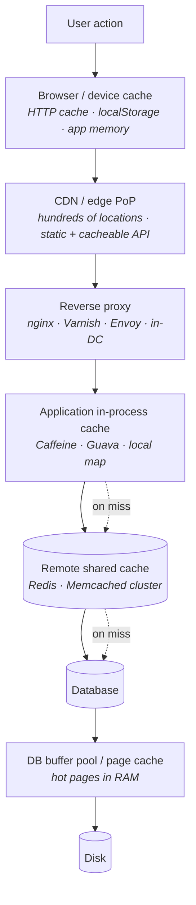
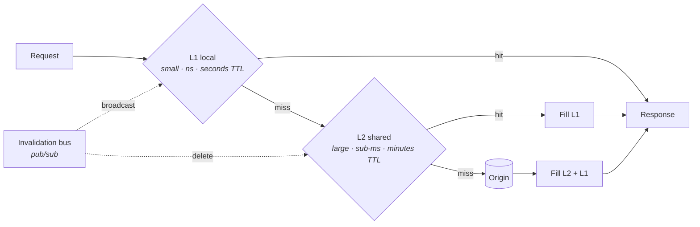
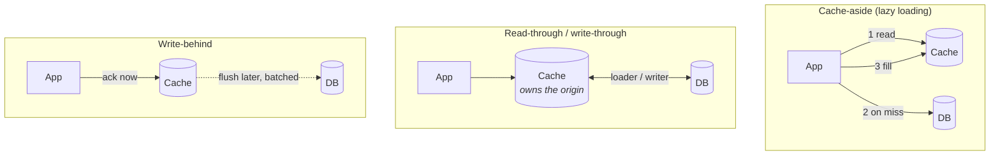
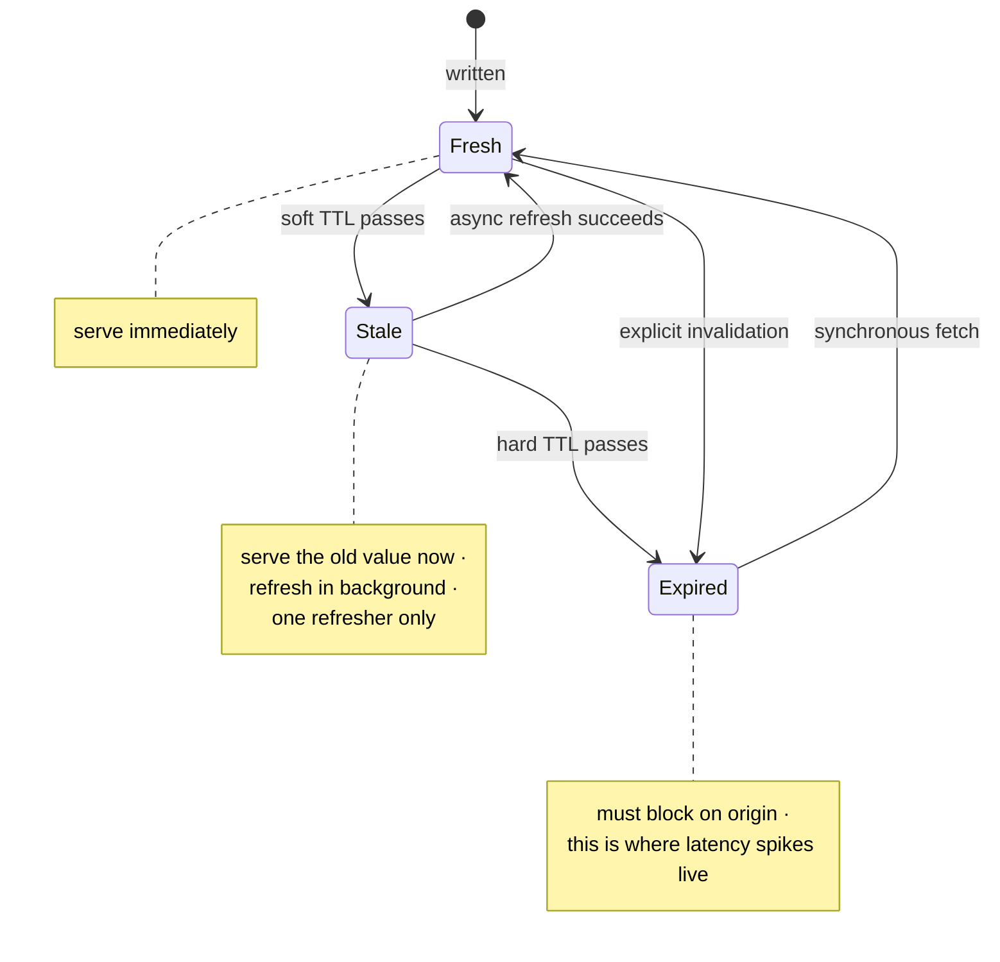
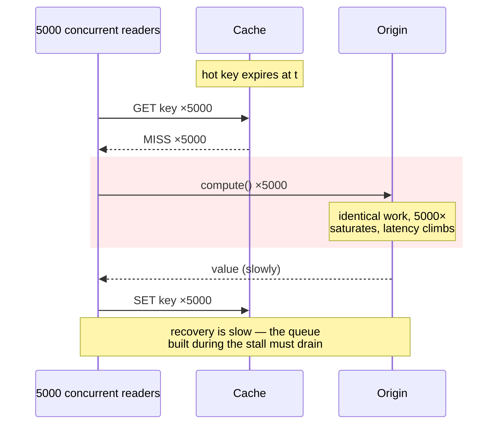
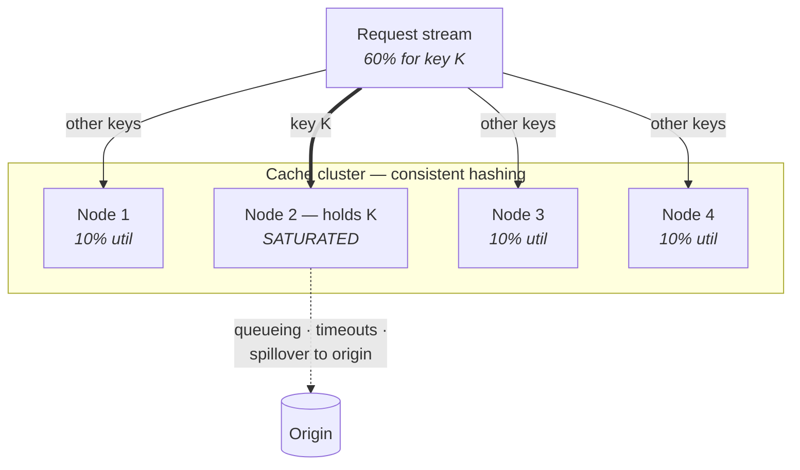
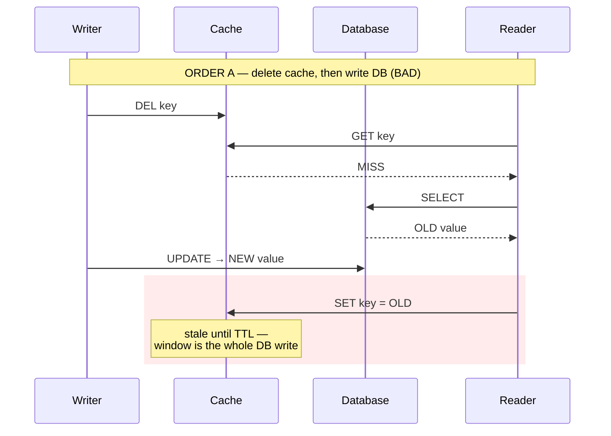
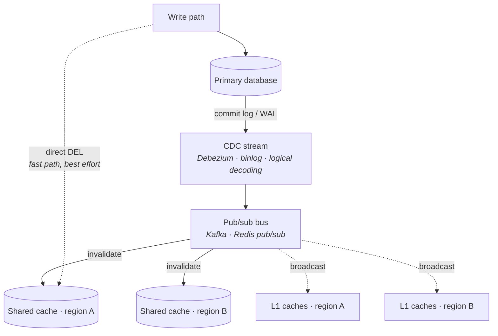

# Caching

Lecture 4 priced storage: every access path has an amplification factor, every index has a maintenance cost, and every read of a cold row is a trip through a B-tree or an LSM level chain to a device. Lecture 1 priced distance: L1 in a nanosecond, DRAM in ~100 ns, NVMe in ~100 µs, a same-AZ round trip in ~0.5 ms, a cross-continent one in ~150 ms. Put those two tables next to each other and caching is the obvious move — you are buying six orders of magnitude by keeping the answer closer than the data.

The obviousness is the problem. Caching is presented as free speed, and at staff level the interviewer is not testing whether you know to add a cache; they are testing whether you know what you just bought. A cache is a *second copy of your data with different durability, different consistency, and a different failure mode from the first*. Every named pathology in this lecture — stampede, penetration, avalanche, hot keys, cold start — is the bill for treating that second copy as free. Work through them, and the rule that closes the chapter falls out on its own: a cache your system cannot survive losing is not a cache, it is a database with a data-loss bug.

## What a cache actually is

- **Definition** — a smaller, faster, *lossy* store holding a subset of a larger, slower, authoritative one. The three adjectives each carry weight.
  - *Smaller* — so something must be chosen to keep, and something evicted. That is [§ Eviction](#eviction).
  - *Faster* — so the win is proportional to the gap between hit cost and miss cost, not to the cache's absolute speed.
  - *Lossy* — the cache may return nothing at any time, for any reason, without warning. Correctness must not depend on it returning something.
- **The governing equation** — effective latency is `t_eff = h·t_hit + (1−h)·t_miss`, where `h` is the hit rate. Two consequences most people skip:
  - `t_miss` on a cache-aside path is *strictly worse* than the uncached path, because a miss pays the cache lookup **and** the origin fetch **and** the fill. A cache with a bad hit rate makes the system slower.
  - Backend load is proportional to `(1−h)`, not to `h`. The hit rate is a headline number; the **miss rate is the number your database feels**.
- **Caching is a bet on locality.** It pays only if access is skewed — temporal (recently used will be reused) or spatial (neighbours will be used). Uniform random access over a keyspace far larger than the cache yields a hit rate near `cache_size / keyspace_size`, which for most real ratios rounds to nothing.
- **What you give up in exchange:** a coherence problem ([§ Coherence and invalidation](#coherence-and-invalidation)), a new failure domain ([§ The five failure modes](#the-five-failure-modes)), a memory bill, and an operational surface that fails in ways the database does not.

**Key distinction:** a cache is an *optimization* if the system is correct and available when every lookup returns a miss. It is *architecture* if it is not. Almost every serious cache incident begins with a team that believed the first and had built the second.

## Where caches live

Caching is not one decision. There are five or six independent layers between a user and a row, and each can hold a copy.

- **Client / device** — free bandwidth, free latency, *zero control*. You cannot invalidate a copy on a phone that is offline. Anything cached here is governed only by the TTL you shipped with it, so ship short TTLs for anything mutable and use content-hashed URLs for anything immutable.
- **CDN / edge** — moves bytes physically closer, defeating the speed-of-light floor from Lecture 1. Best for large, immutable, widely-shared objects. Increasingly used for cacheable API responses with `Cache-Control: s-maxage` plus explicit purge. Purge is not instant — treat it as *eventually* invalidated, seconds to minutes.
- **Reverse proxy** — inside your perimeter, so purge is fast and reliable. Caches whole HTTP responses, which means it saves not just the database read but *all rendering and serialization work*. Cheapest large win in a read-heavy web tier, and the most commonly skipped.
- **Application in-process** — a hash map in the service's heap. Nanoseconds to access, no serialization, no network. Coherence is the price ([§ Local versus remote](#local-versus-remote)).
- **Remote shared cache** — a Redis or Memcached cluster. Sub-millisecond, shared across all instances, survives a deploy. The workhorse layer, and the one people mean when they say "add a cache."
- **Database-internal** — the buffer pool and OS page cache. You do not manage this, but you must reason about it: an "uncached" query hitting a hot page is a RAM read, not a disk read. This is why adding an application cache in front of a well-tuned database sometimes buys far less than the arithmetic promised.

**Rule of thumb:** cache as far up the stack as consistency allows, because each layer up removes more work — not just I/O, but the deserialize, join, render, and serialize on top of it. Then walk back down until the staleness is tolerable.

**The trap:** caching at *every* layer multiplies staleness rather than adding it. A 60-second edge TTL over a 60-second proxy TTL over a 60-second app TTL can serve content three minutes old, and the worst case is invisible in any single layer's configuration. Budget total staleness end to end, and give exactly one layer the long TTL.

## Local versus remote

The single most consequential placement choice, and the one with the cleanest trade-off.

| | Local (in-process) | Remote (shared) |
|---|---|---|
| Hit latency | 10–100 ns | 0.2–1 ms (same-AZ RTT) |
| Serialization | none — live objects | serialize + deserialize every hit |
| Effective size | one instance's heap | **the whole cluster's memory, pooled** |
| Hit rate at fixed total RAM | lower — `N` copies of the same hot set | **higher — one copy, one working set** |
| Coherence | `N` independent copies to invalidate | **one copy, one invalidation** |
| Cold start | per instance, every deploy | survives deploys and restarts |
| Blast radius | contained to one process | **a shared dependency that can take down everything** |
| GC / memory pressure | competes with your application heap | isolated in its own process |

- **Local wins on latency by three to four orders of magnitude.** For a value read many times per request, or on a path with a hard sub-millisecond budget, nothing else is in the running.
- **Remote wins on hit rate and coherence.** With `N` instances and a fixed RAM budget, local caching stores the hot set `N` times over; the shared cache stores it once and spends the rest of the memory on the tail. At `N = 50` this difference is not marginal.
- **The coherence cost of local is `N`-fold and asynchronous.** Invalidating a shared cache is one `DEL`. Invalidating 50 local caches is a broadcast that some instances will process late, some will miss during a restart, and none will acknowledge. Local caches converge; they do not synchronize.
- **The failure asymmetry matters more than the latency.** A remote cache is a shared dependency — when it goes, every instance misses simultaneously, which is [§ Cache avalanche](#cache-avalanche). A local cache degrades one process at a time.

### Near-cache / two-tier designs

The standard resolution: a small local L1 in front of a large shared L2.

- **L1 absorbs the hot head of the distribution.** Under a Zipf-like key distribution, a very small L1 — a few thousand entries — catches a large share of traffic, because the top keys are a large share of traffic. L1 need not be big to be worth having.
- **L2 absorbs the long tail** and carries the real hit rate. It also acts as the shared warm store that lets a restarted instance repopulate L1 in microseconds instead of hitting the origin.
- **Give L1 a much shorter TTL than L2** — seconds versus minutes. The short TTL is your *backstop* for missed invalidation broadcasts, and it bounds worst-case staleness without needing the broadcast to be reliable.
- **The failure mode: divergent L1s.** Instance A got the invalidation, instance B was mid-GC and dropped it. Two users behind a round-robin load balancer now see different values on consecutive refreshes, and the flapping looks like a bug in your application logic. This is the *single most confusing* production symptom in the chapter, and it is why L1 TTLs must be short even when your broadcast "works."
- **Do not put mutable, user-visible, correctness-relevant state in L1.** Put derived, expensive, tolerant-of-staleness things there: config, feature flags with a short TTL, reference data, permission trees, compiled templates.

## Read and write patterns

Five patterns, distinguished by *who talks to the origin* and *when the write reaches it*.

### The five patterns

- **Cache-aside (lazy loading)** — the application owns the logic: read cache, on miss read the origin, then write the cache. Writes go to the origin and *invalidate* the cache key.
  - *Advantages:* only requested data is ever cached; the cache and origin are decoupled; a cache outage degrades to origin-only traffic rather than failing.
  - *Costs:* the logic is duplicated at every call site (put it behind one function, not fifty); every first read is a miss; and the delete-versus-write ordering problem in [§ Delete-then-write versus write-then-delete](#delete-then-write-versus-write-then-delete) is yours to solve.
  - *This is the default.* When an interviewer says "add a cache" with no further qualification, cache-aside is what they picture.
- **Read-through** — the application only ever talks to the cache; the cache library holds a loader function and fetches from the origin itself on a miss.
  - *Advantage:* one code path, and the loader is the natural place to hang single-flight ([§ Thundering herd / cache stampede](#thundering-herd--cache-stampede)) and refresh-ahead — which is why library caches like Caffeine give you stampede protection almost for free.
  - *Cost:* the cache is now on the critical path for *every* read, including misses. You cannot bypass it during an incident unless you built a bypass.
- **Write-through** — a write goes to the cache, and the cache synchronously writes the origin before acknowledging.
  - *Advantage:* the cache is never stale relative to the origin for keys it holds, and the cache is warm for anything just written.
  - *Cost:* every write pays both latencies, serially. And it caches *written* data, which is only useful if written data is soon read — often false. Write-heavy, read-cold keys pollute the cache.
- **Write-behind (write-back)** — the write is acknowledged from the cache immediately and flushed to the origin asynchronously, usually batched and coalesced.
  - *Advantage:* the largest write-throughput win available. Repeated updates to the same key collapse into one origin write, and batching amortizes the origin's per-write cost. This is how counters, view tallies, and rate-limit state are typically handled.
  - *Cost — and this is the whole point:* **acknowledged writes can be lost.** Between the ack and the flush, the data exists only in a volatile store. This is not a caching pattern; it is a durability decision, and it must be made explicitly with a stated acceptable-loss window.
- **Refresh-ahead (proactive refresh)** — the cache asynchronously reloads an entry that is popular and approaching expiry, *before* it expires, so the next reader still hits.
  - *Advantage:* hot keys effectively never miss, which removes the most common stampede trigger entirely.
  - *Cost:* refreshes for keys nobody asks for again are wasted origin load. Gate it on recent access, not on membership. Get the prediction wrong at scale and refresh-ahead becomes a self-inflicted, permanent origin load floor.

### Failure semantics — the question that separates the patterns

**What happens when one of the two writes fails?**

| Pattern | Origin write fails | Cache write fails | Cache unavailable |
|---|---|---|---|
| **Cache-aside (write-then-delete)** | **origin unchanged, cache holds old value — consistent** | **stale until TTL — the dangerous case** | degrade to origin; system still correct |
| Cache-aside (delete-then-write) | cache empty, origin unchanged — safe, just a miss | write never happens; caller errors | degrade to origin |
| Read-through | miss surfaces as an error to the caller | entry simply not cached; next read retries | reads fail unless a bypass exists |
| Write-through | write rejected; cache should not commit | origin has new value, cache has old — **stale** | writes fail |
| Write-behind | **acknowledged write is lost** — silent | n/a, cache is the write path | **acknowledged writes lost** |
| Refresh-ahead | old value served past its intended freshness | refresh is a no-op; falls back to normal expiry | degrade to origin |

- **The answer to "which one leaves stale data on a write failure" is cache-aside with write-then-delete, and write-through.** In both, the origin has been durably updated and the cache still holds the pre-update value, with nothing scheduled to fix it. The system is now serving a value that no longer exists anywhere authoritative, and it will keep doing so until the TTL runs out.
- **This is why every cached key needs a TTL even when you invalidate explicitly.** The TTL is not the invalidation mechanism; it is the *upper bound on the damage from a failed invalidation*. A key with `TTL = ∞` and explicit deletes is one dropped packet away from permanent corruption of a user-visible value.
- **Write-behind's failure is categorically different from the others.** The rest lose freshness. Write-behind loses *data* — and it loses it silently, after the client was told the write succeeded. Never use it for anything a user would file a ticket about.

## Eviction

The cache is full. Something must go. The policy determines which, and it determines your hit rate more than your cache size does at the margin.

### The policies

- **LRU (least recently used)** — evict the entry untouched for longest. Cheap, predictable, matches temporal locality, and correct-by-default for most workloads. Its weakness is total: **one scan destroys it.** A batch job or crawler touching a million cold keys evicts the entire hot set, which was recently used but not as recently as the garbage.
- **LFU (least frequently used)** — evict the entry with the fewest accesses. Immune to scans, since a scanned key has a count of one. Its weakness is the mirror image: **stale popularity.** Yesterday's viral item has a huge count and will never be evicted even though nobody wants it. Fixed by *aged* or *windowed* counters that decay over time.
- **CLOCK (second chance)** — LRU approximated with a circular buffer and one reference bit per entry. The hand sweeps; a set bit is cleared and the entry spared, a clear bit means eviction. **Why it matters:** LRU requires updating a global list on every *read*, which needs a lock and becomes the contention bottleneck in a concurrent cache. CLOCK needs only a single-bit set, no list surgery, no lock. This is why real buffer pools use CLOCK variants rather than true LRU.
- **ARC (adaptive replacement cache)** — keeps two lists, one for entries seen once (recency) and one for entries seen more than once (frequency), plus *ghost lists* of recently-evicted keys from each. A ghost-list hit tells ARC which half it should have made bigger, so it continuously self-tunes the recency/frequency split with no parameter to set. Excellent, and encumbered by a patent history that kept it out of much open-source software.
- **W-TinyLFU** — the modern answer, and the one to name. A tiny LRU *admission window* in front of a main SLRU cache, with a **frequency-sketch admission filter** (a count-min sketch with periodic halving) deciding whether a newly-arrived key is allowed to displace the eviction candidate.
  - The sketch estimates frequency for the entire keyspace in a few bits per counter, so it costs a fraction of the memory that real counters would.
  - Periodic halving of all counters is the aging mechanism, which is what fixes classic LFU's stale-popularity problem.
  - It is the default in Caffeine and is broadly at or near the best measured hit rate across published traces.

### Scan resistance and admission control

- **Scan resistance** — the property that a burst of one-shot accesses does not evict the working set. It is not a nice-to-have; it is the difference between a cache that survives your nightly analytics job and one that flatlines at 03:00 every day and recovers by 04:00.
- **Admission control is the deeper idea, and it is the one to say out loud.** Every classic policy asks *what should I evict?* Admission control asks the prior question: **should this new entry be admitted at all?**
  - A key requested once is *not evidence* that it will be requested again. Admitting it unconditionally means every miss damages the cache, which is exactly the mechanism by which a scan is destructive.
  - W-TinyLFU compares the newcomer's estimated frequency to the victim's and admits only if the newcomer wins. A scanned key loses to a hot key, so the hot set is never displaced — scan resistance falls out of admission, not out of a special case.
- **In an interview:** "LRU with an admission filter" or simply "W-TinyLFU, because a single miss should not be allowed to evict a hot entry" is a sharper answer than reciting the policy list, and it reframes eviction as a *quality-of-evidence* problem rather than a recency one.

## Expiration

Eviction is driven by *pressure*. Expiration is driven by *time*, and it is your only defence against staleness you did not detect.

### Choosing a TTL

- **The TTL is a staleness budget, not a performance knob.** Set it from the question "how wrong may this value be before someone is harmed?" — not from "how long can I get away with."
- Rough calibration: session and auth data in seconds; user profiles and product metadata in minutes; reference and config data in hours; immutable content-addressed objects effectively forever.
- **Longer TTL raises hit rate with diminishing returns and raises staleness linearly.** Past roughly the mean inter-access interval for a key, extending the TTL buys almost no additional hits and buys a great deal of additional staleness. That crossing point is where a TTL should sit.
- **Never use the same TTL constant everywhere.** A single shared `CACHE_TTL = 300` is how uncorrelated keys become correlated and how [§ Cache avalanche](#cache-avalanche) happens.

### Jitter

- **Add randomness to every TTL:** `ttl = base × (1 + random(−0.1, +0.1))`, or an absolute jitter of a similar scale.
- **Why:** keys populated together expire together. A deploy, a warming job, or a traffic spike writes ten thousand keys within a second; with a fixed TTL they all expire within the same second, five minutes later, and the origin takes the whole miss burst at once. Jitter converts a spike into a plateau.
- This is one line of code and it prevents an entire named failure mode. It is the highest return-per-character change in the chapter.

### Soft and hard TTL

Store two deadlines with the value: a soft one at which it is *stale but usable*, and a hard one at which it is *unusable*.

- **In the stale window you serve immediately and refresh behind the request.** The reader never waits on the origin, so p99 stays flat even as entries age. HTTP standardizes exactly this as `stale-while-revalidate`.
- **The hard TTL is the correctness bound** — beyond it, staleness is no longer acceptable and a reader must block.
- **Add `stale-if-error`:** if the origin is down when the refresh fires, keep serving the stale value past the hard TTL rather than failing. A slightly wrong answer beats a 500 for almost every read path, and this turns your cache into genuine outage insurance.
- **Only one refresher per key.** Without single-flight ([§ Thundering herd / cache stampede](#thundering-herd--cache-stampede)), the soft TTL turns every hot key's expiry into a stampede that you have merely moved off the critical path — the origin still gets every concurrent request.

### Active versus lazy expiration

- **Lazy (passive)** — check the timestamp on read; if expired, treat as a miss and delete. Costs nothing when idle and is *exactly correct* from the reader's perspective.
  - **The failure mode:** expired-but-unread entries occupy memory forever. A workload that writes many keys and reads few will fill the cache with garbage that no read will ever arrive to clean up, and eviction pressure then discards *live* entries to make room for dead ones.
- **Active (proactive)** — a background task scans and deletes expired entries.
  - Full scans are prohibitive at scale, so real implementations **sample**: pick a small random batch of entries with TTLs, delete those expired, and if the expired fraction exceeds a threshold, immediately repeat. This converges on the true expired ratio while doing bounded work.
  - **The cost is a latency artifact:** the expiry cycle competes with request serving. On a single-threaded server, a heavy expiry cycle shows up directly as a p99 bump, uncorrelated with your traffic and therefore maddening to diagnose.
- **Every production cache uses both** — lazy for correctness on the read path, active sampling to reclaim memory. Redis is the canonical implementation of this pair; its internals are Lecture 12.

## Hit-rate economics

The number that justifies the cache. Almost everyone reasons about it in the wrong units.

### The marginal value of the next 1%

- **Think in miss rate, not hit rate.** Origin load is proportional to `(1−h)`. That single reframing fixes most bad intuition here.
- Take 1,000,000 requests against an origin that can serve 20,000:
  - `h = 0.90` → 100,000 misses. Origin is 5× over capacity.
  - `h = 0.95` → 50,000 misses. **The 5 points halved the load.**
  - `h = 0.99` → 10,000 misses. Within capacity.
  - `h = 0.999` → 1,000 misses. **The last 0.9 points removed another 90%.**
- **Therefore: the marginal value of hit rate is not linear, it is hyperbolic.** Going 50% → 51% is a 2% load reduction. Going 99% → 99.5% is a 50% load reduction — a *sizing* decision for the entire origin tier.
- **The mirror image is the risk asymmetry, and this is the point that matters at staff level.** A system running at `h = 0.999` has provisioned its origin for 0.1% of traffic. Lose the cache and the origin sees a **1000× step function**. The higher your hit rate, the more catastrophic your cache failure — the same number is both your efficiency metric and your blast radius. Say this in an interview and you have demonstrated the thing the question is actually probing.
- **Latency tells a different story from load.** With `t_hit = 1 ms` and `t_miss = 50 ms`, going 90% → 99% moves mean latency from 5.9 ms to 1.5 ms — a genuine but bounded win. The *load* win over the same interval is 10×. Cache economics are usually about protecting the origin, not about the mean, and the mean is what people quote.

### Working-set size and sizing the cache

- **The working set** is the set of distinct keys accessed within a window that matters — commonly the TTL, or a peak hour. Cache size should be compared against *that*, never against total data volume.
- **Estimate it directly:** count distinct keys per hour from access logs, or from a HyperLogLog over live request keys (Lecture 4 gave you the structure); multiply by mean serialized entry size; add 20–50% for per-entry overhead — key string, TTL, pointers, allocator rounding, and expiry metadata. Small values are dominated by overhead: a 40-byte value in a real cache costs closer to 100 bytes.
- **Build the miss-ratio curve.** Hit rate versus cache size is concave with a distinct knee, because access is skewed: the first few percent of memory captures the head of the distribution and the rest chases a flattening tail.
  - Under Zipf, a cache holding roughly 10% of the keyspace commonly lands in the 80–90% hit-rate range — and doubling it again adds a few points.
  - **Size at the knee, not past it.** Memory bought past the knee is the most expensive hit rate you will ever purchase, and it is the memory you should have spent on a second replica instead.
- **Measure the curve rather than guessing it.** Shadow a fraction of traffic against differently-sized instances, or use a reuse-distance/stack-distance estimator over a sampled trace to produce the whole curve from one pass. Either beats extrapolating from a single observed hit rate.
- **Then check the other direction:** how much origin capacity does the achieved hit rate let you decommission, and what does the origin cost when the cache is gone? If the honest answer to the second question is "an outage," you have not sized a cache — you have built a tier ([§ Cold start and cache warming](#cold-start-and-cache-warming)).

## The five failure modes

Each has a mechanism, a trigger, and a specific mitigation. These are the highest-value paragraphs in the lecture; they are what a staff-level caching question is really asking about.

### Thundering herd / cache stampede

**The mechanism:** one hot key expires. Every concurrent request for it misses simultaneously, and every one of them independently calls the origin to recompute the same value. A key served 5,000 times per second from cache becomes 5,000 simultaneous identical origin queries the instant it expires.

- **Why it escalates rather than self-corrects.** The origin slows under 5,000× load, so each recompute takes longer, so more requests pile into the window before the first fill lands. Load and duration reinforce each other. Without a limiter this is a metastable failure — the system stays down after the trigger is gone, because the retry backlog is now the load.
- **Request coalescing / single-flight — the primary fix.** Per key, exactly one caller is allowed to compute; the rest wait on that caller's result and share it. In-process this is a map from key to in-flight future (Go's `singleflight`, Caffeine's loader semantics). Across processes it is a short-lived distributed lock, with a strict TTL so a crashed holder cannot wedge the key.
  - **Getting single-flight wrong is worse than not having it.** A lock with no expiry deadlocks the key permanently; a lock with no fencing lets a slow holder overwrite a newer value written after its lease expired. Bound the lease, and treat waiters that time out as permitted to serve stale rather than to pile on.
- **Probabilistic early expiration (XFetch) — the more elegant fix.** On each read, recompute early with probability rising as expiry approaches: refresh if `now − delta·beta·ln(rand()) ≥ expiry`, where `delta` is the measured recompute cost. Expensive-to-compute keys refresh earlier; a *single* reader statistically wins the race well before expiry; no locks and no coordination.
- **Refresh-ahead and soft TTL ([§ Soft and hard TTL](#soft-and-hard-ttl)) prevent the stampede from ever starting**, because the entry is never absent — it is refreshed while still servable.
- **Never let a herd exceed the origin's capacity even after all of the above.** Cap origin concurrency per key *and* in aggregate, and shed or serve-stale beyond it. Coalescing reduces the herd; a concurrency limit is what makes the failure survivable when coalescing has a gap.

### Cache penetration

**The mechanism:** requests for keys that **do not exist in the origin either**. The cache misses (nothing to cache), the origin returns empty, nothing is written, and the *next* identical request repeats the whole path. The cache provides zero protection, by construction — every such request is a guaranteed origin hit.

- **Why it is dangerous:** it is the natural shape of an attack. An adversary requesting random nonexistent user IDs routes 100% of their traffic to your database, at full rate, past a cache sized to absorb it. It also occurs benignly: a client bug, a stale ID list, a deleted-entity crawler.
- **Negative caching — cache the absence.** Store an explicit tombstone (`NULL` sentinel, not an empty string, and never an ambiguous empty value) with a **short** TTL — tens of seconds.
  - The short TTL is doing real work: it bounds how long a newly-created entity appears to not exist. Negative entries are the ones most likely to become wrong, so they get the tightest budget.
  - Bound the memory too. Unbounded negative caching of attacker-chosen random keys is itself the attack — you have converted a read amplification into a memory exhaustion.
- **Bloom filter guard — reject impossible keys before any lookup.** Maintain a Bloom filter of all existing keys; a negative answer is *definitive*, so the request is rejected at the edge without touching cache or origin.
  - False positives are harmless — they merely fall through to the normal path. False negatives are impossible, which is precisely the guarantee you need here.
  - **The operational cost is deletion.** A standard Bloom filter cannot remove a member, so deletes require a counting Bloom filter or periodic full rebuild. This is the real reason teams reach for negative caching first and the filter only when volume justifies it.
- **In practice, layer them:** validate key *format* at the edge (a malformed ID never reaches the cache), Bloom-filter the existence check, negative-cache what gets past. Each layer is cheaper than the one behind it.

### Cache avalanche

**The mechanism:** a large fraction of the cache becomes unavailable *at once*, and the origin receives the full uncached request rate — the `1000×` step function from [§ The marginal value of the next 1%](#the-marginal-value-of-the-next-1). Two distinct triggers, often conflated:

- **Mass simultaneous expiry** — keys written together with identical TTLs expire together. A warm-up script, a bulk import, or recovery from a previous incident populates a million keys in one minute; exactly one TTL later, they all vanish at once.
- **Cache node or cluster loss** — a Redis failover, an OOM kill, a network partition, or a bad deploy. The hit rate goes to zero instantaneously with no expiry involved at all.

**Mitigations, in order of leverage:**

- **TTL jitter ([§ Jitter](#jitter))** — solves the first trigger completely and costs one line.
- **Staged warming** — after a flush, failover, or deploy, do *not* open the floodgates. Admit traffic in steps (1%, 5%, 25%, 100%), letting the cache fill at each step before increasing. Without this, every recovery attempt re-avalanches and you never converge.
- **Origin concurrency limiting and load shedding** — a hard cap on concurrent origin queries, with excess requests shed fast or served stale. **This is the one that actually saves you**, because it holds regardless of which trigger fired. An origin that refuses 60% of requests instantly is still serving 40%; an origin that accepts all of them serves 0%.
- **Circuit breaking around the origin** — trip on error rate or latency, fail fast, probe periodically. Prevents the retry storm that turns a recoverable overload into a metastable one.
- **Multi-tier caching ([§ Near-cache / two-tier designs](#near-cache--two-tier-designs))** — an L1 in every instance means the loss of L2 is a hit-rate cliff, not a hit-rate zero. Local caches are a *bulkhead* against shared-cache loss, which is an argument for them independent of latency.
- **Replicate the cache tier and spread it across AZs**, so a single node or zone loss removes a fraction of the keyspace rather than all of it. Consistent hashing (Lecture 2's territory) ensures losing one node of `N` redistributes only `1/N` of keys instead of remapping everything.

### Hot keys

**The mechanism:** access is skewed not just across the keyspace but *pathologically* onto one key — a celebrity profile, a flash-sale item, a global config entry, a trending post. All traffic for that key hashes to **one shard**, so that shard saturates while the rest of the cluster idles. Adding cache nodes does nothing: the key still maps to one of them.

- **The symptom is deceptive.** Cluster-wide CPU and memory look fine; only p99 is broken. Per-node and per-key metrics are the only place it shows. If you cannot see per-key request rates, you cannot diagnose this, and most teams cannot.
- **Key replication (key splitting)** — store `K` as `K#0 … K#n` across `n` shards and have readers pick a suffix at random. Load divides by `n`. The cost is that invalidation must now touch all `n` copies, and there is a window where replicas disagree. Use it for read-mostly hot keys, not for anything that changes per request.
- **Client-side / local caching of hot keys — the strongest mitigation.** A key read 60% of the time is by definition read constantly by every instance, so an L1 entry with a 1–5 second TTL removes essentially all of that traffic from the shard. This is exactly the Zipf-head argument from [§ Near-cache / two-tier designs](#near-cache--two-tier-designs), and it is why near-caches exist. Redis's client-side caching with invalidation tracking is the productized form.
- **Request collapsing** — the same single-flight machinery from [§ Thundering herd / cache stampede](#thundering-herd--cache-stampede), applied per instance, so `N` concurrent local requests for the hot key become one upstream request.
- **Detection: track per-key rates with a count-min sketch or a heavy-hitters (space-saving) algorithm** in the client or proxy, and promote detected hot keys into the local cache automatically. Adaptive promotion beats a hand-maintained list, because tomorrow's celebrity is not on today's list.
- **The trap:** hot keys are *created by events*, not by design. Your key distribution was fine in load testing and becomes pathological the moment a post goes viral or a single config key is added to a hot path. Design the mitigation before you have the incident, because the incident arrives without warning.

### Cold start and cache warming

**The mechanism:** a cache with no entries provides no protection. Every request is a miss, the origin sees full traffic, and if the origin has been sized against a warm cache — which is the entire point of caching — it cannot serve it.

**When you get a cold cache, and none of these are rare:**

- **Deploy or restart** — every instance's local cache is empty; a rolling deploy staggers this, a simultaneous restart does not.
- **Failover** — the new cache node has no data. Replicas that replicate *data* preserve warmth; replicas that merely stand by do not, and many teams do not know which they have.
- **Scale-out** — a new instance added under load starts cold and immediately receives its share of traffic. It is slower than its peers, so health checks may flap, so it is replaced by another cold instance. Autoscaling under load can therefore make things worse — the classic capacity cliff.
- **Flush or eviction storm** — someone runs a flush, or a memory-limit change evicts most of the cache at once.

**Warming techniques:**

- **Preload the known-hot set at startup** from a persisted list of top keys, before the instance reports healthy. Costs deploy time; buys a flat latency profile.
- **Gate readiness on warmth.** Do not accept production traffic until hit rate crosses a threshold. This is the fix for the scale-out flap, and it is one line in a readiness probe.
- **Ramp traffic in** — the staged warming of [§ Cache avalanche](#cache-avalanche), applied per instance rather than per cluster.
- **Shadow traffic** — mirror a copy of live reads to the cold instance without serving its responses, so it warms on the real key distribution rather than a guessed one. The most accurate method and the most infrastructure.
- **Persist or replicate the cache** — Redis RDB/AOF snapshots or a warm replica so a restart resumes with data rather than empty. This works, and it is also the on-ramp to the mistake below.

**Why a cache that is required for availability is a database.**

- If losing the cache means an outage, then the cache is **load-bearing infrastructure**, not an optimization — regardless of what you call it in the architecture diagram.
- And a load-bearing cache has database responsibilities it was never built to meet:
  - **Durability** — a cache is designed to lose data. Eviction under memory pressure is a *feature*, and it discards your entry with no notification and no error.
  - **Consistency** — a cache has no transactions, no isolation, and no ordering guarantee across keys. You cannot atomically update two entries.
  - **Backup and recovery** — there is usually no point-in-time recovery, no snapshot policy, and no tested restore.
  - **Capacity guarantees** — memory limits evict silently. The cache does not tell you it dropped the row your availability depends on.
- **Therefore, state it plainly: a cache required for availability is a database with a data-loss bug.** It has taken on a database's obligations while retaining a cache's guarantees, and the gap between those two is where the incident lives.
- **What to do instead:** pick one, deliberately. Either **size the origin to survive a total cache loss** — perhaps degraded, perhaps shedding load, but serving — or **promote the store to a real database** with durability, replication, backups, and a tested restore, and accept the cost that comes with it. What you must not do is keep calling it a cache while depending on it like a database.
- **Test it.** Kill the cache in a game day and observe whether the system degrades or dies. This is the only way to know which of the two systems you actually built, and the answer is frequently a surprise.

## Coherence and invalidation

Two copies, one truth. Everything here is about bounding the interval in which they disagree.

### Invalidation strategies

- **TTL-only** — never invalidate; let entries expire. *Simplest possible design*, no invalidation code, no invalidation bugs, and staleness bounded by exactly one number you can read off the config. Use it whenever the TTL you need is short enough to be acceptable. Its limits: you cannot get freshness below the TTL, and you pay a miss on every expiry whether or not anything changed.
- **Explicit delete** — on write, delete the key. Fresh on the next read, and it costs one round trip. **Delete, do not update** — see [§ Delete-then-write versus write-then-delete](#delete-then-write-versus-write-then-delete). Its weakness is that a delete is a fire-and-forget operation that can be lost, which is why it needs a TTL underneath it as a backstop.
- **Versioned keys** — embed a version or content hash in the key: `user:42:v7`. A write bumps the version, so subsequent reads simply address a *different key* and the old one ages out on its own.
  - **The old value is never served, because nothing looks it up.** This removes the entire class of invalidation-ordering races in [§ Delete-then-write versus write-then-delete](#delete-then-write-versus-write-then-delete) — there is no window in which a stale value can be read, because the stale value is unreachable by name.
  - Costs: you need the current version available cheaply (a version pointer, a monotonic counter, an `updated_at`), and dead versions occupy memory until evicted. Usually a good trade.
  - This is the same mechanism as content-hashed asset URLs at the CDN, and it is why static asset invalidation is a solved problem while API invalidation is not.
- **Tag-based (group) invalidation** — associate keys with tags (`product:99`, `tenant:7`) and invalidate a whole tag at once.
  - Solves the genuinely hard case: one write invalidates many derived entries — a product update touching its detail page, three list pages, a search facet, and a recommendation block — and the writer has no way to enumerate them.
  - Implemented either with a tag→keys index (accurate, and the index itself must be maintained and can drift) or a tag→generation counter embedded in the key (cheap, self-cleaning, and a generation bump orphans entries that must age out).
  - Available at the edge as surrogate keys / cache tags in most CDNs; it is the most under-used technique in this section.

### Delete-then-write versus write-then-delete

The race that produces real, long-lived, user-visible stale data. It is a favourite interview probe because it is short, subtle, and has a definite answer.

- **Order A — delete cache, then write the database — is wrong, and its race window is wide.** Between the delete and the write's commit, any reader misses, reads the *old* row, and repopulates the cache with it. The writer then commits, and the cache holds a value that contradicts the database until the TTL expires. The window is the full duration of the database write — milliseconds, easily hit at any real request rate.
- **Order B — write the database, then delete the cache — is the correct default.** For staleness to persist, a reader must have read the old row *before* the writer's commit **and** perform its cache `SET` *after* the writer's delete. That requires the reader to stall across the entire write-plus-delete, which is possible but far less likely, since reads are typically much faster than writes.
- **Order B still has a window, so bound it:**
  - **Delayed double delete** — after writing and deleting, sleep past the plausible read-stall duration and delete again, asynchronously. Ugly, effective, and widely deployed.
  - **A TTL on every key** — the universal backstop, capping the damage from any lost or losing delete.
  - **Versioned keys ([§ Invalidation strategies](#invalidation-strategies))** — eliminates the race outright rather than shrinking it, and is the right answer when correctness matters.
  - **CDC-driven invalidation ([§ Multi-instance and multi-region coherence](#multi-instance-and-multi-region-coherence))** — the invalidation is derived from the commit log, so it is ordered *after* the commit by construction and cannot be reordered against it.
- **Never *update* the cache in place on a write; delete it.** Two concurrent writers can commit to the database in one order and set the cache in the opposite order, leaving the cache permanently holding the loser's value with nothing to detect it. Deletion is idempotent and order-insensitive; a set is neither.
- **Secondary benefit of deleting:** you avoid caching data nobody reads. A delete repopulates lazily, on demand; an update writes a value that may never be requested.

### Multi-instance and multi-region coherence

- **Pub/sub invalidation broadcast** — the writer publishes a key-invalidated event; every instance subscribes and drops its local copy. Simple and low-latency.
  - **It is best-effort, and you must design for that.** An instance that is restarting, GC-paused, or partitioned misses the message and there is no redelivery. Pub/sub is fire-and-forget by nature.
  - **Therefore pub/sub is a latency optimization on top of a TTL, never a replacement for one.** The broadcast makes invalidation fast in the common case; the TTL makes it *eventually correct* in every case. Ship both.
  - Watch the fan-out: `writes × instances` messages. A high write rate with hundreds of subscribers becomes its own load problem, and coarse tag-level invalidation is usually the fix.
- **CDC-driven invalidation** — tail the database's replication log (logical decoding, binlog, oplog) and emit invalidations from committed changes.
  - **The decisive advantage is ordering and completeness.** The invalidation is derived from the commit itself, so it cannot precede the commit, cannot be forgotten by an application code path that someone added last month, and covers writes made by migrations, admin tools, and manual `psql` sessions — all of which bypass application-level invalidation entirely.
  - The stream is durable and replayable, so a consumer that was down catches up rather than silently missing invalidations.
  - Costs: an extra pipeline to operate, and *higher* invalidation latency than a direct delete — replication lag plus consumer lag, typically tens to hundreds of milliseconds.
  - **The common production design is both:** a direct delete on the write path for speed, and CDC as the authoritative, self-healing backstop that catches everything the fast path missed.
- **Cross-region is a different problem, because invalidation cannot outrun the write's own replication.** With ~150 ms of cross-continent RTT (Lecture 1), the remote region's cache cannot be made consistent faster than the data itself arrives.
  - Accept region-local caches as eventually consistent, and size their TTLs against the replication lag rather than against the local write latency.
  - **Do not invalidate a remote cache before the remote replica has the new data** — the refill will read the old value from the local replica and re-cache it, which is exactly Order A from [§ Delete-then-write versus write-then-delete](#delete-then-write-versus-write-then-delete) played out at continental scale. Drive remote invalidation from the *remote* replica's apply position, not from the primary's commit.

### What a cache can and cannot guarantee

**A cache can give you:**

- **Bounded staleness** — "no more than `T` seconds old," where `T` is the TTL. This is the strongest guarantee a cache offers, and it is a genuinely useful one.
- **Eventual consistency** — assuming invalidations are eventually delivered or TTLs eventually fire. Practically always achievable.
- **Read-your-own-writes, if you engineer it** — the writer invalidates before responding, and subsequent reads from that user are pinned to a path that will observe the invalidation. Deliberate work, not a default.
- **Monotonic reads within one instance** — a single local cache will not go backwards on its own. Across instances with independent L1s, it will ([§ Near-cache / two-tier designs](#near-cache--two-tier-designs)).

**A cache cannot give you:**

- **Linearizability.** Reader A and reader B can observe different values at the same instant, and there is no total order. If you need linearizable reads, read the origin.
- **Cross-key atomicity.** Two related entries have independent lifetimes; there is no way to make them expire or update as a unit, and a reader can see a new `user` with an old `permissions`.
- **A guarantee that any entry exists.** Eviction is silent and unannounced. Every read path must handle a miss without exception.
- **Ordering across keys or across regions.** Invalidations may arrive in any order, and multi-region delivery has no ordering at all.

**The design rule that follows:** decide the *maximum tolerable staleness per data class*, then choose the mechanism. Seconds → TTL-only. Sub-second → explicit invalidation plus a short TTL. Zero → **do not cache it**, or cache only a version pointer and read the value through it. There is no configuration that makes a cache strongly consistent; there is only a decision about which data may be stale.

## Grounding: real systems, real numbers

- **Facebook's Memcached deployment** is the canonical published study. At their scale the fixes named here were mandatory, not optional: **leases** — a token issued to exactly one client on a miss, permitting it alone to fill the key (single-flight, [§ Thundering herd / cache stampede](#thundering-herd--cache-stampede)) and simultaneously rejecting fills that are stale relative to a newer invalidate; **gutter pools** — small standby caches absorbing traffic for a failed node so a node loss does not become an origin avalanche ([§ Cache avalanche](#cache-avalanche)); and **invalidation via the replication stream**, i.e. CDC before it had the name ([§ Multi-instance and multi-region coherence](#multi-instance-and-multi-region-coherence)). Their reported hit rates sit in the high 90s, which by [§ The marginal value of the next 1%](#the-marginal-value-of-the-next-1) means the database tier was provisioned for a few percent of read traffic.
- **`stale-while-revalidate` and `stale-if-error`** (RFC 5861) are [§ Soft and hard TTL](#soft-and-hard-ttl) standardized into HTTP and implemented by every major CDN. If you name only one expiration technique, name this pair — it converts expiry from a latency spike into a background refresh, and an origin outage into slightly-stale success.
- **Netflix EVCache** is the multi-tier, multi-AZ pattern at production scale: replicated caches per availability zone so a zone loss removes one copy rather than the keyspace, sitting in front of Cassandra. It is also a clear case of a cache that is architecturally load-bearing — and it is engineered accordingly, with replication and capacity planning to match, which is the [§ Cold start and cache warming](#cold-start-and-cache-warming) rule honoured rather than violated.
- **Redis and Memcached, at the pattern level.** Memcached is a pure multithreaded LRU cache with no persistence and no data structures — the honest cache. Redis adds data structures, optional persistence, replication, pub/sub, and client-side caching with invalidation tracking, which makes it more useful and makes it much easier to accidentally depend on it as a database. Internals are Lecture 12; the caution belongs here.
- **Numbers worth carrying into a room:** a same-AZ Redis `GET` in ~0.2–1 ms round trip including client overhead; a local in-process hit in tens of nanoseconds; a single Redis node sustaining O(100k) simple ops/sec on one core; per-entry overhead of roughly 50–100 bytes before your value; and a well-cached read path landing 90–99% hit rates, where the difference between those two endpoints is a **10× difference in database load**.
- **Named failure patterns to recognize:** the **metastable failure** — load persists after the trigger clears because retries have become the load ([§ Thundering herd / cache stampede](#thundering-herd--cache-stampede)); the **capacity cliff** — a cold instance is slow, fails health checks, is replaced by another cold instance, and never converges ([§ Cold start and cache warming](#cold-start-and-cache-warming)); and **retry amplification** — three retry layers stacked over a stampede turn a 5,000× herd into a 135,000× one. Cache incidents are almost never "the cache was slow"; they are "the cache stopped absorbing, and nothing downstream was sized for that."

## Takeaways

- **A cache is a second copy with weaker guarantees.** Everything expensive about caching — staleness, invalidation races, stampedes, cold starts — follows from that one sentence, and none of it is avoidable by configuration.
- **Reason in miss rate, never hit rate.** Origin load is proportional to `(1−h)`. 99% → 99.9% is a 10× load reduction, and it simultaneously means your origin is provisioned for 0.1% of traffic. Your efficiency number is also your blast radius.
- **Every key gets a TTL, and every TTL gets jitter.** The TTL is not the invalidation mechanism; it is the bound on damage when invalidation fails. The jitter is what stops correlated expiry from becoming an avalanche.
- **Write the database, then delete the cache — never delete first, and never update in place.** Delete-then-write leaves stale data for the full width of the write; in-place update lets two writers commit in one order and cache in the other, permanently.
- **The five failure modes each have a named fix, and knowing the pairing is the interview signal:** stampede → single-flight and probabilistic early expiry; penetration → negative caching and Bloom guards; avalanche → TTL jitter, staged warming, and an origin concurrency cap; hot keys → key replication and a local L1; cold start → gated readiness and staged traffic ramp.
- **Admission control beats eviction policy.** The question "should this entry be admitted?" is stronger than "what should I evict?", and it is where scan resistance actually comes from. W-TinyLFU is the name to know.
- **Local and remote caches trade latency against hit rate, coherence, and blast radius** — and the two-tier near-cache resolves most of it, provided the L1 TTL is short enough to survive a missed invalidation broadcast.
- **A cache required for availability is a database with a data-loss bug.** Either size the origin to survive total cache loss, or promote the cache to a real durable store with backups and a tested restore. Then run the game day, because the answer to which system you built is usually not the one on the diagram.

**Next:** messaging and event-driven architecture — decoupling in time rather than in latency.
