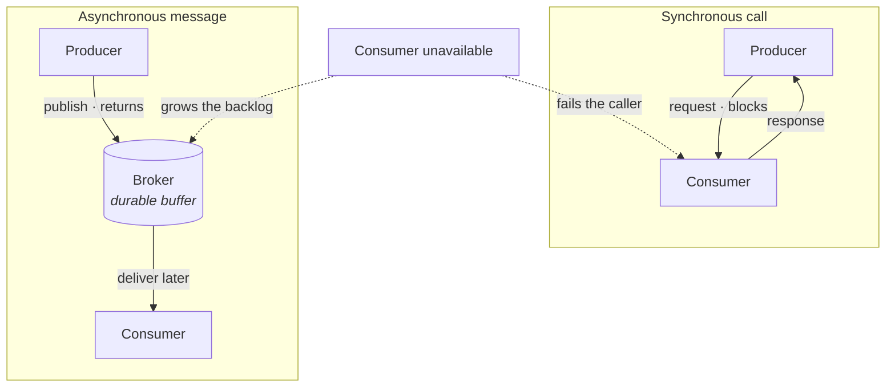
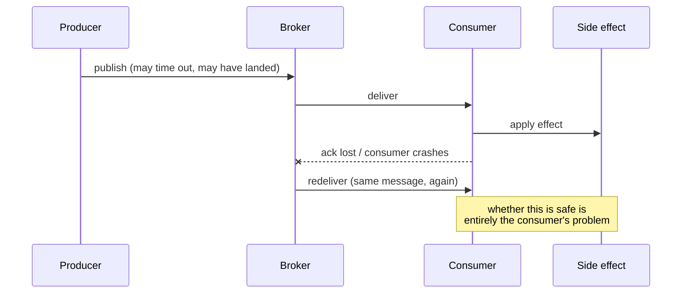
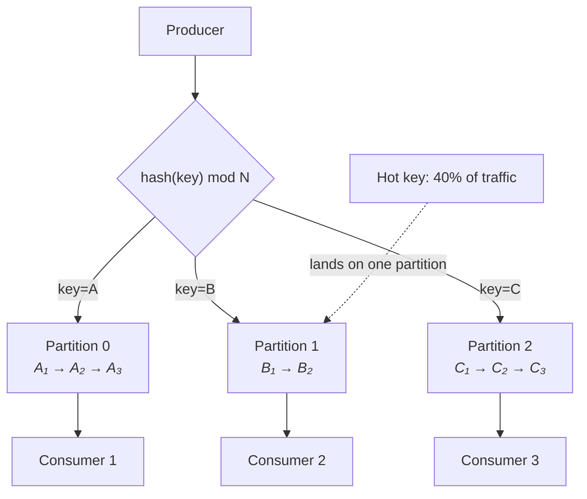
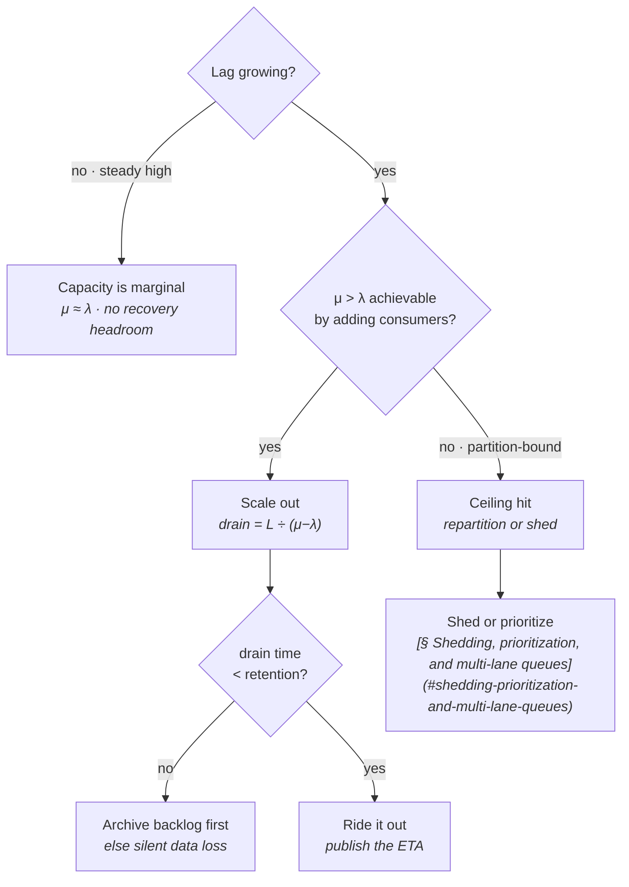
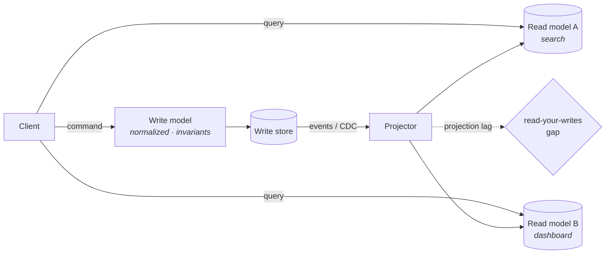
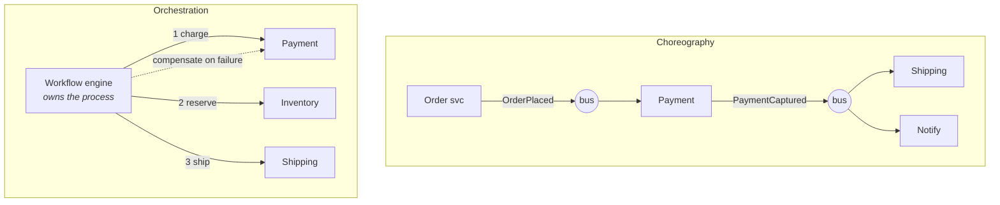

# Messaging and Event-Driven Architecture

You have already built two messaging systems without calling them that. Lecture 4's transactional outbox and change-data-capture pipeline was a durable log with at-least-once delivery and an idempotent consumer at the far end. Lecture 5's cache invalidation fan-out was a publish/subscribe topic with a tolerance for lost messages and a TTL as its safety net. In both cases the messaging was incidental — a mechanism smuggled in to solve a storage or caching problem.

This lecture promotes it to a first-class layer. Once messaging is explicit, a specific set of questions becomes unavoidable: what does the broker promise about delivery, what does it promise about order, who pays when the consumer is slower than the producer, and what happens to a message that can never succeed. Almost every distributed-systems failure that reaches a postmortem is one of those four questions answered by default rather than by decision.

## Synchronous request/response versus asynchronous messaging

Start with what "asynchronous" actually buys you, because it is not primarily about speed.

- **Synchronous request/response** — the caller blocks (logically, if not on a thread) until the callee answers. The caller knows the outcome. The caller also *owns* the outcome: if the callee is down, the caller's request fails.
- **Asynchronous messaging** — the caller hands a message to a broker and considers its job done. The outcome arrives later, or never, or is observed elsewhere. The broker owns the message in the interim.

**The real distinction is not latency — it is where the failure of the downstream service surfaces.** Synchronously, it surfaces in the caller's request. Asynchronously, it surfaces as a growing queue.

### Three kinds of coupling

- **Temporal coupling** — synchronous callers require the callee to be *up right now*. Asynchronous producers do not; the broker absorbs the outage. This is the single largest benefit and the reason messaging is the standard answer for "must not lose the work."
- **Availability coupling** — synchronous availability multiplies. A request that fans out to five services each at 99.9% has a ceiling near 99.5%. Asynchronous hops do not multiply, because a down consumer does not fail the producer — it only delays the effect.
- **Schema coupling** — this one does *not* go away. The consumer still has to understand the payload. Messaging removes coupling in time and availability, and leaves coupling in *format* fully intact. Teams routinely believe they decoupled their services when they only decoupled their uptimes.

**The trap:** treating asynchrony as a decoupling silver bullet. You have replaced a synchronous contract you can test at deploy time with an implicit contract that breaks in production weeks later, on a consumer you did not know existed. Schema registries and compatibility rules ([§ Schema evolution and upcasting](#schema-evolution-and-upcasting)) exist because of exactly this.

### The latency budget versus resilience trade-off

- **Asynchrony does not reduce end-to-end latency; it reduces *perceived* latency for the caller.** The work still happens. You have moved it off the critical path, not removed it.
- **What you gain:** the caller returns in the time it takes to durably enqueue — often single-digit milliseconds — regardless of how long the real work takes. Load spikes become backlog rather than timeouts. Retries become the broker's problem.
- **What you pay:**
  - **The result is no longer available to the caller.** Anything that needs the outcome now (a validation, a price, an authorization decision) cannot be made asynchronous without changing the product.
  - **Eventual consistency leaks to the user.** "Your order is being processed" is a UX consequence of an architectural choice.
  - **A whole second failure domain.** The broker, its retention, its consumers, and their lag are now yours to operate.
  - **Debuggability.** A synchronous stack trace becomes a correlation ID scattered across four services and a dead-letter queue.

**Rule of thumb:** make it synchronous if the caller needs the answer to proceed *and* the callee is fast and on the same failure budget. Make it asynchronous if the work is durable, retriable, and the caller only needs an acknowledgement of intent. Anything else is a judgement call about which failure you would rather explain.

## Queues, topics, and message semantics

Two orthogonal choices sit at the top of every messaging design: how many consumers get a given message, and what the message *means*.

### Point-to-point queues versus publish/subscribe

- **Point-to-point (queue)** — a message is delivered to *exactly one* of the competing consumers. The queue is a work-distribution mechanism. Adding consumers increases throughput; it does not increase the number of times work happens.
- **Publish/subscribe (topic)** — a message is delivered to *every* subscriber. The topic is a broadcast mechanism. Adding subscribers adds new independent effects.
- **The composite that most real systems use:** a topic with consumer *groups*. Each group receives every message (pub/sub across groups); within a group, one member handles each message (queue semantics inside a group). Kafka's consumer groups, SNS-to-SQS fan-out, and RabbitMQ's exchange-to-queue bindings are three spellings of this same shape.

**Key distinction:** a queue's identity belongs to the *worker pool*; a topic's identity belongs to the *fact*. If you find yourself adding a second queue that carries the same messages for a different purpose, you wanted a topic.

### Command, event, and document messages

The single most useful vocabulary in this lecture, because it determines who owns the logic.

- **Command** — *"do this."* `ChargeCard`, `SendEmail`. Directed at one specific consumer, expects an effect, and carries the sender's intent. The sender knows what should happen. Naming is imperative.
- **Event** — *"this happened."* `OrderPlaced`, `PaymentCaptured`. Immutable statement of past fact, addressed to no one in particular. The sender does *not* know or care who reacts. Naming is past-tense.
- **Document** — *"here is some data."* A payload with no verb and no implied action: a snapshot, a batch file, a reference-data update. The receiver decides what it means.

**Why this matters more than it sounds:** commands put the workflow logic in the sender; events put it in the receivers. A system built from commands has a visible orchestrator. A system built from events has its behaviour spread across subscribers and no single place that describes the process ([§ Choreography versus orchestration](#choreography-versus-orchestration)). Choosing the message type is choosing where the process lives.

**The failure mode:** the *event-shaped command*. A message named `OrderPlaced` that the publisher actually expects to trigger exactly one specific consumer to charge a card. It is a command wearing an event's name, and it produces the worst of both — the publisher secretly depends on a specific subscriber, but nobody documents the dependency because "it's just an event."

### Event-notification versus event-carried state transfer

Given that you are publishing an event, how much do you put in it?

- **Event notification** — a thin message: type, entity ID, timestamp, version. `OrderPlaced{order_id: 12345}`. The consumer calls back to the producer's API for details.
  - *Pros:* tiny payloads, no data duplication, no stale copies, the producer keeps a single source of truth, and the schema surface is minimal.
  - *Cons:* reintroduces temporal coupling through the back door — the consumer's processing now requires the producer to be *up*. Also produces a callback storm: N consumers × M events = N·M synchronous reads, all hitting the producer at once right after a burst.
- **Event-carried state transfer** — a fat message carrying enough state for the consumer to act alone. `OrderPlaced{order_id, customer, line_items, totals, address}`.
  - *Pros:* genuine autonomy. The consumer never calls back and can process the whole backlog with the producer offline. It can also build its own local read model ([§ CQRS](#cqrs)).
  - *Cons:* data is duplicated across services and is stale by construction; the payload becomes a public contract, so any field a consumer starts using is now impossible to remove; and events get large, which costs broker throughput and retention.

**Rule of thumb:** notification when consumers are few, latency-tolerant, and need mostly-fresh detail. State transfer when consumers are many, need autonomy, or are building materialized views. **The trap** is drifting to state transfer by accretion — each consumer asks for "just one more field" until the event is a full serialization of the producer's internal model, at which point you have published your database schema.

## Delivery guarantees and acknowledgement

Be precise here — this is the passage interviewers probe hardest.

### The three semantics

- **At-most-once** — ack before processing (or fire-and-forget). Every message is delivered zero or one times. **Fast, lossy, and occasionally correct**: metrics samples, cache invalidations backed by TTL, live presence updates. Never for money or state transitions.
- **At-least-once** — ack after processing. Every message is delivered one or more times. **This is the default and the right default.** Duplicates are guaranteed to occur eventually, because the ack path can fail after the effect succeeded.
- **Exactly-once** — the thing everyone asks for.

**The precise statement, and you should say it in exactly this form: exactly-once *delivery* is impossible; exactly-once *processing* is achievable.**

- Delivery is impossible because the acknowledgement is itself a message that can be lost. The sender cannot distinguish "the receiver never got it" from "the receiver got it and the ack was dropped." Its only options are resend (risking a duplicate) or not (risking a loss). This is the Two Generals problem and no broker escapes it.
- Processing is achievable because the *effect* can be made insensitive to duplicates. At-least-once delivery plus an idempotent consumer ([§ Idempotent consumers](#idempotent-consumers)) yields exactly-once *effects*, which is what anyone actually wanted.
- **What brokers that advertise "exactly-once" really provide:** producer idempotence (sequence-numbered writes deduplicated broker-side) and transactional atomicity between consuming, processing, and producing *within the broker's own boundary*. That is genuinely useful for stream-to-stream pipelines. It does nothing for the moment your consumer calls Stripe.

| Semantics | Mechanism | Loses? | Duplicates? | Use when |
|---|---|---|---|---|
| At-most-once | ack before work | yes | no | loss is cheap and re-derivable |
| **At-least-once + idempotent consumer** | **ack after work · dedup key** | **no** | **absorbed** | **almost always** |
| Exactly-once (broker-internal) | transactional read-process-write | no | no, within broker | stream→stream, no external effects |

### Acknowledgement models

- **Auto-ack** — the broker considers the message delivered as soon as it hits the wire or the client library's buffer. This *is* at-most-once, regardless of what the docs call it. A consumer crash loses everything in flight.
- **Manual ack** — the consumer explicitly acks after the work is durable. Gives at-least-once. Two sub-choices matter:
  - **Ack granularity** — per message (fine-grained, more round trips) versus batched or offset-committed (fewer round trips, but a crash replays the whole uncommitted batch).
  - **Ack ordering** — offset-based brokers ack a *position*, so committing offset 100 implicitly acks everything before it. That makes out-of-order completion within a batch unsafe: if 97 is still running when you commit 100, a crash silently drops 97.
- **Negative ack (nack)** — the consumer explicitly says "I cannot process this." Options are requeue-now, requeue-with-delay, or route-to-dead-letter ([§ Dead-letter queues and poison messages](#dead-letter-queues-and-poison-messages)). **Nack-with-immediate-requeue is a hot loop**: the message comes straight back, fails again, and burns a consumer thread at full speed. Always attach a delay.
- **Visibility timeout / lease** — the pull-based equivalent. The broker hands out a message with a lease; if no ack arrives before the lease expires, it becomes visible to another consumer. **The failure mode is the slow consumer**: work that outlives its visibility timeout is redelivered *while still running*, producing genuine concurrent duplicate processing rather than sequential redelivery. Either extend the lease with a heartbeat or size the timeout above your p99.9 processing time.

## Ordering versus parallelism

Ordering and throughput are not merely in tension — they are the same resource spent two ways.

### The three scopes of ordering

- **Global (total) order** — every message on the topic is processed in publish order. Requires a single writer and a single consumer. Throughput is capped at one core's worth of work. Real systems essentially never do this at scale, and asking whether you truly need it is the first question.
- **Per-partition order** — messages within one partition are ordered; across partitions there is no relationship. This is what log-based brokers give you and what almost everything is built on.
- **Per-key order** — the useful one. Partition by a key (`user_id`, `account_id`, `order_id`) so all messages *for the same entity* land in the same partition and are therefore ordered relative to each other. Different entities are independent, which is almost always true in the domain anyway.

- **Parallelism is bounded by partition count.** Adding consumers past the number of partitions leaves the extras idle. Partition count is therefore a capacity decision made at topic-creation time, and it is awkward to change — repartitioning moves keys to new partitions and breaks per-key ordering across the change.
- **A hot key destroys the model.** One celebrity account, one enormous tenant, one runaway device: its partition saturates while the others idle. Aggregate lag looks fine; that one partition is hours behind. **Always graph lag per partition, never only in aggregate.**
- **Escape hatches for hot keys, each with a cost:** salt the key (`user_id:bucket`) and give up per-user ordering; split the hot entity into its own dedicated topic; or handle it with a single-key-aware consumer that batches. There is no free option — you are trading away exactly the ordering you partitioned to get.

### Where ordering requirements really come from

- **Most "we need ordering" requirements are actually "we need convergence."** If handlers are commutative — set-to-value rather than increment, last-writer-wins with a version — order stops mattering and you regain unlimited parallelism.
- **Versioned state beats ordered delivery.** Carry a monotonically increasing version or sequence in the event and have consumers discard anything not newer than what they have. Out-of-order delivery becomes harmless, and this also solves duplicates for free.
- **In an interview:** when ordering comes up, immediately name the scope you need (per-key, near-certainly), state the parallelism ceiling it implies, and mention the hot-key caveat. Claiming you need global ordering without justification is a red flag; claiming order never matters is the opposite one.

## Durability and retention

Two designs share the word "broker" and behave nothing alike.

### In-memory versus disk-backed

- **In-memory brokers** — messages live in RAM, optionally replicated. Microsecond-to-low-millisecond publish latency, and a node loss takes the unreplicated messages with it. Correct for telemetry, presence, live pricing ticks, and anything whose value expires in seconds.
- **Disk-backed brokers** — messages are written to a log and fsynced (or at least replicated) before the publish is acknowledged. Publish latency rises to a few milliseconds; messages survive a broker restart.
- **Replication is the real durability knob, not the disk.** A message acknowledged after one local fsync is lost if that disk dies; a message acknowledged after replication to three nodes survives one dying, even without an fsync. The producer-side question is *how many replicas must acknowledge before the producer's publish returns* — the direct analogue of the write-quorum choice from Lecture 4, with the identical latency-versus-durability shape.
- **The window nobody closes:** a producer whose publish times out does not know whether the message landed. This is why the outbox pattern from Lecture 4 exists — it makes the publish decision a local transaction so the ambiguity is resolved by a retry loop against a durable record rather than guessed at.

### Log retention versus queue drain

This is the most consequential architectural difference between broker families.

- **Queue semantics** — a message is removed once acknowledged. The queue's depth is the amount of *outstanding work*. Consumers are destructive readers. A message consumed is gone, so a second consumer that needed it must have had its own copy of the queue.
- **Log semantics** — messages are appended to an ordered, immutable log and retained for a *time or size bound* regardless of consumption. Consumers track their own position (offset). Reading is non-destructive.

**What log retention buys you, and it is a lot:**

- **Replay.** A consumer with a bug can reset its offset and reprocess a week of history. In a queue this is impossible — the data is gone. This capability alone justifies log-based brokers for most event-driven work.
- **Adding a subscriber after the fact.** A new service can start from the beginning of retention rather than from "now."
- **Consumer independence.** A slow consumer does not affect a fast one; they are just at different offsets in the same file.

**Its genuine costs:**

- **Retention is a hard deadline.** A consumer down longer than the retention window loses data permanently, with no error at the time it happens — it just silently resumes at the earliest available offset. Alert on *lag approaching retention*, not only on lag.
- **Storage grows with the retention window times the full traffic volume**, not with the backlog.
- **No per-message operations.** You cannot delete a single bad message from a log, and you cannot see "how many messages are unprocessed" without computing it from offsets.
- **Compaction is the partial escape** — keep only the latest value per key and drop older ones, converting the log into an eventually-complete snapshot of current state. This is what makes stream/table duality work ([§ Stream/table duality](#streamtable-duality)).

## Push versus pull, and backpressure

Who decides when the next message moves determines who absorbs an overload.

- **Push** — the broker sends to consumers as messages arrive. Lowest latency, and the broker must track per-consumer state and readiness.
- **Pull** — consumers request batches when ready. Slightly higher latency (a poll interval, or a long-poll), and dramatically simpler broker state: the broker holds a log and answers "give me from offset X."

**Backpressure in each model:**

- **Pull has backpressure for free.** A consumer that is behind simply stops asking. The backlog accumulates in the broker, which is designed to hold it. This is the fundamental reason log-based systems are pull-based.
- **Push must simulate backpressure explicitly**, via a credit mechanism: prefetch counts, unacknowledged-message limits, or per-consumer flow-control windows. AMQP's `prefetch` / `basic.qos` is exactly this — the broker will not send consumer *n* more than *k* unacked messages.
- **The push failure mode:** unbounded prefetch. The broker floods a consumer, which buffers messages in memory, and either OOMs or holds so many unacked leases that they all time out and get redelivered to *other* consumers — turning a slow consumer into duplicated work across the whole fleet. A prefetch of 1–10 for slow, heavy handlers and a few hundred for fast ones is the usual shape; unlimited is never right.
- **The push advantage worth naming:** with a low prefetch, push gives excellent *work balancing* — a slow consumer naturally receives less. Pull with static partition assignment does the opposite: a slow consumer keeps its full partition share and simply falls behind.

**Rule of thumb:** pull for high-throughput streaming with per-key ordering; push with a small prefetch for heterogeneous, long-running jobs where per-task duration varies wildly. Long-polling is the standard compromise and is what SQS does.

## Consumer scaling and rebalancing

- **Competing consumers** — the basic pattern: N identical workers on one queue, broker hands each message to one of them. Scaling is adding workers. This works cleanly *only* when there is no ordering requirement.
- **Partition-bound parallelism** — with per-key ordering, each partition is owned by exactly one consumer in the group. Parallelism ceiling equals partition count ([§ The three scopes of ordering](#the-three-scopes-of-ordering)). Over-provision partitions relative to today's consumers so you have headroom; under-provisioning is expensive to fix later.
- **The two-level parallelism trick:** consume a partition with one thread but dispatch work to a pool keyed by the message key, so ordering is preserved per key while a single partition uses many cores. It works, but you now own offset-commit bookkeeping across in-flight parallel work — you may only commit up to the lowest incomplete offset, and getting that wrong loses messages silently.

**Rebalancing — when group membership changes, partitions are reassigned:**

- Triggered by a consumer joining, leaving, crashing, or *appearing* to crash by missing heartbeats.
- **The stop-the-world problem:** in the classic eager protocol, every consumer in the group revokes all its partitions, the coordinator computes an assignment, and everyone resumes. **Nothing is processed for the whole rebalance** — typically seconds, sometimes tens of seconds for large groups. A rolling deploy of 20 consumers can trigger 20 rebalances back to back.
- **The pathological version is the rebalance storm.** A consumer with a long poll interval and a slow handler exceeds the max-poll timeout, is presumed dead, and is ejected — which triggers a rebalance, which stalls the others, which pushes *them* past their timeouts. The group thrashes and throughput reaches zero while every consumer is healthy.
- **What to do instead:**
  - **Cooperative / incremental rebalancing** — only the partitions that actually change hands are revoked; everyone else keeps working. This is now the default in modern clients and largely dissolves the stop-the-world problem.
  - **Static group membership** — give each consumer a stable identity so a restart within a timeout window reclaims its own partitions without a rebalance at all. This is the single highest-value setting for deploy-heavy services.
  - **Keep handler time well under the max-poll interval**, or heartbeat from a separate thread. Long-running work per message belongs in a job system, not inline in a poll loop.

## Retries and dead letters

### Retry policy

- **Retry only what is retriable.** A 503, a timeout, a connection reset, a lock conflict — retry. A 400, a schema violation, a missing foreign key — retrying is pure waste and the message will still fail on attempt 50. Classifying errors into *transient* and *terminal* is the first and most-skipped step.
- **Exponential backoff** — delay doubles per attempt (`100ms, 200ms, 400ms, …`) with a cap. Rationale: if the dependency is overloaded, retrying at the same rate keeps it overloaded.
- **Jitter is not optional.** Without it, every client that failed during the same incident retries at the same instant, producing a synchronized thundering herd that re-kills the service the moment it recovers. Full jitter — sleep a uniform random value in `[0, backoff]` — is the standard and near-optimal choice.
- **Retry budgets / adaptive retries.** Cap retries as a *fraction of overall traffic* (e.g. retries may not exceed 10% of requests) rather than per-request. Per-request caps are useless during a broad outage: every request retrying three times is a 4× load multiplier applied exactly when the dependency can least afford it. A global budget makes the system stop retrying when retrying is clearly not working. Circuit breakers are the same idea expressed as a state machine.
- **Cap total attempts and total elapsed time.** A message retried for six hours is usually worse than a message dead-lettered in five minutes, because nobody is looking at the retry loop and someone is looking at the DLQ.

**Retry storms and amplification:**

- **Amplification is multiplicative across layers.** Client retries 3× into a gateway that retries 3× into a service that retries 3× is a 27× amplification of a single user action. This is how a modest dependency blip becomes a total outage.
- **Retry at exactly one layer.** Pick the layer that knows enough to classify errors — usually the one closest to the failing dependency — and make every other layer fail fast. Say this out loud in an interview; it is the fix most candidates miss.
- **Retries plus a queue is a different beast than retries plus a synchronous call.** In a queue you can afford long, patient, delayed retries because nobody is blocked. Use a delay queue ([§ Delay queues, visibility timeouts, and scheduled messages](#delay-queues-visibility-timeouts-and-scheduled-messages)) rather than sleeping inside the handler — sleeping burns a consumer slot and drags down every other message behind it.

### Dead-letter queues and poison messages

- **A poison message** is one that will never succeed: malformed payload, references a deleted entity, triggers a consumer bug. Left in the main queue with infinite retries, it is a permanent throughput tax — and in an ordered partition, it is a **head-of-line block that halts everything behind it indefinitely**. This is the most severe consequence in the whole lecture: a single bad message stopping an entire key's or partition's processing.
- **The dead-letter queue** is where a message goes after exhausting retries. Its purpose is to *unblock the main flow* by moving the failure somewhere it can be examined without stopping work.
- **Capture context, not just the payload.** A DLQ entry needs the original message, headers, the exception and stack, the attempt count, the consumer version, and a timestamp. A DLQ full of raw payloads with no error information is almost useless for triage.
- **Log-based brokers do not have DLQs natively** — you cannot remove a message from a log. The equivalent is: consumer catches the terminal error, publishes the message plus context to a separate `*.dlq` topic, and commits the offset so the partition advances. Skipping the offset commit is the mistake that produces a stuck partition.

**DLQ operations, which are the part that gets neglected:**

- **A non-empty DLQ is an alert, not a metric.** Alert on `dlq_depth > 0` sustained, and on *rate of arrival* — a sudden influx is almost always a deploy that broke deserialization, and the sooner you know the less you have to replay.
- **Triage** — group by error signature. Ten thousand DLQ messages are almost always three distinct bugs.
- **Replay must be a first-class, tested tool**, not a script someone writes under pressure at 3 a.m. Replay needs rate limiting (a full DLQ dumped back into a healthy queue is a self-inflicted load spike), needs to be idempotent ([§ Idempotent consumers](#idempotent-consumers)), and needs the ability to filter and to drop poison entries permanently.
- **DLQs need retention and monitoring like any other queue.** A DLQ that silently expires messages after four days converts "we have a bug" into "we lost data."

## Idempotent consumers

At-least-once delivery guarantees duplicates, so this section is what makes the whole architecture correct rather than approximately correct.

- **Idempotent** means applying the same message twice produces the same state as applying it once. Not "the handler runs once" — the handler *will* run twice, and the second run must be harmless.

**The three mechanisms, in order of preference:**

- **Natural idempotency** — the operation is inherently repeatable. `SET status = 'shipped'` is idempotent; `UPDATE count = count + 1` is not. `PUT /resource/123` with a full body is; `POST /resource` is not. **Reshaping the operation to be absolutely-valued rather than relatively-valued is the cheapest possible fix**, and it is available far more often than people assume.
- **Unique-constraint idempotency** — derive a deterministic key from the message (a producer-assigned `message_id`, or a hash of business fields) and make it a unique key on the table you write. The second attempt fails on the constraint and you treat that specific violation as success. No extra store, no extra failure mode, and the database's own atomicity does the work. This is the best general answer.
- **Explicit dedup store** — a table or key-value store of processed message IDs, checked before processing and written after. Needed when the effect is not a single database write.
  - **The critical detail:** the dedup write and the effect must be in the *same transaction*, or you have simply moved the duplicate window. If you write the effect, crash, then never record the ID, you will redo the effect.
  - **Dedup stores need a TTL** or they grow without bound. The TTL must exceed the maximum possible redelivery window — retention plus max retry delay — or a late redelivery slips past an expired entry.
  - **This is idempotency by bookkeeping**, and bookkeeping can fail. Prefer the previous two options.
- **Processed-offset tracking** — the log-based variant. Store the last processed offset per partition *in the same transaction as the effect*, and on startup resume from your own stored offset rather than the broker's committed one. This gives exactly-once processing against an external database without any distributed transaction, and it is the standard technique for sink connectors.

**External side effects — the honest part:**

- You cannot make "send an email" or "charge a card" idempotent by yourself. You need the *downstream* to accept an idempotency key. Stripe's `Idempotency-Key` header exists precisely for this and is the model to cite.
- Where the downstream offers nothing, the best available answer is a local record written before the call and reconciled after, accepting a small window where a crash yields a duplicate. **Say this plainly in an interview** — claiming full exactly-once across a third-party API you do not control is a correctness claim you cannot back.

## Backlog management

The single most important operational section. If you take one operational thing from this lecture, take drain-rate math.

### Lag as the key SLI

- **Consumer lag** = the number of messages published but not yet processed, per partition. It is the queue analogue of latency, and it is the metric to alert on.
- **Message-count lag is the wrong unit for humans.** "Two million messages behind" means nothing without a rate. **Time lag** — the age of the oldest unprocessed message, or `lag ÷ consumption rate` — is the number to put on a dashboard and in an SLO. "We are 40 minutes behind" is actionable; "we are at 2.1M" is not.
- **Alert on the derivative too.** Steady lag at a high level is a capacity problem. *Growing* lag is an incident, and it is an incident whose severity is knowable in advance from the math below.

### Drain-rate math

This is a small amount of arithmetic that answers every question anyone will ask during an incident.

- Let `λ` be the arrival rate, `μ` the aggregate processing rate (per-consumer rate × consumer count), and `L` the current backlog.
- **Net drain rate is `μ − λ`.** Time to drain is `L ÷ (μ − λ)`.
- **If `μ ≤ λ`, the backlog never drains** — it grows without bound. No amount of waiting helps; you must add capacity or shed load.
- **Worked shape:** producer at 10,000 msg/s, consumers at 12,000 msg/s aggregate, backlog of 20 million. Drain rate is 2,000/s, so drain time is 10,000 s ≈ 2.8 hours. To halve that you must double the *surplus*, not the capacity — going to 14,000/s (a 17% capacity increase) doubles the surplus to 4,000/s and halves drain time to 1.4 hours. **Near the break-even point, small capacity changes have enormous effects on recovery time; far above it, they barely matter.**
- **Recovery capacity must exceed steady-state capacity, and by a lot.** A consumer fleet sized at exactly peak `λ` never catches up from any outage. Size for `μ ≈ 1.5–2 × λ` at peak if you care about recovery time, and accept the idle cost as insurance.
- **The ceiling you will hit first:** if parallelism is partition-bound ([§ The three scopes of ordering](#the-three-scopes-of-ordering)), adding consumers past the partition count changes nothing. During an incident this is the moment people discover their partition count was a capacity decision. Check it *before* the incident.
- **The retention interaction:** compare drain time against the retention window. If drain time exceeds retention, you are going to lose the oldest messages while you recover. That converts a latency incident into a data-loss incident and changes the response — you now bulk-copy the backlog to cold storage first, then drain.

- **The diagram is an incident runbook, not a taxonomy.** The first branch — is lag growing — decides whether you are looking at a capacity smell or an active incident.
- **The partition-bound branch is where most real incidents end up**, and its only fast answers are shedding and prioritization, because repartitioning under load is not something you want to attempt live.
- **The retention check is the branch people forget**, and it is the one that determines whether the postmortem says "delayed" or "lost."

### Shedding, prioritization, and multi-lane queues

- **Load shedding** — deliberately drop or reject work to protect the rest. Viable only for messages whose loss is tolerable: analytics events, non-critical notifications, refreshable derived data. Shedding must be *explicit and counted*, never an accidental consequence of retention expiry.
- **Prioritization.** True priority queues are operationally nasty — high-priority traffic starves low-priority traffic indefinitely, and priority ordering interacts badly with partitioning. **What to do instead: multiple queues, one per priority class, with dedicated or weighted consumer capacity.** Separate topics with separate consumer groups give the same effect with none of the starvation surprises, and let you scale each class independently.
- **Multi-lane queues by workload shape** — the more valuable use of the same idea. Separate the fast-and-cheap from the slow-and-expensive, and separate per-tenant lanes for large tenants. This directly prevents head-of-line blocking: one tenant's million-message import cannot delay every other tenant's single events.
- **The bulkhead principle:** a lane that fails should fail alone. Shared consumer pools across lanes quietly undo the isolation you built the lanes to get.

## Event sourcing

### The mechanism

- **The event log is the source of truth.** You do not store current state and log changes; you store the ordered sequence of state *changes* and derive current state by replaying them. `AccountOpened, Deposited(100), Withdrew(30)` is the record; balance 70 is a computed view.
- **Projections** — read models built by folding the event stream. There can be many, each shaped for a different query, each rebuildable from scratch by replaying.
- **Snapshots** — replaying ten years of events to answer one query is untenable, so periodically persist the folded state at a known version and replay only events after it. Snapshots are a *cache*, always discardable and always rederivable. Treating a snapshot as authoritative reintroduces exactly the corruption risk event sourcing was meant to remove.

**What it genuinely buys you:**

- **A perfect, immutable audit trail** — not a log *about* what happened, but the actual record from which state was derived. For regulated domains this alone can justify it.
- **Temporal queries** — "what was this account's state on March 3rd" is a replay to a point in time, not a schema feature you have to have anticipated.
- **New read models retroactively.** A question nobody asked when the system was built can be answered over the full history, because the raw facts were never discarded.
- **Debugging by replay** — reproduce a bug by replaying the exact event sequence into a fixed handler.

### Schema evolution and upcasting

The hardest ongoing cost, and the one people underestimate.

- **Events are immutable and permanent, so old versions never go away.** You cannot run a migration over history the way you would over a table — rewriting events destroys the audit property that motivated the design.
- **Upcasting** — on read, transform an old event version into the current shape before it reaches the handler. `OrderPlacedV1 → V2` fills a defaulted field; `V2 → V3` splits a name. Upcasters chain, and the chain only ever grows.
- **The accumulating burden:** after three years you have a pipeline of version transformers that nobody fully understands, must all keep working, and must all be tested — because if any one of them is wrong, your entire history decodes wrongly.
- **Weak-schema mitigation** — store events in a tolerant format (JSON, or Avro/Protobuf with a registry and strict compatibility rules) so additive changes need no upcaster at all. Additive-only evolution is the discipline that keeps this tractable: add optional fields, never remove or repurpose one.
- **Copy-and-transform as the escape hatch** — write a new stream by transforming the old one, and keep the old one for audit. Expensive, disruptive, and sometimes the only sane option after enough drift.

### When event sourcing is overkill

**Be blunt about this — a candidate who can argue against event sourcing is more convincing than one who can only argue for it.**

**The costs you are signing up for:**

- **Every query becomes a projection you must build, maintain, and rebuild.** There is no ad hoc query over the truth; there is only replay.
- **Eventual consistency is now unavoidable**, because reads come from projections that lag writes ([§ CQRS](#cqrs)).
- **Rebuild time grows with history forever.** A projection that took two minutes to rebuild in year one takes four hours in year four, and rebuilds happen exactly when you are already in an incident.
- **The schema burden of [§ Schema evolution and upcasting](#schema-evolution-and-upcasting), permanently.**
- **Small-team tooling gap.** Debugging, ad hoc reporting, and onboarding are all harder, and the ecosystem is far thinner than for "a table in Postgres."
- **Deletion is structurally hostile to GDPR-style erasure.** The standard workaround is crypto-shredding — encrypt personal fields per subject and destroy the key — which is a real design commitment, not a footnote.

**It is overkill when:**

- The domain is CRUD. If the business genuinely thinks in "update the customer's address," modelling it as a change stream adds ceremony and subtracts clarity.
- **The audit requirement is satisfiable with an audit table.** This is the most common case by far. An append-only history table alongside a normal mutable state table gives you 90% of the audit benefit for 5% of the cost, and it is the right default answer.
- History is not queried. If nobody ever asks "what was it before," you are paying for temporal queries you will not run.
- The team is small or new to the pattern. Event sourcing done partially is worse than not at all — the usual outcome is a mutable state table treated as truth *plus* an event log nobody trusts, so you carry both costs and get neither benefit.

**Rule of thumb:** event-source the *one or two* aggregates where history is genuinely the business — ledgers, order lifecycles, regulated approvals — and leave everything else as ordinary state. Whole-system event sourcing is nearly always a mistake; targeted event sourcing is frequently excellent.

## CQRS

- **Command Query Responsibility Segregation** — separate the model that handles writes from the model(s) that serve reads. The write model is normalized and enforces invariants; the read models are denormalized, per-query-shaped, and disposable.
- **CQRS and event sourcing are independent.** You can do CQRS with a plain database and a replicated read store; you can event-source without CQRS. They are commonly paired because event sourcing forces projections, which are CQRS read models. Conflating them is a common interview error.

- **The write path and the read path no longer share a store**, so each can be scaled, indexed, and modelled for its own access pattern — this is the whole point, and it is the same idea as Lecture 3's OLTP/OLAP split applied within one service.
- **The projector is the new critical component.** It is a consumer, so everything in [§ Consumer scaling and rebalancing](#consumer-scaling-and-rebalancing)–[§ Backlog management](#backlog-management) applies to it: it can lag, it can crash, it can poison, and its lag is a user-visible SLI.
- **The dotted edge is the entire cost of the pattern.** Everything difficult about CQRS lives in that gap.

**Projection lag:**

- Reads are stale by the projection's lag. Typically milliseconds; during a rebuild or an incident, minutes to hours.
- **Rebuilds are the sharp edge.** Reprojecting a large read model means either serving stale data throughout or going dark. The standard technique is **shadow rebuild**: build the new projection alongside the live one, verify, then atomically switch the read alias. Budget for it in storage.
- **A projection can be wrong, not just late.** A bug in the projector produces a read model that diverges silently. Periodic reconciliation against the write model — a checksum or count comparison — is the only way to find it, and it belongs in the design from day one.

**Read-your-writes in a CQRS system — name at least three of these:**

- **Read from the write model for the writing user.** Simple, correct, and gives up the read-model benefit for that path. Often the right answer for a small number of endpoints.
- **Return the new state in the command response.** The client already knows what it just did; hand it the projected result directly rather than making it re-query. Cheapest fix, and the most underused.
- **Version tokens (read-your-writes barrier).** The write returns a version or offset; the client passes it on subsequent reads; the read model either waits until it has caught up to that version or reports staleness. This is the general solution, at the cost of a protocol between client and read side.
- **Sticky routing** by session to a read replica known to have the write. Fragile — it breaks under failover and rebalancing — but common.
- **Client-side optimistic overlay.** The UI displays the pending change locally and reconciles when the projection catches up. Not architecture, but it is what actually ships, and it is legitimate for a large class of user-facing writes.

## Choreography versus orchestration

Two ways to make several services accomplish one business process.

- **Choreography** — each service reacts to events and emits its own. No central coordinator. Maximum decoupling, minimum ceremony, and adding a participant requires changing nothing that exists.
- **Orchestration** — a coordinator holds the process definition and issues commands to participants. The process is explicit, in one place, and readable.
- **The trade is decoupling against comprehensibility**, and comprehensibility is worth more than teams expect at the three-year mark.

**Choreography's real problem is observability, and it deserves its own naming:**

- **The process exists nowhere.** No file, no diagram, no service describes the order fulfilment flow — it is an emergent property of which handlers happen to be subscribed. Answering "what happens when an order is placed" requires reading every service.
- **"Where is order 12345 stuck?"** has no cheap answer. You must correlate logs across every participant, and if one subscriber silently failed, there is no state machine that shows a missing transition — only an absence.
- **Cyclic reaction chains** appear accidentally: A's event triggers B, whose event triggers C, whose event triggers A. Nobody designed it and nobody can see it.
- **What to do instead, or alongside:** mandatory correlation/causation IDs on every message, distributed tracing spanning broker hops (trace context propagated in message headers), and a process-observer service that consumes all relevant events and materializes the *implied* state machine purely for visibility. That last one is the pragmatic fix and is worth naming.

**Orchestration's costs, stated honestly:** the orchestrator is a coupling point and a potential bottleneck, it must know every participant's interface, and it can grow into a distributed monolith where all logic accretes centrally.

**Workflow engines and durable execution:**

- **A durable execution engine persists the workflow's progress after every step**, so a process that takes three weeks and spans a dozen services survives crashes, deploys, and restarts. Temporal, AWS Step Functions, Cadence, and Azure Durable Functions are the named examples.
- **The programming model is the appeal:** the workflow reads as ordinary sequential code — call, await, branch, sleep for 30 days — and the engine handles persistence, retries, timeouts, and resumption underneath.
- **Compensation, not rollback.** There is no distributed transaction here; a failed step at position 4 means running compensating actions for steps 3, 2, 1 — refund the charge, release the inventory. This is the saga pattern, and orchestration is by far the easier way to implement it because the compensation order lives in one place.
- **Rule of thumb:** choreography for simple, additive fan-out where reactions are genuinely independent (`UserSignedUp` → send email, provision, analytics). Orchestration for anything with more than about three steps, a compensation requirement, a timeout, or an operator who will one day ask why a specific instance is stuck.

## Stream/table duality

A small idea with disproportionate explanatory power.

- **A stream is a table's changelog; a table is a stream's current state.** They are two views of the same information, and you can convert freely in both directions.
  - *Stream → table:* fold the change events by key, keeping the latest per key. This is a materialized view.
  - *Table → stream:* emit each row change as an event. This is change data capture — Lecture 4's mechanism, now recognizable as one half of a duality.
- **Log compaction is materialization performed by the broker.** A compacted topic retains only the most recent message per key, so replaying it from the beginning reconstructs current state rather than full history. The topic *is* the table, in transit.
- **Why this matters practically:**
  - **A compacted topic is a legitimate way to distribute state.** New service instances bootstrap by reading the compacted topic to the end, then stay current from the same stream — no separate snapshot API, no separate backfill path.
  - **It reframes stream processing.** Joins between a stream of events and a table of reference data are just joins between two streams, one of which you have folded.
  - **It explains why event sourcing and CDC feel similar** — they are the same duality entered from opposite ends. Event sourcing starts with the stream and derives tables; CDC starts with the table and derives a stream.
- **The one caveat to state:** compaction means you *lose history* — only the latest value per key survives. A compacted topic is a snapshot mechanism, not an audit log. If you need both, you need two topics, and confusing the two is how audit trails quietly disappear.
- **Deletion via tombstone** — a null-valued message for a key tells compaction to remove that key entirely. Tombstones themselves are retained for a bounded period, which is a subtle gotcha for slow consumers: a consumer down longer than the tombstone retention will never see the delete and will keep a phantom key forever.

## Fan-out patterns

The canonical application of everything above: delivering one producer's item to many consumers' views.

- **Write fan-out (push on write)** — when an item is created, write a copy into every recipient's materialized feed. Reads are a single sequential lookup and are extremely fast. Writes cost O(followers).
- **Read fan-out (pull on read)** — store the item once; at read time, gather from everyone the reader follows and merge. Writes are O(1). Reads cost O(following) and a merge.

| | Write fan-out | Read fan-out |
|---|---|---|
| Write cost | O(recipients) | O(1) |
| Read cost | O(1) | O(sources) + merge |
| Latency for readers | low, precomputed | higher, computed live |
| Storage | duplicated per recipient | single copy |
| Celebrity producer | catastrophic — millions of writes | fine |
| Inactive recipients | wasted writes | no waste |
| **Hybrid by producer size** | **normal producers** | **celebrities merged at read** |

- **The hybrid is the answer, and it is the point of the table.** Fan out on write for ordinary producers; for producers above a follower threshold, do not fan out at all — store once and merge their items into the reader's feed at read time. Each reader merges their precomputed feed with a handful of celebrity streams. This is what large social systems actually do.
- **The threshold is an operational tuning knob**, not a constant. It moves with your write capacity and your read latency budget, and it should be adjustable without a deploy.
- **Other refinements worth naming:** skip fan-out to accounts inactive for N days and compute their feed lazily on return; cap materialized feed length (a few hundred entries) and paginate deeper reads from source; and treat fan-out as a background job — a follower-heavy post that takes a minute to fully distribute is acceptable, a post that blocks the author's request for a minute is not.

**Push versus pull for feed and notification delivery — the same question one layer up, at the client edge:**

- **Push to the device** (WebSocket, SSE, mobile push) — lowest latency, but requires connection state per active user, which is a large fixed cost, and delivery is unreliable enough that it cannot be the only path.
- **Pull/poll from the client** — trivially scalable and stateless, at the cost of latency and of wasted requests when nothing has changed. Conditional requests (ETag, `If-Modified-Since`) reduce the waste substantially.
- **The standard production shape is both:** push as a low-latency hint that something changed, pull as the authoritative fetch and as the reconciliation path after any disconnect. **Never make push the sole delivery mechanism** — a dropped connection then means permanently missed data, and clients drop connections constantly.

## Scheduling and delayed work

Time-based triggering is messaging with a delivery time attached, and it has its own distinct failure modes.

### Delay queues, visibility timeouts, and scheduled messages

- **Delay queue** — a message becomes visible only after a delay. This is the correct implementation of "retry in 5 minutes" and of "cancel the order if unpaid in 30 minutes." **Never implement a delay by sleeping in the handler** — it holds a consumer slot, blocks the messages behind it, and is lost on restart.
- **Visibility timeout** ([§ Acknowledgement models](#acknowledgement-models)) doubles as a scheduling primitive: nacking with a longer visibility timeout is a delay. Note the ceiling — brokers cap the maximum delay (SQS at 15 minutes), so longer waits need chaining or a dedicated store.
- **Scheduled messages** — deliver at an absolute time. Watch for the **thundering herd at round times**: everyone schedules for midnight, or exactly one hour out, and the scheduler emits a spike. Jitter scheduled times the same way you jitter retries.
- **A log-based broker cannot do this natively** — a log has one order and it is the append order. Delays need either a separate delay topic per tier (the "5s / 30s / 5m topic ladder"), or an external scheduling store.

### Timer wheels and time-bucketed stores

- **The naive approach** — a database table of pending timers polled with `WHERE fire_at <= now()` — works to surprising scale and is the right first implementation. It degrades when the table is large and the poll is frequent: the index scan and the contention on claiming due rows dominate.
- **Time-bucketed stores** — partition timers by time bucket (per minute, per hour) so each poll reads exactly one small partition rather than scanning a global index. Cassandra/DynamoDB-backed schedulers use this shape: the partition key is the bucket, and due work is a single partition read.
- **Timer wheel** — a circular array of buckets, each holding the timers due in that tick. Advancing the wheel one tick fires one bucket. **Insert and cancel are O(1)** rather than O(log n) for a heap, which is why kernels and network stacks use them for millions of short timers.
  - **Hierarchical timer wheels** — cascading wheels at second/minute/hour granularity handle long ranges without an absurd number of buckets, at the cost of a cascade step when a coarse bucket expires and its contents are redistributed into finer wheels.
  - **The trade:** a timer wheel is in-memory and therefore not durable. Production schedulers pair a wheel for near-term precision with a durable store for the long tail, loading the next window into the wheel periodically.
- **Precision is a cost, and it is usually negotiable.** Second-granularity delivery is dramatically cheaper than millisecond-granularity. Ask what precision the requirement actually needs before designing for the tighter one.

### Cron at scale

Running periodic work across a fleet has three named problems.

- **Leader election** — every instance running the cron means N duplicate executions. A lease in a consistent store (etcd, ZooKeeper, or a database row with a TTL and a fencing token) elects one runner. **The lease can lie:** a paused leader whose lease expired may still believe it holds it, so any action it takes must be guarded by a fencing token or made idempotent. Never assume a lease guarantees single execution — it guarantees single *intent*.
- **Missed runs** — if the fleet is down at 03:00, does the 03:00 job ever run? The answer must be a decision, not an accident. **Catch-up semantics**: run it late (correct for reports and reconciliation), skip it (correct for cache warming), or run *all* missed occurrences (correct for billing periods, catastrophic for notification sends). Record the last successful run and compare against the schedule on startup — without a persisted record, "missed" is undetectable.
- **Overlap prevention** — a job that normally takes 5 minutes on a 10-minute schedule will one day take 15, and a second instance starts while the first is running. Two copies mutating the same state is a classic corruption source. **Guard with a mutual-exclusion lock held for the job's duration, plus a max-runtime kill**, so a hung job does not block the schedule forever.
- **Time itself is a hazard.** DST transitions make local-time schedules ambiguous (an hour that runs twice) or missing (an hour that never happens); leap seconds and clock skew break "exactly at" logic. **Schedule in UTC, always**, and convert for display only.

### Long-running and durable workflows

- **Checkpointing** — persist progress after each step so a crash resumes rather than restarts. The unit of checkpoint is the unit of replay: coarse checkpoints mean redoing more work, fine checkpoints mean more write overhead, and every step between checkpoints must be idempotent because it may run again.
- **Resumability requires the resumed process to reconstruct exactly the state it had.** Durable execution engines achieve this by *replaying the workflow code* against a persisted event history: each prior step's recorded result is returned instantly instead of re-executed, until execution reaches the point where the history runs out and real work resumes.
- **Non-determinism is the hazard this creates, and it is the thing to name.** If workflow code is replayed, it must take exactly the same path every time. `now()`, `random()`, `uuid4()`, map iteration order, and reading mutable global config are all non-deterministic — on replay they yield different values, the code takes a different branch, and the recorded history no longer matches the code path, corrupting the workflow.
  - **The rule:** all non-determinism must go through the engine, which records the result on first execution and replays the recorded value thereafter. `workflow.now()`, not `time.now()`. Side effects wrapped in engine-provided activities, not called inline.
  - **Versioning is the second-order hazard.** Deploying new workflow code while old instances are mid-flight means the new code replays an old history and may diverge. Engines provide explicit versioning markers so that in-flight instances continue on the old path; ignoring them corrupts every running workflow at deploy time. This is the single most common way teams break durable execution in production.
- **Heartbeating for long activities** — a step that runs for hours must report liveness, or the engine cannot distinguish "still working" from "died." Heartbeats also carry progress, letting a retried activity resume from the last reported point rather than from zero.

## Grounding: real systems, real numbers, named failure modes

**Broker families and what each choice actually means:**

- **Log-based (Kafka, Pulsar, Kinesis, Redpanda)** — ordered partitions, retention-based, pull, consumer-managed offsets, replay. Throughput in the millions of messages/second per cluster; partition counts in the low thousands per cluster before coordination cost bites. Choose it for event streams, CDC, and anything you may want to replay. *Internals in Lecture 13.*
- **Broker-managed queues (RabbitMQ, ActiveMQ, and AMQP generally)** — per-message acks and nacks, native DLQs, priorities, flexible routing (topic, fanout, header exchanges), push with prefetch. Choose it for task distribution and complex routing. Throughput per queue in the tens of thousands/second; deep queues hurt because the broker tracks per-message state.
- **Managed queues (SQS, Google Pub/Sub)** — near-zero operations, effectively unlimited depth, visibility timeouts, DLQ redrive built in. SQS standard is at-least-once with best-effort ordering; SQS FIFO gives per-message-group ordering at roughly 3,000 messages/second with batching. Choose it when operating a broker is not the value you add.
- **In-memory / lightweight (Redis Streams, NATS)** — sub-millisecond, limited durability, excellent for ephemeral high-rate signals.

**Numbers worth carrying:**

- Durable publish acknowledgement: **~1–10 ms**. In-memory: **sub-millisecond**. This is the latency you add by going through a broker at all.
- A well-tuned consumer doing modest work: **1k–50k msg/s per instance**. One doing a synchronous external HTTP call: **10–100 msg/s per instance** — a 100–1000× difference that dominates every capacity calculation. **Consumer throughput is set by the slowest dependency, not by the broker.**
- Rebalance stall: **seconds** with cooperative rebalancing, **tens of seconds** with eager for a large group, **near-permanent** during a rebalance storm.
- Typical retention: **1–7 days**. Compare it to your worst plausible outage plus drain time ([§ Drain-rate math](#drain-rate-math)) before you accept the default.

**Named failure modes to recognize on sight:**

- **The poison-message partition stall** — one undeserializable message with infinite retries halts a partition. Every message behind it is stuck, aggregate lag looks mild, one partition is hours behind. Fix: terminal-error classification and a DLQ path that always commits the offset.
- **The retry storm** — a dependency degrades, every layer retries, load multiplies 27×, the dependency dies fully, recovery is impossible while retries continue. Fix: retry at one layer, full jitter, global retry budget, circuit breaker.
- **The rebalance storm** — slow handlers exceed the poll timeout, consumers are ejected, rebalances stall everyone, more consumers time out. Throughput hits zero with every process healthy. Fix: static membership, cooperative rebalancing, shorter handlers.
- **The silent retention drop** — a consumer is down for longer than retention, restarts, resumes at the earliest available offset with no error anywhere. Data loss is discovered days later from a downstream discrepancy. Fix: alert on lag as a fraction of retention, not on lag alone.
- **The visibility-timeout duplicate** — processing outlives the lease, the message is redelivered *concurrently*, and two workers do the same work at once. Fix: heartbeat lease extension, or a timeout above p99.9 processing time, plus idempotency.
- **The unbounded prefetch OOM** — push broker floods a slow consumer, which buffers in memory until it dies, redelivering everything. Fix: bounded prefetch.
- **The projection that was wrong, not late** — a projector bug produces a read model that silently diverges from the write model. No alert fires because lag is zero. Fix: periodic reconciliation.
- **The workflow-versioning corruption** — new workflow code deployed while instances are mid-flight, replay diverges from recorded history. Fix: explicit version markers.

**In an interview:** when you introduce a broker, immediately state four things — delivery semantics, ordering scope, retention policy, and what happens to a message that fails permanently. Naming those four unprompted signals more than any amount of pattern vocabulary.

## Takeaways

- **Asynchrony decouples uptime, not schemas.** You trade a synchronous contract that fails at deploy time for an implicit one that fails in production, on a consumer you forgot existed.
- **Exactly-once delivery is impossible; exactly-once processing is routine.** The ack is a message and can be lost, so the only correct architecture is at-least-once delivery plus an idempotent consumer — and idempotency by unique constraint beats idempotency by bookkeeping.
- **Ordering and parallelism are the same resource.** Per-key partitioning is the only scope worth defending, your parallelism ceiling is your partition count, and a hot key defeats the whole scheme while aggregate lag looks healthy.
- **Lag in time, not messages, and know `L ÷ (μ − λ)` cold.** If `μ ≤ λ` the backlog never drains; if drain time exceeds retention, a latency incident has become a data-loss incident.
- **A poison message in an ordered partition halts everything behind it.** The DLQ exists to unblock the main flow, and a DLQ nobody alerts on or can replay from is a data-loss mechanism with extra steps.
- **Retention versus drain semantics is the deepest broker choice you make.** Replay is worth more than most teams realize until the first bad deploy; the price is that retention is a hard, silent deadline.
- **Event-source the one or two aggregates where history *is* the business, and nothing else.** For everything else an append-only audit table gives most of the benefit for a fraction of the permanent schema-evolution cost.
- **Choreography optimizes for adding participants; orchestration optimizes for answering "where is it stuck?"** The second question gets asked far more often than teams predict, and workflow engines exist because of it.

**Next:** service and API design — the boundaries these messages and requests actually cross.
