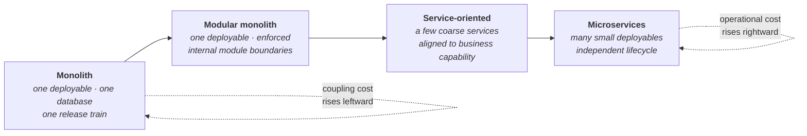
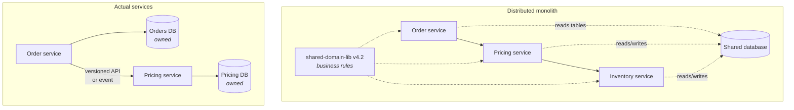
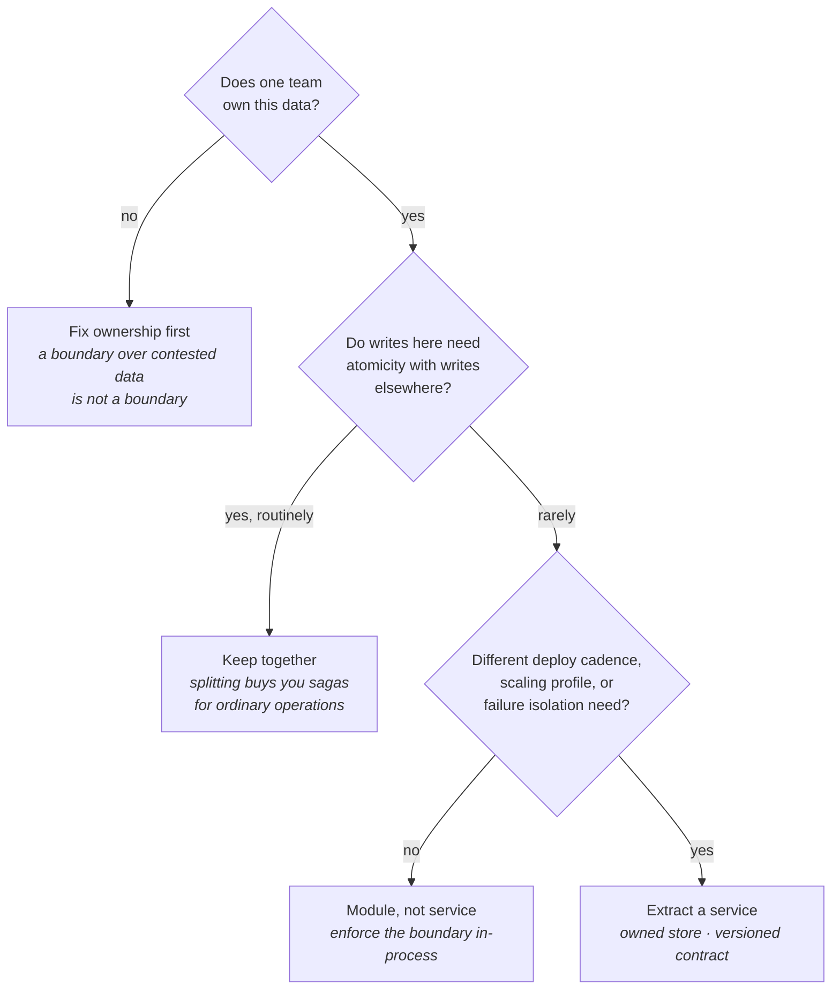
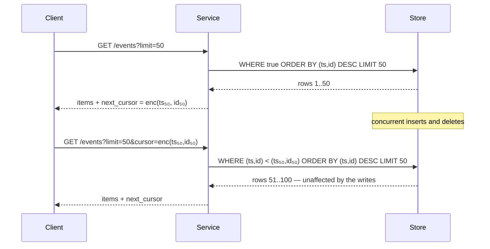
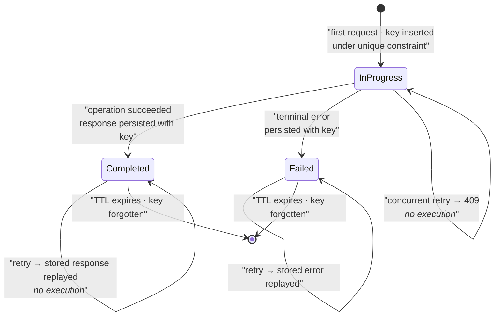
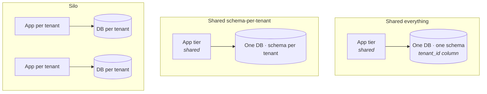
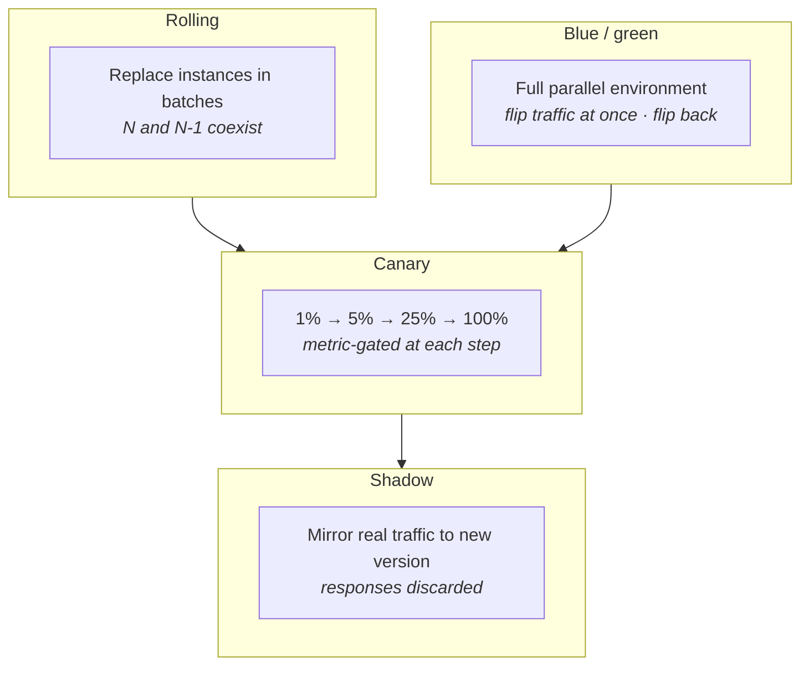
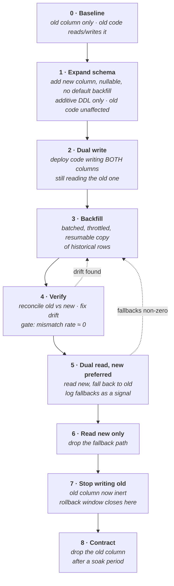

# Service and API Design

Lecture 3 covered *how* services talk — protocols, RPC, connection management. Lecture 6 covered how they talk *without* talking synchronously — brokers, logs, event-driven flow. Both took the existence of the services for granted. This lecture asks the prior question: where should the boundaries between them be drawn at all, and once drawn, what must the contract across a boundary promise?

The answer to the first question is almost always "fewer boundaries than you think," and the answer to the second is "compatibility, idempotency, and a stable notion of position." Most of the operational pain attributed to distributed systems is really the bill for boundaries drawn in the wrong place and contracts that never planned for their own evolution.

## The decomposition spectrum

Decomposition is not a ladder you climb. It is a dial with a cost on both ends, and the cost changes character rather than magnitude as you turn it.

- **Monolith** — one build artifact, one deploy, usually one schema. In-process calls, so a call is a function call: no serialization, no network failure, no partial failure, and refactoring across "components" is a compiler-checked rename.
- **Modular monolith** — the same single deployable, but with module boundaries that the build enforces (separate packages, no cyclic dependencies, explicit exported interfaces, ideally separate schemas within one database). *This is the underrated option.* It buys you boundary discipline before you pay for boundary distribution.
- **Service-oriented** — a handful of coarse services aligned to business capabilities, each owning its data, communicating over well-defined contracts. Often the honest end state for a company of a few hundred engineers.
- **Microservices** — many small services with independent deploy lifecycles, independent scaling, and independent failure domains. Optimizes for organizational parallelism, not for machine efficiency or simplicity.

**What you buy as you move right:**

- **Independent deployability** — a team ships without coordinating a release train. This is the *only* benefit that reliably justifies the move, and it is an organizational benefit, not a technical one.
- **Independent scaling** — the fraud-scoring path gets 200 replicas while the settings page gets 2. Real, but usually achievable within a monolith by deploying the same artifact into differently-sized pools.
- **Fault isolation** — a memory leak in one service does not take down the process serving everything else. Real, but only if the calling services actually tolerate the failure (Lecture 8).
- **Technology heterogeneity** — the ML service is Python, the ledger is Rust. Real, and usually overvalued; heterogeneity multiplies your operational surface.

**What you pay:**

- **Every in-process call becomes a network call** — serialization cost, latency, timeouts, retries, partial failure, and a new class of bug where the caller and callee disagree about whether the operation happened.
- **Every refactor across a boundary becomes a multi-repo, multi-deploy, multi-week migration** with a compatibility window. The compiler stops helping you.
- **Operational multiplication** — N services means N deploy pipelines, N sets of dashboards, N on-call runbooks, N dependency upgrade paths, N places a CVE must be patched.
- **Debugging becomes a distributed-tracing problem.** A single user action spans a dozen spans across a dozen logs. Without tracing infrastructure in place *first*, you are debugging blind.
- **Data consistency becomes an application concern.** A transaction that was one `BEGIN … COMMIT` becomes a saga with compensation logic (Lecture 6).

**Rule of thumb:** the number of services should be bounded above by the number of teams that can independently own one, not by the number of nouns in your domain model. Two services per team is already a warning sign; ten is a staffing problem disguised as an architecture.

**In an interview:** never propose microservices as an opening move. Propose module boundaries first, and extract a service when you can name the specific coupling — deploy cadence, scaling profile, failure isolation, or team ownership — that extraction relieves.

## Deployment coupling versus operational overhead

This is the actual axis. Everything else in [§ The decomposition spectrum](#the-decomposition-spectrum) is downstream of it.

- **Deployment coupling** — the cost of *not* splitting. It shows up as: a release train where one team's failing test blocks nine other teams; a rollback that reverts unrelated features; a deploy freeze because the risky change and the trivial change ship in the same artifact; lead time to production measured in days.
- **Operational overhead** — the cost of splitting. It shows up as: pipeline maintenance, on-call surface, cross-service version skew, distributed debugging, and the fixed per-service tax of observability, secrets, health checks, and dependency hygiene.

**The honest framing:**

- Deployment coupling scales with the number of *people* sharing an artifact, roughly superlinearly — coordination cost rises with the number of pairs.
- Operational overhead scales with the number of *services*, roughly linearly, but with a large constant that most teams underestimate by an order of magnitude.
- **Therefore:** splitting pays off only past a team-count threshold, and only if the per-service constant has been driven down by platform investment (a paved-road deploy pipeline, automatic observability, standard service template).

**The failure mode:** a 12-person company adopts 30 microservices. Deployment coupling was never the bottleneck — 12 people can coordinate a release trivially — so they paid the entire operational bill and bought nothing. Every feature now touches four services and needs a four-way ordered deploy, which is *worse* deployment coupling than the monolith had.

**What to do instead:** invest in the modular monolith's internal boundaries. Enforce them mechanically — module visibility rules, schema-per-module with no cross-schema foreign keys, an architecture test that fails the build on a forbidden import. If those boundaries hold under a year of feature pressure, extraction later is mechanical. If they do not hold in-process, they will not hold over the network either; distribution does not create discipline, it only makes its absence more expensive.

## The distributed monolith

The specific and common failure of getting the network cost without the independence benefit.

**Diagnostic symptoms — any one of these is enough:**

- **Lockstep deploys.** Services A, B, and C must be released together, in a specific order, or the system breaks. You have one logical deployable spread across three pipelines.
- **A shared database.** Two or more services read and write the same tables. A schema change now requires coordinating every writer, and no service can change its storage.
- **Synchronous call chains.** A user request fans through six services in series. Availability multiplies down — six dependencies at 99.9% each gives 99.4% before you have written a line of business logic — and latency is the *sum*, with tail latency dominated by the worst hop.
- **A shared "common" library containing domain logic.** Changing a business rule means bumping a library version in every service and redeploying all of them. That is a monolith with extra steps and worse ergonomics.
- **Chatty boundaries.** One logical operation requires a dozen round trips because the data was split but the access pattern was not. The boundary was drawn across a hot path.
- **Distributed transactions everywhere.** If most write operations need a saga or two-phase commit, the aggregate boundaries are wrong — you split something that should have been atomic.

- **Top: every arrow is a coupling you cannot deploy around.** The shared database means schema change is a global event; the shared domain library means logic change is a global deploy; the serial chain means availability and latency compound.
- **Bottom: each service owns its store.** The only coupling is a versioned contract, which — per [§ Pagination](#pagination) through [§ Multi-tenancy](#multi-tenancy) — can be evolved compatibly without synchronized deploys.
- **The dotted arrows are the tell.** In the top diagram they are *hidden* dependencies — nothing in the API surface reveals that these three services are one system. Hidden coupling is worse than explicit coupling because nobody plans a migration around it.

**Rule of thumb:** if you cannot deploy a service on a Friday afternoon without checking what else is deploying, it is not an independent service.

## Boundary selection

### Bounded contexts and aggregates

Domain-driven design supplies the vocabulary that actually maps to service boundaries.

- **Bounded context** — a region of the model within which a term has one consistent meaning. "Customer" in billing (a payment method and a tax jurisdiction) is not "Customer" in support (a contact history and an entitlement tier) and not "Customer" in marketing (a segment and a consent state).
- **The insight:** the urge to build one canonical `Customer` model shared by everyone is the urge to build a distributed monolith. A canonical model must satisfy every context, so every context's change touches it, so it becomes the most-contended artifact in the company.
- **What to do instead:** let each context keep its own model with only an identifier in common. Translate at the boundary — an *anti-corruption layer* — so an upstream model change does not leak into your domain.
- **Aggregate** — a cluster of entities with one root, treated as a single consistency unit. The aggregate is the *transactional* boundary: invariants inside it hold synchronously; invariants across aggregates are eventually consistent, enforced by events and compensation.
- **Why aggregates matter for services:** a service boundary drawn *through* an aggregate forces distributed transactions for ordinary operations. A boundary drawn *between* aggregates does not. **If a proposed split means an everyday write needs two-phase commit, the split is wrong.**

### Data ownership is the real boundary

Say this plainly, because it is the load-bearing claim of the whole part.

- **A service is defined by the data it exclusively writes.** Everything else — the API surface, the repository, the deployment unit, the team — is downstream of that.
- **Exactly one service may write a given piece of state.** Others may read it, but only through that service's contract or through events it publishes — never by reaching into its store.
- **Why this and not the API:** an API can be reshaped in a week. Data ownership determines who can change a schema, who can run a migration, who is on the hook when the data is wrong, and where a transaction can be atomic. Those are the expensive properties.
- **The test:** for each table, name the single service that owns it. If you cannot, you do not yet have services — you have deployables sharing a database.

- **Ownership is the first gate, not the last.** Contested data means an organizational question is unresolved; drawing a network boundary across it converts a meeting into an outage.
- **Atomicity is the second gate.** Routine cross-boundary atomicity is the single strongest signal that the aggregate was split.
- **The third gate is the only one that justifies distribution** — and note that all three of its answers are about *lifecycle*, not about domain elegance.
- **The default exit is "module, not service."** Most candidate boundaries should land there.

### Conway's law and team topology

- **Conway's law** — a system's structure mirrors the communication structure of the organization that builds it. Not a slogan: interfaces form where communication is expensive, and coupling forms where it is cheap.
- **The inverse maneuver** — choose the architecture you want, then organize teams to match it. This works, and it is expensive: it means reorganizing people to get a diagram.
- **The practical reading:** if two teams must coordinate on every change to a service, either merge the teams or split the service. A service with two owning teams has no owner.
- **Cognitive load is a real constraint.** A stream-aligned team can own a bounded slice end to end; it cannot own twelve services plus the platform beneath them. When teams start owning services they did not build and cannot explain, you have exceeded the budget and reliability will follow.
- **Platform teams exist to reduce the per-service constant** from [§ Deployment coupling versus operational overhead](#deployment-coupling-versus-operational-overhead) — paved-road pipelines, observability by default, service templates. Without one, the operational overhead of decomposition is paid by every product team, repeatedly.

## Shared databases and shared libraries

### Why a shared database defeats decomposition

- **Schema becomes a global contract with no versioning story.** Any column rename requires locating every reader across every service. There is no deprecation header, no compatibility window, no client inventory — just `grep` and hope.
- **Invariants become unenforceable.** Service A assumes `orders.status` only ever moves forward; Service B writes it directly and does not know. The invariant lived in A's code, not in the database, and nothing stopped B.
- **You cannot change storage technology.** The shared schema is the interface, so it is frozen at the intersection of everyone's needs.
- **Performance coupling is invisible.** One service's unindexed analytical query saturates the shared instance and everyone's latency degrades. Nothing in any service's code reveals the dependency.
- **Failure domain is shared.** One database, one blast radius. You have N deployables and 1 availability number.

**The sanctioned exceptions — narrow ones:**

- **Read replicas with a published, versioned read model** — a view or a replicated projection the owner explicitly maintains as a contract. The owner may change the base tables freely; the view is the interface.
- **Change-data-capture into an owned copy** — consumers materialize their own store from the owner's change stream (Lecture 6). Consumers own their copy; the owner owns the stream's schema and versions it.
- **A shared *instance* with strictly separate schemas** — a cost optimization, not shared data, and acceptable if per-schema access is enforced by database roles. Note you still share the failure and performance domain.

### Shared libraries and lockstep hazards

- **Fine to share:** protocol clients, serialization, logging, metrics, auth token verification, retry/backoff helpers. Things with no domain semantics and slow-moving interfaces.
- **Not fine to share:** business rules, domain entities, validation logic that encodes policy. A change to a rule then requires a version bump and redeploy of every consumer — a synchronized deploy wearing a package manager's clothes.
- **The generated-client nuance** — sharing a generated client from an OpenAPI/protobuf spec is fine *if* the generated code is compatible across versions and consumers may lag. It becomes a hazard the moment the provider expects everyone on the newest client.

**Concrete lockstep hazards:**

- **Diamond dependencies** — service S depends on libs A and B, both of which depend on incompatible versions of C. Resolution requires coordinated releases of A and B, i.e. the coupling you split to avoid.
- **Forced-upgrade libraries** — a shared library that breaks on version skew removes the consumer's right to deploy on its own schedule. Every shared library must tolerate N and N-1 simultaneously in production.
- **Transitive blast radius** — a bug in a widely shared library is an incident in every service at once, and remediation is a fleet-wide redeploy, not a rollback of one thing.
- **Version-skew testing is nobody's job.** Consumers test against the version they pin; providers test against the newest. The combination actually running in production is tested by no one. **If you cannot state which library versions coexist in production right now, you have this problem.**

**Rule of thumb:** a shared library is acceptable in proportion to how rarely it changes and how tolerant it is of skew. Domain logic fails both tests.

## Versioning

An API is a promise, and versioning is how you change a promise without breaking whoever believed it.

### Where the version lives

- **URI versioning** (`/v1/orders`, `/v2/orders`) — most visible, most cacheable, most trivially routable at the gateway. Costs: version is baked into every client URL, the whole resource is versioned even for a one-field change, and it encourages big-bang v2 rewrites nobody migrates to.
- **Header versioning** (`Accept: application/vnd.acme.v2+json`, or a custom `API-Version`) — keeps URLs stable and identity clean; a resource has one URL forever. Costs: invisible in a browser and in logs unless you deliberately log it, and it fragments caches unless `Vary` is set correctly.
- **Field-level / additive versioning** — no version at all; the schema evolves by adding optional fields and never removing or repurposing existing ones. Costs: the schema accumulates deprecated fields and reading it becomes archaeology. Benefits: no migration event, ever. **This is what most successful long-lived APIs actually do**, with URI versions reserved for genuinely incompatible reshapes.
- **Date-based versioning** (`API-Version: 2026-03-01`) — a client pins a date; the provider maintains a chain of request/response transformers from each historical date forward to the current internal model. Expensive to build, exceptionally kind to consumers. Stripe is the canonical example.

**Key distinction:** URI and header versioning version *the whole interface* and produce migration events. Field-level and date-based versioning version *the change*, and produce continuous evolution. Prefer the latter; reserve the former for changes that genuinely cannot be expressed additively.

### Deprecation policy and consumer migration

- **You cannot deprecate what you cannot see.** Step one is a client inventory — per-consumer, per-endpoint, per-version usage metrics. Without this, every removal is a guess and every guess is an incident.
- **Announce in-band.** `Deprecation: true` and `Sunset: <date>` response headers, plus a `Link` to migration docs, so the signal reaches the running code and not just an email nobody read.
- **Publish a support window and mean it** — commonly 6–12 months for external APIs, one or two release cycles internally. The window's purpose is to make the removal *predictable*, which is what lets consumers plan.
- **Brownout** — deliberately fail or delay a small, growing percentage of deprecated-endpoint traffic ahead of sunset (say 1% for an hour, then 5%, then a full day). This converts a silent dependency into a visible page for the consumer while the fix is still cheap. It is the single most effective migration tool, and it must be announced.
- **Migrate the long tail yourself.** Past some point, the remaining consumers are unowned services and a script somebody wrote in 2021. Chasing them costs more than sending a pull request to each. Budget for that.

**The failure mode:** v1 is never removed, so you maintain v1, v2, and v3 forever; each new feature must be implemented three times or explicitly excluded; the cost of the API grows without bound. **A version you will never remove is not a version, it is a permanent second product.**

## Pagination

Every collection endpoint eventually returns more data than fits in one response. How you express "where I left off" determines whether the API is correct under concurrent writes.

### Offset pagination

- **Mechanism** — `?limit=50&offset=100`, translating to `LIMIT 50 OFFSET 100`.
- **Why it is popular** — trivially implemented, supports jumping to page N, and gives a total count for a page-number UI.
- **Correctness problem: the result set shifts under you.** Each page is a fresh query against current data. If a row is inserted before your position between requests, one item shifts from page 2 to page 3 and you see it twice. If a row is deleted, one item shifts backward and you never see it. **Under a steady write rate, an offset-paginated full scan silently loses and duplicates rows.**
- **Performance problem: cost grows with offset.** `OFFSET 1000000` makes the database produce and discard a million rows. Deep pages get linearly slower, and deep-page traffic — crawlers, export scripts — is exactly the traffic that hurts.

### Cursor / keyset pagination

- **Mechanism** — the cursor encodes the sort key of the last row returned; the next query is `WHERE (created_at, id) < (:last_created_at, :last_id) ORDER BY created_at DESC, id DESC LIMIT 50`.
- **Constant cost** — with an index on the sort key, the database seeks directly to the position. Page 1 and page 20,000 cost the same.
- **Stable under concurrent writes** — position is defined by a value in the data, not by a count of rows before it. Inserts and deletes elsewhere in the collection cannot shift your position. You may still *miss* rows inserted before your position after you passed it, but you will not double-count or skip arbitrarily.
- **The tiebreaker is mandatory.** The sort key must be unique or made unique by appending a unique column. Paginating on a non-unique `created_at` alone will drop or repeat every row that shares a timestamp with a page boundary — a bug that only appears under load, when timestamps collide.
- **Costs you accept:** no jump-to-page-N, no cheap total count, and sort order is constrained to indexed keys.
- **Treat the cursor as opaque.** Base64 an encoded struct, include the sort key values plus a schema/version tag, and document that clients must not parse it. An opaque cursor lets you change the underlying strategy without a version bump; a cursor clients parse becomes a permanent contract. Sign or encrypt it if leaking internal keys matters.

- **The cursor carries the position in the data, not a count.** That is the entire difference, and it is why the concurrent writes in the middle change nothing.
- **The composite key `(ts, id)` is doing real work.** Drop `id` and rows sharing a timestamp across the boundary are lost or repeated.
- **The comparison must be a row-value comparison**, not `ts < x AND id < y` — the latter is a different and wrong predicate.
- **Cost is independent of depth**, since the index seek starts at the cursor rather than counting from the beginning.

**Rule of thumb:** offset pagination is acceptable only for small, human-browsed, slow-changing collections. Anything machine-consumed, append-heavy, or unbounded gets a cursor. If a consumer needs a consistent full snapshot, give them a snapshot export ([§ Errors and partial failure](#errors-and-partial-failure)), not deep pagination.

## Idempotency and safety

### Method semantics

- **Safe** — no observable state change. `GET`, `HEAD`, `OPTIONS`. Intermediaries may cache and prefetch them, which is exactly why a `GET` that mutates state is a real bug and not a style violation.
- **Idempotent** — applying it N times has the same effect as applying it once. `GET`, `PUT`, `DELETE`, `HEAD`, `OPTIONS`. Note *effect*, not *response*: a second `DELETE` returning `404` is still idempotent, because the resulting state is identical.
- **Neither** — `POST` and `PATCH` by default. `POST /payments` twice creates two payments.
- **Why this matters operationally:** any client that retries — and every client retries, whether you designed for it or not — turns a non-idempotent endpoint into a duplicate-creation machine. **The retry is not the bug; the un-idempotent endpoint is.**
- **`PATCH` is idempotent only if you make it so.** A merge-patch setting absolute values is idempotent; a patch expressing "increment by 5" or "append to list" is not. Delta semantics in a `PATCH` are a trap.

### Idempotency keys

The mechanism for making `POST` retry-safe.

- **Contract** — the client generates a unique key per *logical operation* (a UUID) and sends it as `Idempotency-Key`. The server guarantees at most one execution per key, and returns the original response for any repeat.
- **The key belongs to the operation, not the attempt.** The client must generate it *before* the first attempt and reuse it across every retry of that same intent. A key regenerated per HTTP attempt provides nothing.
- **Server-side algorithm — the ordering is the whole design:**
  1. Insert the key into a store with a unique constraint, in state `in_progress`, *before* doing any work. The unique constraint is what makes this a lock rather than a race.
  2. If insert succeeds, execute the operation, then persist the response body and status against the key and mark it `completed`. **Ideally in the same transaction as the business write** — otherwise a crash between the two leaves the key claimed but the response unrecorded.
  3. If insert conflicts and the record is `completed`, return the stored response, typically with a header marking it a replay.
  4. If insert conflicts and the record is `in_progress`, return `409 Conflict` or `425 Too Early`. Do *not* execute — a concurrent attempt is in flight.
- **Fingerprint the request.** Store a hash of the request body against the key and reject a reused key with different parameters with `422`. Otherwise a client bug reusing a key silently returns the wrong operation's result.
- **Set a retention TTL** (24 hours is the common choice) and document it. Beyond the window, the key is forgotten and a replay executes for real.
- **Scope keys per client/tenant**, or one tenant's key collides with another's.

- **The claim happens before the work.** Reversing that order — execute, then record the key — means a crash after execution loses the record and the retry double-charges.
- **`in_progress` must reject rather than wait-and-execute.** Two concurrent attempts with the same key are the exact scenario the mechanism exists to prevent.
- **Terminal failures are recorded too**, so a retry gets the same deterministic error rather than re-executing an operation that already had a side effect.
- **TTL expiry is a real cliff.** A client retrying after 25 hours executes for real. This is a documented property, not a bug — but it must be documented.

**Alternative when the client can supply it:** a natural idempotency key derived from the domain (an order ID the client already generated, or a `(tenant, external_reference)` pair) with a unique constraint on it. Cheaper, and it makes the guarantee structural rather than infrastructural.

## Errors and partial failure

### Error taxonomy

An error response has one job beyond describing what went wrong: telling the caller whether to retry.

- **Retryable, transient** — `429 Too Many Requests`, `503 Service Unavailable`, `504 Gateway Timeout`, connection resets. The caller should retry with exponential backoff and jitter, ideally honoring `Retry-After`.
- **Terminal, caller's fault** — `400`, `401`, `403`, `404`, `422`. Retrying the identical request cannot succeed. A client that retries these is generating load with zero probability of success — a classic amplifier during an incident.
- **Ambiguous — the important category** — `500 Internal Server Error`, and any timeout on a non-idempotent operation. You do not know whether the operation took effect. This is precisely why [§ Idempotency and safety](#idempotency-and-safety) exists: with an idempotency key the ambiguity collapses to "retry and find out safely"; without one, the caller must choose between a duplicate and a lost write.
- **Make retryability explicit in the body**, not inferred from the status code. A machine-readable `code` string, a boolean `retryable`, and a `retry_after` field remove guesswork. Status codes are too coarse — a `400` might be a permanently malformed request or a temporarily-out-of-range parameter, and the caller cannot tell.
- **Include a correlation/trace ID in every error response.** Without it, a user report is unactionable.
- **Never encode control flow in prose.** Clients will regex your error messages if you give them nothing else, and then the message string is a contract you cannot change.
- **`429` deserves its own treatment.** It is not a failure, it is flow control. It must carry `Retry-After`, and the client must respect it — otherwise your rate limiter becomes a retry amplifier and the overload feeds itself.

### Partial success and batch semantics

For an endpoint accepting N items, three possible contracts:

- **All-or-nothing (atomic)** — either every item applies or none does. Simplest to reason about, requires the whole batch to fit in one transaction, and a single bad item fails the batch. Appropriate for small batches where the caller can fix and resubmit.
- **Best-effort with per-item results** — return `207 Multi-Status` (or `200` with a per-item result array), each entry carrying its own status and error. The caller retries only the failures. Necessary for large batches, and the *response schema must be designed for it*: a top-level status code cannot express "83 of 100 succeeded."
- **Fail-fast on first error** — process in order, stop at the first failure, report how many succeeded. Rarely what anyone wants, because it leaves a prefix applied with no clean resume story.

**The traps:**

- **A `200` hiding failures.** If the top-level status is `200` and the failures are only in the body, every naive client treats the batch as fully successful. Use `207`, or make a partial-failure response impossible to ignore.
- **Retrying the whole batch after partial success.** Without per-item idempotency the successful items are applied twice. **Batch endpoints need per-item idempotency keys, not just one for the batch** — or the caller can never safely retry a partial failure.
- **Unbounded batches.** Without a documented maximum item count, one caller sends 100,000 items and holds a worker, a transaction, and a connection for minutes.
- **Ordering assumptions.** State whether items are processed in order and whether they may be processed concurrently. Callers *will* assume ordering if you are silent.

## Bulk, batch, and streaming endpoints

### Payload limits and chunking

- **Publish explicit limits** — maximum body bytes, maximum item count, maximum nesting depth — and enforce them at the edge with a `413` before the body is fully buffered. Limits discovered by production failure are limits you did not have.
- **Bound them by processing time, not just size.** 1,000 items where each item costs a 50 ms downstream call is a 50-second request; the size limit says nothing about that.
- **Chunking is the caller's contract** — the caller splits work into bounded units and drives them, which requires per-chunk idempotency and a resume story ([§ Idempotency and safety](#idempotency-and-safety)).
- **For large ingest, prefer indirection to a big body:** the client uploads to object storage via a pre-signed URL, then posts the object reference. This removes the payload from your request path entirely, and gets you resumable multipart upload for free.
- **Streaming request bodies** (chunked transfer, gRPC client streaming) let you process incrementally without buffering the whole payload — but note you cannot validate holistically before starting, so partial application must be part of the contract.

### Long-running operations

Any operation that can exceed a few seconds should not be a synchronous request. The proxy timeout, the load balancer idle timeout, and the client's own timeout will all disagree with you.

- **The pattern:** `POST /exports` returns `202 Accepted` with an operation resource — `{"id": "...", "status": "running"}` — and a `Location` header. The client polls `GET /operations/{id}` or receives a webhook on completion. Result is fetched separately, often as a signed URL.
- **The operation resource must be first-class:** durable, queryable after completion, carrying status, progress, a start time, a terminal result or error, and a retention period after which it is garbage collected.
- **The submit endpoint needs an idempotency key.** Otherwise a retried submission starts a second expensive job.
- **Cancellation** — `DELETE /operations/{id}` should be supported and honestly documented as best-effort. A cancel that does not actually stop the work is worse than no cancel.
- **Poll intervals must be server-controlled** via `Retry-After`, or a thousand clients polling every second become your next incident.
- **Webhooks over polling where possible**, but webhooks bring their own contract: at-least-once delivery, so the receiver must be idempotent; signed payloads, so the receiver can authenticate; and retry with backoff plus a dead-letter path (Lecture 6).
- **Server-sent events or streaming responses** work for progress within a single connection, but they hold a connection for the duration and break through most proxies. Treat them as an optimization on top of a pollable operation resource, never as the only interface.

## Compatibility discipline

The rule that makes independent deployment actually possible.

- **Backward compatible** — new server, old client: the old client keeps working. This is what lets you deploy the server first.
- **Forward compatible** — old server, new client, or old client receiving new-server data: the old code tolerates fields it does not understand. This requires *deliberate* client behavior, chiefly ignoring unknown fields rather than rejecting them.
- **You need both simultaneously**, because during any rolling deploy both versions run at once, and requests are routed to both.

**Safe changes:**

- Adding an optional request field with a sensible default.
- Adding a response field (only if consumers ignore unknown fields — verify this before relying on it).
- Adding a new endpoint, or a new optional query parameter.
- Relaxing a validation constraint.
- Adding a new enum value **only if** consumers have a documented unknown-value behavior. Otherwise this is a breaking change that looks additive, and it is the most common accidental break in practice.

**Breaking changes, no matter how small they look:**

- Removing or renaming any field; changing a field's type or its units.
- Making an optional request field required, or tightening validation.
- Changing default values, changing the meaning of an existing value, or altering error codes clients branch on.
- Changing pagination defaults, sort order, or the interpretation of an existing cursor.
- Adding a required field to a *response* is safe; adding one to a *request* is not — get the direction right.

**The disciplines that keep this honest:**

- **Never reuse a field number or name.** In protobuf, `reserved` the tag and the name. In JSON, treat a removed name as permanently burned. Reuse means an old client silently reads new data with old semantics — a data-corruption bug with no error anywhere.
- **Tolerant reader** — ignore unknown fields, do not fail on unexpected enum values, do not assume field ordering, do not assume the absence of a field means anything other than "not provided."
- **Schema registry with automated compatibility checks in CI** (Lecture 6 covers this for events; the same applies to synchronous APIs). A machine should reject the incompatible change at build time, because humans miss enum additions every time.
- **Contract tests** — the consumer publishes its expectations, the provider's CI verifies them. This is how you find out you broke someone before production does.
- **Two-version rule:** production must always tolerate version N and N-1 running simultaneously. Every change is designed against this constraint, which is exactly the expand/contract discipline of [§ Schema migration under zero downtime](#schema-migration-under-zero-downtime) applied to APIs instead of schemas.

## Multi-tenancy

### Isolation models

- **Shared everything** — every tenant's rows in the same tables, discriminated by `tenant_id`. Cheapest per tenant by a wide margin, trivially elastic, one schema to migrate. **The risk is total: one missing `WHERE tenant_id = ?` is a cross-tenant data leak**, which is the worst bug class in the product. Mitigate structurally — row-level security in the database, a query layer that cannot construct a tenant-less query, and tests that assert isolation — never by code review alone.
- **Shared schema-per-tenant** — one database instance, a schema per tenant. Isolation is enforced by the database's own access control, per-tenant backup and restore is natural, and per-tenant customization is possible. **Cost: migrations must run N times**, and connection pooling degrades (each pooled connection is bound to a `search_path`). Breaks down somewhere in the low thousands of tenants.
- **Silo** — dedicated database, often dedicated compute, per tenant. Strongest isolation for security, performance, and blast radius; enables per-tenant version pinning and per-tenant residency. **Cost is linear in tenants and dominated by fixed per-instance overhead**, plus fleet-wide migration becomes an orchestration project.
- **The real answer is usually a tiered mix:** shared everything for the self-serve long tail, silo for large enterprise accounts that pay for it and demand it in the contract. **Design the tenant abstraction so a tenant can be *moved between tiers*** — that migration path is the expensive thing to retrofit, and enterprise deals will demand it.

| | Shared everything | Schema-per-tenant | Silo |
|---|---|---|---|
| Cost per tenant | **lowest** | low | high |
| Blast radius | all tenants | all tenants (shared instance) | **one tenant** |
| Leak risk | high — application-enforced | low — DB-enforced | **negligible** |
| Migration effort | **one run** | N runs | N runs, fleet-orchestrated |
| Noisy-neighbor exposure | high | high | **none** |
| Per-tenant restore | hard | **easy** | **easy** |
| Data residency | hard | hard | **natural** |
| Scales to | millions | thousands | hundreds |

### Noisy neighbors and quotas

- **The problem:** shared infrastructure means one tenant's pathological usage degrades everyone. It is almost never malicious — it is a batch job, a retry storm, or a customer who grew.
- **Per-tenant rate limits** at the edge, on requests *and* on cost-weighted units. Requests per second is a poor proxy when one request can scan a million rows; charge against a computed cost budget where you can.
- **Concurrency limits per tenant**, not just rate limits — bounded in-flight requests and bounded connections. This is what protects a fixed-size worker pool from a single tenant occupying all of it.
- **Quotas on stored resources** — rows, storage bytes, objects — enforced at write time with a clear error, not discovered at the monthly bill.
- **Fair queuing / weighted scheduling** in shared workers, so a tenant with 10,000 queued jobs cannot starve a tenant with 3. Round-robin across per-tenant queues rather than one FIFO is the standard fix, and it is a small change with an outsized effect.
- **Bulkheads** — partition the shared worker or connection pool so no tenant can consume more than its share (Lecture 8).
- **Per-tenant observability is the prerequisite for all of this.** Tag metrics with tenant ID at a bounded cardinality — top-N tenants explicitly, the rest bucketed — so "who is causing this" takes seconds rather than an afternoon.
- **Cell-based architecture** as the structural answer at scale: partition the whole stack into independent cells of a few thousand tenants each. A cell is a blast radius and a deploy unit. It bounds incidents by construction rather than by quota tuning.

### Tenant-aware sharding and residency

- **Shard by tenant ID**, so a tenant's data is co-located and cross-shard queries are rare. This is the one case where the natural partition key is obvious and stable.
- **The whale problem** — tenant sizes follow a power law, so hashing tenant IDs produces wildly unbalanced shards. Large tenants need explicit placement, sometimes a dedicated shard, and you need a *tenant → shard* directory rather than a hash function so placement can be changed per tenant.
- **Tenant migration between shards must be a supported operation**, not an emergency script: dual-write, backfill, verify, cut over reads, stop the old write. It is a small saga and it will be run often — for rebalancing, for tier moves, and for residency changes.
- **Data residency** — regulatory requirements (GDPR, and various data-localization laws) can require a tenant's data to be stored and processed within a jurisdiction. This forces region as a component of the tenant's placement, and it must be settled *before* the first cross-region feature ships.
- **Residency is not only the primary store.** Backups, replicas, logs, metrics, traces, caches, analytics warehouses, and third-party subprocessors all carry tenant data. Auditors ask about every one of them, and the log pipeline is where teams usually discover they are non-compliant.
- **The routing consequence:** a tenant-to-region directory must be consulted at the very edge, and it must be fast, highly available, and cached, because *every* request depends on it. It is a single point of failure you are choosing deliberately.

## Configuration, flags, and deployment

### Feature flags, dynamic config, and kill switches

- **Release flags** — decouple deploy from release. Code ships dark, then is enabled progressively. Short-lived by design; delete them once fully rolled out.
- **Ops flags / kill switches** — turn off an expensive or failing subsystem without a deploy. Long-lived on purpose. **Every dependency on something you do not control should have one**, because in an incident a config change takes seconds and a deploy takes twenty minutes.
- **Experiment flags** — A/B assignment. Need consistent bucketing per user and a clean off state.
- **Permission flags** — per-tenant entitlements. These are effectively product configuration and should live with entitlement data, not in the experimentation system.
- **Dynamic config** — timeouts, limits, pool sizes, retry budgets changeable at runtime. Extremely valuable during an incident, and it must be typed, validated, versioned, and audited.

**Config as a change vector for incidents:**

- **A large fraction of serious outages are caused by configuration changes, not code changes** — the frequently cited figure from Google's SRE experience puts the majority of production incidents at config or process change rather than binary rollout. The reason is structural: config changes usually skip the entire safety apparatus code changes go through.
- **Config changes are often global and instantaneous.** A bad deploy is caught by a canary in one zone; a bad config push reaches every process in seconds.
- **What to do instead — apply the deploy pipeline to config:**
  - **Version control and code review** for config, with the same approval requirements as code.
  - **Schema validation and type checking** at push time, rejecting the change before any process consumes it.
  - **Staged rollout** — one host, then one zone, then the fleet, with automatic health-based abort.
  - **Instant rollback to the previous version**, with the previous value always retained.
  - **Audit log** answering "who changed what, when" in seconds — this is the first question of every incident review.
  - **Fail-safe defaults** in the consuming code, so an unparseable or missing config falls back to a known-good value rather than crashing. A config service outage must not become an application outage.
- **Flag debt is real.** Each live flag doubles the notional number of code paths, and the combinatorics are untested. Enforce expiry dates and delete flags aggressively; a flag whose off-branch has not executed in six months is dead code protecting nothing.

### Deployment strategies

- **Rolling** — replace instances gradually; no extra capacity needed. **Both versions serve production traffic simultaneously**, which is exactly why [§ Compatibility discipline](#compatibility-discipline)'s compatibility discipline is not optional. Rollback is another slow roll.
- **Blue/green** — stand up a complete second environment, switch traffic, keep the old one warm. Near-instant rollback is the selling point. Costs double capacity during the switch, and the hard part is *state*: the database is usually not duplicated, so the schema must satisfy both versions anyway ([§ Schema migration under zero downtime](#schema-migration-under-zero-downtime)).
- **Canary** — route a small traffic fraction to the new version and gate promotion on metrics (error rate, latency percentiles, business KPIs) with automatic abort. **The best default for large fleets.** Requires enough traffic for statistical signal and per-version metric separation — a canary without automated analysis is just a slow rolling deploy with extra ceremony.
- **Shadow / dark traffic** — mirror real requests to the new version and discard its responses. Superb for validating performance and correctness of read paths under real traffic shape. **The trap: shadowed writes.** If the shadow version writes to the real store, you have doubled every side effect. Shadow requires a sandboxed store or strictly read-only paths, and it doubles downstream load — which must be capacity-planned.
- **Progressive delivery** is the composition actually used in practice: feature flag for the release decision, canary for the deployment decision, automated metric gates on both.

### Rollback, roll-forward, and irreversibility

- **Rollback** — revert to the previous known-good version. Fast, well-tested, and the correct default during an incident. **Preserving the ability to roll back is a design constraint on every change**, not a property of the deploy tool.
- **Roll-forward** — fix and deploy. Necessary when rollback is impossible, but it puts you on the critical path of writing correct code under incident pressure, which is where the second outage comes from.
- **What destroys rollback:**
  - **Destructive schema changes** — a dropped column cannot be un-dropped, and the previous version needs it ([§ Schema migration under zero downtime](#schema-migration-under-zero-downtime)).
  - **Data written in a new format** the old version cannot read. The old code must tolerate new data, or the rollback corrupts.
  - **Messages published in a new format** that the old consumer cannot parse — the queue is full of poison the moment you revert.
  - **External side effects** — emails sent, payments captured, webhooks delivered. Never reversible.
  - **One-way migrations of stored state**, including cache formats and serialized session data.
- **The discipline:** for every change, ask what a rollback 30 minutes from now would do. If the answer is "corrupt data" or "we can't," the change must be restructured into reversible steps — which is precisely expand/contract.
- **Rollback windows.** Once data has been written in a format only the new version understands, the rollback window has closed. Know when that happens and state it explicitly in the change plan.

## Schema migration under zero downtime

The most-probed topic in this part. The premise: during a rolling deploy, old and new application code run *simultaneously* against *one* database. Therefore **the schema must be compatible with both versions at every instant.** Everything below follows from that single constraint.

### Expand / contract

The pattern: never change something in place. Add the new thing, move readers and writers across, then remove the old thing — with a deploy boundary between every step.

- **Every arrow is a separate deploy, and every step is independently reversible.** That is the entire point — at no instant does correctness depend on two things landing at once.
- **Steps 1 and 8 are DDL; 2, 5, 6, 7 are code; 3 and 4 are data operations.** Confusing which kind a step is causes the classic mistake of shipping DDL and dependent code in one release.
- **Step 3 must be batched and resumable** — a single `UPDATE` over a large table takes a long lock, generates enormous WAL/binlog, and blocks replication. Batch by primary key range, throttle on replication lag, and make it restartable from the last committed batch.
- **Step 4 is the step teams skip, and it is the one that catches the bug.** Dual-write code has races; verification finds the rows dual-write missed. Run it as a continuous reconciliation job, not a one-off query.
- **Step 5's fallback logging is your migration's readiness signal.** You proceed to step 6 when fallback count has been flat at zero, not when someone believes the backfill finished.
- **Step 7 closes the rollback window.** Before it, reverting to old code works because the old column is still current. After it, the old column goes stale immediately. Note this explicitly in the change plan.
- **Step 8 waits.** Leave the old column for a soak period — days to weeks — because a dropped column cannot be recovered without a restore.

**The special cases:**

- **Renaming a column** is expand/contract exactly as above. Never `ALTER TABLE … RENAME COLUMN` in a live system: every deployed instance of the old code breaks the instant it lands.
- **Adding a `NOT NULL` column** — add nullable, backfill in batches, add a validated constraint separately (`NOT VALID` then `VALIDATE CONSTRAINT` in PostgreSQL, which takes a weaker lock). Adding `NOT NULL` with a default in one statement rewrites the table on older engines.
- **Changing a type** is a new column plus expand/contract, not an in-place `ALTER TYPE`, which rewrites and locks.
- **Splitting one table into two** is the same pattern with a wider dual-write, and it needs a plan for the cross-table invariant that used to be enforced by a single transaction.
- **Deleting a column** still needs expand/contract in reverse — stop reading, deploy, stop writing, deploy, soak, drop. An ORM that does `SELECT *` will break on a dropped column even though "nothing uses it."

### Lock-avoiding DDL and long-running migration control

- **Know which DDL your engine takes what lock for**, and never guess. In PostgreSQL, `ADD COLUMN` with no volatile default is metadata-only and instant; `ADD COLUMN … DEFAULT <volatile>` rewrites the table; `CREATE INDEX` takes a write lock, while `CREATE INDEX CONCURRENTLY` does not but takes two table scans, cannot run in a transaction, and can leave an invalid index behind that you must drop and retry.
- **The lock queue is the real hazard, and it is badly underappreciated.** A DDL statement waiting for an `ACCESS EXCLUSIVE` lock *queues behind* a long-running read — and every subsequent query queues behind the DDL. A metadata-only change that should take one millisecond becomes a full table outage because one analytics `SELECT` was running. **Always set a short `lock_timeout`** (a few seconds) and retry in a loop, so a failed acquisition costs nothing instead of freezing the table.
- **Batch size and throttling** — backfill in bounded batches (thousands of rows, not millions), commit each, sleep between them, and watch replica lag as the control signal. Unthrottled backfill is the classic way to blow out replication and take down every read replica.
- **Migration control needs an off switch.** A long-running backfill must be pausable, resumable from its last checkpoint, and observable (rows processed, rows remaining, current rate, ETA). A migration you cannot stop is a migration that will run during your next incident.
- **Online schema-change tools** — `gh-ost` and `pt-online-schema-change` for MySQL — build a shadow table, copy rows in batches, apply ongoing changes from the binlog, then swap with a brief atomic rename. Throttleable and pausable by design. PostgreSQL relies more on native concurrent operations plus application-level expand/contract.
- **Foreign keys and constraints validate in two phases** where the engine supports it: add as `NOT VALID` (cheap, applies to new rows only), then `VALIDATE` separately under a weaker lock.
- **Never run migrations automatically on application startup.** N replicas starting simultaneously means N concurrent migration attempts; and a migration that fails takes down the deployment rather than a job. Migrations are a deliberate, observable step with their own lifecycle.

## Infrastructure and orchestration

### Containers and schedulers

- **Containers** package an application with its userspace dependencies into an immutable image. The value is *deploy-time reproducibility* — the artifact tested in CI is byte-identical to the one in production — not isolation, which is weaker than a VM's since the kernel is shared.
- **A scheduler** (Kubernetes, Nomad, ECS) takes declared desired state — "10 replicas, 2 CPU, 4 GiB each, these health checks" — and continuously reconciles reality toward it: bin-packs onto nodes, restarts failures, reschedules on node loss, and rolls out updates.
- **The control-loop model is the essential idea.** You declare intent; a controller drives toward it forever. This is why "it came back on its own" and also why "it keeps coming back" when you delete something the controller owns.
- **Resource requests versus limits** — requests drive scheduling and thus what the scheduler thinks the node holds; limits drive enforcement. Requests far below actual use causes overcommit and node-level thrash; CPU limits cause throttling that shows up as inexplicable p99 latency while average CPU looks idle. This mismatch is one of the most common sources of mystery latency in containerized services.
- **Health checks must be distinguished:** liveness (restart me — must be cheap and must not depend on downstream services, or one dependency outage restart-loops your whole fleet), readiness (route traffic to me), startup (do not judge me yet). Conflating liveness with readiness converts a dependency's brownout into a fleet-wide crash loop.
- **Graceful shutdown is a contract:** on `SIGTERM`, fail readiness, drain in-flight requests, then exit before the termination grace period expires. Services that exit immediately on `SIGTERM` drop requests on every single deploy — a low-grade error rate everyone learns to ignore.

### Autoscaling signals

- **Horizontal scaling on a signal.** CPU utilization is the default and is frequently the wrong signal — an I/O-bound service is saturated at 30% CPU, and CPU says nothing about a queue backing up.
- **Better signals, in rough order of usefulness:** requests in flight per replica (concurrency), queue depth or consumer lag for async workers, and latency against an SLO. Each is closer to "am I meeting my obligation" than CPU is.
- **Scale-up should be fast, scale-down slow.** Asymmetric thresholds and cooldowns prevent flapping, where the scaler oscillates and each cycle pays cold-start cost.
- **Feedback loops are the danger.** Scaling on latency when latency is caused by a saturated downstream *adds* load to the thing that is failing and accelerates the collapse. Scaling on error rate has the same shape. Autoscaling policies must be reviewed as control systems, not as thresholds.
- **Scaling is not instant.** Image pull, process start, JIT warmup, connection pool fill, and cache warm can total minutes. For predictable spikes, pre-scale on a schedule; for unpredictable ones, keep headroom. **Autoscaling is a cost optimization, not a burst-absorption mechanism** — load shedding and queueing absorb bursts (Lecture 8).
- **Cluster autoscaling is a second, slower loop** — new nodes take minutes. Pod-level scaling that outruns node capacity leaves pods pending, which looks like a scaling failure but is a capacity one.

### Stateful workloads on orchestrators

Schedulers are built on the assumption that instances are interchangeable and disposable. Stateful workloads violate that assumption at every point.

- **Identity must be stable.** A database replica is not interchangeable — replica-2 has specific data and a specific role. StatefulSet-style stable network identity and ordinal indexing exist for this, and they constrain how updates can proceed.
- **Storage must follow the pod.** Network-attached volumes can move but add latency and are themselves a failure domain; local disks are fast but pin the pod to a node, which negates rescheduling — the scheduler's main value.
- **Rescheduling semantics are dangerous.** The scheduler's instinct — kill it and start it elsewhere — is correct for a stateless replica and potentially catastrophic for a database primary. Aggressive liveness probes on a busy database can trigger a restart of a healthy-but-slow node.
- **Failover is domain logic, not scheduler logic.** Deciding which replica is promoted, guarding against split brain, and ensuring the promoted node has the most complete log are consensus problems the scheduler knows nothing about. This is what operators (Patroni, the Kafka/Postgres/etcd operators) encode — and an operator is a complex distributed program you now also operate.
- **Rolling updates need order and quorum awareness.** Updating replicas one at a time is fine; updating them fast enough to lose quorum is an outage. Pod disruption budgets and operator-driven ordered updates exist for this, and they must be configured, not assumed.
- **Network partitions between scheduler and workload** produce the worst case: the control plane believes a node is dead and starts a replacement while the original is still running and still writing. **Fencing — making the old instance provably unable to write — is required for correctness**, and it must come from the storage or consensus layer, not from the scheduler's belief about liveness.
- **The honest position:** running stateful systems on an orchestrator is well-trodden in 2026 and the operators are mature, but the operational burden is real and the failure modes are subtle. Managed services remain the right default unless you have a specific reason and the staff to back it.

## Grounded specifics

Real systems, real numbers, named failure modes.

**API design in the wild:**

- **Stripe** uses date-based versioning with per-account pinning and maintains transformation layers from every historical version forward. Accounts pinned to versions many years old still work. The cost is a permanent, growing library of transformers — the price of never forcing a migration.
- **Stripe's `Idempotency-Key`** retains keys for 24 hours and returns the original response on replay, with a documented `409` for concurrent same-key requests. This is the reference implementation of [§ Idempotency and safety](#idempotency-and-safety).
- **GitHub's REST API** moved to cursor-based pagination on high-volume endpoints and caps deep offset pagination — the standard resolution of [§ Pagination](#pagination)'s performance problem.
- **AWS APIs** use `NextToken`, an opaque continuation token, uniformly. They also expose the standard failure mode: tokens expire, and a consumer paginating slowly through a large result set gets an expired-token error mid-iteration. Consumers must handle restart, and providers must document token lifetime.
- **Google's AIP-151** long-running-operations pattern — a first-class `Operation` resource with `done`, `error`, and `response` fields — is the widely-copied shape for [§ Long-running operations](#long-running-operations).
- **`Retry-After` on `429`** is respected inconsistently by clients in practice. Assume some fraction of your callers ignore it and enforce with connection-level shedding, not politeness.

**Decomposition in the wild:**

- **Amazon Prime Video's 2023 write-up** described moving a video-quality monitoring pipeline from distributed serverless components back into a single process, reporting roughly a 90% cost reduction. The lesson is not "microservices are bad" — it is that a high-throughput, chatty pipeline pays enormous serialization and orchestration overhead at a boundary that bought nothing.
- **Segment's 2018 account** of consolidating over 140 microservices back to a monolith is the canonical distributed-monolith story: a shared queue-per-destination architecture produced per-service operational load that scaled with destinations, and the shared library holding destination logic forced fleet-wide deploys.
- **Uber, Netflix, and Amazon** run thousands of services successfully — with dedicated platform organizations, mature service meshes, universal distributed tracing, and automated canary analysis. **Copying the topology without the platform is copying the cost without the capability.**

**Migration and config failure modes with names:**

- **The `ALTER TABLE` lock queue stall** — a DDL waiting behind a long `SELECT` blocks every subsequent query on the table. Prevented by `lock_timeout` plus retry; it is the most common self-inflicted database outage during a deploy.
- **The unthrottled backfill** — a single large `UPDATE` generating gigabytes of WAL, blowing out replica lag, and degrading every read replica. Fix: bounded batches with lag-aware throttling.
- **The `SELECT *` rollback break** — a column is dropped, the deploy is rolled back, and the old ORM-generated `SELECT *` now fails on a column that no longer exists. The rollback plan assumed the schema was reversible; it was not.
- **The enum-addition break** — a provider adds an enum value additively; a strict consumer's deserializer throws on unknown values and every request fails. Additive in the schema, breaking in practice.
- **The retry storm** — a downstream slows, callers retry, effective load triples, downstream fails completely, and retries keep it down after recovery. Requires retry budgets and circuit breakers (Lecture 8), not just backoff.
- **The global config push** — a single malformed config value propagating to every process within seconds. Prevented only by treating config pushes as staged deploys with automated abort.
- **The CPU-limit throttle** — a container with a CPU limit is throttled at every scheduling period; p99 latency spikes while average utilization reads 40%. Diagnosed by throttling counters, not by CPU graphs.

**Numbers worth carrying:**

- Six serial dependencies at **99.9%** each yield **≈99.4%** — about 3.5 hours of monthly unavailability from composition alone, before any of your own bugs.
- `OFFSET 1000000` costs the database roughly a million discarded rows per request; the equivalent keyset seek is a single index descent.
- Idempotency-key retention is commonly **24 hours**; API deprecation windows commonly **6–12 months**; a healthy flag lifetime is measured in **weeks**.
- Schema-per-tenant becomes painful in the **low thousands** of tenants — migration time and connection-pool fragmentation are the binding constraints, not storage.

## Takeaways

- **Decomposition trades deployment coupling for operational overhead, and the exchange rate is set by team count, not by domain complexity.** Below the threshold you pay the bill and buy nothing.
- **Data ownership is the service boundary.** Exactly one writer per piece of state. If you cannot name the owner of every table, you have deployables sharing a database, not services.
- **The distributed monolith is the default outcome, not a rare mistake.** Lockstep deploys, a shared database, serial call chains, and a shared domain library are its four signatures — and a shared database is fatal on its own.
- **A boundary that forces distributed transactions for ordinary writes is drawn through an aggregate and is wrong.** Sagas are for genuinely cross-domain flows, not for routine operations you split by accident.
- **Cursor pagination is correct and offset pagination is not**, under any concurrent write load. The composite tiebreaker is mandatory, and the cursor must be opaque so it does not become a contract.
- **Every retry-exposed `POST` needs an idempotency key claimed before the work, not recorded after it.** Ambiguous responses are a permanent property of networks; idempotency is how you make them harmless.
- **Compatibility discipline is what makes independent deployment real.** Production must always tolerate N and N-1 simultaneously — which means additive change, never reusing a name or field number, and tolerant readers.
- **Expand/contract is the only safe schema migration pattern**, because a rolling deploy runs both code versions against one database. Expand, dual-write, backfill, verify, dual-read, read-new, stop-old-write, contract — one deploy boundary between each, and know exactly which step closes your rollback window.
- **Config is a change vector with the blast radius of a deploy and none of the safety.** Version, review, validate, stage, and audit it, or accept that it will cause your next major incident.
- **Autoscaling is a cost optimization, not a burst-absorption mechanism**, and scaling on a signal that your own scaling makes worse is a positive feedback loop wearing a threshold's clothes.

**Next:** reliability and resilience — what these services do when their dependencies fail, and how they avoid taking each other down.
