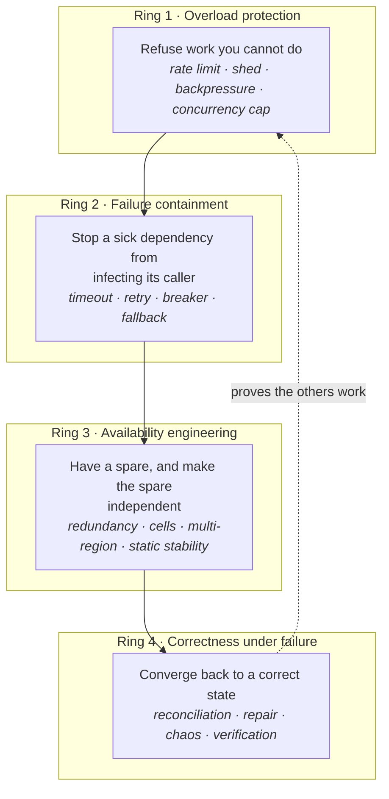
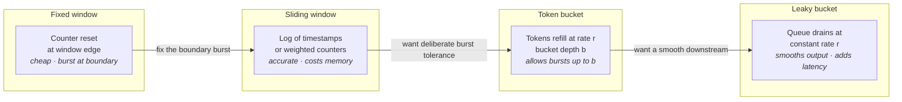
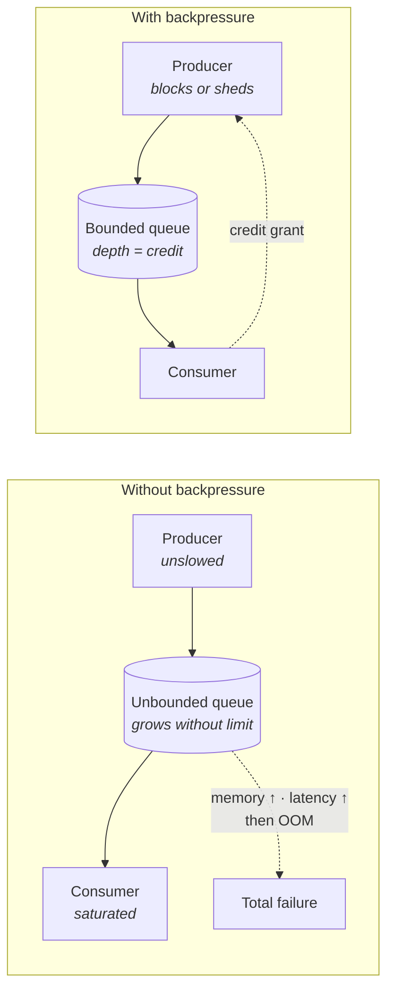
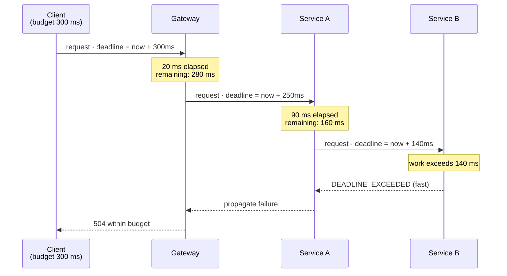
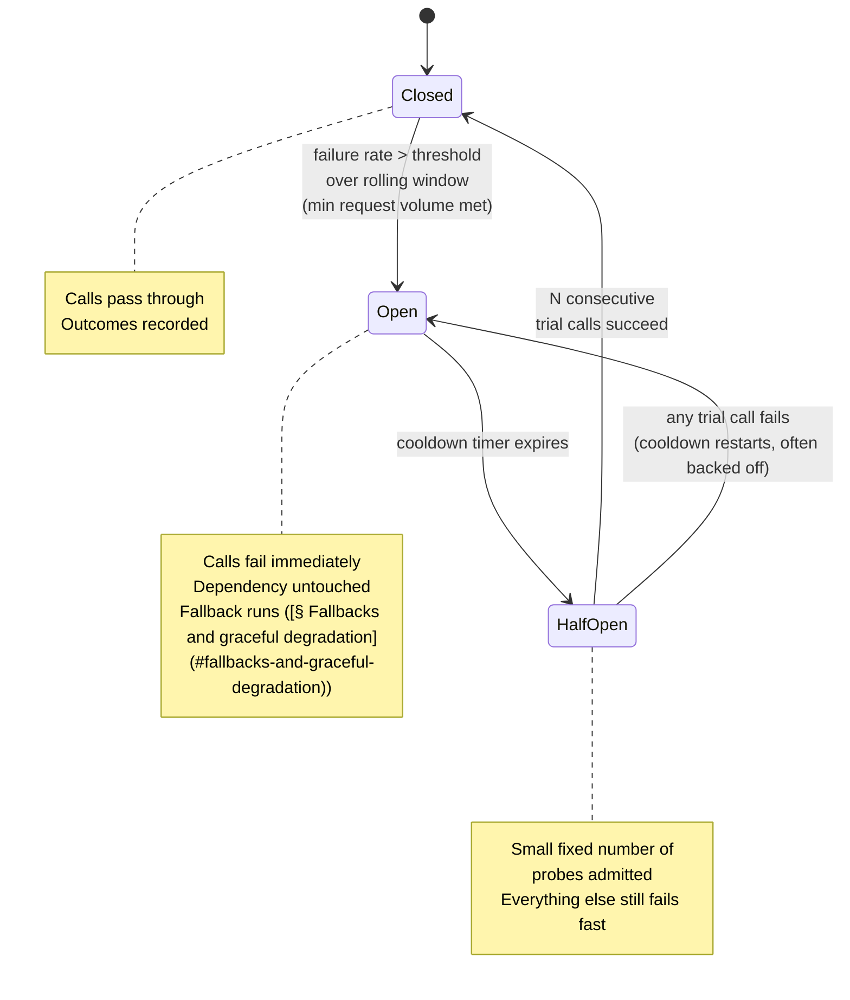
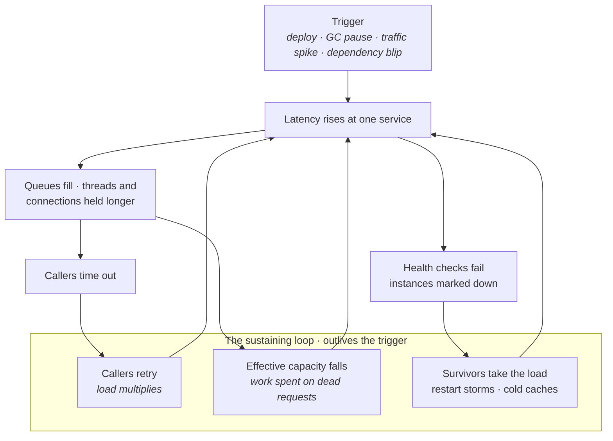
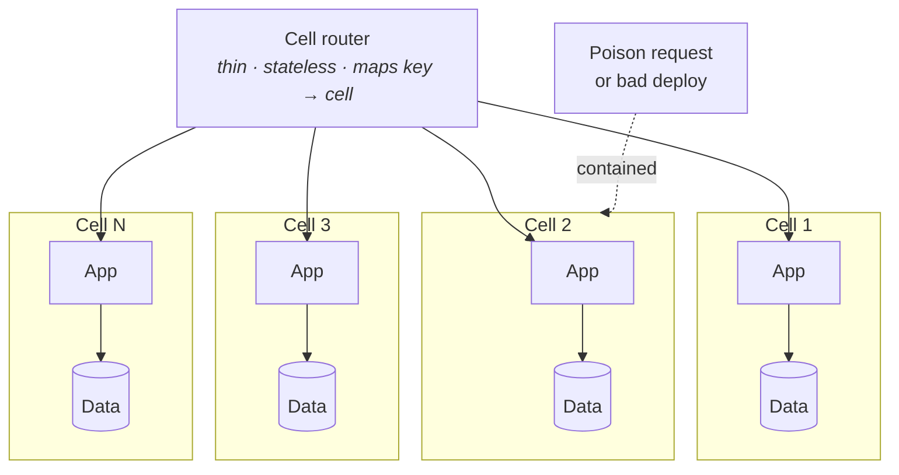
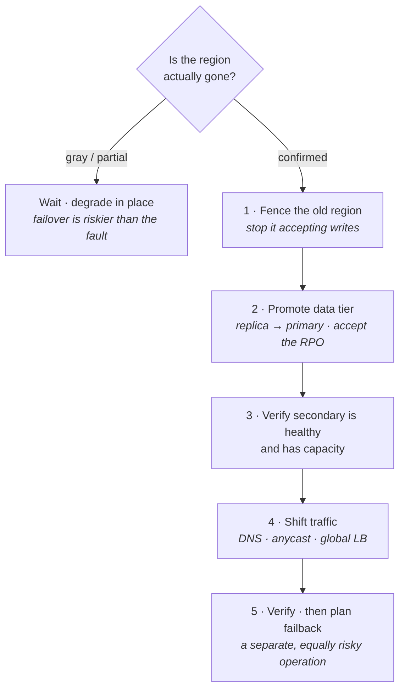
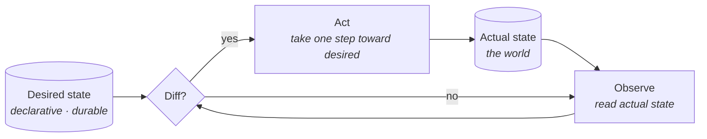

# Reliability and Resilience

Lecture 1 gave you two uncomfortable results. The first was the availability arithmetic: a request that depends serially on five services each at 99.9% cannot itself exceed 99.5%, and MTTR — not MTBF — is the term you actually control. The second was the queueing intuition: as utilization approaches one, latency does not degrade gracefully, it goes vertical, and an unbounded queue converts an overload into unbounded latency rather than into an error.

This lecture is the catalogue of mechanisms that sit between those two facts and a total outage. Every technique here does one of four things: it *refuses work* before the system saturates, it *contains a failure* so the caller does not inherit it, it *keeps a spare* so a lost component is not a lost service, or it *converges the system back* to a correct state after the damage. The marquee section is [§ Cascading and metastable failure](#cascading-and-metastable-failure) — cascading and metastable failure — because almost every large outage is not the story of a component breaking, but the story of a system's own recovery machinery keeping it broken.

## The four rings of defence

Reliability engineering is easier to hold in your head as concentric rings, each with a different question.

- **Ring 1 acts before saturation.** Its currency is *rejected requests*. Every mechanism in it is a way of choosing which work not to do, on the theory that a fast error beats a slow timeout.
- **Ring 2 acts at the call boundary.** Its currency is *isolation*. It assumes a dependency is already broken and asks how little of that breakage propagates up.
- **Ring 3 acts before the incident, at design time.** Its currency is *independence*. Redundancy that shares a fate is not redundancy — it is a more expensive single point of failure.
- **Ring 4 acts after, and continuously.** Its currency is *convergence*. Distributed systems drift; something must notice and fix it without a human.
- **The dotted edge is the one people skip.** Rings 1–3 are hypotheses about behaviour under conditions you have never observed. Ring 4's chaos and verification work is what turns them into knowledge.

## Rate limiting

A rate limiter is an explicit, *pre-declared* cap on the work a caller may submit per unit time. It is not primarily about fairness — it is about making the load your system receives a quantity you chose rather than a quantity your callers chose.

**What it buys you:**

- **Capacity becomes predictable.** You can provision for the sum of the limits rather than for the worst thing a client might do.
- **Blast radius shrinks.** One misbehaving tenant, one runaway retry loop, one script in a `while true` cannot consume the whole system.
- **Costs become attributable.** A limit is also a billing and quota primitive.
- **Failure becomes a clean, cheap rejection** — an HTTP `429` with a `Retry-After` — rather than a queue that grows until everything times out.

### The four algorithms

- **Fixed window** — keep a counter per `(key, window)`; increment on each request; reject above `N`; discard the counter at the window boundary. One integer per key, trivially cheap, and the standard answer for a first-pass limiter.
  - **The flaw — the boundary burst.** A limit of 100/minute permits 100 requests in the last instant of one window and 100 in the first instant of the next: **200 requests in a sub-second span, 2× the intended peak rate**. Every fixed-window limiter has this, and adversarial or merely retry-synchronized clients find it naturally.
- **Sliding window log** — store the timestamp of every request in a sorted structure per key; on each arrival, evict entries older than the window and count what remains. **Exact** — no boundary artefact at all.
  - **The cost is memory and write amplification.** You store one entry per request per key, not one counter. At 10k rps with a 1-minute window that is 600k live timestamps; at a million keys it is unusable. Reserve it for low-rate, high-value limits.
- **Sliding window counter** — the practical compromise. Keep the current and previous fixed-window counters and interpolate: if you are 30% into the current window, the estimate is `prev × 0.7 + curr`. Constant memory, kills the boundary burst, and is *approximate* — it assumes arrivals were uniform within the previous window, so it can be off by a few percent in either direction against a deliberately shaped burst.
- **Token bucket** — a bucket of depth `b` refills at `r` tokens/second; a request consumes a token or is rejected. Rate is `r` in the long run, but up to `b` requests may arrive at once.
  - **The burst tolerance is a feature, not a leak.** Real clients are bursty; `b` is the knob for *how* bursty you will tolerate. `b = r` is roughly "one second of slack."
  - **The trap:** operators set `b` large "to be safe" and thereby permit a burst that exceeds the downstream's instantaneous capacity. Size `b` against what the *dependency* can absorb, not against what feels generous.
  - Implementable with two numbers per key — `tokens` and `last_refill` — with lazy refill computed on read. This is why it is the most-deployed algorithm.
- **Leaky bucket** — requests enter a queue that drains at a fixed rate `r`. Output is perfectly smooth; overflow past the queue bound is rejected.
  - **Key distinction from token bucket:** a token bucket shapes the *input decision* and passes bursts through; a leaky bucket shapes the *output* and converts a burst into added latency. Use the leaky bucket when the downstream genuinely cannot take a spike (a legacy system, a third-party API with a hard contract).
  - **The failure mode is bufferbloat** — from Lecture 1. The queue is latency in disguise. An unbounded leaky bucket does not protect anything; it just relocates the pain from a `429` to a p99 in the tens of seconds. **Always bound the queue, and prefer rejecting on queue *time* rather than queue *depth*** (see [§ Admission control and queue-time-based rejection](#admission-control-and-queue-time-based-rejection)).

| Algorithm | State per key | Burst behaviour | Accuracy | Use when |
|---|---|---|---|---|
| Fixed window | 1 counter | 2× at boundary | poor | quota accounting, coarse abuse limits |
| Sliding log | O(requests) | none | exact | low rate, high value, must be precise |
| **Sliding counter** | **2 counters** | **none material** | **approximate** | **general-purpose API limiting** |
| **Token bucket** | **2 numbers** | **bounded by `b`, deliberate** | **exact** | **general-purpose, burst-tolerant** |
| Leaky bucket | queue | none — smoothed | exact | protecting a rate-fragile downstream |

**In an interview:** naming token bucket is table stakes. Naming the fixed-window boundary burst, and then choosing `b` with reference to downstream capacity, is the signal.

### Distributed rate limiting

A limiter is only meaningful over the aggregate. The moment you have `N` stateless servers, per-instance counting means the real limit is `N × limit`, and `N` changes when you autoscale.

- **Central store** — every instance does an atomic increment against a shared Redis or equivalent, typically as one Lua script for atomicity.
  - **Accurate** and simple to reason about.
  - **Costs a network round trip on every request** — often more latency than the work being limited — and makes the limiter store a hard dependency on your request path.
  - **The failure mode that matters is what happens when the store is down.** Fail-open (allow everything) means an unprotected system exactly when infrastructure is already degraded. Fail-closed means the limiter's outage is your outage. **Fail open, but with a conservative local limiter as a floor** — this is the answer that shows you have thought about it.
- **Local + periodic sync** — each instance holds a local bucket sized `limit / N` and gossips or reports its consumption every few hundred milliseconds, redistributing unused allowance.
  - **No per-request round trip.** Overshoot is bounded by one sync interval.
  - **The trap is unequal load.** If the load balancer is not perfectly even, one instance exhausts its slice while others sit idle, and clients see rejections well below the global limit. Allowance redistribution exists precisely to fix this and is the fiddly part.
- **Probabilistic / sampled** — do not coordinate on every request; check the shared store with probability `p`, or admit with a probability derived from an estimated global rate. Enforcement is statistical: correct in expectation, loose on any individual request.
  - Suits very high-volume, low-value limits — DDoS-scale filtering — where an approximate cap at a millionth of the cost is the right trade.
- **Rule of thumb:** central store for limits measured in hundreds or thousands per second; local+sync for limits in the hundreds of thousands; probabilistic above that. The coordination cost must stay small relative to the work being protected.

### Which key do you limit on?

The dimension matters more than the algorithm, and multiple limits compose.

- **Per-user** — the fairness limit. Stops one account from monopolising shared capacity. Keyed on authenticated identity; anything keyed on IP is defeated by NAT (false positives on a whole office) and by rotation (false negatives).
- **Per-tenant** — the noisy-neighbour limit in multi-tenant systems, and the one tied to a contract. A tenant's limit should be enforced across *all* its users, or a tenant simply mints more users.
- **Per-endpoint** — the cost-asymmetry limit. `GET /health` and `POST /reports/generate` may differ by four orders of magnitude in cost; a single request-count limit is nonsense across them. Either limit endpoints separately or limit on *weighted cost units* rather than requests.
- **Global** — the survival limit. The absolute ceiling on aggregate admitted work, sized to your provisioned capacity. Everything above is per-caller *fairness*; this one is the only limit that actually protects the system, because the sum of per-caller limits almost always exceeds real capacity.
- **They compose as a chain, and you reject at the first miss.** The response should say *which* limit was hit — a client that cannot distinguish "you personally are throttled" from "the whole system is throttled" cannot react correctly to either.

## Load shedding

Rate limiting decides in advance what each caller may send. Load shedding decides, *right now, under real pressure*, what to drop. It is the mechanism that keeps the queueing curve from going vertical.

- **The premise:** past a certain arrival rate, throughput does not merely stop increasing — it *falls*, because the system spends its capacity on requests whose callers have already given up. Shedding restores the flat portion of that curve.
- **A shed request must be cheap.** If rejection costs anything close to serving, shedding cannot outrun the overload. Reject as early in the stack as possible — ideally at the edge proxy, before deserialization, auth, or a database connection.
- **Signal, not schedule.** Shed on a measured indicator of saturation — queue wait time, CPU, in-flight concurrency, latency against SLO — not on a hard-coded RPS number that goes stale the moment you change instance types.

### Priority-aware shedding and criticality tiers

- **Assign every request a criticality tier at the edge** and propagate it through the whole call chain alongside the trace context. Google's canonical set is `CRITICAL_PLUS`, `CRITICAL`, `SHEDDABLE_PLUS`, `SHEDDABLE`.
  - *Critical* — a paying user's checkout, an authentication, a healthcheck.
  - *Sheddable* — prefetches, recommendations, analytics beacons, background reindexing, batch jobs.
- **Shed from the bottom up.** Under pressure, drop `SHEDDABLE` first and continue upward only as needed. This turns "the site is down" into "the recommendations carousel is empty," which is a different incident.
- **Criticality must be inherited, not re-derived.** A batch job calling a service that calls another must mark its calls sheddable all the way down, or the innermost service will happily prioritise the batch work over interactive traffic it cannot see.
- **The trap:** every team declares its own traffic critical. Criticality assignment is an *organisational* control that needs an owner and an audit, or the tiers converge to "everything is CRITICAL_PLUS" and buy you nothing.
- **Retries must respect tiers too.** A shed sheddable request that is immediately retried at the same priority has not been shed; it has been deferred by a few milliseconds and added to the load.

### Admission control and queue-time-based rejection

- **Admission control** is shedding moved to the front door: a decision, before a request enters the working set, about whether the system can plausibly complete it within its deadline.
- **Reject on queue *time*, not queue *depth*.** Depth is meaningless without knowing service rate — 100 queued items is trivial at 10k rps and fatal at 10 rps. Time is directly comparable to the deadline. **If a request has already waited longer than its remaining deadline, do not start it: it is dead on arrival and every cycle spent on it is stolen from a live request.**
- **This "dead request" check is the single highest-leverage line of code in an overloaded server.** Under saturation, the queue fills with requests whose clients timed out long ago; serving them is pure waste and is exactly what keeps a metastable failure alive ([§ Cascading and metastable failure](#cascading-and-metastable-failure)).
- **CoDel-style controlled delay** is the productionised version: track the *minimum* queue sojourn time over a sliding interval; if it stays above a target (say 5 ms) for longer than an interval (say 100 ms), start dropping. Minimum-over-interval distinguishes a standing queue (bad, persistent latency) from a transient burst (fine, absorb it).
- **LIFO queueing under overload is counter-intuitive and correct.** In FIFO, when the queue is deep, *every* request is served late and everyone fails. In LIFO, the newest — least likely to have timed out — is served first, so some fraction succeeds. You trade fairness for a non-zero success rate. Serve LIFO while shedding, FIFO when healthy.
- **Admission control belongs at every layer that has a queue** — the load balancer, the server's accept queue, the thread pool, the database connection pool. A queue you did not know you had is a queue with no admission control.

## Backpressure

Backpressure is the propagation of "I am full" *upstream*, so that the producer slows down rather than the consumer buffering. It is the structural alternative to shedding: instead of deciding what to drop, you decline to accept in the first place.

- **The core claim: an unbounded queue is a bug, not a buffer.** It converts a throughput deficit into a latency explosion followed by an out-of-memory kill — and it hides the deficit from every metric until the moment it becomes fatal. A bounded queue makes the deficit visible immediately, as a rejection.
- **Bounded queues are the minimum viable backpressure.** Choosing the bound is choosing your maximum queueing latency: by Little's Law, `wait = depth / service_rate`. A 1000-deep queue in front of a 100 rps consumer is a hard-coded 10-second worst-case latency. Set the bound from your latency budget backwards, not from "what feels like enough."
- **Credit-based flow control** (the reactive-streams `request(n)` model, and the same idea in HTTP/2 and gRPC flow control) inverts the direction: the *consumer* tells the producer how many items it is prepared to receive, and the producer may not exceed the outstanding credit. Demand flows down, data flows up. The queue can never overflow because it is never oversubscribed.
- **Blocking versus shedding is the real decision.** Backpressure needs somewhere for the pressure to go:
  - *Blocking the producer* works when the producer is a pipeline stage that can idle — a stream processor, a batch reader. The pressure travels all the way to the source, which slows its intake.
  - *It does not work when the producer is a user-facing request handler.* Blocking there just moves the queue into your thread pool and then into the load balancer. At the edge of the system, backpressure must terminate in a rejection — you cannot ask the internet to slow down.
- **The failure mode is unpropagated pressure.** Backpressure that stops at one hop is useless: a service that blocks on a saturated dependency while continuing to accept new inbound requests has converted its dependency's overload into its own thread exhaustion. **Every hop must either propagate or reject; silently absorbing is the one thing that must not happen.**
- **Watch for hidden unbounded buffers.** Async client libraries with unbounded pending-request maps, TCP socket buffers, log shippers, message-broker producer buffers with `block.on.buffer.full=false`. Each is an unbounded queue wearing a different name.

## Concurrency limiting and bulkheads

Rate limits cap arrivals; concurrency limits cap *simultaneous in-flight work*. Concurrency is the more robust control, because it self-adjusts with latency: if a dependency slows by 10×, a fixed concurrency limit automatically admits 10× less work, whereas a fixed rate limit keeps admitting at the old rate into a system that can no longer absorb it.

### Bulkheads

- **The metaphor is a ship's hull**, divided so that a breach floods one compartment rather than the vessel. In software: partition your finite resources so that one dependency's failure cannot consume all of them.
- **The canonical failure it prevents:** service A calls dependencies B, C, and D from one shared thread pool of 200. D hangs. Within seconds all 200 threads are blocked on D, and A can no longer serve requests that only need B — **A is fully down because of a dependency that only 5% of its traffic touches.**
- **The fix is per-dependency partitioning** — a separate thread pool, semaphore, or connection pool per downstream, each with its own bound. Now D's failure caps out at D's slice, and traffic to B and C is unaffected.
- **Partition dimensions worth using:** per downstream dependency; per criticality tier; per tenant (a shared pool is how one tenant's pathological query starves everyone else); per endpoint class (cheap reads versus expensive writes).
- **Its genuine costs:**
  - **Lower utilisation.** Partitioned resources cannot be lent to whoever is busy. You are deliberately buying idle capacity as insurance.
  - **Harder sizing.** `N` pools to tune instead of one, and each must be sized for its own peak rather than for the smoothed aggregate.
  - **More context switching** if you implement with thread pools rather than semaphores. A semaphore bulkhead (limit concurrency, run on the caller's thread) is cheaper and sufficient when calls are already async; a thread-pool bulkhead is needed when the client library can block uninterruptibly.
- **Bulkheads at every scale:** separate connection pools within a process; separate processes; separate instance groups per tenant tier; separate cells ([§ Cell-based architecture](#cell-based-architecture)). It is the same idea repeated with a coarser boundary.

### Adaptive concurrency limits

A static concurrency limit is wrong the moment anything changes — instance type, code path cost, dependency latency. Adaptive limits infer the right value continuously, using the same congestion-control logic as TCP.

- **The core observation, straight from Little's Law:** for a system at its optimum, `concurrency = throughput × latency`. Measure latency; when latency rises without throughput rising, you are queueing, not working — reduce the limit.
- **Gradient / Vegas-style algorithms** — track `RTT_noload` (the minimum observed latency, an estimate of true service time) and `RTT_actual`. The gradient `RTT_noload / RTT_actual` is near 1 when there is no queue and falls as a queue forms. Update `limit ← limit × gradient + queue_allowance`. Latency rises → limit shrinks → the queue drains → latency falls → the limit grows back. Continuous, automatic, no configured RPS anywhere.
- **AIMD variants** (additive increase, multiplicative decrease) do the same job more bluntly: grow the limit slowly on success, halve it on a timeout or a rejection. Less precise, far easier to reason about, and hard to get catastrophically wrong.
- **Apply it on both sides.** The *server* uses an adaptive limit as admission control ([§ Admission control and queue-time-based rejection](#admission-control-and-queue-time-based-rejection)). The *client* uses one to avoid pushing more concurrency at a dependency than that dependency can absorb — this is the mechanism that prevents a client from participating in its own dependency's collapse.
- **The failure mode: `RTT_noload` drift.** If the minimum-latency estimate is measured over too long a window, a system that has been slow for an hour treats "slow" as its new baseline and stops shrinking the limit. Re-probe the minimum on a rolling window (typically tens of seconds) so the estimate can recover *and* decay.
- **The second failure mode: a limit that collapses to zero.** Multiplicative decrease with no floor plus a persistent error source drives the limit to 1 and keeps it there, so the system cannot discover that the dependency recovered. Always enforce a minimum limit and always let it grow on success.

## Timeouts and deadlines

A call without a timeout is a call that can hang forever, and a thread that hangs forever is a resource permanently removed from your pool. **Every network call, every lock acquisition, every queue `get`, every connection checkout has a timeout — the only question is whether you chose it or inherited a library default of "none."**

### Deadline propagation

- **Propagate an absolute deadline, not a relative timeout.** A relative timeout ("5 seconds") restarts the clock at every hop, so a five-hop chain of 5-second timeouts can legitimately take 25 seconds while the client gave up at 3. An absolute deadline — a wall-clock instant carried in request metadata, as gRPC and most RPC frameworks do — means every hop knows the *real* remaining time.
- **Cancellation must travel with it.** When the deadline passes or the client disconnects, the cancellation should propagate downstream so in-flight work stops. Without it, an overloaded system keeps computing results nobody will read — the wasted-work pathology of [§ Admission control and queue-time-based rejection](#admission-control-and-queue-time-based-rejection) at full scale.
- **A deadline lets a callee refuse cheaply.** If service B is handed 140 ms and knows its p99 is 400 ms, the correct response is an immediate `DEADLINE_EXCEEDED`, not an attempt. That refusal is free capacity.
- **Reserve headroom at each hop.** Pass down slightly less than you have left, so you retain time to serialize the error, run a fallback, and answer your own caller within *their* budget. A hop that passes its full remaining budget downstream guarantees it will itself blow the deadline whenever the downstream uses all of it.

### Timeout budgets down the chain

- **The budget shrinks monotonically.** Client 300 ms → gateway 250 ms → service 140 ms. Any hop whose timeout exceeds its caller's remaining budget is doing work whose result cannot possibly be used.
- **Retries consume the budget, they do not extend it.** If you have 140 ms left and one attempt takes 100 ms, you get *one* retry, and only if you are willing to blow the budget. Retry policy must be expressed inside the deadline, which is why a retry loop with fixed counts and no deadline awareness is a bug.
- **Set timeouts from measured latency, not from round numbers.** A reasonable default is somewhere between p99 and p99.9 of the dependency's observed latency, plus margin. Set it at p50 and you will fail healthy requests; set it at 30 seconds and it will never fire before your thread pool is exhausted.
- **Sum-of-parts is the sanity check.** Add the worst-case timeouts along the critical path. If they exceed the user-facing SLO, the configuration is *already* wrong and no incident is required to prove it.
- **Connect timeout and read timeout are different knobs.** A connect timeout should be short (hundreds of milliseconds — a TCP handshake to a healthy peer in-region is ~1 ms). A read timeout must cover the actual work. Conflating them either fails healthy slow work or waits seconds to discover a dead host.

### The classic misconfiguration

- **Client timeout < server work time.** The client gives up at 1 s; the server routinely takes 3 s. Every single request "fails" from the client's point of view and *succeeds* from the server's.
- **The consequences compound:**
  - The client retries, so the server now does the work two or three times — **for requests whose results are guaranteed to be discarded**.
  - Effective load multiplies while effective throughput drops to zero.
  - Non-idempotent operations execute repeatedly: duplicate charges, duplicate orders, duplicate sends.
  - Server-side dashboards show a healthy success rate and normal latency. Client-side dashboards show a total outage. **This mismatch is the fingerprint of the bug**, and is why you must alert on client-observed success rate, not server-observed.
- **The reverse misconfiguration is quieter and just as bad:** client timeout ≫ server timeout, so the client holds a connection and a thread long after the server has abandoned the work — the client's pool drains for no reason.
- **What to do instead:** derive timeouts top-down from the user-facing SLO, propagate deadlines ([§ Deadline propagation](#deadline-propagation)), and treat every timeout value as a number that must be justified against a measured latency distribution and reviewed when that distribution moves.

## Retries

Retries convert transient failures into successes. They also convert a partial failure into a total one, which is why they are the single most dangerous reliability mechanism in common use — the only one whose cost is highest exactly when the system is least able to pay it.

**When a retry is legitimate:**

- **Transient and independent** — a dropped packet, a single-host failure, a leader election in progress, a brief GC pause. Retrying reaches a *different* replica or a *different* moment.
- **Never for a deterministic failure.** A `400`, a validation error, an authorization failure, a malformed payload will fail identically forever. Retrying is pure amplification. **Retry `503`, `429` (after `Retry-After`), connection errors, and timeouts; never retry `4xx` other than `429`.**

**The only-retry-idempotent rule:**

- **A retry is safe only if executing the operation twice equals executing it once.** Reads are naturally idempotent; `PUT` and `DELETE` usually are; `POST` usually is not.
- **The hard part is the ambiguous outcome.** A timeout does not tell you whether the server did the work. Retrying a non-idempotent operation after a timeout is how you get double charges — and the timeout case is exactly when you most want to retry.
- **Make it idempotent instead of arguing about it.** The client generates an idempotency key per logical operation and sends the same key on every attempt; the server records `(key → result)` and returns the stored result on a repeat. Cost: a durable store on the write path, plus a retention policy. This is what payment APIs do, and it is the only robust answer.
- **Server-side deduplication windows** are the weaker variant — dedupe by key for a fixed TTL. Fine when retries are bounded and fast; wrong when a client retries hours later.

**Backoff and jitter:**

- **Exponential backoff** — `base × 2^attempt`, capped. Reduces pressure on a struggling dependency instead of hammering it at a fixed interval.
- **Jitter is not optional.** Without randomisation, all clients that failed at the same moment retry at the same moment, forever — a self-synchronising thundering herd ([§ Restart storms and thundering herds on recovery](#restart-storms-and-thundering-herds-on-recovery)). *Full jitter* — `sleep = random(0, base × 2^attempt)` — is the standard, and it decorrelates clients completely. Decorrelated jitter (`random(base, prev × 3)`) is a common refinement.
- **Cap attempts at 2–3 total, and cap them at *one* layer.** Which brings us to the amplification problem.

**Retry budgets — the mechanism that makes retries safe:**

- **A retry budget caps retries as a fraction of successful requests** — typically 10%. Once retries exceed that fraction, further retries are refused outright and the original error is returned.
- **This decouples retry volume from failure volume.** In the normal case (1% errors) the budget is never touched and retries work exactly as designed. In the pathological case (80% errors) retries are capped at 10% extra load instead of tripling it. **The budget converts a multiplicative amplification into an additive one — this is the whole point.**
- **Circuit-aware retries** — a retry that is issued into an open breaker ([§ Circuit breakers](#circuit-breakers)) is not a retry, it is a fast failure. The breaker and the retry policy must be aware of each other, or the retry loop will keep probing a dependency the breaker has already ruled dead.
- **Retry only at one layer of the stack.** Pick the layer with the most context — usually the outermost service that can still meet the deadline — and make every layer below it retry zero times. Layered retries multiply ([§ Retry amplification arithmetic](#retry-amplification-arithmetic)).
- **Hedged requests are a different tool** (Lecture 1's tail-tolerance): send a second request after p95 elapses and take the first response, cancelling the other. That fights *tail latency*, not failure, and costs a bounded few percent extra load. Do not confuse it with retrying, and do not enable it on a saturated dependency — it adds load precisely where load is the problem.

## Circuit breakers

A circuit breaker is a stateful proxy around a dependency that stops calling it once it looks broken. Its purpose is not to fix the dependency — it is to stop *your* service from burning its threads, connections, and deadline budget on calls that will fail anyway.

- **Closed** — normal operation. Requests pass; the breaker records outcomes in a rolling window (a sliding count or time window, *not* a lifetime counter).
- **Open** — the breaker trips. Every call fails immediately, with no network attempt. Two effects, and both matter: the caller's threads and deadline are preserved, and the struggling dependency gets a period of zero load in which it might actually recover. **Load removal is the half people forget, and it is often the half that fixes the incident.**
- **Half-open** — after a cooldown, admit a strictly limited number of trial calls. Success closes the breaker; a single failure re-opens it and restarts (usually lengthens) the cooldown. **Half-open exists solely to prevent the recovery thundering herd**: without it, every caller resumes full traffic at the same instant and re-kills a dependency that was just coming back.

**The thresholds, and why each exists:**

- **Failure rate over a rolling window**, e.g. >50% of the last 100 requests or the last 10 seconds. Rate, not count — 50 failures means nothing without knowing the denominator.
- **Minimum request volume** — do not trip on 2 failures out of 2. A low-traffic endpoint will otherwise flap open on statistical noise.
- **Cooldown duration** — long enough that the dependency could plausibly have recovered (typically 5–60 s), short enough that you are not down for minutes after it has. Exponential backoff on repeated trips is the right shape.
- **What counts as a failure** — connection errors and timeouts, yes. `5xx`, usually. `4xx`, **no**: a client sending bad requests must not trip a breaker for every other caller. Misclassifying `4xx` as failure is the most common breaker bug in the wild.
- **Slow-call thresholds** — count calls slower than some bound as failures. A dependency answering `200 OK` in 30 seconds is broken in every way that matters, and a pure error-rate breaker will never notice.

**Interaction with retries and fallbacks:**

- **Ordering matters: breaker outside, retry inside.** The retry's attempts are recorded as breaker outcomes; when the breaker opens, retries stop being issued entirely. The reverse ordering — retry outside the breaker — turns each retry into a breaker probe and defeats both.
- **An open breaker must trigger the fallback ([§ Fallbacks and graceful degradation](#fallbacks-and-graceful-degradation)), not just an error.** A breaker without a fallback converts a slow failure into a fast failure. That is a real improvement for resource preservation, but it is invisible to the user; the fallback is where the user-visible benefit lives.
- **Per-dependency, and usually per-instance-of-dependency.** One breaker per downstream *host* isolates a single bad replica; one per logical service can only tell you "everything is bad." Most mature clients keep both.
- **The failure mode: flapping.** A breaker that opens and closes every few seconds gives you the worst of both — periodic load spikes on a fragile dependency and unpredictable behaviour for callers. Cure with a longer window, a higher minimum volume, and backed-off cooldowns.
- **The second failure mode: a breaker on a dependency with no alternative.** If the fallback for "user database is down" is "fail the request," the breaker changes a 30-second failure into a 1-millisecond failure and nothing else. Still worth it — but be honest that it is a resource-protection measure, not an availability measure.

## Fallbacks and graceful degradation

Degradation is the discipline of deciding, in advance, which parts of your product you are willing to lose in order to keep the rest. **The decision is always made — the choice is whether you make it during design review or during an incident at 3 a.m.**

**The fallback repertoire, roughly in order of preference:**

- **Serve stale from cache.** The strongest fallback: the data is real, just old. Keep two TTLs — a *freshness* TTL after which you try to refresh, and a much longer *serve-stale* TTL during which you will return the old value if the origin is unavailable (`stale-while-revalidate` / `stale-if-error`). Costs: an explicit statement of how stale is acceptable per data type, and memory to hold entries past their nominal expiry. **A cache with a short hard TTL is worthless as a fallback — the fallback capability comes entirely from the willingness to serve past expiry.**
- **Static or default responses.** A default configuration, an empty recommendation list, a generic ranking instead of a personalised one. Requires an explicit "neutral" value per feature that is safe to show. The trap is defaults that are *wrong in a costly direction* — defaulting a fraud score to "pass" or an entitlement check to "allowed" is a security incident wearing a resilience costume. **Fail open on presentation, fail closed on authorisation.**
- **Feature shedding.** Disable whole optional features: turn off personalisation, drop the activity feed, hide the "people also bought" module, switch off non-essential writes. Needs a runtime kill-switch per feature, wired to config that can be flipped *without a deploy* — deployment pipelines are frequently unavailable during exactly the incidents where you need this.
- **Reduced fidelity.** Lower image resolution, fewer results per page, coarser aggregation windows, a cheaper model instead of the expensive one. Preserves the feature at lower cost.
- **Queue for later.** Accept the write, acknowledge, and process asynchronously when the dependency returns. Only valid where the caller genuinely does not need synchronous confirmation, and it converts an availability problem into a durability-of-the-queue problem.

**The degradation ladder, defined ahead of time:**

- **Write it down before the incident**, as an ordered list: at each level of pressure, which capability is sacrificed, what the user sees, and what triggers the step.
- A worked shape: *level 0* full service → *level 1* drop personalisation and recommendations → *level 2* serve cached/stale content, disable non-essential writes → *level 3* read-only mode, static shell → *level 4* a status page.
- **Each rung needs a trigger and an owner.** Automatic where the signal is unambiguous (breaker open, error budget burn rate); manual with a documented runbook where it needs judgement.
- **Every rung must be tested in production**, at low traffic, on a schedule. A degradation path exercised for the first time during an outage is not a fallback — it is untested code on the critical path at the worst possible moment. This is the same argument as the untested-failover trap in [§ DR drills and the untested-failover trap](#dr-drills-and-the-untested-failover-trap).
- **Fallbacks have capacity too.** If the fallback path calls a different service, that service now receives your entire traffic volume with no warning. **Capacity-plan the fallback, or you have simply chosen where the next outage happens.**
- **The failure mode nobody catches: silent fallbacks.** A degraded path that emits no metric and no log means you can be serving stale or default data for weeks with a perfectly green dashboard. **Every fallback increments a counter and is alertable.** Discovering during an incident that you have been degraded since a deploy three weeks ago is a distressingly common story.

## Cascading and metastable failure

This is the section that separates staff from senior. Most large outages are not "a component failed." They are "a component failed, the system's response to that failure generated more load than the original failure did, and the system stayed down after the trigger was gone." A system in that state is **metastable**: it has a healthy stable state and a degraded stable state, and a transient shock can move it from one to the other permanently.

- **A trigger and a sustaining effect are two different things.** The trigger — a deploy, a spike, a GC pause — may last seconds and be entirely gone. The sustaining effect — retries, wasted work, cold caches, failing health checks — is *powered by the failure itself* and does not need the trigger to continue.
- **This is why "we rolled back and it stayed down" happens.** Removing the trigger does not exit the degraded state, because the degraded state is self-sustaining. Every arrow that loops back into `L` is a positive feedback edge.
- **Health checks are a feedback edge people rarely draw.** An overloaded instance fails its health check, is removed from the pool, and its traffic is redistributed onto the remaining instances — which are now *more* overloaded. The load balancer, acting exactly as designed, converts a partial overload into a total one. This is why health checks should distinguish "process is dead" (remove it) from "process is overloaded" (leave it in, let it shed).

### Retry amplification arithmetic

- **One layer, `n` total attempts:** worst-case load multiplier is `n`. With `n = 3`, a full outage means 3× the normal request rate hitting the failing dependency.
- **Layers multiply.** Client retries 3×, gateway retries 3×, service retries 3× → **27 requests at the bottom of the stack for one user action**. Add a fourth layer and it is 81. This is the arithmetic to have at your fingertips: **retry amplification is `∏ nᵢ` across layers, not `Σ nᵢ`.**
- **The nonlinearity is the whole danger.** Let `p` be the failure rate and `n = 3` attempts. At `p = 0.01`, expected attempts per request ≈ `1.01` — retries are effectively free and you never notice them in a load test. At `p = 1.0`, it is `3.0`. **Retries impose their maximum cost precisely at the moment the system has the least capacity to absorb it**, and no amount of healthy-state testing will reveal it.
- **The threshold argument that makes it concrete.** Suppose a service runs at 70% utilisation. A brief blip pushes the error rate to 30%. With 3 attempts, offered load becomes roughly `1 + 0.3 + 0.09 ≈ 1.39×`, so utilisation goes to ~97%. Latency at 97% utilisation is several multiples of latency at 70% (Lecture 1's M/M/1 knee), so more requests exceed their timeout, so the error rate rises further, so the multiplier rises further. **Past a critical point the loop is self-reinforcing and the system settles at 3× offered load with a near-zero success rate.**
- **Retry budgets ([§ Retries](#retries)) break this** by capping retries at a fraction of *successes*, so the multiplier is bounded near `1.1×` regardless of error rate. Backoff-with-jitter alone does not — it spreads the retries in time but does not reduce their number.

### Connection-pool exhaustion

- **The arithmetic is Little's Law read backwards.** A pool of `L = 100` connections serving requests with latency `W` sustains `λ = L / W`.
  - `W = 10 ms` → **10,000 rps**.
  - `W = 1 s` (the downstream slowed 100×) → **100 rps**.
- **A 100× latency increase is a 100× capacity loss**, and the service is now *itself* the bottleneck even though nothing about it changed. This is the fundamental mechanism by which a slow dependency becomes an outage in its caller.
- **Above that new capacity, requests queue for the pool.** Pool checkout wait is added to every request's latency — including requests that would have needed no downstream call at all. The pool becomes a shared choke point and the failure spreads laterally into unrelated code paths.
- **The specific pathology to name: a slow dependency is worse than a dead one.** A dead dependency fails connections in microseconds and the pool never fills. A dependency answering in 30 seconds holds every connection for 30 seconds. **Fast failure is a gift; gray failure is the enemy** — which is exactly why breakers need slow-call thresholds ([§ Circuit breakers](#circuit-breakers)) and why bulkheads ([§ Bulkheads](#bulkheads)) must partition pools per dependency.
- **Database connections are the classic instance.** Postgres connections are expensive and capped in the low hundreds; a pool of app servers each with a generous local pool can exceed `max_connections` during a latency event, at which point *new connections are refused* and even healthy queries fail. The fix is a pooler with a global bound (PgBouncer in transaction mode), not larger local pools.
- **Sizing rule of thumb:** pool size ≈ `expected_concurrency = target_rps × p99_latency`, plus modest headroom — deliberately *not* sized for the degraded case. A pool sized for the worst case is a pool that lets you push a degraded dependency all the way into collapse.

### Metastability proper

- **Definition:** a system is metastable when it has (at least) two stable operating points — a healthy high-throughput one and a degraded low-throughput one — separated by a barrier, such that a transient perturbation can push it across and it will not come back on its own.
- **The two ingredients are always the same:** a *trigger* that momentarily exceeds capacity, and a *sustaining effect* — work amplification that is itself caused by the degradation. Retries, cache misses after eviction, recomputation after timeout, health-check flapping, lock convoys, GC death spirals.
- **Hysteresis is the practical consequence.** The load at which the system *enters* collapse is much higher than the load at which it *escapes* collapse. A system that fell over at 100k rps may not recover until load drops to 30k rps — well below what it was serving happily an hour earlier.
- **Which yields the operational rule: to exit a metastable failure you must remove load, not add capacity.** Adding capacity often fails because the new instances arrive with cold caches and are immediately buried ([§ Restart storms and thundering herds on recovery](#restart-storms-and-thundering-herds-on-recovery)). Removing load works because it is the only thing that can starve the sustaining loop. In practice: turn the traffic down at the edge — aggressively, to 10–20% — let the system stabilise, then ramp back up. This feels wrong (you are deliberately failing customers who *could* have been served) and is nonetheless the fastest route back.
- **The design implication:** eliminate work amplification, or bound it. A system whose per-request work is constant regardless of health has no sustaining effect available and therefore cannot be metastable, no matter what triggers hit it. Retry budgets, deadline propagation with cancellation, dead-request rejection, and admission control are all instances of the same principle: **do not let degradation increase the work per unit of useful output.**

### Restart storms and thundering herds on recovery

**Why recovery is often harder than the original failure — the load at recovery time is qualitatively different from steady-state load.**

- **Cold caches.** Steady state: 95% cache hit rate, so a 10,000 rps front end sends 500 rps to the database. After a cache-tier restart the hit rate is 0%, so the database sees **10,000 rps — a 20× spike** — at the exact moment it is also recovering. It cannot serve that, requests time out before the cache can be populated, and the cache never warms. The system is stuck in the degraded stable state. *Mitigations:* warm caches before taking traffic, restart cache nodes in small batches, serve stale during warm-up, and admit traffic in a ramp rather than all at once.
- **Restart storms.** An orchestrator kills instances failing health checks and starts replacements. Under overload *every* instance is failing health checks, so the orchestrator kills the entire fleet in a rolling wave. Each replacement starts cold, is immediately buried by the load its dead peers were carrying, fails its own health check, and is killed. **The orchestrator, doing precisely its job, becomes the sustaining effect.** *Mitigations:* health checks with an overload-versus-dead distinction; generous startup grace periods; caps on simultaneous replacements; and a circuit breaker on the orchestrator itself — if more than X% of the fleet is unhealthy, stop replacing and page a human, because a fleet-wide failure is not a per-instance problem.
- **Synchronised clients.** After an outage, every client that was retrying resumes at once — worse, they have often synchronised *onto the same instant* through fixed backoff intervals, cron schedules, or a shared reconnect timer. The recovering service receives a spike far above normal peak. *Mitigations:* full jitter on every retry and reconnect ([§ Retries](#retries)); server-side `Retry-After` with randomised values; half-open breakers that admit a trickle ([§ Circuit breakers](#circuit-breakers)); and connection-rate limits at the edge.
- **Reconnect storms in stateful systems.** A WebSocket or database tier that drops all connections forces simultaneous re-establishment — TLS handshakes, auth, session restoration — which is 10–100× more expensive per connection than serving a request. A tier that comfortably serves a million connections may be unable to *establish* a million connections in any reasonable window. Capacity-plan the reconnect rate, not just the connection count.
- **Queue backlog on recovery.** An async system that was down accumulated hours of backlog. When it returns, consumers see a full queue and process at maximum rate, hammering downstream dependencies far above normal. *Mitigation:* rate-limit backlog drain deliberately, and prioritise the newest work if freshness matters more than completeness.
- **The unifying rule: recovery must be ramped, jittered, and staged.** Any recovery procedure that restores 100% of capability at `t=0` is a procedure for re-entering the outage. Design the return path with the same care as the failure path.

## Redundancy models and blast radius

Redundancy is not "have more than one." It is "have more than one *that will not fail at the same time for the same reason*," and then "make sure the failure of one costs a bounded fraction of the whole."

### Redundancy configurations

- **Active-active** — all replicas serve traffic. No idle capacity, failover is instantaneous (just stop routing to the dead one), and the path is exercised continuously so it is known to work. **Costs:** every replica must be able to handle writes or you need a routing rule; with multiple writers you inherit conflict resolution and consistency questions.
- **Active-passive** — one serves, the standby is warm but idle. Simple consistency story, single writer. **Costs:** you pay for idle capacity, failover takes seconds to minutes, and — the real problem — **the passive path is never exercised, so its failure probability is unknown and empirically high.**
- **N+1** — provision one spare unit beyond what peak load requires; survives one failure at full performance. Cheap. **The trap:** during a failure you are running at exactly N with zero spare, so a second failure (or a deploy, or an AZ event) during that window is an outage. And N+1 sized for *average* load is not N+1 at peak.
- **N+2** — survives one failure *while* something else is out for maintenance. This is what you actually need if you deploy during business hours, and it is the honest cost of continuous delivery.
- **The independence caveat that voids all of it:** replicas sharing a rack, a power feed, a switch, a hypervisor, an AMI, a config push, a certificate, or a control plane are not independent. **Correlated failure is the default, not the exception** — most "we had three replicas" outages are the story of three replicas sharing one thing. Lecture 1's redundancy math assumes independence; your job is to earn it.

### Cell-based architecture

- **A cell is a complete, independent instance of the stack** — its own compute, its own data, its own caches — serving a fixed partition of customers. Cells do not talk to each other.
- **The blast radius of any failure is one cell: `1/N` of customers.** Ten cells means a catastrophic bug affects 10% of users rather than 100%. This is the primary argument, and it is an availability argument even though no individual cell is more reliable than the monolith was.
- **Deployments become progressive by construction.** Roll to one cell, observe, proceed. A bad deploy is capped at one cell's worth of customers, and the rollback is a cell-scoped operation.
- **Cells cap scaling risk.** Each cell has a known, *tested* maximum size; you scale by adding cells, not by growing a single system into a regime nobody has ever operated. "We have never run this system larger than a cell" is an enormously valuable property.
- **Its genuine costs:**
  - **The router is a new single point of failure**, and it must be trivially simple and static-stable ([§ Static stability](#static-stability)) — ideally a mapping so dumb it can be cached at the client.
  - **Cross-cell operations become hard or impossible.** Anything that needs a global join, a global uniqueness constraint, or a transaction across two customers now needs a different design.
  - **Poor bin-packing.** Each cell needs its own headroom; aggregate utilisation drops.
  - **Rebalancing customers between cells is a migration**, with all a migration's difficulty.
- **The unit of assignment must be chosen carefully** — customer, tenant, or shard key. If one customer is larger than a cell, cells do not save you, and you need a per-cell size limit enforced at assignment time.

### Shuffle sharding

- **The problem it solves:** with plain sharding across 8 nodes and 2 replicas per customer, a "poison pill" customer — one that crashes whatever serves it — takes down 2 nodes and *every* customer assigned to those same 2 nodes. Customers share complete fates in groups.
- **The mechanism:** assign each customer a *random subset* (a "shuffle shard") of nodes, deterministically derived from their ID. Two customers overlap only partially.
- **The combinatorics are the payoff.** With 8 nodes and 2 per customer there are `C(8,2) = 28` distinct pairs. A poison customer takes out its 2 nodes; another customer is fully affected only if their pair is exactly that pair — `1/28 ≈ 3.6%` of customers — and everyone else keeps at least one healthy node. Scale it up: **100 nodes, 5 per customer gives `C(100,5) ≈ 75 million` combinations. The probability another customer shares all 5 is effectively zero.**
- **Partial overlap must be survivable.** The whole scheme depends on a customer with 4 of 5 nodes degraded still being served by the fifth — so the client must retry against a *different* node in its shard, and the per-node capacity must tolerate the imbalance. Shuffle sharding without client-side failover across the shard buys you nothing.
- **Where it is used:** AWS applies it in Route 53 and API Gateway; it is the standard technique for multi-tenant systems where a single tenant can degrade a node.
- **Compose it with cells:** shuffle-shard *within* a cell for tenant isolation, cell for deployment and bug isolation. They defend against different things — cells against correlated *code* failure, shuffle sharding against correlated *workload* failure.

## Multi-AZ and multi-region

Every step up the geographic ladder buys independence and costs latency, consistency, and money. **You are buying a larger failure domain's worth of independence at a strictly increasing price, and the exchange rate is set by physics.**

- **Multi-AZ** — availability zones within a region are separate buildings with separate power and cooling, connected by dedicated fibre with **~0.5–2 ms RTT**. That is close enough for synchronous replication and for a quorum to span three AZs without meaningfully hurting write latency. **Multi-AZ is the default; there is essentially no excuse for a single-AZ production system**, and every managed database offers synchronous multi-AZ replication.
  - Watch the cross-AZ data transfer charge: it is per-gigabyte in both directions and is a real line item for chatty services. AZ-aware routing (prefer a same-AZ replica, fall back cross-AZ) is the standard mitigation — but it must fall back, or you have re-created a single-AZ system with extra steps.
- **Multi-region** — **20–150 ms RTT** depending on distance, with the speed of light as a hard floor (Lecture 1). Synchronous cross-region replication means adding that RTT to *every write*; a 150 ms write latency is unacceptable for most interactive products, so cross-region replication is almost always asynchronous, which means **a non-zero RPO: a region loss loses the writes that had not replicated.**
  - Cross-region transfer is the most expensive network egress you buy, and it applies to replication traffic continuously, not just during failover.

**Topologies:**

- **Read-local / write-global** — reads served from the nearest region's replica; all writes routed to a single home region. Simple: one writer, no conflicts, strong consistency for writes. Costs: write latency for distant users is a full cross-region RTT, and losing the home region means losing all writes until failover. Replicas are asynchronous, so distant reads are stale by the replication lag — and read-your-own-writes needs explicit handling (sticky routing to the home region for a period after a write, or a write token the reader carries).
- **Full active-active** — every region accepts writes. Best latency and clean survival of a region loss. The cost is **concurrent conflicting writes**, and there are only three honest answers: (1) partition by key so each key has one home region and conflicts cannot occur — the most common real answer; (2) use CRDTs or last-write-wins and accept the semantics, which for counters or account balances is silently wrong; (3) run cross-region consensus and pay the RTT on every write (Spanner-style), which is correct and expensive.
- **The decision heuristic:** **do not go multi-region for availability alone until multi-AZ genuinely is not enough.** Multi-region roughly doubles operational complexity and adds a consistency model that will leak into the product. Go multi-region when you need it for *latency* (users on other continents), for *regulatory data residency*, or when your availability target genuinely exceeds what a region provides. "It sounds more reliable" is not a reason; a badly-run multi-region system is *less* available than a well-run multi-AZ one, because failover is now a mechanism that can itself fail.

**Regional failover — order of operations:**

- **Fencing comes first, always.** Promoting a secondary while the primary can still accept writes gives you two primaries — split brain — and a data reconciliation problem far worse than the outage. Fence by revoking credentials, withdrawing routes, or a control-plane lock.
- **Data before traffic.** Shifting traffic to a region whose data tier is still a read replica means an immediate write outage plus a stampede.
- **Traffic-shift latency is real and often the binding constraint.** DNS TTLs are honoured badly by clients and resolvers — assume minutes, not seconds, even with a 60 s TTL. Anycast and global load balancers with health-checked backends shift in seconds and are worth the cost if your RTO is tight.
- **The control plane is the trap.** Failover typically needs the very control plane that regional events tend to impair: autoscaling to grow the surviving region, DNS APIs, IAM, secret stores, deployment systems. **A failover plan that requires making new API calls to a degraded provider control plane is a plan that will not run** — see static stability ([§ Static stability](#static-stability)).
- **Failback is a second failover** and deserves the same planning. It is routinely botched because it happens under time pressure, after the incident, when everyone is exhausted and attention has moved on.

## Disaster recovery

DR is the discipline for events that redundancy does not cover: data corruption, a bad migration, ransomware, accidental deletion, a region loss. **Note the crucial difference from availability: replication faithfully replicates your corruption. Only a backup that is a point-in-time copy protects against a logical error.**

### RPO and RTO drive the architecture

- **RPO — recovery point objective** — how much *data* you can lose, measured in time. RPO = 0 requires synchronous replication and therefore constrains your write latency and topology.
- **RTO — recovery time objective** — how long you can be *down*. RTO drives how much you keep pre-provisioned and pre-warmed.
- **These are business decisions with engineering price tags, and stating them first is the entire point.** "Never lose data, never be down" costs an order of magnitude more than "lose 5 minutes, be back in 1 hour," and most systems do not need the former. A DR conversation that begins with technology rather than with RPO/RTO numbers is being had backwards.
- **Set them per data class.** Payments and audit logs may need RPO ≈ 0; analytics events may tolerate hours. Applying the strictest requirement uniformly is how DR budgets get burned on data nobody would miss.

### The four strategies

| Strategy | Standby state | Typical RPO | Typical RTO | Standing cost |
|---|---|---|---|---|
| Backup & restore | nothing running | hours | hours–days | lowest |
| Pilot light | data replicating, compute off | minutes | tens of minutes | low |
| **Warm standby** | **scaled-down full stack running** | **seconds–minutes** | **minutes** | **medium** |
| Hot standby / active-active | full capacity, taking traffic | ~0–seconds | seconds | highest |

- **Backup and restore** — periodic snapshots plus, ideally, continuous log archiving for point-in-time recovery. Cheapest, and **the only strategy that protects against logical corruption**, so you need it regardless of what else you run. The RTO is dominated by restore throughput: a 10 TB restore at 500 MB/s is roughly 6 hours *before* any replay, and nobody discovers this until they try.
- **Pilot light** — data continuously replicated to the secondary; compute exists as templates and images but is not running. Cheap because compute dominates cost. RTO is provisioning time — and provisioning during a regional event is exactly when capacity is scarce and control planes are throttling.
- **Warm standby** — a complete but scaled-down environment actually running. RTO is scale-up time, and — the underrated benefit — **the path is continuously exercised, so you know it works.** The usual right answer for systems that matter.
- **Hot standby / active-active** — full capacity in both, often serving live traffic. Near-zero RTO, and the failover path is the normal path. Most expensive, and forces you to confront cross-region consistency ([§ Multi-AZ and multi-region](#multi-az-and-multi-region)).
- **Backups are not backups until restored.** Test the *restore*, on a schedule, and measure how long it takes. Keep backups in a separate account/region with separate credentials and immutability (object-lock / WORM) — a backup an attacker or a buggy script can delete along with production is not a backup. And verify restored data, not just that the restore command exited zero.

### DR drills and the untested-failover trap

- **The trap, stated plainly: an untested failover has an unknown and empirically low success probability.** The industry-standard outcome of a first-ever real failover is that it fails, for reasons that are always mundane — a stale credential, an unreplicated config value, a security group that was never mirrored, a DNS record nobody had permission to change, a runbook referencing a decommissioned host, a hard-coded region string.
- **Only regular drills convert a *hope* into a *capability*.** Schedule them, do them in production, and measure the actual RTO achieved rather than the one on the design doc — the gap is usually large and is the most useful number DR produces.
- **Progression:** tabletop walkthrough → drill in a staging environment → drill in production during low traffic with a rollback ready → unannounced game day. Netflix's regional evacuation exercises are the mature end of this: they move real production traffic out of a region on a routine cadence, so the procedure is boring by the time it is needed.
- **What drills reliably surface:** config drift between regions, undocumented manual steps, unreplicated dependencies (that one Redis nobody remembered), capacity shortfalls in the standby, and the fact that the runbook's author left the company.
- **The strongest form is to not have a failover procedure at all** — run active-active so the "failover" is just removing one region from rotation. A path used every day cannot rot.

## Static stability

**Definition: a system is statically stable if it continues operating correctly in its current configuration when its control plane is unavailable.** It keeps doing what it was doing; it just cannot be changed.

- **The distinction that organises this: data plane versus control plane.** The data plane does the work (serving requests, forwarding packets, reading disks). The control plane changes the configuration (launching instances, updating routes, issuing certificates, scaling groups). **Control planes are inherently more complex, less tested at scale, and less available than data planes** — they handle rare operations with elaborate logic, while data planes do one thing billions of times.
- **Therefore: the data plane must not depend on the control plane to keep working.** A load balancer keeps forwarding to its last-known-good backend set when the config service is down. An instance keeps serving with its cached configuration. A router keeps its routing table. This is why AWS's guidance is that a zonal failure should require *no* control-plane action to survive.
- **Pre-provision instead of reacting.** If you need N+1 capacity to survive an AZ loss, **have that capacity already running, not an autoscaling rule that will acquire it.** Reactive scaling during a failure depends on: the metric pipeline working, the scaling control plane working, spare capacity being available in the surviving AZs (where everyone else is also scaling), and instances booting and warming in time. Each is more likely to fail during a large event, and they are all correlated with each other and with the event.
  - **The cost is explicit: you run at lower utilisation.** Three AZs sized to survive one failure means running at ~66% peak utilisation. That idle third is the insurance premium, and it is a smaller premium than an outage.
- **Static stability in practice — the checklist:**
  - Cache every configuration locally, with a long or absent TTL, and **fail to the last-known-good value rather than to an error**.
  - Never require a fresh credential, token, or certificate fetch on the request path — refresh well before expiry and keep serving with the current one if refresh fails.
  - Never require a service-discovery lookup per request; keep a cached endpoint list and use it when discovery is down.
  - Make failover a *removal* (stop sending traffic to X), which needs no new resources, rather than an *addition* (create capacity in Y), which does.
  - Prefer constant work over reactive work: a control loop that pushes the *entire* configuration on a fixed schedule, regardless of whether anything changed, has the same cost on the worst day as on the best. A system that does more work when more is wrong has a sustaining effect built in ([§ Metastability proper](#metastability-proper)).
- **The failure mode to name: a health-checking system whose failure marks everything unhealthy.** Fail *static* — when the health checker cannot reach targets, it should assume the last-known state, not mark them all down. AWS Route 53 health checks and ELB both do a version of this, and it is the difference between "monitoring is broken" and "everything is broken."

## Reconciliation and self-healing

Distributed systems drift: messages are lost, operations partially apply, humans intervene manually, a node was down when a change was pushed. **Anything built on the assumption that a command was received and applied will eventually be wrong. The alternative is a system that continuously compares reality to intent and closes the gap.**

- **Converge, do not command.** A command ("create three replicas") is a one-shot instruction whose loss is invisible and unrecoverable. A declaration ("there should be three replicas") is re-evaluated forever, so a lost action is retried automatically on the next pass. **This is the single most important structural idea in operating distributed systems**, and it is why Kubernetes controllers, Terraform, and every mature deployment system are declarative.
- **The loop must be idempotent and level-triggered.** *Level-triggered* means it acts on the current *state*, not on an *event*; a missed event is then harmless because the next pass sees the same state. *Edge-triggered* systems that only react to change notifications are permanently broken by a single dropped notification. **Use events as a latency optimisation, never as the source of truth** — resync fully on a timer regardless.
- **Take one step at a time and re-observe.** Controllers that compute a full remediation plan and execute it blindly will act on stale observations. Small steps with re-observation converge safely.
- **Rate-limit the actuator.** A reconciler that sees "zero healthy instances" and immediately creates a thousand is the restart storm of [§ Restart storms and thundering herds on recovery](#restart-storms-and-thundering-herds-on-recovery) with a controller as its engine. Bound the change rate, and bound the *absolute* number of simultaneous remediations.
- **Add a circuit breaker to the loop.** If the diff is enormous, the correct action is usually to stop and page rather than to remediate — a huge diff more often means the *observation* is wrong (a monitoring outage, a partition) than that the world really changed that much. A reconciler that faithfully deletes the fleet because it briefly could not see it is a well-documented category of outage.
- **Periodic auditors and drift detection** — a separate, simpler process that scans for inconsistencies and either reports or repairs. It is deliberately independent of the primary control path, so a bug in the controller does not blind the auditor.
  - **Auditors should be simple enough to be obviously correct**, and should run continuously at low rate rather than in a big periodic sweep — continuous auditing finds problems in minutes and has a flat, predictable cost.
  - **Report before you repair.** A new auditor should run in dry-run mode long enough to establish that its notion of "correct" is right. An auto-repairing auditor with a wrong model is an efficient data-destruction tool.
  - **Track the size of the discrepancy backlog as a first-class metric.** A growing backlog means repair is slower than corruption — an urgent condition that a pure error-rate dashboard will never show you.

## Data repair

Replicated data diverges: a replica was down during a write, a write was acknowledged by a quorum but never reached the third node, bit rot flipped a byte. Repair is the machinery that converges replicas without a human.

- **Read repair** — on a quorum read, compare the responses; if a replica returned a stale or missing version, write the current one back to it. Free-riding on read traffic, so it costs almost nothing.
  - **Its limitation is its virtue's shadow: it only fixes data that is read.** Cold data stays divergent indefinitely — precisely the data most likely to be silently wrong when you finally need it. Read repair is necessary and never sufficient.
- **Hinted handoff** — when a replica is unreachable, a coordinator stores a *hint* (the write, plus who it was for) and replays it when the replica returns. Bridges short outages efficiently.
  - Bounded by hint storage and a hint TTL; past that window the replica must be repaired by anti-entropy. And hints are themselves a single copy until delivered — losing the hint-holder loses the write.
- **Anti-entropy** — a background process that systematically compares replicas and repairs differences, covering everything regardless of access. The correctness backstop.
  - **Merkle trees make the comparison cheap.** Hash each key range, build a tree of hashes, and exchange only the root; equal roots mean the datasets are identical and *no data was transferred*. Unequal roots mean you descend only the differing branches, so the cost is `O(differences × log n)` rather than `O(dataset)`.
  - **The costs are real:** building the tree requires reading all the data (I/O amplification on the replica); the tree must be maintained or rebuilt as data changes; and range granularity is a trade — coarse ranges mean cheap trees but large repair transfers, fine ranges mean the opposite.
  - **The failure mode: repair that never finishes.** If repair throughput is below the divergence rate, the backlog grows without bound and the system is permanently inconsistent while every dashboard says "repair is running." Cassandra operators know this as the repair-window problem: repair must complete within the tombstone grace period (`gc_grace_seconds`), or deleted data resurrects.
- **Consistency checkers** are the cross-system analogue: independent jobs that verify invariants nothing else enforces — that every order has a payment, that index entries point at live rows, that a secondary store matches the primary, that reference counts match reality. **Anywhere you denormalised, cached, or dual-wrote, you created an invariant with no enforcer; a checker is the enforcer.**
- **Repair backlogs need capacity and priority.** Repair competes with live traffic for I/O and must be rate-limited so it does not cause the incident it is preventing — but rate-limited so aggressively that it never converges is the failure above. Both the backlog *size* and its *rate of change* need to be metrics with alerts.

## Chaos and fault injection

Every mechanism in this lecture is a hypothesis about behaviour under conditions you have never seen. Chaos engineering is the experimental method that turns those hypotheses into evidence. **It is not "break things randomly" — it is a controlled experiment with a stated prediction.**

**The four elements of an experiment:**

- **A steady-state metric** — a measurable output that indicates the system is healthy *from the user's perspective*: successful orders per minute, p99 latency, stream starts per second. Not CPU, not internal counters. If you cannot define steady state, you cannot detect that you broke it, and you must fix that before injecting anything.
- **A hypothesis, stated in advance** — "when we terminate one instance in AZ-a, successful orders per minute will remain within 2% of baseline and p99 latency will stay under 400 ms." **The value is in being wrong.** A confirmed hypothesis teaches you little; a violated one is a bug found before a customer found it.
- **The injected fault** — a real event, drawn from the taxonomy: instance termination, AZ isolation, dependency latency injection, error injection, packet loss, clock skew, disk-full, CPU starvation, DNS failure, certificate expiry, region evacuation. **Latency injection finds more bugs than termination does**, because gray failure is harder than clean failure ([§ Connection-pool exhaustion](#connection-pool-exhaustion)) and almost nobody tests for it.
- **Controlled blast radius** — the discipline that makes it responsible:
  - Start in staging, then production at low traffic, then business hours.
  - Scope to a small percentage of traffic, one cell, or one shuffle shard.
  - **An automatic abort that trips on the steady-state metric**, plus a manual stop that is one command and is tested first.
  - A stated maximum duration, and a pre-agreed blast radius nobody may exceed on the day.
- **Run in production or you have not run the experiment.** Staging has different data, different scale, different traffic patterns, and different configuration — the failures that matter live in the gaps between them.
- **Automate the experiments that passed.** A one-off game day proves a property today. A continuously-running experiment proves it after every deploy, which is where the durable value is.
- **The organisational precondition:** chaos engineering on a system with no observability produces an outage and no learning. Fix the monitoring first (which is the next lecture).

## Testing distributed correctness

Unit tests and integration tests exercise the paths you thought of. Distributed bugs live in the interleavings and failure timings you did not, and they are not reliably reachable by writing more example-based tests.

- **Deterministic simulation testing** — run the entire system on a simulated, seeded scheduler: virtual clock, virtual network, controlled thread interleaving, injected partitions and disk faults, all driven by a single random seed. Then run millions of simulated hours per wall-clock hour, and when something fails, **replay the exact seed to reproduce it perfectly.**
  - **Reproducibility is the whole point.** The reason distributed bugs take weeks to fix is that they cannot be reproduced; determinism removes that entirely.
  - **The cost is architectural, and it is high.** Every source of nondeterminism — real time, real I/O, real threads, hash iteration order, random numbers — must be abstracted behind an interface the simulator controls. This is very hard to retrofit; it is a decision made at the start of a project.
  - **FoundationDB is the canonical example** and attributes its reliability record primarily to this. TigerBeetle and Antithesis (as a general-purpose product) follow the same approach.
- **Jepsen-style linearizability checking** — run a real cluster, apply a workload of concurrent operations, inject partitions and clock skew and process pauses, record a history of `(invoke, ok/fail/info)` events, and afterwards ask a checker whether that history is *explainable* by the claimed consistency model.
  - Checks the model you claim: linearizability, sequential consistency, snapshot isolation, causal consistency. Knossos/Elle do the analysis; Elle in particular infers transactional anomalies from observed dependencies.
  - **Black-box, so it needs no cooperation from the system** — which is why it has been so effective at finding real violations in shipped databases, repeatedly, in systems whose documentation claimed otherwise.
  - **Its limits:** checking is expensive (linearizability checking is NP-hard in general, so histories must be kept short), it finds bugs rather than proving their absence, and *info* (indeterminate) results complicate analysis. A clean Jepsen run is evidence, not a proof.
  - **The staff-level takeaway is cultural:** treat a vendor's consistency claim as a claim, and ask what independent verification exists. "We are linearizable" and "we have a published Jepsen report we responded to" are very different statements.
- **Property-based testing** — instead of examples, state an invariant and let the framework generate thousands of randomised inputs and *shrink* any failure to a minimal counterexample. Ideal for protocol and state-machine code: "any sequence of operations leaves the state machine in a valid state," "encode then decode is the identity," "a replica that applies the log in order matches the leader."
  - Shrinking is the underrated part: it turns a 400-operation failing sequence into the 3 operations that actually matter.
- **Fuzzing of protocols and parsers** — generate malformed, truncated, reordered, and adversarial messages and assert that the system rejects them cleanly rather than crashing, hanging, or corrupting state. Coverage-guided fuzzers explore state space far more effectively than random input, and this is as much a security control as a reliability one — every wire-format parser should be fuzzed.
- **Model checking (TLA+, Alloy)** — specify the protocol abstractly and exhaustively check that safety and liveness properties hold across all interleavings within a bounded state space. Finds design-level bugs before any code exists; **does not verify your implementation matches the spec**, which is the gap simulation testing fills. AWS has published extensively on using TLA+ for exactly this on S3, DynamoDB, and EBS.
- **The layering to remember:** model checking verifies the *design*, property-based and fuzz testing verify the *components*, deterministic simulation verifies the *implementation*, Jepsen verifies the *deployed system*, and chaos engineering ([§ Chaos and fault injection](#chaos-and-fault-injection)) verifies the *production environment*. Each catches a class the others cannot.

## Numbers, systems, and named failure modes

Concrete anchors worth carrying into an interview.

**Latency and capacity numbers that drive the mechanisms:**

- Same-AZ RPC ≈ **0.5 ms**; cross-AZ ≈ **1–2 ms**; cross-region **20–150 ms**; the speed of light in fibre puts a hard floor near 60 ms round trip on a transatlantic hop.
- Connection pool capacity: `λ = L / W`. A 100-connection pool at 10 ms latency sustains **10,000 rps**; at 1 s latency, **100 rps**.
- Cache-warm arithmetic: a 95% hit rate front end at 10,000 rps sends **500 rps** to the origin; at 0% hit rate it sends **10,000 rps** — a **20× spike** at the worst moment.
- Retry amplification: three layers of three attempts is **27×** at full failure, **~1.01×** at a 1% error rate.
- Shuffle sharding: 100 nodes, 5 per tenant → **`C(100,5) ≈ 75 million`** combinations; full overlap between two tenants is effectively impossible.
- A managed Postgres typically caps at a few hundred `max_connections`; a hundred app servers with a 20-connection local pool each want 2,000. This mismatch is why a pooler is mandatory, not optional.

**Named mechanisms and where they come from:**

- **Hystrix / resilience4j / Polly** — circuit breakers, bulkheads, and retry policies as libraries. Netflix's Hystrix popularised the pattern; resilience4j and Polly are its modern JVM and .NET successors. Service meshes (Envoy, Istio, Linkerd) moved the same primitives into the sidecar, so they apply uniformly without library adoption.
- **Envoy's outlier detection** — per-host ejection based on consecutive `5xx` or latency, i.e. a per-endpoint circuit breaker in the proxy. Its `max_ejection_percent` cap is the important detail: it refuses to eject more than a configured fraction of hosts, precisely because ejecting everything during a common-mode failure is the cascading failure of [§ Cascading and metastable failure](#cascading-and-metastable-failure).
- **gRPC deadlines** — absolute deadlines propagated in request metadata, with cancellation flowing downstream. The reference implementation of [§ Deadline propagation](#deadline-propagation).
- **CoDel** — controlled delay, originally a network AQM algorithm, now the standard approach to queue-time-based shedding in application servers (Facebook/Meta documented its use in their PHP and Thrift stacks).
- **AWS cell-based architecture and shuffle sharding** — documented in the Builders' Library; Route 53 and API Gateway are the production examples.
- **Netflix Chaos Monkey / Simian Army / regional evacuation drills** — the origin of chaos engineering as a practice, and still the best-documented example of routinely evacuating a region in production.
- **Kubernetes controllers** — the mainstream instantiation of level-triggered reconciliation; `kube-controller-manager`'s node-eviction rate limits and its `--unhealthy-zone-threshold` (stop evicting when too much of a zone looks unhealthy) are [§ Reconciliation and self-healing](#reconciliation-and-self-healing)'s actuator rate limit and reconciler circuit breaker, in production.
- **Cassandra/DynamoDB anti-entropy** — hinted handoff, read repair, and Merkle-tree repair, exactly as described in the Dynamo paper.
- **FoundationDB's deterministic simulation** and **Jepsen's published reports** — the two reference points for [§ Testing distributed correctness](#testing-distributed-correctness).

**Named failure modes to be able to describe in one sentence each:**

- **Retry storm** — layered retries multiply load exactly when capacity is lowest.
- **Thundering herd** — many clients act simultaneously after a shared trigger (cache expiry, reconnect, cron, backoff without jitter).
- **Cache stampede** — a popular key expires and N concurrent requests all miss and all recompute it; cured with request coalescing / single-flight, probabilistic early expiry, and serving stale while one refreshes.
- **Metastable failure** — a self-sustaining degraded state that outlives its trigger and requires load removal, not capacity addition, to exit.
- **Gray failure** — a component that is slow or partially wrong rather than dead, so health checks pass and failure detection never fires. The hardest case, and the reason for slow-call thresholds and client-observed metrics.
- **Split brain** — two nodes both believing they are primary after a partition; prevented by fencing tokens and quorum, not by hope.
- **Death spiral / GC spiral** — memory pressure causes longer collections, which cause more queueing, which causes more allocation, which causes more pressure.
- **Lock convoy** — a contended lock serialises threads such that throughput collapses while CPU sits idle.
- **Poison pill** — one message or one tenant that reliably kills whatever processes it, taking down consumers in sequence; cured with retry limits and dead-letter queues.
- **Correlated failure through shared config** — a bad config or certificate pushed everywhere at once defeats every form of redundancy simultaneously. Staged config rollout is a reliability mechanism, not a process nicety.

## Takeaways

- **Rejecting work is a feature, and the fastest possible rejection is the most valuable one.** Rate limits, shedding, and bounded queues exist so that overload produces cheap errors instead of an unbounded latency explosion. A system with no mechanism for saying no has already chosen to fail slowly.
- **Retries are the most dangerous mechanism in this lecture** because their cost is multiplicative across layers (`∏ nᵢ`) and peaks exactly when capacity is lowest. Only a retry *budget* — retries capped as a fraction of successes — converts that multiplication into a bounded addition.
- **A slow dependency is worse than a dead one.** Dead fails in microseconds and touches nothing; slow holds your connections, threads, and deadline budget until you are the outage. Design for gray failure: slow-call breakers, deadline propagation, per-dependency bulkheads.
- **Cascading failure is a feedback loop, and metastability means removing the trigger does not end it.** To exit, you must remove *load* — often to a fraction of what the system was happily serving. Adding capacity into a cold-cache, retry-saturated system usually makes it worse.
- **Recovery load is qualitatively different from steady-state load.** Cold caches, synchronised reconnects, restart storms, and queue backlogs all spike at the moment of least capacity. Every recovery path must be ramped, jittered, and staged, or it re-enters the outage it is exiting.
- **Redundancy without independence is just more expensive single points of failure.** Shared racks, shared control planes, shared config pushes, and shared certificates are what actually take systems down. Cells and shuffle sharding are how you buy bounded blast radius rather than merely more replicas.
- **Static stability is the discipline of not needing the control plane on your worst day.** Pre-provision rather than react, cache configuration and fail to last-known-good, and design failover as a *removal* rather than a *creation*. The idle capacity is the premium.
- **Converge, do not command.** Level-triggered reconciliation against a declared desired state is the only structure that survives dropped messages, partial applies, and manual intervention — with an actuator rate limit and a circuit breaker so the reconciler cannot become the incident.
- **An untested failover is a hope, not a capability.** The same is true of every fallback, degradation rung, and backup. Chaos experiments, DR drills, deterministic simulation, and Jepsen-style checking exist because the mechanisms in this lecture are unverified hypotheses until something deliberately breaks the system and the metrics say what you predicted.

**Next:** observability and operations — you cannot defend against a failure mode you cannot see.
