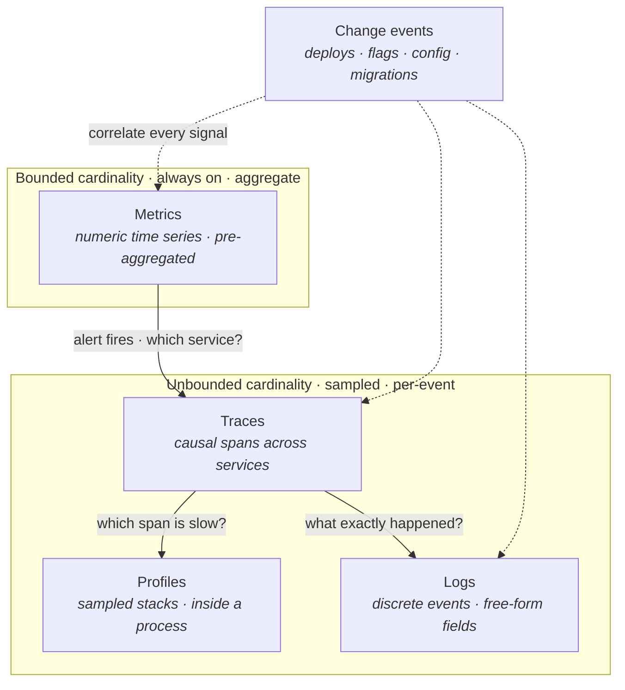
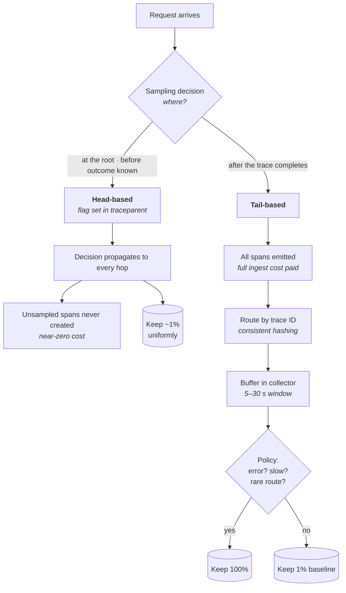
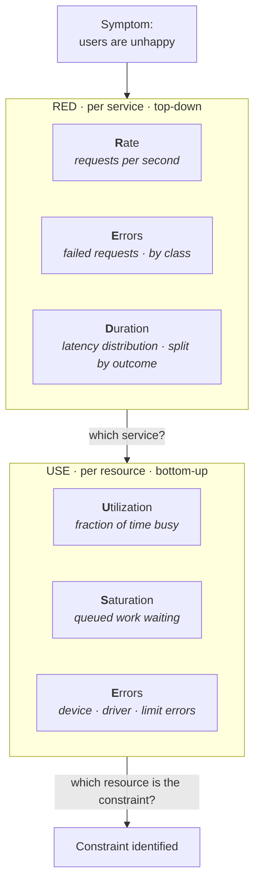
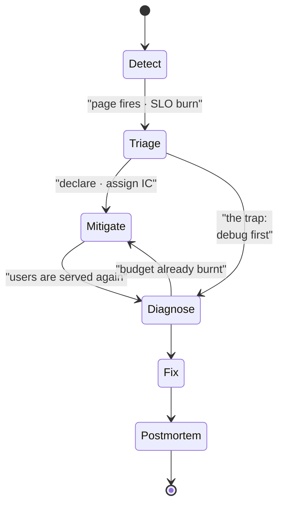

# Observability and Operations

Lecture 8 built the defences: timeouts, retries, circuit breakers, fallbacks, redundancy, failover, reconciliation loops. Every one of them is a *conditional* — it fires when some signal crosses some line. A circuit breaker without a health signal is dead code; a failover without a detector is a manual runbook; an error budget without an SLI is a slogan. Resilience is only as good as the telemetry that triggers it.

And the part that no automation covers is the part a human has to do. Availability is roughly `MTBF / (MTBF + MTTR)`, and in practice you move MTTR far more easily than MTBF. MTTR decomposes into *time to detect*, *time to understand*, and *time to mitigate* — and the first two are pure observability. A system whose failures take forty minutes to localize cannot be a four-nines system no matter how elegant its replication protocol is. This lecture is about making failure legible, and about the operational practices that convert legibility into recovery.

## Monitoring versus observability

- **Monitoring** — you enumerated the failure modes in advance and built a check for each. Answers *known* questions: is the disk full, is the queue backed up, is the process alive.
- **Observability** — you can answer questions you did not anticipate, from telemetry already emitted, without shipping new code. Answers *novel* questions: why is p99 up only for Android clients on one shard since 14:05.
- **Key distinction:** monitoring is a set of predicates; observability is a property of the data. The test is whether a new hypothesis costs you a query or a deploy. If understanding a novel failure requires adding a log line and waiting for a release, you have monitoring.
- **Why this matters at scale** — distributed systems fail in combinatorially many ways. You cannot enumerate them. The failures that page you at 3 a.m. are precisely the ones nobody predicted, so the ones your explicit checks do not cover.
- **The trap:** treating dashboards as observability. A dashboard is a frozen hypothesis from a past incident. It is useful, and it is not the same as being able to slice by an arbitrary dimension.
- **Rule of thumb:** you need *both*. Monitoring gives you cheap, bounded, always-on alerting. Observability gives you the ability to diagnose once the alert fires. [§ The telemetry pillars and their division of labor](#the-telemetry-pillars-and-their-division-of-labor)–[§ Events and change tracking as a correlation source](#events-and-change-tracking-as-a-correlation-source) are mostly about the second; [§ SLOs and error budgets](#slos-and-error-budgets)–[§ Multi-window, multi-burn-rate alerting](#multi-window-multi-burn-rate-alerting) about the first.

## The telemetry pillars and their division of labor

There are four signal types plus one that is usually forgotten. They are not interchangeable — each occupies a different point on the cost-versus-cardinality curve, and the discipline is knowing which question belongs to which.

- **Metrics answer "is something wrong, and how much".** Cheap enough to keep at full fidelity forever, because they are aggregated at write time. Their fatal limitation is cardinality — see [§ Cardinality: how it multiplies and what it costs](#cardinality-how-it-multiplies-and-what-it-costs).
- **Traces answer "where in the call graph".** They carry the causal structure metrics throw away. Expensive per event, therefore sampled.
- **Logs answer "what exactly happened to this one request".** Unbounded field cardinality, highest cost per byte, weakest aggregation story.
- **Profiles answer "which line of code".** They fill the gap traces cannot: work happening *inside* one span — garbage collection, lock contention, a hot loop.
- **Change events answer "what did we do to it".** The dotted lines are the point: change events are not a pillar so much as the correlation key that makes the other four interpretable. [§ Events and change tracking as a correlation source](#events-and-change-tracking-as-a-correlation-source).
- **The workflow is the diagram read top to bottom.** Alert on metrics because they are cheap and complete; localize with traces; explain with profiles or logs. Skipping straight to logs is how incidents take two hours.

## Metrics

### Instrument types

- **Counter** — monotonically increasing, reset only on process restart. Requests served, bytes written, errors. You never read a counter directly; you read its *rate*. The monotonicity is what makes restarts detectable and rates computable across them.
- **Gauge** — a value that can go up or down: queue depth, memory in use, connections open, temperature. Sampled at scrape time, so a gauge that spikes between scrapes is invisible. **The failure mode:** using a gauge for something bursty — a queue that fills and drains in 200 ms looks empty at a 15 s scrape interval.
- **Histogram** — pre-defined buckets, each a counter of observations `≤ le`. Emits `_bucket` series per boundary plus `_sum` and `_count`. Quantiles are computed *at query time* from the buckets.
- **Summary** — quantiles computed *in the client process* over a sliding window, emitted as ready-made `quantile="0.99"` series. Cheaper to query, and **fundamentally non-aggregatable** — you cannot combine two processes' summaries into a fleet quantile. See [§ Aggregation error: why averaging percentiles is invalid](#aggregation-error-why-averaging-percentiles-is-invalid).
- **Rule of thumb:** counters for events, gauges for levels, histograms for anything you will want a percentile or a threshold-count of. Reach for summaries only for a single-instance metric you will never aggregate — which, in a replicated service, is almost never.
- **Bucket choice is a permanent decision.** Buckets are baked into stored data; changing boundaries breaks historical comparison. Choose them around the SLO threshold you care about — if your latency SLO is 300 ms, you need a bucket edge *at* 300 ms, or you are interpolating across it.
- **Native/exponential histograms** — newer implementations store sparse, exponentially-spaced buckets chosen automatically, giving bounded relative error, mergeability, and no boundary pre-commitment, at a few hundred bytes per series. Prefer them where available.

### Cardinality: how it multiplies and what it costs

A metric is not one series. It is one series *per distinct combination of label values*, and the combinations multiply.

- **The multiplication is a product, not a sum.** `http_request_duration` labeled by `endpoint` × `method` × `status` × `pod` at 20 × 4 × 6 × 100 = 48,000 label combinations.
- **A histogram multiplies that again by its bucket count.** 12 buckets plus `_sum` plus `_count` = 14 series per combination → 48,000 × 14 = **672,000 active series from a single instrumented metric**.
- **Then add one unbounded label and it detonates.** Adding `user_id` at 100,000 users takes that to ~10¹¹ series. Adding `request_id` makes it one series per request — you have reinvented logging, at a hundred times the price.
- **The cost, concretely:** a Prometheus-class TSDB spends on the order of 1–3 KB of resident memory per *active* series for the in-memory head block and inverted index, before compressed on-disk samples. A million active series is several GB of RAM in the scraper alone; ten million is a sharding project. Query cost scales with series touched, so high-cardinality metrics are also slow to read exactly when you need them.

**The sneaky one — churn.** Cardinality is not the number of series alive right now; it is the number created over the retention window, because the index must hold them all.

- A `pod` or `instance_id` label under Kubernetes changes on every deploy. Twenty deploys a day × 100 pods = 2,000 new series per day *per label combination*, and none of the old ones can be dropped from the index until they age out.
- Same problem: `container_id`, `build_sha`, `node_name` on autoscaled fleets, `ip_address`.
- **This is why fleets that look fine on Monday fall over on Friday.** The series count is a running integral, not an instantaneous value.

**Label discipline — the rules that actually hold:**

- **Every label's value set must be bounded, enumerable, and known at design time.** If you cannot write down the list, it is not a label.
- **Never label with:** user ID, request ID, session ID, trace ID, email, raw URL path containing identifiers, full error message, SQL text, arbitrary customer-supplied strings.
- **Normalize before labeling** — `/users/{id}/orders`, not `/users/8412/orders`. An unnormalized route label is the single most common cardinality explosion in the wild.
- **Cap it in the client library.** Bound the label set at instrumentation time with an allowlist and an `other` fallback, so a bad deploy cannot take down the metrics system. Server-side limits and drop rules are a backstop, not a plan.
- **Those questions belong in traces and logs**, which carry unbounded dimensions natively and pay for it with sampling. That is the whole division of labor from [§ The telemetry pillars and their division of labor](#the-telemetry-pillars-and-their-division-of-labor).

### Aggregation error: why averaging percentiles is invalid

This is the most common quantitative mistake in production monitoring, and it is not an approximation — it is a category error.

- **Quantiles are not additive; counts are.** You can sum two counters and get the true combined counter. There is no arithmetic on `p99(A)` and `p99(B)` that yields `p99(A ∪ B)`, because a quantile is a property of a *distribution*, and you threw the distribution away when you reduced it to one number.
- **Worked counterexample.** Server A: 100 requests, `p99 = 1000 ms`. Server B: 9,900 requests, `p99 = 20 ms`.
  - The naive dashboard shows `avg(p99) = 510 ms`.
  - The true combined p99 is the 100th-slowest of 10,000 requests. B alone contributes 99 requests at or above 20 ms, and A contributes at most 100 requests total. The true value sits near **20–30 ms** — off by a factor of roughly twenty.
  - **Request-weighting does not fix it.** The weighted average here is 29.8 ms, which happens to land close, but that is arithmetic coincidence on this data, not a valid method. Invert the example — make A the high-traffic server — and weighting is wrong in the other direction.
- **What is true:** the pooled quantile always lies between the minimum and maximum of the component quantiles, since the pooled CDF is a convex combination of the components'. So the error is bounded — by the *spread* of the inputs, which for latency tails routinely spans two orders of magnitude. Bounded and useless.
- **The same error happens over time, silently.** Downsampling a 1-minute p99 series into 1-hour rollups averages sixty percentiles together. Most dashboard tools do this by default when you zoom out, so your view of last quarter is systematically wrong in a way your view of last hour is not.
- **Averaging p99s also cannot be maxed away.** `max(p99)` is not the answer either — it is the worst single instance, which over-reports the user experience and turns one sick pod into a fleet-wide alarm.

**What to do instead:**

- **Aggregate the buckets, then compute the quantile.** Histogram buckets *are* counters, so they sum exactly. In PromQL: `histogram_quantile(0.99, sum by (le) (rate(http_request_duration_bucket[5m])))` — sum first, quantile last. Reversing that order is the bug.
- **Use a mergeable sketch** where you need client-side quantiles — DDSketch gives a hard relative-error guarantee under merge; t-digest merges with good accuracy in the tails but no strict bound; HDR histograms give fixed relative precision over a configured dynamic range.
- **Or sidestep quantiles entirely for alerting.** Count the events that violated a threshold: "fraction of requests slower than 300 ms" is a *ratio of counters*, exactly aggregatable, and directly usable as an SLI ([§ Service-level indicators](#service-level-indicators)). This is the reason SRE-style latency SLIs are defined as counts rather than percentiles.
- **In an interview:** if you say "we alert on average p99 across the fleet", expect to be stopped. Say "we aggregate histogram buckets across instances and compute the quantile at query time", and the point is made in one sentence.

## Logs

Logs are the highest-fidelity and highest-cost pillar. The engineering is entirely about paying for the fidelity you need and not a byte more.

- **Structured logging** — emit machine-parseable records with stable typed fields (`{"level":"error","trace_id":"…","user_id":…,"latency_ms":…}`), not interpolated prose. Free-text logs push the cost onto a regex at query time, which is slow, fragile, and breaks whenever someone rewords a message.
- **Field discipline mirrors label discipline in reverse.** Here you *want* high cardinality — `user_id`, `trace_id`, `shard`, `build_sha` — because high-cardinality fields are exactly what makes a novel question answerable. What you standardize is field *names* and types, so that `user_id` means the same thing and parses the same way in every service.
- **Always carry the correlation keys** — trace ID, span ID, request ID, tenant. A log line you cannot join to a trace is an orphan. [§ Distributed debugging: correlation and assigning blame](#distributed-debugging-correlation-and-assigning-blame).
- **Levels are a sampling policy, not a mood.** `ERROR` means someone should look; `WARN` means it is expected but notable; `INFO` is the request-level narrative; `DEBUG` is off in production except when dynamically enabled per-service or per-request. Debug-by-trace-ID — turning on verbose logging for requests matching a header — is the mechanism that makes this practical.

**The cost model, honestly:**

- **Logging is not free at the emit site.** Formatting, serialization, and a lock on stdout cost microseconds each. At 50k rps, ten log lines per request is 500k formatted lines per second and the logger becomes your bottleneck. Guard expensive fields behind level checks and make emission asynchronous with a bounded, *droppable* buffer — a blocking log pipeline turns a logging outage into a service outage.
- **Ingest and indexing dominate storage.** A full-text search index typically costs several times the raw byte volume once inverted indexes and replicas are counted, whereas the same bytes in compressed object storage cost roughly an order of magnitude less. That gap is what drives tiering.
- **Retention tiers:** hot and fully indexed for 7–14 days (where incidents actually live), warm/partially-indexed for 30–90 days, cold in object storage with scan-on-demand for a year or more.
- **Audit and compliance logs are a separate stream with separate rules** — never sampled, integrity-protected, retention set by regulation not by cost, and access-controlled independently. Mixing them into the debug log stream means your retention policy is now a legal question.

**Sampling — the only thing that makes logs affordable at scale:**

- **Never sample uniformly.** Uniform 1% sampling discards 99% of your errors, which are the entire reason you kept logs.
- **Sample by outcome:** keep 100% of errors and slow requests; keep 1-in-100 or 1-in-1000 of routine successes. The successes exist only to give the errors a baseline.
- **Dynamic per-key sampling:** set the rate for each key (endpoint, status, customer) inversely proportional to its frequency, so a rare endpoint is kept at 100% and the firehose endpoint at 0.1%. This preserves rare-event visibility at constant total volume — the same idea as tail sampling in [§ Head-based versus tail-based sampling](#head-based-versus-tail-based-sampling).
- **Record the sample rate on every retained record.** Then counts reconstruct without bias: each kept record represents `1/rate` events. A sampled log store without recorded rates cannot answer "how many", only "did it happen".

## Traces

### Spans and context propagation

- **A span** is one unit of work: a name, start and end timestamps, a status, key/value attributes, and events. A **trace** is the tree of spans induced by one logical request, joined by `trace_id` and linked by `parent_span_id`.
- **What a trace gives you that metrics cannot** — the causal structure and the *critical path*. Metrics tell you service X is slow; the trace tells you X is slow because it called Y eleven times sequentially when one batched call would do.
- **Context propagation is the whole mechanism and the whole difficulty.** The trace context — W3C `traceparent`, carrying version, trace ID, parent span ID, and a flags byte whose low bit is `sampled` — must be threaded through every hop: HTTP headers, gRPC metadata, message-queue headers, thread-local or async-context storage inside the process.
- **The failure modes are all propagation gaps:**
  - **Async boundaries** — enqueue a job and the context is dropped unless you explicitly copy it into the message. Producer/consumer traces then look like two unrelated traces, and the queue latency becomes invisible.
  - **Thread and connection pools** — context lives in thread-local storage; hand work to a pool and it does not follow. Every language runtime has its own answer here, and every one of them has to be wired up deliberately.
  - **Third-party and legacy hops** — anything that does not forward unknown headers severs the trace. You get two trees and no way to join them except by timestamp guessing.
  - **Batch and fan-in work** — one span with many logical parents. Modeled as span *links* rather than parents, and most UIs render this badly.
- **Instrumentation quality dominates coverage.** Auto-instrumentation gets you HTTP and database spans for free; the spans that explain incidents are usually the hand-added ones around cache lookups, serialization, lock acquisition, and business logic.

### Head-based versus tail-based sampling

You cannot keep every span at scale — the volume rivals logs. The question is *when* the keep/drop decision is made, and it is a genuine architectural fork.

- **Head-based sampling decides at the root**, stamps the answer into the `sampled` flag, and propagates it. Every downstream service obeys — which is what makes traces *complete* rather than partial.
- **Its genuine costs:** the decision is made before you know whether the request failed or was slow, so a uniform 1% keeps 1% of your errors. For a failure mode occurring in 1 in 10,000 requests, you will capture roughly one example per million requests. That is the exact opposite of what you want.
- **Its genuine benefits:** constant, predictable overhead; unsampled spans are never constructed or serialized at all; no central buffering; trivially horizontally scalable; works when services are owned by different teams.
- **Tail-based sampling buffers the whole trace and decides once the outcome is known** — keep it if any span errored, if total duration exceeded a threshold, if it touched a rare route or a specific tenant, plus a small random baseline for comparison.
- **Its genuine costs, which people underestimate:**
  - **You pay full emission and network cost for every span**, including the 99% you discard. Tail sampling saves storage and query cost, not producer or ingest cost.
  - **All spans of a trace must reach the same collector instance** to be assembled, so the collector tier needs a routing layer that consistently hashes on trace ID. This is a stateful component in your telemetry path.
  - **Buffering costs memory proportional to span rate × window.** At 200k spans/s and a 10 s window with ~500 B per span, that is on the order of a gigabyte of collector memory, live.
  - **Traces longer than the window are decided incomplete.** Long-lived streaming requests and slow async workflows are exactly the interesting ones, and they are the ones the window truncates.
- **Its genuine benefit is the whole point:** ~100% capture of errors and tail-latency traces at ~1% of the storage. For rare-failure diagnosis there is no substitute.
- **The hybrid that most large deployments land on:** head-sample at a generous rate to bound producer cost, use per-process "retroactive" buffering so a request that errors can promote its own already-finished local spans, and tail-filter at the collector on top.
- **Consistent (deterministic) sampling is orthogonal and always worth doing:** derive the decision from `hash(trace_id) < threshold` rather than a fresh coin flip. Independent services then agree without coordination, and you can *lower* the rate downstream while keeping a coherent subset. Record the effective sampling probability on each span so counts and rates can be reconstructed unbiased — a sampled trace store without adjusted counts cannot be used for quantitative claims.

## Profiles and continuous profiling

Traces localize to a span. Profiles localize to a line. The gap between them is where "the service is slow but no individual span is slow" incidents live.

- **A profile is a statistical sample of execution state** — typically stack traces captured at 100 Hz per thread, aggregated into a tree where each node's weight is its sample count.
- **The types, and what each catches:**
  - **CPU** — where cycles go. Catches hot loops, accidental O(n²), over-eager serialization, regex backtracking.
  - **Heap / allocation** — what is allocated and retained, by allocation site. Catches leaks and allocation-rate-driven GC pressure.
  - **Off-CPU / wall-clock** — where threads are *blocked*: locks, I/O waits, channel receives. Usually more useful than CPU profiling for latency problems, and much less commonly enabled.
  - **Lock contention** — which mutex, held by whom, for how long.
- **Continuous profiling** means always-on, low-rate sampling across the whole fleet, stored with metadata: service, version, region, host, pod. Overhead is typically well under 1% CPU at production sampling rates.
- **The metadata is the feature.** Once profiles are tagged by version, you can take a **differential flame graph** across a deploy boundary and see exactly which stack got wider. This turns "the p99 regressed after Tuesday's release" from a bisect exercise into a two-minute query.
- **eBPF-based whole-machine profiling** samples every process on the host with no application changes and no redeploy, which is how you get coverage of services nobody instrumented — including the sidecars and agents you did not write.
- **The operational cost is symbolization.** Native and compiled-language stacks are addresses; turning them into function names requires debug info matched to the exact build. Keeping a symbol server populated by CI is the unglamorous prerequisite, and skipping it means your flame graphs are hexadecimal.
- **The failure mode:** fixed-rate sampling misses short-lived processes and startup costs entirely. A batch job that runs for 400 ms produces roughly forty samples — not enough to trust a narrow attribution.

## Events and change tracking as a correlation source

The cheapest high-value telemetry in existence, and the most frequently missing.

- **A change event stream** records every discrete action taken against the system, timestamped and attributed: deploys, rollbacks, feature-flag flips, config pushes, schema migrations, scaling actions, infrastructure changes, certificate rotations, DNS changes, dependency upgrades, and third-party incidents.
- **Why it dominates in value:** the first question in every incident is *what changed*, and [§ Change management as the dominant incident cause](#change-management-as-the-dominant-incident-cause) explains why the answer is usually "something did". An event overlay on a latency graph answers in seconds what log archaeology answers in an hour.
- **Render them as annotations on every dashboard**, not as a separate page nobody opens. The visual coincidence of a deploy marker and an inflection point is the fastest causal hypothesis generator available.
- **Automated correlation** — the mature version scores recent change events by temporal proximity and blast-radius overlap with the alerting signal, and surfaces the top candidates directly in the alert. Cheap heuristic, very high hit rate.
- **The failure mode:** tracking only *your own* deploys. Most surprising changes come from somewhere else — another team's config push, a platform upgrade, a cloud provider's maintenance, a vendor's silent API change, a feature flag flipped by product without a deploy. If your event stream only covers your CI pipeline, it will be empty during exactly the incidents you cannot explain.

## Service-level indicators

An SLI is a carefully specified ratio: **good events ÷ valid events**. The specification is where all the difficulty is.

- **Availability** — successful requests ÷ valid requests. Not uptime, not ping success. A process that is up and returning 500s is unavailable, and a black-box pinger will report it healthy.
  - **"Valid" excludes what you are not responsible for** — malformed client requests, `4xx` from authentication failures, traffic from a load test. Excluding too much is how teams hit their SLO during an outage.
- **Latency** — the *fraction of requests faster than a threshold*, not a percentile. `count(latency ≤ 300ms) / count(valid)` is a ratio of counters: exactly aggregatable ([§ Aggregation error: why averaging percentiles is invalid](#aggregation-error-why-averaging-percentiles-is-invalid)), directly comparable to a budget, and immune to the averaging fallacy. Use two or three thresholds if you need shape — "99% under 300 ms and 99.9% under 2 s".
- **Correctness / quality** — the fraction of responses that are *right*, not merely returned. Duplicate charges, wrong balance, empty recommendation set, truncated result page. Hardest to measure and the one users care most about; usually requires an out-of-band verifier that recomputes a sample of results.
- **Freshness** — for pipelines and derived data: the fraction of served records younger than X, or the fraction of pipeline runs completing within their window. The pipeline analogue of latency.
- **Coverage / completeness** — the fraction of input records actually processed. A pipeline that is fast and fresh while silently dropping 3% of events passes every other SLI.
- **Durability** — for storage: probability a stored object survives a period. Measured by continuous audit rather than by requests.

**Where you measure changes the number:**

- **Server-side** — cheap, attributable, complete for what reaches you. Blind to everything before you: DNS, TLS negotiation failures, CDN errors, load-balancer 502s, the client's own network.
- **Load balancer or edge** — the pragmatic default. Sees requests that never reached a backend, which are exactly the failures server-side metrics miss.
- **Client-side / real user monitoring** — the only truthful measurement of user experience, and the noisiest. Includes device and network variance you cannot fix, and is unreportable during the outages where clients cannot reach you at all — a total outage looks like *zero* bad events client-side.
- **Synthetic probes** — constant, controlled traffic from known locations. Give you a signal floor for low-traffic services (which matters enormously in [§ Multi-window, multi-burn-rate alerting](#multi-window-multi-burn-rate-alerting)) and catch total outages that RUM cannot report. They do not measure real users.
- **Rule of thumb:** define the SLI at the edge, corroborate with synthetics, and keep RUM for understanding rather than for alerting.

## SLOs and error budgets

- **An SLO is an SLI plus a target plus a window** — "99.9% of valid requests succeed, measured over a rolling 30 days". All three parts are load-bearing; a target without a window is meaningless.
- **Rolling versus calendar windows.** Rolling 30-day windows give a continuously updated view and no artificial reset; calendar windows (monthly, quarterly) align with reporting and with SLA terms but create a perverse incentive to take risk on the 28th. Most teams run rolling for engineering and calendar for reporting.
- **The error budget is the SLO's complement, expressed in events or time:** `budget = (1 − SLO) × valid events`. It is not a tolerance for sloppiness — it is a *quantified allowance for change*, and it is the only principled currency in which reliability and velocity trade.

| SLO | Budget per 30 days | Budget per year |
|---|---|---|
| 99% | 7.2 hours | 3.65 days |
| 99.9% | 43.2 minutes | 8.77 hours |
| **99.95%** | **21.6 minutes** | **4.38 hours** |
| 99.99% | 4.32 minutes | 52.6 minutes |
| 99.999% | 25.9 seconds | 5.26 minutes |

**Read the bottom two rows as a staffing decision, not a technical one.** Four nines gives you four minutes a month — less than the time it takes a human to read a page, open a laptop, and log in. Anything at or beyond that must be mitigated entirely by automation, which means failover, health-checking, and traffic-shifting must all be automatic and *tested*. Five nines effectively forbids a human in the loop at all. The 99.95% row is bolded because it is the highest target most teams can actually hold with human-assisted recovery, and it is where honest answers usually land.

**Three constraints on choosing the number:**

- **Serial dependencies compose multiplicatively.** A request touching five dependencies each at 99.9% has a ceiling of `0.999⁵ ≈ 99.5%` before your own code contributes a single failure. You cannot promise more than your critical path can deliver — the fixes are removing dependencies from the critical path, making them non-blocking with a fallback (Lecture 8), or adding redundancy so they fail independently.
- **Deliberately promise less than you deliver.** If you serve 99.999% while promising 99.9%, users build on the observed behaviour, not the promise. The classic remedy is to *spend* the unused budget — inject planned unavailability so dependants keep their fallback paths honest. Google did precisely this with Chubby.
- **Reliability past the user's perception is waste.** If the client is a mobile app on a network that drops 1% of requests anyway, the marginal value of your fifth nine is zero, and its marginal cost is enormous.

**The error budget policy is the part that matters:**

- The budget is a control loop only if there is a *pre-agreed, written consequence* for exhausting it: feature launches freeze, the team redirects to reliability work, risky changes require explicit sign-off.
- **The agreement must be signed before the budget is spent**, by engineering and product together. Negotiating the policy mid-incident produces the outcome you would expect.
- **The trap:** an error budget with no policy is a dashboard. It changes no decision, so it is not a budget.
- **The inverse trap:** a budget consistently *unspent* is also a signal — you are over-invested in reliability relative to your target, or your SLO is set too loose to constrain anything.

## Multi-window, multi-burn-rate alerting

Burn rate converts "how bad is it" into a single dimensionless number, and that number is what you page on.

- **Definition:** `burn rate = observed error ratio ÷ (1 − SLO)`. A burn rate of 1 consumes the budget exactly over the SLO window. A burn rate of 14.4 exhausts a 30-day budget in 50 hours.
- **The threshold derivation** — pick the amount of budget you are willing to lose before waking someone, and the time in which it would be lost. Then:

  `burn_rate = (budget fraction consumed) × (SLO window ÷ alert window)`

  For a 30-day window (720 hours): losing 2% of the budget in 1 hour is `0.02 × 720 = 14.4`. Losing 5% in 6 hours is `0.05 × 120 = 6`. Losing 10% in 3 days is `0.10 × 10 = 1`.
- **Converting to an error-rate threshold:** `error rate = burn_rate × (1 − SLO)`. For a 99.9% SLO, a burn rate of 14.4 fires at a **1.44% error rate**; burn rate 6 fires at 0.6%; burn rate 1 fires at 0.1%.

**The canonical configuration, 99.9% over 30 days:**

| Long window | Short window | Burn rate | Error-rate trigger | Budget at risk | Action |
|---|---|---|---|---|---|
| **1 hour** | **5 min** | **14.4** | **1.44%** | **2%** | **Page** |
| 6 hours | 30 min | 6 | 0.6% | 5% | Page |
| 3 days | 6 hours | 1 | 0.1% | 10% | Ticket |

**Why two windows per rule — this is the part people cannot reproduce:**

- **The long window sets precision.** Over an hour, a 1.44% sustained error rate is a lot of events, so noise is averaged out and false pages are rare.
- **The short window is a reset condition.** Both windows must exceed the threshold for the alert to fire. Once the burn stops, the 5-minute window falls below threshold almost immediately, so the alert clears in minutes rather than dragging on for the remaining 55 minutes of the long window's memory.
- **Without the short window you get one of two bad alerts:** a short-window-only rule fires on every transient blip (poor precision, alert fatigue); a long-window-only rule detects slowly *and* stays firing long after recovery, so on-call cannot tell whether the incident is over.
- **The 1/12 ratio is a convention, not a law** — short window ≈ long window ÷ 12 balances reset speed against short-window noise. Tune it if your traffic shape demands, but keep the two-window structure.
- **Severity is tiered by speed of budget consumption, not by symptom.** A slow 1× burn is a real problem that will exhaust the month, but it does not warrant waking anyone — it warrants a ticket. Encoding that distinction is what stops burn-rate alerting from becoming just another threshold alert.

**The low-traffic failure mode, with numbers:**

- At 100 rps, a 5-minute window holds 30,000 requests; the 1.44% threshold needs 432 errors. Statistically stable.
- At 0.1 rps, a 5-minute window holds 30 requests; **a single error is a 3.3% error rate** and trips a burn rate of 33. You will be paged for one failed health check, weekly, forever.
- **Fixes, in order of preference:** require a minimum event count in the window before the rule can fire; lengthen both windows for low-traffic services; aggregate several related low-traffic endpoints into one SLO; add synthetic traffic to establish a denominator floor; or accept that this service does not get a request-ratio SLO and alert on something else.
- **The related trap:** an SLO whose denominator can go to *zero* produces a division by zero or a silently absent series — and an alert rule that evaluates to "no data" typically does not fire. A total outage that stops all traffic can therefore silence the very alert meant to catch it. Alert on absence of traffic separately.

## SLAs versus SLOs

- **An SLA is a contract** with a customer, containing a reliability commitment and a financial remedy — usually service credits — when it is missed. It is a legal and commercial artifact.
- **An SLO is an internal engineering target.** No lawyers, no credits, changeable by the team that owns it.
- **The SLA must always be strictly weaker than the SLO**, e.g. SLA at 99.9% with an internal SLO at 99.95%. The gap is your warning margin: you burn the internal budget and react well before you owe anyone money.
- **SLAs are written narrowly, and the definitions do the work.** "Unavailable" typically means something like: measured per region, in 5-minute intervals, where the error rate exceeded some percentage, excluding scheduled maintenance, excluding customer misconfiguration, excluding force majeure, excluding beta features. Read against those exclusions, a headline "99.99%" can be compatible with a genuinely bad month.
- **Credits are not compensation.** They are capped at a fraction of the monthly bill for the affected service — typically 10–30% — which is orders of magnitude below the customer's actual loss from an outage. The SLA is a signalling device and a risk cap, not insurance.
- **The failure mode:** engineering to the SLA. The SLA is the point at which you start paying; treating it as the target means the first sign you are off-course is a credit claim. Engineer to the SLO, report against the SLA.

## Diagnosis frameworks: USE and RED

Two checklists that between them cover almost every "what do I look at" question. They are complementary because they attack from opposite ends.

- **RED is request-oriented and belongs on every service dashboard.** Rate, Errors, Duration — the three numbers that describe what users experience. Google's Four Golden Signals are RED plus saturation, which is the bridge to USE.
- **USE is resource-oriented and belongs on every resource** — CPU, memory, disk, network, and every pool and queue. For each: utilization, saturation, errors.
- **Key distinction — utilization is not saturation, and confusing them is the single most common diagnostic error.** Utilization is the fraction of time a resource is busy; saturation is the amount of work *queued and waiting*. A disk at 100% utilization with queue depth 1 is perfectly healthy and simply always has exactly one thing to do. The same disk at 100% utilization with queue depth 50 is the incident. Utilization saturates at 100% and then carries no further information; saturation keeps climbing and is what correlates with latency.
- **Always split duration by outcome.** A service that starts failing fast will show *improved* latency, because errors return in 2 ms. Latency computed over successes and failures together will hide an outage behind a green graph.
- **The queueing reason to care:** for an M/M/1-ish resource at utilization ρ, expected wait scales as `1/(1−ρ)`. ρ = 0.5 doubles response time versus idle; 0.8 is 5×; 0.9 is 10×; 0.95 is 20×. This is why "we're only at 80% CPU, we have headroom" is wrong, and why steady-state targets sit at 50–70%.
- **Little's Law makes this actionable:** `L = λW` — average concurrency equals arrival rate × average latency. 5,000 rps at 40 ms means 200 requests in flight on average; size your thread and connection pools from that, and use the same identity in reverse to detect that rising concurrency at flat rate means rising latency.

## Saturation signals by component class

Utilization percentages are the metric everyone has. Saturation is the metric that actually predicts pain, and it is different for every component.

- **CPU** — not `%util`. Use **run-queue length** and OS pressure-stall information (`some avg10` for CPU), plus scheduler wait time and CPU throttling (`nr_throttled`, throttled time) under cgroup limits. Hyperthreading makes the last ~30% of "utilization" worth far less than the first 70%, so linear extrapolation from CPU percentage over-predicts headroom.
- **Memory** — not "used bytes". Use **page-fault and swap rate**, memory PSI, RSS against the cgroup limit, and — for managed runtimes — **GC pause time, GC frequency, and allocation rate**. A JVM or Go service at 60% heap with a rising GC duty cycle is saturated even though every memory gauge looks fine.
- **Disk** — `await` (average I/O wait), average queue depth, and provisioned-IOPS or throughput consumption against the limit. On cloud block storage, burst-credit balance is a saturation signal with a cliff: performance is nominal until the credits reach zero, then collapses by an order of magnitude with no warning in any utilization metric.
- **Network** — TCP retransmit rate, bandwidth against the *instance's* cap (not the NIC's), packets-per-second limits, connection-tracking table occupancy, and **ephemeral port exhaustion**, which presents as sudden connection failures at a suspiciously round number of connections.
- **Thread pools, connection pools, and executors** — **queue wait time**, pool utilization, and rejection/timeout counts. This is the most important saturation class and the least instrumented. Time spent waiting for a connection is latency users feel, and it appears in no CPU, memory, or disk graph anywhere.
- **Databases** — active connections against `max_connections`, lock wait time and deadlock rate, replication lag, buffer-cache hit ratio, checkpoint or vacuum backlog, long-running transaction age.
- **Queues and streams** — **consumer lag in both offsets and time**, and the age of the oldest unacknowledged message. Time lag matters more than offset lag: 10,000 messages behind is meaningless without knowing whether that is two seconds or two hours.
- **Caches** — hit rate together with **eviction rate** and working-set size against capacity. A high hit rate with a high eviction rate means you are one traffic shift away from a cache-miss stampede onto the origin.
- **Rule of thumb:** for every resource, ask "where does work *wait* here, and am I measuring that wait?" If the answer is no, you have a blind spot that will surface as unexplained latency.

## Distributed debugging: correlation and assigning blame

### Correlation IDs and cross-service timelines

- **One identifier, generated once at the edge, propagated through every hop, stamped on every log line, span, and error report.** If you run tracing, the trace ID *is* the correlation ID; do not invent a second one.
- **Generate it at the outermost boundary** — the load balancer or API gateway — and return it to the client in a response header. Then a user's bug report contains a key you can search, instead of a timestamp and a hopeful description.
- **Exemplars close the metrics-to-traces gap.** An exemplar attaches a sampled trace ID to a specific histogram bucket, so clicking the slow bucket on a latency graph jumps straight to a trace that landed in it. Without exemplars, the transition from "p99 is bad" to "here is a slow request" is a manual search through a sampled store, which is slow and often empty.
- **The propagation failure modes are the same as [§ Spans and context propagation](#spans-and-context-propagation)** — async hops, pools, third parties — plus one more: **sampled-out requests have a trace ID but no stored trace**, so the log lines are correlatable to each other and to nothing else. Always log the ID regardless of the sampling decision.
- **The payoff artifact is the cross-service timeline** — every service's spans and logs for one request on one time axis. Nearly every distributed pathology is visually obvious there and nearly invisible in per-service dashboards: sequential calls that should be parallel, an N+1 fan-out, a retry storm rendered as three identical subtrees, a 900 ms gap between a parent's span start and its first child that is entirely queue wait.

### Dependency failure versus self-inflicted failure

The first fork in every incident, and getting it wrong costs you the whole MTTR budget.

- **Instrument both sides of every call.** Record client-observed latency at the caller and server-reported latency at the callee for the same operation.
  - **Client p99 ≈ server p99** → the dependency really is slow. Escalate there.
  - **Client p99 ≫ server p99** → the time is being spent *between* you: connection-pool wait, TLS handshakes, DNS resolution, load-balancer queueing, network, or your own client-side thread starvation. The dependency is innocent, and paging its team wastes an hour.
- **"Is it just me?"** — a dependency failing for everyone shows degraded metrics across all its callers. A dependency failing only for you points at your client configuration, your credentials, your quota, your shard, or your region.
- **Check the order of events, not just the correlation.** If your request rate to the dependency rose *before* its latency rose, you are the cause — a retry storm, a cache flush, a new feature's fan-out. If its latency rose first and your rate followed, you are the victim, and your retries are now making it worse. This ordering is the difference between "mitigate by shedding your own load" and "mitigate by failing over".
- **Self-inflicted tells:** your own saturation signals (GC, queue wait, pool exhaustion) degrade before the dependency's do; the problem follows your deploy boundary; it affects only pods on the new version; it correlates with your own change events ([§ Events and change tracking as a correlation source](#events-and-change-tracking-as-a-correlation-source)).
- **Dependency tells:** degradation is simultaneous across your independent code paths that share only that one dependency; the dependency's own status page or per-caller dashboards show it; other teams are in the same incident channel.
- **The trap:** retries make correlation flip causality. A dependency wobbles for two seconds, your retry policy triples the offered load, the dependency stays down for twenty minutes, and every graph now shows the dependency as the cause. The retry budgets and circuit breakers of Lecture 8 exist to prevent this; the telemetry to *see* it is the caller-side retry-attempt counter, which most services never emit.

## On-call, runbooks, and paging discipline

- **A page must clear three bars: actionable, urgent, and novel.** Actionable — a human can do something about it now. Urgent — it cannot wait until morning. Novel — it is not the same auto-resolving flap as yesterday. Anything failing one of the three is a ticket, a dashboard, or a deletion.
- **Alert on symptoms, not causes.** Page on SLO burn ([§ Multi-window, multi-burn-rate alerting](#multi-window-multi-burn-rate-alerting)), which is user-visible by construction. High CPU, low disk, and pod restarts are *causes* — they belong on tickets and dashboards, because a cause without user impact is a capacity item and a cause with user impact is already covered by the symptom alert.
  - The exception is **imminent-and-unrecoverable causes**: disk filling with a projected exhaustion inside an hour, certificate expiring tomorrow, quota about to be hit. Page on those, because the symptom arrives too late to prevent.
- **Page volume is itself an SLI, of the on-call system.** A common target is at most one or two pages per 12-hour shift, and at least half of an on-call engineer's time free for project work. Sustained breach of that means the alerting is broken, not that the engineer needs to try harder.
- **Alert fatigue is a measurable failure, not a mood.** Track the fraction of pages that led to a corrective action. A rule whose action is consistently "acknowledge and watch it recover" is producing negative value — it consumes attention and trains people to ignore the next one, which will be real.
- **Every alert links to a runbook, and the runbook contains commands.**
  - What this alert means and how it is computed.
  - What users are experiencing right now.
  - The three or four most likely causes, with the exact query or command to check each.
  - Mitigations, in order, with copy-pasteable commands and their blast radius.
  - Escalation path with names and the criteria for escalating.
  - **A runbook without commands is decoration.** At 3 a.m. the reader is impaired; prose describing an approach is not enough.
  - **Runbooks rot.** Validate them during game days and update them as an explicit incident action item, or they will describe a system that no longer exists.
- **Structure:** primary and secondary rotation, secondary as escalation and backstop; follow-the-sun where headcount allows, because paging people at 3 a.m. is a reliability risk in itself; and an explicit handoff at shift change covering open incidents, silenced alerts, and ongoing risky changes.

## Incident response

- **The two paths out of triage are the whole lesson.** The solid path mitigates first and diagnoses from a position of safety. The dotted temptation — "let me just understand it first" — spends error budget for the entire duration of the investigation.
- **Mitigation before diagnosis, concretely:** roll back the last change, fail over to the healthy region, shed load, disable the feature flag, drain the bad cell, scale out, serve stale from cache. Most of these do not require knowing *why*, and all of them stop the bleeding.
- **The one thing to do before mitigating** is preserve evidence, if it is cheap: capture a heap dump, snapshot the logs, note the exact time and the affected instance IDs. A rollback destroys the state that would have explained it, and "we fixed it but we never found out why" is how the same incident recurs in six weeks.
- **Incident Command Structure exists to make ownership explicit** when many people are in one channel:
  - **Incident Commander** — decides, delegates, keeps a shared timeline, and does *not* debug. The IC's failure mode is diving into logs, at which point nobody is coordinating and two people apply conflicting mitigations.
  - **Operations lead** — the only person making changes to the system, so that changes are serialized and recorded.
  - **Communications lead** — status page, stakeholders, support. Removes the constant "any update?" interrupts from the people fixing it.
  - **Scribe** — timestamps every observation, hypothesis, and action. The postmortem is only as good as this log, and nobody can reconstruct it afterwards from memory.
- **Declare early and downgrade freely.** The cost of declaring an incident that turns out minor is a few minutes of process; the cost of not declaring is that four people debug in parallel without knowing about each other.
- **One change at a time, announced.** Simultaneous mitigations from two people make the outcome uninterpretable, and one of them is quite often the thing that makes it worse.

## Postmortems and systemic-cause analysis

- **Blameless means causally serious, not polite.** The claim is not that people make no mistakes — it is that if a single person's action could take the system down, the *system* permitted it, and the fix is in the system. "Engineer was careless" is a dead end; "the tool accepted a fleet-wide argument with no confirmation and no staged rollout" is an action item.
- **There is no root cause — there is a set of contributing conditions.** Every serious incident requires several things to go wrong together: a latent bug, a change that activated it, a monitoring gap that delayed detection, a runbook that was wrong, a rollback that took too long. Fixing the trigger alone leaves the other four in place for the next incident.
- **The trap in five-whys** is that it produces a single linear chain and stops at the first plausible ancestor, which biases toward blaming the last human in the chain. Prefer a causal map with multiple branches, and ask counterfactuals explicitly: which single change would have prevented this, and which would merely have shortened it?
- **Separate the timeline into three questions:** why did it *happen*, why did detection take as long as it did, and why did mitigation take as long as it did. The second and third are usually where the largest wins are, and they are the ones teams skip.
- **Action items need an owner, a priority, and a due date, tracked in the same backlog as features.** A postmortem whose actions live in a document is a writing exercise. The honest metric on the process is the *repeat-incident rate* — how often the same contributing condition appears twice.
- **Have an explicit trigger for writing one** — any SLO-budget-significant event, any customer-visible outage, any near-miss, any incident where mitigation took longer than expected. Near-misses are the cheapest possible learning and are almost never written up.

## Capacity planning, load testing, and pre-scaling

- **Two demand components, forecast separately.** *Organic* growth — the existing trend line, extrapolated. *Inorganic* growth — launches, marketing pushes, seasonal peaks, a partner integration going live. Inorganic demand does not appear in your historical data, so it must come from other teams, which makes capacity planning a communication problem as much as a modelling one.
- **Plan against headroom, not against capacity.** Target steady-state utilization of 50–70% for the queueing reason in [§ Diagnosis frameworks: USE and RED](#diagnosis-frameworks-use-and-red), plus explicit reserve for the largest single failure you must absorb — losing one availability zone out of three means every remaining zone takes 50% more traffic, so N+1 across three zones means running each at ≤66% of its own limit.
- **Capacity is multi-dimensional and the binding constraint moves.** CPU, memory, disk throughput, network, database connections, cloud quota limits, IP address space, third-party rate limits. Scaling the tier that is not the constraint costs money and changes nothing.
- **The test types, and what each is for:**
  - **Load test** — expected peak. Validates that the plan is real.
  - **Stress test** — increase until it breaks, to find *where* and *how*. The interesting output is the failure mode: does it degrade gracefully, or collapse and fail to recover?
  - **Soak test** — sustained load for hours or days. The only way to find leaks, unbounded caches, log-disk exhaustion, and slow fragmentation.
  - **Spike test** — instantaneous step change. Tests autoscaling reaction, connection-pool warm-up, cold caches, and JIT warm-up, none of which a ramped load test exercises.
- **Test with production-shaped data.** Synthetic uniform keys hit caches at rates real Zipfian traffic never will. A load test against a warm cache and a small dataset validates nothing about the real system.
- **Prefer traffic shadowing and replay** — mirror real production requests to a candidate fleet — over synthetic generators, because real traffic contains the distribution, the weird clients, and the pathological requests you would never think to generate.
- **The trap:** load-testing one service in isolation. Real capacity limits are emergent — shared databases, shared caches, connection-pool contention, noisy neighbours. Single-service numbers over-predict fleet capacity, sometimes by a lot.
- **Pre-scale for known events, because autoscaling is reactive and slow.** The chain is metric scrape interval → alarm evaluation → scaling decision → instance provisioning → boot → application warm-up → health check → load-balancer registration, which totals minutes. A traffic spike takes seconds. Autoscaling handles trends; it does not handle steps.
  - This is the same **static stability** argument from Lecture 8: pre-provisioned capacity survives a control-plane failure, whereas capacity that must be *acquired during* an incident depends on a control plane that is frequently part of the incident.
- **Verify quota before you need it.** Cloud account limits on instances, IPs, and API rate are enforced at exactly the moment you try to scale, and a quota increase is a support ticket with a lead time measured in hours or days.

## Change management as the dominant incident cause

Systems in steady state mostly do not break. They break when something changes — and the industry evidence is consistent that **on the order of two-thirds to three-quarters of production incidents are triggered by a change to a live system**, whether code, configuration, data, or infrastructure. Every other operational practice is downstream of this fact.

- **The implication is not "change less".** Change is how value is delivered, and freezing changes trades a large slow risk for a small fast one. The implication is that **the change pipeline is the highest-leverage reliability surface you own**.

**What counts as a change — the list is wider than "deploy":**

- Code deploys, and rollbacks (which are themselves changes and can fail).
- **Configuration pushes** — the most dangerous class, because config is frequently untyped, unversioned, untested, and designed to propagate *globally in seconds*. The property that makes config useful, fast fleet-wide propagation, is exactly what removes your staged-rollout safety net.
- Feature-flag flips, which are changes that leave no trace in the deploy log unless you record them as events ([§ Events and change tracking as a correlation source](#events-and-change-tracking-as-a-correlation-source)).
- Schema migrations and data backfills, which are the hardest to roll back because the old code may no longer be able to read the new data.
- Infrastructure changes: scaling actions, network and firewall rules, DNS, certificates, IAM policy, load-balancer configuration.
- Dependency and base-image upgrades, including the ones a bot opened.
- ML model and ranking updates, which change behaviour with no code change at all.

**The controls that actually reduce change risk:**

- **Progressive rollout with bake time at every stage** — one instance, then 1% of traffic, then one cell, then one region, then global, waiting long enough at each stage for the SLIs to move. Bake time is the control; a rollout that reaches 100% in five minutes is a global push wearing a canary costume.
- **Automated rollback triggered by SLO regression**, not by human judgement. Humans hesitate; the point of an automatic gate is that it acts during the two minutes when hesitation is most expensive.
- **Decouple deploy from release with flags**, so the risky moment is a flag flip you can reverse in seconds, rather than a redeploy that takes fifteen minutes.
- **Treat configuration exactly like code** — version control, review, typed schema validation, a test suite, and the *same* staged rollout. If your config pipeline is faster and less reviewed than your code pipeline, that is where your next outage comes from.
- **Every change needs a tested rollback path, verified before rollout, not designed during the incident.** Migrations get the expand/contract discipline — add the new field, dual-write, backfill, switch reads, only then remove the old — precisely so that every intermediate state is independently rollback-safe.
- **Blast-radius limits on the tooling itself.** Commands that can act on the whole fleet should require an explicit scope, refuse to exceed a percentage of capacity in one action, and demand confirmation. Most catastrophic operational commands were typed by competent people using a tool that let them.
- **Change freezes around high-risk periods** — Black Friday, quarter close — are a blunt instrument that works, at the cost of a large batch of accumulated change landing the moment the freeze lifts. Prefer raising the bar (review, staging, bake time) over stopping entirely.

**The failure mode this all guards against** is the global, instantaneous, unstaged push: a single config or rule change applied everywhere at once, activating a latent bug in every instance simultaneously, with no healthy population left to fall back to and no gradual signal to detect it. There is no resilience pattern from Lecture 8 that saves you from this, because every replica fails identically at the same instant. Staged rollout is the only defence.

## Grounding: real systems, real numbers, named failures

- **Cloudflare, July 2019** — a single regular expression in a new WAF rule, pushed globally in one step, caused catastrophic backtracking that consumed CPU on every machine worldwide. Global outage for roughly 30 minutes. Contributing conditions: a global config push with no staged rollout, and no CPU guard on rule evaluation. The canonical config-push incident.
- **AWS S3, February 2017 (us-east-1)** — a runbook command intended to remove a small number of billing subsystem servers was entered with a wrong parameter and removed far more, taking down index and placement subsystems. Recovery took hours partly because those subsystems had not been fully restarted in years, so restart time was unknown and untested. Two lessons: blast-radius limits on tooling, and that **restart time is a capability that decays when unexercised**.
- **Knight Capital, August 2012** — a deploy that reached seven of eight servers, combined with a repurposed feature flag that reactivated dead code on the eighth. Roughly $440M lost in 45 minutes. Partial deploys and flag reuse, with no automated detection of version skew.
- **Facebook, October 2021** — a command issued during routine backbone maintenance withdrew BGP routes for the authoritative DNS prefixes, disconnecting the network. Recovery was extended because the internal tools and physical access systems needed to fix it depended on the network that was down. The general lesson: **your recovery path must not depend on the thing that is broken** — including your telemetry.
- **GitLab, January 2017** — an operator deleted the wrong database directory during an incident, then discovered five separate backup and replication mechanisms had all been silently ineffective. Untested backups are not backups; the audit that verifies restore is the control, not the backup job.
- **Metrics scale, typical order of magnitude:** a mid-sized platform runs 1–10 million active series; a Prometheus instance holds roughly 1–3 KB of memory per active series for head and index, so a few million series is single-digit GB of RAM before storage. Series counts grow with pod churn, not just with instrumentation.
- **Trace scale:** at 100k spans/s with ~500 B per span you generate around 4 TB/day raw. Head sampling at 1% makes that 40 GB/day. Tail sampling keeps ~1% of *storage* but still pays the full 4 TB/day of ingest bandwidth, plus roughly 1 GB of live collector buffer per 10 s window at that rate.
- **Latency SLO arithmetic:** 99.9% over 30 days is 43.2 minutes of budget. A single 20-minute incident is 46% of the month. Two of those and the budget is gone before you have shipped anything — which is exactly the constraint the error budget policy is supposed to expose.
- **Named failure modes worth being able to say:** cardinality explosion from unnormalized route labels; percentile-of-percentiles on downsampled dashboards; head-sampled traces that contain no examples of the rare failure you are debugging; alert storms where one cause fires forty rules and buries the informative one; low-traffic SLO alerts paging on a single failed request; the alert that stops firing during a total outage because its denominator went to zero; and correlation-ID loss at the queue boundary that makes producer and consumer look like unrelated systems.

## Takeaways

- **Reliability is bounded by MTTR, and MTTR is mostly detection and comprehension.** Every nine beyond three is an investment in how fast a human — or an automated gate — can tell what is wrong.
- **The pillars are a cost-versus-cardinality trade, not a menu.** Metrics are cheap and aggregate but cannot carry identity; logs and traces carry identity and must be sampled. Ask any question of the wrong pillar and you either pay ruinously or get no answer.
- **Averaging percentiles is not an approximation, it is invalid.** Quantiles are not additive. Sum histogram buckets first and compute the quantile last, or define the SLI as a count of threshold violations and dodge the problem entirely.
- **Cardinality multiplies as a product, and integrates over the retention window.** One unbounded label, or one high-churn `pod` label, converts a working metrics system into a capacity incident. Bound label values at instrumentation time.
- **Head sampling gives you complete traces of the wrong requests; tail sampling gives you the right requests at full ingest cost.** Rare-failure diagnosis needs tail-based, and tail-based needs consistent trace-ID routing and a stateful buffering tier — budget for both.
- **Burn-rate alerting is the only alerting scheme that is severity-correct by construction.** `burn = error ratio ÷ (1 − SLO)`; page at 14.4 over 1h/5m and 6 over 6h/30m; ticket at 1 over 3d/6h. The short window exists to make the alert *stop*, and low-traffic services need a minimum-event guard or they will page on a single error.
- **Utilization is not saturation.** Utilization stops informing you at 100%; queue depth and wait time keep climbing, and they are what latency actually tracks. Every component class has its own saturation signal, and pool wait time is the one nobody instruments.
- **Mitigate before you diagnose.** Roll back, fail over, shed load — then find out why, from a position where the budget is no longer burning. The incident commander who is reading logs is not commanding.
- **Change causes most incidents, so the deploy and config pipeline is your highest-leverage reliability surface.** Staged rollout with real bake time, automatic SLO-triggered rollback, tested rollback paths, and configuration held to the same standard as code — and note that no Lecture 8 resilience pattern survives a simultaneous global push, because every replica fails identically at once.

**Next:** security and privacy — the constraints that apply regardless of how well the system performs.
