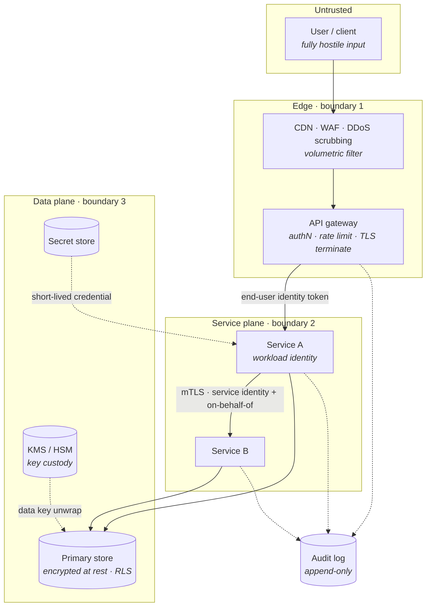
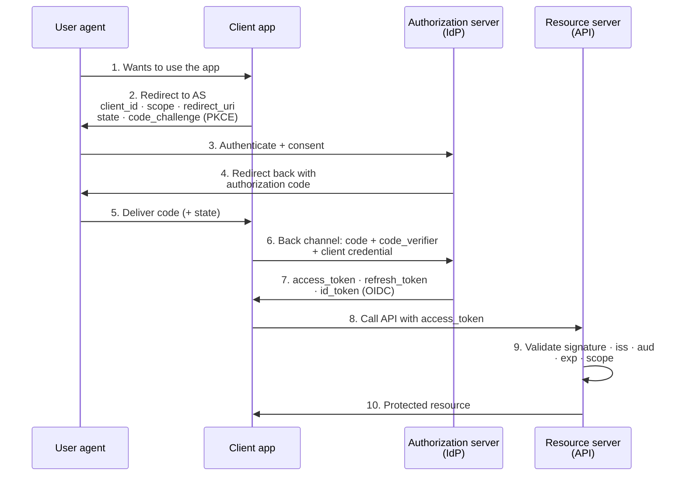
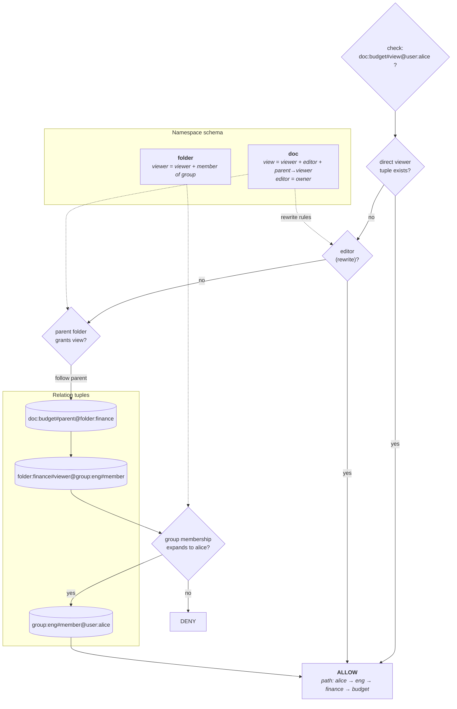
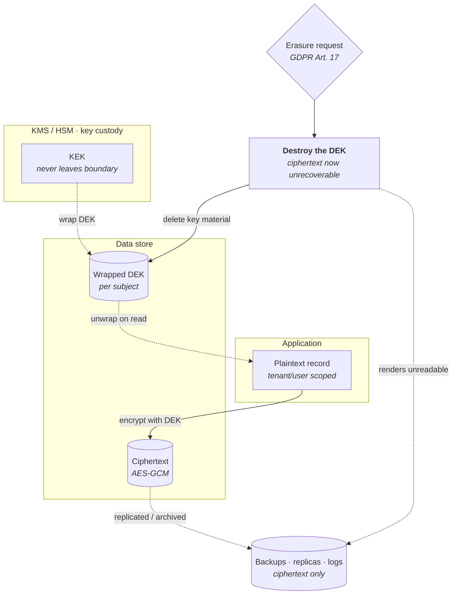
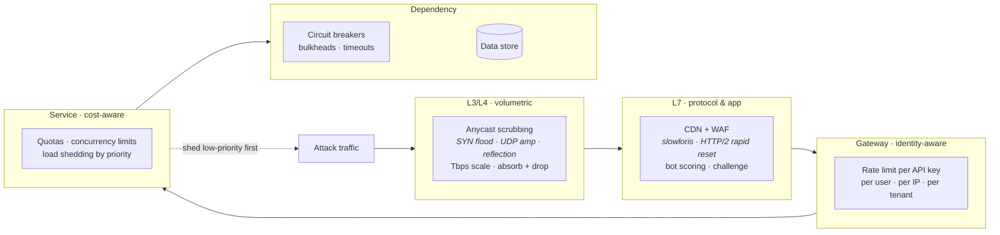

# Security and Privacy

This is the last of the concept lectures, and it is the one that cuts across all the others. Everything earlier — the API surface, the caching tier, the partitioning scheme, the async pipeline, the observability stack — was designed as though the only adversary were load. Security is the constraint layer that reopens each of those decisions and asks a different question: *who is allowed to do this, how do we know, and what happens when we are wrong?* A cache key that ignores tenant identity is a correctness bug at scale and a data breach at staff level. Those are the same bug.

At staff level, security is expected to appear **unprompted**. Nobody asks "and how would you secure it?" — if you leave it out, the signal is that you have never operated a system where the answer mattered. The bar is not that you enumerate OWASP categories; it is that you name trust boundaries as you draw them, state what identity crosses each one, and say out loud which of your components would be the blast radius. This lecture is the vocabulary for doing that in ninety seconds rather than as a separate agenda item.

## The frame: trust boundaries and blast radius

Security design is not a checklist appended to an architecture. It is a *second reading* of the same architecture diagram, in which every arrow is interrogated.

- **A trust boundary** — any edge where data or control crosses from one authority domain into another. Browser → edge. Edge → service. Service → service. Service → database. Anything → third-party API.
- **The rule:** at every trust boundary you must answer three questions — *who is calling* (authentication), *are they allowed* (authorization), and *is the payload safe to interpret* (validation). A boundary that answers fewer than three is a boundary you have not designed.
- **Defense in depth** — no single control is assumed to hold. The perimeter WAF, the service-level authorization check, and the database row-level policy are three independent controls guarding the same asset. You accept the redundancy because you expect one of them to be misconfigured.
- **Blast radius** — the honest question is not "can this be breached" but "when this component is compromised, what does the attacker reach?" A service holding a database credential with full table access has a blast radius of the whole table, regardless of how careful its own code is.
- **Least privilege** — every principal (user, service, job) holds the narrowest permission set that lets it function, for the shortest time it needs. This is the only control that *shrinks* blast radius rather than adding a gate in front of it.

**Reading the boundaries:**

- **Boundary 1 is about volume and shape** — is this traffic real, and is it well-formed? It is *not* where fine-grained authorization happens; the gateway does not know which invoice belongs to whom.
- **Boundary 2 is about identity propagation** — service B must know both *which service* called it and *on whose behalf*. Collapsing these two is how confused-deputy bugs are born ([§ Availability as a security property: DDoS and rate limiting](#availability-as-a-security-property-ddos-and-rate-limiting)).
- **Boundary 3 is about custody** — the store holds ciphertext, the KMS holds the ability to decrypt, and no single compromise yields both. See [§ Encryption: three states, and what each actually buys](#encryption-three-states-and-what-each-actually-buys).
- **The audit log is a dotted dependency from everywhere** ([§ Tenant isolation and IDOR-class bugs](#tenant-isolation-and-idor-class-bugs)) — like the transverse services in a DBMS, it is consulted at every layer rather than sitting at one.
- **The trap:** teams draw a hard perimeter and treat everything inside as trusted. Once an attacker gets a foothold on any internal host, a flat internal network means the blast radius is the entire estate. **Zero trust** is the discipline of authenticating and authorizing *every* internal hop as if it came from the internet.

## Authentication: sessions versus tokens

Authentication establishes *who is calling*. The architectural choice is not "how do we check the password" — it is **where the authoritative record of an active session lives**.

### Server-side sessions

- **Mechanism** — on login the server creates a session record in a shared store (Redis, a database table), and hands the client an opaque, high-entropy identifier in a cookie. Every request looks the session up.
- **The cookie carries no information.** It is a pointer. Tampering with it yields a nonexistent session, not an elevated one.
- **Revocation is trivial** — delete the row. The next request fails. Logout, password change, admin ban, and "sign out all devices" are all one `DELETE`.
- **The cost** — a lookup in shared state on every authenticated request. At high request rates that store becomes a hot dependency on the critical path of *everything*, and its availability becomes your login availability.
- **Cookie hygiene is the substance here:** `HttpOnly` (no JavaScript access, blunts XSS token theft), `Secure` (TLS only), `SameSite=Lax` or `Strict` (blunts CSRF), a narrow `Domain`, and rotation of the identifier on privilege change to defeat session fixation.

### Self-contained tokens (JWT)

- **Mechanism** — the server issues a signed document containing claims (`sub`, `iss`, `aud`, `exp`, `iat`, scopes, roles). Any service that holds the issuer's public key can verify it *locally* with no network call.
- **Why this is attractive at scale** — it removes the shared session store from the hot path entirely. A hundred services in five regions validate independently. This is the whole reason JWTs won in microservice estates.
- **What you actually bought** — you replaced a *lookup* with a *signature check*, and in doing so you replaced **current truth** with **truth as of issuance**.
- **Signing choices matter:** symmetric `HS256` means every verifier can also *mint* tokens — unacceptable across trust boundaries. Asymmetric `RS256`/`ES256` gives verifiers a public key only. Always pin the expected algorithm; never let the token's own `alg` header decide, and never accept `none`.
- **Always validate `iss` and `aud`.** A token minted for service A and replayed at service B is a valid signature and a completely different authorization decision.

### The revocation problem — the highest-value passage here

**A JWT cannot be un-issued.** This is not an implementation gap; it is the definition. The token is valid because it is signed and unexpired, and no party consulted at validation time knows anything else.

**What this breaks, concretely:**

- **User is fired at 10:00.** Their access token has a 60-minute lifetime. Until 11:00 they still hold a cryptographically valid credential for every service in the fleet.
- **Password reset after a phishing incident.** The attacker's stolen token keeps working for the remainder of its lifetime; resetting the password only stops *new* logins.
- **Permission downgrade.** A user demoted from admin to viewer keeps admin scopes embedded in their token until expiry. Roles are a snapshot, not a subscription.

**The mitigations, and what each actually costs:**

- **Short access-token lifetimes (5–15 minutes) plus a long-lived refresh token.** The access token is bearer-only and disposable; the refresh token is checked against a server-side store at every exchange. This is the standard answer: revocation is enforced at *refresh* time, so your exposure window is bounded by the access-token lifetime, not by policy.
- **A denylist of revoked token IDs (`jti`).** This works — and it reintroduces exactly the shared-state lookup you adopted JWTs to avoid. It is smaller (only revoked tokens, only until they expire) but it is on the hot path again.
- **A "not valid before" epoch per user.** Store one timestamp per user; reject any token issued before it. One small, highly cacheable record, and "sign out everywhere" becomes a single write. Cheaper than a denylist, coarser in effect.
- **Key rotation as a blunt instrument.** Rotating the signing key invalidates every outstanding token at once. Effective, indiscriminate, and it logs everyone out.

**Key distinction:** sessions are *revocable by default and stateful by necessity*; JWTs are *stateless by default and revocable only by adding state back*. Every real deployment sits somewhere in between. **In an interview**, saying "we use JWTs so it scales" without naming the revocation window is the single most common self-inflicted wound in this topic.

### Refresh tokens and rotation

- **Refresh tokens are the high-value credential** — long-lived, stored client-side, exchangeable for access tokens. Treat them like passwords, not like cache entries.
- **Refresh token rotation** — each refresh returns a *new* refresh token and invalidates the old one. Single use.
- **Reuse detection** — if an already-consumed refresh token is presented, that means two parties hold it, which means theft. The correct response is to revoke the entire token family for that session and force re-authentication. This is the one place where a stateless design *must* keep state, and it is worth it.
- **The failure mode:** refresh tokens stored in `localStorage` are readable by any injected script. An XSS bug becomes persistent account takeover rather than a session-length nuisance. Prefer `HttpOnly` cookies for browser clients, and secure OS storage on native.

## Delegated authorization: OAuth 2.0 and OIDC

**The problem OAuth solves is not login.** It is: *how does a third-party application act on a user's behalf against an API, without ever holding the user's password?* OIDC is a thin layer on top that adds "…and also tell me who the user is."

- **OAuth 2.0 = authorization.** It yields an **access token** — a capability to call an API with certain scopes.
- **OIDC = authentication.** It yields an **ID token** — a JWT asserting the user's identity to *your* application. Do not send ID tokens to APIs as credentials, and do not treat an access token as proof of identity; they answer different questions.
- **The four roles:** the *resource owner* (the user), the *client* (your app), the *authorization server* (the identity provider), and the *resource server* (the API being called).

**Why the flow has this exact shape:**

- **The code is exchanged on the back channel, not the front channel.** Steps 4–5 pass through the browser, where URLs leak into history, logs, and referrer headers. The code alone is useless — redeeming it in step 6 requires a client secret or a PKCE verifier that never touched the browser.
- **PKCE (`code_challenge`/`code_verifier`) exists because public clients cannot keep secrets.** A mobile app or SPA ships its binary to attackers. PKCE binds the code to the specific client instance that started the flow, so a stolen code cannot be redeemed elsewhere. It is now recommended for *all* clients, confidential ones included.
- **`state` is CSRF protection for the redirect**, and `nonce` binds the ID token to this specific authentication request. Omitting them turns the flow into an injection point for attacker-chosen sessions.
- **`redirect_uri` must be exact-matched against a registered allowlist.** Wildcard or prefix matching is the classic account-takeover bug — an open redirect on your domain becomes a token exfiltration channel.
- **Scopes are coarse, not fine.** `read:invoices` is a scope; "may read invoice 4471" is not. Scope constrains *what class of operation*; per-object authorization is still your job at the resource server ([§ Authorization models: RBAC, ABAC, ReBAC](#authorization-models-rbac-abac-rebac), [§ Availability as a security property: DDoS and rate limiting](#availability-as-a-security-property-ddos-and-rate-limiting)).
- **Step 9 is where teams cut corners.** Decoding a JWT is not validating it. Checking the signature but not `aud` accepts tokens minted for another service. Checking `exp` but not the issuer's current key set accepts tokens signed by a retired key.

**Flows worth knowing by name:** *authorization code + PKCE* (the answer for every user-facing client), *client credentials* (service-to-service, no user involved), and *device code* (input-constrained devices like TVs). **The implicit grant and resource-owner-password grant are deprecated** — the first leaks tokens through the browser URL, the second requires the client to handle the user's password, defeating the purpose.

## Authorization models: RBAC, ABAC, ReBAC

Authentication answers *who*. Authorization answers *may they*. The models differ in what the decision is a function of.

### The three models

- **RBAC — role-based.** Permissions attach to roles; users are granted roles. `decision = f(user's roles, action)`.
  - **Strength:** trivially auditable and easy to reason about. "Who can delete billing records?" is a query over role assignments.
  - **The failure mode: role explosion.** Real requirements are contextual — "support agents in the EU may refund orders under €500 during their shift." Encoding context into role *names* produces `support_eu_refund_small`, and thousands of near-duplicate roles nobody can prune.
- **ABAC — attribute-based.** Decisions are a function of attributes of the subject, the resource, the action, and the environment. `decision = f(user attrs, resource attrs, action, context)`.
  - **Strength:** expresses context natively — time of day, device posture, data classification, request IP, resource sensitivity.
  - **The cost:** you now need every attribute *available at decision time*. Fetching resource attributes to make the decision is itself a data access, and the policy language becomes a program you must test like one. Reasoning about "who can do what" becomes undecidable-in-practice; you can only evaluate, not enumerate.
- **ReBAC — relationship-based (Zanzibar-style).** Decisions are a function of *paths in a graph* of relationships between subjects and objects. `decision = ∃ path(user, relation, object)`.
  - **Strength:** this is the natural model for anything with sharing, nesting, or inheritance — documents in folders, repos in orgs, resources in projects. It handles "you can view this because you're a member of a group that owns the parent folder" without enumerating anything.
  - **The cost:** the check is a graph traversal, potentially deep, and it must be fast enough to run on every request.

### The Zanzibar relation-tuple check

Google's Zanzibar (and its descendants — SpiceDB, OpenFGA, Ory Keto, AuthZed) models authorization as a set of **relation tuples** of the form `object#relation@subject`, plus a **namespace schema** saying how relations compose.

**What the diagram is showing:**

- **A check is a search, not a lookup.** There is no stored fact "alice can view budget." The answer is derived by expanding rewrite rules and following tuples until a path is found or the search is exhausted.
- **Userset rewrites are the expressive core** — `view = viewer + editor + parent→viewer` says viewing is granted directly, implied by editing, or inherited through the parent relation. Inheritance is declared once in the schema rather than materialized per object.
- **Subjects can be usersets, not just users** — `@group:eng#member` is a set-valued subject. This is what makes group membership changes O(1) instead of a fan-out rewrite over every document the group can reach.
- **Latency is the design constraint.** Zanzibar targets single-digit-millisecond p50 and tens of milliseconds at p99 for checks running on *every* request, which forces aggressive caching, leopard-style denormalized set indexes for deep hierarchies, and request hedging.
- **The consistency problem is real and specific:** if you remove someone from a group and they immediately load a stale cached check, they see data they no longer may. Zanzibar's answer is **zookies** — opaque consistency tokens returned with content, passed back into checks, guaranteeing the check is evaluated against a snapshot no older than the content the user is looking at. This is the "new enemy problem," and it is the reason a naive cache in front of an authorization service is unsafe.
- **The trap:** ReBAC is a distributed system with its own availability, latency, and consistency budget, sitting on the critical path of every request. Adopting it for an application with three roles is architecture theater. Adopt it when the *sharing graph* is the product.

### Policy evaluation: placement and caching

Authorization has a standard vocabulary: the **PDP** (policy decision point) evaluates, the **PEP** (policy enforcement point) enforces, the **PIP** (policy information point) supplies attributes. The design question is where each lives.

**The placement options, and the honest trade:**

| Placement | Latency | Freshness | Consistency across services | Failure mode |
|---|---|---|---|---|
| In application code | none | perfect | none — every service reimplements | drift; one service forgets a check |
| Embedded library / sidecar (OPA, Cedar) | sub-ms local | policy bundle lag (seconds) | good — one policy artifact | stale bundle silently allows or denies |
| **Central authorization service** | **network hop (1–10 ms)** | **authoritative** | **strong — one decision path** | **hot dependency; must be fault-tolerant** |
| At the data layer (RLS, views) | none extra | perfect | strong for that store | invisible to app; hard to test; bypassed by any other connection |

- **Separate the policy from the code, wherever it runs.** The reason is not elegance — it is that policy written as scattered `if` statements cannot be audited, versioned, tested in isolation, or answered against ("who can access this?").
- **Push the PDP as close as possible; keep the policy source central.** The common pattern is a central control plane that compiles and distributes policy bundles, with local evaluation in a sidecar. You get local latency and single-source-of-truth policy, at the cost of a propagation window you must state explicitly.
- **Caching decisions is where correctness dies.** Cache keys must include the full decision input — subject, object, action, *and* the policy/graph version. A cached `ALLOW` that outlives a revocation is a security incident that looks exactly like a cache hit.
- **Rule of thumb:** cache *negative* results longer than positive ones, and always allow revocation to invalidate eagerly. A stale `DENY` is a support ticket; a stale `ALLOW` is a breach.
- **Fail closed on the decision path.** If the PDP is unreachable, deny. Failing open turns an authorization outage into an authorization bypass — and outages happen far more often than attacks.
- **Never enforce only at the edge.** The gateway can check "is this a valid token with `read:invoices`"; only the service that knows what invoice 4471 *is* can check ownership. Edge-only enforcement is [§ Availability as a security property: DDoS and rate limiting](#availability-as-a-security-property-ddos-and-rate-limiting)'s bug in a different costume.

## Service-to-service identity

Inside the mesh, requests are not from users. They are from workloads, and workloads are ephemeral — they scale, restart, and move hosts. **Network location is not identity.** An IP address or a security group is an artifact of scheduling, not an assertion about what code is running.

- **mTLS — mutual TLS.** Both sides present certificates; both verify. The client proves it is `service-a` to the server, and the server proves it is `service-b` to the client. This gives you authenticated, encrypted, integrity-protected channels *and* a cryptographic caller identity to authorize against.
- **The operational problem mTLS creates is certificate lifecycle** — issuance, distribution, rotation, and revocation across thousands of pods. Doing this by hand with long-lived certs recreates the secret-sprawl problem it was meant to solve. This is precisely why service meshes (Istio, Linkerd) exist: they automate issuance and rotate certs on the order of hours, with the proxy handling the handshake transparently.
- **SPIFFE / SPIRE** — a standard for workload identity. Each workload gets a **SPIFFE ID**, a URI like `spiffe://prod.example.com/ns/payments/sa/charge-api`, delivered as a short-lived X.509 certificate (an SVID) or a JWT-SVID.
  - **Attestation is the interesting part.** The agent proves *what* a workload is by asking the platform — the kubelet, the cloud instance metadata service, the process's cgroup — rather than by checking a secret the workload holds. Identity is derived from platform-verifiable facts, so there is no bootstrap secret to steal.
  - This solves the **secret zero problem**: how does a fresh workload authenticate the very first time, before it has any credentials? Answer: it does not have to hold one; the platform vouches for it.
- **Cloud workload identity** — the managed version of the same idea. An instance or pod is bound to an IAM role; the SDK fetches short-lived credentials from a metadata endpoint. No static keys anywhere.
- **The failure mode:** the metadata endpoint is reachable from the workload, so an SSRF bug in that workload can read its credentials ([§ Residency, sovereignty, and regional boundaries](#residency-sovereignty-and-regional-boundaries)). IMDSv2-style session-token requirements and blocking the metadata IP at the egress proxy exist specifically to close this.
- **mTLS authenticates the channel, not the intent.** You still need authorization: *which* service may call *which* endpoint, and on whose behalf. Propagate end-user identity as a separate, signed token alongside the service identity — never let service A's privilege silently become the user's privilege.

## Secrets management and rotation

A secret is any credential that grants access: database passwords, API keys, signing keys, TLS private keys, encryption keys.

**The progression, worst to best:**

- **In source control** — permanently compromised the moment the repo is cloned, forked, or its history is scraped. Git history means "deleting" it does nothing.
- **In environment variables or config files** — better, but visible in process listings, crash dumps, `/proc`, container inspect output, and any log line that dumps the environment.
- **In a secret manager** (Vault, AWS Secrets Manager, GCP Secret Manager, Kubernetes Secrets with a KMS-backed provider) — fetched at runtime, access-controlled per workload, and audited on every read.
- **Dynamic, short-lived credentials** — the manager *generates* a credential on demand with a lease (a database user valid for one hour), and revokes it at expiry. **This is the strongest form**, because it converts "a leaked secret is a permanent problem" into "a leaked secret is an hour-long problem."

**Rotation, and why it is a design constraint rather than a chore:**

- **Rotation must be non-disruptive**, which means every secret needs a window during which *both* the old and new value are valid. If your system cannot accept two valid values simultaneously, rotation requires downtime — and so it will not happen.
- **The two-key pattern** — for signing, publish a JWKS with both keys, sign with the new one, verify with either, retire the old after the maximum token lifetime has elapsed. For databases, maintain two credentials and alternate.
- **Rotation frequency should be a function of blast radius and detectability**, not of a calendar. A key that can decrypt customer data rotates aggressively; an internal metrics token can rotate rarely.
- **Rotation is also the incident response tool.** If you cannot rotate a credential quickly under pressure, your response to any suspected compromise is "hope." Practice rotation before you need it.
- **The failure mode:** secrets that are fetched once at process start and cached forever. Rotation happens, the old credential is retired, and long-lived processes fail hours later in a way that looks like a database outage. Refresh leases, and handle mid-flight credential expiry as an expected error, not an exception.

## Encryption: three states, and what each actually buys

Data exists in three states, and encryption in each defends against a *different* adversary. Conflating them produces expensive controls aimed at the wrong threat.

- **In transit** — TLS 1.3 on every hop, including internal ones ([§ Service-to-service identity](#service-to-service-identity)). Defends against a network observer or an on-path attacker. Cheap, mature, non-negotiable. Note *where* TLS terminates: if it ends at the load balancer, the hop from LB to service is plaintext unless you re-encrypt.
- **At rest** — disk-, volume-, or field-level encryption. **Be honest about what full-disk encryption defends against: physical media theft and improper decommissioning.** It does *nothing* against a compromised application, a leaked credential, or SQL injection, because the application reads through the decryption layer like everyone else. It is a compliance requirement and a real control against a narrow threat — say both.
- **Application-level / field-level encryption** — the application encrypts specific fields before they reach the store. Now the database compromise alone yields ciphertext. **The cost is functionality:** you lose indexing, range queries, sorting, and `LIKE` on those fields, and you take on key management. Deterministic encryption restores equality lookups at the price of leaking equality patterns; order-preserving encryption restores range queries and leaks a great deal more.
- **In use** — the newest and least mature category. Confidential computing (SGX, SEV-SNP, TDX) runs computation inside a hardware-attested enclave so the host operator cannot read memory. Homomorphic encryption computes on ciphertext directly but remains orders of magnitude too slow for general workloads. **Name it, scope it, and be skeptical:** the realistic use cases today are multi-party computation and regulated workloads on untrusted infrastructure, not general application data.

**Rule of thumb:** in transit is table stakes, at rest is compliance plus physical-theft defense, field-level is the only one that meaningfully defends against your own compromised application — and it is the only one that costs you query capability.

## Key management, envelope encryption, and crypto-shredding

Encryption is easy; key management is the actual system. The design goal is that no single compromise yields both ciphertext and the ability to decrypt it.

- **The KMS/HSM holds root keys** and never releases them. You send it material to wrap or unwrap; keys do not leave the boundary. Every operation is authorized and audited.
- **Envelope encryption** — encrypt data with a per-object or per-tenant **data encryption key (DEK)**; encrypt the DEK with a **key encryption key (KEK)** held in the KMS; store the wrapped DEK next to the ciphertext.
  - **Why this shape:** bulk data never passes through the KMS (which would be a throughput and latency disaster), and rotating the KEK means re-wrapping small DEKs rather than re-encrypting petabytes.
  - **Rotation becomes cheap.** Re-encrypting the data itself is only necessary when a *DEK* is compromised.

**Crypto-shredding — why this is the highest-value idea in the section:**

- **The problem it solves:** GDPR Article 17 gives a user the right to erasure. Your data is in a primary store, three read replicas, a search index, a warehouse, six weeks of immutable backups, a Kafka topic with a 30-day retention, and a partner's system. **You cannot issue a `DELETE` against an immutable backup**, and restoring, deleting, and re-taking every backup is not an operation you can perform per user per request.
- **The mechanism:** encrypt each user's data under a **per-user DEK**. To erase the user, destroy that one key. Every copy of the ciphertext everywhere — backups, replicas, archives, logs — becomes permanently unreadable in a single operation.
- **What it costs:** per-subject key granularity means many keys and a key-to-subject mapping that itself becomes critical infrastructure. Cross-user queries and analytics get harder because you cannot bulk-decrypt without touching every key. Joins across users on encrypted fields effectively stop working.
- **The caveat you must state:** regulators generally accept crypto-shredding, but it is *erasure by inaccessibility*, not by overwriting. If the algorithm is later broken, or if a copy of the DEK survives in a backup of the key store, the data returns. **Your key store's backup and retention policy is therefore part of your erasure guarantee** — and it is the part teams forget.
- **The failure mode:** shredding the DEK while a decrypted copy of the data sits in a cache, a search index, or a derived analytics table. Crypto-shredding only covers what was encrypted under that key. Derived data must be either encrypted under the same key or deleted conventionally.

## PII classification, tokenization, and minimization

You cannot protect data you have not classified, and the cheapest data to protect is data you never collected.

- **Data classification** — every field carries a sensitivity label: public, internal, confidential, restricted/regulated (PII, PHI, PCI). The label is what drives everything downstream — encryption requirement, retention period, who may query it, whether it may leave a region, whether it may appear in a log.
  - **Make it machine-readable and enforced in the schema**, not a spreadsheet. Annotations on the data model let you generate access policy, redact logs automatically, and fail CI when a restricted field is added to an unencrypted table. A classification nobody can enforce is documentation.
- **Data minimization** — collect only what a stated purpose requires, keep it only as long as that purpose lives. This is both a GDPR principle (purpose limitation, storage limitation) and the single most effective security control available, because it shrinks the asset rather than adding a guard.
  - **Retention policies are a security control.** Data deleted on schedule cannot be breached. The default of "keep everything forever, storage is cheap" is a liability position, not an engineering one.
- **Tokenization** — replace a sensitive value with a meaningless surrogate; the real value lives only in a hardened token vault.
  - **The point is scope reduction.** In PCI-DSS, systems that never touch a real primary account number fall largely out of audit scope. Tokenizing at the edge means your hundred services handle tokens and only the vault handles card numbers.
  - **Format-preserving tokens** keep the shape (`4111-XXXX-XXXX-1234`) so downstream systems and validators keep working unmodified.
  - **Tokenization versus encryption:** encryption is reversible with a key and preserves a mathematical relationship to the plaintext; a random token has *no* relationship to the original — the only way back is the vault lookup. That makes the vault a hard dependency and a very attractive target, which is exactly why it should be small.
- **Pseudonymization versus anonymization** — replacing a name with a stable identifier is *pseudonymization*, and pseudonymized data is still personal data under GDPR. True anonymization must resist re-identification through linkage, which is far harder than it looks: a handful of quasi-identifiers (postcode, birth date, sex) uniquely identifies most of a population. **Do not claim a dataset is anonymous because you dropped the name column.**
- **The failure mode nobody plans for: PII in logs.** Structured logs, error messages with request bodies, stack traces with parameter values, and analytics events are the most common uncontrolled PII store in any system — replicated to a log aggregator, retained for a year, and readable by everyone with a dashboard. Redact at the emission point, because you will never clean it up downstream.

## Residency, sovereignty, and regional boundaries

- **Data residency** — a requirement that data be *stored* in a given jurisdiction. The weakest form, and the easiest to satisfy: pin the storage region.
- **Data sovereignty** — the data is subject to the laws of the jurisdiction it sits in. This is a legal fact, not a configuration, and it is why "stored in the EU by a US-owned provider" is a contested position under regimes that permit extraterritorial government access.
- **Cross-border transfer rules** — GDPR restricts transfers outside the EEA absent an adequacy decision or safeguards like Standard Contractual Clauses. **Note that "transfer" includes access:** an engineer in another region viewing EU data on a dashboard is a transfer. Your support tooling and observability stack are in scope.
- **The architectural consequence is severe, and it is the part worth saying in an interview:** residency forces a **cellular architecture** — full stacks per region, not one global system with regional storage.
  - The user directory must be global (to route a login) while user data must be regional. So you keep a globally replicated, minimal routing record — user ID and home region only — and everything else stays in-cell.
  - **Cross-region joins become impossible**, so analytics must be per-region with only aggregates federated.
  - **Global secondary indexes and global caches leak data across the boundary** if you are not careful. A cache key containing an EU user's email, resident in a US cache node, is a transfer.
  - **Disaster recovery must stay in-region**, which means you cannot fail an EU cell over to a US cell. Regional redundancy has to exist *within* the boundary.
- **Rule of thumb:** residency multiplies your operational surface by the number of regions, and it must be designed in from the start. Retrofitting regional isolation onto a global database is one of the most expensive migrations there is.

## Application and platform threats

You are not expected to be a penetration tester. You are expected to know the categories, the architectural control for each, and why the naive fix fails.

### Injection

- **The mechanism** — untrusted input is concatenated into a string that is then interpreted by another system: SQL, shell, LDAP, template engines, NoSQL query documents.
- **The architectural control is parameterization** — the query structure and the data travel through separate channels, so data can never be reinterpreted as structure. Prepared statements, parameterized ORMs, `execve`-style argument arrays rather than shell strings.
- **Why input sanitization is the wrong primary control:** it requires you to correctly anticipate every encoding and every interpreter downstream. Parameterization is *structurally* safe; escaping is a guess that must be right every time.
- **Defense in depth at the data layer** — the application's database role should not own the schema, should not have `DROP`, and should be scoped to the tables it uses. This is blast-radius work.

### SSRF — server-side request forgery

- **The mechanism** — the application fetches a URL supplied or influenced by a user. The request originates *inside* your network, so it bypasses the perimeter entirely.
- **Why it is disproportionately dangerous in cloud environments** — the target is usually the instance metadata endpoint (`169.254.169.254`), which hands out the workload's IAM credentials to anything that asks. One image-resize feature becomes cloud account compromise. This is the Capital One breach shape (2019, ~100M records).
- **The controls, in order of strength:** an **egress proxy allowlist** (services may only reach named destinations, so an arbitrary URL fetch has nowhere to go); network-level blocking of link-local and RFC1918 ranges from application subnets; IMDSv2-style session tokens that defeat simple request forgery; and DNS-rebinding-aware validation that resolves *and pins* the address rather than validating the hostname and resolving again later.
- **The trap:** allowlist validation done on the URL string, then a separate resolution at fetch time. Redirects and DNS rebinding both defeat this. Validate the *resolved address at connect time*, and refuse to follow redirects across that boundary.

### Insecure deserialization

- **The mechanism** — deserializing attacker-controlled bytes into language-native objects invokes constructors, setters, and magic methods during reconstruction. With the right gadget chain in the classpath, that is arbitrary code execution *before* your code sees the object.
- **The control is format choice, not validation.** Use data-only formats — JSON, Protobuf, Avro — parsed into declared schemas. Never accept native serialization formats (Java serialization, Python `pickle`, PHP `unserialize`, .NET `BinaryFormatter`) across a trust boundary. There is no safe way to validate these first; the damage happens during parsing.
- **Sign internal payloads** where native formats are unavoidable — a cache or queue payload that only your own services can have produced, verified before deserialization.

### Supply chain

- **The mechanism** — you did not write most of your code. A compromised dependency, a typosquatted package, a malicious maintainer handoff, or a compromised build server ships attacker code into production with your signature on it. SolarWinds, `event-stream`, `xz`/`liblzma` (2024), and the Codecov bash uploader are the canonical cases.
- **Dependency confusion** deserves its own mention: if your build resolves an internal package name against a public registry, an attacker who registers that name publicly with a higher version wins the resolution. **Scope internal packages and pin the registry explicitly.**
- **The controls:** lockfiles with integrity hashes so builds are reproducible; an **SBOM** so you can answer "are we affected?" within minutes of a disclosure rather than days; artifact signing and verification (Sigstore, in-toto) so you know the binary came from your pipeline; hermetic, reproducible builds; and reviewing the CI system as a production system, because it holds credentials to everything and is usually the softest target in the estate.
- **The honest limitation:** you cannot audit thousands of transitive dependencies. The realistic goals are *reducing the count*, *knowing what you have*, and *shortening time-to-patch*. Treat time-to-patch as an SLO.

## Availability as a security property: DDoS and rate limiting

Denial of service is a security failure, and rate limiting is a security control that also happens to protect capacity. Mitigation is layered because attacks arrive at different layers.

**How to read the layering:**

- **Each layer handles what the one below cannot.** Volumetric floods must be absorbed by capacity you do not own — anycast scrubbing networks measured in Tbps. No origin can filter a 2 Tbps flood, because the pipe is full before your code runs.
- **Application-layer attacks are cheap for the attacker and expensive for you.** A single well-chosen request that triggers an unindexed query or an expensive report is worth a million SYN packets. **This is why rate limiting by request count is insufficient** — limit by *cost*, using weighted tokens, concurrency caps, or query budgets.
- **Rate limiting is identity-aware, and the identity you choose is the whole design.** Per-IP is defeated by botnets and punishes NAT'd corporate users. Per-user requires authentication, so it cannot protect the login endpoint itself. Per-API-key works for machine clients. **Per-tenant is the one that matters in multi-tenant systems** — it is the noisy-neighbor control, and it doubles as the containment for a compromised tenant.
- **Distributed rate limiting has a consistency cost.** Exact global counting requires a shared store on the hot path. Most systems accept approximate limits — local token buckets with periodic reconciliation — trading a small overshoot for latency. Say this trade out loud rather than assuming exactness.
- **Fail open or fail closed?** Unlike authorization, rate limiting usually **fails open**: if the limiter is down, serving traffic unlimited is better than serving none. Note this asymmetry — it is a good signal that you understand controls are not uniformly "deny on error."
- **Load shedding by priority is the last line.** When saturated, drop low-value traffic (batch, unauthenticated, low-tier) to preserve high-value traffic. Uniform degradation is worse than deliberate degradation.

## Tenant isolation and IDOR-class bugs

This is the single most common serious vulnerability class in multi-tenant SaaS, and the one most likely to be self-inflicted by an otherwise well-designed system.

- **IDOR — insecure direct object reference.** The endpoint authenticates the caller, then serves the object identified in the request *without checking the caller is entitled to that specific object*. `GET /api/invoices/4471` returns invoice 4471 to anyone with a valid session.
- **The root cause is a category error:** authentication was performed, authorization was assumed. The gateway checked the token; nobody checked ownership. This is exactly the "never enforce only at the edge" point from [§ Policy evaluation: placement and caching](#policy-evaluation-placement-and-caching), and it is why coarse scopes are not authorization.
- **The failure is silent.** There is no error, no exception, no alert. The system behaves exactly as designed. It surfaces only when someone increments an ID in a URL — which is why these bugs live in production for years.

**Where isolation breaks in practice — the checklist worth memorizing:**

- **Unscoped queries.** `SELECT * FROM invoices WHERE id = ?` instead of `WHERE id = ? AND tenant_id = ?`. One forgotten predicate in one of five hundred queries.
- **Cache keys without tenant identity.** `user:profile:42` collides across tenants; the second tenant is served the first tenant's data by the cache, and no application code was even involved.
- **Search indexes and analytics stores.** The primary database has row-level security; the Elasticsearch mirror and the warehouse do not. Isolation is only as strong as its *weakest* replica.
- **Background jobs and admin tooling.** Async workers and internal tools typically run with elevated, tenant-agnostic credentials because it is convenient. A job that takes a tenant ID as a parameter and does not validate it is an IDOR with no user-facing endpoint.
- **File storage paths and signed URLs.** Predictable object keys, over-broad bucket policies, or signed URLs with excessive scope or lifetime leak across tenants outside the application entirely.
- **Error messages and timing.** Returning `403 Forbidden` for an existing object and `404 Not Found` for a nonexistent one confirms existence. Return `404` for both when existence itself is sensitive.

**What to do instead — structural controls, not vigilance:**

- **Make tenant scoping impossible to omit.** Put the tenant ID in an ambient request context and enforce it in the data access layer, so an unscoped query is a *compile-time or runtime error*, not a silently-broad result set. Vigilance does not scale to five hundred queries and forty engineers.
- **Enforce at the database with row-level security**, using a session variable set from the authenticated context. This is a second, independent control that holds even when application code forgets — the defense-in-depth principle from [§ The frame: trust boundaries and blast radius](#the-frame-trust-boundaries-and-blast-radius) paying off.
- **Use unguessable identifiers (UUIDs) — but understand this is hardening, not authorization.** It raises the cost of discovery; it does not make the missing check appear. Treating opaque IDs as a control is security by obscurity.
- **Pick an isolation model deliberately.** Shared database with a `tenant_id` column is cheapest and leakiest; schema-per-tenant is a middle ground; database- or cell-per-tenant gives the strongest isolation and the highest operational cost. **The right answer is driven by the blast radius you can accept for your largest customer**, not by engineering aesthetics.
- **Test it automatically.** Every endpoint gets a test where tenant A requests tenant B's object and must receive a denial. This is the only control that catches the *next* forgotten predicate.

## Auditability

Auditing is not logging. Logs serve debugging; audit records serve accountability, and they carry different requirements for completeness, integrity, and retention.

- **What an audit record must contain** — *who* (authenticated principal, including the real actor behind any impersonation), *what* (action and affected resource), *when* (trusted timestamp), *where* (source address, session, client), *outcome* (allowed or denied — **denials are the security-relevant ones**), and *why* (the policy or role that produced the decision).
- **Both allows and denies matter.** A burst of denials is the clearest available signal of an attack in progress; a system that only logs successes is blind to reconnaissance.
- **Generate audit records at the enforcement point**, not in application code that can be bypassed. If the PDP logs the decision, no code path can skip the record.

**Tamper evidence — the design question is what an attacker with write access can undo:**

- **Append-only storage.** Write to a store the application role cannot delete or modify — S3 with Object Lock, a WORM volume, or a separate account whose credentials the application does not hold. **Separation of duties is the actual control:** the identity that can modify data must not be the identity that can modify the record of the modification.
- **Hash chaining.** Each record includes the hash of its predecessor, so altering any record invalidates every subsequent hash. This makes tampering *detectable* — it does not prevent it.
- **External anchoring.** Periodically publish the chain head somewhere outside your control (a notary, a transparency log, a counterparty). This defeats the attacker who can rewrite the whole chain, since they cannot rewrite the published anchors. Certificate Transparency and AWS QLDB are the reference designs.
- **Signed records.** Signing at generation time with a key the log store cannot access proves origin as well as integrity.
- **Be honest about the limit:** a sufficiently privileged attacker who is present *before* records are written can suppress them. Tamper evidence bounds what can be quietly rewritten after the fact; it does not make logging unforgeable.

**Retention, and the tension nobody resolves cleanly:**

- **Compliance sets a floor** — SOC 2 typically expects a year, PCI-DSS requires a year with 90 days immediately available, HIPAA runs to six years for certain records.
- **Privacy law sets a ceiling** — GDPR storage limitation says do not keep personal data longer than the purpose requires, and audit logs are full of personal data (IPs, user IDs, actions).
- **The resolution:** minimize personal data in audit records, tier storage (hot → warm → cold/archive) so long retention is affordable, define per-record-class retention rather than one global policy, and document the lawful basis for keeping security logs — which is generally legitimate interest, and generally survives an erasure request. **Say explicitly that an erasure request does not automatically wipe your security audit trail**; that nuance is a strong signal.

## Compliance as a design constraint, and how it goes wrong

Compliance regimes are not security, but they are *requirements*, and at staff level you are expected to translate a regime into an architectural constraint rather than treat it as paperwork.

| Regime | What it governs | The constraint it actually imposes |
|---|---|---|
| **SOC 2** | Controls over security, availability, confidentiality | Evidence of *operating* controls over time — access reviews, change management, monitoring. Drives tooling and process, not architecture. |
| **PCI-DSS** | Cardholder data | Network segmentation and **scope reduction**. Every system touching a PAN is in audit scope — hence tokenization at the edge ([§ PII classification, tokenization, and minimization](#pii-classification-tokenization-and-minimization)). |
| **HIPAA** | Protected health information (US) | Access controls, audit trails, encryption, BAAs with every vendor touching PHI. Constrains your *vendor* choices as much as your code. |
| **GDPR** | Personal data of EU subjects | The hard one: **erasure, portability, purpose limitation, consent, and transfer restrictions** — all of which are architecture, not policy. |
| **PCI + GDPR together** | — | Retention conflict: PCI mandates a year of logs, GDPR mandates minimization. Resolved per-field, not per-system. |

**Why GDPR is the one that reshapes systems:**

- **Right to erasure** forces you to be able to find and destroy one user's data across every store, replica, index, backup, and downstream consumer. This is the requirement that makes crypto-shredding ([§ Key management, envelope encryption, and crypto-shredding](#key-management-envelope-encryption-and-crypto-shredding)) architectural rather than clever.
- **Right to access and portability** forces a machine-readable inventory of everything you hold about a subject — which is impossible without the classification work in [§ PII classification, tokenization, and minimization](#pii-classification-tokenization-and-minimization).
- **Purpose limitation** means data collected for one purpose cannot be silently reused for another. That is a constraint on your *data pipelines*, not just your storage.
- **Breach notification within 72 hours** means your detection and forensics must be good enough to determine scope in days. That is an observability requirement (§ the previous lecture) driven entirely by a legal deadline.
- **Privacy by design and by default** — the regulation explicitly asks for minimization and protection to be built in rather than bolted on. This is the legal restatement of the entire lecture.

**The failure modes:**

- **Compliance theater** — passing an audit while the actual controls are ineffective. Encrypted at rest with the key stored beside the data satisfies a checkbox and defends against nothing.
- **Scope sprawl** — letting regulated data spread until every system is in scope. Then every deploy needs an audit, every engineer needs clearance, and velocity dies. **Scope reduction is a velocity investment**, and that framing is how you sell it.
- **Treating compliance as the goal.** A compliant system can still be breached, and a secure system can still fail an audit. They overlap; they are not the same objective.

## Grounding: what has actually gone wrong

Named incidents are the fastest way to make these categories concrete, and they carry more weight in an interview than any framework.

- **Capital One (2019, ~100M records).** SSRF against a misconfigured WAF, used to reach the EC2 instance metadata endpoint, retrieve IAM credentials, and list and read S3 buckets. Three [§ SSRF — server-side request forgery](#ssrf--server-side-request-forgery) controls would each have broken the chain: least-privilege role scoping, egress restriction, and IMDSv2. The lesson is chaining — no single control failed catastrophically; four weak ones composed.
- **Equifax (2017, ~147M records).** A known Apache Struts deserialization vulnerability, patch available for two months, unapplied because asset inventory was incomplete. **Time-to-patch is a security metric**, and you cannot patch what you have not inventoried ([§ Supply chain](#supply-chain)).
- **SolarWinds (2020).** The build system was compromised, so signed, legitimate updates carried a backdoor to ~18,000 organizations. Signing proved the artifact came from the vendor's pipeline; the pipeline was the breach. **Treat CI as production.**
- **`xz`/`liblzma` (2024).** A multi-year social-engineering campaign earned maintainer trust in a compression library to plant an SSH backdoor, caught by an engineer investigating a ~500 ms login latency regression. Supply chain risk includes the *humans*, and it was performance observability that caught it.
- **Log4Shell (2021).** A logging library evaluated JNDI lookups in logged strings, turning "log the user agent" into remote code execution across essentially the entire Java ecosystem. Organizations with an SBOM answered "are we affected?" in hours; those without took weeks.
- **Optus (2022, ~9.8M records).** An unauthenticated public API endpoint exposing customer records with enumerable identifiers — IDOR at its purest ([§ Tenant isolation and IDOR-class bugs](#tenant-isolation-and-idor-class-bugs)), no exploit required beyond incrementing a number.
- **Numbers worth carrying:** industry breach studies consistently put mean time to identify a breach at roughly 200 days and containment at another 70; credential compromise and phishing are the leading initial vectors; and the majority of cloud incidents trace to customer misconfiguration rather than provider compromise. **The implication:** detection and blast-radius reduction pay off more than perimeter hardening, because you should assume you will find out late.
- **Named failure modes to keep in vocabulary:** the *confused deputy* (a privileged service performing an action on behalf of a less-privileged caller without checking — [§ Service-to-service identity](#service-to-service-identity)), the *new enemy problem* (stale authorization caches serving access that was just revoked — [§ The Zanzibar relation-tuple check](#the-zanzibar-relation-tuple-check)), *secret zero* (bootstrapping the first credential — [§ Service-to-service identity](#service-to-service-identity)), and *dependency confusion* (internal names resolving publicly — [§ Supply chain](#supply-chain)).

## Takeaways

- **Security is a second reading of your architecture, not a section of it.** Every arrow you drew is a trust boundary that owes three answers: who is calling, may they, and is this payload safe to interpret.
- **JWTs trade revocation for statelessness, and you must name the window.** Short access tokens plus server-checked rotating refresh tokens is the standard answer; anything else means holding state you claimed to have eliminated.
- **Coarse scopes are not authorization.** The gateway can check that a token permits reading invoices; only the service that knows what invoice 4471 is can check ownership. Every IDOR bug lives in that gap.
- **ReBAC is the right model when the sharing graph is the product** — and it brings its own latency, caching, and consistency problem, with stale `ALLOW` decisions as the failure mode that matters. A stale deny is a ticket; a stale allow is a breach.
- **Identity must come from the platform, not the network.** IP addresses and security groups are scheduling artifacts; SPIFFE-style attestation and short-lived workload credentials are what make "secret zero" disappear.
- **Envelope encryption plus per-subject keys turns an impossible erasure problem into a single key deletion** — and makes your key store's backup policy part of your GDPR guarantee.
- **Least privilege and data minimization are the only controls that shrink the asset.** Everything else adds a gate in front of an asset that keeps growing; retention policy is a security control.
- **Assume you find out late.** Roughly 200 days to detection means blast-radius reduction, tamper-evident audit trails, and fast credential rotation matter more than perimeter hardening.
- **Fail closed on authorization, fail open on rate limiting.** Knowing which controls invert under failure is the difference between reciting controls and having operated them.

**Next:** the component deep dives begin — PostgreSQL, from process model to replication.
