# PostgreSQL Deep Dive

The concept lectures are done. The next three open specific engines and look at what the concepts actually cost in a real implementation. PostgreSQL comes first because it is the default answer: unless you have a reason, the relational store in your design is Postgres, and an interviewer will accept that without argument.

The interview value is therefore not in praising it. Everyone can say "ACID, MVCC, rich indexing." The value is in knowing *precisely where it breaks and why* — the connection ceiling, the vacuum debt cycle, the wraparound cliff, the replication slot that fills a disk at 3 a.m. Those are the answers that separate a staff-level candidate from a competent one, because they are the answers you only get from having operated the thing.

## Process and memory architecture

Postgres is **process-per-connection**. Every architectural consequence in this section follows from that one decision, made in the 1980s and never reversed.

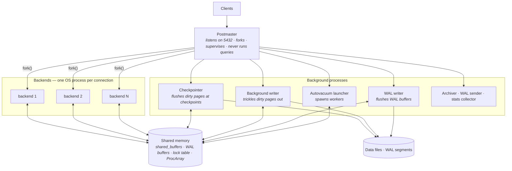

- **Postmaster** — accepts the TCP connection, authenticates, `fork()`s a backend, and supervises. It executes no SQL. If any backend segfaults, the postmaster **restarts the entire cluster**, because a crashed process may have left shared memory inconsistent. One bad backend is a full-cluster blip.
- **Backends** — a backend owns one session for its entire lifetime: parse, plan, execute, transaction state, temp tables, prepared statements, catalog caches.
- **Checkpointer** — writes all dirty buffers at checkpoint time so WAL before that point can be recycled. [§ Table-level locks and DDL](#table-level-locks-and-ddl).
- **Background writer** — continuously trickles out dirty pages so backends rarely have to write a page themselves to find a free buffer. When it falls behind, `pg_stat_bgwriter.buffers_backend` rises and query latency gets a write on its critical path.
- **WAL writer** — flushes WAL buffers asynchronously so that commits usually find their WAL already on disk.
- **Autovacuum launcher** — spawns up to `autovacuum_max_workers` (default **3**) workers. [§ MVCC, bloat, vacuum, and wraparound](#mvcc-bloat-vacuum-and-wraparound).

### Why process-per-connection sets a hard ceiling

**The per-connection cost, concretely:**

- **An OS process** — page tables, kernel structures, a `fork()` at connect time. Connecting is milliseconds, not microseconds.
- **Backend-local memory** — typically **5–15 MB resident** per idle connection once catalog caches (relcache, syscache, plan cache) warm up. A schema with thousands of tables and partitions pushes this far higher; 50 MB+ per backend is real on large partitioned schemas, because each backend caches its own copy of every relation descriptor it touches.
- **A slot in shared structures** — `ProcArray` entry, lock table entries, snapshot participation.
- **Snapshot cost** — taking a snapshot historically meant scanning `ProcArray`. Modern versions improved this, but visibility work still scales with the number of active backends.

**The failure mode:** context-switch and lock-contention cost grows superlinearly with active backends. Throughput on a 16-core box typically **peaks somewhere between 30 and 100 active backends and then declines** — more connections yield less work done. `max_connections = 5000` does not give you 5000 concurrent workers; it gives you a machine that spends its time scheduling.

**Rule of thumb:** if your application opens more than a few hundred connections, a pooler is not a tuning option, it is a required component of the architecture.

## Memory: shared versus per-backend

The single most consequential tuning distinction in Postgres. **Shared memory is allocated once at startup and bounded. Per-backend memory is allocated on demand and unbounded.**

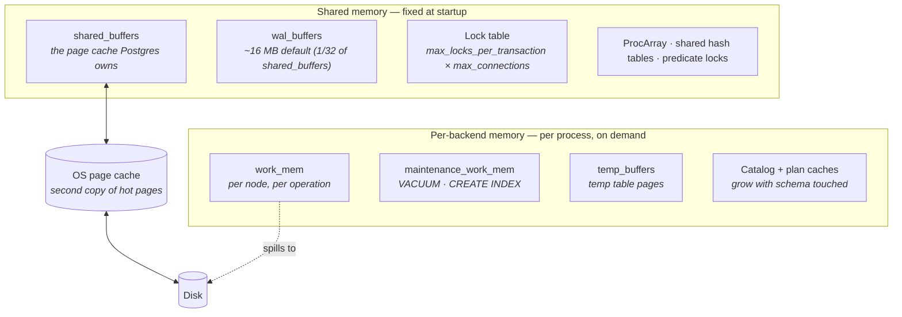

- **`shared_buffers`** — Postgres's own buffer pool. Conventional sizing is **25% of RAM**, and it is genuinely conventional rather than derived: Postgres reads through the OS page cache, so pages are frequently **double-buffered**, once in `shared_buffers` and once in the kernel. Making `shared_buffers` very large wastes RAM on duplication and lengthens checkpoint flushes. 25% with a cap around 16–32 GB on big machines is the safe default; going to 50%+ pays off only on write-heavy workloads with careful checkpoint tuning.
- **`effective_cache_size`** — allocates *nothing*. It is a planner hint meaning "assume roughly this much total cache exists (mine plus the OS's)." Set it to **50–75% of RAM**. Setting it too low makes the planner distrust index scans.
- **`wal_buffers`** — a small ring, default `-1` meaning 1/32 of `shared_buffers` capped at 16 MB. Rarely worth tuning beyond 16–64 MB on high-commit-rate systems.
- **Lock table** — sized at startup from `max_locks_per_transaction` (default 64) × (`max_connections` + `max_prepared_transactions`). **It is not per transaction, it is an average.** A query touching 2000 partitions takes 2000+ relation locks in one transaction, and if the cluster-wide table is exhausted you get `out of shared memory: You might need to increase max_locks_per_transaction` — an error that only appears at scale, only under partitioning, and requires a **restart** to fix.

### `work_mem` — the classic sizing trap

- **`work_mem` is a budget per node, per operation, per backend — not per query and certainly not per server.** Default is a very conservative **4 MB**.
- **The multiplication example.** A reporting query with two hash joins, a sort, and a hash aggregate has **four** memory-consuming nodes. With `work_mem = 64 MB` that is 256 MB for one execution. Run it with `max_parallel_workers_per_gather = 4` and each worker gets its own allocation: **~1.2 GB for one query**. Now let 40 such queries run concurrently and you have asked the kernel for **~50 GB**.
- **The failure mode:** the OOM killer selects a Postgres backend; the postmaster sees an abnormal child exit; **the entire cluster restarts and enters crash recovery**. A `work_mem` misconfiguration is not a slow query, it is an outage.
- **What to do instead:** keep the global `work_mem` low (4–32 MB), and raise it *per session* for the handful of jobs that need it — `SET LOCAL work_mem = '512MB'` inside the transaction that runs the nightly report. Since PG 13, `hash_mem_multiplier` (default 2.0) lets hash nodes have more than sort nodes, which is usually where you actually want the headroom.
- **Under-sizing has a cost too** — nodes that exceed `work_mem` spill to temp files on disk. You see this in `EXPLAIN (ANALYZE)` as `Sort Method: external merge Disk: 148000kB`, and in `log_temp_files`.

### `maintenance_work_mem` and friends

- **`maintenance_work_mem`** (default 64 MB) bounds `VACUUM`, `CREATE INDEX`, `ALTER TABLE ... ADD FOREIGN KEY`. Raise it to **1–2 GB** for index builds; the build is often 2–3× faster because it does fewer external merge passes.
- **The multiplication trap repeats.** `autovacuum_work_mem` defaults to `-1`, meaning "use `maintenance_work_mem`." With 3 autovacuum workers and `maintenance_work_mem = 2GB` you have authorized **6 GB** of autovacuum memory on top of everything else. Set `autovacuum_work_mem` explicitly, typically 256–512 MB.
- **`temp_buffers`** (default 8 MB) is per-backend memory for temporary table pages, and once allocated in a session **it is never released until the session ends**. Sessions that create big temp tables under a pooler leave that memory pinned on a shared server connection.

**Rule of thumb for total memory:** `shared_buffers` + (peak active backends × expected `work_mem` × nodes per query) + (autovacuum workers × `autovacuum_work_mem`) + per-backend baseline must fit in RAM with headroom for the OS page cache. Almost nobody does this arithmetic, and it is where most Postgres OOMs come from.

## Connection pooling

Given [§ Process and memory architecture](#process-and-memory-architecture), the pooler is part of the database tier, not an optional accessory. PgBouncer is the standard; pgcat and Odyssey are multi-threaded alternatives with the same model.

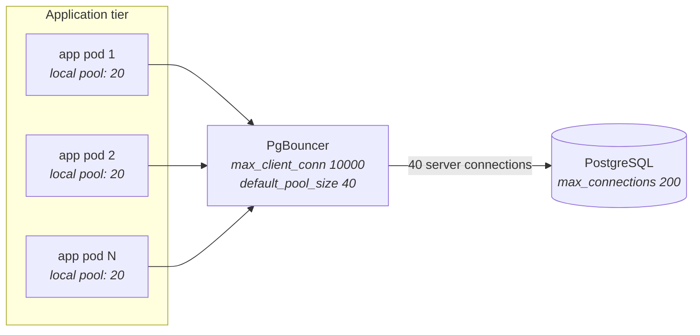

- **The pooler's job is fan-in** — thousands of cheap client connections multiplexed onto a few dozen expensive server connections.
- **Client-side pools multiply.** 50 pods × a HikariCP pool of 20 = 1000 connections attempted, regardless of what any one pod thinks it is doing. This arithmetic is the number-one cause of connection exhaustion, and it changes every time you scale the deployment.
- **Set `max_connections` above the pooler's total pool size plus reserved slots**, not above your client count. `superuser_reserved_connections` (default 3) keeps a way in when everything is full.

### The three pooling modes

| Mode | Server conn released | Reuse | Session state safe? | Use when |
|---|---|---|---|---|
| Session | on client disconnect | poor — 1:1 with clients | yes, fully | legacy apps that need session state |
| **Transaction** | **on `COMMIT`/`ROLLBACK`** | **high — this is the point** | **no — see [§ What breaks under transaction pooling](#what-breaks-under-transaction-pooling)** | **the default for web workloads** |
| Statement | after each statement | highest | no, and multi-statement transactions are forbidden | sharding proxies; almost never |

- **Transaction pooling is the only mode that delivers the fan-in you wanted.** A web request holds a server connection for the 3 ms it is in a transaction, not the 30 s the HTTP keep-alive lives.

### What breaks under transaction pooling

Every statement in a transaction sees the same server connection; consecutive transactions from the same client may not. Everything anchored to *session* rather than *transaction* scope therefore breaks.

- **Server-side prepared statements** — the client's `PREPARE` landed on server connection A; the `EXECUTE` arrives on B. Error: `prepared statement "S_1" does not exist`. This is *the* classic. Fixes: PgBouncer 1.21+ has built-in prepared-statement tracking (`max_prepared_statements`); JDBC users set `prepareThreshold=0`; libpq/asyncpg users disable the statement cache (`statement_cache_size=0`) or use protocol-level unnamed statements.
- **Session-scoped advisory locks** — `pg_advisory_lock()` is held until the session ends or you unlock. Under a pooler the session is a moving target, so the lock leaks onto a random server connection forever. **Use `pg_advisory_xact_lock()`**, which releases at commit and is pooler-safe.
- **Temporary tables** — created on one server connection, invisible on the next, and the pages stay allocated in that backend's `temp_buffers`. Use unlogged tables or CTEs instead.
- **`SET` / `SET SESSION`** — `SET search_path`, `SET work_mem`, `SET TIME ZONE` leak onto a shared connection and then apply to *someone else's* queries. Use `SET LOCAL` inside an explicit transaction.
- **`LISTEN` / `NOTIFY`** — listening is inherently session-scoped; it simply does not work through transaction pooling. Notification consumers need a direct connection.
- **Cursors held across transactions** (`WITH HOLD`), and **session-level `SET ROLE`** for row-level security — same failure shape.

**The trap:** all of these work perfectly in development, where there is one app instance and the pooler is effectively 1:1. They fail probabilistically in production under load, which makes them miserable to debug.

### Pool sizing

- **Size from server capacity, never from client demand.** The pool exists precisely to *refuse* to pass client demand through.
- **Starting formula:** `pool_size ≈ (cores × 2) + effective_spindle_count`. On a 16-core box with NVMe (treat spindles as small), that is roughly **32–40**. For CPU-bound in-memory workloads, `cores × 2` is often already too many; for I/O-bound ones you can go higher because backends spend time blocked.
- **Why a small pool is faster.** Queueing at the pooler is *cheaper* than queueing inside Postgres, where waiting backends still hold locks, consume memory, and contend on latches. A pool of 40 with 500 clients waiting outbids a pool of 500 nearly every time — the same total work completes with lower latency because there is less contention.
- **Watch `pg_stat_activity` for the split** between `active`, `idle`, and `idle in transaction`. A pool that looks exhausted but is mostly `idle in transaction` has an application bug, not a sizing problem ([§ Idle-in-transaction sessions blocking vacuum](#idle-in-transaction-sessions-blocking-vacuum)).
- **Separate pools per workload** — a `default_pool_size` shared between the OLTP path and the reporting path means one slow report starves checkout. Give analytics its own pool, ideally its own replica.

## Storage internals

### Heap page layout

Everything lives in **8 KB pages** (compile-time `BLCKSZ`; effectively fixed).

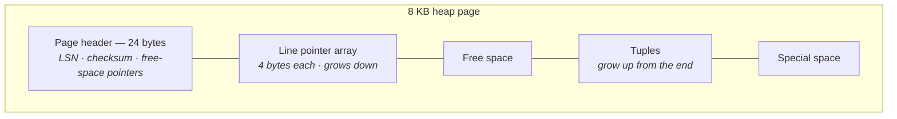

- **`ctid` is `(page_number, line_pointer_index)`** — the physical address of a tuple version. It is *not* a stable row identity: any update moves the row and changes its `ctid`. Never store one.
- **The line pointer indirection matters.** Indexes point at `ctid`s; the line pointer lets the page reorganize tuples internally (during vacuum's page pruning) without touching index entries. It is also what makes HOT chains possible ([§ HOT updates — the mitigation](#hot-updates--the-mitigation)).
- **Tuple header is 23 bytes, padded to 24** by alignment — `xmin`, `xmax`, `cmin`/`cmax`, `ctid`, an info mask, and the null bitmap offset. Then the data begins at an 8-byte-aligned offset.
- **Column order affects size, because of alignment padding.** A table declared `(a bool, b bigint, c bool, d bigint)` pads each `bool` out to the `bigint` alignment: 32 bytes of payload. Declared `(b bigint, d bigint, a bool, c bool)` it is 18 bytes padded to 24. On a billion-row table that ordering choice is **gigabytes**. **Rule of thumb:** declare fixed-width columns widest-first, then variable-width, then nullable ones last.
- **Practical maxima:** ~291 tuples per page at minimum tuple size; a row cannot span pages, so the row width limit before TOAST intervenes is a fraction of 8 KB.

### TOAST

*The Oversized-Attribute Storage Technique* — how a 5 MB `text` value lives in a table whose pages are 8 KB.

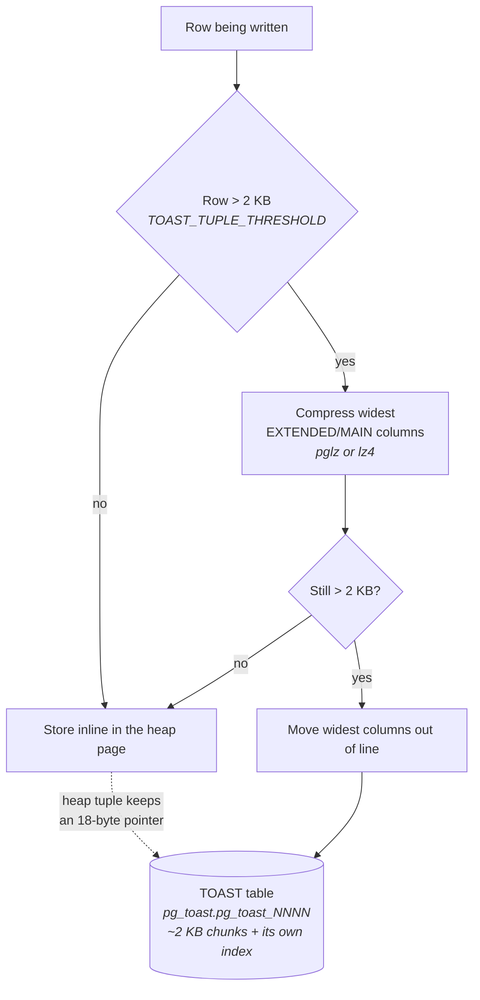

- **Threshold is ~2000 bytes** (`TOAST_TUPLE_THRESHOLD`, roughly a quarter page). Postgres compresses first, then moves out of line, repeating until the row fits.
- **Chunks are ~1996 bytes**, stored in a hidden per-table TOAST relation with its own B-tree index on `(chunk_id, chunk_seq)`.
- **Storage strategies per column** — `PLAIN` (no TOAST, fixed-width types), `EXTENDED` (compress then out-of-line; the default for varlena), `EXTERNAL` (out-of-line, **no compression** — makes substring/`LIKE` prefix reads cheap because they can fetch only the needed chunks), `MAIN` (compress, avoid out-of-line if possible).
- **Detoasting cost is invisible in the plan.** `SELECT * FROM docs WHERE id = 1` looks like a single index scan, but reassembling a 5 MB `jsonb` means fetching ~2500 chunks via the TOAST index and decompressing all of them. `EXPLAIN (ANALYZE, BUFFERS)` shows the buffer reads; the plan node count does not change.
- **The practical rule:** never `SELECT *` on a table with wide columns, and **avoid predicates on TOASTed columns** — every candidate row must be fully detoasted before the filter can be applied. `jsonb` columns above the threshold are the common offender.
- **Small columns get a free ride.** Because TOAST moves the *widest* column first, a narrow `status` column on a table with a big `payload` stays inline, so queries reading only narrow columns never touch TOAST at all. That is the argument for keeping wide blobs in the same table rather than a side table — and the argument against is that they still consume heap pages when scanned.
- **1 GB is the hard limit** on any single field value.

### Free space map and visibility map

Two small fork files per table, and they explain several otherwise-mysterious behaviours.

- **FSM (`_fsm` fork)** — a tree of per-page free-space bytes so an `INSERT` can find a page with room without scanning. **Only vacuum updates it.** This is why a table can have gigabytes of reclaimable space and *still* grow on insert: the space exists but no one recorded it.
- **VM (`_vm` fork)** — two bits per page: **all-visible** and **all-frozen**. Two large consequences:
  - **Index-only scans require it.** An index-only scan gets values from the index but must still verify visibility. If the page's all-visible bit is set, it skips the heap fetch entirely. **If the VM is stale (i.e. vacuum has not run), your index-only scan silently degrades into an index scan with heap fetches** — visible in `EXPLAIN` as `Heap Fetches: 4821023`.
  - **Vacuum skips all-frozen pages**, which is the only reason vacuuming a 10 TB append-only table is tractable.

### Files on disk

- **Every relation has a `relfilenode`**, and the file lives at `base/<db_oid>/<relfilenode>`. The `relfilenode` is *not* the OID — `VACUUM FULL`, `TRUNCATE`, and `CLUSTER` rewrite the table into a new relfilenode. This is why they need `ACCESS EXCLUSIVE` and double the disk space transiently.
- **Segmentation at 1 GB.** A large table is `12345`, `12345.1`, `12345.2`, … Forks are suffixed: `_fsm`, `_vm`, `_init` (unlogged tables).
- **Tablespaces** are symlinked directories under `pg_tblspc`, letting you put indexes on faster storage or archive partitions on cheaper storage. **Operational warning:** a tablespace on a separate volume is part of the backup and must be restored to the same layout; it also does not survive `pg_basebackup` naively. Most teams use exactly one and are right to.

## MVCC, bloat, vacuum, and wraparound

**This is the highest-value chain in the chapter.** They are not four topics; they are one causal chain, and being able to walk it in both directions is the single clearest signal that you have run Postgres in production.

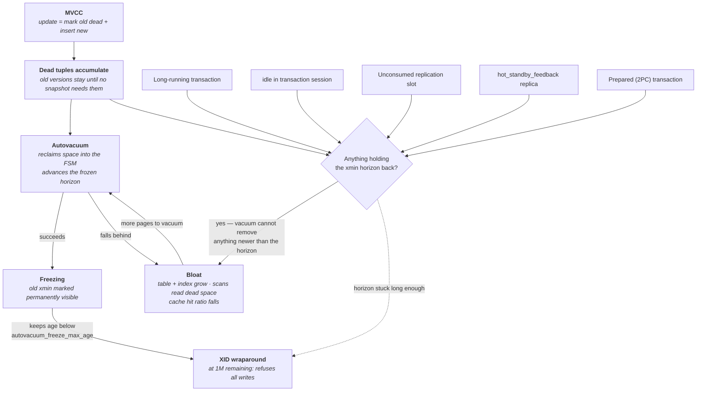

- **Read the loop in the middle.** Bloat makes vacuum slower, which makes vacuum fall further behind, which makes more bloat. It is self-reinforcing, which is why vacuum problems appear suddenly after months of looking fine.
- **Read the `HOLD` diamond as the master cause.** Five different things — a long analytics query, a leaked `idle in transaction` session, an abandoned replication slot, `hot_standby_feedback` from a replica running long queries, and an orphaned prepared transaction — all produce the *same* symptom: vacuum runs, reports success, and removes nothing.
- **Both arrows out of `HOLD` matter.** A stuck horizon causes bloat in days and wraparound danger in weeks.

### Row versioning

- **Every tuple carries `xmin` (creating transaction) and `xmax` (deleting transaction).** A snapshot is `(xmin_horizon, xmax, [in-progress XIDs])`; visibility is decided per tuple against that snapshot plus the commit log (`pg_xact`) and hint bits.
- **Readers never block writers and writers never block readers.** That is the whole payoff, and it is why Postgres does not need a rollback segment the way Oracle does.
- **An `UPDATE` is a delete plus an insert.** The old version stays in place with `xmax` set; the new version is written elsewhere. Consequences:
  - **Write amplification** — updating one 4-byte integer in a 2 KB row writes a whole new 2 KB row.
  - **Every index on the table must gain an entry pointing to the new `ctid`** — even indexes on columns you did not touch. Ten indexes means ten index insertions for a one-column update. **This is why "just add an index" is never free on a write-heavy table**, and it is the specific reason Postgres degrades faster than InnoDB under update-heavy workloads with many secondary indexes.
  - **`DELETE` does not free space.** It sets `xmax`. Only vacuum reclaims.
- **`SELECT` can write.** Setting hint bits and pruning dirties pages, so a read-only query on a freshly-written table can generate write I/O and WAL (full-page writes). Surprising in benchmarks.

### HOT updates — the mitigation

- **Heap-Only Tuple:** if an update satisfies two conditions, the new version is chained from the old one's line pointer *within the same page* and **no index entries are created at all**.
  - **Condition 1:** no indexed column changed.
  - **Condition 2:** the new version fits on the same page.
- **`fillfactor` buys condition 2.** Default heap fillfactor is **100** — pages are packed full, so almost no update can stay on its page. Setting `fillfactor = 85` on an update-heavy table reserves 15% of each page for future versions and can convert most updates to HOT. The cost is ~15% more pages for the same data.
- **Measure it:** `pg_stat_user_tables.n_tup_hot_upd / n_tup_upd`. Above 0.8 is healthy on an update-heavy table; near 0 means every update is paying full index maintenance.
- **HOT chains are pruned opportunistically** on page access, without a full vacuum — this is why some workloads self-heal and others do not.
- **PG 16+ adds bottom-up index deletion and TID-store improvements**, which reduce but do not eliminate the problem. Do not claim they solve it.

### Bloat

- **Definition:** the ratio of space the table occupies to the space its live tuples need.
- **Sources** — dead tuples awaiting vacuum; free space that vacuum reclaimed but that no insert has reused (fragmentation); index pages left half-empty after deletions; and **anything holding the xmin horizon**, which converts ordinary churn into permanent growth.
- **Measurement:** `pgstattuple` (accurate, but does a full scan — expensive) and `pgstattuple_approx` (samples, cheap). The widely-copied estimation query in `check_postgres`/`pg_bloat_check` is fast but can be off by a lot on wide or heavily-TOASTed tables. `n_dead_tup` in `pg_stat_user_tables` is the cheap early-warning signal.
- **Why it hurts:** a table 3× bloated reads 3× the pages for a sequential scan, holds 3× the buffers for the same live data, and shrinks your effective cache. Performance decays gradually and then sharply, once the working set stops fitting in `shared_buffers`.

**Remediation, in order of preference:**

- **Fix the cause first** — vacuum settings, the long transaction, the abandoned slot. Rewriting a table that will re-bloat next week is theatre.
- **`VACUUM FULL`** — rewrites the table compactly into a new relfilenode. Takes **`ACCESS EXCLUSIVE` for the entire duration** (nothing can even `SELECT`) and needs free disk equal to the final table size. Correct for a maintenance window, never for a live OLTP table.
- **`pg_repack`** — achieves the same compaction online. It builds a copy while capturing changes with triggers, then swaps under a brief `ACCESS EXCLUSIVE` lock. Costs: doubles disk usage transiently, roughly doubles WAL, and **the final swap can still queue behind a long-running query** ([§ Lock queue pileup behind a single DDL](#lock-queue-pileup-behind-a-single-ddl)). The standard production tool.
- **`REINDEX CONCURRENTLY`** for index-only bloat — often the whole problem, and much cheaper than repacking the heap.
- **Partitioning as prevention** — for time-series data, dropping an old partition is instant and generates no dead tuples at all. `DELETE FROM events WHERE ts < now() - interval '90 days'` on an unpartitioned table is the single most common self-inflicted bloat wound.

### Autovacuum

**Its two jobs:** reclaim dead tuples (space), and freeze old rows (wraparound safety). It is easy to think only about the first and get killed by the second.

- **The trigger formula — memorize it:**

      dead_tuples > autovacuum_vacuum_threshold + autovacuum_vacuum_scale_factor × reltuples

  Defaults: threshold **50**, scale factor **0.2**.
- **Why the defaults are wrong at scale.** On a 100 000-row table that is 20 050 dead tuples — reasonable. On a **100-million-row** table it is **20 million dead tuples** before autovacuum even starts, by which point the table is badly bloated and the vacuum itself is a multi-hour job. **Set `autovacuum_vacuum_scale_factor = 0.01` or lower per-table on your large tables**, or use a fixed threshold with scale factor 0.
- **The analyze trigger** is the same shape with `autovacuum_analyze_scale_factor` (default **0.1**), and matters because stale statistics cause plan flips ([§ Plan flips after statistics change](#plan-flips-after-statistics-change)).
- **PG 13+ adds `autovacuum_vacuum_insert_threshold`** (default 1000) and `insert_scale_factor` (0.2), so append-only tables finally get vacuumed for freezing and visibility-map maintenance. Before that, insert-only tables were a notorious wraparound trap.

**Cost-based throttling — the reason it is "too slow":**

- Autovacuum accumulates a cost as it works: `vacuum_cost_page_hit` **1**, `page_miss` **2** (was 10 before PG 14), `page_dirty` **20**. When the accumulated cost reaches `autovacuum_vacuum_cost_limit` (**200**), the worker sleeps for `autovacuum_vacuum_cost_delay` (**2 ms** since PG 12; it was 20 ms before, and legacy configs still carry that).
- **The arithmetic:** with the defaults, a worker dirtying pages does 200/20 = 10 dirty pages per 2 ms → ~5000 dirty pages/s → **~40 MB/s of dirtying**. On modern NVMe that is a rounding error of your actual capacity, and it is why raising `autovacuum_vacuum_cost_limit` to 1000–2000 (or setting `cost_delay = 0` for a specific table) is one of the highest-leverage changes on a busy database.
- **`autovacuum_max_workers` is 3 by default and does not increase total throughput** — the cost limit is shared across workers by default (`autovacuum_vacuum_cost_limit` is divided among them). Raising workers without raising the cost limit just makes each one slower.

**Why autovacuum falls behind, and the symptoms:**

- **Causes** — default scale factor on a huge table; cost throttling on a high-churn table; only 3 workers against hundreds of partitions; a held xmin horizon making the work pointless; or an anti-wraparound vacuum monopolizing a worker for hours.
- **Symptoms, in order of appearance:** `n_dead_tup` climbing monotonically in `pg_stat_user_tables`; `last_autovacuum` hours or days stale; table size growing while row count is flat; sequential scans slowing; `age(relfrozenxid)` climbing; finally the wraparound warnings.
- **Diagnosis query** — the one to be able to write from memory:

      SELECT relname, n_live_tup, n_dead_tup,
             round(n_dead_tup::numeric / NULLIF(n_live_tup,0), 3) AS ratio,
             last_autovacuum, last_autoanalyze
      FROM pg_stat_user_tables
      ORDER BY n_dead_tup DESC LIMIT 20;

- **The counterintuitive fix is almost always to make autovacuum *more* aggressive, not less.** Operators throttle it further because they see it consuming I/O, which deepens the debt and guarantees a worse event later.

### Transaction ID wraparound

- **XIDs are 32-bit.** The visibility rule is circular: any XID is "in the past" for 2^31 (~2.1 billion) values and then flips to "in the future." A tuple whose `xmin` falls into the future becomes **invisible** — silent data loss. Postgres refuses to allow this.
- **Freezing is the prevention.** Vacuum marks sufficiently old tuples as frozen (a bit in the info mask, historically `FrozenXID`), meaning "visible to everyone, forever." Frozen tuples are immune to wraparound.

**The thresholds — know these numbers:**

- **`vacuum_freeze_min_age`** = 50 M — how old a tuple must be before an ordinary vacuum bothers freezing it.
- **`autovacuum_freeze_max_age`** = **200 M** — when a table's `age(relfrozenxid)` exceeds this, autovacuum launches an **anti-wraparound vacuum on that table whether or not autovacuum is disabled**. It cannot be turned off. It is not cancellable in the ordinary sense — killing it just makes it restart.
- **`vacuum_failsafe_age`** = **1.6 B** (PG 14+) — beyond this, vacuum abandons cost throttling and index cleanup entirely and races to freeze. A gift; before PG 14 you had to do that manually.
- **~40 M remaining** → `WARNING: database "x" must be vacuumed within N transactions` in the log.
- **~3 M remaining** → the same message escalates.
- **1 M remaining** → **the cluster refuses to accept new write transactions**: `ERROR: database is not accepting commands to avoid wraparound data loss`. Recovery requires vacuuming, which on a huge table takes hours, in single-user mode in the worst case. **This is a multi-hour full outage.**

**Monitoring — the query to know:**

      SELECT datname, age(datfrozenxid),
             2^31 - age(datfrozenxid) AS xids_remaining
      FROM pg_database ORDER BY age(datfrozenxid) DESC;

Alert at 500 M, page at 1 B. Do the same per-relation against `pg_class.relfrozenxid`.

- **What actually causes it:** never raw XID consumption — you would need ~2 000 write transactions/second sustained for two weeks. It is **always something holding the horizon**: a transaction open for days, a `hot_standby_feedback` replica with a long report, or an abandoned replication slot. Wraparound is a *symptom* of the [§ MVCC, bloat, vacuum, and wraparound](#mvcc-bloat-vacuum-and-wraparound) diagram's `HOLD` diamond.
- **MultiXact wraparound is the forgotten twin.** Heavy `SELECT ... FOR SHARE` or many foreign-key locks on the same row consume MultiXact IDs, which have their own 32-bit space, their own `autovacuum_multixact_freeze_max_age` (400 M), and their own emergency shutdown. `pg_multixact` filling the disk is a real and confusing incident.
- **Postgres 18 does not fix this.** 64-bit XIDs have been proposed for years; do not claim they have landed.

## Indexing

### B-tree — the one you will use

- **Default, and correct for equality, range, sorting, and uniqueness.** Height is typically **3–4 levels for hundreds of millions of rows** (fanout is in the hundreds per 8 KB page), so a point lookup is 3–4 page reads, of which the upper levels are always cached.
- **Multicolumn ordering is the thing people get wrong.** An index on `(a, b, c)` supports `a`, `(a,b)`, `(a,b,c)`, and range scans on the last used column — a **left-prefix** rule. It does **not** efficiently serve a query filtering only on `b`. Order the columns: equality predicates first, then the range/sort column last.
- **Deduplication (PG 13+)** stores one copy of a duplicated key with a posting list of TIDs. On a low-cardinality column such as `status`, this shrinks the index dramatically — often 3–5×. It is why "never index a low-cardinality column" is now weaker advice than it was.
- **Index-only scans** return values entirely from the index — but only when the visibility map says the heap pages are all-visible ([§ Free space map and visibility map](#free-space-map-and-visibility-map)). **`Heap Fetches` in `EXPLAIN ANALYZE` is the metric**: a high number means vacuum has not run and your index-only scan is not one.
- **Index bloat is real and distinct from table bloat.** B-tree pages do not merge when emptied; a table with a churning indexed column grows indexes that never shrink. `REINDEX CONCURRENTLY` is the fix.

### The other index families

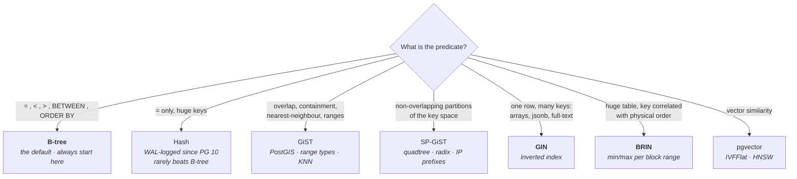

- **Hash** — equality only, no ordering, no multicolumn, no uniqueness. Crash-safe and replicated only since PG 10. Wins narrowly on very large keys where the B-tree would be deep. **In an interview, the right answer is "B-tree, unless I can show a measured win."**
- **GiST** — a generalized, extensible tree: you supply consistency/union/penalty functions. Powers PostGIS geometry, range-type `&&` overlap, `exclusion constraints` (e.g. "no two bookings overlap for this room"), and KNN `ORDER BY point <-> target LIMIT 10`. Lossy: it returns candidates that must be rechecked.
- **SP-GiST** — space-partitioned, for data that decomposes into **non-overlapping** regions: quadtrees, radix trees for text prefixes, `inet` prefix matching.
- **GIN** — inverted index mapping each *element* to the rows containing it. The right choice for `jsonb` containment (`@>`), array containment, `tsvector` full-text, and `pg_trgm` similarity. Very fast to search, **slow to update**, because one row insert touches one posting list per distinct element.
  - **`fastupdate` (on by default)** buffers new entries in an unsorted **pending list** rather than merging into the main structure. Writes become fast; **reads must scan the entire pending list on top of the index**, so query latency becomes erratic and spikes when the list is large.
  - `gin_pending_list_limit` defaults to **4 MB**; when exceeded, the next unlucky *user* insert pays for the merge — a latency outlier with no obvious cause. **The trade-off:** leave `fastupdate = on` for write-heavy ingest and accept jittery reads; set `fastupdate = off` for predictable read latency and slower writes. There is no setting that gives both.
- **BRIN** — stores only min/max (or other summary) per **`pages_per_range` = 128** block range, i.e. ~1 MB of table summarized in a few bytes. An index on a 1 TB table can be a few megabytes.
  - **It works only when the column correlates with physical row order** — an append-only `created_at`, or a table that was `CLUSTER`ed. Check `pg_stats.correlation`; you want > 0.9.
  - **The failure mode:** correlation degrades (updates, `HOT` misses, random inserts) and the index silently becomes useless — every range matches, so every scan reads the whole table plus the index. It does not error, it just stops helping. **BRIN is a bet on physical layout, and the layout is not something you control.**
  - Summaries are created by vacuum or `brin_summarize_new_values()`; freshly-inserted unsummarized ranges are always scanned.

### Partial, expression, and covering indexes

- **Partial** — `CREATE INDEX ON jobs (created_at) WHERE status = 'pending'`. If 0.1% of a 500 M-row table is pending, the index is 500 K entries rather than 500 M: it fits in cache, and it costs almost nothing to maintain because rows leaving `pending` are simply removed from it. **The best price/performance index in Postgres, and consistently underused.** The planner only uses it when it can prove the query predicate implies the index predicate, so the `WHERE` clauses must match closely.
- **Expression** — `CREATE INDEX ON users (lower(email))`. Required for `WHERE lower(email) = $1` to be indexable. **The gotcha:** the expression must be **`IMMUTABLE`**. `CREATE INDEX ON events (ts::date)` fails because the cast depends on `TimeZone`. Also: an expression index only gets statistics via `ANALYZE`, and the planner treats the expression as an opaque column.
- **Covering (`INCLUDE`)** — `CREATE INDEX ON orders (customer_id) INCLUDE (total, status)`. The included columns are stored **in leaf pages only**, not in the tree, so they do not bloat internal nodes and are not usable as predicates — but they let an index-only scan return them. Prefer `INCLUDE` over adding a column to the key when the column is only ever in the `SELECT` list, and remember it does not change uniqueness semantics (a unique index on `(a) INCLUDE (b)` still enforces uniqueness on `a` alone — which is exactly the point).

### Extensions worth naming

- **`pgvector`** — vector similarity for embeddings, the reason "just use Postgres" now extends to RAG systems.
  - **IVFFlat** — clusters vectors into `lists` centroids; a query probes `probes` of them. **Sizing: `lists ≈ rows/1000` up to 1 M rows, then `≈ sqrt(rows)`.** Fast to build, small, but **must be built on populated data** (empty-table build gives garbage centroids) and **recall degrades as new data drifts from the centroids** — it needs periodic rebuilds.
  - **HNSW** — a navigable small-world graph. `m = 16`, `ef_construction = 64` at build; `hnsw.ef_search = 40` at query. Better recall/latency and no rebuild requirement, but **builds are slow and memory-hungry** (the graph should fit in `maintenance_work_mem` or the build crawls) and the index is much larger. **HNSW is the default choice now; IVFFlat is for when build time or index size dominates.**
  - **The honest limit:** at tens of millions of vectors with high QPS, a dedicated vector store wins. Under a few million, `pgvector` saves you an entire system, and — the real argument — lets you filter by vector similarity **and** SQL predicates in one transaction with consistent data.
- **PostGIS** — geometry/geography types, spatial predicates, GiST-indexed. Genuinely best-in-class; there is no "specialized alternative" argument to make here.
- **`pg_trgm`** — trigram similarity for fuzzy matching and, importantly, **making `LIKE '%foo%'` indexable** via a GIN or GiST trigram index. The standard answer for typo-tolerant search when you do not want Elasticsearch.

### Index maintenance

- **`CREATE INDEX` takes `SHARE` lock** — it blocks all writes to the table for the whole build. On a large table that is an outage.
- **`CREATE INDEX CONCURRENTLY` (CIC)** avoids that, at real cost:
  - **Two full table scans plus two waits** for all transactions that could see inconsistent state. Roughly 2–3× the wall time of a normal build.
  - **It cannot run inside a transaction block** — which means most migration frameworks need an explicit escape hatch.
  - **If it fails or is cancelled, it leaves an `INVALID` index behind** that consumes space and is maintained on every write but never used for reads. You must find it (`SELECT * FROM pg_class c JOIN pg_index i ON i.indexrelid=c.oid WHERE NOT i.indisvalid`) and `DROP INDEX CONCURRENTLY` it, then retry.
  - **It waits for *all* concurrent transactions to finish**, including ones on unrelated tables. A single long-running transaction stalls your CIC indefinitely — and while it waits it holds a lock that can queue behind it ([§ Lock queue pileup behind a single DDL](#lock-queue-pileup-behind-a-single-ddl)).
  - `REINDEX CONCURRENTLY` (PG 12+) has the same properties and leaves `*_ccnew` invalid leftovers on failure.
- **Unused-index detection:**

      SELECT relname, indexrelname, idx_scan, pg_size_pretty(pg_relation_size(indexrelid))
      FROM pg_stat_user_indexes WHERE idx_scan = 0 ORDER BY pg_relation_size(indexrelid) DESC;

  **Two caveats before you drop anything:** the counters reset on `pg_stat_reset()` and on restart, so a fresh cluster shows everything as unused; and an index enforcing a unique constraint or supporting a foreign key may show zero scans while still being load-bearing. Check replicas separately — the counters are per-node, and a read replica may be the only user.

## Query planning and execution

The planner is a cost-based optimizer over statistics. **Almost every "Postgres picked a bad plan" incident is a statistics problem, not a planner bug.**

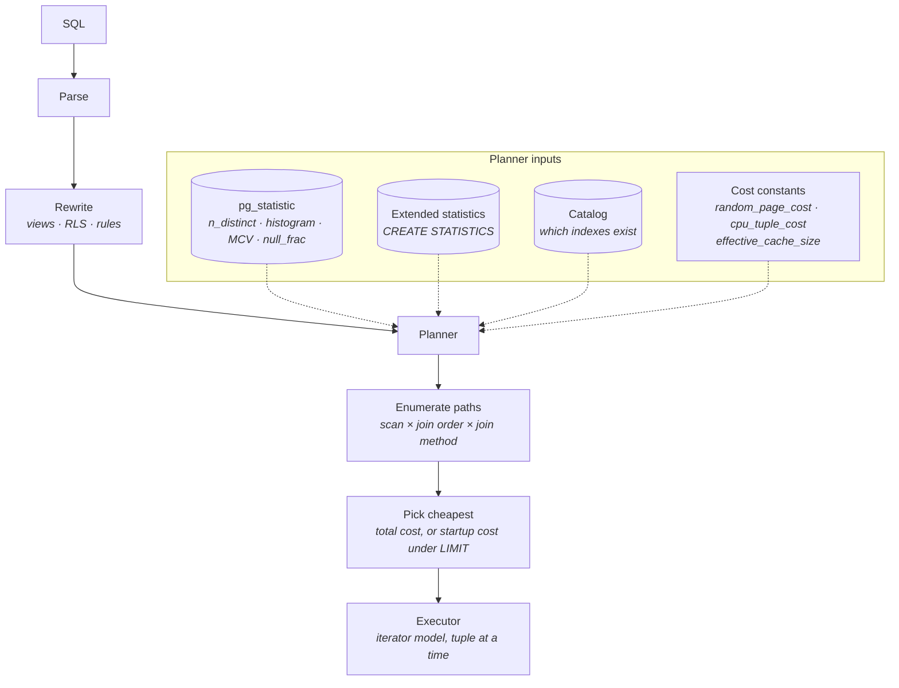

- **Statistics come from `ANALYZE`, not from the data.** They are a *sample* — `default_statistics_target = 100` means ~300 × 100 = 30 000 rows sampled — and they are always somewhat stale. Everything downstream inherits that staleness.
- **Cost constants are unitless ratios anchored to `seq_page_cost = 1.0`.** The planner does not know your hardware.

### Statistics in detail

- **`n_distinct`** — number of distinct values, or a *negative* number meaning a fraction of the table (`-1` = unique). Notoriously badly estimated from a sample on high-cardinality columns; you can override it with `ALTER TABLE ... ALTER COLUMN x SET (n_distinct = 5000)`, which is occasionally the fastest fix for a bad join estimate.
- **MCVs (most common values)** — up to `default_statistics_target` values with their frequencies. This is how the planner knows `status = 'pending'` matches 0.1% while `status = 'done'` matches 95%, and therefore why the same query shape gets different plans for different parameters.
- **Histogram** — up to `default_statistics_target` equal-frequency buckets for everything that is not an MCV, used for range selectivity.
- **`default_statistics_target = 100`; raise it to 500–1000 on skewed or high-cardinality columns** (per-column: `ALTER TABLE ... SET STATISTICS 1000`). It costs `ANALYZE` time and planning time, so do it per-column, not globally.
- **Correlation** — how well the column's order matches physical order. Drives the index-scan-vs-bitmap-scan choice and BRIN viability.
- **Extended statistics — the fix for correlated columns.** The planner assumes independence: `WHERE city = 'Paris' AND country = 'France'` gets estimated as `sel(city) × sel(country)`, which is off by the cardinality of `country` because city determines country. `CREATE STATISTICS s (dependencies, ndistinct, mcv) ON city, country FROM addresses;` then `ANALYZE` fixes it. **This is the single best answer to "the row estimate is 1 but the actual is 400 000."**

### Cost constants and hardware

- **`seq_page_cost = 1.0`**, **`random_page_cost = 4.0`**, `cpu_tuple_cost = 0.01`, `cpu_index_tuple_cost = 0.005`, `cpu_operator_cost = 0.0025`.
- **`random_page_cost = 4.0` encodes a 2000-era spinning disk.** On NVMe or cloud SSD, random reads cost barely more than sequential. **Set `random_page_cost = 1.1`** — this is the highest-value single-line change on most modern Postgres installs, and it typically shifts the planner from sequential scans to index scans where index scans are in fact faster.
- **`effective_cache_size`** feeds the planner's model of how much of an index repeat-scan will be cached; too low and it avoids nested-loop-with-index plans.
- **`jit = on` above `jit_above_cost = 100000`.** JIT helps long analytical queries and actively hurts short ones that were mis-estimated as expensive — a classic "query got 10× slower after upgrade" cause. On OLTP-only clusters, turning JIT off is often a net win.

### Plan shapes

**Scans:**

- **Seq Scan** — read every page. Correct when you need a large fraction of the table; parallelizable.
- **Index Scan** — descend the index, fetch each heap tuple. Random I/O; best when highly selective.
- **Index-Only Scan** — no heap fetch when the VM permits ([§ Free space map and visibility map](#free-space-map-and-visibility-map)).
- **Bitmap Heap Scan** — build a bitmap of matching pages from one or more indexes, then read the heap **in physical order**. This is the middle ground, and it is also how Postgres combines multiple indexes (`BitmapAnd`/`BitmapOr`). **`Recheck Cond` with `lossy` blocks means the bitmap exceeded `work_mem` and degraded to page granularity** — a signal to raise `work_mem` or improve the index.

**Joins:**

- **Nested Loop** — for each outer row, probe the inner. Great when the outer side is tiny and the inner has an index. **Catastrophic when the outer estimate was 1 and reality is 500 000** — this is the single most common shape of a Postgres production incident.
- **Hash Join** — build a hash table on the smaller side, probe with the larger. The workhorse for large equi-joins. **Spills to disk in batches when it exceeds `work_mem × hash_mem_multiplier`**; `EXPLAIN ANALYZE` shows `Batches: 17  Memory Usage: 65536kB` — anything above `Batches: 1` means it spilled.
- **Merge Join** — both sides sorted on the join key, then merged. Wins when inputs are already ordered (index scans) or for very large joins where hashing would spill badly.

**Aggregation:** `HashAggregate` (fast, needs memory, **spills since PG 13** — before that it could blow past `work_mem` entirely) versus `GroupAggregate` (needs sorted input, streams in bounded memory).

**Parallel query:**

- **Eligibility:** the table must exceed `min_parallel_table_scan_size` (**8 MB**) or index `min_parallel_index_scan_size` (512 kB); the query must not contain parallel-unsafe functions; and it must not be inside a cursor or a write.
- **`max_parallel_workers_per_gather` defaults to 2**, drawn from `max_parallel_workers` (8), drawn in turn from `max_worker_processes` (8). **These are shared cluster-wide** — several concurrent parallel queries silently run with fewer workers than planned, which is why a query is fast in isolation and slow under load.
- **`Gather` versus `Gather Merge`** — the latter preserves ordering from sorted workers. Each worker gets its own `work_mem`, which is the parallel-query memory multiplier from [§ work_mem — the classic sizing trap](#work_mem--the-classic-sizing-trap).

### Reading `EXPLAIN (ANALYZE, BUFFERS)`

**Always use all three.** `EXPLAIN` alone gives estimates; `ANALYZE` executes and gives reality; `BUFFERS` tells you where the I/O went. Add `SETTINGS` to catch a session that has non-default planner GUCs.

- **Estimate versus actual is the first thing to read.** `(cost=… rows=1 …) (actual … rows=482913 …)`. An order-of-magnitude gap on any node explains the whole plan, because the planner chose everything above that node based on the wrong number. **Find the *lowest* node where the estimate diverges** — errors propagate upward, so the topmost bad estimate is usually a symptom.
- **`loops` multiplies everything.** On an inner node of a nested loop, `actual time=0.012..0.015 rows=1 loops=482913` means the reported per-loop time must be multiplied: 0.015 ms × 482 913 ≈ **7.2 seconds**, not 0.015 ms. **Misreading this is the most common `EXPLAIN` error.** Likewise `rows` is per-loop average, not total.
- **`BUFFERS` distinguishes cache from disk.** `shared hit` = found in `shared_buffers`; `shared read` = went to the OS/disk; `dirtied` = pages this query modified; `written` = pages this query had to evict. A "slow query" with 100% `shared hit` is a CPU/plan problem, not an I/O problem — an important fork in the diagnosis.
- **`shared read` on a supposedly-small table means bloat** — you are reading dead space ([§ Bloat](#bloat)).
- **Spills are explicit:** `Sort Method: external merge  Disk: 148256kB`, `Batches: 17`, `lossy=…` on a bitmap. All three say "raise `work_mem` for this query."
- **`Rows Removed by Filter`** — a large number means the index (or lack of one) is delivering rows the filter then throws away. That is the signature of a missing partial index or a wrong column order in a composite index.
- **Timing overhead is real.** `ANALYZE` adds per-node instrumentation; on plans with millions of loops it can double runtime. Use `EXPLAIN (ANALYZE, TIMING OFF)` when you only need row counts.
- **`auto_explain`** with `auto_explain.log_min_duration` captures the plan of the slow execution in production — which is the only plan that matters, because you cannot reproduce it by hand.

### Prepared statements and plan caching

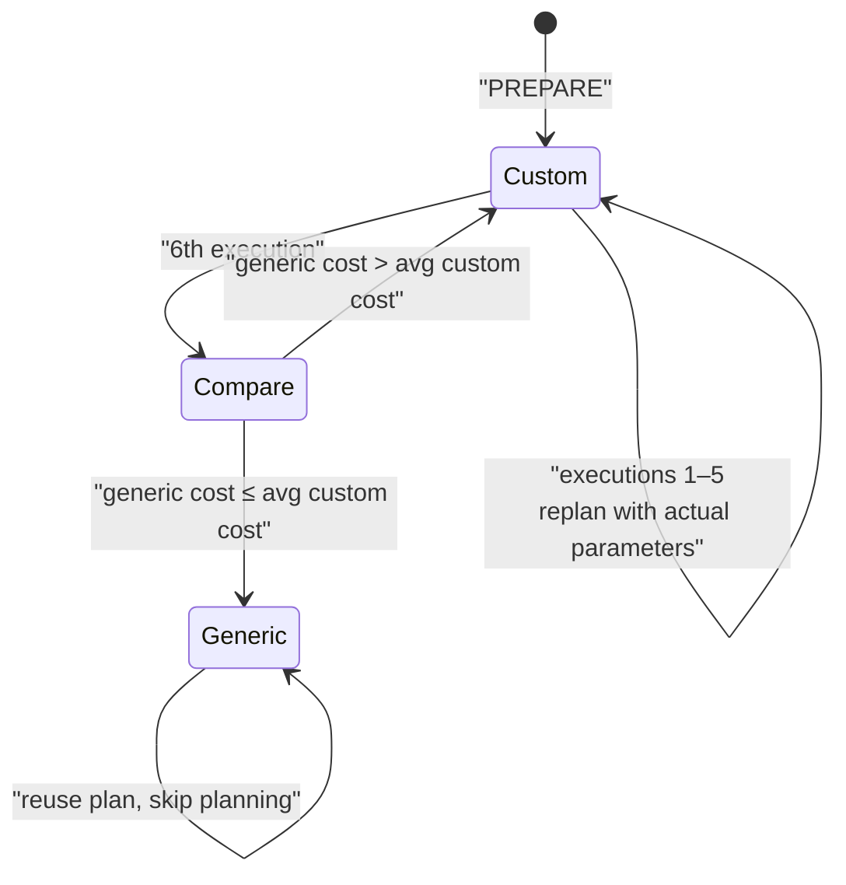

- **Custom plan** — replanned with the actual parameter values, so MCVs and histograms apply. Best plan, planning cost every time.
- **Generic plan** — planned once with placeholders, using average selectivity. No planning cost, possibly wrong plan.
- **The rule:** Postgres uses custom plans for the first **5** executions, then computes a generic plan and uses it **only if its estimated cost is not worse than the average custom cost**. Otherwise it keeps replanning. This is smarter than most people expect.
- **The failure mode is parameter sniffing / skew.** On `WHERE status = $1` where `pending` is 0.1% and `done` is 95%, the generic plan uses average selectivity and picks something wrong for both. Symptom: a query that is fast for the first few calls in a new connection and then permanently slow — and *fast again after a deploy*, because the connections were recycled.
- **Controls:** `plan_cache_mode = force_custom_plan` (per-session or per-role) restores per-value planning at the cost of planning time. `force_generic_plan` is occasionally right for very high-frequency trivial queries where planning dominates.
- **Interaction with pooling:** under transaction pooling, server-side prepared statements barely survive anyway ([§ What breaks under transaction pooling](#what-breaks-under-transaction-pooling)), so many pooled applications get custom plans by accident. That is usually fine, and occasionally the reason a query is *slower* after you enable prepared-statement support in PgBouncer.

## Concurrency and locking

### Isolation levels

- **Read Committed (default)** — each *statement* takes a fresh snapshot. Consequences people trip on: within one transaction, two identical `SELECT`s can return different results; and an `UPDATE` that blocks on another transaction's row lock **re-evaluates its `WHERE` clause against the new committed version** after the block clears (EPQ, "EvalPlanQual"), which can make it silently update zero rows.
- **Repeatable Read** — one snapshot for the whole transaction. In Postgres this is genuine **snapshot isolation**: it prevents phantoms, which the SQL standard does not require of RR. But it permits **write skew** — two transactions each read a set, each decide their write is safe, both commit, and the invariant is broken. It also raises `could not serialize access due to concurrent update`, so **the application must be prepared to retry**.
- **Serializable (SSI)** — Serializable Snapshot Isolation. Adds *predicate locks* (SIREAD) tracking read dependencies, and aborts one transaction of any dangerous structure it detects. **Genuinely serializable**, with no blocking reads.
  - **Costs:** memory for predicate locks (`max_pred_locks_per_transaction`), granularity escalation from row → page → relation as those fill (which increases false positives), and **a serialization failure rate that grows with contention**. It cannot be used on hot standbys for read-write and requires all participating transactions to be Serializable to be sound.
  - **In an interview:** SSI is the correct answer for invariants that span rows (booking overlaps, balance constraints) *if* you have a retry loop. Without a retry loop it is worse than useless.

### Table-level locks and DDL

- **Eight lock modes.** The two that matter for reasoning: **`ACCESS SHARE`** taken by every `SELECT`, and **`ACCESS EXCLUSIVE`** taken by `ALTER TABLE`, `DROP`, `TRUNCATE`, `VACUUM FULL`, `REINDEX` — and it **conflicts with everything, including `SELECT`**.
- **`ROW EXCLUSIVE`** (INSERT/UPDATE/DELETE) conflicts with `SHARE` (taken by `CREATE INDEX`), which is why a plain index build blocks writes.
- **The critical operational fact — lock requests queue, and the queue blocks.** If a long `SELECT` is running and an `ALTER TABLE` requests `ACCESS EXCLUSIVE`, the ALTER waits *behind* the SELECT — **and every subsequent `SELECT` waits behind the ALTER**, because Postgres does not let later, compatible requests jump the queue. One 30-second report plus one DDL statement equals a total table outage for 30 seconds. [§ Lock queue pileup behind a single DDL](#lock-queue-pileup-behind-a-single-ddl).
- **What to do instead:** always `SET lock_timeout = '2s'` before DDL, and retry. Failing fast and retrying a hundred times is strictly better than blocking the table once.
- **Cheap versus expensive DDL — worth memorizing:**
  - **Cheap (metadata only, brief `ACCESS EXCLUSIVE`):** `ADD COLUMN` with a non-volatile default (PG 11+ stores the default in the catalog, no rewrite), `DROP COLUMN`, `RENAME`, `ADD CONSTRAINT ... NOT VALID` then `VALIDATE CONSTRAINT` (which takes only `SHARE UPDATE EXCLUSIVE`), `SET NOT NULL` backed by an existing `CHECK` (PG 12+).
  - **Expensive (full table rewrite):** changing a column type in most cases, `ADD COLUMN` with a volatile default, `SET DATA TYPE` narrowing, `CLUSTER`, `VACUUM FULL`.

### Deadlocks and lock diagnosis

- **Detection, not prevention.** After `deadlock_timeout` (default **1 s**) a waiting backend looks for a cycle in the wait-for graph and, if it finds one, **aborts itself** with `ERROR: deadlock detected`. The application must retry.
- **The 1-second delay is deliberate** — cycle detection is expensive, and most waits resolve quickly. It also means every deadlock costs at least a second of latency.
- **Prevention is an application concern:** acquire locks in a **consistent order** (e.g. always update accounts in ascending ID order), keep transactions short, and avoid holding locks across network calls.
- **The diagnosis query** — `pg_blocking_pids()` makes this far easier than the old `pg_locks` self-join:

      SELECT pid, pg_blocking_pids(pid) AS blocked_by, state,
             now() - query_start AS duration, left(query, 100)
      FROM pg_stat_activity
      WHERE cardinality(pg_blocking_pids(pid)) > 0
      ORDER BY duration DESC;

- **`log_lock_waits = on`** logs any wait exceeding `deadlock_timeout`, which turns invisible contention into greppable evidence. Turn it on everywhere.

### Advisory locks

- **Application-defined locks keyed by a 64-bit integer** (or two 32-bit ones), enforced by Postgres but meaning nothing to it. The standard way to get a distributed mutex when you already have a database and do not want to add ZooKeeper or Redis.
- **Two scopes, and the choice is the whole story:** `pg_advisory_lock(key)` is **session-scoped** — survives commit, released on unlock or disconnect. `pg_advisory_xact_lock(key)` is **transaction-scoped** — released automatically at commit or rollback.
- **Use the transaction-scoped form.** It is pooler-safe ([§ What breaks under transaction pooling](#what-breaks-under-transaction-pooling)), leak-proof, and cannot outlive an error path. Session-scoped advisory locks behind PgBouncer are one of the nastiest bugs in this chapter.
- **`pg_try_advisory_xact_lock`** returns immediately instead of waiting — the right primitive for "only one instance runs this cron job."
- **The limits:** advisory locks live on **one** Postgres node, so failover releases every one of them instantly and a split brain grants them twice. They are not a consensus system.

### `SKIP LOCKED` and Postgres-as-a-queue

```sql
WITH job AS (
  SELECT id FROM jobs WHERE status = 'pending'
  ORDER BY created_at LIMIT 1
  FOR UPDATE SKIP LOCKED
)
UPDATE jobs SET status = 'running' FROM job WHERE jobs.id = job.id RETURNING *;
```

- **`FOR UPDATE SKIP LOCKED` skips rows locked by other transactions instead of waiting**, which is exactly the semantics of a work queue: N workers each grab a different job with no coordination and no lock convoy.
- **Where it works well:** modest throughput (hundreds to low thousands of jobs/second), **transactional enqueue** — the killer feature, since you can insert the job in the same transaction as the business data and never have a phantom job or a lost one; plus SQL for querying, prioritizing, and debugging the queue, and no second system to operate.
- **Where it does not:**
  - **The queue table is the worst possible bloat shape.** Every job row is inserted, updated 2–3 times, then deleted — high churn on a small hot table, with an index on `status` that churns with it. It needs aggressive per-table autovacuum settings (`autovacuum_vacuum_scale_factor = 0.01`, `cost_delay = 0`) or it bloats to hundreds of times its live size within days.
  - **High fan-out and high throughput.** Beyond roughly 10 000 jobs/second you are fighting index contention and WAL volume on one hot table.
  - **No native fan-out or consumer groups**, no long-lived retention/replay, no partition-ordered delivery. Rebuilding Kafka's semantics on top is more work than adopting Kafka.
  - **Long-running jobs hold a transaction open** — which holds back the xmin horizon ([§ MVCC, bloat, vacuum, and wraparound](#mvcc-bloat-vacuum-and-wraparound)) and blocks vacuum cluster-wide. **Claim the job in a short transaction and process it outside one.**
- **Rule of thumb:** Postgres is the correct queue until throughput or fan-out requirements make it not, and the transition point is much later than people assume. `pgmq`, `river`, and `Solid Queue` are all this pattern productized.

## Durability, WAL, and replication

### WAL mechanics

- **Every modification produces a WAL record before the modified page may be written** — the write-ahead rule. Commit means the WAL is flushed; the data page follows whenever the checkpointer feels like it.
- **LSN (Log Sequence Number)** — a 64-bit byte offset into the WAL stream, printed as `3A/1F2B4C08`. It is the universal clock of a Postgres cluster: page headers carry the LSN that last modified them, replicas report received/flushed/replayed LSNs, and replication lag is a byte difference between two LSNs.
- **Segments are 16 MB files** in `pg_wal/`, recycled rather than deleted.
- **Full-page writes** — the **first** modification of a page after each checkpoint writes the *entire 8 KB page* into the WAL, not just the change. This exists to survive torn pages (a partial 8 KB write during a crash).
  - **The consequence:** WAL volume spikes immediately after every checkpoint, and it is why **frequent checkpoints massively increase WAL volume**. A tiny `UPDATE` right after a checkpoint costs 8 KB+ of WAL; the same update a minute later costs ~100 bytes.
  - `wal_compression = lz4` (or `zstd`) compresses these full-page images and typically cuts WAL volume 30–50% on write-heavy systems for a small CPU cost. **Turn it on.**
- **Group commit** — concurrent commits share one `fsync`. `commit_delay` (µs) with `commit_siblings` deliberately waits to batch more commits; rarely worth tuning, but it explains why commit throughput scales far better than "one fsync per commit" would suggest.

**`synchronous_commit` — the durability/latency dial:**

- **`on` (default)** — WAL flushed to local disk before acknowledging. Commit latency includes an `fsync`.
- **`off`** — acknowledge immediately; WAL is flushed by the WAL writer within up to **3 × `wal_writer_delay` (200 ms) = 600 ms**. **Crash loses up to ~600 ms of committed transactions, but never corrupts the database** — this is the crucial distinction. It is a legitimate 2–10× throughput win for workloads where losing the last half-second of, say, analytics events is acceptable.
- **`local`** — flush locally, do not wait for standbys (useful when synchronous replication is configured but this particular transaction does not need it).
- **`remote_write`** — standby has received and written to its OS, not fsynced. Survives standby process crash, not standby machine crash.
- **`on` with `synchronous_standby_names` set** — standby has fsynced. Zero data loss on primary failure, at the cost of a network round trip per commit.
- **`remote_apply`** — standby has *replayed*, so a read on the standby is guaranteed to see the commit. Read-your-writes on replicas, at the highest latency cost.
- **It is set per transaction.** `SET LOCAL synchronous_commit = 'off'` for a bulk-load job and `on` for payments, in the same database. **This is the answer to give when asked about durability trade-offs — it is not a cluster-wide choice.**

### Checkpoints

- **What a checkpoint does:** flush all dirty buffers as of a point, write a checkpoint record, and allow WAL before it to be recycled. It bounds crash-recovery time.
- **Triggers:** `checkpoint_timeout` (default **5 min**), `max_wal_size` (default **1 GB**) being exceeded, or explicit `CHECKPOINT`.
- **A "requested" checkpoint (hit `max_wal_size`) is the bad kind** — it means WAL is being generated faster than the timeout anticipated, so checkpoints happen unpredictably and often. `pg_stat_bgwriter.checkpoints_req` being a meaningful fraction of `checkpoints_timed` is the alert.
- **Tuning:** raise `checkpoint_timeout` to **15–30 min** and `max_wal_size` to something that comfortably holds that much WAL (often **8–32 GB**). `checkpoint_completion_target = 0.9` (the default since PG 14) spreads the flush across 90% of the interval instead of dumping it.
- **The trade-off is explicit:** longer intervals → fewer full-page writes, less WAL, smoother I/O, but **longer crash recovery** and more dirty pages to write at once. Shorter intervals → fast recovery, but WAL volume balloons from full-page writes.
- **The failure mode ([§ Checkpoint and WAL write storms](#checkpoint-and-wal-write-storms)):** a checkpoint that dumps gigabytes of dirty pages saturates the disk, `fsync` latency spikes, every commit queues behind it, and p99 latency goes from 3 ms to 3 s in a sawtooth that repeats exactly every `checkpoint_timeout`. **A periodic latency sawtooth with a period matching your checkpoint interval is a diagnosis, not a coincidence.**

### Physical replication

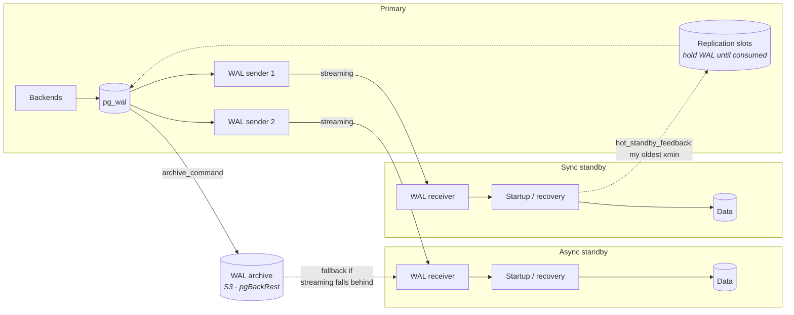

- **Physical replication ships WAL bytes.** The standby replays them, so it is a **byte-identical copy**: same tables, same indexes, same physical layout, same major version required. No filtering, no transformation.
- **Standbys are read-only and queryable** (`hot_standby = on`, the default), which is what makes read scaling nearly free.
- **Replication slots** guarantee the primary retains WAL a standby has not consumed yet. **They are the safest way to run replication and the most dangerous object in Postgres** ([§ Logical replication and CDC](#logical-replication-and-cdc), [§ Replication slot growth filling the disk](#replication-slot-growth-filling-the-disk)).
- **`hot_standby_feedback = on`** makes the standby report its oldest running transaction's xmin back to the primary, so the primary's vacuum will not remove rows the standby's queries still need. **The trade-off is exact and unavoidable:** with it off, long queries on the standby get cancelled; with it on, they instead cause bloat on the *primary*. **You are choosing which node absorbs the cost.**

**Replica conflicts and query cancellation:**

- The standby replays WAL that removes a row a running standby query needs. It waits up to `max_standby_streaming_delay` (default **30 s**), then **cancels the query**: `ERROR: canceling statement due to conflict with recovery`.
- **This is the single most common complaint about read replicas**, and there are only three real answers: raise `max_standby_streaming_delay` (accepting replication lag), turn on `hot_standby_feedback` (accepting primary bloat), or accept the cancellations and retry. `max_standby_streaming_delay = -1` means "wait forever" and lets a single analyst query stall replication indefinitely — occasionally correct on a dedicated reporting replica, never on a failover target.

**Synchronous and quorum commit:**

- **`synchronous_standby_names`** names which standbys must confirm. Syntax matters: `FIRST 1 (a, b)` = the first available of a preference list; **`ANY 2 (a, b, c)` = quorum**, any two of three.
- **`ANY 1 (a, b)` is the sweet spot for most setups** — zero data loss as long as one of two standbys is alive, and no single standby's failure stalls commits.
- **The trap with `FIRST 1 (a)` and one standby:** if that standby goes down, **every commit on the primary blocks forever**. Synchronous replication with a single standby converts a replica outage into a primary outage. Always have at least two candidates, or be prepared to `ALTER SYSTEM` under pressure.
- **Cost:** commit latency now includes a network round trip plus the standby's fsync. Same-AZ: ~1 ms. Cross-region: 50–100 ms per commit, which changes what your application can do.

### Logical replication and CDC

- **Logical replication decodes WAL into row-level change events** via an output plugin, so it can replicate selected tables, across major versions, into a differently-shaped schema, or into a non-Postgres consumer. Requires `wal_level = logical`.
- **Publications and subscriptions** — `CREATE PUBLICATION p FOR TABLE orders;` on the source, `CREATE SUBSCRIPTION s CONNECTION '…' PUBLICATION p;` on the target. The subscriber takes an initial snapshot (a full copy) then streams.
- **Output plugins:** `pgoutput` is built in and used by native subscriptions and by Debezium's default connector; `wal2json` emits JSON and is common for bespoke consumers; `decoderbufs` for protobuf.

**What logical replication does not do — the list interviewers want:**

- **DDL is not replicated.** Add a column on the source and the subscriber breaks on the next change. Schema migration coordination is entirely yours.
- **Sequences are not replicated** (PG 16 improves this only partially) — a failover to a logical target hands out duplicate IDs unless you advance sequences manually. **This is why logical replication is not a drop-in HA mechanism.**
- **`TRUNCATE` needs explicit inclusion**, large transactions were not streamed until PG 14, and there is no automatic conflict resolution — a conflict simply **stops the subscription** until you intervene.
- **`REPLICA IDENTITY` governs what the `UPDATE`/`DELETE` event contains.** Default is the primary key. With `REPLICA IDENTITY FULL` you get the whole old row — necessary for tables without a PK and for CDC consumers that need before-images, but it **at least doubles WAL volume** for those tables.
- **Unchanged TOASTed values are omitted** from change events. A CDC consumer sees a placeholder rather than the 2 MB `jsonb` that did not change — and naive consumers write the placeholder into the target. `REPLICA IDENTITY FULL` fixes it, at the WAL cost above. **This is a genuinely nasty, silent data-corruption bug in CDC pipelines.**

**Debezium-based CDC pipelines and their failure modes:**

- **Shape:** Postgres → slot + `pgoutput` → Debezium connector → Kafka → consumers. Gives you an ordered, replayable, at-least-once change stream, and it is the standard way to feed search indexes, caches, and data warehouses without dual writes.
- **The initial snapshot** of a large table can take hours and historically locked; it also produces a burst that dwarfs steady-state volume.
- **Connector downtime is a disk-fill risk** — see below. This is the number-one Debezium incident.
- **At-least-once, so consumers must be idempotent.** Failover, restart, or offset rewind all replay events.
- **Ordering is per-table (or per-partition-key), not global.** Cross-table causal ordering is not something the pipeline gives you.

**Slot lag as a disk-fill hazard — know this cold:**

- **A replication slot is a promise: "I will keep every WAL segment until this consumer confirms it."** If the consumer stops — the replica is down, the Debezium connector crashed, someone created a slot for a test and forgot — **the primary keeps WAL forever** and `pg_wal/` grows without bound.
- **When `pg_wal` fills the disk, Postgres cannot write WAL, and a database that cannot write WAL shuts down.** Full outage, and recovery requires finding and dropping the slot, which is not obvious under pressure.
- **The mitigation is one setting:** `max_slot_wal_keep_size` (PG 13+, default `-1` = unlimited). **Set it.** Once retention exceeds the limit, the slot is **invalidated** — the consumer must be re-seeded from scratch, which is painful, but it is infinitely better than an outage. It converts a cluster-down incident into a rebuild-a-replica chore.
- **The monitoring query:**

      SELECT slot_name, active, wal_status,
             pg_size_pretty(pg_wal_lsn_diff(pg_current_wal_lsn(), restart_lsn)) AS retained
      FROM pg_replication_slots ORDER BY 4 DESC;

  Alert on `active = false` for more than a few minutes, and on `retained` crossing a fraction of your disk.
- **A logical slot also holds back the xmin horizon**, so an abandoned slot causes bloat and wraparound risk *in addition to* filling the disk ([§ MVCC, bloat, vacuum, and wraparound](#mvcc-bloat-vacuum-and-wraparound)).

### Backup and PITR

- **`pg_basebackup`** — a physical copy of the data directory, plus the WAL needed to make it consistent. Simple, single-threaded, no incremental support, no compression worth the name. Fine for seeding a replica; inadequate as a backup strategy above a few hundred GB.
- **WAL archiving** — `archive_mode = on` plus `archive_command` (or `archive_library` for streaming archivers) ships each completed 16 MB segment to durable storage. **Base backup + continuous WAL = point-in-time recovery.**
  - **The classic failure:** `archive_command` starts failing (S3 credentials expired, disk full at the destination). Postgres **retains every unarchived segment**, `pg_wal` grows, and the disk fills — the same outage shape as an abandoned slot. **Monitor `pg_stat_archiver.last_failed_time` and the count of `.ready` files in `pg_wal/archive_status/`.**
- **`pgBackRest` and `wal-g`** are what you should actually run: parallel backup and restore, incremental and differential backups, compression, encryption, direct S3/GCS targets, retention policies, and — critically — **backup verification**. `pgBackRest`'s `--delta` restore and per-file checksums are why it is the default recommendation.
- **Recovery targets:** `recovery_target_time`, `recovery_target_lsn`, `recovery_target_xid`, `recovery_target_name` (set by `pg_create_restore_point`). Plus `recovery_target_inclusive` and `recovery_target_action`.
- **Timelines are the concept people miss.** Every promotion creates a **new timeline** (a `.history` file). This is what makes it safe to recover to a point *before* a previous recovery — the WAL from the old and new timelines does not collide. When restoring, `recovery_target_timeline = 'latest'` follows promotions; a specific number lets you recover into an abandoned branch of history.
- **A backup you have not restored is not a backup.** Restore drills belong on a schedule, and the metric that matters is measured restore time for your actual data size, not backup success rate.

### High availability

- **Postgres ships no automatic failover.** Streaming replication and `pg_promote()` exist; the decision to promote is left to external software. Every HA story is therefore about the *external* component.
- **Patroni + a DCS (etcd, Consul, or ZooKeeper)** is the standard. Each node runs a Patroni agent that manages its Postgres, and the DCS holds a **leader key with a TTL** that the primary must keep renewing.
- **Split-brain prevention:**
  - **The leader lease.** A primary that cannot renew its key within the TTL **demotes itself**, so it stops accepting writes even if the network partitioned it away from everyone. This is the core mechanism.
  - **A hardware or software watchdog** kills the node if Patroni itself hangs, closing the gap between "agent stuck" and "Postgres still serving writes."
  - **`synchronous_mode`** ensures a promoted standby had the data, and `synchronous_mode_strict` refuses to fall back to async when no standby is available — trading availability for zero data loss, explicitly.
  - **DCS quorum** means the failover decision itself is made by a majority, not by a node that might be the isolated one.
- **Cloud-managed equivalents** (RDS Multi-AZ, Aurora, Cloud SQL HA) do the same job with synchronous storage-level or block-level replication, typically 30–120 s of failover time.

**Failover-induced data loss under async replication — say the number:**

- **Async replication means the primary acknowledges commits before the standby has them.** Steady-state lag is milliseconds; under write bursts or network hiccups it can be **seconds**.
- **On failover, everything in that gap is lost.** Transactions that returned success to users, that triggered emails and charged cards, simply do not exist on the new primary. **Your RPO is your replication lag at the moment of failure**, which is precisely the moment lag is most likely to be high — a load spike is a common cause of both.
- **The old primary is worse.** It may hold WAL the new primary never saw. Rejoining it requires `pg_rewind` (which **discards** the divergent transactions) or a full re-clone. Patroni does this automatically, meaning **committed data is discarded automatically**.
- **The choice is explicit and should be stated as such:** async gives fast commits and a non-zero RPO; sync (`ANY 1` quorum) gives **RPO zero** at the cost of network latency per commit and a hard dependency on standby availability. **There is no configuration that gives both**, and an interviewer asking about HA is usually asking whether you know that.

## Scaling Postgres

### Vertical first, and what saturates

- **Vertical scaling goes remarkably far** — 128+ cores, multiple TB of RAM, millions of IOPS. A very large fraction of companies never legitimately outgrow one Postgres primary.
- **What saturates, roughly in order:**
  - **Connections / context switching** — usually first, and solved by pooling ([§ Connection pooling](#connection-pooling)), not by hardware.
  - **Write throughput on the single WAL stream** — WAL is serial; one primary, one WAL. `fsync` latency and WAL device bandwidth set a ceiling that more cores cannot raise.
  - **Vacuum throughput** — at high churn, autovacuum stops keeping up before the CPU does ([§ Autovacuum](#autovacuum)).
  - **Lock contention on hot rows** — a counter row updated by every transaction serializes everything, at any hardware size.
  - **Memory for the working set** — once it stops fitting in `shared_buffers` + page cache, latency steps up sharply rather than degrading smoothly.
- **The order matters in an interview:** "we would scale up, and the first thing to saturate would be X" is a much stronger answer than jumping to sharding.

### Read scaling

- **Streaming replicas are the cheapest scale-out in Postgres.** Reads distribute nearly linearly; writes do not scale at all.
- **Routing** — at the application (a separate read datasource), at the pooler (pgpool-II, pgcat read/write split), or via DNS/service endpoints. Application-level routing is the most predictable, because only the application knows which reads tolerate staleness.
- **Lag-aware reads** — check `pg_last_xact_replay_timestamp()` or the LSN difference, and fall back to the primary when lag exceeds a threshold. Cheap to implement, and it converts a silent correctness problem into a load problem.
- **Read-your-writes is the hard part.** A user posts a comment (primary) and immediately reloads (replica, 200 ms behind) and their comment is gone. Options:
  - **Sticky reads after write** — route that user to the primary for N seconds. Simple, effective, and the usual answer.
  - **LSN tokens** — capture `pg_current_wal_lsn()` after the write, pass it with the request, and have the replica wait until `pg_last_wal_replay_lsn()` catches up. Precise, more plumbing.
  - **`synchronous_commit = remote_apply`** — guarantees replay before acknowledge, at the highest write latency.
- **Replicas are not free of the primary's problems.** Every write still happens on every replica: a replica does the same WAL work, so replication does not reduce write cost anywhere, and `hot_standby_feedback` pushes replica query cost back onto the primary's vacuum ([§ Physical replication](#physical-replication)).

### Partitioning

**Declarative partitioning (PG 10+, mature since 12) splits one logical table into physical child tables.**

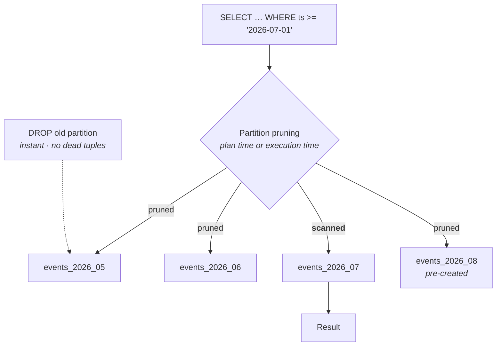

- **Range** — time-series, the dominant use. **List** — discrete categories such as region or tenant tier. **Hash** — even distribution when there is no natural range, used to spread write hotspots.
- **Partition pruning** eliminates partitions the query cannot match. **Plan-time pruning** needs literal or planner-visible values; **execution-time pruning** (PG 11+) handles parameters and nested-loop parameters, and shows in `EXPLAIN ANALYZE` as `Subplans Removed: 47`. **If you see all partitions scanned, your predicate does not reference the partition key** — the most common partitioning disappointment.
- **Partitionwise join** (`enable_partitionwise_join`, **off by default**) joins matching partitions pairwise when both sides are partitioned identically. **Partitionwise aggregate** (also off by default) aggregates per partition. Both are off because they increase planning time significantly; turn them on deliberately for analytical workloads on partitioned tables.

**The genuine wins — note that query speed is often not the main one:**

- **`DROP TABLE` on an old partition is instant and produces zero dead tuples**, versus a `DELETE` of 500 M rows that produces 500 M dead tuples and days of vacuum debt. **For retention management this alone justifies partitioning.**
- **Vacuum and index maintenance parallelize** across partitions, and each index is small enough to stay cached.
- **`CREATE INDEX` per partition** means you can build indexes on old partitions without touching the hot one.

**The costs, honestly:**

- **Planning time grows with partition count.** Thousands of partitions add milliseconds per query — a real problem for high-QPS OLTP. Keep it in the dozens-to-hundreds, not thousands.
- **The partition key must be in the primary key and in every unique constraint.** This is often a schema-breaking requirement discovered late.
- **Lock counts multiply** — a query touching many partitions takes many relation locks, which is how you exhaust `max_locks_per_transaction` ([§ Memory: shared versus per-backend](#memory-shared-versus-per-backend)).
- **Maintenance is a job you now own.** Partitions must be created *ahead of* the data — a missing future partition means inserts fail (or land in a `DEFAULT` partition that then cannot be split without a full scan). `pg_partman` automates creation and retention; use it rather than writing cron.
- **`ATTACH PARTITION` takes a brief `ACCESS EXCLUSIVE` on the parent** and, since PG 12, only `SHARE UPDATE EXCLUSIVE` on the child — but it **validates** the partition constraint with a full scan unless a matching `CHECK` constraint already exists. **Add the `CHECK` first, then attach**, and the scan is skipped. `DETACH PARTITION CONCURRENTLY` (PG 14+) avoids the long lock on removal.

### Sharding

- **Sharding is where the operational cost step-changes.** Everything before this is one database with more parts; sharding is a distributed system with all of §XI's problems.
- **Citus** — an extension turning Postgres into a distributed database with a coordinator and workers.
  - **Distributed tables** are hash-partitioned on a **distribution column** across workers.
  - **Reference tables** are replicated to every worker — for small dimension tables that everything joins against.
  - **Colocation is the whole game.** Tables sharded on the same column place matching shards on the same worker, so a join on that column is local. Join on anything else and you get a repartition or a broadcast, and the performance collapses.
  - **Best fit:** multi-tenant SaaS (shard by `tenant_id` — every query is naturally single-shard) and real-time analytics. **Worst fit:** workloads with no single dominant access key, or heavy cross-shard transactions.
  - **Limitations:** distributed transactions use 2PC with its coordinator-failure exposure; some SQL is unsupported or slow across shards; unique constraints must include the distribution column.
- **Application-level sharding** — you route to shard N yourself.
  - **Cheaper to start, more expensive forever.** You now own routing, cross-shard queries (fan-out plus merge in app code), cross-shard transactions (usually: give them up, or build sagas), **resharding** (the hard one — moving tenants between shards while online), per-shard schema migrations, per-shard backups, and N× the monitoring.
  - **Mitigations that actually work:** shard by tenant so almost every query is single-shard; use a **lookup table** mapping tenant → shard rather than modulo hashing, so you can move a tenant without rehashing everything; and keep one "shard 0" for global data.
- **In an interview:** exhaust vertical scaling, read replicas, partitioning, caching, and moving the analytical workload elsewhere *before* proposing sharding — and say that you would. Proposing sharding first is the most common way to sound junior on a Postgres question.

### Postgres as a general-purpose substitute

- **`LISTEN` / `NOTIFY`** — in-database pub/sub. Notifications are delivered **at commit**, which makes them transactionally consistent with your writes. **Limits:** payload ≤ 8000 bytes, an 8 GB queue cap, **no persistence** — a disconnected listener misses everything, with no replay — and it does not work through transaction pooling ([§ What breaks under transaction pooling](#what-breaks-under-transaction-pooling)). **Correct for cache invalidation and "wake up, there is work"; wrong as a message bus.**
- **`jsonb`** — binary JSON with containment/path operators and GIN indexing. Genuinely good: schema flexibility without a second database, and you can index into it. **Costs:** larger than normalized columns, TOAST/detoasting overhead ([§ TOAST](#toast)), poor statistics inside the document so row estimates for `@>` are crude, and **updating one key rewrites the entire document** (and its TOAST chunks). Use it for genuinely variable attributes, not as a way to avoid designing a schema.
- **Full-text search** — `tsvector`/`tsquery` with GIN, stemming, ranking, and multiple languages. **Good enough for most applications**; it lacks distributed indexing, sophisticated relevance tuning, fuzzy-by-default matching, and the analyzer ecosystem of Elasticsearch. `pg_trgm` covers typo tolerance. The line is roughly: site search, yes; search *as the product*, no.
- **`pgvector`** — [§ Extensions worth naming](#extensions-worth-naming).

**When "just use Postgres" is right:**

- One data store means one backup story, one failover story, one set of credentials, one consistency model, and **transactional consistency across everything** — the search index cannot drift from the source of truth, because it *is* the source of truth.
- Team size and operational maturity are the real constraint. Two engineers running one Postgres beats two engineers running Postgres + Elasticsearch + Kafka + Redis + a vector DB.
- Scale is below the specialized system's threshold, which is far higher than most people assume.

**When it is not:**

- **Workload isolation is impossible** — the analytics that would kill your OLTP latency need their own system, and a replica only postpones the question.
- **The specialized system's core competency is your product's core competency** (search relevance, time-series compression, stream replay).
- **The access pattern fights the architecture** — millions of tiny counter updates (MVCC write amplification), append-only 100 TB analytics (row store, vacuum), true multi-region active-active writes (single primary, full stop).
- **A component is orders of magnitude better, not just better.** Redis for a hot counter is ~50× faster (Lecture 12); that is a different category, not a tuning gap.

## Operational failure modes worth knowing by name

Each of these has a name, a signature, and a diagnosis query. Being able to name one unprompted is worth more in an interview than any amount of architecture vocabulary.

### Connection storm and pool exhaustion

- **Signature:** `FATAL: sorry, too many clients already`; CPU high with throughput low; latency climbing across *all* queries simultaneously.
- **Mechanism:** something slows down slightly → requests queue in the application → the app opens more connections → each connection costs memory and scheduling → the database slows further → more connections. **A positive feedback loop that turns a 50 ms blip into a total outage in under a minute.**
- **Aggravator:** a restart or deployment. Every pod reconnects at once, and `fork()` plus authentication for 500 simultaneous connections is itself a load spike.
- **Diagnosis:** `SELECT state, count(*) FROM pg_stat_activity GROUP BY state;` — the state distribution tells you which of [§ Connection storm and pool exhaustion](#connection-storm-and-pool-exhaustion)/[§ Idle-in-transaction sessions blocking vacuum](#idle-in-transaction-sessions-blocking-vacuum) you have.
- **Fix:** a pooler with a **small** pool ([§ Pool sizing](#pool-sizing)) so queueing happens outside the database; application-side connection caps and timeouts; exponential backoff with jitter on reconnect.

### Idle-in-transaction sessions blocking vacuum

- **Signature:** `pg_stat_activity` rows in state `idle in transaction` with `xact_start` hours old. Bloat growing everywhere, autovacuum running constantly and reclaiming nothing, `age(datfrozenxid)` climbing.
- **Mechanism:** an open transaction holds an xmin, which pins the global horizon. **Vacuum cannot remove any tuple dead only after that xmin — across the entire database, not just the tables that session touched.** One forgotten `BEGIN` in a debugging session bloats the whole cluster.
- **Common causes:** ORM opening a transaction at request start and holding it across an external HTTP call; a developer's psql session; a connection-pool health check that begins and never commits; an application that catches an exception and never rolls back.
- **Diagnosis:**

      SELECT pid, state, now() - xact_start AS xact_age,
             now() - state_change AS idle_for, left(query, 80)
      FROM pg_stat_activity
      WHERE state IN ('idle in transaction', 'idle in transaction (aborted)')
      ORDER BY xact_start;

- **Fix:** set **`idle_in_transaction_session_timeout = '5min'`** globally — this is close to a mandatory setting and almost nobody sets it. Also `statement_timeout` and, for locks, `lock_timeout`. Fix the application to keep transactions short and never span network calls.
- **The equivalent causes:** a long analytics query, `hot_standby_feedback` from a replica with a long query, an abandoned replication slot, and an orphaned `PREPARE TRANSACTION` all produce the identical symptom. Check `pg_prepared_xacts` — it is empty on most systems, and when it is not, that is your answer.

### Lock queue pileup behind a single DDL

- **Signature:** the whole application stops on one table. `pg_stat_activity` shows dozens of queries waiting, all with `wait_event_type = 'Lock'`, and one `ALTER TABLE` in the middle.
- **Mechanism ([§ Table-level locks and DDL](#table-level-locks-and-ddl)):** long `SELECT` holds `ACCESS SHARE` → `ALTER TABLE` requests `ACCESS EXCLUSIVE` and queues → **every subsequent query queues behind the ALTER**, because Postgres does not allow queue-jumping. The ALTER itself may take 5 ms once it starts; the outage lasts as long as the *original* query.
- **The cruel part:** it is not the DDL that is slow. Killing the ALTER fixes it instantly, and the postmortem then blames the wrong statement.
- **Diagnosis:** the `pg_blocking_pids()` query from [§ Deadlocks and lock diagnosis](#deadlocks-and-lock-diagnosis) — the root blocker is the pid that blocks others and is blocked by none.
- **Fix:** `SET lock_timeout = '2s'` before *every* DDL statement and retry in a loop; run migrations in a low-traffic window; never combine a migration with a long-running report; use `CONCURRENTLY` variants where they exist. Same applies to the final swap in `pg_repack`.

### Plan flips after statistics change

- **Signature:** a query that ran in 20 ms for months takes 40 s, with **no code deploy and no data-shape change**. Often follows an autoanalyze, a bulk load, or a version upgrade.
- **Mechanism:** the row estimate for a node crosses a cost threshold and the planner switches join method or scan type. The classic is a **nested loop chosen because the outer side was estimated at 1 row and is actually 500 000** — the inner side then executes half a million times.
- **Aggravators:** correlated columns estimated as independent ([§ Statistics in detail](#statistics-in-detail)); a generic plan cached for a skewed parameter ([§ Prepared statements and plan caching](#prepared-statements-and-plan-caching)); statistics reset by a major-version upgrade, which **does not carry statistics across** — running `ANALYZE` immediately after `pg_upgrade` is mandatory and frequently forgotten.
- **Diagnosis:** `pg_stat_statements` shows the mean time step-change and the exact query; `auto_explain` captures the new plan; compare estimate-versus-actual per node ([§ Reading EXPLAIN (ANALYZE, BUFFERS)](#reading-explain-analyze-buffers)).
- **Fix:** `ANALYZE` the table; raise `SET STATISTICS` on the offending column; add `CREATE STATISTICS` for correlated columns; consider `plan_cache_mode = force_custom_plan` for the skewed query. **Avoid `enable_nestloop = off` except as an emergency tourniquet** — it is a session-level sledgehammer that will cause a different incident later.

### Checkpoint and WAL write storms

- **Signature:** p99 latency sawtooth with a period exactly matching `checkpoint_timeout`; `pg_stat_bgwriter` showing `checkpoints_req` comparable to `checkpoints_timed`; disk write throughput spiking in the same rhythm; log lines "checkpoint complete: … write=3.2 s sync=41.7 s" where **`sync` being large is the tell**.
- **Mechanism:** too much dirty data accumulates between checkpoints; the flush saturates the storage device; `fsync` latency spikes; every committing transaction waits behind it.
- **A second mechanism** on top: right after each checkpoint, **full-page writes** ([§ WAL mechanics](#wal-mechanics)) multiply WAL volume, so the WAL device also spikes at exactly the same moment.
- **Fix:** raise `checkpoint_timeout` to 15–30 min and `max_wal_size` so that checkpoints are *timed* rather than *requested*; keep `checkpoint_completion_target = 0.9`; enable `wal_compression`; put WAL on a separate device if the storage layer allows; lower `bgwriter_delay` and raise `bgwriter_lru_maxpages` so more pages are written outside checkpoints.
- **The counterintuitive part:** making checkpoints *less* frequent reduces total I/O, because full-page writes dominate. Operators often tune the wrong direction.

### Replication slot growth filling the disk

- **Signature:** `pg_wal/` growing steadily and monotonically; `pg_replication_slots` showing a slot with `active = false`; eventually `PANIC: could not write to file "pg_wal/…": No space left on device` and the cluster shuts down.
- **Mechanism ([§ Logical replication and CDC](#logical-replication-and-cdc)):** an inactive slot forces WAL retention indefinitely. Typical causes: a replica that has been down for hours, a crashed Debezium connector, a slot created for a one-off migration and never dropped, or a logical subscriber that is simply too slow to keep up.
- **Why it is so dangerous:** it is slow (hours to days), silent (no error until the disk is full), and its failure is **total** — a Postgres that cannot write WAL cannot run. `pg_wal` filling the disk also blocks the recovery you are trying to perform.
- **Diagnosis:** the `pg_replication_slots` query from [§ Logical replication and CDC](#logical-replication-and-cdc), plus `du -sh $PGDATA/pg_wal`.
- **Fix:** set **`max_slot_wal_keep_size`** so an abandoned slot gets invalidated instead of taking the cluster down; alert on inactive slots within minutes; alert on retained WAL crossing 20% of the volume; and audit slots as part of decommissioning anything. **The emergency action is `SELECT pg_drop_replication_slot('name');`** — which permanently breaks that consumer, and is still the right call when the alternative is a shutdown.
- **The same disk-fill shape** comes from a failing `archive_command` ([§ Backup and PITR](#backup-and-pitr)). Check both when `pg_wal` is growing.

## Takeaways

- **Process-per-connection is the origin of the connection ceiling, and a pooler is a required architectural component, not a tuning knob.** Size the pool from cores (~`2 × cores`), not from client count, and know the transaction-pooling breakage list — prepared statements, session advisory locks, temp tables, `SET`, `LISTEN`.
- **`work_mem` is per node, per operation, per backend.** Four memory nodes × four parallel workers × forty concurrent queries is how a 64 MB setting asks the kernel for 50 GB and turns a config value into a cluster restart.
- **MVCC, bloat, autovacuum, and wraparound are one causal chain, and the master cause is anything holding the xmin horizon** — a long transaction, an `idle in transaction` session, `hot_standby_feedback`, or an abandoned replication slot. All four produce the same symptom: vacuum runs and reclaims nothing.
- **The autovacuum defaults are wrong on any large table.** 20% scale factor means 20 million dead tuples on a 100-million-row table before it starts, and 2 ms cost delay throttles it to roughly 40 MB/s of dirtying. The fix is almost always to make vacuum *more* aggressive.
- **Wraparound is not a throughput problem, it is a stuck-horizon problem** — and at 1 million XIDs remaining the cluster stops accepting writes entirely. Monitor `age(datfrozenxid)`, alert at 500 M.
- **Read the lowest node where estimate diverges from actual, and multiply by `loops`.** `BUFFERS` tells you whether you have an I/O problem or a plan problem, and those have completely different fixes.
- **Lock queues do not allow queue-jumping**, so one long `SELECT` plus one `ALTER TABLE` equals a full table outage. `lock_timeout` before DDL, always.
- **Async replication means your RPO equals your replication lag at the worst possible moment**, and `pg_rewind` discards committed transactions automatically on failover. Synchronous quorum (`ANY 1`) buys RPO zero for a network round trip per commit — there is no option that buys both.
- **A replication slot is a promise to retain WAL forever**, and an abandoned one fills the disk and stops the database. `max_slot_wal_keep_size` converts that outage into a rebuild.
- **"Just use Postgres" is right far longer than people think and wrong in specific, nameable places** — workload isolation, extreme write rates on hot rows, true multi-region writes, and anywhere the specialized system is orders of magnitude better rather than merely better.

**Next:** Redis — a single-threaded in-memory engine with the opposite set of trade-offs.
