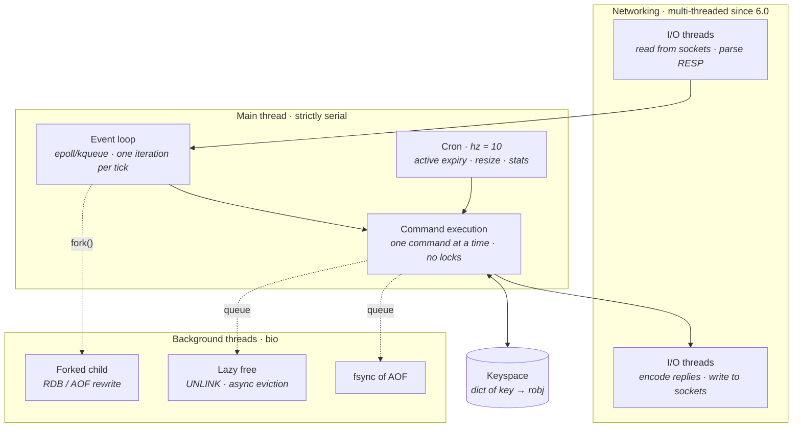
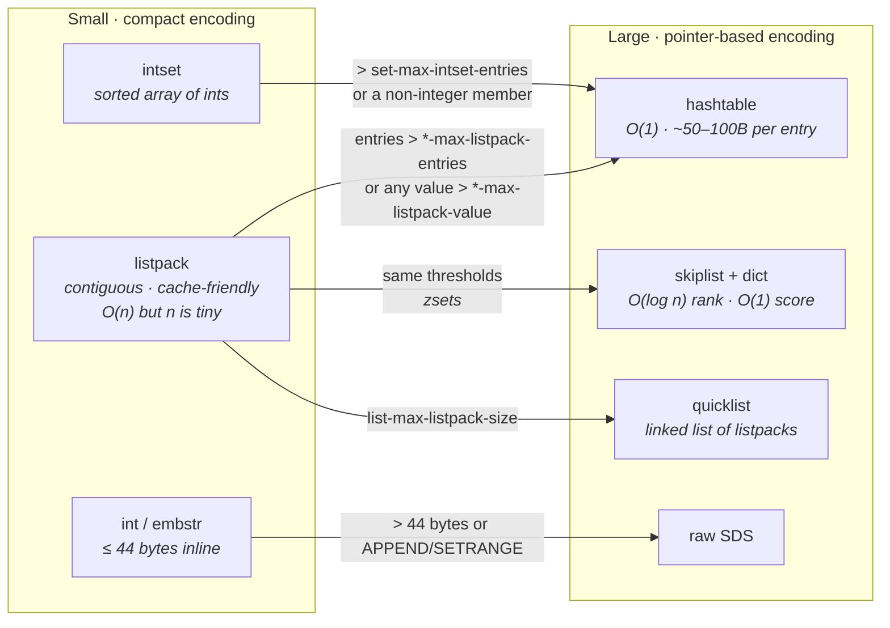
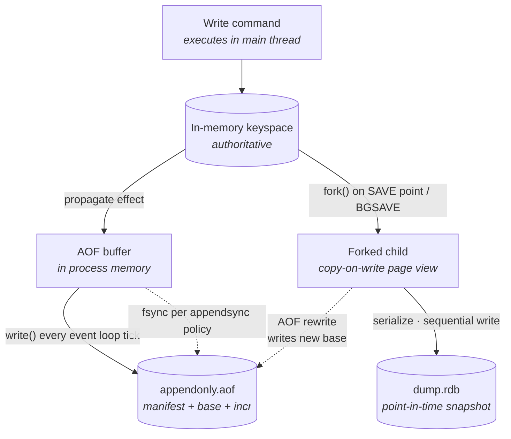
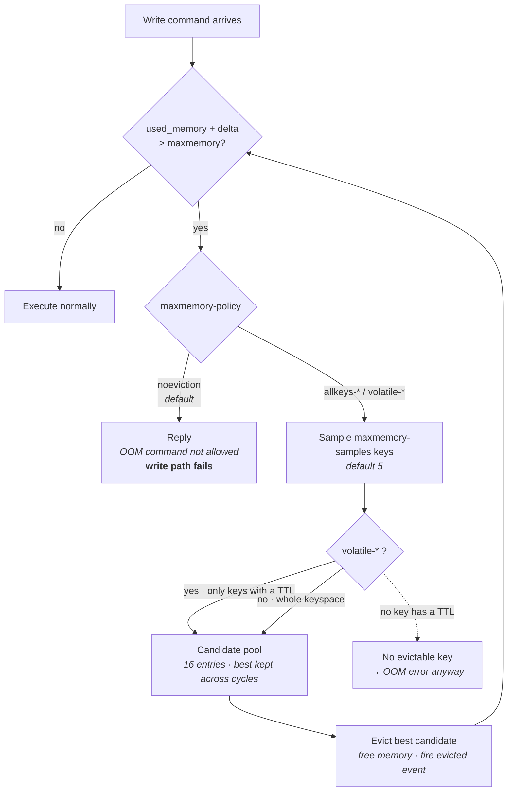
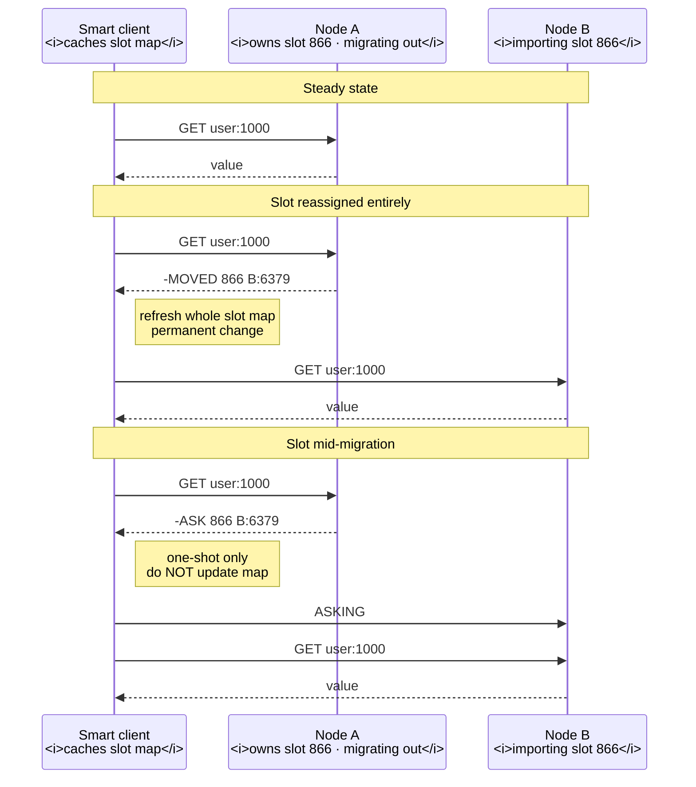
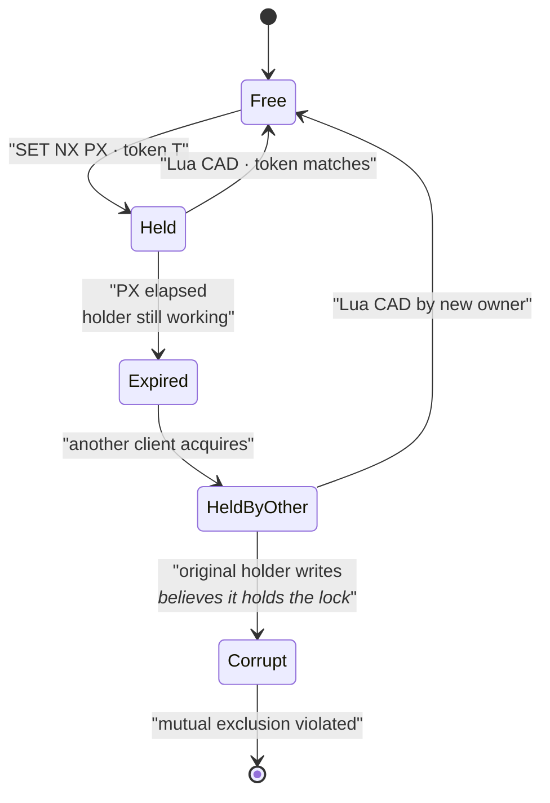

# Redis Deep Dive

Lecture 11 gave us Postgres: multi-process, disk-first, durable by default. A commit does not return until a log record is on stable storage, and the architecture spends most of its complexity budget on making that affordable. Redis inverts every one of those choices. It is **single-threaded** for command execution, **memory-first** — the authoritative copy of your data is RSS, not a file — and **durable only if you pay for it**, in fsyncs, in fork latency, and in acknowledged writes you agree to lose.

Nearly every Redis failure mode in this lecture is a corollary of those two facts. Single-threaded execution is why every command is atomic for free *and* why one `KEYS` on a ten-million-key instance is a multi-second outage for every other client. Memory-first is why a `GET` costs a microsecond *and* why a background save can double your RSS, why eviction is a policy decision you must make explicitly, and why "cache or database?" is not a philosophical question but a configuration one.

## The execution model

Redis runs your commands one at a time, in a single thread, on a single core. Everything below follows from that.



**Read the boundaries carefully — this is the whole architecture:**

- **The main thread is the only thing that touches the keyspace.** No latches, no mutexes, no concurrency control machinery. The dict is manipulated by exactly one thread, always.
- **I/O threads (6.0+) only do socket reads, RESP parsing, and reply encoding.** They never execute commands. `io-threads` defaults to `1` (meaning off); `io-threads-do-reads` defaults to `no`, so by default only reply *writing* is offloaded. This helps when you are syscall-bound at very high throughput; it does nothing for a slow command.
- **Background `bio` threads** handle only operations that are safe to detach: AOF fsync, freeing large objects, closing files. Again, no command execution.
- **`serverCron` runs at `hz` Hz (default `10`)** — active expiry, incremental rehashing, replication timeouts, stats. It shares the main thread, so it too is blocked by a slow command.

### Atomicity as a free consequence

- **Every command is atomic, by construction.** There is no interleaving point inside a command because there is no second thread to interleave with. `INCR` is atomic. `LPUSH` is atomic. `HINCRBY` on a 10,000-field hash is atomic.
- This is why Redis makes such a good **coordination primitive**. `SET key val NX PX 30000` either takes the lock or does not; there is no window between the existence check and the set.
- **Key distinction:** atomicity here means *isolation of a single command*, not transactional durability and not multi-command atomicity. `MULTI`/`EXEC` extends it to a batch ([§ Patterns and primitives](#patterns-and-primitives)), and Lua extends it to arbitrary logic ([§ Distributed locking](#distributed-locking)) — but both extend it by *holding the single thread longer*, which is the cost.
- **What you do not get:** rollback. If the third command in a `MULTI` fails at runtime, the first two stand. Redis has no undo log because it has no need for one — it never has to abort a transaction to break a deadlock, because it never has a deadlock.

### Blocking commands as a self-inflicted outage

The same property inverted: while one command runs, *the server is down for everyone*.

- **`KEYS pattern` is `O(n)` over the entire keyspace.** On 10M keys, expect roughly 1–3 seconds of total server stall. Every other client's p99 becomes that number. Use `SCAN` — cursor-based, `O(1)` amortized per call, guarantees every key present for the whole iteration is returned at least once, makes no guarantee about keys added or removed mid-iteration, and may return duplicates.
- **`DEL` on a large collection is `O(n)` in elements, not keys.** Deleting a 5M-element set frees 5M allocations on the main thread. Use `UNLINK`, which unlinks the key in `O(1)` on the main thread and queues the free to a `bio` thread. Enable `lazyfree-lazy-eviction`, `lazyfree-lazy-expire`, `lazyfree-lazy-server-del`, and `replica-lazy-flush` so that eviction, expiry, implicit overwrite, and replica flush take the same path.
- **`FLUSHALL`/`FLUSHDB` accept `ASYNC`.** The synchronous form on a 50 GB instance is a multi-second freeze.
- **Long Lua scripts hold the thread for their entire duration.** A script that loops a million times is a million-iteration stall. `busy-reply-threshold` (formerly `lua-time-limit`, default `5000` ms) does *not* kill the script — it merely starts replying `BUSY` to other clients, and only `SCRIPT KILL` (if the script has not written) or `SHUTDOWN NOSAVE` (if it has) ends it. A script that has already written is unkillable without losing the instance.
- **Other `O(n)` traps:** `SMEMBERS`, `HGETALL`, `LRANGE key 0 -1`, `ZRANGE` over a huge range, `SORT` without `BY nosort`, `SINTERSTORE` on large sets. Each is fine on 100 elements and an outage on 10 million.
- **Rule of thumb:** any command whose complexity mentions `n` where `n` is a collection you do not bound is a latent outage. Bound the collection, or use the cursor variants (`HSCAN`, `SSCAN`, `ZSCAN`).
- **Instrument it:** `slowlog-log-slower-than` defaults to `10000` microseconds. Lower it to `1000` and read `SLOWLOG GET` in production — it is the single highest-value Redis diagnostic. `latency-monitor-threshold` plus `LATENCY DOCTOR` attributes stalls to *causes* (fork, expire-cycle, command, AOF write).

### Pipelining and round-trip amortization

- **The dominant cost of a small Redis command is not the command — it is the network round trip.** A `GET` executes in ~1 µs; the RTT within a datacenter is 100–500 µs. You are 99% idle waiting.
- **Pipelining** sends *N* commands without waiting for intermediate replies, then reads *N* replies. Throughput goes from `1/RTT` to bounded by CPU and bandwidth — commonly a 10–50× improvement, from ~10k ops/sec/connection to several hundred thousand.
- **Batch size matters in both directions.** Too small and you have not amortized; too large and you build a huge reply in the client output buffer and blow past `client-output-buffer-limit` or add a latency spike. Batches of 100–1000 are the usual sweet spot.
- **The trap:** pipelining is *not* a transaction. Other clients' commands can interleave between your pipelined commands. If you need no interleaving, use `MULTI`/`EXEC` or Lua.
- **Pipelining does not help a dependency chain.** If command *k+1* needs the reply to command *k*, you cannot pipeline — that is exactly the case where a Lua script (one round trip, server-side logic) wins.
- **In an interview:** "we made Redis 20× faster" is almost always "we stopped doing one round trip per operation." Say it explicitly.

## Memory allocator behavior and fragmentation

Redis does not manage its own pages the way a buffer-pool database does. It hands allocation to jemalloc and lives with the consequences.

- **jemalloc is the default and it is size-class based.** An allocation is rounded up to the next class — 8, 16, 32, 48, 64, 80, 96, 112, 128, then 192, 256, 320, … A 130-byte value occupies a 160-byte slot. Small waste per object, large waste across 100M objects.
- **`used_memory`** is what Redis asked the allocator for. **`used_memory_rss`** is what the OS has actually mapped. They diverge, and the divergence is the story.
- **`mem_fragmentation_ratio = used_memory_rss / used_memory`:**
  - `~1.0–1.5` — normal.
  - `> 1.5` — real fragmentation. Usually caused by a workload that wrote many differently-sized values, or by a mass deletion that freed objects scattered across pages the allocator cannot return.
  - `< 1.0` — **the alarming case.** Part of the process is swapped to disk. See [§ Eviction storms and hit-rate collapse](#eviction-storms-and-hit-rate-collapse).
- **Active defragmentation** (`activedefrag yes`) makes jemalloc relocate allocations to compact pages, incrementally, on the main thread. Gated by `active-defrag-ignore-bytes` (default `100mb`) and `active-defrag-threshold-lower` (`10`%) / `-upper` (`100`%), with CPU capped between `active-defrag-cycle-min` and `-max`. It costs CPU on the thread that serves your traffic — enable it deliberately, not by default.
- **Restart is the other defragmenter.** A reload from RDB rebuilds the keyspace densely; RSS after a restart is often 20–30% below RSS before it. That is a legitimate operational tool and also an admission of what fragmentation costs.

## Data structures and their encodings

Redis is not a key/value store, it is a *data-structure server*. The value at a key has a type, and the type has an internal encoding that Redis switches automatically based on size. Knowing the thresholds is the difference between a 100 MB instance and a 1 GB one.



**How to read the transitions:**

- **They are one-way.** Redis promotes from compact to general encoding and **never demotes**. Push a hash to 200 fields, then delete 199 of them, and it stays a hashtable — paying full per-entry overhead for one field. The only way back is to delete and rewrite the key.
- **A single oversized member converts the whole object.** One 100-byte value in a hash of eighty 8-byte values converts all of it to a hashtable.
- **The compact encodings trade asymptotics for constants.** A listpack lookup is `O(n)`, but with `n ≤ 128` and everything on two or three cache lines, it beats a hashtable that costs a pointer chase and a cache miss — while using roughly 5–10× less memory.
- **This is the single biggest memory lever in Redis.** Splitting one 10M-field hash into 100k hashes of ~100 fields each (bucket by a hash of the field name) keeps every bucket in listpack encoding and can cut memory by 5–8× for the same logical data.

| Type | Compact encoding | Threshold config (defaults) | Promotes to |
|---|---|---|---|
| String | `int` (shared for 0–9999), `embstr` | value ≤ `44` bytes, no in-place mutation | `raw` SDS |
| **Hash** | **`listpack`** | **`hash-max-listpack-entries 128`, `hash-max-listpack-value 64`** | **`hashtable`** |
| List | `listpack` → `quicklist` | `list-max-listpack-size 128` (or `-2` = 8 KB/node) | `quicklist` of listpacks |
| Set (ints only) | `intset` | `set-max-intset-entries 512` | `listpack` or `hashtable` |
| Set (general) | `listpack` | `set-max-listpack-entries 128`, `set-max-listpack-value 64` | `hashtable` |
| Sorted set | `listpack` | `zset-max-listpack-entries 128`, `zset-max-listpack-value 64` | `skiplist` + `dict` |

The hash row is bolded because it is the one you will actually exploit: hash bucketing is the standard trick for storing tens of millions of small records in Redis affordably.

### Per-key overhead, and why key count matters more than value size

- **A key is not free.** Each top-level key costs, roughly: a `dictEntry` (~24 bytes, plus jemalloc rounding to 32), an SDS header plus the key string, a `robj` (16 bytes) for most types, and the allocator's rounding on the value. **Budget ~50–100 bytes of pure overhead per key** before any data.
- **A key with a TTL costs more** — it also lives in the `expires` dict, adding another ~32–40 bytes.
- **Consequence:** 10M keys holding a 4-byte integer each is not 40 MB. It is closer to 700 MB–1 GB. The overhead is 20× the data.
- **Consequence:** one hash with 1,000 listpack-encoded fields is dramatically cheaper than 1,000 keys — one `dictEntry`, one `robj`, and a contiguous blob for the fields.
- **`MEMORY USAGE key`** reports the sampled bytes for one key including overhead. `MEMORY DOCTOR` gives a coarse diagnosis; `INFO memory` gives the global picture; `redis-cli --bigkeys` scans for the largest key per type and `--memkeys` for the heaviest by bytes. `redis-cli --hotkeys` requires an LFU policy and reports access frequency.
- **Offline analysis:** dump an RDB and run `rdb --command memory` (the `rdbtools` family) for a full keyspace profile without touching production. Prefer this to any `KEYS`-based script.

### The command complexities that matter

- **Strings** — `GET`/`SET` `O(1)`. `APPEND` amortized `O(1)` (SDS over-allocates, doubling up to 1 MB then adding 1 MB). `SETRANGE`/`GETRANGE` `O(n)` in the affected span. Max string size is 512 MB (`proto-max-bulk-len`).
- **Lists** — `LPUSH`/`RPUSH`/`LPOP`/`RPOP` `O(1)`; that is the whole reason lists exist. `LINDEX`/`LSET` `O(n)`. `LRANGE` `O(S+N)` where `S` is the offset from the nearer end — `LRANGE key 0 99` on a 1M list is cheap; `LRANGE key 500000 500099` is not. `LREM` `O(n)`. `LPOS` `O(n)`.
- **Hashes** — `HGET`/`HSET`/`HDEL` `O(1)` (hashtable) or `O(n≤128)` (listpack, effectively constant). `HGETALL`/`HKEYS`/`HVALS` `O(n)` — the trap on a big hash. `HRANDFIELD` `O(n)` when count is large.
- **Sets** — `SADD`/`SREM`/`SISMEMBER` `O(1)`. `SMEMBERS` `O(n)`. `SINTER` `O(n·m)` in the worst case; `SINTERCARD` with `LIMIT` lets you stop early. `SPOP` with count `O(n)`. `SRANDMEMBER` with a negative count is `O(n)`.
- **Sorted sets** — `ZADD`/`ZINCRBY`/`ZREM` `O(log n)`. `ZSCORE` `O(1)` (there is a companion dict from member to score). `ZRANK` `O(log n)` via skiplist spans. `ZRANGE`/`ZRANGEBYSCORE` `O(log n + m)`. `ZUNIONSTORE`/`ZINTERSTORE` `O(n·k + m·log m)` — the expensive family. `ZRANGESTORE` and `ZRANDMEMBER` round out modern usage.
- **The one to internalize:** sorted sets give you `O(log n)` ranked insert *and* `O(1)` score lookup *and* `O(log n + m)` range scan. That combination is why leaderboards, priority queues, sliding-window rate limiters, and time-series indexes all reduce to a zset.

## Probabilistic and specialized types

- **Bitmaps** are not a type — they are `SETBIT`/`GETBIT`/`BITCOUNT`/`BITPOS`/`BITOP`/`BITFIELD` operating on a string's bits. 
  - **Use:** dense per-user boolean state. Daily-active-users for 10M users is a 1.25 MB string, and `BITOP AND` across 30 days gives 30-day retention in one command.
  - **The trap:** `SETBIT key 4000000000 1` immediately allocates 500 MB, because strings are dense. Bitmaps are only cheap when the ID space is dense and small. Sparse IDs belong in a set or a Roaring-bitmap module.
  - `BITCOUNT` is `O(n)` over the string — bounded, but bound it deliberately with the `start`/`end` byte range.
- **HyperLogLog** estimates cardinality of a multiset in **fixed 12 KB** (dense encoding) with **0.81% standard error**, up to ~2⁶⁴ distinct items. Sparse encoding keeps small HLLs far under 12 KB.
  - `PFADD` `O(1)`, `PFCOUNT` `O(1)` for one key, `PFMERGE` `O(n)` in registers. Merging is lossless with respect to the HLL structure, which is the killer property: per-hour HLLs merge into a per-day HLL exactly.
  - **The trade:** you get counts, never membership, never the elements. And `PFCOUNT` on a single key may write (it caches the estimate), so it is not a read-only command on a replica.
- **Geospatial** is a sorted set with a 52-bit geohash as the score. `GEOADD`, `GEOSEARCH` (which replaces the deprecated `GEORADIUS`) `O(N + log M)`.
  - **Consequence of the representation:** all the zset commands work on a geo key, and `GEODIST`/`GEOPOS` decode the score. There is no separate index and no separate memory model.
  - **The limitation:** it is a single flat index. No filtering by attribute, no ranking beyond distance — for that you want RediSearch ([§ Modules](#modules)) or a real spatial database.

## Streams, pub/sub, and lists as a queue

### Streams

A stream is an append-only log stored as a radix tree of listpack-packed entries — Redis's answer to "I want Kafka semantics without a Kafka."

- **Entry IDs are `<millisecondsTime>-<sequence>`**, monotonically increasing, generated by `XADD key * field value`. You may supply explicit IDs; they must increase. `XADD` is `O(1)`.
- **Reading without a group:** `XRANGE`/`XREVRANGE` `O(log n + m)`, `XREAD` for tailing with `BLOCK` and `$` for "only new entries."
- **Consumer groups** are the real feature. `XGROUP CREATE key group $|0` establishes a group with its own cursor. `XREADGROUP GROUP g c COUNT n STREAMS key >` delivers *unread* entries to consumer `c` and — critically — records them in the group's **pending entries list (PEL)**.
- **The PEL is the at-least-once machinery.** An entry stays in the PEL, tagged with its consumer and a delivery time and count, until `XACK key group id` removes it. Crash before the ack and the entry is still pending.
- **Recovery:** `XPENDING` inspects the PEL (summary form is `O(1)`; the extended form scans). `XCLAIM` reassigns entries older than a min-idle-time to a live consumer. `XAUTOCLAIM` (6.2+) does the scan-and-claim in one cursor-based command and is what you should actually use.
- **Delivery semantics: at-least-once, with an explicit poison-message problem.** The PEL's delivery counter is how you detect an entry that has killed three consumers in a row; there is no built-in dead-letter queue, so you build one by claiming and re-`XADD`ing to a failure stream.
- **Trimming:** `XADD key MAXLEN 10000 *` is `O(n)` in trimmed entries; `XADD key MAXLEN ~ 10000 *` is **`O(1)` amortized** because it only removes whole radix-tree nodes — the `~` is nearly free and the exact form is not. `MINID` trims by ID (i.e. by time) instead, and `LIMIT` caps work per call. `XTRIM` does the same out of band.
- **The trap in trimming:** trimming is blind to consumer groups. Trim past an unacknowledged entry and it is gone, PEL reference and all. A capped stream is a *retention* policy, not a delivery guarantee — size the cap against your worst consumer lag, not your average.
- **Memory:** entries are stored in listpack-packed macro-nodes with field-name deduplication, so a stream of uniform-schema entries is far denser than the equivalent list of hashes.

### Pub/sub

- **`PUBLISH`/`SUBSCRIBE`/`PSUBSCRIBE` is strictly fire-and-forget.** The message is delivered to whoever is connected *at that instant* and then discarded. There is no persistence, no replay, no acknowledgment, no offset, no delivery count.
- **A subscriber that was disconnected for 200 ms lost 200 ms of messages, silently.** Nothing in the protocol will tell you.
- **A slow subscriber gets killed, not queued.** `client-output-buffer-limit pubsub 32mb 8mb 60` disconnects a subscriber whose output buffer exceeds 32 MB, or stays above 8 MB for 60 seconds. Publishing is also `O(N+M)` in subscribers and pattern-matches, on the main thread — a fan-out of 10,000 subscribers costs the main thread 10,000 buffer appends per message.
- **In Cluster, plain pub/sub is broadcast to every node** over the cluster bus, which does not scale. Use **sharded pub/sub** (`SPUBLISH`/`SSUBSCRIBE`, 7.0+), which routes by slot and stays on one shard.
- **The correct mental model:** pub/sub is a *signal*, not a *channel*. Use it for cache invalidation hints, config-change pokes, and presence — things where a missed message is recoverable by a subsequent full read. Never for work distribution.

### Choosing among the three

**When each queue shape is correct:**

- **List (`LPUSH` + `BRPOP`)** — a simple work queue, exactly one consumer per item, `O(1)` both ends. Cheapest and lowest-latency. **The failure mode:** `BRPOP` removes the item before your worker has done anything; crash mid-job and it is lost. `LMPOP`/`BLMPOP` and the `LMOVE`/`BLMOVE` reliable-queue pattern (move to an in-progress list, remove on completion, reap the in-progress list on a timer) fix this at the cost of a reaper.
- **Pub/sub** — broadcast to all live listeners, zero durability, zero replay. Signals only.
- **Streams** — persistent history, multiple independent consumer groups over the same data, at-least-once with explicit acks, per-consumer load balancing, replay from any ID. Heaviest, and the only one of the three with real delivery semantics.
- **Rule of thumb:** if you would be upset by losing a message, it is a stream — and if you would be upset by losing a *stream*, it is Kafka, because Redis Streams inherit Redis's replication model ([§ Memory management and eviction](#memory-management-and-eviction)) and therefore its acknowledged-write loss window.

## Modules

Redis's C module API lets extensions register commands, types, and even blocking behaviors with first-class status.

- **RediSearch** — an inverted index over hashes or JSON documents, with secondary indexing, aggregation, and vector similarity search. It is what turns Redis into a queryable store rather than a keyspace.
- **RedisJSON** — a real JSON type with path-based get/set, so you can update one field of a document without read-modify-write of the whole blob.
- **RedisTimeSeries** — downsampling, retention, and compaction rules for metric data, at far lower memory than the equivalent zsets.
- **RedisBloom** — Bloom and Cuckoo filters, count-min sketch, top-k. Probabilistic membership for the cases where a set is too expensive.
- **The honest costs:** modules run *on the main thread* and inherit every property of [§ The execution model](#the-execution-model) — a slow module command is a server-wide stall. They complicate upgrades, they must be present on replicas, they are not available on every managed offering, and licensing has been contested (RediSearch and friends have been under source-available licenses; check before you depend on one).
- **In an interview:** knowing modules exist prevents the mistake of proposing "Redis plus Elasticsearch" when RediSearch would do — and knowing their costs prevents the opposite mistake of assuming Redis is a search engine.

## Persistence

Memory-first means durability is opt-in and comes in exactly two mechanisms, both of which cost you something on the write path or the fork path.



**What each arrow costs:**

- **The keyspace is the source of truth.** Both files are derived. Neither is read during normal operation — only at startup.
- **The AOF is written from a buffer flushed once per event-loop iteration.** The `write()` is cheap; the **`fsync()` is the durability decision**, and it is separate.
- **`fork()` is the RDB and AOF-rewrite mechanism**, and it is the source of Redis's worst latency spikes ([§ RDB snapshots](#rdb-snapshots), [§ Fork-induced latency spikes](#fork-induced-latency-spikes)).
- **Replication is a third consumer of the same effects** ([§ Memory management and eviction](#memory-management-and-eviction)) — the replication stream carries the same rewritten commands the AOF does.

### RDB snapshots

- **A compact, point-in-time binary dump of the whole keyspace**, produced by a forked child so the parent keeps serving. Triggered by `SAVE` rules (`save 3600 1 300 100 60 10000` in Redis 7 — "after 3600s if ≥1 key changed, after 300s if ≥100, after 60s if ≥10000"), by `BGSAVE`, or by a replica's full sync.
- **The fork/copy-on-write mechanism:** `fork()` gives the child the parent's page tables marked read-only. The child sees a frozen view for free. Then, **every page the parent writes to is copied** — 4 KB per touched page.
- **The memory spike is proportional to your write rate during the save**, not to your dataset size in theory — but in practice a write-heavy instance can approach **2× RSS** while a save runs. Plan capacity for it: keep `maxmemory` at roughly 50–60% of machine RAM if you take snapshots under write load, or use a replica to do the snapshotting.
- **Transparent Huge Pages turn a 4 KB copy into a 2 MB copy.** THP inflates COW amplification by up to 512× and inflates fork-induced latency accordingly. **Disable THP** (`never`) on any Redis host. Redis logs a warning at startup if you have not.
- **The fork call itself is not free.** It must copy page tables: roughly **10–20 ms per GB of RSS** on a bare-metal host, and considerably worse on EC2/virtualized instances with hardware-assisted paging. Read `latest_fork_usec` from `INFO stats` — that number *is* the stall your p99 saw.
- **The loss window is the entire inter-snapshot interval.** Crash 59 minutes after the last save under a `3600 1` rule and you lose 59 minutes. That is the whole trade: RDB is cheap and fast to load, and lossy by design.
- **What RDB is good at:** compactness (a fraction of AOF size), fast restart (it loads at hundreds of MB/s), and being a clean artifact to copy for backups or to seed a replica.

### AOF

- **An append-only log of the write commands** — actually of their *effects*: `SPOP` is rewritten as `SREM` with the chosen member, `EXPIRE` as an absolute `PEXPIREAT`, so replay is deterministic.

**`appendfsync` is the durability/latency dial, and there are exactly three settings:**

- **`always`** — fsync before replying to every write. Real per-command durability. Cost: you are now bounded by device fsync latency, typically dropping from >100k ops/sec to a few thousand on network storage. Almost nobody runs this.
- **`everysec`** *(default)* — a `bio` thread fsyncs once per second. **Worst-case loss window is up to two seconds**, not one, because a write can be buffered just before a delayed fsync. This is the setting you want.
- **`no`** — never fsync explicitly; the kernel flushes on its own schedule (~30 s on Linux). Fastest, and the loss window is now the OS's business.
- **The hidden stall in `everysec`:** if the background fsync is still running when the main thread wants to write the buffer, Redis delays the write rather than growing the buffer unboundedly (`no-appendfsync-on-rewrite` controls a related case). A slow disk therefore *does* block the main thread, even in the "async" mode. This is the most-missed AOF fact.

**AOF rewrite:**

- The AOF grows without bound as commands accumulate, so Redis periodically **rewrites** it — forking a child that serializes the current dataset into a new, minimal base file while the parent buffers concurrent writes and appends them afterward.
- Triggered by `auto-aof-rewrite-percentage 100` (rewrite when the file has doubled since the last rewrite) and `auto-aof-rewrite-min-size 64mb`.
- **Costs:** a second fork with the same COW spike as [§ RDB snapshots](#rdb-snapshots), plus real disk write amplification — you write the whole dataset again, on top of ongoing appends. On a write-heavy 30 GB instance this is a sustained multi-hundred-MB/s burst.
- **Redis 7 replaced the single file with a multi-part AOF** — a manifest plus a base file plus incremental files in `appenddirname` — which removes the old "write the buffer into the new file at the end" step and its associated stall.

### Hybrid persistence and restart time

- **`aof-use-rdb-preamble yes` (default since 4.0)** makes the AOF base an RDB-format dump with an AOF tail of subsequent commands. You get **RDB's compactness and load speed** for the bulk plus **AOF's ≤1s loss window** for the recent tail. There is no reason not to use it.
- **Restart-time is a real availability number.** RDB loads at roughly 1–2 GB per 10–20 seconds depending on structure; a pure AOF must *re-execute every command*, which can be several times slower. A 100 GB instance can take minutes either way — and during that time it is down, or, if you failover to a replica, serving from data whose freshness you should have measured.
- **Failure to plan for load time is the classic postmortem line.** Your "30-second failover" is 30 seconds of election plus four minutes of dataset load.
- **`redis-check-rdb` and `redis-check-aof --fix`** exist because truncated files after an unclean shutdown are common; `aof-load-truncated yes` (default) tolerates a partial final command.

### Cache or database? The persistence decision

**Everything above collapses into one question: what happens if this data disappears?**

- **If the answer is "we recompute it from the system of record, at a cost of a latency spike and some load on Postgres," it is a cache.** Then: persistence off or RDB-only, `maxmemory` set, an eviction policy that is *not* `noeviction`, TTLs on everything, and no alarm when the hit rate drops after a restart. Turning persistence *off* removes fork spikes entirely — a real performance benefit, not just a simplification.
- **If the answer is "we have lost customer data," it is a database.** Then: hybrid AOF with `appendfsync everysec`, `maxmemory-policy noeviction`, replicas, real backups of the RDB to object storage, and a tested restore procedure. And you should be able to say why this is Redis and not Postgres — usually because the access pattern is genuinely a data structure (a leaderboard, a stream, a rate limiter) rather than a relation.
- **The trap is the middle:** the "cache" that became the only place a piece of state lives — session tokens, in-flight job state, deduplication sets, an idempotency-key table. These accumulate silently. **Audit for them explicitly**, because eviction ([§ Replication](#replication)) will delete them without asking and without an error.
- **Key distinction:** persistence protects against *process restart*. Replication protects against *node loss*. They are different failures and you need both if the data matters — an AOF is useless if the disk it is on dies with the instance.

## Memory management and eviction

Memory-first means memory is finite and you must say what happens when it runs out. If you do not, Redis picks the option that surprises people most.



**The consequences of this loop:**

- **Eviction happens on the write path, in the main thread, before the command runs.** Freeing memory is therefore *your write's* latency, and if freeing a big key is slow, so is your write — which is precisely why `lazyfree-lazy-eviction yes` matters.
- **The loop repeats until under the limit.** A single write can trigger many evictions if it is large or if the deficit is large. That is the eviction storm of [§ Eviction storms and hit-rate collapse](#eviction-storms-and-hit-rate-collapse).
- **`volatile-*` with no TTL'd keys behaves exactly like `noeviction`** — errors, silently, at the worst possible time. This is a common production surprise.
- **The default is `noeviction`**, which for a cache means "start returning `OOM command not allowed when used memory > 'maxmemory'` to every write while reads keep working." A half-working cache is worse to debug than a full outage.

| Policy | Scope | Selection | Use it when |
|---|---|---|---|
| `noeviction` *(default)* | — | reject writes | Redis is a **database** and losing a key is a bug |
| **`allkeys-lru`** | all keys | approximated LRU | **General-purpose cache — the safe default** |
| `allkeys-lfu` | all keys | approximated LFU | Skewed popularity; resists one-off scans polluting the cache |
| `allkeys-random` | all keys | uniform random | Uniform access, or when you cannot afford the sampling |
| `volatile-lru` / `-lfu` / `-random` | keys with a TTL | as above | Mixed instance: cache entries have TTLs, durable keys do not |
| `volatile-ttl` | keys with a TTL | shortest remaining TTL first | Approximates "evict what was going to expire anyway" |

### Approximated LRU and LFU

- **Redis does not maintain a true LRU list.** A global doubly-linked list of every key would cost pointers per key and main-thread work on every access. Instead each `robj` carries a 24-bit `lru` clock field, and eviction **samples `maxmemory-samples` keys (default `5`)** and evicts the best one.
- **The candidate pool** (16 entries, retained across eviction cycles) makes sampling far more accurate than naive random-5 — good candidates found in one cycle survive into the next.
- **Accuracy versus CPU:** `maxmemory-samples 10` is close to true LRU at moderately higher CPU; `3` is noticeably worse. `5` is a deliberate default and is fine for most workloads.
- **LFU replaces the 24-bit field with 8 bits of logarithmic counter plus 16 bits of last-decay time.** The counter increments probabilistically — `lfu-log-factor` (default `10`) controls how fast it saturates, so a key accessed a million times and one accessed a hundred thousand times are distinguishable within 8 bits. `lfu-decay-time` (default `1` minute) halves counters over time so yesterday's hot key does not stay hot forever.
- **When LFU wins concretely:** a nightly batch job that reads a million cold keys will, under LRU, evict your entire hot working set. Under LFU it evicts *itself*, because those keys have a counter of 1. This is the single best reason to choose `allkeys-lfu`.

### Expiration

- **Two mechanisms, and you need both:**
  - **Lazy expiry** — on every key access, Redis checks the expiry and deletes if due. Free, but a key nobody touches occupies memory forever.
  - **Active expiry** — `activeExpireCycle` runs from `serverCron` at `hz` (default `10`) times per second. Per database it samples **20 keys with TTLs**, deletes those expired, and **repeats if more than 25% were expired**, up to a CPU budget (`ACTIVE_EXPIRE_CYCLE_SLOW_TIME_PERC`, 25% of a cycle's time). A fast cycle also runs before each event-loop iteration with a much tighter budget.
- **The consequence — expiry lag is real.** The 25%-threshold loop is a *probabilistic* guarantee: it converges toward "less than 25% of keys with a TTL are expired-but-present." If a million keys expire at the same instant, they are not all reclaimed at that instant. Memory stays high for seconds to minutes, and `DBSIZE` overcounts.
- **The failure mode:** synchronized TTLs. Every key written by an hourly job with `EX 3600` expires simultaneously, producing a memory cliff, a CPU spike from the expire cycle, and — worse — a **cache stampede** as every client misses at once. **What to do instead:** jitter your TTLs (`EX 3600 + rand(0, 600)`). This is one line of code that prevents a class of incidents.
- **Replicas do not expire keys on their own.** The primary decides and propagates an explicit `DEL`/`UNLINK`. A replica serving a logically-expired key will *report* it as missing to reads but still holds the memory. This is required for consistency: two nodes independently expiring would diverge.
- **`EXPIRE` semantics to remember:** writing a key with `SET` (without `KEEPTTL`) clears its TTL. `PERSIST` removes it. `RENAME` carries it. `TTL` returns `-1` for "exists, no expiry" and `-2` for "does not exist" — a distinction that catches people.

### OOM and swap

- **Redis's own OOM (`used_memory` over `maxmemory` with `noeviction`) is a write-path error**, recoverable, loud in the client, silent in the metrics if you are not watching error rates.
- **The kernel OOM killer is different and worse.** With no `maxmemory` set, or with `maxmemory` set too close to machine RAM to leave room for a fork's COW spike, the OOM killer picks the largest RSS on the box — Redis — and SIGKILLs it. You lose everything since the last snapshot, plus the load time.
- **Set `maxmemory` always.** Even on a "database" instance with `noeviction`, an explicit limit converts an unrecoverable kill into a recoverable error.
- **Swap is the latency catastrophe.** Redis assumes memory access is ~100 ns. A swapped-out page is a 100 µs–10 ms disk fault, **on the single thread that serves every client**. One swapped page in a hot code path multiplies your p99 by four orders of magnitude, and because it is one thread, the queue behind it grows without bound.
- **The diagnostic:** `mem_fragmentation_ratio < 1.0`, and `/proc/<pid>/smaps` showing non-zero `Swap`. **The fix is to not swap** — `vm.swappiness=0` or no swap at all, and correct capacity planning. A Redis that swaps should be considered down; it will fail health checks slowly and confusingly rather than cleanly.
- **`vm.overcommit_memory = 1`** is required, because `fork()` on a 20 GB Redis nominally requests 20 GB the child will never touch. Without overcommit, `BGSAVE` and AOF rewrite simply fail.

## Replication

Redis replication is **asynchronous, always**. There is no synchronous-commit mode. Every availability property follows from that.

- **Primary/replica, one primary per shard.** `REPLICAOF host port` starts it. Replicas are read-only by default (`replica-read-only yes`) and serve reads at the cost of unbounded staleness.
- **The replica applies the primary's *effect* stream** — the same rewritten commands the AOF records — into its own keyspace, then re-propagates to sub-replicas if chained.

### Full sync versus partial resync

- **Full sync** — the primary forks, produces an RDB, ships it, and buffers subsequent writes in the replica's output buffer. Costs a fork (with all of [§ RDB snapshots](#rdb-snapshots)'s COW spike), the full dataset over the network, and a full load on the replica. `repl-diskless-sync yes` (default in 7.0) streams the RDB straight to the socket instead of via a temp file, which helps when the disk is the bottleneck.
- **Partial resync (`PSYNC`)** — after a brief disconnect, the replica presents its replication ID and offset; if that offset is still inside the primary's **replication backlog**, the primary ships only the missing bytes.
- **`repl-backlog-size` defaults to `1mb`.** At 50 MB/s of replication traffic, that buffer holds **20 milliseconds** of history. Any disconnect longer than that forces a full sync. **This default is wrong for almost every busy instance** — size it to cover your realistic network blip, e.g. 128–512 MB for tens of seconds of cover.
- **The failure loop this produces:** network blip → backlog exhausted → full sync → fork → COW memory spike + latency spike → the spike causes another timeout → another full sync. Instances have been taken down by an undersized backlog alone.
- **Replication ID chaining (`PSYNC2`)** lets a promoted replica keep serving partial resyncs to its siblings using the old replication ID, avoiding a cluster-wide full-sync storm on every failover. This is why modern failovers are far cheaper than they were pre-4.0.

### Acknowledged-write loss, and the limits of `WAIT`

- **The primary replies `+OK` to a write before any replica has seen it.** If the primary dies in that window and a replica is promoted, the write is gone — permanently, and with no error ever surfaced to the client that wrote it.
- **The window is small (sub-millisecond in-datacenter) but it is not zero, and it widens exactly when you need it not to** — under load, during a fork, during network degradation, i.e. the conditions that precede a failover.
- **`WAIT numreplicas timeout`** blocks until *n* replicas have acknowledged all writes issued by this connection, returning the number that did. It is genuinely useful and it is **not** synchronous replication:
  - It is **after the fact**. The write already happened and is already visible to other readers. Learning "only 0 replicas acked" gives you no rollback.
  - It **does not prevent a failover from choosing a replica that lacked the write.**
  - It returns on **timeout** with a partial count, so the failure mode is a number you must actually check.
  - `WAITAOF numlocal numreplicas timeout` (7.0+) extends the idea to fsync-level acknowledgment, which is closer to what people wanted, and carries the same after-the-fact caveat.
- **`min-replicas-to-write` / `min-replicas-max-lag`** make the primary *refuse* writes when fewer than *n* replicas are within *lag* seconds. This is the only knob that trades availability for durability *before* the write, and it is the right one if losing writes is unacceptable.
- **In an interview:** when asked "can Redis lose acknowledged writes?", the answer is yes, by design, and the follow-up is to name `WAIT`, `WAITAOF`, and `min-replicas-to-write` and say precisely what each does and does not buy.

### Sentinel

- **A separate fleet of processes that monitor primaries and replicas and perform automatic failover.** Sentinel is not in the data path; it is a control plane.
- **Detection is two-staged:** a sentinel that misses `PING` responses for `down-after-milliseconds` marks the primary **subjectively down (`sdown`)**; when **quorum** sentinels agree, it becomes **objectively down (`odown`)**.
- **Two different counts, and confusing them is the classic mistake:** `quorum` is how many sentinels must agree the primary is *down*. Authorizing the failover requires a **majority of the total sentinel set** — so with 3 sentinels and `quorum 1`, you can detect with one but still cannot fail over without two. Run an **odd number, at least 3**, in distinct failure domains.
- **A leader sentinel is elected (Raft-like), promotes the best replica** — filtered by `replica-priority`, then by replication offset, then by run ID — and reconfigures the others to replicate from it.
- **Client rediscovery** is the part that bites: clients must ask a sentinel for the current primary address (`SENTINEL get-master-addr-by-name`) and must subscribe to `+switch-master` to learn about changes. A client library that resolves the address once at startup will keep writing to a demoted primary until its connection breaks.
- **Split-brain window:** an old primary that was partitioned away still accepts writes until it notices. Those writes are discarded when it rejoins as a replica and full-syncs from the new primary. `min-replicas-to-write` on the primary is what bounds this.

## Cluster and sharding

One core and one machine's memory eventually run out. Redis Cluster is the built-in answer: **shard the keyspace, run the shards independently, and push routing into the client.**

### Hash slots

- **The keyspace is divided into exactly `16384` hash slots.** `slot = CRC16(key) mod 16384`. Each primary owns a contiguous-ish set of slots; every key deterministically belongs to exactly one.
- **Why a fixed slot count and not consistent hashing?** Slots are cheap to enumerate and to move. Ownership is a 16,384-bit bitmap — 2 KB — gossiped between nodes, so every node knows the full map and can redirect precisely. Resharding moves *slots*, not hash ranges, so it is exact and resumable.
- **Why 16384 specifically?** The bitmap is exchanged in every cluster-bus heartbeat; 2 KB is acceptable to gossip at high frequency, 65,536 slots would be 8 KB, and Redis's designers did not expect clusters beyond ~1000 nodes — which 16,384 slots divides comfortably.
- **Nodes gossip on the cluster bus** at `port + 10000`, exchanging heartbeats, slot maps, and failure reports. A node is `PFAIL` when one node cannot reach it for `cluster-node-timeout` (default `15000` ms) and `FAIL` when a majority of primaries agree — at which point one of its replicas is elected to take over its slots.

### MOVED, ASK, and smart clients



**The distinction is the most commonly missed detail in Redis Cluster:**

- **`MOVED` is permanent** — "this slot now lives elsewhere." The client updates its cached slot map and every future key in that slot goes straight to the new node.
- **`ASK` is one-shot** — "this *particular key* has already been migrated, but the slot still belongs to me." The client must send `ASKING` immediately before the retried command (the importing node rejects un-`ASKING`ed requests for a slot it does not yet own), and must **not** update its slot map. Updating on `ASK` is a real client bug that produces thrashing during resharding.
- **Smart clients cache the map** from `CLUSTER SHARDS` (7.0+) or `CLUSTER SLOTS`, refresh on `MOVED`, and refresh periodically. **The pitfall:** refreshing on *every* `MOVED` during a large reshard produces a topology-refresh storm; good clients rate-limit it.
- **The alternative is a dumb client plus a proxy** ([§ Resharding and cluster-wide failure](#resharding-and-cluster-wide-failure)), which trades a network hop for not having to implement any of this.

### Hash tags and multi-key constraints

- **Multi-key commands work only when all keys are in the same slot.** Otherwise the node replies `CROSSSLOT Keys in request don't hash to the same slot`. This applies to `MGET`, `MSET`, `SINTER`, `ZUNIONSTORE`, `RENAME`, `SMOVE`, and — crucially — to `MULTI`/`EXEC` and to any Lua script's `KEYS`.
- **Hash tags force co-location.** If a key contains `{...}`, only the substring between the first `{` and the first following `}` is hashed. `{user:1000}:profile` and `{user:1000}:sessions` land in the same slot and can be operated on together.
- **The trade you just made:** you have created a manual partitioning scheme. Every key sharing a tag shares a shard, so a popular tag becomes a **hot shard that cannot be split** — the tag is the unit of distribution now, and no amount of resharding will divide it. Tag by the *smallest* entity that must be transactional, never by tenant or region.
- **Practical consequence for design:** in Cluster, "just use a Lua script" and "just use `MULTI`" stop being free. Any atomic operation must be designed against a slot boundary from the start. This is the single largest behavioral difference between standalone and Cluster mode, and it is worth stating explicitly in an interview.

### Resharding and cluster-wide failure

- **Slot migration is per-key and online:** mark the slot `IMPORTING` on the target and `MIGRATING` on the source, then repeatedly `CLUSTER GETKEYSINSLOT` and `MIGRATE` keys across. During the window, the source serves keys it still has and answers `ASK` for keys it has already moved. Finally `CLUSTER SETSLOT ... NODE` flips ownership and `MOVED` takes over.
- **A single huge key stalls migration.** `MIGRATE` serializes one key atomically and **blocks both nodes** for its duration — a 2 GB key is a multi-second freeze on two shards at once, and may exceed the migration timeout and fail repeatedly. Big keys are not just a memory problem; they make your cluster effectively unreshardable.
- **`cluster-require-full-coverage` defaults to `yes`:** if *any* slot is unserved, the **whole cluster** stops accepting commands. Safe, and surprising — one lost shard with no replica takes down 100% of traffic, not 1/N of it. Setting it to `no` degrades to partial service instead, which is usually what a cache wants and rarely what a database wants.
- **Cluster-wide failure needs a majority of primaries.** Losing a majority means no quorum to mark nodes `FAIL` or authorize promotions, so the cluster cannot heal itself. Deploy an odd number of primaries across at least three failure domains.
- **`cluster-allow-replica-migration`** lets a shard with spare replicas donate one to an orphaned shard automatically — a genuinely useful self-healing property worth knowing exists.
- **Other Cluster restrictions:** only database `0`, no `SELECT`, plain pub/sub broadcasts cluster-wide (use `SPUBLISH`), and `SCAN` iterates one node at a time so a full-keyspace scan is a client-side loop over shards.

### Client-side sharding and proxies

- **Client-side sharding** — the application hashes the key and picks a node. No cluster protocol, works with any Redis, and complete control. **Costs:** every client must agree on the hash function and node list, adding a node means a coordinated rebalance (mitigated by consistent hashing with virtual nodes), and there is no failover story unless you build one. This was the state of the art before Cluster and is now mostly legacy — with the exception of deliberately-independent shards, e.g. per-tenant instances.
- **Proxy approaches** — Twemproxy/nutcracker, Codis, Envoy's Redis filter, or a managed cluster-mode-disabled endpoint. A dumb client talks to one address; the proxy shards, pools connections, and hides topology.
  - **Wins:** trivially simple clients, connection multiplexing (very valuable when you have 5,000 app processes each wanting a pool), central place for topology changes.
  - **Costs:** an extra network hop (often +0.2–0.5 ms, which can double your p50), a new component to scale and make highly available, and reduced command surface — proxies typically drop or restrict multi-key commands, transactions, pub/sub, and blocking commands.
- **Rule of thumb:** default to Redis Cluster with a good smart client. Reach for a proxy when connection count, not throughput, is your problem. Reach for client-side sharding only when the shards are meant to be genuinely independent.

## Patterns and primitives

The reason Redis appears in system design answers is not that it is a fast cache — it is that a handful of primitives fall out of atomic data-structure commands.

### Caching patterns and TTL discipline

- **Cache-aside (lazy loading)** — read Redis; on miss, read the database, write to Redis with a TTL, return. Simplest, and the default. **Costs:** every cold key pays a miss, and the first requests after a deploy or restart hammer the database.
- **Read-through / write-through** — the cache layer owns the database access. Consistent, but couples cache and store, and write-through pays the cache write on every write even for data never read.
- **Write-behind** — write to Redis, flush to the database asynchronously. Fast writes, and **you are now a database** ([§ Cache or database? The persistence decision](#cache-or-database-the-persistence-decision)): a crash before flush loses acknowledged data.
- **Invalidation over expiration where correctness matters.** A TTL is an *upper bound* on staleness, not a consistency mechanism. If a write must be visible immediately, delete the key on write. The safe order is **write the database, then delete the cache key** — and, if you can tolerate the cost, delete again after a short delay (a "delayed double delete") to catch a concurrent reader that repopulated the key with a pre-write value between your write and your delete.
- **TTL discipline, concretely:**
  - **Every key gets a TTL** unless you have a specific reason otherwise. Untyped, untracked, immortal keys are how instances fill.
  - **Jitter every TTL** ([§ Expiration](#expiration)). Synchronized expiry is a stampede generator.
  - **Cache negative results too**, with a *short* TTL, or a single missing row becomes an unbounded database read amplifier.
  - **Stampede protection:** on miss, take a short lock ([§ Distributed locking](#distributed-locking)) so exactly one request recomputes while others wait or serve stale. Or refresh probabilistically before expiry ("early recompute"), so the key is never actually cold.
- **The hit-rate number that matters is not the average.** A 95% hit rate that collapses to 60% under a specific query shape means your database sees an 8× read multiplier during exactly that shape. Measure hit rate per key-prefix.

### Distributed locking

**The correct single-instance lock, and every part of it is load-bearing:**

- **Acquire:** `SET lock:resource <random-token> NX PX 30000`. `NX` makes acquisition atomic. `PX` guarantees the lock is eventually released even if the holder dies — **a lock without an expiry is a permanent outage waiting for one crash.** The **random token identifies the owner**.
- **Release must be conditional on ownership.** A plain `DEL lock:resource` is a bug: if your work took longer than the TTL, the lock has already expired and been granted to someone else, and your `DEL` releases *their* lock. Compare-and-delete atomically in Lua:

```lua
if redis.call("GET", KEYS[1]) == ARGV[1] then
  return redis.call("DEL", KEYS[1])
else
  return 0
end
```

- **Extension has the same shape** — a Lua script that compares the token and calls `PEXPIRE`. A "watchdog" that extends the lease while work is in progress is what production libraries (Redisson and friends) do.



**What this state machine is telling you:**

- **The `Expired → HeldByOther → Corrupt` path is not exotic.** It needs only one of: a GC pause, a hypervisor steal, a page fault, a slow disk write, or a network stall longer than your TTL. All of these routinely last seconds.
- **No amount of Redis-side cleverness removes that path**, because the lock service cannot observe what the holder is doing. This is the whole Redlock argument in one diagram.
- **The mitigation is not a better lock — it is a lock-aware resource.** See fencing, below.

**Redlock and the debate, stated fairly:**

- **The algorithm:** acquire the same lock on **N=5 independent Redis primaries**; you hold it if you got a majority (3) *and* the total acquisition time is well under the TTL; the effective validity is `TTL − elapsed − clock-drift-allowance`. Release everywhere on failure.
- **Kleppmann's criticism (2016)** rests on two points. First, **timing assumptions**: the algorithm's safety depends on bounded clock drift and bounded process pauses, and neither holds in an asynchronous system — a GC pause after acquisition but before the write produces the `Corrupt` state above regardless of how many nodes agreed. Second, **it is not fault-tolerant in the way it appears**: with no persistence, a crashed-and-restarted node forgets its locks and can grant the same lock twice, breaking the majority argument; with fsync-per-op persistence you have given up the performance that motivated Redis.
- **Antirez's rebuttal** grants the pause problem but argues it applies to *every* lease-based lock including ZooKeeper's, that the algorithm's use of elapsed-time measurement (not wall-clock comparison) makes it robust to reasonable drift, and that for the efficiency use case — "don't do this expensive work twice" — occasional double-execution is a cost, not a correctness failure.
- **Both are right about different questions**, and the resolution is to ask which use case you are in:
  - **Efficiency** — the lock is an optimization; a rare double-run means a duplicated email or a wasted CPU-minute. Redlock, or even a single-instance `SET NX PX`, is fine. Honestly, a single instance is usually fine: you have traded a rare double-run for the operational cost of five instances.
  - **Correctness** — a double-run corrupts data or double-charges a customer. **No lock alone is sufficient.** You need **fencing tokens**.
- **Fencing:** the lock service issues a monotonically increasing token with each grant (in Redis, an `INCR` on a counter under the same lock). The holder passes the token to the protected resource on every write, and **the resource rejects any write with a token lower than the highest it has seen**. The delayed holder from the state diagram arrives with token 33 after token 34 has already written; its write is refused. Mutual exclusion is now enforced where it can actually be enforced.
- **The catch, stated honestly:** fencing requires the downstream resource to participate. If it is S3, or a third-party payment API, you cannot fence — and the correct answer becomes **idempotency keys** at the resource instead, which is fencing's practical cousin.
- **In an interview:** "I would use `SET NX PX` with a token and Lua release; if a duplicate execution would be a correctness bug rather than a waste, a lock is not enough and I would add fencing tokens or an idempotency key at the sink" is the complete answer.

### Rate limiting

**Three implementations, increasing in fidelity and cost:**

- **Fixed-window counter** — `INCR ratelimit:{user}:{minute}` and `EXPIRE` on first increment; reject above the limit. `O(1)`, one key per user per window, trivially small. **The flaw:** a client can send the full limit at 11:59:59 and again at 12:00:00, achieving 2× the limit across a one-second boundary. Acceptable for coarse abuse prevention, not for protecting a fragile downstream.
  - **The subtle bug:** `INCR` then `EXPIRE` as two commands can leave an immortal key if the client dies between them. Do both in one Lua script, or use `SET key 0 EX 60 NX` followed by `INCR`.
- **Sliding-window log** — a sorted set per user; `ZREMRANGEBYSCORE key 0 (now - window)` to trim, `ZCARD` to count, `ZADD` to record. Exact, but memory is `O(requests in window)` per user — 1,000 req/min per user across 100k users is 100M zset members. Use only for low limits.
- **Sliding-window counter** — two fixed-window counters, weighting the previous window by the fraction of it still in view. `O(1)` memory, and the boundary error drops from 2× to a few percent. **The usual right answer.**
- **Token bucket** — a hash holding `tokens` and `last_refill`; on each request a Lua script refills by `(now − last_refill) × rate`, caps at capacity, and decrements if a token remains. `O(1)` memory (one small hash per user), supports **burst** explicitly via capacity, and is the only one of the four that models "you may burst to 100 but sustain only 10/s."
- **Why Lua is mandatory here:** read-then-write from the client is a race — two concurrent requests both read 9 tokens and both proceed. The refill-and-decrement must be one atomic unit, which means one script, which also makes it one round trip. `redis-cell` is a module implementing GCRA if you prefer not to maintain the script.
- **The Cluster constraint ([§ Hash tags and multi-key constraints](#hash-tags-and-multi-key-constraints)):** rate-limit keys must be in one slot per limiter, which they naturally are if you key by the subject — but a *global* rate limiter across all users is a single key, and therefore a single hot shard ([§ Hot keys and single-shard saturation](#hot-keys-and-single-shard-saturation)).

### Leaderboards, counters, and sessions

- **Leaderboards are the canonical sorted-set use.** `ZADD board score member` `O(log n)`; `ZREVRANGE board 0 9 WITHSCORES` for the top 10 in `O(log n + 10)`; `ZREVRANK board member` for a player's position in `O(log n)`. A 10M-player leaderboard is a few hundred MB and answers all three in microseconds. No relational database does the rank query in `O(log n)`; this is a case where Redis is not a cache but the correct primary store for a derived structure.
  - **Ties:** equal scores order lexicographically by member. If you need insertion-order tiebreaks, pack a timestamp into the score's low bits — floats give you 53 bits of exact integer, so a score in the high bits and a timestamp in the low bits works up to a point, and past that point use `ZRANGEBYLEX` with a composite member.
  - **Time-windowed boards** — one zset per period plus `ZUNIONSTORE` to roll up, with TTLs on the period keys.
- **Counters** — `INCR`/`INCRBY`/`HINCRBY` are atomic and `O(1)`, which removes the read-modify-write race entirely. For very high write rates on one counter, shard it into `N` keys and sum on read, trading read cost for removing a hot key ([§ Hot keys and single-shard saturation](#hot-keys-and-single-shard-saturation)).
- **Session stores** — a hash per session with a TTL refreshed on access. Fits Redis perfectly: small, hot, keyed, and naturally expiring. **The decision from [§ Cache or database? The persistence decision](#cache-or-database-the-persistence-decision) applies:** if losing sessions means logging everyone out, that is a real (if survivable) incident — so choose persistence and replication deliberately rather than by accident, and never run a session store under `allkeys-lru`.

### Transactions and scripting

- **`MULTI` queues commands; `EXEC` runs the whole queue as one atomic unit** — no other client's command interleaves. `DISCARD` throws the queue away.
- **What it is not:** there is no rollback. A command that fails at *runtime* (wrong type for the key) does not abort the others; the errors come back in the reply array and the rest still applied. Only a command that fails at *queue* time (syntax error, unknown command) aborts the whole `EXEC` — since Redis 2.6.5.
- **`WATCH key [key …]` provides optimistic concurrency.** After `WATCH`, if any watched key is modified by anyone before your `EXEC`, the `EXEC` returns nil and executes nothing. The pattern is: `WATCH`, read, compute in the client, `MULTI`, write, `EXEC`, and **retry on nil**. This is check-and-set, and the retry loop is not optional — omitting it is the standard bug.
  - **The cost of `WATCH`:** under contention the retry loop spins, and each iteration is a full round trip. Above modest contention a Lua script (which does not retry, because it does not race) is both simpler and faster.
- **Lua scripts (`EVAL`/`EVALSHA`, and Functions in 7.0+) are the general tool.** A script runs atomically, has read-your-writes within itself, and costs exactly one round trip regardless of how many commands it contains. That combination replaces `WATCH` loops, removes races, and amortizes network cost — three wins at once.
  - **`EVALSHA` plus `SCRIPT LOAD`** avoids shipping the script body every call. Handle `NOSCRIPT` by re-loading; every good client does this automatically.
  - **Functions (7.0)** are the modern form: registered libraries persisted in the RDB and replicated, so they survive restart and do not need client-side script management.
  - **Determinism:** scripts are replicated by *effect* since Redis 5, so non-deterministic commands are safe. Still, all keys a script touches must be declared in `KEYS` — Cluster routing depends on it ([§ Hash tags and multi-key constraints](#hash-tags-and-multi-key-constraints)), and a script that constructs key names from `ARGV` will work in standalone and break in Cluster.
- **The cost, and it is the same cost as everything else in this lecture:** a script holds the single thread for its whole duration. **Atomicity is purchased with blocking.** A 50 ms script is a 50 ms outage for every other client, and 20 of them per second means the server is one-third unavailable. Keep scripts to bounded, small work; never loop over an unbounded collection inside one.

### Keyspace notifications

- **Redis can publish events when keys change:** `notify-keyspace-events` with a flag string (`K` keyspace events, `E` keyevent events, `g` generic, `$` string, `l` list, `x` expired, `e` evicted, `A` for all except `m`). Events arrive on pub/sub channels like `__keyevent@0__:expired`.
- **They inherit every pub/sub caveat ([§ Pub/sub](#pubsub)): fire-and-forget, no persistence, no replay, no acknowledgment.** A consumer that was disconnected missed those events forever.
- **The `expired` event is not fired at expiry time — it is fired at *deletion* time.** Because of lazy plus active expiry ([§ Expiration](#expiration)), that can be seconds or minutes after the TTL elapsed. Any design that uses expiry events as a timer is a design with unbounded and invisible jitter.
- **In Cluster, events are emitted by the node owning the key**, so a consumer must subscribe on every node (or use sharded channels) to see everything.
- **They cost main-thread work proportional to event volume** — enabling `AKE` on a high-churn instance adds a publish to every single write.
- **What to do instead:** if you need reliable change notification, write to a **Stream** in the same Lua script or transaction that performs the mutation. You get persistence, consumer groups, replay, and acks — everything keyspace notifications lack.

## Operational failure modes

The named ones, with the numbers that make them recognizable in a graph.

### Hot keys and single-shard saturation

- **The shape:** one key — a global counter, a feature-flag blob, a celebrity's timeline, a global rate limiter — receives a disproportionate share of traffic. Because slot assignment is deterministic, **all of it lands on one shard**, and because that shard is one thread, it saturates at roughly **100k–200k ops/sec** while the other nineteen shards sit at 5% CPU.
- **The signature:** aggregate cluster CPU looks fine; one node is pinned at 100%; p99 on that node's slots is 50× the rest. `redis-cli --hotkeys`, `MONITOR` sampled briefly (never left running — it is itself a load), or `INFO commandstats` per node identifies the key.
- **Fixes, in order of preference:**
  - **Client-side local cache** with a short TTL (1–5 s) or Redis's own **client-side caching / tracking** (RESP3 `CLIENT TRACKING`, which invalidates via push messages). This removes the traffic entirely and is the only fix that scales without bound.
  - **Key sharding:** split `counter` into `counter:0`…`counter:15`, write to a random shard, sum on read. Turns one hot key into 16 warm ones — but note that without hash tags they land on different slots, which is the point.
  - **Replica reads** for read-hot keys, accepting staleness.
- **What does not work:** adding shards. A single key cannot be split by resharding, ever.

### Big keys and slow `O(n)` commands

- **The threshold to remember:** a collection above roughly **10,000 elements**, or a value above roughly **10 KB**, deserves scrutiny; above **1M elements** or **100 MB** it is a hazard. A 1M-member `SMEMBERS` is tens of milliseconds of total server stall plus a very large reply to serialize.
- **Big keys hurt in five separate places**, which is why they are worth eliminating rather than tolerating: the `O(n)` read, the `O(n)` delete (unless `UNLINK`), the `MIGRATE` stall during resharding ([§ Resharding and cluster-wide failure](#resharding-and-cluster-wide-failure)), the replication of a huge value, and the client output buffer needed to hold the reply.
- **Detection:** `redis-cli --bigkeys` (samples via `SCAN`, safe in production, reports the largest per type), `--memkeys` for byte-weighted, `MEMORY USAGE` for a specific key, or offline RDB analysis for the full picture.
- **Fixes:** bucket the collection across many keys ([§ Data structures and their encodings](#data-structures-and-their-encodings)), cap it (`LTRIM`, `ZREMRANGEBYRANK`, `XADD MAXLEN ~`), or accept it and always access it with cursors and ranges — never `*ALL`.

### Fork-induced latency spikes

- **The shape:** a periodic p99 spike, perfectly correlated with `BGSAVE` or AOF rewrite, of **10–20 ms per GB of RSS** just for the `fork()` page-table copy — 300–600 ms on a 30 GB instance, several seconds on a virtualized host with hardware-assisted paging.
- **Then the second-order effect:** during the save, every page the parent writes is copied. Under a high write rate the parent's RSS climbs toward 2×, which can trip `maxmemory` (triggering an eviction storm, [§ Eviction storms and hit-rate collapse](#eviction-storms-and-hit-rate-collapse)) or the kernel OOM killer ([§ OOM and swap](#oom-and-swap)).
- **Diagnose with `latest_fork_usec` and `rdb_last_bgsave_status` in `INFO`, plus `LATENCY HISTORY fork`.** If `latest_fork_usec` is a large fraction of your latency budget, that is not a coincidence.
- **Fixes:** disable THP (the single biggest win, and free); move snapshotting to a dedicated replica so the primary never forks; turn persistence off entirely if the instance is a cache ([§ Cache or database? The persistence decision](#cache-or-database-the-persistence-decision)); reduce instance size — **many small instances fork faster than one large one**, which is an underrated argument for sharding earlier than raw capacity requires; use `repl-diskless-sync` to avoid the disk leg.

### Eviction storms and hit-rate collapse

- **The shape:** memory reaches `maxmemory` and stays there. Every write now performs one or more evictions first ([§ Memory management and eviction](#memory-management-and-eviction)), so write latency climbs and CPU climbs with it. If writes outpace what sampling can free, you enter a sustained loop.
- **The compounding failure:** evicting hot keys drops the hit rate, which sends the misses to the database, which increases load and latency there, which increases the number of in-flight requests, which increases the write rate back into Redis. **Hit rate falling from 95% to 80% quadruples database read load** — that is the number that turns a Redis memory problem into a database outage.
- **Watch `evicted_keys` in `INFO stats`, and `keyspace_hits` / `keyspace_misses` as a ratio.** A nonzero and *rising* `evicted_keys` on a cache is normal; a step change is an incident.
- **Related failure — the cold-cache stampede:** a restart, a failover, or a mass expiry leaves the cache empty and every request misses simultaneously. The database sees a load spike it was never sized for. **What to do instead:** warm the cache before taking traffic, fail over to a replica with the data rather than to an empty instance, jitter TTLs ([§ Expiration](#expiration)), and put per-key stampede locks ([§ Distributed locking](#distributed-locking)) in front of expensive recomputations.
- **Also watch `rejected_connections` and `maxclients`** (default `10000`) — an eviction storm slows everything, connections back up, and you hit the client limit as a secondary symptom.

### Client-library pitfalls

The failures that are not Redis's fault and are nevertheless the ones you will actually hit.

- **Pool sizing.** A blocking client needs one connection per concurrent in-flight command. Too small and you queue in the client — invisible in Redis's own metrics, which will look perfectly healthy while your application times out. Too large and thousands of app processes × 50 connections exhausts `maxclients` and wastes ~20 KB of server buffer each. **Size the pool to your concurrency, not your throughput**, and alert on pool-wait time as a first-class metric.
- **Timeouts.** A missing socket timeout means a network black hole hangs a request forever and exhausts the pool behind it. Set a connect timeout (~100 ms in-datacenter), a command timeout of a few hundred milliseconds, and **make retries idempotent-only** — blindly retrying `INCR` double-counts. Prefer a circuit breaker to unbounded retries, because retrying into an overloaded single-threaded server is how a brownout becomes an outage.
- **Blocking commands versus timeouts.** `BRPOP`/`XREAD BLOCK` legitimately hold a connection for their block duration. They need a *separate pool*, or your command timeout will kill them and your pool will be permanently starved.
- **Cluster topology refresh.** A client that does not refresh its slot map after a failover keeps sending to a dead or demoted node. A client that refreshes on every `MOVED` during a reshard produces a `CLUSTER SLOTS` storm against the whole cluster. **Configure both periodic refresh (30–60 s) and adaptive refresh with rate limiting.** This is the single most common Cluster production problem, and it is a client configuration line.
- **DNS caching.** Managed Redis endpoints move behind a DNS name during failover. A JVM caching DNS forever (`networkaddress.cache.ttl=-1`) will pin to the old address indefinitely.
- **RESP protocol version.** RESP3 (`HELLO 3`) enables client-side caching push messages and better typed replies, but changes reply shapes for some commands. Know which one your client negotiates.
- **`MONITOR` left running in production.** It streams every command to a client, adding significant main-thread cost and an output buffer that can grow without bound. Use it for seconds, never leave it attached.

## Takeaways

- **Single-threaded execution is one property with two faces.** It hands you atomicity with no locks, no deadlocks, and no isolation levels — and it means every `O(n)` command you run is a full-server outage for its duration. Every Redis performance rule is downstream of this.
- **Redis's memory cost is dominated by key count and encoding, not by data.** Per-key overhead is 50–100 bytes, encoding transitions are one-way, and the `*-max-listpack-*` thresholds (128 entries / 64 bytes, defaults) are the biggest single lever you have. Bucket small records into hashes.
- **Durability is a configuration decision you must make on purpose.** Hybrid AOF with `appendfsync everysec` costs ≤1–2 seconds of loss; RDB alone costs the snapshot interval; neither protects against acknowledged-write loss on failover, because **replication is asynchronous and there is no synchronous mode.** `WAIT` reports; it does not guarantee.
- **`fork()` is Redis's most expensive operation and it is invisible in command metrics.** 10–20 ms per GB, up to 2× RSS under write load, 512× worse with THP enabled. Read `latest_fork_usec`, disable THP, and snapshot from a replica.
- **Set `maxmemory` and choose an eviction policy explicitly.** The default `noeviction` turns a full cache into half-broken writes; `volatile-*` with no TTLs behaves identically; `allkeys-lru` is the safe cache default and `allkeys-lfu` is better whenever a batch scan could evict your working set.
- **Redis Cluster makes atomicity a partitioning problem.** 16,384 slots, `MOVED` permanent versus `ASK` one-shot, and multi-key commands, `MULTI`, and Lua all constrained to a single slot. Hash tags fix co-location and create shards that can never be split.
- **A distributed lock is a lease, and a lease can expire while you still believe you hold it.** `SET NX PX` with a token and a Lua compare-and-delete is correct as far as any lock can be; when a double-execution would be a correctness bug rather than wasted work, the answer is **fencing tokens or idempotency at the resource**, not a better lock.
- **The choice between cache and database is the question that determines everything else** — persistence, eviction policy, replication topology, alerting, and whether a cold restart is a latency blip or a data-loss incident. Answer it before you configure anything.

**Next:** Kafka — the durable log, and the third distinct set of trade-offs.
