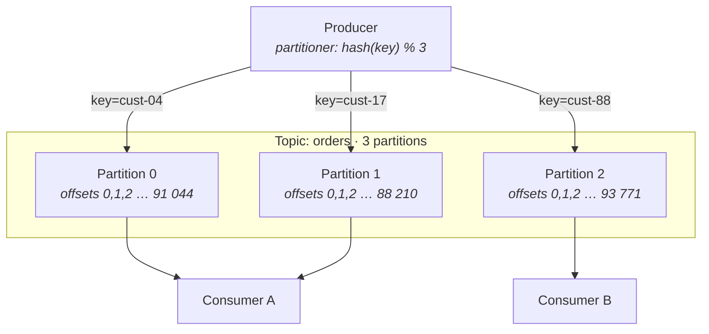
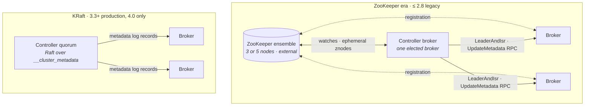
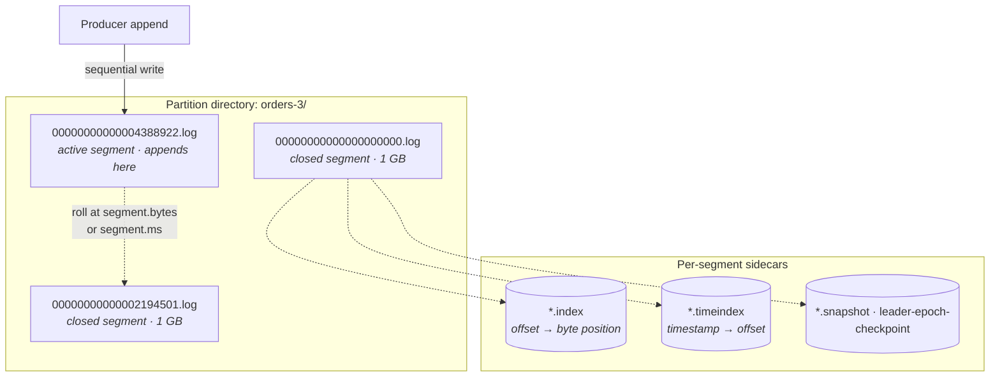
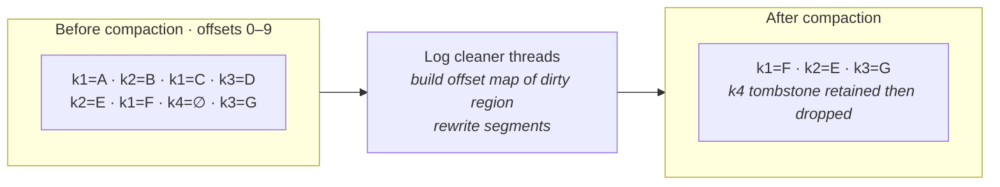
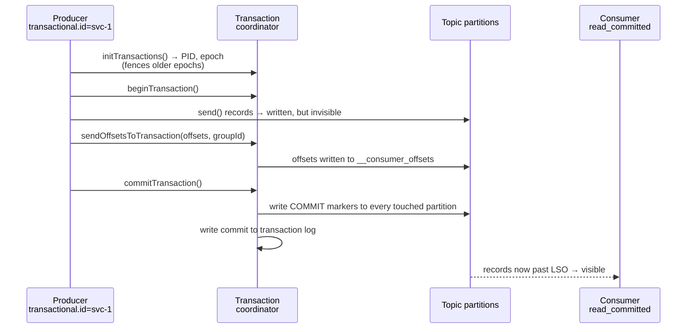
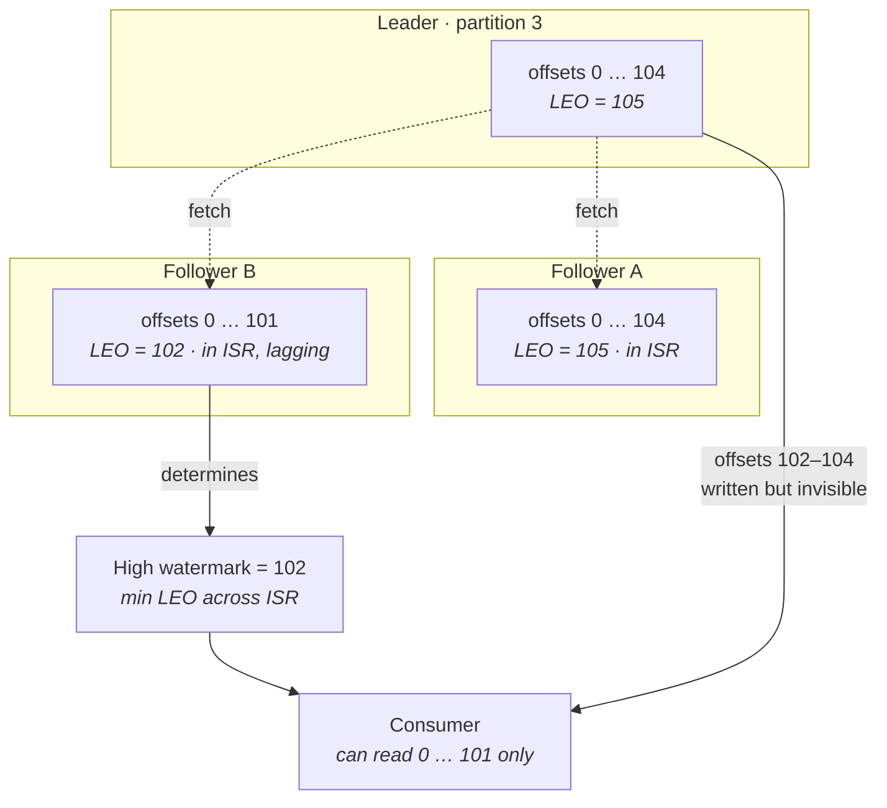
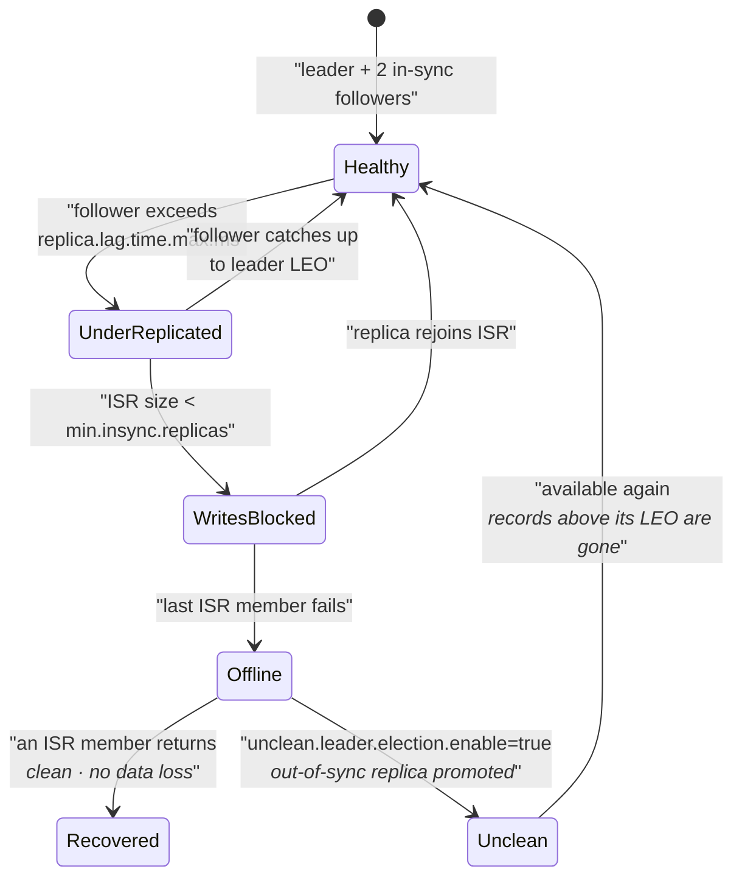
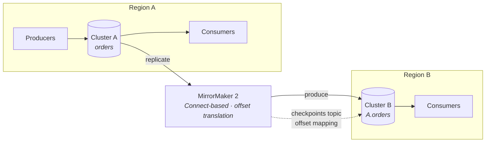

# Kafka Deep Dive

Lecture 11 dealt with databases — systems whose job is to hold the *current* value of things and answer questions about it. Lecture 12 dealt with caches — systems whose job is to hold a *cheap copy* of someone else's current value. Kafka is neither. It holds no current value at all. It is a replicated, partitioned, append-only log: a durable record of *what happened, in what order*, which many independent readers consume at their own pace and which forgets things on a timer rather than on command. There is no update, no delete, no query by key, no random read. There is append, and there is read-forward-from-an-offset.

That single structural fact generates every other property, good and bad. And almost every design question about Kafka — how many partitions, what key, how do I get ordering, why is this consumer stuck, why did I lose data, why can't I scale readers past N — reduces to one question: **what is the partition the unit of?** It is the unit of ordering, the unit of parallelism, the unit of placement, the unit of replication, and the unit of retention. Nothing in Kafka is ordered, parallel, placed, replicated, or retained at any other granularity. Hold that and the rest is detail.

## The log as the primitive

### Topics, partitions, offsets

- **Topic** — a named stream. Purely a logical grouping; it has no storage of its own and no ordering of its own. A topic is a *set of partitions* and nothing more.
- **Partition** — an ordered, immutable, append-only sequence of records, materialized as files on exactly one set of brokers. This is the only real object in Kafka.
- **Offset** — a monotonically increasing 64-bit integer identifying a record's position *within one partition*. Offsets are dense (no gaps in a non-compacted topic), never reused, and never reordered.
- **Record** — key, value, timestamp, headers. Kafka treats key and value as opaque bytes; it interprets the key only for partitioning and compaction.
- **Immutability** — a written record is never modified in place. "Deleting" happens only by dropping whole segment files at the head of the log, or by compaction rewriting a segment. There is no `UPDATE record SET …`.

**What this picture already tells you:**

- **Ordering is per-partition, never per-topic.** Records with keys `cust-04` and `cust-17` have no defined relative order, even if one was produced an hour before the other. If a downstream reader needs them ordered, they must share a partition, which means they must share a key.
- **Offsets are per-partition.** "Offset 4,000" is meaningless without naming a partition. There is no global sequence number and no way to construct one cheaply.
- **Parallelism is bounded by partition count.** Two consumers in the same group cannot both read partition 1. Adding a third consumer to a 3-partition topic gives one partition each; adding a fourth gives one consumer nothing to do.
- **Placement is per-partition.** Partition 1's leader lives on one broker. All traffic for `cust-17` — every byte, every fetch — goes through that one machine. This is why key skew is a hardware problem, not a logical one.

### The partition as unit of ordering, parallelism, and placement

- **Unit of ordering** — total order *within* the partition, no order *across* partitions. The ordering guarantee you actually get is: for a fixed key, with a stable partition count, a single producer's records appear to consumers in production order.
- **Unit of parallelism** — the maximum useful consumer count in a group equals the partition count. This ceiling is set at topic-creation time and is the most consequential number in a Kafka design ([§ Under-replicated and offline partitions](#under-replicated-and-offline-partitions)).
- **Unit of placement** — a partition's replicas are assigned to specific brokers. A partition never spans brokers; it is not itself sharded. Consequently *one partition must fit on one disk* and *one partition's write throughput must fit on one broker's leader path*.
- **Unit of replication** — the leader/follower relationship ([§ Replication and durability](#replication-and-durability)) is per-partition, not per-topic and not per-broker. A single broker is simultaneously leader for some partitions and follower for others.
- **Unit of retention** — retention is enforced by deleting segments from a partition's log. Retention settings are per-topic but *applied* per-partition.

**The trap:** treating "topic" as the operational object. Almost every capacity, latency, and failure question in Kafka is answered by reasoning about a single partition and then multiplying.

### Offsets are consumer state, not broker state

This is the design decision that separates Kafka from every classical message queue.

- **The broker does not track who has read what.** It knows only the byte range of each partition it holds. A fetch request says "give me partition 3 from offset 91,000" and the broker serves bytes from a file. It is close to a static file server with a strict append protocol.
- **Position is owned by the consumer**, which may store it wherever it wants. By convention it stores it in Kafka itself, in the internal compacted topic `__consumer_offsets` ([§ ksqlDB and Flink](#ksqldb-and-flink)) — but that is a convention, not a mechanism. A consumer can hold offsets in its own database, and doing so is exactly how you get transactional sink semantics ([§ Quotas and multi-tenancy](#quotas-and-multi-tenancy)).
- **Consequences, all of them large:**
  - **Replay is free.** Reset the offset backwards and read history again. Nothing is consumed-in-the-destructive-sense. This is the single capability that makes Kafka a system of record and not just transport.
  - **Many independent readers cost almost nothing.** Adding a fifth consumer group does not copy data, does not fan out storage, and adds only read bandwidth. Compare a queue, where each consumer needs its own copy of every message.
  - **Broker state is O(partitions), not O(messages in flight).** A broker holding a trillion records tracks no per-record delivery state. This is why Kafka's per-broker throughput is measured in hundreds of MB/s while per-message-ack brokers stall in the thousands of messages/s.
  - **The cost:** no per-message acknowledgement, therefore no selective redelivery, therefore a single unprocessable record blocks its partition ([§ Poison message blocking a partition](#poison-message-blocking-a-partition)). You trade fine-grained delivery control for throughput and replay.

**Key distinction:** RabbitMQ and SQS track *per-message* delivery state on the server; Kafka tracks *one integer per partition per group*. Everything Kafka is good at and everything it is bad at follows from that swap.

## Brokers, controllers, and metadata

### The cluster

- **Broker** — a JVM process owning a set of log directories. It serves produce and fetch requests for the partitions it leads, and replicates as a follower for the partitions it does not.
- **Every broker knows the full metadata map** — which partitions exist, who leads each, who is in each ISR — and serves it to clients on request. Clients therefore need only one reachable broker to bootstrap.
- **The controller** — exactly one broker (or one quorum, under KRaft) is responsible for cluster-level decisions: electing partition leaders, reacting to broker failure, reassigning replicas, creating and deleting topics.

### ZooKeeper-era versus KRaft

- **ZooKeeper model** — cluster metadata lives in an external ZooKeeper ensemble. One broker wins an election for the controller role by creating an ephemeral znode. On any change, the controller reads state from ZooKeeper and *pushes* it to brokers via `LeaderAndIsr` and `UpdateMetadata` RPCs.
  - **The failure mode:** controller failover requires the new controller to load the entire cluster state from ZooKeeper — every topic, partition, ISR — before it can act. On a large cluster this takes tens of seconds to minutes, during which leader elections do not happen and affected partitions are unavailable.
  - **The ceiling:** this loading cost is why the ZooKeeper era topped out around **200,000 partitions per cluster** and roughly **4,000 partitions per broker** as a practical guideline. Beyond that, controller failover became an outage.
  - **The operational cost:** a second distributed system to run, monitor, secure, and upgrade, with its own quorum semantics and its own failure modes.
- **KRaft model** — metadata *is* a Kafka log. A dedicated controller quorum (typically 3 or 5 nodes) runs Raft over an internal topic `__cluster_metadata`. Brokers are followers of that log and apply metadata records as an event stream.
  - **Failover is near-instant** because the standby controllers already have the state in memory; they have been applying the same log. There is no bulk load.
  - **Metadata propagation becomes incremental** — brokers fetch the delta since their last applied offset rather than receiving whole-state pushes.
  - **The ceiling moves by roughly an order of magnitude** — millions of partitions per cluster are claimed, with practical deployments comfortably in the high hundreds of thousands.
  - **Kafka 4.0 removed ZooKeeper entirely.** KRaft is not an option any more; it is the architecture.

**In an interview:** the ZooKeeper→KRaft story is not trivia. It is a clean example of a system replacing external coordination with its own primitive — Kafka got faster failover and a higher partition ceiling by realizing that a metadata store is just another log.

### Metadata propagation and client bootstrap

- **`bootstrap.servers` is a seed list, not a connection target.** The client connects to any listed broker, issues a `Metadata` request, and receives the full map of topics, partitions, and current leaders. From then on it connects *directly to partition leaders* and ignores the bootstrap list except for recovery.
- **Clients are leader-aware, so there is no proxy hop.** A producer writing to partition 7 opens a connection to partition 7's leader. There is no router tier, which is why Kafka has no obvious single bottleneck — and also why clients are thick and version-sensitive.
- **Metadata is refreshed lazily**, every `metadata.max.age.ms` (default 300,000 ms) and immediately on certain errors.
- **`NOT_LEADER_OR_FOLLOWER` is the normal signal.** When a leader moves, in-flight requests to the old leader fail with this retriable error; the client refreshes metadata and retries against the new leader. A well-configured producer rides through leader changes with a latency blip, not an error.
- **The failure mode:** advertised listeners misconfigured. The broker returns metadata containing hostnames that the client cannot resolve or route to — connections succeed to the bootstrap broker and then fail mysteriously to everything else. This is the single most common Kafka networking bug, and it is always the same bug: `advertised.listeners` describes the address *clients* must use, not the address the broker binds.

### Producers, consumers, and consumer groups

- **Producer** — a client that appends to partitions. Thread-safe, batching, asynchronous by default; sharing one producer instance across an application is the intended usage.
- **Consumer** — a client that fetches from partitions. *Not* thread-safe; the intended usage is one consumer per thread.
- **Consumer group** — a set of consumers sharing a `group.id`, across which the topic's partitions are divided such that **each partition is assigned to exactly one member**. The group is the unit of offset tracking and of rebalancing.
- **Groups are how Kafka expresses both queueing and pub/sub with one mechanism.** Within a group, records are load-balanced (queue semantics). Across groups, every group sees every record (pub/sub semantics). There is no separate exchange or subscription object.
- **The group coordinator** — one broker, chosen by hashing the `group.id` onto a partition of `__consumer_offsets`, manages membership, assignment, and offset commits for that group.

## Storage engine

Kafka's storage engine is deliberately unclever. It is an append-only file plus two sparse indexes, and its performance comes from *refusing* to do the things a database does.

### Segments and indexes

- **A partition is a directory; a segment is a file.** The filename is the base offset of the first record it contains, zero-padded to 20 digits. Finding the segment for an offset is therefore a binary search over filenames — no metadata lookup needed.
- **Only the last segment is active.** All appends go to it. Everything else is immutable and read-only, which is what makes deletion and tiering trivial: unlink a file.
- **Segments roll** at `segment.bytes` (default 1 GB) or `segment.ms` (default 7 days), whichever comes first. Smaller segments mean faster retention granularity and faster compaction, but more open file handles and more index files.
- **`.index` — a sparse offset index.** It maps *relative* offset → byte position in the `.log`, with one entry roughly every `index.interval.bytes` (default 4096). A lookup binary-searches the index to find the nearest preceding entry, then scans forward in the log file. Sparse, so it stays memory-mappable: an index for a 1 GB segment is a couple of megabytes.
- **`.timeindex` — a sparse time index.** Maps timestamp → offset, enabling `offsetsForTimes()` and therefore "start consuming from 09:00 yesterday". This is what makes time-based replay and time-based retention possible without scanning.
- **`.snapshot` files** hold producer-ID state for idempotence ([§ Offset management](#offset-management)); `leader-epoch-checkpoint` holds the epoch history used for truncation correctness ([§ Leader epochs and truncation correctness](#leader-epochs-and-truncation-correctness)).
- **Why sequential I/O is the whole trick:** appends are sequential writes to one file per partition, and reads are sequential scans forward from an offset. On spinning disks this was a 100× advantage over random I/O; on NVMe it is smaller but still real, and more importantly it makes the OS readahead and page cache extremely effective.

### Zero-copy and the page cache

- **Zero-copy transfer** — for a plaintext fetch, the broker calls `sendfile(2)`: the kernel copies bytes from the page cache directly to the socket buffer. The data never enters the JVM heap and never crosses userspace at all.
  - Without it: disk → kernel page cache → JVM byte array → kernel socket buffer → NIC. Four copies and two context switches per read.
  - With it: page cache → socket buffer. One copy, inside the kernel.
- **Kafka does not maintain its own cache.** There is no buffer pool. Written records land in the page cache and are *usually still there* when a consumer reads them milliseconds later, so the common case — consumers reading near the tail — never touches disk at all.
- **What breaks zero-copy — know these, they are real latency cliffs:**
  - **TLS.** Encryption requires the bytes in userspace to be encrypted. Enabling `SSL` listeners typically costs 20–40% of broker throughput, almost entirely from losing `sendfile`.
  - **Broker-side record conversion.** If a consumer speaks an older message format than what is on disk, the broker must down-convert, which means decompressing, rewriting, and recompressing in heap. This is catastrophic — it can 10× broker CPU and blow up heap. Keep client and broker message formats aligned.
  - **Broker-side recompression.** If `compression.type` on the topic differs from what the producer sent, the broker decompresses and recompresses every batch.

**Why Kafka wants free RAM, not a big JVM heap:**

- **The JVM heap holds almost no data.** It holds request objects, metadata, index structures, and the replica fetcher state. A heap of **6 GB is plenty** on a broker with 128 GB of RAM; some run comfortably at 4–8 GB regardless of machine size.
- **The remaining ~120 GB should be page cache**, managed by the OS. That is where your hot data lives, and the OS is better at managing it than the JVM would be — it survives broker restarts, it has no GC cost, and it needs no tuning.
- **The trap:** treating Kafka like a normal JVM service and setting `-Xmx64g`. You get long GC pauses (which cause ZooKeeper/coordinator session timeouts and spurious leader elections), and you *steal* memory from the page cache, so reads start hitting disk. Both effects, from one mistake.
- **Rule of thumb:** heap 6 GB, G1GC, and size the machine so that the *working set* — roughly the last few minutes to hours of each partition, plus any lagging consumer's read position — fits in remaining RAM.
- **The corollary:** a single badly-lagging consumer group hurts everyone. It reads from cold offsets, faulting old segments into page cache, evicting the hot tail that every healthy consumer depends on. Broker latency degrades globally because of one slow reader.

### Retention: time and size

- **Kafka deletes by policy, not by consumption.** `cleanup.policy=delete` (default) drops whole segments once they age out.
- **`retention.ms`** — default 604,800,000 (7 days). A segment is eligible for deletion when the *largest* timestamp in it is older than this.
- **`retention.bytes`** — a per-partition size cap, default −1 (unlimited). Note *per-partition*: a 100 GB `retention.bytes` on a 50-partition topic means 5 TB of topic, replicated three times, is 15 TB of disk. This arithmetic error fills disks constantly.
- **Whichever triggers first wins**, and deletion only ever happens at segment granularity. A record inside the active segment is never deleted, no matter how old — which is why with `segment.ms=7d` and `retention.ms=1h` you keep far more than an hour.
- **`log.retention.check.interval.ms`** (default 5 minutes) governs how often the cleaner scans for eligible segments. Retention is therefore approximate, always in the direction of keeping too much.

### Log compaction

`cleanup.policy=compact` changes the semantics of the log entirely: instead of "the last N hours of events", the log becomes "the latest value for every key, forever".

- **The guarantee:** for every key that has ever been written, the log retains *at least* the most recent value. Older values for that key may be removed. Offsets of surviving records are unchanged — compaction creates gaps in the offset sequence but never renumbers.
- **The head is never compacted.** The active segment and everything after the last cleaner pass form the "dirty" region, which is read as a normal event log. Only the "clean" tail is deduplicated. A consumer reading from offset 0 therefore sees a compacted snapshot followed by a real event stream — this is exactly the bootstrap pattern Kafka Streams state stores rely on ([§ The comparison table](#the-comparison-table)).
- **Tombstones** — a record with a non-null key and a **null value** means *delete this key*. It survives compaction for `delete.retention.ms` (default 24 hours) so that consumers currently reading the tail have a chance to observe the deletion, and is then removed. A consumer offline longer than that will never learn the key was deleted, which is a genuine correctness hazard for cache-materializing consumers.
- **The cleaner** — background threads (`log.cleaner.threads`) pick the partition with the highest dirty ratio, build an in-memory hash of key → highest offset for the dirty region, then rewrite segments dropping superseded records. `min.cleanable.dirty.ratio` (default 0.5) controls how dirty a log gets before it is worth cleaning.
  - **Cleaner memory is a real constraint:** `log.cleaner.dedupe.buffer.size` must hold the key-map for the dirty region. Too small, and the cleaner processes less per pass or fails outright — and a stalled cleaner means a compacted topic grows without bound.
- **`min.compaction.lag.ms`** guarantees a record stays uncompacted for a minimum time, so consumers can rely on seeing intermediate values within a window.
- **Compaction requires keys.** A null-keyed record in a compacted topic is an error; the cleaner cannot place it.
- **`cleanup.policy=compact,delete`** combines both — keep the latest value per key, but also drop anything older than the retention window. Useful for changelog topics you want bounded.

### Tiered storage

- **The idea (KIP-405):** closed segments are uploaded to object storage (S3, GCS) and deleted locally once uploaded. The broker retains only recent segments on local disk; the log's logical contents are unchanged.
- **Two retention knobs appear:** `local.retention.ms`/`local.retention.bytes` for what stays on disk, and `retention.ms`/`retention.bytes` for the total, now potentially months or years.
- **What it buys:** storage and compute decouple. Previously, retaining 90 days meant provisioning 90 days of local disk on brokers you sized for throughput — so you bought CPUs you did not need to hold bytes. Tiering removes that coupling and makes long retention roughly the cost of object storage.
- **It also makes rebalancing dramatically cheaper.** Adding a broker previously meant copying terabytes of partition data across the network; with tiering, only the local window moves.
- **The latency profile is the catch — be specific about it:**
  - Reads from local segments: sub-millisecond to low single-digit ms, served from page cache via `sendfile`.
  - Reads from remote segments: **tens to hundreds of milliseconds per fetch**, sometimes seconds, with far lower throughput and no zero-copy path.
  - So tiered storage is for *replay and backfill*, not for serving lagging real-time consumers. A consumer that falls behind past the local window does not slow down gracefully; it falls off a cliff.
- **The operational failure mode:** a consumer group resets to earliest on a tiered topic and begins pulling terabytes from object storage. You pay in egress, in broker remote-fetch threads, and in latency for every other reader on those brokers.

## Producer semantics

### Batching, linger, and compression

- **The producer is asynchronous by construction.** `send()` appends the record to an in-memory accumulator, grouped into per-partition batches, and returns a `Future` immediately. A background I/O thread drains batches to brokers.
- **`batch.size`** (default 16,384 bytes) — the maximum size of one per-partition batch. A batch is sent when it is full *or* when `linger.ms` expires.
- **`linger.ms`** (default 0) — how long to wait for more records before sending a partial batch. This is the throughput/latency dial, and it is the most underused knob in Kafka.
  - `linger.ms=0`: send as soon as the I/O thread is free. Lowest latency, smallest batches, most requests per second, worst compression ratio.
  - `linger.ms=5–20`: adds a bounded few milliseconds of latency and often **doubles or triples** effective throughput, because batches get big enough to compress well and to amortize per-request overhead.
  - **Rule of thumb:** if your end-to-end SLO is above ~50 ms, setting `linger.ms=10` is nearly free and materially cheaper on broker CPU and network.
- **Compression is per-batch, not per-record**, which is why batching and compression multiply each other: a 500-record batch of similar JSON compresses 5–10×; a 1-record batch compresses to slightly larger than the original.
- **Codec trade-offs:**
  - **`lz4`** — fast compress and decompress, moderate ratio. The default recommendation for high-throughput pipelines.
  - **`snappy`** — similar profile to lz4, slightly worse ratio, very low CPU. Long-standing default choice.
  - **`zstd`** — best ratio by a wide margin (often 30–50% smaller than lz4), higher CPU on compress, decompress still fast. Correct choice when network or storage cost dominates, which at scale it usually does.
  - **`gzip`** — best-of-the-old ratio, much higher CPU. Rarely the right answer now that zstd exists.
- **Keep the codec end-to-end.** If the broker's topic-level `compression.type` matches the producer's, the compressed batch is stored *as received* and served to consumers *as stored* — zero broker CPU, zero-copy preserved. Any mismatch forces the broker to decompress and recompress every batch.

### Partitioning

- **Key present** → partition = `murmur2(key) % numPartitions`. Deterministic, so the same key always lands in the same partition — this is the entire ordering mechanism.
- **Key absent** → the **sticky partitioner** (default since 2.4): pick a random partition and keep filling batches for it until the batch is sent, then pick another. This is a meaningful improvement over the old round-robin, which spread records thinly across all partitions and produced many small batches; sticky produces fewer, fuller batches and cuts latency at low throughput.
- **Custom partitioners** are supported by implementing the `Partitioner` interface. Legitimate uses: routing by a field inside the value, keeping a tenant's data on a dedicated partition subset, or implementing bounded key-to-partition mapping to survive repartitioning.
- **The repartitioning hazard:** because the mapping is `hash(key) % N`, changing `N` remaps almost every key. Records for `cust-17` written before the change are in partition 1; after, they are in partition 4. **Ordering for that key is broken across the boundary**, and any consumer maintaining per-key state now has that state on the wrong instance. This is the deepest reason partition count is effectively immutable ([§ Under-replicated and offline partitions](#under-replicated-and-offline-partitions)).

**Key skew and hot partitions:**

- **The failure mode:** one key — a whale customer, a null-ish default, a single high-volume device — accounts for a large fraction of traffic. Its partition's leader broker saturates while the rest of the cluster idles. You cannot add capacity by adding brokers, because the partition cannot be split.
- **Symptoms:** one broker at high disk/network utilization, one partition with growing lag while sibling partitions are at zero, uneven segment counts across partition directories.
- **What to do instead:**
  - **Composite keys** — key on `entityId:bucket` where bucket is a small random or round-robin salt. You get N× the parallelism for that entity at the cost of losing strict ordering within it, so this only works when ordering is required at a finer grain than the hot key.
  - **Split the hot tenant into its own topic** with its own partition count and its own consumers.
  - **Custom partitioner with explicit routing** for known-hot keys, mapping them to a dedicated range of partitions.
  - **Accept it** — sometimes per-entity ordering is a hard requirement and the entity is genuinely large. Then the design question becomes whether one partition's throughput ceiling (realistically **tens of MB/s**, since it is one leader's append path plus replication) is sufficient.

### The idempotent producer

`enable.idempotence=true` — the default since Kafka 3.0, and there is essentially no reason to disable it.

- **The problem it solves:** a producer sends a batch, the broker writes it and replicates it, and the *acknowledgement* is lost to a network failure. The producer retries. Without idempotence, the record is now in the log twice. Retries are not optional — disabling them just converts duplicates into data loss — so "at-least-once" was previously unavoidable at the producer.
- **The mechanism:**
  - On startup the producer obtains a **producer ID (PID)** from a broker.
  - Every batch carries `(PID, epoch, partition, sequence number)`, with sequence numbers monotonic per partition.
  - The broker keeps, per partition, the last five sequence numbers seen per PID. A batch whose sequence is a duplicate is **acknowledged but not written**. A batch whose sequence is too far ahead is rejected with `OUT_OF_ORDER_SEQUENCE_NUMBER`, which surfaces the gap rather than silently losing data.
- **It also preserves ordering under retries.** Without idempotence, `max.in.flight.requests.per.connection > 1` plus retries can reorder records (batch 2 succeeds, batch 1 fails and is retried after). With idempotence, the broker enforces sequence order, so **up to 5 in-flight requests are safe** — you get pipelining and ordering together.
- **Its genuine costs:** essentially none. A few bytes per batch, a small map per partition on the broker, and the requirement that `acks=all`, `retries>0`, and `max.in.flight ≤ 5` (all defaults).
- **The boundary:** idempotence is scoped to a **producer session**. If the producer process dies and restarts, it gets a new PID, and records it re-sends from an application-level retry queue will be duplicates. Idempotence deduplicates network retries, not application retries.

### Transactions and the boundary of exactly-once

- **`transactional.id`** — a *stable* logical identifier for the producer instance. On `initTransactions()`, the coordinator bumps the epoch for that ID, **fencing** any older instance still running with the same ID. This is what makes zombie processes safe: a stale instance's writes are rejected.
- **The transaction coordinator** is a broker chosen by hashing `transactional.id` onto the internal `__transaction_state` topic. It durably records the transaction's state and the set of partitions involved.
- **Markers** — on commit or abort, the coordinator writes a **control record** (a transaction marker) into *every* partition the transaction touched. These markers occupy real offsets in the log, which is why offsets in a transactional topic have gaps from a consumer's perspective.
- **`isolation.level=read_committed`** consumers refuse to deliver records beyond the **Last Stable Offset (LSO)** — the offset before the earliest still-open transaction. They also filter out aborted records using the `.txnindex`.
  - **The latency consequence:** a long-running open transaction blocks *all* `read_committed` consumers on those partitions, even for records from unrelated committed transactions. Consumer lag appears despite the log advancing. `transaction.timeout.ms` (default 60,000, capped by broker `transaction.max.timeout.ms`) bounds this.
  - `read_uncommitted` (the default) sees everything immediately, including records from transactions that later abort.
- **`sendOffsetsToTransaction`** is the crucial piece: it writes the consumer's offset commits *into the same transaction* as the output records. Consume-transform-produce therefore becomes atomic — either the outputs are visible and the input offsets advanced, or neither.

**The boundary of the exactly-once guarantee — say this precisely, it is the most commonly overstated claim in the ecosystem:**

- **What is guaranteed:** *Kafka-to-Kafka*. Reading from Kafka topics, processing, and writing to Kafka topics — including the offset commit — is atomic and idempotent under retries and process failure.
- **What is not guaranteed, at all:**
  - **Kafka → your database.** A sink writing rows to Postgres and then committing offsets to Kafka is doing a two-system commit with no coordinator. Crash between the two, and you either double-write or lose. Kafka transactions cover exactly one of those two systems.
  - **Kafka → any external side effect** — an HTTP call, an email, a payment. There is no rollback for a side effect that has already left the process.
  - **Your producer's own upstream.** If the thing writing *into* Kafka can duplicate (a retrying HTTP client, an at-least-once CDC pipeline), Kafka faithfully stores the duplicates. Exactly-once starts at the first Kafka write, not before it.
- **What to do instead for sinks:**
  - **Idempotent writes** — make the downstream write naturally repeat-safe: upsert by primary key, or a unique constraint on a message-derived idempotency key. Then at-least-once delivery is functionally exactly-once. This is the standard answer and it is almost always the right one.
  - **Store offsets in the sink's own transaction** — write the rows and the consumer offset in one database transaction, and on startup seek to the offset read from the database rather than from Kafka. Now there is exactly one commit point. This is what a correctly built transactional sink does.
- **`processing.guarantee=exactly_once_v2`** in Kafka Streams uses one producer per instance with markers, rather than one per input partition — dramatically reducing the marker and coordinator overhead of the original design. It costs latency (records are invisible until commit, at `commit.interval.ms`, default 100 ms under EOS) and roughly 10–30% throughput. Worth it when the application is genuinely Kafka-to-Kafka; pointless overhead when the output is a database.

### Backpressure and buffer exhaustion

- **`buffer.memory`** (default 33,554,432 = 32 MB) is the total memory the producer will use for unsent records across all partitions.
- **When the buffer fills** — because brokers are slow, a partition is unavailable, or the application is producing faster than the network drains — `send()` **blocks** for up to `max.block.ms` (default 60,000 ms) and then throws `TimeoutException`.
- **This is the producer's only backpressure mechanism, and it is a blocking one.** `send()` looks asynchronous until it isn't. A synchronous request thread calling `send()` will stall for up to a minute when Kafka is degraded, which turns a Kafka slowdown into a thread-pool exhaustion in your service.
- **`delivery.timeout.ms`** (default 120,000) bounds total time from `send()` returning to success or failure, covering all retries. It supersedes reasoning about `retries` count directly — set this to your actual tolerance and leave `retries` at `Integer.MAX_VALUE`.
- **What to do instead of ignoring it:**
  - Set `max.block.ms` low (a few hundred ms to a couple of seconds) on any producer called from a latency-sensitive request path, and decide explicitly what happens on failure — drop, log, or fall back to a local queue.
  - Never call `send()` from a thread you cannot afford to block, and never call `.get()` on the returned future in a request path unless you mean it.
  - Monitor `buffer-available-bytes` and `record-error-rate`; buffer exhaustion is visible before it is fatal.

## Replication and durability

### Leaders, followers, and the ISR

- **Every partition has `replication.factor` replicas**, one designated **leader** and the rest **followers**. All produces and (by default) all fetches go to the leader; followers exist only for durability and failover.
- **Followers replicate by fetching.** A follower issues an ordinary `Fetch` request to the leader, exactly like a consumer, and appends what it receives. There is no separate replication protocol — replication is consumption. This is an elegant reuse and it means the replication path benefits from the same batching and zero-copy machinery.
- **The ISR (in-sync replica set)** is the subset of replicas the leader considers caught up. Membership is dynamic and maintained by the leader, persisted through the controller.
- **`replica.lag.time.max.ms`** (default **30,000 ms**) is the sole membership criterion in modern Kafka: a follower is in the ISR if it has fetched up to the leader's log end offset *at some point* within the last 30 seconds. Older Kafka also used `replica.lag.max.messages`, which was removed because it misbehaved under bursty traffic — a follower could be evicted by a single spike despite being perfectly healthy.
- **ISR shrink/expand dynamics:**
  - **Shrink** — a follower that is slow (GC pause, disk saturation, network congestion) falls out. The leader removes it, notifies the controller, and the `IsrShrinksPerSec` metric ticks. The partition is now **under-replicated**.
  - **Expand** — once the follower catches up to the leader's LEO, it rejoins. `IsrExpandsPerSec` ticks.
  - **The pattern to watch for is flapping** — repeated shrink/expand on the same partition. That is a broker that is marginally overloaded, not one that is broken, and it is the leading indicator of a real outage. Each shrink/expand is a controller round-trip and a metadata update to every broker.
- **Under-replicated with `min.insync.replicas` still satisfiable** → writes continue, durability reduced. **Under-replicated below `min.insync.replicas`** → the leader rejects writes with `NOT_ENOUGH_REPLICAS`, and the partition is read-only. This is the durability trade being taken automatically.

### High watermark versus log end offset

This is the single most important internal concept in Kafka replication, and it is worth diagramming precisely.

- **Log end offset (LEO)** — the offset of the next record to be written to a replica's log. Each replica has its own LEO. The leader's LEO is where produced data lands *immediately*, before any replication.
- **High watermark (HW)** — the minimum LEO across all replicas in the ISR. It is the boundary of *committed* data.
- **Consumers can only read below the high watermark.** Records between the HW and the leader's LEO exist on disk on the leader and are durable in the local sense, but they are **not yet visible to any consumer**, because they are not yet replicated to the whole ISR.
- **Why this rule exists:** if consumers could read uncommitted records, a leader failure could make already-delivered records disappear. A new leader elected from the ISR only guarantees data up to the old HW; anything above it may be truncated. By hiding it, Kafka ensures that *anything a consumer has ever seen will still exist after any failover within the ISR*. Read stability is bought by delaying visibility.
- **The HW advances lazily.** The leader learns a follower's LEO from that follower's *next* fetch request, and communicates the new HW in the *following* fetch response. So HW propagation costs roughly one extra replication round-trip — which is why end-to-end latency in Kafka has a floor of about **2× the leader-follower round trip**, and why cross-AZ replication shows up directly in producer-to-consumer latency (typically adding 1–3 ms per AZ hop within a region).
- **The observable consequence:** you can produce with `acks=1`, see the offset return successfully, and have consumers not see the record for several milliseconds. That gap is HW propagation, not a bug.

### Durability configuration

- **`acks`** — how many acknowledgements the *producer* waits for.
  - **`acks=0`** — fire and forget. The producer does not wait for any response; it considers the send complete once the bytes hit the socket. No retries are possible because there is no failure signal.
  - **`acks=1`** — the leader has written to its log (to the page cache, not necessarily to disk). Acknowledged data can be lost if the leader fails before any follower replicates it.
  - **`acks=all`** (equivalently `-1`) — every replica currently in the ISR has fetched the record. Combined with `min.insync.replicas`, this becomes a real durability guarantee.
- **`min.insync.replicas`** — a *topic or broker* setting, meaningful only with `acks=all`. It is the minimum ISR size the leader requires before it will accept a write at all. Below it, produce fails with `NOT_ENOUGH_REPLICAS` and the partition is read-only.
  - **The subtlety that trips people up:** `acks=all` alone guarantees nothing, because "all replicas in the ISR" can mean "the leader, alone, because everyone else fell out". `min.insync.replicas` is what puts a floor under the ISR. The two settings are only meaningful together.
- **`replication.factor`** — total replica count, set at topic creation, changeable only by an explicit reassignment.

| Configuration | Survives | Write availability | Notes |
|---|---|---|---|
| `acks=0` | nothing | highest | No error signal at all; use only for metrics-grade data |
| `acks=1`, RF=3 | broker restart, usually | high | Loses the tail window on unexpected leader failure |
| `acks=all`, `min.insync=1`, RF=3 | nothing more than `acks=1` | high | The classic false-confidence config |
| **`acks=all`, `min.insync=2`, RF=3** | **any 1 broker or AZ loss, with zero acknowledged-write loss** | **tolerates 1 failure; writes stop at 2** | **The standard. Use it.** |
| `acks=all`, `min.insync=3`, RF=3 | 1 broker loss for reads | low — any single failure stops writes | No extra durability over min.insync=2; strictly worse availability |

**Why `acks=all` + `min.insync.replicas=2` + `replication.factor=3` is the standard — decompose it:**

- **RF=3** gives you three copies, so you can lose one broker and still have two, and lose two and still have the data (though not availability). RF=2 gives no headroom: one failure leaves a single copy and any maintenance is a durability event.
- **`min.insync.replicas=2`** means every acknowledged write exists on at least two brokers before the producer is told it succeeded. Lose any one broker — including the leader — and an acknowledged record still exists somewhere in the ISR, so the new leader has it.
- **`acks=all`** is what makes the producer actually *wait* for that condition. Without it, the ISR constraint is never checked at write time.
- **The specific gap this configuration leaves:** the combination `min.insync=2, RF=3` tolerates one failure. When two of three replicas are down, writes stop. That is the intended behavior — Kafka chooses to reject writes rather than accept them at RF=1. If you set `min.insync=1` to "keep things running", you have chosen availability over durability, and you should say so out loud rather than discover it after an incident.
- **The setting must be set on producers too.** `min.insync.replicas` is broker/topic-side; a producer using `acks=1` bypasses it entirely. Both halves are required, and they are configured by different teams, which is why the config drifts.

### Unclean leader election

- **The situation:** every replica in the ISR is down. Some out-of-sync replica is alive but is missing records — it was evicted from the ISR precisely because it had fallen behind.
- **`unclean.leader.election.enable=false`** (the default since 0.11): the partition goes **offline**. No reads, no writes, until an ISR member returns. **You have chosen durability.** The data is not lost; it is unavailable, and it will come back intact when a real replica does.
- **`unclean.leader.election.enable=true`**: the out-of-sync replica becomes leader. The partition is available immediately. **Every record between that replica's LEO and the old high watermark is permanently gone** — including records that were acknowledged to producers with `acks=all` and records that consumers have already read and acted on. Consumer offsets can now point beyond the log end, which triggers `auto.offset.reset` and either silent skipping or silent replay.
- **This is the cleanest availability-versus-durability choice in the whole system**, and it is a single boolean. There is no clever middle. State it as a business decision:
  - Payments, orders, ledgers, anything auditable → `false`. An outage is recoverable; a silently lost acknowledged transaction is not.
  - Clickstream, metrics, logs, ad impressions → `true` is defensible. A few seconds of missing telemetry is cheaper than a pipeline outage.
- **The trap:** setting it to `true` cluster-wide "for resilience" and never revisiting it. The setting does nothing at all until the worst day of the year, and then it silently deletes committed data.
- **Note the interaction with `min.insync.replicas`:** with `min.insync=2, RF=3`, reaching a state where *all* ISR members are down requires losing three brokers, or an AZ plus a broker. It is not a routine event. That rarity is exactly why teams leave the flag on and forget it is there.

### Rack awareness and cross-AZ placement

- **`broker.rack`** tags each broker with a failure domain — in cloud deployments, the availability zone. The controller's replica assignment algorithm then spreads a partition's replicas across as many distinct racks as possible.
- **With RF=3 across 3 AZs**, every partition has one replica per AZ. Losing an entire AZ leaves 2 of 3 replicas, so `min.insync.replicas=2` is still satisfiable and **writes continue through a full AZ outage**. This is the whole reason the RF=3/min.insync=2 pairing is standard in cloud environments — it is sized to survive an AZ, not just a machine.
- **The cost is cross-AZ network.** Every produced byte crosses AZ boundaries twice for replication, and cloud providers charge for inter-AZ traffic in both directions. At a few hundred MB/s of ingest this is a material line item, frequently comparable to the compute bill.
- **Follower fetching (KIP-392)** lets consumers read from the *closest* replica rather than the leader, selected via the consumer's `client.rack` and the broker's `replica.selector.class`. This eliminates cross-AZ *read* traffic, which for a topic with several consumer groups is usually the larger half of the bill.
  - **The trade-off:** a follower's high watermark lags the leader's by a replication round-trip, so rack-local reads have slightly higher end-to-end latency and slightly staler visibility. Almost always worth it.
- **The failure mode:** brokers deployed across AZs without `broker.rack` set. Assignment is then AZ-blind, and some partitions get all three replicas in one AZ. Everything looks healthy until that AZ goes away and a subset of partitions goes fully offline. Verify placement, do not assume it.

### Leader epochs and truncation correctness

- **The old bug:** followers used to truncate their logs to the leader's high watermark on becoming a follower. But HW propagation lags by a round-trip, so a follower could hold a *stale* HW, and a sequence of rapid leader changes could cause two replicas to diverge — same offsets, different records — or to lose committed data. This was a genuine correctness hole, not a theoretical one.
- **Leader epochs (KIP-101)** fix it. Every leader election increments a monotonic **epoch number**. Each record batch is stamped with the epoch under which it was written, and each replica keeps a `leader-epoch-checkpoint` file mapping epoch → start offset.
- **The recovery protocol:** on becoming a follower, a replica sends an `OffsetsForLeaderEpoch` request asking the new leader "what is the end offset of epoch E?" The leader answers with the exact divergence point, and the follower truncates precisely there — no more, no less.
- **Why this matters to you as a designer:** it is the mechanism that makes "no data loss with `acks=all` and `min.insync=2`" a real guarantee rather than an approximation. Without epochs, the guarantee held in steady state and broke under exactly the conditions you care about: rapid, repeated failover.
- **It also enables correct log divergence detection under unclean election** — the promoted replica starts a new epoch, so returning replicas can identify and discard the branch that was lost rather than silently merging.

## Consumer semantics

### Groups and partition assignment

- **The protocol:** each member sends `JoinGroup` to the coordinator. The coordinator picks one member as **group leader** and sends it the full membership list. The leader *computes* the assignment client-side and returns it in `SyncGroup`; the coordinator distributes it. Assignment logic therefore lives in the client, which is why new assignors ship without broker upgrades.
- **Assignors — `partition.assignment.strategy`:**
  - **Range** (historical default) — for each topic independently, lay partitions out in order and hand contiguous ranges to members sorted by ID. **Skews badly** when partition count is not a multiple of consumer count, and skews *the same way for every topic*, so with 3 topics of 4 partitions and 3 consumers, the first consumer gets 6 partitions and the third gets 3.
  - **RoundRobin** — lay out all partitions across all subscribed topics and deal them round-robin. Balanced, but on every rebalance the assignment is recomputed from scratch and partitions move for no reason.
  - **Sticky** — balanced *and* minimizes movement: it tries to preserve existing assignments while equalizing counts. Reduces state-rebuild cost after a rebalance.
  - **CooperativeSticky** — sticky plus the incremental rebalance protocol ([§ Rebalancing](#rebalancing)). **This is the correct default for anything new.**
- **Static membership (`group.instance.id`)** — normally a consumer gets an ephemeral member ID, so leaving and rejoining triggers two rebalances. With a `group.instance.id`, the member's identity is stable across restarts: the coordinator keeps the member's assignment reserved and does **not** trigger a rebalance when it disappears, until `session.timeout.ms` expires.
  - **What it buys:** a rolling restart or a Kubernetes pod reschedule of a 50-instance consumer group causes *zero* rebalances instead of 100. For stateful consumers (Kafka Streams with large state stores) this is the difference between a 5-second deploy and a 20-minute one.
  - **The cost:** a genuinely dead instance is not detected until `session.timeout.ms` elapses, so set that to your real failure-detection tolerance (often 45–120 s) and accept that partitions are unowned for that long.

### Rebalancing

```mermaid
flowchart TB
    subgraph eager["Eager rebalance · classic protocol"]
        E1["Trigger:<br/>member joins/leaves"] --> E2["ALL members revoke<br/>ALL partitions"]
        E2 --> E3["Stop-the-world<br/><i>zero consumption cluster-wide</i>"]
        E3 --> E4["JoinGroup · SyncGroup"]
        E4 --> E5["New assignment<br/><i>state rebuilt from scratch</i>"]
    end
    subgraph coop["Incremental cooperative · KIP-429"]
        C1["Trigger:<br/>member joins/leaves"] --> C2["Round 1: compute target,<br/>revoke ONLY moving partitions"]
        C2 --> C3["Unaffected members<br/><i>keep consuming throughout</i>"]
        C3 --> C4["Round 2: assign<br/>the released partitions"]
    end
```

- **Eager (stop-the-world)** — the original protocol. On any membership change, *every* member revokes *every* partition, then the group re-forms. Consumption stops entirely for the duration, which for a large group with heavy `onPartitionsRevoked` work (flushing state, committing offsets) can be **tens of seconds**.
- **Incremental cooperative (KIP-429)** — computes the target assignment, then revokes only the partitions that actually need to move, in a first round; a second round assigns them. Members whose partitions are unchanged never stop consuming. Scaling from 10 to 11 consumers moves roughly 1/11 of the partitions and pauses nothing else.
  - **Migration note:** moving from eager to cooperative requires a two-step rolling upgrade (add `CooperativeStickyAssignor` alongside the old one, deploy, then remove the old one). You cannot flip it in one deploy without a mixed-protocol group failing to form.
- **The three timeouts, and their distinct jobs — this distinction is the single most useful piece of consumer knowledge:**
  - **`heartbeat.interval.ms`** (default 3,000) — how often the background heartbeat thread pings the coordinator. Should be roughly 1/3 of the session timeout.
  - **`session.timeout.ms`** (default 45,000 in modern clients; was 10,000) — how long the coordinator waits without a heartbeat before declaring the member dead. This detects **process/network failure**. Heartbeats come from a *background thread*, so they continue even while your application is busy processing.
  - **`max.poll.interval.ms`** (default 300,000 = 5 minutes) — the maximum time between consecutive `poll()` calls. This detects **application liveness**: a consumer whose processing loop is wedged or is spending 20 minutes on one batch is heartbeating fine but making no progress. Exceeding it causes the consumer to *proactively leave the group*, triggering a rebalance.
  - **The failure mode people actually hit:** processing takes longer than `max.poll.interval.ms`, so the consumer is ejected mid-batch; it then tries to commit offsets and gets `CommitFailedException` because it no longer owns the partition; the work is redone by the new owner, which also takes too long; repeat forever. The fix is to reduce `max.poll.records` (default 500) so one batch is bounded, *not* to raise `max.poll.interval.ms` blindly — raising it makes genuine hangs invisible for longer.

**Rebalance storms — causes, in rough order of frequency:**

- **Processing exceeding `max.poll.interval.ms`**, as above. Self-reinforcing, because each rebalance adds catch-up work that makes the next batch slower.
- **Deploys without static membership.** Rolling 30 pods triggers up to 60 rebalances, each of which stops the group (under the eager protocol).
- **GC pauses or CPU starvation** exceeding `session.timeout.ms`. Common in containers with aggressive CPU limits — the heartbeat thread is scheduled out.
- **Consumers subscribing by regex** to a topic set that changes, or metadata refreshes that surface new partitions.
- **A crash-looping member** that joins, fails, and rejoins every few seconds, keeping the group permanently in rebalance and never letting anyone commit.
- **Symptoms:** lag climbing with zero throughput, `rebalance-rate-per-hour` far above zero, logs full of "Attempt to heartbeat failed since group is rebalancing", and offsets that never commit.
- **What to do instead:** cooperative-sticky assignor, static membership with a real `session.timeout.ms`, `max.poll.records` sized so one poll's work is comfortably under a fraction of `max.poll.interval.ms`, and processing moved off the poll thread only if you also pause/resume partitions correctly.

### Offset management

- **`enable.auto.commit=true`** (default) commits the offsets returned by the *last* `poll()` on a timer, every `auto.commit.interval.ms` (default 5,000), during a subsequent `poll()` call.
  - **The hazard:** the commit happens on the next poll, which is *before* you have necessarily finished processing the previous batch. Crash after the commit and before finishing → records silently skipped. Auto-commit is at-most-once-ish with a fuzzy boundary, and it is the default. Turn it off for anything that matters.
- **Manual commit** — `commitSync()` (blocking, retrying, exact) or `commitAsync()` (non-blocking, no retry, higher throughput). The common pattern is `commitAsync()` in the loop for throughput and `commitSync()` in a `finally` on shutdown for correctness.
- **Commit-before versus commit-after is the entire delivery-semantics choice:**
  - **Commit after processing** → **at-least-once**. A crash between processing and commit means the records are re-delivered and reprocessed. Duplicates possible, loss impossible.
  - **Commit before processing** → **at-most-once**. A crash after commit and before processing means those records are never processed. Loss possible, duplicates impossible.
  - There is no third option available at the consumer alone. "Exactly-once" is at-least-once plus idempotent downstream writes ([§ Transactions and the boundary of exactly-once](#transactions-and-the-boundary-of-exactly-once)), and it is achieved in the *sink*, never in the commit ordering.
- **`auto.offset.reset`** governs what happens when a group has no committed offset, or its committed offset no longer exists (retention deleted it, or unclean election truncated past it): `latest` (default — skip everything that happened while you were away), `earliest` (reprocess everything retained), or `none` (throw). Choose deliberately; the default silently drops data for a group that was down longer than retention.
- **`__consumer_offsets`** — an internal, compacted topic with **50 partitions** by default. A group's offsets live in the partition given by `hash(group.id) % 50`, and the broker leading that partition is the group's coordinator. Compaction means only the latest offset per `(group, topic, partition)` key is retained, so the topic stays small despite enormous commit rates.
- **`offsets.retention.minutes`** (default **10,080** = 7 days) — how long offsets survive after a group becomes **empty**. A consumer group taken down for a long holiday weekend plus a few days comes back to no offsets and applies `auto.offset.reset`. With `latest`, that is silent data loss; with `earliest`, it is an accidental full replay. Both have caused real incidents. (This was 24 hours before Kafka 2.0, which caused far more.)

### Consumer lag

- **Lag for a partition = log end offset − last committed offset.** Group lag is the sum across partitions, but **the maximum across partitions is usually the number that matters** — one stuck partition is an outage even if the sum looks fine.
- **Lag is measured in records, but you care about time.** The useful quantity is *time lag*: how old is the record at the committed offset. Derive it from the record timestamp, or approximate it as lag ÷ consumption rate.
- **Drain-rate math — know this cold:**
  - Let *P* = producer rate (records/s), *C* = aggregate consumer rate (records/s), *L* = current lag.
  - **Drain time = L / (C − P)**. If C ≤ P, the lag never drains and the answer is "add capacity", not "wait".
  - Worked: lag 12,000,000 records, producers at 20,000/s, consumers at 26,000/s. Net drain 6,000/s → **2,000 s ≈ 33 minutes**. If you need it drained in 10 minutes, you need C − P = 20,000/s, i.e. C = 40,000/s, i.e. roughly **1.6× your current consumer capacity** — and only if partition count allows that many consumers ([§ Under-replicated and offline partitions](#under-replicated-and-offline-partitions)).
  - **The ceiling nobody accounts for:** you cannot exceed one consumer per partition in a group. If the topic has 12 partitions and you are already running 12 consumers, adding pods does nothing at all. The only remaining levers are making each consumer faster, adding partitions (which does not help the existing backlog, since old records stay in old partitions), or spinning up a second group on a temporary sink.
- **Lag-based autoscaling** (KEDA and equivalents) scales consumer replicas on lag thresholds. It works, with three caveats:
  - **Cap replicas at the partition count.** Above that, you pay for pods that own nothing.
  - **Scaling triggers a rebalance**, which briefly *increases* lag. Aggressive scaling policies oscillate: scale up → rebalance → lag spikes → scale up more. Use generous cooldowns and cooperative rebalancing.
  - **Scale on lag *trend* or time-lag, not instantaneous record lag.** A bursty producer produces a lag spike that drains itself in seconds; reacting to it costs more than ignoring it.
- **Measurement mechanics:** `kafka-consumer-groups.sh --describe`, the `records-lag-max` client metric, or Burrow-style external monitors. Note that broker-side lag is derived from *committed* offsets, so a consumer that is processing fine but committing rarely looks lagged. Commit frequency and lag observability are coupled.

### Throughput tuning

- **`fetch.min.bytes`** (default 1) — the broker waits until this much data is available before responding. Raising it to 64 KB–1 MB batches server work dramatically and cuts request rate, at the cost of up to `fetch.max.wait.ms` (default 500) of added latency when the topic is idle.
- **`max.partition.fetch.bytes`** (default 1,048,576) — per-partition response cap. Multiply by assigned partition count to get worst-case consumer memory per fetch; a consumer owning 200 partitions can request 200 MB in one response. `fetch.max.bytes` (default 52,428,800 = 50 MB) caps the total.
- **`max.poll.records`** (default 500) — how many records one `poll()` returns. This is the primary control over how long one processing loop iteration takes, and therefore the primary defence against `max.poll.interval.ms` ejection.
- **Parallelism within a partition is the hard limit.** A group cannot have two members on one partition, so per-partition throughput = one consumer's processing speed. Options when that is insufficient:
  - **Add partitions** — the clean answer, if ordering permits and you can accept the repartitioning consequences ([§ Under-replicated and offline partitions](#under-replicated-and-offline-partitions)).
  - **Hand off to a thread pool inside the consumer** — poll on one thread, dispatch to workers. This *breaks ordering* within the partition and *breaks offset semantics*: you can no longer commit the poll's offsets until every dispatched record completes, and you must track completion out-of-order. Doable, but it is real machinery (pause/resume partitions when the queue backs up, commit only the contiguous prefix of completed offsets), and most implementations of it are quietly wrong.
  - **Make processing faster** — usually the actual answer, since per-record work is dominated by a downstream call that could be batched.
- **The poll loop is single-threaded by design.** The consumer object is not thread-safe. Heartbeats are background; everything else — fetching, deserialization, coordination, offset commits — happens on your thread inside `poll()`. Anything that blocks that thread is a rebalance risk.

## Topology and capacity decisions

### Partition count — the decision you get one shot at

**Drivers — reasons to increase:**

- **Target throughput.** A partition's write path is one leader's append plus replication fan-out; a realistic sustained ceiling for a single partition is roughly **10–50 MB/s**, and much less if consumers are slow. Divide your topic throughput by a safe per-partition figure and round up.
- **Consumer parallelism.** Partition count is the hard ceiling on consumers in a group. If one consumer processes 2,000 records/s and you need 100,000/s, you need at least 50 partitions — plus headroom, because you cannot add them later without pain.
- **Ordering needs, in the *other* direction.** Ordering is per-partition, so ordering requirements dictate the key, and the key's cardinality bounds how usefully partitions can be spread. A key with 40 distinct values does not benefit from 200 partitions.

**Costs — reasons not to over-provision:**

- **File handles and files.** Each partition replica is a directory with at least three files per segment. A broker with 4,000 partition replicas and multiple segments each holds tens of thousands of open file descriptors. `ulimit -n` of 100,000+ is standard for a reason.
- **Metadata.** Every partition is entries in the metadata log, in every broker's memory, and in every client's metadata map. Metadata requests grow with partition count, and clients refresh them periodically.
- **Rebalance and failover time.** Controller work on broker failure is proportional to partitions led by that broker. Consumer rebalance cost is proportional to partitions in the group. A group with 5,000 partitions and eager rebalancing takes a long, visible time to re-form.
- **End-to-end latency.** More partitions means more replication requests, more fetch requests, smaller batches per partition, and worse compression. Kafka's own guidance historically pegged the latency cost at roughly **20 ms per 1,000 partitions** on leader failover.
- **Producer memory.** The producer buffers per partition; more partitions means the same `buffer.memory` is split thinner, giving smaller batches.
- **Practical ceilings:** roughly **1,000–4,000 partition replicas per broker** in the ZooKeeper era, **200,000 per cluster**; KRaft raises this roughly 10× but per-broker limits are still governed by memory, file handles, and replication fetch overhead. Do not design a topic with 10,000 partitions because it "scales".

**Why partition count is easy to increase and impossible to safely decrease:**

- **Increasing is a one-line admin command** (`kafka-topics.sh --alter --partitions N`) and is non-destructive to existing data. But it is not free:
  - **Key-to-partition mapping changes for nearly every key.** `hash(k) % 12` and `hash(k) % 24` agree for about half the keys and disagree for the rest. Records for a key written before the change stay in the old partition; new ones go elsewhere. **Per-key ordering is broken across the change**, permanently, for the length of your retention window.
  - **Any consumer holding per-key state** — a Kafka Streams aggregation, a cache, a dedup table — now has that key's state on the wrong instance. For Streams this is severe enough that Streams *refuses* to run against a repartitioned input topic without a state reset.
  - **On a compacted topic it is worse:** the old partition still holds the last known value for a key, and the new partition holds subsequent values. A consumer bootstrapping the compacted topic sees both, in undefined relative order.
- **Decreasing is simply not supported.** There is no operation to reduce partition count, because there is no correct answer to "where do the records in the removed partition go?" Appending them to a surviving partition violates offset monotonicity and ordering; dropping them loses data. The only path is create-new-topic → dual-write or copy → cut consumers over → delete old topic, which is a migration project, not a config change.
- **Therefore:** choose partition count with 2–3× headroom over projected peak, keeping the *cost* list above in mind. Over-provisioning modestly is cheap; under-provisioning is a migration; wildly over-provisioning is a permanent latency and metadata tax.

### Topic design

- **Per-entity-type topics** (`orders`, `payments`, `shipments`) — the common default. Clear ownership, independent retention, independent partition counts and access control. Consumers subscribe only to what they need.
- **Per-event-type topics** (`order-created`, `order-shipped`, `order-cancelled`) — maximum consumer selectivity: a consumer that only cares about cancellations reads only cancellations. But **ordering between event types for the same entity is lost**, since they are in different topics and therefore different partitions. If a consumer must see created-before-shipped, this design cannot give it to them.
- **Shared topics** (one topic, many event types distinguished by a header or an envelope field) — preserves ordering across all events for a key, which is usually the reason to choose it. Costs: every consumer reads and deserializes everything including what it will discard, schema evolution must handle a union of types, and retention/ACLs are shared.
- **Rule of thumb:** group into one topic anything that must be *ordered together*; split anything that has genuinely different retention, throughput scale, or access control. Ordering requirements are the primary axis, not tidiness.
- **Key selection:**
  - The key determines both partition and, on a compacted topic, identity. **These are two different jobs and they conflict.** A key chosen for compaction (the entity's primary key) may be too high-cardinality-skewed for balance; a key chosen for balance may be wrong for compaction.
  - **Choose the key at the coarsest granularity that ordering actually requires.** Ordering per account is cheaper and more balanced than ordering per user, which is cheaper than ordering per global stream. Ordering by a *field you do not need ordered* wastes parallelism you cannot get back.
  - **Never use a key with low cardinality relative to partition count** — 20 tenants over 100 partitions leaves 80 empty and 20 uneven.
  - **Never use a timestamp or sequence as a key** — it creates a moving hotspot as all current traffic hashes to whichever partition the current window maps to.

### Multi-cluster and multi-region

- **MirrorMaker 2** is a Kafka Connect application: a source connector consumes from cluster A and a producer writes to cluster B. It replicates topic data, topic configs, and ACLs, and emits `heartbeats` and `checkpoints` topics.
  - **Topics are renamed by default** with a source-cluster prefix (`A.orders`), so that active-active replication does not create an infinite loop — MM2 will not re-replicate a topic that carries a remote prefix.
  - **Cluster linking** (Confluent) is a broker-native alternative: the destination broker fetches directly from the source, preserving offsets exactly and avoiding the Connect layer and its extra hop. Same-offset replication is the big win.
- **Offsets do not transfer.** This is the fundamental problem. Offset 91,044 in cluster A is a different record from offset 91,044 in cluster B, because B's log started at a different point and MM2's own produce path introduces its own numbering. MM2's `checkpoints` topic records the A-offset ↔ B-offset mapping per group, and `RemoteClusterUtils`/`MirrorCheckpointConnector` translates a group's position on failover. It is approximate — the translation lands you *at or before* the correct point, so failover produces **duplicates, not gaps**, by design.
- **Duplicate handling is therefore mandatory in any active-active design.** Cross-cluster replication is at-least-once, always. If your consumers are not idempotent, multi-region will corrupt data on the first failover.
- **Stretch cluster** — one logical Kafka cluster with brokers spanning regions or AZs, replicas placed across them.
  - **Pro:** one cluster, one set of offsets, true synchronous durability across sites, no translation problem, failover is just leader election.
  - **Con:** every `acks=all` write pays the inter-site round-trip. Within a region across AZs (1–3 ms) this is fine and is the standard cloud deployment. Across regions (30–100 ms+) it is usually fatal to producer throughput, and a partition can be lost entirely if a network partition splits the ISR.
  - **Rule of thumb:** stretch across AZs, replicate across regions. Cross-region stretch clusters are viable only where inter-region latency is unusually low (some metro pairs) and are otherwise a mistake.
- **Replicated clusters** — independent clusters plus async replication. Regional independence, no latency coupling, at the cost of asynchrony (RPO > 0 — you lose the un-replicated tail on region failure) and offset translation.

### Quotas and multi-tenancy

- **Kafka's multi-tenancy story is quotas plus ACLs, and it is thinner than people expect.** There is no resource isolation between topics on a broker: they share page cache, disk, network, and request handler threads.
- **Throughput quotas** — byte-rate limits per client, applied by `user`, `client.id`, or the pair. Configured as `producer_byte_rate` and `consumer_byte_rate`. Enforcement is by **delaying responses**, not rejecting them: the broker computes how long the client must wait to bring its rate back under quota and holds the response for that long. The client experiences it as latency, not errors — which is why quota violations are easy to miss.
- **Request quotas** — `request_percentage`, limiting the share of broker request-handler and network-thread time a client may consume. This is the one that actually protects against a pathological client sending millions of tiny requests, which byte-rate quotas do not catch at all.
- **ACLs** — per-resource (topic, group, cluster, transactional ID) permissions, with prefix matching. Combined with a naming convention (`teamname.domain.entity`), prefix ACLs are how large shared clusters are actually governed.
- **The honest assessment:** a shared Kafka cluster with quotas gives you *fairness under normal conditions* and very little protection against a tenant that fills a disk, creates 50,000 partitions, or lags so badly it evicts everyone's page cache. Hard isolation requires separate clusters. Pulsar's tenant/namespace model ([§ The alternatives](#the-alternatives)) is materially better here, and it is one of its few clear advantages.

## Ecosystem

### Kafka Connect

- **A framework for moving data between Kafka and everything else**, so that you stop writing the same producer and consumer boilerplate for every database and object store.
- **Source connectors** read from an external system into Kafka (JDBC, Debezium CDC, S3, file). **Sink connectors** read from Kafka into an external system (JDBC, Elasticsearch, S3, BigQuery).
- **Distributed mode** runs a cluster of workers; connectors are split into **tasks** distributed across workers, with the assignment and connector configs stored in internal Kafka topics (`connect-configs`, `connect-offsets`, `connect-status`). Worker failure triggers a rebalance of tasks — the same rebalance machinery, with the same failure modes.
- **Converters** handle serialization at the boundary: `AvroConverter`, `JsonConverter`, `ProtobufConverter`, `StringConverter`. The converter is where Schema Registry ([§ Schema Registry and compatibility](#schema-registry-and-compatibility)) integrates, and `key.converter` and `value.converter` are configured independently. Converter mismatch between a source and its downstream sink is the most common Connect misconfiguration.
- **Single Message Transforms (SMTs)** apply per-record transformations in the pipeline — mask a field, route by field value, insert a timestamp. Deliberately limited: no joins, no aggregation, no external lookups. If you need those, you need a stream processor, not an SMT.
- **Dead-letter queues** — `errors.tolerance=all` plus `errors.deadletterqueue.topic.name` routes records that fail conversion or transformation to a DLQ topic instead of killing the task. Without this, one malformed record stops the connector permanently. Note the boundary: the DLQ catches *converter and SMT* failures, and with `errors.deadletterqueue.context.headers.enable=true` records the reason in headers — but a failure inside the sink system itself (a constraint violation in the target database) is connector-dependent.

### Kafka Streams

- **A library, not a cluster.** Your application links it and runs wherever you run; scaling means running more instances. There is no Streams cluster to operate, which is its main advantage over Flink for small-to-medium workloads.
- **KStream** — an unbounded sequence of *events*; each record is an independent fact. **KTable** — a changelog interpretation of the same log: each record is an *update* to the value for its key, so a KTable is a materialized snapshot of latest-value-per-key. **GlobalKTable** — a KTable fully replicated to every instance, so it can be joined without co-partitioning.
- **The stream–table duality** is the core idea: a table is the integral of a stream of changes; a stream is the derivative of a table. Log compaction ([§ Log compaction](#log-compaction)) is exactly the physical mechanism that lets one log be read as either.
- **State stores** — local RocksDB instances holding aggregation and join state, keyed by the record key. Local means fast: a stateful operation is a local disk read, not a network call.
- **Changelog topics** back every state store. Every state update is also written to a compacted internal topic (`<app-id>-<store>-changelog`). On instance failure, a new owner of that partition rebuilds the store by replaying the changelog from the beginning. **This is why compaction exists** in the form it does.
- **Standby replicas** (`num.standby.replicas`) keep warm copies of state stores on other instances by continuously consuming the changelog. Without them, failover means a full changelog replay — minutes to hours for large stores. With them, failover is near-instant. Set this to at least 1 for any stateful topology you care about.
- **Repartition topics** — operations that change the key (`selectKey`, `groupBy`, some joins) require records to be re-shuffled so that co-keyed records land together. Streams inserts an internal repartition topic to do this, which is a full round-trip through the cluster. It is the main hidden cost in a Streams topology, and it is why `groupByKey` (no rekey) is cheap and `groupBy` (rekey) is not.
- **Co-partitioning requirement:** to join two KStreams, they must have the same partition count and the same partitioning strategy. Streams will refuse the join otherwise. This constraint propagates partition-count decisions across every topic in a topology.

### ksqlDB and Flink

- **ksqlDB** — a SQL layer over Kafka Streams. `CREATE STREAM`/`CREATE TABLE` and continuous `SELECT` queries compile to Streams topologies. Genuinely good for filtering, projection, enrichment joins, and simple windowed aggregations expressed by people who are not going to write Java. Constrained by the Streams execution model underneath, and by SQL's awkwardness with complex event-time semantics.
- **Apache Flink** — a full distributed stream-processing engine with its own runtime, its own checkpointing, and its own cluster. What it has that Streams does not:
  - **True event-time processing** with watermarks and configurable lateness handling, rather than Streams' simpler grace-period model.
  - **Distributed checkpointing** (Chandy–Lamport) giving consistent snapshots across the whole job with exactly-once state, including to non-Kafka sinks via two-phase commit.
  - **Sources and sinks beyond Kafka**, and batch/stream unification.
  - **Sophisticated windowing**, complex event processing, and a mature SQL layer.
- **How to choose:**
  - **Kafka Streams** — the input and output are Kafka, the topology is per-key stateful transformation, and you want to deploy it like any other service. No new infrastructure.
  - **Flink** — multi-source joins, non-Kafka sinks needing exactly-once, heavy event-time semantics, very large state, or an organization that already runs it.
  - **ksqlDB** — lightweight transformations owned by analysts, where the alternative is a bespoke service nobody maintains.

### Schema Registry and compatibility

- **The problem:** Kafka stores bytes and enforces nothing. A producer can change its message format at any time and consumers discover it as a deserialization exception in production. With a week of retention, bad data is in the log for a week.
- **The mechanism:** a registry service stores versioned schemas (Avro, Protobuf, JSON Schema) under a *subject* (usually `<topic>-value`). The serializer registers or looks up the schema, gets an integer ID, and prepends a **5-byte header** (a magic byte plus the 4-byte ID) to each record's payload. The deserializer reads the ID and fetches the schema. The full schema is never in the message — this is why Avro-on-Kafka is compact.
- **Compatibility modes — the payoff of the whole system:**
  - **BACKWARD** (default) — a *new* schema can read data written with the *previous* schema. Practically: you may delete fields and add optional fields. **Consumers upgrade first.**
  - **FORWARD** — the *previous* schema can read data written with the *new* one. You may add fields and delete optional ones. **Producers upgrade first.**
  - **FULL** — both. Only optional-field addition and removal.
  - **NONE** — no checking. Do not.
  - `*_TRANSITIVE` variants check against *all* prior versions, not just the immediately preceding one. Given that Kafka retains history and a consumer may replay from the beginning, transitive is usually what you actually want on a long-retention or compacted topic.
- **Enforcement is client-side.** The registry rejects an incompatible *registration*, but a producer that bypasses the serializer can still write anything. Broker-side schema validation exists in some distributions; plain Kafka has none. The registry is a strong convention, not a hard constraint.
- **Why it matters more on Kafka than on an RPC boundary:** an incompatible RPC fails immediately and visibly for one call. An incompatible Kafka message sits in a durable log that will be replayed, potentially for months, by consumers you have never met.

## Operational failure modes

Each of these has a specific signature. Learn the signature, not the remedy.

### Under-replicated and offline partitions

- **`UnderReplicatedPartitions > 0`** — some partition has fewer live in-sync replicas than `replication.factor`. Normal and transient during a rolling restart; a standing alert otherwise.
- **Causes:** a broker down; a broker alive but slow (disk saturation, GC, network congestion) so followers fall behind `replica.lag.time.max.ms`; a replication throttle set during a reassignment and never removed (this one is embarrassing and common).
- **`UnderMinIsrPartitionCount > 0`** — ISR has dropped below `min.insync.replicas`, so those partitions are **rejecting writes** with `NOT_ENOUGH_REPLICAS`. This is a production incident, not a warning: producers are failing right now.
- **`OfflinePartitionsCount > 0`** — no leader exists. Reads and writes both fail. Either every replica is down, or the controller has not yet completed election. **This should page immediately.**
- **Diagnostic order:** is a broker down (then it's capacity) → is a broker slow (check disk await, GC, network) → is there a running reassignment (check throttles) → is the controller healthy (`ActiveControllerCount` must be exactly 1 cluster-wide; 0 or 2 is its own emergency).

### Disk saturation and retention misconfiguration

- **The arithmetic that catches people:** total disk = topic throughput × retention × replication factor. A topic at 100 MB/s with 7-day retention and RF=3 is 100 × 86,400 × 7 × 3 ≈ **181 TB**. That is not a rounding error, and `retention.bytes` is *per partition*, so a "100 GB cap" on 50 partitions is 5 TB before replication.
- **The failure mode is cliff-shaped, not gradual.** Kafka does not degrade as the disk fills. When a log directory hits 100%, the broker takes that directory **offline**; every partition on it becomes under-replicated or offline, and if `min.insync.replicas` can no longer be met, writes stop. Recovery requires freeing space before the broker will accept the directory back.
- **Contributing causes:** retention increased "temporarily"; a new high-volume topic with default retention; compaction stalled because the cleaner ran out of dedupe buffer, so a compacted topic grew unbounded; a consumer group triggering a full replay that pins old segments in page cache and masks the growth.
- **Prevention:** alert on disk at 70%, not 90%; set `retention.bytes` as a backstop even when time retention is the intent; monitor `log-cleaner` liveness (a dead cleaner thread is silent); and treat retention changes as capacity changes requiring the multiplication above.

### Consumer group stuck in perpetual rebalance

- **Signature:** lag climbing steadily, throughput at or near zero, `rebalance-rate-per-hour` elevated, coordinator logs cycling through `PreparingRebalance` → `CompletingRebalance` and back, and offsets that never advance.
- **The self-reinforcing loop, spelled out:** processing exceeds `max.poll.interval.ms` → member ejected mid-batch → rebalance → the survivor picks up more partitions → its per-poll work grows → it exceeds the interval too → rebalance. The group can stay in this state indefinitely, and *no offsets commit the entire time*, so every rebalance redoes all the work.
- **Other entry points:** a crash-looping pod rejoining every 20 seconds; a deploy without static membership rolling through 40 replicas; GC or CPU-limit throttling exceeding `session.timeout.ms`.
- **What to do:** first, stop the bleeding — scale the group to a size that can process a batch within the interval, or reduce `max.poll.records` sharply. Then fix it structurally: cooperative-sticky assignor, `group.instance.id` for static membership, `max.poll.records` sized against measured p99 per-record processing time, and processing that is bounded rather than unbounded (no un-timeouted downstream calls in the poll loop).

### Poison message blocking a partition

- **The mechanism:** Kafka has no per-message acknowledgement and no per-message redelivery. A consumer that throws on record at offset 5,000 and restarts will fetch offset 5,000 again, throw again, forever. **The partition makes no progress and every record behind it is stalled**, no matter how healthy those records are.
- **Why it hurts more than in a queue broker:** SQS moves a message to a DLQ after N receives, automatically, at the broker. RabbitMQ can nack-and-dead-letter a single message. Kafka does neither — it has no concept of "this message failed", because it has no concept of message-level delivery state at all.
- **What to do instead — the responsibility is entirely in the application:**
  - **Try/catch around per-record processing**, with a bounded retry, then **produce the record to a DLQ topic** with the original topic, partition, offset, and exception in headers, then **commit and continue**. This is the standard pattern and there is no built-in substitute for it.
  - **Retry topics with delay tiers** (`retry-5s`, `retry-1m`, `retry-10m`) for transient failures, so retries do not block the main partition. Consumers of a delay topic sleep until the record's timestamp plus the tier delay, or the tier is polled on a schedule.
  - **Distinguish transient from permanent.** A downstream timeout should retry in place with backoff (blocking the partition is correct — the data is fine and order matters). A deserialization failure or a validation error should go straight to the DLQ; retrying it will never work.
  - **Kafka Connect ships this** via `errors.tolerance` and `errors.deadletterqueue.*`; Spring Kafka ships it via `DefaultErrorHandler` and `DeadLetterPublishingRecoverer`. Hand-rolled consumers almost always lack it, which is why they hang.

### Hot partition from key skew

- **Signature:** one broker's disk and network utilization far above its peers; one partition's lag growing while siblings sit at zero; partition directory sizes wildly uneven; producer latency elevated only for records with certain keys.
- **The cause is always the key.** A whale tenant, a default/null-ish value used as a key, a device that emits 1,000× the average, or a low-cardinality key that maps several heavy entities to the same partition by hash collision.
- **Why you cannot fix it with hardware:** the partition lives on one leader. Adding brokers does not split it. Adding partitions rebalances *future* keys but does not move the hot key off its (new) partition — the hot key is still one key, still one partition.
- **Remedies, in order of preference:** re-key at finer granularity if ordering allows; salt the hot key into N sub-keys and reconcile downstream; route known-hot tenants to a dedicated topic; use a custom partitioner that spreads specific keys; or, if per-key ordering is a hard requirement and the key is genuinely that large, accept the single-partition ceiling and design the consumer to be fast enough.
- **Diagnose it directly** — compare `kafka-log-dirs.sh` output across partitions, or per-partition `MessagesInPerSec`. Do not infer it from broker-level metrics alone.

### Broker restart and rolling-upgrade impact

- **What happens on a clean shutdown:** the controller migrates leadership off the departing broker first (`controlled.shutdown.enable=true`, on by default). Clients get `NOT_LEADER_OR_FOLLOWER`, refresh metadata, and reconnect. The latency blip is typically **hundreds of milliseconds**; without controlled shutdown, leadership migration happens only after failure detection and the blip becomes seconds.
- **What happens on restart:** the broker must recover its log — validating the tail of each segment and rebuilding indexes for unclean shutdowns. With many partitions this is slow; `num.recovery.threads.per.data.dir` (default 1) is a frequent and easy win, and `log.flush` semantics matter here.
- **Then it must catch up as a follower** on every partition it holds, replicating whatever accumulated while it was down. During this catch-up the cluster is under-replicated, and the catch-up itself consumes network and disk that production traffic wanted.
- **The rolling-upgrade discipline:**
  - **Restart one broker at a time**, never two, and wait for `UnderReplicatedPartitions` to return to **0** before proceeding. Restarting the second broker while the first is still catching up can drop a partition below `min.insync.replicas` and stop writes.
  - **Run preferred-leader election after the cycle.** After a rolling restart, leadership is unbalanced — the last broker restarted leads nothing, the first leads too much. `auto.leader.rebalance.enable` handles this on a timer; forcing it makes the imbalance window short.
  - **Expect a page-cache cold start.** A restarted broker's page cache is empty, so its first minutes of reads hit disk. Tail latency for consumers on its partitions is elevated for as long as it takes to re-warm.
  - **Budget the time.** A 30-broker cluster with meaningful data is not a 10-minute upgrade; it is hours, mostly spent waiting for replication to catch up.

## Comparison with other brokers

Choose by four questions: do you need **ordering**, do you need **retention and replay**, what **throughput** do you need, and do you need **per-message delivery control**?

### The alternatives

- **RabbitMQ** — a classic AMQP broker. Messages go to *exchanges*, which route by binding rules (direct, topic, fanout, headers) into *queues*, from which consumers receive them.
  - **Per-message acknowledgement** — the server tracks delivery state per message, so it can redeliver a single failed message, dead-letter it after N attempts, delay it, or set a priority. This is genuinely more expressive than Kafka for task-queue workloads.
  - **Messages are removed on ack.** No retention, no replay, no second consumer group reading the same data — you would need a second queue bound to the same exchange, and it only receives messages published after it existed.
  - **Rich routing** — topic exchanges with wildcard bindings do server-side content routing, which Kafka simply does not offer (Kafka consumers filter client-side or you add a stream processor).
  - **Throughput** is in the **tens of thousands of messages/s** per node, not millions, because per-message state and per-message acks are inherently more expensive.
  - **Ordering** is per-queue and is broken by redelivery and by multiple consumers on one queue.
  - **Use it for:** task queues, RPC-style work distribution, complex routing, and workloads where per-message retry and priority matter more than throughput.
- **SQS / SNS** — AWS managed queue and pub/sub.
  - **Visibility timeout** rather than acknowledgement-on-read: a received message becomes invisible to other consumers for a configured period; if the consumer does not delete it in time, it becomes visible again. Failure handling is therefore automatic and time-based, and a redrive policy sends a message to a DLQ after `maxReceiveCount` receives — the closest thing to zero-effort poison-message handling anywhere.
  - **Standard queues** are unordered, at-least-once, and effectively unbounded in throughput. **FIFO queues** give ordering within a `MessageGroupId` and exactly-once *delivery* within a 5-minute dedup window, capped at **300 API calls/s** (3,000 messages/s with batching) per queue, or higher with high-throughput mode.
  - **Retention is 14 days maximum, and consumption is destructive.** No replay of consumed messages, ever.
  - **SNS** provides fan-out to multiple SQS queues, Lambda, and HTTP endpoints — pub/sub without the log.
  - **The managed trade-off:** zero operations, per-request pricing, and no capacity planning, in exchange for no replay, no long retention, and per-message cost that becomes significant at sustained high volume.
  - **Use it for:** decoupling AWS services, bursty low-to-moderate volume, and anywhere the operational cost of Kafka is not justified.
- **Apache Pulsar** — the closest architectural competitor, and its differences are real.
  - **Separated serving and storage.** Brokers are stateless; storage is Apache BookKeeper, where a topic is a sequence of *ledgers* striped across bookies. A broker owning a topic holds no data, so **broker failover is instant and adding capacity requires no data movement** — the operation Kafka handles with slow partition reassignment.
  - **Subscription models** — `exclusive`, `failover`, `shared` (round-robin with per-message ack, like a queue), and `key_shared`. **Shared subscriptions let consumer count exceed partition count**, which removes Kafka's hardest parallelism ceiling and gives per-message acknowledgement on top of a log.
  - **Native tiered storage** since early on, and native geo-replication configured per-namespace.
  - **First-class multi-tenancy** — tenants and namespaces are top-level concepts with quotas, isolation, and authorization, rather than Kafka's naming-convention-plus-quota approach.
  - **The cost:** two distributed systems to operate (brokers plus BookKeeper, historically plus ZooKeeper), a far smaller ecosystem and operator community, and less mature client libraries outside Java. That last point decides most real evaluations.

### The comparison table

| | Kafka | RabbitMQ | SQS/SNS | Pulsar |
|---|---|---|---|---|
| Model | partitioned log | queues + exchanges | managed queue | segmented log |
| Ordering | per partition (strong) | per queue, broken by redelivery | none (standard) / per group (FIFO) | per partition, per key-shared key |
| Retention | **time/size/compaction, unbounded with tiering** | until acked | ≤ 14 days | **time/size, native tiering** |
| Replay | **yes, free, arbitrary** | no | no | **yes** |
| Per-message ack | no | **yes** | **yes (visibility timeout)** | **yes (shared subs)** |
| Server-side routing | no | **yes, rich** | limited (SNS filter policies) | limited |
| Throughput/node | **100s of MB/s, millions msg/s** | 10s of thousands msg/s | effectively unbounded (standard) | comparable to Kafka |
| Consumers > partitions | no | **yes** | **yes** | **yes (shared)** |
| Ops burden | high | moderate | **none** | highest |
| Ecosystem | **largest by far** | mature | AWS-native | smaller |

### Choosing

- **Choose Kafka when** you need replay, multiple independent consumer groups over the same data, per-key ordering at high throughput, retention as a system of record, or stream processing over the data. This is event-sourcing, CDC, log aggregation, and analytics ingestion.
- **Choose RabbitMQ or SQS when** the workload is a *task queue*: independent units of work, per-message retry and DLQ semantics, no ordering requirement, and consumer parallelism unrelated to any partition count. Using Kafka as a task queue is the most common misapplication of it, and the poison-message problem ([§ Poison message blocking a partition](#poison-message-blocking-a-partition)) is where that mistake surfaces.
- **Choose SQS specifically when** you are on AWS, volume is moderate, and you would rather pay per request than operate a cluster. The right answer more often than Kafka-enthusiasts admit.
- **Choose Pulsar when** you genuinely need both log semantics and queue semantics on the same data, or when instant broker failover and elastic scaling without data movement are worth operating BookKeeper. Otherwise the ecosystem gap dominates.
- **The honest summary:** Kafka's differentiator is *retention plus replay plus independent consumers at high throughput*. If a design does not use at least two of those three, something simpler is probably a better fit.

## Takeaways

- **The partition is the only real object.** Ordering, parallelism, placement, replication, and retention all happen at partition granularity and at no other. Every capacity question is one partition's question, multiplied.
- **Offsets living in the consumer is the design that separates Kafka from a queue.** It buys free replay and near-free additional consumers; it costs per-message acknowledgement, and therefore costs you the poison-message problem forever.
- **`acks=all` + `min.insync.replicas=2` + `replication.factor=3` is the standard because it is sized to survive one AZ.** Each part does a distinct job: RF=3 provides copies, `min.insync=2` puts a floor under the ISR, `acks=all` makes the producer actually wait. Any two of the three without the third is false confidence.
- **The high watermark is why consumers never see data that could vanish.** It costs a replication round-trip of visibility latency, and paying it is what makes "read once, stays read" true.
- **Unclean leader election is a one-boolean choice between an outage and permanent, silent loss of acknowledged data.** Decide it per topic, on the record, before the incident.
- **Exactly-once is Kafka-to-Kafka and nothing else.** The moment your sink is a database or an HTTP call, the guarantee ends and idempotent writes are the only real answer. Anyone claiming otherwise has not drawn the boundary.
- **Partition count is the one decision you cannot take back.** Increasing it breaks per-key ordering and per-key state for the length of your retention; decreasing it is not implemented at all. Choose with 2–3× headroom and no more.
- **Most consumer incidents are one of three things:** processing that exceeds `max.poll.interval.ms`, a group without static membership being rolled, or a single unprocessable record. All three present as "lag is climbing and throughput is zero", and the distinction is in the rebalance rate.
- **Kafka is not a task queue, and it is not a database.** It stores no current value, answers no query by key, and cannot redeliver one message. Reach for it when replay, retention, and multiple independent readers are the point — and for something else when they are not.

**Next:** the remaining components worth knowing at depth — wide-column stores, search, analytics, object storage, and proxies.
